# Professional Cloud Architect

[TOC]


## Compliance and Regulation

* **Health Insurance Portability and Accountability Act (HIPAA)** : which addresses pri-vacy security of medical information in the United States.
* **General Data Protection Regulation (GDPR)** : which defines privacy protections for persons in and citizens of the European Union.
* **Sarbanes-Oxley (SOX)** : which regulates business reporting of publicly traded companies to ensure the accuracy and reliability of financial statements in order to mitigate the risk of corporate fraud. This is a U.S. federal regulation.
* **Children’s Online Privacy Protection Act (COPPA)**  : is a U.S. law that regulates
    websites that collect personal information to protect children under the age of 13.
* **Payment Card Industry Data Security Standard (PCI DSS)** : is an industry security
    standards that applies to businesses that accept payment cards. The regulation specifies
    security controls that must be in place to protect cardholders’ data.


### Different kinds of tests used during deployments

* **Unit tests** : is a test that checks the smallest unit of testable code.
* **Integration tests** : test a combination of units
* **Acceptance tests** : are designed to assure business owners of the system that the code meets the business requirements of the system.
* **Load testing** : is used to understand how a system will perform under a particular set of conditions.


### Deployment Strategies

* **Complete deployment** : updates all instances of the modified code at once.
* **Rolling deployment** : incrementally updates all servers over a period of time.
* **Canary deployment** : engineers release new code, but no traffic is routed to it at first. Once it is deployed, engineers route a small amount of traffic to the deployment. As time
  passes, if no problems are found, more traffic can be routed to the servers with the newly
  deployed code.
* **Blue/Green deployment** : strategy uses two production environments, named Blue and
  Green. There are configured identically. At any point in time, one of them (for instance,
  Green) is the active production environment processing a live workload. The other (in other
  words, Blue) is available to deploy updated versions of software or new services where those
  changes can be tested. When testing is complete, workload is shifted from the current envi-
  ronment (Green) to the recently updated environment (Blue).


### Kinds documentation with regard to software systems

* **Developer documentation** : is designed for software engineers who will be working with code.
* **Operations documentation** : consists of instructions used by system administrators and DevOps engineers to deploy and maintain system operations.
* **User documentation** : explains how to use an application.


### 4 basic stages of customer success management

* **Customer acquisition** :  is the practice of engaging new customers.
* **Marketing and sales** :  efforts to communicate with customers and convince them to engage with the business
* **Professional services** : are basically consulting services.
* **Training and support** : Enterprise customers will expect training and support from their service  vendors

### The main areas of cost management

* **Resource planning** : is the fi rst step of cost control. It involves identifying projects and
  programs that require funding and prioritizing their needs.
* **Cost estimating** : Cost estimating should take into account several types of costs,
  including the following:
  - **Human resources costs**, including salary and benefits
  - **Infrastructure**, such as cloud computing and storage costs
  - **Operational costs**, such as supplies
  - **Capital costs**, such as investments in new equipment
* **Cost budgeting** : is the stage of cost management where decisions are made about how to
  allocate funds.
* **Cost control** : project managers or other project leaders may need to work with accounting
  and procurement teams to set up project budgets and get approval for purchases

### Models of software development

* **Waterfall** : is aptly named because with waterfall methodologies, once you complete a phase, there is no going back, much like going over a waterfall. 
  The typical phases in a waterfall methodology are as follows:

  - Requirements
  - Design
  - Implementation
  - Testing and verification
  - Maintenance

* **Spiral** : drop the strict requirement of not returning to an earlier stage in the process.

  Spiral models are designed to reduce risk in application development. They do this by specifying what should occur in each cycle, including the following:

  - Understanding stakeholders’ objectives
  - Reviewing product and process alternatives
  - Identifying risks and how to mitigate them
  - Securing stakeholder commitment to the next iteration

* **Agile** : are increasingly being used for software development. These methodologies are distinguished by their focus on close collaboration between developers and stakeholders and on frequent code deployments. 
  Early advocates for agile methods summarized the principles of agile as follows:

  - Individuals and interactions over processes and tools
  - Working software over comprehensive documentation
  - Customer collaboration over contract negotiation
  - Responding to change over following a plan

### Testing Framework Models

  * **Data-driven testing**

    uses structured data sets to drive testing. Tests are defined using a set of conditions or input values and expected output values. A test is executed by reading the test data source; then, for each condition or set of inputs, the tested function is executed, and the output is compared to the expected value. Data-driven testing is appropriate for testing APIs or functions executed from a command line.
    
  * **Modularity-driven testing**

    uses small scripts designed to test a limited set of functionalities. These scripts are combined to test higher-order abstractions. For example, a developer may create test scripts for creating, reading, updating, and deleting a customer record. Those four scripts may be combined into a customer management test script. Another script designed to search and sort customers may be combined with the customer management test script into a higher-level script that tests all customer data operations.

  * **Keyword-driven testing**

    separates test data from instructions for running a test. Each test is identified using a keyword or key term. A test is defined as a sequence of steps to execute. For example, the steps to enter a new customer into a database might start with the following:

    1. Opening a customer form
    2. Clicking the New Customer button
    3. Waiting for a new window to appear with the data entry form
    4. Clicking in the First Name field on the New Customer form
    5. Entering a name in the first name field
    6. And so on...

  * **Model-based testing**

    instead of having a person generate test data, a simulation program is used to generate it. Typically, when model-based testing is used, the simulator is built in parallel with the system under test. Model-based testing uses several methods to simulate the system being tested, including describing the expected system behavior in a finite state machine model or defining logical predicates that describe the system.

  * **Test-driven development**

    incorporates testing into the development process. In this framework, requirements are mapped to tests. The tests are usually specific and narrowly scoped. This encourages developing small amounts of code and frequent testing. Once a piece of code passes its tests, it can be integrated into the baseline of code.

  * **Hybrid testing**

    is a testing framework that incorporates two or more distinct frameworks.


### Types of Cloud Migrations

* **Lift and shift**: In lift-and-shift projects, infrastructure and data are moved from an on-premises data center to the cloud with minimal changes.
* **Move and improve**: In move-and-improve projects, infrastructure and architecture are modified to take advantage of cloud infrastructure, for example moving to containers managed by the Kubernetes Engine.
* **Rebuild in the cloud**: In rebuild-in-the-cloud projects, a legacy application is replaced by a new, native cloud application


**Upstream throttling** : Rather than having a service shed load or return approximate results, a calling service can slow down the rate at which it makes requests.

**COTS** (Commercial off-the-shelf software) : is about research related to the question of buy versus build.

**Message digests** are used to detect changes in files.


## Google Cloud Platform Overview

### Google's Data Center

* Renewable Energy

  Signed contract with renewable energy companies for energy requirements

* Efficiency

  We raise the temperature to 80°F, use outside air for cooling, 

* Custom Server

  Build own custom servers for data centers

* Data and Security

  - Both data at rest and transit are encrypted
  - Data center physical security

### GCP LOCATIONS

* Region 
  - independent geographic area that is divided into multiple zones. 
  - Locations within regions should have round-trip network latencies of under 1 ms in 95% of cases.
  - Main purpose is to host applications near to users to reduce Latency
* Zone 
  - physical locations inside regions
  - provides geo redundancy / high availability inside region
  - a zone does not correspond to a single data center; it can consist of multiple buildings. 
  - a zone is considered a single point of failure (SPOF). Therefore, you should consider
    placing your application across multiple zones to provide fault tolerance.
* Network edge locations 
  - are connections to GCP services located in a particular metropolitan area.


### GCP Services

#### Compute 

* **Compute Engine** - VMs, GPUs, TPUs, Disks
* **App Engine** - Managed app platform
* **Kubernetes Engine (GKE)** - Managed Kubernetes/containers
* **Cloud Functions** - Event-driven serverless functions


#### Database 

* **Cloud SQL** - Managed MySQL,PostgreSQL,SQL Server
* **Cloud Spanner** - Horizontally scalable Relational DB
* **Cloud Datastore** - Horizontally scalable Document DB
* **Cloud Firestore** -  Serverless NoSQL document DBCloud Build
* **Cloud Bigtable** -  Petabyte-scale, low-latency, non-relational
* **Cloud Memorystore** - Managed Redis and Memcached


#### Networking

* **Virtual Private Cloud** - Software defined networking
* **Dedicated Interconnect** - Dedicated private network connection
* **Cloud NAT** - Network address translation service
* **Cloud Load Balancing** - Multi-region load distribution/balancing
* **Network Service Tiers** - Price vs performance tiering
* **Cloud Armor** - DDoS protection and WAF
* **Cloud CDN** - Content delivery network
* **Cloud DNS** - Programmable DNS serving


#### Data and Analytics 

* **Cloud Dataflow** - Stream/batch data processing (Apache Beam)
* **Cloud Dataproc** - Managed Spark and Hadoop
* **Google Genomics** - Managed Genomics Platform
* **Cloud Pub/Sub** (RabbitMQ) - Global real-time messaging
* **BigQuery** - Data warehouse/analytics
* **Data Catalog** - Metadata management service
* **Cloud Composer** - is a managed Apache Airflow service that helps you create, schedule, monitor and manage workflows.


#### Storage

* **Cloud Storage** - Multi-class multi-region object storage (object-based/like aws bucket) 
  - Standard - Optimized for performance and high frequency access.
  - Nearline - Fast, highly durable, for data accessed less than once a month.
  - Coldline - Fast, highly durable, for data accessed less than once a quarter.
  - Archive - Most cost-effective, for data accessed less than once a year.
* **Nearline** - Archival Occasional Access Storge
* **Coldline** - Archival Rare Access Storage
* **Cloud Filestore** - Managed NFS server (file-based)
* **Persistent Disk** - Block storage for VMs (block-based)
* **Local SSD** - VM locally attached SSDs


#### AI and Machine Learning

* **Cloud TPU** (Tensor Processing Unit) - Specilaized hardware for Machine Learning

  Tensor Processing Units (TPUs) are ASIC (Application-specific Integrated Circuit) devices designed specifically to handle the computational demands of machine learning applications.

* **Cloud Natural Language API** - Text parsing and analysis

* **Cloud Speech-To-Text API** - Convert audio to text

* **Cloud Text-To-Speech API** - Convert text to audio

* **AI Platform** - Managed platform for ML

* **AI Platform Deep Learning VMs** - Preconfigured VMs for deep learning

* **AI Platform Deep Learning Containers** - Preconfigured containers for deep learning

* **AutoML Natural Language** - Custom text classification  models

* **AutoML Translation** - Custom domain-specific translation

* **AutoML Vision** - Custom image classification models


#### Identity and Security 

* **Cloud Identity** - Manage users, devices & apps
* **Cloud IAM** - Resource access control
* **Cloud HSM** - Hardware security module service
  - can use that to manage your encryption keys and certificates
* **Cloud Data Loss Prevention API** - Classify and redact sensitive data
  - machine learning service that can classify and redact sensitive data from what you point it at.
* **Cloud Resource Manager** - Cloud project metadata management
* **Cloud Security Scanner** - App engine security scanner
* **Cloud KMS** - Hosted key management service


#### Management Tools  

* **Cloud/Stackdriver Monitoring** - Infrastructure and application monitoring
* **Cloud Logging** - Centralized logging
* **Cloud Console** - Web-based management console
* **Cloud Deployment Manager** - Templated infrastructure deployment
* **Cloud Trace** - App performance insights
* **Cloud Debugger** - Live production debugging


#### Developer Tools

* **Cloud Build** - Continuous integration/delivery platform
* **Cloud SDK** - CLI for GCP
* **Cloud Shell** - Browser-based terminal/CLI
* **Container Analysis** - Automated security scanning
* **Container Registry** - Private container registry/storage
* **Cloud Source Repositories** - Hosted private git repos
* **Cloud Scheduler** - Managed cron job service
* **Cloud Code for IntelliJ** - IntelliJ GCP tools


#### API PLATFORM AND ECOSYSTEMS

* **Apigee API Platform** - Develop, secure, monitor APIs
* **Cloud Endpoints** - Cloud API gateway
* **Developer Portal** - Developer Portal
* **GCP Marketplace** - Partner & open source marketplace


#### MIGRATION TO GCP

* **BigQuery Data Transfer Service** - Bulk import analytics data
* **Cloud Data Transfer** - Data migration tools/CLI
* **Google Transfer Appliance** - Rentable data transport box
* **Migrate for Compute Engine** - Compute Engine migration tools
* **Storage Transfer Service** - Online/on-premises data transfer
* **VM Migration** - VM migration tools
* **Migrate for Anthos** - Migrate VMs to GKE containers


#### MOBILE (FIREBASE)

* Firebase Cloud Messaging - Send device notifications
* Cloud Firestore - Document store and sync


### GCP Resource Hierarchy

* GCP consists of containers such as organizations, folders, and projects to hierarchically group your resources. 
* This allows you to manage their configuration and access control.
* The resources can be managed programmatically using APIs. Google also provides tools such as Google Cloud Console and command-line utilities, which are wrappers around the API calls. 
* Let's now have a look at the hierarchy presented in the following diagram and familiarize ourselves with each of the resources:


1. **Organization**

* The organization is only available to users of **G Suite** and **Cloud Identity**, which are products outside of GCP.
  - **G Suite** is a bundle of collaboration tools including Gmail, Google Drive, Hangouts, and Google Docs. Users use these tools, which are stored in the G Suite Domain.
  - **Cloud Identity** is an Identity-as-a-Service (IDaaS) offering. It similarly allows you to create
    a domain and to manage your users, applications, and device accounts from a single
    point.
* Represents an organization
* IAM Access control policies applied to the Organization resource are applied throughout the entire hierarchy
* Can grant access to different people in organization
* Not applicable to personal gmail accounts
* Organization - Key roles
  - Organization admin: Full power to edit all permissions
  - Organization owner: Reserved for G Suite/Cloud Identity super admin *Folders*


2. **Folders**

* Department / Business Unit
* are logical containers that can group projects or other folders. 
* can be used to assign IAM policies. 
* Again, the use of folders is optional and is available only when an organization resource exists. 
* group projects that will use the same IAM policies.

 

3. **Projects**

- smallest logical containers that group resources. 
- Every resource within GCP needs to belong to exactly one project. 
- IAM roles can be assigned per project to control the access 
- Track Resource and Quota Usage
  - Enable Billing
  - Manage Permissions and Credentials
  - Enable Service and API 
- Projects have three identification attributes:
  - **Project ID**: A globally unique immutable ID generated by Google
  - **Project name**: A unique name provided by a user
  - **Project number**: A globally unique number generated by Google
- Good practice to have identical Project name and ID


4. **Resources**

* GCP Resources/Services


### GCP Resources Scope

**1. Global resources**

globally available within the same project and can be accessed from any zone. 

These include the following objects:

- **Addresses**: These are **reserved external IP addresses** and can be used by global load balancers.

- **Images**: These are either predefined or user customized. They can be used for provisioning VMs.

- **Snapshots**: Snapshots of a persistent disk allow the creation of new disks and VMs. Note that you can also expose a snapshot to a different project.

- **Instance templates**: These can be used for the creation of managed instance groups.

- **Cloud Interconnects**: is a highly available connection from your on-premises network to Google's network. This connection is a global resource. However, interconnect attachments, which run inside of this connection, are regional resources.

- **Virtual Private Cloud (VPC) networks**: These are virtual networks that you can connect your workloads to.

- **Firewall**: These are, in fact, defined per VPC, but are accessible globally.

- **Routes**: Routes allow you to direct your network traffic and are assigned to VPCs, but are also considered global.

- **Global operations**: If you are performing an operation on a global resource, the operation is considered a global operation. For example, inserting an image is considered a global operation because images are a global resource.

  

**2. Regional resources**
Regional resources are accessible by other resources only within the same region. 
These include the following objects:

* **Addresses**: Static, external IP addresses can only be used by instances that are in the same region.
* **Cloud Interconnect attachments**: An interconnect attachment allocates a VLAN on your Cloud Interconnect and connects that VLAN to a VPC network. An attachment is a regional resource, but a Cloud Interconnect connection is a global resource.
* **Subnets**: These are associated with VPC networks and allow the assignment of IP addresses to VMs.
* **Regional managed instance groups**: These allow you to scale groups of instances. The scope can be set to either regions or zones.
* **Regional persistent disks**: These provide replicated, persistent storage to VM instances. They can also be shared between projects for the creation of snapshots and images, but not disk attachments.
* **Regional operations**: If you are performing an operation on a regional resource, the operation is considered a per-region operation. For example, reserving an address is considered regional operation because addresses are a region-specific resource.

**3. Zonal resources**
Zonal resources are only accessible by other resources within the same zone. 
These include the following objects:

* **VM instances**: These reside in a particular zone. 
* **Zonal persistent disks**: These provide persistent storage to VM instances. They
  can also be shared as disks between projects for the creation of snapshots and
  images, but not disk attachments.
* **Machine types**: These define the hardware configuration for your VM instances
  and are defined for any particular zone.
* **Zonal managed instance groups**: These allow you to autoscale groups of
  instances. The scope can be set to either regions or zones.
* **Per-zone operations**: If you are performing an operation on a zone-specific resource, the operation is considered a per-zone operation. For example, inserting an instance is considered a per-zone operation because the operation is being performed on a zone-specific resource, an instance.

### Identity and Access Management / Billing and Resource Monitoring

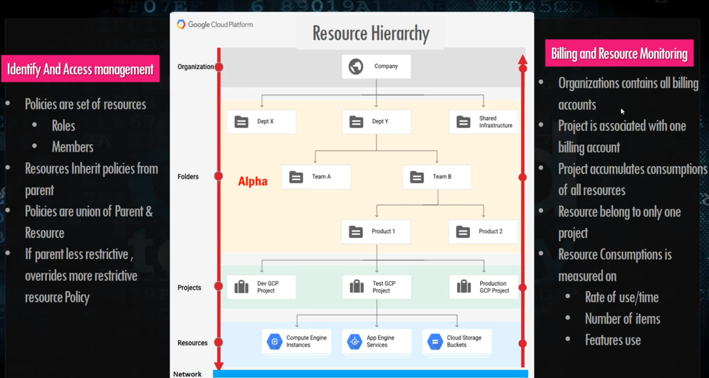


#### Billing account roles
You would surely want to have control over who has access to your billing and who can manage the payments. 

The following list shows the roles that can be used to control the billing:

* **Billing Account Creator**: This is used for the initial billing setup, including signing up for GCP with a credit card.
* **Billing Account Administrator**: This is the owner of a billing account. This role is allowed to link and unlink projects and manage other users' roles for the billing account. This role can manage payment instruments, billing exports, and view cost information.
* **Billing Account User**: In combination with the project creator role, the Billing Account User role is allowed to create new projects linked to the billing account on which the role is granted.
* **Billing Account Viewer**: This role allows access to view the billing information. It can be used by the finance team.
* **Project Billing Manager**: This role enables the attachment of the project to a billing account without rights to resources.


### IAM Roles

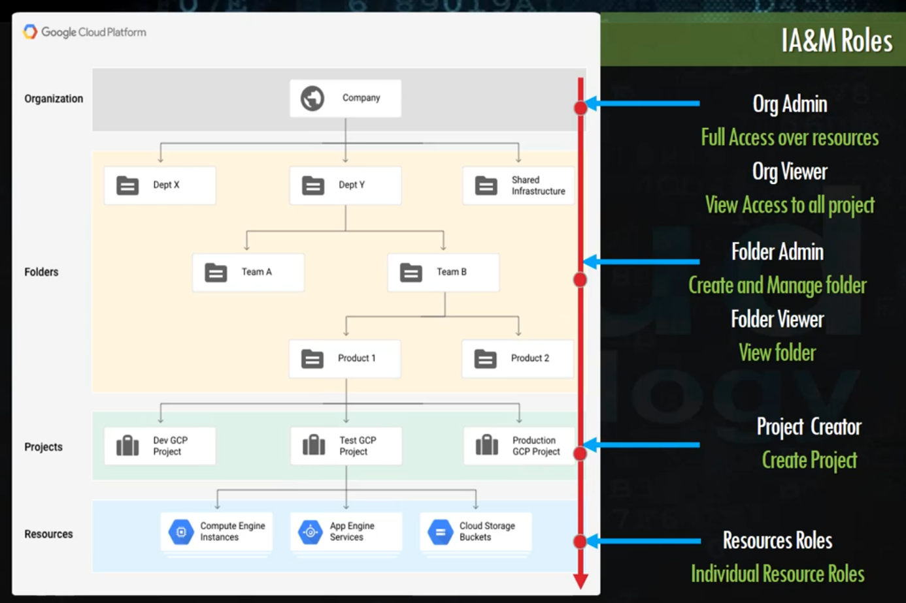


### GCP Quotas

* Caps on resources on a per project basis
* Quota can be increased via support ticket
* Quotas defines limits per resources
* There are different types of quotas defends on type of resources
* Define as Global or Regional limits

**Benefits**

* Controls budget

* Limit resource utilizations on different level

* You can increase any time with console request

  

### Google Cloud Shell

* Web browser access
  Access the Cloud Shell command-line from any browser, anywhere, with an internet connection.

* Persistent storage
  Get 5 GB of persistent storage.

* Secure admin
  Up-to-date, pre-authorized admin tools ready to use.

* Development tools
  Development and deployment tools for all the popular programming languages. Easy web preview enables preview of local changes in a web app from Cloud Shell.

### Google Cloud SDK

- Orchestrate virtual machine instances directly from your command line
- Manage Compute Engine networks, firewalls, and disk storage with the gcloud command-line tool
- Choose your language with Client Libraries for Java, Python, Node.js, Ruby, Go, .NET, and PHP
- Run and simulate local service emulators for Pub/Sub, Cloud Bigtable, and Datastore

**Features**

| Features         | Description                                                  |
| ---------------- | ------------------------------------------------------------ |
| Client Libraries | Cloud SDK comes with installable language-specific Cloud Client Libraries. These libraries use each supported language's natural conventions and styles, handle authentication, reduce the amount of necessary boilerplate code, and optimize the developer workflow. |
| gsutil           | The gsutil tool provides access to Cloud Storage, including a wide range of bucket and object management tasks, directly from the command line. |
| bq               | The bq tool enables running queries and manipulating datasets, tables, and entities in BigQuery through the command line. |
| kubectl          | The kubectl tool provides commands for greater control over Kubernetes clusters. With kubectl, you can deploy applications, inspect and manage cluster resources, and view logs, among a wide set of operations. |
| Cloud Shell      | [Cloud Shell](https://cloud.google.com/shell) provides you with command-line access to your cloud resources directly from your browser. You can easily manage your projects and resources without having to install the Google Cloud SDK or other tools on your system. With Cloud Shell, the Cloud SDK gcloud command-line tool and other utilities you need are always available, up to date, and fully authenticated when you need them. |
| Emulators        | Cloud SDK comes with emulators for products like Bigtable, Datastore, Filestore, and Pub/Sub, for local development, testing, and validation. |


### Cloud Source Repositories

* provides Git version control to support collaborative development

**Key Features**

- Stackdriver Debugger

  Cloud Source Repositories works with Stackdriver Debugger, which lets you inspect the state of Java applications running on Compute Engine and App Engine without stopping them or slowing them down.

- Google-Hosted Repositories

  Cloud Source Repositories are fully-featured private Git repositories hosted on Cloud Platform. Set up a repository as a Git remote. Push, pull, clone and log, and perform other Git operations required by your workflow.

- Connected Repositories

  You can connect Cloud Source Repositories to a hosted repository on GitHub or Bitbucket. When you push a change to the connected repository, it's automatically synced to the Cloud Platform repository, and vice-versa.

- Reliable Storage

  Cloud Source Repositories resides on highly-replicated backend storage systems distributed geographically across multiple data centers and run on infrastructure proven for reliability.


## GCP Compute Service

* Infrastructure as a Service (IaaS): **Google Compute Engine (GCE)**
* Container as a Service (CaaS): **Google Kubernetes Engine (GKE)**
* Platform as a Service (PaaS): **Google App Engine (GAE)**
* Function as a Service (FaaS): **Cloud Functions**


**ServerlessTraffic Splitting**

* Cloud Functions (Functions)
* App Engine (Apps)

**Infrastructure**

* Kebernetes Engine (Containers)
* Comupte Engine (Virtual Machines)


### GCP : Compute Service Summary

**CCE**

* You want full access to VM- OS level Changes, Applications cant be containerized
* Use Case : Any use case requires OS or OS changes or any monothic application wants to move to GCP

**GAE**

* Standard : Very Fast scale-up/Scale down to Zero, No Containers
* Flexible : Just code, Developer-focused, Simpler to code then GKE
* Use Case : Mobile App & Gaming Backend, RESTful API, IOT.

**GKE**

* Multi Cloud, Full control on container orchestration
* Use Case : Containerizedwork load, Cloud Native - Distributed, Hybrid Apps.

**GCF**

* Event Drive, Serverless requirements
* Use Case : Mobile Backend, IOT, API/Microservices, Data Processing / ETL (Extract )

### Google Compute Engine

**Google Compute Engine (GCE)** Infrastructure as a Service (IaaS)

* It allows the most flexibility as it provides compute infrastructure to provision VM instances.

* You have full control of the instance hardware and operating system. 

* You can use standard GCP images or your own custom image. 

* You can control where your VMs and storage are located in terms of regions and zones. 

* You have granular control over the network, including firewalls and load balancing. 

* With the use of an instance group, you can autoscale your control and your capacity as needed.

* is suitable in most cases, but might not be an optimal solution.

#### GCE Resources

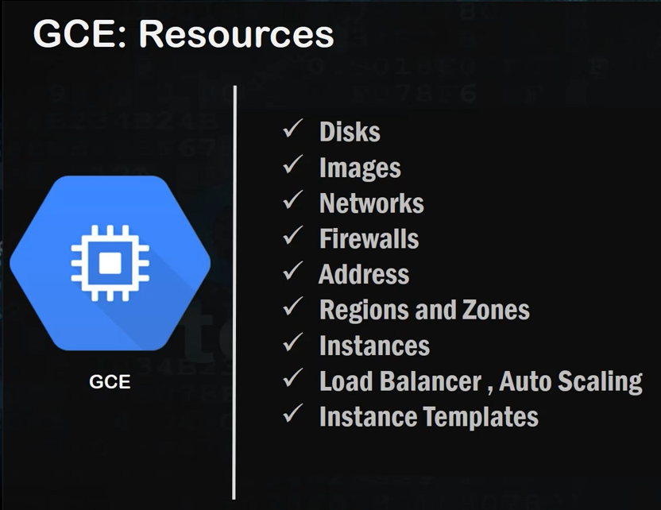


#### GCE Representation

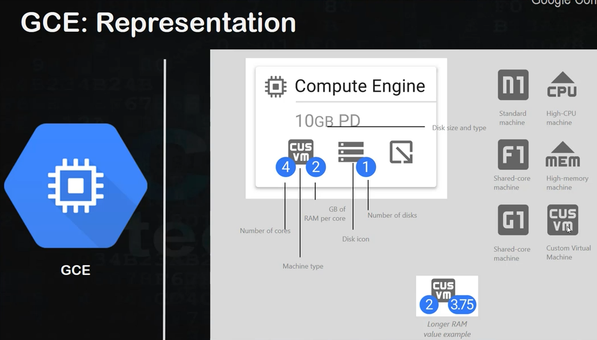


#### GCE Performance

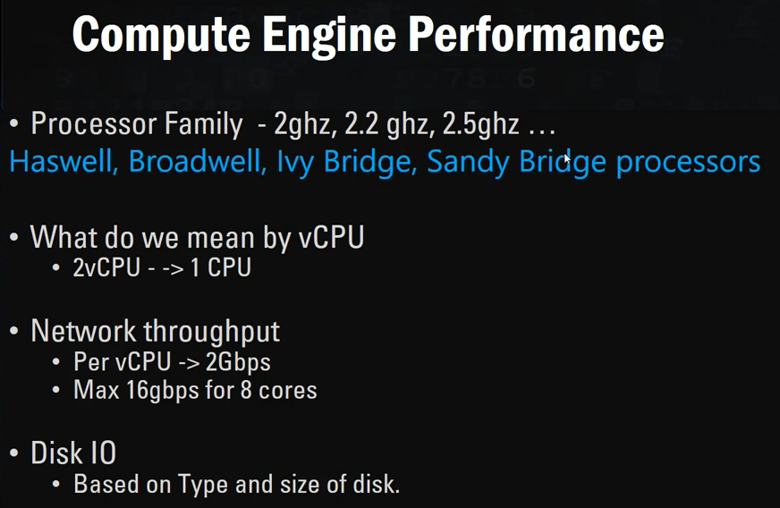


#### Accessing VM


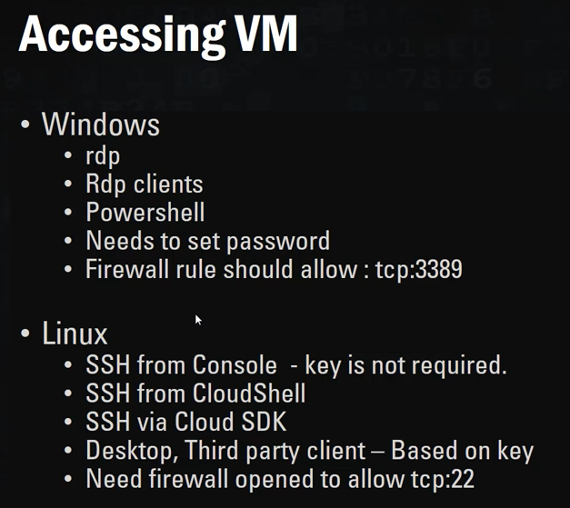


#### GCE Machine Types

- **General-purpose** machine types offer the best price-performance ratio for a variety of workloads.
  - **E2** (no local ssd)machine types are cost-optimized VMs that offer up to 32 vCPUs with up to 8 GB of memory per vCPU. E2 machines have a predefined CPU platform running either an Intel or the second generation AMD EPYC Rome processor. E2 VMs provide a variety of compute resources for the lowest price on Compute Engine, especially when paired with [committed-use discounts](https://cloud.google.com/compute/docs/instances/signing-up-committed-use-discounts).
  - **N2** machine types offer up to 80 vCPUs, 8 GB of memory per vCPU, and are available on the Intel Cascade Lake CPU platforms.
  - **N2D** machine types offer up to 224 vCPUs, 8 GB of memory per vCPU, and are available on second generation AMD EPYC Rome platforms.
  - **N1** machine types offer up to 96 vCPUs, 6.5 GB of memory per vCPU, and are available on Intel Sandy Bridge, Ivy Bridge, Haswell, Broadwell, and Skylake CPU platforms.
- **Memory-optimized (M1, M2)** machine types are ideal for memory-intensive workloads because they offer more memory per core than other machine types, with up to 12 TB of memory.
- **Compute-optimized (C2)** machine types offer the highest performance per core on Compute Engine and are optimized for compute-intensive workloads. Compute-optimized machine types offer Intel Scalable Processors (Cascade Lake) and up to 3.8 GHz sustained all-core turbo.
- **Shared-core** machine types are available in the N1 and E2 families. These machine types timeshare a physical core. This can be a cost-effective method for running small, non-resource intensive applications.
  - **E2: `e2-micro`, `e2-small`, and `e2-medium**` shared-core machine types have 2 vCPUs available for short periods of bursting.
  - **N1: `f1-micro` and `g1-small`** shared-core machine types have up to 1 vCPU available for short periods of bursting.


| E2 General purpose                                           | N2, N2D, N1 General purpose                                  | M2, M1 Memory-Optimized                                      | C2 Compute-Optimized                                         |
| :----------------------------------------------------------- | :----------------------------------------------------------- | :----------------------------------------------------------- | :----------------------------------------------------------- |
| Day-to-day computing at a lower cost                         | Balanced price/performance across a wide range of VM shapes  | Ultra high-memory workloads                                  | Ultra high performance for compute-intensive workloads       |
| Web serving, App serving, Back office applications, Small-medium databases, Microservices, Virtual desktops, Development environments | Web serving, App serving, Back office applications, Medium-large databases, Cache, Media/streaming | Large in-memory databases like SAP HANA, In-memory analytics | High Performance Compute(HPC), Electronic Design Automation (EDA), Gaming, Single-threaded application |


#### Shielded VM

* VM instance with security controls, which will defend against rootkits, bootkits, and kernel-level malware.

#### GCE Persistent Disk

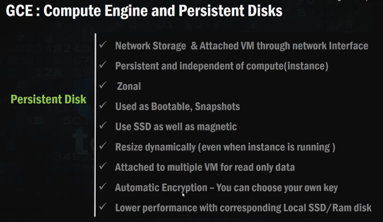


#### GCE Local Disk

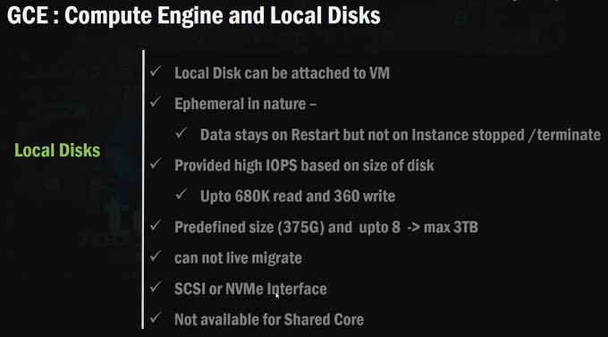


#### GCE : CPU Platforms

* 2.6 GHz Intel Xeon E5 (Sandy Bridge)
* 2.5 GHz Intel Xeon E5 v2 (Ivy Bridge)
* 2.3 GHz Intel Xeon E5 v3 (Haswell)
* 2.2 GHz Intel Xeon E5 v4 (Broadwell)
* 2.0 GHz Intel Xeon (Skylake)


#### GCE: Instance Lifecycle

* **PROVISIONING**. Resources are being allocated for the instance. The instance is not running yet.
* **STAGING**. Resources have been acquired and the instance is being prepared for first boot.
* **RUNNING**. The instance is booting up or running. You should be able to ssh into the instance soon, but not immediately, after it enters this state.
* **STOPPING**: the instance is being stopped. This can be because a user has made a request to stop the instance or there was a failure. This is a temporary status and the instance will move to TERMINATED.
* **TERMINATED**. A user shut down the instance, or the instance encountered a failure. You can choose to restart the instance or delete it.
* **SUSPENDING**. The instance is being suspended. A user has suspended the instance.
* **SUSPENDED**.  The instance is suspended. You can choose to resume or delete it.

```
$ gcloud compute instances list

$ gcloud compute instances describe [Images
Use operating system images to create boot disks for your instances. You can use one of the following image types:

Public images are provided and maintained by Google, open source communities, and third-party vendors. By default, all Google Cloud projects have access to these images and can use them to create instances.
Custom images are available only to your Cloud project. You can create a custom image from boot disks and other images. Then, use the custom image to create an instance.instance-name] 
```


#### GCE Preemtible VM

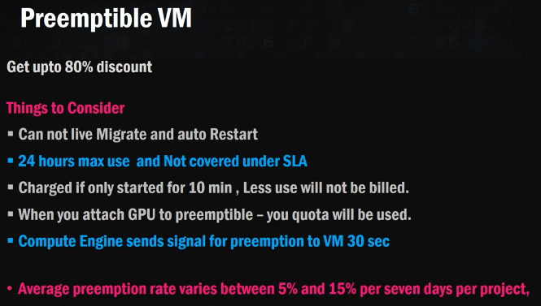


#### GCE Images

2 Types of image:

- **Public images** are provided and maintained by Google, open source communities, and third-party vendors.
- **Custom images** are available only to your Cloud project. You can create a custom image]( from boot disks and other images. Then, use the custom image to create an instance.


#### GCE Instance templates

* is a resource that you can use to create Virtual Machine (VM) instances and managed instance groups (MIGs).
* define the machine type, boot disk image or container image, labels, and other instance properties. 
* An instance template is a global resource that is not bound to a zone or a region. However, you will specify some zonal resources in an instance template, which restricts the template to the zone where that resource resides. For example, if you include a read-only persistent disk from us-central1-b in your instance template, you cannot use that template in any other zone because that specific disk exists only in zone us-central1-b. For more information about zonal resources, see Regions and zones.
* Please note that labels defined within an instance template are applied to all instances that are created from that instance template. The labels do not apply to the instance template itself.


#### GCE Instance Groups

**2 kinds of VM instance groups**

- **Managed instance groups** (MIGs) 
  - let you operate apps on multiple identical VMs. 
  - used for auto-scaling
  - rolling updates can be done
  - changes to instance will make change in all the instances
  - load balancing for only similar resource
  - can make your workloads scalable and highly available by taking advantage of automated MIG services, including: autoscaling, autohealing, regional (multiple zone) deployment, and automatic updating.
  - You can create two types of MIGs:
    - A [zonal MIG](https://cloud.google.com/compute/docs/instance-groups/creating-groups-of-managed-instances), which deploys instances to a single zone.
    - A [regional MIG](https://cloud.google.com/compute/docs/instance-groups/distributing-instances-with-regional-instance-groups), which deploys instances to multiple zones across the same region.
- **Unmanaged instance groups** let you load balance across a fleet of VMs that you manage yourself.
  - use non-identical VM's
  - cannot use auto-scaling
  - rolling updates cannot be used
  - cannot make arbitrary change in any instance
  - can be used for load balancing pre-existing resources or groups of dissimilar resource


#### GCE : Load Balancing

Google Cloud offers server-side load balancing so you can distribute incoming traffic across multiple virtual machine (VM) instances. 

**Load balancing provides the following benefits:**

- Scale your application

- Support heavy traffic

- Detect and automatically remove unhealthy VM instances using [health checks](https://cloud.google.com/load-balancing/docs/health-check-concepts). Instances that become healthy again are automatically re-added.

- Route traffic to the closest virtual machine

  

**Google Cloud offers the following load balancing features:**

- Single IP address to serve as the frontend
- Automatic intelligent autoscaling of your backends
- External load balancing for when your users reach your applications from the internet
- Internal load balancing for when your clients are inside of Google Cloud
- Regional load balancing for when your applications are available in a single region
- Global load balancing for when your applications are available across the world
- Pass-through load balancing (see also *direct server return (DSR)* or *direct routing*)
- Proxy-based load balancing (as an alternative to pass-through)t
- Layer 4-based load balancing to direct traffic based on data from network and transport layer protocols, such as IP address and TCP or UDP port
- Layer 7-based load balancing to add content-based routing decisions based on attributes, such as the HTTP header and the uniform resource identifier
- Integration with [Cloud CDN](https://cloud.google.com/cdn) for cached content delivery


**Types of Cloud Load Balancing**

| Internal or external | Regional or global                    | Supported network tiers | Proxy or pass-through | Traffic type  | Load balancer type |
| -------------------- | ------------------------------------- | ----------------------- | --------------------- | ------------- | ------------------ |
| Internal             | Regional                              | Premium only            | Pass-through          | TCP or UDP    | Internal TCP/UDP   |
| Internal             | Regional                              | Premium only            | Proxy                 | HTTP or HTTPS | Internal HTTP(S)   |
| External             | Regional                              | Premium or Standard     | Pass-through          | TCP or UDP    | TCP/UDP Network    |
| External             | Global in Premium Tier                | Premium or Standard     | Proxy                 | TCP           | TCP Proxy          |
| External             | Effectively regional in Standard Tier | Premium or Standard     | Proxy                 | SSL           | SSL Proxy          |
| External             | Effectively regional in Standard Tier | Premium or Standard     | Proxy                 | HTTP or HTTPS | External HTTP(S)   |


**Global vs Regional Load Balancing**

**Global Load Balancing** 

* when your backends are distributed across multiple regions, your users need access to the same applications and content, and you want to provide access by using a single anycast IP address. 
* can also provide IPv6 termination.

**Regional Load Balancing**

* when your backends are in one region
* only require IPv4 termination.


**External vs Internal Load Balancing**

**External load balancers** 

* distribute traffic coming from the internet to your Google Cloud Virtual Private Cloud (VPC) network.
* requires that you use the Premium Tier of Network Service Tiers. 
* For regional load balancing, you can use Standard Tier.

**Internal load balancers** 

* distribute traffic to instances inside of Google Cloud.


**Network Service Tiers**

**Premium Tier**

* Highest performance: Traffic between the internet and VM instances in your VPC network is routed by keeping it within Google's network as much as possible.
* For services that need global availability
* Unique to Google Cloud
* Premium Tier is the default unless you make configuration changes.

**Standard Tier**

* Cost optimized: Traffic between the internet and VM instances in your VPC network is routed over the internet in general.
* For services hosted entirely within a region
* Performance is comparable to other Cloud providers.


**HTTP(S) LB Basics**

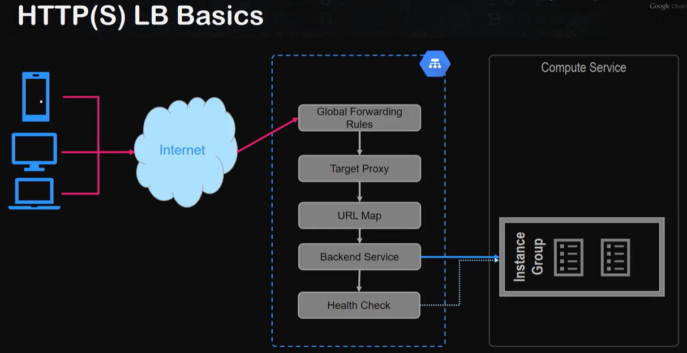


#### GCE: Auto Scaling

* Managed instance groups (MIGs) offer autoscaling capabilities that let you automatically add or delete virtual machine (VM) instances from a MIG based on increases or decreases in load.
* helps your applications gracefully handle increases in traffic and reduce costs when the need for resources is lower
* You define the **autoscaling policy** and the autoscaler performs automatic scaling based on the measured load.
* Autoscaling works by adding more VMs to your MIG when there is more load and deleting VMs when the need for VMs is lowered.
  - **Scaling out/Scaling up** : adding more VMs your MIG when there is more load
  - **Scaling in/Scalling down** : deleting VMs when the need for VMs is lowered

#### GCE : Auto Scaling Polices

Based on the following:

1. **CPU utilization**

- Based on the average CPU utilization of a managed instance group (MIG). 

- tells the autoscaler to collect the CPU utilization of the instances in the group and determine whether it needs to scale.

- set the target CPU utilization the autoscaler should maintain and the autoscaler works to maintain that level.

- The autoscaler treats the target CPU utilization level as a fraction of the average use of all vCPUs over time in the instance group. 

- If the average utilization of your total vCPUs exceeds the target utilization, the autoscaler adds more VM instances. 

- If the average utilization of your total vCPUs is less than the target utilization, the autoscaler removes instances. 

- For example, setting a 0.75 target utilization tells the autoscaler to maintain an average utilization of 75% among all vCPUs in the instance group.

  

2. **Serving capacity of an external HTTP(S) load balancer**

- You can use autoscaling in conjunction with load balancing by setting up an autoscaler that scales based on the load of your instances.

- An external HTTP(S) load balancer distributes requests to backend services according to its URL map. The load balancer can have one or more backend services, each supporting instance group or network endpoint group (NEG) backends. 

- When backends are instance groups, the external HTTP(S) load balancer offers two balancing modes: 

  - **UTILIZATION** : you can specify a maximum target for average backend utilization of instances in the instance group. 

  - **RATE** :  you must specify a target number of requests per second on a per-instance basis or a per-group basis. (Only zonal instance groups support specifying a maximum rate for the whole group. Regional managed instance groups do not support defining a maximum rate per group.)
- The balancing mode and the target capacity that you specify define the conditions under which Google Cloud determines when a backend VM is at full capacity. 
- Google Cloud attempts to send traffic to healthy VMs that have remaining capacity. If all VMs are already at capacity, the target utilization or rate is exceeded.
- When you attach an autoscaler to an instance group backend of an external HTTP(S) load balancer, the autoscaler scales the managed instance group to maintain a fraction of the load balancing serving capacity.
- For example, assume the load balancing serving capacity of a managed instance group is defined as 100 RPS per instance. If you create an autoscaler with the HTTP(S) load balancing policy and set it to maintain a target utilization level of 0.8 or 80%, the autoscaler adds or removes instances from the managed instance group to maintain 80% of the serving capacity, or 80 RPS per instance.

3. **Cloud Monitoring metrics**

- When you scale a MIG based on Monitoring metrics, you can scale based on the following metric types:

  - **Scale using per-instance** : metrics where the selected metric provides data for each virtual machine (VM) instance in the MIG indicating resource utilization.

  - **Scale using per-group metrics (beta)** : where the group scales based on a metric that provides a value related to the whole managed instance group.

- These metrics can be either standard metrics provided by the Cloud Monitoring service, or custom Cloud Monitoring metrics that you create.
- Limitations
  -  You cannot autoscale based on Cloud Monitoring logs-based metrics.
  - Regional managed instance groups do not support filtering for per-instance metrics.
  - Regional managed instance groups do not support autoscaling using per-group metrics.

#### GCE : Auto Scaling Specifications

* Auto scaling only works with manage instance groups. Unmanaged instance groups are not supported.
* Do not use Compute Engine autoscaling with managed instance groups that are owned by Google Container Engine. 
* For Google Engine groups, use **Cluster Auto Scaling**


* **Stateless applications** :  horizontal scaling 

* **Stateful applications** : vertical scaling

  

#### Load Balancing and Auto Scaling Demo

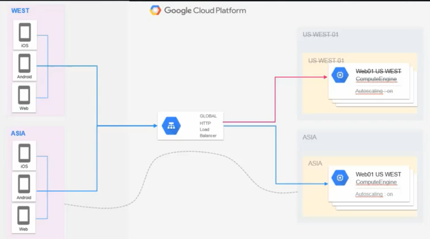VHD


Steps

1. Create instance template for Asia East and US West

* Put the following commands in Automation Startup script  

**Asia East backend**

```
wget frontend_asia.py
sudo python frontend_asia.py &
```

**US West  banckend**

```
wget frontend_uswest.py
sudo python frontend_uswest.py &
```

2. Create instance group for Asia East using the instance template Asia East

3. Create 2 client instance in Asia East and US West using Machine Type f1 micro

   Check connection in Asia East instance group backend

   ```
   Asia East Client
   $ curl [internal IP]
   OK Asia
   
   US West Client
   $ $ curl [internal IP]
   OK Asia
   ```

4. Create HTTP Load Balancer

   Create backend service

   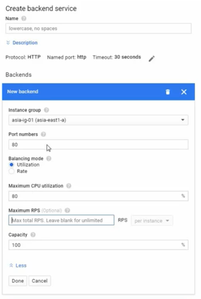

Health check


Frontend configuration

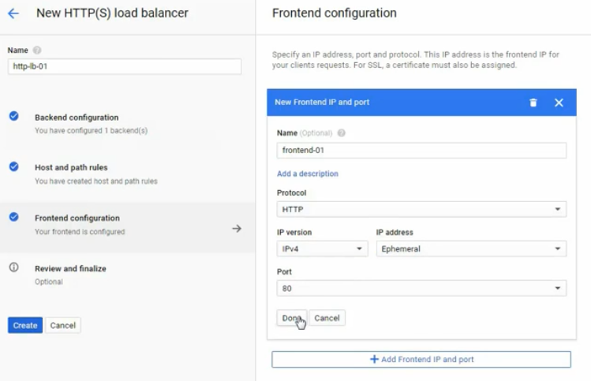


5. Put load on the Load Balancer in both client Asia East and US West

  ```
$ while true; do (curl http://[LB IP]/service), sleep 2; done
  ```


#### Migrate from Cloud Provider to GCP

* **Importing Virtual Disks** - Use import tool supports most virtual disk file formats, including VMDK (Virtual Machine Disk/VMware/VirtualBox), VHD (Virtual Hard Disk/Windows), and RAW(physical IDE or SCSI disk)

* **Velostrata** 
  - agentless cloud migration
  - free to use for customers who are migarting to GCP from another cloud service
* **CloudEndure**
  - agent-based managed service
  - supports on-prem-to-cloud and cloud-to-cloud migrations


#### GCE : Exam Tips

* **Live Migration** 
  - Google also provides **live migration**, which moves VMs to other physical servers when there is a problem with a physical server or scheduled maintenance has to occur. 
  - is also used when network or power systems are down, security patches need to be applied, or configurations need to be modified.

* GCP has 4 main Compute Service 

  **Compute Engine, Kubernetes Engine, App Engine and Cloud Functions**

* Know use case for Compute Engine vs App Engine

* Kubernetes Engine and how it integrates into CI Pipeline

* Microservices/Serverless perhaps we shoul consider Cloud Functions

* Migrate VMS to GCP (**Importing Virtual Disk**, **Velostrata** (agentless), **CloudEndure** (agent-based)VHD)

  

### Google App Engine

**Google App Engine (GAE)**: Platform as a Service (PaaS)

* Build highly scalable applications on a fully managed serverless platform.
* Scale your applications from zero to planet scale without having to manage infrastructure
* Free up your developers with zero server management and zero configuration deployments
* Stay agile with support for popular development languages and a range of developer tools
* It allows you to concentrate on writing your code, while Google takes care of hosting, scaling, monitoring, and updates. 

* It is targeted at developers who do not need to understand the complexity of the infrastructure. 
* GAE offers two types of environments, as follows:
  - **Standard**: With sets of common languages supported
  - **Flexible**: Even more languages, with the possibility of creating a custom runtime
    - With a flexible environment, you lose some out-of-the-box integration, but
      you gain more flexibility. 
    - GAE is tightly integrated with GCP services, including databases and storage. It allows versioning of your application for easy rollouts and rollbacks.

#### GAE : Flexible Environment

* **Customizable infrastructure** - App Engine flexible environment instances are Compute Engine virtual machines, which means that you can take advantage of custom libraries, use SSH for debugging, and deploy your own Docker containers.
* **Performance options** - Take advantage of a wide array of CPU and memory configurations. You can specify how much CPU and memory each instance of your application needs, and the flexible environment will provision the necessary infrastructure for you.
* **Native feature support** - Features such as microservices, authorization, SQL and NoSQL databases, traffic splitting, logging, versioning, security scanning, and content delivery networks are natively supported.
* **Managed virtual machines** - App Engine manages your virtual machines, ensuring that:
  - Instances are health-checked, healed as necessary, and co-located with other services within the project.
  - Critical, backwards compatible updates are automatically applied to the underlying operating system.
  - VM instances are automatically located by geographical region according to the settings in your project. Google's management services ensure that all of a project's VM instances are co-located for optimal performance.
  - VM instances are restarted on a weekly basis. During restarts Google's management services will apply any necessary operating system and security updates.
  - You always have root access to Compute Engine VM instances. SSH access to VM instances in the flexible environment is disabled by default. If you choose, you can enable root access to your app's VM instances.


#### GAE : Standard Environment

* based on container instances running on Google's infrastructure. Containers are preconfigured with one of several available runtimes.
* makes it easy to build and deploy an application that runs reliably even under heavy load and with large amounts of data.
* Applications run in a secure, sandboxed environment, allowing the App Engine standard environment to distribute requests across multiple servers, and scaling servers to meet traffic demands. Your application runs within its own secure, reliable environment that is independent of the hardware, operating system, or physical location of the server.


| Standard Environment                                         | Flexible Environment                                         |
| ------------------------------------------------------------ | ------------------------------------------------------------ |
| Application instances run in a [sandbox](https://en.wikipedia.org/wiki/Sandbox_(computer_security)), using the runtime environment of a supported language listed below. | Application instances run within Docker containers on Compute Engine virtual machines (VM). |
| Applications that need to deal with rapid scaling.           | Applications that receive consistent traffic, experience regular traffic fluctuations, or meet the parameters for scaling up and down gradually. |
| The standard environment is optimal for applications with the following characteristics:<br />Source code is written in specific versions of the supported programming languages : Python 2.7, Python 3.7, Python 3.8, Java 8, Java 11, Node.js 8, Node.js 10, and Node.js 12, PHP 5.5, PHP 7.2, PHP 7.3, and PHP 7.4 (beta), Ruby 2.5, Ruby 2.6 (beta), and Ruby 2.7 (beta), Go 1.11, Go 1.12, Go 1.13, and Go 1.14 (beta) | The flexible environment is optimal for applications with the following characteristics:<br/><br/>Source code that is written in a version of any of the supported programming languages: Python, Java, Node.js, Go, Ruby, PHP, or .NET |
| Intended to **run for free or at very low cost**, where you pay only for what you need and when you need it. For example, your application can scale to 0 instances when there is no traffic. | Runs in a Docker container that includes a custom runtime or source code written in **other programming languages**. |
| Experiences **sudden and extreme spikes of traffic** which require immediate scaling. | Uses or depends on frameworks that include **native code**.  |
|                                                              | Accesses the resources or services of your Google Cloud project that reside in the **Compute Engine network**. |


#### Comparing high-level features


| Feature                                                      | Standard environment                                         | Flexible environment                                 |
| ------------------------------------------------------------ | ------------------------------------------------------------ | ---------------------------------------------------- |
| Instance startup time                                        | Seconds                                                      | Minutes                                              |
| Maximum request timeout                                      | Depends on the runtime and type of scaling.                  | 60 minutes                                           |
| Background threads                                           | Yes, with restrictions                                       | Yes                                                  |
| Background processes                                         | No                                                           | No                                                   |
| SSH debugging                                                | No                                                           | Yes                                                  |
| Scaling                                                      | Manual, Basic, Automatic                                     | Manual, Automatic                                    |
| Scale to zero                                                | Yes                                                          | No, minimum 1 instance                               |
| Writing to local disk                                        | No                                                           | Yes, ephemeral (disk initialized on each VM startup) |
| Modifying the runtime                                        | No                                                           | Yes (through Dockerfile)                             |
| Deployment time                                              | Seconds                                                      | Minutes                                              |
| Automatic in-place security patches                          | Yes                                                          | Yes (excludes container image runtime)               |
| Access to Google Cloud APIs & Services such as [Cloud Storage](https://cloud.google.com/storage/docs), [Cloud SQL](https://cloud.google.com/sql/docs), [Memorystore](https://cloud.google.com/memorystore/docs), [Tasks](https://cloud.google.com/tasks/docs) and others. | Yes                                                          | Yes                                                  |
| WebSockets                                                   | No<br/>Java 8, Python 2, and PHP 5 provide a proprietary Sockets API (beta), but the API is not available in newer standard runtimes. | Yes                                                  |
| Supports installing third-party binaries                     | Yes for Java 8, Java 11, Node.js, Python 3, PHP 7, Ruby 2.5 (beta), Go 1.11, and Go 1.12+. <br />No for Python 2.7 and PHP 5.5. | Yes                                                  |
| Pricing                                                      | Based on instance hours                                      | Based on usage of vCPU, memory, and persistent disks |


#### GAE : Key features

* **Popular programming languages**
  Build your application in Node.js, Java, Ruby, C#, Go, Python, or PHP—or bring your own language runtime.
* **Open and flexible**
  Custom runtimes allow you to bring any library and framework to App Engine by supplying a Docker container.
* **Fully managed**
  A fully managed environment lets you focus on code while App Engine manages infrastructure concerns.
* **Powerful application diagnostics**
  Use Cloud Monitoring and Cloud Logging to monitor the health and performance of your app and Cloud Debugger and Error Reporting to diagnose and fix bugs quickly.
* **Application versioning**
  Easily host different versions of your app, and easily create development, test, staging, and production environments.
* **Traffic splitting**	
  Route incoming requests to different app versions, A/B test, and do incremental feature rollouts.
* **Application security**	
  Help safeguard your application by defining access rules with App Engine firewall and leverage managed SSL/TLS certificates by default on your custom domain at no additional cost.
* **Services ecosystem**	
  Tap a growing ecosystem of Google Cloud services from your app including an excellent suite of cloud developer tools.

#### GAE : How to Deploy

```
Initialize, authorize, and configure gcloud
$ gcloud init

Authorize access for gcloud with Google user credentials and set current account as active
$ gcloud auth login
k
Deploy your app’s code and con fi guration to App E ngine server
$ gcloud app deploy

Viewing your service
$ gcloud app browse
```


#### GAE : Deployments

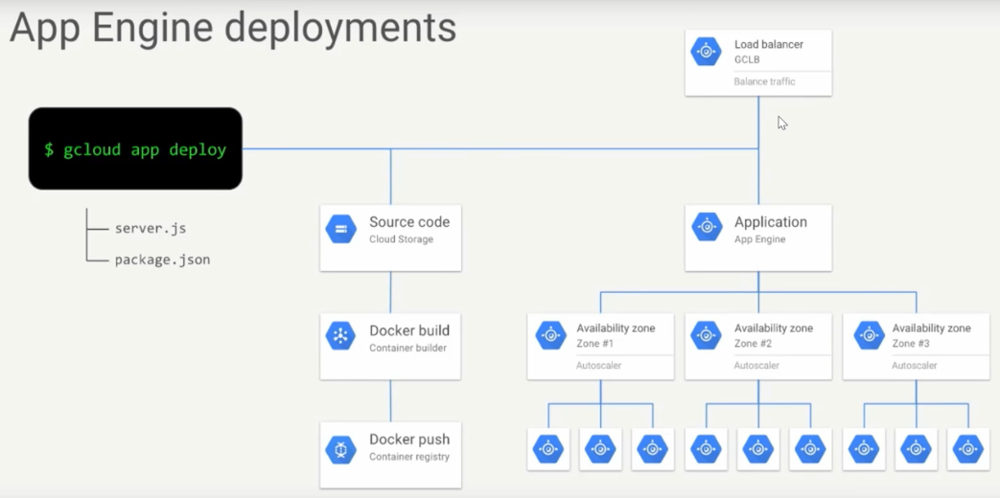


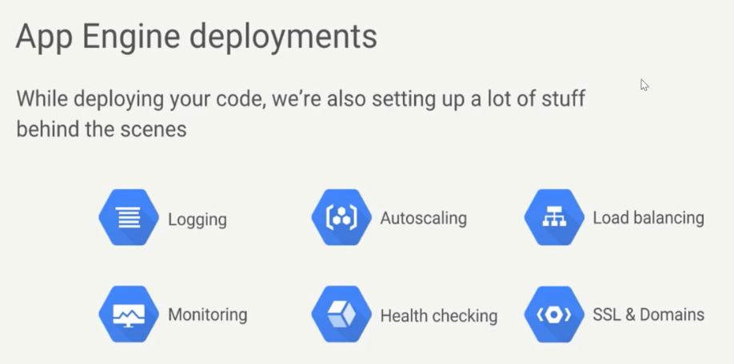


#### GAE : Instance Scaling

* **Automatic scaling**
  Automatic scaling creates instances based on request rate, response latencies, and other application metrics. You can specify thresholds for each of these metrics, as well as a minimum number instances to keep running at all times.

* **Basic Scaling**
  Basic scaling creates instances when your application receives requests. Each instance will be shutdown when the application becomes idle. Basic scaling is ideal for work that is intermittent or driven by user activity.

* **Manual scaling**
  Manual scaling specifies the number of instances that continuously run regardless of the load level. This allows tasks such as complex initializations and applications that rely on the state of the memory over time.

#### GAE : Exam Tips

**Traffic Migration**

* switches the request routing between the versions with a service of your application.
* moving traffic from 1 or more versions to a single new version

**Traffic Splitting**

* is between 2 or more versions of your application for A/B testing.
* is applied that do not explicitly target a version

**Traffic Splitiing Diagram**

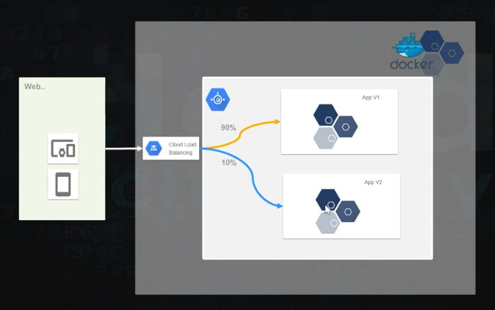


**App Engine**

* Has 2 environment

  **Standard and Flexible**

* Is a **Regional Service**

  Note this for case study questions that have a geographical component around users. **You cannot change an app's region after you set it**.

* Each instance there is an initial start up cost of **15 minutes instance time.**

* Consider the location of the other GCP products and services that are used by the "Case Study".

* A/B Testing and Migration

  
  
#### GAE : Lab


### Google Kubernetes Engine

**Google Kubernetes Engine (GKE)**: Container as a Service (CaaS)

* It allows you to create Kubernetes clusters on demand, which takes away all of the heavy lifting of installing the clusters yourself. 
* It leverages Compute Engine for hosting the cluster nodes, but the customer does not need to bother with the infrastructure and can concentrate on writing the code. 
* The provision cluster can be automatically updated and scaled. 
* The GCP software-defined networks are integrated with GKE 
* Allow users to create network objects, such as load balancers, on demand when the application is deployed. 
* Several services integrate with GKE, such as a **Container Registry**, which allows you to store and scan your container images.

* **PersistentVolumes** : is Kubernetes’ way of representing storage allocated or provisioned for use by a pod. Pods acquire access to persistent volumes by creating a **PersistentVolumeClaim**, which is a logical way to link a pod to persistent storage.
* **StatefulSets** are used to designate pods as stateful and assign a unique identifier to them. Kubernetes uses these to track which clients are using which pods and to keep them paired.
* **Ingress** is an object that controls external access to services running in a Kubernetes cluster. An **Ingress Controller** must be running in a cluster for an Ingress to function.

#### GKE : Introduction

**Kubernetes Master node**

* takes care of maintaining the desired state of the cluster. 
* It monitors the Kubernetes object definitions (YAML files) and makes sure that they are scheduled on
  the worker nodes.

**The master node runs multiple processes:**

1. **API server**: Exposes the Kubernetes API. It is the frontend of the control plane.
2. **Controller manager**: Multiple controllers are responsible for the overall health of
   the cluster.
3. **etcd**: A database that hosts the cluster state information.
4. **Scheduler**: Responsible for placing the Pods across the nodes to balance resource
   consumption.

**Worker nodes**

* are responsible for running containerized applications. 

* are managed by the master node. 

They run the following services:

1. **Kubelet**: This reads the Pod specification and makes sure the right containers run in the Pods. 
2. **Kube-proxy**: This is a network proxy running on each node. It enables the usage of services (we will learn about services shortly).
3. **Container runtime**: This is responsible for running containers. Kubernetes supports multiple runtimes but in the case of GKE, Docker is used.

**Kubernetes objects**

1. **Pods**

   * is the atomic unit of deployment in Kubernetes. 
   * contains one or more containers and storage resources. 
   * has a unique IP address that is shared with the containers inside it. 
   * are ephemeral by nature and are recreated when they need to be rescheduled. 
   * If they use no persistent volumes, the volume content vanishes when a Pod is recreated.

2. **Replica sets**

   - is used to manage the number of Pods that are running at a given time.
   - monitors how many Pods are running and deploys new ones to reach the desired number of replicas.

3. **Deployments**

   - are used to deploy, update, and control Pods. 

   - These deployments create replica sets without the need to define them separately. By stating how many replicas are needed, the appropriate replica set object will be created for you. By changing the image in the container, we can update the application to a new version. 

   - Deployments can be in one of the three states during its lifecycle:

     1. **progressing**
     2. **completed**
     3. **failed**

   - Deployment objects support both Canary and Blue/Green deployment methods.

     **Canary deployment**, we deploy a new version of the application to a subset of users. Once we are sure that the new version works properly, the application is updated for all the users. 

     **Blue/Green deployment**, we use two environments, with only one active at a time. After updating the inactive one to a new version and testing it, we switch the traffic and make it the active one.

4. **Name spaces**

   - are essentially virtual clusters within a Kubernetes cluster. 
   - In big environments, there can be multiple teams developing an application. By creating
     namespaces, users are allowed to reuse the names of resources. The names need to be
     unique within the namespaces but not across the cluster. 
   - By default, a Kubernetes cluster comes with three predefined namespaces:
     - **default** : A default namespace for objects with no other namespace
     - **kube-system** : Used for resources that are created by Kubernetes
     - **kube-public** : Reserved for future use

5. **Services**

   - are used to group Pods into a single endpoint. As we know, Pods come and go.
   - service has a stable IP address, and so requests can be sent to it and forwarded to a Pod.

**Types of services**

1. ClusterIP
   - This is a default service that uses an internal ClusterIP to expose Pods. 
   - This means that services are not available from outside of the cluster. The use case for ClusterIP is internal communication between microservices within the cluster:
2. NodePort
   * This simply exposes each node outside of the cluster. 
   * The Pods can be accessed using <NodeIP>:<NodePort> . If there are multiple nodes, then multiple IP addresses with the same port will be exposed:
3. LoadBalancer
   - This will dynamically create a provider load balancer. 
   - In the case of GCP, a network load balancer is created for you. Remember that it uses objects from outside of Kubernetes and generates additional costs:
4. ExternalName
   - This service is exposed using a DNS name specified in the ExternalName spec. 


### GKE : Type of Workloads

* **Stateless application**
  - does not preserve its state and saves no data to persistent storage — all user and session data stays with the client.
  - Some examples of stateless applications include web frontends like Nginx, web servers like Apache Tomcat, and other web applications.
  - You can create a Kubernetes Deployment to deploy a stateless application on your cluster. Pods created by Deployments are not unique and do not preserve their state, which makes scaling and updating stateless applications easier.
* **Stateful applications**
  - requires that its state be saved or persistent. 
  - use persistent storage, such as persistent volumes, to save data for use by the server or by other users.
  - Examples of stateful applications include databases like MongoDB and message queues like Apache ZooKeeper.
  - You can create a Kubernetes StatefulSet to deploy a stateful application. Pods created by StatefulSets have unique identifiers and can be updated in an ordered, safe way.


#### GKE : Features

| FeatureS                                    | Description                                                  |
| ------------------------------------------- | ------------------------------------------------------------ |
| Identity and access management              | Control access in the cluster with your Google accounts and role permissions. |
| Hybrid networking                           | Reserve an IP address range for your cluster, allowing your cluster IPs to coexist with private network IPs via Google Cloud VPN. |
| Security and compliance                     | GKE is backed by a Google security team of over 750 experts and is both HIPAA and PCI DSS compliant. |
| Integrated logging and monitoring           | Enable **Cloud Logging and Cloud Monitoring** with simple checkbox configurations, making it easy to gain insight into how your application is running. |
| Cluster options                             | Choose clusters tailored to the availability, version stability, isolation, and pod traffic requirements of your workloads. |
| Auto scale                                  | Automatically scale your application deployment up and down based on resource utilization (CPU, memory). |
| Auto upgrade                                | Automatically keep your cluster up to date with the latest release version of Kubernetes. Kubernetes release updates are quickly made available within GKE. |
| Auto repair                                 | When auto repair is enabled, if a node fails a health check, GKE initiates a repair process for that node. |
| Resource limits                             | Kubernetes allows you to specify how much CPU and memory (RAM) each container needs, which is used to better organize workloads within your cluster. |
| Container isolation                         | Use GKE Sandbox for a second layer of defense between containerized workloads on GKE for enhanced workload security. |
| Stateful application support                | GKE isn't just for 12-factor apps. You can attach persistent storage to containers, and even host complete databases. |
| Docker image support                        | GKE supports the common Docker container format.             |
| Fully managed                               | GKE clusters are fully managed by Google Site Reliability Engineers (SREs), ensuring your cluster is available and up-to-date. |
| OS built for containers                     | GKE runs on Container-Optimized OS, a hardened OS built and managed by Google. |
| Private container registry                  | Integrating with **Google Container Registry** makes it easy to store and access your private Docker images. |
| Fast consistent builds                      | Use Cloud Build to reliably deploy your containers on GKE without needing to setup authentication. |
| Workload portability, on-premises and cloud | GKE runs Certified Kubernetes, enabling workload portability to other Kubernetes platforms across clouds and on-premises. |
| GPU and TPU support                         | GKE supports GPUs and TPUs and makes it easy to run ML, GPGPU, HPC, and other workloads that benefit from specialized hardware accelerators. |
| Built-in dashboard                          | Cloud Console offers useful dashboards for your project's clusters and their resources. You can use these dashboards to view, inspect, manage, and delete resources in your clusters. |
| Preemptible VMs                             | Low-cost, short-term instances designed to run batch jobs and fault-tolerant workloads. [Preemptible VMs](https://cloud.google.com/preemptible-vms) provide significant savings of up to 80% while still getting the same performance and capabilities as regular VMs. |
| Persistent disks support                    | Durable, high-performance block storage for container instances. Data is stored redundantly for integrity, flexibility to resize storage without interruption, and automatic encryption. You can create [persistent disks](https://cloud.google.com/persistent-disk) in HDD or SSD formats. You can also take snapshots of your persistent disk and create new persistent disks from that snapshot. |
| Local SSD support                           | GKE offers always-encrypted local solid-state drive (SSD) block storage. Local SSDs are physically attached to the server that hosts the virtual machine instance for very high input/output operations per second (IOPS) and very low latency compared to persistent disks. |
| Global load balancing                       | Global load-balancing technology helps you distribute incoming requests across pools of instances across multiple regions, so you can achieve maximum performance, throughput, and availability at low cost. |
| Linux and Windows support                   | Fully supported for both Linux and Windows workloads, GKE can run both Windows Server and Linux nodes. |
| Hybrid and multi-cloud support              | Take advantage of Kubernetes and cloud technology in your own data center. Get the GKE experience with quick, managed, and simple installs as well as upgrades validated by Google through [Anthos GKE](https://cloud.google.com/anthos/gke). |
| Serverless containers                       | Run stateless serverless containers abstracting away all infrastructure management and automatically scale them with [Cloud Run](https://cloud.google.com/run). |
| Usage metering                              | Fine-grained visibility to your Kubernetes clusters. See your GKE clusters' resource usage broken down by namespaces and labels, and attribute it to meaningful entities. |
| Release channels                            | Release channels provide more control over which automatic updates a given cluster receives, based on the stability requirements of the cluster and its workloads. You can choose rapid, regular, or stable. Each has a different release cadence and targets different types of workloads. |
| Software supply chain security              | Verify, enforce, and improve security of infrastructure components and packages used for container images with Container Analysis. |
| Per-second billing                          |                                                              |


#### GKE : Main Concepts

**Node Pools**

* is a group of nodes within a cluster that all have the same configuration.

**Multi-zone clusters**

* are a way to have nodes from different zones in a single cluster, all controlled by the same master
* are primarily used as a way to improve availability of your application in the unlike event of a zone outage 
* **Cluster AutoScaling 10 minutes**

* to have Container Engine automatically resize clusters based on the demands of the workloads you want to run.

* allows you to pay only for resources that are needed at any given moment, and to automatically get additional resources when demand increases

  **Operating criteria**

  - All replicated Pods can be restarted on some other node, possibly causing a brief disruption. If your services are not disruption-tolerant, using cluster autoscaler is not recommended.
  - Users or administrators are not manually managing nodes; it can override any manual node management operations you perform.
  - All nodes in a single node pool have the same set of labels.
  - Cluster autoscaler considers the relative cost of the instance types in the various pools, and attempts to expand the least expensive possible node pool. The reduced cost of node pools containing preemptible VMs is taken into account.
  - Labels manually added after initial cluster or node pool creation are not tracked. Nodes created by cluster autoscaler are assigned labels specified with `--node-labels` at the time of node pool creation.
  - should not be used with large clusters (more than 100-150 nodes)

#### GKE : Internal Load Balancing

* Creates a private LoadBalancer Ingres IP address in the luster for receiving the traffic on the network within the same compute region.
* You  can create an internal load balancer by adding a **LoadBalancer** spec to your clusters **Service configuration file**
* If your cluster does not have a Service configuration file, you'll need to create one. Then you can create the internal load balancer using the Kubernetes **kubctl** command line interface.

#### GKE : IAM

* Access to GKE is secured with IAM. 

Let's have a look at a list of predefined roles, along with a short description of each:
  * **Kubernetes Engine Admin**: Has the right to access the full management of clusters and their Kubernetes API objects
  * **Kubernetes Engine Cluster Admin**: Has the right to access the management of clusters
  * **Kubernetes Engine Cluster Viewer**: Has read-only access to clusters
  * **Kubernetes Engine Developer**: Has full access to Kubernetes API objects inside clusters
  * **Kubernetes Engine Host Service Agent User**: Has access to the GKE Host Service Agent
  * **Kubernetes Engine Viewer**: Has read-only access to GKE resources


#### GKE : Role Based AccessControl

* Native Kubernetes role-based access control (RBAC) can be used in combination with Cloud IAM. 
* **Cloud IAM** works on a project level. **RBAC** grants permissions to Kubernetes resources. 
* Privileges are granted at the cluster or namespace level. 
* The following is an example of a Role object that grants read access to all the Pods in a mynamespace namespace:

```
kind: Role
apiVersion: rbac.authorization.k8s.io/v1
metadata:
namespace: mynamespace
name: pod-reader
rules:
- apiGroups: [""] # "" indicates the core API group
resources: ["pods"]
verbs: ["get", "watch", "list"]
```


#### GKE : Quotas and Limits

**GKE's per-project limits are:**

* Maximum of 50 clusters per zone, plus 50 regional clusters per region.

**GKE's per-cluster limits are:**

* Maximum of 5000 nodes per cluster.
* Maximum of 1000 nodes per node pool.
* Maximum of 1000 nodes per cluster, if you use the GKE ingress controller.
* Maximum of 110 Pods per node.
* Maximum of 300,000 containers per cluster.


#### GKE vs GAE Standard vs GAE Flexible

|               | Kubernetes Engine | App Engine Standard            | App Engine Flexible             |
| ------------- | ----------------- | ------------------------------ | ------------------------------- |
| Language      | Any               | Java, Pyhton, go, PHP, Node.js | Any                             |
| Service Model | Hybrid            | PaaS                           | PaaS                            |
| Use Case      | Containers        | Web and Mobile                 | Web and Mobile container based. |

#### GKE : Cluster AutoScaling

* Automatically resize clusters based on the demands of the workloads
* Allows you to pay only for resources that are needed
* supports up to 1000 nodes running 30 Pods each
* supports a graceful termination period for a Pod of up to **10 minutes** when scalling down


#### GKE : Exam Tips

* Know the use for containers, pods, cluster
* Any access mounted to a pod, called **Volume** is available to all containers in the pod.
* Kubernetes runs Docker containers
* From a design perspective it is critical to understand how Kubernetes Engine fits into a CI/CD pipeline 
* GCP Services (Cloud Build, Container Registry etc. ) 


### Google Cloud Funtions

Scalable pay as you go **Functions-as-a-Service (FaaS)** to run your code with zero server management.

- No servers to provision, manage, or upgrade

- Automatically scale based on the load

- Integrated monitoring, logging, and debugging capability

- Built-in security at role and per function level based on the principle of least privilege

  

  Key networking capabilities for hybrid and multi-cloud scenarios

* It allows you to concentrate on writing your functions in one of the supported languages. 
* It is ideal for executing simple tasks for data processing, mobile backends, and IoT.
* This service is completely serverless and all of the layers below it are managed by Google.
* The functions can be executed using an event trigger or HTTP endpoint.


 #### GCF : Features

* Mobile Backend

* API and Microservices

* Data Processing and ETL

* Webhooks

* IOT

* True Serverless

* Fully Managed

* 100 millisecond charging

* supports Firebase

  

**Connects and extends services to build complex applications**

-  lets you treat all Google and third-party cloud services as building blocks. 
-  Connect and extend them with code, and rapidly move from concept to production with end-to-end solutions and complex workflows. 
-  Further, integrate with third-party services that offer webhook integrations to quickly extend your application with powerful capabilities.

 **End-to-end development and diagnosability**

* Go from code to deploy, with integrated monitoring. 
* Get full observability and diagnosability for your application with **Cloud Trace** and **Cloud Debugger**. 
* Additionally, get support for local and disconnected development/debugging using open sourced functions framework.

**Scales automatically**	

* Serve users from zero to planet-scale without even thinking about any infrastructure.
* Cloud Functions automatically manages and scales underlying infrastructure with the size of workload.

**No server management**	

* Deploy your code and let Google run and scale it for you. 

* Cloud Functions abstracts away all the underlying infrastructure, so that you can focus on your code and build applications faster than ever before.

**Runs code in response to events**	

* Cloud Functions allows you to trigger your code from Google Cloud, Firebase, and Google Assistant, or call it directly from any web, mobile, or backend application via HTTP.

**Pay only for what you use**	

* You are only billed for your function’s execution time, metered to the nearest 100 milliseconds. You pay nothing when your function is idle. 
* Cloud Functions automatically spins up and backs down in response to events.

**Avoid lock-in with open technology**	

* Use open source FaaS (function as a service) framework to run functions across multiple environments and prevent lock-in. 
* Supported environments include Cloud Functions, local development environment, on-premises, Cloud Run, Cloud Run for Anthos, and other Knative-based serverless environments.


#### GCF : Concepts

**Types of Cloud Functions**

**HTTP functions**

* are invoked by HTTP(S) requests. The **POST** , **PUT** , **GET** , **DELETE** , and **OPTIONS** HTTP methods are accepted.

**Background functions**

* are invoked by events such as changes in the **Cloud Storage bucket**, messages in the **Cloud Pub/Sup** topic, or one of the supported **Firebase** events:

**Events**

- Events can be defined as things happening in or outside the GCP environment. When they
  occur, you might want certain actions to be triggered. 
- An example of an event might be:
  - a file that's been added to Cloud Storage
  
  - a change that was made to your database table, and 

  - a new resource that has been provisioned to GCP

These events can come from one of the following providers:

*  Cloud Storage
* Cloud Pub/Sub
* Stackdriver Logging
* Cloud Firestore
* Firebase Realtime Database, Storage, Authentication

**Triggers**

* For your function to react to an event, a trigger needs to be configured. 
* The actual binding of the trigger happens at deployment time. 


#### GCF : Examples

**Notify users when something interesting happens**

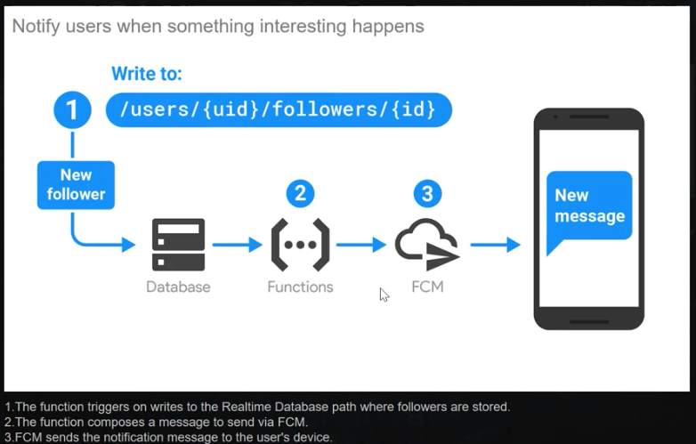


#### GCF : Access Control

* **Cloud Functions Developer**: Has the right to create, update, and delete functions, as well as view source code. Cannot set IAM policies.
* **Cloud Functions Developer**: View function information and edit function settings. Has admin privileges to all resources in the project.
* **Cloud Functions Viewer**: Has the right to view functions. Cannot get IAM policies nor view the source code.


#### GCF : Pricing

**Free tier**

* 2 Million Invocations
* 400000 GB sec
* 200000 GHZ sec
* 5GB egress per month 

**Invocations**

| Invocations per Month | Price/Million |
| :-------------------- | :------------ |
| First 2 million       | Free          |
| Beyond 2 million      | $0.40         |

**Compute Time**

Cloud Functions can be provisioned as one of 5 types:

| Memory | CPU1    | Price/100ms (Tier 1 Price) |
| :----- | :------ | :------------------------- |
| 128MB  | 200MHz  | $0.000000231               |
| 256MB  | 400MHz  | $0.000000463               |
| 512MB  | 800MHz  | $0.000000925               |
| 1024MB | 1.4 GHz | $0.000001650               |
| 2048MB | 2.4 GHz | $0.000002900               |

More generally, the cost of one second of compute time is as follows:


| Unit       | [Tier 1 Pricing](https://cloud.google.com/functions/docs/locations) | [Tier 2 Pricing](https://cloud.google.com/functions/docs/locations) |
| :--------- | :----------------------------------------------------------- | :----------------------------------------------------------- |
| GB-Second  | $0.0000025                                                   | $0.0000035                                                   |
| GHz-Second | $0.0000100                                                   | $0.0000140                                                   |


#### GCF : Exam Tips

* Cloud Function is serverless. Meant for taking cloud services and making them a function.

* Keywords - Microservices, Legacy to Cloud application and Serverless

  

## GCP Storage 

Google Storage as Platform-as-a-Service (PaaS) 


### Cloud Storage

* Scalable, Durable, Multi regional **Object-based Storage**
* is a scalable object storage service suitable for all kinds of unstructured data. 
* It provides you with durable, available, secure and cost-efficient object storage suitable for all
  kinds of workloads.

#### Cloud Storage : When you choose !

* Images, Pictures, Videos Or Objects , Blobs or Unstructured Data
* Storing and Streaming Multimedia
* Storage for custom data analytics pipelines
* Archive, backup, and disaster recovery

####  Cloud Storage : Class

* Multi-Regional
  - Streaming videos and Music, 
  - Serving images and Website content
* Regional
  - Genomic Analysis and Data Transcoding
  - Analytics for ecommerce and IOT
  - Integrated with Cloud DataProc, Cloud ML, BigQuery
* Nearline 
  - data backup, disaster recovery, and archival storage.
* Coldline 
  - Cold Data Storage - Infrequently accessed data -> data stored for legal or regulatory
  - Disaster recovery - In the event of a disaster recovery event, recovery time is key.

#### Cloud Storage Class Summary

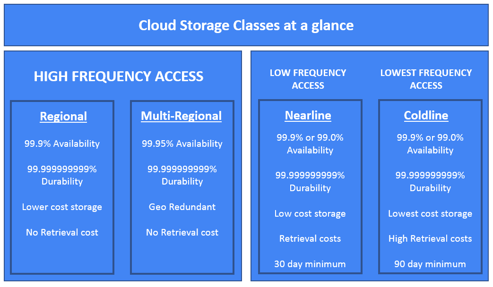

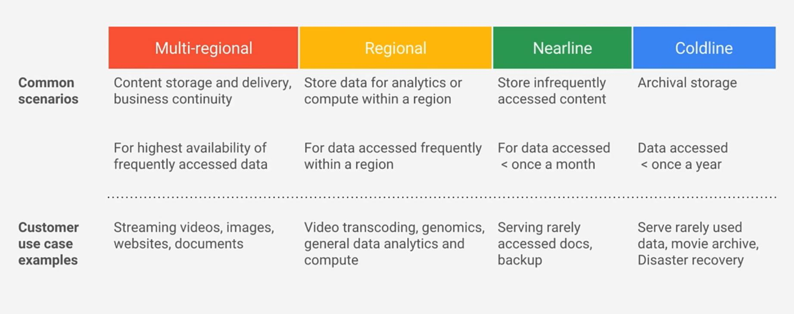


#### Cloud Strorage : Managing Encryption

**Server Side Encryption**

- Google Cloud Storage always encrypts your data on the server side,
  before it is written to disk, at no additional charge
- By default Cloud Storage is to use its server-side encryption keys to
  encrypt your data.
- You can provide your own encryption keys for server-side encryption.

**Client Side Encryption**

- Customer encrypt the before it is sent to Cloud Storage.


#### Cloud Storage : Data Transfer Service

* You can configure it with **Google Cloud console** and **gsutil** or you can create it via program with **Transfer service API**

* **gsutil** :  use when transferring data from an on-premises location

* **Storage Transfer Service** : use  when transferring data from another cloud storage provider

  

#### Cloud Storage : Demo

**gsutils**

```
# Create Cloud Storage Bucket
$ gsutil mb gs://owen-bucket1

# Delete all files and folders in bucket
$ gsutil rm -r gs://owen-bucket1/*

# Delete bucket
$ gsutil rb gs://owen-bucket1

# List buckets
$ gsutil ls gs://owen-bucket

# Enable versioning in bucket
$ gsutil versioning set on gs://owen-bucket

# Show versioning status
$ gsutil versioning get gs://owen-bucket

# Set lifecyle configuration in bucket
$ gsutil lifecycle set <config-json-file> gs://owen-bucket

# Get lifecyle configuration in bucket
$ gsutil lifecycle get gs://owen-bucket

# The following empty lifecycle management configuration JSON document removes all lifecycle configuration for a bucket:
{}

# Show bucket metadata
$ gsutil ls -L -b gs://owen-bucket

# List all files in bucket
$ gsutil ls -lh  gs://owen-bucket

# Upload file
$ gsutil cp note.txt gs://owen-bucket

# Cat file
sherwinowen@owenbox:~$ gsutil cat gs://owen-bucket/note.txt

# Copy folder
$ gsutil cp -r ./conf gs://<bucket-name>/

$ gsutil ls -L -b  gs://owen-bucket
gs://owen-bucket/ :
	Storage class:			STANDARD
	Location type:			multi-region
	Location constraint:		ASIA
	Versioning enabled:		None
	Logging configuration:		None
	Website configuration:		None
	CORS configuration: 		None
	Lifecycle configuration:	None
	Requester Pays enabled:		None
	Labels:				None
	Default KMS key:		None
	Time created:			Sat, 08 Aug 2020 00:42:05 GMT
	Time updated:			Sat, 08 Aug 2020 01:18:48 GMT
	Metageneration:			11
	Bucket Policy Only enabled:	True
	ACL:				[]
	Default ACL:			[]

```


### Cloud Filestore

* Managed NFS server
* is a network-attached storage service that pro-vides a filesystem that is accessible from Compute Engine. 
* Filesystems in Cloud Filestore can be mounted using standard operating system commands.


### Persistent Disk

* Fully Managed Block Storage
* is a high-performance block storage service suitable for Virtual Machines and container storage.
* offers multi-reader mounts and on-demand volume resizing to simplify operations


#### Persistent Disk : When you choose !

* Block storage for Google Compute Engine and Google Container Engine
* Snapshots for data backup
* Sharing read-only data across multiple virtual machines
* Rapid, durable backups of running virtual machines


#### Persistent Disk : Common Use case

* Disks for virtual machines
* Sharing read-only data across multiple virtual machines
* Rapid, durable backups of running virtual machines


**2 Storage options for VM**

* Persistent Disk : network attached storage
* Local SSD : attached to physical server


## GCP : Database Service

Platform as a service (PaaS) for Database 

* **Cloud SQL**

  Fully Managed MySQL & PostgreSQL RDBMS

  - Websites, blogs, and CMS, Business Intelligence (BI) Applications
  - ERP, CRM, and eCommerce applications, Geospatial applications

* **Cloud Spanner**

  - is a fully managed, mission-critical relational database service built from the ground up and battle tested for transactional consistency, high availability, and global scale.

  - All RDBS Requirement
  - Mission-critical applications High transactions
  - Scale + Consistency requirements
  - Adtech, Financial, Global supply chain Retail

* **Cloud Memorystore**

  - Managed Redis and Memcached
  - to reduce the number of reads against the database.
  - a memory cache to store state data outside of instances

* **Cloud Datastore** (like MongoDB)

  - Fully Managed NoSQL Database – Document DB.

  - Hierarchical data Durable key-value data
  - Semi-structured application data
  - User profiles, Product catalogs, Game state

* **Cloud BigTable**

  - Fully Managed NoSQL – Column DB
  
  - Low-latency read/write access High-throughput analytics.
  - Personalization, recommendations, Monitoring
  - Geospatial datasets Graphs
  - Native time series support IoT, finance, adtech
  - is a scalable, wide-column database designed for low-latency writes, making it a good choice for time-series data
  - **cbt**  commad line tool for Bigtable

* **BigQuery**

  - fully managed, low cost analytics data warehouse. 
  - there is no infrastructure to manage
  - fits well with its capabilities as an analytic database
  - **bq**  commad line tool for BigQuery
  - **bq --dry-run** returns an estimate of the number of bytes that would be returned if the query were executed

* **Cloud Storage for Firebase**

* **Firebase Realtime DB**

  - Data is stored as JSON and synchronized in realtime to every connected client.
  - When you build cross-platform apps with our iOS, Android, and JavaScript SDKs, all of your clients share one Realtime Database instance and automatically receive updates with the newest data


**Storage & Database Porfolio**

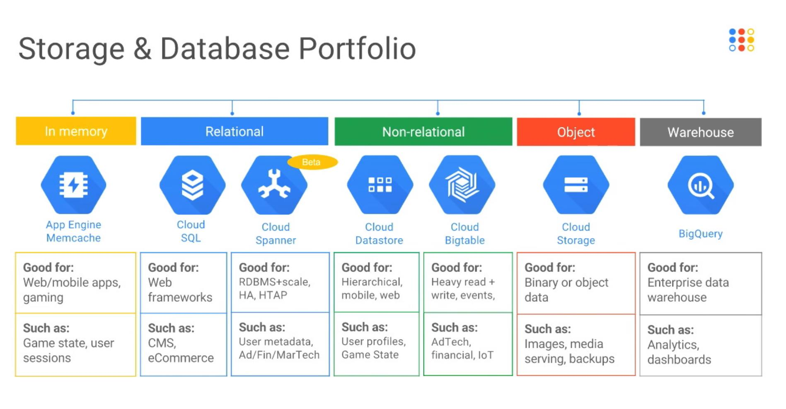

#### Google Cloud SQL : Supported Versions

* MySQL 5.6 and 5.7 (default). 
  - Second Generation - up to 208 GB of RAM & 10 TB data storage
  - First Generation - up to 16 GB of RAM & 500 GB data storage
* PostgreSQL 9.6, 10, 11, and 12 (default). 
* SQL Server 2017 Standard (default), SQL Server 2017 Enterprise, SQL Server 2017 Express, and SQL Server 2017 Web


#### Google Cloud SQL  : Exam Tips

* can accommodate up to 10 TB of storage. 
* If you need to handle larger amounts of data, then you(B) should look at alternative services, such as Cloud Spanner.


#### Google Cloud Spanner 

* With capacity for petabytes of storage, 
* can meet requirements of over 10 TB of data, which Cloud SQL cannot achieve.
* With horizontal scalability, it will also support applications hosting across multiple regions. 
* Remember that Cloud Spanner is ideal for workloads that require strong consistency.
* 2K QPS


#### Google Cloud Bigtable

* is a petabyte-scale, fully managed NoSQL database service for large analytical and operational workloads. It is ideal for ad tech, Fintech, and IoT.
* High volumes of time-series data need low-latency writes and scalable storage
* **cbt**  commad line tool for Bigtable

* Low-latency read/write access
* High-throughput analytics
* Native time series support

* IoT, finance, adtech (Advertising Technology)
* Personalization, recommendations
* Monitoring
* Geospatial datasets
* Graphs
* Time-series

#### Google Cloud Bigtable : 2 instance types

**Production**

* This is a standard instance with one or two clusters, as well as three or more nodes in a cluster. 

* We are unable to downgrade a production instance to a development instance once it's deployed.

**Development**

* This is a low-cost instance and is used for development and testing. 
* Performance is equivalent to a one-node cluster, and Google offers no SLA guarantees. 
* We can, however, upgrade to a production instance if needed.


#### Google Cloud Bigtable : Exam Tips

* Remember that a development instance offers Bigtable at a lower cost but has no SLA. 
* The HDD storage tier will also cost less but will not be as performant. 
* Ensure that you are meeting requirements when you're selecting production or development instance types.


#### Cloud Datastore 

* is a managed document database and a good fit for storing documents.

* Semi-structured application data

* is a kind of NoSQL database that uses a flexible JSON-like data structure

* Hierarchical data

* Durable key-value data

* User profiles

* Product catalogs

* Game state

  


## GCP Networking

### Virtual Private Cloud (VPC)

* Managed networking functionality
* you can provision your Google Cloud Platform resources, connect them to each other and
  isolate them from one another.


#### GCP VPC

* Provision your Google Cloud Platform resources – Private Cloud
* Connect them to each other - **Networking**
* Isolate them from one another - **Firewall**
* You can also define fine-grained networking policies with Cloud Platform, on-premise or other public cloud infrastructure.
* omprehensive set of Google-managed networking capabilities, including granular IP address range
  selection, routes, firewall, Virtual Private Network (VPN) and Cloud Router.


#### GCP VPC : Components

* Networks
* Subnetworks
* Routes
* Firewall
* IP Address


#### GCP VPC : Summary

- You can create up to **5 networks** per project
- **Default mode VPC** 
  - Subnet's are created by default per region/zone
  - Internet gateway also created
  - Firewalls are opened between subnets so that all resources can communicate
- **Auto mode VPC** 
  - Single subnet per region
  - Default Network is auto mode
  - Predefined IP range
- **Custom mode VPC** 
  - Manually created subnets can use any valid RFC1918 IP range.
  - Ranges do not have to be contiguous between subnets.
- **7000 VMs** per VPC network
- Subnets are bound to regions
- Each subnet defines a private IP address range
- Subnets are used for resource management
- Networks can span multiple regions around the world
- **Shared VPC** allows a network to be shared across multiple projects in a single organization
- **VPN tunnel** can be used to connect 2 separate organizations
- Machines in different networks can only communicate with public IPs
- Machines without a public IP can only be accessed within a network


#### GCP VPC : IP Addresses

* You can assign certain resources with IP addresses , You can assign external and internal IP addresses to Compute Engine (VM) , forwarding rule for external or internal Load balancing resp.
* Each VM has one primary – internal IP address, one or more secondary IP addresses and one external IP address
* To communicate with VM within VPC you can use internal IP address and to communicate with internet you must use external IP address
* Both internal and external IP addresses can be static or ephemeral (temporary)


### Private IPv4 addresses

| RFC1918 name | IP address range              | Number of addresses |
| :----------- | :---------------------------- | :------------------ |
| 24-bit block | 10.0.0.0 – 10.255.255.255     | 16777216            |
| 20-bit block | 172.16.0.0 – 172.31.255.255   | 1048576             |
| 16-bit block | 192.168.0.0 – 192.168.255.255 | 65536               |


**Internal IP Addresses**

* Allocated from subnet range to VM by DHCP 
* DHCP reservation is renewed every 25 hour 
* VM Name + IP is registered with network scoped DNS 
* Static IP stays with VM until VM is removed and ephemeral IP is attached to vm/forwarding rules and only stays until VM is stopped or restarted or instance is terminated.

**External IP Address**

* Assigned from pool (ephemeral) If you turn off & on machine – you get new IP
* Reserved (Static) – Billed when not attached to running VM
* VM doesn’t know External IP, It is mapped to the internal IP.


**DNS Resolution for internal IP address**

* Each Instance has hostname that can be resolved to an internal IP address.

  - Hostname is the same as the instance name
  - FQDN is hostname.c.project-id.internal

  - Name resolutions is handled by internal DNS resolver
    -  Provided as part of compute engine
    - Configured for use on instance via DHCP
    - Provided answer for internal and external addresses
    - You can use an alternative DNS resolver if you prefer

**DNS Resolution for External IP address**

* Instances with external IP addresses can allow connections from hosts outside the project/network
  - Users connect directly using external IP address
  - Admins can also publish public DNS records pointing to instance
  - Public DNS records are not published automatically
  
* DNS record for external IP address can be published using **external DNS server (outside GCP)**
* DNS Zone can be hosted using **Cloud DNS** – **GCP service**
  - Create zone and configure domain DNS to use
  - Create , Update , Remove records manually via API.


#### GCP VPC : ROUTES & FIREWALL RULES

**Routes**

* Egress traffic routing

**Firewall**

* Ingress & egress traffic control


#### Affiliated resources : Routes

* All network have automatically created routes to the internet and IP range in network
* The subnet routes let instances send traffic to any other instance or resource in the same VPC network.
* The default route let instances send traffic outside the VPC network
* Name automatically generated
* Applies to traffic egressing a VM
* Forward traffic to most specific route
* Traffic is delivered only if it also matched a firewall rules (ingress)
* Created when subnet is created
* Applies to tagged VM as well
* Enable VM on same subnet to communicate


#### Firewall Rules
* Each network has its own firewall controlling access to and from the instances

* You can have “allow” rules , no “deny’ rules

* The default network has automatically created firewall rules that are shown in default firewall
  rules

* No manually created network has automatically created firewall rules except for a default
  "allow" rule for outgoing traffic and a default "deny" for incoming traffic.

* Tags :

  - Rules can match tags

  - Tags are used defined Strings

  - Tags are applied to VM and not to IP.

    

#### GCP VPC : Quotas and Limits

* VPC do not support IPV6 at within the network
* VPC only support IPv4 Unicast, Multicast are not supported
* VPC network can have max **7000 VM instances** (you can not extend this number)
* There is no per subnet limit, Limit only at network (VPC)


#### Shared VPC

* In this model, we have a single VPC that is shared between different projects. 
* The project where the shared VPC is created is called the **host project**. 
* The projects that can use the VPC are called **service projects**. 
* In the following diagram, Recommendation, Personalization, and Analytics are service projects:

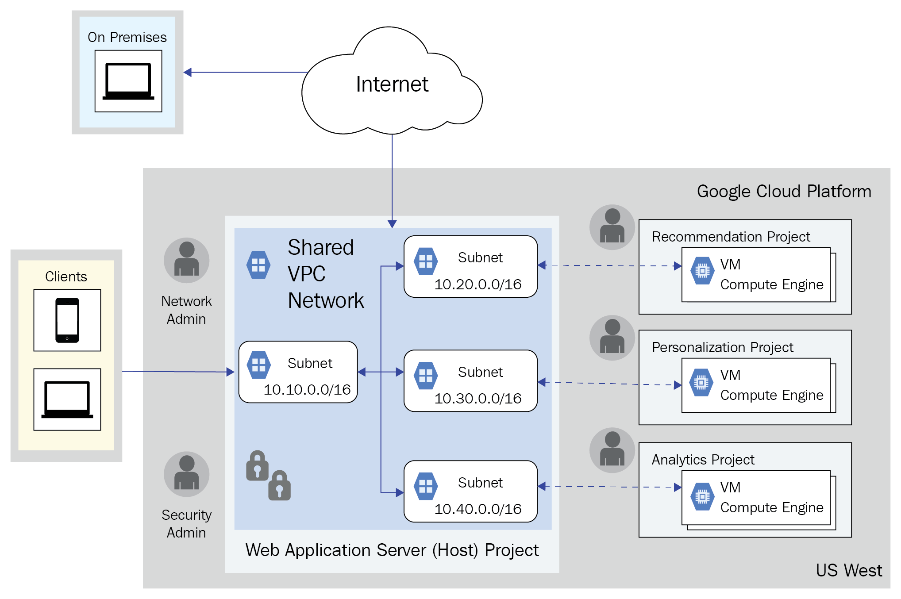

To create a shared project, a shared VPC admin role is required ( roles/compute.xpnAdmin ). The shared VPC admin can further delegate the permissions to the following:

* **Network Admin**: Full control over networks, excluding firewall rules and SSL certificates
* **Security Admin**: Control over firewall and SSL certificates


#### VPC Peering

* enables different VPC networks to communicate using private IP address space, as defined in RFC 1918.
*  VPC network peering is used as an alternative to using external IP addresses or using VPNs to link networks. 
* The following are three primary advantages of VPC network peering:
  * There is lower latency because the traffic stays on the Google network and is not sub-
    ject to conditions on the public Internet.
  * Services in the VPC are inaccessible from the public Internet, reducing the attack sur-
    face of the organization.
  * There are no egress charges associated with traffic when using VPC network peering.


### Cloud Content Delivery Network (CDN)

* Low-latency, Low-cost Content Delivery

* leverages Google's globally distributed edge caches to accelerate content delivery for websites and applications served out of Google Compute Engine.

* lowers network latency, offloads origins, and reduces serving costs. 

* Once you've set up HTTP(S) Load Balancing, simply enable Cloud CDN with a single checkbox


### Google Cloud Hybrid Connectivity

* Connect your infrastructure to Google Cloud Platform (GCP) on your terms, from anywhere.


#### Cloud Interconnect

* Connect Infrastructure at googles network edge with enterprise-grade interconnect

* Cloud platform customers to connect to Google via enterprise-grade connections with higher availability and/or lower latency than their existing Internet connections.

* With SLA

  

**Dedicated Interconnect**

* A direct connection to Google.
* Traffic flows directly between networks, not through the public internet.
* 10 Gbps or 100 Gbps circuits with flexible interconnect attachment (VLAN) capacities from 50 Mbps to 50 Gbps.
* Extend your network with GCP using colocation facility with SLA 99.9/99.99 (configurable)

**Partner Interconnect**

- More points of connectivity through one of our supported service providers.
- Traffic flows between networks through a service provider, not through the public internet.
- Flexible capacities from 50 Mbps to 10 Gbps.


#### Peering

* Access Google and Google Cloud features over VPN or the internet, while cutting egress fees. If you can meet Google's requirements, connect directly with Direct Peering, or choose a partner with Carrier Peering.
* Without SLA

**Direct Peering**

* Private enterprise-grade connection between you and Google for your hybrid cloud workloads 

* Access Google and GCP with reduced egress fees (67%) compared with VPN or Internet

**Carrier Peering**

* Enterprise-grade connection through the largest partner network of service providers.

* If you can not meet Direct peering req. –use carrier peering to access GCP/Google


#### Cloud VPN

* 1.5 - 3 Gbps per tunnel

* Securely connect on-premises network to GCP VPC through IPsec VPN.
* High Throughput via IP Sec Tunnels
  
  - IKEv1 and IKEv2 supported
  
  - Can run over Cloud Interconnect
  
* ECMP over multiple VPN tunnels to achieve greater overall throughput
* Traffic is encrypted by VPN gateway
* Supports Static and Dynamic routing via Cloud Route
* High Throughput, Secure, Reliable and Managed Service
* SLA of 99.9% Service Availability
* You pay for individual tunnel.
* VPN utilize edge locations across globe
* Cloud VPN uses ESP in Tunnel mode with authentication. Cloud VPN does not support AH or ESP in Transport mode.


#### Cloud Router

* Cloud Router is a fully distributed and managed Google cloud service. It scales with your network traffic; it's not a physical device that might cause a bottleneck.

* When you extend your on-premises network to Google Cloud, use Cloud Router to dynamically exchange routes between your Google Cloud networks and your on-premises network

* Cloud Router peers with your on-premises VPN gateway or router. The routers exchange topology information through Border Gateway Protocol (BGP)

  

### Cloud DNS

* Reliable, Resilient, Low-latency DNS serving
* is a scalable, reliable and managed authoritative Domain Naming System (DNS) service running on the same infrastructure as Google.
* It has low latency, high availability and is a cost-effective way to make application and services available to your users.


**Cloud Run**: Function as a Service (FAAS)

* it allows you to define containers that will listen for HTTP requests. 
* This allows you to use languages that are not supported by Cloud Functions.


**VMware Engine**

- Get started quickly by migrating your VMware environment with just a few clicks
- Migrate and run your VMware workloads without refactoring your applications
- Run on a fully managed, native VMware Cloud Foundation software stack
- Leverage existing tools to simplify management across hybrid cloud environments
- Unlock intelligent insights from your existing data with native services


## GCP : Identity and Security

### Types of service accounts

* User-managed
* Google-managed
* G Suite


### GCP : Identity and AccessManagement (IAM)

* Fine-grained access control and visibility for centrally managing cloud (GCP) resources
* Cloud IAM enables you to grant access to cloud resources at fine-grained levels, well beyond
  project-level access.
* Cloud IAM provides a simple and consistent access control interface for all Cloud Platform
  services
* Multiple level of access permissions from individual object/instance to organizations level


|                             WHO                              |        CAN DO WHAT         |             ON WHICH RESOURCES             |
| :----------------------------------------------------------: | :------------------------: | :----------------------------------------: |
|                        Accounts/User                         | IAM Policies / Permissions |                GCP Resource                |
| Admin Console, Google Accounts, Service Accounts, Cloud Directory |  Create , Read, Execute..  | Virtual Machine, App Engine, Cloud Storage |


####  GCP IAM : Roles

**Primitive Roles**

- which include the Owner, Editor, and Viewer roles that existed prior to the introduction of IAM.
- Are project-wide roles
- Project viewer can see everything in a project
- Project editor can change everything in a project
- Project owner has all rights of editor and can add members
- The primitive roles do not provide fine-grained control over what members can do

**Predefined Roles**

- which provide granular access for a specific service and are managed by Google Cloud.
- One role can’t remove permissions granted by another role
- For example, if you make someone a Project Owner and a Storage Viewer, they have read-write access to storage
- App Engine Admin, BigQuery User, or DataStore Viewer are examples of predefined roles
- Many predefined roles exist
- Principle of least privilege

**Custom roles**

* which provide granular access according to a user-specified list of permissions.


#### GCP IAM : Features

* Manage Networking for your resources
* Built in Audit Trail
* Fine grained resource Control
* Access Control Your own way


### GCP : Cloud Key Management Service / Cloud KMS

* Manage encryption keys on Google Cloud.


### GCP : Cloud Security Scanner

* App engine security scanner

  

## GCP : Management Tools

* Tools to help you Develop, Deploy and Manage your cloud apps


### Google Stackdriver

* Monitoring, logging, and diagnostics for applications on Cloud Platform and AWS or any Hybrid Cloud env.

  

#### Stackdriver Monitoring

- Platform System & Application Metrics
- Uptime/health Checks
- Dashboards
- Alerts

* Full-Stack Monitoring

* For Cloud Platform, AWS, and Hybrid Deployments

* Identify Trends, Prevent Issues

* Reduce Monitoring Overhead

* Improve Signal-to-Noise

* Fix Problems Faster

##### Stackdriver Monitoring  : Features

* Dynamic Configuration with defaults
* Monitors almost all the components -
* Metrices – Ingest data and generate insights
* Uptime/health Checks
* Custom Metrics
* Alerts
* Logging Integration


#### Stackdriver : Pricing


  

#### Stackdriver Logging

* Store, search, analyze, monitor, and alert on log data and events from GCP and AWS

- Platform System & Application Logs
- Log search/view/filter
- Logs-based metrices
- Real-time Log Management and Analysis
- Seamlessly Resolve Issues
- Scalable and Fully Managed
- All Your Cloud Logs In One Place
- Real-time Insight

#### Stackdriver Logging :Features

* Custom Logs / Ingestion API
* AWS Integration / Agent
* Logs Retention – 30 days retention – Longer period you can use Cloud Storage
* Logs Search
* Logs Based Metrics
* Logs Alerting
* Advanced Analytics with BigQuery
* Archive with Cloud Storage
* Stream Logs with Cloud Pub/SubStream
* Splunk & Logentries Integration
* Audit Logging

#### Stackdriver Looging : Log Types

**Audit Logs**

- Audit logs are found in IAM
- Admin Activity/System Eventlogs - Admin actions and API calls, System events - GCE system event

**Data Access Logs**

- API calls that create modify or read user provided data
- Charge if beyond free limits

**Agent Logs**

- agent installs on VMs
- Logs 3rd-party apps
- Charge if beyond free limits


#### StackDriver Error Reporting

* Identify and understand your application errors.

* Error Notifications
* Error Dashboard
* Real-time Exception Monitoring and Alerting
* Quickly Understand Error
* Automatic and Real Time
* Instant Error Message
* Popular languages

#### StackDriver Error Reporting: Features

* Real time processing
* Aggregation
* Filtering
* Error Details
* Stack Trace Exploration
* Alerts
* Issue Tracker Integration
* Mobile application
* Easy Setup


#### StackDriver Trace

* Find performance bottlenecks in production.

* Latency Reporting

* Per-URL Latency sampling

* Distributed Tracing for everyone

* Broad Platform Support

* Fast , Automatic Issue Detections

* Integrated into App Engine Standard - automatically enabled

* Available for GCE, GKE, and GAE (Flex)

* Traces are stored for 30 days.

* Pricing : Free

  

> 

#### StackDriver Trace : Features

* Easy Set Up
* Automatic Analysis
* Latency Shift Detection – Google App Engine, HTTPS Load balancer and application use Stackdriver SDK.
* Performance Insights
* Extensibility For Custom Workloads


#### StackDriver Trace : Why

Stackdriver Trace can help you answer the following questions:

* How long does it take my application to handle a given request?
* Why is it taking my application so long to handle a request?
* Why do some of my requests take longer than others?
* What is the overall latency of requests to my application?
* Has latency for my application increased or decreased over time?
* What can I do to reduce application latency?


#### StackDriver Debug

* Investigate your code’s behavior in production

- Production Debug snapshots
- Conditional Snapshots
- IDE Integration
- Inspect your application without too much slowing down
- Supports App Engine and Java, Python or Go
- Captures all stack and local variables of application
- Inject logging into a service without stopping it.


* **Application Layer Transport Security (ALTS)** is a Google developed authentication and encryption system used for securing application layer.


### Cloud Deployment Manager (Infrasture as Code/IaC)

* Create and manage cloud resources with simple templates

#### Cloud Deployment Manager : Features

* **Parallel deployment**
  Deploy many resources at one time, in parallel.

* **Templates**
  Python and Jinja2 template to programmatically control what gets deployed.

* **Updates**
  Add, delete, or change resources in the deployment.

* **Input and output parameterslo**
  Pass variables (e.g. zone, machine size, number of machines, state: test, prod, staging) into your templates and get output values back (e.g. IP address assigned, link to the instance).

* **Schema files**
  JSON schema for defining and constraining parameters.

* **References**
  One resource definition can reference another resource creating dependencies and controlling the order of resource creation.

* **Preview mode**
  See what changes Deployment Manager will make on a create or update operation before you commit the changes.

* **Console UI**
  View your deployments in the Google Cloud Console where you can see one view of your whole deployment in a hierarchical view.


### Cloud Endpoint

* Develop, deploy and manage APIs on any Google Cloud backend
* Manage your APIs
* Protect your API
* Lightning fast
* World class monitoring
* Choose your own framework

#### Cloud Endpoint : Features

**User authentication**
JSON Web Token validation and a streamlined developer experience for Firebase Authentication, Google Auth, and Auth0.

**API keys**
Generate API keys in Google Cloud Console and validate on every API call. Share your API with other developers to allow them to generate their own keys.

**Automated deployment**
With App Engine, the proxy is deployed automatically with your application. On Google Kubernetes Engine or Compute Engine, use our containerized ESP for simple deployment.

**Easy integration**
Get started fast by using one of our Cloud Endpoints Frameworks or by simply adding an OpenAPI specification to your deployment.

**Logging and monitoring**
Monitor traffic, error rates, and latency, and review logs in Cloud Logging. Use Cloud Trace to dive into performance and BigQuery for analysis.


## Big Data Solutions - PaaS

### Google Big Query

* Fully-managed enterprise data warehouse for large-scale data analytics
* fully managed, petabyte scale, low cost enterprise data warehouse for analytics. 
* Serverless : There is no infrastructure to manage and you don't need a database administrator, so you can focus on analyzing data to find meaningful insights using familiar SQL.


#### Google Big Query : Features

* Flexible Data Ingestion
* Global Availability
* Security & Permissions
* Cost Controls
* Highly Available
* Fully Integrated
* Connect with Google Products
* Automatic Data Transfer Service


### Google Cloud Dataflow (Apache Beam)

* Stream(real time) and Batch(historical) data processing
* is a service based on Apache Beam, which is an open source software for creating data processing pipelines
* offers a unified programming model and a managed service for executing a wide range of data processing patterns including streaming analytics, ETL (Extract, Transform and Load), and batch computation
* is a batch and stream processing service that can be used for transforming data before it is loaded into a data warehouse.

#### Google Cloud Dataflow: Features

* Automated Resource Management

* Dynamic Work Rebalancing

* Reliable & Consistent Processing

* Horizontal Auto-scaling

* Unified Programming Model

* Community-driven Innovation

  

### Google Cloud Dataproc

* A faster, easier, more cost-effective way to run **Spark and Hadoop**
* a managed Spark and Hadoop service, to easily process big datasets using the powerful and
  open tools in the Apache big data ecosystem.
* integrates with storage, compute, and monitoring services across Cloud Platform products, giving you a powerful and complete data processing platform


### Google Cloud Datalab

* An easy to use interactive tool for data exploration, analysis, visualization and machine learning
* is an interactive notebook (based on Jupyter) to explore, collaborate, analyze and visualize data. 
* It is integrated with BigQuery and Google Cloud Machine Learning to give you easy access to key data processing services.


### Google Cloud Pub/Sub (RabbitMQ)

* Ingest event streams from anywhere, at any scale, reliable, real-time stream analytics
* is a serverless, large scale, reliable, real-time messaging service that allows you to send and receive messages between independent applications. 
* You can leverage Cloud Pub/Sub’s flexibility to decouple systems and components hosted on Cloud Platform or elsewhere on the Internet. 
* is designed to provide “at least once” delivery at low latency with on-demand scaling to tens of millions of messages per second.
* The data can accumulate there as the application processes the data. No data is lost because Pub/Sub will scale as needed.
* Write data from the equipment to a Cloud Pub/Sub queue, and have the application read data from the queue

**There are some core concepts that you should understand:**

* A **publisher** is an application that will create and send messages to a topic.
* A **topic** is a resource to which messages are sent by publishers.
* A **subscription** represents the stream of messages from a single topic to be delivered to the subscribing application. Subscribers will either receive the message through pull or push, meaning the Pub/Sub pushes the messages to the endpoint using a webhook, or the message is pulled by the application using HTTPS requests to the Google API.
* A **message** is the data that a publisher will send to a topic. Put simply, it is data in transit through the system.


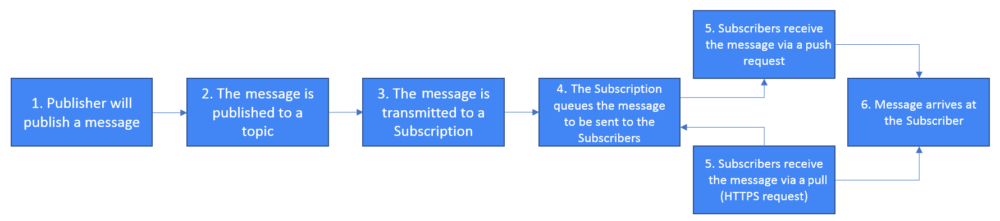

**Let's have a look at the most common use cases:**

* **Distributed event notifications**: Let's take a service that needs to send a notification whenever there is a new registration. Pub/Sub makes it possible for a downstream service to subscribe and receive notifications of this new registration.

* **Balancing workloads**: Tasks can be distributed among multiple Compute Engine instances.

* **Logging**: Pub/Sub can write logs to multiple systems. For example, if we wish to work with real-time information, we could write to a monitoring system, and if we wish to analyze data at a later time, we could write to a database.

### Data Catalog

* is a managed service for metadata.


### Cloud Composer 

* is a managed Apache Airflow service that helps you create, schedule, monitor and manage workflows.


### Google Genomics

* 


## AI/Machine Learning


### Cloud Machine Learning

* Fully Managed Machine Learning on Any Data and Any Size
* makes it easy for you to build sophisticated, large scale machine learning models that cover a broad set of scenarios from building sophisticated regression models to image classification.

### The seven steps of ML
Google indicates that there are seven steps for ML:

1. Gathering the data
2. Preparing the data
3. Choosing a model
4. Training
5. Evaluation
6. Hyperparameter tuning
7. Prediction


### Learning models

**3 Types of ML**

1. **Supervised learning**

   * Supervised learning is the most common model. It is used when the training data and validation data is labeled. 

   * What the model does is learn how to set a label for input data. It does this based on what it has learned from some labeled training data. 

     We can further classify supervised learning into the following categories:

     - **Classification**: This occurs when the output data is a category, for example, apple, pear, or orange.
     - **Regression**: This occurs when the output data is a value, such as cost and temperature.

2. **Unsupervised learning** 

   * is used when the training data is not labeled. 

   * The model attempts to learn the structure of the data and export information or features that might be useful for classification. 

      We can further classify unsupervised learning into the following categories:

     - **Clustering**: This occurs when you want to group the data, for example, consumers, according to their preference for coffee or tea.
     - **Association**: This occurs when you want to link two different actions or behaviors, for example, a customer buying product A also bought product B.

3. **Semi-supervised ML**

   - Semi-supervised training occurs when part of the training data is labeled and part of it isn't. 
   - You can use a mix of both of the preceding methods. Unsupervised learning can be used to structure the data. Supervised learning can be used to label unlabeled data.


### Cloud AutoML

* is a managed service for building machine learning models.


### Cloud Video Intelligence API

* Search and Discover Media Content - Video
* makes videos searchable, and discoverable, by extracting metadata with an easy to use REST API. You
  can now search every moment of every video file in your catalog and find every occurrence as well as its significance.
* It quickly annotates videos stored in Google Cloud Storage, and helps you identify key nouns entities of your video, and when they occur within the video

### Cloud Vision API

* Derive insight from images 
* enables developers to understand the content of an image by encapsulating powerful machine learning models in an easy to use REST API. 
* It quickly classifies images into thousands of categories (e.g., "sailboat", "lion", "Eiffel Tower"), detects individual objects and faces within images, and finds and reads printed words contained within images.
* You can build metadata on your image catalog, moderate offensive content, or enable new marketing scenarios through image sentiment analysis. 
* Analyze images uploaded in the request or integrate with your image storage on Google Cloud Storage.


### Cloud Speech Recognition API

* Speech to Text Conversion

* enables you to convert audio to text by applying neural network models in an easy to use API. 

* The API recognizes over 100+ languages and variants, to support global user base. 

* You can transcribe the text of users dictating to an application’s microphone or enable command-and-control through voice among many other use cases.

  

### Cloud Natural Language API

* Drive Insights from unstructured Text
* reveals the structure and meaning of text by offering powerful machine learning models in an easy to use REST API. 
* You can use it to extract information about people, places, events and much more, mentioned in text documents, news articles or blog posts.
* Extract information regarding entities, including places, people, and events
* Categorize the entities
* Perform sentiment analysis
* Perform syntax analysis


### Cloud Translation APICloud Job Discovery

* Fast , Dynamic Language Translation
* provides a simple programmatic interface for translating an arbitrary string into any supported
  language. 
* Translation API is highly responsive, so websites and applications can integrate with Translation API for fast, dynamic translation of source text from the source language to a target language


### 


Pricing Calculator

https://cloud.google.com/products/calculator/


### Why GCP

* Google Cloud Platform enables developers to build, test and deploy applications on Google’s highly-scalable, secure, and reliable infrastructure.
* Choose from computing, storage, big data/machine learning, and application services for your web, mobile, analytics, and backend solutions.


### GCP Cloud Architect Overview

**Compute Engine**– These VMS are focused on your enterprise IaaS (Infrastructure as a Service) services. (Compute Engine instances can run Linux or Windows Server)

**App Engine** - is focused on PaaS (Platform as a Service) and can be delivered in two different solutions (Standard or Flexible)

**Cloud Functions** -is geared towards a serverless approach and focused on microservices

**Kubenetes Engine** - Awesome solution for developers wanting a simple and lightweight container.


### Compute Engine Overview

* General purpose (E2, N1, N2, N2D) machines provide a good balance of price and performance
* Compute optimized (C2) machines offer high-end vCPU performance for compute-intensive workloads
* Memory optimized (M2) machines offer the highest memory and are great for in-memory databases
* Accelerator optimized (A2) machines are based on the A100 GPU, for very demanding applications