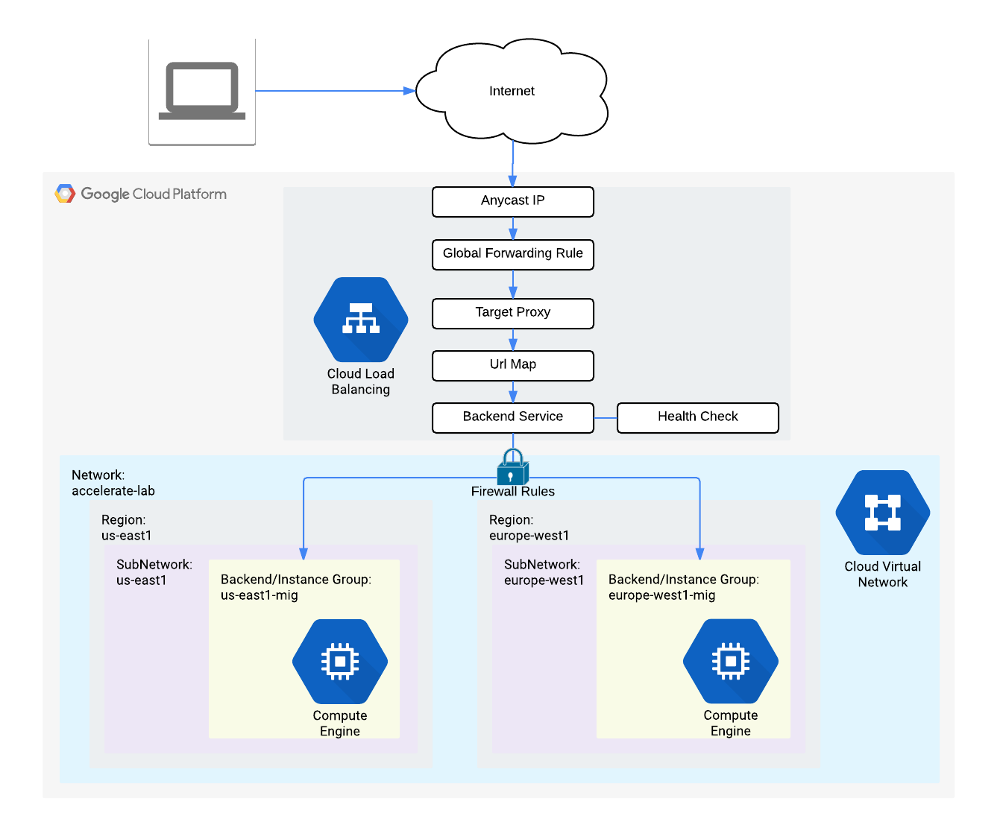
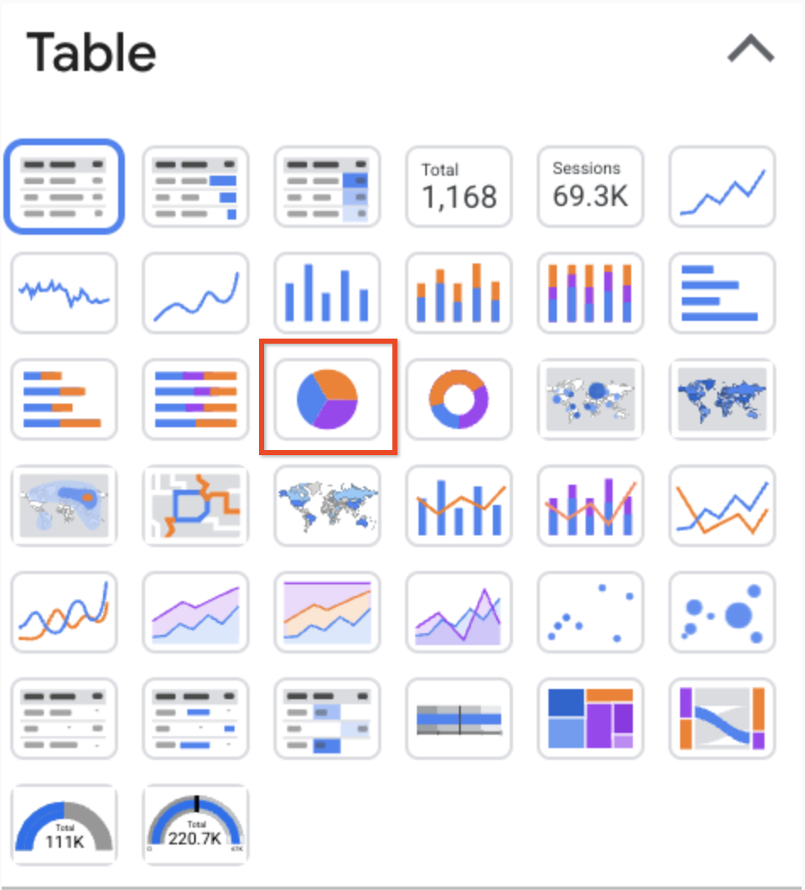
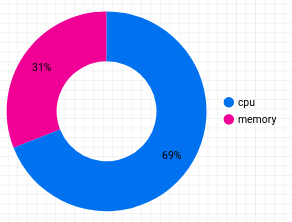
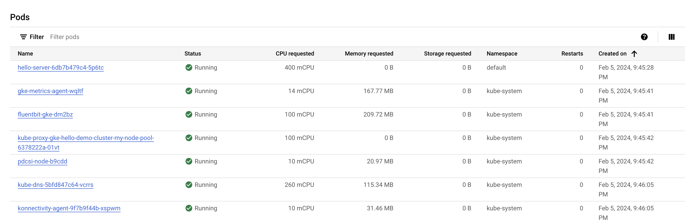

# Professional Cloud Architect Certification Learning Path


# Designing and Planning a Cloud Solution Architecture


## Diagnostic questions

1. Cymbal Direct is evaluating database options to store the analytics data from its experimental drone deliveries. You're currently using a small cluster of MongoDB NoSQL database servers. You want to move to a managed NoSQL database service with consistent low latency that can scale throughput seamlessly and can handle the petabytes of data you expect after expanding to additional markets. What should you do?

- **Create a Bigtable instance, extract the data from MongoDB, and insert the data into Bigtable.**

- Extract the data from MongoDB. Insert the data into Firestore using Datastore mode.

- Extract the data from MongoDB, and insert the data into BigQuery.

- Extract the data from MongoDB. Insert the data into Firestore using Native mode.

Correct! Bigtable is ideal for IoT, gives consistently sub-10ms latency, and can be used at a petabyte scale.

2. You are creating a new project. You plan to set up a Dedicated interconnect between two of your data centers in the near future and want to ensure that your resources are only deployed to the same regions where your data centers are located. You need to make sure that you don’t have any overlapping IP addresses that could cause conflicts when you set up the interconnect. You want to use RFC 1918 class B address space. What should you do?

- **Create a new project, delete the default VPC network, set up a custom mode VPC network, and then use IP addresses in the 172.16.x.x address range to create subnets in your desired regions.**

- Create a new project, delete the default VPC network, set up an auto mode VPC network, and then use the default 10.x.x.x network range to create subnets in your desired regions.

- Create a new project, leave the default network in place, and then use the default 10.x.x.x network range to create subnets in your desired regions.

- Create a new project, delete the default VPC network, set up the network in custom mode, and then use IP addresses in the 192.168.x.x address range to create subnets in your desired zones. Use VPC Network Peering to connect the zones in the same region to create regional networks.

Correct! Custom networks give you full control.

3. Cymbal Direct's employees will use Google Workspace. Your current on-premises network cannot meet the requirements to connect to Google's public infrastructure. What should you do?

- Order a Partner Interconnect from a Google Cloud partner, and ensure that proper routes are configured.

- Connect the network to a Google point of presence, and enable Direct Peering.

- Order a Dedicated Interconnect from a Google Cloud partner, and ensure that proper routes are configured.

- **Connect the on-premises network to Google’s public infrastructure via a partner that supports Carrier Peering.**

Correct! Carrier Peering allows using a Google partner to connect to Google public infrastructure, such as Workspace or YouTube.

4. You are working with a client who is using Google Kubernetes Engine (GKE) to migrate applications from a virtual machine–based environment to a microservices-based architecture. Your client has a complex legacy application that stores a significant amount of data on the file system of its VM. You do not want to re-write the application to use an external service to store the file system data. What should you do?

- **In Cloud Shell, create a YAML file defining your StatefulSet called statefulset.yaml. Create a StatefulSet in GKE by running the command kubectl apply -f statefulset.yaml**

- In Cloud Shell, create a YAML file defining your Container called build.yaml. Create a Container in GKE by running the command gcloud builds submit –config build.yaml .

- In Cloud Shell, create a YAML file defining your Deployment called deployment.yaml. Create a Deployment in GKE by running the command kubectl apply -f deployment.yaml

- In Cloud Shell, create a YAML file defining your Pod called pod.yaml. Create a Pod in GKE by running the command kubectl apply -f pod.yaml

Correct! A StatefulSet represents a group of persistent Pods. The YAML file will define a PersistentVolumeClaim (PVC) that allows for an application to retain state. A StatefulSet is commonly used with applications like databases.

5. Cymbal Direct has created a proof of concept for a social integration service that highlights images of its products from social media. The proof of concept is a monolithic application running on a single SuSE Linux virtual machine (VM). The current version requires increasing the VM’s CPU and RAM in order to scale. You would like to refactor the VM so that you can scale out instead of scaling up. What should you do?

- Make sure that the application declares any dependent requirements in a requirements.txt or equivalent statement so that they can be referenced in a startup script, and attach external persistent volumes to the VMs.

- Make sure that the application declares any dependent requirements in a requirements.txt or equivalent statement so that they can be referenced in a startup script. Specify the startup script in a managed instance group template, and use an autoscaling policy.

- Move the existing codebase and VM provisioning scripts to git, and attach external persistent volumes to the VMs.

- **Use containers instead of VMs, and use a GKE autoscaling deployment.**

Correct! Treating each app as one or more stateless processes means externalizing state to a separate database service. This allows for more concurrent processing.

6. Cymbal Direct is working with Cymbal Retail, a separate, autonomous division of Cymbal with different staff, networking teams, and data center. Cymbal Direct and Cymbal Retail are not in the same Google Cloud organization. Cymbal Retail needs access to Cymbal Direct’s web application for making bulk orders, but the application will not be available on the public internet. You want to ensure that Cymbal Retail has access to your application with low latency. You also want to avoid egress network charges if possible. What should you do?

- Verify that the subnet Cymbal Retail is using has the same IP address range with Cymbal Direct’s subnet range, and then enable VPC Network Peering for the project.

- If Cymbal Retail does not have access to a Google Cloud data center, use Carrier Peering to connect the two networks.

- **Verify that the subnet range Cymbal Retail is using doesn’t overlap with Cymbal Direct’s subnet range, and then enable VPC Network Peering for the project.**

- Specify Cymbal Direct’s project as the Shared VPC host project, and then configure Cymbal Retail’s project as a service project.

Correct! VPC Peering allows for shared networking between organizations.

7. Customers need to have a good experience when accessing your web application so they will continue to use your service. You want to define key performance indicators (KPIs) to establish a service level objective (SLO). Which KPI could you use?

- Low latency for > 85% of requests when aggregated over 1 minute

- **Eighty-five percent of requests succeed when aggregated over 1 minute**

- ###### Eighty-five percent of customers are satisfied users

- Eighty-five percent of requests are successful

Correct! This is specific, and you can reasonably expect to meet this KPI.

8. Cymbal Direct developers have written a new application. Based on initial usage estimates, you decide to run the application on Compute Engine instances with 15 Gb of RAM and 4 CPUs. These instances store persistent data locally. After the application runs for several months, historical data indicates that the application requires 30 Gb of RAM. Cymbal Direct management wants you to make adjustments that will minimize costs. What should you do?

- Stop the instance, and then use the command gcloud compute instances set-machine-type VM_NAME --machine-type e2-standard-8. Set the instance’s metadata to: preemptible: true. Start the instance again.

- Stop the instance, and then use the command gcloud compute instances set-machine-type VM_NAME --machine-type e2-standard-8. Start the instance again.

- Stop the instance, and then use the command gcloud compute instances set-machine-type VM_NAME --machine-type 2-custom-4-30720. Set the instance’s metadata to: preemptible: true. Start the instance again.

- **Stop the instance, and then use the command gcloud compute instances set-machine-type VM_NAME --machine-type 2-custom-4-30720. Start the instance again.**

Correct! Custom instances are a good way to optimize costs. You don’t have to pay for resources you don’t need.

9. You are working in a mixed environment of VMs and Kubernetes. Some of your resources are on-premises, and some are in Google Cloud. Using containers as a part of your CI/CD pipeline has sped up releases significantly. You want to start migrating some of those VMs to containers so you can get similar benefits. You want to automate the migration process where possible. What should you do?

- Use Migrate for Compute Engine to import VMs and convert them to containers.

- Use Migrate for Anthos to automate the creation of Compute Engine instances to import VMs and convert them to containers.

- **Manually create a GKE cluster, and then use Migrate for Anthos to set up the cluster, import VMs, and convert them to containers.**

- Manually create a GKE cluster. Use Cloud Build to import VMs and convert them to containers.

Correct. You must initially create a GKE cluster. Then you can use Migrate for Anthos to set up the cluster and import the VMs.

10. Cymbal Direct drones continuously send data during deliveries. You need to process and analyze the incoming telemetry data. After processing, the data should be retained, but it will only be accessed once every month or two. Your CIO has issued a directive to incorporate managed services wherever possible. You want a cost-effective solution to process the incoming streams of data. What should you do?

- Ingest data with ClearBlade IoT Core, and then store it in BigQuery.

- **Ingest data with ClearBlade IoT Core, and then publish to Pub/Sub. Use Dataflow to process the data, and store it in a Nearline Cloud Storage bucket.**

- Ingest data with ClearBlade IoT Core, process it with Dataprep, and store it in a Coldline Cloud Storage bucket.

- Ingest data with ClearBlade IoT Core, and then publish to Pub/Sub. Use BigQuery to process the data, and store it in a Standard Cloud Storage bucket.

Correct! Dataflow is a fully managed service that can be used to process both streams and batches of data. Nearline is a good fit because the data could be accessed every month.

## Knowledge Check

1. If you have a business requirement to minimize costs, what are **two** things you could do?

*info*Note: To get credit for a multiple-select question, you must select all of the correct options and none of the incorrect ones.

- **Do not run instances when they are not being used**

Correct. Only running, and thus paying for, instances when they are needed, is a great way to save costs. Using tools like GKE autoscaling clusters, or managed instance groups are a great way to save money.

- **Follow Google’s rightsizing recommendations**

Correct. Google will evaluate your instance’s usage, and make recommendations on how to save money or improve performance by resizing them.

- Use a managed service

- Cap costs by creating a budget in Google Cloud

- Migrate to Kubernetes from VMs

2. What could Cymbal Direct use to estimate costs for their Google Cloud environment?

- ROI

- KPIs

- **Cloud Pricing Calculator**

- Average Compute Instance CPU

Correct! The Cloud pricing calculator allows you to estimate the costs for Google Cloud Products and Services.


# Managing and Provisioning a Solution Infrastructure

## Diagnostic questions

1. Cymbal Direct's user account management app allows users to delete their accounts whenever they like. Cymbal Direct also has a very generous 60-day return policy for users. The customer service team wants to make sure that they can still refund or replace items for a customer even if the customer’s account has been deleted. What can you do to ensure that the customer service team has access to relevant account information?

- Ensure that the user clearly understands that after they delete their account, all their information will also be deleted. Remind them to download a copy of their order history and account information before deleting their account. Have the support agent copy any open or recent orders to a shared spreadsheet.

- Disable the account. Export account information to Cloud Storage. Have the customer service team permanently delete the data after 30 days.

- **Temporarily disable the account for 30 days. Export account information to Cloud Storage, and enable lifecycle management to delete the data in 60 days.**

- Restore a previous copy of the user information database from a snapshot. Have a database administrator capture needed information about the customer.

Correct! This takes a lazy deletion approach and allows support or administrators to restore data later if necessary.

2. Cymbal Direct needs to use a tool to deploy its infrastructure. You want something that allows for repeatable deployment processes, uses a declarative language, and allows parallel deployment. You also want to deploy infrastructure as code on Google Cloud and other cloud providers. What should you do?

- Use Google Kubernetes Engine (GKE) to create deployments and manifests for your applications.

- **Automate the deployment with Terraform scripts.**

- Develop in Docker containers for portability and ease of deployment.

- Automate the deployment with Cloud Deployment Manager.

Correct! Terraform lets you automate and manage resources in multiple clouds.

3. Cymbal Direct wants to create a pipeline to automate the building of new application releases. What sequence of steps should you use?

- Set up a source code repository. Run unit tests. Check in code. Deploy. Build a Docker container.

- Run unit tests. Deploy. Build a Docker container. Check in code. Set up a source code repository.

- Check in code. Set up a source code repository. Run unit tests. Deploy. Build a Docker container.

- **Set up a source code repository. Check in code. Run unit tests. Build a Docker container. Deploy.**

Correct! Each step is dependent on the previous step. These are in the right order.


4. You are working with a client who has built a secure messaging application. The application is open source and consists of two components. The first component is a web app, written in Go, which is used to register an account and authorize the user’s IP address. The second is an encrypted chat protocol that uses TCP to talk to the backend chat servers running Debian. If the client's IP address doesn't match the registered IP address, the application is designed to terminate their session. The number of clients using the service varies greatly based on time of day, and the client wants to be able to easily scale as needed. What should you do?

- Deploy the web application using the App Engine standard environment with a global external HTTP(S) load balancer and a network endpoint group. Use a managed instance group for the backend chat servers. Use a global SSL proxy load balancer to load-balance traffic across the backend chat servers.

- Deploy the web application using the App Engine standard environment with a global external HTTP(S) load balancer and a network endpoint group. Use an unmanaged instance group for the backend chat servers. Use an external network load balancer to load-balance traffic across the backend chat servers.

- **Deploy the web application using the App Engine standard environment with a global external HTTP(S) load balancer and a network endpoint group. Use a managed instance group for the backend chat servers. Use an external network load balancer to load-balance traffic across the backend chat servers.**

- Deploy the web application using the App Engine flexible environment with a global external HTTP(S) load balancer and a network endpoint group. Use an unmanaged instance group for the backend chat servers. Use an external network load balancer to load-balance traffic across the backend chat servers.

Correct! Using App Engine allows for dynamic scaling based on demand, as does a managed instance group. Using an external network load balancer preserves the client's IP address.


5. You have deployed your frontend web application in Kubernetes. Based on historical use, you need three pods to handle normal demand. Occasionally your load will roughly double. A load balancer is already in place. How could you configure your environment to efficiently meet that demand?

- Edit your pod's configuration file and change the number of replicas to six.

- Edit your deployment's configuration file and change the number of replicas to six.

- Use the "kubectl autoscale" command to change the pod's maximum number of instances to six.

- **Use the "kubectl autoscale" command to change the deployment’s maximum number of instances to six.**

Correct! This will allow Kubernetes to scale the number of pods automatically, based on a condition like CPU load or requests per second.


6. Cymbal Direct wants a layered approach to security when setting up Compute Engine instances. What are some options you could use to make your Compute Engine instances more secure?

- Use labels to allow traffic only from certain sources and ports. Turn on Secure boot and vTPM.

- Use network tags to allow traffic only from certain sources and ports. Use a Compute Engine service account.

- Use labels to allow traffic only from certain sources and ports. Use a Compute Engine service account.

- **Use network tags to allow traffic only from certain sources and ports. Turn on Secure boot and vTPM.**

Correct! You can use network tags with firewall rules to automatically associate instances when they are created. Secure boot and vTPM protect the OS from being compromised.


7. Cymbal Direct must meet compliance requirements. You need to ensure that employees with valid accounts cannot access their VPC network from locations outside of its secure corporate network, including from home. You also want a high degree of visibility into network traffic for auditing and forensics purposes. What should you do?

- Ensure that all users install Cloud VPN. Enable VPC Flow Logs for the networks you need to monitor.

- **Enable VPC Service Controls, define a network perimeter to restrict access to authorized networks, and enable VPC Flow Logs for the networks you need to monitor.**

- Enable VPC Service Controls, and use Google Cloud Observability to view audit logs for the networks you need to monitor.

- Enable Identity-Aware Proxy (IAP) to allow users to access services securely. Use Google Cloud Observability to view audit logs for the networks you need to monitor.

Correct! Enabling VPC Service Controls lets you define a network perimeter. VPC Flow Logs lets you log network-level communication to Compute Engine instances.


8. You need to deploy a load balancer for a web-based application with multiple backends in different regions. You want to direct traffic to the backend closest to the end user, but also to different backends based on the URL the user is accessing. Which of the following could be used to implement this?

- The request is received by the SSL proxy load balancer, which uses a global forwarding rule to check the URL map, then sends the request to a backend service. The request is processed by Compute Engine instance groups in multiple regions.

- **The request is received by the global external HTTP(S) load balancer. A global forwarding rule sends the request to a target proxy, which checks the URL map and selects the backend service. The backend service sends the request to Compute Engine instance groups in multiple regions.**

- The request is matched by a URL map and then sent to a SSL proxy load balancer. A global forwarding rule sends the request to a target proxy, which selects a backend service and sends the request to Compute Engine instance groups in multiple regions.

- The request is matched by a URL map and then sent to a global external HTTP(S) load balancer. A global forwarding rule sends the request to a target proxy, which selects a backend service. The backend service sends the request to Compute Engine instance groups in multiple regions.

Correct! This is the right order of operations.

9. Your existing application runs on Ubuntu Linux VMs in an on-premises hypervisor. You want to deploy the application to Google Cloud with minimal refactoring. What should you do?

- Set up a Google Kubernetes Engine (GKE) cluster, and then create a deployment with an autoscaler.

- Isolate the core features that the application provides. Use App Engine to deploy each feature independently as a microservice.

- **Write Terraform scripts to deploy the application as Compute Engine instances.**

- Use a Dedicated or Partner Interconnect to connect the on-premises network where your application is running to your VPC: Configure an endpoint for a global external HTTP(S) load balancer that connects to the existing VMs.

Correct! Terraform lets you manage how you deploy and manage a variety of services in Google Cloud, such as Compute Engine. You can also use Cloud Deployment Manager for this purpose.


10. Cymbal Direct wants to allow partners to make orders programmatically, without having to speak on the phone with an agent. What should you consider when designing the API?

- The API backend should be tightly coupled. Clients should know a significant amount about the services they use. REST APIs using gRPC should be used for all external APIs.

- The API backend should be tightly coupled. Clients should know a significant amount about the services they use. For REST APIs, HTTP(S) is the most common protocol used.

- The API backend should be loosely coupled. Clients should not be required to know too many details of the services they use. REST APIs using gRPC should be used for all external APIs.

The API backend should be loosely coupled. Clients should not be required to know too many details of the services they use. For REST APIs, HTTP(S) is the most common protocol.

Incorrect. If an API is not loosely coupled, it can become an issue for maintenance, with large, complicated monolithic applications. REST APIs are protocol-agnostic, and HTTP(S) is the most common protocol for external APIs.

## Knowledge Check


1. Which network configuration would ensure low latency for US drone pilots?

- Deploy resources globally

- Only deploy resources to Regions in Asia

- Only deploy resources to Regions in Europe

- **Only deploy resources to Regions in the US**

Correct! Only deploy resources to Regions in the US

2. Which Storage Class should you use for data that is going to be accessed at least once every two weeks?

- Nearline

- **Standard**

- Coldline

- Archive

Correct! Standard is appropriate for frequent use.


# Designing for Security and Compliance

## Diagnostic questions

1. Cymbal Direct’s social media app must run in a separate project from its APIs and web store. You want to use Identity and Access Management (IAM) to ensure a secure environment. How should you set up IAM?

- Use one service account for each component (social media app, APIs, and web store) with predefined or custom roles to grant access.

- Use separate service accounts for each component (social media app, APIs, and web store) with basic roles to grant access.

- **Use separate service accounts for each component (social media app, APIs, and web store) with predefined or custom roles to grant access.**

- Use one service account for each component (social media app, APIs, and web store) with basic roles to grant access.

Correct! Using separate service accounts for each component allows you to grant only the access needed to each service account with either a predefined or custom role.

2. Your client is legally required to comply with the Payment Card Industry Data Security Standard (PCI-DSS). The client has formal audits already, but the audits are only done periodically. The client needs to monitor for common violations to meet those requirements more easily. The client does not want to replace audits but wants to engage in continuous compliance and catch violations early. What would you recommend that this client do? **Responses:**

- Enable the Security Command Center (SCC) dashboard, asset discovery, and Security Health Analytics in the Standard tier. Export or view the PCI-DSS Report from the SCC dashboard's Vulnerabilities tab.

- **Enable the Security Command Center (SCC) dashboard, asset discovery, and Security Health Analytics in the Premium tier. Export or view the PCI-DSS Report from the SCC dashboard's Compliance tab.**

- Enable the Security Command Center (SCC) dashboard, asset discovery, and Security Health Analytics in the Premium tier. Export or view the PCI-DSS Report from the SCC dashboard's Vulnerabilities tab.

- Enable the Security Command Center (SCC) dashboard, asset discovery, and Security Health Analytics in the Standard tier. Export or view the PCI-DSS Report from the SCC dashboard's Compliance tab.

Correct! The reports relating to compliance vulnerabilities are on the Compliance tab. To use the Security Health Analytics that scan for common compliance vulnerabilities, you must use the Premium tier.

3. Michael is the owner/operator of “Zneeks,” a retail shoe store that caters to sneaker aficionados. He regularly works with customers who order small batches of custom shoes. Michael is interested in using Cymbal Direct to manufacture and ship custom batches of shoes to these customers. Reasonably tech-savvy but not a developer, Michael likes using Cymbal Direct's partner purchase portal but wants the process to be easy. What is an example of a user story that could describe Michael’s persona?

- Michael is a tech-savvy owner/operator of a small business.

- Michael is reasonably tech-savvy but needs Cymbal Direct's partner purchase portal to be easy

- Zneeks is a retail shoe store that caters to sneaker aficionados.

- **As a shoe retailer, Michael wants to send Cymbal Direct custom purchase orders so that batches of custom shoes are sent to his customers.**

Correct! “As a [type of user], I want to [do something] so that I can [get some benefit]” is the standard format for a user story.

4. You have several Compute Engine instances running NGINX and Tomcat for a web application. In your web server logs, many login failures come from a single IP address, which looks like a brute force attack. How can you block this traffic?

- Ensure that an HTTP(S) load balancer is configured to send traffic to your backend Compute Engine instances running your web server. Create a Google Cloud Armor policy using the instance’s local firewall with a default rule action of "Allow." Add a new local firewall rule that specifies the IP address causing the login failures as the Condition, with an action of "Deny" and a deny status of "403," and accept the default priority (1000).

- Edit the Compute Engine instances running your web application, and enable Google Cloud Armor. Create a Google Cloud Armor policy with a default rule action of "Allow." Add a new rule that specifies the IP address causing the login failures as the Condition, with an action of "Deny” and a deny status of "403," and accept the default priority (1000).

- **Ensure that an HTTP(S) load balancer is configured to send traffic to the backend Compute Engine instances running your web server. Create a Google Cloud Armor policy with a default rule action of "Allow." Add a new rule that specifies the IP address causing the login failures as the Condition, with an action of "Deny" and a deny status of "403," and accept the default priority (1000). Add the load balancer backend service's HTTP-backend as the target.**

- Ensure that an HTTP(S) load balancer is configured to send traffic to the backend Compute Engine instances running your web server. Create a Google Cloud Armor policy with a default rule action of "Deny." Add a new rule that specifies the IP address causing the login failures as the Condition, with an action of "Deny" and a deny status of "403," and accept the default priority (1000). Add the load balancer backend service's HTTP-backend as the target.

Correct! Configuring a Google Cloud Armor rule to prevent that IP address from accessing the HTTP-backend on the load balancer will prevent access.


5. Cymbal Direct is experiencing success using Google Cloud and you want to leverage tools to make your solutions more efficient. Erik, one of the original web developers, currently adds new products to your application manually. Erik has many responsibilities and requires a long lead time to add new products. You need to create an App Engine application to let Cymbal Direct employees add new products instead of waiting for Erik. However, you want to make sure that only authorized employees can use the application. What should you do?

- Set up Cloud VPN between the corporate network and the Google Cloud project's VPC network. Allow users to connect to the App Engine instance.

- Use Google Cloud Armor to restrict access to the corporate network's external IP address. Configure firewall rules to allow only HTTP(S) access.

- Create a Google group and add authorized employees to it. Configure Identity-Aware Proxy (IAP) to the App Engine application as a HTTP-resource. Add the group as a principle with the role "Project Owner."

- **Create a Google group and add authorized employees to it. Configure Identity-Aware Proxy (IAP) to the App Engine application as a HTTP-resource. Add the group as a principle with the role "IAP-secured Web App User."**

Correct! You could use individual accounts to give out access instead of a group, and by doing so you make access more manageable. Identity-Aware Proxy is a great tool for exactly this kind of issue.

6. Your client created an Identity and Access Management (IAM) resource hierarchy with Google Cloud when the company was a startup. Your client has grown and now has multiple departments and teams. You want to recommend a resource hierarchy that follows Google-recommended practices. What should you do?

- Keep all resources in one project, and use a flat resource hierarchy to reduce complexity and simplify management.

- Use a flat resource hierarchy and multiple projects with established trust boundaries.

- Keep all resources in one project, but change the resource hierarchy to reflect company organization.

- **Use multiple projects with established trust boundaries, and change the resource hierarchy to reflect company organization.**

Correct! Because the environment has evolved, update the IAM resource hierarchy to reflect the changes. Use projects to group resources that share the same trust boundary.


7. Cymbal Direct needs to make sure its new social media integration service can’t be accessed directly from the public internet. You want to allow access only through the web frontend store. How can you prevent access to the social media integration service from the outside world, but still allow access to the APIs of social media services?

- Limit access to the external IP addresses of the VM instances using firewall rules and place them in a private VPC behind Cloud NAT. Any SSH connection for management should be done with Identity-Aware Proxy (IAP) or a bastion host (jump box) after allowing SSH access from IAP or a corporate network.

- Remove external IP addresses from the VM instances running the social media service and place them in a private VPC behind Cloud NAT. Any SSH connection for management should be restricted to corporate network IP addresses by Google Cloud Armor.

- Limit access to the external IP addresses of the VM instances using a firewall rule to block all outbound traffic. Any SSH connection for management should be done with Identity-Aware Proxy (IAP) or a bastion host (jump box) after allowing SSH access from IAP or a corporate network.

- **Remove external IP addresses from the VM instances running the social media service and place them in a private VPC behind Cloud NAT. Any SSH connection for management should be done with Identity-Aware Proxy (IAP) or a bastion host (jump box) after allowing SSH access from IAP or a corporate network.**

Correct! Using Cloud NAT will prevent inbound access from the outside world but will allow connecting to social media APIs outside of the VPC. Using IAP or a bastion host allows for management by SSH, but without the complexity of using VPNs for user access.


8. Cymbal Direct has an application running on a Compute Engine instance. You need to give the application access to several Google Cloud services. You do not want to keep any credentials on the VM instance itself. What should you do?

- Create a service account for each of the services the VM needs to access. Associate the service accounts with the Compute Engine instance.

- Create a service account and assign it the project owner role, which enables access to any needed service.

- Create a service account for the instance. Use Access scopes to enable access to the required services.

- **Create a service account with one or more predefined or custom roles, which give access to the required services.**

Correct! This gives the flexibility and granularity needed to allow access to multiple services, without giving access to unnecessary services.


9. Cymbal Direct wants to use Identity and Access Management (IAM) to allow employees to have access to Google Cloud resources and services based on their job roles. Several employees are project managers and want to have some level of access to see what has been deployed. The security team wants to ensure that securing the environment and managing resources is simple so that it will scale. What approach should you use?

- Grant access by assigning custom roles to groups. Use multiple groups for better control. Give access as low in the hierarchy as possible to prevent the inheritance of too many abilities from a higher level.

- Give access directly to each individual for more granular control. Give access as low in the hierarchy as possible to prevent the inheritance of too many abilities from a higher level.

- **Grant access by assigning predefined roles to groups. Use multiple groups for better control. Give access as low in the hierarchy as possible to prevent the inheritance of too many abilities from a higher level.**

- Grant access by assigning predefined roles to groups. Use multiple groups for better control. Make sure you give out access to all the children in a hierarchy under the level needed, because child resources will not automatically inherit abilities.

Correct! This follows recommended practices regarding organizational policies.


10. You've recently created an internal App Engine application for developers in your organization. The application lets developers clone production Cloud SQL databases into a project specifically created to test code and deployments. Your previous process was to export a database to a Cloud Storage bucket, and then import the SQL dump into a legacy on-premises testing environment database with connectivity to Google Cloud via Cloud VPN. Management wants to incentivize using the new process with Cloud SQL for rapid testing and track how frequently rapid testing occurs. How can you ensure that the developers use the new process?

- Use an ACL on the Cloud Storage bucket. Create a read-only group that only has viewer privileges, and ensure that the developers are in that group.

- Use predefined roles to restrict access to what the developers are allowed to do. Create a group for the developers, and associate the group with the Cloud SQL Viewer role. Remove the "cloudsql.instances.export" ability from the role.

- Leave the ACLs on the Cloud Storage bucket as-is. Disable Cloud VPN, and have developers use Identity-Aware Proxy (IAP) to connect. Create an organization policy to enforce public access protection.

- **Create a custom role to restrict access to what developers are allowed to do. Create a group for the developers, and associate the group with your custom role. Ensure that the custom role does not have "cloudsql.instances.export."**

Correct! In this scenario, using a predefined role is inappropriate because the most appropriate predefined role, Cloud SQL Viewer, contains the cloudsql.instances.export capability, which would allow the database to be exported.


## Knowledge Check


1. What type of data might be inadvertently picked up by a drone during a delivery?

- Classified government data

- **Video of private property**

- Healthcare data regulated by privacy laws

- Financial data regulated by banking laws

Correct! Video of private property could include potential privacy violations depending on the jurisdiction and what the video is of. For example, the California Consumer Privacy Act could prohibit retaining photos of the customer as proof of delivery


2. Cymbal Direct has chosen to use multiple projects for their environment. How do you describe this choice?

- Unnecessary. Using multiple projects adds little to no benefits.

- **Using multiple projects adds both security and other benefits.**

- Using multiple projects requires creating separate IAM policies at each project level

- Using multiple projects only adds security benefits.

Correct - in all but the simplest environments, having multiple projects can be very beneficial. You get security benefits, but also can manage each project independently, with their own resources, policies, and billing.


# Analyzing and Optimizing Technical and Business Processes

## Diagnostic questions

1. Cymbal Direct wants to improve its drone pilot interface. You want to collect feedback on proposed changes from the community of pilots before rolling out updates systemwide. What type of deployment pattern should you implement?

- You should implement a blue/green deployment.

- You should implement canary testing.

- **You should implement A/B testing.**

- You should implement an in-place release.

Correct! A/B testing is a pattern that lets you evaluate new proposed functionality.

2. You have an application implemented on Compute Engine. You want to increase the durability of your application. What should you do?

- Implement a regional managed instance group.

- Perform health checks on your Compute Engine instances.

- **Implement a scheduled snapshot on your Compute Engine instances.**

- Monitor your application’s usage metrics and implement autoscaling.

Correct! Durability ensures that your data is protected and available. Snapshots are a viable way of backing up your data in Compute Engine.

3. Your development team used Cloud Source Repositories, Cloud Build, and Artifact Registry to successfully implement the build portion of an application's CI/CD process.. However, the deployment process is erroring out. Initial troubleshooting shows that the runtime environment does not have access to the build images. You need to advise the team on how to resolve the issue. What could cause this problem?

- The runtime environment does not have permissions to the Artifact Registry in your current project.

- The runtime environment does not have permissions to Cloud Source Repositories in your current project.

- You need to specify the Artifact Registry image by name.
- **The Artifact Registry might be in a different project.**

Correct! Permissions must be configured to give the runtime service account permissions to the Artifact Registry in another project.

4. You have implemented a manual CI/CD process for the container services required for the next implementation of the Cymbal Direct’s Drone Delivery project. You want to automate the process. What should you do?

- Specify the name of your Container Registry in your Cloud Build configuration.

- Configure and push a manifest file into an environment repository in Cloud Source Repositories.

- lmplement and reference a source repository in your Cloud Build configuration file.

- **Implement a build trigger that applies your build configuration when a new software update is committed to Cloud Source Repositories.**

Correct! Configuring a build trigger automates the CI/CD process based on when the software is posted to a repository.

5. You want to establish procedures for testing the resilience of the delivery-by-drone solution. How would you simulate a scalability issue?

- **Load test your application to see how it responds.**

- Block access to storage assets in one of your zones.

- Block access to all resources in a zone.

- Inject a bad health check for one or more of your resources.

Correct! Designing for increased customer demand is one way to ensure scalability.

6. Developers on your team frequently write new versions of the code for one of your applications. You want to automate the build process when updates are pushed to Cloud Source Repositories. What should you do?

- Upload application updates and Cloud Build configuration files to Cloud Source Repositories.

- Implement a Cloud Build configuration file with build steps.

- **Implement a build trigger that references your repository and branch.**

- Set proper permissions for Cloud Build to access deployment resources.

Correct! Cloud Build triggers automate the build process when new files are placed into the name and branch of the repository that you specify.

7. The pilot subsystem in your Delivery by Drone service is critical to your service. You want to ensure that connections to the pilots can survive a VM outage without affecting connectivity. What should you do?

- **Implement a managed instance group and load balancer.**

- Configure proper startup scripts for your VMs.

- Deploy a load balancer to distribute traffic across multiple machines.

- Create persistent disk snapshots.

Correct! Managed instance groups offer scaling and autohealing that automatically replaces the instances that are not responding.

8. You are asked to implement a lift and shift operation for Cymbal Direct’s Social Media Highlighting service. You compose a Terraform configuration file to build all the necessary Google Cloud resources. What is the next step in the Terraform workflow for this effort?

- Commit the configuration file to your software repository.

- Run terraform plan to verify the contents of the Terraform configuration file.

- **Run terraform init to download the necessary provider modules.**

- Run terraform apply to deploy the resources described in the configuration file.

Correct! Running init in the directory containing your Terraform configuration file ensures that the correct plugins are loaded for the providers and resources requested.

9. The number of requests received by your application is nearing the maximum specified in your design. You want to limit the number of incoming requests until the system can handle the workload. What design pattern does this situation describe?

- Increasing jitter

- Applying exponential backoff

- Applying graceful degradation

- **Applying a circuit breaker**

Correct! A circuit breaker limits requests based on a threshold that you specify.

10. You are implementing a disaster recovery plan for the cloud version of your drone solution. Sending videos to the pilots is crucial from an operational perspective. What design pattern should you choose for this part of your architecture?

- Cold with a low recovery time objective (RTO)

- Hot with a high recovery time objective (RTO)

- **Hot with a low recovery time objective (RTO)**

- Warm with a high recovery time objective (RTO)

Correct! Safety and compliance require your application to have a low RTO, so you need a hot design pattern with minimal downtime.

## Knowledge Check


1. Cymbal Direct needs a database for their next project. They want to meet their business and technical objectives. What should they do?

- Install CockroachDB on a managed instance group

- **Use a Managed Database Service**

- Install MySQL on a Compute engine instance

- Use a NoSQL database

Correct! Cymbal Direct has specified that they want to move to managed services wherever possible.

2. Cymbal Direct has decided to use Cloud Build. Which technical requirement justifies this decision?

- Let partners order directly via API

- Securely allow partner integration

- Allow for streaming of IoT data from drones

- **Ensure that developers can deploy container based workloads**

Correct! Developers can build their container based workloads using Cloud Build.


# Managing Implementation and Ensuring Solution and Operations Reliability


## Diagnostic questions

1. Cymbal Direct’s warehouse and inventory system was written in Java. The system uses a microservices architecture in GKE and is instrumented with Zipkin. Seemingly at random, a request will be 5-10 times slower than others. The development team tried to reproduce the problem in testing, but failed to determine the cause of the issue. What should you do?

- Use Error Reporting to test whether your microservices are intermittently unavailable or slow to respond to HTTPS requests. Use Cloud Trace to determine which functions/methods in your application’s code Use the most system resources. Use Cloud Profiler to identify slow requests and determine which microservices/calls take the most time to respond.

- Use Error Reporting to test whether your microservices are intermittently unavailable or slow to respond to HTTPS requests. Use Cloud Profiler to determine which functions/methods in your application’s code use the most system resources. Use Cloud Trace to identify slow requests and determine which microservices/calls take the most time to respond.

- Create metrics in Cloud Monitoring for your microservices to test whether they are intermittently unavailable or slow to respond to HTTPS requests. Use Cloud Trace to determine which functions/methods in your application’s code use the most system resources. Use Cloud Profiler to identify slow requests and determine which microservices/calls take the most time to respond.

- **Create metrics in Cloud Monitoring for your microservices to test whether they are intermittently unavailable or slow to respond to HTTPS requests. Use Cloud Profiler to determine which functions/methods in your application’s code use the most system resources. Use Cloud Trace to identify slow requests and determine which microservices/calls take the most time to respond.**

Correct! Capturing metrics about the health of your microservices could identify an issue. Cloud Profiler can help find the functions or methods in your code that use unusual amounts of CPU, memory, or other system resources. This might indicate where to look for performance problems. Cloud Trace identifies which requests have the highest latency and narrows the scope to the microservices that cause the problem.


2. Your client has adopted a multi-cloud strategy that uses a virtual machine-based infrastructure. The client's website serves users across the globe. The client needs a single dashboard view to monitor performance in their AWS and Google Cloud environments. Your client previously experienced an extended outage and wants to establish a monthly service level objective (SLO) of no outage longer than an hour. What should you do?

- In Cloud Monitoring, create an uptime check for the URL your clients will access. Configure it to check from multiple regions. Use the Cloud Monitoring dashboard to view the uptime metrics over time and ensure that the SLO is met. Recommend an SLO of 97% uptime per month.

- Create a new project to use as an AWS connector project. Authorize access to the project from AWS with a service account. Install the monitoring agent on AWS EC2 (virtual machines) and Compute Engine instances. Use Cloud Monitoring to create dashboards that use the performance metrics from virtual machines to ensure that the SLO is met.

- **In Cloud Monitoring, create an uptime check for the URL your clients will access. Configure it to check from multiple regions. Use the Cloud Monitoring dashboard to view the uptime metrics over time and ensure that the SLO is met. Recommend an SLO of 97% uptime per day.**

- Authorize access to your Google Cloud project from AWS with a service account. Install the monitoring agent on AWS EC2 (virtual machines) and Compute Engine instances. Use Cloud Monitoring to create dashboards that use the performance metrics from virtual machines to ensure that the SLO is met.

Correct! An SLO of no more than 3% downtime over the course of a day would mean that a downtime of more than 43 minutes would exceed it.


3. You need to adopt Site Reliability Engineering principles and increase visibility into your environment. You want to minimize management overhead and reduce noise generated by the information being collected. You also want to streamline the process of reacting to analyzing and improving your environment, and to ensure that only trusted container images are deployed to production. What should you do?

- Adopt Google Cloud Observability to gain visibility into the environment. Use Cloud Trace for distributed tracing, Cloud Logging for logging, and Cloud Monitoring for monitoring, alerting, and dashboards. Page the on-call contact when issues that affect resources in the environment are detected. Use GPG to check container image signatures and ensure that only signed containers are deployed.

- Adopt Google Cloud Observability to gain visibility into the environment. Use Cloud Trace for distributed tracing, Cloud Logging for logging, and Cloud Monitoring for monitoring, alerting, and dashboards. Only page the on-call contact about novel issues or events that haven’t been seen before. Use GNU Privacy Guard (GPG) to check container image signatures and ensure that only signed containers are deployed.

- **Adopt Google Cloud Observability to gain visibility into the environment. Use Cloud Trace for distributed tracing, Cloud Logging for logging, and Cloud Monitoring for monitoring, alerting, and dashboards. Only page the on-call contact about novel issues that violate an SLO or events that haven’t been seen before. Use Binary Authorization to ensure that only signed container images are deployed.**

- Adopt Google Cloud Observability to gain visibility into the environment. Use Cloud Trace for distributed tracing, Cloud Logging for logging, and Cloud Monitoring for monitoring, alerting, and dashboards. Page the on-call contact when issues that affect resources in the environment are detected. Use Binary Authorization to ensure that only signed container images are deployed.

Correct! Google Cloud Observability Is tightly integrated with different components in the suite and other open source tools. It allows for streamlined analysis of issues without requiring additional management overhead to set up and maintain the tools.

4. Your environment has multiple projects used for development and testing. Each project has a budget, and each developer has a budget. A personal budget overrun can cause a project budget overrun. Several developers are creating resources for testing as part of their CI/CD pipeline but are not deleting these resources after their tests are complete. If the compute resource fails during testing, the test can be run again. You want to reduce costs and notify the developer when a personal budget overrun causes a project budget overrun. What should you do?

- Configure billing export to BigQuery. Create a Google Cloud budget for each project. Create a Pub/Sub topic for developer-budget-notifications. Create a Cloud Function to notify the developer based on the labels. Modify the build scripts/pipeline to label all resources with the label “creator” set to the developer’s email address. Use spot (preemptible) instances wherever possible. Use Cloud Scheduler to delete resources older than 24 hours in each project.

- **Configure billing export to BigQuery. Create a Google Cloud budget for each project. Create a Pub/Sub topic for developer-budget-notifications. Create a Cloud Function to notify the developer based on the labels. Modify the build scripts/pipeline to label all resources with the label “creator” set to the developer’s email address. Use spot (preemptible) instances wherever possible.**

- Configure billing export to BigQuery. Create a Google Cloud budget for each project. Configure a billing alert to notify billing admins and users when their budget is exceeded. Modify the build scripts/pipeline to label all resources with the label “creator” set to the developer’s email address. Use spot (preemptible) instances wherever possible.

- Configure billing export to BigQuery. Create a Google Cloud budget for each project. Create a group for the developers in each project, and add them to the appropriate group. Create a notification channel for each group. Configure a billing alert to notify the group when their budget is exceeded. Modify the build scripts/pipeline to label all resources with the label “creator” set to the developer’s email address. Use spot (preemptible) instances wherever possible.

Correct! You can have billing notifications sent to a Pub/Sub topic that triggers a Cloud Function. The function can then notify the appropriate developer.

5. Cymbal Direct releases new versions of its drone delivery software every 1.5 to 2 months. Although most releases are successful, you have experienced three problematic releases that made drone delivery unavailable while software developers rolled back the release. You want to increase the reliability of software releases and prevent similar problems in the future. What should you do?

- **Adopt an “agile” development process. Reduce the time between releases as much as possible. Automate the build process from a source repository, which includes versioning and self-testing. Use Cloud Monitoring, Cloud Logging, and Cloud Alerting to ensure visibility. Use a canary deployment to detect issues that could cause rollback.**

- Adopt a “waterfall” development process. Maintain the current release schedule. Ensure that documentation explains how all the features interact. Automate testing of the application. Ensure that the process to roll back the release is well documented. Use Cloud Monitoring, Cloud Logging, and Cloud Alerting to ensure visibility.

- Adopt a “waterfall” development process. Maintain the current release schedule. Ensure that documentation explains how all the features interact. Ensure that the entire application is tested in a staging environment before the release. Ensure that the process to roll back the release is documented. Use Cloud Monitoring, Cloud Logging, and Cloud Alerting to ensure visibility.

- Adopt an “agile” development process. Maintain the current release schedule. Automate build processes from a source repository. Automate testing after the build process. Use Cloud Monitoring, Cloud Logging, and Cloud Alerting to ensure visibility. Deploy the previous version if problems are detected and you need to roll back.

Correct! A modern CI/CD pipeline lets you release smaller changes more frequently and includes integrated testing. Using a canary deployment can let you detect issues before you deploy your new version at scale.

6. Cymbal Direct uses a proprietary service to manage on-call rotation and alerting. The on-call rotation service has an API for integration. Cymbal Direct wants to monitor its environment for service availability and ensure that the correct person is notified. What should you do?

- **Ensure that VPC firewall rules allow access from the IP addresses used by Google Cloud's uptime-check servers. Create a Pub/Sub topic for alerting as a monitoring notification channel in Google Cloud Observability. Create an uptime check for the appropriate resource's external IP address, with an alerting policy set to use the Pub/Sub topic. Create a Cloud Function that subscribes to the Pub/Sub topic to send the alert to the on-call API.**

- Ensure that VPC firewall rules allow access from the on-call API. Create a Cloud Function to send the alert to the on-call API. Add Cloud Functions as a monitoring notification channel in Google Cloud Observability. Create an uptime check for the appropriate resource's external IP address, with an alerting policy set to use the Cloud Function.

- Ensure that VPC firewall rules allow access from the IP addresses used by Google Cloud’s uptime-check servers. Create a Pub/Sub topic for alerting as a monitoring notification channel in Google Cloud Observability. Create an uptime check for the appropriate resource's internal IP address, with an alerting policy set to use the Pub/Sub topic. Create a Cloud Function that subscribes to the Pub/Sub topic to send the alert to the on-call API.

- Ensure that VPC firewall rules allow access from the IP addresses used by Google Cloud's uptime-check servers. Add the URL for the on-call rotation API as a monitoring notification channel in Google Cloud Observability. Create an uptime check for the appropriate resource's internal IP address, with an alerting policy set to use the API.

Correct! Using Pub/Sub as a notification channel gives you flexibility to adapt how notifications are sent.

7. Cymbal Direct has a new social media integration service that pulls images of its products from social media sites and displays them in a gallery of customer images on your online store. You receive an alert from Cloud Monitoring at 3:34 AM on Saturday. The store is still online, but the gallery does not appear. The CPU utilization is 30% higher than expected on the VMs running the service, which causes the managed instance group (MIG) to scale to the maximum number of instances. You verify that the issue is real by checking the site, and verify that it is not CPU-related by checking the incidents timeline. What should you do to resolve the issue?

- Increase the maximum number of instances in the MIG and verify that this resolves the issue. Ensure that the ticket is annotated with your solution. Create a normal work ticket for the application developer with a link to the incident. Mark the incident as closed.

- **Increase the maximum number of instances in the MIG and verify that this resolves the issue.**

- Check the incident documentation or labels to determine the on-call contact. Appoint an incident commander, and open a chat channel, or conference call for emergency response. Investigate and resolve the issue by increasing the maximum number of instances in the MIG, and verify that this resolves the issue. Mark the incident as closed.

- Increase the maximum number of instances in the MIG and verify that this resolves the issue. Check the incident documentation or labels to determine the on-call contact. Appoint an incident commander, and open a chat channel, or conference call for emergency response. Investigate and resolve the root cause of the issue. Write a blameless post-mortem and identify steps to prevent the issue, to ensure a culture of continuous improvement.

Correct! This appropriately responds to the issue by increasing the number of instances and doesn't require a “heroic effort” by having the developer or response team resolve the issue in the middle of the night.

8. Cymbal Direct is working on a social media integration service in Google Cloud. Mahesh is a non-technical manager who wants to ensure that the project doesn’t exceed the budget and responds quickly to unexpected cost increases. You need to set up access and billing for the project. What should you do? Responses:

- Assign the predefined Billing Account Administrator role to Mahesh. Create a project budget. Configure billing alerts to be sent to the Project Owner. Use resource quotas to cap how much money can be spent.

- **Use the predefined Billing Account Administrator role for the Billing Administrator group, and assign Mahesh to the group. Create a project budget. Configure billing alerts to be sent to the Billing Administrator. Use resource quotas to cap how many resources can be deployed.**

- Assign the predefined Billing Account Administrator role to Mahesh. Create a project budget. Configure billing alerts to be sent to the Billing Administrator. Use resource quotas to cap how many resources can be deployed.

- Use the predefined Billing Account Administrator role for the Billing Administrator group, and assign Mahesh to the group. Create a project budget. Configure billing alerts to be sent to the Billing Account Administrator. Use resource quotas to cap how much money can be spent.

Correct! Use groups with IAM to simplify management. Billing Alerts should be sent to the Billing Administrator. Quotas are based on the number of resources, such as instances or CPU, not budget.

9. Your organization is planning a disaster recovery (DR) strategy. Your stakeholders require a recovery time objective (RTO) of 0 and a recovery point objective (RPO) of 0 for zone outage. They require an RTO of 4 hours and an RPO of 1 hour for a regional outage. Your application consists of a web application and a backend MySQL database. You need the most efficient solution to meet your recovery KPIs. What should you do?

- Use a global HTTP(S) load balancer. Deploy the web application as Compute Engine managed instance groups (MIG) in two regions, us-west and us-east. Configure the load balancer to use both backends. Use Cloud SQL with high availability (HA) enabled in us-east and back up the database every hour to a multi-region Cloud Storage bucket. Restore the data to a Cloud SQL database in us-west if there is a failure and change the load balancer backend to us-west.

- **Use a global HTTP(S) load balancer. Deploy the web application as Compute Engine managed instance groups (MIG) in two regions, us-west and us-east. Configure the load balancer to the us-east backend. Use Cloud SQL with high availability (HA) enabled in us-east and a cross-region replica in us-west. Manually promote the us-west Cloud SQL instance and change the load balancer backend to us-west.**

- Use a global HTTP(S) load balancer. Deploy the web application as Compute Engine managed instance groups (MIG) in two regions, us-west and us-east. Configure the load balancer to use both backends. Use Cloud SQL with high availability (HA) enabled in us-east and a cross-region replica in us-west.

- Use a global HTTP(S) load balancer. Deploy the web application as Compute Engine managed instance groups (MIG) in two regions, us-west and us-east. Configure the load balancer to use both backends. Use Cloud SQL with high availability (HA) enabled in us-east and back up the database every hour to a multi-region Cloud Storage bucket. Restore the data to a Cloud SQL database in us-west if there is a failure.

Correct! This solution ensures you meet RTO and RPO for both a zonal and regional outage. By adding the additional steps to manually change the load balancer and promote the Cloud SQL, you ensure the us-west region only accepts traffic after the database is ready to receive it.


## Knowledge Check

1. How could Cymbal Direct design their code to maximize their savings by running spot (preemptable) instances?

- Use Cloud Monitoring to get performance info.

- **Externalize state.**

- Use an interpreted language like python.

- Create an API for their software.

Correct. By externalizing state it is less likely that data will not be lost if the instance is stopped. This also makes it easier to scale horizontally.


2. How could Cymbal Direct save money for testing/development resources?

- Have all developers sign up for the free $300 credit.

- Only use the smallest size Compute Engine instances.

- **Provision resources only when needed using Terraform.**

- Give all developers the ability to provision resources for themselves.

Correct! Only paying for resources when being used would save money. Terraform would be a good tool to achieve this.


# 03 - Essential Google Cloud Infrastructure: Foundation

## Interacting with Google Cloud

### Lab - Working with the Google Cloud Console and Cloud Shell

#### Overview

In this lab, you become familiar with the Google Cloud web-based interface. There are two integrated environments: a GUI (graphical user interface) environment called the Cloud Console, and a CLI (command-line interface) called Cloud Shell. In this lab, you use both environments.

Here are a few things you need to know about the Cloud Console:

- The Cloud Console is under continuous development, so occasionally the graphical layout changes. This is most often to accommodate new Google Cloud features or changes in the technology, resulting in a slightly different workflow.
- You can perform most common Google Cloud actions in the Cloud Console, but not all actions. In particular, very new technologies or sometimes detailed API or command options are not implemented (or not yet implemented) in the Cloud Console. In these cases, the command line or the API is the best alternative.
- The Cloud Console is extremely fast for some activities. The Cloud Console can perform multiple actions on your behalf that might require many CLI commands. It can also perform repetitive actions. In a few clicks you can accomplish activities that would require a lot of typing and would be susceptible to typing errors.
- The Cloud Console is able to reduce errors by offering only valid options through its menus. It can leverage access to the platform "behind the scenes" through the SDK to validate configuration before submitting changes. A command line can't do this kind of dynamic validation.

#### Objectives

In this lab, you learn how to perform the following tasks:

- Get access to Google Cloud.
- Use the Cloud Console to create a Cloud Storage bucket.
- Use Cloud Shell to create a Cloud Storage bucket.
- Become familiar with Cloud Shell features.

#### Qwiklabs setup

For each lab, you get a new Google Cloud project and set of resources for a fixed time at no cost.

1. Sign in to Qwiklabs using an **incognito window**.
2. Note the lab's access time (for example, `1:15:00`), and make sure you can finish within that time.
   There is no pause feature. You can restart if needed, but you have to start at the beginning.
3. When ready, click **Start lab**.
4. Note your lab credentials (**Username** and **Password**). You will use them to sign in to the Google Cloud Console.
5. Click **Open Google Console**.
6. Click **Use another account** and copy/paste credentials for **this** lab into the prompts.
   If you use other credentials, you'll receive errors or **incur charges**.
7. Accept the terms and skip the recovery resource page.

**Note:** Do not click **End Lab** unless you have finished the lab or want to restart it. This clears your work and removes the project.

#### Task 1. Use the Cloud Console to create a bucket

In this task, you create a bucket. However, the text also helps you become familiar with how actions are presented in the lab instructions in this class and teaches you about the Cloud Console interface.

##### Navigate to the Storage service and create the bucket

1. In the Cloud Console, on the **Navigation menu** (), click **Cloud Storage > Buckets**.
2. Click **Create**.
3. For **Name**, type a globally unique bucket name; leave all other values as their defaults.
4. Click **Create**.
5. If prompted `Public access will be prevented` click **Confirm**.

##### Explore features in the Cloud Console

The Google Cloud menu contains a Notifications icon. Sometimes, feedback from the underlying commands is provided there. If you are not sure what is happening, check Notifications for additional information and history.

Click **Check my progress** to verify the objective.

Create a bucket using the Cloud Console


Check my progress


#### Task 2. Access Cloud Shell

In this section, you explore Cloud Shell and some of its features.

You can use the Cloud Shell to manage projects and resources via command line without having to install the Cloud SDK and other tools on your computer.

Cloud shell provides the following:

- Temporary Compute Engine VM
- Command-line access to the instance via a browser
- 5 GB of persistent disk storage ($HOME dir)
- Pre-installed Cloud SDK and other tools
- gcloud: for working with Compute Engine and many Google Cloud services
- gcloud storage: for working with Cloud Storage
- kubectl: for working with Google Kubernetes Engine and Kubernetes
- bq: for working with BigQuery
- Language support for Java, Go, Python, Node.js, PHP, and Ruby
- Web preview functionality
- Built-in authorization for access to resources and instances

Learn more about Cloud Shell from the Google Cloud [Cloud Shell Documentation](https://cloud.google.com/shell/docs).

**Note:** After 1 hour of inactivity, the Cloud Shell instance is recycled. Only the /home directory persists. Any changes made to the system configuration, including environment variables, are lost between sessions.

##### Open Cloud Shell and explore features

1. In the Google Cloud menu, click **Activate Cloud Shell** (). If prompted, click **Continue**. Cloud Shell opens at the bottom of the Cloud Console window.

   There are three buttons on the far right of the Cloud Shell toolbar:

    sutil

   - **Minimize/Restore:** The first one minimizes or restores the window, giving you full access to the Cloud Console without closing Cloud Shell.
   - **Open in a new window:** Having Cloud Shell at the bottom of the Cloud Console is useful when you are issuing individual commands. However, sometimes you will be editing files or want to see the full output of a command. For these uses, this button pops the Cloud Shell out into a full-sized terminal window.
   - **Close terminal:** This button closes Cloud Shell. Every time you close Cloud Shell, the virtual machine is reset and all machine context is lost.

2. Close Cloud Shell now.


Cloud Shell provides you with which of the following? (Select all that apply).

- **Command-line access to a free temporary Compute Engine VM**

- A command-line tool that requires you to install Cloud SDK

- **Built-in authorization for access to resources and instances**

- **5 GB of persistent storage (/home)**


Submit


#### Task 3. Use Cloud Shell to create a Cloud Storage bucket

##### Create a second bucket and verify in the Cloud Console

1. Open Cloud Shell again.
2. Use the gcloud storage command to create another bucket. Replace [BUCKET_NAME] with a globally unique name (**you can append a 2 to the globally unique bucket name you used previously**):

```
gcloud storage buckets create gs://[BUCKET_NAME]
```


1. If prompted, click **Authorize**.
2. In the Cloud Console, on the **Navigation menu** (), click **Cloud Storage > Buckets**, or click **Refresh** if you are already in the Storage browser. The second bucket should be displayed in the **Buckets** list.

**Note:** You have performed equivalent actions using the Cloud Console and Cloud Shell. You created a bucket using the Cloud Console and another bucket using Cloud Shell.

Click *Check my progress* to verify the objective.

Create a bucket using Cloud Shell


Check my progress


#### Task 4. Explore more Cloud Shell features

##### Upload a file

1. Open Cloud Shell.
2. Click the **More** button () in the Cloud Shell toolbar to display further options.
3. Click **Upload**. Upload any file from your local machine to the Cloud Shell VM. This file will be referred to as [MY_FILE].
4. In Cloud Shell, type `ls` to confirm that the file was uploaded.
5. Copy the file into one of the buckets you created earlier in the lab. Replace [MY_FILE] with the file you uploaded and [BUCKET_NAME] with one of your bucket names:

```
gcloud storage cp [MY_FILE] gs://[BUCKET_NAME]
```


If your filename has whitespaces, be sure to place single quotes around the filename. For example, `gcloud storage cp ‘my file.txt' gs://[BUCKET_NAME]`

**Note:** You have uploaded a file to the Cloud Shell VM and copied it to a bucket.

1. Explore the options available in Cloud Shell by clicking on different icons in the Cloud Shell toolbar.
2. Close all the Cloud Shell sessions.

Click *Check my progress* to verify the objective.

Upload a file to Storage bucket


Check my progress


#### Task 5. Create a persistent state in Cloud Shell

In this section you will learn a best practice for using Cloud Shell. The gcloud command often requires you to specify values such as a **Region**, **Zone**, or **Project ID**. Entering them repeatedly increases the chance of making typing errors. If you use Cloud Shell frequently, you may want to set common values in environment variables and use them instead of typing the actual values.

##### Identify available regions

1. Open Cloud Shell from the Cloud Console. Note that this allocates a new VM for you.
2. To list available regions, execute the following command:

```
gcloud compute regions list
```


1. Select a region from the list and note the value in any text editor. This region will now be referred to as [YOUR_REGION] in the remainder of the lab.

##### Create and verify an environment variable

1. Create an environment variable and replace [YOUR_REGION] with the region you selected in the previous step:

```
INFRACLASS_REGION=[YOUR_REGION]
```


1. Verify it with echo:

```
echo $INFRACLASS_REGION
```


You can use environment variables like this in gcloud commands to reduce the opportunities for typos and so that you won't have to remember a lot of detailed information.

**Note:** Every time you close Cloud Shell and reopen it, a new VM is allocated, and the environment variable you just set disappears. In the next steps, you create a file to set the value so that you won't have to enter the command each time Cloud Shell is reset.

##### Append the environment variable to a file

1. Create a subdirectory for materials used in this lab:

```
mkdir infraclass
```


1. Create a file called `config` in the infraclass directory:

```
touch infraclass/config
```


1. Append the value of your Region environment variable to the `config` file:

```
echo INFRACLASS_REGION=$INFRACLASS_REGION >> ~/infraclass/config
```


1. Create a second environment variable for your Project ID, replacing [YOUR_PROJECT_ID] with your Project ID. You can find the project ID on the Cloud Console Home page.

```
INFRACLASS_PROJECT_ID=[YOUR_PROJECT_ID]
```


1. Append the value of your Project ID environment variable to the `config` file:

```
echo INFRACLASS_PROJECT_ID=$INFRACLASS_PROJECT_ID >> ~/infraclass/config
```


1. Use the source command to set the environment variables, and use the echo command to verify that the project variable was set:

```
source infraclass/config
echo $INFRACLASS_PROJECT_ID
```


**Note:** This gives you a method to create environment variables and to easily recreate them if the Cloud Shell is recycled or reset. However, you will still need to remember to issue the source command each time Cloud Shell is opened. In the next step, you modify the .profile file so that the source command is issued automatically every time a terminal to Cloud Shell is opened.

1. Close and re-open Cloud Shell. Then issue the echo command again:

```
echo $INFRACLASS_PROJECT_ID
```


There will be no output because the environment variable no longer exists.

##### Modify the bash profile and create persistence

1. Edit the shell profile with the following command:

```
nano .profile
```


1. Add the following line to the end of the file:

```
source infraclass/config
```


1. Press **Ctrl+O**, **ENTER** to save the file, and then press **Ctrl+X** to exit nano.
2. Close and then re-open Cloud Shell to reset the VM.
3. Use the echo command to verify that the variable is still set:

```
echo $INFRACLASS_PROJECT_ID
```


You should now see the expected value that you set in the config file.

**Note:** If your Cloud Shell environment is ever corrupted, instructions on resetting it are in the Cloud Shell Documentation article titled [Disabling or Resetting Cloud Shell](https://cloud.google.com/shell/docs/resetting-cloud-shell). This will cause everything in your Cloud Shell environment to be set back to its original default state.


To create a persistent state in Cloud Shell, which file would you configure?

- .my_variables

- .config

- **.profile**

- .bashrc

Submit


#### Task 6. Review the Google Cloud interface

Cloud Shell is an excellent interactive environment for exploring Google Cloud by using Google Cloud SDK commands like `gcloud` and `gcloud storage`.

You can install the Google Cloud SDK on a computer or on a VM instance in Google Cloud. The gcloud and gcloud storage commands can be automated by using a scripting language like bash (Linux) or Powershell (Windows). You can also explore using the command-line tools in Cloud Shell, and then use the parameters as an implementation guide in the SDK using one of the supported languages.

The Google Cloud interface consists of two parts: the Cloud Console and Cloud Shell.

The Console:

- Provides a fast way to perform tasks.
- Presents options to you, instead of requiring you to know them.
- Performs behind-the-scenes validation before submitting the commands.

Cloud Shell provides:

- Detailed control
- A complete range of options and features
- A path to automation through scripting

### Lab - Infrastructure Preview

#### Overview

In this lab, you build a sophisticated deployment in minutes using Marketplace. This lab shows several of the Google Cloud infrastructure services in action and illustrates the power of the platform. It introduces technologies that are covered in detail later in the class.

#### Objectives

In this lab, you learn how to perform the following tasks:

- Use Marketplace to build a Jenkins Continuous Integration environment.
- Verify that you can manage the service from the Jenkins UI.
- Administer the service from the Virtual Machine host through SSH.

#### Qwiklabs setup

For each lab, you get a new Google Cloud project and set of resources for a fixed time at no cost.

1. Sign in to Qwiklabs using an **incognito window**.
2. Note the lab's access time (for example, `1:15:00`), and make sure you can finish within that time.
   There is no pause feature. You can restart if needed, but you have to start at the beginning.
3. When ready, click **Start lab**.
4. Note your lab credentials (**Username** and **Password**). You will use them to sign in to the Google Cloud Console.
5. Click **Open Google Console**.
6. Click **Use another account** and copy/paste credentials for **this** lab into the prompts.
   If you use other credentials, you'll receive errors or **incur charges**.
7. Accept the terms and skip the recovery resource page.

**Note:** Do not click **End Lab** unless you have finished the lab or want to restart it. This clears your work and removes the project.

#### Task 1. Use Marketplace to build a deployment

#### Navigate to Marketplace

1. In the Cloud Console, on the **Navigation menu** (), click **Marketplace**.
2. Locate the Jenkins deployment by searching for **Bitnami package for Jenkins**.
3. Click on the deployment and read about the service provided by the software. Jenkins is an open-source continuous integration environment. You can define jobs in Jenkins that can perform tasks such as running a scheduled build of software and backing up data. Notice the software that is installed as part of Jenkins shown in the left side of the description.

The service you are using, Marketplace, is part of Google Cloud. The Jenkins template is developed and maintained by an ecosystem partner named Bitnami. Notice on the left side a field that says "Last updated." How recently was this template updated?


Google Cloud Marketplace lets you quickly deploy functional software packages by providing pre-defined templates with which Google Cloud service?

- Firestore

- **Deployment Manager**

- Terraform

- Template Manager


Submit


#### Launch Jenkins

1. Click **Get Started**.
2. Verify the deployment, accept the terms and services and click **Agree**.
3. For the popup `Successfully agreed to terms` click **Deploy**.
4. Leave everything as default and click **Deploy** again.

**Note:** Ignore the warning after the Jenkins is deployed.

**Note:** It will take a minute or two for Deployment Manager to set up the deployment. You can watch the status as tasks are being performed. Deployment Manager is acquiring a virtual machine instance and installing and configuring software for you. You will see **jenkins-1 has been deployed** when the process is complete.

Deployment Manager is a Google Cloud service that uses templates written in a combination of YAML, python, and Jinja2 to automate the allocation of Google Cloud resources and perform setup tasks. Behind the scenes a virtual machine has been created. A startup script was used to install and configure software, and network Firewall Rules were created to allow traffic to the service.

Click *Check my progress* to verify the objective.

Launch Jenkins


Check my progress


#### Task 2. Examine the deployment

In this section, you examine what was built in Google Cloud.

#### View installed software and login to Jenkins

1. In the right pane, note the **Admin user** and **Admin password (Temporary)** values and add them to a text editor.
2. Click **Visit the site** to view the site in another browser tab. If you get an error, you might have to reload the page a couple of times.
3. Log in with the **Admin user** and **Admin password** values.

**Note:** If you get an http 404 error, then remove the **/jenkins** part from the site address and hit **Enter**. For example: http://35.238.162.236

1. After logging in, if you are asked to Customize Jenkins. Click *Install suggested plugins*, and then click *Restart* after the installation is complete. The restart will take a couple of minutes.

**Note:** If you are getting an installation error, **retry** the installation and if it fails again, **continue** past the error and **save and finish** before restarting. The code of this solution is managed and supported by Bitnami.

#### Explore Jenkins

1. In the Jenkins interface, in the left pane, click **Manage Jenkins**. Look at all of the actions available. You are now prepared to manage Jenkins. The focus of this lab is Google Cloud infrastructure, not Jenkins management, so seeing that this menu is available is the purpose of this step.
2. Leave the browser window open to the Jenkins service. You will use it in the next task.

**Note:** Now you have seen that the software is installed and working properly. In the next task you will open an SSH terminal session to the VM where the service is hosted, and verify that you have administrative control over the service.

#### Task 3. Administer the service

#### View the deployment and SSH to the VM

1. On the Google Cloud console title bar, type **Deployment Manager** in the **Search** field, then click **Deployment Manager** in the **Product & Pages** section.
2. Click **jenkins-1**.
3. Click **SSH** to connect to the Jenkins server.

**Note:** The Console interface is performing several tasks for you transparently. For example, it has transferred keys to the virtual machine that is hosting the Jenkins software so that you can connect securely to the machine using SSH.

#### Shut down and restart the services

1. In the SSH window, enter the following command to shut down all the running services:

```
sudo /opt/bitnami/ctlscript.sh stop
```


1. Refresh the browser window for the Jenkins UI. You will no longer see the Jenkins interface because the service was shut down.
2. In the SSH window, enter the following command to restart the services:

```
sudo /opt/bitnami/ctlscript.sh restart
```


1. Return to the browser window for the Jenkins UI and refresh it. You may have to do it a couple of times before the service is reachable.
2. In the SSH window, type `exit` to close the SSH terminal session.

#### Task 4. Review

In a few minutes you were able to launch a complete Continuous Integration solution. You demonstrated that you had user access through the Jenkins UI, and you demonstrated that you had administrative control over Jenkins by using SSH to connect to the VM where the service is hosted and by stopping and then restarting the services.

### Quiz

1. What is the difference between the Google Cloud Console and Cloud Shell?

- Cloud Shell is a locally installed tool, while the Cloud Console is a temporary virtual machine.

- There is no difference as these tools are 100% identical.

- The Cloud Console is a command-line tool, while Cloud Shell is a graphical user interface

- **Cloud Shell is a command-line tool, while the Cloud Console is a graphical user interface**

The Cloud Console is a graphical user interface and Cloud Shell is a command-line tool. Both tools allow you to interact with Google Cloud. Even though the Cloud Console can do things Cloud Shell can't do and vice-versa, don’t think of them as alternatives, but think of them as one extremely flexible and powerful interface.

2. Which of the following does not allow you to interact with Google Cloud?

- Google Cloud Console

- Cloud Shell
- **Cloud Explorer**
- REST-based API

That's correct! There are four ways you can interact with Google Cloud: There’s the Cloud Console, Cloud Shell and the Cloud SDK, the APIs, and the Cloud Mobile App. The Cloud Explorer is not a Google Cloud tool.

## Virtual Networks

### Lab - VPC Networking

### Overview

Google Cloud Virtual Private Cloud (VPC) provides networking functionality to Compute Engine virtual machine (VM) instances, Kubernetes Engine containers, and the App Engine flexible environment. In other words, without a VPC network, you cannot create VM instances, containers, or App Engine applications. Therefore, each Google Cloud project has a **default** network to get you started.

You can think of a VPC network as similar to a physical network, except that it is virtualized within Google Cloud. A VPC network is a global resource that consists of a list of regional virtual subnetworks (subnets) in data centers, all connected by a global wide area network (WAN). VPC networks are logically isolated from each other in Google Cloud.

In this lab, you create an auto mode VPC network with firewall rules and two VM instances. Then, you convert the auto mode network to a custom mode network and create other custom mode networks as shown in the example network diagram below. You also test connectivity across networks.


### Objectives

In this lab, you learn how to perform the following tasks:

- Explore the default VPC network
- Create an auto mode network with firewall rules
- Convert an auto mode network to a custom mode network
- Create custom mode VPC networks with firewall rules
- Create VM instances using Compute Engine
- Explore the connectivity for VM instances across VPC networks

For each lab, you get a new Google Cloud project and set of resources for a fixed time at no cost.

1. Sign in to Qwiklabs using an **incognito window**.
2. Note the lab's access time (for example, `1:15:00`), and make sure you can finish within that time.
   There is no pause feature. You can restart if needed, but you have to start at the beginning.
3. When ready, click **Start lab**.
4. Note your lab credentials (**Username** and **Password**). You will use them to sign in to the Google Cloud Console.
5. Click **Open Google Console**.
6. Click **Use another account** and copy/paste credentials for **this** lab into the prompts.
   If you use other credentials, you'll receive errors or **incur charges**.
7. Accept the terms and skip the recovery resource page.

**Note:** Do not click **End Lab** unless you have finished the lab or want to restart it. This clears your work and removes the project.

### Task 1. Explore the default network

Each Google Cloud project has a **default** network with subnets, routes, and firewall rules.

### **View the subnets**

The **default** network has a subnet in each [Google Cloud region](https://cloud.google.com/compute/docs/regions-zones/#available).

- In the Cloud Console, on the **Navigation menu** (), click **VPC network** > **VPC networks**.
- Notice the **default** network with its subnets.
  Each subnet is associated with a Google Cloud region and a private RFC 1918 CIDR block for its internal **IP addresses range** and a **gateway**.

### **View the routes**

Routes tell VM instances and the VPC network how to send traffic from an instance to a destination, either inside the network or outside Google Cloud. Each VPC network comes with some default routes to route traffic among its subnets and send traffic from eligible instances to the internet.

- In the left pane, click **Routes**.
  Notice that there is a route for each subnet and one for the **Default internet gateway** (0.0.0.0/0).
  These routes are managed for you, but you can create custom static routes to direct some packets to specific destinations. For example, you can create a route that sends all outbound traffic to an instance configured as a NAT gateway.

### **View the firewall rules**

Each VPC network implements a distributed virtual firewall that you can configure. Firewall rules allow you to control which packets are allowed to travel to which destinations. Every VPC network has two implied firewall rules that block all incoming connections and allow all outgoing connections.

- In the left pane, click **Firewall**.
  Notice that there are 4 **Ingress** firewall rules for the **default** network:

  - default-allow-icmp
  - default-allow-rdp
  - default-allow-ssh
  - default-allow-internal

  These firewall rules allow **ICMP**, **RDP**, and **SSH** ingress traffic from anywhere (0.0.0.0/0) and all **TCP**, **UDP**, and **ICMP** traffic within the network (10.128.0.0/9). The **Targets**, **Filters**, **Protocols/ports**, and **Action** columns explain these rules.

### **Delete the Firewall rules**

1. In the left pane, click **Firewall policies**.
2. From **VPC firewall rules**, select all default network firewall rules.
3. Click **Delete**.
4. Click **Delete** to confirm the deletion of the firewall rules.

### **Delete the default network**

1. In the **Navigation menu** (), click **VPC network** > **VPC networks**.
2. Select the **default** network.
3. Click **Delete VPC network**, and type **default**.
4. Click **Delete** to confirm the deletion of the **default** network.

Wait for the network to be deleted before continuing.

1. In the left pane, click **Routes**.

Notice that there are no routes.

1. In the left pane, click **Firewall**.

Notice that there are no firewall rules.

**Note:** Without a VPC network, there are no routes!


Without a VPC network, you cannot create VM instances, containers, or App Engine applications.

- **True**

- False


### **Try to create a VM instance**

Verify that you cannot create a VM instance without a VPC network.

1. On the **Navigation menu**, click **Compute Engine > VM instances**.
2. Click **Create Instance**.
3. Accept the default values and click **Create**.

Notice the error.

1. Click **Advanced options**.
2. Click **Networking**. Notice the **No more networks available** error under **Network interfaces**.
3. Click **Cancel**.

**Note:** As expected, you cannot create a VM instance without a VPC network!

### Task 2. Create an auto mode network

You have been tasked to create an auto mode network with two VM instances. Auto mode networks are easy to set up and use because they automatically create subnets in each region. However, you don't have complete control over the subnets created in your VPC network, including regions and IP address ranges used.

Feel free to explore in the Google VPC documentation for more [considerations for choosing an auto mode network](https://cloud.google.com/vpc/docs/vpc#auto-mode-considerations), but for now, assume that you are using the auto mode network for prototyping purposes.

### **Create an auto mode VPC network with firewall rules**

1. On the **Navigation menu** (), click **VPC network** > **VPC networks**.
2. Click **Create VPC network**.
3. For **Name**, type **mynetwork**
4. For **Subnet creation mode**, click **Automatic**.

Auto mode networks create subnets in each region automatically.

1. For **Firewall rules**, select all available rules.

These are the same standard firewall rules that the default network had. The **deny-all-ingress** and **allow-all-egress** rules are also displayed, but you cannot select or disable them because they are implied. These two rules have a lower **Priority** (higher integers indicate lower priorities) so that the allow ICMP, custom, RDP, and SSH rules are considered first.

1. Click **Create**.
2. When the new network is ready, click **mynetwork** > **Subnets**. Note the IP address range for the subnets in `Region 1` and `Region 2`.

**Note:** If you ever delete the default network, you can quickly re-create it by creating an auto mode network as you just did.

### **Create a VM instance in `Region 1`**

Create a VM instance in the `Region 1` region. Selecting a region and zone determines the subnet and assigns the internal IP address from the subnet's IP address range.

1. On the **Navigation menu** (), click **Compute Engine** > **VM instances**.

2. Click **Create Instance**.

3. Specify the following, and leave the remaining settings as their defaults:

   | Property     | Value (type value or select option as specified) |
   | :----------- | :----------------------------------------------- |
   | Name         | `mynet-us-vm`                                    |
   | Region       | `Region 1`                                       |
   | Zone         | `Zone 1`                                         |
   | Series       | E2                                               |
   | Machine type | e2-micro (2 vCPU, 1 core, 1 GB memory)           |
   | Boot disk    | Debian GNU/Linux 12 (bookworm)                   |

4. Click **Create**.

### **Create a VM instance in `Region 2`**

Create a VM instance in the `Region 2` region.

1. Click **Create instance**.

2. Specify the following, and leave the remaining settings as their defaults:

   | Property     | Value (type value or select option as specified) |
   | :----------- | :----------------------------------------------- |
   | Name         | `mynet-notus-vm`                                 |
   | Region       | `Region 2`                                       |
   | Zone         | `Zone 2`                                         |
   | Series       | E2                                               |
   | Machine type | e2-micro (2 vCPU, 1 core, 1 GB memory)           |
   | Boot disk    | Debian GNU/Linux 12 (bookworm)                   |

3. Click **Create**.

**Note:** The **External IP addresses** for both VM instances are ephemeral. If an instance is stopped, any ephemeral external IP addresses assigned to the instance are released back into the general Compute Engine pool and become available for use by other projects.

When a stopped instance is started again, a new ephemeral external IP address is assigned to the instance. Alternatively, you can reserve a static external IP address, which assigns the address to your project indefinitely until you explicitly release it.

### **Verify connectivity for the VM instances**

The firewall rules that you created with **mynetwork** allow ingress SSH and ICMP traffic from within **mynetwork** (internal IP) and outside that network (external IP).

1. On the **Navigation menu**, click **Compute Engine > VM instances**.

Note the external and internal IP addresses for **mynet-notus-vm**.

1. For **mynet-us-vm**, click **SSH** to launch a terminal and connect.

**Note:** You can SSH because of the **allow-ssh** firewall rule, which allows incoming traffic from anywhere (0.0.0.0/0) for **tcp:22**. The SSH connection works seamlessly because Compute Engine generates an SSH key for you and stores it in one of the following locations:By default, Compute Engine adds the generated key to project or instance metadata.If your account is configured to use OS Login, Compute Engine stores the generated key with your user account.Alternatively, you can control access to Linux instances by creating SSH keys and editing public SSH key metadata.

1. To test connectivity to **mynet-notus-vm**'s internal IP, run the following command, replacing **mynet-notus-vm**'s internal IP:

```
ping -c 3 <Enter mynet-notus-vm's internal IP here>
```


You can ping **mynet-notus-vm**'s internal IP because of the **allow-custom** firewall rule.

1. To test connectivity to **mynet-notus-vm**'s external IP, run the following command, replacing **mynet-notus-vm**'s external IP:

```
ping -c 3 <Enter mynet-notus-vm's external IP here>
```


Which firewall rule allows the ping to mynet-notus-vm's external IP address?

- **mynetwork-allow-icmp**

- mynetwork-allow-custom

- mynetwork-allow-rdp

- mynetwork-allow-ssh


Submit


**Note:** You can SSH to **mynet-us-vm** and ping **mynet-notus-vm**'s internal and external IP addresses as expected. Alternatively, you can SSH to **mynet-notus-vm** and ping **mynet-us-vm**'s internal and external IP addresses, which also works.

### **Convert the network to a custom mode network**

The auto mode network worked great so far, but you have been asked to convert it to a custom mode network so that new subnets aren't automatically created as new regions become available. This could result in overlap with IP addresses used by manually created subnets or static routes, or could interfere with your overall network planning.

1. On the **Navigation menu** (), click **VPC network > VPC networks**.
2. Click **mynetwork** to open the network details.
3. Click **Edit**.
4. Select **Custom** for the **Subnet creation mode**.
5. Click **Save**.
6. Return to the **VPC networks** page.

Wait for the **Mode** of **mynetwork** to change to **Custom**.

You can click **Refresh** while you wait.

Click *Check my progress* to verify the objective.

Create a VPC network and VM instances


Check my progress


**Note:** Converting an auto mode network to a custom mode network is an easy task, and it provides you with more flexibility. We recommend that you use custom mode networks in production.

### Task 3. Create custom mode networks

You have been tasked to create two additional custom networks, **managementnet** and **privatenet**, along with firewall rules to allow **SSH**, **ICMP**, and **RDP** ingress traffic and VM instances as shown in this example diagram (with the exception of vm-appliance):


Note that the IP CIDR ranges of these networks do not overlap. This allows you to set up mechanisms such as VPC peering between the networks. If you specify IP CIDR ranges that are different from your on-premises network, you could even configure hybrid connectivity using VPN or Cloud Interconnect.

### **Create the managementnet network**

Create the **managementnet** network using the Cloud Console.

1. In the Cloud Console, on the **Navigation menu** (), click **VPC network > VPC networks**.

2. Click **Create VPC Network**.

3. For **Name**, type **managementnet**

4. For **Subnet creation mode**, click **Custom**.

5. Specify the following, and leave the remaining settings as their defaults:

   | Property   | Value (type value or select option as specified) |
   | :--------- | :----------------------------------------------- |
   | Name       | `managementsubnet-us`                            |
   | Region     | `Region 1`                                       |
   | IPv4 range | `10.240.0.0/20`                                  |

6. Click **Done**.

7. Click **Equivalent Command line**.

   These commands illustrate that networks and subnets can be created using the `gcloud` command line. You will create the **privatenet** network using these commands with similar parameters.

8. Click **Close**.

9. Click **Create**.

### **Create the privatenet network**

Create the **privatenet** network using the `gcloud` command line.

1. In the Cloud Console, click **Activate Cloud Shell** ().
2. If prompted, click **Continue**.
3. To create the **privatenet** network, run the following command. Click **Authorize** if prompted.

```
gcloud compute networks create privatenet --subnet-mode=custom
```


1. To create the **privatesubnet-us** subnet, run the following command:

```
gcloud compute networks subnets create privatesubnet-us --network=privatenet --region=Region 1 --range=172.16.0.0/24
```


1. To create the **privatesubnet-notus** subnet, run the following command:

```
gcloud compute networks subnets create privatesubnet-notus --network=privatenet --region=Region 2 --range=172.20.0.0/20
```


1. To list the available VPC networks, run the following command:

```
gcloud compute networks list
```


The output should look like this:

```
NAME           SUBNET_MODE  BGP_ROUTING_MODE  IPV4_RANGE  GATEWAY_IPV4
managementnet  CUSTOM       REGIONAL
mynetwork      CUSTOM       REGIONAL
privatenet     CUSTOM       REGIONAL
```

1. To list the available VPC subnets (sorted by VPC network), run the following command:

```
gcloud compute networks subnets list --sort-by=NETWORK
```


**Note:** The **managementnet** and **privatenet** networks only have the subnets that you created because they are custom mode networks. **mynetwork** is also a custom mode network, but it started out as an auto mode network, resulting in subnets in each region.

1. In the Cloud Console, on the **Navigation menu** (), click **VPC network > VPC networks**.
   Verify that the same networks and subnets are listed in the Cloud Console.

### **Create the firewall rules for managementnet**

Create firewall rules to allow **SSH**, **ICMP**, and **RDP** ingress traffic to VM instances on the **managementnet** network.

1. In the Cloud Console, on the **Navigation menu** (), click **VPC network > Firewall**.

2. Click **Create Firewall Rule**.

3. Specify the following, and leave the remaining settings as their defaults:

   | Property            | Value (type value or select option as specified) |
   | :------------------ | :----------------------------------------------- |
   | Name                | `managementnet-allow-icmp-ssh-rdp`               |
   | Network             | managementnet                                    |
   | Targets             | All instances in the network                     |
   | Source filter       | IPv4 Ranges                                      |
   | Source IPv4 ranges  | `0.0.0.0/0`                                      |
   | Protocols and ports | Specified protocols and ports                    |

**Note:** Make sure to include the **/0** in the **Source IPv4 ranges** to specify all networks.

1. Select **tcp** and specify ports **22** and **3389**.

2. Select **Other protocols** and specify **icmp** protocol.

3. Click **Equivalent Command line**.

   These commands illustrate that firewall rules can also be created using the `gcloud` command line. You will create the **privatenet**'s firewall rules using these commands with similar parameters.

4. Click **Close**.

5. Click **Create**.

### **Create the firewall rules for privatenet**

Create the firewall rules for **privatenet** network using the `gcloud` command line.

1. Return to **Cloud Shell**. If necessary, click **Activate Cloud Shell** ().
2. To create the **privatenet-allow-icmp-ssh-rdp** firewall rule, run the following command:

```
gcloud compute firewall-rules create privatenet-allow-icmp-ssh-rdp --direction=INGRESS --priority=1000 --network=privatenet --action=ALLOW --rules=icmp,tcp:22,tcp:3389 --source-ranges=0.0.0.0/0
```


The output should look like this:

```
NAME                           NETWORK     DIRECTION  PRIORITY  ALLOW                 DENY
privatenet-allow-icmp-ssh-rdp  privatenet  INGRESS    1000      icmp,tcp:22,tcp:3389
```

1. To list all the firewall rules (sorted by VPC network), run the following command:

```
gcloud compute firewall-rules list --sort-by=NETWORK
```


The output should look like this:

```
NAME                              NETWORK        DIRECTION  PRIORITY  ALLOW                        
managementnet-allow-icmp-ssh-rdp  managementnet  INGRESS    1000      icmp,tcp:22,tcp:3389
mynetwork-allow-icmp              mynetwork      INGRESS    1000      icmp
mynetwork-allow-custom            mynetwork      INGRESS    65534     all                         
mynetwork-allow-rdp               mynetwork      INGRESS    1000      tcp:3389
mynetwork-allow-ssh               mynetwork      INGRESS    1000      tcp:22
privatenet-allow-icmp-ssh-rdp     privatenet     INGRESS    1000      icmp,tcp:22,tcp:3389
```

The firewall rules for **mynetwork** network have been created for you. You can define multiple protocols and ports in one firewall rule (**privatenet** and **managementnet**) or spread them across multiple rules (**default** and **mynetwork**).

1. In the Cloud Console, on the **Navigation menu** (), click **VPC network > Firewall**.
   Verify that the same firewall rules are listed in the Cloud Console.

Click *Check my progress* to verify the objective.

Create custom mode VPC networks with firewall rules


Check my progress


Next, create two VM instances:

- **managementnet-us-vm** in **managementsubnet-us**
- **privatenet-us-vm** in **privatesubnet-us**

### **Create the managementnet-us-vm instance**

Create the **managementnet-us-vm** instance using the Cloud Console.

1. In the Cloud Console, on the **Navigation menu** (), click **Compute Engine > VM instances**.

2. Click **Create instance**.

3. Specify the following, and leave the remaining settings as their defaults:

   | Property     | Value (type value or select option as specified) |
   | :----------- | :----------------------------------------------- |
   | Name         | `managementnet-us-vm`                            |
   | Region       | `Region 1`                                       |
   | Zone         | `Zone 1`                                         |
   | Series       | E2                                               |
   | Machine type | e2-micro (2 vCPU, 1 core, 1 GB memory)           |
   | Boot disk    | Debian GNU/Linux 12 (bookworm)                   |

4. Click **Advanced options**.

5. Click **Networking**.

6. For **Network interfaces**, click the dropdown arrow to edit.

7. Specify the following, and leave the remaining settings as their defaults:

   | Property   | Value (type value or select option as specified) |
   | :--------- | :----------------------------------------------- |
   | Network    | managementnet                                    |
   | Subnetwork | managementsubnet-us                              |

**Note:** The subnets available for selection are restricted to those in the selected region.

1. Click **Done**.

2. Click **Equivalent Code**.

   This illustrates that VM instances can also be created using the `gcloud` command line. You will create the **privatenet-us-vm** instance using these commands with similar parameters.

3. Click **Close**.

4. Click **Create**.

### **Create the privatenet-us-vm instance**

Create the **privatenet-us-vm** instance using the `gcloud` command line.

1. Return to **Cloud Shell**. If necessary, click **Activate Cloud Shell** ().
2. To create the **privatenet-us-vm** instance, run the following command:

```
gcloud compute instances create privatenet-us-vm --zone=Zone 1 --machine-type=e2-micro --subnet=privatesubnet-us --image-family=debian-12 --image-project=debian-cloud --boot-disk-size=10GB --boot-disk-type=pd-standard --boot-disk-device-name=privatenet-us-vm
```


1. To list all the VM instances (sorted by zone), run the following command:

```
gcloud compute instances list --sort-by=ZONE
```


1. In the Cloud Console, on the **Navigation menu** (), click **Compute Engine > VM instances**.

Verify that the VM instances are listed in the Cloud Console.

1. For **Columns**, select **Zone**.

   There are three instances in **`Zone 1`** and one instance in **`Zone 2`**. However, these instances are spread across three VPC networks (**managementnet**, **mynetwork**, and **privatenet**), with no instance in the same zone and network as another. In the next task, you explore the effect this has on internal connectivity.

Click *Check my progress* to verify the objective.

Create VM instances


Check my progress


**Note:** You can explore more networking information on each VM instance by clicking the **nic0** link in the **Internal IP** column. The resulting network interface details page shows the subnet along with the IP CIDR range, the firewall rules and routes that apply to the instance, and other network analysis.

### Task 4. Explore the connectivity across networks

Explore the connectivity between the VM instances. Specifically, determine the effect of having VM instances in the same zone versus having instances in the same VPC network.

### **Ping the external IP addresses**

Ping the external IP addresses of the VM instances to determine whether you can reach the instances from the public internet.

1. In the Cloud Console, on the **Navigation menu**, click **Compute Engine > VM instances**.
   Note the external IP addresses for **mynet-notus-vm**, **managementnet-us-vm**, and **privatenet-us-vm**.
2. For **mynet-us-vm**, click **SSH** to launch a terminal and connect.
3. To test connectivity to **mynet-notus-vm**'s external IP, run the following command, replacing **mynet-notus-vm**'s external IP:

```
ping -c 3 <Enter mynet-notus-vm's external IP here>
```


This should work!

1. To test connectivity to **managementnet-us-vm**'s external IP, run the following command, replacing **managementnet-us-vm**'s external IP:

```
ping -c 3 <Enter managementnet-us-vm's external IP here>
```


This should work!

1. To test connectivity to **privatenet-us-vm**'s external IP, run the following command, replacing **privatenet-us-vm**'s external IP:

```
ping -c 3 <Enter privatenet-us-vm's external IP here>
```


This should work!

**Note:** You can ping the external IP address of all VM instances, even though they are in either a different zone or VPC network. This confirms that public access to those instances is only controlled by the **ICMP** firewall rules that you established earlier.

### **Ping the internal IP addresses**

Ping the internal IP addresses of the VM instances to determine whether you can reach the instances from within a VPC network.


Which instances should you be able to ping from mynet-us-vm using internal IP addresses?


mynet-notus-vm

 


privatenet-us-vm

 


managementnet-us-vm


Submit


1. In the Cloud Console, on the **Navigation menu**, click **Compute Engine > VM instances**.
   Note the internal IP addresses for **mynet-notus-vm**, **managementnet-us-vm**, and **privatenet-us-vm**.
2. Return to the **SSH** terminal for **mynet-us-vm**.
3. To test connectivity to **mynet-notus-vm**'s internal IP, run the following command, replacing **mynet-notus-vm**'s internal IP:

```
ping -c 3 <Enter mynet-notus-vm's internal IP here>
```


**Note:** You can ping the internal IP address of **mynet-notus-vm** because it is on the same VPC network as the source of the ping (**mynet-us-vm**), even though both VM instances are in separate zones, regions, and continents!

1. To test connectivity to **managementnet-us-vm**'s internal IP, run the following command, replacing **managementnet-us-vm**'s internal IP:

```
ping -c 3 <Enter managementnet-us-vm's internal IP here>
```


**Note:** This should not work, as indicated by a 100% packet loss!

1. To test connectivity to **privatenet-us-vm**'s internal IP, run the following command, replacing **privatenet-us-vm**'s internal IP:

```
ping -c 3 <Enter privatenet-us-vm's internal IP here>
```


**Note:** This should not work either, as indicated by a 100% packet loss! You cannot ping the internal IP address of **managementnet-us-vm** and **privatenet-us-vm** because they are in separate VPC networks from the source of the ping (**mynet-us-vm**), even though they are all in the same zone.

### Task 5. Review

In this lab, you explored the default network and determined that you cannot create VM instances without a VPC network. Thus, you created a new auto mode VPC network with subnets, routes, firewall rules, and two VM instances and tested the connectivity for the VM instances. Because auto mode networks aren't recommended for production, you converted the auto mode network to a custom mode network.

Next, you created two more custom mode VPC networks with firewall rules and VM instances using the Cloud Console and the gcloud command line. Then you tested the connectivity across VPC networks, which worked when pinging external IP addresses but not when pinging internal IP addresses.

VPC networks are by default isolated private networking domains. Therefore, no internal IP address communication is allowed between networks, unless you set up mechanisms such as VPC peering or VPN.


## Lab - Implement Private Google Access and Cloud NAT

### Overview

In this lab, you implement Private Google Access and Cloud NAT for a VM instance that doesn't have an external IP address. Then, you verify access to public IP addresses of Google APIs and services and other connections to the internet.

VM instances without external IP addresses are isolated from external networks. Using Cloud NAT, these instances can access the internet for updates and patches, and in some cases, for bootstrapping. As a managed service, Cloud NAT provides high availability without user management and intervention.

### Objectives

In this lab, you learn how to perform the following tasks:

- Configure a VM instance that doesn't have an external IP address
- Connect to a VM instance using an Identity-Aware Proxy (IAP) tunnel
- Enable Private Google Access on a subnet
- Configure a Cloud NAT gateway
- Verify access to public IP addresses of Google APIs and services and other connections to the internet

For each lab, you get a new Google Cloud project and set of resources for a fixed time at no cost.

1. Sign in to Qwiklabs using an **incognito window**.
2. Note the lab's access time (for example, `1:15:00`), and make sure you can finish within that time.
   There is no pause feature. You can restart if needed, but you have to start at the beginning.
3. When ready, click **Start lab**.
4. Note your lab credentials (**Username** and **Password**). You will use them to sign in to the Google Cloud Console.
5. Click **Open Google Console**.
6. Click **Use another account** and copy/paste credentials for **this** lab into the prompts.
   If you use other credentials, you'll receive errors or **incur charges**.
7. Accept the terms and skip the recovery resource page.

**Note:** Do not click **End Lab** unless you have finished the lab or want to restart it. This clears your work and removes the project.

### Task 1. Create the VM instance

Create a VPC network with some firewall rules and a VM instance that has no external IP address, and connect to the instance using an IAP tunnel.

### Create a VPC network and firewall rules

First, create a VPC network for the VM instance and a firewall rule to allow SSH access.

1. In the Cloud Console, on the **Navigation menu** (), click **VPC network > VPC networks**.

2. Click **Create VPC Network**.

3. For **Name**, type **privatenet**.

4. For **Subnet creation mode**, click **Custom**.

5. In **New Subnet** specify the following, and leave the remaining settings as their defaults:

   | Property           | Value (type value or select option as specified) |
   | :----------------- | :----------------------------------------------- |
   | Name               | privatenet-us                                    |
   | Region             | `REGION`                                         |
   | IPv4 address range | 10.130.0.0/20                                    |

**Note:** Don't enable **Private Google access** yet!

1. Click **Done**.

2. Click **Create** and wait for the network to be created.

3. In the left pane, click **Firewall**.

4. Click **Create Firewall Rule**.

5. Specify the following, and leave the remaining settings as their defaults:

   | Property            | Value (type value or select option as specified) |
   | :------------------ | :----------------------------------------------- |
   | Name                | privatenet-allow-ssh                             |
   | Network             | privatenet                                       |
   | Targets             | All instances in the network                     |
   | Source filter       | IPv4 ranges                                      |
   | Source IPv4 ranges  | 35.235.240.0/20                                  |
   | Protocols and ports | Specified protocols and ports                    |

6. For **tcp**, click the checkbox and specify port **22**.

7. Click **Create**.

**Note:** In order to connect to your private instance using SSH, you need to open an appropriate port on the firewall. [IAP connections](https://cloud.google.com/iap/docs/using-tcp-forwarding) come from a specific set of IP addresses (**35.235.240.0/20**). Therefore, you can limit the rule to this CIDR range.

### Create the VM instance with no public IP address

1. In the Cloud Console, on the **Navigation menu** (), click **Compute Engine > VM instances**.

2. Click **Create Instance**.

3. Specify the following, and leave the remaining settings as their defaults:

   | Property     | Value (type value or select option as specified) |
   | :----------- | :----------------------------------------------- |
   | Name         | vm-internal                                      |
   | Region       | `REGION`                                         |
   | Zone         | `ZONE`                                           |
   | Series       | E2                                               |
   | Machine type | e2-medium (2vCPU, 1 core, 4 GB memory)           |
   | Boot disk    | Debian GNU/Linux 12 (bookworm)                   |

4. Click **Advanced options**.

5. Click **Networking**.

6. In **Network interfaces**, click the **default** network to edit it.

7. Specify the following, and leave the remaining settings as their defaults:

   | Property              | Value (type value or select option as specified) |
   | :-------------------- | :----------------------------------------------- |
   | Network               | privatenet                                       |
   | Subnetwork            | privatenet-us                                    |
   | External IPv4 address | None                                             |

**Note:** The default setting for a VM instance is to have an ephemeral external IP address. This behavior can be changed with a policy constraint at the organization or project level. To learn more about controlling external IP addresses on VM instances, refer to the [external IP address documentation](https://cloud.google.com/compute/docs/ip-addresses/reserve-static-external-ip-address#disableexternalip).

1. Click **Done**.
2. Click **Create**, and wait for the VM instance to be created.
3. On the **VM instances** page, verify that the **External IP** of **vm-internal** is **None**.

Click **Check my progress** to verify the objective.

Create the VM instance


Check my progress


### SSH to vm-internal to test the IAP tunnel

1. In the Cloud Console, click **Activate Cloud Shell** ().
2. If prompted, click **Continue**.
3. To connect to **vm-internal**, run the following command:

```
gcloud compute ssh vm-internal --zone ZONE --tunnel-through-iap
```


1. If prompted click **Authorize**
2. If prompted to continue, type **Y**.
3. When prompted for a passphrase, press **ENTER**.
4. When prompted for the same passphrase, press **ENTER**.


Did the command prompt change to @vm-internal?


True


False


1. To test the external connectivity of **vm-internal**, run the following command:

```
ping -c 2 www.google.com
```


This should not work because **vm-internal** has no external IP address!

1. Wait for the `ping` command to complete.
2. To return to your Cloud Shell instance, run the following command:

```
exit
```


**Note:** When instances do not have external IP addresses, they can only be reached by other instances on the network via a managed VPN gateway or via a Cloud IAP tunnel. Cloud IAP enables context-aware access to VMs via SSH and RDP without bastion hosts. To learn more about this, see the blog post [Cloud IAP enables context-aware access to VMs via SSH and RDP without bastion hosts](https://cloud.google.com/blog/products/identity-security/cloud-iap-enables-context-aware-access-to-vms-via-ssh-and-rdp-without-bastion-hosts).

### Task 2. Enable Private Google Access

VM instances that have no external IP addresses can use Private Google Access to reach external IP addresses of Google APIs and services. By default, Private Google Access is disabled on a VPC network.

### Create a Cloud Storage bucket

Create a Cloud Storage bucket to test access to Google APIs and services.

1. In the Cloud Console, on the **Navigation menu** (), click **Cloud Storage > Buckets**.

2. Click **Create**.

3. Specify the following, and leave the remaining settings as their defaults:

   | Property      | Value (type value or select option as specified) |
   | :------------ | :----------------------------------------------- |
   | Name          | *Enter a globally unique name*                   |
   | Location type | Multi-region                                     |

4. Click **Create**. If prompted to enable public access prevention, ensure it is checked and cick **Confirm**. Note the name of your storage bucket.

5. Store the name of your bucket in an environment variable:

```
export MY_BUCKET=[enter your bucket name here]
```


1. Verify it with echo:

```
echo $MY_BUCKET
```


### Copy an image file into your bucket

Copy an image from a public Cloud Storage bucket to your own bucket.

1. In Cloud Shell, run the following command:

```
gcloud storage cp gs://cloud-training/gcpnet/private/access.svg gs://$MY_BUCKET
```


1. In the Cloud Console, click your bucket name to verify that the image was copied.

You can click on the name of the image in the Cloud Console to view an example of how Private Google Access is implemented.

### Access the image from your VM instance


Currently, which of your VM instances can access the image from your bucket?


Cloud Shell

 


vm-internal


Submit


1. In Cloud Shell, to try to copy the image from your bucket, run the following command:

```
gcloud storage cp gs://$MY_BUCKET/*.svg .
```


This should work because Cloud Shell has an external IP address!

1. To connect to **vm-internal**, run the following command:

```
gcloud compute ssh vm-internal --zone ZONE --tunnel-through-iap
```


1. If prompted, type **Y** to continue.
2. Store the name of your bucket in an environment variable:

```
export MY_BUCKET=[enter your bucket name here]
```


1. Verify it with echo:

```
echo $MY_BUCKET
```


1. Try to copy the image to **vm-internal**, run the following command:

```
gcloud storage cp gs://$MY_BUCKET/*.svg .
```


This should not work: **vm-internal** can only send traffic within the VPC network because Private Google Access is disabled (by default).

1. Press **Ctrl+Z** to stop the request.

### Enable Private Google Access

Private Google Access is enabled at the subnet level. When it is enabled, instances in the subnet that only have private IP addresses can send traffic to Google APIs and services through the default route (0.0.0.0/0) with a next hop to the default internet gateway.

1. In the Cloud Console, on the **Navigation menu** (), click **VPC network > VPC networks**.
2. Click **privatenet** to open the network.
3. Click **Subnets**, and then click **privatenet-us**.
4. Click **Edit**.
5. For **Private Google access**, select **On**.
6. Click **Save**.

Click **Check my progress** to verify the objective.

Create a Cloud Storage bucket and Enable Private Google Access


Check my progress


**Note:** Enabling Private Google Access is as simple as selecting **On** within the subnet!

1. Run the following command, in **Cloud Shell** for **vm-internal**, to try to copy the image to **vm-internal**.

```
gcloud storage cp gs://$MY_BUCKET/*.svg .
```


This should work because **vm-internal**'s subnet has **Private Google Access** enabled!

1. To return to your Cloud Shell instance, run the following command:

```
exit
```


1. Again type exit if needed to return to your Cloud Shell instance.

```
exit
```


**Note:** To view the eligible APIs and services that you can use with Private Google Access, see supported services in the [Private access options for services Guide](https://cloud.google.com/vpc/docs/private-access-options#pga-supported).

### Task 3. Configure a Cloud NAT gateway

Although **vm-internal** can now access certain Google APIs and services without an external IP address, the instance cannot access the internet for updates and patches. Configure a Cloud NAT gateway, which allows **vm-internal** to reach the internet.

### Try to update the VM instances

1. In **Cloud Shell**, to try to re-synchronize the package index, run the following:

```
sudo apt-get update
```


The output should finish like this (**example output**):

```
...
Reading package lists... Done
```

This should work because **Cloud Shell** has an external IP address!

1. To connect to **vm-internal**, run the following command:

```
gcloud compute ssh vm-internal --zone ZONE --tunnel-through-iap
```


1. If prompted, type **Y** to continue.
2. To try to re-synchronize the package index of **vm-internal**, run the following command:

```
sudo apt-get update
```


This should only work for Google Cloud packages because **vm-internal** only has access to Google APIs and services!

1. Press **Ctrl+C** to stop the request.

### Configure a Cloud NAT gateway

Cloud NAT is a regional resource. You can configure it to allow traffic from all ranges of all subnets in a region, from specific subnets in the region only, or from specific primary and secondary CIDR ranges only.

1. On the Google Cloud console title bar, type **Network services** in the **Search** field, then click **Network services** in the **Products & Page** section.

2. On the **Network service** page, click **Pin** next to Network services.

3. Click **Cloud NAT**.

4. Click **Get started** to configure a NAT gateway.

5. Specify the following:

   | Property     | Value (type value or select option as specified) |
   | :----------- | :----------------------------------------------- |
   | Gateway name | nat-config                                       |
   | Network      | privatenet                                       |
   | Region       | `REGION`                                         |

6. For **Cloud Router**, select **Create new router**.

7. For **Name**, type **nat-router**

8. Click **Create**.

**Note:** The NAT mapping section allows you to choose the subnets to map to the NAT gateway. You can also manually assign static IP addresses that should be used when performing NAT. Do not change the NAT mapping configuration in this lab.

1. Click **Create**.
2. Wait for the gateway's status to change to **Running**.

Click **Check my progress** to verify the objective.

Configure a Cloud NAT gateway


Check my progress


### Verify the Cloud NAT gateway

It may take up to 3 minutes for the NAT configuration to propagate to the VM, so wait at least a minute before trying to access the internet again.

1. In **Cloud Shell** for **vm-internal**, to try to re-synchronize the package index of **vm-internal**, run the following command:

```
sudo apt-get update
```


The output should finish like this (**example output**):

```
...
Reading package lists... Done
```

This should work because **vm-internal** is using the NAT gateway!

1. To return to your Cloud Shell instance, run the following command:

```
exit
```


**Note:** The Cloud NAT gateway implements outbound NAT, but not inbound NAT. In other words, hosts outside of your VPC network can only respond to connections initiated by your instances; they cannot initiate their own, new connections to your instances via NAT.

### Task 4. Configure and view logs with Cloud NAT Logging

[Cloud NAT logging](https://cloud.google.com/nat/docs/monitoring) allows you to log NAT connections and errors. When Cloud NAT logging is enabled, one log entry can be generated for each of the following scenarios:

- When a network connection using NAT is created.
- When a packet is dropped because no port was available for NAT.

You can opt to log both kinds of events, or just one or the other. Created logs are sent to Cloud Logging.

### Enabling logging

If logging is enabled, all collected logs are sent to Cloud Logging by default. You can filter these so that only certain logs are sent.

You can also specify these values when you create a NAT gateway or by editing one after it has been created. The following directions show how to enable logging for an existing NAT gateway.

1. In the Google Cloud Console, on the **Navigation menu** (), click **Network services** > **Cloud NAT**.
2. Click on the `nat-config` gateway and then click **Edit**.
3. Click the **Advanced configurations** dropdown to open that section.
4. For **Logging**, select **Translation and errors** and then click **Save**.

### NAT logging in Cloud Logging

Now that you have set up Cloud NAT logging for the `nat-config` gateway, let's find out where we can view our logs.

1. Click on `nat-config` to expose its details. Then click on the **View in Logs Explorer**.
2. This will open a new tab with **Logs Explorer**.

You will see that there aren't any logs yet—that's because we just enabled this feature for the gateway.

**Note:** Keep this tab open and return to your other Google Cloud Console tab.

### Generating logs

As a reminder, Cloud NAT logs are generated for the following sequences:

- When a network connection using NAT is created.
- When a packet is dropped because no port was available for NAT.

Let's connect the host to the internal VM again to see if any logs are generated.

1. In **Cloud Shell** for **vm-internal**, to try to re-synchronize the package index of **vm-internal**, run the following command:

```
gcloud compute ssh vm-internal --zone ZONE --tunnel-through-iap
```


1. If prompted, type **Y** to continue.
2. Try to re-synchronize the package index of **vm-internal** by running the following:

```
sudo apt-get update
```


The output should look like this (**example output**):

```
...
Reading package lists... Done
```

1. To return to your Cloud Shell instance, run the following command:

```
exit
```


Let's see if opening up this connection revealed anything new in our logs.

### Viewing Logs

- Return to your Logs Explorer tab, and in the navigation menu, click **Logs Explorer**.

You should see two new logs that were generated after connecting to the internal VM.

**Note:** You may need to wait for a few minutes. If you are still unable to see the logs, repeat step 1 to step 4, from the **Generating logs** section, and then refresh the logging page.

As we see, the logs give us details on the VPC network we connected to and the connection method we used. Feel free to expand different labels and details.

### Task 5. Review

You created **vm-internal**, an instance with no external IP address, and connected to it securely using an IAP tunnel. Then you enabled Private Google Access, configured a NAT gateway, and verified that **vm-internal** can access Google APIs and services and other public IP addresses.

VM instances without external IP addresses are isolated from external networks. Using Cloud NAT, these instances can access the internet for updates and patches, and in some cases, for bootstrapping. As a managed service, Cloud NAT provides high availability without user management and intervention.

IAP uses your existing project roles and permissions when you connect to VM instances. By default, instance owners are the only users that have the **IAP Secured Tunnel User** role.

For how to allow other users to access your VMs using IAP tunneling, see, in the Cloud Architecture Center, [Grant access to additional users Guide](https://cloud.google.com/solutions/building-internet-connectivity-for-private-vms#grant_access_to_additional_users).


## Quiz

1. In Google Cloud, what is the minimum number of IP addresses that a VM instance needs?

- Three: One internal, one external and one alias IP address

- Two: One internal and one external IP address

- **One: Only an internal IP address**

That's correct! In Google Cloud, each virtual machine needs to have an internal IP address. The external IP address is optional; therefore, a VM instance only needs one IP address.


2. What are the three types of networks offered in Google Cloud?

- Zonal, regional, and global

- **Default network, auto network, and custom network.**

- Gigabit network, 10 gigabit network, and 100 gigabit network

- IPv4 unicast network, IPv4 multicast network, IPv6 network

The three network types offered by Google Cloud are: default, auto and custom. Each project starts with a default network. The auto-type network uses the same subnet IP ranges as the default-type, with a network name other than default. A custom-type allows you to specify the IP ranges of subnets.


3. What is one benefit of applying firewall rules by tag rather than by address?

- Tags in network traffic help with network sniffing.

- Tags help organizations track firewall billing.

- Tags on firewall rules control which ephemeral IP addresses VMs will receive.

- **When a VM is created with a matching tag, the firewall rules apply irrespective of the IP address it is assigned.**

When a VM is created the ephemeral external IP address is assigned from a pool. There is no way to predict which address will be assigned, so there is no way to write a rule that will match that VM's IP address before it is assigned. Tags allow a symbolic assignment that does not depend on order in the IP addresses. It makes for simpler, more general, and easier to maintain, firewall rules.


## Virtual Machines

### Lab - Creating Virtual Machines

### Overview

In this lab, you will explore the Virtual Machine instance options and create several VMs with different characteristics.

### Objectives

In this lab, you explore the available options for VMs and see the differences between locations.

In this lab, you learn how to perform the following tasks:

- Create several standard VMs
- Create advanced VMs

### Setup

For each lab, you get a new Google Cloud project and set of resources for a fixed time at no cost.

1. Sign in to Qwiklabs using an **incognito window**.
2. Note the lab's access time (for example, `1:15:00`), and make sure you can finish within that time.
   There is no pause feature. You can restart if needed, but you have to start at the beginning.
3. When ready, click **Start lab**.
4. Note your lab credentials (**Username** and **Password**). You will use them to sign in to the Google Cloud Console.
5. Click **Open Google Console**.
6. Click **Use another account** and copy/paste credentials for **this** lab into the prompts.
   If you use other credentials, you'll receive errors or **incur charges**.
7. Accept the terms and skip the recovery resource page.

**Note:** Do not click **End Lab** unless you have finished the lab or want to restart it. This clears your work and removes the project.

### Task 1. Create a utility virtual machine

### Create a VM

1. In the Cloud Console, on the **Navigation menu** (), click **Compute Engine** > **VM instances**.
2. Click **Create Instance**.
3. For **Name**, type a name for your instance. Hover over the question mark icon for advice about what constitutes a properly formed name.
4. For **Region** and **Zone** select **`____`** and **`____`** respectively.
5. For **Machine configuration**, select **Series** as **E2**.
6. For **Machine type**, examine the options.

**Note:** Notice that the menu lists the number of vCPUs, the amount of memory, and a symbolic name such as *e2-medium*. The symbolic name is the parameter you would use to select the machine type if you were creating a VM using the gcloud command. Notice to the right of the zone and machine type that there is a per-month estimated cost.

1. Click **Details** to the right of the **Machine type** list to see the breakdown of estimated costs.
2. For **Machine type**, click **e2-standard-4 (4 vCPUs, 16 GB memory)**. How did the cost change?
3. For **Machine type,** click **e2-medium (2 vCPUs, 4 GB memory)**.
4. Click **Advanced options**.
5. Click **Networking**.
6. For **Network interfaces**, click the **dropdown** icon.
7. Select **None** for **External IPv4 address**.
8. Click **Done**.
9. Leave the remaining settings as their defaults, and click **Create**. Wait until the new VM is created.

**Note:** External IP addresses that don’t fall under the Free Tier of the [Google Cloud Free Program](https://cloud.google.com/free/docs/gcp-free-tier#always-free-usage-limits) will incur a small cost. Learn more about the pricing in the [External IP address pricing section of the Virtual Private Cloud Guide](https://cloud.google.com/compute/network-pricing#ipaddress).

### Explore the VM details

1. On the **VM instances** page, click on the name of your VM.
2. Locate **CPU platform** and note the value. Click **Edit**.

**Note:** Notice that you cannot change the machine type, the CPU platform, or the zone.

You can add network tags and allow specific network traffic from the internet through firewalls. Some properties of a VM are integral to the VM, are established when the VM is created, and cannot be changed. Other properties can be edited.

You can add additional disks and you can also determine whether the boot disk is deleted when the instance is deleted.

Normally the boot disk defaults to being deleted automatically when the instance is deleted. But sometimes you will want to override this behavior. This feature is very important because you cannot create an image from a boot disk when it is attached to a running instance.

So you would need to disable **Delete boot disk when instance is deleted** to enable creating a system image from the boot disk.

1. Examine **Availability policies**.

**Note:** You cannot convert a non-preemptible instance into a preemptible one. This choice must be made at VM creation. A preemptible instance can be interrupted at any time and is available at a lower cost.

If a VM is stopped for any reason, (for example an outage or a hardware failure) the automatic restart feature will start it back up. Is this the behavior you want? Are your applications idempotent (written to handle a second startup properly)?

During host maintenance, the VM is set for live migration. However, you can have the VM terminated instead of migrated.

If you make changes, they can sometimes take several minutes to be implemented, especially if they involve networking changes like adding firewalls or changing the external IP.

1. Click **Cancel**.

### Explore the VM logs

1. On the **VM instance details** page for your VM, click **Logging**.

**Note:** Notice that you have now navigated to the Logging page. This is a structured log view. At the top you can filter by using the pull-down menus, and there is a search box for searching based on labels or text.

1. Click the **Expand this log entry** icon to the left of one of the lines to see the kind of information it contains.

Click *Check my progress* to verify the objective.

Create a utility virtual machine


Check my progress


### Task 2. Create a Windows virtual machine

### Create a VM

1. On the **Navigation menu** (), click **Compute Engine** > **VM instances**.
2. Click **Create instance**.
3. Specify the following, and leave the remaining settings as their defaults:

| Property                             | Value (type value or select option as specified) |
| :----------------------------------- | :----------------------------------------------- |
| **Name**                             | Type a name for your VM                          |
| **Region**                           | **`____`**                                       |
| **Zone**                             | **`____`**                                       |
| **Series**                           | **E2**                                           |
| **Machine type**                     | **e2-standard-2(2 vCPUs, 8 GB memory)**          |
| **Boot disk**                        | **Change**                                       |
| **Public Images > Operating system** | **Windows Server**                               |
| **Version**                          | **Windows Server 2016 Datacenter Core**          |
| **Boot disk type**                   | **SSD persistent disk**                          |
| **Size (GB)**                        | **64**                                           |

1. Click **Select**.
2. For **Firewall**, enable **Allow HTTP traffic** and **Allow HTTPS traffic**.
3. Click **Create**.

**Note:** When the VM is running, notice that the connection option in the far right column is RDP, not SSH. RDP is the Remote Desktop Protocol. You would need the RDP client installed on your local machine to connect to the Windows desktop.

**Note:** Installing an RDP client on your local machine is outside the scope of this lab and of the class. For this reason, you will not be connecting to the Windows VM during this lab. However, you will step through the usual procedures up to the point of requiring the RDP client. Instructions for connecting to Windows VMs are in the [Connecting to Windows VMs Guide](https://cloud.google.com/compute/docs/instances/windows/connecting-to-windows-instance).

### Set the password for the VM

1. Click on the name of your Windows VM to access the **VM instance details**.
2. You don't have a valid password for this Windows VM: you cannot log in to the Windows VM without a password. Click **Set Windows password**.
3. Click **Set**.
4. Copy the provided password, and click **CLOSE**.

**Note:** You will **not** connect to the Windows VM during this lab. However, the process would look something like the following (depending on the RDP client you installed). The RDP client shown can be installed for Chrome from the [Chrome webstore](https://chrome.google.com/webstore/detail/chrome-rdp-for-google-clo/mpbbnannobiobpnfblimoapbephgifkm?hl=en-US). On the **VM instances** page, you would click **RDP** for your Windows VM and connect with the password copied earlier.

Click *Check my progress* to verify the objective.

Create a Windows virtual machine


Check my progress


### Task 3. Create a custom virtual machine

### Create a VM

1. On the **Navigation menu** (), click **Compute Engine** > **VM instances**.
2. Click **Create instance**.
3. Specify the following, and leave the remaining settings as their defaults an then click **Select**.

| Property         | Value (type value or select option as specified) |
| :--------------- | :----------------------------------------------- |
| **Name**         | Type a name for your VM                          |
| **Region**       | **`<filled in at lab start>`**                   |
| **Zone**         | **`<filled in at lab start>`**                   |
| **Series**       | **E2**                                           |
| **Machine type** | **Custom**                                       |
| **Cores**        | **2 vCPU**                                       |
| **Memory**       | **4 GB**                                         |
| **Boot disk**    | **Debian GNU/Linux 12 (bookworm)**               |

1. Click **Create**.

### Connect via SSH to your custom VM

1. For the custom VM you just created, click **SSH**.
2. To see information about unused and used memory and swap space on your custom VM, run the following command:

```
free
```


1. To see details about the RAM installed on your VM, run the following command:

```
sudo dmidecode -t 17
```


1. To verify the number of processors, run the following command:

```
nproc
```


1. To see details about the CPUs installed on your VM, run the following command:

```
lscpu
```


1. To exit the SSH terminal, run the following command:

```
exit
```


Click *Check my progress* to verify the objective.

Create a custom virtual machine


Check my progress


### Task 4. Review

In this lab, you created several virtual machine instances of different types with different characteristics. One was a small utility VM for administration purposes. You also created a standard VM and a custom VM. You launched both Windows and Linux VMs and deleted VMs.

## Lab - Working with Virtual Machines

### Overview

In this lab, you set up a game application—a Minecraft server.

The Minecraft server software will run on a Compute Engine instance.

You use an e2-medium machine type that includes a 10-GB boot disk, 2 virtual CPU (vCPU), and 4 GB of RAM. This machine type runs Debian Linux by default.

To make sure there is plenty of room for the Minecraft server's world data, you also attach a high-performance 50-GB persistent solid-state drive (SSD) to the instance. This dedicated Minecraft server can support up to 50 players.

### Objectives

In this lab, you learn how to perform the following tasks:

- Customize an application server
- Install and configure necessary software
- Configure network access
- Schedule regular backups

### Qwiklabs setup

For each lab, you get a new Google Cloud project and set of resources for a fixed time at no cost.

1. Sign in to Qwiklabs using an **incognito window**.
2. Note the lab's access time (for example, `1:15:00`), and make sure you can finish within that time.
   There is no pause feature. You can restart if needed, but you have to start at the beginning.
3. When ready, click **Start lab**.
4. Note your lab credentials (**Username** and **Password**). You will use them to sign in to the Google Cloud Console.
5. Click **Open Google Console**.
6. Click **Use another account** and copy/paste credentials for **this** lab into the prompts.
   If you use other credentials, you'll receive errors or **incur charges**.
7. Accept the terms and skip the recovery resource page.

**Note:** Do not click **End Lab** unless you have finished the lab or want to restart it. This clears your work and removes the project.

### Task 1. Create the VM

### Define a VM using advanced options

1. In the Cloud Console, on the **Navigation menu** (), click **Compute Engine** > **VM instances**.
2. Click **Create Instance**.
3. Specify the following and leave the remaining settings as their defaults:

| Property                                    | Value (type value or select option as specified) |
| :------------------------------------------ | :----------------------------------------------- |
| **Name**                                    | mc-server                                        |
| **Region**                                  | `REGION`                                         |
| **Zone**                                    | `ZONE`                                           |
| **Boot disk**                               | Debian GNU/Linux 12 (bookworm)                   |
| **Identity and API access > Access scopes** | Set access for each API                          |
| **Storage**                                 | Read Write                                       |

1. Click **Advanced options**.
2. Click **Disks and backups**. You will add a disk to be used for game storage.
3. Click **Add new disk**.
4. Specify the following and leave the remaining settings as their defaults:

| Property             | Value (type value or select option as specified) |
| :------------------- | :----------------------------------------------- |
| **Name**             | minecraft-disk                                   |
| **Disk type**        | SSD Persistent Disk                              |
| **Disk Source type** | Blank disk                                       |
| **Size (GB)**        | 50                                               |
| **Encryption**       | Google-managed encryption key                    |

1. Click **Save**. This creates the disk and automatically attaches it to the VM when the VM is created.
2. Click **Networking**.
3. Specify the following and leave the remaining settings as their defaults:

| Property                  | Value (type value or select option as specified) |
| :------------------------ | :----------------------------------------------- |
| **Network tags**          | minecraft-server                                 |
| **Network interfaces**    | Click **default** to edit the interface          |
| **External IPv4 address** | Reserve Static External IP Address               |
| **Name**                  | mc-server-ip                                     |

1. Click **Reserve**.
2. Click **Done**.
3. Click **Create**.

### Task 2. Prepare the data disk

### Create a directory and format and mount the disk

The disk is attached to the instance, but it is not yet mounted or formatted.

1. For **mc-server**, click **SSH** to open a terminal and connect.
2. To create a directory that serves as the mount point for the data disk, run the following command:

```
sudo mkdir -p /home/minecraft
```


1. To format the disk, run the following command:

```
sudo mkfs.ext4 -F -E lazy_itable_init=0,\
lazy_journal_init=0,discard \
/dev/disk/by-id/google-minecraft-disk
```


Result **(this is example output)**:

```
mke2fs 1.42.12 (29-Aug-2014)
Discarding device blocks: done
Creating filesystem with 13107200 4k blocks and 3276800 inodes
Filesystem UUID: 3d5b0563-f29e-4107-ad1a-ba7bf11dcf7c
Superblock backups stored on blocks:
        32768, 98304, 163840, 229376, 294912, 819200, 884736, 1605632, 2654208,
        4096000, 7962624, 11239424
Allocating group tables: done
Writing inode tables: done
Creating journal (32768 blocks): done
Writing superblocks and filesystem accounting information: done
```

1. To mount the disk, run the following command:

```
sudo mount -o discard,defaults /dev/disk/by-id/google-minecraft-disk /home/minecraft
```


No output is displayed after the disk is mounted.

Click *Check my progress* to verify the objective.

Create the VM and prepare the data disk


Check my progress


### Task 3. Install and run the application

The Minecraft server runs on top of the Java Virtual Machine (JVM), so it requires the Java Runtime Environment (JRE) to run. Because the server doesn't need a graphical user interface, you use the headless version of the JRE. This reduces the JRE's resource usage on the machine, which helps ensure that the Minecraft server has enough room to expand its own resource usage if needed.

### Install the Java Runtime Environment (JRE) and the Minecraft server

1. In the SSH terminal for **mc-server**, to update the Debian repositories on the VM, run the following command:

```
sudo apt-get update
```


1. After the repositories are updated, to install the headless JRE, run the following command:

```
sudo apt-get install -y default-jre-headless
```


1. To navigate to the directory where the persistent disk is mounted, run the following command:

```
cd /home/minecraft
```


1. To install **wget**, run the following command:

```
sudo apt-get install wget
```


1. If prompted to continue, type **Y**.
2. To download the current Minecraft server JAR file (1.11.2 JAR), run the following command:

```
sudo wget https://launcher.mojang.com/v1/objects/d0d0fe2b1dc6ab4c65554cb734270872b72dadd6/server.jar
```


### Initialize the Minecraft server

1. To initialize the Minecraft server, run the following command:

```
sudo java -Xmx1024M -Xms1024M -jar server.jar nogui
```


Result **(example output)**:

```
[21:01:54] [main/ERROR]: Failed to load properties from file: server.properties
[21:01:54] [main/WARN]: Failed to load eula.txt
[21:01:54] [main/INFO]: You need to agree to the EULA in order to run the server. Go to eula.txt for more info.
```

**Note:** The Minecraft server won't run unless you accept the terms of the End User Licensing Agreement (EULA).

Click *Check my progress* to verify the objective.

Install the Java Runtime Environment (JRE) and the Minecraft server


Check my progress


1. To see the files that were created in the first initialization of the Minecraft server, run the following command:

```
sudo ls -l
```


**Note:** You could edit the `server.properties` file to change the default behavior of the Minecraft server.

1. To edit the EULA, run the following command:

```
sudo nano eula.txt
```


1. Change the last line of the file from `eula=false` to `eula=true`.
2. Press **Ctrl+O**, **ENTER** to save the file and then press **Ctrl+X** to exit nano.

**Note:** Don't try to restart the Minecraft server yet. You use a different technique in the next procedure.

### Create a virtual terminal screen to start the Minecraft server

If you start the Minecraft server again now, it is tied to the life of your SSH session: that is, if you close your SSH terminal, the server is also terminated. To avoid this issue, you can use `screen`, an application that allows you to create a virtual terminal that can be "detached," becoming a background process, or "reattached," becoming a foreground process. When a virtual terminal is detached to the background, it will run whether you are logged in or not.

1. To install `screen`, run the following command:

```
sudo apt-get install -y screen
```


1. To start your Minecraft server in a `screen` virtual terminal, run the following command (using the -`S` flag to name your terminal `mcs`):

```
sudo screen -S mcs java -Xmx1024M -Xms1024M -jar server.jar nogui
```


Result **(example output)**:

```
...
[21:06:06] [Server-Worker-1/INFO]: Preparing spawn area: 83%
[21:06:07] [Server-Worker-1/INFO]: Preparing spawn area: 85%
[21:06:07] [Server-Worker-1/INFO]: Preparing spawn area: 86%
[21:06:08] [Server-Worker-1/INFO]: Preparing spawn area: 88%
[21:06:08] [Server-Worker-1/INFO]: Preparing spawn area: 89%
[21:06:09] [Server-Worker-1/INFO]: Preparing spawn area: 91%
[21:06:09] [Server-Worker-1/INFO]: Preparing spawn area: 93%
[21:06:10] [Server-Worker-1/INFO]: Preparing spawn area: 95%
[21:06:10] [Server-Worker-1/INFO]: Preparing spawn area: 98%
[21:06:11] [Server-Worker-1/INFO]: Preparing spawn area: 99%
[21:06:11] [Server thread/INFO]: Time elapsed: 55512 ms
[21:06:11] [Server thread/INFO]: Done (102.484s)! For help, type "help"
```

### Detach from the screen and close your SSH session

1. To detach the screen terminal, press **Ctrl+A**, **Ctrl+D**. The terminal continues to run in the background. To reattach the terminal, run the following command:

```
sudo screen -r mcs
```


1. If necessary, exit the screen terminal by pressing **Ctrl+A**, **Ctrl+D**.
2. To exit the SSH terminal, run the following command:

```
exit
```


**Congratulations!** You set up and customized a VM and installed and configured application software—a Minecraft server!

### Task 4. Allow client traffic

Up to this point, the server has an external static IP address, but it cannot receive traffic because there is no firewall rule in place. Minecraft server uses TCP port 25565 by default. So you need to configure a firewall rule to allow these connections.

### Create a firewall rule

1. In the Cloud Console, on the **Navigation menu** (), click **VPC network** > **Firewall**.
2. Click **Create firewall rule**.
3. Specify the following and leave the remaining settings as their defaults:

| Property                | Value (type value or select option as specified) |
| :---------------------- | :----------------------------------------------- |
| **Name**                | minecraft-rule                                   |
| **Target**              | Specified target tags                            |
| **Target tags**         | minecraft-server                                 |
| **Source filter**       | IPv4 ranges                                      |
| **Source IPv4 ranges**  | 0.0.0.0/0                                        |
| **Protocols and ports** | Specified protocols and ports                    |

1. For **tcp**, specify port **25565**.
2. Click **Create**. Users can now access your server from their Minecraft clients.

### Verify server availability

1. Navigate to VPC network.
2. In the left pane, click **IP addresses**.
3. Locate and copy the **External IP address** for the **mc-server** VM.
4. Use [Minecraft Server Status](https://mcsrvstat.us/) to test your Minecraft server.

**Note:** If the above website is not working, you can use a different site or the Chrome extension:

- [Minecraft Server Status Checker](https://dinnerbone.com/minecraft/tools/status/)

Click *Check my progress* to verify the objective.

Allow client traffic


Check my progress


### Task 5. Schedule regular backups

Backing up your application data is a common activity. In this case, you configure the system to back up Minecraft world data to Cloud Storage.

### Create a Cloud Storage bucket

1. On the **Navigation menu** (), click **Compute Engine** > **VM instances**.
2. For **mc-server**, click **SSH**.
3. Create a globally unique bucket name, and store it in the environment variable YOUR_BUCKET_NAME. To make it unique, you can use your Project ID. Run the following command:

```
export YOUR_BUCKET_NAME=<Enter your bucket name here>
```


1. Verify it with echo:

```
echo $YOUR_BUCKET_NAME
```


1. To create the bucket using the gcloud storage tool, part of the Cloud SDK, run the following command:

```
gcloud storage buckets create gs://$YOUR_BUCKET_NAME-minecraft-backup
```


**Note:** If this command failed, you might not have created a unique bucket name. If so, choose another bucket name, update your environment variable, and try to create the bucket again.

**Note:** To make this environment variable permanent, you can add it to the root's **.profile** by running this command:
`echo YOUR_BUCKET_NAME=$YOUR_BUCKET_NAME >> ~/.profile`

### Create a backup script

1. In the mc-server SSH terminal, navigate to your home directory:

```
cd /home/minecraft
```


1. To create the script, run the following command:

```
sudo nano /home/minecraft/backup.sh
```


1. Copy and paste the following script into the file:

```
#!/bin/bash
screen -r mcs -X stuff '/save-all\n/save-off\n'
/usr/bin/gcloud storage cp -R ${BASH_SOURCE%/*}/world gs://${YOUR_BUCKET_NAME}-minecraft-backup/$(date "+%Y%m%d-%H%M%S")-world
screen -r mcs -X stuff '/save-on\n'
```


1. Press **Ctrl+O**, **ENTER** to save the file, and press **Ctrl+X** to exit nano.

**Note:** The script saves the current state of the server's world data and pauses the server's auto-save functionality. Next, it backs up the server's world data directory (world) and places its contents in a timestamped directory (<timestamp>-world) in the Cloud Storage bucket. After the script finishes backing up the data, it resumes auto-saving on the Minecraft server.

1. To make the script executable, run the following command:

```
sudo chmod 755 /home/minecraft/backup.sh
```


### Test the backup script and schedule a cron job

1. In the mc-server SSH terminal, run the backup script:

```
. /home/minecraft/backup.sh
```


1. After the script finishes, return to the Cloud Console.
2. To verify that the backup file was written, on the **Navigation menu** ( ), click **Cloud Storage** > **Buckets**.
3. Click on the backup bucket name. You should see a folder with a date-time stamp name. Now that you've verified that the backups are working, you can schedule a cron job to automate the task.
4. In the mc-server SSH terminal, open the cron table for editing:

```
sudo crontab -e
```


1. When you are prompted to select an editor, type the number corresponding to **nano**, and press **ENTER**.
2. At the bottom of the cron table, paste the following line:

```
0 */4 * * * /home/minecraft/backup.sh
```


**Note:** That line instructs cron to run backups every 4 hours.

1. Press **Ctrl+O**, **ENTER** to save the cron table, and press **Ctrl+X** to exit nano.

**Note:** This creates about 300 backups a month in Cloud Storage, so you will want to regularly delete them to avoid charges. Cloud Storage offers the Object Lifecycle Management feature to set a Time to Live (TTL) for objects, archive older versions of objects, or "downgrade" storage classes of objects to help manage costs.

Click *Check my progress* to verify the objective.

Schedule regular backups


Check my progress


### Task 6. Server maintenance

To perform server maintenance, you need to shut down the server.

### Connect via SSH to the server, stop it and shut down the VM

1. In the mc-server SSH terminal, run the following command:

```
sudo screen -r -X stuff '/stop\n'
```


1. In the Cloud Console, on the **Navigation menu** ( ), click **Compute Engine** > **VM instances**.
2. Select **mc-server**.
3. Click **Stop**.
4. In the confirmation dialog, click **Stop** to confirm. You will be logged out of your SSH session.

**Note:** To start up your instance again, visit the instance page and then click **Start**. To start the Minecraft server again, you can establish an SSH connection with the instance, remount your persistent disk, and start your Minecraft server in a new screen terminal, just as you did previously.

### Automate server maintenance with startup and shutdown scripts

Instead of following the manual process to mount the persistent disk and launch the server application in a screen, you can use metadata scripts to create a startup script and a shutdown script to do this for you.

1. Click **mc-server**.

2. Click **Edit**.

3. For **Metadata**, click **+ Add Item** and specify the following:

   | Key                     | Value                                                        |
   | :---------------------- | :----------------------------------------------------------- |
   | **startup-script-url**  | https://storage.googleapis.com/cloud-training/archinfra/mcserver/startup.sh |
   | **shutdown-script-url** | https://storage.googleapis.com/cloud-training/archinfra/mcserver/shutdown.sh |

**Note:** You'll have to click **Add item** to add the shutdown-script-url. When you restart your instance, the startup script automatically mounts the Minecraft disk to the appropriate directory, starts your Minecraft server in a screen session, and detaches the session. When you stop the instance, the shutdown script shuts down your Minecraft server before the instance shuts down. It's a best practice to store these scripts in Cloud Storage.

1. Click **Save**.

Click *Check my progress* to verify the objective.

Server maintenance


Check my progress


### Task 7. Review

In this lab, you created a customized virtual machine instance by installing base software (a headless JRE) and application software (a Minecraft game server). You customized the VM by attaching and preparing a high-speed SSD data disk, and you reserved a static external IP so the address would remain consistent. Then you verified availability of the gaming server online.

You set up a backup system to back up the server's data to a Cloud Storage bucket, and you tested the backup system. Then you automated backups using cron. Finally, you set up maintenance scripts using metadata for graceful startup and shutdown of the server.


## Quiz

1. Which statement is true of persistent disks?

- Once created, a persistent disk cannot be resized.

- **Persistent disks are encrypted by default.**

- Persistent disks are always HDDs (magnetic spinning disks).

- Persistent disks are physical hardware devices connected directly to VMs.

Persistent Disks are not physical disks, they are a virtual-networked service. Each persistent disk remains encrypted either with system-defined keys or with customer-supplied keys.


2. What are sustained use discounts?

- Discounts you receive by using preemptible VM instances

- Per-second billing that starts after a 1 minute minimum

- Purchase commitments for specific resources you know you will use
- **Automatic discounts that you get for running specific Compute Engine resources for a significant portion of the billing month**

That's correct! Sustained use discounts are automatic discounts that you get for running specific Compute Engine resources (vCPUs, memory, GPU devices) for a significant portion of the billing month. To take advantage of the full 30% discount, create your VM instances on the first day of the month, because discounts reset at the beginning of each month.


3. Which statement is true of Virtual Machine Instances in Compute Engine?

- Compute Engine uses VMware to create Virtual Machine Instances.

- **In Compute Engine, a VM is a networked service that simulates the features of a computer.**

- All Compute Engine VMs are single tenancy and do not share CPU hardware.

- A VM in Compute Engine always maps to a single hardware computer in a rack.

VMs in Compute Engine are a collection of networked services which includes persistent disks that are network-attached. In some cases the Google Cloud VM behaves unlike hardware or other kinds of virtual machines, for example, when a multi-tenant virtual CPU "bursts", using excess capacity beyond the VM spec.

# 04 - Essential Google Cloud Infrastructure: Core Services

## Identity and Access Management (IAM)

## Lab - Exploring IAM

### Overview

In this lab, you learn how to use the Service Account User role and how to grant roles.

### Objectives

In this lab, you learn how to perform the following tasks:

- Use IAM to implement access control
- Restrict access to specific features or resources
- Use the Service Account User role

### Lab setup

For each lab, you get a new Google Cloud project and set of resources for a fixed time at no cost.

1. Sign in to Qwiklabs using an **incognito window**.
2. Note the lab's access time (for example, `1:15:00`), and make sure you can finish within that time.
   There is no pause feature. You can restart if needed, but you have to start at the beginning.
3. When ready, click **Start lab**.
4. Note your lab credentials (**Username** and **Password**). You will use them to sign in to the Google Cloud Console.
5. Click **Open Google Console**.
6. Click **Use another account** and copy/paste credentials for **this** lab into the prompts.
   If you use other credentials, you'll receive errors or **incur charges**.
7. Accept the terms and skip the recovery resource page.

**Note:** Do not click **End Lab** unless you have finished the lab or want to restart it. This clears your work and removes the project.

### Task 1. Setup for two users

### Sign in to the Cloud Console as the first user

1. This lab provisions you with two user names available in the **Connection Details** dialog. Sign in to the Cloud Console in an Incognito window as usual with the **Username 1** provided in Qwiklabs. Note that both user names use the same single password.

### Sign in to the Cloud Console as the second user

1. Open another tab in your incognito window.
2. Browse to [console.cloud.google.com](http://console.cloud.google.com/).
3. Click on the user icon in the top-right corner of the screen, and then click **Add account**.
4. Sign in to the Cloud Console with the **Username 2** provided in Qwiklabs.

**Note:** At some points in this lab, if you sign out of the **Username 1** account, the **Username 2** account is deleted by Qwiklabs. So remain signed in to **Username 1** until you are done using **Username 2**.

### Task 2. Explore the IAM console

Make sure you are on the **Username 1** Cloud Console tab.

### Navigate to the IAM console and explore roles

1. On the **Navigation menu** (), click **IAM & admin** > **IAM**.
2. Click **Grant Access** and explore the roles in the drop-down menu. Note the various roles associated with each resource by navigating the **Roles** menu.
3. Click **CANCEL**.
4. Switch to the **Username 2** Cloud Console tab.
5. On the **Navigation menu** (), click **IAM & admin** > **IAM**. Browse the list for the lines with the names associated with **Username 1** and **Username 2** in the Qwiklabs **Connection Details** dialog.

**Note:** **Username 2** currently has access to the project, but does not have the Project Owner role, so it cannot edit any of the roles. Hover over the pencil icon for **Username 2** to verify this.

1. Switch back to the **Username 1** Cloud Console tab.
2. In the IAM console, for **Username 2**, click on the pencil icon. **Username 2** currently has the **Viewer** role. Do not change the Project Role.
3. Click **CANCEL**.

### Task 3. Prepare a resource for access testing

### Create a bucket and upload a sample file

1. Switch to the **Username 1** Cloud Console tab if you aren't already there.
2. On the **Navigation menu** (), click **Cloud Storage** > **Buckets**.
3. Click **+Create**.
4. Specify the following, and leave the remaining settings as their defaults:

| Property          | Value (type value or select option as specified) |
| :---------------- | :----------------------------------------------- |
| **Name**          | **Enter a globally unique name**                 |
| **Location type** | **Multi-region**                                 |

**Note:** Record the bucket name: it will be used in a later step and referred to as [YOUR_BUCKET_NAME]

1. Click **CREATE**.

**Note:** If you see the prompt, **Public access will be prevented** and the option **Enforce public access prevention on this bucket** is checked, then click **Confirm**.

1. Click **Upload** and select **Upload file** from the dropdown.
2. Upload any sample file from your local machine.
3. When the file has been uploaded, click on the three dots at the end of the line containing the file, and click **Rename**.
4. Rename the file to **sample.txt**, and click **RENAME**.

Click *Check my progress* to verify the objective.

Create a bucket and upload a sample file


Check my progress


### Verify project viewer access

1. Switch to the **Username 2** Cloud Console tab.
2. In the Console, navigate to **Navigation menu** > **Cloud Storage** > **Buckets**.
3. Verify that **Username 2** can see the bucket.

### Task 4. Remove project access

### Remove Project Viewer role for Username 2

1. Switch to the **Username 1** Cloud Console tab.
2. On the **Navigation menu** (), click **IAM & admin** > **IAM**.
3. Select **Username 2** and click **Remove Access**.

**Note:** Verify that you're removing access for **Username 2**. If you accidentally remove access for **Username 1** you will have to restart this lab!

1. Confirm by clicking **CONFIRM**.

Notice that the user has disappeared from the list! The user has no access now.

Click *Check my progress* to verify the objective.

Remove project access


Check my progress


### Verify that Username 2 has lost access

1. Switch to the **Username 2** Cloud Console tab.
2. On the **Navigation menu** (), click **Cloud overview** > **Dashboard**.
3. On the **Navigation menu** (), click **Cloud Storage** > **Buckets**. An error will be displayed. If not, refresh the page. **Username 2** still has a Google Cloud account, but has no access to the project.

### Task 5. Add storage access

### Add storage permissions

1. Copy the value of **Username 2** from the Qwiklabs **Connection Details** dialog.
2. Switch to the **Username 1** Cloud Console tab.
3. On the **Navigation menu** (), click **IAM & admin** > **IAM**.
4. Click **Grant Access** to add the user.
5. For **New principals**, paste the **Username 2** value you copied from the Qwiklabs **Connection Details** dialog.
6. For **Select a role**, select **Cloud Storage** > **Storage Object Viewer**.
7. Click **SAVE**.

Click *Check my progress* to verify the objective.

Add storage permissions


Check my progress


### Verify that Username 2 has storage access

1. Switch to the **Username 2** Cloud Console tab.

**Note:** **Username 2** doesn't have Project Viewer roles, so that user can't see the project or any of its resources in the Console. However, the user has specific access to Cloud Storage.

1. To start Cloud Shell, click **Activate Cloud Shell** (). If prompted, click **Continue**.
2. To view the contents of the bucket you created earlier, run the following command, replacing `[YOUR_BUCKET_NAME]` with the unique name of the Cloud Storage bucket you created:

```
gcloud storage ls gs://[YOUR_BUCKET_NAME]
```


As you can see, **Username 2** has limited access to Cloud Storage.

1. Close the **Username 2** Cloud Console tab. The rest of the lab is performed on the **Username 1** Cloud Console tab.
2. Switch to the **Username 1** Cloud Console tab.

### Task 6. Set up the Service Account User

In this part of the lab, you assign narrow permissions to service accounts and learn how to use the Service Account User role.

### Create a service account

1. On the **Navigation menu** (), click **IAM & Admin** > **Service Accounts**.
2. Click **+ CREATE SERVICE ACCOUNT**.
3. Specify the **Service account name** as **read-bucket-objects** .
4. Click **CREATE AND CONTINUE**.
5. For **Select a role**, select **Cloud Storage** > **Storage Object Viewer** .
6. Click **CONTINUE**.
7. Click **DONE**.

### Add the user to the service account

1. Select the **read-bucket-objects** service account.
2. Click on the three dots to the right of the service account name. Then click on **Manage permissions**.

**Note:** You will grant the user the role of Service Account User, which allows that person to use a service account on a VM, if they have access to the VM. You could perform this activity for a specific user, group, or domain. For training purposes, you will grant the Service Account User role to everyone at a company called Altostrat.com. Altostrat.com is a fake company used for demonstration and training.

1. Click on the **GRANT ACCESS** button. Specify the following, and leave the remaining settings as their defaults:

| Property           | Value (type value or select option as specified) |
| :----------------- | :----------------------------------------------- |
| **New principals** | **altostrat.com**                                |
| **Role**           | **Service Accounts > Service Account User**      |

1. Click **SAVE**.

### Grant Compute Engine access

You now give the entire organization at Altostrat the Compute Engine Admin role.

1. On the **Navigation menu** (), click **IAM & admin** > **IAM**.
2. Click **Grant Access**.
3. Specify the following, and leave the remaining settings as their defaults:

| Property           | Value (type value or select option as specified) |
| :----------------- | :----------------------------------------------- |
| **New principals** | **altostrat.com**                                |
| **Select a role**  | **Compute Engine > Compute Instance Admin (v1)** |

1. Click **SAVE**.

**Note:** This step is a rehearsal of the activity you would perform for a specific user. This action gives the user limited abilities with a VM instance. The user will be able to connect via SSH to a VM and perform some administration tasks.

### Create a VM with the Service Account User

1. On the **Navigation menu** (), click **Compute Engine** > **VM instances**.
2. Click **CREATE INSTANCE**.
3. Specify the following, and leave the remaining settings as their defaults:

| Property            | Value (type value or select option as specified) |
| :------------------ | :----------------------------------------------- |
| **Name**            | **demoiam**                                      |
| **Region**          | **`us-central1`**                                |
| **Zone**            | **`us-central1-a`**                              |
| **Series**          | **E2**                                           |
| **Machine Type**    | **e2-micro (2 vCPU, 1 GB memory)**               |
| **Boot disk**       | **Debian GNU/Linux 12 (bookworm)**               |
| **Service account** | **read-bucket-objects**                          |
| **Access scopes**   | **Set access for each API**                      |
| **Storage**         | **Read Write**                                   |

1. Click **Create**.

Click *Check my progress* to verify the objective.

Set up the Service Account User and create a VM


Check my progress


### Task 7. Explore the Service Account User role

At this point, you might have the user test access by connecting via SSH to the VM and performing the next actions. As the owner of the project, you already possess the Service Account User role. So you can simulate what the user would experience by just using SSH to access the VM from the Cloud Console.

The actions you perform and results will be the same as if you were the target user.

### Use the Service Account User

1. For **demoiam**, click **SSH** to launch a terminal and connect.
2. Run the following command:

```
gcloud compute instances list
```


Result **(example output)**:

```
WARNING: Some requests did not succeed.
 - Request had insufficient authentication scopes.
```

What happened? Why?

1. Copy the sample.txt file from the bucket you created earlier. Note that the trailing period is part of the command below. It means copy to "this location":

```
gcloud storage cp gs://[YOUR_BUCKET_NAME]/sample.txt .
```


Result **(example output)**:

```
Copying gs://train-test-iam/sample.txt...
/ [1 files][   28.0 B/   28.0 B]
Operation completed over 1 objects/28.0 B.
```

1. To rename the file you copied, run the following command:

```
mv sample.txt sample2.txt
```


1. To copy the renamed file back to the bucket, run the following command:

```
gcloud storage cp sample2.txt gs://[YOUR_BUCKET_NAME]
```


Result **(example output)**:

```
AccessDeniedException: 403 Caller does not have storage.objects.create access to bucket train-test-iam.
```

**Note:** What happened? Because you connected via SSH to the instance, you can act as the service account essentially assuming the same permissions. The service account the instance was started with had the Storage Viewer role, which permits downloading objects from GCS buckets in the project. To list instances in a project, you need to grant the compute.instance.list permission. Because the service account did not have this permission, you could not list instances running in the project. Because the service account *did* have permission to download objects, it could download an object from the bucket. It did not have permission to write objects, so you got an 403 access denied message.

1. On the **Navigation menu** (), click **IAM & admin** > **IAM**.
2. Browse the list for the lines with **read-bucket-objects**, click on the pencil icon. **read-bucket-objects** currently has the **Storage Object Viewer** role. Alter the **Role** to **Cloud Storage** > **Storage Object Creator** .
3. Click **Save**
4. Return to the SSH window for **demoiam**
5. To copy the renamed file back to the bucket, run the following command:

```
gcloud storage cp sample2.txt gs://[YOUR_BUCKET_NAME]
```


This time the command succeeds as the service account has the correct permissions.

### Task 8. Review

In this lab you exercised granting and revoking IAM roles, first to a user, **Username 2**, and then to a Service Account User. You could allocate Service Account User credentials and "bake" them into a VM to create specific-purpose authorized bastion hosts.

## Quiz: Identity and Access Management

1. Which of the following is not a type of IAM role?

- Custom

- **Advanced**
- Predefined
- Basic

That's correct! There are three types of roles in IAM: basic roles, predefined roles, and custom roles. There are no "advanced" roles in IAM.

2. What abstraction is primarily used to administer user access in IAM ?

- **Roles, an abstraction of job roles.**

- Leases, an abstraction of periodic entitlements.

- Privileges, an abstraction of access rights.

- Credentials, an abstraction of an authorization token.

IAM administration uses pre-defined roles for administration of user access. The roles are defined by more granular permissions. But permissions are not applied to users directly, only through the roles that are assigned to them.

3. Which of the following is not a type of IAM member?

- Service Account

- Google Account

- Google Workspace domain

- **Organization Account**

- Cloud Identity domain

- Google Group

That's correct! There are five different types of members: Google Accounts, Service Accounts, Google Groups, Google Workspace domain, and Cloud Identity domains. There are no "Organization Accounts" in IAM.

# Storage and Database Services

## Lab - Cloud Storage

## Overview

Cloud Storage is a fundamental resource in Google Cloud, with many advanced features. In this lab, you exercise many Cloud Storage features that could be useful in your designs. You explore Cloud Storage using both the console and the gsutil tool.

## Objectives

In this lab, you learn how to perform the following tasks:

- Create and use buckets
- Set access control lists to restrict access
- Use your own encryption keys
- Implement version controls
- Use directory synchronization
- Share a bucket across projects using IAM

### Qwiklabs setup

For each lab, you get a new Google Cloud project and set of resources for a fixed time at no cost.

1. Sign in to Qwiklabs using an **incognito window**.
2. Note the lab's access time (for example, `1:15:00`), and make sure you can finish within that time.
   There is no pause feature. You can restart if needed, but you have to start at the beginning.
3. When ready, click **Start lab**.
4. Note your lab credentials (**Username** and **Password**). You will use them to sign in to the Google Cloud Console.
5. Click **Open Google Console**.
6. Click **Use another account** and copy/paste credentials for **this** lab into the prompts.
   If you use other credentials, you'll receive errors or **incur charges**.
7. Accept the terms and skip the recovery resource page.

**Note:** Do not click **End Lab** unless you have finished the lab or want to restart it. This clears your work and removes the project.

## Task 1. Preparation

### Create a Cloud Storage bucket

1. On the **Navigation menu** (), click **Cloud Storage** > **Buckets**.

**Note:** A bucket must have a globally unique name. You could use part of your `PROJECT_ID_1` in the name to help make it unique. For example, if the `PROJECT_ID_1` is `myproj-154920` your bucket name might be `storecore154920`

1. Click **Create**.
2. Specify the following, and leave the remaining settings as their defaults:

| Property                                            | Value (type value or select option as specified)             |
| :-------------------------------------------------- | :----------------------------------------------------------- |
| **Name**                                            | Enter a globally unique name                                 |
| **Location type**                                   | **Region**                                                   |
| **Region**                                          | `us-east4`                                                   |
| **Enforce public access prevention on this bucket** | **unchecked**                                                |
| **Access control**                                  | **Fine-grained** (*object-level permission in addition to your bucket-level permissions*) |

1. Make a note of the bucket name. It will be used later in this lab and referred to as [BUCKET_NAME_1].
2. Click **Create**.

Click *Check my progress* to verify the objective.

Create a Cloud Storage bucket


Check my progress


### **Download a sample file using CURL and make two copies**

1. In the Cloud Console, click **Activate Cloud Shell** ().
2. If prompted, click **Continue**.
3. Store [BUCKET_NAME_1] in an environment variable:

```
export BUCKET_NAME_1=<enter bucket name 1 here>
```


1. Verify it with echo:

```
echo $BUCKET_NAME_1
```


1. Run the following command to download a sample file (this sample file is a publicly available Hadoop documentation HTML file):

```
curl \
https://hadoop.apache.org/docs/current/\
hadoop-project-dist/hadoop-common/\
ClusterSetup.html > setup.html
```


1. To make copies of the file, run the following commands:

```
cp setup.html setup2.html
cp setup.html setup3.html
```


## Task 2. Access control lists (ACLs)

### **Copy the file to the bucket and configure the access control list**

1. Run the following command to copy the first file to the bucket:

```
gcloud storage cp setup.html gs://$BUCKET_NAME_1/
```


1. To get the default access list that's been assigned to setup.html, run the following command:

```
gsutil acl get gs://$BUCKET_NAME_1/setup.html  > acl.txt
cat acl2.txt
```

acl1.txt

```
[
  {
    "entity": "project-owners-740012402442",
    "projectTeam": {
      "projectNumber": "740012402442",
      "team": "owners"
    },
    "role": "OWNER"
  },
  {
    "entity": "project-editors-740012402442",
    "projectTeam": {
      "projectNumber": "740012402442",
      "team": "editors"
    },
    "role": "OWNER"
  },
  {
    "entity": "project-viewers-740012402442",
    "projectTeam": {
      "projectNumber": "740012402442",
      "team": "viewers"
    },
    "role": "READER"
  },
  {
    "email": "student-02-c25bc5092284@qwiklabs.net",
    "entity": "user-student-02-c25bc5092284@qwiklabs.net",
    "role": "OWNER"
  }
]
```


1. To set the access list to private and verify the results, run the following commands:

```
gsutil acl set private gs://$BUCKET_NAME_1/setup.html
gsutil acl get gs://$BUCKET_NAME_1/setup.html  > acl2.txt
cat acl2.txt
```

acl2.txt

```
[
  {
    "email": "student-02-c25bc5092284@qwiklabs.net",
    "entity": "user-student-02-c25bc5092284@qwiklabs.net",
    "role": "OWNER"
  }
]
```


1. To update the access list to make the file publicly readable, run the following commands:

```
gsutil acl ch -u AllUsers:R gs://$BUCKET_NAME_1/setup.html
gsutil acl get gs://$BUCKET_NAME_1/setup.html  > acl3.txt
cat acl3.txt
```

acl3.txt

```
[
  {
    "email": "student-02-c25bc5092284@qwiklabs.net",
    "entity": "user-student-02-c25bc5092284@qwiklabs.net",
    "role": "OWNER"
  },
  {
    "entity": "allUsers",
    "role": "READER"
  }
]
```


Click *Check my progress* to verify the objective.

Make file publicly readable


Check my progress


### **Examine the file in the Cloud Console**

1. In the Cloud Console, on the **Navigation menu** (), click **Cloud Storage** > **Buckets**.
2. Click [BUCKET_NAME_1].
3. Verify that for file setup.html, **Public access** has a **Public link** available.

### **Delete the local file and copy back from Cloud Storage**

1. Return to **Cloud Shell**. If necessary, click **Activate Cloud Shell** ().
2. Run the following command to delete the setup file:

```
rm setup.html
```


1. To verify that the file has been deleted, run the following command:

```
ls
```


1. To copy the file from the bucket again, run the following command:

```
gcloud storage cp gs://$BUCKET_NAME_1/setup.html setup.html
```


## Task 3. Customer-supplied encryption keys (CSEK)

### **Generate a CSEK key**

For the next step, you need an AES-256 base-64 key.

1. Run the following command to create a key:

```
python3 -c 'import base64; import os; print(base64.encodebytes(os.urandom(32)))'
```


Result **(this is example output)**:

```
b'tmxElCaabWvJqR7uXEWQF39DhWTcDvChzuCmpHe6sb0=\n'
```

1. Copy the value of the generated key excluding `b'` and `\n'` from the command output. Key should be in form of `tmxElCaabWvJqR7uXEWQF39DhWTcDvChzuCmpHe6sb0=`.

### **Modify the boto file**

The encryption controls are contained in a gsutil configuration file named `.boto`.

1. To view and open the boto file, run the following commands:

```
ls -al

nano .boto
```


**Note:** If the `.boto` file is empty, close the nano editor with **Ctrl+X** and generate a new `.boto` file using the `gsutil config -n` command. Then, try opening the file again with the above commands.

If the `.boto` file is still empty, you might have to locate it using the `gsutil version -l` command.

1. Locate the line with "`#encryption_key=`"

**Note:** The bottom of the nano editor provides you with shortcuts to quickly navigate files. Use the **Where Is** shortcut to quickly locate the line with the *#encryption_key=*.

1. Uncomment the line by removing the # character, and paste the key you generated earlier at the end.

Example **(this is an example)**:

```
Before:
# encryption_key=

After:
encryption_key=tmxElCaabWvJqR7uXEWQF39DhWTcDvChzuCmpHe6sb0=
```

1. Press **Ctrl+O**, **ENTER** to save the boto file, and then press **Ctrl+X** to exit nano.

### **Upload the remaining setup files (encrypted) and verify in the Cloud Console**

1. To upload the remaining setup.html files, run the following commands:

```
gsutil cp setup2.html gs://$BUCKET_NAME_1/
gsutil cp setup3.html gs://$BUCKET_NAME_1/
```


1. Return to the Cloud Console.
2. Click [BUCKET_NAME_1]. Both setup2.html and setup3.html files show that they are customer-encrypted.

Click *Check my progress* to verify the objective.

Customer-supplied encryption keys (CSEK)


Check my progress


### **Delete local files, copy new files, and verify encryption**

1. To delete your local files, run the following command in Cloud Shell:

```
rm setup*
```


1. To copy the files from the bucket again, run the following command:

```
gsutil cp gs://$BUCKET_NAME_1/setup* ./
```


1. To cat the encrypted files to see whether they made it back, run the following commands:

```
cat setup.html
cat setup2.html
cat setup3.html
```


## Task 4. Rotate CSEK keys

### **Move the current CSEK encrypt key to decrypt key**

1. Run the following command to open the `.boto` file:

```
nano .boto
```


1. Comment out the current encryption_key line by adding the # character to the beginning of the line.

**Note:** The bottom of the nano editor provides you with shortcuts to quickly navigate files. Use the **Where Is** shortcut to quickly locate the line with the *encryption_key=*.

1. Uncomment decryption_key1 by removing the # character, and copy the current key from the encryption_key line to the decryption_key1 line.

Result **(this is example output)**:

```
Before:
encryption_key=2dFWQGnKhjOcz4h0CudPdVHLG2g+OoxP8FQOIKKTzsg=

# decryption_key1=

After:
# encryption_key=2dFWQGnKhjOcz4h0CudPdVHLG2g+OoxP8FQOIKKTzsg=

decryption_key1=2dFWQGnKhjOcz4h0CudPdVHLG2g+OoxP8FQOIKKTzsg=
```

1. Press **Ctrl+O**, **ENTER** to save the boto file, and then press **Ctrl+X** to exit nano.

**Note:** In practice, you would delete the old CSEK key from the encryption_key line.

### **Generate another CSEK key and add to the boto file**

1. Run the following command to generate a new key:

```
python3 -c 'import base64; import os; print(base64.encodebytes(os.urandom(32)))'
```


1. Copy the value of the generated key excluding `b'` and `\n'` from the command output. Key should be in form of `tmxElCaabWvJqR7uXEWQF39DhWTcDvChzuCmpHe6sb0=`.
2. To open the boto file, run the following command:

```
nano .boto
```


1. Uncomment encryption and paste the new key value for `encryption_key=`.

Result **(this is example output)**:

```
Before:
# encryption_key=2dFWQGnKhjOcz4h0CudPdVHLG2g+OoxP8FQOIKKTzsg=

After:
encryption_key=HbFK4I8CaStcvKKIx6aNpdTse0kTsfZNUjFpM+YUEjY=
```

1. Press **Ctrl+O**, **ENTER** to save the boto file, and then press **Ctrl+X** to exit nano.

### **Rewrite the key for file 1 and comment out the old decrypt key**

When a file is encrypted, rewriting the file decrypts it using the decryption_key1 that you previously set, and encrypts the file with the new encryption_key.

You are rewriting the key for setup2.html, but not for setup3.html, so that you can see what happens if you don't rotate the keys properly.

1. Run the following command:

```
gsutil rewrite -k gs://$BUCKET_NAME_1/setup2.html
```


1. To open the boto file, run the following command:

```
nano .boto
```


1. Comment out the current decryption_key1 line by adding the # character back in.

Result **(this is example output)**:

```
Before:
decryption_key1=2dFWQGnKhjOcz4h0CudPdVHLG2g+OoxP8FQOIKKTzsg=

After:
# decryption_key1=2dFWQGnKhjOcz4h0CudPdVHLG2g+OoxP8FQOIKKTzsg=
```

1. Press **Ctrl+O**, **ENTER** to save the boto file, and then press **Ctrl+X** to exit nano.

**Note:** In practice, you would delete the old CSEK key from the decryption_key1 line.

### **Download setup 2 and setup3**

1. To download setup2.html, run the following command:

```
gsutil cp gs://$BUCKET_NAME_1/setup2.html recover2.html
```


1. To download setup3.html, run the following command:

```
gsutil cp gs://$BUCKET_NAME_1/setup3.html recover3.html
```


**Note:** What happened? setup3.html was not rewritten with the new key, so it can no longer be decrypted, and the copy will fail.


You have successfully rotated the CSEK keys.

## Task 5. Enable lifecycle management

### **View the current lifecycle policy for the bucket**

- Run the following command to view the current lifecycle policy:

```
gsutil lifecycle get gs://$BUCKET_NAME_1
```


**Note:** There is no lifecycle configuration. You create one in the next steps.

### **Create a JSON lifecycle policy file**

1. To create a file named *life.json*, run the following command:

```
nano life.json
```


1. Paste the following value into the life.json file:

```
{
  "rule":
  [
    {
      "action": {"type": "Delete"},
      "condition": {"age": 31}
    }
  ]
}
```


**Note:** These instructions tell Cloud Storage to delete the object after 31 days.

1. Press **Ctrl+O**, **ENTER** to save the file, and then press **Ctrl+X** to exit nano.

### **Set the policy and verify**

1. To set the policy, run the following command:

```
gsutil lifecycle set life.json gs://$BUCKET_NAME_1
```


1. To verify the policy, run the following command:

```
gsutil lifecycle get gs://$BUCKET_NAME_1
{"rule": [{"action": {"type": "Delete"}, "condition": {"age": 31}}]}
```


Click *Check my progress* to verify the objective.

Enable lifecycle management


Check my progress


## Task 6. Enable versioning

### **View the versioning status for the bucket and enable versioning**

1. Run the following command to view the current versioning status for the bucket:

```
gsutil versioning get gs://$BUCKET_NAME_1
gs://qwiklabs-gcp-02-fb8a54a36b61: Suspended
```


**Note:** The Suspended policy means that it is not enabled.

1. To enable versioning, run the following command:

```
gsutil versioning set on gs://$BUCKET_NAME_1
```


1. To verify that versioning was enabled, run the following command:

```
gsutil versioning get gs://$BUCKET_NAME_1
gs://qwiklabs-gcp-02-fb8a54a36b61: Enabled
```


Click *Check my progress* to verify the objective.

Enable versioning


Check my progress


### **Create several versions of the sample file in the bucket**

1. Check the size of the sample file:

```
ls -al setup.html
```


1. Open the setup.html file:

```
nano setup.html
```


1. Delete any 5 lines from setup.html to change the size of the file.
2. Press **Ctrl+O**, **ENTER** to save the file, and then press **Ctrl+X** to exit nano.
3. Copy the file to the bucket with the -v versioning option:

```
gcloud storage cp -v setup.html gs://$BUCKET_NAME_1
```


1. Open the setup.html file:

```
nano setup.html
```


1. Delete another 5 lines from setup.html to change the size of the file.
2. Press **Ctrl+O**, **ENTER** to save the file, and then press **Ctrl+X** to exit nano.
3. Copy the file to the bucket with the -v versioning option:

```
gcloud storage cp -v setup.html gs://$BUCKET_NAME_1
```


### **List all versions of the file**

1. To list all versions of the file, run the following command:

```
gcloud storage ls -a gs://$BUCKET_NAME_1/setup.html
gs://qwiklabs-gcp-02-fb8a54a36b61/setup.html#1731934016410973
gs://qwiklabs-gcp-02-fb8a54a36b61/setup.html#1731936430095135
gs://qwiklabs-gcp-02-fb8a54a36b61/setup.html#1731936509500479
```


1. Highlight and copy the name of the oldest version of the file (the first listed), referred to as [VERSION_NAME] in the next step.

**Note:** Make sure to copy the full path of the file, starting with **gs://**

1. Store the version value in the environment variable [VERSION_NAME].

```
export VERSION_NAME=<Enter VERSION name here>
```


1. Verify it with echo:

```
echo $VERSION_NAME
```


Result **(this is example output)**:

```
gs://BUCKET_NAME_1/setup.html#1584457872853517
```

### **Download the oldest, original version of the file and verify recovery**

1. Download the original version of the file:

```
gcloud storage cp $VERSION_NAME recovered.txt
```


1. To verify recovery, run the following commands:

```
ls -al setup.html

ls -al recovered.txt
```


**Note:** You have recovered the original file from the backup version. Notice that the original is bigger than the current version because you deleted lines.

## Task 7. Synchronize a directory to a bucket

### Make a nested directory and sync with a bucket

Make a nested directory structure so that you can examine what happens when it is recursively copied to a bucket.

1. Run the following commands:

```
mkdir firstlevel
mkdir ./firstlevel/secondlevel
cp setup.html firstlevel
cp setup.html firstlevel/secondlevel
```


1. To sync the firstlevel directory on the VM with your bucket, run the following command:

```
gsutil rsync -r ./firstlevel gs://$BUCKET_NAME_1/firstlevel
```


### **Examine the results**

1. In the Cloud Console, on the **Navigation menu** (), click **Cloud Storage** > **Buckets**.
2. Click [BUCKET_NAME_1]. Notice the subfolders in the bucket.
3. Click on **/firstlevel** and then on **/secondlevel**.
4. Compare what you see in the Cloud Console with the results of the following command:

```
gcloud storage ls -r gs://$BUCKET_NAME_1/firstlevel
```


1. Exit Cloud Shell:

```
exit
```


## Task 8. Cross-project sharing

### **Switch to the second project**

1. Open a new incognito tab.
2. Navigate to [console.cloud.google.com](http://console.cloud.google.com/) to open a Cloud Console.
3. Click the project selector dropdown in the title bar.
4. Click **All**, and then click the second project provided for you in the Qwiklabs Connection Details dialog. Remember that the Project ID is a unique name across all Google Cloud projects. The second project ID will be referred to as [PROJECT_ID_2].

### Prepare the bucket

1. In the Cloud Console, on the **Navigation menu** (), click **Cloud Storage** > **Buckets**.
2. Click **Create**.
3. Specify the following, and leave the remaining settings as their defaults:

| Property           | Value (type value or select option as specified)             |
| :----------------- | :----------------------------------------------------------- |
| **Name**           | Enter a globally unique name                                 |
| **Location type**  | **Region**                                                   |
| **Region**         | `us-east4`                                                   |
| **Access control** | **Fine-grained** (*object-level permission in addition to your bucket-level permissions*) |

1. Note the bucket name. It will be referred to as [BUCKET_NAME_2] in the following steps.
2. Click **Create**.

### **Upload a text file to the bucket**

1. Upload a file to [BUCKET_NAME_2]. Any small example file or text file will do.
2. Note the file name (referred to as [FILE_NAME]); you will use it later.

### **Create an IAM Service Account**

1. In the Cloud Console, on the **Navigation menu** (), click **IAM & admin** > **Service accounts**.
2. Click **Create service account**.
3. On Service account details page, specify the **Service account name** as `cross-project-storage`.
4. Click **Create and Continue**.
5. On the Service account permissions page, specify the role as **Cloud Storage > Storage Object Viewer**.
6. Click **Continue** and then **Done**.
7. Click the **cross-project-storage** service account to add the JSON key.
8. In **Keys** tab, click **Add Key** dropdown and select **Create new key**.
9. Select **JSON** as the key type and click **Create**. A JSON key file will be downloaded. You will need to find this key file and upload it in into the VM in a later step.
10. Click **Close**.
11. On your hard drive, rename the JSON key file to **credentials.json**.
12. In the upper pane, switch back to [PROJECT_ID_1].

Click *Check my progress* to verify the objective.

Create the resources in the second project


Check my progress


### **Create a VM**

1. On the **Navigation menu** (), click **Compute Engine** > **VM instances**.
2. Click **Create Instance**.
3. Specify the following, and leave the remaining settings as their defaults:

| Property         | Value (type value or select option as specified) |
| :--------------- | :----------------------------------------------- |
| **Name**         | **crossproject**                                 |
| **Region**       | `us-east4`                                       |
| **Zone**         | `us-east4-a`                                     |
| **Series**       | **E2**                                           |
| **Machine type** | **e2-medium**                                    |
| **Boot disk**    | **Debian GNU/Linux 12 (bookworm)**               |

1. Click **Create**.

### **SSH to the VM**

1. For **crossproject**, click **SSH** to launch a terminal and connect.

**Note:** If the message appears like **Connection via Cloud Identity-Aware Proxy Failed** then click **Connect without Identity-Aware Proxy**.

1. Store [BUCKET_NAME_2] in an environment variable:

```
export BUCKET_NAME_2=<enter bucket name 2 here>
```


1. Verify it with echo:

```
echo $BUCKET_NAME_2
```


1. Store [FILE_NAME] in an environment variable:

```
export FILE_NAME=<enter FILE_NAME here>
```


1. Verify it with echo:

```
echo $FILE_NAME
```


1. List the files in [PROJECT_ID_2]:

```
gcloud storage ls gs://$BUCKET_NAME_2/
```


Result **(this is example output)**:

```
AccessDeniedException: 403 404513585876-compute@developer.gserviceaccount.com does not have storage.objects.list access to the Google Cloud Storage bucket.
```

### **Authorize the VM**

1. To upload credentials.json through the SSH VM terminal, click on the up arrow icon () in the upper-right corner, and then click **Upload file**.
2. Select credentials.json and upload it.
3. Click **Close** in the File Transfer window.
4. Verify that the JSON file has been uploaded to the VM:

```
ls
```


Result **(this is example output)**:

```
credentials.json
```

1. Enter the following command in the terminal to authorize the VM to use the Google Cloud API:

```
gcloud auth activate-service-account --key-file credentials.json
```


**Note:** The image you are using has the Google Cloud SDK pre-installed; therefore, you don't need to initialize the Google Cloud SDK.


If you are attempting this lab in a different environment, make sure you have followed [these procedures](https://cloud.google.com/sdk/downloads) from the Install the gcloud CLI guide regarding installing the Google Cloud SDK.

### **Verify access**

1. Retry this command:

```
gcloud storage ls gs://$BUCKET_NAME_2/
```


1. Retry this command:

```
gcloud storage cat gs://$BUCKET_NAME_2/$FILE_NAME
```


1. Try to copy the credentials file to the bucket:

```
gcloud storage cp credentials.json gs://$BUCKET_NAME_2/
```


Result **(this is example output)**:

```
Copying file://credentials.json [Content-Type=application/json]...
AccessDeniedException: 403 cross-project-storage@qwiklabs-gcp-02-c638e3daa975.iam.gserviceaccount.com does not have storage.objects.create access to the Google Cloud Storage object.
```

### **Modify role**

1. In the upper pane, switch back to [PROJECT_ID_2].
2. In the Cloud Console, on the **Navigation menu** (), click **IAM & admin** > **IAM**.
3. Click the pencil icon for the **cross-project-storage** service account (You might have to scroll to the right to see this icon).
4. Click on the **Storage Object Viewer** role, and then click **Cloud Storage** > **Storage Object Admin**.
5. Click **Save**. If you don't click **Save**, the change will not be made.

Click *Check my progress* to verify the objective.

Create and verify the resources in the first project


Check my progress


### Verify changed access

1. Return to the SSH terminal for **crossproject**.
2. Copy the credentials file to the bucket:

```
gcloud storage cp credentials.json gs://$BUCKET_NAME_2/
```


Result **(this is example output)**:

```
Copying file://credentials.json [Content-Type=application/json]...
- [1 files][  2.3 KiB/  2.3 KiB]
Operation completed over 1 objects/2.3 KiB.
```

**Note:** In this example the VM in `PROJECT_ID_1` can now upload files to Cloud Storage in a bucket that was created in another project.

Note that the project where the bucket was created is the billing project for this activity. That means if the VM uploads a ton of files, it will not be billed to `PROJECT_ID_1`, but instead to `PROJECT_ID_2`.

## Task 9. Review

In this lab you learned to create and work with buckets and objects, and you learned about the following features for Cloud Storage:

- CSEK: Customer-supplied encryption key
- Use your own encryption keys
- Rotate keys
- ACL: Access control list
- Set an ACL for private, and modify to public
- Lifecycle management
- Set policy to delete objects after 31 days
- Versioning
- Create a version and restore a previous version
- Directory synchronization
- Recursively synchronize a VM directory with a bucket
- Cross-project resource sharing using IAM
- Use IAM to enable access to resources across projects

##  Lab - Implementing Cloud SQL

## Overview

In this lab, you configure a Cloud SQL server and learn how to connect an application to it via a proxy over an external connection. You also configure a connection over a Private IP link that offers performance and security benefits. The app we chose to demonstrate in this lab is Wordpress, but the information and best practices are applicable to any application that needs SQL Server.

By the end of this lab, you will have 2 working instances of the Wordpress frontend connected over 2 different connection types to their SQL instance backend, as shown in this diagram:


## Objectives

In this lab, you learn how to perform the following tasks:

- Create a Cloud SQL database
- Configure a virtual machine to run a proxy
- Create a connection between an application and Cloud SQL
- Connect an application to Cloud SQL using Private IP address

### Setup

For each lab, you get a new Google Cloud project and set of resources for a fixed time at no cost.

1. Sign in to Qwiklabs using an **incognito window**.
2. Note the lab's access time (for example, `1:15:00`), and make sure you can finish within that time.
   There is no pause feature. You can restart if needed, but you have to start at the beginning.
3. When ready, click **Start lab**.
4. Note your lab credentials (**Username** and **Password**). You will use them to sign in to the Google Cloud Console.
5. Click **Open Google Console**.
6. Click **Use another account** and copy/paste credentials for **this** lab into the prompts.
   If you use other credentials, you'll receive errors or **incur charges**.
7. Accept the terms and skip the recovery resource page.

**Note:** Do not click **End Lab** unless you have finished the lab or want to restart it. This clears your work and removes the project.

## Task 1. Create a Cloud SQL database

In this task, you configure a SQL server according to Google Cloud best practices and create a Private IP connection.

1. On the **Navigation menu** (), click **SQL**.

**Note:** If pop-up appears to explore the Gemini in Databases click **DISMISS**.

1. Click **Create instance**.
2. Click **Choose MySQL**.
3. Specify the following, and leave the remaining settings as their defaults:

| Property                       | Value           |
| :----------------------------- | :-------------- |
| **Instance ID**                | wordpress-db    |
| **Root password**              | type a password |
| **Choose a Cloud SQL edition** | Enterprise      |
| **Region**                     | `us-west1`      |
| **Zone**                       | Any             |
| **Database Version**           | MySQL 5.7       |

**Note:** Note the root password; it will be used in a later step and referred to as [ROOT_PASSWORD].

1. Expand **Show configuration options**.
2. Expand the **Machine configuartion** section.
3. Provision the right amount of vCPU and memory. To choose a **Machine configuration**, click the dropdown menu, and then explore your options.

**Note:** A few points to consider:

Shared-core machines are good for prototyping, and are not covered by [Cloud SLA](https://cloud.google.com/sql/sla).

Each vCPU is subject to a 250 MB/s network throughput cap for peak performance. Each additional core increases the network cap, up to a theoretical maximum of 2000 MB/s.

For performance-sensitive workloads such as online transaction processing (OLTP), a general guideline is to ensure that your instance has enough memory to contain the entire working set and accommodate the number of active connections.

1. For this lab, select **Dedicated core** from the dropdown menu, and then select **1 vCPU, 3.75 GB**.
2. Next, expand the **Storage** section and then choose **Storage type** and **Storage capacity**.

**Note:** A few points to consider:

SSD (solid-state drive) is the best choice for most use cases. HDD (hard-disk drive) offers lower performance, but [storage costs ](https://cloud.google.com/sql/pricing?hl=en_US&_ga=2.74997202.-1973607953.1558530686#v2-storage-networking-prices)are significantly reduced, so HDD may be preferable for storing data that is infrequently accessed and does not require very low latency.

There is a direct relationship between the storage capacity and its throughput.

1. **Click** each of the capacity options to see how it affects the throughput. Reset the option to 10GB.

**Note:** Setting your storage capacity too low without enabling an automatic storage increase can cause your instance to lose its SLA.

1. Expand the **Connections** section.
2. Select **Private IP**.
3. In the **Network** dropdown, select **default**.
4. Click the **Set up Connection** button that appears.
5. In the panel to the right, click **Enable API**, click **Use an automatically allocated IP range**, click **Continue**, and then click **Create Connection**.
6. Click **Create Instance** at the bottom of the page to create the database instance.

**Note:** You might have to wait for the Private IP changes to propagate before the **Create** button becomes clickable.

Click *Check my progress* to verify the objective.

Create a Cloud SQL instance


Check my progress


## Task 2. Configure a proxy on a virtual machine

When your application does not reside in the same VPC connected network and region as your Cloud SQL instance, use a proxy to secure its external connection.

In order to configure the proxy, you need the Cloud SQL instance connection name.

**Note:** The lab comes with 2 virtual machines preconfigured with Wordpress and its dependencies. You can view the startup script and service account access by clicking on a virtual machine name. Notice that we used the principle of least privilege and only allow SQL access for that VM. There's also a network tag and a firewall preconfigured to allow port 80 from any host.

1. On the **Navigation menu** () click **Compute Engine**.
2. Click **SSH** next to **wordpress-proxy**.
3. Download the Cloud SQL Proxy and make it executable:

```
wget https://dl.google.com/cloudsql/cloud_sql_proxy.linux.amd64 -O cloud_sql_proxy && chmod +x cloud_sql_proxy
```


In order to start the proxy, you need the connection name of the Cloud SQL instance. Keep your SSH window open and return to the Cloud Console.

1. On the **Navigation menu** (), click **SQL**.
2. Click on the **wordpress-db** instance and wait for a green checkmark next to its name, which indicates that it is operational (this could take a couple of minutes).
3. Note the **connection name** it will be used later and referred to as [SQL_CONNECTION_NAME].
4. In addition, for the application to work, you need to create a table. Click **Databases**.
5. Click **Create database**, type **wordpress**, which is the name the application expects, and then click **Create**.
6. Return to the SSH window and save the connection name in an environment variable, replacing [SQL_CONNECTION_NAME] with the unique name you copied in a previous step:

```
export SQL_CONNECTION=[SQL_CONNECTION_NAME]
```


1. To verify that the environment variable is set, run:

```
echo $SQL_CONNECTION
```


The connection name should be printed out.

1. To activate the proxy connection to your Cloud SQL database and send the process to the background, run the following command:

```
./cloud_sql_proxy -instances=$SQL_CONNECTION=tcp:3306 &
```


The expected output is:

```
Listening on 127.0.0.1:3306 for [SQL_CONNECTION_NAME]
Ready for new connections
```

1. Press ENTER.

**Note:** The proxy will listen on 127.0.0.1:3306 (localhost) and proxy that connects securely to your Cloud SQL over a secure tunnel using the machine's external IP address.

Click *Check my progress* to verify the objective.

Create a database and configure a proxy on a Virtual Machine


Check my progress


## Task 3. Connect an application to the Cloud SQL instance

In this task, you will connect a sample application to the Cloud SQL instance.

1. Configure the Wordpress application. To find the external IP address of your virtual machine, query its metadata:

```
curl -H "Metadata-Flavor: Google" http://169.254.169.254/computeMetadata/v1/instance/network-interfaces/0/access-configs/0/external-ip && echo
```


1. Go to the **wordpress-proxy** external IP address in your browser and configure the Wordpress application.
2. Click **Let's Go**.
3. Specify the following, replacing [ROOT_PASSWORD] with the password you configured upon machine creation, and leave the remaining settings as their defaults:

| Property          | Value           |
| :---------------- | :-------------- |
| **Database Name** | wordpress       |
| **Username**      | root            |
| **Password**      | [ROOT_PASSWORD] |
| **Database Host** | 127.0.0.1       |

**Note:** You are using 127.0.0.1, localhost as the Database IP because the proxy you initiated listens on this address and redirects that traffic to your SQL server securely.

1. Click **Submit**.
2. When a connection has been made, click **Run the installation** to instantiate Wordpress and its database in your Cloud SQL. This might take a few moments to complete.
3. Populate your demo site's information with random information and click **Install Wordpress**. You won't have to remember or use these details.

**Note:** Installing Wordpress might take up to 3 minutes, because it propagates all its data to your SQL Server.

1. When a 'Success!' window appears, remove the text after the IP address in your web browser's address bar and press ENTER.
   You'll be presented with a working Wordpress Blog!

## Task 4. Connect to Cloud SQL via internal IP

If you can host your application in the same region and VPC connected network as your Cloud SQL, you can leverage a more secure and performant configuration using Private IP.

By using Private IP, you will increase performance by reducing latency and minimize the attack surface of your Cloud SQL instance because you can communicate with it exclusively over internal IPs.

1. In the Cloud Console, on the **Navigation menu** (), click **SQL**.
2. Click **wordpress-db**.
3. Note the Private IP address of the Cloud SQL server; it will be referred to as [SQL_PRIVATE_IP].
4. On the **Navigation menu**, click **Compute Engine**.

**Note:** Notice that **wordpress-private-ip** is located at `us-west1`, where your Cloud SQL is located, which enables you to leverage a more secure connection.

1. Copy the external IP address of **wordpress-private-ip**, paste it in a browser window, and press ENTER.
2. Click **Let's Go**.
3. Specify the following, and leave the remaining settings as their defaults:

| Property          | Value                                                        |
| :---------------- | :----------------------------------------------------------- |
| **Database Name** | wordpress                                                    |
| **Username**      | root                                                         |
| **Password**      | type the [ROOT_PASSWORD] configured when the Cloud SQL instance was created |
| **Database Host** | [SQL_PRIVATE_IP]                                             |

1. Click **Submit**.

**Note:** Notice that this time you are creating a direct connection to a Private IP, instead of configuring a proxy. That connection is private, which means that it doesn't egress to the internet and therefore benefits from better performance and security.

1. Click **Run the installation**.
   An 'Already Installed!' window is displayed, which means that your application is connected to the Cloud SQL server over private IP.
2. In your web browser's address bar, remove the text after the IP address and press ENTER.
   You'll be presented with a working Wordpress Blog!

## Task 5. Review

In this lab, you created a Cloud SQL database and configured it to use both an external connection over a secure proxy and a Private IP address, which is more secure and performant. Remember that you can only connect via Private IP if the application and the Cloud SQL server are collocated in the same region and are part of the same VPC network. If your application is hosted in another region, VPC, or even project, use a proxy to secure its connection over the external connection.

## Quiz: Storage and Database Services

1. Which Google Cloud data storage service offers ACID transactions and can scale globally?

- Cloud CDN

- Cloud SQL

- **Cloud Spanner**

- Cloud Storage

Cloud Spanner provides ACID (Atomicity, Consistency, Isolation, Durability) properties that enable transactional reads and writes on the database. It can also scale globally.


2. What data storage service might you select if you just needed to migrate a standard relational database running on a single machine in a datacenter to the cloud?

- Cloud Storage

- **Cloud SQL**

- Persistent Disk

- BigQuery

Cloud SQL offers a PostgreSQL server or a MySQL server as a managed service.


3. Which data storage service provides data warehouse services for storing data but also offers an interactive SQL interface for querying the data?

- **BigQuery**

- Datalab

- Cloud SQL

- Dataproc

BigQuery is a data warehousing service that allows the storage of huge data sets while making them immediately processable without having to extract or run the processing in a separate service.

# Resource Management


## Lab - Examining Billing data with BigQuery

## Overview

In this lab, you learn how to use BigQuery to analyze billing data.

### Objectives

In this lab, you learn how to perform the following tasks:

- Sign in to BigQuery from the Cloud Console
- Create a dataset
- Create a table
- Import data from a billing file stored in a bucket
- Run complex queries on a larger dataset

## Setup and requirements

For each lab, you get a new Google Cloud project and set of resources for a fixed time at no cost.

1. Sign in to Qwiklabs using an **incognito window**.
2. Note the lab's access time (for example, `1:15:00`), and make sure you can finish within that time.
   There is no pause feature. You can restart if needed, but you have to start at the beginning.
3. When ready, click **Start lab**.
4. Note your lab credentials (**Username** and **Password**). You will use them to sign in to the Google Cloud Console.
5. Click **Open Google Console**.
6. Click **Use another account** and copy/paste credentials for **this** lab into the prompts.
   If you use other credentials, you'll receive errors or **incur charges**.
7. Accept the terms and skip the recovery resource page.

**Note:** Do not click **End Lab** unless you have finished the lab or want to restart it. This clears your work and removes the project.

## Task 1. Use BigQuery to import data

### **Sign in to BigQuery and create a dataset**

1. In the Cloud Console, on the **Navigation menu** ( ), click **BigQuery**.
2. If prompted, click **Done**.
3. Click on the **View actions** icon next to your **project ID** (starts with qwiklabs-gcp) and click **Create dataset**.

**Note:** You can export billing data directly to BigQuery as outlined in the [Export Cloud Billing data to BigQuery Guide](https://cloud.google.com/billing/docs/how-to/export-data-bigquery). However, for the purposes of this lab, a sample billing file has been prepared for you. It is located in a Cloud Storage bucket where it is accessible to your student account. You will import this billing information into a BigQuery table and examine it.

1. Specify the following:

| Property                                                     | Value (type value or select option as specified) |
| :----------------------------------------------------------- | :----------------------------------------------- |
| **Dataset ID:**                                              | **billing_dataset**                              |
| **Data location:**                                           | **US**                                           |
| **Default maximum table age (check Enable table expiration):** | **1** days (Default maximum table age)           |

1. Click **Create Dataset**. You should see **billing_dataset** in the left pane.

### **Create a table and import**

1. Click on the **View actions** icon next to your **billing_dataset** dataset, and click **Open** and then click **Create Table** to create a new table.
2. For **Source**, specify the following, and leave the remaining settings as their defaults:

| Property                        | Value (type value or select option as specified)         |
| :------------------------------ | :------------------------------------------------------- |
| **Create table from:**          | **Google Cloud Storage**                                 |
| **Select file from GCS bucket** | `cloud-training/archinfra/BillingExport-2020-09-18.avro` |
| **File format**                 | **Avro**                                                 |

1. For **Destination**, specify the following, and leave the remaining settings as their defaults:

| Property       | Value (type value or select option as specified) |
| :------------- | :----------------------------------------------- |
| **Table name** | **sampleinfotable**                              |
| **Table type** | **Native table**                                 |

1. Click **Create Table**. After the job is completed, the table appears below the dataset in the left pane.

Click **Check my progress** to verify the objective.

Use BigQuery to import data


Check my progress


## Task 2. Examine the table

1. Click **sampleinfotable**.

**Note:** This displays the schema that BigQuery automatically created based on the data it found in the imported file. Notice that there are strings, integers, timestamps, and floating values.

1. Click **Details**. As you can see in **Number of Rows**


What is the total number of rows in the table?

- 9,738

- **415,602**

- 9

- 9,738,000


Submit


1. Click **Preview** tab.

## Task 3. Compose a simple query

When you reference a table in a query, both the dataset ID and table ID must be specified; the project ID is optional.

**Note:** If the project ID is not specified, BigQuery will default to the current project.

All the information you need is available in the BigQuery interface. In the column on the left, you see the dataset ID (billing_dataset) and table ID (sampleinfotable).

Recall that clicking on the table name brings up the **Schema** with all of the field names.

Now construct a simple query based on the **Cost** field.

1. Click **Compose New Query**.
2. Paste the following in Query Editor:

```
SELECT * FROM `billing_dataset.sampleinfotable`
WHERE Cost > 0
```


1. Click **Run**.


How many rows had cost greater than 0?

- 104 rows

- 1002 rows

- **70765 rows**

- 44 rows

Submit

Click **Check my progress** to verify the objective.

Compose a simple query


Check my progress


## Task 4. Analyze a large billing dataset with SQL

In the next activity, you use BigQuery to analyze a sample dataset with 415,602 lines of billing data.

1. For New Query, paste the following in Query Editor:

```
SELECT
  billing_account_id,
  project.id,
  project.name,
  service.description
  currency,
  currency_conversion_rate,
  cost,
  usage.amount,
  usage.pricing_unit
FROM
  `billing_dataset.sampleinfotable`
```


1. Click **Run**. Verify that the resulting table has 415602 lines of billing data.
2. To find the latest 100 records where there were charges (cost > 0), for New Query, paste the following in Query Editor:

```
SELECT
  service.description,
  sku.description,
  location.country
  cost,
  project.id,
  project.name,
  currency,
  currency_conversion_rate,
  usage.amount,
  usage.unit
FROM
  `billing_dataset.sampleinfotable`
WHERE
  Cost > 0
ORDER BY usage_end_time DESC
LIMIT
  100
```


1. Click **Run**.
2. To find all charges that were more than 10 dollars, for Compose New Query, paste the following in Query Editor:

```
SELECT
  service.description,
  sku.description,
  location.country
  cost,
  project.id,
  project.name,
  currency,
  currency_conversion_rate,
  usage.amount,
  usage.unit
FROM
  `billing_dataset.sampleinfotable`
WHERE
  cost > 10
```


1. Click **Run**.
2. To find the product with the most records in the billing data, for New Query, paste the following in Query Editor:

```
SELECT
  service.description,
  COUNT(*) AS billing_records
FROM
  `billing_dataset.sampleinfotable`
GROUP BY
  service.description
ORDER BY billing_records DESC
```


1. Click **Run**.


Which product had the most billing records?

- Cloud SQL has 10,271 records

- **Compute Engine has 281136 records**

- BigQuery has 39498 records


Submit


1. To find the most frequently used product costing more than 1 dollar, for New Query, paste the following in Query Editor:

```
SELECT
  service.description,
  COUNT(*) AS billing_records
FROM
  `billing_dataset.sampleinfotable`
WHERE
  cost > 1
GROUP BY
  service.description
ORDER BY
  billing_records DESC
```


1. Click **Run**.


Which product had the most billing records of over $1

- **Cloud Storage has 17 charges costing more than 62 dollar.**

- Kubernetes Engine has 7 charges costing more than 1 dollar.

- Cloud SQL has 15 charges costing more than 1 dollar.


Submit


1. To find the most commonly charged unit of measure, for Compose New Query, paste the following in Query Editor:

```
SELECT
  usage.unit,
  COUNT(*) AS billing_records
FROM
  `billing_dataset.sampleinfotable`
WHERE cost > 0
GROUP BY
  usage.unit
ORDER BY
  billing_records DESC
```


1. Click **Run**.


What was the most commonly charged unit of measure?

- Requests were the most commonly charged unit of measure.

- Bytes were the most commonly charged unit of measure.

- **Byte-seconds were the most commonly charged unit of measure.**

Submit


1. To find the product with the highest aggregate cost, for New Query, paste the following in Query Editor:

```
SELECT
  service.description,
  ROUND(SUM(cost),2) AS total_cost
FROM
  `billing_dataset.sampleinfotable`
GROUP BY
  service.description
ORDER BY
  total_cost DESC
```


1. Click **Run**.


Which product has the highest total cost?

- **Compute Engine has an aggregate cost of $2548.77**

- Cloud Storage has an aggregate cost of $40.05

- BigQuery has an aggregate cost of $910.73


Submit


Click **Check my progress** to verify the objective.

Analyze a large billing dataset with SQL


Check my progress


## Task 5. Review

In this lab, you imported billing data into BigQuery that had been generated as a avro file. You ran a simple query on the file. Then you accessed a shared dataset containing more than 22,000 records of billing information. You ran a variety of queries on that data to explore how you can use BigQuery to ask and answer questions by running queries.


## Quiz: Resource Management

1. How do quotas protect Google Cloud customers?

- By preventing resource use of too many different Google Cloud services.

- By preventing resource use by unknown users.

- **By preventing uncontrolled consumption of resources.**

- By preventing resource use in too many zones in a region.

Quotas are established at reasonable defaults for common cloud usage and proof of concept activities. If you are planning to scale up a production cloud solution you may need to request that the quotas be raised. This is a reasonable checkpoint to verify that actions that might result in a large consumption of resources are reviewed.


2. No resources in Google Cloud can be used without being associated with...

- A bucket.

- A virtual machine.

- **A project.**

- A user.

All resources in Google Cloud are tracked and their consumption is logged against a project. A project relates resources to a billing method.


3. A budget is set at $500 and an alert is set at 100%. What happens when the full amount is used?

- Nothing. There is no point in sending a notification when there is no budget remaining.

- **A notification email is sent to the Billing Administrator.**

- Everything in the associated project will be suspended because there is no more budget to spend.

- You have a 4-hour courtesy period before Google shuts down all resources.

Budgets in Google Cloud are not a way to prevent spending or stop resources. They are a tool for raising awareness about the consumption of resources so that a business can implement its own consumption management processes.

# Resource Monitoring

## Lab - Resource Monitoring

## Overview

In this lab, you learn how to use Cloud Monitoring to gain insight into applications that run on Google Cloud.

## Objectives

In this lab, you learn how to perform the following tasks:

- Explore Cloud Monitoring by creating a custom dashboard with charts
- Create alerts with multiple conditions
- Create resource groups
- Create uptime checks

### Setup

For each lab, you get a new Google Cloud project and set of resources for a fixed time at no cost.

1. Sign in to Qwiklabs using an **incognito window**.
2. Note the lab's access time (for example, `1:15:00`), and make sure you can finish within that time.
   There is no pause feature. You can restart if needed, but you have to start at the beginning.
3. When ready, click **Start lab**.
4. Note your lab credentials (**Username** and **Password**). You will use them to sign in to the Google Cloud Console.
5. Click **Open Google Console**.
6. Click **Use another account** and copy/paste credentials for **this** lab into the prompts.
   If you use other credentials, you'll receive errors or **incur charges**.
7. Accept the terms and skip the recovery resource page.

**Note:** Do not click **End Lab** unless you have finished the lab or want to restart it. This clears your work and removes the project.

## Task 1. Create a Cloud Monitoring workspace

### Verify resources to monitor

Three VM instances have been created for you that you will monitor.

- In the Cloud Console, on the **Navigation menu** (), click **Compute Engine** > **VM instances**. Notice the **nginxstack-1**, **nginxstack-2** and **nginxstack-3** instances.

### Create a Monitoring workspace

You will now setup a Monitoring workspace that's tied to your Google Cloud Project. The following steps create a new account that has a free trial of Monitoring.

1. On the Google Cloud console title bar, type **Monitoring** in the Search field, then click **Monitoring** in the Products & Page section.
2. Wait for your workspace to be provisioned.

When the Monitoring dashboard opens, your workspace is ready.


Why is monitoring important to Google?

- Google uses monitoring to ensure they have all the important metrics for reporting purposes to customers and the other interested bodies. The number of reports requires the collection and reporting to be both broad and deep.

- **It is at the base of site reliability which incorporates aspects of software engineering and applies that to operations whose goals are to create ultra-scalable and highly reliable software systems.**

- Monitoring is important to ensure that Google complies with regulatory requirements defined by both government and industry security bodies.


Submit


## Task 2. Custom dashboards

### Create a dashboard

1. In the left pane, click **Dashboards**.
2. Click **+Create Dashboard**.
3. For **New Dashboard Name**, type **My Dashboard**.

### **Add a chart**

1. Click **Add Widget**,and then select **Line**.

2. For **Widget Title**, give your chart a name (you can revise this before you save based on the selections you make).

3. Type **CPU utilization** or **CPU usage** in Metric field dropdown, Click **VM Instance > Instance**. Select `CPU utilization` or `CPU usage` and click **Apply**.

   **Note:** Uncheck `Active` if you are unable to find the CPU utilization

4. Click **+ Add Filter** and explore the various options.

5. Click **Apply** to create the chart.

### Metrics Explorer

The **Metrics Explorer** allows you to examine resources and metrics without having to create a chart on a dashboard. Try to recreate the chart you just created using the **Metrics Explorer**.

1. In the left pane, click **Metrics explorer**.
2. Select a Metric from the dropdown.
3. Explore the various options and try to recreate the chart you created earlier.

**Note:** Not all metrics are currently available on the Metrics Explorer, so you might not be able to find the exact metric you used on the previous step.

Click **Check my progress** to verify the objective.

Create custom dashboard


Check my progress


## Task 3. Alerting policies


What is not a recommended best practice for alerts?

- Customize your alerts to the audience need.

- Use multiple notification channels so you avoid a single point of failure.

- **Report all noise to ensure all data points are presented.**

- Configure alerting on symptoms and not necessarily causes.


Submit


### Create an alert and add the first condition

1. In the left pane, select **Alerting**.

2. Click **+ Create Policy**.

3. Click on **Select a metric** dropdown. Uncheck the **Active** option.

4. Type **VM Instance** in filter by resource and metric name and click on **VM Instance > Instance**. Select **CPU usage or CPU Utilization** and click **Apply**.

   **Note:** If you cannot locate the **VM Instance** resource type, you might have to refresh the page.

5. Set **Rolling windows** to 1 min.

6. Click **Next**. Set Threshold position to **Above Threshold** and set **20** as your **Threshold value**.

### Add a second condition

1. Click **+ADD ALERT CONDITION**.
2. Repeat the steps above to specify the second condition for this policy. For example, repeat the condition for a different instance. Click **Next**.
3. In **Multi-condition trigger**, select **All conditions are met**.
4. Click **Next**.

### Configure notifications and finish the alerting policy

1. Click on the dropdown arrow next to **Notification Channels**, then click on **Manage Notification Channels**.

   The **Notification channels** page will open in a new tab.

2. Scroll down the page and click on **ADD NEW** for **Email**.

3. Enter your personal email in the **Email Address** field and a **Display name**.

4. Click **Save**.

5. Go back to the previous **Configure notifications and finalize alert** tab.

6. Click on **Notification Channels** again, then click on the **Refresh icon** to get the display name you mentioned in the previous step. Click **Notification Channels** again if needed.

7. Now, select your **Display name** and click **OK**.

8. Enter a name of your choice in the **Alert policy name** field.

9. Click **Next**.

10. Review the alert and click **Create Policy**.

Click **Check my progress** to verify the objective.

Create alerting policies


Check my progress


## Task 4. Resource groups

1. In the left pane, click **Groups**.
2. Click **+ Create Group**.
3. Enter a name for the group. For example: **VM instances**
4. In the **Criteria** section, type **nginx** in the **Value** field below Contains.
5. Click **DONE**.
6. Click **CREATE**.
7. Review the dashboard Cloud Monitoring created for your group.

Click **Check my progress** to verify the objective.

Create resource groups


Check my progress


## Task 5. Uptime monitoring


Select all valid targets for Cloud Monitoring uptime alert notifications.

- **3rd party service**

- EC2 service

- **webhook**

- **email**

- **SMS**

- **Pub/sub**

Submit


1. In the Monitoring tab, click on **Uptime Checks**.
2. Click **+ Create Uptime Check**.
3. Specify the following, and leave the remaining settings as their defaults:

| Property            | Value (type value or select option as specified) |
| :------------------ | :----------------------------------------------- |
| **Protocol**        | **HTTP**                                         |
| **Resource Type**   | **Instance**                                     |
| **Applies To**      | **Group**                                        |
| **Group**           | *Select your group*                              |
| **Check Frequency** | **1 minute**                                     |

1. Click on **Continue** to leave the other details to default. In **Alert & Notification** tab, select your Notification Channels from the dropdown.
2. Click **Continue**.
3. For **Title**, enter a name of your choice for the uptime check.
4. Click **Test** to verify that your uptime check can connect to the resource.
5. When you see a green check mark everything can connect. Click **Create**.

The uptime check you configured takes a while for it to become active.

Click **Check my progress** to verify the objective.

Create uptime check


Check my progress


## Task 6. Disable the alert

Disable the alert Alerting policies stay active for a while after a project is deleted, just in case it needs to be reinstalled. Since this is a lab, and you will not have access to this project again, remove the alerting policy you created.

1. Navigate to the **Alerting** section.
2. Click view all **Alert policies**, on your **Policies** details page click on the **Enabled** toggle at the top of the page.
3. You will be asked to confirm that you want to turn off the alerting policy - click **Turn Off**.

## Task 7. Review

In this lab, you learned how to:

- Monitor your projects
- Create a Cloud Monitoring workspace
- Create alerts with multiple conditions
- Add charts to dashboards
- Create resource groups
- Create uptime checks for your services


## Quiz

1. What is the foundational process at the base of Google's Site Reliability Engineering (SRE) ?

- **Monitoring.**

- Testing and release procedures.

- Root cause analysis.
- Capacity planning.

Before you can take any of the other actions, you must first be monitoring the system.


2. What is the purpose of the Cloud Trace service?

- **Reporting on latency as part of managing performance.**

- Reporting on Google Cloud resource consumption as part of managing performance.

- Reporting on Google Cloud system errors.

- Reporting on application errors.

Cloud Trace provides latency sampling and reporting for Google App Engine, Google HTTP(S) load balancers, and applications instrumented with the Cloud Trace SDKs. Reporting includes per-URL statistics and latency distributions.


3. Google Cloud’s operations suite integrates several technologies, including monitoring, logging, error reporting, and debugging that are commonly implemented in other environments as separate solutions using separate products. What are key benefits of integration of these services?

- Better for Google Cloud only so long as you don't need to monitor other applications or clouds

- **Reduces overhead, reduces noise, streamlines use, and fixes problems faster**

- Detailed control over the connections between the technologies

- Ability to replace one tool with another from a different vendor

Integration with Google Cloud’s operations suite streamlines and unifies these traditionally independent services, making it much easier to establish procedures around them and to use them in continuous ways.


# 05 - Elastic Google Cloud Infrastructure: Scaling and Automation

## Interconnecting Networks

## Lab - Configuring Google Cloud HA VPN

## Overview

HA VPN is a high-availability (HA) Cloud VPN solution that lets you securely connect your on-premises network to your VPC network through an IPsec VPN connection in a single region. HA VPN provides an SLA of 99.99% service availability.

HA VPN is a regional per VPC, VPN solution. HA VPN gateways have two interfaces, each with its own public IP address. When you create an HA VPN gateway, two public IP addresses are automatically chosen from different address pools. When HA VPN is configured with two tunnels, Cloud VPN offers a 99.99% service availability uptime.

In this lab you create a global VPC called **vpc-demo**, with two custom subnets in `REGION 2` and `REGION 1`. In this VPC, you add a Compute Engine instance in each region. You then create a second VPC called **on-prem** to simulate a customer's on-premises data center. In this second VPC, you add a subnet in region `REGION 1` and a Compute Engine instance running in this region. Finally, you add an HA VPN and a cloud router in each VPC and run two tunnels from each HA VPN gateway before testing the configuration to verify the 99.99% SLA.


## Objectives

In this lab, you learn how to perform the following tasks:

- Create two VPC networks and instances.
- Configure HA VPN gateways.
- Configure dynamic routing with VPN tunnels.
- Configure global dynamic routing mode.
- Verify and test HA VPN gateway configuration.

## Setup and requirements

For each lab, you get a new Google Cloud project and set of resources for a fixed time at no cost.

1. Sign in to Qwiklabs using an **incognito window**.
2. Note the lab's access time (for example, `1:15:00`), and make sure you can finish within that time.
   There is no pause feature. You can restart if needed, but you have to start at the beginning.
3. When ready, click **Start lab**.
4. Note your lab credentials (**Username** and **Password**). You will use them to sign in to the Google Cloud Console.
5. Click **Open Google Console**.
6. Click **Use another account** and copy/paste credentials for **this** lab into the prompts.
   If you use other credentials, you'll receive errors or **incur charges**.
7. Accept the terms and skip the recovery resource page.

**Note:** Do not click **End Lab** unless you have finished the lab or want to restart it. This clears your work and removes the project.

#### How to start your lab and sign in to the Console

1. Click the **Start Lab** button. If you need to pay for the lab, a pop-up opens for you to select your payment method. On the left is a panel populated with the temporary credentials that you must use for this lab.

   

2. Copy the username, and then click **Open Google Console**. The lab spins up resources, and then opens another tab that shows the **Choose an account** page.

   **Note:** Open the tabs in separate windows, side-by-side.

3. On the Choose an account page, click **Use Another Account**. The Sign in page opens.

   

4. Paste the username that you copied from the Connection Details panel. Then copy and paste the password.

**Note:** You must use the credentials from the Connection Details panel. Do not use your Google Cloud Skills Boost credentials. If you have your own Google Cloud account, do not use it for this lab (avoids incurring charges).

1. Click through the subsequent pages:

- Accept the terms and conditions.
- Do not add recovery options or two-factor authentication (because this is a temporary account).
- Do not sign up for free trials.

After a few moments, the Cloud console opens in this tab.

**Note:** You can view the menu with a list of Google Cloud Products and Services by clicking the **Navigation menu** at the top-left. 

### Activate Google Cloud Shell

Google Cloud Shell is a virtual machine that is loaded with development tools. It offers a persistent 5GB home directory and runs on the Google Cloud.

Google Cloud Shell provides command-line access to your Google Cloud resources.

1. In Cloud console, on the top right toolbar, click the Open Cloud Shell button.

   

2. Click **Continue**.

It takes a few moments to provision and connect to the environment. When you are connected, you are already authenticated, and the project is set to your *PROJECT_ID*. For example:


**gcloud** is the command-line tool for Google Cloud. It comes pre-installed on Cloud Shell and supports tab-completion.

- You can list the active account name with this command:

```
gcloud auth list
```


**Output:**

```
Credentialed accounts:
 - @.com (active)
```

**Example output:**

```
Credentialed accounts:
 - google1623327_student@qwiklabs.net
```

- You can list the project ID with this command:

```
gcloud config list project
```


**Output:**

```
[core]
project = 
```

**Example output:**

```
[core]
project = qwiklabs-gcp-44776a13dea667a6
```

**Note:** Full documentation of **gcloud** is available in the [gcloud CLI overview guide ](https://cloud.google.com/sdk/gcloud).

## Task 1. Set up a Global VPC environment

In this task you set up a Global VPC with two custom subnets and two VM instances running in each zone.

1. In Cloud Shell, create a VPC network called **vpc-demo**:

```
gcloud compute networks create vpc-demo --subnet-mode custom
```


The output should look similar to this:

```
Created [https://www.googleapis.com/compute/v1/projects/qwiklabs-gcp-03-cdb29e18d20d/global/networks/vpc-demo].
NAME: vpc-demo
SUBNET_MODE: CUSTOM
BGP_ROUTING_MODE: REGIONAL
IPV4_RANGE:
GATEWAY_IPV4:
```

1. In Cloud Shell, create subnet **vpc-demo-subnet1** in the region **`REGION 1`**:

```
gcloud compute networks subnets create vpc-demo-subnet1 \
--network vpc-demo --range 10.1.1.0/24 --region "REGION"
```


1. Create subnet **vpc-demo-subnet2** in the region `REGION 2`:

```
gcloud compute networks subnets create vpc-demo-subnet2 \
--network vpc-demo --range 10.2.1.0/24 --region REGION 2
```


1. Create a firewall rule to allow all custom traffic within the network:

```
gcloud compute firewall-rules create vpc-demo-allow-custom \
  --network vpc-demo \
  --allow tcp:0-65535,udp:0-65535,icmp \
  --source-ranges 10.0.0.0/8
```


The output should look similar to this:

```
Creating firewall...working..Created [https://www.googleapis.com/compute/v1/projects/qwiklabs-gcp-03-cdb29e18d20d/global/firewalls/vpc-demo-allow-custom].
Creating firewall...done.
NAME: vpc-demo-allow-custom
NETWORK: vpc-demo
DIRECTION: INGRESS
PRIORITY: 1000
ALLOW: tcp:0-65535,udp:0-65535,icmp
DENY:
DISABLED: False
```

1. Create a firewall rule to allow SSH, ICMP traffic from anywhere:

```
gcloud compute firewall-rules create vpc-demo-allow-ssh-icmp \
    --network vpc-demo \
    --allow tcp:22,icmp
```


1. Create a VM instance **vpc-demo-instance1** in zone **`ZONE 1`**:

```
gcloud compute instances create vpc-demo-instance1 --machine-type=e2-medium --zone "ZONE" --subnet vpc-demo-subnet1
```


The output should look similar to this:

```
Created [https://www.googleapis.com/compute/v1/projects/qwiklabs-gcp-03-cdb29e18d20d/zones/"ZONE"/instances/vpc-demo-instance1].
NAME: vpc-demo-instance1
ZONE: "ZONE"
MACHINE_TYPE: e2-standard-2
PREEMPTIBLE:
INTERNAL_IP: 10.1.1.2
EXTERNAL_IP: 34.71.135.218
STATUS: RUNNING
```

1. Create a VM instance **vpc-demo-instance2** in zone `ZONE 2`:

```
gcloud compute instances create vpc-demo-instance2 --machine-type=e2-medium --zone ZONE2 --subnet vpc-demo-subnet2
```


## Task 2. Set up a simulated on-premises environment

In this task you create a VPC called **on-prem** that simulates an on-premises environment from where a customer connects to the Google cloud environment.

1. In Cloud Shell, create a VPC network called **on-prem**:

```
gcloud compute networks create on-prem --subnet-mode custom
```


The output should look similar to this:

```
Created [https://www.googleapis.com/compute/v1/projects/qwiklabs-gcp-03-cdb29e18d20d/global/networks/on-prem].
NAME: on-prem
SUBNET_MODE: CUSTOM
BGP_ROUTING_MODE: REGIONAL
IPV4_RANGE:
GATEWAY_IPV4:
```

1. Create a subnet called **on-prem-subnet1**:

```
gcloud compute networks subnets create on-prem-subnet1 \
--network on-prem --range 192.168.1.0/24 --region "REGION"
```


1. Create a firewall rule to allow all custom traffic within the network:

```
gcloud compute firewall-rules create on-prem-allow-custom \
  --network on-prem \
  --allow tcp:0-65535,udp:0-65535,icmp \
  --source-ranges 192.168.0.0/16
```


1. Create a firewall rule to allow SSH, RDP, HTTP, and ICMP traffic to the instances:

```
gcloud compute firewall-rules create on-prem-allow-ssh-icmp \
    --network on-prem \
    --allow tcp:22,icmp
```


1. Create an instance called **on-prem-instance1** in the region **`REGION 1`**.

**Note:** In the below command replace with a zone in `REGION 1` but different from the one used to create the **vpc-demo-instance1 \**in the vpc-demo-subnet1 .\****

```
gcloud compute instances create on-prem-instance1 --machine-type=e2-medium --zone zone_name --subnet on-prem-subnet1
```


## Task 3. Set up an HA VPN gateway

In this task you create an HA VPN gateway in each VPC network and then create HA VPN tunnels on each Cloud VPN gateway.

1. In Cloud Shell, create an HA VPN in the **vpc-demo network**:

```
gcloud compute vpn-gateways create vpc-demo-vpn-gw1 --network vpc-demo --region "REGION"
```


The output should look similar to this:

```
Creating VPN Gateway...done.   
NAME: vpc-demo-vpn-gw1
INTERFACE0: 35.242.117.95
INTERFACE1: 35.220.73.93
NETWORK: vpc-demo
REGION: "REGION"
```

1. Create an HA VPN in the **on-prem** network:

```
gcloud compute vpn-gateways create on-prem-vpn-gw1 --network on-prem --region "REGION"
```


1. View details of the **vpc-demo-vpn-gw1** gateway to verify its settings:

```
gcloud compute vpn-gateways describe vpc-demo-vpn-gw1 --region "REGION"
```


The output should look similar to this:

```
creationTimestamp: '2022-01-25T03:02:20.983-08:00'
id: '7306781839576950355'
kind: compute#vpnGateway
labelFingerprint: 42WmSpB8rSM=
name: vpc-demo-vpn-gw1
network: https://www.googleapis.com/compute/v1/projects/qwiklabs-gcp-03-cdb29e18d20d/global/networks/vpc-demo
region: https://www.googleapis.com/compute/v1/projects/qwiklabs-gcp-03-cdb29e18d20d/regions/"REGION"
selfLink: https://www.googleapis.com/compute/v1/projects/qwiklabs-gcp-03-cdb29e18d20d/regions/"REGION"/vpnGateways/vpc-demo-vpn-gw1
vpnInterfaces:
- id: 0
  ipAddress: 35.242.117.95
- id: 1
  ipAddress: 35.220.73.93
```

1. View details of the **on-prem-vpn-gw1** vpn-gateway to verify its settings:

```
gcloud compute vpn-gateways describe on-prem-vpn-gw1 --region "Region"
```


The output should look similar to this:

```
creationTimestamp: '2022-01-25T03:03:34.305-08:00'
id: '3697047034868688873'
kind: compute#vpnGateway
labelFingerprint: 42WmSpB8rSM=
name: on-prem-vpn-gw1
network: https://www.googleapis.com/compute/v1/projects/qwiklabs-gcp-03-cdb29e18d20d/global/networks/on-prem
region: https://www.googleapis.com/compute/v1/projects/qwiklabs-gcp-03-cdb29e18d20d/regions/"REGION"
selfLink: https://www.googleapis.com/compute/v1/projects/qwiklabs-gcp-03-cdb29e18d20d/regions/"REGION"/vpnGateways/on-prem-vpn-gw1
vpnInterfaces:
- id: 0
  ipAddress: 35.242.106.234
- id: 1
  ipAddress: 35.220.88.140
```

### Create cloud routers

1. Create a cloud router in the **vpc-demo** network:

```
gcloud compute routers create vpc-demo-router1 \
    --region "REGION" \
    --network vpc-demo \
    --asn 65001
```


The output should look similar to this:

```
Creating router [vpc-demo-router1]...done.     
NAME: vpc-demo-router1
REGION: "REGION"
NETWORK: vpc-demo
```

1. Create a cloud router in the **on-prem** network:

```
gcloud compute routers create on-prem-router1 \
    --region "REGION" \
    --network on-prem \
    --asn 65002
```


## Task 4. Create two VPN tunnels

In this task you create VPN tunnels between the two gateways. For HA VPN setup, you add two tunnels from each gateway to the remote setup. You create a tunnel on **interface0** and connect to **interface0** on the remote gateway. Next, you create another tunnel on **interface1** and connect to **interface1** on the remote gateway.

When you run HA VPN tunnels between two Google Cloud VPCs, you need to make sure that the tunnel on **interface0** is connected to **interface0** on the remote VPN gateway. Similarly, the tunnel on **interface1** must be connected to **interface1** on the remote VPN gateway.

**Note:** In your own environment, if you run HA VPN to a remote VPN gateway on-premises for a customer, you can connect in one of the following ways:


- *Two on-premises VPN gateway devices:* Each of the tunnels from each interface on the Cloud VPN gateway must be connected to its own peer gateway.
- *A single on-premises VPN gateway device with two interfaces:* Each of the tunnels from each interface on the Cloud VPN gateway must be connected to its own interface on the peer gateway.
- *A single on-premises VPN gateway device with a single interface:* Both of the tunnels from each interface on the Cloud VPN gateway must be connected to the same interface on the peer gateway.

In this lab you are simulating an on-premises setup with both VPN gateways in Google Cloud. You ensure that **interface0** of one gateway connects to **interface0** of the other and **interface1** connects to **interface1** of the remote gateway.

1. Create the first VPN tunnel in the **vpc-demo** network:

```
gcloud compute vpn-tunnels create vpc-demo-tunnel0 \
    --peer-gcp-gateway on-prem-vpn-gw1 \
    --region "REGION" \
    --ike-version 2 \
    --shared-secret [SHARED_SECRET] \
    --router vpc-demo-router1 \
    --vpn-gateway vpc-demo-vpn-gw1 \
    --interface 0
```


The output should look similar to this:

```
Creating VPN tunnel...done.     
NAME: vpc-demo-tunnel0
REGION: "REGION"
GATEWAY: vpc-demo-vpn-gw1
VPN_INTERFACE: 0
PEER_ADDRESS: 35.242.106.234
```

1. Create the second VPN tunnel in the **vpc-demo** network:

```
gcloud compute vpn-tunnels create vpc-demo-tunnel1 \
    --peer-gcp-gateway on-prem-vpn-gw1 \
    --region "REGION" \
    --ike-version 2 \
    --shared-secret [SHARED_SECRET] \
    --router vpc-demo-router1 \
    --vpn-gateway vpc-demo-vpn-gw1 \
    --interface 1
```


1. Create the first VPN tunnel in the **on-prem** network:

```
gcloud compute vpn-tunnels create on-prem-tunnel0 \
    --peer-gcp-gateway vpc-demo-vpn-gw1 \
    --region "REGION" \
    --ike-version 2 \
    --shared-secret [SHARED_SECRET] \
    --router on-prem-router1 \
    --vpn-gateway on-prem-vpn-gw1 \
    --interface 0
```


1. Create the second VPN tunnel in the **on-prem** network:

```
gcloud compute vpn-tunnels create on-prem-tunnel1 \
    --peer-gcp-gateway vpc-demo-vpn-gw1 \
    --region "REGION" \
    --ike-version 2 \
    --shared-secret [SHARED_SECRET] \
    --router on-prem-router1 \
    --vpn-gateway on-prem-vpn-gw1 \
    --interface 1
```


## Task 5. Create Border Gateway Protocol (BGP) peering for each tunnel

In this task you configure BGP peering for each VPN tunnel between **vpc-demo** and VPC **on-prem**. HA VPN requires dynamic routing to enable 99.99% availability.

1. Create the router interface for **tunnel0** in network **vpc-demo**:

```
gcloud compute routers add-interface vpc-demo-router1 \
    --interface-name if-tunnel0-to-on-prem \
    --ip-address 169.254.0.1 \
    --mask-length 30 \
    --vpn-tunnel vpc-demo-tunnel0 \
    --region "REGION"
```


The output should look similar to this:

```
Updated [https://www.googleapis.com/compute/v1/projects/binal-sandbox/regions/"REGION"/routers/vpc-demo-router1].
```

1. Create the BGP peer for **tunnel0** in network **vpc-demo**:

```
gcloud compute routers add-bgp-peer vpc-demo-router1 \
    --peer-name bgp-on-prem-tunnel0 \
    --interface if-tunnel0-to-on-prem \
    --peer-ip-address 169.254.0.2 \
    --peer-asn 65002 \
    --region "REGION"
```


The output should look similar to this:

```
Creating peer [bgp-on-prem-tunnel0] in router [vpc-demo-router1]...done.
```

1. Create a router interface for **tunnel1** in network **vpc-demo**:

```
gcloud compute routers add-interface vpc-demo-router1 \
    --interface-name if-tunnel1-to-on-prem \
    --ip-address 169.254.1.1 \
    --mask-length 30 \
    --vpn-tunnel vpc-demo-tunnel1 \
    --region "REGION"
```


1. Create the BGP peer for **tunnel1** in network **vpc-demo**:

```
gcloud compute routers add-bgp-peer vpc-demo-router1 \
    --peer-name bgp-on-prem-tunnel1 \
    --interface if-tunnel1-to-on-prem \
    --peer-ip-address 169.254.1.2 \
    --peer-asn 65002 \
    --region "REGION"
```


1. Create a router interface for **tunnel0** in network **on-prem**:

```
gcloud compute routers add-interface on-prem-router1 \
    --interface-name if-tunnel0-to-vpc-demo \
    --ip-address 169.254.0.2 \
    --mask-length 30 \
    --vpn-tunnel on-prem-tunnel0 \
    --region "REGION"
```


1. Create the BGP peer for **tunnel0** in network **on-prem**:

```
gcloud compute routers add-bgp-peer on-prem-router1 \
    --peer-name bgp-vpc-demo-tunnel0 \
    --interface if-tunnel0-to-vpc-demo \
    --peer-ip-address 169.254.0.1 \
    --peer-asn 65001 \
    --region "REGION"
```


1. Create a router interface for **tunnel1** in network **on-prem**:

```
gcloud compute routers add-interface  on-prem-router1 \
    --interface-name if-tunnel1-to-vpc-demo \
    --ip-address 169.254.1.2 \
    --mask-length 30 \
    --vpn-tunnel on-prem-tunnel1 \
    --region "REGION"
```


1. Create the BGP peer for **tunnel1** in network **on-prem**:

```
gcloud compute routers add-bgp-peer  on-prem-router1 \
    --peer-name bgp-vpc-demo-tunnel1 \
    --interface if-tunnel1-to-vpc-demo \
    --peer-ip-address 169.254.1.1 \
    --peer-asn 65001 \
    --region "REGION"
```


## Task 6. Verify router configurations

In this task you verify the router configurations in both VPCs. You configure firewall rules to allow traffic between each VPC and verify the status of the tunnels. You also verify private connectivity over VPN between each VPC and enable global routing mode for the VPC.

1. View details of Cloud Router **vpc-demo-router1** to verify its settings:

```
gcloud compute routers describe vpc-demo-router1 \
    --region "REGION"
```


The output should look similar to this:

```
bgp:
  advertiseMode: DEFAULT
  asn: 65001
  keepaliveInterval: 20
bgpPeers:
- bfd:
    minReceiveInterval: 1000
    minTransmitInterval: 1000
    multiplier: 5
    sessionInitializationMode: DISABLED
  enable: 'TRUE'
  interfaceName: if-tunnel0-to-on-prem
  ipAddress: 169.254.0.1
  name: bgp-on-prem-tunnel0
  peerAsn: 65002
  peerIpAddress: 169.254.0.2
- bfd:
    minReceiveInterval: 1000
    minTransmitInterval: 1000
    multiplier: 5
    sessionInitializationMode: DISABLED
  enable: 'TRUE'
  interfaceName: if-tunnel1-to-on-prem
  ipAddress: 169.254.1.1
  name: bgp-on-prem-tunnel1
  peerAsn: 65002
  peerIpAddress: 169.254.1.2
creationTimestamp: '2022-01-25T03:06:23.370-08:00'
id: '2408056426544129856'
interfaces:
- ipRange: 169.254.0.1/30
  linkedVpnTunnel: https://www.googleapis.com/compute/v1/projects/qwiklabs-gcp-03-cdb29e18d20d/regions/"REGION"/vpnTunnels/vpc-demo-tunnel0
  name: if-tunnel0-to-on-prem
- ipRange: 169.254.1.1/30
  linkedVpnTunnel: https://www.googleapis.com/compute/v1/projects/qwiklabs-gcp-03-cdb29e18d20d/regions/"REGION"/vpnTunnels/vpc-demo-tunnel1
  name: if-tunnel1-to-on-prem
kind: compute#router
name: vpc-demo-router1
network: https://www.googleapis.com/compute/v1/projects/qwiklabs-gcp-03-cdb29e18d20d/global/networks/vpc-demo
region: https://www.googleapis.com/compute/v1/projects/qwiklabs-gcp-03-cdb29e18d20d/regions/"REGION"
selfLink: https://www.googleapis.com/compute/v1/projects/qwiklabs-gcp-03-cdb29e18d20d/regions/"REGION"/routers/vpc-demo-router1
```

1. View details of Cloud Router **on-prem-router1** to verify its settings:

```
gcloud compute routers describe on-prem-router1 \
    --region "REGION"
```


The output should look similar to this:

```
bgp:
  advertiseMode: DEFAULT
  asn: 65002
  keepaliveInterval: 20
bgpPeers:
- bfd:
    minReceiveInterval: 1000
    minTransmitInterval: 1000
    multiplier: 5
    sessionInitializationMode: DISABLED
  enable: 'TRUE'
  interfaceName: if-tunnel0-to-vpc-demo
  ipAddress: 169.254.0.2
  name: bgp-vpc-demo-tunnel0
  peerAsn: 65001
  peerIpAddress: 169.254.0.1
- bfd:
    minReceiveInterval: 1000
    minTransmitInterval: 1000
    multiplier: 5
    sessionInitializationMode: DISABLED
  enable: 'TRUE'
  interfaceName: if-tunnel1-to-vpc-demo
  ipAddress: 169.254.1.2
  name: bgp-vpc-demo-tunnel1
  peerAsn: 65001
  peerIpAddress: 169.254.1.1
creationTimestamp: '2022-01-25T03:07:40.360-08:00'
id: '3252882979067946771'
interfaces:
- ipRange: 169.254.0.2/30
  linkedVpnTunnel: https://www.googleapis.com/compute/v1/projects/qwiklabs-gcp-03-cdb29e18d20d/regions/"REGION"/vpnTunnels/on-prem-tunnel0
  name: if-tunnel0-to-vpc-demo
- ipRange: 169.254.1.2/30
  linkedVpnTunnel: https://www.googleapis.com/compute/v1/projects/qwiklabs-gcp-03-cdb29e18d20d/regions/"REGION"/vpnTunnels/on-prem-tunnel1
  name: if-tunnel1-to-vpc-demo
kind: compute#router
name: on-prem-router1
network: https://www.googleapis.com/compute/v1/projects/qwiklabs-gcp-03-cdb29e18d20d/global/networks/on-prem
region: https://www.googleapis.com/compute/v1/projects/qwiklabs-gcp-03-cdb29e18d20d/regions/"REGION"
selfLink: https://www.googleapis.com/compute/v1/projects/qwiklabs-gcp-03-cdb29e18d20d/regions/"REGION"/routers/on-prem-router1
```

### Configure firewall rules to allow traffic from the remote VPC

Configure firewall rules to allow traffic from the private IP ranges of peer VPN.

1. Allow traffic from network VPC **on-prem** to **vpc-demo**:

```
gcloud compute firewall-rules create vpc-demo-allow-subnets-from-on-prem \
    --network vpc-demo \
    --allow tcp,udp,icmp \
    --source-ranges 192.168.1.0/24
```


The output should look similar to this:

```
Creating firewall...working..Created [https://www.googleapis.com/compute/v1/projects/qwiklabs-gcp-03-cdb29e18d20d/global/firewalls/vpc-demo-allow-subnets-from-on-prem].
Creating firewall...done.
NAME: vpc-demo-allow-subnets-from-on-prem
NETWORK: vpc-demo
DIRECTION: INGRESS
PRIORITY: 1000
ALLOW: tcp,udp,icmp
DENY:
DISABLED: False
```

1. Allow traffic from **vpc-demo** to network VPC **on-prem**:

```
gcloud compute firewall-rules create on-prem-allow-subnets-from-vpc-demo \
    --network on-prem \
    --allow tcp,udp,icmp \
    --source-ranges 10.1.1.0/24,10.2.1.0/24
```


### Verify the status of the tunnels

1. List the VPN tunnels you just created:

```
gcloud compute vpn-tunnels list
```


There should be four VPN tunnels (two tunnels for each VPN gateway). The output should look similar to this:

```
NAME: on-prem-tunnel0
REGION: "REGION"
GATEWAY: on-prem-vpn-gw1
PEER_ADDRESS: 35.242.117.95

NAME: on-prem-tunnel1
REGION: "REGION"
GATEWAY: on-prem-vpn-gw1
PEER_ADDRESS: 35.220.73.93

NAME: vpc-demo-tunnel0
REGION: "REGION"
GATEWAY: vpc-demo-vpn-gw1
PEER_ADDRESS: 35.242.106.234

NAME: vpc-demo-tunnel1
REGION: "REGION"
GATEWAY: vpc-demo-vpn-gw1
PEER_ADDRESS: 35.220.88.140
```

1. Verify that **vpc-demo-tunnel0** tunnel is up:

```
gcloud compute vpn-tunnels describe vpc-demo-tunnel0 \
      --region "REGION"
```


The tunnel output should show detailed status as *Tunnel is up and running.*

```
creationTimestamp: '2022-01-25T03:21:05.238-08:00'
description: ''
detailedStatus: Tunnel is up and running.
id: '3268990180169769934'
ikeVersion: 2
kind: compute#vpnTunnel
labelFingerprint: 42WmSpB8rSM=
localTrafficSelector:
- 0.0.0.0/0
name: vpc-demo-tunnel0
peerGcpGateway: https://www.googleapis.com/compute/v1/projects/qwiklabs-gcp-03-cdb29e18d20d/regions/"REGION"/vpnGateways/on-prem-vpn-gw1
peerIp: 35.242.106.234
region: https://www.googleapis.com/compute/v1/projects/qwiklabs-gcp-03-cdb29e18d20d/regions/"REGION"
remoteTrafficSelector:
- 0.0.0.0/0
router: https://www.googleapis.com/compute/v1/projects/qwiklabs-gcp-03-cdb29e18d20d/regions/"REGION"/routers/vpc-demo-router1
selfLink: https://www.googleapis.com/compute/v1/projects/qwiklabs-gcp-03-cdb29e18d20d/regions/"REGION"/vpnTunnels/vpc-demo-tunnel0
sharedSecret: '*************'
sharedSecretHash: AOs4oVY4bX91gba6DIeg1DbtzWTj
status: ESTABLISHED
vpnGateway: https://www.googleapis.com/compute/v1/projects/qwiklabs-gcp-03-cdb29e18d20d/regions/"REGION"/vpnGateways/vpc-demo-vpn-gw1
vpnGatewayInterface: 0
```

1. Verify that **vpc-demo-tunnel1** tunnel is up:

```
gcloud compute vpn-tunnels describe vpc-demo-tunnel1 \
      --region "REGION"
```


The tunnel output should show detailed status as *Tunnel is up and running.*

1. Verify that **on-prem-tunnel0** tunnel is up:

```
gcloud compute vpn-tunnels describe on-prem-tunnel0 \
      --region "REGION"
```


The tunnel output should show detailed status as *Tunnel is up and running.*

1. Verify that **on-prem-tunnel1** tunnel is up:

```
gcloud compute vpn-tunnels describe on-prem-tunnel1 \
      --region "REGION"
```


The tunnel output should show detailed status as *Tunnel is up and running.*

### Verify private connectivity over VPN

1. Navigate to Compute engine and note the zone in which the **on-prem-instance1** was created.

2. Open a new Cloud Shell tab and type the following to connect via SSH to the instance **on-prem-instance1**: Replace <zone_name> with the zone in which the **on-prem-instance1** was created.

   ```
   gcloud compute ssh on-prem-instance1 --zone zone_name
   ```

   

3. Type "y" to confirm that you want to continue.

4. Press **Enter** twice to skip creating a password.

5. From the instance **on-prem-instance1** in network **on-prem**, to reach instances in network **vpc-demo**, ping 10.1.1.2:

```
ping -c 4 10.1.1.2
```


Pings are successful. The output should look similar to this:

```
PING 10.1.1.2 (10.1.1.2) 56(84) bytes of data.
64 bytes from 10.1.1.2: icmp_seq=1 ttl=62 time=9.65 ms
64 bytes from 10.1.1.2: icmp_seq=2 ttl=62 time=2.01 ms
64 bytes from 10.1.1.2: icmp_seq=3 ttl=62 time=1.71 ms
64 bytes from 10.1.1.2: icmp_seq=4 ttl=62 time=1.77 ms

--- 10.1.1.2 ping statistics ---
4 packets transmitted, 4 received, 0% packet loss, time 8ms
rtt min/avg/max/mdev = 1.707/3.783/9.653/3.391 ms
```

### Global routing with VPN

HA VPN is a regional resource and cloud router that by default only sees the routes in the region in which it is deployed. To reach instances in a different region than the cloud router, you need to enable global routing mode for the VPC. This allows the cloud router to see and advertise routes from other regions.

1. Open a new Cloud Shell tab and update the **bgp-routing mode** from **vpc-demo** to **GLOBAL**:

```
gcloud compute networks update vpc-demo --bgp-routing-mode GLOBAL
```


1. Verify the change:

```
gcloud compute networks describe vpc-demo
```


The output should look similar to this:

```
autoCreateSubnetworks: false
creationTimestamp: '2022-01-25T02:52:58.553-08:00'
id: '4735939730452146277'
kind: compute#network
name: vpc-demo
routingConfig:
  routingMode: GLOBAL
selfLink: https://www.googleapis.com/compute/v1/projects/qwiklabs-gcp-03-cdb29e18d20d/global/networks/vpc-demo
subnetworks:
- https://www.googleapis.com/compute/v1/projects/qwiklabs-gcp-03-cdb29e18d20d/regions/"REGION"/subnetworks/vpc-demo-subnet1
- https://www.googleapis.com/compute/v1/projects/qwiklabs-gcp-03-cdb29e18d20d/regions/us-west1/subnetworks/vpc-demo-subnet2
x_gcloud_bgp_routing_mode: GLOBAL
x_gcloud_subnet_mode: CUSTOM
```

1. From the Cloud Shell tab that is currently connected to the instance in network **on-prem** via **ssh**, ping the instance **vpc-demo-instance2** in region `REGION 2`:

```
ping -c 2 10.2.1.2
```


Pings are successful. The output should look similar to this:

```
PING 10.2.1.2 (10.2.1.2) 56(84) bytes of data.
64 bytes from 10.2.1.2: icmp_seq=1 ttl=62 time=34.9 ms
64 bytes from 10.2.1.2: icmp_seq=2 ttl=62 time=32.2 ms

--- 10.2.1.2 ping statistics ---
2 packets transmitted, 2 received, 0% packet loss, time 2ms
rtt min/avg/max/mdev = 32.189/33.528/34.867/1.339 ms
```

## Task 7. Verify and test the configuration of HA VPN tunnels

In this task you will test and verify that the high availability configuration of each HA VPN tunnel is successful.

1. Open a new Cloud Shell tab.
2. Bring **tunnel0** in network **vpc-demo** down:

```
gcloud compute vpn-tunnels delete vpc-demo-tunnel0  --region "REGION"
```


Respond "y" when asked to verify the deletion. The respective **tunnel0** in network **on-prem** will go down.

1. Verify that the tunnel is down:

```
gcloud compute vpn-tunnels describe on-prem-tunnel0  --region "REGION"
```


The detailed status should show as *Handshake_with_peer_broken*.

```
creationTimestamp: '2022-01-25T03:22:33.581-08:00'
description: ''
detailedStatus: Handshake with peer broken for unknown reason. Trying again soon.
id: '4116279561430393750'
ikeVersion: 2
kind: compute#vpnTunnel
localTrafficSelector:
- 0.0.0.0/0
name: on-prem-tunnel0
peerGcpGateway: https://www.googleapis.com/compute/v1/projects/qwiklabs-gcp-03-cdb29e18d20d/regions/"REGION"/vpnGateways/vpc-demo-vpn-gw1
peerIp: 35.242.117.95
region: https://www.googleapis.com/compute/v1/projects/qwiklabs-gcp-03-cdb29e18d20d/regions/"REGION"
remoteTrafficSelector:
- 0.0.0.0/0
router: https://www.googleapis.com/compute/v1/projects/qwiklabs-gcp-03-cdb29e18d20d/regions/"REGION"/routers/on-prem-router1
selfLink: https://www.googleapis.com/compute/v1/projects/qwiklabs-gcp-03-cdb29e18d20d/regions/"REGION"/vpnTunnels/on-prem-tunnel0
sharedSecret: '*************'
sharedSecretHash: AO3jeFtewmjvTMO7JEM5RuyCtqaa
status: FIRST_HANDSHAKE
vpnGateway: https://www.googleapis.com/compute/v1/projects/qwiklabs-gcp-03-cdb29e18d20d/regions/"REGION"/vpnGateways/on-prem-vpn-gw1
vpnGatewayInterface: 0
```

1. Switch to the previous Cloud Shell tab that has the open **ssh** session running, and verify the pings between the instances in network **vpc-demo** and network **on-prem**:

```
ping -c 3 10.1.1.2
```


The output should look similar to this:

```
PING 10.1.1.2 (10.1.1.2) 56(84) bytes of data.
64 bytes from 10.1.1.2: icmp_seq=1 ttl=62 time=6.31 ms
64 bytes from 10.1.1.2: icmp_seq=2 ttl=62 time=1.13 ms
64 bytes from 10.1.1.2: icmp_seq=3 ttl=62 time=1.20 ms

--- 10.1.1.2 ping statistics ---
3 packets transmitted, 3 received, 0% packet loss, time 5ms
rtt min/avg/max/mdev = 1.132/2.882/6.312/2.425 ms
```

Pings are still successful because the traffic is now sent over the second tunnel. You have successfully configured HA VPN tunnels.

## Task 8. (Optional) Clean up lab environment

In this task you clean up the resources you have used. This task is optional. When you end the lab, all your resources and your project are cleaned up and discarded for you automatically. However, you should know how to clean up resources yourself in your own environment to save on costs and reduce resource usage.

### Delete VPN tunnels

- From Cloud Shell, type the following commands to delete the remaining tunnels. Type "y" to confirm each action when asked:

```
gcloud compute vpn-tunnels delete on-prem-tunnel0  --region "REGION"
```


```
gcloud compute vpn-tunnels delete vpc-demo-tunnel1  --region "REGION"
```


```
gcloud compute vpn-tunnels delete on-prem-tunnel1  --region "REGION"
```


### Remove BGP peering

- Type the following commands from each BGP peer to remove peering:

```
gcloud compute routers remove-bgp-peer vpc-demo-router1 --peer-name bgp-on-prem-tunnel0 --region "REGION"
```


```
gcloud compute routers remove-bgp-peer vpc-demo-router1 --peer-name bgp-on-prem-tunnel1 --region "REGION"
```


```
gcloud compute routers remove-bgp-peer on-prem-router1 --peer-name bgp-vpc-demo-tunnel0 --region "REGION"
```


```
gcloud compute routers remove-bgp-peer on-prem-router1 --peer-name bgp-vpc-demo-tunnel1 --region "REGION"
```


### Delete cloud routers

- Type each command to delete the routers. Type "y" to confirm each action when asked:

```
gcloud compute  routers delete on-prem-router1 --region "REGION"
```


```
gcloud compute  routers delete vpc-demo-router1 --region "REGION"
```


### Delete VPN gateways

- Type each command to delete the VPN gateways. Type "y" to confirm each action when asked:

```
gcloud compute vpn-gateways delete vpc-demo-vpn-gw1 --region "REGION"
```


```
gcloud compute vpn-gateways delete on-prem-vpn-gw1 --region "REGION"
```


### Delete instances

- Type the following commands to delete each instance. Type "y" to confirm each action when asked:

```
gcloud compute instances delete vpc-demo-instance1 --zone "ZONE"
```


```
gcloud compute instances delete vpc-demo-instance2 --zone "ZONE"
```


```
gcloud compute instances delete on-prem-instance1 --zone zone_name
```


**NOTE**: Replace with the zone in which the on-prem-instance1 was created.

### Delete firewall rules

- Type the following to delete the firewall rules. Type "y" to confirm each action when asked:

```
gcloud compute firewall-rules delete vpc-demo-allow-custom
```


```
gcloud compute firewall-rules delete on-prem-allow-subnets-from-vpc-demo
```


```
gcloud compute firewall-rules delete on-prem-allow-ssh-icmp
```


```
gcloud compute firewall-rules delete on-prem-allow-custom
```


```
gcloud compute firewall-rules delete vpc-demo-allow-subnets-from-on-prem
```


```
gcloud compute firewall-rules delete vpc-demo-allow-ssh-icmp
```


### Delete subnets

- Type the following to delete the subnets. Type "y" to confirm each action when asked:

```
gcloud compute networks subnets delete vpc-demo-subnet1 --region "REGION"
```


```
gcloud compute networks subnets delete vpc-demo-subnet2 --region REGION 2
```


```
gcloud compute networks subnets delete on-prem-subnet1 --region "REGION"
```


### Delete VPC

- Type these commands to delete the VPCs. Type "y" to confirm each action when asked:

```
gcloud compute networks delete vpc-demo
```


```
gcloud compute networks delete on-prem
```


## Task 9: Review

In this lab you configured HA VPN gateways. You also configured dynamic routing with VPN tunnels and configured global dynamic routing mode. Finally you verified that HA VPN is configured and functioning correctly.


## Quiz: Interconnecting Networks

1. What is the purpose of Virtual Private Networking (VPN)?

- VPNs are also called access control lists, or ACLs, and they limit network access.

- It is a method to detect intruders at the edge of a network boundary.

- **To enable a secure communication method (a tunnel) to connect two trusted environments through an untrusted environment, such as the Internet.**
- The main purpose is to encrypt data so that it can be stored in an encrypted format.

VPNs use IPSec tunnels to provide an encapsulated and encrypted path through a hostile or untrusted environment.


2. Which of the following approaches to multi-project networking, uses a centralized network administration model?

- Cloud VPN

- VPC Network Peering

- **Shared VPC**

Correct! Shared VPC is a centralized approach to multi-project networking, because security and network policy occurs in a single designated VPC network.


3. If you cannot meet Google’s peering requirements, which network connection service should you choose to connect to Google Workspace and YouTube?

- Dedicated Interconnect

- **Carrier Peering**

- Partner Interconnect

- Direct Peering

That’s correct! Carrier Peering allows you to connect to Google Workspace and YouTube without meeting Google’s peering requirements.

4. Which Google Cloud Interconnect service requires a connection in a Google Cloud colocation facility and provides 10 Gbps per link?

- Partner Interconnect

- Carrier Peering

- **Dedicated Interconnect**

- Direct Peering

- Cloud VPN

Correct! Dedicated Interconnect requires a connection in a Google Cloud colocation facility and provides 10 Gbps per link.


# Load Balancing and Autoscaling

## Lab - Configure an Application Load Balancer with Autoscaling

## Overview

Application Load Balancing (HTTP/HTTPS) is implemented at the edge of Google's network in Google's points of presence (POP) around the world. User traffic directed to an Application Load Balancer (HTTP/HTTPS) enters the POP closest to the user and is then load-balanced over Google's global network to the closest backend that has sufficient available capacity.

In this lab, you configure an Application Load Balancer (HTTP) as shown in the diagram below. Then, you stress test the load balancer to demonstrate global load balancing and autoscaling.


### Objectives

In this lab, you learn how to perform the following tasks:

- Create a health check firewall rule
- Create a NAT configuration using Cloud Router
- Create a custom image for a web server
- Create an instance template based on the custom image
- Create two managed instance groups
- Configure an Application Load Balancer (HTTP) with IPv4 and IPv6
- Stress test an Application Load Balancer (HTTP)

For each lab, you get a new Google Cloud project and set of resources for a fixed time at no cost.

1. Sign in to Qwiklabs using an **incognito window**.
2. Note the lab's access time (for example, `1:15:00`), and make sure you can finish within that time.
   There is no pause feature. You can restart if needed, but you have to start at the beginning.
3. When ready, click **Start lab**.
4. Note your lab credentials (**Username** and **Password**). You will use them to sign in to the Google Cloud Console.
5. Click **Open Google Console**.
6. Click **Use another account** and copy/paste credentials for **this** lab into the prompts.
   If you use other credentials, you'll receive errors or **incur charges**.
7. Accept the terms and skip the recovery resource page.

**Note:** Do not click **End Lab** unless you have finished the lab or want to restart it. This clears your work and removes the project.

## Task 1. Configure a health check firewall rule

Health checks determine which instances of a Application Load Balancer (HTTP) can receive new connections. The health check probes to your load-balanced instances come from addresses in the ranges **130.211.0.0/22** and **35.191.0.0/16**. Your firewall rules must allow these connections.

### Create the health check rule

Create a firewall rule to allow health checks.

1. In the Cloud Console, on the **Navigation menu** (), click **VPC network** > **Firewall**.
   Notice the existing **ICMP**, **internal**, **RDP**, and **SSH** firewall rules.

   Each Google Cloud project starts with the **default** network and these firewall rules.

2. Click **Create Firewall Rule**.

3. Specify the following, and leave the remaining settings as their defaults:

   | Property            | Value (type value or select option as specified) |
   | :------------------ | :----------------------------------------------- |
   | Name                | fw-allow-health-checks                           |
   | Network             | default                                          |
   | Targets             | Specified target tags                            |
   | Target tags         | allow-health-checks                              |
   | Source filter       | IPv4 ranges                                      |
   | Source IPv4 ranges  | 130.211.0.0/22 and 35.191.0.0/16                 |
   | Protocols and ports | Specified protocols and ports                    |

**Note:** Make sure to include the **/22** and **/16** in the **Source IP ranges**.

1. Select **tcp** and specify port **80**.
2. Click **Create**.

Click *Check my progress* to verify the objective.

Configure health check firewall rule


Check my progress


## Task 2. Create a NAT configuration using Cloud Router

The Google Cloud VM backend instances that you set up in Task 3 will not be configured with external IP addresses.

Instead, you will set up the Cloud NAT service to allow these VM instances to send outbound traffic only through the Cloud NAT, and receive inbound traffic through the load balancer.

### Create the Cloud Router instance

1. On the Google Cloud console title bar, type **Network services** in the Search field, then click **Network services** in the **Network management tools** section.

2. On the **Network service** page, click **Pin** next to Network services.

3. Click **Cloud NAT**.

4. Click **Get started** to configure a NAT gateway.

5. Specify the following, and leave the remaining settings as their defaults:

   | Property     | Value (type value or select option as specified) |
   | :----------- | :----------------------------------------------- |
   | Gateway name | nat-config                                       |
   | Network      | default                                          |
   | Region       | `Region 1`                                       |

6. Click **Cloud Router**, and select **Create new router**.

7. For **Name**, type **nat-router-us1**.

8. Click **Create**.

9. In Create a NAT gateway, click **Create**.

**Note:** Wait until the NAT Gateway Status changes to Running before moving onto the next task.

Click *Check my progress* to verify the objective.

Create a NAT configuration using Cloud Router


Check my progress


## Task 3. Create a custom image for a web server

Create a custom web server image for the backend of the load balancer.

### Create a VM

1. In the Cloud Console, on the **Navigation menu** (), click **Compute Engine** > **VM instances**.

2. Click **Create Instance**.

3. Specify the following, and leave the remaining settings as their defaults:

   | Property | Value (type value or select option as specified) |
   | :------- | :----------------------------------------------- |
   | Name     | webserver                                        |
   | Region   | `Region 1`                                       |
   | Zone     | `Zone 1`                                         |

4. For **Boot disk**, click **Change** > **Show Advanced Configuration**.

5. For **Deletion rule**, select **Keep boot disk**.

6. Click **Select**.

7. Click **Advanced options**.

8. Click **Networking**.

   - For **Network tags**, type **allow-health-checks**.
   - For **Network interfaces** , click **default**.
   - For **External IPv4 IP** dropdown, select **None**.

9. Click **Done**.

10. Click **Create**.

### Customize the VM

1. For **webserver**, click **SSH** to launch a terminal and connect.
2. If prompted allow SSH-in-browser to connect to VMs, click **Authorize**.
3. To install Apache2, run the following commands:

```
sudo apt-get update
sudo apt-get install -y apache2
```


1. To start the Apache server, run the following command:

```
sudo service apache2 start
```


1. To test the default page for the Apache2 server, run the following command:

```
curl localhost
```


The default page for the Apache2 server should be displayed.

### Set the Apache service to start at boot

The software installation was successful. However, when a new VM is created using this image, the freshly booted VM does not have the Apache web server running. Use the following command to set the Apache service to automatically start on boot. Then test it to make sure it works.

1. In the webserver SSH terminal, set the service to start on boot:

```
sudo update-rc.d apache2 enable
```


1. In the Cloud Console, select **webserver**, and then click **More actions**  .
2. Click **Reset**.
3. In the confirmation dialog, click **Reset**.

**Note:** Reset will stop and reboot the machine. It keeps the same IPs and the same persistent boot disk, but memory is wiped. Therefore, if the Apache service is available after the reset, the **update-rc** command was successful.

1. Check the server by connecting via SSH to the VM and entering the following command:

```
sudo service apache2 status
```


**Note:** If you see the **Connection via Cloud Identity-Aware Proxy Failed** popup, click **Retry**.

1. The result should show **Started The Apache HTTP Server**.

### Prepare the disk to create a custom image

Verify that the boot disk will not be deleted when the instance is deleted.

1. On the VM instances page, click **webserver** to view the VM instance details.
2. For **Storage** > **Boot disk**, verify that **When deleting instance** is set to **Keep disk**.
3. Return to the VM instances page, select **webserver**, and then click **More actions** () .
4. Click **Delete.**
5. In the confirmation dialog, click **Delete**.
6. In the left pane, click **Disks** and verify that the **webserver** disk exists.

### Create the custom image

1. In the left pane, click **Images**.

2. Click **Create image**.

3. Specify the following, and leave the remaining settings as their defaults:

   | Property    | Value (type value or select option as specified) |
   | :---------- | :----------------------------------------------- |
   | Name        | mywebserver                                      |
   | Source      | Disk                                             |
   | Source disk | webserver                                        |

4. Click **Create**.

**Note:** You have created a custom image that multiple identical webservers can be started from. At this point, you could delete the **webserver** disk.

The next step is to use that image to define an instance template that can be used in the managed instance groups.

Click *Check my progress* to verify the objective.

Create a custom image for a web server


Check my progress


## Task 4. Configure an instance template and create instance groups

A managed instance group uses an instance template to create a group of identical instances. Use these to create the backends of the HTTP load balancer.

### Configure the instance template

An instance template is an API resource that you can use to create VM instances and managed instance groups. Instance templates define the machine type, boot disk image, subnet, labels, and other instance properties.

1. In the Cloud Console, on the **Navigation menu** (), click **Compute Engine** > **Instance templates**.

2. Click **Create Instance Template**.

3. For **Name**, type **mywebserver-template**.

4. For **Location**, select **Global**.

5. For **Series**, select **E2**.

6. For **Machine type** > **Shared-core**, select **e2-micro (2 vCPU, 1 core, 1 GB memory)**.

7. For **Boot disk**, click **Change**.

8. Click **Custom images**, for **Source project for images** make sure that Qwiklabs project ID is selected.

9. For **Image**, Select **mywebserver**.

10. Click **Select**.

11. Click **Advanced options**.

12. Click

     

    Networking

    .

    - For **Network tags**, type **allow-health-checks**.
    - For **Network interfaces** , click **default**.
    - For **External IPv4 IP** dropdown, select **None**.
    - Click **Done**.

13. Click **Create**.

### **Create the health check for managed instance groups**

1. On the **Navigation menu**, click **Compute Engine** > **Health checks**.

2. Click **Create health check**.

3. Specify the following, and leave the remaining settings as their defaults:

   | Property | Value (select option as specified) |
   | :------- | :--------------------------------- |
   | Name     | http-health-check                  |
   | Protocol | TCP                                |
   | Port     | 80                                 |

4. Click **Create**.

Managed instance group health checks proactively signal to delete and recreate instances that become unhealthy.

### Create the managed instance groups

Create a managed instance group in **`Region 1`** and one in **`Region 2`**.

1. On the **Navigation menu**, click **Compute Engine** > **Instance groups**.

2. Click **Create Instance Group**.

3. Specify the following, and leave the remaining settings as their defaults:

   | Property          | Value (type value or select option as specified) |
   | :---------------- | :----------------------------------------------- |
   | Name              | us-1-mig                                         |
   | Instance template | mywebserver-template                             |
   | Location          | Multiple zones                                   |
   | Region            | `Region 1`                                       |

4. For **Autoscaling**, enter Minimum number of instances `1` and Maximum number of instances `2`.

5. For **Autoscaling signals**, click on the **CPU utilization**.

6. For **Signal type**, select **HTTP load balancing utilization**.

7. Enter Target HTTP load balancing utilization to `80`.

8. Click **Done**.

9. Click **Initialization period** and set to `60` seconds.

**Note:** Managed instance groups offer **autoscaling** capabilities that allow you to automatically add or remove instances from a managed instance group based on increases or decreases in load. Autoscaling helps your applications gracefully handle increases in traffic and reduces cost when the need for resources is lower. You just define the autoscaling policy, and the autoscaler performs automatic scaling based on the measured load.

1. In **Autohealing**, for **health check** type `http-health-check`
2. Select `http-health-check (TCP)`
3. For **Initial delay**, type `60`. This is how long the Instance Group waits after initializing the boot-up of a VM before it tries a health check. You don't want to wait 5 minutes for this during the lab, so you set it to 1 minute.
4. Click **Create**.
5. Click **Confirm** in the dialog window.

**Note:** Wait a few minutes for the Instance Group to be created before repeating the same procedure for **notus-1-mig** in **`Region 2`** Click **Refresh** until the Status changes to **Transforming.**

**Note:** If a warning window appears, or you see a red exclamation mark to the left of the instance group after creation stating **There is no backend service attached to the instance group**. Ignore this; you will configure the load balancer with a backend service in the next section of the lab.

1. Click **Create Instance Group**.

2. Specify the following, and leave the remaining settings as their defaults:

   | Property                                  | Value (type value or select option as specified) |
   | :---------------------------------------- | :----------------------------------------------- |
   | Name                                      | notus-1-mig                                      |
   | Instance template                         | mywebserver-template                             |
   | Location                                  | Multiple zones                                   |
   | Region                                    | `Region 2`                                       |
   | Autoscaling > Minimum number of instances | 1                                                |
   | Autoscaling > Maximum number of instances | 2                                                |
   | Autoscaling signals > Signal Type         | HTTP load balancing utilization                  |
   | Target HTTP load balancing utilization    | 80                                               |
   | initialization period                     | 60                                               |

3. For **Health check**, select **http-health-check (TCP)**.

4. For **Initial delay**, type `60`.

5. Click **Create**.

6. Click **Confirm** in the dialog window.

Click *Check my progress* to verify the objective.

Configure an instance template and create instance groups


Check my progress


### Verify the backends

Verify that VM instances are being created in both regions.

- On the **Navigation menu**, click **Compute Engine** > **VM instances**.
  Notice the instances that start with *us-1-mig* and *notus-1-mig*. These instances are part of the managed instance groups.

## Task 5. Configure the Application Load Balancer (HTTP)

Configure the Application Load Balancer (HTTP) to balance traffic between the two backends (**us-1-mig** in `Region 1` and **notus-1-mig** in `Region 2`) as illustrated in the network diagram:


### Start the configuration

1. On the **Navigation menu**, click **Network Services** > **Load balancing**.
2. Click **Create Load Balancer**.
3. For **Type of load balancer**, select **Application Load Balancer (HTTP/HTTPS)**, click **Next**.
4. For **Public facing or internal**, select **Public facing (external)**, click **Next**.
5. For **Global or single region deployment**, select **Best for global workloads**, click **Next**.
6. For **Load balancer generation**, select **Global external Application Load Balancer**, click **Next**.
7. For **Create load balance**, click **Configure**.
8. For **Load Balancer Name**, type **http-lb**.

### **Configure the frontend**

The host and path rules determine how your traffic will be directed. For example, you could direct video traffic to one backend and direct static traffic to another backend. However, you are not configuring the host and path rules in this lab.

1. Click **Frontend configuration**.

2. Specify the following, and leave the remaining settings as their defaults:

   | Property   | Value (type value or select option as specified) |
   | :--------- | :----------------------------------------------- |
   | Protocol   | HTTP                                             |
   | IP version | IPv4                                             |
   | IP address | Ephemeral                                        |
   | Port       | 80                                               |

3. Click **Done**.

4. Click **Add Frontend IP and Port**.

5. Specify the following, and leave the remaining settings as their defaults:

   | Property   | Value (type value or select option as specified) |
   | :--------- | :----------------------------------------------- |
   | Protocol   | HTTP                                             |
   | IP version | IPv6                                             |
   | IP address | Auto-allocate                                    |
   | Port       | 80                                               |

6. Click **Done**.

Application Load Balancing (HTTP/HTTPS) supports both IPv4 and IPv6 addresses for client traffic. Client IPv6 requests are terminated at the global load balancing layer and then proxied over IPv4 to your backends.

### Configure the backend

Backend services direct incoming traffic to one or more attached backends. Each backend is composed of an instance group and additional serving capacity metadata.

1. Click **Backend Configuration**.

2. Click **Backend services & backend buckets** > **Create a Backend Service**.

3. Specify the following, and leave the remaining settings as their defaults:

   | Property       | Value (select option as specified) |
   | :------------- | :--------------------------------- |
   | Name           | http-backend                       |
   | Backend type   | Instance group                     |
   | Instance group | us-1-mig                           |
   | Port numbers   | 80                                 |
   | Balancing mode | Rate                               |
   | Maximum RPS    | 50                                 |
   | Capacity       | 100                                |

**Note:** This configuration means that the load balancer attempts to keep each instance of **us-1-mig** at or below 50 requests per second (RPS).

1. Click **Done**.

2. Click **Add Backend**.

3. Specify the following, and leave the remaining settings as their defaults:

   | Property                    | Value (select option as specified) |
   | :-------------------------- | :--------------------------------- |
   | Instance group              | notus-1-mig                        |
   | Port numbers                | 80                                 |
   | Balancing mode              | Utilization                        |
   | Maximum backend utilization | 80                                 |
   | Capacity                    | 100                                |

**Note:** This configuration means that the load balancer attempts to keep each instance of **notus-1-mig** at or below 80% CPU utilization.

1. Click **Done**.
2. For **Health Check**, select **http-health-check**.
3. Click check for the **Enable logging** checkbox.
4. Specify **Sample rate** as `1`.
5. Click **Create**.
6. Click **OK**.

### Review and create the HTTP load balancer

1. Click **Review and finalize**.
2. Review the **Backend services** and **Frontend**.
3. Click **Create**. Wait for the load balancer to be created.
4. Click on the name of the load balancer (**http-lb**).
5. Note the IPv4 and IPv6 addresses of the load balancer for the next task. They will be referred to as `[LB_IP_v4]` and `[LB_IP_v6]`, respectively.

**Note:** The IPv6 address is the one in hexadecimal format.

Click *Check my progress* to verify the objective.

Configure the Application Load Balancer (HTTP)


Check my progress


## Task 6. Stress test the Application Load Balancer (HTTP)

Now that you have created the Application Load Balancer (HTTP) for your backends, it is time to verify that traffic is forwarded to the backend service.


The Application Load Balancer (HTTP) should forward traffic to the region that is closest to you.

- **True**

- False


### Access the Application Load Balancer (HTTP)

1. On the Google Cloud console title bar, click **Activate Cloud Shell** ().
2. If prompted, click **Continue**.
3. To check the status of the load balancer, run the following command, replace **[LB_IP_v4]** with the IPv4 address of the load balancer:

```
LB_IP=[LB_IP_v4]
while [ -z "$RESULT" ] ;
do
  echo "Waiting for Load Balancer";
  sleep 5;
  RESULT=$(curl -m1 -s $LB_IP | grep Apache);
done
```


**Note:** Once the load balancer is ready, the command will exit.

1. Open a new tab in your browser and navigate to `http://[LB_IP_v4]`. Make sure to replace `[LB_IP_v4]` with the IPv4 address of the load balancer.

### Stress test the Application Load Balancer (HTTP)

Create a new VM to simulate a load on the Application Load Balancer (HTTP). Then determine whether traffic is balanced across both backends when the load is high.

1. In the Cloud Console, on the **Navigation menu** (), click **Compute Engine** > **VM instances**.

2. Click **Create instance**.

3. Specify the following, and leave the remaining settings as their defaults:

   | Property     | Value (type value or select option as specified) |
   | :----------- | :----------------------------------------------- |
   | Name         | stress-test                                      |
   | Region       | A region different but closer to `Region 1`      |
   | Zone         | A zone from the region                           |
   | Series       | E2                                               |
   | Machine type | e2-micro (2 vCPU)                                |

**Note:** Because a region in US is closer to `Region 1` than to **notus-1**, traffic should be forwarded only to **us-1-mig** (unless the load is too high).

1. For **Boot Disk**, click **Change**.
2. Click **Custom images**, for **Source project for images** make sure that Qwiklabs project ID is selected.
3. For **Image**, select **mywebserver**.
4. Click **Select**.
5. Click **Create**.
6. Wait for the **stress-test** instance to be created.
7. For **stress-test**, click **SSH** to launch a terminal and connect.
8. If prompted allow SSH-in-browser to connect to VMs, click **Authorize**.
9. To create an environment variable for your load balancer IP address, run the following command:

```
export LB_IP=<Enter your [LB_IP_v4] here>
```


1. Verify it with echo:

```
echo $LB_IP
```


1. To place a load on the load balancer, run the following command:

```
ab -n 500000 -c 1000 http://$LB_IP/
```


Click *Check my progress* to verify the objective.

Stress test the Application Load Balancer (HTTP)


Check my progress


1. In the Cloud Console, on the **Navigation menu** (), click **Network Services** > **Load balancing**.
2. Click **http-lb**.
3. Click **Monitoring**.
4. Monitor the **Frontend Location (Total inbound traffic)** between North America and the two backends for a couple of minutes.

**Note:** At first, traffic should just be directed to **us-1-mig**, but as the RPS increases, traffic is also directed to **notus-1-mig**. This demonstrates that by default traffic is forwarded to the closest backend, but if the load is very high, traffic can be distributed across the backends.

1. In the Cloud Console, on the **Navigation menu** (), click **Compute Engine** > **Instance groups**.
2. Click on **us-1-mig** to open the instance group page.
3. Click **Monitoring** to monitor the number of instances and LB capacity.
4. Repeat the same for the **notus-1-mig** instance group.

**Note:** Depending on the load, you might see the backends scale to accommodate the load.

## Task 7. Review

In this lab, you configured an Application Load Balancer (HTTP) with backends in `Region 1` and `Region 2`. Then you stress-tested the Application Load Balancer with a VM to demonstrate global load balancing and autoscaling.


## Lab - Configure an Internal Network Load Balancer

## Overview

Google Cloud offers internal Network Load Balancing for your TCP/UDP-based traffic. Internal Network Load Balancing enables you to run and scale your services behind a private load balancing IP address that is accessible only to your internal virtual machine instances.

In this lab, you create two managed instance groups in the same region. Then you configure and test an internal Network Load Balancer with the instances groups as the backends, as shown in this network diagram:


### Objectives

In this lab, you will learn how to perform the following tasks:

- Create internal traffic and health check firewall rules.
- Create a NAT configuration using Cloud Router.
- Configure two instance templates.
- Create two managed instance groups.
- Configure and test an internal Network Load Balancer.

## Setup and requirements

For each lab, you get a new Google Cloud project and set of resources for a fixed time at no cost.

1. Sign in to Qwiklabs using an **incognito window**.
2. Note the lab's access time (for example, `1:15:00`), and make sure you can finish within that time.
   There is no pause feature. You can restart if needed, but you have to start at the beginning.
3. When ready, click **Start lab**.
4. Note your lab credentials (**Username** and **Password**). You will use them to sign in to the Google Cloud Console.
5. Click **Open Google Console**.
6. Click **Use another account** and copy/paste credentials for **this** lab into the prompts.
   If you use other credentials, you'll receive errors or **incur charges**.
7. Accept the terms and skip the recovery resource page.

**Note:** Do not click **End Lab** unless you have finished the lab or want to restart it. This clears your work and removes the project.

## Task 1. Configure internal traffic and health check firewall rules

Configure firewall rules to allow internal traffic connectivity from sources in the 10.10.0.0/16 range. This rule allows incoming traffic from any client located in the subnet.

Health checks determine which instances of a load balancer can receive new connections. For Application Load Balancing (HTTP), the health check probes to your load-balanced instances come from addresses in the ranges **130.211.0.0/22** and **35.191.0.0/16**. Your firewall rules must allow these connections.

### Explore the my-internal-app network

The network **my-internal-app** with **subnet-a** and **subnet-b** and firewall rules for **RDP**, **SSH**, and **ICMP** traffic have been configured for you.

- In the Cloud Console, on the **Navigation menu** (), click **VPC network > VPC networks**.
  Notice the **my-internal-app** network with its subnets: **subnet-a** and **subnet-b**.

  Each Google Cloud project starts with the **default** network. In addition, the **my-internal-app** network has been created for you as part of your network diagram.

  You will create the managed instance groups in **subnet-a** and **subnet-b**. Both subnets are in the **`Region`** region because an internal Network Load Balancer is a regional service. The managed instance groups will be in different zones, making your service immune to zonal failures.

### Create the firewall rule to allow traffic from any sources in the 10.10.0.0/16 range

Create a firewall rule to allow traffic in the 10.10.0.0/16 subnet.

1. On the **Navigation menu** (), click **VPC network > Firewall**.
   Notice the **app-allow-icmp** and **app-allow-ssh-rdp** firewall rules.

   These firewall rules have been created for you.

2. Click **Create Firewall Rule**.

3. Specify the following, and leave the remaining settings as their defaults.

   | Property            | Value (type value or select option as specified) |
   | :------------------ | :----------------------------------------------- |
   | Name                | fw-allow-lb-access                               |
   | Network             | my-internal-app                                  |
   | Targets             | Specified target tags                            |
   | Target tags         | backend-service                                  |
   | Source filter       | IPv4 ranges                                      |
   | Source IPv4 ranges  | 10.10.0.0/16                                     |
   | Protocols and ports | Allow all                                        |

**Note:** Make sure to include the **/16** in the **Source IPv4 ranges**.

1. Click **Create**.

### Create the health check rule

Create a firewall rule to allow health checks.

1. On the **Navigation menu** (), click **VPC network > Firewall**.

2. Click **Create Firewall Rule**.

3. Specify the following, and leave the remaining settings as their defaults.

   | Property            | Value (type value or select option as specified) |
   | :------------------ | :----------------------------------------------- |
   | Name                | fw-allow-health-checks                           |
   | Network             | my-internal-app                                  |
   | Targets             | Specified target tags                            |
   | Target tags         | backend-service                                  |
   | Source filter       | IPv4 Ranges                                      |
   | Source IPv4 ranges  | 130.211.0.0/22 **and** 35.191.0.0/16             |
   | Protocols and ports | Specified protocols and ports                    |

**Note:** Make sure to include the **/22** and **/16** in the **Source IPv4 ranges**.

1. For **tcp**, check the checkbox and specify port **80**.
2. Click **Create**.

Click *Check my progress* to verify the objective.

Configure internal traffic and health check firewall rules


Check my progress


## Task 2. Create a NAT configuration using Cloud Router

The Google Cloud VM backend instances that you setup in Task 3 will not be configured with external IP addresses.

Instead, you will setup the Cloud NAT service to allow these VM instances to send outbound traffic only through the Cloud NAT, and receive inbound traffic through the load balancer.

### Create the Cloud Router instance

1. On the Google Cloud console title bar, type **Network services** in the Search field, then click **Network services** in the **Products & Page** section.

2. On the **Network service** page, click **Pin** next to Network services.

3. Click **Cloud NAT**.

4. Click **Get started** to configure a NAT gateway.

5. Specify the following, and leave the remaining settings as their defaults.

   | Property     | Value (type value or select option as specified) |
   | :----------- | :----------------------------------------------- |
   | Gateway name | nat-config                                       |
   | Network      | my-internal-app                                  |
   | Region       | `Region`                                         |

6. Click **Cloud Router**, and select **Create new router**.

7. For **Name**, type **nat-router-`Region`**.

8. Click **Create**.

9. In Create Cloud NAT gateway, click **Create**.

**Note:** Wait until the NAT Gateway Status changes to Running before moving onto the next task.

Click *Check my progress* to verify the objective.

Create a NAT configuration using Cloud Router


Check my progress


## Task 3. Configure instance templates and create instance groups

A managed instance group uses an instance template to create a group of identical instances. Use these to create the backends of the internal Network Load Balancer.

This task has been performed for you at the start of this lab. You will need to SSH into each instance group VM and run the following command to setup the environment.

1. On the **Navigation menu**, click **Compute Engine > VM instances**.
   Notice the instances that start with **instance-group-1** and **instance-group-2**.
2. Select the SSH button next to **instance-group-1** to SSH into the VM.
3. If prompted allow SSH-in-browser to connect to VMs, click **Authorize**.
4. Run the following command to re-run the instance's startup script:

```
sudo google_metadata_script_runner startup
```


1. Repeat the previous steps for **instance-group-2**.
2. Wait for both startup scripts to finish executing, then close the SSH terminal to each VM. The output of the startup script should state the following:

```
Finished running startup scripts.
```

### Verify the backends

Verify that VM instances are being created in both subnets and create a utility VM to access the backends' HTTP sites.

1. On the **Navigation menu**, click **Compute Engine > VM instances**.
   Notice the instances that start with **instance-group-1** and **instance-group-2**.

   These instances are in separate zones, and their internal IP addresses are part of the **subnet-a** and **subnet-b** CIDR blocks.

2. Click **Create Instance**.

3. Specify the following, and leave the remaining settings as their defaults.

   | Property     | Value (type value or select option as specified) |
   | :----------- | :----------------------------------------------- |
   | Name         | utility-vm                                       |
   | Region       | `Region`                                         |
   | Zone         | `Zone 3`                                         |
   | Series       | E2                                               |
   | Machine type | e2-medium (2 vCPU, 4 GB memory)                  |
   | Boot disk    | Debian GNU/Linux 12 (bookworm)                   |

4. Click **Advanced options**.

5. Click **Networking**.

6. For **Network interfaces**, click the dropdown to edit.

7. Specify the following, and leave the remaining settings as their defaults.

   | Property                      | Value (type value or select option as specified) |
   | :---------------------------- | :----------------------------------------------- |
   | Network                       | my-internal-app                                  |
   | Subnetwork                    | subnet-a                                         |
   | Primary internal IPv4 address | Ephemeral (Custom)                               |
   | Custom ephemeral IP address   | 10.10.20.50                                      |
   | External IPv4 address         | None                                             |

8. Click **Done**.

9. Click **Create**.

10. Note that the internal IP addresses for the backends are **10.10.20.2** and **10.10.30.2**.

**Note:** If these IP addresses are different, replace them in the two **curl** commands below.

Click *Check my progress* to verify the objective.

Configure instance templates and create instance groups


Check my progress


1. For **utility-vm**, click **SSH** to launch a terminal and connect.
2. If prompted allow SSH-in-browser to connect to VMs, click **Authorize**.
3. To verify the welcome page for **instance-group-1-xxxx**, run the following command:

```
curl 10.10.20.2
```


The output should look like this.

**Output:**

```
<h1>Internal Load Balancing Lab</h1><h2>Client IP</h2>Your IP address : 10.10.20.50<h2>Hostname</h2>Server Hostname:
 instance-group-1-1zn8<h2>Server Location</h2>Region and Zone: 
```

1. To verify the welcome page for **instance-group-2-xxxx**, run the following command:

```
curl 10.10.30.2
```


The output should look like this.

**Output:**

```
<h1>Internal Load Balancing Lab</h1><h2>Client IP</h2>Your IP address : 10.10.20.50<h2>Hostname</h2>Server Hostname:
 instance-group-2-q5wp<h2>Server Location</h2>Region and Zone: 
```


Which of these fields identify the location of the backend?

- **Server Location**

- **Server Hostname**

- Client IP


Submit


**Note:** This will be useful when verifying that the internal load balancer sends traffic to both backends.

1. Close the SSH terminal to **utility-vm**:

```
exit
```


## Task 4. Configure the internal Network Load Balancer

Configure the internal Network Load Balancer to balance traffic between the two backends (**instance-group-1** in `Zone 1` and **instance-group-2** in `Zone 2`), as illustrated in the network diagram.


### Start the configuration

1. In the Cloud Console, on the **Navigation menu ()**, click **Network services > Load balancing**.
2. Click **Create load balancer**.
3. For **Type of load balancer**, select **Network Load Balancer (TCP/UDP/SSL)**, click **Next**.
4. For **Proxy or passthrough**, select **Passthrough load balancer** and click **Next**.
5. For **Public facing or internal**, select **Internal** and click **Next**.
6. For **Create load balance**, click **Configure**.

1. For **Load balancer name**, type `my-ilb`.
2. For **Region**, type **`Region`**.
3. For **Network**, select `my-internal-app` from the dropdown.

### Configure the regional backend service

The backend service monitors instance groups and prevents them from exceeding configured usage.

1. Click **Backend configuration**.

2. Specify the following, and leave the remaining settings as their defaults.

   | Property       | Value (select option as specified) |
   | :------------- | :--------------------------------- |
   | Instance group | instance-group-1 (`Zone 1`)        |

3. Click **Done**.

4. Click **Add a backend**.

5. For **Instance group**, select **instance-group-2 (`Zone 2`)**.

6. Click **Done**.

7. For **Health Check**, select **Create a health check**.

8. Specify the following, and leave the remaining settings as their defaults.

   | Property            | Value (select option as specified) |
   | :------------------ | :--------------------------------- |
   | Name                | my-ilb-health-check                |
   | Protocol            | TCP                                |
   | Port                | 80                                 |
   | Check interval      | 10 sec                             |
   | Timeout             | 5 sec                              |
   | Healthy threshold   | 2                                  |
   | Unhealthy threshold | 3                                  |

**Note:** Health checks determine which instances can receive new connections. This HTTP health check polls instances every 10 seconds, waits up to 5 seconds for a response, and treats 2 successful or 3 failed attempts as healthy threshold or unhealthy threshold, respectively.

1. Click **Save**.
2. Verify that there is a blue checkmark next to **Backend configuration** in the Cloud Console. If there isn't, double-check that you have completed all the steps above.

### Configure the frontend

The frontend forwards traffic to the backend.

1. Click **Frontend configuration**.

2. Specify the following, and leave the remaining settings as their defaults.

   | Property                         | Value (type value or select option as specified) |
   | :------------------------------- | :----------------------------------------------- |
   | Subnetwork                       | subnet-b                                         |
   | Internal IP purpose > IP address | Create IP address                                |

3. Specify the following, and leave the remaining settings as their defaults.

   | Property          | Value (type value or select option as specified) |
   | :---------------- | :----------------------------------------------- |
   | Name              | my-ilb-ip                                        |
   | Static IP address | Let me choose                                    |
   | Custom IP address | 10.10.30.5                                       |

4. Click **Reserve**.

5. Under **Ports**, for **Port number**, type `80`.

6. Click **Done**.

### Review and create the internal Network Load Lalancer

1. Click **Review and finalize**.
2. Review the **Backend** and **Frontend**.
3. Click **Create**.
   Wait for the load balancer to be created before moving to the next task.

Click *Check my progress* to verify the objective.

Configure the internal Network Load Balancer


Check my progress


## Task 5. Test the internal Network Load Balancer

Verify that the **my-ilb** IP address forwards traffic to **instance-group-1** in `Zone 1` and **instance-group-2** in `Zone 2`.

### Access the internal Network Load Balancer

1. On the **Navigation menu**, click **Compute Engine > VM instances**.
2. For **utility-vm**, click **SSH** to launch a terminal and connect.
3. If prompted allow SSH-in-browser to connect to VMs, click **Authorize**.
4. To verify that the internal Network Load Balancer forwards traffic, run the following command:

```
curl 10.10.30.5
```


The output should look like this.

**Output:**

```
<h1>Internal Load Balancing Lab</h1><h2>Client IP</h2>Your IP address : 10.10.20.50<h2>Hostname</h2>Server Hostname:
 instance-group-2-1zn8<h2>Server Location</h2>Region and Zone: Zone 2
```

**Note:** As expected, traffic is forwarded from the internal load balancer (10.10.30.5) to the backend.

1. Run the same command a couple of times:

```
curl 10.10.30.5
curl 10.10.30.5
curl 10.10.30.5
curl 10.10.30.5
curl 10.10.30.5
curl 10.10.30.5
curl 10.10.30.5
curl 10.10.30.5
curl 10.10.30.5
curl 10.10.30.5
```


You should be able to see responses from **instance-group-1** in `Zone 1` and **instance-group-2** in `Zone 2`. If not, run the command again.

## Congratulations!

In this lab, you created two managed instance groups in the `Region` region and a firewall rule to allow HTTP traffic to those instances and TCP traffic from the Google Cloud health checker. Then you configured and tested an internal Network Load Balancer for those instance groups.


## Quiz: Load Balancing and Autoscaling


1. Which of the following is not a Google Cloud load balancing service?

- Internal load balancing

- SSL proxy load balancing

- TCP proxy load balancing

- **Hardware-defined load balancing**

- Network load balancing

- HTTP(S) load balancing

Correct! Cloud Load Balancing is a fully distributed, software-defined, managed service for all your traffic. It is not an instance or device based solution, so you won’t be locked into physical load balancing infrastructure.


2. Which of the following are applicable autoscaling policies for managed instance groups?

- **Queue-based workload**

That’s correct!

- **Monitoring metrics**

That’s correct!

- **CPU utilization**

That’s correct!

- **Load balancing capacity**

That’s correct!


3. Which three Google Cloud load balancing services support IPv6 clients?

- **HTTP(S) load balancing**

Correct! HTTP(S) load balancing supports IPv6 clients in addition to IPv4 clients.

- Internal load balancing

- Network load balancing

- **SSL proxy load balancing**

Correct! SSL proxy load balancing supports IPv6 clients in addition to IPv4 clients.

- **TCP proxy load balancing**

Correct! TCP proxy load balancing supports IPv6 clients in addition to IPv4 clients.


# Infrastructure Automation

## Lab - Automating the Deployment of Infrastructure Using Terraform

## Overview

Terraform enables you to safely and predictably create, change, and improve infrastructure. It is an open-source tool that codifies APIs into declarative configuration files that can be shared among team members, treated as code, edited, reviewed, and versioned.

In this lab, you create a Terraform configuration with a module to automate the deployment of Google Cloud infrastructure. Specifically, you deploy one auto mode network with a firewall rule and two VM instances, as shown in this diagram:


### Objectives

In this lab, you learn how to perform the following tasks:

- Create a configuration for an auto mode network
- Create a configuration for a firewall rule
- Create a module for VM instances
- Create and deploy a configuration
- Verify the deployment of a configuration

### Setup

For each lab, you get a new Google Cloud project and set of resources for a fixed time at no cost.

1. Sign in to Qwiklabs using an **incognito window**.
2. Note the lab's access time (for example, `1:15:00`), and make sure you can finish within that time.
   There is no pause feature. You can restart if needed, but you have to start at the beginning.
3. When ready, click **Start lab**.
4. Note your lab credentials (**Username** and **Password**). You will use them to sign in to the Google Cloud Console.
5. Click **Open Google Console**.
6. Click **Use another account** and copy/paste credentials for **this** lab into the prompts.
   If you use other credentials, you'll receive errors or **incur charges**.
7. Accept the terms and skip the recovery resource page.

**Note:** Do not click **End Lab** unless you have finished the lab or want to restart it. This clears your work and removes the project.

## Task 1. Set up Terraform and Cloud Shell

Configure your Cloud Shell environment to use Terraform.

### Install Terraform

Terraform is now integrated into Cloud Shell. Verify which version is installed.

1. In the Cloud Console, click **Activate Cloud Shell** ().
2. If prompted, click **Continue**.
3. To confirm that Terraform is installed, run the following command:

```
terraform --version
```


The output should look like this:

```
Terraform v1.3.3
```

**Note:** Don't worry if you get a warning that the version of Terraform is out of date, because the lab instructions will work with Terraform v1.3.3 and later. The available downloads for the latest version of Terraform are on the [Terraform website](https://www.terraform.io/downloads). Terraform is distributed as a binary package for all supported platforms and architectures, and Cloud Shell uses Linux 64-bit.

1. To create a directory for your Terraform configuration, run the following command:

```
mkdir tfinfra
```


1. In Cloud Shell, click **Open editor** ().

**Note:** If you see the message **"Unable to load code editor because third-party cookies are disabled"**, click **Open in New Window.** The code editor will open in a new tab. Return to the original tab, click **Open Terminal** and then switch back to the code editor tab. You will periodically need to switch back to the Cloud Shell terminal in this lab.

1. In the left pane of the code editor, expand the **tfinfra** folder.

### Initialize Terraform

Terraform uses a plugin-based architecture to support the numerous infrastructure and service providers available. Each "provider" is its own encapsulated binary distributed separately from Terraform itself. Initialize Terraform by setting Google as the provider.

1. To create a new file inside **tfinfra** folder, `right-click` on **tfinfra** folder and then click **New File**.
2. Name the new file **provider.tf**, and then open it.
3. Copy the code into `provider.tf`:

```
provider "google" {}
```


1. To save **provider.tf**, click **File** > **Save**.
2. To initialize Terraform, run the following command:

```
cd tfinfra
terraform init
```


The output should look like this:

```
* provider.google: version = "~> 4.43.0"
Terraform has been successfully initialized!
```

You are now ready to work with Terraform in Cloud Shell.

## Task 2. Create mynetwork and its resources

Create the auto mode network **mynetwork** along with its firewall rule and two VM instances (**mynet_vm_1** and **mynet_vm_2**).

### Configure mynetwork

Create a new configuration, and define **mynetwork**.

1. To create a new file inside **tfinfra**, `right-click` on **tfinfra** folder and then click **New File**.
2. Name the new file **mynetwork.tf**, and then open it.
3. Copy the following base code into `mynetwork.tf`:

```
# Create the mynetwork network
resource [RESOURCE_TYPE] "mynetwork" {
name = [RESOURCE_NAME]
# RESOURCE properties go here
}
```


This base template is a great starting point for any Google Cloud resource. The **name** field allows you to name the resource, and the **type** field allows you to specify the Google Cloud resource that you want to create. You can also define properties, but these are optional for some resources.

1. In `mynetwork.tf`, replace `[RESOURCE_TYPE]` with `"google_compute_network"` (with the quotes).

**Note:** The **google_compute_network** resource is a VPC network. Available resources are in the [Google Cloud provider documentation](https://www.terraform.io/docs/providers/google/index.html). Learn more about this specific resource in the [Terraform documentation](https://www.terraform.io/docs/providers/google/r/compute_network).

1. In `mynetwork.tf`, replace `[RESOURCE_NAME]` with `"mynetwork"` (with the quotes).
2. Add the following property to `mynetwork.tf`:

```
auto_create_subnetworks = "true"
```


By definition, an auto mode network automatically creates a subnetwork in each region. Therefore, you are setting **auto_create_subnetworks** to **true**.

1. Verify that **mynetwork.tf** file look like this:

```
# Create the mynetwork network
resource "google_compute_network" "mynetwork" {
name = "mynetwork"
# RESOURCE properties go here
auto_create_subnetworks = "true"
}
```


1. To save `mynetwork.tf`, click **File** > **Save**.

### Configure the firewall rule

Define a firewall rule to allow HTTP, SSH, RDP, and ICMP traffic on mynetwork.

1. Add the following base code to `mynetwork.tf`:

```
# Add a firewall rule to allow HTTP, SSH, RDP and ICMP traffic on mynetwork
resource [RESOURCE_TYPE] "mynetwork-allow-http-ssh-rdp-icmp" {
name = [RESOURCE_NAME]
# RESOURCE properties go here
}
```


1. In `mynetwork.tf`, replace `[RESOURCE_TYPE]` with `"google_compute_firewall"` (with the quotes).

**Note:** The **google_compute_firewall** resource is a firewall rule. Learn more about this specific resource in the [Terraform documentation](https://www.terraform.io/docs/providers/google/r/compute_firewall).

1. In `mynetwork.tf`, replace `[RESOURCE_NAME]` with `"mynetwork-allow-http-ssh-rdp-icmp"` (with the quotes).
2. Add the following property to `mynetwork.tf`:

```
network = google_compute_network.mynetwork.self_link
```


**Note:** Because this firewall rule depends on its network, you are using the **google_compute_network.mynetwork.self_link** reference to instruct Terraform to resolve these resources in a dependent order. In this case, the network is created before the firewall rule.

1. Add the following properties to `mynetwork.tf`:

```
allow {
    protocol = "tcp"
    ports    = ["22", "80", "3389"]
    }
allow {
    protocol = "icmp"
    }
source_ranges = ["0.0.0.0/0"]
```


The list of **allow** rules specifies which protocols and ports are permitted.

1. Verify that your `mynetwork.tf` file look like this:

```
# Create the mynetwork network
resource "google_compute_network" "mynetwork" {
name = "mynetwork"
# RESOURCE properties go here
auto_create_subnetworks = "true"
}
# Add a firewall rule to allow HTTP, SSH, RDP and ICMP traffic on mynetwork
resource "google_compute_firewall" "mynetwork-allow-http-ssh-rdp-icmp" {
name = "mynetwork-allow-http-ssh-rdp-icmp"
# RESOURCE properties go here
network = google_compute_network.mynetwork.self_link
allow {
    protocol = "tcp"
    ports    = ["22", "80", "3389"]
    }
allow {
    protocol = "icmp"
    }
source_ranges = ["0.0.0.0/0"]
}
```


1. To save **mynetwork.tf**, click **File** > **Save**.

### Configure the VM instance

Define the VM instances by creating a VM instance module. A module is a reusable configuration inside a folder. You will use this module for both VM instances of this lab.

1. To create a new folder inside **tfinfra**, select the **tfinfra** folder, and then click **File** > **New Folder**.
2. Name the new folder **instance**.
3. To create a new file inside **instance**, `right-click` on **instance** folder and then click **New File**.
4. Name the new file **main.tf**, and then open it.

You should have the following folder structure in Cloud Shell:


1. Copy the following base code into **main.tf**:

```
resource [RESOURCE_TYPE] "vm_instance" {
  name = [RESOURCE_NAME]
  # RESOURCE properties go here
}
```


1. In `main.tf`, replace `[RESOURCE_TYPE]` with `"google_compute_instance"` (with the quotes).

**Note:** The **google_compute_instance** resource is a Compute Engine instance. Learn more about this specific resource in the [Terraform documentation](https://www.terraform.io/docs/providers/google/r/compute_instance).

1. In `main.tf`, replace `[RESOURCE_NAME]` with `"${var.instance_name}"` (with the quotes).

Because you will be using this module for both VM instances, you are defining the instance name as an input variable. This allows you to control the name of the variable from mynetwork.tf. Learn more about input variables in the [Terraform: Define Input Variables Guide](https://learn.hashicorp.com/terraform/getting-started/variables).

1. Add the following properties to `main.tf`:

```
  zone         = "${var.instance_zone}"
  machine_type = "${var.instance_type}"
```


These properties define the zone and machine type of the instance as input variables.

1. Add the following properties to `main.tf`:

```
  boot_disk {
    initialize_params {
      image = "debian-cloud/debian-11"
      }
  }
```


This property defines the boot disk to use the Debian 11 OS image. Because both VM instances will use the same image, you can hard-code this property in the module.

1. Add the following properties to `main.tf`:

```
  network_interface {
    network = "${var.instance_network}"
    access_config {
      # Allocate a one-to-one NAT IP to the instance
    }
  }
```


This property defines the network interface by providing the network name as an input variable and the access configuration. Leaving the access configuration empty results in an ephemeral external IP address (required in this lab). To create instances with only an internal IP address, remove the access_config section. For more information, see the [Terraform documentation](https://www.terraform.io/docs/providers/google/r/compute_instance).

1. Verify that `main.tf` looks like this, including brackets `{}`

```
resource "google_compute_instance" "vm_instance" {
  name         = "${var.instance_name}"
  zone         = "${var.instance_zone}"
  machine_type = "${var.instance_type}"
  boot_disk {
    initialize_params {
      image = "debian-cloud/debian-11"
      }
  }
  network_interface {
    network = "${var.instance_network}"
    access_config {
      # Allocate a one-to-one NAT IP to the instance
    }
  }
}
```


1. To save main.tf, click **File** > **Save**.
2. To create a new file inside **instance**, `right-click` on **instance** folder and then click **New File**.
3. Name the new file **variables.tf**, and then open it.
4. Define the 4 input variables in `variables.tf`.

```
variable "instance_name" {}
variable "instance_zone" {}
variable "instance_type" {
  default = "e2-micro"
  }
variable "instance_network" {}
```


By giving **instance_type** a default value, you make the variable optional. The **instance_name**, **instance_zone**, and **instance_network** are required, and you will define them in `mynetwork.tf`.

1. To save variables.tf, click **File** > **Save**.
2. Add the following VM instances to `mynetwork.tf`:

```
# Create the mynet-vm-1 instance
module "mynet-vm-1" {
  source           = "./instance"
  instance_name    = "mynet-vm-1"
  instance_zone    = "us-east1-c"
  instance_network = google_compute_network.mynetwork.self_link
}

# Create the mynet-vm-2" instance
module "mynet-vm-2" {
  source           = "./instance"
  instance_name    = "mynet-vm-2"
  instance_zone    = "europe-west1-b"
  instance_network = google_compute_network.mynetwork.self_link
}
```


These resources are leveraging the module in the **instance** folder and provide the name, zone, and network as inputs. Because these instances depend on a VPC network, you are using the **google_compute_network.mynetwork.self_link** reference to instruct Terraform to resolve these resources in a dependent order. In this case, the network is created before the instance.

**Note:** The benefit of writing a Terraform module is that it can be reused across many configurations. Instead of writing your own module, you can also leverage existing modules from the [Terraform Module registry](https://registry.terraform.io/browse?provider=google&verified=true).

1. To save `mynetwork.tf`, click **File** > **Save**.
2. Verify that `mynetwork.tf` looks like this, including brackets `{}`

```
# Create the mynetwork network
resource "google_compute_network" "mynetwork" {
name = "mynetwork"
# RESOURCE properties go here
auto_create_subnetworks = "true"
}
# Add a firewall rule to allow HTTP, SSH, RDP and ICMP traffic on mynetwork
resource "google_compute_firewall" "mynetwork-allow-http-ssh-rdp-icmp" {
name = "mynetwork-allow-http-ssh-rdp-icmp"
# RESOURCE properties go here
network = google_compute_network.mynetwork.self_link
allow {
    protocol = "tcp"
    ports    = ["22", "80", "3389"]
    }
allow {
    protocol = "icmp"
    }
source_ranges = ["0.0.0.0/0"]
}
# Create the mynet-vm-1 instance
module "mynet-vm-1" {
  source           = "./instance"
  instance_name    = "mynet-vm-1"
  instance_zone    = "us-east1-c"
  instance_network = google_compute_network.mynetwork.self_link
}
# Create the mynet-vm-2" instance
module "mynet-vm-2" {
  source           = "./instance"
  instance_name    = "mynet-vm-2"
  instance_zone    = "europe-west1-b"
  instance_network = google_compute_network.mynetwork.self_link
}
```


### Create mynetwork and its resources

It's time to apply the mynetwork configuration.

1. To rewrite the Terraform configuration files to a canonical format and style, run the following command:

```
terraform fmt
```


The output should look like this:

```
mynetwork.tf
```

**Note:** If you get an error, revisit the previous steps to ensure that your configuration matches the lab instructions. If you cannot troubleshoot the issue of your configuration, download and then look at these finished configurations:

- [mynetwork.tf](https://storage.googleapis.com/cloud-training/archinfra/terraform/mynetwork.tf)
- [main.tf](https://storage.googleapis.com/cloud-training/archinfra/terraform/instance/main.tf)
- [provider.tf](https://storage.googleapis.com/cloud-training/archinfra/terraform/provider.tf)
- [variables.tf](https://storage.googleapis.com/cloud-training/archinfra/terraform/instance/variables.tf)

1. To initialize Terraform, run the following command:

```
terraform init
```


The output should look like this:

```
Initializing modules...
- mynet-vm-2 in instance
- mynet-vm-2 in instance
...
* provider.google: version = "~> 4.43.0"

Terraform has been successfully initialized!
```

**Note:** If you get an error, revisit the previous steps to ensure that you have the correct folder/file structure. If you cannot troubleshoot the issue of your configuration, refer to the finished configurations linked above. When you have corrected the issue, re-run the previous command.

1. To create an execution plan, run the following command:

```
terraform plan
```


The output should look like this:

```
...
Plan: 4 to add, 0 to change, 0 to destroy.
...
```

Terraform determined that the following 4 resources need to be added:

| Name                              | Description                                    |
| :-------------------------------- | :--------------------------------------------- |
| mynetwork                         | VPC network                                    |
| mynetwork-allow-http-ssh-rdp-icmp | Firewall rule to allow HTTP, SSH, RDP and ICMP |
| mynet-vm-2                        | VM instance in `us-east1-c`                    |
| mynet-vm-2                        | VM instance in `europe-west1-b`                |

1. To apply the desired changes, run the following command:

```
terraform apply
```


1. To confirm the planned actions, type:

```
yes
```


The output should look like this:

```
...
Apply complete! Resources: 4 added, 0 changed, 0 destroyed.
```

Click **Check my progress** to verify the objective.

Create mynetwork and its resources


Check my progress


**Note:** If you get an error during the execution, revisit the previous steps to ensure that you have the correct folder/file structure. If you cannot troubleshoot the issue of your configuration, refer to the finished configurations linked above. When you have corrected the issue, re-run the previous command.

## Task 3. Verify your deployment

In the Cloud Console, verify that the resources were created.

### **Verify your network in the Cloud Console**

1. In the Cloud Console, on the **Navigation menu** (), click **VPC network** > **VPC networks**.
2. View the **mynetwork** VPC network with a subnetwork in every region.
3. On the **Navigation menu**, click **VPC network** > **Firewall**.
4. Sort the firewall rules by **Network**.
5. View the **mynetwork-allow-http-ssh-rdp-icmp** firewall rule for **mynetwork**.

### **Verify your VM instances in the Cloud Console**

1. On the **Navigation menu** (), click **Compute Engine** > **VM instances**.
2. View the **mynet-vm-1** and **mynet-vm-2** instances.
3. Note the internal IP address for **mynet-vm-2**.
4. For **mynet-vm-1**, click **SSH** to launch a terminal and connect.
5. To test connectivity to **mynet-vm-2**'s internal IP address, run the following command in the SSH terminal (replacing mynet-vm-2's internal IP address with the value noted earlier):

```
ping -c 3 <Enter mynet-vm-2's internal IP here>
```


**Note:** This should work because both VM instances are on the same network, and the firewall rule allows ICMP traffic!

## Task 4. Review

In this lab, you created a Terraform configuration with a module to automate the deployment of Google Cloud infrastructure. As your configuration changes, Terraform can create incremental execution plans, which allows you to build your overall configuration step by step.

The instance module allowed you to re-use the same resource configuration for multiple resources while providing properties as input variables. You can leverage the configuration and module that you created as a starting point for future deployments.


## Quiz: Infrastructure Automation

1. What does Google Cloud Marketplace offer?

- **Production-grade solutions from third-party vendors who have already created their own deployment configurations based on Terraform**

- A platform for trading VM instances

- A centralized billing platform for all Google Cloud services and applications

Google Cloud Marketplace offers production-grade solutions from third-party vendors who have already created their own deployment configurations based on Terraform.

2. What’s the benefit of writing templates for your Terraform configuration?

- **Allows you to abstract part of your configuration into individual building blocks that you can reuse**

- Allows you to run configuration management software.

- Allows you to hardcode properties for your resources

Correct! After you create a template, you can reuse them across deployments as necessary. Similarly, if you find yourself rewriting configurations that share very similar properties, you can abstract the shared parts into templates.


# Managed Services

## Quiz: Managed Services


1. How are Managed Services useful?

- Managed Services are pay services offered by 3rd party vendors.

- Managed Services are more customizable than infrastructure solutions.

- **Managed Services may be an alternative to creating and managing infrastructure solutions.**

- If you have an existing infrastructure service, Google will manage it for you if you purchase a Managed Services contract.

That's correct! Managed Services are presented as a possible alternative to building your own infrastructure data processing solution.


2. Which of the following is a feature of Dataproc?

- Dataproc billing occurs in 10-hour intervals.

- **It typically takes less than 90 seconds to start a cluster.**

- It doesn't integrate with Cloud Monitoring, but it has its own monitoring system.

- Dataproc allows full control over HDFS advanced settings.

That's correct! Fast to start a cluster.


# Lab - Application Load Balancer with Cloud Armor

## Overview

Google Cloud Application Load Balancing is implemented at the edge of Google's network in Google's points of presence (POP) around the world. User traffic directed to an Application Load Balancer enters the POP closest to the user and is then load balanced over Google's global network to the closest backend that has sufficient capacity available.

Cloud Armor IP allowlist/denylist enable you to restrict or allow access to your Application Load Balancer at the edge of the Google Cloud, as close as possible to the user and to malicious traffic. This prevents malicious users or traffic from consuming resources or entering your Virtual Private Cloud (VPC) networks.

In this lab, you configure an Application Load Balancer with global backends, as shown in the diagram below. Then, you stress test the Load Balancer and denylist the stress test IP with Cloud Armor.



### Objectives

In this lab, you learn how to perform the following tasks:

- Create HTTP and health check firewall rules
- Configure two instance templates
- Create two managed instance groups
- Configure an Application Load Balancer with IPv4 and IPv6
- Stress test an Application Load Balancer
- Denylist an IP address to restrict access to an Application Load Balancer

## Setup and requirements

### Before you click the Start Lab button

Read these instructions. Labs are timed and you cannot pause them. The timer, which starts when you click **Start Lab**, shows how long Google Cloud resources will be made available to you.

This hands-on lab lets you do the lab activities yourself in a real cloud environment, not in a simulation or demo environment. It does so by giving you new, temporary credentials that you use to sign in and access Google Cloud for the duration of the lab.

To complete this lab, you need:

- Access to a standard internet browser (Chrome browser recommended).

**Note:** Use an Incognito or private browser window to run this lab. This prevents any conflicts between your personal account and the Student account, which may cause extra charges incurred to your personal account.

- Time to complete the lab---remember, once you start, you cannot pause a lab.

**Note:** If you already have your own personal Google Cloud account or project, do not use it for this lab to avoid extra charges to your account.

### How to start your lab and sign in to the Google Cloud console

1. Click the **Start Lab** button. If you need to pay for the lab, a pop-up opens for you to select your payment method. On the left is the **Lab Details** panel with the following:

   - The **Open Google Cloud console** button
   - Time remaining
   - The temporary credentials that you must use for this lab
   - Other information, if needed, to step through this lab

2. Click **Open Google Cloud console** (or right-click and select **Open Link in Incognito Window** if you are running the Chrome browser).

   The lab spins up resources, and then opens another tab that shows the **Sign in** page.

   ***Tip:\*** Arrange the tabs in separate windows, side-by-side.

   **Note:** If you see the **Choose an account** dialog, click **Use Another Account**.

3. If necessary, copy the **Username** below and paste it into the **Sign in** dialog.

   ```
   "Username"
   ```

   

   You can also find the **Username** in the **Lab Details** panel.

4. Click **Next**.

5. Copy the **Password** below and paste it into the **Welcome** dialog.

   ```
   "Password"
   ```

   

   You can also find the **Password** in the **Lab Details** panel.

6. Click **Next**.

   **Important:** You must use the credentials the lab provides you. Do not use your Google Cloud account credentials.

   **Note:** Using your own Google Cloud account for this lab may incur extra charges.

7. Click through the subsequent pages:

   - Accept the terms and conditions.
   - Do not add recovery options or two-factor authentication (because this is a temporary account).
   - Do not sign up for free trials.

After a few moments, the Google Cloud console opens in this tab.

**Note:** To view a menu with a list of Google Cloud products and services, click the **Navigation menu** at the top-left. 

## Task 1. Configure HTTP and health check firewall rules

Configure firewall rules to allow HTTP traffic to the backends and TCP traffic from the Google Cloud health checker.

### Create the HTTP firewall rule

Create a firewall rule to allow HTTP traffic to the backends.

1. In the Cloud console, navigate to **Navigation menu** () > **VPC network** > **Firewall**.

2. Notice the existing **ICMP**, **internal**, **RDP**, and **SSH** firewall rules.

   Each Google Cloud project starts with the **default** network and these firewall rules.

3. Click **Create Firewall Rule**.

4. Set the following values, leave all other values at their defaults:

   | Property            | Value (type value or select option as specified)             |
   | :------------------ | :----------------------------------------------------------- |
   | Name                | default-allow-http                                           |
   | Network             | default                                                      |
   | Targets             | Specified target tags                                        |
   | Target tags         | http-server                                                  |
   | Source filter       | IPv4 Ranges                                                  |
   | Source IPv4 ranges  | 0.0.0.0/0                                                    |
   | Protocols and ports | Specified protocols and ports, and then *check* TCP, *type:* 80 |

Make sure to include the **/0** in the **Source IPv4 ranges** to specify all networks.

1. Click **Create**.

### Create the health check firewall rules

Health checks determine which instances of a load balancer can receive new connections. For Application Load Balancing, the health check probes to your load balanced instances come from addresses in the ranges `130.211.0.0/22` and `35.191.0.0/16`. Your firewall rules must allow these connections.

1. Still in the **Firewall policies** page, click **Create Firewall Rule**.

2. Set the following values, leave all other values at their defaults:

   | Property            | Value (type value or select option as specified)    |
   | :------------------ | :-------------------------------------------------- |
   | Name                | default-allow-health-check                          |
   | Network             | default                                             |
   | Targets             | Specified target tags                               |
   | Target tags         | http-server                                         |
   | Source filter       | IPv4 Ranges                                         |
   | Source IPv4 ranges  | `130.211.0.0/22`, `35.191.0.0/16`                   |
   | Protocols and ports | Specified protocols and ports, and then *check* TCP |

   **Note:** Make sure to enter the two **Source IPv4 ranges** one-by-one and press SPACE in between them.

3. Click **Create**.

Click *Check my progress* to verify the objective.

Configure HTTP and health check firewall rules


Check my progress


## Task 2. Configure instance templates and create instance groups

A managed instance group uses an instance template to create a group of identical instances. Use these to create the backends of the Application Load Balancer.

### Configure the instance templates

An instance template is an API resource that you use to create VM instances and managed instance groups. Instance templates define the machine type, boot disk image, subnet, labels, and other instance properties.

Create one instance template for `Region 1` and one for `Region 2`.

1. In the Cloud console, go to **Navigation menu** () > **Compute Engine** > **Instance templates**, and then click **Create instance template**.

2. For **Name**, type **`Region 1`-template**.

3. For **Location**, Select **Global**.

4. For **Series**, select **E2**.

5. For **Machine Type**, select **e2-micro**.

6. Click **Advanced Options**.

7. Click **Networking**. Set the following value and leave all other values at their defaults:

   | Property     | Value (type value or select option as specified) |
   | :----------- | :----------------------------------------------- |
   | Network tags | http-server                                      |

8. Click **default** under **Network interfaces**. Set the following values and leave all other values at their defaults:

   | Property   | Value (type value or select option as specified) |
   | :--------- | :----------------------------------------------- |
   | Network    | default                                          |
   | Subnetwork | default `Region 1`                               |

   Click **Done**.

The network tag **http-server** ensures that the **HTTP** and **Health Check** firewall rules apply to these instances.

1. Click the **Management** tab.

2. Under **Metadata**, click **+ ADD ITEM** and specify the following:

   | Key                | Value                                        |
   | :----------------- | :------------------------------------------- |
   | startup-script-url | gs://cloud-training/gcpnet/httplb/startup.sh |

The `startup-script-url` specifies a script that executes when instances are started. This script installs Apache and changes the welcome page to include the client IP and the name, region, and zone of the VM instance. Feel free to explore [this script](https://storage.googleapis.com/cloud-training/gcpnet/httplb/startup.sh).

1. Click **Create**.
2. Wait for the instance template to be created.

Now create another instance template for **subnet-b** by copying **`Region 1`-template**:

1. Click on **`Region 1`-template** and then click on the **+CREATE SIMILAR** option from the top.
2. For **Name**, type **`Region 2`-template**.
3. Ensure **Location** is selected **Global**.
4. Click **Advanced Options**.
5. Click **Networking**.
6. Ensure **http-server** is added as a **network tag**.
7. In **Network interfaces**, for **Subnetwork**, select **default (`Region 2`)**.
8. Click **Done**.
9. Click **Create**.

### Create the managed instance groups

Create a managed instance group in **`Region 1`** and one in **`Region 2`**.

1. Still in **Compute Engine**, click **Instance groups** in the left menu.

2. Click **Create instance group**.

3. Set the following values, leave all other values at their defaults:

   | Property                                           | Value (type value or select option as specified)             |
   | :------------------------------------------------- | :----------------------------------------------------------- |
   | Name                                               | `Region 1`-mig (if required, remove extra space from the name) |
   | Instance template                                  | `Region 1`-template                                          |
   | Location                                           | Multiple zones                                               |
   | Region                                             | `Region 1`                                                   |
   | Minimum number of instances                        | 1                                                            |
   | Maximum number of instances                        | 2                                                            |
   | Autoscaling signals > Click dropdown > Signal type | CPU utilization                                              |
   | Target CPU utilization                             | 80, click **Done**.                                          |
   | Initialization period                              | 45                                                           |

Managed instance groups offer **autoscaling** capabilities that allow you to automatically add or remove instances from a managed instance group based on increases or decreases in load. Autoscaling helps your applications gracefully handle increases in traffic and reduces cost when the need for resources is lower. You just define the autoscaling policy and the autoscaler performs automatic scaling based on the measured load.

1. Click **Create**.

Now repeat the same procedure to create a second instance group for **`Region 2`-mig** in **`Region 2`**:

1. Click **Create Instance group**.

2. Set the following values, leave all other values at their defaults:

   | Property                                           | Value (type value or select option as specified) |
   | :------------------------------------------------- | :----------------------------------------------- |
   | Name                                               | `Region 2`-mig                                   |
   | Instance template                                  | `Region 2`-template                              |
   | Location                                           | Multiple zones                                   |
   | Region                                             | `Region 2`                                       |
   | Minimum number of instances                        | 1                                                |
   | Maximum number of instances                        | 2                                                |
   | Autoscaling signals > Click dropdown > Signal type | CPU utilization                                  |
   | Target CPU utilization                             | 80, click **Done**.                              |
   | Initialization period                              | 45                                               |

3. Click **Create**.

Click *Check my progress* to verify the objective.

Configure instance templates and instance group


Check my progress


### Verify the backends

Verify that VM instances are being created in both regions and access their HTTP sites.

1. Still in **Compute Engine**, click **VM instances** in the left menu.

2. Notice the instances that start with `Region 1`-mig and `Region 2`-mig.

   These instances are part of the managed instance groups.

3. Click on the **External IP** of an instance of `Region 1`-mig.

   You should see the **Client IP** (your IP address), the **Hostname** (starts with `Region 1`-mig) and the **Server Location** (a zone in `Region 1`).

4. Click on the **External IP** of an instance of `Region 2`-mig.

   You should see the **Client IP** (your IP address), the **Hostname** (starts with `Region 2`-mig) and the **Server Location** (a zone in `Region 2`).

**Note:** The **Hostname** and **Server Location** identifies where the Application Load Balancer sends traffic.


Which of these fields identify the region of the backend?

- Client IP

- **Hostname**

- **Server Location**


Submit


## Task 3. Configure the Application Load Balancer

Configure the Application Load Balancer to balance traffic between the two backends (**`Region 1`-mig** in `Region 1` and **`Region 2`-mig** in `Region 2`), as illustrated in the network diagram:


### Start the configuration

1. In the Cloud console, click **Navigation menu** () > click **VIEW ALL PRODUCTS** > **Networking** > **Network Services** > **Load balancing**.
2. click **Create load balancer**.
3. Under **Application Load Balancer HTTP(S)**, click Next.
4. For **Public facing or internal**, select **Public facing (external)** and click Next.
5. For **Global or single region deployment**, select **Best for global workloads** and click Next.
6. For **Create load balancer**, click **Configure**.
7. Set **Load Balancer Name** to `http-lb`.

### Configure the frontend

The host and path rules determine how your traffic will be directed. For example, you could direct video traffic to one backend and static traffic to another backend. However, you are not configuring the Host and path rules in this lab.

1. Click on **Frontend configuration**.

2. Specify the following, leaving all other values at their defaults:

   | Property   | Value (type value or select option as specified) |
   | :--------- | :----------------------------------------------- |
   | Protocol   | HTTP                                             |
   | IP version | IPv4                                             |
   | IP address | Ephemeral                                        |
   | Port       | 80                                               |

3. Click **Done**.

4. Click **Add Frontend IP and port**.

5. Specify the following, leaving all other values at their defaults:

   | Property   | Value (type value or select option as specified) |
   | :--------- | :----------------------------------------------- |
   | Protocol   | HTTP                                             |
   | IP version | IPv6                                             |
   | IP address | Auto-allocate                                    |
   | Port       | 80                                               |

6. Click **Done**.

Application Load Balancing supports both IPv4 and IPv6 addresses for client traffic. Client IPv6 requests are terminated at the global load balancing layer, then proxied over IPv4 to your backends.

### Configure the backend

Backend services direct incoming traffic to one or more attached backends. Each backend is composed of an instance group and additional serving capacity metadata.

1. Click on **Backend configuration**.

2. For **Backend services & backend buckets**, click **Create a backend service**.

3. Set the following values, leave all other values at their defaults:

   | Property       | Value (select option as specified) |
   | :------------- | :--------------------------------- |
   | Name           | http-backend                       |
   | Instance group | `Region 1`-mig                     |
   | Port numbers   | 80                                 |
   | Balancing mode | Rate                               |
   | Maximum RPS    | 50                                 |
   | Capacity       | 100                                |

This configuration means that the load balancer attempts to keep each instance of **`Region 1`-mig** at or below 50 requests per second (RPS).

1. Click **Done**.

2. Click **Add a backend**.

3. Set the following values, leave all other values at their defaults:

   | Property                    | Value (select option as specified) |
   | :-------------------------- | :--------------------------------- |
   | Instance group              | `Region 2`-mig                     |
   | Port numbers                | 80                                 |
   | Balancing mode              | Utilization                        |
   | Maximum backend utilization | 80                                 |
   | Capacity                    | 100                                |

This configuration means that the load balancer attempts to keep each instance of **`Region 2`-mig** at or below 80% CPU utilization.

1. Click **Done**.

2. For **Health Check**, select **Create a health check**.

3. Set the following values, leave all other values at their defaults:

   | Property | Value (select option as specified) |
   | :------- | :--------------------------------- |
   | Name     | http-health-check                  |
   | Protocol | TCP                                |
   | Port     | 80                                 |

Health checks determine which instances receive new connections. This HTTP health check polls instances every 5 seconds, waits up to 5 seconds for a response and treats 2 successful or 2 failed attempts as healthy or unhealthy, respectively.

1. Click **Save**.
2. Check the **Enable Logging** box.
3. Set the **Sample Rate** to `1`.
4. Click **Create** to create the backend service.
5. Click **Ok**.

### Review and create the Application Load Balancer

1. Click on **Review and finalize**.
2. Review the **Backend** and **Frontend** services.
3. Click on **Create**.
4. Wait for the load balancer to be created.
5. Click on the name of the load balancer (**http-lb**).
6. Note the IPv4 and IPv6 addresses of the load balancer for the next task. They will be referred to as `[LB_IP_v4]` and `[LB_IP_v6]`, respectively.

**Note:** The IPv6 address is the one in hexadecimal format.

Click *Check my progress* to verify the objective.

Configure the Application Load Balancer


Check my progress


## Task 4. Test the Application Load Balancer

Now that you created the Application Load Balancer for your backends, verify that traffic is forwarded to the backend service.


The Application Load Balancer should forward traffic to the region that is closest to you.

- **True**

- False


### Access the Application Load Balancer

To test IPv4 access to the Application Load Balancer, open a new tab in your browser and navigate to `http://[LB_IP_v4]`. Make sure to replace `[LB_IP_v4]` with the IPv4 address of the load balancer.

**Note:** It might take up to 5 minutes to access the Application Load Balancer. In the meantime, you might get a 404 or 502 error. Keep trying until you see the page of one of the backends.

**Note:** Depending on your proximity to **`Region 1`** and **`Region 2`**, your traffic is either forwarded to a **`Region 1`-mig** or **`Region 2`-mig** instance.

If you have a local IPv6 address, try the IPv6 address of the Application Load Balancer by navigating to `http://[LB_IP_v6]`. Make sure to replace `[LB_IP_v6]` with the IPv6 address of the load balancer.

### Stress test the Application Load Balancer

Create a new VM to simulate a load on the Application Load Balancer using `siege`. Then, determine if traffic is balanced across both backends when the load is high.

1. In the console, navigate to **Navigation menu** () > **Compute Engine** > **VM instances**.

2. Click **Create instance**.

3. Set the following values, leave all other values at their defaults:

   | Property | Value (type value or select option as specified) |
   | :------- | :----------------------------------------------- |
   | Name     | siege-vm                                         |
   | Region   | `Region 3`                                       |
   | Zone     | `Zone 3`                                         |
   | Series   | E2                                               |

Given that **`Region 3`** is closer to **`Region 1`** than to **`Region 2`**, traffic should be forwarded only to **`Region 1`-mig** (unless the load is too high).

1. Click **Create**.
2. Wait for the **siege-vm** instance to be created.
3. For **siege-vm**, click **SSH** to launch a terminal and connect.
4. Run the following command, to install siege:

```
sudo apt-get -y install siege
```


1. To store the IPv4 address of the Application Load Balancer in an environment variable, run the following command, replacing `[LB_IP_v4]` with the IPv4 address:

```
export LB_IP=[LB_IP_v4]
```


1. To simulate a load, run the following command:

```
siege -c 150 -t120s http://$LB_IP
```


1. In the Cloud console, click **Navigation menu** () > click **VIEW ALL PRODUCTS** > **Networking** > **Network Services** > **Load balancing**.
2. Click **Backends**.
3. Click **http-backend**.
4. Navigate to **http-lb**.
5. Click on the **Monitoring** tab.
6. Monitor the **Frontend Location (Total inbound traffic)** between North America and the two backends for 2 to 3 minutes.

At first, traffic should just be directed to **`Region 1`-mig** but as the RPS increases, traffic is also directed to **`Region 2`**.

This demonstrates that by default traffic is forwarded to the closest backend but if the load is very high, traffic can be distributed across the backends.

1. Return to the **SSH** terminal of **siege-vm**.
2. Press **CTRL+C** to stop siege if it's still running.

The output should look like this:

```
New configuration template added to /home/student-02-dd02c94b8808/.siege
Run siege -C to view the current settings in that file
{       "transactions":                        24729,
        "availability":                       100.00,
        "elapsed_time":                       119.07,
        "data_transferred":                     3.77,
        "response_time":                        0.66,
        "transaction_rate":                   207.68,
        "throughput":                           0.03,
        "concurrency":                        137.64,
        "successful_transactions":             24729,
        "failed_transactions":                     0,
        "longest_transaction":                 10.45,
        "shortest_transaction":                 0.03
}
```

## Task 5. Denylist the siege-vm

Use Cloud Armor to denylist the **siege-vm** from accessing the Application Load Balancer.

### Create the security policy

Create a Cloud Armor security policy with a denylist rule for the **siege-vm**.

1. In the console, navigate to **Navigation menu** () > **Compute Engine** > **VM instances**.
2. Note the **External IP** of the **siege-vm**. This will be referred to as `[SIEGE_IP]`.

**Note:** There are ways to identify the external IP address of a client trying to access your Application Load Balancer. For example, you could examine traffic captured by [VPC Flow Logs in BigQuery](https://cloud.google.com/vpc/docs/using-flow-logs#exporting_logs_to_bigquery_name_short_pubsub_name_short_and_custom_targets) to determine a high volume of incoming requests.

1. In the Cloud console, click **Navigation menu** () > click **VIEW ALL PRODUCTS** > **Networking** > **Network Security** > **Cloud Armor policies**.

2. Click **Create policy**.

3. Set the following values, leave all other values at their defaults:

   | Property            | Value (type value or select option as specified) |
   | :------------------ | :----------------------------------------------- |
   | Name                | denylist-siege                                   |
   | Default rule action | Allow                                            |

4. Click **Next step**.

5. Click **Add a rule**.

6. Set the following values, leave all other values at their defaults:

   | Property          | Value (type value or select option as specified) |
   | :---------------- | :----------------------------------------------- |
   | Condition > Match | *Enter the SIEGE_IP*                             |
   | Action            | Deny                                             |
   | Response code     | 403 (Forbidden)                                  |
   | Priority          | 1000                                             |

7. Click **Save Change to Rule**.

8. Click **Next step**.

9. Click **Add Target**.

10. For **Type**, select **Backend service (external application load balancer)**.

11. For **Target**, select **http-backend** and if prompted confirm **Replace**.

12. Click **Create policy**.

**Note:** Alternatively, you could set the default rule to **Deny** and only allowlist or allow traffic from authorized users/IP addresses.

1. Wait for the policy to be created before moving to the next step.

Click *Check my progress* to verify the objective.

Denylist the siege-vm


Check my progress


### Verify the security policy

Verify that the **siege-vm** cannot access the Application Load Balancer.

1. Return to the **SSH** terminal of **siege-vm**.
2. To access the load balancer, run the following:

```
curl http://$LB_IP
```


The output should look like this:

```
<!doctype html><meta charset="utf-8"><meta name=viewport content="width=device-width, initial-scale=1"><title>403</title>403 Forbidden
```

**Note:** It might take a couple of minutes for the security policy to take effect. If you are able to access the backends, keep trying until you get the **403 Forbidden error**.

1. Open a new tab in your browser and navigate to `http://[LB_IP_v4]`. Make sure to replace `[LB_IP_v4]` with the IPv4 address of the load balancer.

**Note:** You can access the Application Load Balancer from your browser because of the default rule to **allow** traffic; however, you cannot access it from the **siege-vm** because of the **deny** rule that you implemented.

1. Back in the SSH terminal of siege-vm, to simulate a load, run the following command:

```
siege -c 150 -t120s http://$LB_IP
```


The command will not generate any output.

Explore the security policy logs to determine if this traffic is also blocked.

1. In the console, navigate to **Navigation menu** > **Network Security** > **Cloud Armor Policies**.
2. Click **denylist-siege**.
3. Click **Logs**.
4. Click **View policy logs**.
5. On the Logging page, make sure to clear all the text in the **Query preview**. Select resource to **Application Load Balancer** > **http-lb-forwarding-rule** > **http-lb** then click **Apply**.
6. Now click **Run Query**.
7. Expand a log entry in **Query results**.
8. Expand **httpRequest**.

The request should be from the **siege-vm** IP address. If not, expand another log entry.

1. Expand **jsonPayload**.
2. Expand **enforcedSecurityPolicy**.
3. Notice that the **configuredAction** is to `DENY` with the **name** `denylist-siege`.


Cloud Armor security policies create logs that can be explored to determine when traffic is denied and when it is allowed, along with the source of the traffic.

## Congratulations!

You configured an Application Load Balancer with backends in `Region 1` and `Region 2`. Then, you stress tested the Load Balancer with a VM and denylisted the IP address of that VM with Cloud Armor. You were able to explore the security policy logs to identify why the traffic was blocked.


# Lab - Create an Internal Load Balancer

## Overview

Google Cloud offers Internal Load Balancing for your TCP/UDP-based traffic. Internal Load Balancing enables you to run and scale your services behind a private load balancing IP address that is accessible only to your internal virtual machine instances.

In this lab you create two managed instance groups in the same region. Then, you configure and test an Internal Load Balancer with the instances groups as the backends, as shown in this network diagram:


### Objectives

In this lab you learn how to perform the following tasks:

- Create HTTP and health check firewall rules
- Configure two instance templates
- Create two managed instance groups
- Configure and test an internal load balancer

## Setup and requirements

### Before you click the Start Lab button

Read these instructions. Labs are timed and you cannot pause them. The timer, which starts when you click **Start Lab**, shows how long Google Cloud resources will be made available to you.

This hands-on lab lets you do the lab activities yourself in a real cloud environment, not in a simulation or demo environment. It does so by giving you new, temporary credentials that you use to sign in and access Google Cloud for the duration of the lab.

To complete this lab, you need:

- Access to a standard internet browser (Chrome browser recommended).

**Note:** Use an Incognito or private browser window to run this lab. This prevents any conflicts between your personal account and the Student account, which may cause extra charges incurred to your personal account.

- Time to complete the lab---remember, once you start, you cannot pause a lab.

**Note:** If you already have your own personal Google Cloud account or project, do not use it for this lab to avoid extra charges to your account.

### How to start your lab and sign in to the Google Cloud console

1. Click the **Start Lab** button. If you need to pay for the lab, a pop-up opens for you to select your payment method. On the left is the **Lab Details** panel with the following:

   - The **Open Google Cloud console** button
   - Time remaining
   - The temporary credentials that you must use for this lab
   - Other information, if needed, to step through this lab

2. Click **Open Google Cloud console** (or right-click and select **Open Link in Incognito Window** if you are running the Chrome browser).

   The lab spins up resources, and then opens another tab that shows the **Sign in** page.

   ***Tip:\*** Arrange the tabs in separate windows, side-by-side.

   **Note:** If you see the **Choose an account** dialog, click **Use Another Account**.

3. If necessary, copy the **Username** below and paste it into the **Sign in** dialog.

   ```
   "Username"
   ```

   

   You can also find the **Username** in the **Lab Details** panel.

4. Click **Next**.

5. Copy the **Password** below and paste it into the **Welcome** dialog.

   ```
   "Password"
   ```

   

   You can also find the **Password** in the **Lab Details** panel.

6. Click **Next**.

   **Important:** You must use the credentials the lab provides you. Do not use your Google Cloud account credentials.

   **Note:** Using your own Google Cloud account for this lab may incur extra charges.

7. Click through the subsequent pages:

   - Accept the terms and conditions.
   - Do not add recovery options or two-factor authentication (because this is a temporary account).
   - Do not sign up for free trials.

After a few moments, the Google Cloud console opens in this tab.

**Note:** To view a menu with a list of Google Cloud products and services, click the **Navigation menu** at the top-left. 

## Task 1. Configure HTTP and health check firewall rules

Configure firewall rules to allow HTTP traffic to the backends and TCP traffic from the Google Cloud health checker.

### Explore the my-internal-app network

The network `my-internal-app` with subnet-a and subnet-b along with firewall rules for RDP, SSH, and ICMP traffic have been configured for you.

1. In the console, navigate to **Navigation menu** > **VPC network** > **VPC networks**.

2. Scroll down and notice the **my-internal-app** network with its subnets: **subnet-a** and **subnet-b**

   Each Google Cloud project starts with the **default** network. In addition, the **my-internal-app** network has been created for you, as part of your network diagram.

   You will create the managed instance groups in **subnet-a** and **subnet-b**. Both subnets are in the `REGION` region because an Internal Load Balancer is a regional service. The managed instance groups will be in different zones, making your service immune to zonal failures.

### **Create the HTTP firewall rule**

Create a firewall rule to allow HTTP traffic to the backends from the Load Balancer and the internet (to install Apache on the backends).

1. Still in **VPC network**, in the left pane click **Firewall**.

2. Notice the **app-allow-icmp** and **app-allow-ssh-rdp** firewall rules.

   These firewall rules have been created for you.

3. Click **+ Create Firewall Rule**.

4. Set the following values, leave all other values at their defaults:

   | Property            | Value (type value or select option as specified)             |
   | :------------------ | :----------------------------------------------------------- |
   | Name                | app-allow-http                                               |
   | Network             | my-internal-app                                              |
   | Targets             | Specified target tags                                        |
   | Target tags         | lb-backend                                                   |
   | Source filter       | IPv4 Ranges                                                  |
   | Source IPv4 ranges  | 10.10.0.0/16                                                 |
   | Protocols and ports | Specified protocols and ports, and then *check* tcp, *type:* 80 |

**Note:** Make sure to include the **/16** in the **Source IPv4 ranges** to specify all networks.

1. Click **Create**.

### Create the health check firewall rules

Health checks determine which instances of a Load Balancer can receive new connections. For Internal load balancing, the health check probes to your load balanced instances come from addresses in the ranges `130.211.0.0/22` and `35.191.0.0/16`. Your firewall rules must allow these connections.

1. Still in the **Firewall rules** page, click **+ Create Firewall Rule**.

2. Set the following values, leave all other values at their defaults:

   | Property            | Value (type value or select option as specified)    |
   | :------------------ | :-------------------------------------------------- |
   | Name                | app-allow-health-check                              |
   | Network             | my-internal-app                                     |
   | Targets             | Specified target tags                               |
   | Target tags         | lb-backend                                          |
   | Source filter       | IPv4 Ranges                                         |
   | Source IPv4 ranges  | 130.211.0.0/22 and 35.191.0.0/16                    |
   | Protocols and ports | Specified protocols and ports, and then *check* tcp |

**Note:** Make sure to enter the two **Source IPv4 ranges** one-by-one and pressing SPACE in between them.

1. Click **Create**.

Click Check my progress to verify the objective.

Configure HTTP and health check firewall rules


Check my progress


## Task 2. Configure instance templates and create instance groups

A managed instance group uses an instance template to create a group of identical instances. Use these to create the backends of the Internal Load Balancer.

### Configure the instance templates

An instance template is an API resource that you can use to create VM instances and managed instance groups. Instance templates define the machine type, boot disk image, subnet, labels, and other instance properties. Create an instance template for both subnets of the **my-internal-app** network.

1. In the Console, navigate to **Navigation menu** > **Compute Engine** > **Instance templates**.

2. Click **Create instance template**.

3. For **Name**, type **instance-template-1**.

4. For **Location**, Select **Global**.

5. For **Series**, select **E2**.

6. For **Machine type**, select **Shared-core** > **e2-micro**.

7. Click **Advanced options**.

8. Click **Networking**.

9. For **Network tags**, specify **lb-backend**.

   **Note:** The network tag **lb-backend** ensures that the **HTTP** and **Health Check** firewall rules apply to these instances.

10. For **Network interfaces**, click the dropdown icon to edit.

11. Set the following values, leave all other values at their defaults:

    | Property              | Value (type value or select option as specified) |
    | :-------------------- | :----------------------------------------------- |
    | Network               | my-internal-app                                  |
    | Subnetwork            | subnet-a                                         |
    | External IPv4 Address | None                                             |

12. Click **Done**.

13. Click **Management**.

14. Under **Metadata**, click **Add item** and specify the following:

    | Key 1              | Value 1                                   |
    | :----------------- | :---------------------------------------- |
    | startup-script-url | gs://cloud-training/gcpnet/ilb/startup.sh |

**Note:** The **startup-script-url** specifies a script that will be executed when instances are started. This script installs Apache and changes the welcome page to include the client IP and the name, region and zone of the VM instance. Feel free to explore [this script](https://storage.googleapis.com/cloud-training/gcpnet/ilb/startup.sh).

1. Click **Create**.
2. Wait for the instance template to be created.

### Configure the next instance template

Create another instance template for **subnet-b** by copying **instance-template-1**:

1. Still in **Instance templates**, check the box next to **instance-template-1**, then click **Copy**. Make sure to update the name as **instance-template-2**.
2. Click **Advanced options**.
3. Click the **Networking** tab.
4. For **Network interfaces**, click the dropdown icon to edit.
5. Select **subnet-b** as the **Subnetwork**.
6. Click **Done** and then click **Create**.

### **Create the managed instance groups**

Create a managed instance group in **subnet-a** and one **subnet-b**.

**Note:** Identify one of the other zones in the same region as **subnet-a**. For example, if your zone of **subnet-a** is `us-west2-a`, you could select `us-west2-b` for **subnet-b**.

1. Still in **Compute Engine**, in the left pane click **Instance groups**, and then click **Create Instance group**.

2. Set the following values, leave all other values at their defaults:

   | Property                                                     | Value (type value or select option as specified) |
   | :----------------------------------------------------------- | :----------------------------------------------- |
   | Name                                                         | instance-group-1                                 |
   | Instance template                                            | instance-template-1                              |
   | Location                                                     | Single-zone                                      |
   | Region                                                       | `REGION`                                         |
   | Zone                                                         | `ZONE`                                           |
   | Autoscaling > Minimum number of instances                    | 1                                                |
   | Autoscaling > Maximum number of instances                    | 5                                                |
   | Autoscaling > Autoscaling signals (click the dropdown icon to edit) > Signal type | CPU utilization                                  |
   | Target CPU utilization                                       | 80                                               |
   | Initialization period                                        | 45                                               |

**Note:** Managed instance groups offer **autoscaling** capabilities that allow you to automatically add or remove instances from a managed instance group based on increases or decreases in load. Autoscaling helps your applications gracefully handle increases in traffic and reduces cost when the need for resources is lower. You just define the autoscaling policy and the autoscaler performs automatic scaling based on the measured load.

1. Click **Create**.

   Repeat the same procedure for **instance-group-2** in the different zone of same region as **subnet-a**:

2. Click **Create Instance group**.

3. Set the following values, leave all other values at their defaults:

   | Property                                                     | Value (type value or select option as specified)         |
   | :----------------------------------------------------------- | :------------------------------------------------------- |
   | Name                                                         | instance-group-2                                         |
   | Instance template                                            | instance-template-2                                      |
   | Location                                                     | Single-zone                                              |
   | Region                                                       | `REGION`                                                 |
   | Zone                                                         | Zone (Use the different zone in same region as subnet-a) |
   | Autoscaling > Minimum number of instances                    | 1                                                        |
   | Autoscaling > Maximum number of instances                    | 5                                                        |
   | Autoscaling > Autoscaling signals (click the dropdown icon to edit) > Signal type | CPU utilization                                          |
   | Target CPU utilization                                       | 80                                                       |
   | Initialization period                                        | 45                                                       |

4. Click **Create**.

### Verify the backends

Verify that VM instances are being created in both subnets and create a utility VM to access the backends' HTTP sites.

1. Still in **Compute Engine**, click **VM instances**.

2. Notice two instances that start with `instance-group-1` and `instance-group-2`.

   These instances are in separate zones and their internal IP addresses are part of the **subnet-a** and **subnet-b** CIDR blocks.

3. Click **Create instance**.

4. Set the following values, leave all other values at their defaults:

   | Property     | Value (type value or select option as specified) |
   | :----------- | :----------------------------------------------- |
   | Name         | utility-vm                                       |
   | Region       | `REGION`                                         |
   | Zone         | `ZONE`                                           |
   | Series       | E2                                               |
   | Machine type | Shared-core > e2-micro (1 shared vCPU)           |

5. Click **Advanced options**.

6. Click **Networking**.

7. For **Network interfaces**, click the dropdown icon to edit.

8. Set the following values, leave all other values at their defaults:

   | Property                      | Value (type value or select option as specified) |
   | :---------------------------- | :----------------------------------------------- |
   | Network                       | my-internal-app                                  |
   | Subnetwork                    | subnet-a                                         |
   | Primary internal IPv4 address | Ephemeral (Custom)                               |
   | Custom ephemeral IP address   | 10.10.20.50                                      |

9. Click **Done** and then click **Create**.

Click Check my progress to verify the objective.

Configure instance templates and create instance groups


Check my progress


1. Note that the internal IP addresses for the backends are `10.10.20.2` and `10.10.30.2`.

**Note:** If these IP addresses are different, replace them in the two **curl** commands below.

1. For **utility-vm**, click **SSH** to launch a terminal and connect.
2. To verify the welcome page for `instance-group-1-xxxx`, run the following command:

```
curl 10.10.20.2
```


The output should look like this:

```
<h1>Internal Load Balancing Lab</h1><h2>Client IP</h2>Your IP address : 10.10.20.50<h2>Hostname</h2>Server Hostname:
 instance-group-1-1zn8<h2>Server Location</h2>Region and Zone: us-central1-a
```

1. To verify the welcome page for `instance-group-2-xxxx`, run the following command:

```
curl 10.10.30.2
```


The output should look like this:

```
<h1>Internal Load Balancing Lab</h1><h2>Client IP</h2>Your IP address : 10.10.20.50<h2>Hostname</h2>Server Hostname:
 instance-group-2-q5wp<h2>Server Location</h2>Region and Zone: us-central1-b
```


Which of these fields identify the location of the backend?


Client IP


Server Hostname


Server Location


Submit


**Note:** The **curl** commands demonstrate that each VM instance lists the Client IP and its own name and location. This will be useful when verifying that the Internal Load Balancer sends traffic to both backends.

1. Close the SSH terminal to **utility-vm**:

```
exit
```


## Task 3. Configure the Internal Load Balancer

Configure the Internal Load Balancer to balance traffic between the two backends (**instance-group-1** and **instance-group-2**), as illustrated in this diagram:


### Start the configuration

1. From the Navigation Menu, select **View All Products**. Under **Networking**, select **Network Services**.
2. Select the **Load balancing** page.
3. Click **Create load balancer**.
4. For **Type of load balancer**, select **Network Load Balancer (TCP/UDP/SSL)**.
5. For **Proxy or passthrough**, select **Passthrough load balancer**.
6. For **Public facing or internal**, select **Internal**.
7. Click **CONFIGURE**.
8. For **Name**, type `my-ilb`.
9. For **Region**, select `REGION`.
10. For **Network**, select **my-internal-app**.

### Configure the regional backend service

The backend service monitors instance groups and prevents them from exceeding configured usage.

1. Click on **Backend configuration**.

2. Set the following values, leave all other values at their defaults:

   | Property       | Value (select option as specified) |
   | :------------- | :--------------------------------- |
   | Instance group | instance-group-1                   |

3. Click **Add a backend**.

4. For **Instance group**, select **instance-group-2**.

5. For **Health Check**, select **Create a health check**.

6. Set the following values, leave all other values at their defaults:

   | Property | Value (select option as specified) |
   | :------- | :--------------------------------- |
   | Name     | my-ilb-health-check                |
   | Protocol | TCP                                |
   | Port     | 80                                 |

**Note:** Health checks determine which instances can receive new connections. This HTTP health check polls instances every 5 seconds, waits up to 5 seconds for a response and treats 2 successful or 2 failed attempts as healthy or unhealthy, respectively.

1. Click **Save**.
2. Verify that there is a blue check mark next to **Backend configuration** in the Cloud Console. If not, double-check that you have completed all the steps above.

### Configure the frontend

The frontend forwards traffic to the backend.

1. Click on **Frontend configuration**.

2. Specify the following, leaving all other values with their defaults:

   | Property    | Value (type value or select option as specified)  |
   | :---------- | :------------------------------------------------ |
   | Subnetwork  | subnet-b                                          |
   | Internal IP | Under **IP address** select **Create IP address** |

3. Specify the following, leaving all other values with their defaults:

   | Property          | Value (type value or select option as specified) |
   | :---------------- | :----------------------------------------------- |
   | Name              | my-ilb-ip                                        |
   | Static IP address | Let me choose                                    |
   | Custom IP address | 10.10.30.5                                       |

4. Click **Reserve**.

5. In **Port number**, type `80`.

6. Click **Done** .

### **Review and create the Internal Load Balancer**

1. Click on **Review and finalize**.
2. Review the **Backend** and **Frontend**.
3. Click on **Create**. Wait for the Load Balancer to be created, before moving to the next task.

Click Check my progress to verify the objective.

Configure the Internal Load Balancer


Check my progress


## Task 4. Test the Internal Load Balancer

Verify that the `my-ilb` IP address forwards traffic to **instance-group-1** and **instance-group-2**.

### **Access the Internal Load Balancer**

1. In the Cloud Console, navigate to **Navigation menu** > **Compute Engine** > **VM instances**.
2. For **utility-vm**, click **SSH** to launch a terminal and connect.
3. To verify that the Internal Load Balancer forwards traffic, run the following command:

```
curl 10.10.30.5
```


The output should look like this:

```
<h1>Internal Load Balancing Lab</h1><h2>Client IP</h2>Your IP address : 10.10.20.50<h2>Hostname</h2>Server Hostname:
 instance-group-1-1zn8<h2>Server Location</h2>Region and Zone: us-central1-a
```

**Note:** As expected, traffic is forwarded from the Internal Load Balancer (10.10.30.5) to the backend.

1. Run the same command a couple more times.

In the output, you should be able to see responses from **instance-group-1** in `Zone` and **instance-group-2** in the different zone of same region.

## Congratulations!

In this lab you created two managed instance groups in the `REGION` region, along with firewall rules to allow HTTP traffic to those instances and TCP traffic from the Google Cloud health checker. Then, you configured and tested an Internal Load Balancer for those instance groups.


# Lab - Network Tiers - Optimizing Network Spend

## Overview

In this lab, you create one VM in the Premium network service tier (default) and one VM in the Standard network service tier. Then you compare the latency and network paths for each VM instance.

With Network Service Tiers, Google Cloud enables you to optimize your cloud network for performance by choosing the Premium Tier or for cost with the new Standard Tier.

### Premium Tier

Premium Tier delivers traffic over Google’s well-provisioned, low latency, highly reliable global network. This network consists of an extensive global private fiber network with over [100 points of presence (POPs)](https://peering.google.com/#/) across the globe.


### Standard Tier

Standard Tier is a new lower-cost offering. This tier provides network quality that is comparable to other public cloud providers (but lower than Premium Tier) and regional network services such as Regional Load Balancing with one VIP per region.


Standard tier is priced lower than Premium because your traffic between Google Cloud and your end-user (Internet) is delivered over transit (ISP) networks instead of Google’s network.

### Objectives

In this lab, you learn how to perform the following tasks:

- Create a VM using the Premium network service tier
- Create a VM using the Standard network service tier
- Explore the latency and network paths for VMs on different network service tiers

## Setup

### Before you click the Start Lab button

Read these instructions. Labs are timed and you cannot pause them. The timer, which starts when you click **Start Lab**, shows how long Google Cloud resources will be made available to you.

This hands-on lab lets you do the lab activities yourself in a real cloud environment, not in a simulation or demo environment. It does so by giving you new, temporary credentials that you use to sign in and access Google Cloud for the duration of the lab.

To complete this lab, you need:

- Access to a standard internet browser (Chrome browser recommended).

**Note:** Use an Incognito or private browser window to run this lab. This prevents any conflicts between your personal account and the Student account, which may cause extra charges incurred to your personal account.

- Time to complete the lab---remember, once you start, you cannot pause a lab.

**Note:** If you already have your own personal Google Cloud account or project, do not use it for this lab to avoid extra charges to your account.

### How to start your lab and sign in to the Google Cloud console

1. Click the **Start Lab** button. If you need to pay for the lab, a pop-up opens for you to select your payment method. On the left is the **Lab Details** panel with the following:

   - The **Open Google Cloud console** button
   - Time remaining
   - The temporary credentials that you must use for this lab
   - Other information, if needed, to step through this lab

2. Click **Open Google Cloud console** (or right-click and select **Open Link in Incognito Window** if you are running the Chrome browser).

   The lab spins up resources, and then opens another tab that shows the **Sign in** page.

   ***Tip:\*** Arrange the tabs in separate windows, side-by-side.

   **Note:** If you see the **Choose an account** dialog, click **Use Another Account**.

3. If necessary, copy the **Username** below and paste it into the **Sign in** dialog.

   ```
   "Username"
   ```

   

   You can also find the **Username** in the **Lab Details** panel.

4. Click **Next**.

5. Copy the **Password** below and paste it into the **Welcome** dialog.

   ```
   "Password"
   ```

   

   You can also find the **Password** in the **Lab Details** panel.

6. Click **Next**.

   **Important:** You must use the credentials the lab provides you. Do not use your Google Cloud account credentials.

   **Note:** Using your own Google Cloud account for this lab may incur extra charges.

7. Click through the subsequent pages:

   - Accept the terms and conditions.
   - Do not add recovery options or two-factor authentication (because this is a temporary account).
   - Do not sign up for free trials.

After a few moments, the Google Cloud console opens in this tab.

**Note:** To view a menu with a list of Google Cloud products and services, click the **Navigation menu** at the top-left. 

## Task 1. Create the VM instances

You can configure the network tier for your VM instances at the project-level or at the resource-level. In this lab, you create two VM instances and define their network service tier during the instance creation.

### Create the Premium tier VM

Create a VM instance using the Premium service tier, which is the default.

1. In the Console, navigate to **Navigation menu () > Compute Engine > VM instances**.

2. Click **Create Instance**.

3. Set the following property values, leave all other values at their defaults:

   | Property     | Value (type value or select option as specified) |
   | :----------- | :----------------------------------------------- |
   | Name         | vm-premium                                       |
   | Region       | `Region`                                         |
   | Zone         | `Zone`                                           |
   | Series       | E2                                               |
   | Machine type | 2 vCPU (e2-medium)                               |

4. Click **Advanced options** at the bottom of the dialog.

5. Expand **Networking > Network interfaces (default)**.

6. Verify that **Network Service Tier** is set to **Premium**.

**Note:** The **Premium** tier is currently the default at the project-level, you can change this by clicking on the **change** link. Do not change the project-level tier in this lab!

1. Click **Done**, and then click **Create**.

### **Create the Standard tier VM**

Create a VM instance of the same machine type and in the same zone but use the Standard service tier.

1. Click **Create Instance**.

2. Set the following values, leave all other values at their defaults:

   | Property     | Value (type value or select option as specified) |
   | :----------- | :----------------------------------------------- |
   | Name         | vm-standard                                      |
   | Region       | `Region`                                         |
   | Zone         | `Zone`                                           |
   | Series       | E2                                               |
   | Machine type | 2 vCPU (e2-medium)                               |

3. Click **Advanced options**.

4. Expand **Networking > Network interfaces (default)**.

5. Set the **Network Service Tier** to **Standard**.

6. Click **Done**, and then click **Create**.

**Note:** Both VM instances have the same machine type, zone, and VPC network. The only differences are the Network Service Tier and the instance names.

1. Wait for both instances to be created, which will be indicated by a green check mark next to each instance's name.
2. Note the External IP Addresses of **vm-premium** and **vm-standard**. They will be referred to as `[premium-IP]` and `[standard-IP]`, respectively.

Click *Check my progress* to verify the objective.

Create the VM instances


Check my progress


## Task 2. Explore the latency and network paths

Explore some of the network performance differences between the Premium and Standard tier.

### Explore the latency for both VM instance

First, explore the latency from a third party service in Europe to your VM instances in `Zone`. Latency is defined as the Round Trip Time (RTT) network packets take to get from one host to the other and back. Lower latency improves user experience and also improves transfer speeds.


Which Network Service Tier should provide lower latency?

- **Premium Tier**

- Standard Tier


In this lab, you use [Ping](https://ping.eu/ping) to demonstrate the latency a user in Europe might experience when accessing your server in `Zone`.

1. Open a new tab and go to [Ping](https://ping.eu/ping).
2. Enter the `[premium-IP]` in the **IP address or host name:** field.
3. Type the security code and click **Go**. Then wait for the 4 consecutive pings to complete.

The output should look like this:

```
--- PING 35.202.10.213 (35.202.10.213) 56(84) bytes of data. ---
64 bytes from 35.202.10.213: icmp_seq=1 ttl=54 time=124 ms
64 bytes from 35.202.10.213: icmp_seq=2 ttl=54 time=123 ms
64 bytes from 35.202.10.213: icmp_seq=3 ttl=54 time=123 ms
64 bytes from 35.202.10.213: icmp_seq=4 ttl=54 time=123 ms

...

--- Round Trip Time (rtt) ---				
min 	123.499 ms
avg 	123.753 ms
max 	124.225 ms
```

**Note:** In the example output, the average latency of the Premium tier VM is 123.753 milliseconds.

1. Enter the `[standard-IP]` in the **IP address or host name:** field.
2. Type the security code and click **Go**. Then wait for the 4 consecutive pings to complete.

The output should look like this:

```
--- PING 35.206.65.89 (35.206.65.89) 56(84) bytes of data. ---
64 bytes from 35.206.65.89: icmp_seq=1 ttl=69 time=128 ms
64 bytes from 35.206.65.89: icmp_seq=2 ttl=69 time=127 ms
64 bytes from 35.206.65.89: icmp_seq=3 ttl=69 time=127 ms
64 bytes from 35.206.65.89: icmp_seq=4 ttl=69 time=127 ms

...'			
--- Round Trip Time (rtt) ---				
min 	127.746 ms
avg 	127.986 ms
max 	128.470 ms
```

In the example output, the average latency of the Standard tier VM is 127.986 milliseconds. Therefore, the Premium tier VM has a 5% lower latency than the Standard tier VM.

This is a very basic test. Passing real application traffic is always the best indicator of latency and performance. Feel free to examine this [Google Cloud blog on Network Service Tiers](https://cloudplatform.googleblog.com/2017/08/introducing-Network-Service-Tiers-your-cloud-network-your-way.html) to learn more about performance differences between network tiers.

### **Explore the networks paths for both VM instances**

Explore the network paths between a third party service in Europe and your VM instances in `Zone` using traceroute. Traceroute shows all Layer 3 (routing layer) hops between hosts; therefore, it can illustrate a network path between hosts.


Which Network Service Tier should have fewer hops on the public internet?

- **Premium Tier**

- Standard Tier


Submit


In this lab, you use [Traceroute](https://ping.eu/traceroute) to visualize a network path that traffic from a user in Europe might take when accessing your server in `Zone`.

1. Open a new tab and go to [Traceroute](https://ping.eu/traceroute).
2. Enter the `[premium-IP]` in the **IP address or host name:** field.
3. Type the security code and click **Go**. Then wait for the 4 consecutive pings to complete.

The output should look like this:

```
traceroute to 35.202.10.213 (35.202.10.213), 30 hops max, 60 byte packets		
1	 	 	 	*	*	*
2	core21.fsn1.hetzner.com	213.239.245.237	de	0.293 ms	 	 
     core22.fsn1.hetzner.com	213.239.245.241	de	0.231 ms	 
     core21.fsn1.hetzner.com	213.239.245.237	de	0.293 ms		
3	core12.nbg1.hetzner.com	213.239.245.214	de	2.791 ms	 	 
     core11.nbg1.hetzner.com	213.239.224.9	de	2.764 ms	 
     core0.fra.hetzner.com	213.239.252.29	de	5.014 ms			
4	core4.fra.hetzner.com	213.239.245.245	de	5.489 ms	5.484 ms	 
 		us				
5	 	 	 	*	*	*			
6	 	 	 	*	*	*			
7	 	 	 	*	*	*			
8	 	 	 	*	*	*			
9	 	 	 	*	*	*
No reply for 5 hops. Assuming we reached the firewall.
```

In the example output, the traffic destined for the Premium tier VM reached Google Cloud's network after the 5th hop. The IP address on hop 4 is listed in Bavaria, Germany which is the same state as the origin server and an [Edge Point of Presence (PoPs)](https://peering.google.com/#/infrastructure). Therefore, the Premium network tier traffic entered the Google Cloud network very close to the user, as expected.

1. Enter the `[standard-IP]` in the **IP address or host name:** field.
2. Type the security code and click **Go**. Then wait for the 4 consecutive pings to complete.

The output should look like this:

```
traceroute to 35.206.65.89 (35.206.65.89), 30 hops max, 60 byte packets			
1	 	 	 	*	*	*			
2	core22.fsn1.hetzner.com	213.239.245.241	de	0.229 ms	 	 
     core21.fsn1.hetzner.com	213.239.245.237	de	0.229 ms	 
     core22.fsn1.hetzner.com	213.239.245.241	de	0.229 ms			
3	core12.nbg1.hetzner.com	213.239.224.13	de	2.807 ms	 	 
     core5.fra.hetzner.com	213.239.224.246	de	4.948 ms	4.956 ms			
4	ffm-b4-link.telia.net	213.248.70.2	 	5.023 ms	5.030 ms	5.032 ms			
5	hbg-b1-link.telia.net	213.248.70.0	 	14.883 ms	 	 
     ffm-bb4-link.telia.net	62.115.120.7	 	108.287 ms	 
     ffm-bb3-link.telia.net	62.115.120.1	 	119.768 ms			
6	hbg-bb4-link.telia.net	213.155.135.86	 	115.076 ms	 	 
     hbg-bb1-link.telia.net	213.155.135.82	 	115.813 ms	 
     hbg-bb4-link.telia.net	62.115.141.110	 	126.967 ms			
7	ldn-bb4-link.telia.net	62.115.122.161	 	116.926 ms	 	 
     nyk-bb3-link.telia.net	213.155.135.5	 	109.611 ms	 
     nyk-bb4-link.telia.net	80.91.251.100	 	110.269 ms			
8	hbg-bb1-link.telia.net	80.91.249.11	 	145.034 ms	 	 
     chi-b21-link.telia.net	62.115.137.59	 	110.215 ms	 
     nyk-bb4-link.telia.net	62.115.136.185	 	126.232 ms			
9	kbn-bb3-link.telia.net	213.155.130.101	 	125.870 ms	125.816 ms	 
     chi-b21-link.telia.net	62.115.137.59	 	116.943 ms			
10	google-ic-326155-chi-b21.c.telia.net	213.248.66.127	 	115.447 ms	 	 				
11	chi-b21-link.telia.net	80.91.246.162	 	125.726 ms	 	 				
12	 	 	 	*	*	*			
13	 	 	 	*	*	*			
14	 	 	 	*	*	*			
15	 	 	 	*	*	*			
16	 	 	 	*	*	*
No reply for 5 hops. Assuming we reached firewall.
```

In the example output, the traffic destined for the Standard tier VM reached Google Cloud's network after the 12th hop. The IP address on hop 11 is listed in Chicago, USA, which has an [Edge Point of Presence (PoPs)](https://peering.google.com/#/infrastructure) and is close to Iowa, USA (`Region`). This demonstrates that Premium network tier traffic enters the Google Cloud network much closer to the user than Standard network tier traffic.

**Note:** Traffic on the public internet can use different routes. Therefore, you might get slightly different results than the examples shown above.

## Congratulations!

In this lab you created one VM in the Premium network service tier (default) and one VM in the Standard network service tier. Then you used a 3rd party service to visualize the differences in latency and network paths for each VM instance. The Premium tier VM had a lower latency and its traffic entered Google Cloud's network sooner than the Standard tier VM.

With Network Service Tiers, Google Cloud offers the flexibility to configure your resources for performance or cost by introducing the Standard Tier of networking. To learn more about the pricing differences between both network tiers, refer to the [pricing documentation](https://cloud.google.com/network-tiers/pricing).


# Lab - Implement Load Balancing on Compute Engine

# Create a Virtual Machine

## Overview

Compute Engine allows you to create virtual machines (VMs) that run different operating systems, including multiple flavors of Linux (Debian, Ubuntu, Suse, Red Hat, CoreOS) and Windows Server, on Google infrastructure. You can run thousands of virtual CPUs on a system that is designed to be fast and to offer strong consistency of performance.

In this hands-on lab, you create VM instances of various machine types using the Google Cloud console and the `gcloud` command line in Cloud Shell. You also learn how to connect an NGINX web server to your VM.

Although you can easily copy and paste commands from the lab to the appropriate place, it is recommended that you type the commands yourself to reinforce your understanding of the core concepts.

### Objectives

In this lab, you learn how to perform the following tasks:

- Create a VM with the Cloud console.
- Create a VM with the `gcloud` command line.
- Deploy a web server and connect it to a VM.

### Prerequisites

- Familiarity with standard Linux text editors such as `vim`, `emacs`, or `nano`.

## Setup and requirements

### Before you click the Start Lab button

Read these instructions. Labs are timed and you cannot pause them. The timer, which starts when you click **Start Lab**, shows how long Google Cloud resources will be made available to you.

This hands-on lab lets you do the lab activities yourself in a real cloud environment, not in a simulation or demo environment. It does so by giving you new, temporary credentials that you use to sign in and access Google Cloud for the duration of the lab.

To complete this lab, you need:

- Access to a standard internet browser (Chrome browser recommended).

**Note:** Use an Incognito or private browser window to run this lab. This prevents any conflicts between your personal account and the Student account, which may cause extra charges incurred to your personal account.

- Time to complete the lab---remember, once you start, you cannot pause a lab.

**Note:** If you already have your own personal Google Cloud account or project, do not use it for this lab to avoid extra charges to your account.

### How to start your lab and sign in to the Google Cloud console

1. Click the **Start Lab** button. If you need to pay for the lab, a pop-up opens for you to select your payment method. On the left is the **Lab Details** panel with the following:

   - The **Open Google Cloud console** button
   - Time remaining
   - The temporary credentials that you must use for this lab
   - Other information, if needed, to step through this lab

2. Click **Open Google Cloud console** (or right-click and select **Open Link in Incognito Window** if you are running the Chrome browser).

   The lab spins up resources, and then opens another tab that shows the **Sign in** page.

   ***Tip:\*** Arrange the tabs in separate windows, side-by-side.

   **Note:** If you see the **Choose an account** dialog, click **Use Another Account**.

3. If necessary, copy the **Username** below and paste it into the **Sign in** dialog.

   ```
   "Username"
   ```

   

   You can also find the **Username** in the **Lab Details** panel.

4. Click **Next**.

5. Copy the **Password** below and paste it into the **Welcome** dialog.

   ```
   "Password"
   ```

   

   You can also find the **Password** in the **Lab Details** panel.

6. Click **Next**.

   **Important:** You must use the credentials the lab provides you. Do not use your Google Cloud account credentials.

   **Note:** Using your own Google Cloud account for this lab may incur extra charges.

7. Click through the subsequent pages:

   - Accept the terms and conditions.
   - Do not add recovery options or two-factor authentication (because this is a temporary account).
   - Do not sign up for free trials.

After a few moments, the Google Cloud console opens in this tab.

**Note:** To view a menu with a list of Google Cloud products and services, click the **Navigation menu** at the top-left. 

### Activate Cloud Shell

Cloud Shell is a virtual machine that is loaded with development tools. It offers a persistent 5GB home directory and runs on the Google Cloud. Cloud Shell provides command-line access to your Google Cloud resources.

1. Click **Activate Cloud Shell**  at the top of the Google Cloud console.

When you are connected, you are already authenticated, and the project is set to your **Project_ID**, `PROJECT_ID`. The output contains a line that declares the **Project_ID** for this session:

```
Your Cloud Platform project in this session is set to "PROJECT_ID"
```

`gcloud` is the command-line tool for Google Cloud. It comes pre-installed on Cloud Shell and supports tab-completion.

1. (Optional) You can list the active account name with this command:

```
gcloud auth list
```


1. Click **Authorize**.

**Output:**

```
ACTIVE: *
ACCOUNT: "ACCOUNT"

To set the active account, run:
    $ gcloud config set account `ACCOUNT`
```

1. (Optional) You can list the project ID with this command:

```
gcloud config list project
```


**Output:**

```
[core]
project = "PROJECT_ID"
```

**Note:** For full documentation of `gcloud`, in Google Cloud, refer to [the gcloud CLI overview guide](https://cloud.google.com/sdk/gcloud).

### Understanding Regions and Zones

Certain Compute Engine resources live in regions or zones. A region is a specific geographical location where you can run your resources. Each region has one or more zones. For example, the us-central1 region denotes a region in the Central United States that has zones `us-central1-a`, `us-central1-b`, `us-central1-c`, and `us-central1-f`.

| Regions        | Zones                                                      |
| :------------- | :--------------------------------------------------------- |
| Western US     | us-west1-a, us-west1-b                                     |
| Central US     | us-central1-a, us-central1-b, us-central1-d, us-central1-f |
| Eastern US     | us-east1-b, us-east1-c, us-east1-d                         |
| Western Europe | europe-west1-b, europe-west1-c, europe-west1-d             |
| Eastern Asia   | asia-east1-a, asia-east1-b, asia-east1-c                   |

Resources that live in a zone are referred to as zonal resources. Virtual machine Instances and persistent disks live in a zone. To attach a persistent disk to a virtual machine instance, both resources must be in the same zone. Similarly, if you want to assign a static IP address to an instance, the instance must be in the same region as the static IP.

Learn more about regions and zones and see a complete list in the Compute Engine page, [Regions and zones documentation](https://cloud.google.com/compute/docs/regions-zones/)).

### Set the region and zone

1. Run the following command to set the project region for this lab:

```
gcloud config set compute/region REGION
```


1. To create a variable for region, run the following command:

```
export REGION=REGION
```


1. Run the following command to create a variable for the zone:

```
export ZONE=Zone
```


Learn more from the [Regions and zones](https://cloud.google.com/compute/docs/regions-zones/regions-zones) documentation.

**Note:** When you run `gcloud` on your own machine, the config settings are persisted across sessions. But in Cloud Shell, you need to set this for every new session or reconnection.

## Task 1. Create a new instance from the Cloud console

In this section, you create new predefined machine types with Compute Engine from the Cloud console.

1. In the Cloud console, on the **Navigation menu** (), click **Compute Engine** > **VM Instances**.

   This may take a minute to initialize for the first time.

2. To create a new instance, click **Create instance**.

3. There are many parameters you can configure when creating a **new instance**. Use the following for this lab:

| Field            | Value                                                        | Additional Information                                       |
| :--------------- | :----------------------------------------------------------- | :----------------------------------------------------------- |
| **Name**         | **gcelab**                                                   | Name for the VM instance                                     |
| **Region**       | `<REGION>`                                                   | For more information about regions, see the Compute Engine guide, [Regions and Zones](https://cloud.google.com/compute/docs/zones). |
| **Zone**         | `<ZONE>`                                                     | **Note:** Remember the zone that you selected to use later. For more information about zones, see the Compute Engine guide, [Regions and Zones](https://cloud.google.com/compute/docs/zones). |
| **Series**       | **E2**                                                       | Name of the series                                           |
| **Machine Type** | **2 vCPU**                                                   | This is an (e2-medium), 2-CPU, 4GB RAM instance. Several machine types are available, ranging from micro instance types to 32-core/208GB RAM instance types. For more information, see the Compute Engine guide, [About machine families](https://cloud.google.com/compute/docs/machine-types). **Note:** A new project has a default [resource quota](https://cloud.google.com/compute/docs/resource-quotas), which may limit the number of CPU cores. You can request more when you work on projects outside this lab. |
| **Boot Disk**    | **New 10 GB balanced persistent disk** **OS Image: Debian GNU/Linux 12 (bookworm)** | Several images are available, including Debian, Ubuntu, CoreOS, and premium images such as Red Hat Enterprise Linux and Windows Server. For more information, see Operating System documentation. |
| **Firewall**     | **Allow HTTP traffic**                                       | Select this option in order to access a web server that you install later. **Note:** This automatically creates a firewall rule to allow HTTP traffic on port 80. |

1. Click **Create**.

   It should take about a minute for the VM, `gcelab`, to be created. After `gcelab` is created, the **VM Instances** page lists it in the VM instances list.

2. To use **SSH** to connect to the VM, click **SSH** to the right of the instance name, `gcelab`.

   This launches an SSH client directly from your browser.

   **Note:** Learn more about how to use SSH to connect to an instance from the Compute Engine guide, [Connect to Linux VMs using Google tools](https://cloud.google.com/compute/docs/instances/connecting-to-instance).

## Task 2. Install an NGINX web server

Now you install an NGINX web server, one of the most popular web servers in the world, to connect your VM to something.

1. Run the following command to update the OS:

   ```
   sudo apt-get update
   ```

   

   **Expected output:**

   ```
   Get:1 file:/etc/apt/mirrors/debian.list Mirrorlist [30 B]
   Get:5 file:/etc/apt/mirrors/debian-security.list Mirrorlist [39 B]
   Get:7 https://packages.cloud.google.com/apt google-compute-engine-bookworm-stable InRelease [1321 B]
   Get:2 https://deb.debian.org/debian bookworm InRelease [151 kB]                         
   Get:3 https://deb.debian.org/debian bookworm-updates InRelease [55.4 kB]
   Get:4 https://deb.debian.org/debian bookworm-backports InRelease [59.0 kB]
   Hit:8 https://packages.cloud.google.com/apt cloud-sdk-bookworm InRelease
   Hit:6 https://deb.debian.org/debian-security bookworm-security InRelease
   Fetched 267 kB in 1s (274 kB/s)
   Reading package lists... Done
   ```

2. Run the following command to install NGINX:

   ```
   sudo apt-get install -y nginx
   ```

   

   **Expected output:**

   ```
    Reading package lists... Done
    Building dependency tree
    Reading state information... Done
    The following NEW packages will be installed:
    ...
   ```

3. Run the following command to confirm that NGINX is running:

   ```
   ps auwx | grep nginx
   ```

   

   **Expected output:**

   ```
    root      2330  0.0  0.0 159532  1628 ?        Ss   14:06   0:00 nginx: master process /usr/sbin/nginx -g daemon on; master_process on;
    www-data  2331  0.0  0.0 159864  3204 ?        S    14:06   0:00 nginx: worker process
    www-data  2332  0.0  0.0 159864  3204 ?        S    14:06   0:00 nginx: worker process
    root      2342  0.0  0.0  12780   988 pts/0    S+   14:07   0:00 grep nginx
   ```

4. To see the web page, return to the Cloud console and click the **External IP** link in the row for your machine, or add the **External IP** value to `http://EXTERNAL_IP/` in a new browser window or tab.

   A default web page should open that says: **Welcome to nginx!**

   To check your progress in this lab, click **Check my progress** below. A checkmark means you're successful.

   Create a Compute Engine instance and add an NGINX Server to your instance with necessary firewall rules.

   

   Check my progress

   

## Task 3. Create a new instance with gcloud

Instead of using the Cloud console to create a VM instance, use the command line tool `gcloud`, which is pre-installed in [Google Cloud Shell](https://cloud.google.com/developer-shell/#how_do_i_get_started). Cloud Shell is an interactive shell environment for Google Cloud loaded with all the development tools you need (`gcloud`, `git`, and others) and offers a persistent 5-GB home directory.

**Note:** If you want to try this on your own machine, read the [gcloud command line tool guide](https://cloud.google.com/sdk/gcloud/).

1. In Cloud Shell, run the following `gcloud` command to create a new VM instance from the command line:

   ```
   gcloud compute instances create gcelab2 --machine-type e2-medium --zone=$ZONE
   ```

   

   **Expected output:**

   ```
        Created [...gcelab2].
        NAME: gcelab2
        ZONE: Zone
        MACHINE_TYPE: e2-medium
        PREEMPTIBLE:
        INTERNAL_IP: 10.128.0.3
        EXTERNAL_IP: 34.136.51.150
        STATUS: RUNNING
   ```

   To check your progress in this lab, click **Check my progress** below. A checkmark means you're successful.

   Create a new instance with gcloud.

   

   Check my progress

   

   The new instance has these default values:

   - The [Debian 11 (bullseye)](https://cloud.google.com/compute/docs/images#debian) image.
   - The `e2-medium` [machine type](https://cloud.google.com/compute/docs/machine-types).
   - A root persistent disk with the same name as the instance; the disk is automatically attached to the instance.

   When working in your own project, you can specify a [custom machine type](https://cloud.google.com/compute/docs/instances/creating-instance-with-custom-machine-type).

2. To see all the defaults, run the following command:

   ```
   gcloud compute instances create --help
   ```

   

   **Note:** You can set the default region and zones that `gcloud` uses if you are always working within one region/zone and you don't want to append the `--zone` flag every time.

   To do this, run these commands:

   `gcloud config set compute/zone ...`

   `gcloud config set compute/region ...`

3. To exit `help`, press **CTRL+C**.

4. In the Cloud console, on the **Navigation menu** (), click **Compute Engine > VM instances**. Or if you still had the VM instances page open, just click **Refresh**. Your two new instances should be listed.

5. You can also use SSH to connect to your instance via `gcloud`. Make sure to add your zone, or omit the `--zone` flag if you've set the option globally:

   ```
   gcloud compute ssh gcelab2 --zone=Zone
   ```

   

6. Enter **Y** to continue.

   ```
      Do you want to continue? (Y/n)
   ```

7. Press **Enter** through the passphrase section to leave the passphrase empty.

   ```
      Generating public/private rsa key pair.
      Enter passphrase (empty for no passphrase)
   ```

8. After connecting, disconnect from SSH by exiting from the remote shell with the command that follows:

   ```
   exit
   ```

   

## Task 4. Test your knowledge

Test your knowledge about Google Cloud by taking the quiz. (Please select multiple correct options if necessary.)

Through which of the following ways can you create a VM instance in Compute Engine?

- **The gcloud command line tool**

- **The Cloud console**


Submit


## Congratulations!

Compute Engine is the foundation of Google Cloud's infrastructure as a service. You created a VM with Compute Engine and can now map your existing server infrastructure, load balancers, and network topology to Google Cloud.

# Getting Started with Google Kubernetes Engine

## Lab - Accessing the Google Cloud Console and Cloud Shell

## Overview

In this lab, you become familiar with Google Cloud's web-based interface. Two integrated environments are available:

- A GUI environment called the Google Cloud console
- A command-line interface called Cloud Shell, which has the commands from the Cloud SDK pre-installed

In this course, you use both environments.

You need to know a few things about the Google Cloud console:

- The Google Cloud console is under continuous development, so the graphical layout occasionally changes. These changes are often made to accommodate new Google Cloud features or changes in the technology, resulting in a slightly different workflow.
- You can perform most common Google Cloud actions in the Google Cloud console. Sometimes new features are implemented in the Cloud SDK before they are made available in the Google Cloud console.
- The Google Cloud console is extremely fast for some activities. The Google Cloud console can perform multiple actions on your behalf that might require many command-line actions.
- The commands in the Cloud SDK are valuable tools for automation.

## Objectives

In this lab, you learn how to perform the following tasks:

- Learn how to access the Google Cloud console and Cloud Shell
- Become familiar with the Google Cloud console
- Become familiar with Cloud Shell features, including the Cloud Shell Editor
- Use the Google Cloud console and Cloud Shell to create buckets and VMs and service accounts
- Perform other commands in Cloud Shell

## Lab Setup

### Access Qwiklabs

For each lab, you get a new Google Cloud project and set of resources for a fixed time at no cost.

1. Sign in to Qwiklabs using an **incognito window**.
2. Note the lab's access time (for example, `1:15:00`), and make sure you can finish within that time.
   There is no pause feature. You can restart if needed, but you have to start at the beginning.
3. When ready, click **Start lab**.
4. Note your lab credentials (**Username** and **Password**). You will use them to sign in to the Google Cloud Console.
5. Click **Open Google Console**.
6. Click **Use another account** and copy/paste credentials for **this** lab into the prompts.
   If you use other credentials, you'll receive errors or **incur charges**.
7. Accept the terms and skip the recovery resource page.

**Note:** Do not click **End Lab** unless you have finished the lab or want to restart it. This clears your work and removes the project.

After you complete the initial sign-in steps, the project dashboard appears.


## Task 1. Explore the Google Cloud console

In this task, you explore the Google Cloud console and create resources.

### **Verify that your project is selected**

1. In the Google Cloud console title bar, click the **Select a project** drop-down list and select the project ID that Qwiklabs provided with your authentication credentials.
2. The project ID will take a form like [*qwiklabs-gcp-*] followed by a long hexadecimal number.
3. Click **Cancel** to close the dialog.

Your title bar should indicate the project ID as shown in the following screenshot. Each lab in the Qwiklabs environment has a unique project ID, as well as unique authentication credentials.

### 

### **Navigate to Google Cloud Storage and create a bucket**

Cloud Storage allows worldwide storage and retrieval of any amount of data at any time. You can use Cloud Storage for a range of scenarios including serving website content, storing data for archival and disaster recovery, or distributing large data objects to users via direct download.

A Cloud Storage bucket must have a globally unique name. In your organization, you should follow Google Cloud's [Best practices for Cloud Storage Guide](https://cloud.google.com/storage/docs/best-practices). For this lab, we can easily get a unique name for our bucket by using the ID of the Google Cloud project that Qwiklabs created for us, because Google Cloud project IDs are also globally unique.

1. In the Google Cloud console, on the **Navigation menu** (), click **Cloud overview > Dashboard** .
2. In the **Dashboard** tab of the resulting screen, the **Project info** section shows your Google Cloud project ID.
3. Select and copy the project ID. Because this project ID was created for you by Qwiklabs, it will take the form of [*qwiklabs-gcp-*] followed by a long hexadecimal number.
4. In the Google Cloud console, on the **Navigation menu** (), click **Cloud Storage** > **Buckets**.
5. Click **Create Bucket**.
6. For **Name**, paste in the Google Cloud project ID string you copied in an earlier step. These lab instructions will later refer to the name that you typed as `[BUCKET_NAME]`.
7. Click **Continue**.
8. For **Location Type**, select **Region** and select `REGION` from the dropdown.
9. Click **Continue**.
10. Click on **Choose how to control access to objects** and uncheck **Enforce public access prevention on this bucket**, then select **Fine-grained**.
11. Click **Continue**.
12. Leave all other values as their defaults.
13. Click **Create**.

**Note:** The Google Cloud console has a **Notifications** () icon. Feedback from the underlying commands is sometimes provided there. You can click the icon to check the notifications for additional information and history.

### Create a virtual machine (VM) instance

Google Compute Engine offers virtual machines running in Google's datacenters and on its network as a service. Google Kubernetes Engine makes use of Compute Engine as a component of its architecture. For this reason, it's helpful to learn a bit about Compute Engine before learning about Google Kubernetes Engine.

1. On the **Navigation menu** (), click **Compute Engine** > **VM instances**.
2. Click **Create instance**.
3. For **Name**, type **first-vm** as the name of your instance.
4. For **Region**, select `REGION`.
5. For **Zone**, select `ZONE`.
6. For **Machine type**, examine the options.

**Note:** The machine type menu lists the number of virtual CPUs, the amount of memory, and a symbolic name such as *e2-medium*. The symbolic name is the parameter you use to select the machine type when using the `gcloud` command to create a VM. To the right of the region, zone, and machine type is a per-month estimated cost.

1. To see the breakdown of estimated costs, click **View Pricing Details** to the right of the **Machine type** list underneath the estimated costs.
2. For **Machine type**, click **Standard** > **e2-standard-2**.

How did the cost change?

1. For **Machine type,** click **Shared-core** > **e2-micro**.

The micro type is a shared-core VM that is inexpensive.

1. For **Firewall**, click **Allow HTTP traffic**.
2. Leave the remaining settings as their defaults, and click **Create**.

Wait until the new VM is created.

### **Explore the VM details**

1. On the **VM instances** page, click the name of your VM: **first-vm**.
2. In **Machine configuration**, notice the value of **CPU platform**, notice the value.
3. Click on the pencil icon on the top to edit the `first-vm` instance.

**Note:** You can't change the machine type, the CPU platform, or the zone of a running Google Cloud VM. You can add network tags and allow specific network traffic from the internet through firewalls.


Some properties of a VM are integral to the VM and are established when the VM is created. They cannot be changed. Other properties can be edited. For example, you can add disks, and you can determine whether the boot disk is deleted when the instance is deleted.

1. Scroll down to the **Management** section and examine **Availability policies**.

**Note:** Compute Engine offers Spot VM instances, which cost less per hour but can be terminated by Google Cloud at any time. These spot instances can save you a lot of money, but you must make sure that your workloads are suitable to be interrupted.


You can't convert a non-spot instance into a spot one. This choice must be made at VM creation.


If a VM is stopped for any reason (for example, an outage or a hardware failure), the automatic restart feature starts it back up. Is this the behavior you want? Are your applications idempotent (written to handle a second startup properly)?


During host maintenance, the VM is set for live migration. However, you can have the VM terminated instead of migrated.


If you make changes, they can sometimes take several minutes to be implemented, especially if they involve networking changes, like adding firewalls or changing the external IP.

1. Click **Cancel**.

### **Create an IAM service account**

An IAM service account is a special type of Google account that belongs to an application or a virtual machine, instead of to an individual end user.

1. On the **Navigation menu**, click **IAM & admin** > **Service accounts**.
2. Click **+ Create service account**.
3. On the **Service account details** page, specify the **Service account name** as `test-service-account`.
4. Click **Create and Continue**.
5. On the **Grant this service account access to project** page, specify the role as **Basic** > **Editor**.
6. Click **Continue**.
7. Click **Done**.
8. On the **Service accounts** page, move to the extreme right of the `test-service-account` and click on the three dots.
9. Click **Manage keys**.
10. Click **ADD KEY**
11. Select **Create new key**
12. Select **JSON** as the key type.
13. Click **Create**.

A JSON key file is downloaded. In a later step, you find this key file and upload it to the VM.

1. Click **Close**.

Click **Check my progress** to verify the objective.

Create a bucket, a VM instance with necessary firewall rule, and an IAM service account


Check my progress


## Task 2. Explore Cloud Shell

Cloud Shell provides you with command-line access to your cloud resources directly from your browser. With Cloud Shell, Cloud SDK command-line tools such as gcloud are always available, up to date, and fully authenticated.

Cloud Shell provides the following features and capabilities:

- Temporary Compute Engine VM
- Command-line access to the instance through a browser
- 5 GB of persistent disk storage (`$HOME dir`)
- Preinstalled Cloud SDK and other tools
- `gcloud`: for working with Compute Engine, Google Kubernetes Engine (GKE), and many Google Cloud services
- `gcloud storage` and `gsutil`: for working with Cloud Storage
- `kubectl`: for working with GKE and Kubernetes
- `bq`: for working with BigQuery
- Language support for Java, Go, Python, Node.js, PHP, and Ruby
- Web preview functionality
- Built-in authorization for access to resources and instances

After one hour of inactivity, the Cloud Shell instance is recycled. Only the `/home` directory persists. Any changes made to the system configuration, including environment variables, are lost between sessions.

In this task, you use Cloud Shell to create and examine some resources.

### **Open Cloud Shell and explore its features**

1. On the Google Cloud console title bar, click **Activate Cloud Shell** ().
2. When prompted, click **Continue**.

Cloud Shell opens at the bottom of the Google Cloud console window.

The following icons are on the far right of Cloud Shell toolbar:

- **Hide/Restore:** This icon hides and restores the window, giving you full access to the Google cloud Console without closing Cloud Shell.
- **Open in new window:** Having Cloud Shell at the bottom of the Google Cloud console is useful when you are issuing individual commands. But when you edit files or want to see the full output of a command, clicking this icon displays Cloud Shell in a full-sized terminal window.
- **Close all tabs:** This icon closes Cloud Shell. Every time you close Cloud Shell, the virtual machine is recycled and all machine context is lost. However, data that you stored in your home directory is still available to you the next time you start Cloud Shell.

### **Use Cloud Shell to set up the environment variables for this task**

In Cloud Shell, use the following commands to define the environment variables used in this task.

1. Replace **[BUCKET_NAME]** with the name of the first bucket from task 1.
2. Replace **[BUCKET_NAME_2]** with a globally unique name of your choice.
3. In Cloud Shell, execute the following command to create environment variables:

```
MY_BUCKET_NAME_1=[BUCKET_NAME]
```

Copied!

```
MY_BUCKET_NAME_2=[BUCKET_NAME_2]
```

Copied!

```
MY_REGION="REGION"
```

Copied!

**Note:** When you are working in the Cloud Shell or writing scripts, creating environment variables is a good practice. You can easily and consistently reuse these environment variables, which makes your work less error-prone.

**Note:** Make sure you replace the full placeholder string, such as `[BUCKET_NAME]`with the unique name that you choose, for example `MY_BUCKET_NAME_1=unique_bucket_name`.

### **Move the credentials file you created earlier into Cloud Shell**

You downloaded a JSON-encoded credentials file in an earlier task when you created your first IAM service account.

1. On your local workstation, locate the JSON key that you just downloaded and rename the file to `credentials.json`
2. In Cloud Shell, click the three-dot menu icon () in the Cloud Shell toolbar to display further options.
3. Click **Upload** and choose `credentials.json` file from your local machine.
4. Click **Open**.
5. Click **Upload** to transfer `credentials.json` to Cloud Shell VM.
6. Click the **X** icon to close the file upload pop-up window.
7. In Cloud Shell, type **ls** and press ENTER to confirm that the file was uploaded.

### **Create a second Cloud Storage bucket and verify it in the Google Cloud console**

The `gcloud storage` and `gsutil`commands let you work with Cloud Storage from the command line. In this task, you use the `gcloud storage` command in Cloud Shell.

1. In Cloud Shell, use the `gcloud storage` command to create a bucket:

```
gcloud storage buckets create gs://$MY_BUCKET_NAME_2 --location=REGION
```

Copied!

Click **Authorize** if prompted.

1. In the Google Cloud console, on the **Navigation menu** (), click **Cloud Storage** > **Buckets**, or click **Refresh** if you are already in the Cloud Storage page.

The second bucket should appear in the **Buckets** list.

### **Use the gcloud command line to create a second virtual machine**

1. In Cloud Shell, execute the following command to list all the zones in a given region:

```
gcloud compute zones list | grep $MY_REGION
```

Copied!

1. Select a zone from the first column of the list. Notice that a Google Cloud zone's name consists of its region name, followed by a hyphen and a letter.

You may choose a zone that is the same as or different from the zone that you used for the first VM in task 1.

1. Execute the following command to store your chosen zone in an environment variable.

You replace `[ZONE]` with your selected zone:

```
MY_ZONE=[ZONE]
```

Copied!

1. Set this zone to be your default zone by executing the following command:

```
gcloud config set compute/zone $MY_ZONE
```

Copied!

1. Execute the following command to store a name in an environment variable you will use to create a VM. You will call your second VM `second-vm`:

```
MY_VMNAME=second-vm
```

Copied!

1. Create a VM in the default zone that you set earlier in this task using the new environment variable to assign the VM name:

```
gcloud compute instances create $MY_VMNAME \
--machine-type "e2-standard-2" \
--image-project "debian-cloud" \
--image-family "debian-11" \
--subnet "default"
```

Copied!

1. List the virtual machine instances in your project:

```
gcloud compute instances list
```

Copied!

You will see both your newly created and your first virtual machine in the list.

1. In the Google Cloud console, on the **Navigation menu** (), click **Compute Engine** > **VM Instances**. Just as in the output of `gcloud compute instances list`, you will see both of the virtual machines you created.
2. Look at the **External IP** column. Notice that the external IP address of the first VM you created is shown as a link. (If necessary, click the **Hide info panel** button to reveal the External IP column.) The Google Cloud console offers the link because you configured this VM's firewall to allow HTTP traffic.
3. Click the link you found in your first VM's **External IP** column. Your browser will present a *Connection refused* message in a new browser tab. This message occurs because, although there is a firewall port open for HTTP traffic to your VM, no web server is running there. Close the browser tab you just created.

### **Use the gcloud command line to create a second service account**

1. In Cloud Shell, execute the following command to create a new service account:

```
gcloud iam service-accounts create test-service-account2 --display-name "test-service-account2"
```

Copied!

**Note:** If you see the following output, type Y and press ENTER:

```
API [iam.googleapis.com] not enabled on project [560255523887]. Would
you like to enable and retry (this will take a few minutes)? (y/N)?
```

1. In the Google Cloud console, on the **Navigation menu** (), click **IAM & admin** > **Service accounts**.

**Note:** Refresh the page until you see *test-service-account2*.

Click **Check my progress** to verify the objective.

Create a second bucket, a VM instance, and an IAM service account


Check my progress


1. In Cloud Shell, execute the following command to grant the second service account the `viewer` role:

```
gcloud projects add-iam-policy-binding $GOOGLE_CLOUD_PROJECT --member serviceAccount:test-service-account2@${GOOGLE_CLOUD_PROJECT}.iam.gserviceaccount.com --role roles/viewer
```

Copied!

**Note:** `GOOGLE_CLOUD_PROJECT` is an environment variable that is automatically populated in Cloud Shell and is set to the project ID of the current context.

1. In the Google Cloud console, on the **Navigation menu** (), click **IAM & admin** > **IAM**.
2. You will see the new service account called `test-service-account2` listed as a member of the `viewer` role.

## Task 3. Work with Cloud Storage in Cloud Shell

### **Download a file to Cloud Shell and copy it to Cloud Storage**

1. Copy a picture of a cat from a Google-provided Cloud Storage bucket to your Cloud Shell:

```
gcloud storage cp gs://cloud-training/ak8s/cat.jpg cat.jpg
```

Copied!

1. Copy the file into the first bucket that you created earlier:

```
gcloud storage cp cat.jpg gs://$MY_BUCKET_NAME_1
```

Copied!

1. Copy the file from the first bucket into the second bucket:

```
gcloud storage cp gs://$MY_BUCKET_NAME_1/cat.jpg gs://$MY_BUCKET_NAME_2/cat.jpg
```

Copied!

1. In the Google Cloud console, on the **Navigation menu**(), click **Cloud Storage** > **Buckets**, select both the buckets that you created, and verify that both contain the `cat.jpg` file.

### **Set the access control list for a Cloud Storage object**

1. To get the default access list that's been assigned to `cat.jpg` (when you uploaded it to your Cloud Storage bucket), execute the next two commands.
2. First, execute the following command in Cloud Shell:

```
gsutil acl get gs://$MY_BUCKET_NAME_1/cat.jpg  > acl.txt
cat acl.txt
```

Copied!

The output should look like the following example, but with different numbers. This output shows that anyone with an `owner`, `editor`, or `viewer` role for the project has access (`OWNER` access for owners and editors, and `READER` access for viewers).

```
[
  {
    "entity": "project-owners-560255523887",
    "projectTeam": {
      "projectNumber": "560255523887",
      "team": "owners"
    },
    "role": "OWNER"
  },
  {
    "entity": "project-editors-560255523887",
    "projectTeam": {
      "projectNumber": "560255523887",
      "team": "editors"
    },
    "role": "OWNER"
  },
  {
    "entity": "project-viewers-560255523887",
    "projectTeam": {
      "projectNumber": "560255523887",
      "team": "viewers"
    },
    "role": "READER"
  },
  {
    "email": "google12345678_student@qwiklabs.net",
    "entity": "user-google12345678_student@qwiklabs.net",
    "role": "OWNER"
  }
]
```

1. Then, to change the object to have private access, execute the following command:

```
gsutil acl set private gs://$MY_BUCKET_NAME_1/cat.jpg
```

Copied!

1. To verify the new ACL that's been assigned to `cat.jpg`, execute the following two commands:

```
gsutil acl get gs://$MY_BUCKET_NAME_1/cat.jpg  > acl-2.txt
cat acl-2.txt
```

Copied!

The output should look similar to the following example.

```
[
  {
    "email": "google12345678_student@qwiklabs.net",
    "entity": "user-google12345678_student@qwiklabs.net",
    "role": "OWNER"
  }
]
```

Now only the original creator of the object (your lab account) has `OWNER` access.

### **Authenticate as a service account in Cloud Shell**

1. In Cloud Shell, execute the following command to view the current configuration:

```
gcloud config list
```

Copied!

You should see output that looks like the following example. In your output, the zone should be equal to the zone that you set when you created your second VM in task 2. The account and project should match your Qwiklabs lab credentials.

```
[component_manager]
disable_update_check = True
[compute]
gce_metadata_read_timeout_sec = 30
zone = "ZONE"
[core]
account = google12345678_student@qwiklabs.net
disable_usage_reporting = False
project = qwiklabs-Google Cloud-1aeffbc5d0acb416
[metrics]
environment = devshell

Your active configuration is: [cloudshell-16441]
```

1. In Cloud Shell, execute the following command to change the authenticated user to the first service account (which you created in an earlier task) through the credentials that you downloaded to your local machine and then uploaded into Cloud Shell (`credentials.json`):

```
gcloud auth activate-service-account --key-file credentials.json
```

Copied!

Cloud Shell is now authenticated as `test-service-account`.

1. To verify the active account, execute the following command:

```
gcloud config list
```

Copied!

You should see output that looks like the following example. The account is now set to the `test-service-account` service account.

```
[component_manager]
disable_update_check = True
[compute]
gce_metadata_read_timeout_sec = 30
zone = "ZONE"
[core]
account = test-service-account@qwiklabs-Google Cloud-1aeffbc5d0acb416.iam.gserviceaccount.com
disable_usage_reporting = False
project = qwiklabs-Google Cloud-1aeffbc5d0acb416
[metrics]
environment = devshell

Your active configuration is: [cloudshell-16441]
```

1. To verify the list of authorized accounts in Cloud Shell, execute the following command:

```
gcloud auth list
```

Copied!

You should see output that looks like the following example.

```
Credentialed Accounts

ACTIVE:
ACCOUNT: student-03-5165fd82c14b@qwiklabs.net

To set the active account, run:
    $ gcloud config set account `ACCOUNT`
```

1. To verify that the current account (`test-service-account`) cannot access the `cat.jpg` file in the first bucket that you created, execute the following command:

```
gcloud storage cp gs://$MY_BUCKET_NAME_1/cat.jpg ./cat-copy.jpg
```

Copied!

Because you restricted access to this file to the owner earlier in this task, you should see output that looks like the following example.

**Output**

```
ERROR: (gcloud.storage.cp) HTTPError 403:
```

1. Verify that the current account (`test-service-account`) can access the `cat.jpg` file in the second bucket that you created:

```
gcloud storage cp gs://$MY_BUCKET_NAME_2/cat.jpg ./cat-copy.jpg
```

Copied!

Because access has not been restricted to this file, you should see output that looks like the following example.

```
Copying gs://test-bucket-123/cat.jpg...
- [1 files][ 81.7 KiB/ 81.7 KiB]
Operation completed over 1 objects/81.7 KiB.
```

1. To switch to the lab account, execute the following command, replacing *[USERNAME]* with the username provided in the **Qwiklabs Connection Details** pane on the left of the lab instructions page:

```
gcloud config set account [USERNAME]
```

Copied!

1. To verify that you can access the `cat.jpg` file in the [BUCKET_NAME] bucket (the first bucket that you created), execute the following command:

```
gcloud storage cp gs://$MY_BUCKET_NAME_1/cat.jpg ./copy2-of-cat.jpg
```

Copied!

You should see output that looks like the following example. The lab account created the bucket and object, and remained an owner when the object access control list (ACL) was converted to private, so the lab account can still access the object.

```
Copying gs://test-bucket-123/cat.jpg...
- [1 files][ 81.7 KiB/ 81.7 KiB]
Operation completed over 1 objects/81.7 KiB.
```

1. Make the first Cloud Storage bucket readable by everyone, including unauthenticated users:

```
gsutil iam ch allUsers:objectViewer gs://$MY_BUCKET_NAME_1
```

Copied!

**Note:** This is an appropriate setting for hosting public website content in Cloud Storage.

1. In the Cloud Console, on the **Navigation menu** (), click **Cloud Storage** > **Buckets**.
2. Select the first storage bucket with the project ID that you created. Notice that the `cat.jpg` file has `Public access`.
3. Click **Copy URL** to copy the link.
4. Open a new incognito browser tab and paste the link into its address bar. You will see a picture of a cat. Leave this browser tab open.

Click **Check my progress** to verify the objective.

Work with Cloud Storage in Cloud Shell


Check my progress


## Task 4. Explore the Cloud Shell Editor

In this task, you explore using the Cloud Shell code editor.

### **Open the Cloud Shell Editor**

1. In Cloud Shell, click the **Open Editor** icon ().
2. In Cloud Shell Editor, click the menu and select **File** > **Open Folder**.


1. Click **Ok**.

The folder opens and displays a list of files and directories in the left pane.

1. Click **Open Terminal**, and in Cloud Shell, execute the following command to clone a `git` repository:

```
git clone https://github.com/googlecodelabs/orchestrate-with-kubernetes.git
```

Copied!

The `orchestrate-with-kubernetes` folder appears in the left pane of the Cloud Shell Editor window.

1. In Cloud Shell, execute the following command to create a test directory:

```
mkdir test
```

Copied!

The `test` folder now appears in the left pane of the Cloud Shell Editor window.

1. In the Cloud Shell Editor, click the arrow to the left of `orchestrate-with-kubernetes` to expand the folder.


1. In the left pane, click the `cleanup.sh` file to open it in the right pane of the Cloud Shell Editor window.
2. Add the following text as the last line of the `cleanup.sh` file:

```
echo Finished cleanup!
```

Copied!

**Note:** No action is necessary to save your work.

1. In Cloud Shell, execute the following commands to change directory and display the contents of `cleanup.sh`:

```
cd orchestrate-with-kubernetes
cat cleanup.sh
```

Copied!

1. Verify that the output of `cat cleanup.sh` includes the line of text that you added.
2. In the Cloud Shell code editor, right click the `orchestrate-with-kubernetes` folder, and select **New File**.

**Note:** If you are prompted with a pop-up to "see text and images copied to the clipboard", click **Allow**.

1. Name the file **index.html**.
2. Click **Save**.
3. In the right hand pane, paste in this HTML text:

```
<html><head><title>Cat</title></head>
<body>
<h1>Cat</h1>

</body></html>
```

Copied!

**Note:** Use your local computer's keyboard shortcut to paste: `Cmd-V` for a Mac, `Ctrl-V` for a Windows or Linux machine.

1. Replace the string `REPLACE_WITH_CAT_URL` with the URL of the cat image from an earlier task. The URL will look like this:

```
https://storage.googleapis.com/qwiklabs-Google Cloud-1aeffbc5d0acb416/cat.jpg
```

1. On the **Navigation menu** (), click **Compute Engine** > **VM instances**.
2. In the row for your **first-vm**, click the **SSH** button.
3. In the **SSH login** window that opens on your VM, install the `nginx` Web server:

```
sudo apt-get remove -y --purge man-db
sudo touch /var/lib/man-db/auto-update
sudo apt-get update
sudo apt-get install nginx
```

Copied!

**Note:** It may take few minutes to complete the process. If prompted, click `Y` to continue.

1. In your Cloud Shell window, copy the HTML file you created using the Cloud Shell Editor to your virtual machine:

```
gcloud compute scp index.html first-vm:index.nginx-debian.html --zone="ZONE"
```

Copied!

**Note:** If you are prompted whether to add a host key to your list of known hosts, answer Y.

**Note:** If you are prompted to enter a passphrase, press the ENTER key to respond with an empty passphrase. Press the ENTER key again when prompted to confirm the empty passphrase.

1. In the **SSH login** window for your VM, copy the HTML file from your home directory to the document root of the `nginx` web server:

```
sudo cp index.nginx-debian.html /var/www/html
```

Copied!

Click **Check my progress** to verify the objective.

Install the nginx web server and customize the welcome page


Check my progress


1. On the **Navigation menu** (), click **Compute Engine** > **VM instances**.

2. Click the link in the **External IP** column for your **first-vm**. If you see the message that the site does not support a secure connection, click **Continue to site**.

   A new browser tab opens with a webpage that contains the cat image.


## Quiz


1.What Identity and Access Management (IAM) hierarchy structure is best for building an application in Google Cloud?

- Create new projects for each of the component applications, then create folders inside those for the resources.

- Create new projects and resources inside departmental folders for the resources needed, organized by the component applications.

- Create a new organization node for the project, then create all projects and resources inside the new organization node.

- **Create a new folder inside your organization node, then create projects inside that folder for the resources.**


2. You are considering deploying a solution by using containers on Google Cloud. What Google Cloud solution provides a managed compute platform with native support for containers?

- Artifact Registry

- **Google Kubernetes Engine clusters**

- Cloud Run functions

- Compute Engine autoscaling groups


3. You are developing a new product for a customer and need to be mindful of cost and resources. What Google Cloud tools can be used to ensure costs stay manageable before consumption gets too high?

- **Set up budgets and alerts at the project level.**

- Configure the billing account for each project associated with the product.

- Configure the billing account at the product folder level in the resource hierarchy.

- Configure quotas and limits for each product folder.


4. One of the main characteristics of cloud computing is that resources are elastic. What does that mean?

- Resources can be allocated automatically.

- **When customers need more resources, they can get more. When they need less, they can scale back.**

- You share resources from a large pool that enables economies of scale.

- You can quickly get more resources when you need them.

# Introduction to Containers and Kubernetes

## Lab - Working with Cloud Build

## Overview

In this lab you will build a Docker container image from provided code and a Dockerfile using Cloud Build. You will then upload the container to the Artifact Registry.

## Objectives

In this lab, you learn how to perform the following tasks:

- Use Cloud Build to build and push containers
- Use Artifact Registry to store and deploy containers

## Lab setup

### Access the lab

For each lab, you get a new Google Cloud project and set of resources for a fixed time at no cost.

1. Sign in to Qwiklabs using an **incognito window**.
2. Note the lab's access time (for example, `1:15:00`), and make sure you can finish within that time.
   There is no pause feature. You can restart if needed, but you have to start at the beginning.
3. When ready, click **Start lab**.
4. Note your lab credentials (**Username** and **Password**). You will use them to sign in to the Google Cloud Console.
5. Click **Open Google Console**.
6. Click **Use another account** and copy/paste credentials for **this** lab into the prompts.
   If you use other credentials, you'll receive errors or **incur charges**.
7. Accept the terms and skip the recovery resource page.

**Note:** Do not click **End Lab** unless you have finished the lab or want to restart it. This clears your work and removes the project.

After you complete the initial sign-in steps, the project dashboard opens.

### Activate Google Cloud Shell

Google Cloud Shell is a virtual machine that is loaded with development tools. It offers a persistent 5GB home directory and runs on the Google Cloud.

Google Cloud Shell provides command-line access to your Google Cloud resources.

1. In Cloud console, on the top right toolbar, click the Open Cloud Shell button.

   

2. Click **Continue**.

It takes a few moments to provision and connect to the environment. When you are connected, you are already authenticated, and the project is set to your *PROJECT_ID*. For example:


**gcloud** is the command-line tool for Google Cloud. It comes pre-installed on Cloud Shell and supports tab-completion.

- You can list the active account name with this command:

```
gcloud auth list
```

Copied!

**Output:**

```
Credentialed accounts:
 - @.com (active)
```

**Example output:**

```
Credentialed accounts:
 - google1623327_student@qwiklabs.net
```

- You can list the project ID with this command:

```
gcloud config list project
```

Copied!

**Output:**

```
[core]
project = 
```

**Example output:**

```
[core]
project = qwiklabs-gcp-44776a13dea667a6
```

**Note:** Full documentation of **gcloud** is available in the [gcloud CLI overview guide ](https://cloud.google.com/sdk/gcloud).

## Task 1. Confirm that needed APIs are enabled

1. Make a note of the name of your Google Cloud project. This value is shown in the top bar of the Google Cloud console. It will be of the form `qwiklabs-gcp-` followed by hexadecimal numbers.
2. In the Google Cloud console, on the **Navigation menu**(), click **APIs & Services**.
3. Click **Library**.
4. In the **Search for APIs & Services** box, enter **Cloud Build**.
5. In the resulting card for the Cloud Build API, if you do not see a message confirming that the Cloud Build API is enabled, click the **Enable** button.
6. Use the **Back** button to return to the previous screen with a search box. In the search box, enter **Artifact Registry**.
7. In the resulting card for the Google Artifact Registry API, if you do not see a message confirming that the Artifact Registry API is enabled, click the **Enable** button.

## Task 2. Building containers with DockerFile and Cloud Build

You can write build configuration files to provide instructions to Cloud Build as to which tasks to perform when building a container. These build files can fetch dependencies, run unit tests, analyses and more. In this task, you'll create a DockerFile and use it as a build configuration script with Cloud Build. You will also create a simple shell script (quickstart.sh) which will represent an application inside the container.

1. On the Google Cloud console title bar, click **Activate Cloud Shell**.
2. When prompted, click **Continue**.

Cloud Shell opens at the bottom of the Google Cloud console window.

1. Create an empty `quickstart.sh` file using the nano text editor:

```
nano quickstart.sh
```

Copied!

1. Add the following lines in to the `quickstart.sh` file:

```
#!/bin/sh
echo "Hello, world! The time is $(date)."
```

Copied!

1. Save the file and close nano by pressing the CTRL+X keys, then press Y and ENTER.
2. Create an empty `Dockerfile` file using the nano text editor:

```
nano Dockerfile
```

Copied!

1. Add the following Dockerfile command:

```
FROM alpine
```

Copied!

This instructs the build to use the Alpine Linux base image.

1. Add the following Dockerfile command to the end of the Dockerfile:

```
COPY quickstart.sh /
```

Copied!

This adds the `quickstart.sh` script to the / directory in the image.

1. Add the following Dockerfile command to the end of the Dockerfile:

```
CMD ["/quickstart.sh"]
```

Copied!

This configures the image to execute the `/quickstart.sh` script when the associated container is created and run.

The Dockerfile should now look like this:

```
FROM alpine
COPY quickstart.sh /
CMD ["/quickstart.sh"]
```

Copied!

1. Save the file and close nano by pressing the CTRL+X keys, then press Y and ENTER.
2. In Cloud Shell, run the following command to make the `quickstart.sh` script executable:

```
chmod +x quickstart.sh
```

Copied!

1. Create a new Docker repository named `quickstart-docker-repo` in the location ``with the description "Docker repository"

```
gcloud artifacts repositories create quickstart-docker-repo --repository-format=docker \
    --location="REGION" --description="Docker repository"
```

Copied!

1. In Cloud Shell, run the following command to build the Docker container image in Cloud Build:

```
gcloud builds submit --tag "REGION"-docker.pkg.dev/${DEVSHELL_PROJECT_ID}/quickstart-docker-repo/quickstart-image:tag1
```

Copied!

When the build completes, your Docker image is built and pushed to the Artifact Registry.

1. In the Google Cloud console, in the **Search Bar** (Located at the top of the console window), Search for **Artifact Registry**.
2. Click the repository named `quickstart-docker-repo`.

The `quickstart-image` Docker image appears in the list.

## Task 3. Building containers with a build configuration file and Cloud Build

Cloud Build also supports custom build configuration files. In this task you will incorporate an existing Docker container using a custom YAML-formatted build file with Cloud Build.

Let's create a sample custom cloud build configuration file called `cloudbuild.yaml`.

1. Create and open a file called `cloudbuild.yaml` with **nano** using the following command:

```
nano cloudbuild.yaml
```

Copied!

1. Once nano has opened, paste the following into the `cloudbuild.yaml` file:

```
steps:
- name: 'gcr.io/cloud-builders/docker'
  args: [ 'build', '-t', 'YourRegionHere-docker.pkg.dev/$PROJECT_ID/quickstart-docker-repo/quickstart-image:tag1', '.' ]
images:
- 'YourRegionHere-docker.pkg.dev/$PROJECT_ID/quickstart-docker-repo/quickstart-image:tag1'
```

Copied!

1. Press **Ctrl+O**, and then press **Enter** to save your edited file.
2. Press **Ctrl+X** to exit the nano text editor.
3. Run the below command to set our region variable and insert that value into the yaml file.

```
export REGION="REGION"
sed -i "s/YourRegionHere/$REGION/g" cloudbuild.yaml
```

Copied!

1. In Cloud Shell, execute the following command to view the contents of `cloudbuild.yaml`:

```
cat cloudbuild.yaml
```

Copied!

You will see the following:

```
steps:
- name: 'gcr.io/cloud-builders/docker'
  args: [ 'build', '-t', '"REGION"-docker.pkg.dev/$PROJECT_ID/quickstart-docker-repo/quickstart-image:tag1', '.' ]
images:
- '"REGION"-docker.pkg.dev/$PROJECT_ID/quickstart-docker-repo/quickstart-image:tag1'
```

This file instructs Cloud Build to use Docker to build an image using the Dockerfile specification in the current local directory, tag it with `gcr.io/$PROJECT_ID/quickstart-image` (`$PROJECT_ID` is a substitution variable automatically populated by Cloud Build with the project ID of the associated project), and then push that image to Artifact Registry.

1. In Cloud Shell, execute the following command to start a Cloud Build using `cloudbuild.yaml` as the build configuration file:

```
gcloud builds submit --config cloudbuild.yaml
```

Copied!

The build output to Cloud Shell should be the same as before. When the build completes, a new version of the same image is pushed to Artifact Registry.

1. In the Google Cloud console, in the **Search Bar** (Located at the top of the console window), Search for **Artifact Registry**.
2. Click the repository named `quickstart-docker-repo`.

Two versions of `quickstart-image` are now in the list.

Click **Check my progress** to verify the objective.

Build two container images in Cloud Build


Check my progress


1. In the Google Cloud console, in the **Search Bar** (Located at the top of the console window), Search for **Cloud Build**.
2. In search results, click **Cloud Build**.
3. In **Cloud Build**, click **History**. Two builds appear in the list.
4. Click the build ID for the build at the top of the list. The details of the build, including the build log, are displayed.

## Task 4. Building and testing containers with a build configuration file and Cloud Build

The true power of custom build configuration files is their ability to perform other actions, in parallel or in sequence, in addition to simply building containers: running tests on your newly built containers, pushing them to various destinations, and even deploying them to Kubernetes Engine.

In this task, we will see a simple example, a build configuration file that tests the container it built and reports the result to its calling environment. The first step is to alter the `quickstart.sh` file.

1. In Cloud Shell, open `quickstart.sh` in nano.

   ```
   nano quickstart.sh
   ```

   Copied!

2. Replace the existing with the following:

```
#!/bin/sh
if [ -z "$1" ]
then
	echo "Hello, world! The time is $(date)."
	exit 0
else
	exit 1
fi
```

Copied!

1. Press **Ctrl+O**, and then press **Enter** to save your edited file.
2. Press **Ctrl+X** to exit the nano text editor.

Let's create a new custom cloud build configuration file called `cloudbuild2.yaml`. This has been slightly modified to demonstrate Cloud Build's ability to test the containers it has built.

1. Create and open a file called `cloudbuild2.yaml` with **nano** using the following command:

```
nano cloudbuild2.yaml
```

Copied!

1. Once nano has opened, paste the following into the `cloudbuild2.yaml` file:

```
steps:
- name: 'gcr.io/cloud-builders/docker'
  args: [ 'build', '-t', 'YourRegionHere-docker.pkg.dev/$PROJECT_ID/quickstart-docker-repo/quickstart-image:tag1', '.' ]
- name: 'YourRegionHere-docker.pkg.dev/$PROJECT_ID/quickstart-docker-repo/quickstart-image:tag1'
  args: ['fail']
images:
- 'YourRegionHere-docker.pkg.dev/$PROJECT_ID/quickstart-docker-repo/quickstart-image:tag1'
```

Copied!

1. Press **Ctrl+O**, and then press **Enter** to save your edited file.
2. Press **Ctrl+X** to exit the nano text editor.
3. Run the below command to insert our region value into the yaml file.

```
sed -i "s/YourRegionHere/$REGION/g" cloudbuild2.yaml
```

Copied!

1. In Cloud Shell, execute the following command to view the contents of `cloudbuild2.yaml`:

```
cat cloudbuild2.yaml
```

Copied!

You will see the following:

```
steps:
- name: 'gcr.io/cloud-builders/docker'
  args: [ 'build', '-t', '"REGION"-docker.pkg.dev/$PROJECT_ID/quickstart-docker-repo/quickstart-image:tag1', '.' ]
- name: 'gcr.io/$PROJECT_ID/quickstart-image'
  args: ['fail']
images:
- '"REGION"-docker.pkg.dev/$PROJECT_ID/quickstart-docker-repo/quickstart-image:tag1'
```

In addition to its previous actions, this build configuration file runs the `quickstart-image` it has created. In this task, the `quickstart.sh` script has been modified so that it simulates a test failure when an argument `['fail']` is passed to it.

1. In Cloud Shell, execute the following command to start a Cloud Build using `cloudbuild.yaml` as the build configuration file:

```
gcloud builds submit --config cloudbuild2.yaml
```

Copied!

You will see output from the command that ends with text like this:

**Output**

```
BUILD FAILURE: Build step failure: build step 1 "us-east1-docker.pkg.dev/qwiklabs-gcp-02-1c7ba5c697a0/quickstart-docker-repo/quickstart-image:tag1" failed: starting step container failed: Error response from daemon: failed to create shim task: OCI runtime create failed: runc create failed: unable to start container process: exec: "fail": executable file not found in $PATH: unknown
ERROR: (gcloud.builds.submit) build 96c4a454-be06-4010-aa7c-da57c14165f4 completed with status "FAILURE"
```

1. Confirm that your command shell knows that the build failed:

```
echo $?
```

Copied!

The command will reply with a non-zero value. If you had embedded this build in a script, your script would be able to act up on the build's failure.

Click **Check my progress** to verify the objective.

Build and test containers with a build configuration file and Cloud Build


Check my progress


## End your lab

## Quiz


1. What is significant about the topmost layer in a container? Choose two options.

- **The topmost layer's contents are ephemeral. When the container is deleted, the contents are lost.**

- Reading from or writing to the topmost layer requires special privileges.

- Reading from or writing to the topmost layer requires special software libraries.

- **An application running in a container can only modify the topmost layer.**


2. When using Kubernetes, you must describe the desired state you want, and Kubernetes's job is to make the deployed system conform to that desired state and keep it there despite failures. What is the name of this management approach?

- Containerization

- Imperative configuration

- **Declarative configuration**

- Virtualization


3. What is the name for the computers in a Google Kubernetes Engine cluster that run workloads?

- Container images

- **Nodes**

- Containers

- Control planes

# Kubernetes Architecture

## Lab - Deploying GKE Autopilot Clusters

## Overview

In this lab, you use the Google Cloud Console to build GKE Autopilot clusters and deploy a sample Pod.

## Objectives

In this lab, you learn how to perform the following tasks:

- Use the Google Cloud Console to build and manipulate GKE Autopilot clusters
- Use the Google Cloud Console to deploy a Pod
- Use the Google Cloud Console to examine the cluster and Pods

## Lab setup

For each lab, you get a new Google Cloud project and set of resources for a fixed time at no cost.

1. Sign in to Qwiklabs using an **incognito window**.
2. Note the lab's access time (for example, `1:15:00`), and make sure you can finish within that time.
   There is no pause feature. You can restart if needed, but you have to start at the beginning.
3. When ready, click **Start lab**.
4. Note your lab credentials (**Username** and **Password**). You will use them to sign in to the Google Cloud Console.
5. Click **Open Google Console**.
6. Click **Use another account** and copy/paste credentials for **this** lab into the prompts.
   If you use other credentials, you'll receive errors or **incur charges**.
7. Accept the terms and skip the recovery resource page.

**Note:** Do not click **End Lab** unless you have finished the lab or want to restart it. This clears your work and removes the project.

After you complete the initial sign-in steps, the project dashboard opens.

## Task 1. Deploy GKE clusters

In this task, you use the Google Cloud Console and Cloud Shell to deploy GKE clusters.

### Use the Google Cloud Console to deploy a GKE cluster

1. In the Google Cloud Console, on the **Navigation menu** (), click **Kubernetes Engine** > **Clusters**.
2. Click **Create** to begin creating a GKE cluster.
3. Examine the console UI and the controls to change the cluster name, the cluster location, the Kubernetes version, the number of nodes, and the node resources such as the machine type in the default node pool.

Clusters can be created across a region or in a single zone. A single zone is the default. When you deploy across a region the nodes are deployed to three separate zones and the total number of nodes deployed will be three times higher.

1. Change the cluster name to **autopilot-cluster-1** and region to `us-east1`. Leave all the values at their defaults and click **Create**.

The cluster begins provisioning.

**Note:** You need to wait a few minutes for the cluster deployment to complete.

When provisioning is complete, the **Kubernetes Engine > Clusters** page looks like this screenshot:


Click *Check my progress* to verify the objective.

Deploy GKE cluster


Check my progress


1. Click the cluster name **autopilot-cluster-1** to view the cluster details.
2. You can scroll down the page to view more details.
3. Click the **Storage** tab under the cluster name (autopilot-cluster-1) at the top to view more of the cluster details.

## Task 2. Deploy a sample workload

In this task, you will use the Google Cloud console to deploy a Pod running the nginx web server as a sample workload.

1. In the Google Cloud Console, on the **Navigation menu**(), click **Kubernetes Engine** > **Workloads**.

2. Click **Create deployment**.

3. For **Deployment name** enter **nginx-1**.

   Accept the default container image, nginx:latest, which deploys three Pods each with a single container running the latest version of nginx.

4. Click the **Deploy** button, leaving the **Configuration** details at the defaults.

5. When the deployment completes your screen will refresh to show the details of your new nginx deployment.

Click *Check my progress* to verify the objective.

Deploy a sample nginx workload


Check my progress


## Task 3. View details about workloads in the Google Cloud Console

In this task, you view details about your GKE workloads directly in the Google Cloud Console.

1. In the Google Cloud Console, on the **Navigation menu** (), click **Kubernetes Engine** > **Workloads**.
2. In the Google Cloud Console, on the **Kubernetes Engine > Workloads** page, click **nginx-1**.

This displays the overview information for the workload, showing details like resource utilization charts, links to logs, and details of the Pods associated with this workload.

1. In the Google Cloud Console, click the **Details** tab for the **nginx-1** workload. The Details tab shows more details about the workload including the Pod specification, number and status of Pod replicas, and details about the horizontal Pod autoscaler.
2. Click the **Revision History** tab. This displays a list of the revisions that have been made to this workload.
3. Click the **Events** tab. This tab lists events associated with this workload.
4. Then, click the **YAML** tab. This tab provides the complete YAML file that defines these components and full configuration of this sample workload.
5. While you are still in the Google Cloud Console's **Details** tab for the **nginx-1** workload, click the **Overview** tab, scroll down to the **Managed Pods** section, and click the name of one of the Pods to view the details page for that Pod.
6. The Pod details page provides information on the Pod configuration and resource utilization and the node where the Pod is running.
7. In the **Pod details** page, you can click the Events and Logs tabs to view event details and links to container logs in Cloud Operations.
8. Click the **YAML** tab to view the detailed YAML file for the Pod configuration.

# Quiz


1. You want to deploy multiple copies of an application in an effort to load balance traffic. How should you deploy Pods to production to achieve this?

- Deploy the Pod manifest multiple times until you achieve the number of replicas required.

- Create separate named Pod manifests for each instance of the application, and deploy as many as you need.

- **Create a deployment manifest that specifies the number of replicas that you want to run.**

- Create a Service manifest for the LoadBalancer that specifies the number of replicas you want to run.

2. Google Kubernetes Engine offers two modes of operation: Autopilot and Standard mode. Which one of the options below is a use case for using Standard mode.

- You want to avoid cluster configuration.

- **You require SSH access to nodes.**

- You want machine types based on workloads.

- You want to only pay for Pods and not nodes.

3. When designing an application, you want the containers to be located as close to each other as possible in order to minimize latency. Which design decision helps meet this requirement?

- Place the containers in the same Namespace.

- Give the containers the same labels.

- Place the containers in the same cluster.

- **Place the containers in the same Pod.**


# Kubernetes Operations

## Lab - Deploying GKE Autopilot Clusters from Cloud Shell

## Overview

In this lab, you use the command line to build GKE clusters. You inspect the kubeconfig file, and you use `kubectl` to manipulate the cluster.

## Objectives

In this lab, you learn how to perform the following tasks:

- Use `kubectl` to build and manipulate GKE clusters
- Use `kubectl` and configuration files to deploy Pods
- Use Container Registry to store and deploy containers

## Lab setup

### **Access Qwiklabs**

For each lab, you get a new Google Cloud project and set of resources for a fixed time at no cost.

1. Sign in to Qwiklabs using an **incognito window**.
2. Note the lab's access time (for example, `1:15:00`), and make sure you can finish within that time.
   There is no pause feature. You can restart if needed, but you have to start at the beginning.
3. When ready, click **Start lab**.
4. Note your lab credentials (**Username** and **Password**). You will use them to sign in to the Google Cloud Console.
5. Click **Open Google Console**.
6. Click **Use another account** and copy/paste credentials for **this** lab into the prompts.
   If you use other credentials, you'll receive errors or **incur charges**.
7. Accept the terms and skip the recovery resource page.

**Note:** Do not click **End Lab** unless you have finished the lab or want to restart it. This clears your work and removes the project.

After you complete the initial sign-in steps, the project dashboard appears.


### **Open Cloud Shell**

You will do most of the work in [Cloud Shell](https://cloud.google.com/developer-shell/#how_do_i_get_started). Cloud Shell is a command-line environment running in Google Cloud. This Debian-based virtual machine is loaded with all the management tools you need (such as `docker`, `gcloud,gsutil`, and `kubectl`) and provides a persistent 5GB home directory.

1. On the Google Cloud console title bar, click **Activate Cloud Shell** ().
2. Click **Continue**.

After a moment of provisioning, the Cloud Shell prompt appears:


## Task 1. Deploy GKE clusters

In this task, you use Cloud Shell to deploy GKE clusters.

1. In Cloud Shell, type the following command to set the environment variable for the zone and cluster name:

```
export my_region=Region
export my_cluster=autopilot-cluster-1
```

Copied!

1. In Cloud Shell, type the following command to create a Kubernetes cluster. If prompted, click **Authorize**:

```
gcloud container clusters create-auto $my_cluster --region $my_region
```

Copied!

This form of the command sets most options to their defaults. To view the entire set of possible options, refer to the [gcloud container clusters create reference](https://cloud.google.com/sdk/gcloud/reference/container/clusters/create).

You will see a number of warnings highlighting changes to default GKE cluster settings that were introduced as newer versions of Kubernetes have been adopted by GKE.

**Note:** You need to wait a few minutes for the cluster deployment to complete.

When deployment is complete, the Google Cloud console **Kubernetes Engine > Clusters** page should look like this screenshot:


Click **Check my progress** to verify the objective.

Deploy GKE clusters


Check my progress


## Task 2. Connect to a GKE cluster

In this task, you use Cloud Shell to authenticate to a GKE cluster and then inspect the kubectl configuration files.

Authentication in Kubernetes applies both to communicating with the cluster from an external client through the kube-APIserver running on the master and to cluster containers communicating within the cluster or externally.

In Kubernetes, authentication can take several forms. For GKE, authentication is typically handled with OAuth2 tokens and can be managed through Cloud Identity and Access Management across the project as a whole and, optionally, through role-based access control which can be defined and configured within each cluster.

In GKE, cluster containers can use service accounts to authenticate to and access external resources.

**Note:** For Kubernetes versions before 1.12, client certificates and basic authentication are not disabled by default. These are lower security methods of authentication and should be disabled to increase cluster security. (For versions 1.12 and later, both of these methods are disabled by default.)

1. To create a kubeconfig file with the credentials of the current user (to allow authentication) and provide the endpoint details for a specific cluster (to allow communicating with that cluster through the `kubectl` command-line tool), execute the following command:

```
gcloud container clusters get-credentials $my_cluster --region $my_region
```

Copied!

This command creates a `.kube` directory in your home directory if it doesn't already exist. In the `.kube` directory, the command creates a file named `config` if it doesn't already exist, which is used to store the authentication and configuration information. The config file is typically called the kubeconfig file.

1. Open the kubeconfig file with the nano text editor:

```
nano ~/.kube/config
```

Copied!

You can now examine all of the authentication and endpoint configuration data stored in the file. Information for the cluster should appear. The information was populated during cluster creation.

1. Press CTRL+X to exit the nano editor.

**Note:** The kubeconfig file can contain information for many clusters. The currently active context (the cluster that `kubectl` commands manipulate) is indicated by the `current-context` property.


You don't have to run the `gcloud container clusters get-credentials` command to populate the kubeconfig file for clusters that you created in the same context (the same user in the same environment), because those clusters already have their details populated when the cluster is created.


But you do have to run the command to connect to a cluster created by another user or in another environment. The command is also an easy way to switch the active context to a different cluster.

## Task 3. Use kubectl to inspect a GKE cluster

In this task, you use Cloud Shell and kubectl to inspect a GKE cluster.

After the kubeconfig file is populated and the active context is set to a particular cluster, you can use the `kubectl` command-line tool to execute commands against the cluster. Most such commands ultimately trigger a REST API call against the master API server, which triggers the associated action.

1. In Cloud Shell, execute the following command to print out the content of the kubeconfig file:

```
kubectl config view
```

Copied!

The sensitive certificate data is replaced with DATA+OMITTED.

1. In Cloud Shell, execute the following command to print out the cluster information for the active context:

```
kubectl cluster-info
```

Copied!

The output describes the active context cluster.

**Output:**

```
Kubernetes control plane is running at https://34.133.211.75
GLBCDefaultBackend is running at https://34.133.211.75/api/v1/namespaces/kube-system/services/default-http-backend:http/proxy
KubeDNS is running at https://34.133.211.75/api/v1/namespaces/kube-system/services/kube-dns:dns/proxy
KubeDNSUpstream is running at https://34.133.211.75/api/v1/namespaces/kube-system/services/kube-dns-upstream:dns/proxy
Metrics-server is running at https://34.133.211.75/api/v1/namespaces/kube-system/services/https:metrics-server:/proxy

To further debug and diagnose cluster problems, use 'kubectl cluster-info dump'.
```

1. In Cloud Shell, execute the following command to print out the active context:

```
kubectl config current-context
```

Copied!

A line of output indicates the active context cluster.

**Output:**

```
gke_Project_ID_Region_autopilot-cluster-1
```

`PROJECT_ID` is your project ID. This information is the same as the information in the `current-context` property of the kubeconfig file.

1. In Cloud Shell, execute the following command to print out some details for all the cluster contexts in the kubeconfig file:

```
kubectl config get-contexts
```

Copied!

Several lines of output indicate details about the cluster you created and indicate which is the active context cluster. In general, this command lists some details of the clusters present in the user's kubeconfig file, including any other clusters that were created by the user as well as any manually added to the kubeconfig file.

1. In Cloud Shell, execute the following command to change the active context:

```
kubectl config use-context gke_${DEVSHELL_PROJECT_ID}_Region_autopilot-cluster-1
```

Copied!

In this case you have only one cluster, so this command didn't change anything.

However, in the future you may have more than one cluster in a project. You can use this approach to switch the active context when your kubeconfig file has the credentials and configuration for several clusters already populated. This approach requires the full name of the cluster, which includes the `gke` prefix, the project ID, the location, and the display name, all concatenated with underscores.

1. In Cloud Shell, execute the following command to enable bash autocompletion for `kubectl`:

```
source <(kubectl completion bash)
```

Copied!

This command produces no output.

1. In Cloud Shell, type **kubectl** followed by a space and press the **Tab** key twice.

The shell outputs all the possible commands:


1. In Cloud Shell, type **kubectl co** and press the **Tab** key twice.

The shell outputs all commands starting with "co" (or any other text you type).


## Task 4. Deploy Pods to GKE clusters

In this task, you use Cloud Shell to deploy Pods to GKE clusters.

### Use kubectl to deploy Pods to GKE

Kubernetes introduces the abstraction of a Pod to group one or more related containers as a single entity to be scheduled and deployed as a unit on the same node. You can deploy a Pod that is a single container from a single container image. Or a Pod can contain many containers from many container images.

1. In Cloud Shell, execute the following command to deploy nginx as a Pod named nginx-1:

```
kubectl create deployment --image nginx nginx-1
```

Copied!

This command creates a Pod named nginx with a container running the nginx image. When a repository isn't specified, the default behavior is to try to find the image either locally or in the Docker public registry. In this case, the image is pulled from the Docker public registry.

1. In Cloud Shell, execute the following command to view all the deployed Pods in the active context cluster:

```
kubectl get pods
```

Copied!

The output should look like the following example, but with a slightly different Pod name.

**Note:**If you see a message that the server is currently unable to handle the request, wait for the deployment to finish and become ready.

**Output:**

```
NAME                       READY     STATUS    RESTARTS   AGE
nginx-1-74c7bbdb84-nvwsc   1/1       Running   0          2m52s
```

1. In Cloud Shell, execute the following command to view the resource usage across the nodes of the cluster:

```
kubectl top node
```

Copied!

The output should look like the following example.

**Output:**

```
NAME                                                 CPU(cores)   CPU%   MEMORY(bytes)   MEMORY%   
gk3-autopilot-cluster-1-pool-2-7246ae0e-4q7s          1971m       102%    1803Mi          30%       
```

**Note:** If you receive an error as `metrics not available yet`, re-run the above command.

Another `top` command (`kubectl top pods`) shows similar information across all the deployed Pods in the cluster.

1. You will now enter your Pod name into a variable that we will use throughout this lab. Using variables like this can help you minimize human error when typing long names. You must type your Pod's unique name in place of `[your_pod_name]`:

```
export my_nginx_pod=[your_pod_name]
```

Copied!

**Example:**

```
export my_nginx_pod=nginx-1-74c7bbdb84-nvwsc
```

1. Confirm that you have set the environment variable successfully by having the shell echo the value back to you:

```
echo $my_nginx_pod
```

Copied!

**Output:**

```
nginx-1-74c7bbdb84-nvwsc
```

1. In Cloud Shell, execute the following command to view the complete details of the Pod you just created:

```
kubectl describe pod $my_nginx_pod
```

Copied!

The output should look like the following example. Details of the Pod, as well as its status and conditions and the events in its lifecycle, are displayed.

**Output:**

```
    Image:          nginx
    Image:          nginx
    Image:          nginx
    Image ID:       docker.io/library/nginx@sha256:480868e8c8c797794257e2abd88d0f9a8809b2fe956cbfbc05dcc0bca1f7cd43
    Port:           
    Host Port:      
    State:          Running
      Started:      Wed, 17 May 2023 10:47:04 +0000
    Ready:          True
    Restart Count:  0
    Limits:
      cpu:                500m
      ephemeral-storage:  1Gi
      memory:             2Gi
    Requests:
      cpu:                500m
      ephemeral-storage:  1Gi
      memory:             2Gi
    Environment:          
    Mounts:
      /var/run/secrets/kubernetes.io/serviceaccount from kube-api-access-ksxxr (ro)
Conditions:
  Type              Status
  Initialized       True
  Ready             True
  ContainersReady   True
  PodScheduled      True
Volumes:
  kube-api-access-ksxxr:
    Type:                    Projected (a volume that contains injected data from multiple sources)
    TokenExpirationSeconds:  3607
    ConfigMapName:           kube-root-ca.crt
    ConfigMapOptional:       
    DownwardAPI:             true
QoS Class:                   Guaranteed
Node-Selectors:              
Tolerations:                 kubernetes.io/arch=amd64:NoSchedule
                             node.kubernetes.io/not-ready:NoExecute op=Exists for 300s
                             node.kubernetes.io/unreachable:NoExecute op=Exists for 300s
Events:
  Type     Reason            Age    From                                   Message
  ----     ------            ----   ----                                   -------
  Warning  FailedScheduling  5m42s  gke.io/optimize-utilization-scheduler  0/2 nodes are available: 2 Insufficient cpu, 2 Insufficient memory. preemption: 0/2 nodes are available: 2 No preemption victims found for incoming pod.
  Normal   Scheduled         4m15s  gke.io/optimize-utilization-scheduler  Successfully assigned default/nginx-1-6b7bff9fc7-t7fzk to gk3-autopilot-cluster-1-pool-1-242a3a6a-j9rh
  Normal   TriggeredScaleUp  5m34s  cluster-autoscaler                     pod triggered scale-up: [{https://www.googleapis.com/compute/v1/projects/qwiklabs-gcp-02-92c260add90a/zones/Zone/instanceGroups/gk3-autopilot-cluster-1-pool-1-242a3a6a-grp 0->1 (max: 1000)}]
  Normal   Pulling           3m30s  kubelet                                Pulling image "nginx"
  Normal   Pulled            3m16s  kubelet                                Successfully pulled image "nginx" in 13.843394735s (13.843643782s including waiting)
  Normal   Created           3m16s  kubelet                                Created container nginx
  Normal   Started           3m15s  kubelet                                Started container nginx
```

### Push a file into a container

To be able to serve static content through the nginx web server, you must create and place a file into the container.

1. In Cloud Shell, type the following commands to open a file named `test.html` in the nano text editor:

```
nano ~/test.html
```

Copied!

1. Add the following text (shell script) to the empty `test.html` file:

```
 This is title
 Hello world 
```

Copied!

1. Press CTRL+X, then press Y and enter to save the file and exit the nano editor.
2. In Cloud Shell, execute the following command to place the file into the appropriate location within the nginx container in the nginx Pod to be served statically:

```
kubectl cp ~/test.html $my_nginx_pod:/usr/share/nginx/html/test.html
```

Copied!

This command copies the `test.html` file from the local home directory to the `/usr/share/nginx/html` directory of the first container in the nginx Pod. You can specify other containers in a multi-container Pod by using the `-c` option, followed by the name of the container.

### **Expose the Pod for testing**

A service is required to expose a Pod to clients outside the cluster. Services are discussed elsewhere in the course and used extensively in other labs. You can use a simple command to create a service to expose a Pod.

1. In Cloud Shell, execute the following command to create a service to expose our nginx Pod externally:

```
kubectl expose pod $my_nginx_pod --port 80 --type LoadBalancer
```

Copied!

This command creates a LoadBalancer service, which allows the nginx Pod to be accessed from internet addresses outside of the cluster.

1. In Cloud Shell, execute the following command to view details about services in the cluster:

```
kubectl get services
```

Copied!

The output should look like the following example. You use the external IP address in the next step.

**Note:** You might have to repeat the command a few times before the new service has its external IP populated.

**Output:**

```
NAME             TYPE          CLUSTER-IP    EXTERNAL-IP  PORT(S)      AGE
kubernetes       ClusterIP     10.11.240.1          443/TCP       1h
nginx-1-7...wsc  LoadBalancer  10.11.240.87      80:31695/TCP  3s
```

The Kubernetes service is one of the default services created or used by the cluster. The nginx service that you created is also displayed.

You may need to re-run this command several times before the external IP address is displayed.

**Output:**

```
NAME             TYPE         CLUSTER-IP   EXTERNAL-IP    PORT(S)     AGE
kubernetes       ClusterIP    10.11.240.1           443/TCP      1h
nginx-1-7...wsc  LoadBalancer 10.11.240.87 104.154.177.46 80:31695/TCP 1m
```

Click **Check my progress** to verify the objective.

Deploy Pods to GKE clusters


Check my progress


1. In Cloud Shell, execute the following command to verify that the nginx container is serving the static HTML file that you copied.

You replace [*EXTERNAL_IP*] with the external IP address of your service that you obtained from the output of the previous step.

```
curl http://[EXTERNAL_IP]/test.html
```

Copied!

The file contents appear in the output. You can go to the same address in your browser to see the file rendered as HTML.

**Example:**

```
curl http://104.154.177.46/test.html

 This is title
 Hello world 
```

1. In Cloud Shell, execute the following command to view the resources being used by the nginx Pod:

```
kubectl top pods
```

Copied!

**Output:**

```
NAME                       CPU(cores)   MEMORY(bytes)
nginx-1-74c7bbdb84-nvwsc   0m           2Mi
```

## Task 5. Introspect GKE Pods

In this task, you connect to a Pod to adjust settings, edit files, and make other live changes to the Pod.

**Note:** Use this process only when troubleshooting or experimenting. Because the changes you make are not made to the source image of the Pod, they won't be present in any replicas.

### **Prepare the environment**

The preferred way of deploying Pods and other resources to Kubernetes is through configuration files, which are sometimes called manifest files. Configuration files are typically written in the YAML syntax, specifying the details of the resource. With configuration files, you can more easily specify complex options than with a long line of command-line arguments.

YAML syntax is similar to, but more concise than, JSON syntax and it enables the same kind of hierarchical structuring of objects and properties. The source repository for the lab contains sample YAML files that have been prepared for you.

1. In Cloud Shell, enter the following command to clone the repository to the lab Cloud Shell:

```
git clone https://github.com/GoogleCloudPlatform/training-data-analyst
```

Copied!

1. Create a soft link as a shortcut to the working directory:

```
ln -s ~/training-data-analyst/courses/ak8s/v1.1 ~/ak8s
```

Copied!

1. Change to the directory that contains the sample files for this lab:

```
cd ~/ak8s/GKE_Shell/
```

Copied!

A sample manifest YAML file for a Pod called `new-nginx-pod.yaml` has been provided for you:

```
apiVersion: v1
kind: Pod
metadata:
  name: new-nginx
  labels:
    name: new-nginx
spec:
  containers:
  - name: new-nginx
    image: nginx
    ports:
    - containerPort: 80
```

1. To deploy your manifest, execute the following command:

```
kubectl apply -f ./new-nginx-pod.yaml
```

Copied!

**Note:** You may need to wait a few minutes for the pod deployment to complete and the status change to running.

Click **Check my progress** to verify the objective.

Deploy a new pod using a Yaml file


Check my progress


1. To see a list of Pods, execute the following command:

```
kubectl get pods
```

Copied!

The output should look like the example.

**Output:**

```
NAME                       READY     STATUS    RESTARTS   AGE
new-nginx                  1/1       Running   0          9s
nginx-1-74c7bbdb84-nvwsc   1/1       Running   0          55m
```

You can see your new nginx Pod as well as the one we created earlier in the lab.

### **Use shell redirection to connect to a Pod**

Some container images include a shell environment that you can launch. This shell environment might be more convenient than executing individual commands with `kubectl`. For instance, the nginx image includes a bash shell. In this task you use shell redirection to connect to the bash shell in your new nginx pod to carry out a sequence of actions.

1. In Cloud Shell, execute the following command to start an interactive bash shell in the nginx container:

```
kubectl exec -it new-nginx -- /bin/bash
```

Copied!

A new shell prompt appears.

**Output:**

```
root@new-nginx:/#
```

You have started an interactive bash shell in the container of the new-nginx Pod. If the Pod had several containers, you could specify one by name with the `-c` option.

Because the nginx container image has no text editing tools by default, you need to install one.

1. In Cloud Shell, in the nginx bash shell, execute the following commands to install the nano text editor:

```
apt-get update
apt-get install nano
```

Copied!

When prompted with **Do you want to continue (Y/n)**, press Y to confirm.

You need to create a `test.html` file in the static served directory on the nginx container.

1. In Cloud Shell, in the nginx bash shell, execute the following commands to switch to the static files directory and create a `test.html` file:

```
cd /usr/share/nginx/html
nano test.html
```

Copied!

1. In Cloud Shell, in the nginx bash shell nano session, type the following text:

```
 This is title
 Hello world 
```

Copied!

1. Press CTRL+X, then press Y and enter to save the file and exit the nano editor.
2. In Cloud Shell, in the nginx bash shell, execute the following command to exit the nginx bash shell:

```
exit
```

Copied!

To connect to and test the modified nginx container (with the new static HTML file), you could create a service. An easier way is to use port forwarding to connect to the Pod directly from Cloud Shell.

1. In Cloud Shell, execute the following command to set up port forwarding from Cloud Shell to the nginx Pod (from port 10081 of the Cloud Shell VM to port 80 of the nginx container):

```
kubectl port-forward new-nginx 10081:80
```

Copied!

The output should look like the example.

**Output:**

```
Forwarding from 127.0.0.1:10081 -> 80
Forwarding from [::1]:10081 -> 80
```

This is a foreground process, so you need to open another Cloud Shell instance to test.

1. In the Cloud Shell menu bar, click the plus sign (**+**) icon to start a new Cloud Shell session.


A second Cloud Shell session appears in your Cloud Shell window. You can switch between sessions by clicking the titles in the menu bar.

1. In the second Cloud Shell session, execute the following command to test the modified nginx container through the port forwarding:

```
curl http://127.0.0.1:10081/test.html
```

Copied!

The HTML text you placed in the `test.html` file is displayed.

```
 This is title
 Hello world 
```

### View the logs of a Pod

1. In the Cloud Shell menu bar, click the plus sign (**+**) icon to start another new Cloud Shell session.

A third Cloud Shell session appears in your Cloud Shell window. As before, you can switch sessions by clicking them in the menu bar.

1. In the third Cloud Shell window, execute the following command to display the logs and to stream new logs as they arrive (and also include timestamps) for the new-nginx Pod:

```
kubectl logs new-nginx -f --timestamps
```

Copied!

1. You will see the logs display in this new window.
2. Return to the second Cloud Shell window and re-run the curl command to generate some traffic on the Pod.
3. Review the additional log messages as they appear in the third Cloud Shell window.


1. Close the third Cloud Shell window to stop displaying the log messages.
2. Close the original Cloud Shell window to stop the port forwarding process.


## Quiz

1. What command can be used to identify which containers in a Pod are successfully running, and which are failing or having issues?

- kubectl exec

- kubectl logs

- kubectl get pod

- **kubectl describe pod**


2. Which command can be used to display error messages from containers in a Pod that are failing to run successfully?

- kubectl describe pod

- kubectl exec -it -- sh

- **kubectl logs**

- kubectl get pod

  

3. You want to use kubectl to configure your cluster, but first you must configure it. Where does the kubectl command store its configuration file?

- The configuration information is stored in environment variables in the current shell. when required.

- The configuration information is entered in Kubectl before executing commands.

- kubectl uses the same authorization and credential tokens as the gcloud CLI utilities.

- **The configuration information is stored in the $HOME/.kube/config file.**


4. You attempt to update a container image to a new version by using the “kubectl describe pod command,” but are not successful. The output of the command shows that the Pod status has changed to “Pending,”the state is shown as “Waiting,” and the reason shown is “ImagePullBackOff.” What is the most probable cause of this error?

- **The container image failed to download.**

- You specified an invalid container name.

- The latest container image has already been deployed.

- The container image pull policy has been set to “Never.”


# Compute Engine: Qwik Start - Windows

## Overview

Compute Engine lets you create and run virtual machines on Google infrastructure. Compute Engine offers scale, performance, and value that allows you to easily launch large compute clusters on Google's infrastructure.

You can run your Windows applications on Compute Engine and take advantage of many benefits available to virtual machine instances, such as reliable [storage options](https://cloud.google.com/compute/docs/disks/), the speed of the [Google network](https://cloud.google.com/compute/docs/vpc), and [Autoscaling](https://cloud.google.com/compute/docs/autoscaler/).

In this hands-on lab, you learn how to launch a Windows Server instance in Compute Engine and use Remote Desktop Protocol (RDP) to connect to it.

## Setup and requirements

### Before you click the Start Lab button

Read these instructions. Labs are timed and you cannot pause them. The timer, which starts when you click **Start Lab**, shows how long Google Cloud resources will be made available to you.

This hands-on lab lets you do the lab activities yourself in a real cloud environment, not in a simulation or demo environment. It does so by giving you new, temporary credentials that you use to sign in and access Google Cloud for the duration of the lab.

To complete this lab, you need:

- Access to a standard internet browser (Chrome browser recommended).

**Note:** Use an Incognito or private browser window to run this lab. This prevents any conflicts between your personal account and the Student account, which may cause extra charges incurred to your personal account.

- Time to complete the lab---remember, once you start, you cannot pause a lab.

**Note:** If you already have your own personal Google Cloud account or project, do not use it for this lab to avoid extra charges to your account.

### How to start your lab and sign in to the Google Cloud console

1. Click the **Start Lab** button. If you need to pay for the lab, a pop-up opens for you to select your payment method. On the left is the **Lab Details** panel with the following:

   - The **Open Google Cloud console** button
   - Time remaining
   - The temporary credentials that you must use for this lab
   - Other information, if needed, to step through this lab

2. Click **Open Google Cloud console** (or right-click and select **Open Link in Incognito Window** if you are running the Chrome browser).

   The lab spins up resources, and then opens another tab that shows the **Sign in** page.

   ***Tip:\*** Arrange the tabs in separate windows, side-by-side.

   **Note:** If you see the **Choose an account** dialog, click **Use Another Account**.

3. If necessary, copy the **Username** below and paste it into the **Sign in** dialog.

   ```
   "Username"
   ```

   

   You can also find the **Username** in the **Lab Details** panel.

4. Click **Next**.

5. Copy the **Password** below and paste it into the **Welcome** dialog.

   ```
   "Password"
   ```

   

   You can also find the **Password** in the **Lab Details** panel.

6. Click **Next**.

   **Important:** You must use the credentials the lab provides you. Do not use your Google Cloud account credentials.

   **Note:** Using your own Google Cloud account for this lab may incur extra charges.

7. Click through the subsequent pages:

   - Accept the terms and conditions.
   - Do not add recovery options or two-factor authentication (because this is a temporary account).
   - Do not sign up for free trials.

After a few moments, the Google Cloud console opens in this tab.

**Note:** To view a menu with a list of Google Cloud products and services, click the **Navigation menu** at the top-left. 

### Activate Cloud Shell

Cloud Shell is a virtual machine that is loaded with development tools. It offers a persistent 5GB home directory and runs on the Google Cloud. Cloud Shell provides command-line access to your Google Cloud resources.

1. Click **Activate Cloud Shell**  at the top of the Google Cloud console.

When you are connected, you are already authenticated, and the project is set to your **Project_ID**, `PROJECT_ID`. The output contains a line that declares the **Project_ID** for this session:

```
Your Cloud Platform project in this session is set to "PROJECT_ID"
```

`gcloud` is the command-line tool for Google Cloud. It comes pre-installed on Cloud Shell and supports tab-completion.

1. (Optional) You can list the active account name with this command:

```
gcloud auth list
```


1. Click **Authorize**.

**Output:**

```
ACTIVE: *
ACCOUNT: "ACCOUNT"

To set the active account, run:
    $ gcloud config set account `ACCOUNT`
```

1. (Optional) You can list the project ID with this command:

```
gcloud config list project
```


**Output:**

```
[core]
project = "PROJECT_ID"
```

**Note:** For full documentation of `gcloud`, in Google Cloud, refer to [the gcloud CLI overview guide](https://cloud.google.com/sdk/gcloud).

## Create a virtual machine instance

1. In the Cloud Console, on the **Navigation menu** (), click **Compute Engine > VM instances**, and then click **Create Instance**.
2. Select:
   - region: `filled in at lab start`
   - zone: `filled in at lab start`
3. In the **Machine configuration** section, for **Series** select **E2**.
4. In the **Boot disk** section, click **Change** to begin configuring your boot disk.
5. Under **Operating system** select **Windows Server** and under **Version** select **Windows Server 2022 Datacenter**, and then click **Select**. Leave all other settings as their defaults.


1. Click **Create** to create the instance.

### Test completed task

Click **Check my progress** to verify your performed task.

Create a virtual machine instance.


Check my progress


## Remote Desktop (RDP) into the Windows Server

### Test the status of Windows Startup

After a short time, the Windows Server instance will be provisioned and listed on the VM Instances page with a green status icon.

The server instance may not be ready to accept RDP connections, as it takes a while for all OS components to initialize.

1. To see whether the server instance is ready for an RDP connection, run the following command at your Cloud Shell terminal command line and please make to replace `[instance]` with the VM Instance that you created earlier.

```
gcloud compute instances get-serial-port-output [instance] --zone=ZONE
```


1. If prompted, type N and press ENTER.

Repeat the command until you see the following in the command output, which tells you that the OS components have initialized and the Windows Server is ready to accept your RDP connection.

```
------------------------------------------------------------
Instance setup finished. instance is ready to use.
------------------------------------------------------------
```

### RDP into the Windows Server

1. To set a password for logging into the RDP, run the following command in Cloud Shell. Be sure you replace `[instance]` with the VM Instance that you created and set `[username]` as **admin**.

```
gcloud compute reset-windows-password [instance] --zone ZONE --user [username]
```


1. If asked `Would you like to set or reset the password for [admin] (Y/n)?`, enter Y. Record the password for use in later steps to connect.

2. Connect to your server. There are different ways to connect to your server through RDP, depending on whether you are on Windows or not:

   - If you are using a Chromebook or other machine at a Google Cloud event there is likely an RDP app already installed on the computer. Click the icon as below, if it is present, in the lower left corner of the screen and enter the external IP of your VM.

   

   - If you are not on Windows but using Chrome, you can connect to your server through RDP directly from the browser using the [Spark View](https://chrome.google.com/webstore/detail/spark-view-faster-than-an/ddnnpdbioplhcagobicknkjkbhdefjkg?hl=en) extension. Click on **Add to Chrome**. Then, click **Launch app**.

3. Once launched, the **Spark View (RDP)** window opens. Use your Windows username **admin** and password you previously recorded in Step 2.

4. Add your VM instance's External IP as your Domain. Click Connect to confirm you want to connect.

If you are on a Macintosh, there are several freely accessible RDP Client packages available to install, such as [CoRD](https://www.google.com/url?sa=t&rct=j&q=&esrc=s&source=web&cd=3&cad=rja&uact=8&ved=0ahUKEwjthJbPzPDVAhVBZFAKHclnDRQQFgg_MAI&url=http%3A%2F%2Fcord.sourceforge.net%2F&usg=AFQjCNGyH4EJo932rqm3QgiuHfDRmQfFVA). After installing, connect as above to the External IP address of the Windows server. Once it has connected, it will open up a login page where you can specify Windows username **admin** and password from the output of above mentioned command to log in (ignore the Domain: field).

Once logged in, you should see the Windows desktop!

### Copy and paste with the RDP client

Once you are securely logged into your instance, you may find yourself copying and pasting commands from the lab manual.

To paste, hold the **CTRL-V** keys (if you are a Mac user, using **CMND-V** will not work.) If you are in a Powershell window, be sure that you have clicked into the window or else the paste shortcut won't work.

If you are pasting into putty, **right click**.

## Test your understanding

The following multiple-choice questions can reinforce your understanding of this lab's concepts.


We can create a Windows instance in Google Cloud by changing its ____ in the VM instance console.

- **Boot disk to Windows image**

- Machine Type

- Firewall rules

- API Access


Submit


Which command is used to check whether the server is ready for an RDP connection?

- **gcloud compute instances get-serial-port-output**

- gcloud compute instances list

- gcloud compute ssh

- gcloud compute instances create


Submit


## Congratulations!

You know how to create a Compute Engine virtual machine with a Windows image and can connect to it with RDP.


# Lab - Getting Started with Cloud Shell and gcloud

## Overview

Cloud Shell provides you with command-line access to computing resources hosted on Google Cloud. Cloud Shell is a Debian-based virtual machine with a persistent 5-GB home directory, which makes it easy for you to manage your Google Cloud projects and resources. The `gcloud` command-line tool and other utilities you need are pre-installed in Cloud Shell, which allows you to get up and running quickly.

In this hands-on lab, you learn how to connect to computing resources hosted on Google Cloud via Cloud Shell with the `gcloud` tool.

You are encouraged to type the commands themselves, which reinforces the core concepts. Many labs will include a code block that contains the required commands. You can easily copy and paste the commands from the code block into the appropriate places during the lab.

### What you'll do

- Practice using `gcloud` commands.
- Connect to compute services hosted on Google Cloud.

### Prerequisites

- Familiarity with standard Linux text editors such as `vim`, `emacs`, or `nano`.

## Setup and requirements

### Before you click the Start Lab button

Read these instructions. Labs are timed and you cannot pause them. The timer, which starts when you click **Start Lab**, shows how long Google Cloud resources will be made available to you.

This hands-on lab lets you do the lab activities yourself in a real cloud environment, not in a simulation or demo environment. It does so by giving you new, temporary credentials that you use to sign in and access Google Cloud for the duration of the lab.

To complete this lab, you need:

- Access to a standard internet browser (Chrome browser recommended).

**Note:** Use an Incognito or private browser window to run this lab. This prevents any conflicts between your personal account and the Student account, which may cause extra charges incurred to your personal account.

- Time to complete the lab---remember, once you start, you cannot pause a lab.

**Note:** If you already have your own personal Google Cloud account or project, do not use it for this lab to avoid extra charges to your account.

### How to start your lab and sign in to the Google Cloud console

1. Click the **Start Lab** button. If you need to pay for the lab, a pop-up opens for you to select your payment method. On the left is the **Lab Details** panel with the following:

   - The **Open Google Cloud console** button
   - Time remaining
   - The temporary credentials that you must use for this lab
   - Other information, if needed, to step through this lab

2. Click **Open Google Cloud console** (or right-click and select **Open Link in Incognito Window** if you are running the Chrome browser).

   The lab spins up resources, and then opens another tab that shows the **Sign in** page.

   ***Tip:\*** Arrange the tabs in separate windows, side-by-side.

   **Note:** If you see the **Choose an account** dialog, click **Use Another Account**.

3. If necessary, copy the **Username** below and paste it into the **Sign in** dialog.

   ```
   "Username"
   ```

   

   You can also find the **Username** in the **Lab Details** panel.

4. Click **Next**.

5. Copy the **Password** below and paste it into the **Welcome** dialog.

   ```
   "Password"
   ```

   

   You can also find the **Password** in the **Lab Details** panel.

6. Click **Next**.

   **Important:** You must use the credentials the lab provides you. Do not use your Google Cloud account credentials.

   **Note:** Using your own Google Cloud account for this lab may incur extra charges.

7. Click through the subsequent pages:

   - Accept the terms and conditions.
   - Do not add recovery options or two-factor authentication (because this is a temporary account).
   - Do not sign up for free trials.

After a few moments, the Google Cloud console opens in this tab.

**Note:** To view a menu with a list of Google Cloud products and services, click the **Navigation menu** at the top-left. 

### Activate Cloud Shell

Cloud Shell is a virtual machine that is loaded with development tools. It offers a persistent 5GB home directory and runs on the Google Cloud. Cloud Shell provides command-line access to your Google Cloud resources.

1. Click **Activate Cloud Shell**  at the top of the Google Cloud console.

When you are connected, you are already authenticated, and the project is set to your **Project_ID**, `PROJECT_ID`. The output contains a line that declares the **Project_ID** for this session:

```
Your Cloud Platform project in this session is set to "PROJECT_ID"
```

`gcloud` is the command-line tool for Google Cloud. It comes pre-installed on Cloud Shell and supports tab-completion.

1. (Optional) You can list the active account name with this command:

```
gcloud auth list
```


1. Click **Authorize**.

**Output:**

```
ACTIVE: *
ACCOUNT: "ACCOUNT"

To set the active account, run:
    $ gcloud config set account `ACCOUNT`
```

1. (Optional) You can list the project ID with this command:

```
gcloud config list project
```


**Output:**

```
[core]
project = "PROJECT_ID"
```

**Note:** For full documentation of `gcloud`, in Google Cloud, refer to [the gcloud CLI overview guide](https://cloud.google.com/sdk/gcloud).

After Cloud Shell is activated, you can use the command line to invoke the Cloud SDK `gcloud` tool or other tools available on the virtual machine instance. Later in the lab, you will use your `$HOME` directory, which is used in persistent disk storage to store files across projects and between Cloud Shell sessions. Your `$HOME` directory is private to you and cannot be accessed by other users.

## Task 1. Configuring your environment

In this section, you'll learn about aspects of the development environment that you can adjust.

### Understanding regions and zones

Certain [Google Compute Engine](https://cloud.google.com/compute/docs/instances) resources live in regions or zones. A region is a specific geographical location where you can run your resources. Each region has one or more zones. For example, the `us-central1` region denotes a region in the Central United States that has zones `us-central1-a`, `us-central1-b`, `us-central1-c`, and `us-central1-f`. The following table shows zones in their respective regions:

| Western US | Central US    | Eastern US | Western Europe | Eastern Asia  |
| :--------- | :------------ | :--------- | :------------- | :------------ |
| us-west1-a | us-central1-a | us-east1-b | europe-west1-b | asia-east1-a  |
| us-west1-b | us-central1-b | us-east1-c | europe-west1c  | asia-east1-b  |
| -          | us-central1-c | us-east1-d | europe-west1-d | aisia-east1-c |
| -          | us-central1-f | -          | -              | -             |

Resources that live in a zone are referred to as *zonal* resources. Virtual machine instances and persistent disks live in a zone. If you want to attach a persistent disk to a virtual machine instance, both resources must be in the same zone. Similarly, if you want to assign a static IP address to an instance, the instance must be in the same region as the static IP address.

**Note:** Learn more about regions and zones and see a complete list in Google Cloud Compute Engine's [Regions and Zones documentation](https://cloud.google.com/compute/docs/regions-zones/).

1. Set the region to `<REGION>`

   ```
   gcloud config set compute/region REGION
   ```

   

2. To view the project region setting, run the following command:

   ```
   gcloud config get-value compute/region
   ```

   

3. Set the zone to `<ZONE>`:

   ```
   gcloud config set compute/zone ZONE
   ```

   

4. To view the project zone setting, run the following command:

   ```
   gcloud config get-value compute/zone
   ```

   

### Finding project information

1. Copy your project ID to your clipboard or text editor. The project ID is listed in 2 places:

   - In the Cloud Console, on the Dashboard, under **Project info**. (Click **Navigation menu** (), and then click **Cloud overview > Dashboard**.)
   - On the lab tab near your username and password.

2. In Cloud Shell, run the following `gcloud` command, to view the project id for your project:

   ```
   gcloud config get-value project
   ```

   

3. In Cloud Shell, run the following `gcloud` command to view details about the project:

   ```
   gcloud compute project-info describe --project $(gcloud config get-value project)
   ```

   

   Find the zone and region metadata values in the output. You'll use the zone (`google-compute-default-zone`) from the output later in this lab.

   **Note:** When the `google-compute-default-region` and `google-compute-default-zone` keys and values are missing from the output, no default zone or region is set. The output includes other useful information regarding your project. Take some time to explore this in more detail.

### Setting environment variables

Environment variables define your environment and help save time when you write scripts that contain APIs or executables.

1. Create an environment variable to store your Project ID:

   ```
   export PROJECT_ID=$(gcloud config get-value project)
   ```

   

2. Create an environment variable to store your Zone:

   ```
   export ZONE=$(gcloud config get-value compute/zone)
   ```

   

3. To verify that your variables were set properly, run the following commands:

   ```
   echo -e "PROJECT ID: $PROJECT_ID\nZONE: $ZONE"
   ```

   

   If the variables were set correctly, the echo commands will output your Project ID and Zone.

### Creating a virtual machine with the gcloud tool

Use the `gcloud` tool to create a new virtual machine (VM) instance.

1. To create your VM, run the following command:

   ```
   gcloud compute instances create gcelab2 --machine-type e2-medium --zone $ZONE
   ```

   

   **Output**:

   ```
   Created [https://www.googleapis.com/compute/v1/projects/qwiklabs-gcp-04-326fae68bc3d/zones/us-east1-c/instances/gcelab2].
   NAME     ZONE           MACHINE_TYPE   PREEMPTIBLE  INTERNAL_IP  EXTERNAL_IP   STATUS
   gcelab2  ZONE     e2-medium               10.128.0.2   34.67.152.90  RUNNING
   ```

   **Command details**

   - `gcloud compute` allows you to manage your Compute Engine resources in a format that's simpler than the Compute Engine API.
   - `instances create` creates a new instance.
   - `gcelab2` is the name of the VM.
   - The `--machine-type` flag specifies the machine type as *e2-medium*.
   - The `--zone` flag specifies where the VM is created.
   - If you omit the `--zone` flag, the `gcloud` tool can infer your desired zone based on your default properties. Other required instance settings, such as `machine type` and `image`, are set to default values if not specified in the `create` command.

   #### Test completed task

   Click **Check my progress** to verify your performed task. If you have successfully created a virtual machine with the `gcloud` tool, an assessment score is displayed.

   Create a virtual machine with gcloud

   

   Check my progress

   - To open help for the `create` command, run the following command:

   ```
   gcloud compute instances create --help
   ```

   

   **Note:** Press **Enter** or the spacebar to scroll through the help content. To exit the content, type **Q**.

### Exploring gcloud commands

The `gcloud` tool offers simple usage guidelines that are available by adding the `-h` flag (for help) onto the end of any `gcloud` command.

1. Run the following command:

   ```
   gcloud -h
   ```

   

You can access more verbose help by appending the `--help` flag onto a command or running the `gcloud help` command.

1. Run the following command:

   ```
   gcloud config --help
   ```

   

   To exit type `Q` and hit **Enter**.

2. Run the following command:

   ```
   gcloud help config
   ```

   

   The results of the `gcloud config --help` and `gcloud help config` commands are equivalent. Both return long, detailed help.

   There are [global flags](https://cloud.google.com/sdk/gcloud/reference/) in `gcloud` that govern the behavior of commands on a per-invocation level. Flags override any values set in SDK properties.

3. View the list of configurations in your environment:

   ```
   gcloud config list
   ```

   

4. To see all properties and their settings:

   ```
   gcloud config list --all
   ```

   

5. List your components:

   ```
   gcloud components list
   ```

   

   This command displays the `gcloud` components that are ready for you to use in this lab.

## Task 2. Filtering command-line output

The `gcloud` command-line interface (CLI) is a powerful tool for working at the command line. You may want specific information to be displayed.

1. List the compute instance available in the project:

   ```
   gcloud compute instances list
   ```

   

   **Note:** Having multiple resources deployed in a project is very common. Fortunately `gcloud` has some clever formatting that can help identify specific resources.

   **Example Output**:

   ```
   NAME: gcelab2
   ZONE: ZONE
   MACHINE_TYPE: e2-medium
   PREEMPTIBLE:
   INTERNAL_IP: 10.142.0.2
   EXTERNAL_IP: 35.237.43.111
   STATUS: RUNNING
   ```

2. List the gcelab2 virtual machine:

   ```
   gcloud compute instances list --filter="name=('gcelab2')"
   ```

   

   **Example Output**:

   ```
   NAME: gcelab2
   ZONE: ZONE
   MACHINE_TYPE: e2-medium
   PREEMPTIBLE:
   INTERNAL_IP: 10.142.0.2
   EXTERNAL_IP: 35.237.43.111
   STATUS: RUNNING
   ```

In the above command, you asked `gcloud` to only show the information matching the criteria i.e. a virtual instance name matching the criteria.

1. List the firewall rules in the project:

   ```
   gcloud compute firewall-rules list
   ```

   

   **Output**:

   ```
   NAME                         NETWORK      DIRECTION  PRIORITY  ALLOW                         DENY  DISABLED
   default-allow-icmp           default      INGRESS    65534     icmp                                False
   default-allow-internal       default      INGRESS    65534     tcp:0-65535,udp:0-65535,icmp        False
   default-allow-rdp            default      INGRESS    65534     tcp:3389                            False
   default-allow-ssh            default      INGRESS    65534     tcp:22                              False
   dev-net-allow-ssh            dev-network  INGRESS    1000      tcp:22                              False
   serverless-to-vpc-connector  dev-network  INGRESS    1000      icmp,udp:665-666,tcp:667            False
   vpc-connector-egress         dev-network  INGRESS    1000      icmp,udp,tcp                        False
   vpc-connector-health-check   dev-network  INGRESS    1000      tcp:667                             False
   vpc-connector-to-serverless  dev-network  EGRESS     1000      icmp,udp:665-666,tcp:667            False
   ```

2. List the firewall rules for the default network:

   ```
   gcloud compute firewall-rules list --filter="network='default'"
   ```

   

   **Output**:

   ```
   NAME                         NETWORK      DIRECTION  PRIORITY  ALLOW                         DENY  DISABLED
   default-allow-icmp           default      INGRESS    65534     icmp                                False
   default-allow-internal       default      INGRESS    65534     tcp:0-65535,udp:0-65535,icmp        False
   default-allow-rdp            default      INGRESS    65534     tcp:3389                            False
   default-allow-ssh            default      INGRESS    65534     tcp:22                              False
   ```

3. List the firewall rules for the default network where the allow rule matches an ICMP rule:

   ```
   gcloud compute firewall-rules list --filter="NETWORK:'default' AND ALLOW:'icmp'"
   ```

   

   **Output**:

   ```
   NAME                         NETWORK      DIRECTION  PRIORITY  ALLOW                         DENY  DISABLED
   default-allow-icmp           default      INGRESS    65534     icmp                                False
   default-allow-internal       default      INGRESS    65534     tcp:0-65535,udp:0-65535,icmp        False
   ```

## Task 3. Connecting to your VM instance

`gcloud compute` makes connecting to your instances easy. The `gcloud compute ssh` command provides a wrapper around SSH, which takes care of authentication and the mapping of instance names to IP addresses.

1. To connect to your VM with SSH, run the following command:

   ```
   gcloud compute ssh gcelab2 --zone $ZONE
   ```

   

   **Output**:

   ```
   WARNING: The public SSH key file for gcloud does not exist.
   WARNING: The private SSH key file for gcloud does not exist.
   WARNING: You do not have an SSH key for gcloud.
   WARNING: [/usr/bin/ssh-keygen] will be executed to generate a key.
   This tool needs to create the directory
   [/home/gcpstaging306_student/.ssh] before being able to generate SSH Keys.
   ```

   ```
   Do you want to continue? (Y/n)
   ```

2. To continue, type **Y**.

   ```
   Generating public/private rsa key pair.
   Enter passphrase (empty for no passphrase)
   ```

3. To leave the passphrase empty, press **Enter** twice.

   **Note:** You have connected to the virtual machine created earlier in the lab. Did you notice how the command prompt changed?

   

   The prompt now says something similar to **sa_107021519685252337470@gcelab2**.

   

   - The reference before the **@** indicates the account being used.
   - After the **@** sign indicates the host machine being accessed.

4. Install `nginx` web server on to virtual machine:

   ```
   sudo apt install -y nginx
   ```

   

5. You don't need to do anything here. To disconnect from SSH and exit the remote shell, run the following command:

   ```
   exit
   ```

   

   You should be back at your project's command prompt.

## Task 4. Updating the firewall

When using compute resources such as virtual machines, it's important to understand the associated firewall rules.

1. List the firewall rules for the project:

   ```
   gcloud compute firewall-rules list
   ```

   

   **Output**:

   ```
   NAME                         NETWORK      DIRECTION  PRIORITY  ALLOW                         DENY  DISABLED
   default-allow-icmp           default      INGRESS    65534     icmp                                False
   default-allow-internal       default      INGRESS    65534     tcp:0-65535,udp:0-65535,icmp        False
   default-allow-rdp            default      INGRESS    65534     tcp:3389                            False
   default-allow-ssh            default      INGRESS    65534     tcp:22                              False
   dev-net-allow-ssh            dev-network  INGRESS    1000      tcp:22                              False
   serverless-to-vpc-connector  dev-network  INGRESS    1000      icmp,udp:665-666,tcp:667            False
   vpc-connector-egress         dev-network  INGRESS    1000      icmp,udp,tcp                        False
   vpc-connector-health-check   dev-network  INGRESS    1000      tcp:667                             False
   vpc-connector-to-serverless  dev-network  EGRESS     1000      icmp,udp:665-666,tcp:667            False
   ```

   From the above you can see there are two networks available. The `default` network is where the virtual machine `gcelab2` is located.

2. Try to access the nginx service running on the `gcelab2` virtual machine.

   **Note:** Communication with the virtual machine will fail as it does not have an appropriate firewall rule. The **nginx** web server is expecting to communicate on **tcp:80**. To get communication working you need to:

   - Add a tag to the gcelab2 virtual machine
   - Add a firewall rule for http traffic

3. Add a tag to the virtual machine:

   ```
   gcloud compute instances add-tags gcelab2 --tags http-server,https-server
   ```

   

4. Update the firewall rule to allow:

   ```
   gcloud compute firewall-rules create default-allow-http --direction=INGRESS --priority=1000 --network=default --action=ALLOW --rules=tcp:80 --source-ranges=0.0.0.0/0 --target-tags=http-server
   ```

   

5. List the firewall rules for the project:

   ```
   gcloud compute firewall-rules list --filter=ALLOW:'80'
   ```

   

   **Output**:

   ```
   NAME                NETWORK  DIRECTION  PRIORITY  ALLOW   DENY  DISABLED
   default-allow-http  default  INGRESS    1000      tcp:80        False
   ```

6. Verify communication is possible for http to the virtual machine:

   ```
   curl http://$(gcloud compute instances list --filter=name:gcelab2 --format='value(EXTERNAL_IP)')
   ```

   

You will see the default `nginx` output.

## Task 5. Viewing the system logs

Viewing logs is essential to understanding the working of your project. Use `gcloud` to access the different logs available on Google Cloud.

1. View the available logs on the system:

   ```
   gcloud logging logs list
   ```

   

   **Output**:

   ```
   NAME: projects/qwiklabs-gcp-01-4b75909db302/logs/GCEGuestAgent
   NAME: projects/qwiklabs-gcp-01-4b75909db302/logs/OSConfigAgent
   NAME: projects/qwiklabs-gcp-01-4b75909db302/logs/autoscaler.googleapis.com%2Fstatus_change
   NAME: projects/qwiklabs-gcp-01-4b75909db302/logs/cloudaudit.googleapis.com%2Factivity
   NAME: projects/qwiklabs-gcp-01-4b75909db302/logs/cloudaudit.googleapis.com%2Fdata_access
   NAME: projects/qwiklabs-gcp-01-4b75909db302/logs/cloudaudit.googleapis.com%2Fsystem_event
   NAME: projects/qwiklabs-gcp-01-4b75909db302/logs/compute.googleapis.com%2Fautoscaler
   NAME: projects/qwiklabs-gcp-01-4b75909db302/logs/compute.googleapis.com%2Finstance_group_manager_events
   NAME: projects/qwiklabs-gcp-01-4b75909db302/logs/compute.googleapis.com%2Fshielded_vm_integrity
   NAME: projects/qwiklabs-gcp-01-4b75909db302/logs/run.googleapis.com%2Fstderr
   NAME: projects/qwiklabs-gcp-01-4b75909db302/logs/run.googleapis.com%2Fstdout
   ```

2. View the logs that relate to compute resources:

   ```
   gcloud logging logs list --filter="compute"
   ```

   

   **Output**:

   ```
   NAME: projects/qwiklabs-gcp-01-4b75909db302/logs/compute.googleapis.com%2Fautoscaler
   NAME: projects/qwiklabs-gcp-01-4b75909db302/logs/compute.googleapis.com%2Finstance_group_manager_events
   NAME: projects/qwiklabs-gcp-01-4b75909db302/logs/compute.googleapis.com%2Fshielded_vm_integrity
   ```

3. Read the logs related to the resource type of `gce_instance`:

   ```
   gcloud logging read "resource.type=gce_instance" --limit 5
   ```

   

4. Read the logs for a specific virtual machine:

   ```
   gcloud logging read "resource.type=gce_instance AND labels.instance_name='gcelab2'" --limit 5
   ```

   

## Task 6. Testing your understanding

The following multiple-choice question should reinforce your understanding of this lab's concepts.


Three basic ways to interact with Google Cloud services and resources are:

- **Command-line interface**

- GLib

- **Cloud Console**

- GStreamer

- **Client libraries**


Submit


## Congratulations!

You learned how to launch Cloud Shell and run some sample `gcloud` commands.


# Lab - Set Up Network and Application Load Balancers

## Overview

In this hands-on lab you learn the differences between a Network Load Balancer and an Application Load Balancer, and how to set them up for your applications running on Compute Engine virtual machines (VMs).

There are several ways you can [load balance on Google Cloud](https://cloud.google.com/load-balancing/docs/load-balancing-overview#a_closer_look_at_cloud_load_balancers). This lab takes you through the setup of the following load balancers:

- [Network Load Balancer](https://cloud.google.com/compute/docs/load-balancing/network/)
- [Application Load Balancer](https://cloud.google.com/compute/docs/load-balancing/http/)

You are encouraged to type the commands yourself, which can help you learn the core concepts. Many labs include a code block that contains the required commands. You can easily copy and paste the commands from the code block into the appropriate places during the lab.

### Objectives

In this lab, you learn how to perform the following tasks:

- Configure the default region and zone for your resources.
- Create multiple web server instances.
- Configure a load balancing service.
- Create an Application Load Balancer.

## Setup and requirements

### Before you click the Start Lab button

Read these instructions. Labs are timed and you cannot pause them. The timer, which starts when you click **Start Lab**, shows how long Google Cloud resources will be made available to you.

This hands-on lab lets you do the lab activities yourself in a real cloud environment, not in a simulation or demo environment. It does so by giving you new, temporary credentials that you use to sign in and access Google Cloud for the duration of the lab.

To complete this lab, you need:

- Access to a standard internet browser (Chrome browser recommended).

**Note:** Use an Incognito or private browser window to run this lab. This prevents any conflicts between your personal account and the Student account, which may cause extra charges incurred to your personal account.

- Time to complete the lab---remember, once you start, you cannot pause a lab.

**Note:** If you already have your own personal Google Cloud account or project, do not use it for this lab to avoid extra charges to your account.

### How to start your lab and sign in to the Google Cloud console

1. Click the **Start Lab** button. If you need to pay for the lab, a pop-up opens for you to select your payment method. On the left is the **Lab Details** panel with the following:

   - The **Open Google Cloud console** button
   - Time remaining
   - The temporary credentials that you must use for this lab
   - Other information, if needed, to step through this lab

2. Click **Open Google Cloud console** (or right-click and select **Open Link in Incognito Window** if you are running the Chrome browser).

   The lab spins up resources, and then opens another tab that shows the **Sign in** page.

   ***Tip:\*** Arrange the tabs in separate windows, side-by-side.

   **Note:** If you see the **Choose an account** dialog, click **Use Another Account**.

3. If necessary, copy the **Username** below and paste it into the **Sign in** dialog.

   ```
   "Username"
   ```

   

   You can also find the **Username** in the **Lab Details** panel.

4. Click **Next**.

5. Copy the **Password** below and paste it into the **Welcome** dialog.

   ```
   "Password"
   ```

   

   You can also find the **Password** in the **Lab Details** panel.

6. Click **Next**.

   **Important:** You must use the credentials the lab provides you. Do not use your Google Cloud account credentials.

   **Note:** Using your own Google Cloud account for this lab may incur extra charges.

7. Click through the subsequent pages:

   - Accept the terms and conditions.
   - Do not add recovery options or two-factor authentication (because this is a temporary account).
   - Do not sign up for free trials.

After a few moments, the Google Cloud console opens in this tab.

**Note:** To view a menu with a list of Google Cloud products and services, click the **Navigation menu** at the top-left. 

### Activate Cloud Shell

Cloud Shell is a virtual machine that is loaded with development tools. It offers a persistent 5GB home directory and runs on the Google Cloud. Cloud Shell provides command-line access to your Google Cloud resources.

1. Click **Activate Cloud Shell**  at the top of the Google Cloud console.

When you are connected, you are already authenticated, and the project is set to your **Project_ID**, `PROJECT_ID`. The output contains a line that declares the **Project_ID** for this session:

```
Your Cloud Platform project in this session is set to "PROJECT_ID"
```

`gcloud` is the command-line tool for Google Cloud. It comes pre-installed on Cloud Shell and supports tab-completion.

1. (Optional) You can list the active account name with this command:

```
gcloud auth list
```


1. Click **Authorize**.

**Output:**

```
ACTIVE: *
ACCOUNT: "ACCOUNT"

To set the active account, run:
    $ gcloud config set account `ACCOUNT`
```

1. (Optional) You can list the project ID with this command:

```
gcloud config list project
```


**Output:**

```
[core]
project = "PROJECT_ID"
```

**Note:** For full documentation of `gcloud`, in Google Cloud, refer to [the gcloud CLI overview guide](https://cloud.google.com/sdk/gcloud).

## Task 1. Set the default region and zone for all resources

1. Set the default region:

   ```
   gcloud config set compute/region Region
   ```

   

2. In Cloud Shell, set the default zone:

   ```
   gcloud config set compute/zone Zone
   ```

   

   Learn more about choosing zones and regions in Compute Engine's [Regions and zones](https://cloud.google.com/compute/docs/zones) documentation.

## Task 2. Create multiple web server instances

For this load balancing scenario, you create three Compute Engine VM instances and install Apache on them, then add a firewall rule that allows HTTP traffic to reach the instances.

The code provided sets the zone to `Zone`. Setting the `tags` field lets you reference these instances all at once, such as with a firewall rule. These commands also install Apache on each instance and give each instance a unique home page.

1. Create a virtual machine, `www1`, in your default zone using the following code:

   ```
     gcloud compute instances create www1 \
       --zone=Zone \
       --tags=network-lb-tag \
       --machine-type=e2-small \
       --image-family=debian-11 \
       --image-project=debian-cloud \
       --metadata=startup-script='#!/bin/bash
         apt-get update
         apt-get install apache2 -y
         service apache2 restart
         echo "
   <h3>Web Server: www1</h3>" | tee /var/www/html/index.html'
   ```

   

2. Create a virtual machine, `www2`, in your default zone using the following code:

   ```
     gcloud compute instances create www2 \
       --zone=Zone \
       --tags=network-lb-tag \
       --machine-type=e2-small \
       --image-family=debian-11 \
       --image-project=debian-cloud \
       --metadata=startup-script='#!/bin/bash
         apt-get update
         apt-get install apache2 -y
         service apache2 restart
         echo "
   <h3>Web Server: www2</h3>" | tee /var/www/html/index.html'
   ```

   

3. Create a virtual machine, `www3`, in your default zone.

   ```
     gcloud compute instances create www3 \
       --zone=Zone  \
       --tags=network-lb-tag \
       --machine-type=e2-small \
       --image-family=debian-11 \
       --image-project=debian-cloud \
       --metadata=startup-script='#!/bin/bash
         apt-get update
         apt-get install apache2 -y
         service apache2 restart
         echo "
   <h3>Web Server: www3</h3>" | tee /var/www/html/index.html'
   ```

   

4. Create a firewall rule to allow external traffic to the VM instances:

   ```
   gcloud compute firewall-rules create www-firewall-network-lb \
       --target-tags network-lb-tag --allow tcp:80
   ```

   

Now you need to get the external IP addresses of your instances and verify that they are running.

1. Run the following to list your instances. You'll see their IP addresses in the `EXTERNAL_IP` column:

   ```
   gcloud compute instances list
   ```

   

2. Verify that each instance is running with `curl`, replacing **[IP_ADDRESS]** with the IP address for each of your VMs:

   ```
   curl http://[IP_ADDRESS]
   ```

   

   Click **Check my progress** below to verify that you've created a group of web servers.

   Create multiple web server instances

   

   Check my progress

   

## Task 3. Configure the load balancing service

When you configure the load balancing service, your virtual machine instances receives packets that are destined for the static external IP address you configure. Instances made with a Compute Engine image are automatically configured to handle this IP address.

**Note:** Learn more about how to set up Network Load Balancing from the [Backend service-based external passthrough Network Load Balancer overview](https://cloud.google.com/compute/docs/load-balancing/network/) guide.

1. Create a static external IP address for your load balancer:

   ```
   gcloud compute addresses create network-lb-ip-1 \
     --region Region
   ```

   

   **Output:**

   ```
      Created [https://www.googleapis.com/compute/v1/projects/qwiklabs-gcp-03-xxxxxxxxxxx/regions//addresses/network-lb-ip-1].
   ```

2. Add a legacy HTTP health check resource:

   ```
   gcloud compute http-health-checks create basic-check
   ```

   

3. Add a target pool in the same region as your instances. Run the following to create the target pool and use the health check, which is required for the service to function:

   ```
   gcloud compute target-pools create www-pool \
     --region Region --http-health-check basic-check
   ```

   

4. Add the instances to the pool:

   ```
   gcloud compute target-pools add-instances www-pool \
       --instances www1,www2,www3
   ```

   

5. Add a forwarding rule:

   ```
   gcloud compute forwarding-rules create www-rule \
       --region  Region \
       --ports 80 \
       --address network-lb-ip-1 \
       --target-pool www-pool
   ```

   

   Click **Check my progress** below to verify that you've created an L4 Network Load Balancer that points to the web servers.

   Configure the load balancing service

   

   Check my progress

   

## Task 4. Send traffic to your instances

Now that the load balancing service is configured, you can start sending traffic to the forwarding rule and watch the traffic be dispersed to different instances.

1. Enter the following command to view the external IP address of the www-rule forwarding rule used by the load balancer:

   ```
   gcloud compute forwarding-rules describe www-rule --region Region
   ```

   

2. Access the external IP address

   ```
   IPADDRESS=$(gcloud compute forwarding-rules describe www-rule --region Region --format="json" | jq -r .IPAddress)
   ```

   

3. Show the external IP address

   ```
   echo $IPADDRESS
   ```

   

4. Use `curl` command to access the external IP address, replacing `IP_ADDRESS` with an external IP address from the previous command:

   ```
   while true; do curl -m1 $IPADDRESS; done
   ```

   

   The response from the `curl` command alternates randomly among the three instances. If your response is initially unsuccessful, wait approximately 30 seconds for the configuration to be fully loaded and for your instances to be marked healthy before trying again.

5. Use **Ctrl** + **C** to stop running the command.

## Task 5. Create an Application Load Balancer

Application Load Balancing is implemented on Google Front End (GFE). GFEs are distributed globally and operate together using Google's global network and control plane. You can configure URL rules to route some URLs to one set of instances and route other URLs to other instances.

Requests are always routed to the instance group that is closest to the user, if that group has enough capacity and is appropriate for the request. If the closest group does not have enough capacity, the request is sent to the closest group that **does** have capacity.

To set up a load balancer with a Compute Engine backend, your VMs need to be in an instance group. The managed instance group provides VMs running the backend servers of an external Application Load Balancer. For this lab, backends serve their own hostnames.

1. First, create the load balancer template:

   ```
   gcloud compute instance-templates create lb-backend-template \
      --region=Region \
      --network=default \
      --subnet=default \
      --tags=allow-health-check \
      --machine-type=e2-medium \
      --image-family=debian-11 \
      --image-project=debian-cloud \
      --metadata=startup-script='#!/bin/bash
        apt-get update
        apt-get install apache2 -y
        a2ensite default-ssl
        a2enmod ssl
        vm_hostname="$(curl -H "Metadata-Flavor:Google" \
        http://169.254.169.254/computeMetadata/v1/instance/name)"
        echo "Page served from: $vm_hostname" | \
        tee /var/www/html/index.html
        systemctl restart apache2'
   ```

   

   [Managed instance groups](https://cloud.google.com/compute/docs/instance-groups) (MIGs) let you operate apps on multiple identical VMs. You can make your workloads scalable and highly available by taking advantage of automated MIG services, including: autoscaling, autohealing, regional (multiple zone) deployment, and automatic updating.

2. Create a managed instance group based on the template:

   ```
   gcloud compute instance-groups managed create lb-backend-group \
      --template=lb-backend-template --size=2 --zone=Zone
   ```

   

3. Create the `fw-allow-health-check` firewall rule.

   ```
   gcloud compute firewall-rules create fw-allow-health-check \
     --network=default \
     --action=allow \
     --direction=ingress \
     --source-ranges=130.211.0.0/22,35.191.0.0/16 \
     --target-tags=allow-health-check \
     --rules=tcp:80
   ```

   

   **Note:** The ingress rule allows traffic from the Google Cloud health checking systems (`130.211.0.0/22` and `35.191.0.0/16`). This lab uses the target tag `allow-health-check` to identify the VMs

4. Now that the instances are up and running, set up a global static external IP address that your customers use to reach your load balancer:

   ```
   gcloud compute addresses create lb-ipv4-1 \
     --ip-version=IPV4 \
     --global
   ```

   

   **Note the IPv4 address that was reserved:**

   ```
   gcloud compute addresses describe lb-ipv4-1 \
     --format="get(address)" \
     --global
   ```

   

5. Create a health check for the load balancer:

   ```
   gcloud compute health-checks create http http-basic-check \
     --port 80
   ```

   

   **Note:** Google Cloud provides health checking mechanisms that determine whether backend instances respond properly to traffic. For more information, please refer to the [Creating health checks](https://cloud.google.com/load-balancing/docs/health-checks) documentation.

6. Create a backend service:

   ```
   gcloud compute backend-services create web-backend-service \
     --protocol=HTTP \
     --port-name=http \
     --health-checks=http-basic-check \
     --global
   ```

   

7. Add your instance group as the backend to the backend service:

   ```
   gcloud compute backend-services add-backend web-backend-service \
     --instance-group=lb-backend-group \
     --instance-group-zone=Zone \
     --global
   ```

   

8. Create a [URL map](https://cloud.google.com/load-balancing/docs/url-map-concepts) to route the incoming requests to the default backend service:

   ```
   gcloud compute url-maps create web-map-http \
       --default-service web-backend-service
   ```

   

   **Note:** URL map is a Google Cloud configuration resource used to route requests to backend services or backend buckets. For example, with an external Application Load Balancer, you can use a single URL map to route requests to different destinations based on the rules configured in the URL map:

   

   - Requests for https://example.com/video go to one backend service.
   - Requests for https://example.com/audio go to a different backend service.
   - Requests for https://example.com/images go to a Cloud Storage backend bucket.
   - Requests for any other host and path combination go to a default backend service.

9. Create a target HTTP proxy to route requests to your URL map:

   ```
   gcloud compute target-http-proxies create http-lb-proxy \
       --url-map web-map-http
   ```

   

10. Create a global forwarding rule to route incoming requests to the proxy:

    ```
    gcloud compute forwarding-rules create http-content-rule \
       --address=lb-ipv4-1\
       --global \
       --target-http-proxy=http-lb-proxy \
       --ports=80
    ```

    

**Note:** A [forwarding rule](https://cloud.google.com/load-balancing/docs/using-forwarding-rules) and its corresponding IP address represent the frontend configuration of a Google Cloud load balancer. Learn more about the general understanding of forwarding rules from the [Forwarding rules overview](https://cloud.google.com/load-balancing/docs/forwarding-rule-concepts) guide.

Click **Check my progress** below to verify that you've created an L7 Application Load Balancer.

Create an Application Load Balancer


Check my progress


## Task 6. Test traffic sent to your instances

1. In the Google Cloud console, from the **Navigation menu** (), go to **Network services** **>** **Load balancing**.
2. Click on the load balancer that you just created, **web-map-http**.
3. In the **Backend** section, click on the name of the backend and confirm that the VMs are **Healthy**. If they are not healthy, wait a few moments and try reloading the page.
4. When the VMs are healthy, test the load balancer using a web browser, going to `http://IP_ADDRESS/`, replacing `IP_ADDRESS` with the load balancer's IP address.

**Note:** This may take three to five minutes. If you do not connect, wait a minute, and then reload the browser.

Your browser should render a page with content showing the name of the instance that served the page, along with its zone (for example, `Page served from: lb-backend-group-xxxx`).

## Congratulations!

In this lab, you have built a Network Load Balancer and an Application Load Balancer as well as practiced using instance templates and managed instance groups.


# Lab - Implement Load Balancing on Compute Engine: Challenge Lab

## Overview

In a challenge lab you’re given a scenario and a set of tasks. Instead of following step-by-step instructions, you will use the skills learned from the labs in the course to figure out how to complete the tasks on your own! An automated scoring system (shown on this page) will provide feedback on whether you have completed your tasks correctly.

When you take a challenge lab, you will not be taught new Google Cloud concepts. You are expected to extend your learned skills, like changing default values and reading and researching error messages to fix your own mistakes.

To score 100% you must successfully complete all tasks within the time period!

This lab is recommended for students who have enrolled in the [Implement Load Balancing on Compute Engine](https://www.cloudskillsboost.google/course_templates/648) skill badge. Are you ready for the challenge?

### Topics tested

- Create an instance.
- Create an HTTP load balancer in front of two web servers.

## Setup and requirements

### Before you click the Start Lab button

Read these instructions. Labs are timed and you cannot pause them. The timer, which starts when you click **Start Lab**, shows how long Google Cloud resources will be made available to you.

This hands-on lab lets you do the lab activities yourself in a real cloud environment, not in a simulation or demo environment. It does so by giving you new, temporary credentials that you use to sign in and access Google Cloud for the duration of the lab.

To complete this lab, you need:

- Access to a standard internet browser (Chrome browser recommended).

**Note:** Use an Incognito or private browser window to run this lab. This prevents any conflicts between your personal account and the Student account, which may cause extra charges incurred to your personal account.

- Time to complete the lab---remember, once you start, you cannot pause a lab.

**Note:** If you already have your own personal Google Cloud account or project, do not use it for this lab to avoid extra charges to your account.

### How to start your lab and sign in to the Google Cloud console

1. Click the **Start Lab** button. If you need to pay for the lab, a pop-up opens for you to select your payment method. On the left is the **Lab Details** panel with the following:

   - The **Open Google Cloud console** button
   - Time remaining
   - The temporary credentials that you must use for this lab
   - Other information, if needed, to step through this lab

2. Click **Open Google Cloud console** (or right-click and select **Open Link in Incognito Window** if you are running the Chrome browser).

   The lab spins up resources, and then opens another tab that shows the **Sign in** page.

   ***Tip:\*** Arrange the tabs in separate windows, side-by-side.

   **Note:** If you see the **Choose an account** dialog, click **Use Another Account**.

3. If necessary, copy the **Username** below and paste it into the **Sign in** dialog.

   ```
   "Username"
   ```

   

   You can also find the **Username** in the **Lab Details** panel.

4. Click **Next**.

5. Copy the **Password** below and paste it into the **Welcome** dialog.

   ```
   "Password"
   ```

   

   You can also find the **Password** in the **Lab Details** panel.

6. Click **Next**.

   **Important:** You must use the credentials the lab provides you. Do not use your Google Cloud account credentials.

   **Note:** Using your own Google Cloud account for this lab may incur extra charges.

7. Click through the subsequent pages:

   - Accept the terms and conditions.
   - Do not add recovery options or two-factor authentication (because this is a temporary account).
   - Do not sign up for free trials.

After a few moments, the Google Cloud console opens in this tab.

**Note:** To view a menu with a list of Google Cloud products and services, click the **Navigation menu** at the top-left. 

## Challenge scenario

You have started a new role as a Junior Cloud Engineer for Jooli, Inc. You are expected to help manage the infrastructure at Jooli. Common tasks include provisioning resources for projects.

You are expected to have the skills and knowledge for these tasks, so step-by-step guides are not provided.

Some Jooli, Inc. standards you should follow:

1. Create all resources in the default region or zone, unless otherwise directed. The default region is `REGION`, and the default zone is `ZONE`.
2. Naming normally uses the format *team-resource*; for example, an instance could be named **nucleus-webserver1**.
3. Make sure to create an instance template in `global` location.
4. Allocate cost-effective resource sizes. Projects are monitored, and excessive resource use will result in the containing project's termination (and possibly yours), so plan carefully. This is the guidance the monitoring team is willing to share: unless directed, use **e2-micro** for small Linux VMs, and use **e2-medium** for Windows or other applications, such as Kubernetes nodes.

### Your challenge

As soon as you sit down at your desk and open your new laptop, you receive several requests from the Nucleus team. Read through each description, and then create the resources.

## Task 1. Create a project jumphost instance

You will use this instance to perform maintenance for the project.

**Requirements:**

- Name the instance **`Instance name`**.
- Create the instance in the `ZONE` zone.
- Use an *e2-micro* machine type.
- Use the default image type (Debian Linux).

Click *Check my progress* to verify the objective.

Create a project jumphost instance


Check my progress


## Task 2. Set up an HTTP load balancer

You will serve the site via nginx web servers, but you want to ensure that the environment is fault-tolerant. Create an HTTP load balancer with a managed instance group of **2 nginx web servers**. Use the following code to configure the web servers; the team will replace this with their own configuration later.

```
cat << EOF > startup.sh
#! /bin/bash
apt-get update
apt-get install -y nginx
service nginx start
sed -i -- 's/nginx/Google Cloud Platform - '"\$HOSTNAME"'/' /var/www/html/index.nginx-debian.html
EOF
```


**Note:** There is a limit to the resources you are allowed to create in your project, so do not create more than 2 instances in your managed instance group. If you do, the lab might end and you might be banned.

You need to:

- Create an instance template. Don't use the default machine type. Make sure you specify **e2-medium** as the machine type and create the **Global** template.
- Create a managed instance group based on the template.
- Create a firewall rule named as `Firewall rule` to allow traffic (80/tcp).
- Create a health check.
- Create a backend service and add your instance group as the backend to the backend service group with named port (http:80).
- Create a URL map, and target the HTTP proxy to route the incoming requests to the default backend service.
- Create a target HTTP proxy to route requests to your URL map
- Create a forwarding rule.

**Note:** You may need to wait for `5 to 7 minutes` to get the score for this task.

**Answer script**

```
echo ""
echo ""
echo "Please export the values."


# Prompt user to input three regions
read -p "Enter INSTANCE_NAME: " INSTANCE_NAME
read -p "Enter FIREWALL_NAME: " FIREWALL_NAME
read -p "Enter ZONE: " ZONE


export PORT=8082

export REGION="${ZONE%-*}"

gcloud compute networks create nucleus-vpc --subnet-mode=auto

gcloud compute instances create $INSTANCE_NAME \
          --network nucleus-vpc \
          --zone $ZONE  \
          --machine-type e2-micro  \
          --image-family debian-12  \
          --image-project debian-cloud


# gcloud container clusters create nucleus-backend \
# --num-nodes 1 \
# --network nucleus-vpc \
# --zone $ZONE


# gcloud container clusters get-credentials nucleus-backend \
# --zone $ZONE


# kubectl create deployment hello-server \
# --image=gcr.io/google-samples/hello-app:2.0

# kubectl expose deployment hello-server \
# --type=LoadBalancer \
# --port $PORT


cat << EOF > startup.sh
#! /bin/bash
apt-get update
apt-get install -y nginx
service nginx start
sed -i -- 's/nginx/Google Cloud Platform - '"\$HOSTNAME"'/' /var/www/html/index.nginx-debian.html
EOF


gcloud compute instance-templates create web-server-template \
--metadata-from-file startup-script=startup.sh \
--network nucleus-vpc \
--machine-type e2-medium \
--region $ZONE


gcloud compute target-pools create nginx-pool --region=$REGION


gcloud compute instance-groups managed create web-server-group \
--base-instance-name web-server \
--size 2 \
--template web-server-template \
--region $REGION


gcloud compute firewall-rules create $FIREWALL_NAME \
--allow tcp:80 \
--network nucleus-vpc


gcloud compute http-health-checks create http-basic-check
gcloud compute instance-groups managed \
set-named-ports web-server-group \
--named-ports http:80 \
--region $REGION


gcloud compute backend-services create web-server-backend \
--protocol HTTP \
--http-health-checks http-basic-check \
--global


gcloud compute backend-services add-backend web-server-backend \
--instance-group web-server-group \
--instance-group-region $REGION \
--global


gcloud compute url-maps create web-server-map \
--default-service web-server-backend


gcloud compute target-http-proxies create http-lb-proxy \
--url-map web-server-map


gcloud compute forwarding-rules create http-content-rule \
--global \
--target-http-proxy http-lb-proxy \
--ports 80


gcloud compute forwarding-rules create $FIREWALL_NAME \
--global \
--target-http-proxy http-lb-proxy \
--ports 80
gcloud compute forwarding-rules list
```


Click *Check my progress* to verify the objective.

Create the website behind the HTTP load balancer


Check my progress


## Congratulations!

In this lab, you created a project jumphost instance and an HTTP load balancer.


# Optimize Costs for Google Kubernetes Engine


## Lab - Managing a GKE Multi-tenant Cluster with Namespaces

## Overview

When considering cost optimization solutions for any Google Cloud infrastructure built around Google Kubernetes Engine (GKE) clusters, it's important to ensure that you're making effective use of the resources that are being billed. A common misstep is assigning a one to one ratio of users or teams to clusters, resulting in cluster proliferation.

A **multi-tenancy cluster** allows for multiple users or teams to share one cluster for their workloads while maintaining isolation and fair resource sharing. This is achieved by creating **namespaces**. Namespaces allow multiple virtual clusters to exist on the same physical cluster.

In this lab you will learn how to set up a multi-tenant cluster using multiple namespaces to optimize resource utilization and, in effect, optimize costs.

## Objectives

In this lab, you will learn how to:

- Create multiple namespaces in a GKE cluster.
- Configure role-based access control for namespace access.
- Configure Kubernetes resource quotas for fair sharing resources across multiple namespaces.
- View and configure monitoring dashboards to view resource usage by namespace.
- Generate a GKE metering report in Looker Studio for fine grained metrics on resource utilization by namespace.

## Setup and requirements

### Before you click the Start Lab button

Read these instructions. Labs are timed and you cannot pause them. The timer, which starts when you click **Start Lab**, shows how long Google Cloud resources will be made available to you.

This hands-on lab lets you do the lab activities yourself in a real cloud environment, not in a simulation or demo environment. It does so by giving you new, temporary credentials that you use to sign in and access Google Cloud for the duration of the lab.

To complete this lab, you need:

- Access to a standard internet browser (Chrome browser recommended).

**Note:** Use an Incognito or private browser window to run this lab. This prevents any conflicts between your personal account and the Student account, which may cause extra charges incurred to your personal account.

- Time to complete the lab---remember, once you start, you cannot pause a lab.

**Note:** If you already have your own personal Google Cloud account or project, do not use it for this lab to avoid extra charges to your account.

### How to start your lab and sign in to the Google Cloud console

1. Click the **Start Lab** button. If you need to pay for the lab, a pop-up opens for you to select your payment method. On the left is the **Lab Details** panel with the following:

   - The **Open Google Cloud console** button
   - Time remaining
   - The temporary credentials that you must use for this lab
   - Other information, if needed, to step through this lab

2. Click **Open Google Cloud console** (or right-click and select **Open Link in Incognito Window** if you are running the Chrome browser).

   The lab spins up resources, and then opens another tab that shows the **Sign in** page.

   ***Tip:\*** Arrange the tabs in separate windows, side-by-side.

   **Note:** If you see the **Choose an account** dialog, click **Use Another Account**.

3. If necessary, copy the **Username** below and paste it into the **Sign in** dialog.

   ```
   "Username"
   ```

   

   You can also find the **Username** in the **Lab Details** panel.

4. Click **Next**.

5. Copy the **Password** below and paste it into the **Welcome** dialog.

   ```
   "Password"
   ```

   

   You can also find the **Password** in the **Lab Details** panel.

6. Click **Next**.

   **Important:** You must use the credentials the lab provides you. Do not use your Google Cloud account credentials.

   **Note:** Using your own Google Cloud account for this lab may incur extra charges.

7. Click through the subsequent pages:

   - Accept the terms and conditions.
   - Do not add recovery options or two-factor authentication (because this is a temporary account).
   - Do not sign up for free trials.

After a few moments, the Google Cloud console opens in this tab.

**Note:** To view a menu with a list of Google Cloud products and services, click the **Navigation menu** at the top-left. 

### Start Up

After pressing the **Start Lab** button, you will see a blue `Provisioning Lab Resources` message with an estimated time remaining. It is creating and configuring the environment you will use to test managing a multi-tenant cluster. in about 5 minutes a cluster is created, BigQuery datasets are copied, and service accounts which will represent teams are generated.

Once finished, the message will no longer be displayed.

Please wait for this start up process to complete and the message to be removed before proceeding with the lab.

### Activate Cloud Shell

Cloud Shell is a virtual machine that is loaded with development tools. It offers a persistent 5GB home directory and runs on the Google Cloud. Cloud Shell provides command-line access to your Google Cloud resources.

1. Click **Activate Cloud Shell**  at the top of the Google Cloud console.

When you are connected, you are already authenticated, and the project is set to your **Project_ID**, `PROJECT_ID`. The output contains a line that declares the **Project_ID** for this session:

```
Your Cloud Platform project in this session is set to "PROJECT_ID"
```

`gcloud` is the command-line tool for Google Cloud. It comes pre-installed on Cloud Shell and supports tab-completion.

1. (Optional) You can list the active account name with this command:

```
gcloud auth list
```


1. Click **Authorize**.

**Output:**

```
ACTIVE: *
ACCOUNT: "ACCOUNT"

To set the active account, run:
    $ gcloud config set account `ACCOUNT`
```

1. (Optional) You can list the project ID with this command:

```
gcloud config list project
```


**Output:**

```
[core]
project = "PROJECT_ID"
```

**Note:** For full documentation of `gcloud`, in Google Cloud, refer to [the gcloud CLI overview guide](https://cloud.google.com/sdk/gcloud).

## Task 1. Download required files

1. In this lab, some steps will use `yaml` files to configure your Kubernetes cluster. In your Cloud Shell, download these files from a Cloud Storage bucket:

```
gsutil -m cp -r gs://spls/gsp766/gke-qwiklab ~
```


1. Change your current working directory to `gke-qwiklab:`

```
cd ~/gke-qwiklab
```


## Task 2. View and create namespaces

- Run the following to set a default compute zone and authenticate the provided cluster `multi-tenant-cluster`:

```
export ZONE=placeholder
gcloud config set compute/zone ${ZONE} && gcloud container clusters get-credentials multi-tenant-cluster
```


### Default namespaces

By default, Kubernetes clusters have 4 system namespaces.

1. You can get a full list of the current cluster's namespaces with:

```
kubectl get namespace
```


The output should be similar to:

```
NAME              STATUS   AGE
default           Active   5m
kube-node-lease   Active   5m
kube-public       Active   5m
kube-system       Active   5m
```

- **default** - the default namespace used when no other namespace is specified
- **kube-node-lease** - manages the lease objects associated with the heartbeats of each of the cluster's nodes
- **kube-public** - to be used for resources that may need to be visible or readable by all users throughout the whole cluster
- **kube-system** - used for components created by the Kubernetes system

Not everything belongs to a namespace. For example, nodes, persistent volumes, and namespaces themselves do not belong to a namespace.

1. For a complete list of namespaced resources:

```
kubectl api-resources --namespaced=true
```


When they are created, namespaced resources must be associated with a namespace. This is done by including the `--namespace` flag or indicating a namespace in the `yaml`'s metadata field.

1. The namespace can also be specified with any `kubectl get` subcommand to display a namespace's resources. For example:

```
kubectl get services --namespace=kube-system
```


This will output all services in the `kube-system` namespace.

### Creating new namespaces

**Note:** When creating additional namespaces, avoid prefixing the names with ‘kube' as this is reserved for system namespaces.

1. Create 2 namespaces for `team-a` and `team-b`:

```
kubectl create namespace team-a && \
kubectl create namespace team-b
```


The output for `kubectl get namespace` should now include your 2 new namespaces:

```
namespace/team-a created
namespace/team-b created
```

By specifying the `--namespace` tag, you can create cluster resources in the provided namespace. Names for resources, such as deployments or pods, only need to be unique within their respective namespaces.

1. As an example, run the following to deploy a pod in the team-a namespace and in the team-b namespace using the same name:

```
kubectl run app-server --image=centos --namespace=team-a -- sleep infinity && \
kubectl run app-server --image=centos --namespace=team-b -- sleep infinity
```


1. Use `kubectl get pods -A` to see there are 2 pods named `app-server`, one for each team namespace:

```
kubectl get pods -A
```


Output:

```
NAMESPACE     NAME                                                        READY   STATUS    RESTARTS   AGE
kube-system   event-exporter-gke-8489df9489-k2blq                         2/2     Running   0          3m41s
kube-system   fluentd-gke-fmt4v                                           2/2     Running   0          113s
kube-system   fluentd-gke-n9dvn                                           2/2     Running   0          79s
kube-system   fluentd-gke-scaler-cd4d654d7-xj78p                          1/1     Running   0          3m37s
kube-system   gke-metrics-agent-4jvn8                                     1/1     Running   0          3m33s
kube-system   gke-metrics-agent-b4vvw                                     1/1     Running   0          3m27s
kube-system   kube-dns-7c976ddbdb-gtrct                                   4/4     Running   0          3m41s
kube-system   kube-dns-7c976ddbdb-k9bgk                                   4/4     Running   0          3m
kube-system   kube-dns-autoscaler-645f7d66cf-jwqh5                        1/1     Running   0          3m36s
kube-system   kube-proxy-gke-new-cluster-default-pool-eb9986d5-tpql       1/1     Running   0          3m26s
kube-system   kube-proxy-gke-new-cluster-default-pool-eb9986d5-znm6       1/1     Running   0          3m33s
kube-system   l7-default-backend-678889f899-xvt5t                         1/1     Running   0          3m41s
kube-system   metrics-server-v0.3.6-64655c969-jtl57                       2/2     Running   0          3m
kube-system   prometheus-to-sd-d6dpf                                      1/1     Running   0          3m27s
kube-system   prometheus-to-sd-rfdlv                                      1/1     Running   0          3m33s
kube-system   stackdriver-metadata-agent-cluster-level-79f9ddf6d6-7ck2w   2/2     Running   0          2m56s
team-a        app-server                                                  1/1     Running   0          33s
team-b        app-server                                                  1/1     Running   0          33s
```

Click **Check my progress** to verify that you've performed the above task.

Create namespaces


Check my progress


1. Use `kubectl describe` to see additional details for each of the newly created pods by specifying the namespace with the --namespace tag:

```
kubectl describe pod app-server --namespace=team-a
```


1. To work exclusively with resources in one namespace, you can set it once in the `kubectl` context instead of using the `--namespace` flag for every command:

```
kubectl config set-context --current --namespace=team-a
```


1. After this, any subsequent commands will be run against the indicated namespace without specifying the `--namespace` flag:

```
kubectl describe pod app-server
```


In the next section, you will configure role-based access control for your namespaces to help organize the cluster.

## Task 3. Access Control in namespaces

Provisioning access to namespaced resources in a cluster is accomplished by granting a combination of IAM roles and Kubernetes' built-in role-based access control (RBAC). An IAM role will give an account initial access to the project while the RBAC permissions will grant granular access to a cluster's namespaced resources (pods, deployments, services, etc).

### IAM Roles

**Note:** To grant IAM roles in a project, you'll need the Project IAM Admin role assigned. This is already set up in your Qwiklabs temporary account.

When managing access control for Kubernetes, Identity and Access Management (IAM) is used to manage access and permissions on a higher organization and project levels.

There are several roles that can be assigned to users and service accounts in IAM that govern their level of access with GKE. RBAC's granular permissions build on the access already provided by IAM and cannot restrict access granted by it. As a result, for multi-tenant namespaced clusters, the assigned IAM role should grant minimal access.

Here's a table of common GKE IAM roles you can assign:

| Role                                 | Description                                                  |
| :----------------------------------- | :----------------------------------------------------------- |
| **Kubernetes Engine Admin**          | Provides access to full management of clusters and their Kubernetes API objects. A user with this role will be able to create, edit and delete any resource in **any** cluster and subsequent namespaces. |
| **Kubernetes Engine Developer**      | Provides access to Kubernetes API objects inside clusters. A user with this role will be able to create, edit, and delete resources in **any** cluster and subsequent namespaces. |
| **Kubernetes Engine Cluster Admin**  | Provides access to management of clusters. A user with this role will not have access to create or edit resources within any cluster or subsequent namespaces directly, but will be able to create, modify, and delete any cluster. |
| **Kubernetes Engine Viewer**         | Provides read-only access to GKE resources. A user with this role will have read-only access to namespaces and their resources. |
| **Kubernetes Engine Cluster Viewer** | Get and list access to GKE Clusters. This is the minimal role required for anyone who needs to access resources within a cluster's namespaces. |

While most of these roles grant too much access to restrict with RBAC, the IAM role **Kubernetes Engine Cluster Viewer** gives users just enough permissions to access the cluster and namespaced resources.

Your lab project has a service account that will represent a developer that will use the `team-a` namespace.

- Grant the account the Kubernetes Engine Cluster Viewer role by running the following:

```
gcloud projects add-iam-policy-binding ${GOOGLE_CLOUD_PROJECT} \
--member=serviceAccount:team-a-dev@${GOOGLE_CLOUD_PROJECT}.iam.gserviceaccount.com  \
--role=roles/container.clusterViewer
```


### Kubernetes RBAC

Within a cluster, access to any resource type (pods, services, deployments, etc) is defined by either a **role** or a **cluster role**. Only **roles** are allowed to be scoped to a namespace. While a role will indicate the resources and the action allowed for each resource, a **role binding** will indicate to what user accounts or groups to assign that access to.

To create a role in the current namespace, specify the resource type as well as the ***verbs\*** that will indicate what type of action that will be allowed.

1. Roles with single rules can be created with `kubectl create`:

```
kubectl create role pod-reader \
--resource=pods --verb=watch --verb=get --verb=list
```


Roles with multiple rules can be created using a `yaml` file. An example file is provided within the files you downloaded earlier in the lab.

1. Inspect the `yaml` file:

```
cat developer-role.yaml
```


Sample output:

```
apiVersion: rbac.authorization.k8s.io/v1
kind: Role
metadata:
  namespace: team-a
  name: developer
rules:
- apiGroups: [""]
  resources: ["pods", "services", "serviceaccounts"]
  verbs: ["update", "create", "delete", "get", "watch", "list"]
- apiGroups:["apps"]
  resources: ["deployments"]
  verbs: ["update", "create", "delete", "get", "watch", "list"]
```

1. Apply the role above:

```
kubectl create -f developer-role.yaml
```


1. Create a role binding between the team-a-developers serviceaccount and the developer-role:

```
kubectl create rolebinding team-a-developers \
--role=developer --user=team-a-dev@${GOOGLE_CLOUD_PROJECT}.iam.gserviceaccount.com
```


### Test the rolebinding

1. Download the service account keys used to impersonate the service account:

```
gcloud iam service-accounts keys create /tmp/key.json --iam-account team-a-dev@${GOOGLE_CLOUD_PROJECT}.iam.gserviceaccount.com
```


Click **Check my progress** to verify that you've performed the above task.

Access Control in namespaces


Check my progress


1. In Cloud Shell click the `+` to open a new tab in your terminal.
2. Here, run the following to activate the service account. This will allow you to run the commands as the account:

```
gcloud auth activate-service-account  --key-file=/tmp/key.json
```


1. Get the credentials for your cluster, as the service account:

```
export ZONE=placeholder
gcloud container clusters get-credentials multi-tenant-cluster --zone ${ZONE} --project ${GOOGLE_CLOUD_PROJECT}
```


1. You'll see now that as team-a-dev you're able to list pods in the team-a namespace:

```
kubectl get pods --namespace=team-a
```


Output:

```
NAME           READY   STATUS    RESTARTS   AGE
app-server     1/1     Running   0          6d
```

1. But listing pods in the team-b namespace is restricted:

```
kubectl get pods --namespace=team-b
```


Output:

```
Error from server (Forbidden): pods is forbidden: User "team-a-dev@a-gke-project.iam.gserviceaccount.com" cannot list resource "pods" in API group "" in the namespace "team-b": requires one of ["container.pods.list"] permission(s).
```

1. Return to your first Cloud Shell tab or open a new one.
2. Renew the cluster credentials and reset your context to the team-a namespace:

```
export ZONE=placeholder
gcloud container clusters get-credentials multi-tenant-cluster --zone ${ZONE} --project ${GOOGLE_CLOUD_PROJECT}
```


## Task 4. Resource quotas

When a cluster is shared in a multi-tenant set up, it's important to make sure that users are not able to use more than their fair share of the cluster resources. A resource quota object (ResourceQuota) will define constraints that will limit resource consumption in a namespace. A resource quota can specify a limit to object counts (pods, services, stateful sets, etc), total sum of storage resources (persistent volume claims, ephemeral storage, storage classes ), or total sum of compute resources. (cpu and memory).

1. For example, the following will set a limit to the number of pods allowed in the namespace `team-a` to 2, and the number of loadbalancers to 1:

```
kubectl create quota test-quota \
--hard=count/pods=2,count/services.loadbalancers=1 --namespace=team-a
```


1. Create a second pod in the namespace team-a:

```
kubectl run app-server-2 --image=centos --namespace=team-a -- sleep infinity
```


1. Now try to create a third pod:

```
kubectl run app-server-3 --image=centos --namespace=team-a -- sleep infinity
```


You should receive the following error:

```
Error from server (Forbidden): pods "app-server-3" is forbidden: exceeded quota: test-quota, requested: count/pods=1, used: count/pods=2, limited: count/pods=2
```

1. You can check details about your resource quota using `kubectl describe`:

```
kubectl describe quota test-quota --namespace=team-a
```


Output:

```
Name:                         test-quota
Namespace:                    team-a
Resource                      Used  Hard
--------                      ----  ----
count/pods                    2     2
count/services.loadbalancers  0     1
```

Here you can see a list of resources restricted by the resource quota, along with the hard limit configured and the quantity currently used.

1. Update `test-quota` to have a limit of 6 pods by running:

```
export KUBE_EDITOR="nano"
kubectl edit quota test-quota --namespace=team-a
```


You'll be able to edit a `yaml` file that `kubectl` will use to update the quota. The hard quota is the value for `count/pods` under `spec`.

1. Change the value of `count/pods` under spec to **6**:

```
apiVersion: v1
kind: ResourceQuota
metadata:
  creationTimestamp: "2020-10-21T14:12:07Z"
  name: test-quota
  namespace: team-a
  resourceVersion: "5325601"
  selfLink: /api/v1/namespaces/team-a/resourcequotas/test-quota
  uid: a4766300-29c4-4433-ba24-ad10ebda3e9c
spec:
  hard:
    count/pods: "6"
    count/services.loadbalancers: "1"
status:
  hard:
    count/pods: "5"
    count/services.loadbalancers: "1"
  used:
    count/pods: "2"
```

1. Press **ctrl + X**, **Y** and **Enter** to save and exit.

The updated quota should now be reflected in the output:

```
kubectl describe quota test-quota --namespace=team-a
```


Output:

```
Name:                         test-quota
Namespace:                    team-a
Resource                      Used  Hard
--------                      ----  ----
count/pods                    2     6
count/services.loadbalancers  0     1
```

**CPU and memory quotas**

When setting quotas for CPU and memory, you can indicate a quota for the sum of requests (a value that a container is guaranteed to get) or the sum of limits (a value that a container will never be allowed to pass).

In this lab, your cluster has 4 e2-standard-2 machines, with 2 core and 8GB memory each. You have been provided with a sample resource quota yaml file for your cluster:

```
cpu-mem-quota.yaml
apiVersion: v1
kind: ResourceQuota
metadata:
  name: cpu-mem-quota
  namespace: team-a
spec:
  hard:
    limits.cpu: "4"
    limits.memory: "12Gi"
    requests.cpu: "2"
    requests.memory: "8Gi"
```

1. Apply the file configuration:

**Note:** Make sure you're still in the **gke-qwiklab** directory.

```
kubectl create -f cpu-mem-quota.yaml
```


With this quota in place, the sum of all pods' CPU and memory requests will be capped at 2cpu and 8GiB, and their limits at 4cpu and 12GiB, respectively.

**Note:** When a resource quota for CPU or memory exists in a namespace, every container that is created in that namespace thereafter must have its own CPU and memory limit defined on creation or by having a default value assigned in the namespace as a LimitRange.

1. To demonstrate the CPU and memory quota, create a new pod using `cpu-mem-demo-pod.yaml`:

`cpu-mem-demo-pod.yaml`:

```
apiVersion: v1
kind: Pod
metadata:
  name: cpu-mem-demo
  namespace: team-a
spec:
  containers:
  - name: cpu-mem-demo-ctr
    image: nginx
    resources:
      requests:
        cpu: "100m"
        memory: "128Mi"
      limits:
        cpu: "400m"
        memory: "512Mi"
```

1. Apply the file configuration:

```
kubectl create -f cpu-mem-demo-pod.yaml --namespace=team-a
```


1. Once this pod has been created, run the following to see its CPU and memory requests and limits reflected in the quota:

```
kubectl describe quota cpu-mem-quota --namespace=team-a
```


Output:

```
Name:            cpu-mem-quota
Namespace:       team-a
Resource         Used   Hard
--------         ----   ----
limits.cpu       400m   4
limits.memory    512Mi  12Gi
requests.cpu     100m   2
requests.memory  128Mi  8Gi
```

Click **Check my progress** to verify that you've performed the above task.

Resource quotas


Check my progress


## Task 5. Monitoring GKE and GKE usage metering

For most multi-tenant clusters, it's likely that the workloads and resource requirements of each of the tenants will change and resource quotas might need to be adjusted. By using Monitoring you can get a general view of the resources each namespace is using.

With GKE usage metering, you're able to get a more granular view of that resource usage and subsequently a better idea of costs associated with each tenant.

**Monitoring Dashboard**

1. In the Cloud Console, click **Navigation menu** () > **View All Products**. Under **Observability** section, click **Monitoring**.

Wait a minute while your workspace for your project is constructed.

1. Once you're on the Overview page, select **Dashboards** from the left menu:


1. Select **GKE** from the *Dashboards Overview* page.

The GKE Dashboard presents you with a collection of tables detailing CPU, memory, and disk utilization aggregated by several resources.

For example, the Namespaces table will show you utilization for each of your clusters' namespaces:


You can also get a look at the utilization data for the workloads running on your cluster in the Workloads table.

1. Click **View All**.
2. In the `ADD FILTER` box select **Namespaces** > **team-a**.
3. Then click **Apply**.

This will filter workloads to include only those running on the team-a namespace:

**Metrics Explorer**

1. From the left-side pane select **Metrics Explorer**.
2. In the Select a metric field, click on **Metric** dropdown.
3. Type **Kubernetes Container** in filter by resource and metric name.
4. Click on **Kubernetes Container > Container**.
5. Select `CPU usage time`.
6. Click **Apply**.

**Note:** Type **cp** into the metric field and you should see CPU usage time appear as an option in a dropdown menu.

1. To exclude the kube-system namespace, click **Add filter** in the filter section.

2. Select `namespace_name` as a Label.

3. Select `!= (does not equal)` as the comparison and `kube-system` as the value.

4. Next, for the **Aggregation** dropdown select **Sum** and for by dropdown select **namespace_name** and click **OK**.

   What you'll see is a graph showing container CPU usage time by namespace:


**GKE usage metering**

GKE usage metering allows you to export your GKE cluster resource utilization and consumption to a BigQuery dataset where you can visualize it using Looker Studio. It allows for a more granular view of resource usage. By using usage metering, you are able to make more informed decisions on resource quotas and efficient cluster configuration.

**Note:** Because it can take several hours for GKE metric data to populate BigQuery, your lab project includes BigQuery datasets with simulated resource usage and billing data for demonstrative purposes.

The following two datasets have been added to your project:

**cluster_dataset** - this is a dataset manually created before enabling GKE usage metering on the cluster. This dataset contains 2 tables generated by GKE (gke_cluster_resource_consumption and gke_cluster_resource_usage) and is continuously updated with cluster usage metrics.

**billing_dataset**- this is a dataset manually created before enabling BigQuery export for billing. This dataset contains 1 table (gcp_billing_export_v1_xxxx) and is updated each day with daily costs of a project.

- Run the following to enable GKE usage metering on the cluster and specify the dataset `cluster_dataset`:

```
export ZONE=placeholder
gcloud container clusters \
  update multi-tenant-cluster --zone ${ZONE} \
  --resource-usage-bigquery-dataset cluster_dataset
```


### Create the GKE cost breakdown table

A cost_breakdown table can be generated from the billing and resource usage tables in your project. You'll generate this table in the cluster dataset using the file `usage_metering_query_template.sql`. This template is available through [Understanding cluster resource usage](https://cloud.google.com/kubernetes-engine/docs/how-to/cluster-usage-metering#create_the_cost_breakdown_table).

First, in Cloud Shell, set some environment variables.

1. Set the path of the provided billing table, the provided usage metering dataset, and a name for the new cost breakdown table:

```
export GCP_BILLING_EXPORT_TABLE_FULL_PATH=${GOOGLE_CLOUD_PROJECT}.billing_dataset.gcp_billing_export_v1_xxxx
export USAGE_METERING_DATASET_ID=cluster_dataset
export COST_BREAKDOWN_TABLE_ID=usage_metering_cost_breakdown
```


1. Next, specify the path of the usage metering query template downloaded at the start of this lab, an output file for the usage metering query that will be generated, and a start date for the data (the earliest date in the data is 2020-10-26):

```
export USAGE_METERING_QUERY_TEMPLATE=~/gke-qwiklab/usage_metering_query_template.sql
export USAGE_METERING_QUERY=cost_breakdown_query.sql
export USAGE_METERING_START_DATE=2020-10-26
```


1. Now, using these environment variables and the query template, generate the usage metering query:

```
sed \
-e "s/\${fullGCPBillingExportTableID}/$GCP_BILLING_EXPORT_TABLE_FULL_PATH/" \
-e "s/\${projectID}/$GOOGLE_CLOUD_PROJECT/" \
-e "s/\${datasetID}/$USAGE_METERING_DATASET_ID/" \
-e "s/\${startDate}/$USAGE_METERING_START_DATE/" \
"$USAGE_METERING_QUERY_TEMPLATE" \
> "$USAGE_METERING_QUERY"
```


1. Run the following command to set up your cost breakdown table using the query you rendered in the previous step:

```
bq query \
--project_id=$GOOGLE_CLOUD_PROJECT \
--use_legacy_sql=false \
--destination_table=$USAGE_METERING_DATASET_ID.$COST_BREAKDOWN_TABLE_ID \
--schedule='every 24 hours' \
--display_name="GKE Usage Metering Cost Breakdown Scheduled Query" \
--replace=true \
"$(cat $USAGE_METERING_QUERY)"
```


1. Data Transfer should provide a link for authorization. Click it, log in with your student account, follow the instructions, and paste the `version_info` back in your Cloud Shell.

Afterwards, this should return a message indicating that the transfer configuration has been successfully created.

### Create the data source in Looker Studio

1. Open the [Looker Studio Data Sources page](https://lookerstudio.google.com/c/navigation/datasources).
2. On the top left click **Create** > **Data Source** to add a new data source.

You'll first be presented with the **To get started, let's complete your account setup** window.

1. Select country, enter the company name and check the acknowledgement box and then click **Continue**.
2. Select **No** for each **Set up your email preferences**, as this is a temporary lab/account.
3. Click **Continue**.

You'll be presented with a list of Google Connectors that are supported by Looker Studio.

1. Select BigQuery from the list.


1. Click the **Authorize** button to allow Looker Studio to access your BigQuery project.
2. At the top left of the page, rename your data source from `Untitled Data Source` to `GKE Usage`.
3. From the first column, select **CUSTOM QUERY**.
4. Select your **project ID** from the projects column.
5. Enter the following query in the custom query box and replace `[PROJECT-ID]` with your Qwiklabs project id:

```
 SELECT * FROM `[PROJECT-ID].cluster_dataset.usage_metering_cost_breakdown`
```


1. Click **CONNECT**.

Click **Check my progress** to verify that you've performed the above task.

Monitoring GKE and GKE usage metering


Check my progress


1. Next, click at the top right.

Now that the data source has been added, it's time to use it to create a report.

1. At the top of your data source page, click **CREATE REPORT**.


**Note:** If you get an error at this point, your Data Transfer job may not have completed yet. Wait a minute and try again.

When creating a new report from a data source, you'll be prompted to add data to your report.

1. Click **ADD TO REPORT**.

### Create a Looker Studio Report

The report will be where you'll be able to visualize the usage metrics from the data source based on your BigQuery table.

You'll start out with a simple table:


You'll configure this table to show a cost breakdown by namespace. With the table selected, you'll see data related to it on the panel to the right.

1. Change the following in that panel:

- **Data Range Dimension:** `usage_start_time`
- **Dimension:** `namespace`
- **Metric:** `cost`

Leave all other fields with their default values.

To limit your table to namespaced resources you can apply a filter.

1. In the data panel click **Add a Filter** under the Filter section. Create a filter that will exclude resources unallocated to a namespace:


1. Click **Save**.
2. Click **Add a Filter** again and **Create a Filter** to create a second filter which will limit the data to requests:


1. Click **Save** to apply the filter. The resulting table should look like this:


Next, you'll add a pie chart to your report that shows the cost breakdown by namespace.

1. Right click the table you created and select **Duplicate**.
2. Drag the duplicate table object anywhere on your report.
3. Next, click the header of the configuration panel:


1. From the options presented, click the **pie chart** icon:



The resulting pie chart will look like this:


Next, you'll add a donut chart that will show the cost breakdown by resource type.

1. From the top toolbar click **Add a chart** and select  (Donut) to create a donut chart.
2. Drag the chart anywhere on your report, and configure it with the following:

- **Data Range Dimension:** `usage_start_time`
- **Dimension:** `resource_name`
- **Metric:** `cost`

1. Click **Add a Filter** and select the 2 filters you applied to the previous chart. The resulting donut chart will look like this:



1. To add a breakdown by namespace, from the top toolbar click **Add a control** and select **Drop-down list**.
2. Drag it next to your donut chart and configure it with the following:

- **Data Range Dimension:** `usage_start_time`
- **Control field:** `namespace`
- **Metric:** `None`

1. Click **Add a filter**.
2. Select **unallocated (namespace filter)** from the list.
3. In order to configure the control to affect only the donut chart, select both the control object and the donut chart using the selector cursor to draw a rectangle around both objects.
4. Right click and select **Group** to bind them into a group:


1. To preview your report, click **View** from the top toolbar.

In view mode, you'll be able to adjust the view of your donut chart to a particular namespace:


1. From the **Share** menu at the top of the page click **Download report** to download a copy of the full report as a PDF file.

## Congratulations!

By utilizing namespaces, you're able to configure clusters as multi-tenant, minimizing risk of under utilization of resources and cluster proliferation, and avoiding incurring additional costs. By using monitoring and GKE metering, you're also able to visualize resource utilization by namespaces in order to make better informed decisions on resource quotas and cluster configuration.

## Lab - Exploring Cost-optimization for GKE Virtual Machines

## Overview

The underlying infrastructure of a Google Kubernetes Engine cluster is made up of nodes which are individual Compute VM instances. This lab shows how optimization of your cluster's infrastructure can help save costs and lead to a more efficient architecture for your applications.

You will learn strategy to help maximize utilization (and avoid underutilization) of your valuable infrastructure resources through selecting properly shaped machine types for an example workload. In addition to the type of infrastructure you’re using, the physical geographical location of that infrastructure also impacts cost. Through this exercise, you will explore how to create a cost effective strategy for managing higher availability regional clusters.

## Objectives

In this lab, you will learn how to:

- Examine Resource Usage of a Deployment
- Scale Up a Deployment
- Migrate Your Workload to a Node Pool with an Optimized Machine Type
- Explore Location Options for your Cluster
- Monitor Flow Logs between Pods in Different Zones
- Move a Chatty Pod to Minimize Cross-Zonal Traffic Costs

## Setup and requirements

### Before you click the Start Lab button

Read these instructions. Labs are timed and you cannot pause them. The timer, which starts when you click **Start Lab**, shows how long Google Cloud resources will be made available to you.

This hands-on lab lets you do the lab activities yourself in a real cloud environment, not in a simulation or demo environment. It does so by giving you new, temporary credentials that you use to sign in and access Google Cloud for the duration of the lab.

To complete this lab, you need:

- Access to a standard internet browser (Chrome browser recommended).

**Note:** Use an Incognito or private browser window to run this lab. This prevents any conflicts between your personal account and the Student account, which may cause extra charges incurred to your personal account.

- Time to complete the lab---remember, once you start, you cannot pause a lab.

**Note:** If you already have your own personal Google Cloud account or project, do not use it for this lab to avoid extra charges to your account.

### How to start your lab and sign in to the Google Cloud console

1. Click the **Start Lab** button. If you need to pay for the lab, a pop-up opens for you to select your payment method. On the left is the **Lab Details** panel with the following:

   - The **Open Google Cloud console** button
   - Time remaining
   - The temporary credentials that you must use for this lab
   - Other information, if needed, to step through this lab

2. Click **Open Google Cloud console** (or right-click and select **Open Link in Incognito Window** if you are running the Chrome browser).

   The lab spins up resources, and then opens another tab that shows the **Sign in** page.

   ***Tip:\*** Arrange the tabs in separate windows, side-by-side.

   **Note:** If you see the **Choose an account** dialog, click **Use Another Account**.

3. If necessary, copy the **Username** below and paste it into the **Sign in** dialog.

   ```
   "Username"
   ```

   

   You can also find the **Username** in the **Lab Details** panel.

4. Click **Next**.

5. Copy the **Password** below and paste it into the **Welcome** dialog.

   ```
   "Password"
   ```

   

   You can also find the **Password** in the **Lab Details** panel.

6. Click **Next**.

   **Important:** You must use the credentials the lab provides you. Do not use your Google Cloud account credentials.

   **Note:** Using your own Google Cloud account for this lab may incur extra charges.

7. Click through the subsequent pages:

   - Accept the terms and conditions.
   - Do not add recovery options or two-factor authentication (because this is a temporary account).
   - Do not sign up for free trials.

After a few moments, the Google Cloud console opens in this tab.

**Note:** To view a menu with a list of Google Cloud products and services, click the **Navigation menu** at the top-left. ![images/nUxFb6oRFr435O3t6V7WYJAjeDFcrFb16G9wHWp5BzU%3D-20241212202329786.png)

This lab generates a small cluster you will use. The provisioning of the cluster takes about 2-5 minutes.

If you've pressed the **Start Lab** button and see a blue `resources being provisioned` message with a loading circle, your cluster is still being created.

You can begin reading the next instructions and explanations while you wait, but any shell commands won't work until your resources are done provisioning.

## Task 1. Understanding Node machine types

### General overview

A machine type is a set of virtualized hardware resources available to a virtual machine (VM) instance, including the system memory size, virtual CPU (vCPU) count, and persistent disk limits. Machine types are grouped and curated by families for different workloads.

When choosing a machine type for your node pool, the general purpose machine type family typically offers the best price-performance ratio for a variety of workloads. The general purpose machine types consist of the N-series and E2-series:


The differences between the machine types might help your app and they might not. In general, E2s have similar performance to N1s but are optimized for cost. Usually, utilizing the E2 machine type alone can help save on costs.

However, with a cluster, it's most important that the resources utilized are optimized based on your application’s needs. For bigger applications or deployments that need to scale heavily, it can be cheaper to stack your workloads on a few optimized machines rather than spreading them across many general purpose ones.

Understanding the details of your app is important for this decision making progress. If your app has specific requirements, you can make sure the machine type is shaped to fit the app.

In the following section, you will take a look at a demo app and migrate it to a node pool with a well-shaped machine type.

## Task 2. Choosing the right machine type for the Hello app

### Inspect the Hello demo cluster's requirements

On startup, your lab generated a **Hello Demo Cluster** with two E2 medium (2vCPU, 4GB memory) nodes. This cluster is deploying one replica of a simple web application called **Hello App**, a web server written in Go that responds to all requests with the message "Hello, World!".

1. Once your lab has finished provisioning, in the **Cloud Console**, click on your **Navigation Menu** and then click on **Kubernetes Engine**.

1. In the **Kubernetes Clusters** window, select your **hello-demo-cluster**.
2. In the following window, select the **Nodes** tab:


You should now see a list of your cluster's nodes:


Observe how GKE has utilized the resources of your cluster. You can see how much cpu and memory is being requested by each node as well as how much your nodes could potentially allocate.

1. Click on the first node of your cluster.

Look at the **Pods** section. You should see your `hello-server` pod in the `default` namespace. If you don't see a `hello-server` pod, go back and select the second node of your cluster instead.

You'll notice the `hello-server` pod is requesting 400 mcpu. You should also see a handful of other `kube-system` pods running. These are loaded to help enable GKE's cluster services, like monitoring.



1. Press the **Back** button to return to the previous **Nodes** page.

Already, you'll notice that it takes two E2-medium nodes to run one replica of your `Hello-App` along with the essential `kube-system` services. Also, while you're using most of the cluster's cpu resources, you're only using about 1/3rd of its allocatable memory.

If the workload for this app were completely static, you could create a machine type with a custom fitted shape that has the exact amount of cpu and memory needed. By doing this, you would consequently save costs on your overall cluster infrastructure.

However, GKE clusters often run multiple workloads and those workloads will typically need to be scaled up and down.

What would happen if the Hello App were to be scaled up?

### Activate Cloud Shell

Cloud Shell is a virtual machine that is loaded with development tools. It offers a persistent 5GB home directory and runs on the Google Cloud. Cloud Shell provides command-line access to your Google Cloud resources.

1. Click **Activate Cloud Shell**  at the top of the Google Cloud console.

When you are connected, you are already authenticated, and the project is set to your **Project_ID**, `PROJECT_ID`. The output contains a line that declares the **Project_ID** for this session:

```
Your Cloud Platform project in this session is set to "PROJECT_ID"
```

`gcloud` is the command-line tool for Google Cloud. It comes pre-installed on Cloud Shell and supports tab-completion.

1. (Optional) You can list the active account name with this command:

```
gcloud auth list
```


1. Click **Authorize**.

**Output:**

```
ACTIVE: *
ACCOUNT: "ACCOUNT"

To set the active account, run:
    $ gcloud config set account `ACCOUNT`
```

1. (Optional) You can list the project ID with this command:

```
gcloud config list project
```


**Output:**

```
[core]
project = "PROJECT_ID"
```

**Note:** For full documentation of `gcloud`, in Google Cloud, refer to [the gcloud CLI overview guide](https://cloud.google.com/sdk/gcloud).

### Scale up Hello app

1. Access your cluster's credentials:

```
gcloud container clusters get-credentials hello-demo-cluster --zone "ZONE"
```


1. Scale up your `Hello-Server`:

```
kubectl scale deployment hello-server --replicas=2
```


Click **Check my progress** to verify that you've performed the above task.

Scale Up Hello App


Check my progress


1. Back in the **Console**, select **Workloads** from the **Kubernetes Engine** menu on the left.

You might see your `hello-server` with the **Does not have minimum availability** error status.

**Note:** In your lab you might not see the error. Depending on the kubernetes version of your cluster, kube-system pods can have smaller resource requests and the cluster might be able to accommodate the new workload. If you don't see the error, do not worry. The error has no effect on the completion of this lab.

1. Click on the error message to get status details. You will see that the reason is `Insufficient cpu`.

This is to be expected. If you remember, the cluster barely had any more cpu resources and you requested another 400m with another replica of the `hello-server`.

1. Increase your node pool to handle your new request:

```
gcloud container clusters resize hello-demo-cluster --node-pool my-node-pool \
    --num-nodes 3 --zone "ZONE"
```


1. When asked to continue, type `y` and press `enter`.
2. In the **Console**, refresh the **Workloads** page until you see the status of your `hello-server` workload turn to **OK**:


### Examine your cluster

With the workload successfully scaled up, navigate back to the nodes tab of your cluster.

1. Click on **hello-demo-cluster**:


1. Then, click on the **Nodes** tab.

The larger node pool is able to handle the heavier workload, but look at how your infrastructure's resources are being utilized.


Although GKE uses a cluster's resources to the best of its ability, there is room for some optimization here. You can see that one of your nodes is using most of its memory, but two of your nodes have a considerable amount of unused memory.

At this point, if you continued to scale up the app, you would start to see a similar pattern. Kubernetes would attempt to find a node for each new replica of the `hello-server` deployment, fail, and then create a new node with roughly 600m of cpu.

### A binpacking problem

A binpacking problem is one in which you must fit items of various volumes/shapes into a finite number of regularly shaped “bins” or containers. Essentially, the challenge is to fit the items into the fewest number of bins, “packing” them as efficiently as possible.

This is similar to the challenge faced when trying to optimize Kubernetes clusters for the applications they run. You have a number of applications, likely with various resource requirements (i.e. memory and cpu). You must try to fit these applications into the infrastructure resources Kubernetes manages for you (where most of your cluster’s cost likely lies) as efficiently as possible.

Your **Hello Demo Cluster** does not employ very efficient binpacking. It would be more cost-efficient to configure Kubernetes to use a machine type more fitted to this workload.

**Note:** For simplicity, this lab focuses on optimizing one application. In reality, your Kubernetes cluster will likely be running many applications with varying requirements. Kubernetes has tools to help you match your application workloads to various machines Kubernetes has access to. You can use multiple GKE Node Pools to have one Kubernetes cluster manage multiple machine types.

### Migrate to optimized node pool

- Create a new node pool with a larger machine type:

```
gcloud container node-pools create larger-pool \
  --cluster=hello-demo-cluster \
  --machine-type=e2-standard-2 \
  --num-nodes=1 \
  --zone="ZONE"
```


Click **Check my progress** to verify that you've performed the above task.

Create node pool


Check my progress


Now, you can migrate pods to the new node pool by following these steps:

1. **Cordon the existing node pool**: This operation marks the nodes in the existing node pool (`node`) as unschedulable. Kubernetes stops scheduling new Pods to these nodes once you mark them as unschedulable.
2. **Drain the existing node pool**: This operation evicts the workloads running on the nodes of the existing node pool (`node`) gracefully.

- First, cordon the original node pool:

```
for node in $(kubectl get nodes -l cloud.google.com/gke-nodepool=my-node-pool -o=name); do
  kubectl cordon "$node";
done
```


- Next, drain the pool:

```
for node in $(kubectl get nodes -l cloud.google.com/gke-nodepool=my-node-pool -o=name); do
  kubectl drain --force --ignore-daemonsets --delete-local-data --grace-period=10 "$node";
done
```


At this point, you should see that your pods are running on the new, `larger-pool`, node pool:

```
kubectl get pods -o=wide
```


1. With the pods migrated, it's safe to delete the old node pool:

```
gcloud container node-pools delete my-node-pool --cluster hello-demo-cluster --zone "ZONE"
```


1. When asked to continue, type `y` and `enter`.

Deletion can take about 2 minutes. Read the next section while you wait.

### Cost analysis

You're now running the same workload which required three `e2-medium` machines on one `e2-standard-2` machine.

Take a look at the hourly cost for having an e2 standard and shared core machine types up:

`Standard:` 

`Shared Core:` 

The cost of three `e2-medium` machines would be about `$0.1` an hour while one `e2-standard-2` is listed at about `$0.067` an hour.

Saving `$.04` an hour may seem small, but this cost can add up over the lifetime of a running application. It would be even more noticeable at a larger scale too. Because the `e2-standard-2` machine can pack your workload more efficiently and there's less unused space, the cost of scaling up would grow less quickly.

This is interesting because `E2-medium` is a shared cored machine type which is designed to be cost effective for small, non resource intensive applications. But, for the `Hello-App`'s current workload, you see that using a node pool with a larger machine type ends up being a more cost effective strategy.

In the **Cloud Console**, you should still be on the **Nodes** tab of your **hello-demo** cluster. Refresh this tab and examine the `CPU Requested` and `CPU Allocatable` fields for your `larger-pool` node.

Notice there's room for further optimization. The new node could fit another replica of your workload without needing to provision another node. Or again, you could potentially choose a custom sized machine type that fits the CPU and memory needs of the application saving even more resources.

It should be noted that these prices will vary depending on the location of your cluster. The next part of this lab will deal with selecting the best region and managing a regional cluster.

### Selecting the appropriate location for a cluster

### Regions and zones overview

Compute Engine resources, used for your cluster's nodes, are hosted in multiple locations worldwide. These locations are composed of regions and zones. A region is a specific geographical location where you can host your resources. Regions have three or more zones.

Resources that live in a zone, such as virtual machine instances or zonal persistent disks, are referred to as zonal resources. Other resources, like static external IP addresses, are regional. Regional resources can be used by any resource in that region, regardless of zone, while zonal resources can only be used by other resources in the same zone.

When choosing a region or zone, it's important to think about:

1. **Handling failures** - If your resources for your app are only distributed in one zone and that zone becomes unavailable, your app will also become unavailable. For larger scale, high demand apps it's often best practice to distribute resources across multiple zones or regions in order to handle failures.
2. **Decreased network latency** - To decrease network latency, you might want to choose a region or zone that is close to your point of service. For example, if you mostly have customers on the East Coast of the US, then you might want to choose a primary region and zone that is close to that area.

### Best practices for clusters

Costs vary between regions based on a variety of factors. For example, resources in the `us-west2` region tend to be more expensive than those in `us-central1`.

When selecting a region or zone for your cluster, examine what your app is doing. For a latency-sensitive production environment, placing your app in a region/zone with decreased network latency and increased efficiency would likely give you the best performance-to-cost ratio.

However, a non-latency-sensitive dev environment could be placed in a less expensive region to reduce costs.

**Note:** For more information on VMs and pricing per region, refer to the [VM instance pricing documentation](https://cloud.google.com/compute/vm-instance-pricing).

### Handling cluster availability

The types of available clusters in GKE include zonal (single-zone or multi-zonal) and regional. At face value, a single-zone cluster will be the least expensive option. However, for high-availability of your applications, it is best to distribute your cluster’s infrastructure resources across zones.

For many cases, prioritizing availability in your cluster through a multi-zonal or regional cluster results in the best cost-to-performance architecture.

**Note:** A multi-zonal cluster has at least one additional zone defined but only has a single replica of the control plane running in a single zone. Workloads can still run during an outage of the control plane's zone, but no configurations can be made to the cluster until the control plane is available.


A regional cluster has multiple replicas of the control plane, running in multiple zones within a given region. Nodes also run in each zone where a replica of the control plane runs. Regional clusters consume the most resources but offer the best availability.


Learn more from the article [Types of clusters](https://cloud.google.com/kubernetes-engine/docs/concepts/types-of-clusters).

## Task 3. Managing a regional cluster

### Setup

Managing your cluster's resources across multiple zones becomes a little more complex. If not careful, it's possible to accumulate extra costs from unnecessary inter-zonal communication between your pods.

In this section, you'll observe the network traffic of your cluster and move two chatty pods, pods which are generating a lot of traffic to one another, to be in the same zone.

1. In your **Cloud Shell** tab, create a new regional cluster (this command will take a few minutes to complete):

```
gcloud container clusters create regional-demo --region="REGION" --num-nodes=1
```


In order to demonstrate traffic between your pods and nodes, you will create two pods on separate nodes in your regional cluster. We will use `ping` to generate traffic from one pod to the other to generate traffic which we can then monitor.

1. Run this command to create a manifest for your first pod:

```
cat << EOF > pod-1.yaml
apiVersion: v1
kind: Pod
metadata:
  name: pod-1
  labels:
    security: demo
spec:
  containers:
  - name: container-1
    image: wbitt/network-multitool
EOF
```


1. Create the first pod in Kubernetes by using this command:

```
kubectl apply -f pod-1.yaml
```


1. Next, run this command to create a manifest for your second pod:

```
cat << EOF > pod-2.yaml
apiVersion: v1
kind: Pod
metadata:
  name: pod-2
spec:
  affinity:
    podAntiAffinity:
      requiredDuringSchedulingIgnoredDuringExecution:
      - labelSelector:
          matchExpressions:
          - key: security
            operator: In
            values:
            - demo
        topologyKey: "kubernetes.io/hostname"
  containers:
  - name: container-2
    image: gcr.io/google-samples/node-hello:1.0
EOF
```


1. Create the second pod in Kubernetes:

```
kubectl apply -f pod-2.yaml
```


Click **Check my progress** to verify that you've performed the above task.

Check Pod Creation


Check my progress


The pods you created use the `node-hello` container and output a `Hello Kubernetes` message when requested.

If you look back at the `pod-2.yaml` file you created, you can see that **Pod Anti Affinity** is a defined rule. This enables you to ensure that the pod is *not* scheduled on the same node as `pod-1`. This is done by matching an expression based on `pod-1`’s `security: demo` label. **Pod Affinity** is used to ensure pods *are* scheduled on the same node, while **Pod Anti Affinity** is used to ensure pods are *not* scheduled on the same node.

**Note:** Kubernetes also has a concept of [Node Affinity](https://kubernetes.io/docs/tasks/configure-pod-container/assign-pods-nodes-using-node-affinity/), which can help you optimize which applications are run on what machine types.

In this case, **Pod Anti Affinity** is being used to help illustrate traffic between nodes, but smart use of **Pod Anti Affinity** and **Pod Affinity** can help you utilize your regional cluster's resources even better.

1. View the pods you created:

```
kubectl get pod pod-1 pod-2 --output wide
```


You will see both pods returned with a `Running` status and internal IPs.

**Sample output:**

```
NAME READY STATUS RESTARTS AGE IP NODE NOMINATED NODE READINESS GATES
pod-1 1/1 Running 0 4m40s 10.60.0.7 gke-regional-demo-default-pool-abb297f1-tz3b  
pod-2 1/1 Running 0 4m31s 10.60.2.3 gke-regional-demo-default-pool-28b6c708-qn7q  
```


Take note of the IP address of `pod-2`. You will use it in the following command.

### Simulate traffic

1. Get a shell to your `pod-1` container:

```
kubectl exec -it pod-1 -- sh
```


1. In your shell, send a request to `pod-2` replacing **[POD-2-IP]** with the internal IP displayed for `pod-2`:

```
ping [POD-2-IP]
```


Take note of the average latency it takes to ping `pod-2` from `pod-1`.

### Examine flow logs

With `pod-1` pinging `pod-2`, you can enable flow logs on the subnet of the VPC the cluster was created to observe traffic.

1. In the **Cloud Console**, open the **Navigation Menu** and select **VPC Network** in the **Networking** section.

1. Click on the **default** network. Under **Subnets** tab locate the `default` subnet in the `Region` region and click on it.


1. Click **Edit** at the top of the screen.
2. Select **Flow Logs** to be **On**.
3. Then, click **Save**.
4. Next, click **View Flow Logs in Logs Explorer**.


You'll now see a list of logs that display a large amount of information any time something was sent or received from one of your instances.


If the logs are not generated then replace `/` before vpc_flows with `%2F` as given in the above screenshot.

This can be a little difficult to read. Next, export it to a BigQuery table so you can query the relevant information.

1. Click on **Actions** > **Create Sink**.


1. Name your sink `FlowLogsSample`.
2. Click **Next**.

### Sink destination

- For your **Sink Service**, select **BigQuery Dataset**.
- For your **BigQuery Dataset**, select **Create new BigQuery dataset**.
- Name your dataset as '**us_flow_logs**', and click **CREATE DATASET**.

Everything else can be left as-is.

1. Click **Create Sink**.
2. Now, inspect your newly created dataset. In the **Cloud Console**, from the **Navigation Menu** in the **Analytics** section, click **BigQuery**.

1. Click **Done**.
2. Select your project name, and then select the **us_flow_logs** to see the newly created table. If no table is there, you may need to refresh until it has been created.
3. Click on the `compute_googleapis_com_vpc_flows_xxx` table under your `us_flow_logs` dataset.


1. Click on **Query > In new tab**.
2. In the BigQuery Editor, paste this in between `SELECT` and `FROM`:

```
jsonPayload.src_instance.zone AS src_zone, jsonPayload.src_instance.vm_name AS src_vm, jsonPayload.dest_instance.zone AS dest_zone, jsonPayload.dest_instance.vm_name
```


1. Click **Run**.


You'll see the flow logs from before but filtered by `source zone`, `source vm`, `destination zone`, and `destination vm`.

Locate a few rows where there are calls being made between two different zones in your `regional-demo` cluster.


**Note:** Your logs will not be exactly the same numerically as the example image.

Observing the flow logs, you can see that there is frequent traffic between different zones.

Next, you will move the pods into the same zone and observe the benefits.

### Move a chatty pod to minimize cross-zonal traffic costs

1. Back in **Cloud Shell**, press **Ctrl** + **C** to cancel the `ping` command.
2. Type the `exit` command to exit `pod-1`'s shell:

```
exit
```


1. Run this command to edit the `pod-2` manifest:

```
sed -i 's/podAntiAffinity/podAffinity/g' pod-2.yaml
```


This changes your `Pod Anti Affinity` rule into a `Pod Affinity` rule while still using the same logic. Now `pod-2` will be scheduled on the same node as `pod-1`.

1. Delete the current running `pod-2`:

```
kubectl delete pod pod-2
```


1. With `pod-2` deleted, recreate it using the newly edited manifest:

```
kubectl create -f pod-2.yaml
```


Click **Check my progress** to verify that you've performed the above task.

Simulate Traffic


Check my progress


1. View the pods you created and ensure they are both `Running`:

```
kubectl get pod pod-1 pod-2 --output wide
```


From the output, you can see that `Pod-1` and `Pod-2` are now running on the same node.

Take note of the IP address of `pod-2`. You will use it in the following command.

1. Get a shell to your `pod-1` container:

```
kubectl exec -it pod-1 -- sh
```


1. In your shell, send a request to `pod-2` replacing **[POD-2-IP]** with the internal IP for `pod-2` from the earlier command:

```
ping [POD-2-IP]
```


You'll notice the average ping time between these pods is much faster now.

At this point, you can go back to your flow logs BigQuery dataset and check recent logs to verify there are no more undesired inter-zonal communications.

### Cost analysis

Take a look at the **VM-VM egress pricing within Google Cloud**:


When the pods were pinging each other from different zones, it was costing $0.01 per GB. While that may seem small, it could add up very quickly in a large scale cluster with multiple services making frequent calls between zones.

When you moved the pods into the same zone, the pinging became free of charge.

## Congratulations!

You explored cost-optimization for Virtual Machines that are part of a GKE cluster. First, by migrating a workload to a node pool with a better fitted machine type. Then by building an understanding of the pros and cons of different regions And Finally by moving a chatty pod within a regional cluster to always be in the same zone as the pod it was communicating with.

This lab has shown you cost effective tools and strategies for GKE VMs, but optimizing your virtual machines means first understanding your application and its needs. Knowing what kinds of workloads you will be running and estimating your application's demands will almost always influence the decision as to which location and machine type will be most effective for the virtual machines underlying your GKE cluster.

Efficient utilization of your cluster's infrastructure will go a long way toward optimizing your costs.

### Next steps / Learn more

- [Machine Types Docs](https://cloud.google.com/compute/docs/machine-types)
- [Best practices for running cost-optimized Kubernetes applications on GKE: Choose the right machine type](https://cloud.google.com/solutions/best-practices-for-running-cost-effective-kubernetes-applications-on-gke#choose_the_right_machine_type)
- [Best practices for running cost-optimized Kubernetes applications on GKE: Select the appropriate region](https://cloud.google.com/solutions/best-practices-for-running-cost-effective-kubernetes-applications-on-gke#select_the_appropriate_region)

## Lab - Understanding and Combining GKE Autoscaling Strategies

## Overview

Google Kubernetes Engine has horizontal and vertical solutions for automatically scaling your pods as well as your infrastructure. When it comes to cost-optimization, these tools become extremely useful in ensuring that your workloads are being run as efficiently as possible and that you're only paying for what you're using.

In this lab, will set up and observe **Horizontal Pod Autoscaling** and **Vertical Pod Autoscaling** for pod-level scaling and **Cluster Autoscaler** (horizontal infrastructure solution) and **Node Auto Provisioning** (vertical infrastructure solution) for node-level scaling. First you'll use these autoscaling tools to save as many resources as possible and shrink your cluster's size during a period of low demand. Then you will increase the demands of your cluster and observe how autoscaling maintains availability.

## Objectives

In this lab, you will learn how to:

- Decrease number of replicas for a Deployment with **Horizontal Pod Autoscaler**
- Decrease CPU request of a Deployment with **Vertical Pod Autoscaler**
- Decrease number of nodes used in cluster with **Cluster Autoscaler**
- Automatically create an optimized node pool for workload with **Node Auto Provisioning**
- Test the autoscaling behavior against a spike in demand
- Overprovision your cluster with **Pause Pods**

## Setup and requirements

### Before you click the Start Lab button

Read these instructions. Labs are timed and you cannot pause them. The timer, which starts when you click **Start Lab**, shows how long Google Cloud resources will be made available to you.

This hands-on lab lets you do the lab activities yourself in a real cloud environment, not in a simulation or demo environment. It does so by giving you new, temporary credentials that you use to sign in and access Google Cloud for the duration of the lab.

To complete this lab, you need:

- Access to a standard internet browser (Chrome browser recommended).

**Note:** Use an Incognito or private browser window to run this lab. This prevents any conflicts between your personal account and the Student account, which may cause extra charges incurred to your personal account.

- Time to complete the lab---remember, once you start, you cannot pause a lab.

**Note:** If you already have your own personal Google Cloud account or project, do not use it for this lab to avoid extra charges to your account.

### How to start your lab and sign in to the Google Cloud console

1. Click the **Start Lab** button. If you need to pay for the lab, a pop-up opens for you to select your payment method. On the left is the **Lab Details** panel with the following:

   - The **Open Google Cloud console** button
   - Time remaining
   - The temporary credentials that you must use for this lab
   - Other information, if needed, to step through this lab

2. Click **Open Google Cloud console** (or right-click and select **Open Link in Incognito Window** if you are running the Chrome browser).

   The lab spins up resources, and then opens another tab that shows the **Sign in** page.

   ***Tip:\*** Arrange the tabs in separate windows, side-by-side.

   **Note:** If you see the **Choose an account** dialog, click **Use Another Account**.

3. If necessary, copy the **Username** below and paste it into the **Sign in** dialog.

   ```
   student-02-0d7c5ae09bd2@qwiklabs.net
   ```

   

   You can also find the **Username** in the **Lab Details** panel.

4. Click **Next**.

5. Copy the **Password** below and paste it into the **Welcome** dialog.

   ```
   mF1OGHhgyFQM
   ```

   

   You can also find the **Password** in the **Lab Details** panel.

6. Click **Next**.

   **Important:** You must use the credentials the lab provides you. Do not use your Google Cloud account credentials.

   **Note:** Using your own Google Cloud account for this lab may incur extra charges.

7. Click through the subsequent pages:

   - Accept the terms and conditions.
   - Do not add recovery options or two-factor authentication (because this is a temporary account).
   - Do not sign up for free trials.

After a few moments, the Google Cloud console opens in this tab.

**Note:** To view a menu with a list of Google Cloud products and services, click the **Navigation menu** at the top-left. 

### Activate Cloud Shell

Cloud Shell is a virtual machine that is loaded with development tools. It offers a persistent 5GB home directory and runs on the Google Cloud. Cloud Shell provides command-line access to your Google Cloud resources.

1. Click **Activate Cloud Shell**  at the top of the Google Cloud console.

When you are connected, you are already authenticated, and the project is set to your **Project_ID**, `qwiklabs-gcp-04-a1faf14b3175`. The output contains a line that declares the **Project_ID** for this session:

```
Your Cloud Platform project in this session is set to qwiklabs-gcp-04-a1faf14b3175
```

`gcloud` is the command-line tool for Google Cloud. It comes pre-installed on Cloud Shell and supports tab-completion.

1. (Optional) You can list the active account name with this command:

```
gcloud auth list
```


1. Click **Authorize**.

**Output:**

```
ACTIVE: *
ACCOUNT: student-02-0d7c5ae09bd2@qwiklabs.net

To set the active account, run:
    $ gcloud config set account `ACCOUNT`
```

1. (Optional) You can list the project ID with this command:

```
gcloud config list project
```


**Output:**

```
[core]
project = qwiklabs-gcp-04-a1faf14b3175
```

**Note:** For full documentation of `gcloud`, in Google Cloud, refer to [the gcloud CLI overview guide](https://cloud.google.com/sdk/gcloud).

### Provision testing environment

1. Set your default zone to `europe-west4-b`:

```
gcloud config set compute/zone europe-west4-b
```


1. Run the following command to create a three node cluster in the `europe-west4-b` zone:

```
gcloud container clusters create scaling-demo --num-nodes=3 --enable-vertical-pod-autoscaling
```


To help demonstrate horizontal pod autoscaling, this lab uses a custom docker image based on the `php-apache` image. It defines an `index.php` page which performs some CPU intensive computations. You will monitor a deployment of this image.

1. Create a manifest for the `php-apache` deployment:

```
cat << EOF > php-apache.yaml
apiVersion: apps/v1
kind: Deployment
metadata:
  name: php-apache
spec:
  selector:
    matchLabels:
      run: php-apache
  replicas: 3
  template:
    metadata:
      labels:
        run: php-apache
    spec:
      containers:
      - name: php-apache
        image: k8s.gcr.io/hpa-example
        ports:
        - containerPort: 80
        resources:
          limits:
            cpu: 500m
          requests:
            cpu: 200m
---
apiVersion: v1
kind: Service
metadata:
  name: php-apache
  labels:
    run: php-apache
spec:
  ports:
  - port: 80
  selector:
    run: php-apache
EOF
```


1. Apply the newly created manifest to your cluster:

```
kubectl apply -f php-apache.yaml
```


Click **Check my progress** to verify that you've performed the above task.

Provision testing environment


Check my progress


## Task 1. Scale pods with Horizontal Pod Autoscaling

Horizontal Pod Autoscaling changes the shape of your Kubernetes workload by automatically increasing or decreasing the number of pods in response to the workload's CPU or memory consumption, or in response to custom metrics reported from within Kubernetes or external metrics from sources outside of your cluster.

1. In Cloud Shell, run this command to inspect your cluster's deployments:

```
kubectl get deployment
```


You should see the `php-apache` deployment with 3/3 pods running:

```
NAME        READY        UP-TO-DATE        AVAILABLE     AGE
php-apache  3/3          3                 3             91s
```

**Note:** If you don't see 3 available pods, wait a minute for the pods to be created and try the previous command again. If you see 1/1 available pods, then it's likely enough time has passed for your deployment to scale down.

1. Apply horizontal autoscaling to the `php-apache` deployment:

```
kubectl autoscale deployment php-apache --cpu-percent=50 --min=1 --max=10
```


Click **Check my progress** to verify that you've performed the above task.

Scale pods with Horizontal Pod Autoscaling


Check my progress


This `autoscale` command will configure a Horizontal Pod Autoscaler that will maintain between 1 and 10 replicas of the pods controlled by the `php-apache` deployment. The `cpu-percent` flag specifies 50% as the target average CPU utilization of requested CPU over all the pods. HPA will adjust the number of replicas (via the deployment) to maintain an average CPU utilization of 50% across all pods.

1. Check the current status of your Horizontal Pod Autoscaler:

```
kubectl get hpa
```


Under the **Targets** column you should see **1%/50%**.

This means that the pods within your deployment are currently at 1% of their target average CPU utilization. This is to be expected as the `php-apache` app is receiving no traffic right now.

**Note:** If you see **<unknown>/50%**, wait a minute and run the `kubectl get hpa` command again. Your HPA hasn't created an assessment yet.

Also, take note of the **Replicas** column. To start with, the value will be **3**. This number will be changed by the autoscaler as the number of required pods changes.

In this case, the autoscaler will scale the deployment down to the minimum number of pods indicated when you run the `autoscale` command. Horizontal Pod Autoscaling takes 5-10 minutes and will require shutting down or starting new pods depending on which way it's scaling.

Continue to the next step of the lab. You will inspect the results of the autoscaler later on.

**Note:** While you use `cpu-percent` as the target metric for your autoscaler in this lab, HPA allows custom metrics to be defined so that you can scale your pods based on other useful metrics captured in the logs.

## Task 2. Scale size of pods with Vertical Pod Autoscaling

Vertical Pod Autoscaling frees you from having to think about what values to specify for a container's CPU and memory requests. The autoscaler can recommend values for CPU and memory requests and limits, or it can automatically update the values.

**Note:** Vertical Pod Autoscaling should not be used alongside Horizontal Pod Autoscaling on CPU or memory. Both autoscalers will try to respond to changes in demand on the same metrics and conflict. However, VPA on CPU or memory can be used with HPA on custom metrics to avoid overlap.

Vertical Pod Autoscaling has already been enabled on the *scaling-demo* cluster.

1. To verify run:

```
gcloud container clusters describe scaling-demo | grep ^verticalPodAutoscaling -A 1
```

```
$ gcloud container clusters describe scaling-demo | grep ^verticalPodAutoscaling -A 1
verticalPodAutoscaling:
  enabled: true
```


The output should read `enabled: true`

**Note:** Vertical Pod Autoscaling can be enabled on an existing cluster with `gcloud container clusters update scaling-demo --enable-vertical-pod-autoscaling`

To demonstrate VPA, you will deploy the `hello-server` app.

1. Apply the `hello-server` deployment to your cluster:

```
kubectl create deployment hello-server --image=gcr.io/google-samples/hello-app:1.0
```


1. Ensure the deployment was successfully created:

```
kubectl get deployment hello-server
```

```
kubectl get deployment hello-server 
NAME           READY   UP-TO-DATE   AVAILABLE   AGE
hello-server   1/1     1            1           20s
```


1. Assign a CPU resource request of 450m to the deployment:

```
kubectl set resources deployment hello-server --requests=cpu=450m
```


1. Next, run this command to inspect the container specifics of the `hello-server` pods:

```
kubectl describe pod hello-server | sed -n "/Containers:$/,/Conditions:/p"
```

```
$ kubectl describe pod hello-server | sed -n "/Containers:$/,/Conditions:/p"
Containers:
  hello-app:
    Container ID:   containerd://262cf9e6a21bc9716b139dc236b343d181cc6736f405d52890cef8552ae1c285
    Image:          gcr.io/google-samples/hello-app:1.0
    Image ID:       gcr.io/google-samples/hello-app@sha256:173d532964a8cfd250b01878a46c18ccb303bcf21855b0fb9ac445bc486d1dbc
    Port:           <none>
    Host Port:      <none>
    State:          Running
      Started:      Mon, 16 Dec 2024 13:16:07 +0000
    Ready:          True
    Restart Count:  0
    Requests:
      cpu:        450m
    Environment:  <none>
    Mounts:
      /var/run/secrets/kubernetes.io/serviceaccount from kube-api-access-c85vk (ro)
Conditions:
```


- In the output, find **Requests**. Note that this pod is currently requesting the 450m CPU you assigned.

1. Now, create a manifest for you **Vertical Pod Autoscaler**:

```
cat << EOF > hello-vpa.yaml
apiVersion: autoscaling.k8s.io/v1
kind: VerticalPodAutoscaler
metadata:
  name: hello-server-vpa
spec:
  targetRef:
    apiVersion: "apps/v1"
    kind:       Deployment
    name:       hello-server
  updatePolicy:
    updateMode: "Off"
EOF
```


The above generates a manifest for a Vertical Pod Autoscaler targeting the `hello-server` deployment with an Update Policy of **Off**. A VPA can have one of three different update policies which can be useful depending on your application:

- **Off:** this policy means VPA will generate recommendations based on historical data which you can manually apply.
- **Initial**: VPA recommendations will be used to create new pods once and then won't change the pod size after.
- **Auto:** pods will regularly be deleted and recreated to match the size of the recommendations.

1. Apply the manifest for `hello-vpa`:

```
kubectl apply -f hello-vpa.yaml
```


1. Wait a minute, and then view the `VerticalPodAutoscaler`:

```
kubectl describe vpa hello-server-vpa
```

```
$ kubectl describe vpa hello-server-vpa 
Name:         hello-server-vpa
Namespace:    default
Labels:       <none>
Annotations:  <none>
API Version:  autoscaling.k8s.io/v1
Kind:         VerticalPodAutoscaler
Metadata:
  Creation Timestamp:  2024-12-16T13:18:10Z
  Generation:          2
  Resource Version:    10758
  UID:                 7ba3dcfc-b8e4-47e1-b95e-6ee8223a6677
Spec:
  Target Ref:
    API Version:  apps/v1
    Kind:         Deployment
    Name:         hello-server
  Update Policy:
    Update Mode:  Off
Status:
  Conditions:
    Last Transition Time:  2024-12-16T13:18:10Z
    Message:               Some containers have a small number of samples
    Reason:                hello-app
    Status:                True
    Type:                  LowConfidence
    Last Transition Time:  2024-12-16T13:18:10Z
    Status:                True
    Type:                  RecommendationProvided
  Recommendation:
    Container Recommendations:
      Container Name:  hello-app
      Lower Bound:
        Cpu:     1m
        Memory:  1048576
      Target:
        Cpu:     1m
        Memory:  2097152
      Uncapped Target:
        Cpu:     1m
        Memory:  2097152
      Upper Bound:
        Cpu:     1445m
        Memory:  1907359744
Events:          <none>
```


Locate the "Container Recommendations" at the end of the output. If you don't see it, wait a little longer and try the previous command again. When it appears, you'll see several different recommendation types, each with values for CPU and memory:

- **Lower Bound**: this is the lower bound number VPA looks at for triggering a resize. If your pod utilization goes below this, VPA will delete the pod and scale it down.
- **Target:** this is the value VPA will use when resizing the pod.
- **Uncapped Target**: if no minimum or maximum capacity is assigned to the VPA, this will be the target utilization for VPA.
- **Upper Bound**: this is the upper bound number VPA looks at for triggering a resize. If your pod utilization goes above this, VPA will delete the pod and scale it up.

You'll notice VPA is recommending the CPU request for this container be set to **25m** instead of the previous **100m** as well as giving you a suggested number for how much memory should be requested. At this point, these recommendations can be manually applied to the `hello-server` deployment.

**Note:** Vertical Pod Autoscaling bases its recommendations on historical data from the container. In practice, it's recommended to wait at least 24 hours to collect recommendation data before applying any changes.

1. In order to observe VPA and its effects within this lab, you will change the **hello-vpa** update policy to **Auto** and observe the scaling.
2. Update the manifest to set the policy to **Auto** and apply the configuration:

```
sed -i 's/Off/Auto/g' hello-vpa.yaml
kubectl apply -f hello-vpa.yaml
```


In order to resize a pod, Vertical Pod Autoscaler will need to delete that pod and recreate it with the new size. By default, to avoid downtime, VPA will not delete and resize the last active pod. Because of this, you will need at least 2 replicas to see VPA make any changes.

1. Scale `hello-server` deployment to 2 replicas:

```
kubectl scale deployment hello-server --replicas=2
```


1. Now, watch your pods:

```
kubectl get pods -w
```


1. Wait until you see your `hello-server-xxx` pods in the **terminating** or **pending** status (or navigate to **Kubernetes Engine** > **Workloads**):


This is a sign that your VPA is deleting and resizing your pods. Once you see this, press **Ctrl** + **c** to quit the command.

Click **Check my progress** to verify that you've performed the above task.

Scale size of pods with Vertical Pod Autoscaling


Check my progress


## Task 3. HPA results

By this point, your **Horizontal Pod Autoscaler** will have most likely scaled your `php-apache` deployment down.

1. Run this command to check your HPA:

```
kubectl get hpa
```

```
$ kubectl get hpa
NAME         REFERENCE               TARGETS       MINPODS   MAXPODS   REPLICAS   AGE
php-apache   Deployment/php-apache   cpu: 1%/50%   1         10        1          14m
```


- Look at the **Replicas** column. You'll see that your `php-apache` deployment has been scaled down to 1 pod.

**Note:** If you still see 3 replicas for your `php-apache` deployment, you need to wait a few more minutes for the autoscaler to take action.

- The HPA takes advantage of the fact that the app is inactive right now and removes all the unused resources. Furthermore, if more demand were placed on the `php-apache` app, it would scale back up to account for the load.

**Note:** If availability of your application is a main concern, it's considered best practice to leave a slightly higher buffer as the minimum pod number for your Horizontal Pod Autoscaler to account for the time it takes to scale.

This is extremely useful when thinking about cost optimization. A well-tuned autoscaler means that you are maintaining high availability of your application while only paying for the resources that are required to maintain that availability, regardless of the demand.

## Task 4. VPA results

Now, the VPA should have resized your pods in the `hello-server` deployment.

1. Inspect your pods:

```
kubectl describe pod hello-server | sed -n "/Containers:$/,/Conditions:/p"
```


1. Find the **Requests:** field.

- Your **Vertical Pod Autoscaler** recreated the pods with their target utilizations. Now it should be requesting a lower amount of CPU and also be requesting a certain amount of memory:

```
Requests:
  cpu:       25m
  memory:    262144k
```

**Note:** If you still see a CPU request of 450m for either of the pods, manually set your CPU resource to the target with this command: `kubectl set resources deployment hello-server --requests=cpu=25m `Sometimes VPA in auto mode may take a long time or set inaccurate upper or lower bound values without the time to collect accurate data. In order to not lose time in the lab, using the recommendation as if it were in "Off" mode is a simple solution.

In this case, VPA becomes an excellent tool for optimizing resource utilization and, in effect, saving on costs. The original request of 400m of CPU was higher than what this container needed. By adjusting the request to the recommended 25m, you're able to use less CPU from the node pool, potentially to the point of requiring less nodes to be provisioned in the cluster.

With the Auto update policy, your VPA would continue to delete and resize the pods of the `hello-server` deployment throughout its lifetime. It could scale pods up with larger requests to handle heavy traffic and then scale back down during a downtime. This can be great for accounting for steady increases of demand for your application, but it does risk losing availability during heavy spikes.

Depending on your application, it's generally safest to use VPA with the **Off** update policy and take the recommendations as needed in order to both optimize resource usage and maximize your cluster's availability.

In the next sections, you will look at how to further optimize your resource utilization with the Cluster Autoscaler and Node Auto Provisioning.

## Task 5. Cluster autoscaler

The **Cluster Autoscaler** is designed to add or remove nodes based on demand. When demand is high, cluster autoscaler will add nodes to the node pool to accommodate that demand. When demand is low, cluster autoscaler will scale your cluster back down by removing nodes. This allows you to maintain high availability of your cluster while minimizing superfluous costs associated with additional machines.

1. Enable autoscaling for your cluster:

```
gcloud beta container clusters update scaling-demo --enable-autoscaling --min-nodes 1 --max-nodes 5
```


This will take a few minutes to complete.

When scaling a cluster, the decision of when to remove a node is a trade-off between optimizing for utilization or the availability of resources. Removing underutilized nodes improves cluster utilization, but new workloads might have to wait for resources to be provisioned again before they can run.

You can specify which autoscaling profile to use when making such decisions. The currently available profiles are:

- **Balanced**: The default profile.
- **Optimize-utilization**: Prioritize optimizing utilization over keeping spare resources in the cluster. When selected, the cluster autoscaler scales down the cluster more aggressively. It can remove more nodes, and remove nodes faster. This profile has been optimized for use with batch workloads that are not sensitive to start-up latency.

1. Switch to the `optimize-utilization` autoscaling profile so that the full effects of scaling can be observed:

```
gcloud beta container clusters update scaling-demo \
--autoscaling-profile optimize-utilization
```


1. With autoscaling enabled, observe your cluster in the Cloud Console. Click the three bars at the top left to open the **Navigation menu**.
2. From the **Navigation menu**, select **Kubernetes Engine** > **Clusters**.
3. On the **Clusters** page, select the **scaling-demo** cluster.
4. In the scaling-demo's cluster page, select the **Nodes** tab.


1. Take a look at the overview of your three nodes' resource utilization.

**Note:** Your numbers may be different from the ones pictured. Kubernetes does not provision and assign resources in the same way every time.

If you combine the values of **CPU requested** and **CPU allocatable** for the 3 nodes, the totals would be 1555m and 2820m, respectively. This means that there's a total of 1265m CPU available across the entire cluster. This is greater than what could be provided by one node.

To optimize utilization, the current workload at its current demand could be consolidated into two nodes instead of three. However, your cluster hasn't automatically scaled down yet. This is because of the *system pods* distributed across the cluster.

Your cluster runs a number of deployments under the `kube-system` namespace which allow the different GKE services like logging, monitoring, autoscaling, etc. to work.

1. This can be verified by running this command in Cloud Shell:

```
kubectl get deployment -n kube-system
```

```
$ kubectl get deployment -n kube-system
NAME                            READY   UP-TO-DATE   AVAILABLE   AGE
event-exporter-gke              0/1     1            0           33m
konnectivity-agent              0/3     3            0           33m
konnectivity-agent-autoscaler   0/1     1            0           33m
kube-dns                        0/2     2            0           33m
kube-dns-autoscaler             0/1     1            0           33m
l7-default-backend              0/1     1            0           33m
metrics-server-v1.30.3          0/1     1            0           33m
```


By default, most of the system pods from these deployments will prevent cluster autoscaler from taking them completely offline to reschedule them. Generally, this is desired because many of these pods collect data used in other deployments and services. For example, *metrics-agent* being temporarily down would cause a gap in data collected for VPA and HPA, or the *fluentd* pod being down could create a gap in your cloud logs.

For the purpose of this lab, you will apply Pod Disruption Budgets to your `kube-system` pods which will allow cluster autoscaler to safely reschedule them on another node. This will give enough room to scale your cluster down.

**Pod Disruption Budgets (PDB)** define how Kubernetes should handle disruptions like upgrades, pod removals, running out of resources, etc. In PDBs, you can specify the `max-unavailable` and/or the `min-available` number of pods a deployment should have.

1. Run these commands to create the Pod Disruption Budgets for each of your `kube-system` pods:

```
kubectl create poddisruptionbudget kube-dns-pdb --namespace=kube-system --selector k8s-app=kube-dns --max-unavailable 1
kubectl create poddisruptionbudget prometheus-pdb --namespace=kube-system --selector k8s-app=prometheus-to-sd --max-unavailable 1
kubectl create poddisruptionbudget kube-proxy-pdb --namespace=kube-system --selector component=kube-proxy --max-unavailable 1
kubectl create poddisruptionbudget metrics-agent-pdb --namespace=kube-system --selector k8s-app=gke-metrics-agent --max-unavailable 1
kubectl create poddisruptionbudget metrics-server-pdb --namespace=kube-system --selector k8s-app=metrics-server --max-unavailable 1
kubectl create poddisruptionbudget fluentd-pdb --namespace=kube-system --selector k8s-app=fluentd-gke --max-unavailable 1
kubectl create poddisruptionbudget backend-pdb --namespace=kube-system --selector k8s-app=glbc --max-unavailable 1
kubectl create poddisruptionbudget kube-dns-autoscaler-pdb --namespace=kube-system --selector k8s-app=kube-dns-autoscaler --max-unavailable 1
kubectl create poddisruptionbudget stackdriver-pdb --namespace=kube-system --selector app=stackdriver-metadata-agent --max-unavailable 1
kubectl create poddisruptionbudget event-pdb --namespace=kube-system --selector k8s-app=event-exporter --max-unavailable 1
```


Click **Check my progress** to verify that you've performed the above task.

Cluster autoscaler


Check my progress


In each of these commands, you are selecting a different **kube-system** deployment pod based on a label defined in its creation and specifying that there can be 1 unavailable pod for each of these deployments. This will allow the autoscaler to reschedule the system pods.

With the PDBs in place, your cluster should scale down from three nodes to two nodes in a minute or two.

1. Rerun this command in Cloud Shell until you see only two nodes total:

```
kubectl get nodes
```

```
$ kubectl get nodes
NAME                                          STATUS   ROLES    AGE   VERSION
gke-scaling-demo-default-pool-64284119-1p7v   Ready    <none>   33m   v1.30.6-gke.1125000
gke-scaling-demo-default-pool-64284119-d9dd   Ready    <none>   33m   v1.30.6-gke.1125000
gke-scaling-demo-default-pool-64284119-nb6q   Ready    <none>   33m   v1.30.6-gke.1125000
gke-scaling-demo-default-pool-64284119-v589   Ready    <none>   34s   v1.30.6-gke.1125000
```


In the Cloud Console, refresh the **Nodes** tab of your **scaling-demo** to inspect how your resources were packed:


You set up automation that scaled your cluster down from three nodes to two nodes!

Thinking about the costs, as a result of scaling down your nodepool, you will be billed for less machines during periods of low demand on your cluster. This scaling could be even more dramatic if you were fluctuating from high demand to low demand periods during the day.

It’s important to note that, while **Cluster Autoscaler** removed an unnecessary node, **Vertical Pod Autoscaling** and **Horizontal Pod Autoscaling** helped reduce enough CPU demand so that the node was no longer needed. Combining these tools is a great way to optimize your overall costs and resource usage.

So, the cluster autoscaler helps add and remove nodes in response to pods needing to be scheduled. However, GKE specifically has another feature to scale vertically, called **node auto-provisioning**.

## Task 6. Node Auto Provisioning

**Node Auto Provisioning** (NAP) actually adds new node pools that are sized to meet demand. Without node auto provisioning, the cluster autoscaler will only be creating new nodes in the node pools you've specified, meaning the new nodes will be the same machine type as the other nodes in that pool. This is perfect for helping optimize resource usage for batch workloads and other apps that don't need extreme scaling, since creating a node pool that is specifically optimized for your use case might take more time than just adding more nodes to an existing pool.

- Enable Node Auto Provisioning:

```
gcloud container clusters update scaling-demo \
    --enable-autoprovisioning \
    --min-cpu 1 \
    --min-memory 2 \
    --max-cpu 45 \
    --max-memory 160
```


In the command, you specify a minimum and maximum number for your CPU and memory resources. This is for the entire cluster.

**NAP** can take a little bit of time and it's also highly likely it won't create a new node pool for the **scaling-demo** cluster at its current state.

In the next sections, you will increase the demand to your cluster and observe the actions of your autoscalers as well as **NAP**.

Click **Check my progress** to verify that you've performed the above task.

Node Auto Provisioning


Check my progress


## Task 7. Test with larger demand

So far, you've analyzed how HPA, VPA, and cluster autoscaler can help save resources and costs while your application has low demand. Now, you'll look at how these tools handle availability for increased demand.

1. Open a new tab in **Cloud Shell** by pressing the **+** icon:


1. In the new tab, run this command to send an infinite loop of queries to the `php-apache` service:

```
kubectl run -i --tty load-generator --rm --image=busybox --restart=Never -- /bin/sh -c "while sleep 0.01; do wget -q -O- http://php-apache; done"
```


1. Return to your original **Cloud Shell** tab.
2. Within a minute or so, you should see the higher CPU load on your HPA by executing:

```
kubectl get hpa
```


Wait and rerun the command until you see your target above 100%.


1. Now, monitor how your cluster handles the increased load by periodically running this command:

```
kubectl get deployment php-apache
```


You can also monitor your cluster by refreshing the **nodes** tab in your Cloud Console.

After a few minutes, you will see a few things happen.

- First, your `php-apache` deployment will automatically be scaled up by HPA to handle the increased load.
- Then, **cluster autoscaler** will need to provision new nodes to handle the increased demand.
- Finally, **node auto provisioning** will create a node pool optimized for the CPU and memory requests of your cluster’s workloads. In this case, it should be a high cpu, low memory node pool because the load test is pushing the cpu limits.

Wait until your `php-apache` deployment is scaled up to 7 replicas and your nodes tab looks similar to this:


1. Return to the **Cloud Shell** tab you ran the load test in and cancel it by pressing **Ctrl** + **c**. Your cluster will now eventually scale back down as the demand decreases again.

Your cluster efficiently scaled up to meet a higher demand! However, take note of the amount of time it took to handle this spike in demand. For many applications, losing availability while provisioning new resources can be an issue.

## Task 8. Optimize larger loads

When scaling up for larger loads, horizontal pod autoscaling will add new pods while vertical pod autoscaling will resize them depending on your settings. If there's room on an existing node, it might be able to skip pulling the image and immediately start running the application on a new pod. If you're working with a node that hasn't deployed your application before, a bit of time might be added if it needs to download the container images before running it.

So, if you don't have enough room on your existing nodes and you're using the cluster autoscaler, it could take even longer. Now it needs to provision a new node, set it up, then download the image and start up pods. If the node auto-provisioner is going to create a new node pool like it did in your cluster, there will be even more time as you provision the new node pool first, and then go through all the same steps for the new node.

**Note:** In practice, it’s important to ensure your app is using the smallest container images that it can. Smaller images improve the cold start time of a pod because the smaller the image is the faster the node can download it when the Cluster Autoscaler provisions a new node for your cluster. Additionally, larger images could cause longer pod startup times, resulting in poor performance when provisioning new nodes during spikes in traffic.

In order to handle these different latencies for autoscaling, you'll probably want to **over-provision** a little bit so there's less pressure on your apps when autoscaling-up. This is really important for cost-optimization, because you don't want to pay for more resources than you need, but you also don't want your apps' performance to suffer.

To figure out how much to overprovision, you can use this formula:


As an example, think about the CPU utilization for your cluster. You don't want it to hit 100%, so you could choose a buffer of 15% to keep a safe distance. Then, the traffic variable in the formula would be the percentage of traffic growth estimated in the next 2 to 3 minutes. In the load test you ran earlier, 0% to 150% was a bit of an extreme growth example, so instead imagine a more average traffic growth of 30%.


With these numbers, you can calculate a safety buffer of about 65%. That means you might want to over provision your resources by about 65% in order to handle scale ups while minimizing any issues.

An efficient strategy to overprovision a cluster with Cluster Autoscaling is to use Pause Pods.

**Pause Pods** are low priority deployments which are able to be removed and replaced by high priority deployments. This means you can create low priority pods which don't actually do anything except reserve buffer space. When the higher-priority pod needs room, the pause pods will be removed and rescheduled to another node, or a new node, and the higher-priority pod has the room it needs to be scheduled quickly.

1. Create a manifest for a pause pod:

```
cat << EOF > pause-pod.yaml
---
apiVersion: scheduling.k8s.io/v1
kind: PriorityClass
metadata:
  name: overprovisioning
value: -1
globalDefault: false
description: "Priority class used by overprovisioning."
---
apiVersion: apps/v1
kind: Deployment
metadata:
  name: overprovisioning
  namespace: kube-system
spec:
  replicas: 1
  selector:
    matchLabels:
      run: overprovisioning
  template:
    metadata:
      labels:
        run: overprovisioning
    spec:
      priorityClassName: overprovisioning
      containers:
      - name: reserve-resources
        image: k8s.gcr.io/pause
        resources:
          requests:
            cpu: 1
            memory: 4Gi
EOF
```


1. Apply it to your cluster:

```
kubectl apply -f pause-pod.yaml
```


1. Now, wait a minute and then refresh the **nodes** tab of your **scaling-demo** cluster.

Observe how a new node is created, most likely in a new node pool, to fit your newly created pause pod. Now, if you were to run the load test again, when you needed an extra node for your `php-apache` deployment, it could be scheduled on the node with your pause pod while your pause pod is instead put on a new node. This is excellent because your dummy pause pods allow your cluster to provision a new node in advance so that your actual application can scale up much faster. If you were expecting higher amounts of traffic, you could add more pause pods, but it's considered best practice to not add more than one pause pod per node.

Click **Check my progress** to verify that you've performed the above task.

Optimize larger loads


Check my progress


## Congratulations!

Congratulations! In this lab, you configured a cluster to automatically and efficiently scale up or down based on its demand. Horizontal Pod Autoscaling and Vertical Pod Autoscaling provided solutions for automatically scaling your cluster's deployments while Cluster Autoscaler and Node Auto Provisioning provided solutions for automatically scaling your cluster's infrastructure.

### Next steps / Learn more

Check out these resources to learn more about the topics covered in this lab:

- [Best practices for running cost-optimized Kubernetes applications on GKE: Fine Tune GKE Autoscaling](https://cloud.google.com/solutions/best-practices-for-running-cost-effective-kubernetes-applications-on-gke#fine-tune_gke_autoscaling)
- [Cluster Autoscaler Docs](https://cloud.google.com/kubernetes-engine/docs/concepts/cluster-autoscaler)
- [Horizontal Pod Autoscaler Docs](https://cloud.google.com/kubernetes-engine/docs/concepts/horizontalpodautoscaler)
- [Vertical Pod Autoscaler Docs](https://cloud.google.com/kubernetes-engine/docs/concepts/verticalpodautoscaler)

## Lab - GKE Workload Optimization

## Overview

One of the many benefits of using Google Cloud is its billing model that bills you for only the resources you use. With that in mind, it's imperative that you not only allocate a reasonable amount of resources for your apps and infrastructure, but that you make the most efficient use of them. With GKE there are a number of tools and strategies available to you that can reduce the use of different resources and services while also improving your application's availability.

This lab will walk through a few concepts that will help increase the resource efficiency and availability of your workloads. By understanding and fine-tuning your cluster's workload, you can better ensure you are only using the resources you need and optimizing your cluster's costs.

## Objectives

In this lab, you will learn how to:

- Create a container-native load balancer through ingress
- Load test an application
- Configure liveness and readiness probes
- Create a pod disruption budget

## Setup and requirements

### Before you click the Start Lab button

Read these instructions. Labs are timed and you cannot pause them. The timer, which starts when you click **Start Lab**, shows how long Google Cloud resources will be made available to you.

This hands-on lab lets you do the lab activities yourself in a real cloud environment, not in a simulation or demo environment. It does so by giving you new, temporary credentials that you use to sign in and access Google Cloud for the duration of the lab.

To complete this lab, you need:

- Access to a standard internet browser (Chrome browser recommended).

**Note:** Use an Incognito or private browser window to run this lab. This prevents any conflicts between your personal account and the Student account, which may cause extra charges incurred to your personal account.

- Time to complete the lab---remember, once you start, you cannot pause a lab.

**Note:** If you already have your own personal Google Cloud account or project, do not use it for this lab to avoid extra charges to your account.

### How to start your lab and sign in to the Google Cloud console

1. Click the **Start Lab** button. If you need to pay for the lab, a pop-up opens for you to select your payment method. On the left is the **Lab Details** panel with the following:

   - The **Open Google Cloud console** button
   - Time remaining
   - The temporary credentials that you must use for this lab
   - Other information, if needed, to step through this lab

2. Click **Open Google Cloud console** (or right-click and select **Open Link in Incognito Window** if you are running the Chrome browser).

   The lab spins up resources, and then opens another tab that shows the **Sign in** page.

   ***Tip:\*** Arrange the tabs in separate windows, side-by-side.

   **Note:** If you see the **Choose an account** dialog, click **Use Another Account**.

3. If necessary, copy the **Username** below and paste it into the **Sign in** dialog.

   ```
   "Username"
   ```

   

   You can also find the **Username** in the **Lab Details** panel.

4. Click **Next**.

5. Copy the **Password** below and paste it into the **Welcome** dialog.

   ```
   "Password"
   ```

   

   You can also find the **Password** in the **Lab Details** panel.

6. Click **Next**.

   **Important:** You must use the credentials the lab provides you. Do not use your Google Cloud account credentials.

   **Note:** Using your own Google Cloud account for this lab may incur extra charges.

7. Click through the subsequent pages:

   - Accept the terms and conditions.
   - Do not add recovery options or two-factor authentication (because this is a temporary account).
   - Do not sign up for free trials.

After a few moments, the Google Cloud console opens in this tab.

**Note:** To view a menu with a list of Google Cloud products and services, click the **Navigation menu** at the top-left. 

### Activate Cloud Shell

Cloud Shell is a virtual machine that is loaded with development tools. It offers a persistent 5GB home directory and runs on the Google Cloud. Cloud Shell provides command-line access to your Google Cloud resources.

1. Click **Activate Cloud Shell**  at the top of the Google Cloud console.

When you are connected, you are already authenticated, and the project is set to your **Project_ID**, `PROJECT_ID`. The output contains a line that declares the **Project_ID** for this session:

```
Your Cloud Platform project in this session is set to "PROJECT_ID"
```

`gcloud` is the command-line tool for Google Cloud. It comes pre-installed on Cloud Shell and supports tab-completion.

1. (Optional) You can list the active account name with this command:

```
gcloud auth list
```


1. Click **Authorize**.

**Output:**

```
ACTIVE: *
ACCOUNT: "ACCOUNT"

To set the active account, run:
    $ gcloud config set account `ACCOUNT`
```

1. (Optional) You can list the project ID with this command:

```
gcloud config list project
```


**Output:**

```
[core]
project = "PROJECT_ID"
```

**Note:** For full documentation of `gcloud`, in Google Cloud, refer to [the gcloud CLI overview guide](https://cloud.google.com/sdk/gcloud).

### Provision lab environment

1. Set your default zone to "`ZONE`":

```
gcloud config set compute/zone ZONE
```


1. Click **Authorize**.
2. Create a three node cluster:

```
gcloud container clusters create test-cluster --num-nodes=3  --enable-ip-alias
```


The `--enable-ip-alias` flag is included in order to enable the use of alias IPs for pods which will be required for container-native load balancing through an ingress.

For this lab, you'll use a simple HTTP web app that you will first deploy as a single pod.

1. Create a manifest for the `gb-frontend` pod:

```
cat << EOF > gb_frontend_pod.yaml
apiVersion: v1
kind: Pod
metadata:
  labels:
    app: gb-frontend
  name: gb-frontend
spec:
    containers:
    - name: gb-frontend
      image: gcr.io/google-samples/gb-frontend-amd64:v5
      resources:
        requests:
          cpu: 100m
          memory: 256Mi
      ports:
      - containerPort: 80
EOF
```


1. Apply the newly created manifest to your cluster:

```
kubectl apply -f gb_frontend_pod.yaml
```


**Note:** You may need to wait for `1 to 2 minutes` to get the score for this task.

Click **Check my progress** to verify the objective.

Provision Lab Environment


Check my progress


## Task 1. Container-native load balancing through ingress

Container-native load balancing allows load balancers to target Kubernetes Pods directly and to evenly distribute traffic to pods.

Without container-native load balancing, load balancer traffic would travel to node instance groups and then be routed via `iptables` rules to pods which may or may not be in the same node:


Container-native load balancing allows pods to become the core objects for load balancing, potentially reducing the number of network hops:


In addition to more efficient routing, container-native load balancing results in substantially reduced network utilization,improved performance, even distribution of traffic across Pods, and application-level health checks.

In order to take advantage of container-native load balancing, the VPC-native setting must be enabled on the cluster. This was indicated when you created the cluster and included the `--enable-ip-alias` flag.

1. The following manifest will configure a `ClusterIP` service that will be used to route traffic to your application pod to allow GKE to create a network endpoint group:

```
cat << EOF > gb_frontend_cluster_ip.yaml
apiVersion: v1
kind: Service
metadata:
  name: gb-frontend-svc
  annotations:
    cloud.google.com/neg: '{"ingress": true}'
spec:
  type: ClusterIP
  selector:
    app: gb-frontend
  ports:
  - port: 80
    protocol: TCP
    targetPort: 80
EOF
```


The manifest includes an `annotations` field where the annotation for `cloud.google.com/neg` will enable container-native load balancing on for your application when an ingress is created.

1. Apply the change to your cluster:

```
kubectl apply -f gb_frontend_cluster_ip.yaml
```


1. Next, create an ingress for your application:

```
cat << EOF > gb_frontend_ingress.yaml
apiVersion: networking.k8s.io/v1
kind: Ingress
metadata:
  name: gb-frontend-ingress
spec:
  defaultBackend:
    service:
      name: gb-frontend-svc
      port:
        number: 80
EOF
```


1. Apply the change to your cluster:

```
kubectl apply -f gb_frontend_ingress.yaml
```


When the ingress is created, an HTTP(S) load balancer is created along with an NEG (Network Endpoint Group) in each zone in which the cluster runs. After a few minutes, the ingress will be assigned an external IP.

The load balancer it created has a backend service running in your project that defines how Cloud Load Balancing distributes traffic. This backend service has a health status associated with it.

1. To check the health status of the backend service, first retrieve the name:

```
BACKEND_SERVICE=$(gcloud compute backend-services list | grep NAME | cut -d ' ' -f2)
```


1. Get the health status for the service:

```
gcloud compute backend-services get-health $BACKEND_SERVICE --global
```


It will take a few minutes before your health check returns a healthy status.

Output will look something like this:

```
---
backend: https://www.googleapis.com/compute/v1/projects/qwiklabs-gcp-00-27ced9534cde/zones/us-central1-a/networkEndpointGroups/k8s1-95c051f0-default-gb-frontend-svc-80-9b127192
status:
  healthStatus:
  - healthState: HEALTHY
    instance: https://www.googleapis.com/compute/v1/projects/qwiklabs-gcp-00-27ced9534cde/zones/us-central1-a/instances/gke-test-cluster-default-pool-7e74f027-47qp
    ipAddress: 10.8.0.6
    port: 80
  kind: compute#backendServiceGroupHealth
```

**Note:** These health checks are part of the Google Cloud load balancer and are distinct from the liveness and readiness probes provided by the Kubernetes API which can be used to determine the health of individual pods. The Google Cloud load balancer health checks use special routes outside of your project’s VPC to perform health checks and determine the success or failure of a backend.

Once the health state for each instance reports as HEALTHY, you can access the application via its external IP.

1. Retrieve it with:

```
kubectl get ingress gb-frontend-ingress
```

```
$ kubectl get ingress gb-frontend-ingress
NAME                  CLASS    HOSTS   ADDRESS      PORTS   AGE
gb-frontend-ingress   <none>   *       34.8.76.67   80      8m59s
```


1. Entering the external IP in a browser window will load the application.

Click **Check my progress** to verify the objective.

Container-native Load Balancing Through Ingress


Check my progress


## Task 2. Load testing an application

Understanding your application capacity is an important step to take when choosing resource requests and limits for your application's pods and for deciding the best auto-scaling strategy.

At the start of the lab, you deployed your app as a single pod. By load testing your application running on a single pod with no autoscaling configured, you will learn how many concurrent requests your application can handle, how much CPU and memory it requires, and how it might respond to heavy load.

To load test your pod, you'll use Locust, an open source load-testing framework.

1. Download the Docker image files for Locust in your Cloud Shell:

```
gsutil -m cp -r gs://spls/gsp769/locust-image .
```


The files in the provided `locust-image` directory include Locust configuration files.

1. Build the Docker image for Locust and store it in your project's container registry:

```
gcloud builds submit \
    --tag gcr.io/${GOOGLE_CLOUD_PROJECT}/locust-tasks:latest locust-image
```


1. Verify the Docker image is in your project's container registry:

```
gcloud container images list
```

```
$ gcloud container images list
NAME: gcr.io/qwiklabs-gcp-02-e46829f77837/locust-tasks
Only listing images in gcr.io/qwiklabs-gcp-02-e46829f77837. Use --repository to list images in other repositories.
```


Expected output:


Locust consists of a main and a number of worker machines to generate load.

1. Copy and apply the manifest will create a single-pod deployment for the main and a 5-replica deployment for the workers:

```
gsutil cp gs://spls/gsp769/locust_deploy_v2.yaml .
sed 's/${GOOGLE_CLOUD_PROJECT}/'$GOOGLE_CLOUD_PROJECT'/g' locust_deploy_v2.yaml | kubectl apply -f -
```


1. To access the Locust UI, retrieve the external IP address of its corresponding LoadBalancer service:

```
kubectl get service locust-main
```

```
$ kubectl get service locust-main
NAME          TYPE           CLUSTER-IP       EXTERNAL-IP   PORT(S)                                        AGE
locust-main   LoadBalancer   34.118.236.146   34.91.0.225   8089:30241/TCP,5557:32021/TCP,5558:30366/TCP   44s
```


If your **External IP** value is **<pending>**, wait a minute and rerun the previous command until a valid value is displayed.

1. In a new browser window, navigate to `[EXTERNAL_IP_ADDRESS]:8089` to open the Locust web page:

Click **Check my progress** to verify the objective.

Load Testing an Application


Check my progress


Locust allows you to *swarm* your application with many simultaneous users. You are able to simulate traffic by entering a number of users that are spawned at a certain rate.

1. For this example, to represent a typical load, enter **200** for the number of users to simulate and **20** for the hatch rate.
2. Click **Start swarming**.

After a few seconds, the **status** should read **Running** with 200 users and about 150 requests per second (RPS).

1. Switch to the Cloud Console and click **Navigation menu () > Kubernetes Engine**.
2. Select **Workloads** from the left pane.
3. Then click on your deployed **gb-frontend** pod.

This will bring you to the pod details page where you can view a graph of the CPU and memory utilization of your pod. Observe the **used** values and the **requested** values.


**Note:** In order to see the metric values listed below the graph, click the three dots at the top right portion of the graph and select **Expand chart legend** from the dropdown.

With the current load test at about 150 requests per second, you may see the CPU utilization vary from as low as **.04** and as high as **.06.** This represents **40-60%** of your one pod's CPU request. On the other hand, memory utilization stays at around **80Mi**, well below the requested 256Mi. This is your **per-pod capacity**. This information will be useful when configuring your Cluster Autoscaler, resource requests and limits, and choosing how or whether to implement a horizontal or vertical pod autoscaler.

Along with a baseline, you should also take into account how your application may perform after sudden bursts or spikes.

1. Return to the Locust browser window and click **Edit** under the status at the top of the page.
2. This time, enter **900** for the number of users to simulate and **300** for the hatch rate.
3. Click **Start Swarming**.

Your pod will suddenly receive 700 additional requests within 2 - 3 seconds. After the RPS value reaches about 150 and the status indicates 900 users, switch back to the **Pod Details page** and observe the change in the graphs.


While memory stays the same you'll see that CPU peaked at almost .07 - that's 70% of the CPU request for your pod. If this app were a deployment, you could probably safely reduce the total memory request to a lower amount and configure your horizontal autoscaler to trigger on CPU usage.

## Task 3. Readiness and liveness probes

### Setting up a liveness probe

If configured in the Kubernetes pod or deployment spec, a liveness probe will continuously run to detect whether a container requires a restart and trigger that restart. They are helpful for automatically restarting deadlocked applications that may still be in a running state. For example, a kubernetes-managed load balancer (such as a service) would only send traffic to a pod backend if all of its containers pass a readiness probe.

1. To demonstrate a liveness probe, the following will generate a manifest for a pod that has a liveness probe based on the execution of the cat command on a file created on creation:

```
cat << EOF > liveness-demo.yaml
apiVersion: v1
kind: Pod
metadata:
  labels:
    demo: liveness-probe
  name: liveness-demo-pod
spec:
  containers:
  - name: liveness-demo-pod
    image: centos
    args:
    - /bin/sh
    - -c
    - touch /tmp/alive; sleep infinity
    livenessProbe:
      exec:
        command:
        - cat
        - /tmp/alive
      initialDelaySeconds: 5
      periodSeconds: 10
EOF
```


1. Apply the manifest to your cluster to create the pod:

```
kubectl apply -f liveness-demo.yaml
```


The `initialDelaySeconds` value represents how long before the first probe should be performed after the container starts up. The periodSeconds value indicates how often the probe will be performed.

**Note:** Pods can also be configured to include a `startupProbe` which indicates whether the application within the container is started. If a `startupProbe` is present, no other probes will perform until it returns a `Success` state. This is recommended for applications that may have variable start-up times in order to avoid interruptions from a liveness probe.

In this example the liveness probe is essentially checking if the file /tmp/alive exists on the container's file system.

1. You can verify the health of the pod's container by checking the pod's events:

```
kubectl describe pod liveness-demo-pod
```


At the bottom of the output there should be an Events section with the pod's last 5 events. At this point, the pod's events should only include the events related to its creation and start up:

```
Events:
  Type    Reason     Age   From               Message
  ----    ------     ----  ----               -------
  Normal  Scheduled  19s   default-scheduler  Successfully assigned default/liveness-demo-pod to gke-load-test-default-pool-abd43157-rgg0
  Normal  Pulling    18s   kubelet            Pulling image "centos"
  Normal  Pulled     18s   kubelet            Successfully pulled image "centos"
  Normal  Created    18s   kubelet            Created container liveness-demo-pod
  Normal  Started    18s   kubelet            Started container liveness-demo-pod
```

This events log will include any failures in the liveness probe as well as restarts triggered as a result.

1. Manually delete the file being used by the liveness probe:

```
kubectl exec liveness-demo-pod -- rm /tmp/alive
```


1. With the file removed, the `cat` command being used by the liveness probe should return a non-zero exit code.
2. Once again, check the pod's events:

```
kubectl describe pod liveness-demo-pod
```


As the liveness probe fails, you'll see events added to the log showing the series of steps that are kicked off. It will begin with the liveness probe failing (`Liveness probe failed: cat: /tmp/alive: No such file or directory`) and end with the container starting up once again (`Started container`):

```
Events:
  Type     Reason     Age                 From               Message
  ----     ------     ----                ----               -------
  Normal   Scheduled  2m21s               default-scheduler  Successfully assigned default/liveness-demo-pod to gke-load-test-default-pool-abd43157-rgg0
  Warning  Unhealthy  36s (x3 over 56s)   kubelet            Liveness probe failed: cat: /tmp/alive: No such file or directory
  Normal   Killing    36s                 kubelet            Container liveness-demo-pod failed liveness probe, will be restarted
  Normal   Pulling    6s (x2 over 2m20s)  kubelet            Pulling image "centos"
  Normal   Pulled     6s (x2 over 2m20s)  kubelet            Successfully pulled image "centos"
  Normal   Created    6s (x2 over 2m20s)  kubelet            Created container liveness-demo-pod
  Normal   Started    6s (x2 over 2m20s)  kubelet            Started container liveness-demo-pod
```

**Note:** The example in this lab uses a command probe for its `livenessProbe` that depends on the exit code of a specified command. In addition to a command probe, a `livenessProbe` could be configured as an **HTTP probe** that will depend on HTTP response, or a **TCP probe** that will depend on whether a TCP connection can be made on a specific port.

### Setting up a readiness probe

Although a pod could successfully start and be considered healthy by a liveness probe, it's likely that it may not be ready to receive traffic right away. This is common for deployments that serve as a backend to a service such as a load balancer. A **readiness probe** is used to determine when a pod and its containers are ready to begin receiving traffic.

1. To demonstrate this, create a manifest to create a single pod that will serve as a test web server along with a load balancer:

```
cat << EOF > readiness-demo.yaml
apiVersion: v1
kind: Pod
metadata:
  labels:
    demo: readiness-probe
  name: readiness-demo-pod
spec:
  containers:
  - name: readiness-demo-pod
    image: nginx
    ports:
    - containerPort: 80
    readinessProbe:
      exec:
        command:
        - cat
        - /tmp/healthz
      initialDelaySeconds: 5
      periodSeconds: 5
---
apiVersion: v1
kind: Service
metadata:
  name: readiness-demo-svc
  labels:
    demo: readiness-probe
spec:
  type: LoadBalancer
  ports:
    - port: 80
      targetPort: 80
      protocol: TCP
  selector:
    demo: readiness-probe
EOF
```


1. Apply the manifest to your cluster and create a load balancer with it:

```
kubectl apply -f readiness-demo.yaml
```


1. Retrieve the external IP address assigned to your load balancer (it may take a minute after the previous command for an address to be assigned):

```
kubectl get service readiness-demo-svc
```

```
$ kubectl get service readiness-demo-svc
NAME                 TYPE           CLUSTER-IP       EXTERNAL-IP   PORT(S)        AGE
readiness-demo-svc   LoadBalancer   34.118.232.144   34.13.171.6   80:31391/TCP   29s
```


1. Enter the IP address in a browser window and you'll notice that you'll get an error message signifying that the site cannot be reached.
2. Check the pod's events:

```
kubectl describe pod readiness-demo-pod
```


The output will reveal that the readiness probe has failed:

```
Events:
  Type     Reason     Age                   From               Message
  ----     ------     ----                  ----               -------
  Normal   Scheduled  2m24s                 default-scheduler  Successfully assigned default/readiness-demo-pod to gke-load-test-default-pool-abd43157-rgg0
  Normal   Pulling    2m23s                 kubelet            Pulling image "nginx"
  Normal   Pulled     2m23s                 kubelet            Successfully pulled image "nginx"
  Normal   Created    2m23s                 kubelet            Created container readiness-demo-pod
  Normal   Started    2m23s                 kubelet            Started container readiness-demo-pod
  Warning  Unhealthy  35s (x21 over 2m15s)  kubelet            Readiness probe failed: cat: /tmp/healthz: No such file or directory
```

Unlike the liveness probe, an unhealthy readiness probe does not trigger the pod to restart.

1. Use the following command to generate the file that the readiness probe is checking for:

```
kubectl exec readiness-demo-pod -- touch /tmp/healthz
```


The `Conditions` section of the pod description should now show `True` as the value for `Ready`.

```
kubectl describe pod readiness-demo-pod | grep ^Conditions -A 5
```


Output:

```
Conditions:
  Type              Status
  Initialized       True
  Ready             True
  ContainersReady   True
  PodScheduled      True
```

1. Now, refresh the browser tab that had your **readiness-demo-svc** external IP. You should see a "**Welcome to nginx!"** message properly displayed.

Setting meaningful readiness probes for your application containers ensures that pods are only receiving traffic when they are ready to do so. An example of a meaningful readiness probe is checking to see whether a cache your application relies on is loaded at startup.

Click **Check my progress** to verify the objective.

Readiness and Liveness Probes


Check my progress


## Task 4. Pod disruption budgets

Part of ensuring reliability and uptime for your GKE application relies on leveraging pod disruption budgets (pdp). `PodDisruptionBudget` is a Kubernetes resource that limits the number of pods of a replicated application that can be down simultaneously due to voluntary disruptions.

Voluntary disruptions include administrative actions like deleting a deployment, updating a deployment's pod template and performing a rolling update, draining nodes that an application's pods reside on, or moving pods to different nodes.

First, you'll have to deploy your application as a deployment.

1. Delete your single pod app:

```
kubectl delete pod gb-frontend
```


1. And generate a manifest that will create it as a deployment of 5 replicas:

```
cat << EOF > gb_frontend_deployment.yaml
apiVersion: apps/v1
kind: Deployment
metadata:
  name: gb-frontend
  labels:
    run: gb-frontend
spec:
  replicas: 5
  selector:
    matchLabels:
      run: gb-frontend
  template:
    metadata:
      labels:
        run: gb-frontend
    spec:
      containers:
        - name: gb-frontend
          image: gcr.io/google-samples/gb-frontend-amd64:v5
          resources:
            requests:
              cpu: 100m
              memory: 128Mi
          ports:
            - containerPort: 80
              protocol: TCP
EOF
```


1. Apply this deployment to your cluster:

```
kubectl apply -f gb_frontend_deployment.yaml
```


Click **Check my progress** to verify the objective.

Create Pod Disruption Budgets


Check my progress


Before creating a PDB, you will drain your cluster's nodes and observe your application's behavior without a PDB in place.

1. Drain the nodes by looping through the output of the `default-pool`'s nodes and running the `kubectl drain` command on each individual node:

```
for node in $(kubectl get nodes -l cloud.google.com/gke-nodepool=default-pool -o=name); do
  kubectl drain --force --ignore-daemonsets --grace-period=10 "$node";
done
```


The command above will evict pods from the specified node and cordon the node so that no new pods can be created on it. If the available resources allow, pods are redeployed on a different node.

1. Once your node has been drained, check in on your `gb-frontend` deployment's replica count:

```
kubectl describe deployment gb-frontend | grep ^Replicas
```


The output may resemble something like this:

```
Replicas:               5 desired | 5 updated | 5 total | 0 available | 5 unavailable
```

After draining a node, your deployment could have as little as 0 replicas available, as indicated by the output above. Without any pods available, your application is effectively down. Let's try draining the nodes again, except this time with a pod disruption budget in place for your application.

1. First bring the drained nodes back by uncordoning them. The command below allows pods to be scheduled on the node again:

```
for node in $(kubectl get nodes -l cloud.google.com/gke-nodepool=default-pool -o=name); do
  kubectl uncordon "$node";
done
```


1. Once again check in on the status of your deployment:

```
kubectl describe deployment gb-frontend | grep ^Replicas
```


The output should now resemble the following, with all 5 replicas available:

```
Replicas:               5 desired | 5 updated | 5 total | 5 available | 0 unavailable
```

1. Create a pod disruption budget that will declare the minimum number of available pods to be 4:

```
kubectl create poddisruptionbudget gb-pdb --selector run=gb-frontend --min-available 4
```


1. Once again, drain one of your cluster's nodes and observe the output:

```
for node in $(kubectl get nodes -l cloud.google.com/gke-nodepool=default-pool -o=name); do
  kubectl drain --timeout=30s --ignore-daemonsets --grace-period=10 "$node";
done
```


After successfully evicting one of your application's pods, it will loop through the following:

```
evicting pod default/gb-frontend-597d4d746c-fxsdg
evicting pod default/gb-frontend-597d4d746c-tcrf2
evicting pod default/gb-frontend-597d4d746c-kwvmv
evicting pod default/gb-frontend-597d4d746c-6jdx5
error when evicting pod "gb-frontend-597d4d746c-fxsdg" (will retry after 5s): Cannot evict pod as it would violate the pod's disruption budget.
error when evicting pod "gb-frontend-597d4d746c-tcrf2" (will retry after 5s): Cannot evict pod as it would violate the pod's disruption budget.
error when evicting pod "gb-frontend-597d4d746c-6jdx5" (will retry after 5s): Cannot evict pod as it would violate the pod's disruption budget.
error when evicting pod "gb-frontend-597d4d746c-kwvmv" (will retry after 5s): Cannot evict pod as it would violate the pod's disruption budget.
```

1. Press **CTRL+C** to exit the command.
2. Check your deployments status once again:

```
kubectl describe deployment gb-frontend | grep ^Replicas
```


The output should now read:

```
Replicas:               5 desired | 5 updated | 5 total | 4 available | 1 unavailable
```

Until Kubernetes is able to deploy a 5th pod on a different node in order to evict the next one, the remaining pods will remain available in order to adhere to the PDB. In this example, the pod disruption budget was configured to indicate **min-available** but a PDB can also be configured to define a **max-unavailable**. Either value can be expressed as an integer representing a pod count, or a percentage of total pods.

## Congratulations!

You learned how you can create a container-native load balancer through ingress in order to take advantage of more efficient load balancing and routing. You ran a simple load test on a GKE application and observed its baseline CPU and memory utilization, as well as how it responds to spikes in traffic. Additionally you configured liveness and readiness probes along with a pod disruption budget to ensure your applications' availability. These tools and techniques in conjunction with each other contribute to an overall efficiency to how your application can run on GKE by minimizing extraneous network traffic, defining meaningful indicators of a well-behaved application and improving application availability.

## Next steps / Learn more

Check out these resources to learn more about the topics covered in this lab:

- [Best practices for running cost-optimized Kubernetes applications on GKE: Prepare Cloud Based Kubernetes Applications](https://cloud.google.com/solutions/best-practices-for-running-cost-effective-kubernetes-applications-on-gke#prepare_cloud-based_kubernetes_applications)


## Lab - Optimize Costs for Google Kubernetes Engine: Challenge Lab

## Introduction

In a challenge lab you’re given a scenario and a set of tasks. Instead of following step-by-step instructions, you will use the skills learned from the labs in the course to figure out how to complete the tasks on your own! An automated scoring system (shown on this page) will provide feedback on whether you have completed your tasks correctly.

When you take a challenge lab, you will not be taught new Google Cloud concepts. You are expected to extend your learned skills, like changing default values and reading and researching error messages to fix your own mistakes.

To score 100% you must successfully complete all tasks within the time period!

This lab is only recommended for students who are enrolled in the [Optimize Costs for Google Kubernetes Engine](https://www.cloudskillsboost.google/course_templates/655) course. Are you ready for the challenge?

## Setup and requirements

### Before you click the Start Lab button

Read these instructions. Labs are timed and you cannot pause them. The timer, which starts when you click **Start Lab**, shows how long Google Cloud resources will be made available to you.

This hands-on lab lets you do the lab activities yourself in a real cloud environment, not in a simulation or demo environment. It does so by giving you new, temporary credentials that you use to sign in and access Google Cloud for the duration of the lab.

To complete this lab, you need:

- Access to a standard internet browser (Chrome browser recommended).

**Note:** Use an Incognito or private browser window to run this lab. This prevents any conflicts between your personal account and the Student account, which may cause extra charges incurred to your personal account.

- Time to complete the lab---remember, once you start, you cannot pause a lab.

**Note:** If you already have your own personal Google Cloud account or project, do not use it for this lab to avoid extra charges to your account.

## Challenge scenario

You are the lead Google Kubernetes Engine admin on a team that manages the online shop for **OnlineBoutique**.

You are ready to deploy your team's site to Google Kubernetes Engine but you are still looking for ways to make sure that you're able to keep costs down and performance up.

You will be responsible for deploying the **OnlineBoutique** app to GKE and making some configuration changes that have been recommended for cost optimization.

Here are some guidelines you've been requested to follow when deploying:

- Create the cluster in the `<Zone>` zone.
- The naming scheme is team-resource-number, e.g. a cluster could be named `Cluster Name`.
- For your initial cluster, start with machine size `e2-standard-2 (2 vCPU, 8G memory)`.
- Set your cluster to use the **rapid** `release-channel`.

## Task 1. Create a cluster and deploy your app

1. Before you can deploy the application, you'll need to create a cluster in the `us-east1-b` zone, and name it as `onlineboutique-cluster-491`.
2. Start small and make a zonal cluster with only two (2) nodes.
3. Before you deploy the shop, make sure to set up some namespaces to separate resources on your cluster in accordance with the 2 environments - `dev` and `prod`.

```
export ZONE=us-east1-b

gcloud container clusters create onlineboutique-cluster-491 --project=$DEVSHELL_PROJECT_ID --zone=$ZONE --machine-type=e2-standard-2 --num-nodes=2

kubectl create namespace dev

kubectl create namespace prod
```

4. After that, deploy the application to the `dev` namespace with the following command:

```
git clone https://github.com/GoogleCloudPlatform/microservices-demo.git &&
cd microservices-demo && kubectl apply -f ./release/kubernetes-manifests.yaml --namespace dev
```


**Note:** You can check that your **OnlineBoutique** store is up and running by navigating to the IP address for your **frontend-external** service.

Click *Check my progress* to verify the objective.

Create the cluster `Cluster Name` and deploy an app


Check my progress


## Task 2. Migrate to an optimized node pool

1. After successfully deploying the app to the dev namespace, take a look at the node details:


You come to the conclusion that you should make changes to the cluster's node pool:

- There's plenty of left over RAM from the current deployments so you should be able to use a node pool with machines that offer **less RAM**.
- Most of the deployments that you might consider increasing the replica count of will require only 100mcpu per additional pod. You could potentially use a node pool with **less total CPU** if you configure it to use smaller machines. However, you also need to consider how many deployments will need to scale, and how much they need to scale by.

1. Create a new node pool named `optimized-pool-9038` with **custom-2-3584** as the machine type.
2. Set the **number of nodes** to **2**.
3. Once the new node pool is set up, migrate your application's deployments to the new nodepool by **cordoning off and draining** `default-pool`.
4. **Delete** the default-pool once the deployments have safely migrated.

```
gcloud container node-pools create optimized-pool-9038 --cluster=onlineboutique-cluster-491 --machine-type=custom-2-3584 --num-nodes=2 --zone=$ZONE
   
for node in $(kubectl get nodes -l cloud.google.com/gke-nodepool=default-pool -o=name); do  kubectl cordon "$node"; done
   
for node in $(kubectl get nodes -l cloud.google.com/gke-nodepool=default-pool -o=name); do kubectl drain --force --ignore-daemonsets --delete-local-data --grace-period=10 "$node"; done
   
kubectl get pods -o=wide --namespace=dev
   
gcloud container node-pools delete default-pool --cluster onlineboutique-cluster-491 --zone $ZONE
```

Click *Check my progress* to verify the objective.

Migrate to an optimized node pool


Check my progress


## Task 3. Apply a frontend update

You just got it all deployed, and now the dev team wants you to push a last-minute update before the upcoming release! That's ok. You know this can be done without the need to cause down time.

1. Set a pod disruption budget for your **frontend** deployment.
2. Name it **onlineboutique-frontend-pdb**.
3. Set the **min-availability** of your deployment to **1**.

Now, you can apply your team's update. They've changed the file used for the home page's banner and provided you an updated docker image:

```
gcr.io/qwiklabs-resources/onlineboutique-frontend:v2.1
```


4. **Edit** your **frontend** deployment and change its image to the updated one.

5. While editing your deployment, change the **ImagePullPolicy** to **Always**.

Click *Check my progress* to verify the objective.

Apply a Frontend Update

```
kubectl create poddisruptionbudget onlineboutique-frontend-pdb --selector app=frontend --min-available 1 --namespace dev

KUBE_EDITOR="nano" kubectl edit deployment/frontend --namespace dev


Find the image under spec replace.

replace image: gcr.io/qwiklabs-resources/onlineboutique-frontend:v2.1

and in imagePullPolicy: Always


Press ctrl+x and Y then enter, for save and exit
```

Check my progress


## Task 4. Autoscale from estimated traffic

A marketing campaign is coming up that will cause a traffic surge on the OnlineBoutique shop. Normally, you would spin up extra resources in advance to handle the estimated traffic spike. However, if the traffic spike is larger than anticipated, you may get woken up in the middle of the night to spin up more resources to handle the load.

You also want to avoid running extra resources for any longer than necessary. To both lower costs and save yourself a potential headache, you can configure the Kubernetes deployments to scale automatically when the load begins to spike.

1. Apply **horizontal pod autoscaling** to your **frontend deployment** in order to handle the traffic surge.
2. Scale based on a target cpu percentage of 50.
3. Set the pod scaling between 1 minimum and `Max Replicas` maximum.

Of course, you want to make sure that users won’t experience downtime while the deployment is scaling.

1. To make sure the scaling action occurs without downtime, set the deployment to scale with a target cpu percentage of 50%. This should allow plenty of space to handle the load as the autoscaling occurs.
2. Set the deployment to scale between 1 minimum and `Max Replicas` maximum pods.

But what if the spike exceeds the compute resources you currently have provisioned? You may need to add additional compute nodes.

1. Next, ensure that your cluster is able to automatically spin up additional compute nodes if necessary. However, handling scaling up isn’t the only case you can handle with autoscaling.

2. Thinking ahead, you configure both a minimum number of nodes, and a maximum number of nodes. This way, the cluster can add nodes when traffic is high, and reduce the number of nodes when traffic is low.

3. Update your **cluster autoscaler** to scale between **1 node minimum** and **13 nodes maximum**.

   ```
   kubectl autoscale deployment frontend --cpu-percent=50 \
      --min=1 --max=13 --namespace dev
   
   kubectl get hpa --namespace dev
   ZONE=us-east1-b
   
   gcloud beta container clusters update onlineboutique-cluster-491 --enable-autoscaling --min-nodes 1 --max-nodes 6 --zone=$ZONE
   
   ```
   
   

Click *Check my progress* to verify the objective.

Autoscale from estimated traffic


Check my progress


1. Lastly, run a load test to simulate the traffic surge.

Fortunately, **OnlineBoutique** was designed with built-in load generation. Currently, your dev instance is simulating traffic on the store with ~10 concurrent users.

1. In order to better replicate the traffic expected for this event, run the load generation from your `loadgenerator` pod with a higher number of concurrent users with this command. Replace **YOUR_FRONTEND_EXTERNAL_IP** with the IP of the frontend-external service:

```
kubectl exec $(kubectl get pod --namespace=dev | grep 'loadgenerator' | cut -f1 -d ' ') -it --namespace=dev -- bash -c 'export USERS=8000; locust --host="http://YOUR_FRONTEND_EXTERNAL_IP" --headless -u "8000" 2>&1'
```


1. Now, observe your **Workloads** and monitor how your cluster handles the traffic spike.

You should see your `recommendationservice` crashing or, at least, heavily struggling from the increased demand.

1. Apply **horizontal pod autoscaling** to your **recommendationservice** deployment. Scale based off a target cpu percentage of 50 and set the pod scaling between 1 minimum and 5 maximum.

**Note:** The process of scaling from the load test and having to provision any new nodes will take a couple of minutes altogether.

## Task 5. (Optional) Optimize other services

While applying horizontal pod autoscaling to your frontend service keeps your application available during the load test, if you monitor your other workloads, you'll notice that some of them are being pushed heavily for certain resources.

If you still have time left in the lab, inspect some of your other workloads and try to optimize them by applying autoscaling towards the proper resource metric.

You can also see if it would be possible to further optimize your resource utilization with **Node Auto Provisioning**.

## Congratulations!

Congratulations! In this lab, you have successfully deployed the **OnlineBoutique** app to Google Kubernetes Engine and made some configuration changes that have been recommended for cost optimization. You have also applied horizontal pod autoscaling to your frontend and recommendationservice deployments to handle the traffic surge. You have also optimized other services by applying autoscaling towards the proper resource metric.

# Set Up a Google Cloud Network

## Lab - Networking 101

## Overview

In this lab you will learn how to perform basic networking tasks on Google Cloud (including Compute Engine instances) and how Google Cloud might differ from an on-premises setup. You'll develop a network and 3 subnetworks, resulting in this end-state environment:


Finally, you'll learn how to create firewall rules and use instance tags to apply the firewall rules.

### What you'll learn

- Basics concepts and constructs of Google Cloud networking
- How default and user-created networks are configured.
- How to create firewall rules, and use instance tags to apply firewall rules

## Setup and requirements

### Before you click the Start Lab button

Read these instructions. Labs are timed and you cannot pause them. The timer, which starts when you click **Start Lab**, shows how long Google Cloud resources will be made available to you.

This hands-on lab lets you do the lab activities yourself in a real cloud environment, not in a simulation or demo environment. It does so by giving you new, temporary credentials that you use to sign in and access Google Cloud for the duration of the lab.

To complete this lab, you need:

- Access to a standard internet browser (Chrome browser recommended).

**Note:** Use an Incognito or private browser window to run this lab. This prevents any conflicts between your personal account and the Student account, which may cause extra charges incurred to your personal account.

- Time to complete the lab---remember, once you start, you cannot pause a lab.

**Note:** If you already have your own personal Google Cloud account or project, do not use it for this lab to avoid extra charges to your account.

### How to start your lab and sign in to the Google Cloud console

1. Click the **Start Lab** button. If you need to pay for the lab, a pop-up opens for you to select your payment method. On the left is the **Lab Details** panel with the following:

   - The **Open Google Cloud console** button
   - Time remaining
   - The temporary credentials that you must use for this lab
   - Other information, if needed, to step through this lab

2. Click **Open Google Cloud console** (or right-click and select **Open Link in Incognito Window** if you are running the Chrome browser).

   The lab spins up resources, and then opens another tab that shows the **Sign in** page.

   ***Tip:\*** Arrange the tabs in separate windows, side-by-side.

   **Note:** If you see the **Choose an account** dialog, click **Use Another Account**.

3. If necessary, copy the **Username** below and paste it into the **Sign in** dialog.

   ```
   "Username"
   ```

   

   You can also find the **Username** in the **Lab Details** panel.

4. Click **Next**.

5. Copy the **Password** below and paste it into the **Welcome** dialog.

   ```
   "Password"
   ```

   

   You can also find the **Password** in the **Lab Details** panel.

6. Click **Next**.

   **Important:** You must use the credentials the lab provides you. Do not use your Google Cloud account credentials.

   **Note:** Using your own Google Cloud account for this lab may incur extra charges.

7. Click through the subsequent pages:

   - Accept the terms and conditions.
   - Do not add recovery options or two-factor authentication (because this is a temporary account).
   - Do not sign up for free trials.

After a few moments, the Google Cloud console opens in this tab.

**Note:** To view a menu with a list of Google Cloud products and services, click the **Navigation menu** at the top-left. 

### Activate Cloud Shell

Cloud Shell is a virtual machine that is loaded with development tools. It offers a persistent 5GB home directory and runs on the Google Cloud. Cloud Shell provides command-line access to your Google Cloud resources.

1. Click **Activate Cloud Shell**  at the top of the Google Cloud console.

When you are connected, you are already authenticated, and the project is set to your **Project_ID**, `PROJECT_ID`. The output contains a line that declares the **Project_ID** for this session:

```
Your Cloud Platform project in this session is set to "PROJECT_ID"
```

`gcloud` is the command-line tool for Google Cloud. It comes pre-installed on Cloud Shell and supports tab-completion.

1. (Optional) You can list the active account name with this command:

```
gcloud auth list
```


1. Click **Authorize**.

**Output:**

```
ACTIVE: *
ACCOUNT: "ACCOUNT"

To set the active account, run:
    $ gcloud config set account `ACCOUNT`
```

1. (Optional) You can list the project ID with this command:

```
gcloud config list project
```


**Output:**

```
[core]
project = "PROJECT_ID"
```

**Note:** For full documentation of `gcloud`, in Google Cloud, refer to [the gcloud CLI overview guide](https://cloud.google.com/sdk/gcloud).

### Understanding Regions and Zones

Certain Compute Engine resources live in regions or zones. A region is a specific geographical location where you can run your resources. Each region has one or more zones. For example, the us-central1 region denotes a region in the Central United States that has zones `us-central1-a`, `us-central1-b`, `us-central1-c`, and `us-central1-f`.

| Regions        | Zones                                                      |
| :------------- | :--------------------------------------------------------- |
| Western US     | us-west1-a, us-west1-b                                     |
| Central US     | us-central1-a, us-central1-b, us-central1-d, us-central1-f |
| Eastern US     | us-east1-b, us-east1-c, us-east1-d                         |
| Western Europe | europe-west1-b, europe-west1-c, europe-west1-d             |
| Eastern Asia   | asia-east1-a, asia-east1-b, asia-east1-c                   |

Resources that live in a zone are referred to as zonal resources. Virtual machine Instances and persistent disks live in a zone. To attach a persistent disk to a virtual machine instance, both resources must be in the same zone. Similarly, if you want to assign a static IP address to an instance, the instance must be in the same region as the static IP.

Learn more about regions and zones and see a complete list in the Compute Engine page, [Regions and zones documentation](https://cloud.google.com/compute/docs/regions-zones/)).

## Google Cloud network concepts

Google Cloud supports projects, networks, and subnetworks to provide flexible, logical isolation of unrelated resources.

In Google Cloud, networks provide data connections into and out of your cloud resources (mostly Compute Engine instances). Securing your networks is critical to securing your data and controlling access to your resources.

***[Projects](https://cloud.google.com/docs/overview#projects)\*** are the organizing entity for what you're building, for example the settings, permissions, and other metadata that describe your applications. Any Google Cloud resources you allocate and use must belong to a project.

Many developers map projects to teams since each project has its own access policy (IAM) and member list. Projects also collect billing and quota details reflecting resource consumption.

Resources within a single project work together, for example by communicating through an internal network, subject to the regions-and-zones rules. A project can't access another project's resources unless you configure a connection method such as Shared VPC or VPC Network Peering.

***Networks\*** directly connect your resources to each other and to the outside world. Networks, using firewalls, also house the access policies for incoming and outgoing connections. Networks can be global (offering horizontal scalability across multiple Regions) or regional (offering low-latency within a single region).

A *VPC network* is a virtual network inside of Google Cloud. A VPC network is a global resource that consists of a list of regional virtual subnetworks (subnets) in data centers, all connected by a global wide area network. VPC networks are logically isolated from each other in Google Cloud.

***Subnetworks\*** allow you to group related resources (Compute Engine instances) into RFC1918 private address spaces. Subnetworks can only be regional. A subnetwork can be in auto mode or custom mode.

- An auto mode network has one subnet per region, each with a predetermined IP range and gateway. These subnets are created automatically when you create the auto mode network, and each subnet has the same name as the overall network.
- A custom mode network has no subnets at creation. To create an instance in a custom mode network, you must first create a subnetwork in that region and specify its IP range. A custom mode network can have zero, one, or many subnets per region.

### Set your region and zone

Certain Compute Engine resources live in regions and zones. A region is a specific geographical location where you can run your resources. Each region has one or more zones.

Learn more about regions and zones and see a complete list in [Regions & Zones documentation](https://cloud.google.com/compute/docs/regions-zones/).

Run the following `gcloud` commands in Cloud Shell to set the default region and zone for your lab:

```
gcloud config set compute/zone "Zone"
export ZONE=$(gcloud config get compute/zone)

gcloud config set compute/region "Region"
export REGION=$(gcloud config get compute/region)
```


## Task 1. Review the default network

When a new project is created, a default network configuration provides each region with an auto subnet network. You can create up to four additional networks in a project. Additional networks can be auto subnet networks, custom subnet networks, or legacy networks.

Each instance created within a subnetwork is assigned an IPv4 address from that subnetwork range.

- Review your network. Click **Navigation menu** > **VPC network**.


### Firewalls

for more information on how you can use firewall rules to isolate subnetworks, refer to [subnetworks](https://cloud.google.com/vpc/docs/vpc#vpc_networks_and_subnets) and [firewall rules](https://cloud.google.com/compute/docs/vpc/firewalls).

Each network has a default firewall that blocks all inbound traffic to instances. To allow traffic to come into an instance, you must create "allow" rules for the firewall. Additionally, the default firewall allows traffic from instances unless you configure it to block outbound connections using an "egress" firewall configuration. Therefore, by default you can create "allow" rules for traffic you wish to pass ingress, and "deny" rules for traffic you wish to restrict egress. You may also create a default-deny policy for egress and prohibit external connections entirely.

In general, it is recommended to configure the least permissive firewall rule that will support the kind of traffic you are trying to pass. For example, if you need to allow traffic to reach some instances, but restrict traffic from reaching others, create rules that allow traffic to the intended instances only. This more restrictive configuration is more predictable than a large firewall rule that allows traffic to all of the instances. If you want to have "deny" rules to override certain "allow" rules, you can set priority levels on each rule and the rule with the lowest numbered priority will be evaluated first. Creating large and complex sets of override rules can lead to allowing or blocking traffic that is not intended.

The default network has automatically created firewall rules, which are shown below. No manually created network of any type has automatically created firewall rules. For all networks except the default network, you must create any firewall rules you need.

The ingress firewall rules automatically created for the default network are as follows:

| `default-allow-internal` | Allows network connections of any protocol and port between instances on the network. |
| ------------------------ | ------------------------------------------------------------ |
| `default-allow-ssh`      | Allows SSH connections from any source to any instance on the network over TCP port 22. |
| `default-allow-rdp`      | Allows RDP connections from any source to any instance on the network over TCP port 3389. |
| `default-allow-icmp`     | Allows ICMP traffic from any source to any instance on the network. |

- To review the default Firewall rules, in the Cloud console click **Navigation menu** > **VPC network** > **Firewall**.


### Network route

All networks have routes created automatically to the Internet (default route) and to the IP ranges in the network. The route names are automatically generated and will look different for each project.

- To review default routes, click **Navigation menu** > **VPC network** > **Routes** > Select **Network** and **Region** to view **Routes**.


## Task 2. Creating a custom network

When manually assigning subnetwork ranges, you first create a custom network, then create the subnets you want within a region. You do not have to specify subnetworks for all regions right away, or even at all, but you cannot create instances in regions that have no subnetwork defined.

When you create a new subnetwork, its name must be unique in that project for that region, even across networks. The same name can appear twice in a project as long as each one is in a different region. Because this is a subnetwork, there is no network-level IPv4 range or gateway IP, so none will be displayed.

You can either create your custom network with the console or with Cloud Shell. You'll be shown you both, but you have to decide which method to use while taking the lab. For example, you cannot go through a section using the instructions for the console, then go through the same section using `gcloud` command line.

To create a custom network:

1. Click **Navigation menu** > **VPC network**.

2. Click **Create VPC Network** and name it `taw-custom-network`.

3. On the **Custom** tab create:

   - Subnet name: subnet-`<REGION>`
   - Region: `<REGION>`
   - IP address range: `10.0.0.0/16`

4. Click **Done**.

   

5. Now click **Add Subnet** and add 2 more subnets in their respective regions:

   - subnet-`<REGION>`, `<REGION>`, 10.1.0.0/16
   - subnet-`<REGION>`, `<REGION>`, 10.2.0.0/16

6. Click **Create** to finish.

At this point, the network has routes to the Internet and to any instances that you might create. But it has no firewall rules allowing access to instances, even from other instances. To allow access, you must create [firewall rules](https://cloud.google.com/compute/docs/vpc/firewalls).

Continue to the **Adding firewall rules** section.

## Task 3. Adding firewall rules

To allow access to VM instances, you must apply firewall rules. For this lab, you will use an instance tag to apply the firewall rule to your VM instances. The firewall rule will apply to any VM using the same instance tag.

**Note:** Instance Tags are used by networks and firewalls to apply certain firewall rules to tagged VM instances. For example, if there are several instances that perform the same task, such as serving a large website, you can tag these instances with a shared word or term and then use that tag to allow HTTP access to those instances with a firewall rule.


Tags are also reflected in the metadata server, so you can use them for applications running on your instances.

- Start by opening the firewall to allow HTTP Internet requests, then you'll add more firewall rules.

### Add firewall rules through the Console

1. In the Cloud console, navigate to **VPC networks** and click on the **taw-custom-network**:


1. Click the **Firewalls** tab, then **Add Firewall rule**.


1. Enter the following info:

| **Field**           | **Value**                                                    | **Comments**                                                 |
| ------------------- | ------------------------------------------------------------ | ------------------------------------------------------------ |
| Name                | nw101-allow-http                                             | New rule name                                                |
| Targets             | Specified target tags                                        | Which instances to which the firewall rule applies.          |
| Target tags         | http                                                         | The tag we created                                           |
| Source filter       | IPv4 ranges                                                  | We will open the firewall for any IP address from the Internet. |
| Source IPv4 ranges  | 0.0.0.0/0                                                    | You will open the firewall for any IP address from the Internet. |
| Protocols and ports | Select **Specified protocols and ports**, then check the **tcp** box, and type *80* | Only HTTP                                                    |

Your screen will look like this:


1. Click **Create** and wait until the command succeeds. Next you'll create the additional firewall rules you'll need.

### Create additional firewall rules

These additional firewall rules will allow ICMP, internal communication, SSH, and RDP. You can create them using the Console.

- **ICMP**

| Field               | Value                                                        | Comments                                                     |
| ------------------- | ------------------------------------------------------------ | ------------------------------------------------------------ |
| Name                | nw101-allow-icmp                                             | New rule name                                                |
| Targets             | Specified target tags                                        | Select from the Targets dropdown                             |
| Target tags         | rules                                                        | tag                                                          |
| Source filter       | IPv4 ranges                                                  | We will open the firewall for any IP address on this list.   |
| Source IPv4 ranges  | 0.0.0.0/0                                                    | We will open the firewall for any IP address from the Internet. |
| Protocols and ports | Select **Specified protocols and ports**, **other protocols**, then type *icmp* | The protocols and ports the firewall applies to              |

- **Internal Communication**

| Field               | Value                                                        | Comments                                                     |
| ------------------- | ------------------------------------------------------------ | ------------------------------------------------------------ |
| Name                | nw101-allow-internal                                         | New rule name                                                |
| Targets             | All instances in the network                                 | Select from the Targets dropdown                             |
| Source filter       | IPv4 ranges                                                  | The filter used to apply the rule to specific traffic sources |
| Source IPv4 ranges  | 10.0.0.0/16,10.1.0.0/16,10.2.0.0/16                          | We will open the firewall for any IP address from the Internet. |
| Protocols and ports | Select **Specified protocols and ports**, then **tcp** and type *0-65535*; check **udp** type *0-65535*; check **Other protocols** and type *icmp* | Allows Tcp:0-65535, udp:0-65535,icmp                         |

- **SSH**

| Field               | Value                                                        | Comments                                                     |
| ------------------- | ------------------------------------------------------------ | ------------------------------------------------------------ |
| Name                | nw101-allow-ssh                                              | New rule name                                                |
| Targets             | Specified target tags                                        | ssh                                                          |
| Target tags         | ssh                                                          | The instances to which you apply the firewall rule           |
| Source filter       | IPv4 ranges                                                  | The filter used to apply the rule to specific traffic sources |
| Source IPv4 ranges  | 0.0.0.0/0                                                    | We will open the firewall for any IP address from the Internet. |
| Protocols and ports | Select **Specified protocols and ports**, check the **tcp** box, then type *22* | Allows tcp:22                                                |

- **RDP**

| Field               | Value                                                        | Comments                                                     |
| ------------------- | ------------------------------------------------------------ | ------------------------------------------------------------ |
| Name                | nw101-allow-rdp                                              | New rule name                                                |
| Targets             | All instances in the network                                 | Select from the Targets dropdown                             |
| Source filter       | IPv4 ranges                                                  | Filter IP addresses                                          |
| Source IPv4 ranges  | 0.0.0.0/0                                                    | We will open the firewall for any IP address from the Internet. |
| Protocols and ports | Select **Specified protocols and ports**, check the **tcp**, then type *3389* | Allows tcp:3389                                              |

- Use the Console to review the firewall rules in your network. It should look like this:


**Note:** What about those Routes I see in the Network console?


Google Cloud Networking uses Routes to direct packets between subnetworks and to the Internet. Whenever a subnetwork is created (or pre-created) in your Network, routes are automatically created in each region to allow packets to route between subnetworks. These cannot be modified.


Additional Routes can be created to send traffic to an instance, a VPN gateway, or default internet gateway. These Routes can be modified to tailor the desired network architecture. Routes and Firewalls work together to ensure your traffic gets where it needs to go.

Click **Check my progress** to verify the objective.

Create a custom network, subnetworks and firewall rules.


Check my progress


## End your lab

When you have completed your lab, click **End Lab**. Your account and the resources you've used are removed from the lab platform.

You will be given an opportunity to rate the lab experience. Select the applicable number of stars, type a comment, and then click **Submit**.

The number of stars indicates the following:

- 1 star = Very dissatisfied
- 2 stars = Dissatisfied
- 3 stars = Neutral
- 4 stars = Satisfied
- 5 stars = Very satisfied

You can close the dialog box if you don't want to provide feedback.

For feedback, suggestions, or corrections, please use the **Support** tab.

## Congratulations

You have learned how default and user-created Networks are configured, how to add subnets, and apply firewall rules to control access.

## Lab - Create a Custom Network and Apply Firewall Rules

## Overview

In this hands-on lab you'll learn how to design and implement a secure network architecture. You'll use Cloud Shell and the command line language `gcloud' to create a custom network with 3 subnetworks then apply firewalls to control the traffic allowed to your VM instances.

### What you'll learn

In this lab you'll learn how to create:

- A custom network
- Three subnetworks
- Firewalls that have network tags

## Setup and requirements

### Before you click the Start Lab button

Read these instructions. Labs are timed and you cannot pause them. The timer, which starts when you click **Start Lab**, shows how long Google Cloud resources will be made available to you.

This hands-on lab lets you do the lab activities yourself in a real cloud environment, not in a simulation or demo environment. It does so by giving you new, temporary credentials that you use to sign in and access Google Cloud for the duration of the lab.

To complete this lab, you need:

- Access to a standard internet browser (Chrome browser recommended).

**Note:** Use an Incognito or private browser window to run this lab. This prevents any conflicts between your personal account and the Student account, which may cause extra charges incurred to your personal account.

- Time to complete the lab---remember, once you start, you cannot pause a lab.

**Note:** If you already have your own personal Google Cloud account or project, do not use it for this lab to avoid extra charges to your account.

### How to start your lab and sign in to the Google Cloud console

1. Click the **Start Lab** button. If you need to pay for the lab, a pop-up opens for you to select your payment method. On the left is the **Lab Details** panel with the following:

   - The **Open Google Cloud console** button
   - Time remaining
   - The temporary credentials that you must use for this lab
   - Other information, if needed, to step through this lab

2. Click **Open Google Cloud console** (or right-click and select **Open Link in Incognito Window** if you are running the Chrome browser).

   The lab spins up resources, and then opens another tab that shows the **Sign in** page.

   ***Tip:\*** Arrange the tabs in separate windows, side-by-side.

   **Note:** If you see the **Choose an account** dialog, click **Use Another Account**.

3. If necessary, copy the **Username** below and paste it into the **Sign in** dialog.

   ```
   "Username"
   ```

   

   You can also find the **Username** in the **Lab Details** panel.

4. Click **Next**.

5. Copy the **Password** below and paste it into the **Welcome** dialog.

   ```
   "Password"
   ```

   

   You can also find the **Password** in the **Lab Details** panel.

6. Click **Next**.

   **Important:** You must use the credentials the lab provides you. Do not use your Google Cloud account credentials.

   **Note:** Using your own Google Cloud account for this lab may incur extra charges.

7. Click through the subsequent pages:

   - Accept the terms and conditions.
   - Do not add recovery options or two-factor authentication (because this is a temporary account).
   - Do not sign up for free trials.

After a few moments, the Google Cloud console opens in this tab.

**Note:** To view a menu with a list of Google Cloud products and services, click the **Navigation menu** at the top-left. 

### Activate Cloud Shell

Cloud Shell is a virtual machine that is loaded with development tools. It offers a persistent 5GB home directory and runs on the Google Cloud. Cloud Shell provides command-line access to your Google Cloud resources.

1. Click **Activate Cloud Shell**  at the top of the Google Cloud console.

When you are connected, you are already authenticated, and the project is set to your **Project_ID**, `PROJECT_ID`. The output contains a line that declares the **Project_ID** for this session:

```
Your Cloud Platform project in this session is set to "PROJECT_ID"
```

`gcloud` is the command-line tool for Google Cloud. It comes pre-installed on Cloud Shell and supports tab-completion.

1. (Optional) You can list the active account name with this command:

```
gcloud auth list
```


1. Click **Authorize**.

**Output:**

```
ACTIVE: *
ACCOUNT: "ACCOUNT"

To set the active account, run:
    $ gcloud config set account `ACCOUNT`
```

1. (Optional) You can list the project ID with this command:

```
gcloud config list project
```


**Output:**

```
[core]
project = "PROJECT_ID"
```

**Note:** For full documentation of `gcloud`, in Google Cloud, refer to [the gcloud CLI overview guide](https://cloud.google.com/sdk/gcloud).

###### Understanding Regions and Zones

Certain Compute Engine resources live in regions or zones. A region is a specific geographical location where you can run your resources. Each region has one or more zones. For example, the us-central1 region denotes a region in the Central United States that has zones `us-central1-a`, `us-central1-b`, `us-central1-c`, and `us-central1-f`.

| Regions        | Zones                                                      |
| :------------- | :--------------------------------------------------------- |
| Western US     | us-west1-a, us-west1-b                                     |
| Central US     | us-central1-a, us-central1-b, us-central1-d, us-central1-f |
| Eastern US     | us-east1-b, us-east1-c, us-east1-d                         |
| Western Europe | europe-west1-b, europe-west1-c, europe-west1-d             |
| Eastern Asia   | asia-east1-a, asia-east1-b, asia-east1-c                   |

Resources that live in a zone are referred to as zonal resources. Virtual machine Instances and persistent disks live in a zone. To attach a persistent disk to a virtual machine instance, both resources must be in the same zone. Similarly, if you want to assign a static IP address to an instance, the instance must be in the same region as the static IP.

Learn more about regions and zones and see a complete list in the Compute Engine page, [Regions and zones documentation](https://cloud.google.com/compute/docs/regions-zones/)).

### Set your region and zone

Run the following `gcloud` commands in Cloud Shell to set the default region and zone for your lab:

```
gcloud config set compute/zone "Zone"
export ZONE=$(gcloud config get compute/zone)

gcloud config set compute/region "Region"
export REGION=$(gcloud config get compute/region)
```


## Task 1. Create custom network with Cloud Shell

Now you'll create a network called `taw-custom-network` and define the option to be able to add your own subnetworks to it by using the `--subnet-mode custom` flag.

- Create the custom network:

```
gcloud compute networks create taw-custom-network --subnet-mode custom
```


**Output:**

```
NAME                MODE    IPV4_RANGE  GATEWAY_IPV4
taw-custom-network  custom

Instances on this network will not be reachable until firewall rules
are created. As an example, you can allow all internal traffic between
instances as well as SSH, RDP, and ICMP by running:

$ gcloud compute firewall-rules create  --network taw-custom-network --allow tcp,udp,icmp --source-ranges 
$ gcloud compute firewall-rules create  --network taw-custom-network --allow tcp:22,tcp:3389,icmp
```

Now create three subnets for your new custom network. In each command you'll specify the region for the subnet and the network it belongs to.

1. Create subnet-`<REGION>` with an IP prefix:

```
gcloud compute networks subnets create subnet-Region \
   --network taw-custom-network \
   --region Region \
   --range 10.0.0.0/16
```


**Output:**

```
Created [https://www.googleapis.com/compute/v1/projects/cloud-network-module-101/regions/Region/subnetworks/subnet-Region].
NAME               REGION       NETWORK             RANGE
subnet-Region  Region taw-custom-network  10.0.0.0/16
```

1. Create subnet-`<REGION>` with an IP prefix:

```
gcloud compute networks subnets create subnet-Region \
   --network taw-custom-network \
   --region Region \
   --range 10.1.0.0/16
```


**Output:**

```
Created [https://www.googleapis.com/compute/v1/projects/cloud-network-module-101/regions/Region/subnetworks/subnet-Region].
NAME                REGION        NETWORK             RANGE
subnet-Region  Region  taw-custom-network  10.1.0.0/16
```

1. Create subnet-`<REGION>` with an IP prefix:

```
gcloud compute networks subnets create subnet-Region \
   --network taw-custom-network \
   --region Region \
   --range 10.2.0.0/16
```


**Output:**

```
Created [https://www.googleapis.com/compute/v1/projects/cloud-network-module-101/regions/Region/subnetworks/subnet-Region].
NAME                REGION        NETWORK             RANGE
subnet-Region    Region  taw-custom-network  10.2.0.0/16
```

1. List your networks:

```
gcloud compute networks subnets list \
   --network taw-custom-network
```


**Output:**

```
NAME                REGION        NETWORK             RANGE
subnet-Region    Region    taw-custom-network  10.1.0.0/16
subnet-Region  Region  taw-custom-network  10.2.0.0/16
subnet-Region  Region   taw-custom-network  10.0.0.0/16
```

Create a custom network and subnetworks


Check my progress


At this point, the network has routes to the Internet and to any instances you create. But, it has no firewall rules allowing access to instances, even from other instances.

To allow access, you must create [firewall rules](https://cloud.google.com/firewall/docs/firewall-policies-rule-details).

## Task 2. Add firewall rules

To allow access to VM instances, you must apply firewall rules. You will use a network [tag](https://cloud.google.com/vpc/docs/add-remove-network-tags) to apply the firewall rule to your VM instances.

*Network tags* are used by networks and firewalls to apply certain firewall rules to tagged VM instances. For example, if there are several instances that perform the same task, such as serving a large website, you can tag these instances with a shared word or term and then use that tag to allow HTTP access to those instances with a firewall rule.

**Note:** Tags are also reflected in the metadata server, so you can use them for applications running on your instances.

Start by opening the firewall to allow HTTP Internet requests, then add more firewall rules.

### Add firewall rules using Cloud Shell

Now add a firewall rule called `nw101-allow-http` for the `taw-custom-network` that will only apply to VMs in the network with the tag `http`.

- Run the following to create the firewall rule:

```
gcloud compute firewall-rules create nw101-allow-http \
--allow tcp:80 --network taw-custom-network --source-ranges 0.0.0.0/0 \
--target-tags http
```


**Output:**


### Create additional firewall rules

Create additional firewall rules to allow ICMP, internal communication, SSH, and RDP.

1. Create more firewall rules with the commands below.

- **ICMP**

```
gcloud compute firewall-rules create "nw101-allow-icmp" --allow icmp --network "taw-custom-network" --target-tags rules
```


- **Internal Communication**

```
gcloud compute firewall-rules create "nw101-allow-internal" --allow tcp:0-65535,udp:0-65535,icmp --network "taw-custom-network" --source-ranges "10.0.0.0/16","10.2.0.0/16","10.1.0.0/16"
```


- **SSH**

```
gcloud compute firewall-rules create "nw101-allow-ssh" --allow tcp:22 --network "taw-custom-network" --target-tags "ssh"
```


- **RDP**

```
gcloud compute firewall-rules create "nw101-allow-rdp" --allow tcp:3389 --network "taw-custom-network"
```


1. Use the console to review the firewall rules in your network. It should look like this:


**Note:** What about those Routes I see in the Network console?


Google Cloud Networking uses Routes to direct packets between subnetworks and to the Internet. Whenever a subnetwork is created (or pre-created) in your Network, routes are automatically created in each region to allow packets to route between subnetworks. These cannot be modified.


Additional Routes can be created to send traffic to an instance, a VPN gateway, or default internet gateway. These Routes can be modified to tailor the desired network architecture. Routes and Firewalls work together to ensure your traffic gets where it needs to go.

Click **Check my progress** to verify the objective.

Create firewall rules


Check my progress


When you create VMs in your networ, you'll create them with the tag that corresponds to the appropriate firewall rule. The firewall rule will allow internet traffic to them, and the VMs will be able to communicate across your network.

## Congratulations

You have use `gcloud` commands to create a network, 3 subnetworks in different regions, and applied a variety of firewall rules.


## Lab - Test Network Latency Between VMs

## Overview

When you have a virtual private network (VPN), your virtual machines (VMs) and subnetworks can be anywhere! Having a multi-region, multi-zone VPN provides a highly available, scalable, and secure network solution for organizations with a global presence. For this lab, network connectivity and speed will be the main focus, to demonstrate the following:

- If one region or zone experiences an outage or disruption, traffic can be seamlessly rerouted to another available region or zone, ensuring continuous connectivity.
- When there are endpoints in regions close to where the user is located, the network path is shortened, which reduces latency and improves overall performance.
- Multi-region VPNs can intelligently route traffic based on network conditions and user location, ensuring the fastest and most efficient path.

In this lab you will use the `gcloud` CLI to add VMs to your existing network, and then test the connectivity and latency between the VMs.

## Prerequisites

Although not required, to understand how to create a network and apply firewall rules, take the **Create a Custom Network and Apply Firewall Rules** lab. For this lab it is presumed that you understand these concepts.

### What you'll learn

- Add VMs to an existing VPN subnet
- Confirm connectivity between VMs
- Measure latency between zones

## Setup and requirements

### Before you click the Start Lab button

Read these instructions. Labs are timed and you cannot pause them. The timer, which starts when you click **Start Lab**, shows how long Google Cloud resources will be made available to you.

This hands-on lab lets you do the lab activities yourself in a real cloud environment, not in a simulation or demo environment. It does so by giving you new, temporary credentials that you use to sign in and access Google Cloud for the duration of the lab.

To complete this lab, you need:

- Access to a standard internet browser (Chrome browser recommended).

**Note:** Use an Incognito or private browser window to run this lab. This prevents any conflicts between your personal account and the Student account, which may cause extra charges incurred to your personal account.

- Time to complete the lab---remember, once you start, you cannot pause a lab.

**Note:** If you already have your own personal Google Cloud account or project, do not use it for this lab to avoid extra charges to your account.

### How to start your lab and sign in to the Google Cloud console

1. Click the **Start Lab** button. If you need to pay for the lab, a pop-up opens for you to select your payment method. On the left is the **Lab Details** panel with the following:

   - The **Open Google Cloud console** button
   - Time remaining
   - The temporary credentials that you must use for this lab
   - Other information, if needed, to step through this lab

2. Click **Open Google Cloud console** (or right-click and select **Open Link in Incognito Window** if you are running the Chrome browser).

   The lab spins up resources, and then opens another tab that shows the **Sign in** page.

   ***Tip:\*** Arrange the tabs in separate windows, side-by-side.

   **Note:** If you see the **Choose an account** dialog, click **Use Another Account**.

3. If necessary, copy the **Username** below and paste it into the **Sign in** dialog.

   ```
   "Username"
   ```

   

   You can also find the **Username** in the **Lab Details** panel.

4. Click **Next**.

5. Copy the **Password** below and paste it into the **Welcome** dialog.

   ```
   "Password"
   ```

   

   You can also find the **Password** in the **Lab Details** panel.

6. Click **Next**.

   **Important:** You must use the credentials the lab provides you. Do not use your Google Cloud account credentials.

   **Note:** Using your own Google Cloud account for this lab may incur extra charges.

7. Click through the subsequent pages:

   - Accept the terms and conditions.
   - Do not add recovery options or two-factor authentication (because this is a temporary account).
   - Do not sign up for free trials.

After a few moments, the Google Cloud console opens in this tab.

**Note:** To view a menu with a list of Google Cloud products and services, click the **Navigation menu** at the top-left. 

### Activate Cloud Shell

Cloud Shell is a virtual machine that is loaded with development tools. It offers a persistent 5GB home directory and runs on the Google Cloud. Cloud Shell provides command-line access to your Google Cloud resources.

1. Click **Activate Cloud Shell**  at the top of the Google Cloud console.

When you are connected, you are already authenticated, and the project is set to your **Project_ID**, `PROJECT_ID`. The output contains a line that declares the **Project_ID** for this session:

```
Your Cloud Platform project in this session is set to "PROJECT_ID"
```

`gcloud` is the command-line tool for Google Cloud. It comes pre-installed on Cloud Shell and supports tab-completion.

1. (Optional) You can list the active account name with this command:

```
gcloud auth list
```


1. Click **Authorize**.

**Output:**

```
ACTIVE: *
ACCOUNT: "ACCOUNT"

To set the active account, run:
    $ gcloud config set account `ACCOUNT`
```

1. (Optional) You can list the project ID with this command:

```
gcloud config list project
```


**Output:**

```
[core]
project = "PROJECT_ID"
```

**Note:** For full documentation of `gcloud`, in Google Cloud, refer to [the gcloud CLI overview guide](https://cloud.google.com/sdk/gcloud).

### Set your region and zone

Certain Compute Engine resources live in regions and zones. A region is a specific geographical location where you can run your resources. Each region has one or more zones.

Learn more about regions and zones and see a complete list in [Regions & Zones documentation](https://cloud.google.com/compute/docs/regions-zones/).

Run the following `gcloud` commands in Cloud Shell to set the default region and zone for your lab:

```
gcloud config set compute/zone "Zone"
export ZONE=$(gcloud config get compute/zone)

gcloud config set compute/region "Region"
export REGION=$(gcloud config get compute/region)
```


Click on **VPC networks** in the left menu to see your entire network. The `taw-custom-network` has three subnetworks with firewalls rules applied.

Review the settings that your network and subnets have.

The next steps are to create a VM in each subnet and make sure you can connect to them.

## Task 1. Connect VMs and check latency

For this task you will create a virtual machine in each zone. Each machine will use network tags that the firewall rules need to allow network traffic.

1. Run this commands to create an instance named `us-test-01` in the subnet-`<REGION>` subnet:

```
gcloud compute instances create us-test-01 \
--subnet subnet-Region \
--zone ZONE \
--machine-type e2-standard-2 \
--tags ssh,http,rules
```


Be sure to note the external IP for later use in this lab.

**Output:**

```
Created [https://www.googleapis.com/compute/v1/projects/cloud-network-module-101/zones/ZONE/instances/us-test-01].
NAME        ZONE           MACHINE_TYPE   PREEMPTIBLE  INTERNAL_IP  EXTERNAL_IP     STATUS
us-test-01  ZONE  e2-standard-2              10.0.0.2     104.198.230.22  RUNNING
```

1. Now make the `us-test-02` and `us-test-03` VMs in their correlated subnets:

```
gcloud compute instances create us-test-02 \
--subnet subnet-REGION \
--zone ZONE \
--machine-type e2-standard-2 \
--tags ssh,http,rules
```


```
gcloud compute instances create us-test-03 \
--subnet subnet-REGION \
--zone ZONE \
--machine-type e2-standard-2 \
--tags ssh,http,rules
```


Click **Check my progress** to verify the objective.

Create three instances in specified zones for Traceroute and performance testing.


Check my progress


### Verify you can connect your VM

Now do a few exercises to test the connection to your VMs. Use ping to test the reachability of a host and measure the round-trip time for messages sent from the originating host to the destination computer.

1. Switch back to the Console and navigate to **Compute Engine**.
2. Click the **SSH** button corresponding to the `us-test-01 `instance. This opens an SSH connection to the instance in a new window.
3. In the SSH window of `us-test-01`, type the following command to use an ICMP (Internet Control Message Protocol) echo against `us-test-02`, adding the external IP address for the VM in-line:

```
ping -c 3 <us-test-02-external-ip-address>
```


You can locate the external IP of your virtual machines in the Compute Engine browser tab under the External IP field.

**Note:**Your IP addresses will differ from the picture.

1. Run this command to use an ICMP echo against `us-test-03`, adding the external IP address for the VM in-line:

```
ping -c 3 <us-test-03-external-ip-address>
```


**Example output:**

```
PING 35.187.149.67 (35.187.149.67) 56(84) bytes of data.
64 bytes from 35.187.149.67: icmp_seq=1 ttl=76 time=152 ms
64 bytes from 35.187.149.67: icmp_seq=2 ttl=76 time=152 ms
64 bytes from 35.187.149.67: icmp_seq=3 ttl=76 time=152 ms
```

1. Now check that SSH also works for instances `us-test-02 `and `us-test-03`. Try an ICMP echo against `us-test-01`.

### Use ping to measure latency

Latency refers to the time it takes for a data packet to travel from its source to its destination and back. It's typically measured in milliseconds (ms).

- Use ping to measure the latency between these regions - run the following command after opening an SSH window on the `us-test-01`:

```
ping -c 3 us-test-02.ZONE
```


**Command output:**

```
PING us-test-02.ZONE.c.cloud-network-module-101.internal (10.2.0.2) 56(84) bytes of data.
64 bytes from us-test-02.ZONE.c.cloud-network-module-101.internal (10.2.0.2): icmp_seq=1 ttl=64 time=105 ms
64 bytes from us-test-02.ZONE.c.cloud-network-module-101.internal (10.2.0.2): icmp_seq=2 ttl=64 time=104 ms
64 bytes from us-test-02.ZONE.c.cloud-network-module-101.internal (10.2.0.2): icmp_seq=3 ttl=64 time=104 ms
```

The latency you get back is the "Round Trip Time" (RTT) - the time the packet takes to get from `us-test-01` to `us-test-02`.

To test connectivity, ping uses the ICMP [Echo Request and Echo Reply Messages](http://www.tcpipguide.com/free/t_ICMPv4EchoRequestandEchoReplyMessages.htm).

**Note:** **Things to think about**


What is the latency you see between regions? What is special about the connection from `us-test-02` to `us-test-03`?

**Note:** Internal DNS: How is DNS provided for VM instances?


Each instance has a metadata server that also acts as a DNS resolver for that instance. DNS lookups are performed for instance names. The metadata server itself stores all DNS information for the local network and queries Google's public DNS servers for any addresses outside of the local network.


An internal fully qualified domain name (FQDN) for an instance looks like this: hostName.[ZONE].c.[PROJECT_ID].internal .


You can always connect from one instance to another using this FQDN. If you want to connect to an instance using, for example, just `hostName`, you need information from the internal DNS resolver that is provided as part of Compute Engine.

## Task 2. Traceroute and Performance testing

Traceroute is a tool to trace the path between two hosts. A traceroute can be a helpful first step to uncovering many different types of network problems. Support or network engineers often ask for a traceroute when diagnosing network issues.

**Note: Functionality**


Traceroute shows all Layer 3 (routing layer) hops between the hosts. This is achieved by sending packets to the remote destination with increasing TTL (Time To Live) value (starting at 1). The TTL field is a field in the IP packet which gets decreased by one at every router. Once the TTL hits zero, the packet gets discarded and a "TTL exceeded" ICMP message is returned to the sender. This approach is used to avoid routing loops; packets cannot loop continuously because the TTL field will eventually decrement to 0. By default the OS sets the TTL value to a high value (64, 128, 255 or similar), so this should only ever be reached in abnormal situations.


So traceroute sends packets first with TTL value of 1, then TTL value of 2, etc., causing these packets to expire at the first/second/etc. router in the path. It then takes the source IP/host of the ICMP TTL exceeded message returned to show the name/IP of the intermediate hop. Once the TTL is high enough, the packet reaches the destination, and the destination responds.


The type of packet sent varies by implementation. Under Linux, UDP packets are sent to a high, unused port. So the final destination responds with an ICMP Port Unreachable. Windows and the mtr tool by default use ICMP echo requests (like ping), so the final destination answers with an ICMP echo reply.

Try it out by setting up a traceroute on one of your virtual machines.

1. For this step, use the `us-test-01` VM and `us-test-02` VM and SSH into both of them.
2. Install these performance tools in the SSH window for `us-test-01`:

```
sudo apt-get update
sudo apt-get -y install traceroute mtr tcpdump iperf whois host dnsutils siege
```


1. Now use `traceroute` with `www.icann.org` and see how it works:

```
traceroute www.icann.org
```


In your output, each line represents a hop.

- first column: shows the hop number.
- second column: shows the IP address (or hostname, if available) of the hop.
- remaining columns: show the RTT for additional packets sent to that hop.

1. Now try a few other destinations and also from other sources:
   - VMs in the same region or another region (eu1-vm, asia1-vm, w2-vm)
   - [www.wikipedia.org](http://www.wikipedia.org/)
   - [www.adcash.com](http://www.adcash.com/)
   - bad.horse (works best if you increase max TTL, so run `traceroute -m 255 bad.horse`)
   - Anything else you can think of
2. To stop traceroute, **Ctrl+c** in the SSH window and return to the command line.

**Note:** Things to think about


What do you notice with the different traceroutes?

Traceroute and Performance testing.


Check my progress


## Task 3. Use iperf to test performance

`iperf` measures network throughput and latency. When you use `iperf` to test the performance between two hosts, one side needs to be set up as the iperf server to accept connections.

**Note:** The following commands transfer Gigabytes of traffic between regions, which is charged at [Internet egress](https://cloud.google.com/compute/pricing#internet_egress) rates. Be mindful of this when using them. If you are not on a allowlisted project, or in the free trial, you might want to skip, or only skim, this section. (Costs should be less than $1 USD.)

1. SSH into `us-test-02` and install the performance tools:

```
sudo apt-get update

sudo apt-get -y install traceroute mtr tcpdump iperf whois host dnsutils siege
```


1. SSH into `us-test-01` and run:

```
iperf -s #run in server mode
```


1. On `us-test-02` SSH run this `iperf`:

```
iperf -c us-test-01.ZONE #run in client mode
```


You will see some output like this:

```
Client connecting to eu-vm, TCP port 5001
TCP window size: 45.0 KByte (default)
[  3] local 10.20.0.2 port 35923 connected with 10.30.0.2 port 5001
[ ID] Interval       Transfer     Bandwidth
[  3]  0.0-10.0 sec   298 MBytes   249 Mbits/sec
```

1. On `us-test-01` use **Ctrl + c** to exit the server side when you're done.

### Between VMs within a region

Now you'll deploy another instance (`us-test-04`)in a different zone than `us-test-01`. You will see that within a region, the bandwidth is limited by the [2 Gbit/s per core](https://cloud.google.com/compute/docs/networks-and-firewalls#egress_throughput_caps) egress cap.

1. In Cloud Shell, create `us-test-04`:

```
gcloud compute instances create us-test-04 \
--subnet subnet-REGION \
--zone ZONE \
--tags ssh,http
```


1. SSH to `us-test-04` and install performance tools:

```
sudo apt-get update

sudo apt-get -y install traceroute mtr tcpdump iperf whois host dnsutils siege
```


Between regions you reach much lower limits, mostly due to limits on TCP window size and single stream performance. You can increase bandwidth between hosts by using other parameters, like UDP.

1. On `us-test-02` SSH run:

```
iperf -s -u #iperf server side
```


1. On `us-test-01` SSH run:

```
iperf -c us-test-02.ZONE -u -b 2G #iperf client side - send 2 Gbits/s
```


This should be able to achieve a higher speed between EU and US. Even higher speeds can be achieved by running a bunch of TCP `iperfs` in parallel. Let's test this.

1. In the SSH window for `us-test-01` run:

```
iperf -s
```


1. In the SSH window for `us-test-02` run:

```
iperf -c us-test-01.ZONE -P 20
```


The combined bandwidth should be really close to the maximum achievable bandwidth.

Click **Check my progress** to verify the objective.

Test the performance.


Check my progress


1. Test a few more combinations. If you use Linux on your laptop you can test against your laptop as well. (You can also try [iperf3](https://github.com/esnet/iperf) which is available for [many OSes](https://iperf.fr/iperf-download.php), but this is not part of the lab.)

As you can see, to reach the maximum bandwidth, just running a single TCP stream (for example, file copy) is not sufficient; you need to have several TCP sessions in parallel. Reasons are: TCP parameters such as Window Size; and functions such as Slow Start.

For more information on this and all other TCP/IP topics, refer to [TCP/IP Illustrated](https://www.amazon.com/TCP-Ip-Illustrated-Volume-Protocols/dp/9332535957/ref=dp_ob_title_bk).

Tools like [bbcp](https://github.com/eeertekin/bbcp) can help to copy files as fast as possible by parallelizing transfers and using configurable window size.

## End your lab

When you have completed your lab, click **End Lab**. Your account and the resources you've used are removed from the lab platform.

You will be given an opportunity to rate the lab experience. Select the applicable number of stars, type a comment, and then click **Submit**.

The number of stars indicates the following:

- 1 star = Very dissatisfied
- 2 stars = Dissatisfied
- 3 stars = Neutral
- 4 stars = Satisfied
- 5 stars = Very satisfied

You can close the dialog box if you don't want to provide feedback.

For feedback, suggestions, or corrections, please use the **Support** tab.

## Congratulations

You have learned how use `gcloud` to build virtual machines on an existing network and then used a variety of tools to test the connectivity and latency on the network.


## Lab - Set Up a Google Cloud Network: Challenge Lab

## Overview

In a challenge lab you’re given a scenario and a set of tasks. Instead of following step-by-step instructions, you will use the skills learned from the labs in the course to figure out how to complete the tasks on your own! An automated scoring system (shown on this page) will provide feedback on whether you have completed your tasks correctly.

When you take a challenge lab, you will not be taught new Google Cloud concepts. You are expected to extend your learned skills, like changing default values and reading and researching error messages to fix your own mistakes.

To score 100% you must successfully complete all tasks within the time period!

This lab is recommended for students who have enrolled in the [Set up a Google Cloud Network](https://www.cloudskillsboost.google/course_templates/641) skill badge. Are you ready for the challenge?

## Setup

### Before you click the Start Lab button

Read these instructions. Labs are timed and you cannot pause them. The timer, which starts when you click **Start Lab**, shows how long Google Cloud resources will be made available to you.

This hands-on lab lets you do the lab activities yourself in a real cloud environment, not in a simulation or demo environment. It does so by giving you new, temporary credentials that you use to sign in and access Google Cloud for the duration of the lab.

To complete this lab, you need:

- Access to a standard internet browser (Chrome browser recommended).

**Note:** Use an Incognito or private browser window to run this lab. This prevents any conflicts between your personal account and the Student account, which may cause extra charges incurred to your personal account.

- Time to complete the lab---remember, once you start, you cannot pause a lab.

**Note:** If you already have your own personal Google Cloud account or project, do not use it for this lab to avoid extra charges to your account.

## Challenge scenario

You are tasked with setting up a Virtual Private Cloud (VPC) network in Google Cloud Platform (GCP) and ensuring proper connectivity between virtual machines (VMs) in different subnets. You will also configure firewall rules to manage access and test network connectivity between the VMs.

As part of this challenge, you will need to create the following:

- A VPC network with two subnetworks and firewalls need to be created to connect new resources together.
- Launch two VMs in each subnet and verify that these machines can successfully communicate with each other using the protocols you've configured.

## Task 1. Create networks

Create a VPC network with two subnets and firewalls to open connections between resources.

1. Create a VPC network named `vpc-network-9277` with two subnets: `subnet-a-7tm0` and `subnet-b-kzh1`. Use a **Regional** dynamic routing mode.

   ```
   gcloud compute networks create vpc-network-9277 --subnet-mode=custom
   ```

2. For `subnet-a-7tm0` set the region to `us-central1`.

   - Set the **IP stack type** to **IPv4 (single-stack)**
   - Set IPv4 range to `10.10.10.0/24`

   ```
   gcloud compute networks subnets create subnet-a-7tm0 --network=vpc-network-9277 --region=us-central1 --range=10.10.10.0/24
   ```

3. For `subnet-b-kzh1` set the region to `europe-west1`.

   - Set the **IP stack type** to **IPv4 (single-stack)**
   - Set IPv4 range to `10.10.20.0/24`

   ```
   gcloud compute networks subnets create subnet-b-kzh1 --network=vpc-network-9277 --region=europe-west1 --range=10.10.20.0/24
   ```

   

## Task 2. Add firewall rules

On this network your team will need to be able to connect to Linux and Windows machines using SSH and RDP, as well as diagnose network communication issues via ICMP.

1. Create a firewall rule named `vwvi-firewall-ssh`.

   - For the network, use `vpc-network-9277`.
   - Set the priority to **1000**, the traffic to **Ingress** and action to **Allow**
   - The targets should be set to *all instances in the network* and the IPv4 ranges to `0.0.0.0/0`
   - Set the Protocol to **TCP** and port to `22`

   ```
   gcloud compute firewall-rules create vwvi-firewall-ssh --allow tcp:22 --network vpc-network-9277 --source-ranges 0.0.0.0/0 --priority 1000
   ```

2. Create a firewall rule named `csvu-firewall-rdp`.

   - For the network, use `vpc-network-9277`.
   - Set the priority to **65535**, the traffic to **Ingress** and action to **Allow**
   - The targets should be set to *all instances in the network* and the IPv4 ranges to `0.0.0.0/24`
   - Set the Protocol to **TCP** and port to `3389`

   ```
   gcloud compute firewall-rules create csvu-firewall-rdp --allow tcp:3389 --network vpc-network-9277 --source-ranges 0.0.0.0/24 --priority 65535
   ```

3. Create a firewall rule named `ihuo-firewall-icmp`.

   - For the network, use `vpc-network-9277`.
   - Set the priority to **1000**, the traffic to **Ingress** and action to **Allow**
   - The targets should be set to *all instances in the network* and the IPv4 ranges to `10.10.10.0/24` and `10.10.20.0/24`
   - Set the Protocol to **icmp**

   ```
   gcloud compute firewall-rules create ihuo-firewall-icmp --allow icmp --network vpc-network-9277 --source-ranges "10.10.10.0/24","10.10.20.0/24" --priority 1000
   ```

   

Click **Check my progress** to verify the objective.

Assessment Completed!

Create network, subnetworks and firewalls.


Check my progress

*Assessment Completed!*


## Task 3. Add VMs to your network

Create a virtual machine in each subnet, and confirm that the machines can communicate with each other using a protocol that you already set up. Each machine will use network tags that the firewall rules need to allow network traffic.

1. Create an instance name **us-test-01** in `subnet-a-7tm0` and set the zone to `us-central1-b`.

   ```
   gcloud compute instances create us-test-01 --subnet subnet-a-7tm0 --zone us-central1-b --machine-type e2-micro
   ```

2. Create an instance name **us-test-02** in `subnet-b-kzh1` and set the zone to `europe-west1-c`.

   ```
   gcloud compute instances create us-test-02 --subnet subnet-b-kzh1 --zone europe-west1-c --machine-type e2-micro
   ```

### Verify you can connect your VM.

Now do a few exercises to test the connection to your VMs.

Switch back to the Console and navigate to Compute Engine.

Click the SSH button corresponding to the `us-test-01`. This opens an SSH connection to the instance in a new window.

In the SSH window of `us-test-01`, type the following command to use an ICMP echo against `us-test-02`, adding the Internal IP address for the VM in-line:

```
ping -c 3 <us-test-02-internal-ip-address>
```


### Use ping to measure latency

Use ping to measure the latency between instances between all the regions.

To observe the latency, run the following command after opening an SSH window on the `us-test-01`:

```
ping -c 3 us-test-02.europe-west1-c
```


Click **Check my progress** to verify the objective.

We're having trouble checking your progress. Try again later.

Create two instances in specified zones for Traceroute and performance testing.


Check my progress

*We're having trouble checking your progress. Try again later.*


## Congratulations!

In this challenge lab you have shown that you know how to create a network, add subnets and virtual machines, and confirmed that the VMs can communicate with each other.

### Google Cloud training and certification


# Lab - Getting Started with Cloud KMS

## Overview

In this lab, you learn how to use some advanced features of Google Cloud Security and Privacy APIs, including:

- Setting up a secure Cloud Storage bucket
- Managing keys and encrypted data using Key Management Service
- Viewing Cloud Storage audit logs

You use abridged data from the Enron Corpus, encrypt it, and load it into Cloud Storage.

### What you'll learn

- How to encrypt data and manage encryption keys using Cloud Key Management Service (KMS).

## Setup and requirements

### Before you click the Start Lab button

Read these instructions. Labs are timed and you cannot pause them. The timer, which starts when you click **Start Lab**, shows how long Google Cloud resources will be made available to you.

This hands-on lab lets you do the lab activities yourself in a real cloud environment, not in a simulation or demo environment. It does so by giving you new, temporary credentials that you use to sign in and access Google Cloud for the duration of the lab.

To complete this lab, you need:

- Access to a standard internet browser (Chrome browser recommended).

**Note:** Use an Incognito or private browser window to run this lab. This prevents any conflicts between your personal account and the Student account, which may cause extra charges incurred to your personal account.

- Time to complete the lab---remember, once you start, you cannot pause a lab.

**Note:** If you already have your own personal Google Cloud account or project, do not use it for this lab to avoid extra charges to your account.

### How to start your lab and sign in to the Google Cloud console

1. Click the **Start Lab** button. If you need to pay for the lab, a pop-up opens for you to select your payment method. On the left is the **Lab Details** panel with the following:

   - The **Open Google Cloud console** button
   - Time remaining
   - The temporary credentials that you must use for this lab
   - Other information, if needed, to step through this lab

2. Click **Open Google Cloud console** (or right-click and select **Open Link in Incognito Window** if you are running the Chrome browser).

   The lab spins up resources, and then opens another tab that shows the **Sign in** page.

   ***Tip:\*** Arrange the tabs in separate windows, side-by-side.

   **Note:** If you see the **Choose an account** dialog, click **Use Another Account**.

3. If necessary, copy the **Username** below and paste it into the **Sign in** dialog.

   ```
   student-02-9746e3092d0c@qwiklabs.net
   ```

   Copied!

   You can also find the **Username** in the **Lab Details** panel.

4. Click **Next**.

5. Copy the **Password** below and paste it into the **Welcome** dialog.

   ```
   jg5JNugchwdQ
   ```

   Copied!

   You can also find the **Password** in the **Lab Details** panel.

6. Click **Next**.

   **Important:** You must use the credentials the lab provides you. Do not use your Google Cloud account credentials.

   **Note:** Using your own Google Cloud account for this lab may incur extra charges.

7. Click through the subsequent pages:

   - Accept the terms and conditions.
   - Do not add recovery options or two-factor authentication (because this is a temporary account).
   - Do not sign up for free trials.

After a few moments, the Google Cloud console opens in this tab.

**Note:** To view a menu with a list of Google Cloud products and services, click the **Navigation menu** at the top-left. 

### Activate Cloud Shell

Cloud Shell is a virtual machine that is loaded with development tools. It offers a persistent 5GB home directory and runs on the Google Cloud. Cloud Shell provides command-line access to your Google Cloud resources.

1. Click **Activate Cloud Shell**  at the top of the Google Cloud console.

When you are connected, you are already authenticated, and the project is set to your **Project_ID**, `qwiklabs-gcp-04-2e43adc8980e`. The output contains a line that declares the **Project_ID** for this session:

```
Your Cloud Platform project in this session is set to qwiklabs-gcp-04-2e43adc8980e
```

`gcloud` is the command-line tool for Google Cloud. It comes pre-installed on Cloud Shell and supports tab-completion.

1. (Optional) You can list the active account name with this command:

```
gcloud auth list
```

Copied!

1. Click **Authorize**.

**Output:**

```
ACTIVE: *
ACCOUNT: student-02-9746e3092d0c@qwiklabs.net

To set the active account, run:
    $ gcloud config set account `ACCOUNT`
```

1. (Optional) You can list the project ID with this command:

```
gcloud config list project
```

Copied!

**Output:**

```
[core]
project = qwiklabs-gcp-04-2e43adc8980e
```

**Note:** For full documentation of `gcloud`, in Google Cloud, refer to [the gcloud CLI overview guide](https://cloud.google.com/sdk/gcloud).

## Task 1. Create a Cloud Storage bucket

In order to store the data for this lab you need to create your own Cloud Storage bucket.

1. Pick a name for your Cloud Storage bucket, such as **`qwiklabs-gcp-04-2e43adc8980e`-enron_corpus**. For more information on naming buckets, see the Cloud Storage bucket [naming guidelines](https://cloud.google.com/storage/docs/naming). Run the following command in Cloud Shell to set a variable to your bucket name:

```
BUCKET_NAME="qwiklabs-gcp-04-2e43adc8980e-enron_corpus"
```

Copied!

1. Now create the bucket by running the following command:

```
gsutil mb gs://${BUCKET_NAME}
```

Copied!

Running this command should also help to verify that you've got the `gsutil` command line client set up correctly, authentication is working, and you have write access to the cloud project you're operating under.

1. After your bucket has been created, move on to the next step to download the Enron Corpus.

Click **Check my progress** to verify the objective.

Create a Cloud Storage bucket.


Check my progress


## Task 2. Review the data

The [Enron Corpus](https://en.wikipedia.org/wiki/Enron_Corpus) is a large database of over 600,000 emails generated by 158 employees of the Enron Corporation. This data has been copied to the Cloud Storage bucket `gs://enron_emails/`.

1. Download one of the source files locally so that you can see what it looks like by running:

```
gsutil cp gs://enron_emails/allen-p/inbox/1. .
```

Copied!

1. Now `tail` the downloaded file to verify the email text is there:

```
tail 1.
```

Copied!

You should receive the following output:

```
Attached is the Delta position for 1/18, 1/31, 6/20, 7/16, 9/24

 << File: west_delta_pos.xls >>

Let me know if you have any questions.
```

This should display the contents of a plaintext mail file. There are two types of files you'll be looking for: plaintext mail files and image files. If you're interested, use the same mechanism to check out what is in those other files.

## Task 3. Enable Cloud KMS

[Cloud KMS](https://cloud.google.com/kms/) is a cryptographic key management service on Google Cloud. Before using KMS you need to enable it in your project. In this lab you have been provisioned KMS should already have been enabled. You can make sure of this by using one of the `gcloud` CLI commands.

- Run the following in your Cloud Shell session:

```
gcloud services enable cloudkms.googleapis.com
```

Copied!

**Note:** KMS and other services can also be enabled on your project using the [Cloud Console UI](https://console.cloud.google.com/apis/api/cloudkms.googleapis.com) as well.

You shouldn't have received any output. Cloud KMS is now enabled in your project!

## Task 4. Create a Keyring and Cryptokey

In order to encrypt the data, you need to create a KeyRing and a CryptoKey. KeyRings are useful for grouping keys. Keys can be grouped by environment (like **test**, **staging**, and **prod**) or by some other conceptual grouping. For this lab, your KeyRing will be called `test` and your CryptoKey will be called `qwiklab`.

1. Run the following command in Cloud Shell to set environment variables:

```
KEYRING_NAME=test CRYPTOKEY_NAME=qwiklab
```

Copied!

1. Execute the `gcloud` command to create the KeyRing. For this lab you will be using a global location, but it could also be set to a specific region:

```
gcloud kms keyrings create $KEYRING_NAME --location global
```

Copied!

1. Next, using the new KeyRing, create a CryptoKey named `qwiklab`:

```
gcloud kms keys create $CRYPTOKEY_NAME --location global \
      --keyring $KEYRING_NAME \
      --purpose encryption
```

Copied!

**Note:** CryptoKeys and KeyRings cannot be deleted in Cloud KMS!

You shouldn't see any output. Just like that, you've created a KeyRing and CryptoKey!

1. Open the [Key management](https://console.cloud.google.com/security/kms) through the Console by going to the **Navigation menu** > **Security** > **Key Management**.

The Key Management web UI allows you to view and manage your CryptoKeys and KeyRings. You will use this UI later when you manage permissions.

Click **Check my progress** to verify the objective.

Create a Keyring and Crypto key.


Check my progress


## Task 5. Encrypt your data

Next, try to encrypt some data!

1. Take the contents of the email you looked at earlier and `base64` encode it by running the following:

```
PLAINTEXT=$(cat 1. | base64 -w0)
```

Copied!

**Note**: Base64 encoding allows binary data to be sent to the API as plaintext. This command works for images, videos, or any other kind of binary data.

Using the encrypt endpoint, you can send the base64-encoded text you want to encrypt to the specified key.

1. Run the following:

```
curl -v "https://cloudkms.googleapis.com/v1/projects/$DEVSHELL_PROJECT_ID/locations/global/keyRings/$KEYRING_NAME/cryptoKeys/$CRYPTOKEY_NAME:encrypt" \
  -d "{\"plaintext\":\"$PLAINTEXT\"}" \
  -H "Authorization:Bearer $(gcloud auth application-default print-access-token)"\
  -H "Content-Type: application/json"
```

Copied!

**Note:** The `encrypt` action will return a different result each time even when using the same text and key.

The response will be a JSON payload containing the encrypted text in the attribute `ciphertext`.

1. Now that your data is encrypted, you can save it to a file and upload it to your Cloud Storage bucket. To grab the encrypted text from the JSON response and save it to a file, use the command-line utility [jq](https://stedolan.github.io/jq/). The response from the previous call can be piped into jq, which can parse out the `ciphertext` property to the file `1.encrypted`. Run the following:

```
curl -v "https://cloudkms.googleapis.com/v1/projects/$DEVSHELL_PROJECT_ID/locations/global/keyRings/$KEYRING_NAME/cryptoKeys/$CRYPTOKEY_NAME:encrypt" \
  -d "{\"plaintext\":\"$PLAINTEXT\"}" \
  -H "Authorization:Bearer $(gcloud auth application-default print-access-token)"\
  -H "Content-Type:application/json" \
| jq .ciphertext -r > 1.encrypted
```

Copied!

1. To verify the encrypted data can be decrypted, call the `decrypt` endpoint to verify the decrypted text matches the original email. The encrypted data has information on which CryptoKey version was used to encrypt it, so the specific version is never supplied to the decrypt endpoint. Run the following:

```
curl -v "https://cloudkms.googleapis.com/v1/projects/$DEVSHELL_PROJECT_ID/locations/global/keyRings/$KEYRING_NAME/cryptoKeys/$CRYPTOKEY_NAME:decrypt" \
  -d "{\"ciphertext\":\"$(cat 1.encrypted)\"}" \
  -H "Authorization:Bearer $(gcloud auth application-default print-access-token)"\
  -H "Content-Type:application/json" \
| jq .plaintext -r | base64 -d
```

Copied!

**Note:** Usually decryption is performed at the application layer. For a walkthrough on how to encrypt and decrypt data in multiple programming languages, read the [Cloud KMS Quickstart](https://cloud.google.com/kms/docs/quickstart).

1. Now that you have verified the text has been encrypted successfully, upload the encrypted file to your Cloud Storage bucket.

```
gsutil cp 1.encrypted gs://${BUCKET_NAME}
```

Copied!

Click **Check my progress** to verify the objective.

Encrypt Your Data with the Cloud KMS key and upload it on the storage bucket.


Check my progress


## Task 6. Configure IAM permissions

In KMS, there are two major permissions to focus on. One permissions allows a user or service account to **manage KMS resources**, the other allows a user or service account to use keys to **encrypt and decrypt** data.

The permission to manage keys is `cloudkms.admin`, and allows anyone with the permission to create KeyRings and create, modify, disable, and destroy CryptoKeys. The permission to encrypt and decrypt is `cloudkms.cryptoKeyEncrypterDecrypter`, and is used to call the encrypt and decrypt API endpoints.

For this exercise, you will use the current authorized user to assign IAM permissions.

1. To get the current authorized user, run the command below:

```
USER_EMAIL=$(gcloud auth list --limit=1 2>/dev/null | grep '@' | awk '{print $2}')
```

Copied!

1. Next, assign that user the ability to manage KMS resources. Run the following `gcloud` command to assign the IAM permission to manage the KeyRing you just created:

```
gcloud kms keyrings add-iam-policy-binding $KEYRING_NAME \
    --location global \
    --member user:$USER_EMAIL \
    --role roles/cloudkms.admin
```

Copied!

Since CryptoKeys belong to KeyRings, and KeyRings belong to Projects, a user with a specific role or permission at a higher level in that hierarchy inherits the same permissions on the child resources. For example, a user who has the role of Owner on a Project is also an Owner on all the KeyRings and CryptoKeys in that project. Similarly, if a user is granted the `cloudkms.admin` role on a KeyRing, they have the associated permissions on the CryptoKeys in that KeyRing.

Without the `cloudkms.cryptoKeyEncrypterDecrypter` permission, the authorized user will not be able to use the keys to encrypt or decrypt data.

1. Run the following `gcloud` command to assign the IAM permission to encrypt and decrypt data for any CryptoKey under the KeyRing you created:

```
gcloud kms keyrings add-iam-policy-binding $KEYRING_NAME \
    --location global \
    --member user:$USER_EMAIL \
    --role roles/cloudkms.cryptoKeyEncrypterDecrypter
```

Copied!

Now you can view the assigned permissions in the Cryptographic Keys section of [Key Management](https://console.cloud.google.com/security/kms).

1. Check the box by the name of the key ring (`test`), then click **Principals** in the right info panel.

This will open up a menu where you can see the accounts and permissions for the key ring you just added.

## Task 7. Back up data on the command line

Now that you have an understanding of how to encrypt a single file, and have permission to do so, you can run a script to backup all files in a directory. For this example, copy all emails for **allen-p**, encrypt them, and upload them to a Cloud Storage bucket.

1. First, copy all emails for **allen-p** into your current working directory:

```
gsutil -m cp -r gs://enron_emails/allen-p .
```

Copied!

1. Now copy and paste the following into Cloud Shell to back up and encrypt all the files in the **allen-p** directory to your Cloud Storage bucket:

```
MYDIR=allen-p
FILES=$(find $MYDIR -type f -not -name "*.encrypted")
for file in $FILES; do
  PLAINTEXT=$(cat $file | base64 -w0)
  curl -v "https://cloudkms.googleapis.com/v1/projects/$DEVSHELL_PROJECT_ID/locations/global/keyRings/$KEYRING_NAME/cryptoKeys/$CRYPTOKEY_NAME:encrypt" \
    -d "{\"plaintext\":\"$PLAINTEXT\"}" \
    -H "Authorization:Bearer $(gcloud auth application-default print-access-token)" \
    -H "Content-Type:application/json" \
  | jq .ciphertext -r > $file.encrypted
done
gsutil -m cp allen-p/inbox/*.encrypted gs://${BUCKET_NAME}/allen-p/inbox
```

Copied!

This script loops over all the files in a given directory, encrypts them using the KMS API, and uploads them to Cloud Storage.

Click **Check my progress** to verify the objective.

Encrypt multiple files using KMS API and upload to Cloud Storage.


Check my progress


After the script completes, you can view the encrypted files when you click Storage from the Console's left menu.

1. To find the files, go to **Navigation menu** > **Cloud Storage** > **Buckets** > **YOUR_BUCKET** > **allen-p** > **inbox**. You should see something like this:


**Note:** Cloud Storage supports [Server Side Encryption](https://cloud.google.com/storage/docs/encryption), which supports key rotation of your data and is the recommended way to encrypt data in Cloud Storage. The above example is for demonstration purposes only.

## Task 8. View Cloud Audit logs

Google Cloud Audit Logging consists of two log streams, Admin Activity and Data Access, which are generated by Google Cloud services to help you answer the question "who did what, where, and when?" within your Google Cloud projects.

- To view the activity for any resource in KMS, go to **Navigation menu > Cloud Overview > Activity** tab. This will take you to the **Cloud Activity UI** and then click on **View Log Explorer**, Select **Cloud KMS Key Ring** as the `Resource Type` and you should see the creation and all modifications made to the KeyRing.

You've now encrypted and uploaded data using KMS and Cloud Storage!

### **What was covered**

- Using IAM to manage KMS permissions.
- Using KMS to encrypt data.
- Using Cloud Storage to store encrypted data.
- Using Cloud Audit Logging to view all activity for CryptoKeys and KeyRings.

## Task 9. Test your knowledge

Test your knowledge about Cloud KMS by taking this quiz.


Cloud KMS is integrated with Cloud IAM and Cloud Audit Logging so that you can manage permissions on individual keys and monitor how these are used.


True


False


## Congratulations!

You learned how to encrypt data and manage encryption keys using Cloud Key Management Service (KMS).


# Observability in Google Cloud

# Configuring Google Cloud Services for Observability

## Lab - Monitoring a Compute Engine by using Ops Agent

## Overview

In this lab you will create a compute engine to install and configure an Ops Agent. You will generate traffic and view metrics on the predefined Apache dashboard and also create an alerting policy.

## Objectives

In this lab, you learn how to perform the following tasks:

- Create a Compute Engine VM instance.
- Install an Apache Web Server.
- Install and configure the Ops Agent for the Apache Web Server.
- Generate traffic and view metrics on the predefined Apache dashboard.
- Create an alerting policy.

## Create a Compute Engine VM instance

1. In Google Cloud console, go to **Compute** and then select **Compute Engine**.
2. To create a VM instance, click **Create instance**.
3. Fill in the fields for your instance as follows:

- In the **Name** field, enter `quickstart-vm`.
- In the **Machine type** field, select **e2-small**.
- Ensure the **Boot disk** is configured for **Debian GNU/Linux**.
- In the **Firewall** field, select both **Allow HTTP traffic** and **Allow HTTPS traffic**.

Leave the rest of the fields at their default values.

1. Click **Create**. When your VM is ready, it appears in the list of instances in the Instances tab.

Click **Check my progress** to verify the objective.

Create a Compute Engine VM instance


Check my progress


## Install an Apache Web Server

To deploy an Apache Web Server on your Compute Engine VM instance, do the following:

1. To open a terminal to your instance, in the **Connect** column, click **SSH**.
2. To update the package lists on your instance, run the following command:

```
sudo apt-get update
```

Copied!

1. To install an Apache2 HTTP Server, run the following command:

```
sudo apt-get install apache2 php7.0
```

Copied!

**Note:** If the previous command fails, then use sudo apt-get install apache2 php. If asked to continue the installation, enter `Y`.

1. Open your browser and connect to your Apache2 HTTP server by using the URL `http://EXTERNAL_IP`, where `EXTERNAL_IP` is the external IP address of your VM. You can find this address in the **External IP** column of your VM instance.


Click **Check my progress** to verify the objective.

Install an Apache Web Server


Check my progress


## Install and configure the Ops Agent

To collect logs and metrics from your Apache Web Server, install the [Ops Agent](https://cloud.google.com/logging/docs/agent/ops-agent) by using the terminal:

1. To open a terminal to your VM instance, in the **Connect** column, click **SSH**.
2. To install the Ops Agent, run the following command:

```
curl -sSO https://dl.google.com/cloudagents/add-google-cloud-ops-agent-repo.sh
sudo bash add-google-cloud-ops-agent-repo.sh --also-install
```

Copied!

You see `google-cloud-ops-agent` installation succeeded.

1. Copy the following command, then paste it into the terminal:

```
# Configures Ops Agent to collect telemetry from the app and restart Ops Agent.

set -e

# Create a back up of the existing file so existing configurations are not lost.
sudo cp /etc/google-cloud-ops-agent/config.yaml /etc/google-cloud-ops-agent/config.yaml.bak

# Configure the Ops Agent.
sudo tee /etc/google-cloud-ops-agent/config.yaml > /dev/null << EOF
metrics:
  receivers:
    apache:
      type: apache
  service:
    pipelines:
      apache:
        receivers:
          - apache
logging:
  receivers:
    apache_access:
      type: apache_access
    apache_error:
      type: apache_error
  service:
    pipelines:
      apache:
        receivers:
          - apache_access
          - apache_error
EOF

sudo service google-cloud-ops-agent restart
sleep 60
```

Copied!

The previous command creates the configuration to collect and ingest logs and metrics from the Apache Web Server. For more information about ingesting logs from the Apache Web Server, see [Configure the Ops Agent for Apache Web Server](https://cloud.google.com/logging/docs/agent/ops-agent/third-party/apache).

Click **Check my progress** to verify the objective.

Install the Ops Agent


Check my progress


## Generate traffic and view metrics

Monitoring dashboards let you view and analyze metrics related to your services. In this quickstart, you generate metrics on your Apache Web Server and view metric data on the automatically created **Apache GCE Overview** dashboard.

To generate metrics on your Apache Web Server, do the following:

1. In the Google Cloud console, go to **Compute Engine**.
2. In the **Connect** column, click **SSH** to open a terminal to your VM instance.
3. To generate traffic on your Apache Web Server, run the following command:

```
timeout 120 bash -c -- 'while true; do curl localhost; sleep $((RANDOM % 4)) ; done'
```

Copied!

The previous command generates traffic by making a request to the Apache Web Server every four seconds.

To view the **Apache GCE Overview** dashboard, do the following:

1. In the Google Cloud console, search for **Monitoring** in the top search bar and navigate to the **Monitoring** service.
2. In the navigation pane, select **Dashboards**.
3. In **All Dashboards**, select the **Apache Overview** dashboard. The dashboard opens.

In the dashboard, there are several charts that contain information about your Apache and Compute Engine integration:


Click **Check my progress** to verify the objective.

Generate traffic and view metrics


Check my progress


## Create an alerting policy

1. To set up an email notification channel, do the following:

- In the Google Cloud console > **Monitoring** select **Alerting** and then click **Edit notification channels**.
- In the **Email section**, click Add new and enter your desired Email Address.
- **Name the Email Channel**: `An email address you have access to`

To create an alerting policy that monitors a metric and sends an email notification when the traffic rate on your Apache Web Server exceeds 4 KiB/s, do the following:

1. In the Google Cloud console > **Monitoring** select **Alerting** and then click **Create policy**.
2. Select the time series to be monitored:

- Click **Select a metric** and enter **VM instance** into the filter bar.
- In the **Active metric categories** list, select **Apache**.
- In the **Active metrics** list, select **workload/apache.traffic**.
- Click **Apply**.

The chart for Apache traffic is shown.

1. In the **Transform data** section, select the following values and click **Next**:

- **Rolling window**: `1 min`
- **Rolling window function**: `rate`

1. In the **Configure alert trigger** section, select the following values and click **Next**:

- **Alert trigger**: `Any time series violates`
- **Threshold position**: `Above threshold`
- **Threshold value**: `4000`

1. In the **Configure notifications and finalize alert** section, select the following values:

- **Notification channels**: `An email address you have access to`
- **Incident autoclose duration**: `30 min`
- **Name the alert policy**: `Apache traffic above threshold`

1. Click **Create policy**. Your alerting policy is now active.

Click **Check my progress** to verify the objective.

Create an alerting policy


Check my progress


## Test the alerting policy

To test the alerting policy you just created, do the following:

1. Navigate to Cloud Console > **Compute Engine**.
2. In the **Connect** column, click **SSH** to open a terminal to your VM instance.
3. In the terminal, enter the following command:

```
timeout 120 bash -c -- 'while true; do curl localhost; sleep $((RANDOM % 4)) ; done'
```

Copied!

The previous command generates traffic in your Apache Web Server.

After the traffic rate threshold value of 4 KiB/s is exceeded in your Apache Web Server, an email notification is sent. It might take several minutes for this process to complete.

The email notification you receive looks similar to the following:


## Congratulations!

In this lab, you learned how to install Ops Agent on a VM and use it to set an alerting policy to notify a recipient of potential issues with the instance.

## Quiz - Configuring Google Cloud Services for Observability


1. What is used to collect metrics inside the VM instead of at the hypervisor level?

- Graphana

- **Ops Agent**

- Cloud Monitoring

- Monarch

2. What are the three ways to install the Ops Agent?

- **On a Single VM**

- **On a fleet of VMs**
- **Using Terraform**

- On a storage bucket

- On a container

- Using Cloud Run functions to trigger install


3. Management wants to see an analysis of resources divided by development team, department, cost center, and application status. What could you do to make this easier?

- Use customized logging messages that include appropriate resource metadata.

- Used standardized prefixes on the names of all resources.

- **Add appropriate labels to your Google Cloud resources.**

- Add appropriate tags to your Google Cloud resources.


# Monitoring Google Cloud Network

## Lab - Analyzing Network Traffic with VPC Flow Logs

## Overview

In this lab, you will configure a network to record traffic to and from an Apache web server using VPC Flow Logs. You will then export the logs to BigQuery to analyze them.

### Objectives

In this lab, you will learn how to perform the following tasks:

- Configure a custom network with VPC flow logs.
- Create an Apache web server.
- Verify that network traffic is logged.
- Export the network traffic to BigQuery to further analyze the logs.
- Setup VPC flow log aggregation.

## Setup and requirements

For each lab, you get a new Google Cloud project and set of resources for a fixed time at no cost.

1. Sign in to Qwiklabs using an **incognito window**.
2. Note the lab's access time (for example, `1:15:00`), and make sure you can finish within that time.
   There is no pause feature. You can restart if needed, but you have to start at the beginning.
3. When ready, click **Start lab**.
4. Note your lab credentials (**Username** and **Password**). You will use them to sign in to the Google Cloud Console.
5. Click **Open Google Console**.
6. Click **Use another account** and copy/paste credentials for **this** lab into the prompts.
   If you use other credentials, you'll receive errors or **incur charges**.
7. Accept the terms and skip the recovery resource page.

**Note:** Do not click **End Lab** unless you have finished the lab or want to restart it. This clears your work and removes the project.

## Task 1. Configure a custom network with VPC flow logs

### Create the custom network

By default, VPC Flow Logs are disabled for a network. Therefore, you will create a new custom-mode network and enable VPC flow logs.

1. In the Cloud Console, in the **Navigation menu** (), select **VPC network > VPC networks**.

2. Click **Create VPC Network**.

3. Specify the following and leave the remaining settings as their defaults:

   | Property    | Value (type value or select option as specified) |
   | :---------- | :----------------------------------------------- |
   | Name        | vpc-net                                          |
   | Description | Enter an optional description                    |

4. For **Subnet creation mode**, click **Custom**.

5. Specify the following and leave the remaining settings as their defaults:

   | Property         | Value (type value or select option as specified) |
   | :--------------- | :----------------------------------------------- |
   | Name             | vpc-subnet                                       |
   | Region           | `REGION`                                         |
   | IP address range | 10.1.3.0/24                                      |
   | Flow Logs        | On                                               |

**Note:** Turning on VPC flow logs doesn't affect performance, but some systems generate a large number of logs, which can increase costs. If you click on **Configure logs** you'll notice that you can modify the aggregation interval and sample rate. This allows you to trade off longer interval updates for lower data volume generation which lowers logging costs. For more information on this, refer to the [log sampling and processing](https://cloud.google.com/vpc/docs/using-flow-logs#log-sampling) documentation.

1. Click **Done**.
2. Click **Create**.

Wait for the network to be created before continuing.

### Create the firewall rule

In order to serve HTTP and SSH traffic on the network, you need to create a firewall rule.

1. In the **Navigation menu** (), select **VPC network > Firewall**.

2. Click **CREATE FIREWALL RULE**.

3. Specify the following and leave the remaining settings as their defaults:

   | Property            | Value (type value or select option as specified)             |
   | :------------------ | :----------------------------------------------------------- |
   | Name                | allow-http-ssh                                               |
   | Network             | vpc-net                                                      |
   | Targets             | Specified target tags                                        |
   | Target tags         | http-server                                                  |
   | Source filter       | IPv4 Ranges                                                  |
   | Source IPv4 ranges  | 0.0.0.0/0                                                    |
   | Protocols and ports | Specified protocols and ports, and then *check* tcp, *type:* 80, 22 |

**Note:** Make sure to include the **/0** in the **Source IPv4 ranges** to specify all networks.

1. Click **Create**.

Click *Check my progress* to verify the objective.

Configure a custom network with VPC Flow Logs


Check my progress


## Task 2. Create an Apache web server

### Create the web server

1. In the **Navigation menu**, select **Compute Engine > VM instances**.

2. Click **Create instance**.

3. Specify the following and leave the remaining settings as their defaults:

   | Property     | Value (type value or select option as specified) |
   | :----------- | :----------------------------------------------- |
   | Name         | web-server                                       |
   | Region       | `REGION`                                         |
   | Zone         | `ZONE`                                           |
   | Series       | E2                                               |
   | Machine type | e2-micro                                         |

4. Click **Advanced Options**.

5. Click **Networking**.

6. For **Network tags**, type `http-server`.

7. For **Network interfaces**, click **default**.

8. Specify the following and leave the remaining settings as their defaults:

   | Property   | Value (type value or select option as specified) |
   | :--------- | :----------------------------------------------- |
   | Network    | vpc-net                                          |
   | Subnetwork | vpc-subnet (10.1.3.0/24)                         |

9. Click **Done**.

10. Click **Create**.

### Install Apache

Configure the VM instance that you created as an Apache web server and overwrite the default web page.

1. For **web-server**, click **SSH** to launch a terminal and connect.

2. In the **web-server** SSH terminal, update the package index:

   ```
   sudo apt-get update
   ```

   Copied!

3. Install the apache2 package:

   ```
   sudo apt-get install apache2 -y
   ```

   Copied!

4. To create a new default web page by overwriting the default, run the following:

   ```
   echo '<!doctype html><html><body><h1>Hello World!</h1></body></html>' | sudo tee /var/www/html/index.html
   ```

   Copied!

5. Exit the SSH terminal:

   ```
   exit
   ```

   Copied!

Click *Check my progress* to verify the objective.

Create an Apache web server


Check my progress


## Task 3. Verify that network traffic is logged

### Generate network traffic

1. Return to the **VM instances** page in the Cloud Console.
2. For **web-server**, click on the **External IP** to access the server.

**Note:** You should see the **Hello World!** welcome page that you configured. Alternatively, you can access the server in a new tab by navigating to http://*Enter the external IP Address*.

### Find your IP address

Find the IP address of the computer you are using. One easy way to do this is to go to a website that provides this address.

1. Open a browser in a new tab.
2. Go to [Google.com](https://www.google.com/) and search for `what's my IP`. It will either directly reply with your IP or give you a list of sites that perform this service.
3. Ensure that the IP address only contains numerals (IPv4) and is not represented in hexadecimal (IPv6).
4. Copy your IP address. It will be referred to as *YOUR_IP_ADDRESS*.

### Access the VPC flow logs

1. On the Google Cloud console title bar, in the Search field, type **Logging**, click Search, and then click **Logging**.
2. In the **Log fields** panel, under **RESOURCE TYPE**, click **Subnetwork**. In the Query results pane, entries from the subnetwork logs appear.
3. In the **Log fields** panel, under **LOG NAME**, click **compute.googleapis.com/vpc_flows**. In the Query results panel, entries from the VPC flow logs appear. If you do not see **compute.googleapis.com/vpc_flows**, wait a few minutes for this log type to show up.
4. Enable the **Show query** button.
5. In the Query builder box, at the end of line 2, press **Enter** to create a new line.
6. On line 3, enter *YOUR_IP_ADDRESS* and click **Run Query**.

**Note:** If you do not see the **vpc_flows** filter option or if there are no logs, you might have to wait a few minutes and refresh. If after a couple of minutes you still don't see the **vpc_flows** filter option, click on the **External IP** of the **web-server** a couple of times to generate more traffic and check back on the **vpc_flows** filter option.

1. Expand one of the log entries.
2. Within the entry, expand the **jsonPayload** and then expand the **connection**.


Which fields does the connection contain?


Source IP address


Source port


Destination IP address


Destination port


The IANA protocol number


Submit


You can explore other fields within the log entry before continuing to the next task.

## Task 4. Export the network traffic to BigQuery to further analyze the logs

### Create an export sink

1. On the Google Cloud console title bar, type **Logs explorer** in the **Search** field, then select **Logs explorer** from **Search Results**.
2. Under the **RESOURCE TYPE**, click **Subnetwork**. In the Query results pane, entries for all available subnetworks appear.
3. Under the **LOG NAME** filter, click **compute.googleapis.com/vpc_flows**. In the Query results pane, only the VPC flow log entries are shown.
4. Select **Actions > Create Sink**.
5. For the **Sink name**, type `bq_vpcflows`, and click **NEXT**.
6. In the **Select sink service** drop-down list, select **BigQuery dataset**.
7. In the **Select BigQuery dataset** drop-down list, select **Create new BigQuery dataset**.
8. For **Dataset ID**, enter `bq_vpcflows`, and click **CREATE DATASET**.
9. Click **NEXT** twice.
10. Click **CREATE SINK**.

### Generate log traffic for BigQuery

Now that the network traffic logs are being exported to BigQuery, you need to generate more traffic by accessing the web-server several times. Using Cloud Shell, you can `curl` the IP address of the web-server several times.

1. In the **Navigation menu**, select **Compute Engine > VM instances**.
2. Note the **External IP** address for the **web-server** instance. It will be referred to as *EXTERNAL_IP*.
3. Click **Activate Cloud Shell** ().
4. If prompted, click **Continue**.
5. Store the *EXTERNAL_IP* in an environment variable in Cloud Shell:

```
export MY_SERVER=<Enter the EXTERNAL_IP here>
```

Copied!

1. Access the web-server 50 times from Cloud Shell:

```
for ((i=1;i<=50;i++)); do curl $MY_SERVER; done
```

Copied!

### Visualize the VPC flow logs in BigQuery

1. In the Cloud Console, in the **Navigation menu**, click **BigQuery**.
2. If prompted, click **Done**.
3. In the left pane, expand the **bq_vpcflows** dataset to reveal the table. You might have to first expand the **Project ID** to reveal the dataset.
4. Click on the name of the table. It should start with **compute_googleapis**.
5. Click on the **Details** tab.
6. Copy the *Table ID* value under Table info.

**Note:** If you do not see the **bq_vpcflows** dataset or if it does not expand, wait and refresh the page.

1. Click the + icon to open a new BidQuery Editor tab.
2. Add the following to the BigQuery **Editor** and replace **your_table_id** with *TABLE_ID* while retaining the accents (`) on both sides:

```
#standardSQL
SELECT
jsonPayload.src_vpc.vpc_name,
SUM(CAST(jsonPayload.bytes_sent AS INT64)) AS bytes,
jsonPayload.src_vpc.subnetwork_name,
jsonPayload.connection.src_ip,
jsonPayload.connection.src_port,
jsonPayload.connection.dest_ip,
jsonPayload.connection.dest_port,
jsonPayload.connection.protocol
FROM
`your_table_id`
GROUP BY
jsonPayload.src_vpc.vpc_name,
jsonPayload.src_vpc.subnetwork_name,
jsonPayload.connection.src_ip,
jsonPayload.connection.src_port,
jsonPayload.connection.dest_ip,
jsonPayload.connection.dest_port,
jsonPayload.connection.protocol
ORDER BY
bytes DESC
LIMIT
15
```

Copied!

1. Click **Run**.

**Note:** If you get an error, ensure that you did not remove the **#standardSQL** part of the query. If it still fails, ensure that the TABLE_ID did not include the Project ID.


Which columns does the results table contain?


Subnet name


Protocol


VPC name


Sum of bytes sent


Source IP address and port


Destination IP address and port


Submit


### Analyze the VPC flow logs in BigQuery

The previous query gave you the same information that you saw in the Cloud Console. Now, you will change the query to identify the top IP addresses that have exchanged traffic with your **web-server**.

1. Create a new query in the BigQuery **Editor** with the following and replace **your_table_id** with *TABLE_ID* while retaining the accents (`) on both sides:

```
#standardSQL
SELECT
jsonPayload.connection.src_ip,
jsonPayload.connection.dest_ip,
SUM(CAST(jsonPayload.bytes_sent AS INT64)) AS bytes,
jsonPayload.connection.dest_port,
jsonPayload.connection.protocol
FROM
`your_table_id`
WHERE jsonPayload.reporter = 'DEST'
GROUP BY
jsonPayload.connection.src_ip,
jsonPayload.connection.dest_ip,
jsonPayload.connection.dest_port,
jsonPayload.connection.protocol
ORDER BY
bytes DESC
LIMIT
15
```

Copied!

1. Click **Run**.

**Note:** The results table now has a row for each source IP and is sorted by the highest amount of bytes sent to the **web-server**. The top result should reflect your Cloud Shell IP address.

**Note:** Unless you accessed the **web-server** after creating the export sink, you will not see your machine's IP address in the table.

You can generate more traffic to the **web-server** from multiple sources and query the table again to determine the bytes sent to the server.

Click *Check my progress* to verify the objective.

Export the network traffic to BigQuery to further analyze the logs


Check my progress


## Task 5. Add VPC flow log aggregation

In this task, you will now explore a new release of [VPC flow log volume reduction](https://cloud.google.com/vpc/docs/using-flow-logs#log-sampling). Not every packet is captured into its own log record. However, even with sampling, log record captures can be quite large.

You can balance your traffic visibility and storage cost needs by adjusting specific aspects of logs collection, which you will explore in this section.

### Setting up aggregation

1. In the Console, navigate to the **Navigation menu** () and select **VPC network > VPC networks**.
2. Click **vpc-net**.
3. In the **Subnets** tab, click **vpc-subnet**:


1. Click **Edit > Advanced Settings** to expose the following fields:


The purpose of each field is explained below.

- **Aggregation time interval:** Sampled packets for a time interval are aggregated into a single log entry. This time interval can be 5 sec (default), 30 sec, 1 min, 5 min, 10 min, or 15 min.
- **Metadata annotations:** By default, flow log entries are annotated with metadata information, such as the names of the source and destination VMs or the geographic region of external sources and destinations. This metadata annotation can be turned off to save storage space.
- **Log entry sampling:** Before being written to the database, the number of logs can be sampled to reduce their number. By default, the log entry volume is scaled by 0.50 (50%), which means that half of entries are kept. You can set this from 1.0 (100%, all log entries are kept) to 0.0 (0%, no logs are kept).

1. Set the **Aggregation Interval** to **30 seconds**.
2. Set the **Secondary sampling rate** to **25%**.
3. Click **Save**. You should see the following message:


Setting the aggregation level to 30 seconds can reduce your flow logs size by up to *83%* compared to the default aggregation interval of 5 seconds. Configuring your flow log aggregation can seriously affect your traffic visibility and storage costs.

## Congratulations!

You have configured a VPC network, enabled VPC Flow Logs, and created a web server in that network. Then, you generated HTTP traffic to the web server, viewed the traffic logs in the Cloud Console, and analyzed the traffic logs in BigQuery. Finally, you used VPC Flow Log aggregation for balancing your traffic visibility and storage cost.

There are multiple use cases for VPC Flow Logs. For example, you might use VPC Flow Logs to determine where your applications are being accessed from in order to optimize network traffic expense, to create HTTP load balancers to balance traffic globally, or to deny unwanted IP addresses with Cloud Armor.

# Quiz


1. What lets you perform a live debugging of connections that are inadvertently dropped?

- Firewall Rules Logging

- **Firewall Insights**

- Load Balancer Logs

- Cloud NAT logs

2. What logs help you monitor a network by recording a portion of network flows sent and received by VM instances (including GKE nodes)?

- Firewall logs

- Cloud NAT logs

- **VPC Flow logs**

- Load balancer logs

3. What is one of the disadvantages of using packet mirroring?

- No Disaster Recovery

- Expensive

- Increased Latency

- **Bandwidth consumption**


# Investigating Application Performance Issues

## Lab - View application latency with Cloud Trace

## Overview

In this lab, you learn how to use Cloud Trace by sending an HTTP request to the sample application.

### Objectives

Learn how to use Cloud Trace by doing the following:

- Deploy a sample application to a Google Kubernetes Engine (GKE) cluster.
- Create a trace by sending an HTTP request to the sample application.
- Use the Cloud Trace interface to view the latency information of the trace you created.

## Setup and requirements

For each lab, you get a new Google Cloud project and set of resources for a fixed time at no cost.

1. Sign in to Qwiklabs using an **incognito window**.
2. Note the lab's access time (for example, `1:15:00`), and make sure you can finish within that time.
   There is no pause feature. You can restart if needed, but you have to start at the beginning.
3. When ready, click **Start lab**.
4. Note your lab credentials (**Username** and **Password**). You will use them to sign in to the Google Cloud Console.
5. Click **Open Google Console**.
6. Click **Use another account** and copy/paste credentials for **this** lab into the prompts.
   If you use other credentials, you'll receive errors or **incur charges**.
7. Accept the terms and skip the recovery resource page.

**Note:** Do not click **End Lab** unless you have finished the lab or want to restart it. This clears your work and removes the project.

## Task 1. Download and deploy your application

To download and deploy the sample application, do the following:

1. To open the Cloud Shell, click Activate Cloud Shell in the Google Cloud console toolbar:

Activate Cloud Shell.

After a few moments, a Cloud Shell session opens inside the Google Cloud console.

1. To download the source code from GitHub, run the following command:

```
git clone https://github.com/GoogleCloudPlatform/python-docs-samples.git
```

Copied!

1. Enable the Google Kubernetes Engine API by using the following command:

```
gcloud services enable container.googleapis.com
```

Copied!

1. To create the GKE cluster named cloud-trace-demo in the `<filled in at lab start>` zone, run the following commands in the Cloud Shell:

```
ZONE=place_holder_text
```

Copied!

```
gcloud container clusters create cloud-trace-demo \
   --zone $ZONE
```

Copied!

This command takes a few minutes to complete. After it completes successfully, your Google Cloud project contains the GKE cluster named cloud-trace-demo. You must have permission to create clusters that have external access in your Google Cloud project.

1. Update your GKE cluster credentials by running the following command:

```
gcloud container clusters get-credentials cloud-trace-demo --zone $ZONE
```

Copied!

1. Verify access to the cluster by running the following command:

```
kubectl get nodes
```

Copied!

A sample output of this command is:

```
NAME                                              STATUS   ROLES    AGE   VERSION
gke-cloud-trace-demo-default-pool-063c0416-113s   Ready       78s   v1.22.12-gke.2300
gke-cloud-trace-demo-default-pool-063c0416-1n27   Ready       79s   v1.22.12-gke.2300
gke-cloud-trace-demo-default-pool-063c0416-frkd   Ready       78s   v1.22.12-gke.2300
```

1. Deploy the sample application by running the following command:

```
cd python-docs-samples/trace/cloud-trace-demo-app-opentelemetry && ./setup.sh
```

Copied!

The script setup.sh configures three services of the application using a pre-built image. The workloads are named cloud-trace-demo-a, cloud-trace-demo-b, and cloud-trace-demo-c. The setup script waits for all resources to be provisioned, so the configuration might take several minutes to complete.

A sample output of this command is:

```
deployment.apps/cloud-trace-demo-a is created
service/cloud-trace-demo-a is created
deployment.apps/cloud-trace-demo-b is created
service/cloud-trace-demo-b is created
deployment.apps/cloud-trace-demo-c is created
service/cloud-trace-demo-c is created
```

Click **Check my progress** to verify the objective.

Create a cluster and deploy the sample application


Check my progress


## Task 2. Create a trace

1. To create a trace by sending a curl request to cloud-trace-demo-a, use the following command:

```
curl $(kubectl get svc -o=jsonpath='{.items[?(@.metadata.name=="cloud-trace-demo-a")].status.loadBalancer.ingress[0].ip}')
```

Copied!

You can execute the curl command multiple times to generate multiple traces.

The output looks like the following:

```
Hello, I am service A
And I am service B
Hello, I am service C
```

Click **Check my progress** to verify the objective.

Create a cloud trace


Check my progress


### View the trace data

1. In the Google Cloud console, select Cloud Trace.

The Overview window is the default view in Trace. This window displays latency data and summary information, including an analysis report. If you created a new project, the most interesting pane of the Overview window is the pane labeled Recent traces:

Recent traces pane that displays the most recent traces and their latency. This pane lists the most recent traces and their latency. To view the details of a trace, click its link.

1. In the Trace navigation pane, click list Trace explorer:

Trace explorer window for the quickstart.

This window displays a graph and a table. Each dot on the graph represents a trace. Each dot also corresponds to a row in the table.

1. To view a trace in detail, select a dot in the graph or a row in the table. Waterfall display that shows five spans.
   - After you select a dot, the scatter plot is refreshed and the dot you selected is highlighted with a circle drawn around the dot.
   - The dots that represent all other traces are dimmed.
   - The Trace details pane displays information about the trace. The first row of the table is for the trace, and there exists one row for each span in the trace.
2. To view details about a span, click the latency bar:

Additional details about each span are shown in the details pane.

## Congratulations!

In this lab, you performed the following tasks:

- Deployed a sample application to a Google Kubernetes Engine (GKE) cluster.
- Created a trace by sending an HTTP request to the sample application.
- Used the Cloud Trace interface to view the latency information of the trace you created.

Good job.

## End your lab


## Quiz


1. Which profile signifies the amount of memory allocated in the heap of the program?

- **Heap**

- CPU time

- Allocated heap

- Wall time

2. You have an SLO that states that 90% of your http requests need to respond in less than 100 ms. You want a report that compares latency for your last two versions. What tool would you use to most easily create this report?

- Error Reporting

- **Trace**

- Logging

- Profiler

3. You deployed a new version of a service and all of a sudden significantly more instances are being created in your Kubernetes cluster. Your service scales when average CPU utilization is greater than 70%. What tool can help you investigate the problem?

- **Logging**

- Error Reporting

- Trace

- Profiler


## Optimizing the Costs for Google Cloud Observability

## Quiz

1. What is Cloud Logging pricing based on?

- Profiler Usage

- Read operation in the Cloud Logging API

- Number of uptime checks

- **Volume of chargeable logs**

2. What is one of the best practices to reduce monitoring costs?

- Increasing custom metric usage.

- **Reduce Ops Agents usage**

- Increase label usage

- Reduce the number of time series


# Cloud Architecture: Design, Implement, and Manage


## Lab - Deploy a Compute Instance with a Remote Startup Script: Challenge Lab

## Overview

In a challenge lab you’re given a scenario and a set of tasks. Instead of following step-by-step instructions, you will use the skills learned from the labs in the course to figure out how to complete the tasks on your own! An automated scoring system (shown on this page) will provide feedback on whether you have completed your tasks correctly.

When you take a challenge lab, you will not be taught new Google Cloud concepts. You are expected to extend your learned skills, like changing default values and reading and researching error messages to fix your own mistakes.

To score 100% you must successfully complete all tasks within the time period!

This lab is recommended for students who have enrolled in the [Cloud Architecture: Design, Implement, and Manage](https://www.cloudskillsboost.google/course_templates/640) skill badge or preparing for the [Google Cloud Certified Professional Cloud Architect](https://cloud.google.com/certification/cloud-architect) certification exam. Are you up for the challenge?

## Challenge scenario

You have been given the responsibility of managing the configuration of your organization's Google Cloud virtual machines. You have decided to make some changes to the framework used for managing the deployment and configuration machines - you want to make it easier to modify the startup scripts used to initialize a number of the compute instances. Instead of storing startup scripts directly in the instances' metadata, you have decided to store the scripts in a Cloud Storage bucket and then configure the virtual machines to point to the relevant script file in the bucket.

A basic bash script that installs the Apache web server software called `install-web.sh` has been provided for you as a sample startup script. You can download this from the Student Resources links on the left side of the page. You can also find the startup script in a public Cloud Storage bucket at `gs://spls/gsp301/install-web.sh`.

## Your challenge

Configure a Linux Compute Engine instance that installs the Apache web server software using a remote startup script. In order to confirm that a compute instance Apache has successfully installed, the Compute Engine instance must be accessible via HTTP from the internet. You must create your instance in the following zone: `ZONE`.

**Note:** In order to ensure accurate activity tracking you should not modify or change any of the pre-created lab resources, in particular the lab-monitor Compute Engine instance.

### Task 1. Create a storage bucket

Create a storage bucket

```
gsutil mb gs://$DEVSHELL_PROJECT_ID
gsutil cp gs://sureskills-ql/challenge-labs/ch01-startup-script/install-web.sh gs://$DEVSHELL_PROJECT_ID
```

install-web.sh

```
#!/bin/bash
apt-get update
apt-get install -y apache2
```


Check my progress


### Task 2. Create a VM instance with a remote startup script

Create a VM instance with a remote startup script

```
gcloud compute instances create example-instance --zone=us-central1-a --tags=http-server --metadata startup-script-url=gs://$DEVSHELL_PROJECT_ID/install-web.sh
```


Check my progress


### Task 3. Create a firewall rule to allow traffic (80/tcp)

Create a firewall rule to allow traffic (80/tcp)

```
gcloud compute firewall-rules create allow-http --target-tags http-server --source-ranges 0.0.0.0/0 --allow tcp:80
```


Check my progress


### Task 4. Test that the VM is serving web content

Test that the VM is serving web content


Check my progress


### Tips and Tricks

- **Configure Instance Metadata.** The [Running Startup Scripts](https://cloud.google.com/compute/docs/startupscript) documentation page explains how Compute Engine instance metadata can be used to configure startup scripts.
- **Check if your Compute Engine instance is executing the startup script**. Use the Serial Console for the running virtual machine to look at the startup events to make sure that the startup script is being executed.
- **Check permissions.** Your Compute Engine instance might not have the correct permissions required to read the startup script from the storage bucket. The virtual machine needs to be given permissions that align with the storage permissions.
- **Check firewalls.** If the startup script has installed the software you may be unable to connect if a firewall has not been correctly configured.
- **Check the URL and address.** You will be unable to connect to the Apache web server if you are trying to access the Compute Engine instance using an HTTPS address rather than HTTP; or you are using the incorrect IP address. Check that your URL is `http://[EXTERNAL_IP]` rather than `https://[EXTERNAL_IP]` or `http://[INTERNAL_IP]`

## Congratulations!

Congratulations! In this lab, you configured a Linux Compute Engine instance that installs the Apache web server software using a remote startup script. You also configured the Compute Engine instance to be accessible via HTTP from the internet.


## Lab - Configure Secure RDP using a Windows Bastion Host: Challenge Lab

## Overview

In a challenge lab you’re given a scenario and a set of tasks. Instead of following step-by-step instructions, you will use the skills learned from the labs in the course to figure out how to complete the tasks on your own! An automated scoring system (shown on this page) will provide feedback on whether you have completed your tasks correctly.

When you take a challenge lab, you will not be taught new Google Cloud concepts. You are expected to extend your learned skills, like changing default values and reading and researching error messages to fix your own mistakes.

To score 100% you must successfully complete all tasks within the time period!

This lab is recommended for students preparing for the [Google Cloud Certified Professional Cloud Architect](https://cloud.google.com/certification/cloud-architect) certification exam. Are you up for the challenge?

## Challenge scenario

Your company has decided to deploy new application services in the cloud and your assignment is developing a secure framework for managing the Windows services that will be deployed. You will need to create a new VPC network environment for the secure production Windows servers.

Production servers must initially be completely isolated from external networks and cannot be directly accessed from, or be able to connect directly to, the internet. In order to configure and manage your first server in this environment, you will also need to deploy a bastion host, or jump box, that can be accessed from the internet using the Microsoft Remote Desktop Protocol (RDP). The bastion host should only be accessible via RDP from the internet, and should only be able to communicate with the other compute instances inside the VPC network using RDP.

Your company also has a monitoring system running from the default VPC network, so all compute instances must have a second network interface with an internal only connection to the default VPC network.

## Your challenge

Deploy the secure Windows machine that is not configured for external communication inside a new VPC subnet, then deploy the Microsoft Internet Information Server on that secure machine. For the purposes of this lab, all resources should be provisioned in the following region and zone:

- **Region**: `region`
- **Zone**: `zone`

### Tasks

The key tasks are listed below. Good luck!

- Create a new VPC network with a single subnet.
- Create a firewall rule that allows external RDP traffic to the bastion host system.
- Deploy two Windows servers that are connected to both the VPC network and the default network.
- Create a virtual machine that points to the startup script.
- Configure a firewall rule to allow HTTP access to the virtual machine.

## Task 1. Create the VPC network

1. Create a new VPC network called `securenetwork`.

Click **Check my progress** to verify the objective.

Create the VPC network.

```
gcloud compute networks create securenetwork --subnet-mode=custom
```

Check my progress

2. Create a new VPC subnet inside `securenetwork` in the `region` region.

Click **Check my progress** to verify the objective.

Create the VPC subnet.

```
gcloud compute networks subnets create securenetwork --network=securenetwork --region=us-central1 --range=192.168.1.0/24
```

Check my progress

3. Once the network and subnet have been configured, configure a firewall rule that allows inbound RDP traffic (TCP port 3389) from the internet to the bastion host. This rule should be applied to the appropriate host using network tags.

```
gcloud compute firewall-rules create myfirewalls --network securenetwork --allow=tcp:3389 --target-tags=rdp
```

Click **Check my progress** to verify the objective.

Create the firewall rule.


Check my progress


## Task 2. Deploy your Windows instances and configure user passwords

1. Deploy a Windows 2016 server (Server with Desktop Experience) instance called

   ```
   vm-securehost
   ```

   with two network interfaces in the zone.

   - Configure the first network interface with an internal only connection to the newly created VPC subnet.
   - The second network interface with an internal only connection to the default VPC network. This is the secure server.

   ```
   gcloud compute instances create vm-securehost --project=qwiklabs-gcp-03-5c4b30840bb5 --zone=us-east4-a --machine-type=n1-standard-2 --network-interface=stack-type=IPV4_ONLY,subnet=securenetwork,no-address --network-interface=stack-type=IPV4_ONLY,subnet=default,no-address --metadata=enable-oslogin=true --maintenance-policy=MIGRATE --provisioning-model=STANDARD --service-account=855436298519-compute@developer.gserviceaccount.com --scopes=https://www.googleapis.com/auth/devstorage.read_only,https://www.googleapis.com/auth/logging.write,https://www.googleapis.com/auth/monitoring.write,https://www.googleapis.com/auth/service.management.readonly,https://www.googleapis.com/auth/servicecontrol,https://www.googleapis.com/auth/trace.append --tags=rdp --create-disk=auto-delete=yes,boot=yes,device-name=vm-securehost,image=projects/windows-cloud/global/images/windows-server-2016-dc-v20241212,mode=rw,size=50,type=pd-balanced --no-shielded-secure-boot --shielded-vtpm --shielded-integrity-monitoring --labels=goog-ec-src=vm_add-gcloud --reservation-affinity=any
   ```

   

Click **Check my progress** to verify the objective.

Create the `vm-securehost` instance.


Check my progress


1. Deploy a second Windows 2016 server (Server with Desktop Experience) instance called 'vm-bastionhost' with two network interfaces in the`us-east4-a`zone.

   - Configure the first network interface to connect to the newly created VPC subnet with an ephemeral public (external NAT) address.
   - The second network interface with an internal only connection to the default VPC network. This is the jump box or bastion host.

   ```
   gcloud compute instances create vm-bastionhost --zone=us-east4-a --machine-type=n1-standard-2 --subnet=securenetwork --network-tier=PREMIUM --maintenance-policy=MIGRATE --scopes=https://www.googleapis.com/auth/devstorage.read_only,https://www.googleapis.com/auth/logging.write,https://www.googleapis.com/auth/monitoring.write,https://www.googleapis.com/auth/servicecontrol,https://www.googleapis.com/auth/service.management.readonly,https://www.googleapis.com/auth/trace.append --tags=rdp --image=windows-server-2016-dc-v20200211 --image-project=windows-cloud --boot-disk-size=50GB --boot-disk-type=pd-standard --boot-disk-device-name=vm-bastionhost --reservation-affinity=any
   
   ```

   

Click **Check my progress** to verify the objective.

Create the `vm-bastionhost` instance.


Check my progress


### Configure user passwords

1. After your Windows instances have been created, create a user account and reset the Windows passwords in order to connect to each instance.

**NOTE:** Copy the User name and Password of both instances for later use.

1. The following `gcloud` command creates a new user called `app-admin` and resets the password for a host called `vm-bastionhost` located in the `placeholder` zone:

```
gcloud compute reset-windows-password vm-bastionhost --user app_admin --zone "placeholder"
```

Copied!

1. The following `gcloud` command creates a new user called `app-admin` and resets the password for a host called `vm-securehost` located in the `placeholder` zone:

```
gcloud compute reset-windows-password vm-securehost --user app_admin --zone "placeholder"
```

Copied!

- Alternatively, you can force a password reset from the Compute Engine console. You will have to repeat this for the second host as the login credentials for that instance will be different.

## Task 3. Connect to the secure host and configure Internet Information Server

1. To connect to the secure host, you have to RDP into the **`bastion host`** first. A Windows Compute Instance with an external address can be connected to via RDP using the RDP button that appears next to Windows Compute instances in the Compute Instance summary page.
2. Once you are connected to the bastion host using RDP session then open a new RDP session inside the **`bastion host`** to connect to the internal private network address of the **`secure host`**.
3. When connected to a Windows server, you can launch the Microsoft RDP client using the command `mstsc.exe`, or you can search for `Remote Desktop Manager` from the Start menu. This will allow you to connect from the bastion host to other compute instances on the same VPC even if those instances do not have a direct internet connection themselves.

Once you connect to the `vm-securehost` machine through RDP then configure Internet Information Server.

1. Once you log in to the vm-securehost machine, Open the Server Management window. And `Configure the local server` to Add **roles and features**.
2. Use the **`Role-based or feature-based installation`** to add the **`Web Server (IIS)`** role.

Click **Check my progress** to verify the objective.

Configure the IIS web server software.


Check my progress


## Troubleshooting

- **Unable to connect to the Bastion host:** Make sure you are attempting to connect to the external address of the bastion host. If the address is correct you may not be able to connect to the bastion host if the firewall rule is not correctly configured to allow TCP port 3389 (RDP) traffic from the internet, or your own system's public IP-address, to the network interface on the bastion host that has an external address. Finally, you might have issues connecting via RDP if your own network does not allow access to internet addresses via RDP. If everything else is definitely OK, you will need to talk to the owner of the network you are connected to the internet with to open up port 3389 or connect using a different network.
- **Unable to connect to the Secure Host from the Bastion host:** If you can successfully connect to the bastion host but are unable to make the internal RDP connection using Microsoft Remote Desktop Connection application, check that both instances are connected to the same VPC network.

## Congratulations!

Congratulations! In this lab, you configured a secure Windows server environment using a bastion host and a VPC network. You also configured a firewall rule to allow HTTP access to the virtual machine, and deployed the Microsoft Internet Information Server on the secure machine.


## Lab - Build and Deploy a Docker Image to a Kubernetes Cluster: Challenge Lab

## Overview

In a challenge lab you’re given a scenario and a set of tasks. Instead of following step-by-step instructions, you will use the skills learned from the labs in the course to figure out how to complete the tasks on your own! An automated scoring system (shown on this page) will provide feedback on whether you have completed your tasks correctly.

When you take a challenge lab, you will not be taught new Google Cloud concepts. You are expected to extend your learned skills, like changing default values and reading and researching error messages to fix your own mistakes.

To score 100% you must successfully complete all tasks within the time period!

This lab is recommended for students preparing for the [Google Cloud Certified Professional Cloud Architect](https://cloud.google.com/certification/cloud-architect) certification exam. Are you up for the challenge?

## Challenge scenario

Your development team is interested in adopting a containerized microservices approach to application architecture. You need to test a sample application they have provided for you to make sure that it can be deployed to a Google Kubernetes container. The development group provided a simple Go application called `echo-web` with a Dockerfile and the associated context that allows you to build a Docker image immediately.

### Your challenge

To test the deployment, you need to download the sample application, then build the Docker container image using a tag that allows it to be stored on the Container Registry. Once the image has been built, you'll push it out to the Container Registry before you can deploy it.

With the image prepared you can then create a Kubernetes cluster, then deploy the sample application to the cluster.

**Note:** In order to ensure accurate lab activity tracking you must use `echo-app` as the container repository image name, call your Kubernetes cluster `echo-cluster`, create the Kubernetes cluster in `ZONE` zone and use `echo-web` for the deployment name.

## Task 1. Create a Kubernetes cluster

1. Your test environment is limited in capacity, so you should limit the test Kubernetes cluster you are creating to just two `e2-standard-2` instances. You must call your cluster `echo-cluster`.

Click **Check my progress** to verify the objective.

Create the Kubernetes cluster

```
gcloud config set compute/zone us-central1-a
gcloud container clusters create echo-cluster --num-nodes=2 --machine-type=n1-standard-2
```


Check my progress


## Task 2. Build a tagged Docker image

The sample application, including the Dockerfile and the application context files, are contained in an archive called `echo-web.tar.gz`. The archive has been copied to a Cloud Storage bucket belonging to your lab project called `gs://[PROJECT_ID].`

- You must deploy this with a tag called `v1.`

## Task 3. Push the image to the Google Container Registry

- Your organization has decided that it will always use the `gcr.io` Container Registry hostname for all projects. The sample application is a simple web application that reports some data describing the configuration of the system where the application is running. It is configured to use TCP port 8000 by default.

Click **Check my progress** to verify the objective.

An application image with a v1 tag has been pushed to the gcr.io repository

```
mkdir echo-web && cd echo-web
gsutil cp -r gs://$DEVSHELL_PROJECT_ID/echo-web.tar.gz .
tar -xzf echo-web.tar.gz
rm echo-web.tar.gz
cd echo-web
docker build -t echo-app:v1 .
docker tag echo-app:v1 gcr.io/$DEVSHELL_PROJECT_ID/echo-app:v1
docker push gcr.io/$DEVSHELL_PROJECT_ID/echo-app:v1
```


Check my progress


## Task 4. Deploy the application to the Kubernetes cluster

- Even though the application is configured to respond to HTTP requests on port 8000, you must configure the service to respond to normal web requests on port 80. When configuring the cluster for your sample application, call your deployment `echo-web`.

Click **Check my progress** to verify the objective.

Check that an application has been deployed to the cluster

```
kubectl create deployment echo-web --image=gcr.io/$DEVSHELL_PROJECT_ID/echo-app:v1
```


Check my progress


Click **Check my progress** to verify the objective.

Test that a service exists that responds to requests like Echo-app

```
kubectl expose deployment echo-web --type=LoadBalancer --port 80 --target-port 8000
```


Check my progress


## Troubleshooting

**Receiving a 504, Gateway timeout error:** This might just indicate that the application hasn't quite initialized yet, but it could also be caused by a mismatch between the default port that is set in the Dockerfile (TCP port 8000) and the choice of application port you configured when deploying the application image, or when you configured external access.

**Not receiving assessment score for the last three objectives:** This might just indicate that you have created your Kubernetes cluster in the different zone rather than `ZONE` zone which is expected in the lab.

## Congratulations!

Congratulations! In this lab, you have deployed a sample application to a Kubernetes cluster. You started by creating a Kubernetes cluster, then built a Docker image and pushed it to the Container Registry. Finally, you deployed the application to the cluster.


## Lab - Scale Out and Update a Containerized Application on a Kubernetes Cluster: Challenge Lab

## Overview

In a challenge lab you’re given a scenario and a set of tasks. Instead of following step-by-step instructions, you will use the skills learned from the labs in the course to figure out how to complete the tasks on your own! An automated scoring system (shown on this page) will provide feedback on whether you have completed your tasks correctly.

When you take a challenge lab, you will not be taught new Google Cloud concepts. You are expected to extend your learned skills, like changing default values and reading and researching error messages to fix your own mistakes.

To score 100% you must successfully complete all tasks within the time period!

This lab is recommended for students preparing for the [Google Cloud Certified Professional Cloud Architect](https://cloud.google.com/certification/cloud-architect) certification exam. Are you up for the challenge?

## Challenge scenario

You are taking over ownership of a test environment and have been given an updated version of a containerized test application to deploy. Your systems' architecture team has started adopting a containerized microservice architecture. You are responsible for managing the containerized test web applications. You will first deploy the initial version of a test application, called `echo-app` to a Kubernetes cluster called `echo-cluster` in a deployment called `echo-web`. The cluster will be deployed in the `ZONE` zone.

1. Before you get started, in the **Navigation menu**, select **Cloud Storage**.
2. Verify the `echo-web-v2.tar.gz` file is in the `bucket name` bucket.


Next, you will check to make sure your GKE cluster has been created before continuing.

1. In the **Navigation menu**, select select **Kuberntes Engine** > **Clusters**.

Continue when you see a green checkmark next to `echo-cluster`:


1. To deploy your first version of the application, run the following commands in Cloud Shell to get up and running:

```
gcloud container clusters get-credentials echo-cluster --zone=ZONE
```

Copied!

```
kubectl create deployment echo-web --image=gcr.io/qwiklabs-resources/echo-app:v1
```

Copied!

```
kubectl expose deployment echo-web --type=LoadBalancer --port 80 --target-port 8000
```

Copied!

### Your challenge

You need to update the running `echo-app` application in the `echo-web` deployment from the v1 to the v2 code you have been provided. You must also scale out the application to 2 instances and confirm that they are all running.

## Task 1. Build and deploy the updated application with a new tag

The updated sample application, including the Dockerfile and the application context files, are contained in an archive called `echo-web-v2.tar.gz`. The archive has been copied to a Cloud Storage bucket in your lab project called `bucket name`. V2 of the application adds a version number to the output of the application. In this task, you will download the archive, build the Docker image, and tag it with the `v2` tag.

## Task 2. Push the image to the Container Registry

Your organization uses the Container Registry to host Docker images for deployments, and uses the `gcr.io` Container Registry hostname for all projects. You must push the updated image to the Container Registry before deploying it.

Click **Check my progress** to verify the objective.

Check that there is a tagged image in gcr.io for echo-app:v2.


Check my progress


## Task 3. Deploy the updated application to the Kubernetes cluster

In this task, you will deploy the updated application to the Kubernetes cluster. The deployment should be named `echo-web` and the application should be exposed on port 80. The application should be accessible from outside the cluster.

Click **Check my progress** to verify the objective.

Deploy the updated application version (v2) to the Kubernetes cluster.


Check my progress


## Task 4. Scale out the application

In this task, you will need to scale out the application to 2 replicas.

Click **Check my progress** to verify the objective.

Scale out the kubernetes application so that it is running 2 replicas.


Check my progress


## Task 5. Confirm the application is running

In this task, you will need to confirm that the application is running and responding correctly. You can use the external IP address of the application to test it.

Click **Check my progress** to verify the objective.

Verify your deployed application service is responding correctly.


Check my progress


## Troubleshooting

**Receiving a 504, Gateway timeout error:** This might just indicate that the application hasn't quite initialized yet, but it could also be caused by a mismatch between the default port that is set in the Dockerfile (TCP port 8000) and:

- The choice of application port you configured when deploying the application image, or
- When you configured external access.

## Congratulations!

Congratulations! In this lab, you deployed a containerized application to a Kubernetes cluster, updated the application, and scaled it out. You are now ready to take on the world of containerized applications!
