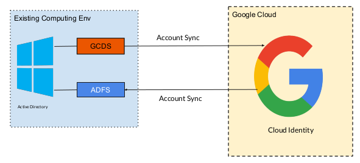
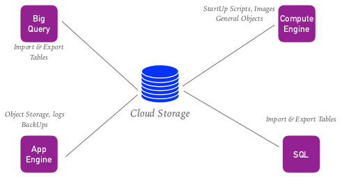
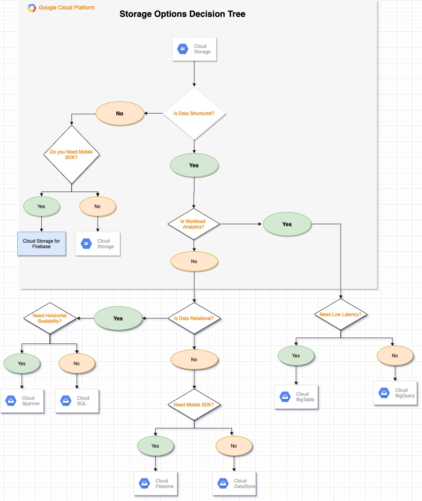

[TOC]


# Cloud Resource Management

## GCP resource Hierarchy

- Hierarchy of Ownership is via parent/child relationship.

  - It is similar to Traditional File System. 
  - File System like 
    - Each Child will have only One parent
    - Permissions are inherited from Top to Down
    - More permissive Parent Policy always overrules more Restrictive Child Policy.

- The Primary concept that governs it is - IAM

### Google Cloud Resource Hierarchy

#### 1. Organizations (root Node)

Key Roles:

- IAM Access Applied to org resource, applied to all below hierarchy.
- Can Grant Access to Different People
- Organization Admin - Full Power to edit all Permissions.

- Organization Owner - Reserved for G Suite Super Identity.

#### 2. Folders (Optional)

- Additional Grouping between Projects
- IAM Role Applied to Folder will be applied to all Projects inside
- Useful for Grouping by Department
- Note - Removing Projects from Folder will removed folder applied Rules as well.

#### 3. Projects (25 Project Limit for Single Account)

- Core Organizational Component

- Required to Use any GCP Resource

- Basic of Every GCP Service

  

- Unique Project ID (Globally Unique)

- Project Number (Auto Generated)

- Project Name - User Friendly Self Generate Value

#### 4. Inside Resources

- Compute Engines, Network, Storage etc

### Policy Inheritance 

- **Child Node Inherit parent permission**
  Example: 
  Project Viewer Role granted Organizational Node will be apply to all Folders, Projects and Down the line resources.
- **More Permissive Parent Policy will always overrule restrictive child policy.**
  Example: 
  If User ‘X’ have Project Editor Role at Folder level, you can’t remove Compute Admin Role at Project level.


## Labels in GCP

### What are Labels?

- Labels are kind of Sticky Notes which you can apply on Google Resources.
- For Labels, there is no set of Rules. You can use labels as per your need.
- Labels are useful for search resources in cloud.

### How Labels Work?

- Labels are key-value pair.
- Key is unique Identifier and Value can be Duplicate/Empty.
- User is allowed to put **64 Labels/ resource**.
- Examples:
  - Define Cost Center/Location
  - Define Resource Environment/Project
  - Define Service Type/owner
  - Define Resource State ready, inuse, ready for deletion etc

### Labels vs Network Tags

**Labels**

- Can be applied across all GCP resources.

- Can be Applied for Monitoring Purpose.

- Cannot affect the resource Operations.

**Network Tags** 

- Only for Network/VPC Resource.
- Affects resource Operation (Firewall Rule Access, Network Route)

## Quotas

Goto **IAM & Admin** > **Quotas**

### What is resource quota?

- Capping Limit on resources that you create. Resource limit on Project wise.

- It prevent unexpected spikes in resources.

### Types :

1. Resource per Project.
2. API Rate Limit Request.
3. API Resource Quota.

### Why we need Quota?

- Programmatic Error in Resource Creation can lead to massive unwanted cost.
- Protection from Unexpected Spikes in Resource uses.
- Review Sizing Consideration.
  Example: 
  Do you really need 124 vCPU Machine.

### Increasing Quota

- Most Quota is soft capping, and can be increasing on request.
- Quotas can be viewed in Console.
- Best Practice - Pro activity request increase for expected Demand.


## Cloud IAM (Identity Access Management )

- IAM is core fundamental requirement to pass the Exam, plus a day to day performing role of Cloud Architect.
- Technical Definition - “With Cloud IAM you can grant granular access to specific GCP resource and prevent unwanted access to other resources. Cloud IAM lets you adopt the security principle of least
  privilege, so you grant only necessary access to your resources.”

### Who Can do what on which resources?

1. Who = **Member**

2. Can Do What = **Role**

3. On Which Resources = **Resources in GCP**

#### 1. Who = Member = Identity

1. **Person Authenticate with Identity** (email address)
2. **Service Account** 
   - Server/Application access account, not associated with any person.
   - Special Type of Account, Not Attached to User.

#### 2. Can do What = Role = Group of Permissions

- Permission : What operation is allowed on Resource
- Permission Format : service.resource.verb

  - compute.instances.edit
- Permissions are not directly assigned to a Member (Who)
- Permissions are bundled in Roles - Roles further assign to Members
    - Multiple Roles can be assigned to Single Member

**Type of Roles**

1. **Primitive**
   - Broad, original roles available in GCP
   - Applied across entire environment
   - Owner: Modify all resource and manage IAM and Billing
   - Editor: Modify all resource and No access to IAM and Billing
   - Viewer: Only view resource
2. **Predefined**
   - More Granular, specific access not access the entire project
   - Applied to single service
     - Example compute.storageAdmin - Allow Full control of Compute Engine storage resources.
3. **Custom**
   - Even more granular than Predefined Roles
   - Hand Made Group of Permissions

#### 3. On Which Resources = Resources in GCP

- All of the component of GCP
- Including Organization, Folder, Projects and resources inside.
  - Compute Engine, App Engine, ML APIs, Data Services, Network etc.

### Cloud Identity Sync with Active Directory

#### Why it all required?

- Business are not using G Suite to to manage the user Accounts.

- Separate maintenance of User Account is not a good idea.

- Need of Single Source of identity to Manage Both GCP and Non GCP Identities.

#### How it works?

- Cloud Identity maps Active Directory Accounts to Cloud Identity Accounts
  - Mapping is called **Federation**
- Active Directory is “Single Source of truth”.
- Sync AD → CI , Not applicable CI → AD
- All users and password management done in AD like-
  - Create/Modify/Delete in AD
  
  - CI Automatically creates Google account from AD Accounts

  - Provides single sign-on capability to GCP
  

#### How to Sync?

- Google Cloud Directory Sync (GCDS)
  - Google Sync Tools run on AD Server
- Active Directory Federation Service (ADFS)
- Microsoft Tool




### Cloud IAM Policies

- Access control for Google Cloud resources is managed by Cloud IAM policies. A Cloud IAM policy is directly attached to a resource.

- The policy manages access to the resource itself as well as any child resources through policy inheritance.

- A policy is a collection of bindings, audit configuration, and metadata.

  - Binding - specifies how access should be granted on resources with context specific conditions.
    - Fields of Binding 
      - A Member
      - A Role
      - A Condition - Conditions are typically used to control whether access is granted based on the context for a request.
    
  - Audit Config - how access attempts should be audited.
  
  - Metadata - includes additional information about the policy, such as an etag and version to facilitate policy management.
    - etag - used for concurrency control, and ensures that policies are updated consistently.
    - Version - specifies the schema version for a given policy.

- Uses of etag - etag is used to avoid the race conditions on IAM Policies.
  
- When multiple systems try to write to the same Cloud IAM policy at the same time, there is a risk that those systems might overwrite each other's changes.
  
- This risk exists because updating a Cloud IAM policy involves multiple operations:
  
  - Reading the existing policy

  - Modifying the policy

  - Writing the entire policy

- To help prevent this issue, Cloud IAM supports concurrency control  through the use of an etag field in the policy. The value of this field changes each time a policy is updated.

- **Policy Example**

```
{
"bindings": [
  {
   "members": [
   "group:prod-dev@example.com",
   "serviceAccount:prod-dev-example@appspot.gserviceaccount.com"
   ],
   "role": "roles/appengine.Deployer",
   "condition": {
      "title": “Expires_July_1_2025",
      "description": "Expires on July 1, 2025",
      "expression":
         "request.time < timestamp('2025-07-01T00:00:00.000Z')"
    }
   }
  ],
  "etag": "BwWKmjvelug=",
  "version": 3
}
```

- Every Google Cloud resource that supports a Cloud IAM policy at its level in the resource hierarchy can have a maximum of one policy.
- Each Cloud IAM policy can contain up to 1,500 members. Up to 250 of these members can be Google groups.
- Any policy changes will take effect within 60 seconds.
- Policy Hierarchy works on water-fall model. All child will have the policy applied on parent resources.


### Cloud IAM : Service Accounts

#### What is Service Account?

- Special Type of Account, Not Attached to User.
- Service account represent by email address-
  - 1234-compute@developer.gserviceaccount.com
- Allow authentication between Application and GCP Services.
- By Default, GCE instances use Service account to access GCP services.

#### Types of Service Account.

1. Google Managed

   - Represent different google services and automatically generate IAM Roles.
2. User Managed
   - Created for/by you. Based on Enable APIs in Project
   - [project-number]-compute@developer.gserviceaccount.com
   - [project-id]@appspot.gserviceaccount.com
   - Service Account can also be assigned to Person Email(Member)

- Service Account keys
- Service Account access managed by account keys.
  - Assume it like a account password
- Default Service account keys are managed by google and can’t be accessed and edited.
- Custom service account can use (custom) user managed Keys-
    - Google Maintain Public Copy but Private key is user Managed.
    - If user lose private key, Google cannot retrieve it.
    - Can Also Used Google Managed Keys.

### Cloud IAM Best Prctices

- Efficient architecture is always needed to avoid huge Maintenance cost.
- Cloud Identity and Access Management (Cloud IAM) policies can be set at different levels of the resource hierarchy.
- Resources in GCP inherit the policies of the parent resource. The effective policy for a resource is the union of the policy set at that resource and the policy inherited from its parent.
- User is open to set Policies at any Level Organisation Level, Folder Level, Project Level or Resource Level.

**Best Practices**

- Organization and folder level structures are recommended for Big Firms, start-up can use the flat structure.
- Set policies at the organization level and at the project level rather than at the resource level.
- Grant roles to a Google group instead of to individual users when possible.
- Use the security principle of least privilege to grant Cloud IAM roles; that is, only give the least amount of access necessary to your resources.
- If user need to grant a role to a user or group that spans across multiple projects, set that role at the folder level instead of setting it at the project level.
- Audit the ownership and the membership of the Google groups used in policies.

### Cloud Billing

**Setting Up and Monitoring is essential Architect Skill.**

- Grant IAM Roles to users to Create, Manage and use Billing Accounts.

- Monitor Cost and SetUp Project Budget and Alert

- Manage Billing Data for Retention and Analysis.

**Billing and Cloud IAM**

- Assign Mostly at organization level or within Billing Account.
- Billing Roles are Defined in Cloud IAM.

**Billing + Cloud IAM**

- Billing Account Creator

  - Create new Organization Level Billing Account
- Billing Account Administrator
    - Manage Billing Accounts
    - Configure Billing Expost
    - Link/Unlink Projects
    - Manage Billing User Roles
- Billing Account User
  - Link Project with Billing Account
- Billing Account Viewer
- View Billing Information (Finance Team)

**View and Manage Billing Data.**

- How much you are paying, and for what?
- View Billing Data in Web Console.
  - View Treds, Current resource Billing
- Export Billing Data to Cloud Storage and Big Query
    - Forwards Export to finance Department/ Auditor
- SetUp Project Budget and Alert
  - Doesn’t stop billing resource uses, Just send Alert.


## GCP : Operations Overview

### Stack Driver 

**What is Stack Driver?**

- Tool used for Monitoring, Logging, and Tracking for application Operations.
- Native Monitoring for GCP & AWS.
- Dynamically Discover all GCP resources.
  - Install StackDriver Client on VMs.

**StackDriver/Operations Benefits**

- Multi Cloud Monitoring GCP & AWS.
- Identify behaviour and proactively fix the issues.
- Centralized Logging Mechanism.
- More Relevant and Accurate Alerts.
- Find and Fix Problems Faster.

###  Logging
- Central Collection for all activity logs.

#### Logging Operations

- GCP provider single repository for all Logging Data from multiple source.
- Store, search & analyze logs.
- Can collect Platform, System and Application logs.
- Realtime and Batch Monitoring.
- Export logs to other source for long term storage/analysis.

#### Concept and Terminology

- Associated by project.
  - Logs viewer only shows logs for one project.

- Log Entry - record status and events.

- Named collection of log entries.

- Dynamic log retention period.

  
  

#### Log Types

- Who did what, where and when.
- Audit logs-
  - Admin Activity, System Activity, Data Access
- Agent Logs
- Agent Installed on VMs
- Record VM system and third party app logs

Admin Activity / System Event Logs

- Administrative Actions and API Calls

  - User ‘X’ created a Instance

- System Event Logs
- Like Live Migration Event

#### Data Access Logs

- Logs API Call that Create, Modify or Read user data
- Default off, can become Huge
- Chargeable after defined Limit.

#### Agent Logs

- Agent Installed on Support VM’s

- Logs data from Third Party applications.

- Chargeable after the Limit.

#### Pricing

- First 50GB/Project/Month Free - $0.5/GB
- Admin and System Event Logs Exempt

#### Retention

- Admin Activity - 400 Days

- Data Access - 30 Days

- System Events -  400 Days

- Access Transparency - 400 Days

- All Other Logs - 30 Days

#### Exporting Logs (Imp Topic)

- After Retention, Logs are delete and can’t recover.
- Export Logs for long term retention.
- Long Term Storage(Cloud Storage), Big Data Analysis(Big Query),
- System to Other Source(Pub/Sub)

#### Exporting Logs basics 

- Require a Project and Destination Service
- Filter - Filter Logs Type to Export
- Destination - Cloud Storage, Big Query, Pub/Sub
- Filter and Destination configure using Sink - Direct What logs to copy to which location
- Only new logs will be exported after sync creation

#### IAM Roles

- Logging Admin - Have Full control. Ability to add others to logging IAM
- Logs Viewer - Can View Logs
- Logs Writer - Grant Service Account Ability to create Logs.
- Log Config Writer - Create Metrics and Export Sinks

### Monitoring 
- Monitor Metric, HealthChecks, Dashboard and Alerts.
- Operations Monitoring monitor the complete GCP Environment.
- What is Up? What is Down? What is Overloaded?
- Monitor System and Application Metrics.
- Interact with Logging System.
- Easy to view Dashboard, Alerts.
- Uptime check for External Applications
  - Must be public and allow traffic for liveness.

#### Possible Exam Topics

- Troubleshoot reachability with External Source.
- Familiar with Logging/Monitoring Agent
- Understanding, how to use monitoring with Logging and Alerts

#### Pricing

| Feature              | Price                                                        | Allotment/Month                                              |
| -------------------- | ------------------------------------------------------------ | ------------------------------------------------------------ |
| Monitoring Data      | 150Mb - 100Gb - $0.25/Mb<br/>100Gb - 250Gb - $0.15/Mb<br/>>250Gb - $0.06/Mb | All GCP Metrics First<br/>150Mb/Month per Billing<br/>Account |
| Monitoring API Calls | $0.1/1000 API Calls                                          | First Million API Calls                                      |

#### Stackdriver Agent

- Software Installed on VMs
- In absence of Agent, still get CPU, Disk, Network Traffic, Uptime Info.
- Agent to access external Application logs
- Can Monitor Third Party Applications

#### Best Practice 

- Create Single Project for Monitoring Purpose

  - Monitor All Resource GCP/AWS across the Projects

  - IAM Control, Separate stackdriver accounts for data and control isolation.


- Calculate/Predict Monitoring Needs in advance

### Error Reporting
- Identify and Understand Applications Errors.
- Error Reporting - Realtime Error monitoring and Alert mechanism.
- Write to Logging or Error Handling APIs
- Built in, Google App Engine & Cloud Functions - Auto Enabled
- Compatible with GAE(Flexible), GCE, GKE, EC2
- VM machine needs Agent Installation
- Support - Java, Python, Ruby, C#, PHP, Go & JavaScript

### Trace
- Find Latency Bottleneck in applications.
- Trace - Find Performance Bottleneck (Loading Time)
- Collects data from GCP Services like - App Engine, GCP Load Balancers.
- Integrated with App Engine.
- Available for Services like - GKE, GCE, GAE (Flexible)
- Can be Installed on Non-GCP resources.

#### Trace can answer below questions

- How long does my application take to handle a Request?
- Why application taking long to handle a request?
- Why some specific requests are taking longer?
- Which service/microservice is calling latency in system?
- Latency status over the time?
- What steps can be followed to reduce the latency?

#### Possible Exam Topics

- Conceptual Knowledge of, How individual product can solve real time business problems.
- Interaction with Logging Component.

### Debugger
- Find/Fix code error in production.
- Debug - Debug Application.
- Inspect Application State without stopping or slowing App.
- Doesn’t require Adding Log Statement
- Available for GKE, GCE, GAE
- Support - Java, Python, Go, Node.js
- Can be Installed on Non-GCP Resources.

### Profiler 
- Collect CPU/Memory Data, Optimize Performance.

## Cloud Storage

- Google Cloud Storage is a RESTful online file storage web service for storing and accessing data on Google Cloud Platform infrastructure.
- It is an Infrastructure as a Service (IaaS), comparable to Amazon S3 online storage service.
- Cloud Storage is unified object storage service.
- Cloud Storage is a persistent storage, it is durable, replicated and also made globally available via HTTP URL.
- Cloud Storage is auto scalable service.
- Cloud Storage is not a File System, because each item in cloud storage have unique URL.

### Key Terms

- **Buckets**: Basic containers that hold your data. Everything that you store in Google Cloud Storage must be contained in a bucket. You can use buckets to organize your data and control access to your data, but unlike directories and folders, you cannot nest buckets.
- **Bucket names**: Should be unique as the name of the buckets stored in single Cloud Storage namespace. Also, bucket names can be used with a CNAME redirect, which means they need to
  conform to DNS naming conventions.
- **Bucket labels**: Bucket labels are key:value metadata pairs that allow you to group your buckets along with other Google Cloud.

- **Objects**: Objects are the individual pieces of data that you store in Google Cloud Storage.
- Objects have two components: **object data** and **object metadata**.
  - The **object data** component is usually a file that you want to store in Google Cloud Storage.
  - The **object metadata** component is a collection of name-value pairs that describe various object qualities.
  - There is no limit on the number of objects that you can create in a bucket.

- Cloud Storage objects are immutable.
- Cloud Storage allow to version the stored objects.
- Object Versioning needs to be enable explicitly, in absence of Object Versioning, new objects terminates the old.
- Cloud Storage offers life cycle management policy for the objets in bucket.


### Cloud Storage Class

|                       |       Multi Regional       |              Regional               |            Nearline             |            Coldline            |
| --------------------- | :------------------------: | :---------------------------------: | :-----------------------------: | :----------------------------: |
| **Intended for Data** |  Most Frequently Accessed  | Accessed Frequently within a Region | Accessed less than once a month | Accessed less than once a Year |
| **Availability SLA**  |           99.95%           |               99.90%                |             99.00%              |             99.00%             |
| **Access APIs**       |         Consistent         |             Consistent              |           Consistent            |           Consistent           |
| **Access Time**       |     Milisecond Access      |          Milisecond Access          |        Milisecond Access        |       Milisecond Access        |
| **Use Cases**         | Content Storage & Delivery |   In-region Analytics, Transcodng   |   Long-tail contents, Backups   |  Archiving, Disaster Recovery  |

### Cloud Storage with Other GCP Services




# gsutil command

### Command line managing bucket

**Create bucket**

```
gsutil mb -l asia-east1 -c Nearline gs://doh-bucket1
```

 **Remove bucket**

```
gsutil rb gs://doh-bucket1
```

**Copy file to bucket**

```
gsutil cp my-service.yaml gs://doh-bucket1                               
```

**Make file available to public**

```
gsutil acl ch -u AllUsers:R gs://doh-bucket1/my-service.yaml
```

**Copy file from bucket to another bucket** 

```
gsutil cp gs://doh-bucket1/my-service.yaml gs://doh-website-bucket/
```

List the files in your bucket****

```
gsutil ls gs://doh-website-bucket
gs://doh-website-bucket/backup-doh.gov.ph-10-17-2022.tar.gz
gs://doh-website-bucket/backup-doh.gov.ph-11-14-2022.tar.gz
gs://doh-website-bucket/szelsaqkuoxz_centraldoh.sql.gz
gs://doh-website-bucket/szelsaqkuoxz_centraldoh_10172022.sql.gz
```

**Enable versioning in bucket**

```
# Check versioning status
$ gsutil versioning get gs://doh-bucket1
gs://doh-bucket1: Suspended

# Enable versioning in bucket
$ gsutil versioning set on gs://doh-bucket1
Enabling versioning for gs://doh-bucket1/...

# Check versioning status
$ gsutil versioning get gs://doh-bucket1
gs://doh-bucket1: Enabled
```

**Configure life cycle policy in your bucket**

```
# Check if there is life cycle policy in your bucket
$ gsutil lifecycle get gs://doh-bucket1
gs://doh-bucket1/ has no lifecycle configuration.

$ gsutil lifecycle set bucket_lifecycle.json gs://doh-bucket1
```

bucket_lifecycle.json

```json
"lifecycle": {
    "rule": [
    {
        "action":{"type":"Delete"},
        "condition":{
            "age": 30,
            "isLive": true    
        }
    },
    {
        "action":{"type":"Delete"},
        "condition":{
            "age": 10,
            "isLive": false
        }    
    }    

]
}
```

**Set file to private**

```
$ gsutil acl set private gs://levelup-set-storage/file1.png

# Get ACL
$ gsutil acl get private gs://levelup-set-storage/file1.png

# Change permission
$ gsutil acl ch -u AllUsers:R gs://levelup-set-storage/file1.png

```


## Transfer Services

- Complete large-scale online data transfers from online and on-premises sources to Cloud Storage.
- Transfer Service Cloud and Transfer Service on-premises are highly performant pathways to Cloud Storage—both with the scalability and speed you need to simplify the data transfer process.
  - **Transfer Service for cloud data** - Set up a recurring transfer schedule. Transfer data within Cloud Storage from one bucket to another.
  - **Transfer Service for on-premises data** - Transfers from on-premises sources to Cloud Storage. Scale to available bandwidth and deliver seamless transfers in minutes.

### Use Cases of Transfer Services

- Data Center Migration
- BackUp & Archival
- Analytics & Machine Learning
- Content Storage & Delivery

# gcloud command

**Activate service account**

```
$ gcloud auth activate-service-account --key-file lms-clients-330406-b49103cfd582.json

Reinitialize gcloud
$ gcloud init
```

**Custom encryption key in cloud storage**

https://cloud.google.com/storage/docs/encryption/using-customer-supplied-keys#gsutil

generateKey.py

```
#!/usr/bin/env python

# Copyright 2019 Google, Inc.
#
# Licensed under the Apache License, Version 2.0 (the "License");
# you may not use this file except in compliance with the License.
# You may obtain a copy of the License at
#
#    http://www.apache.org/licenses/LICENSE-2.0
#
# Unless required by applicable law or agreed to in writing, software
# distributed under the License is distributed on an "AS IS" BASIS,
# WITHOUT WARRANTIES OR CONDITIONS OF ANY KIND, either express or implied.
# See the License for the specific language governing permissions and
# limitations under the License.

# [START storage_generate_encryption_key]
import base64
import os


def generate_encryption_key():
    """Generates a 256 bit (32 byte) AES encryption key and prints the
    base64 representation.
    This is included for demonstration purposes. You should generate your own
    key. Please remember that encryption keys should be handled with a
    comprehensive security policy.
    """
    key = os.urandom(32)
    encoded_key = base64.b64encode(key).decode("utf-8")

    print(f"Base 64 encoded encryption key: {encoded_key}")


# [END storage_generate_encryption_key]

if __name__ == "__main__":
    generate_encryption_key()
```


# Manage Databases

- Multiple Managed Databases.
- Each Managed DB services are for specific purpose.
- Architect Exam will test ability to select Correct DB Service.
- Different DB Services using different ‘stuff’, for different requirements.

## Main Factor, which differentiate in these services

- Scalability/Availability/Performance
- Relational vs Non-Relational Database
- Transactional vs Analytical DBs

## How DB Scalability Works.

- Availability (Regional vs Global) , Capacity, Performance
- Horizontal vs Vertical Scaling
  - **Horizontal** - Add more resources (New Machines) to share the load.
  - **Vertical** - Adding More Compute Resources in exiting machine.

## Google have multiple Managed Database Services.

- Cloud SQL
- Cloud Spanner
- BigQuery
- Cloud BigTable
- Cloud Firestore/Datastore
- Cloud MemoryStore

## Decision Tree of Storage Options




| Category           | Product                    | Application                                                  |
| ------------------ | :------------------------- | :----------------------------------------------------------- |
| Object Storage     | Cloud Storage              | - Streaming Videos<br/>- Image and Web Asset Libraries       |
| Block Storage      | Persistent Disk            | - Disks for VMs<br/>- Share Read Only Data Across the VMs<br/>- Rapid, Durable BackUp of Running VMs<br/>- Storage for Database |
| Block Storage      | Local SSD                  | - Flash Optimized Database<br/>- Hot Caching Layer for Analytics<br/>- Application Scratch Disk |
| Archival Storage   | Cloud Storage              | - BackUps<br/>- Media Storage<br/>- Long Tail Content        |
| Mobile App Service | Cloud Storage for Firebase | - User Generated Content<br/>- Uploads over Mobile Network<br/>- Robust Upload and Downloads<br/>- Strong User Base Security |
| File Storage       | Google Workspace           | - Access files from Anywhere from Drive<br/>- Stay Connected with Colleagues Through GMail, Calendar, Chat & Meet |
| Build Artifacts    | Artifact Registry          | - CI/CD Integrations<br/>- Centralized Container Images Storage.<br/>- Built-in Container Image Scanning for Vulnerabilities |

## Cloud SQL

- is a fully managed relational database service for MySQL, PostgreSQL, and SQL server.
- is fully compatible with applications using MySQL, PostgreSQL, and SQL Server. You can connect with nearly any application, anywhere in the world.
- Cloud SQL automates - Backups, Replication, and failover to ensure your database is reliable, highly available, and flexible to your performance needs.
- Easy integration with your workstation, as well as App Engine, Compute Engine, Kubernetes, and BigQuery

### Features Of Cloud SQL

- Google Cloud SQL is fully managed by Google.
- Uses open source databases that are among the most popular ones worldwide, i.e., MySQL databases.
- Can access and manage instances through a command-line interface or a web console without difficulty.
- Pay-per-use option is quite inexpensive. By paying only for the time for which you access data, you save money.
- Avoid lock-in of data while migrating data on to or off the Google Cloud platform through JDBC, MySQL Wire Protocol and mysqldump.
- Failover among the many physical locations where data is replicated is automatic. So, even if there is a major failure, your data is secure and your database is available.
- Connecting with the secure sockets layer (SSL) protocol.
- Greater durability and availability of data which is replicated in various geographic locations.
- Availability of instances in Asia, EU and the US.

### Start with Cloud SQL

- Create a Google Cloud SQL instance and configure it with an IP address to be
  able to connect to it.
- Use the MySQL client to connect a Google Cloud SQL – install the MySQL client; use the IP address you created to connect to the instance; create a table and a database, key in some data and query it.
- Configure a Google Cloud SQL instance – configure access; set a root password; create, delete, restart and edit instances; configure SSL for instances; view information about instances; export or import data; configure point-in-time recovery and schedule backups.
- Connect to a Google Cloud SQL instance – from App Engine Go apps; using MySQL client; from App Engine PHP apps; from reporting and admin tools; from App Engine Python apps; from external apps; from App Engine Java apps; from Google Apps Scripts

#### Manage Cloud SQL

- **Creating an instance** – While creating a Google Cloud SQL instance, the name of the instance is the only configuration setting needed.
- **Editing an instance** – You can edit an instance and change its settings at any time after you have created it.
- The change is applied immediately for all instance settings except for size of the instance.
- **Restarting an instance** – An instance is stopped as all connections from it are drained. Google Cloud SQL restarts the instance when there is a fresh connection request for the instance, until which the instance stays shut.
- **Deleting an instance** – When deleted, the data in an instance is lost permanently and it is a good practice to delete an instance following a scheduled backup or export of the instance.
- **Configuring SSL for instances** – You can use the SSL protocol to connect to a Google Cloud SQL instance. You can configure the instance to be able to connect to it through SSL, once you
  have created it.
- **Adding project members** – If you are the owner of a project, you may have to add project members who are allowed to manage instances. Use the Google Cloud SDK or the Google Developers Console to add editors and project owners.

1. Connect with CLOUD SQL DB

```
gcloud sql connect <INSTANCE_NAME> --user=root
```

2. Create Database.

```
create database [databasename];
```

3. Use Specific DataBase.

```
use [db name];
```

4. List all databases on the sql server.

```
show databases;
```

5. To see all the tables in the db.

```
show tables;
```

6. To see table's field formats.

```
describe [table name];
```

7. To delete a db.

```
drop database [database name];
```

8. To delete a table.

```
drop table [table name];
```

9. Show all data from a table.

```
SELECT * FROM [table name];
```

10. To return columns and column information.

```
show columns from [table name];
```

11. Create the table "products".

```
CREATE TABLE products (
         productID    INT UNSIGNED  NOT NULL AUTO_INCREMENT,
         productCode  CHAR(3)       NOT NULL DEFAULT '',
         name         VARCHAR(30)   NOT NULL DEFAULT '',
         quantity     INT UNSIGNED  NOT NULL DEFAULT 0,
         price        DECIMAL(7,2)  NOT NULL DEFAULT 99999.99,
         PRIMARY KEY  (productID)
       );
```

12. Show all the tables to confirm that the "products" table has been created

```
SHOW TABLES;
```

13. Describe the fields (columns) of the "products" table

```
DESCRIBE products;
```

14. Show the complete CREATE TABLE statement used by MySQL to create this table

```
SHOW CREATE TABLE products \G
```

15. Insert a row with all the column values

```
INSERT INTO products VALUES (1001, 'PEN', 'Pen Red', 5000, 1.23);
INSERT INTO products VALUES
         (NULL, 'PEN', 'Pen Blue',  8000, 1.25),
         (NULL, 'PEN', 'Pen Black', 2000, 1.25);
INSERT INTO products (productCode, name, quantity, price) VALUES
         ('PEC', 'Pencil 2B', 10000, 0.48),
         ('PEC', 'Pencil 2H', 8000, 0.49);
INSERT INTO products (productCode, name) VALUES ('PEC', 'Pencil HB');
```


```
SELECT * FROM products;
```


16. Sample MySQL DataSet from github.

```
https://github.com/datacharmer/test_db.git
```


17. Run SQL file on your MySQL Instace.

```
gcloud sql connect <INSTANCE_NAME> --user= root < <SQL_FILE_NAME>
```

## Cloud Spanner

- Cloud Spanner is a fully managed, scalable, relational database service for regional and global application data.

- Cloud Spanner is the first scalable, globally-distributed, and strongly consistent database service built for the cloud specifically to combine the benefits of relational database structure with non-relational horizontal scale.

- Cloud spanner delivers high-performance transactions and strong consistency across rows, regions, and continents with an industry-leading 99.999% availability SLA, no planned downtime, and enterprise-grade security.

- Cloud Spanner: The best of the relational and non-relational worlds

  |              | Cloud Spanner | Traditional Relational | Traditional Non-Relational |
  | :----------: | :-----------: | :--------------------: | :------------------------: |
  |    Schema    |      Yes      |          Yes           |             No             |
  |     SQL      |      Yes      |          Yes           |             No             |
  | Consistency  |    Strong     |         Strong         |          Eventual          |
  | Availability |     High      |        Failover        |            High            |
  | Scalabitity  |  Horizontal   |        Vertical        |         Horizontal         |
  | Replication  |   Automatic   |      Configurable      |        Configurable        |

- Customers across industries can use Cloud Spanner to deliver value to their customers:

  |                 Use Case                  |                     Before Cloud Spanner                     |                      With Cloud Spanner                      |
  | :---------------------------------------: | :----------------------------------------------------------: | :----------------------------------------------------------: |
  |             Financial trading             | Inconsistencies lead to potential monetary loss during reconciliation. Global synchronous replication of trades is not feasible. |     Cost savings and a consistent, unified, global view.     |
  |                 Insurance                 |    Inconsistencies lead to incomplete views of customers.    | Up-to-date customer views provide more accurate, real-time data. |
  |            Global call centers            |                  Eventual and out-of-touch.                  |                  Eventual and out-of-touch.                  |
  | Supply-chain management and manufacturing | Global supply chain presents an inconsistent global view and/or data must be shipped in batches. | Global, real-time, consistent view enables real-time decision making. |
  |            Telecom and billing            | Processing capacity limited to finite scale-up compute resources. |         Scale-out allows improved processing speed.          |
  |       Logistics and Transportation        |       Regional reach with many systems glued together.       |    Global reach with lower latency and a consistent view.    |
  |                  Gaming                   |         Each server or cluster is its own universe.          | Consistent, global view delivers a unified experience.Consistent, global view delivers a unified experience. |
  |                E-Commerce                 | Limited availability SLA or no SLA guarantees. In practice, potential missed sales. | Guaranteed max of 5 minutes of downtime (including planned downtime) on paper and in |

  

### Features Of Cloud Spanner

- **Global Scale** - Horizontally scalable across rows, regions, and continents, from 1 to hundreds or thousands of nodes.
- **Fully Managed** - Ease of deployment at every scale and every stage. Synchronous replication and maintenance are automatic and built-in.
- **Relational Semantics** - Everything you would expect from a relational database—schemas, ACID (Atomicity / Consistency / Isolation / Durability) transactions, and SQL queries.
- **Multi-Language Support** - Client libraries in C#, Go, Java, Node.js, PHP, Python, and Ruby. JDBC driver for connectivity with popular third-party tools.
- **Transactional Consistency** - Purpose-built for external, strong, global transactional consistency.
- **Enterprise Grade Security** - Data-layer encryption, IAM integration for access and controls, and audit logging.
- **Highly Available** - Whenever, wherever, your data is highly available.

## Big Query

**Why Do You Need a Data Warehouse?**

- A data warehouse is the most valuable asset of your BI (Business Intelligence) team 

**How it works:** 

  - Data are extracted on a periodic basis from source systems and moved to a dedicated server that contains the data warehouse 

  - During this process, the data are cleaned, formatted, validated, reorganized, summarized, and integrated with other sources 

**A data warehouse delivers value to companies through:** 

- The generation of scheduled reports 
  
- Packaged analytical solutions 
  
- Adhoc reporting and analysis 
  
- Dynamic visualization 
  
- Storage of historical data
  
- Data mining
  

**Choosing a Data Warehouse** 

- There are many factors to consider when choosing a data warehouse: 
  - Assets: generation of big data reports requires expensive servers 
  - People: skilled database administrators are needed to manage data integrity 
  - Cost: interacting with big data can be expensive, low, and inefficient 
  - Scale: how much storage is needed and will storage needs change over time? 
  - Security: how is data protected to ensure availability and durability?

### What is BigQuery

- BigQuery is Google's serverless cloud storage platform designed for large data sets. BigQuery in Non-RDBMS column base DataBase in Google Cloud Infra. 
- Google BigQuery is an enterprise data warehouse built using BigTable and Google Cloud Platform.
- BigQuery works great with all sizes of data, from a 100 row Excel spreadsheet to several Petabytes of data. 
- BigQuery is Google's fully managed solution for companies who need a fully-managed and cloud based interactive query service for massive datasets. 
- BigQuery is super-fast and execute search on million of rows in seconds. BigQuery is great alternative of Apache Hive, and used in analytics. 
- BigQuery is not solution for Transactional Data Operations. It’s ideal for BigData Solutions.
- BigQuery supports SQL-like query, which makes it userfriendly. 
- BigQuery accessible via its web UI, command-line tool, or client library (written in C#, Go, Java, Node.js, PHP, Python, and Ruby) using RestAPIL. 
- BigQuery use the Columnar storage. 
- BigQuery achieves very high compression ratio and scan throughput. BigQuery, user can directly operate on compressed data without decompressing it.

### Why BigQuery? 

- Service for interactive analysis of massive datasets (TBs) 

  - Query billions of rows: seconds to write, seconds to return 

  - Uses a SQL-style query syntax 

  - It's a service, can be accessed by a API
- Reliable and Secure 
  
    - Replicated across multiple sites 
    
    - Secured through Access Control Lists
    
- Scalable 

  - Store hundreds of terabytes 

  - Pay only for what you use 
- Fast 
    - Run ad hoc queries on multi-terabyte data sets in seconds

### BigQuery Organization 

**BigQuery is structured as a hierarchy with 4 levels:** 

- **Projects**: Top-level containers in the Google Cloud Platform that store the data 
- **Datasets**: Within projects, datasets hold one or more tables of data
- **Tables**: Within datasets, tables are row-column structures that hold actual data 
- **Jobs**: The tasks you are performing on the data, such as running queries, loading data, and exporting data

**Projects** 

- Projects are the top-level containers that store the data 

- Within the project, you can configure settings, permissions, and other metadata that describe your applications 

- Each project has a name, ID, and number that you'll use as identifiers 

- When billing is enabled, each project is associated with one billing account but multiple projects can be billed to the same account 

**DataSets** 

- Datasets allow you to organize and control access to your tables 
- All tables must belong to a dataset. You must create a dataset before loading data into BigQuery 
- You can configure permissions at the organization, project, and dataset level

**Tables** 

- Tables contain your data in BigQuery 
- Each table has a schema that describes the data contained in the table, including field names, types, and descriptions
- BigQuery supports the following table types: 
  - Native tables: tables backed by native BigQuery storage 
  - External tables: tables backed by storage external to BigQuery 
  - Views: virtual tables defined by a SQL query

 **Jobs** 

- Jobs are objects that manage asynchronous tasks such as running queries, loading data, and exporting data

  - You can run multiple jobs concurrently 

  - Completed jobs are listed in the Jobs collection 

**There are four types of jobs:** 

- **Load**: load data into a table 
- **Query**: run a query against BigQuery data 
- **Extract**: export a BigQuery table to Google Cloud Storage 
- **Copy**: copy an existing table into another new or existing table

### BigQuery Applications

|         Business Need         |    GCP Data Solution     |
| :---------------------------: | :----------------------: |
| Compute Storage, Disk Storage |   Persistent Disk, SSD   |
|  Storing Media, Blob Storage  |      Cloud Storage       |
|    Document Database NOSQL    |        DataStore         |
|      Fast Scanning NOSQL      |         BigTable         |
|  SQL Interfasce at file Data  |         BigQuery         |
|    Analytics/Datawarehouse    |         BigQuery         |
|      Transactional RDBMS      | Cloud SQL, Cloud Spanner |

**BigQuery features for businesses **

- **Serverless Insight** : BigQuery has a serverless architecture, which allows user to scale your analytics automatically. 

- **Real-time analytics** : BigQuery machine learning offers real-time analytics. This has a high-speed streaming insertion API. 
  - With real-time analytics, you can input your latest business data and analyze it immediately. 
  
- **Logical data warehousing** : User can process external data sources through BigQuery. Its a great way to help you to input all your data and process it without every duplicating your data. \
  
- **Data transfer services** : Service allow user to transfer your data from external sources automatically. Great tool to merge data from multiple tools at one place. 
    - Can transfer data from Google Marketing Platform, Google Ads, YouTube, Partner SaaS applications to BigQuery, Teradata, Amazon S3
- **High Availability** : User can have multiple locations of storage and high availability for those locations.
- **Geoexpansion** : BigQuery machine learning gives you the option to control your geographic data. It only applies to the US, Asia, and Europe. 
- **Automatic Backup and Easy Restore** : Data is money, user don’t want to lose it while trying to process it. With BigQuery, information is automatically replicated and stored.

**BigQuery : Benefits of Use** 

- **Fast SetUp** : User can set up a data warehouse in seconds. As soon as your data warehouse is set up, you can start to query your data immediately. 

- **Easy to Use** : Building your own data center is not only expensive but time-consuming and challenging to scale. BigQuery makes the process simple. You load your data into the tool and only pay for what you use. 

- **Automatic Scale** : BigQuery separates storing and computing data. This process enables elastic scaling, which helps you scale at a higher performance rate. It works seamlessly for real-time analytics and appropriately scales your data. 

- **Data Protection** : BigQuery protects your data and maintains strong Security over it.

- Affordable : BigQuery’s pricing works with your business. You only pay for the resources you use.

- BigQuery charged separately for storage and streaming inserts. 

  For Storage: 

  - $0.02 per GB, per month 

  - $0.01 per Gb, per month for long-term storage
  
  For Streaming Inserts: 

  - $0.01 per 200MB

- Google also offers two subscription plans: 

  Pay-as-you-go: $5 per TB per month
