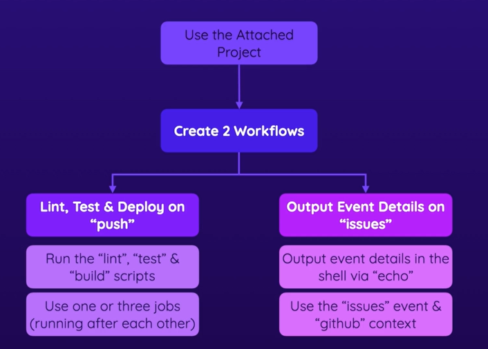

# Git commands
git init
- Initialize a Git repository (only required once per project)

git add
- Stage code changes (for the next commit)

git commit -m " ... "
- Create a commit for the staged changes (with a message)

git status
- Get the current repository status (e.g., which changes are staged)

git log
- Output a chronologically ordered list of commits

git checkout
- Temporarily move back to commit

git revert
- Revert the changes of commit (by creating a new commit)

git reset
- Undo commit(s) up to commit by deleting commits


# GitHub Actions 
## I. Basic Building Blocks & Components
### GitHub Actions Key Elements

GitHub Actions is a CI/CD and automation platform that enables you to automate build, test, and deployment workflows directly within GitHub,

#### 1. Workflow

A **workflow** is an automated process defined in a YAML file located in the `.github/workflows/` directory. A workflow contains one or more jobs and is triggered by events. 
```yaml
name: CI Pipeline
on: push
```

---

#### 2. Events (Triggers)

**Events** determine when a workflow runs. Common workflow triggers include:

- `push`
- `pull_request`
- `schedule`
- `workflow_dispatch`
- `release`

Example:

```yaml
on:
  push:
    branches:
      - main
```

---

#### 3. Jobs

A **job** is a set of steps that run on the same runner. Jobs run in parallel by default but can be configured to run sequentially when dependencies exist. 

```yaml
jobs:
  build:
    runs-on: ubuntu-latest
```

---

##### 4. Steps

A **step** is an individual task within a job. Steps execute sequentially and can either run commands or invoke actions. 

```yaml
steps:
  - run: npm test
```

---

#### 5. Actions

An **action** is a reusable component that performs a specific task, such as checking out source code, setting up a runtime environment, or deploying an application. 

```yaml
steps:
  - uses: actions/checkout@v4
```

---

#### 6. Runners

A **runner** is the environment that executes your workflow jobs. GitHub provides hosted runners, and you can also configure self-hosted runners. 
```yaml
runs-on: ubuntu-latest
```

##### Runner Types

- GitHub-hosted runners
- Self-hosted runners

---

#### 7. Secrets and Variables

**Secrets** securely store sensitive information such as API keys, passwords, and tokens. Variables are used to manage workflow configuration values. 
```yaml
env:
  APP_ENV: production
```

---

#### 8. Artifacts

**Artifacts** are files created during a workflow run that can be shared across jobs or downloaded after execution. Examples include build outputs, logs, and test reports. 


## Workflow Structure Overview

```text
Workflow
├── Event (Trigger)
├── Job 1
│   ├── Step 1
│   ├── Step 2
│   └── Action
└── Job 2
    ├── Step 1
    └── Step 2
```

## Summary

The core building blocks of GitHub Actions are:

1. **Workflow**
2. **Events (Triggers)**
3. **Jobs**
4. **Steps**
5. **Actions**
6. **Runners**
7. **Secrets and Variables**
8. **Artifacts**

Together, these components enable automated CI/CD pipelines and workflow automation within GitHub repositories. 

## Module Summary
### Core Components
- Workflows: Define Events + Jobs
- Jobs: Define Runner + Steps
- Steps: Do the actual work

### Defining Workflows
- .github/workflows/.yml (on GitHub or locally)
- GitHub Actions syntax must be followed

### Events / Triggers
- Broad variety of events (repository-related & other)
- Workflows have at least one (but possible more) event(s)
### Runners
- Servers (machines) that execute the jobs
- Pre-defined Runners (with different OS) exist
- You can also create custom Runners

### Workflow Execution
- Workflows are executed when their events are triggered
- GitHub provides detailed insights into job execution (+ logs)
 
### Actions
- You can run shell commands
- But you can also use pre-defined Actions (official, community or custom)

## Exercise


## Repositories
**1. First Action**

https://github.com/sherwin-ad/gh-first-action.git

**2. Second action React demo**

https://github.com/sherwin-ad/gh-second-action-react-demo.git

**3.  GH Exercise 1**

https://github.com/sherwin-ad/gh-exercise1.git

## II  Workflows & Events - Deep Dive

### Summary
#### Available Events
- There are many supported events
- Most are repository-related (e.g., push, pull_request)
- But some are more general (e.g., schedule)

#### Pull Requests & Forks
- Initial approval needed for pull requests from forked repositories
- Avoids spam from untrusted contributors

#### Activity Types
- The exact type of event that should trigger a workflow
- Examples: Opening or editing a pull request should trigger the wf

#### Cancelling & Skipping
- Workflows get cancelled automatically when jobs fail
- You can manually cancel workflows
- You can skip via [skip ci] etc. in commit message

#### Event Filters
- For push & pull_request: Add filters to avoid some executions
- Filter based on target branch and / or affected file paths

## III. Job Artifacts & Outputs