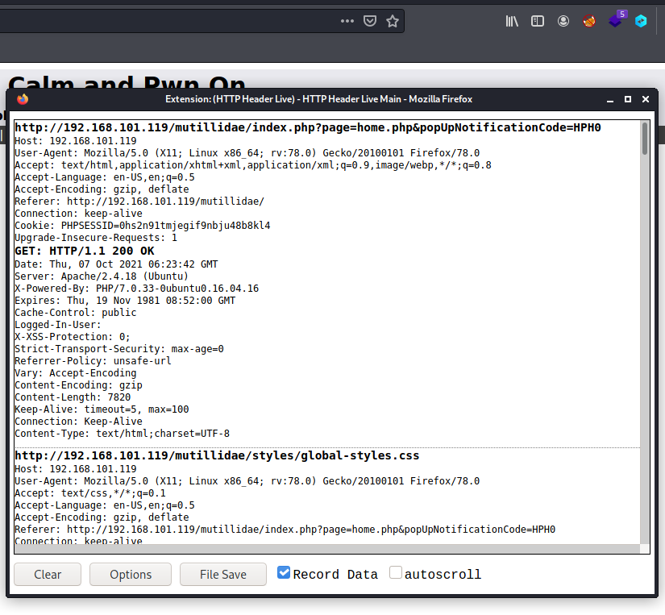
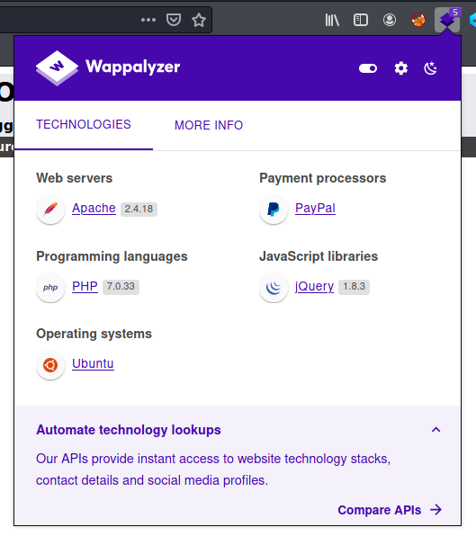

[TOC]


# Web Application VAPT Playbook

## 1. Information Gathering

### Banner grabbing/OS and Service enumeration

#### Netcat

```
# nc -v -n 149.56.244.87 80
(UNKNOWN) [149.56.244.87] 80 (http) open

HTTP/1.1 400 Bad Request
Date: Wed, 06 Oct 2021 06:11:39 GMT
Server: Apache/2.4.38 (Debian)
Content-Length: 305
Connection: close
Content-Type: text/html; charset=iso-8859-1

<!DOCTYPE HTML PUBLIC "-//IETF//DTD HTML 2.0//EN">
<html><head>
<title>400 Bad Request</title>
</head><body>
<h1>Bad Request</h1>
<p>Your browser sent a request that this server could not understand.<br />
</p>
<hr>
<address>Apache/2.4.38 (Debian) Server at 149.56.244.87 Port 80</address>
</body></html>
```

To remove bad request

```
# echo -ne "HEAD / HTTP/1.1\r\nHost: mutillidae.local\r\n\r\n" > tmp/request 
```

```
nc mutillidae.local 80 < tmp/request                                      
HTTP/1.1 200 OK
Date: Thu, 07 Oct 2021 06:59:05 GMT
Server: Apache/2.4.18 (Ubuntu)
Last-Modified: Thu, 07 Oct 2021 01:30:06 GMT
ETag: "2c39-5cdb933e27ced"
Accept-Ranges: bytes
Content-Length: 11321
Vary: Accept-Encoding
Content-Type: text/html
```

#### Telnet

```
 # telnet www.megacorpone.com 80
 Trying 149.56.244.87...
 Connected to www.megacorpone.com.
 Escape character is '^]'.
 ^[
 HTTP/1.1 400 Bad Request
 Date: Wed, 06 Oct 2021 06:24:10 GMT
 Server: Apache/2.4.38 (Debian)
 Content-Length: 305
 Connection: close
 Content-Type: text/html; charset=iso-8859-1
 
 <!DOCTYPE HTML PUBLIC "-//IETF//DTD HTML 2.0//EN">
 <html><head>
 <title>400 Bad Request</title>
 </head><body>
 <h1>Bad Request</h1>
 <p>Your browser sent a request that this server could not understand.<br />
 </p>
 <hr>
 <address>Apache/2.4.38 (Debian) Server at 149.56.244.87 Port 80</address>
 </body></html>
 Connection closed by foreign host.
 
```

#### Curl

```
# curl -I http://192.168.101.119/mutiilidae                                       
HTTP/1.1 404 Not Found
Date: Thu, 07 Oct 2021 06:39:40 GMT
Server: Apache/2.4.18 (Ubuntu)
Content-Type: text/html; charset=iso-8859-1
```


#### ID serve 


#### Nmap (Banner Grabbing/Service Enumeration)

  ````
  # nmap -sV -sT -A 149.56.244.87                                    
  Starting Nmap 7.91 ( https://nmap.org ) at 2021-10-06 03:11 EDT
  Nmap scan report for www.megacorpone.com (149.56.244.87)
  Host is up (0.27s latency).
  Not shown: 996 closed ports
  PORT    STATE    SERVICE  VERSION
  22/tcp  open     ssh      OpenSSH 7.9p1 Debian 10+deb10u2 (protocol 2.0)
  | ssh-hostkey:
  |   2048 cd:bd:1d:f0:c2:fb:c3:d8:48:ef:7f:5f:ba:34:1f:06 (RSA)
  |   256 05:4e:c7:97:80:2e:68:73:64:9a:6f:4d:a3:6b:dd:1f (ECDSA)
  |_  256 d3:ac:5a:e7:e4:55:49:29:4c:58:9f:23:ee:5e:14:bd (ED25519)
  25/tcp  filtered smtp
  80/tcp  open     http     Apache httpd 2.4.38 ((Debian))
  |_http-server-header: Apache/2.4.38 (Debian)
  |_http-title: MegaCorp One - Nanotechnology Is the Future
  443/tcp open     ssl/http Apache httpd 2.4.38 ((Debian))
  |_http-server-header: Apache/2.4.38 (Debian)
  |_http-title: MegaCorp One - Nanotechnology Is the Future
  | ssl-cert: Subject: commonName=www.megacorpone.com
  | Subject Alternative Name: DNS:www.megacorpone.com
  | Not valid before: 2021-09-02T06:30:13
  |_Not valid after:  2021-12-01T06:30:12
  |_ssl-date: TLS randomness does not represent time
  | tls-alpn:
  |_  http/1.1
  Aggressive OS guesses: Linux 2.6.32 (91%), Linux 2.6.39 (91%), Linux 3.10 - 3.12 (91%), Linux 3.4 (91%), Linux 3.5 (91%), Linux 4.2 (91%), Linux 4.4 (91%), Synology DiskStation Manager 5.1 (91%), WatchGuard Fireware 11.8 (91%), Linux 2.6.35 (90%)
  No exact OS matches for host (test conditions non-ideal).
  Network Distance: 22 hops
  Service Info: OS: Linux; CPE: cpe:/o:linux:linux_kernel
  
  TRACEROUTE (using proto 1/icmp)
  HOP RTT       ADDRESS
  1   0.80 ms   192.168.101.2
  2   8.84 ms   119.95.192.1.static.pldt.net (119.95.192.1)
  3   11.56 ms  122.2.175.190.static.pldt.net (122.2.175.190)
  4   9.70 ms   210.213.131.101.static.pldt.net (210.213.131.101)
  5   39.41 ms  210.213.135.117.static.pldt.net (210.213.135.117)
  6   28.39 ms  ae15-0-xcr1.hkg.cw.net (195.89.96.193)
  7   228.83 ms ae47.0-xcr1.sng.cw.net (195.2.16.149)
  8   196.88 ms ae34-xcr1.mrx.cw.net (195.2.2.57)
  9   210.80 ms ae5-xcr3.prp.cw.net (195.2.25.17)
  10  ... 13
  14  224.24 ms be103.rbx-g4-nc5.fr.eu (54.36.50.229)
  15  ...
  16  266.33 ms be100-1298.nwk-5-a9.nj.us (192.99.146.133)
  17  270.37 ms be102.bhs-g2-nc5.qc.ca (192.99.146.138)
  18  ... 21
  22  265.65 ms www.megacorpone.com (149.56.244.87)
  
  OS and Service detection performed. Please report any incorrect results at https://nmap.org/submit/ .
  Nmap done: 1 IP address (1 host up) scanned in 56.73 seconds
  ````


#### Nmap (OS Fingerprinting)

  ```
  # nmap -O 149.56.244.87                                           
  Starting Nmap 7.91 ( https://nmap.org ) at 2021-10-06 03:17 EDT
  Nmap scan report for www.megacorpone.com (149.56.244.87)
  Host is up (0.27s latency).
  Not shown: 996 closed ports
  PORT    STATE    SERVICE
  22/tcp  open     ssh
  25/tcp  filtered smtp
  80/tcp  open     http
  443/tcp open     https
  Aggressive OS guesses: Linux 2.6.32 (91%), Linux 3.4 (91%), Linux 3.5 (91%), Linux 4.2 (91%), Linux 4.4 (91%), Synology DiskStation Manager 5.1 (91%), Linux 2.6.35 (90%), Linux 3.10 (90%), Linux 2.6.32 or 3.10 (90%), Linux 2.6.39 (90%)
  No exact OS matches for host (test conditions non-ideal).
  Network Distance: 22 hops
  
  OS detection performed. Please report any incorrect results at https://nmap.org/submit/ .
  Nmap done: 1 IP address (1 host up) scanned in 22.31 seconds
  
  ```


### Enumerate Webserver Directories

#### DirBuster


#### DIRB

- is a web content scanner that uses a wordlist to find directories and pages by issuing requests to the server. 

- can identify valid web pages on a web server even if the main index page is missing.

- By default, DIRB will identify interesting directories on the server but it can also be customized to search for specific directories, use custom dictionaries, set a custom cookie or header on each request, and much more.

  Let's run DIRB on www.megacorpone.com. We will supply several arguments: the URL to scan, -r to scan non-recursively, and -z 10 to add a 10 millisecond delay to each request:

  ```
  # dirb https://www.megacorpone.com -r -z 10                               
  
  -----------------
  DIRB v2.22
  By The Dark Raver
  -----------------
  
  START_TIME: Tue Oct  5 22:42:25 2021
  URL_BASE: https://www.megacorpone.com/
  WORDLIST_FILES: /usr/share/dirb/wordlists/common.txt
  OPTION: Not Recursive
  SPEED_DELAY: 10 milliseconds
  
  -----------------
  
  GENERATED WORDS: 4612
  
  ---- Scanning URL: https://www.megacorpone.com/ ----
  + https://www.megacorpone.com/admin (CODE:403|SIZE:285)
  ==> DIRECTORY: https://www.megacorpone.com/assets/
  + https://www.megacorpone.com/index.html (CODE:200|SIZE:14603)
  ==> DIRECTORY: https://www.megacorpone.com/old-site/
  + https://www.megacorpone.com/robots.txt (CODE:200|SIZE:43)
  + https://www.megacorpone.com/server-status (CODE:403|SIZE:285)
  
  -----------------
  END_TIME: Tue Oct  5 23:04:18 2021
  DOWNLOADED: 4612 - FOUND: 4
  ```

  

#### Nmap

```
# nmap --script http-enum.nse 149.56.244.87
Starting Nmap 7.91 ( https://nmap.org ) at 2021-10-06 22:37 PST
Nmap scan report for www.megacorpone.com (149.56.244.87)
Host is up (0.27s latency).
Not shown: 996 closed ports
PORT    STATE    SERVICE
22/tcp  open     ssh
25/tcp  filtered smtp
80/tcp  open     http
| http-enum:
|_  /robots.txt: Robots file
443/tcp open     https
| http-enum:
|_  /robots.txt: Robots file

Nmap done: 1 IP address (1 host up) scanned in 64.96 seconds
```

   

### Web Enumeration

#### Whatweb

- recognizes web technologies including content management systems (CMS), blogging platforms, statistical/analytics packages, JavaScript libraries, web servers, and embedded devices.
- It has over 1700 plug-ins to recognize anything different and also identifies version numbers, email addresses, account IDs, web framework modules, SQL errors, and more.

```
# whatweb https://www.megacorpone.com
https://www.megacorpone.com [200 OK] Apache[2.4.38], Bootstrap, Country[UNITED STATES][US], HTML5, HTTPServer[Debian Linux][Apache/2.4.38 (Debian)], IP[149.56.244.87], JQuery[1.11.0], Script, Title[MegaCorp One - Nanotechnology Is the Future], X-UA-Compatible[IE=edge]
```

 ```
 # whatweb -v https://www.megacorpone.com
 WhatWeb report for https://www.megacorpone.com
 Status    : 200 OK
 Title     : MegaCorp One - Nanotechnology Is the Future
 IP        : 149.56.244.87
 Country   : UNITED STATES, US
 
 Summary   : Apache[2.4.38], Bootstrap, HTTPServer[Debian Linux][Apache/2.4.38 (Debian)], JQuery[1.11.0], X-UA-Compatible[IE=edge], HTML5, Script
 
 Detected Plugins:
 [ Apache ]
         The Apache HTTP Server Project is an effort to develop and
         maintain an open-source HTTP server for modern operating
         systems including UNIX and Windows NT. The goal of this
         project is to provide a secure, efficient and extensible
         server that provides HTTP services in sync with the current
         HTTP standards.
 
         Version      : 2.4.38 (from HTTP Server Header)
         Google Dorks: (3)
         Website     : http://httpd.apache.org/
 
 [ Bootstrap ]
         Bootstrap is an open source toolkit for developing with
         HTML, CSS, and JS.
 
         Website     : https://getbootstrap.com/
 
 [ HTML5 ]
         HTML version 5, detected by the doctype declaration
 
 
 [ HTTPServer ]
         HTTP server header string. This plugin also attempts to
         identify the operating system from the server header.
 
         OS           : Debian Linux
         String       : Apache/2.4.38 (Debian) (from server string)
 
 [ JQuery ]
         A fast, concise, JavaScript that simplifies how to traverse
         HTML documents, handle events, perform animations, and add
         AJAX.
 
         Version      : 1.11.0
         Website     : http://jquery.com/
 
 [ Script ]
         This plugin detects instances of script HTML elements and
         returns the script language/type.
 
 
 [ X-UA-Compatible ]
         This plugin retrieves the X-UA-Compatible value from the
         HTTP header and meta http-equiv tag. - More Info:
         http://msdn.microsoft.com/en-us/library/cc817574.aspx
 
         String       : IE=edge
 
 HTTP Headers:
         HTTP/1.1 200 OK
         Date: Wed, 06 Oct 2021 10:15:00 GMT
         Server: Apache/2.4.38 (Debian)
         Last-Modified: Wed, 06 Nov 2019 15:04:14 GMT
         ETag: "390b-596aedca79780-gzip"
         Accept-Ranges: bytes
         Vary: Accept-Encoding
         Content-Encoding: gzip
         Content-Length: 3779
         Connection: close
         Content-Type: text/html
 ```

#### ChecK HTTP Headers from browser

##### HTTP Headers Live

Add HTTP Header Live in Firefox add-ons



##### Wappalyzer

Add Wappalyzer in Firefox add-ons



#### Check HTTP Headers with curl

```
# curl -I http://192.168.101.119/mutiilidae                                       
HTTP/1.1 404 Not Found
Date: Thu, 07 Oct 2021 06:39:40 GMT
Server: Apache/2.4.18 (Ubuntu)
Content-Type: text/html; charset=iso-8859-1
```


## 2. Vulnerability Scanning

**Tools:**

### Nessus

### Acunetix

### OpenVAS

 

## 3. Exploitation

**Tools:**

### Metasploit

### Burpsuite

### Sqlmap

- exploiting SQL injection vulnerabilities

 

## 4. Reporting


## Information needed for WEB VAPT

### Types of Penetration Testing for Web Applications
1. **Internal Pen Testing**
- is performed within the organization via LAN, including testing web applications that are hosted on the intranet.
2. **External Pen Testing**
- focuses on attacks initiated from outside the organization to test web applications hosted on the internet.

 

### Web Application Enumeration

- Programming language and frameworks
- Web server software
- Database software
- Server operating system

 

### Web Application Assessment Methodology

Before we begin discussing enumeration and exploitation, we will talk about the basic web application penetration testing methodology.

As a first step, we should gather information about the application. 

- What does the application do?
- What language is it written in? 
- What server software is the application running on? 

 The answers to these and other basic questions will help guide us towards our first (or next) potential attack vector.

 As with many penetration testing disciplines, the goal of each attempted attack or exploit is to increase our permissions within the application or pivot to another application or target. Each successful exploit along the way may grant access to new functionality or components within the application. We may need to successfully execute several exploits to advance from an unauthenticated user account access to any kind of shell on the system.

 Enumeration of new functionality is important each step of the way especially since attacks that previously failed may succeed in a new context. As penetration testers, we must continue to enumerate and adapt until we've exhausted all attack avenues or compromised the system.


## Introduction to Packet Analysis

### Capturing Network Traffic with TCPDump

```
# tcpdump -i eth0 -nn -A -vvv -w tmp/packets.pcap
```

**Read pcap file**

```
# tcpdump -nn -A -vvv -r tmp/packets.pcap
```

**Read pcap file in Wireshark**

```
# wireshark tmp/packets.pcap &
```


-i Interface

-nn Do not resolve names

-A Also show ASCII and Hex captured

-v Be verbose

-w Write captured packets to PCAP file

-ccount — Exit after receiving count packets
-q Quick (quiet?) output. Print less protocol information

-r file Read packets from file created with the -w option or other tool

-X Also print (in hex) the data of each packet

-XX Also print (in hex) the data of each packet including link level header

### Packet Analysis with Wireshark

