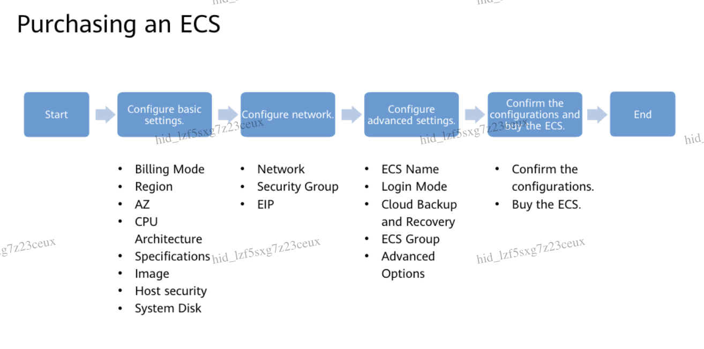

# Compute Cloud Services

1. Elastic Cloud Server (ECS)
- An ECS is a basic computing unit that consists of CPUs, memory, an OS, and Elastic Volume Service (EVS) disks. After an ECS is created, you can use it on the cloud similarly to how you would use your local computer or physical server.

2. Image Management Service (IMS)

3. Auto Scaling (AS).

4. Bare Metal Server (BMS)

5. Cloud Container Engine (CCE)

6. Other Compute Services

## Purchasing an ECS

