# Jenkins

# Repository 

https://github.com/yankils


# Install Jenkins

**Install Java**

```
sudo apt update

sudo apt install fontconfig openjdk-17-jre

java -version
openjdk version "17.0.8" 2023-07-18
OpenJDK Runtime Environment (build 17.0.8+7-Debian-1deb12u1)
OpenJDK 64-Bit Server VM (build 17.0.8+7-Debian-1deb12u1, mixed mode, sharing)
```

**Install Jenkins**

```
sudo wget -O /usr/share/keyrings/jenkins-keyring.asc \
  https://pkg.jenkins.io/debian-stable/jenkins.io-2023.key

echo "deb [signed-by=/usr/share/keyrings/jenkins-keyring.asc]" \
  https://pkg.jenkins.io/debian-stable binary/ | sudo tee \
  /etc/apt/sources.list.d/jenkins.list > /dev/null

sudo apt-get update

sudo apt-get install jenkins
```

# Run First Jenkins Job

1. Goto Dashboard nd click New Item

2. Add Build step > Execute shell

   ```
   echo "Hello World"
   uptime
   ```

3. Click Build Now

   Console Output

   ```
   Started by user admin
   Running as SYSTEM
   Building in workspace /var/lib/jenkins/workspace/HelloWorldJob
   [HelloWorldJob] $ /bin/sh -xe /tmp/jenkins13088905932500674208.sh
   + echo Hello World
   Hello World
   + uptime
    08:53:01 up 53 min,  1 user,  load average: 0.08, 0.02, 0.01
   Finished: SUCCESS
   ```

   


# Integrate GIT with Jenkins


1. Install Github plugins in jenkins

   Goto Dashboard > Manage Jenkins > Plugins - Search Github

   

2. Setup GIT

   Goto Dashboard > Manage Jenkins  > Tools

   

# Run Jenkins job to Pull code from Github

1. Goto Dashboard nd click New Item

2. Add Git Repository URL

   ```
   https://github.com/sherwin-ad/hello-world.git
   ```

   

   3. Click Build Now

      Console Output

      ```
      Started by user admin
      Running as SYSTEM
      Building in workspace /var/lib/jenkins/workspace/PullCodeFromGithub
      The recommended git tool is: NONE
      No credentials specified
      Cloning the remote Git repository
      Cloning repository https://github.com/sherwin-ad/hello-world.git
       > git init /var/lib/jenkins/workspace/PullCodeFromGithub # timeout=10
      Fetching upstream changes from https://github.com/sherwin-ad/hello-world.git
       > git --version # timeout=10
       > git --version # 'git version 2.43.0'
       > git fetch --tags --force --progress -- https://github.com/sherwin-ad/hello-world.git +refs/heads/*:refs/remotes/origin/* # timeout=10
       > git config remote.origin.url https://github.com/sherwin-ad/hello-world.git # timeout=10
       > git config --add remote.origin.fetch +refs/heads/*:refs/remotes/origin/* # timeout=10
      Avoid second fetch
       > git rev-parse refs/remotes/origin/master^{commit} # timeout=10
      Checking out Revision aacc9fa39ba3ca8f46cfd0019f35ce4511287375 (refs/remotes/origin/master)
       > git config core.sparsecheckout # timeout=10
       > git checkout -f aacc9fa39ba3ca8f46cfd0019f35ce4511287375 # timeout=10
      Commit message: "updated pom.xml file"
      First time build. Skipping changelog.
      Finished: SUCCESS
      ```


# Integrate Maven with Jenkins

**Maven** 

- is a [build automation](https://en.wikipedia.org/wiki/Build_automation) tool used primarily for [Java](https://en.wikipedia.org/wiki/Java_(programming_language)) projects. 
- Maven can also be used to build and manage projects written in [C#](https://en.wikipedia.org/wiki/C_Sharp_(programming_language)), [Ruby](https://en.wikipedia.org/wiki/Ruby_(programming_language)), [Scala](https://en.wikipedia.org/wiki/Scala_(programming_language)), and other languages

1. Download Maven

   https://maven.apache.org/download.cgi

   ```
   cd /opt
   
   wget https://dlcdn.apache.org/maven/maven-3/3.9.9/binaries/apache-maven-3.9.9-bin.tar.gz
   ```

2. Extract Maven 

   ```
   tar -xvzf apache-maven-3.9.9-bin.tar.gz
   
   mv apache-maven-3.9.9 maven
   ```

3. Setup Environment Variables

   Edit ~/.profile

   ```
   # ~/.profile: executed by Bourne-compatible login shells.
   
   if [ "$BASH" ]; then
     if [ -f ~/.bashrc ]; then
       . ~/.bashrc
     fi
   fi
   
   M2_HOME=/opt/maven
   M2=/opt/maven/bin
   JAVA_HOME=/usr/lib/jvm/java-1.17.0-openjdk-amd64
   
   PATH=$PATH:$HOME/bin:$JAVA_HOME:$M2_HOME:$M2
   
   export PATH
   
   mesg n 2> /dev/null || true
   ```

   ```
   source .profile
   ```

4. Install Maven plugins

   Goto Dashboard > Manage Jenkins > Plugins - Search maven

   

5. Setup  JDK  and Maven

   Goto Dashboard > Manage Jenkins  > Tools

    

   

# Build a Java Project using Jenkins

1. Goto Dashboard nd click New Item

   

   2. Setup Git

      

      

      3. Set Build

         

      

      ​	**Introduction to the Maven Build Lifecycle**

      ​	https://maven.apache.org/guides/introduction/introduction-to-the-lifecycle.html

   

   Console Output		

   ```
   Started by user admin
   Running as SYSTEM
   Building in workspace /var/lib/jenkins/workspace/FirstMavenProject
   The recommended git tool is: NONE
   No credentials specified
   Cloning the remote Git repository
   Cloning repository https://github.com/sherwin-ad/hello-world.git
    > git init /var/lib/jenkins/workspace/FirstMavenProject # timeout=10
   Fetching upstream changes from https://github.com/sherwin-ad/hello-world.git
    > git --version # timeout=10
    > git --version # 'git version 2.43.0'
    > git fetch --tags --force --progress -- https://github.com/sherwin-ad/hello-world.git +refs/heads/*:refs/remotes/origin/* # timeout=10
    > git config remote.origin.url https://github.com/sherwin-ad/hello-world.git # timeout=10
    > git config --add remote.origin.fetch +refs/heads/*:refs/remotes/origin/* # timeout=10
   Avoid second fetch
    > git rev-parse refs/remotes/origin/master^{commit} # timeout=10
   Checking out Revision aacc9fa39ba3ca8f46cfd0019f35ce4511287375 (refs/remotes/origin/master)
    > git config core.sparsecheckout # timeout=10
    > git checkout -f aacc9fa39ba3ca8f46cfd0019f35ce4511287375 # timeout=10
   Commit message: "updated pom.xml file"
   First time build. Skipping changelog.
   Parsing POMs
   Discovered a new module com.example.maven-project:maven-project Maven Project
   Discovered a new module com.example.maven-project:server Server
   Discovered a new module com.example.maven-project:webapp Webapp
   Modules changed, recalculating dependency graph
   Established TCP socket on 40353
   [FirstMavenProject] $ /usr/lib/jvm/java-1.17.0-openjdk-amd64/bin/java -cp /var/lib/jenkins/plugins/maven-plugin/WEB-INF/lib/maven35-agent-1.14.jar:/opt/maven/boot/plexus-classworlds-2.8.0.jar:/opt/maven/conf/logging jenkins.maven3.agent.Maven35Main /opt/maven /var/cache/jenkins/war/WEB-INF/lib/remoting-3248.3250.v3277a_8e88c9b_.jar /var/lib/jenkins/plugins/maven-plugin/WEB-INF/lib/maven35-interceptor-1.14.jar /var/lib/jenkins/plugins/maven-plugin/WEB-INF/lib/maven3-interceptor-commons-1.14.jar 40353
   <===[JENKINS REMOTING CAPACITY]===>channel started
   Executing Maven:  -B -f /var/lib/jenkins/workspace/FirstMavenProject/pom.xml clean install
   [INFO] Scanning for projects...
   [WARNING] 
   [WARNING] Some problems were encountered while building the effective model for com.example.maven-project:server:jar:1.0-SNAPSHOT
   [WARNING] Reporting configuration should be done in <reporting> section, not in maven-site-plugin <configuration> as reportPlugins parameter.
   [WARNING] 
   [WARNING] Some problems were encountered while building the effective model for com.example.maven-project:webapp:war:1.0-SNAPSHOT
   [WARNING] Reporting configuration should be done in <reporting> section, not in maven-site-plugin <configuration> as reportPlugins parameter.
   [WARNING] 
   [WARNING] Some problems were encountered while building the effective model for com.example.maven-project:maven-project:pom:1.0-SNAPSHOT
   [WARNING] Reporting configuration should be done in <reporting> section, not in maven-site-plugin <configuration> as reportPlugins parameter. @ line 58, column 24
   [WARNING] 
   [WARNING] It is highly recommended to fix these problems because they threaten the stability of your build.
   [WARNING] 
   [WARNING] For this reason, future Maven versions might no longer support building such malformed projects.
   [WARNING] 
   [WARNING] The project com.example.maven-project:maven-project:pom:1.0-SNAPSHOT uses prerequisites which is only intended for maven-plugin projects but not for non maven-plugin projects. For such purposes you should use the maven-enforcer-plugin. See https://maven.apache.org/enforcer/enforcer-rules/requireMavenVersion.html
   [INFO] ------------------------------------------------------------------------
   [INFO] Reactor Build Order:
   [INFO] 
   [INFO] Maven Project                                                      [pom]
   [INFO] Server                                                             [jar]
   [INFO] Webapp                                                             [war]
   [INFO] 
   [INFO] --------------< com.example.maven-project:maven-project >---------------
   [INFO] Building Maven Project 1.0-SNAPSHOT                                [1/3]
   [INFO]   from pom.xml
   [INFO] --------------------------------[ pom ]---------------------------------
   [INFO] Downloading from central: https://repo.maven.apache.org/maven2/org/apache/maven/plugins/maven-clean-plugin/3.2.0/maven-clean-plugin-3.2.0.pom
   [INFO] Downloaded from central: https://repo.maven.apache.org/maven2/org/apache/maven/plugins/maven-clean-plugin/3.2.0/maven-clean-plugin-3.2.0.pom (5.3 kB at 9.1 kB/s)
   [INFO] Downloading from central: https://repo.maven.apache.org/maven2/org/apache/maven/plugins/maven-plugins/35/maven-plugins-35.pom
   [INFO] Downloaded from central: https://repo.maven.apache.org/maven2/org/apache/maven/plugins/maven-plugins/35/maven-plugins-35.pom (9.9 kB at 275 kB/s)
   [INFO] Downloading from central: https://repo.maven.apache.org/maven2/org/apache/maven/maven-parent/35/maven-parent-35.pom
   [INFO] Downloaded from central: https://repo.maven.apache.org/maven2/org/apache/maven/maven-parent/35/maven-parent-35.pom (45 kB at 838 kB/s)
   [INFO] Downloading from central: https://repo.maven.apache.org/maven2/org/apache/apache/25/apache-25.pom
   [INFO] Downloaded from central: https://repo.maven.apache.org/maven2/org/apache/apache/25/apache-25.pom (21 kB at 893 kB/s)
   [INFO] Downloading from central: https://repo.maven.apache.org/maven2/org/apache/maven/plugins/maven-clean-plugin/3.2.0/maven-clean-plugin-3.2.0.jar
   [INFO] Downloaded from central: https://repo.maven.apache.org/maven2/org/apache/maven/plugins/maven-clean-plugin/3.2.0/maven-clean-plugin-3.2.0.jar (36 kB at 1.2 MB/s)
   [INFO] Downloading from central: https://repo.maven.apache.org/maven2/org/apache/maven/plugins/maven-install-plugin/3.1.2/maven-install-plugin-3.1.2.pom
   [INFO] Downloaded from central: https://repo.maven.apache.org/maven2/org/apache/maven/plugins/maven-install-plugin/3.1.2/maven-install-plugin-3.1.2.pom (8.5 kB at 314 kB/s)
   [INFO] Downloading from central: https://repo.maven.apache.org/maven2/org/apache/maven/plugins/maven-plugins/42/maven-plugins-42.pom
   [INFO] Downloaded from central: https://repo.maven.apache.org/maven2/org/apache/maven/plugins/maven-plugins/42/maven-plugins-42.pom (7.7 kB at 384 kB/s)
   [INFO] Downloading from central: https://repo.maven.apache.org/maven2/org/apache/maven/maven-parent/42/maven-parent-42.pom
   [INFO] Downloaded from central: https://repo.maven.apache.org/maven2/org/apache/maven/maven-parent/42/maven-parent-42.pom (50 kB at 1.5 MB/s)
   [INFO] Downloading from central: https://repo.maven.apache.org/maven2/org/apache/apache/32/apache-32.pom
   [INFO] Downloaded from central: https://repo.maven.apache.org/maven2/org/apache/apache/32/apache-32.pom (24 kB at 1.2 MB/s)
   [INFO] Downloading from central: https://repo.maven.apache.org/maven2/org/junit/junit-bom/5.10.2/junit-bom-5.10.2.pom
   [INFO] Downloaded from central: https://repo.maven.apache.org/maven2/org/junit/junit-bom/5.10.2/junit-bom-5.10.2.pom (5.6 kB at 257 kB/s)
   [INFO] Downloading from central: https://repo.maven.apache.org/maven2/org/apache/maven/plugins/maven-install-plugin/3.1.2/maven-install-plugin-3.1.2.jar
   [INFO] Downloaded from central: https://repo.maven.apache.org/maven2/org/apache/maven/plugins/maven-install-plugin/3.1.2/maven-install-plugin-3.1.2.jar (32 kB at 1.5 MB/s)
   [INFO] 
   [INFO] --- clean:3.2.0:clean (default-clean) @ maven-project ---
   [INFO] Downloading from central: https://repo.maven.apache.org/maven2/org/apache/maven/shared/maven-shared-utils/3.3.4/maven-shared-utils-3.3.4.pom
   [INFO] Downloaded from central: https://repo.maven.apache.org/maven2/org/apache/maven/shared/maven-shared-utils/3.3.4/maven-shared-utils-3.3.4.pom (5.8 kB at 265 kB/s)
   [INFO] Downloading from central: https://repo.maven.apache.org/maven2/org/apache/maven/shared/maven-shared-components/34/maven-shared-components-34.pom
   [INFO] Downloaded from central: https://repo.maven.apache.org/maven2/org/apache/maven/shared/maven-shared-components/34/maven-shared-components-34.pom (5.1 kB at 255 kB/s)
   [INFO] Downloading from central: https://repo.maven.apache.org/maven2/org/apache/maven/maven-parent/34/maven-parent-34.pom
   [INFO] Downloaded from central: https://repo.maven.apache.org/maven2/org/apache/maven/maven-parent/34/maven-parent-34.pom (43 kB at 2.0 MB/s)
   [INFO] Downloading from central: https://repo.maven.apache.org/maven2/org/apache/apache/23/apache-23.pom
   [INFO] Downloaded from central: https://repo.maven.apache.org/maven2/org/apache/apache/23/apache-23.pom (18 kB at 921 kB/s)
   [INFO] Downloading from central: https://repo.maven.apache.org/maven2/commons-io/commons-io/2.6/commons-io-2.6.pom
   [INFO] Downloaded from central: https://repo.maven.apache.org/maven2/commons-io/commons-io/2.6/commons-io-2.6.pom (14 kB at 750 kB/s)
   [INFO] Downloading from central: https://repo.maven.apache.org/maven2/org/apache/commons/commons-parent/42/commons-parent-42.pom
   [INFO] Downloaded from central: https://repo.maven.apache.org/maven2/org/apache/commons/commons-parent/42/commons-parent-42.pom (68 kB at 2.8 MB/s)
   [INFO] Downloading from central: https://repo.maven.apache.org/maven2/org/apache/apache/18/apache-18.pom
   [INFO] Downloaded from central: https://repo.maven.apache.org/maven2/org/apache/apache/18/apache-18.pom (16 kB at 783 kB/s)
   [INFO] Downloading from central: https://repo.maven.apache.org/maven2/org/apache/maven/shared/maven-shared-utils/3.3.4/maven-shared-utils-3.3.4.jar
   [INFO] Downloaded from central: https://repo.maven.apache.org/maven2/org/apache/maven/shared/maven-shared-utils/3.3.4/maven-shared-utils-3.3.4.jar (153 kB at 4.5 MB/s)
   [INFO] Downloading from central: https://repo.maven.apache.org/maven2/commons-io/commons-io/2.6/commons-io-2.6.jar
   [INFO] Downloaded from central: https://repo.maven.apache.org/maven2/commons-io/commons-io/2.6/commons-io-2.6.jar (215 kB at 8.0 MB/s)
   [INFO] 
   [INFO] --- install:3.1.2:install (default-install) @ maven-project ---
   [INFO] Downloading from central: https://repo.maven.apache.org/maven2/org/apache/maven/resolver/maven-resolver-util/1.9.18/maven-resolver-util-1.9.18.pom
   [INFO] Downloaded from central: https://repo.maven.apache.org/maven2/org/apache/maven/resolver/maven-resolver-util/1.9.18/maven-resolver-util-1.9.18.pom (2.9 kB at 110 kB/s)
   [INFO] Downloading from central: https://repo.maven.apache.org/maven2/org/apache/maven/resolver/maven-resolver/1.9.18/maven-resolver-1.9.18.pom
   [INFO] Downloaded from central: https://repo.maven.apache.org/maven2/org/apache/maven/resolver/maven-resolver/1.9.18/maven-resolver-1.9.18.pom (22 kB at 859 kB/s)
   [INFO] Downloading from central: https://repo.maven.apache.org/maven2/org/apache/maven/maven-parent/41/maven-parent-41.pom
   [INFO] Downloaded from central: https://repo.maven.apache.org/maven2/org/apache/maven/maven-parent/41/maven-parent-41.pom (50 kB at 1.8 MB/s)
   [INFO] Downloading from central: https://repo.maven.apache.org/maven2/org/apache/apache/31/apache-31.pom
   [INFO] Downloaded from central: https://repo.maven.apache.org/maven2/org/apache/apache/31/apache-31.pom (24 kB at 980 kB/s)
   [INFO] Downloading from central: https://repo.maven.apache.org/maven2/org/apache/maven/resolver/maven-resolver-api/1.9.18/maven-resolver-api-1.9.18.pom
   [INFO] Downloaded from central: https://repo.maven.apache.org/maven2/org/apache/maven/resolver/maven-resolver-api/1.9.18/maven-resolver-api-1.9.18.pom (2.7 kB at 49 kB/s)
   [INFO] Downloading from central: https://repo.maven.apache.org/maven2/org/codehaus/plexus/plexus-utils/4.0.1/plexus-utils-4.0.1.pom
   [INFO] Downloaded from central: https://repo.maven.apache.org/maven2/org/codehaus/plexus/plexus-utils/4.0.1/plexus-utils-4.0.1.pom (7.8 kB at 290 kB/s)
   [INFO] Downloading from central: https://repo.maven.apache.org/maven2/org/codehaus/plexus/plexus/17/plexus-17.pom
   [INFO] Downloaded from central: https://repo.maven.apache.org/maven2/org/codehaus/plexus/plexus/17/plexus-17.pom (28 kB at 1.2 MB/s)
   [INFO] Downloading from central: https://repo.maven.apache.org/maven2/org/codehaus/plexus/plexus-xml/3.0.0/plexus-xml-3.0.0.pom
   [INFO] Downloaded from central: https://repo.maven.apache.org/maven2/org/codehaus/plexus/plexus-xml/3.0.0/plexus-xml-3.0.0.pom (3.7 kB at 156 kB/s)
   [INFO] Downloading from central: https://repo.maven.apache.org/maven2/org/codehaus/plexus/plexus/13/plexus-13.pom
   [INFO] Downloaded from central: https://repo.maven.apache.org/maven2/org/codehaus/plexus/plexus/13/plexus-13.pom (27 kB at 1.1 MB/s)
   [INFO] Downloading from central: https://repo.maven.apache.org/maven2/org/junit/junit-bom/5.9.3/junit-bom-5.9.3.pom
   [INFO] Downloaded from central: https://repo.maven.apache.org/maven2/org/junit/junit-bom/5.9.3/junit-bom-5.9.3.pom (5.6 kB at 245 kB/s)
   [INFO] Downloading from central: https://repo.maven.apache.org/maven2/org/apache/maven/resolver/maven-resolver-util/1.9.18/maven-resolver-util-1.9.18.jar
   [INFO] Downloaded from central: https://repo.maven.apache.org/maven2/org/apache/maven/resolver/maven-resolver-util/1.9.18/maven-resolver-util-1.9.18.jar (196 kB at 5.0 MB/s)
   [INFO] Downloading from central: https://repo.maven.apache.org/maven2/org/apache/maven/resolver/maven-resolver-api/1.9.18/maven-resolver-api-1.9.18.jar
   [INFO] Downloading from central: https://repo.maven.apache.org/maven2/org/codehaus/plexus/plexus-utils/4.0.1/plexus-utils-4.0.1.jar
   [INFO] Downloading from central: https://repo.maven.apache.org/maven2/org/codehaus/plexus/plexus-xml/3.0.0/plexus-xml-3.0.0.jar
   [INFO] Downloaded from central: https://repo.maven.apache.org/maven2/org/apache/maven/resolver/maven-resolver-api/1.9.18/maven-resolver-api-1.9.18.jar (157 kB at 3.3 MB/s)
   [INFO] Downloaded from central: https://repo.maven.apache.org/maven2/org/codehaus/plexus/plexus-xml/3.0.0/plexus-xml-3.0.0.jar (93 kB at 969 kB/s)
   [INFO] Downloaded from central: https://repo.maven.apache.org/maven2/org/codehaus/plexus/plexus-utils/4.0.1/plexus-utils-4.0.1.jar (193 kB at 1.8 MB/s)
   [INFO] Installing /var/lib/jenkins/workspace/FirstMavenProject/pom.xml to /var/lib/jenkins/.m2/repository/com/example/maven-project/maven-project/1.0-SNAPSHOT/maven-project-1.0-SNAPSHOT.pom
   [INFO] 
   [INFO] ------------------< com.example.maven-project:server >------------------
   [INFO] Building Server 1.0-SNAPSHOT                                       [2/3]
   [INFO]   from server/pom.xml
   [INFO] --------------------------------[ jar ]---------------------------------
   [INFO] Downloading from central: https://repo.maven.apache.org/maven2/org/apache/maven/plugins/maven-resources-plugin/2.5/maven-resources-plugin-2.5.pom
   [INFO] Downloaded from central: https://repo.maven.apache.org/maven2/org/apache/maven/plugins/maven-resources-plugin/2.5/maven-resources-plugin-2.5.pom (7.1 kB at 274 kB/s)
   [INFO] Downloading from central: https://repo.maven.apache.org/maven2/org/apache/maven/plugins/maven-plugins/19/maven-plugins-19.pom
   [INFO] Downloaded from central: https://repo.maven.apache.org/maven2/org/apache/maven/plugins/maven-plugins/19/maven-plugins-19.pom (11 kB at 459 kB/s)
   [INFO] Downloading from central: https://repo.maven.apache.org/maven2/org/apache/maven/maven-parent/19/maven-parent-19.pom
   [INFO] Downloaded from central: https://repo.maven.apache.org/maven2/org/apache/maven/maven-parent/19/maven-parent-19.pom (25 kB at 893 kB/s)
   [INFO] Downloading from central: https://repo.maven.apache.org/maven2/org/apache/apache/9/apache-9.pom
   [INFO] Downloaded from central: https://repo.maven.apache.org/maven2/org/apache/apache/9/apache-9.pom (15 kB at 659 kB/s)
   [INFO] Downloading from central: https://repo.maven.apache.org/maven2/org/apache/maven/plugins/maven-resources-plugin/2.5/maven-resources-plugin-2.5.jar
   [INFO] Downloaded from central: https://repo.maven.apache.org/maven2/org/apache/maven/plugins/maven-resources-plugin/2.5/maven-resources-plugin-2.5.jar (26 kB at 1.4 MB/s)
   [INFO] Downloading from central: https://repo.maven.apache.org/maven2/org/apache/maven/plugins/maven-compiler-plugin/2.3.2/maven-compiler-plugin-2.3.2.pom
   [INFO] Downloaded from central: https://repo.maven.apache.org/maven2/org/apache/maven/plugins/maven-compiler-plugin/2.3.2/maven-compiler-plugin-2.3.2.pom (7.3 kB at 407 kB/s)
   [INFO] Downloading from central: https://repo.maven.apache.org/maven2/org/apache/maven/plugins/maven-plugins/18/maven-plugins-18.pom
   [INFO] Downloaded from central: https://repo.maven.apache.org/maven2/org/apache/maven/plugins/maven-plugins/18/maven-plugins-18.pom (13 kB at 722 kB/s)
   [INFO] Downloading from central: https://repo.maven.apache.org/maven2/org/apache/maven/maven-parent/16/maven-parent-16.pom
   [INFO] Downloaded from central: https://repo.maven.apache.org/maven2/org/apache/maven/maven-parent/16/maven-parent-16.pom (23 kB at 1.2 MB/s)
   [INFO] Downloading from central: https://repo.maven.apache.org/maven2/org/apache/apache/7/apache-7.pom
   [INFO] Downloaded from central: https://repo.maven.apache.org/maven2/org/apache/apache/7/apache-7.pom (14 kB at 687 kB/s)
   [INFO] Downloading from central: https://repo.maven.apache.org/maven2/org/apache/maven/plugins/maven-compiler-plugin/2.3.2/maven-compiler-plugin-2.3.2.jar
   [INFO] Downloaded from central: https://repo.maven.apache.org/maven2/org/apache/maven/plugins/maven-compiler-plugin/2.3.2/maven-compiler-plugin-2.3.2.jar (29 kB at 1.7 MB/s)
   [INFO] Downloading from central: https://repo.maven.apache.org/maven2/org/apache/maven/plugins/maven-surefire-plugin/2.11/maven-surefire-plugin-2.11.pom
   [INFO] Downloaded from central: https://repo.maven.apache.org/maven2/org/apache/maven/plugins/maven-surefire-plugin/2.11/maven-surefire-plugin-2.11.pom (11 kB at 674 kB/s)
   [INFO] Downloading from central: https://repo.maven.apache.org/maven2/org/apache/maven/surefire/surefire/2.11/surefire-2.11.pom
   [INFO] Downloaded from central: https://repo.maven.apache.org/maven2/org/apache/maven/surefire/surefire/2.11/surefire-2.11.pom (12 kB at 703 kB/s)
   [INFO] Downloading from central: https://repo.maven.apache.org/maven2/org/apache/maven/maven-parent/20/maven-parent-20.pom
   [INFO] Downloaded from central: https://repo.maven.apache.org/maven2/org/apache/maven/maven-parent/20/maven-parent-20.pom (25 kB at 1.4 MB/s)
   [INFO] Downloading from central: https://repo.maven.apache.org/maven2/org/apache/maven/plugins/maven-surefire-plugin/2.11/maven-surefire-plugin-2.11.jar
   [INFO] Downloaded from central: https://repo.maven.apache.org/maven2/org/apache/maven/plugins/maven-surefire-plugin/2.11/maven-surefire-plugin-2.11.jar (31 kB at 1.5 MB/s)
   [INFO] Downloading from central: https://repo.maven.apache.org/maven2/org/apache/maven/plugins/maven-jar-plugin/3.4.1/maven-jar-plugin-3.4.1.pom
   [INFO] Downloaded from central: https://repo.maven.apache.org/maven2/org/apache/maven/plugins/maven-jar-plugin/3.4.1/maven-jar-plugin-3.4.1.pom (7.8 kB at 325 kB/s)
   [INFO] Downloading from central: https://repo.maven.apache.org/maven2/org/apache/maven/plugins/maven-jar-plugin/3.4.1/maven-jar-plugin-3.4.1.jar
   [INFO] Downloaded from central: https://repo.maven.apache.org/maven2/org/apache/maven/plugins/maven-jar-plugin/3.4.1/maven-jar-plugin-3.4.1.jar (34 kB at 1.8 MB/s)
   [INFO] Downloading from central: https://repo.maven.apache.org/maven2/junit/junit-dep/4.10/junit-dep-4.10.pom
   [INFO] Downloaded from central: https://repo.maven.apache.org/maven2/junit/junit-dep/4.10/junit-dep-4.10.pom (2.3 kB at 130 kB/s)
   [INFO] Downloading from central: https://repo.maven.apache.org/maven2/org/hamcrest/hamcrest-core/1.2.1/hamcrest-core-1.2.1.pom
   [INFO] Downloaded from central: https://repo.maven.apache.org/maven2/org/hamcrest/hamcrest-core/1.2.1/hamcrest-core-1.2.1.pom (5.3 kB at 231 kB/s)
   [INFO] Downloading from central: https://repo.maven.apache.org/maven2/org/hamcrest/hamcrest-library/1.2.1/hamcrest-library-1.2.1.pom
   [INFO] Downloaded from central: https://repo.maven.apache.org/maven2/org/hamcrest/hamcrest-library/1.2.1/hamcrest-library-1.2.1.pom (5.5 kB at 276 kB/s)
   [INFO] Downloading from central: https://repo.maven.apache.org/maven2/org/mockito/mockito-core/1.8.5/mockito-core-1.8.5.pom
   [INFO] Downloaded from central: https://repo.maven.apache.org/maven2/org/mockito/mockito-core/1.8.5/mockito-core-1.8.5.pom (1.3 kB at 79 kB/s)
   [INFO] Downloading from central: https://repo.maven.apache.org/maven2/org/objenesis/objenesis/1.0/objenesis-1.0.pom
   [INFO] Downloaded from central: https://repo.maven.apache.org/maven2/org/objenesis/objenesis/1.0/objenesis-1.0.pom (853 B at 47 kB/s)
   [INFO] Downloading from central: https://repo.maven.apache.org/maven2/junit/junit-dep/4.10/junit-dep-4.10.jar
   [INFO] Downloaded from central: https://repo.maven.apache.org/maven2/junit/junit-dep/4.10/junit-dep-4.10.jar (234 kB at 7.8 MB/s)
   [INFO] Downloading from central: https://repo.maven.apache.org/maven2/org/hamcrest/hamcrest-core/1.2.1/hamcrest-core-1.2.1.jar
   [INFO] Downloading from central: https://repo.maven.apache.org/maven2/org/hamcrest/hamcrest-library/1.2.1/hamcrest-library-1.2.1.jar
   [INFO] Downloading from central: https://repo.maven.apache.org/maven2/org/mockito/mockito-core/1.8.5/mockito-core-1.8.5.jar
   [INFO] Downloading from central: https://repo.maven.apache.org/maven2/org/objenesis/objenesis/1.0/objenesis-1.0.jar
   [INFO] Downloaded from central: https://repo.maven.apache.org/maven2/org/hamcrest/hamcrest-core/1.2.1/hamcrest-core-1.2.1.jar (42 kB at 1.4 MB/s)
   [INFO] Downloaded from central: https://repo.maven.apache.org/maven2/org/hamcrest/hamcrest-library/1.2.1/hamcrest-library-1.2.1.jar (50 kB at 1.6 MB/s)
   [INFO] Downloaded from central: https://repo.maven.apache.org/maven2/org/objenesis/objenesis/1.0/objenesis-1.0.jar (29 kB at 402 kB/s)
   [INFO] Downloaded from central: https://repo.maven.apache.org/maven2/org/mockito/mockito-core/1.8.5/mockito-core-1.8.5.jar (1.3 MB at 16 MB/s)
   [INFO] 
   [INFO] --- clean:3.2.0:clean (default-clean) @ server ---
   [INFO] 
   [INFO] --- resources:2.5:resources (default-resources) @ server ---
   [INFO] Downloading from central: https://repo.maven.apache.org/maven2/org/apache/maven/maven-plugin-api/2.0.6/maven-plugin-api-2.0.6.pom
   [INFO] Downloaded from central: https://repo.maven.apache.org/maven2/org/apache/maven/maven-plugin-api/2.0.6/maven-plugin-api-2.0.6.pom (1.5 kB at 48 kB/s)
   [INFO] Downloading from central: https://repo.maven.apache.org/maven2/org/apache/maven/maven/2.0.6/maven-2.0.6.pom
   [INFO] Downloaded from central: https://repo.maven.apache.org/maven2/org/apache/maven/maven/2.0.6/maven-2.0.6.pom (9.0 kB at 393 kB/s)
   [INFO] Downloading from central: https://repo.maven.apache.org/maven2/org/apache/maven/maven-parent/5/maven-parent-5.pom
   [INFO] Downloaded from central: https://repo.maven.apache.org/maven2/org/apache/maven/maven-parent/5/maven-parent-5.pom (15 kB at 662 kB/s)
   [INFO] Downloading from central: https://repo.maven.apache.org/maven2/org/apache/apache/3/apache-3.pom
   [INFO] Downloaded from central: https://repo.maven.apache.org/maven2/org/apache/apache/3/apache-3.pom (3.4 kB at 181 kB/s)
   [INFO] Downloading from central: https://repo.maven.apache.org/maven2/org/apache/maven/maven-project/2.0.6/maven-project-2.0.6.pom
   [INFO] Downloaded from central: https://repo.maven.apache.org/maven2/org/apache/maven/maven-project/2.0.6/maven-project-2.0.6.pom (2.6 kB at 176 kB/s)
   [INFO] Downloading from central: https://repo.maven.apache.org/maven2/org/apache/maven/maven-settings/2.0.6/maven-settings-2.0.6.pom
   [INFO] Downloaded from central: https://repo.maven.apache.org/maven2/org/apache/maven/maven-settings/2.0.6/maven-settings-2.0.6.pom (2.0 kB at 105 kB/s)
   [INFO] Downloading from central: https://repo.maven.apache.org/maven2/org/apache/maven/maven-model/2.0.6/maven-model-2.0.6.pom
   [INFO] Downloaded from central: https://repo.maven.apache.org/maven2/org/apache/maven/maven-model/2.0.6/maven-model-2.0.6.pom (3.0 kB at 179 kB/s)
   [INFO] Downloading from central: https://repo.maven.apache.org/maven2/org/codehaus/plexus/plexus-utils/1.4.1/plexus-utils-1.4.1.pom
   [INFO] Downloaded from central: https://repo.maven.apache.org/maven2/org/codehaus/plexus/plexus-utils/1.4.1/plexus-utils-1.4.1.pom (1.9 kB at 127 kB/s)
   [INFO] Downloading from central: https://repo.maven.apache.org/maven2/org/codehaus/plexus/plexus/1.0.11/plexus-1.0.11.pom
   [INFO] Downloaded from central: https://repo.maven.apache.org/maven2/org/codehaus/plexus/plexus/1.0.11/plexus-1.0.11.pom (9.0 kB at 598 kB/s)
   [INFO] Downloading from central: https://repo.maven.apache.org/maven2/org/codehaus/plexus/plexus-container-default/1.0-alpha-9-stable-1/plexus-container-default-1.0-alpha-9-stable-1.pom
   [INFO] Downloaded from central: https://repo.maven.apache.org/maven2/org/codehaus/plexus/plexus-container-default/1.0-alpha-9-stable-1/plexus-container-default-1.0-alpha-9-stable-1.pom (3.9 kB at 247 kB/s)
   [INFO] Downloading from central: https://repo.maven.apache.org/maven2/org/codehaus/plexus/plexus-containers/1.0.3/plexus-containers-1.0.3.pom
   [INFO] Downloaded from central: https://repo.maven.apache.org/maven2/org/codehaus/plexus/plexus-containers/1.0.3/plexus-containers-1.0.3.pom (492 B at 31 kB/s)
   [INFO] Downloading from central: https://repo.maven.apache.org/maven2/org/codehaus/plexus/plexus/1.0.4/plexus-1.0.4.pom
   [INFO] Downloaded from central: https://repo.maven.apache.org/maven2/org/codehaus/plexus/plexus/1.0.4/plexus-1.0.4.pom (5.7 kB at 359 kB/s)
   [INFO] Downloading from central: https://repo.maven.apache.org/maven2/junit/junit/3.8.1/junit-3.8.1.pom
   [INFO] Downloaded from central: https://repo.maven.apache.org/maven2/junit/junit/3.8.1/junit-3.8.1.pom (998 B at 62 kB/s)
   [INFO] Downloading from central: https://repo.maven.apache.org/maven2/org/codehaus/plexus/plexus-utils/1.0.4/plexus-utils-1.0.4.pom
   [INFO] Downloaded from central: https://repo.maven.apache.org/maven2/org/codehaus/plexus/plexus-utils/1.0.4/plexus-utils-1.0.4.pom (6.9 kB at 428 kB/s)
   [INFO] Downloading from central: https://repo.maven.apache.org/maven2/classworlds/classworlds/1.1-alpha-2/classworlds-1.1-alpha-2.pom
   [INFO] Downloaded from central: https://repo.maven.apache.org/maven2/classworlds/classworlds/1.1-alpha-2/classworlds-1.1-alpha-2.pom (3.1 kB at 165 kB/s)
   [INFO] Downloading from central: https://repo.maven.apache.org/maven2/org/apache/maven/maven-profile/2.0.6/maven-profile-2.0.6.pom
   [INFO] Downloaded from central: https://repo.maven.apache.org/maven2/org/apache/maven/maven-profile/2.0.6/maven-profile-2.0.6.pom (2.0 kB at 116 kB/s)
   [INFO] Downloading from central: https://repo.maven.apache.org/maven2/org/apache/maven/maven-artifact-manager/2.0.6/maven-artifact-manager-2.0.6.pom
   [INFO] Downloaded from central: https://repo.maven.apache.org/maven2/org/apache/maven/maven-artifact-manager/2.0.6/maven-artifact-manager-2.0.6.pom (2.6 kB at 146 kB/s)
   [INFO] Downloading from central: https://repo.maven.apache.org/maven2/org/apache/maven/maven-repository-metadata/2.0.6/maven-repository-metadata-2.0.6.pom
   [INFO] Downloaded from central: https://repo.maven.apache.org/maven2/org/apache/maven/maven-repository-metadata/2.0.6/maven-repository-metadata-2.0.6.pom (1.9 kB at 109 kB/s)
   [INFO] Downloading from central: https://repo.maven.apache.org/maven2/org/apache/maven/maven-artifact/2.0.6/maven-artifact-2.0.6.pom
   [INFO] Downloaded from central: https://repo.maven.apache.org/maven2/org/apache/maven/maven-artifact/2.0.6/maven-artifact-2.0.6.pom (1.6 kB at 88 kB/s)
   [INFO] Downloading from central: https://repo.maven.apache.org/maven2/org/apache/maven/maven-plugin-registry/2.0.6/maven-plugin-registry-2.0.6.pom
   [INFO] Downloaded from central: https://repo.maven.apache.org/maven2/org/apache/maven/maven-plugin-registry/2.0.6/maven-plugin-registry-2.0.6.pom (1.9 kB at 122 kB/s)
   [INFO] Downloading from central: https://repo.maven.apache.org/maven2/org/apache/maven/maven-core/2.0.6/maven-core-2.0.6.pom
   [INFO] Downloaded from central: https://repo.maven.apache.org/maven2/org/apache/maven/maven-core/2.0.6/maven-core-2.0.6.pom (6.7 kB at 373 kB/s)
   [INFO] Downloading from central: https://repo.maven.apache.org/maven2/org/apache/maven/maven-plugin-parameter-documenter/2.0.6/maven-plugin-parameter-documenter-2.0.6.pom
   [INFO] Downloaded from central: https://repo.maven.apache.org/maven2/org/apache/maven/maven-plugin-parameter-documenter/2.0.6/maven-plugin-parameter-documenter-2.0.6.pom (1.9 kB at 106 kB/s)
   [INFO] Downloading from central: https://repo.maven.apache.org/maven2/org/apache/maven/reporting/maven-reporting-api/2.0.6/maven-reporting-api-2.0.6.pom
   [INFO] Downloaded from central: https://repo.maven.apache.org/maven2/org/apache/maven/reporting/maven-reporting-api/2.0.6/maven-reporting-api-2.0.6.pom (1.8 kB at 110 kB/s)
   [INFO] Downloading from central: https://repo.maven.apache.org/maven2/org/apache/maven/reporting/maven-reporting/2.0.6/maven-reporting-2.0.6.pom
   [INFO] Downloaded from central: https://repo.maven.apache.org/maven2/org/apache/maven/reporting/maven-reporting/2.0.6/maven-reporting-2.0.6.pom (1.4 kB at 60 kB/s)
   [INFO] Downloading from central: https://repo.maven.apache.org/maven2/org/apache/maven/doxia/doxia-sink-api/1.0-alpha-7/doxia-sink-api-1.0-alpha-7.pom
   [INFO] Downloaded from central: https://repo.maven.apache.org/maven2/org/apache/maven/doxia/doxia-sink-api/1.0-alpha-7/doxia-sink-api-1.0-alpha-7.pom (424 B at 16 kB/s)
   [INFO] Downloading from central: https://repo.maven.apache.org/maven2/org/apache/maven/doxia/doxia/1.0-alpha-7/doxia-1.0-alpha-7.pom
   [INFO] Downloaded from central: https://repo.maven.apache.org/maven2/org/apache/maven/doxia/doxia/1.0-alpha-7/doxia-1.0-alpha-7.pom (3.9 kB at 163 kB/s)
   [INFO] Downloading from central: https://repo.maven.apache.org/maven2/org/apache/maven/maven-error-diagnostics/2.0.6/maven-error-diagnostics-2.0.6.pom
   [INFO] Downloaded from central: https://repo.maven.apache.org/maven2/org/apache/maven/maven-error-diagnostics/2.0.6/maven-error-diagnostics-2.0.6.pom (1.7 kB at 100 kB/s)
   [INFO] Downloading from central: https://repo.maven.apache.org/maven2/commons-cli/commons-cli/1.0/commons-cli-1.0.pom
   [INFO] Downloaded from central: https://repo.maven.apache.org/maven2/commons-cli/commons-cli/1.0/commons-cli-1.0.pom (2.1 kB at 111 kB/s)
   [INFO] Downloading from central: https://repo.maven.apache.org/maven2/org/apache/maven/maven-plugin-descriptor/2.0.6/maven-plugin-descriptor-2.0.6.pom
   [INFO] Downloaded from central: https://repo.maven.apache.org/maven2/org/apache/maven/maven-plugin-descriptor/2.0.6/maven-plugin-descriptor-2.0.6.pom (2.0 kB at 119 kB/s)
   [INFO] Downloading from central: https://repo.maven.apache.org/maven2/org/codehaus/plexus/plexus-interactivity-api/1.0-alpha-4/plexus-interactivity-api-1.0-alpha-4.pom
   [INFO] Downloaded from central: https://repo.maven.apache.org/maven2/org/codehaus/plexus/plexus-interactivity-api/1.0-alpha-4/plexus-interactivity-api-1.0-alpha-4.pom (7.1 kB at 473 kB/s)
   [INFO] Downloading from central: https://repo.maven.apache.org/maven2/org/apache/maven/maven-monitor/2.0.6/maven-monitor-2.0.6.pom
   [INFO] Downloaded from central: https://repo.maven.apache.org/maven2/org/apache/maven/maven-monitor/2.0.6/maven-monitor-2.0.6.pom (1.3 kB at 78 kB/s)
   [INFO] Downloading from central: https://repo.maven.apache.org/maven2/classworlds/classworlds/1.1/classworlds-1.1.pom
   [INFO] Downloaded from central: https://repo.maven.apache.org/maven2/classworlds/classworlds/1.1/classworlds-1.1.pom (3.3 kB at 208 kB/s)
   [INFO] Downloading from central: https://repo.maven.apache.org/maven2/org/codehaus/plexus/plexus-utils/2.0.5/plexus-utils-2.0.5.pom
   [INFO] Downloaded from central: https://repo.maven.apache.org/maven2/org/codehaus/plexus/plexus-utils/2.0.5/plexus-utils-2.0.5.pom (3.3 kB at 196 kB/s)
   [INFO] Downloading from central: https://repo.maven.apache.org/maven2/org/codehaus/plexus/plexus/2.0.6/plexus-2.0.6.pom
   [INFO] Downloaded from central: https://repo.maven.apache.org/maven2/org/codehaus/plexus/plexus/2.0.6/plexus-2.0.6.pom (17 kB at 986 kB/s)
   [INFO] Downloading from central: https://repo.maven.apache.org/maven2/org/apache/maven/shared/maven-filtering/1.0/maven-filtering-1.0.pom
   [INFO] Downloaded from central: https://repo.maven.apache.org/maven2/org/apache/maven/shared/maven-filtering/1.0/maven-filtering-1.0.pom (5.8 kB at 251 kB/s)
   [INFO] Downloading from central: https://repo.maven.apache.org/maven2/org/apache/maven/shared/maven-shared-components/16/maven-shared-components-16.pom
   [INFO] Downloaded from central: https://repo.maven.apache.org/maven2/org/apache/maven/shared/maven-shared-components/16/maven-shared-components-16.pom (9.2 kB at 436 kB/s)
   [INFO] Downloading from central: https://repo.maven.apache.org/maven2/org/codehaus/plexus/plexus-utils/1.5.15/plexus-utils-1.5.15.pom
   [INFO] Downloaded from central: https://repo.maven.apache.org/maven2/org/codehaus/plexus/plexus-utils/1.5.15/plexus-utils-1.5.15.pom (6.8 kB at 457 kB/s)
   [INFO] Downloading from central: https://repo.maven.apache.org/maven2/org/codehaus/plexus/plexus/2.0.2/plexus-2.0.2.pom
   [INFO] Downloaded from central: https://repo.maven.apache.org/maven2/org/codehaus/plexus/plexus/2.0.2/plexus-2.0.2.pom (12 kB at 726 kB/s)
   [INFO] Downloading from central: https://repo.maven.apache.org/maven2/org/codehaus/plexus/plexus-interpolation/1.12/plexus-interpolation-1.12.pom
   [INFO] Downloaded from central: https://repo.maven.apache.org/maven2/org/codehaus/plexus/plexus-interpolation/1.12/plexus-interpolation-1.12.pom (889 B at 59 kB/s)
   [INFO] Downloading from central: https://repo.maven.apache.org/maven2/org/codehaus/plexus/plexus-components/1.1.14/plexus-components-1.1.14.pom
   [INFO] Downloaded from central: https://repo.maven.apache.org/maven2/org/codehaus/plexus/plexus-components/1.1.14/plexus-components-1.1.14.pom (5.8 kB at 389 kB/s)
   [INFO] Downloading from central: https://repo.maven.apache.org/maven2/org/sonatype/plexus/plexus-build-api/0.0.4/plexus-build-api-0.0.4.pom
   [INFO] Downloaded from central: https://repo.maven.apache.org/maven2/org/sonatype/plexus/plexus-build-api/0.0.4/plexus-build-api-0.0.4.pom (2.9 kB at 179 kB/s)
   [INFO] Downloading from central: https://repo.maven.apache.org/maven2/org/sonatype/spice/spice-parent/10/spice-parent-10.pom
   [INFO] Downloaded from central: https://repo.maven.apache.org/maven2/org/sonatype/spice/spice-parent/10/spice-parent-10.pom (3.0 kB at 188 kB/s)
   [INFO] Downloading from central: https://repo.maven.apache.org/maven2/org/sonatype/forge/forge-parent/3/forge-parent-3.pom
   [INFO] Downloaded from central: https://repo.maven.apache.org/maven2/org/sonatype/forge/forge-parent/3/forge-parent-3.pom (5.0 kB at 315 kB/s)
   [INFO] Downloading from central: https://repo.maven.apache.org/maven2/org/codehaus/plexus/plexus-utils/1.5.8/plexus-utils-1.5.8.pom
   [INFO] Downloaded from central: https://repo.maven.apache.org/maven2/org/codehaus/plexus/plexus-utils/1.5.8/plexus-utils-1.5.8.pom (8.1 kB at 504 kB/s)
   [INFO] Downloading from central: https://repo.maven.apache.org/maven2/org/codehaus/plexus/plexus-interpolation/1.13/plexus-interpolation-1.13.pom
   [INFO] Downloaded from central: https://repo.maven.apache.org/maven2/org/codehaus/plexus/plexus-interpolation/1.13/plexus-interpolation-1.13.pom (890 B at 59 kB/s)
   [INFO] Downloading from central: https://repo.maven.apache.org/maven2/org/codehaus/plexus/plexus-components/1.1.15/plexus-components-1.1.15.pom
   [INFO] Downloaded from central: https://repo.maven.apache.org/maven2/org/codehaus/plexus/plexus-components/1.1.15/plexus-components-1.1.15.pom (2.8 kB at 190 kB/s)
   [INFO] Downloading from central: https://repo.maven.apache.org/maven2/org/codehaus/plexus/plexus/2.0.3/plexus-2.0.3.pom
   [INFO] Downloaded from central: https://repo.maven.apache.org/maven2/org/codehaus/plexus/plexus/2.0.3/plexus-2.0.3.pom (15 kB at 966 kB/s)
   [INFO] Downloading from central: https://repo.maven.apache.org/maven2/org/apache/maven/maven-plugin-api/2.0.6/maven-plugin-api-2.0.6.jar
   [INFO] Downloaded from central: https://repo.maven.apache.org/maven2/org/apache/maven/maven-plugin-api/2.0.6/maven-plugin-api-2.0.6.jar (13 kB at 804 kB/s)
   [INFO] Downloading from central: https://repo.maven.apache.org/maven2/org/apache/maven/maven-project/2.0.6/maven-project-2.0.6.jar
   [INFO] Downloading from central: https://repo.maven.apache.org/maven2/org/apache/maven/maven-profile/2.0.6/maven-profile-2.0.6.jar
   [INFO] Downloading from central: https://repo.maven.apache.org/maven2/org/apache/maven/maven-artifact-manager/2.0.6/maven-artifact-manager-2.0.6.jar
   [INFO] Downloading from central: https://repo.maven.apache.org/maven2/org/apache/maven/maven-plugin-registry/2.0.6/maven-plugin-registry-2.0.6.jar
   [INFO] Downloading from central: https://repo.maven.apache.org/maven2/org/apache/maven/maven-core/2.0.6/maven-core-2.0.6.jar
   [INFO] Downloaded from central: https://repo.maven.apache.org/maven2/org/apache/maven/maven-profile/2.0.6/maven-profile-2.0.6.jar (35 kB at 979 kB/s)
   [INFO] Downloaded from central: https://repo.maven.apache.org/maven2/org/apache/maven/maven-artifact-manager/2.0.6/maven-artifact-manager-2.0.6.jar (57 kB at 1.8 MB/s)
   [INFO] Downloading from central: https://repo.maven.apache.org/maven2/org/apache/maven/reporting/maven-reporting-api/2.0.6/maven-reporting-api-2.0.6.jar
   [INFO] Downloading from central: https://repo.maven.apache.org/maven2/org/apache/maven/maven-plugin-parameter-documenter/2.0.6/maven-plugin-parameter-documenter-2.0.6.jar
   [INFO] Downloaded from central: https://repo.maven.apache.org/maven2/org/apache/maven/maven-plugin-registry/2.0.6/maven-plugin-registry-2.0.6.jar (29 kB at 997 kB/s)
   [INFO] Downloading from central: https://repo.maven.apache.org/maven2/org/apache/maven/doxia/doxia-sink-api/1.0-alpha-7/doxia-sink-api-1.0-alpha-7.jar
   [INFO] Downloaded from central: https://repo.maven.apache.org/maven2/org/apache/maven/maven-project/2.0.6/maven-project-2.0.6.jar (116 kB at 2.6 MB/s)
   [INFO] Downloading from central: https://repo.maven.apache.org/maven2/org/apache/maven/maven-repository-metadata/2.0.6/maven-repository-metadata-2.0.6.jar
   [INFO] Downloaded from central: https://repo.maven.apache.org/maven2/org/apache/maven/maven-plugin-parameter-documenter/2.0.6/maven-plugin-parameter-documenter-2.0.6.jar (21 kB at 451 kB/s)
   [INFO] Downloading from central: https://repo.maven.apache.org/maven2/org/apache/maven/maven-error-diagnostics/2.0.6/maven-error-diagnostics-2.0.6.jar
   [INFO] Downloaded from central: https://repo.maven.apache.org/maven2/org/apache/maven/reporting/maven-reporting-api/2.0.6/maven-reporting-api-2.0.6.jar (9.9 kB at 207 kB/s)
   [INFO] Downloading from central: https://repo.maven.apache.org/maven2/commons-cli/commons-cli/1.0/commons-cli-1.0.jar
   [INFO] Downloaded from central: https://repo.maven.apache.org/maven2/org/apache/maven/doxia/doxia-sink-api/1.0-alpha-7/doxia-sink-api-1.0-alpha-7.jar (5.9 kB at 129 kB/s)
   [INFO] Downloading from central: https://repo.maven.apache.org/maven2/org/apache/maven/maven-plugin-descriptor/2.0.6/maven-plugin-descriptor-2.0.6.jar
   [INFO] Downloaded from central: https://repo.maven.apache.org/maven2/org/apache/maven/maven-repository-metadata/2.0.6/maven-repository-metadata-2.0.6.jar (24 kB at 453 kB/s)
   [INFO] Downloading from central: https://repo.maven.apache.org/maven2/org/codehaus/plexus/plexus-interactivity-api/1.0-alpha-4/plexus-interactivity-api-1.0-alpha-4.jar
   [INFO] Downloaded from central: https://repo.maven.apache.org/maven2/org/apache/maven/maven-error-diagnostics/2.0.6/maven-error-diagnostics-2.0.6.jar (14 kB at 203 kB/s)
   [INFO] Downloading from central: https://repo.maven.apache.org/maven2/classworlds/classworlds/1.1/classworlds-1.1.jar
   [INFO] Downloaded from central: https://repo.maven.apache.org/maven2/commons-cli/commons-cli/1.0/commons-cli-1.0.jar (30 kB at 430 kB/s)
   [INFO] Downloading from central: https://repo.maven.apache.org/maven2/org/apache/maven/maven-artifact/2.0.6/maven-artifact-2.0.6.jar
   [INFO] Downloaded from central: https://repo.maven.apache.org/maven2/org/apache/maven/maven-plugin-descriptor/2.0.6/maven-plugin-descriptor-2.0.6.jar (37 kB at 492 kB/s)
   [INFO] Downloading from central: https://repo.maven.apache.org/maven2/org/apache/maven/maven-settings/2.0.6/maven-settings-2.0.6.jar
   [INFO] Downloaded from central: https://repo.maven.apache.org/maven2/org/codehaus/plexus/plexus-interactivity-api/1.0-alpha-4/plexus-interactivity-api-1.0-alpha-4.jar (13 kB at 186 kB/s)
   [INFO] Downloading from central: https://repo.maven.apache.org/maven2/org/apache/maven/maven-model/2.0.6/maven-model-2.0.6.jar
   [INFO] Downloaded from central: https://repo.maven.apache.org/maven2/classworlds/classworlds/1.1/classworlds-1.1.jar (38 kB at 421 kB/s)
   [INFO] Downloading from central: https://repo.maven.apache.org/maven2/org/apache/maven/maven-monitor/2.0.6/maven-monitor-2.0.6.jar
   [INFO] Downloaded from central: https://repo.maven.apache.org/maven2/org/apache/maven/maven-artifact/2.0.6/maven-artifact-2.0.6.jar (87 kB at 910 kB/s)
   [INFO] Downloading from central: https://repo.maven.apache.org/maven2/org/codehaus/plexus/plexus-container-default/1.0-alpha-9-stable-1/plexus-container-default-1.0-alpha-9-stable-1.jar
   [INFO] Downloaded from central: https://repo.maven.apache.org/maven2/org/apache/maven/maven-settings/2.0.6/maven-settings-2.0.6.jar (49 kB at 506 kB/s)
   [INFO] Downloading from central: https://repo.maven.apache.org/maven2/junit/junit/3.8.1/junit-3.8.1.jar
   [INFO] Downloaded from central: https://repo.maven.apache.org/maven2/org/apache/maven/maven-core/2.0.6/maven-core-2.0.6.jar (152 kB at 1.6 MB/s)
   [INFO] Downloading from central: https://repo.maven.apache.org/maven2/org/codehaus/plexus/plexus-utils/2.0.5/plexus-utils-2.0.5.jar
   [INFO] Downloaded from central: https://repo.maven.apache.org/maven2/org/apache/maven/maven-model/2.0.6/maven-model-2.0.6.jar (86 kB at 831 kB/s)
   [INFO] Downloading from central: https://repo.maven.apache.org/maven2/org/apache/maven/shared/maven-filtering/1.0/maven-filtering-1.0.jar
   [INFO] Downloaded from central: https://repo.maven.apache.org/maven2/org/apache/maven/maven-monitor/2.0.6/maven-monitor-2.0.6.jar (10 kB at 91 kB/s)
   [INFO] Downloading from central: https://repo.maven.apache.org/maven2/org/sonatype/plexus/plexus-build-api/0.0.4/plexus-build-api-0.0.4.jar
   [INFO] Downloaded from central: https://repo.maven.apache.org/maven2/junit/junit/3.8.1/junit-3.8.1.jar (121 kB at 953 kB/s)
   [INFO] Downloading from central: https://repo.maven.apache.org/maven2/org/codehaus/plexus/plexus-interpolation/1.13/plexus-interpolation-1.13.jar
   [INFO] Downloaded from central: https://repo.maven.apache.org/maven2/org/apache/maven/shared/maven-filtering/1.0/maven-filtering-1.0.jar (43 kB at 335 kB/s)
   [INFO] Downloaded from central: https://repo.maven.apache.org/maven2/org/codehaus/plexus/plexus-container-default/1.0-alpha-9-stable-1/plexus-container-default-1.0-alpha-9-stable-1.jar (194 kB at 1.5 MB/s)
   [INFO] Downloaded from central: https://repo.maven.apache.org/maven2/org/sonatype/plexus/plexus-build-api/0.0.4/plexus-build-api-0.0.4.jar (6.8 kB at 52 kB/s)
   [INFO] Downloaded from central: https://repo.maven.apache.org/maven2/org/codehaus/plexus/plexus-utils/2.0.5/plexus-utils-2.0.5.jar (223 kB at 1.6 MB/s)
   [INFO] Downloaded from central: https://repo.maven.apache.org/maven2/org/codehaus/plexus/plexus-interpolation/1.13/plexus-interpolation-1.13.jar (61 kB at 418 kB/s)
   [debug] execute contextualize
   [INFO] Using 'utf-8' encoding to copy filtered resources.
   [INFO] skip non existing resourceDirectory /var/lib/jenkins/workspace/FirstMavenProject/server/src/main/resources
   [INFO] 
   [INFO] --- compiler:2.3.2:compile (default-compile) @ server ---
   [INFO] Downloading from central: https://repo.maven.apache.org/maven2/org/apache/maven/maven-toolchain/1.0/maven-toolchain-1.0.pom
   [INFO] Downloaded from central: https://repo.maven.apache.org/maven2/org/apache/maven/maven-toolchain/1.0/maven-toolchain-1.0.pom (3.4 kB at 213 kB/s)
   [INFO] Downloading from central: https://repo.maven.apache.org/maven2/org/codehaus/plexus/plexus-compiler-api/1.8.1/plexus-compiler-api-1.8.1.pom
   [INFO] Downloaded from central: https://repo.maven.apache.org/maven2/org/codehaus/plexus/plexus-compiler-api/1.8.1/plexus-compiler-api-1.8.1.pom (805 B at 45 kB/s)
   [INFO] Downloading from central: https://repo.maven.apache.org/maven2/org/codehaus/plexus/plexus-compiler/1.8.1/plexus-compiler-1.8.1.pom
   [INFO] Downloaded from central: https://repo.maven.apache.org/maven2/org/codehaus/plexus/plexus-compiler/1.8.1/plexus-compiler-1.8.1.pom (3.5 kB at 232 kB/s)
   [INFO] Downloading from central: https://repo.maven.apache.org/maven2/org/codehaus/plexus/plexus-components/1.1.18/plexus-components-1.1.18.pom
   [INFO] Downloaded from central: https://repo.maven.apache.org/maven2/org/codehaus/plexus/plexus-components/1.1.18/plexus-components-1.1.18.pom (5.4 kB at 357 kB/s)
   [INFO] Downloading from central: https://repo.maven.apache.org/maven2/org/codehaus/plexus/plexus/2.0.7/plexus-2.0.7.pom
   [INFO] Downloaded from central: https://repo.maven.apache.org/maven2/org/codehaus/plexus/plexus/2.0.7/plexus-2.0.7.pom (17 kB at 1.1 MB/s)
   [INFO] Downloading from central: https://repo.maven.apache.org/maven2/org/codehaus/plexus/plexus-utils/1.5.5/plexus-utils-1.5.5.pom
   [INFO] Downloaded from central: https://repo.maven.apache.org/maven2/org/codehaus/plexus/plexus-utils/1.5.5/plexus-utils-1.5.5.pom (5.1 kB at 322 kB/s)
   [INFO] Downloading from central: https://repo.maven.apache.org/maven2/org/codehaus/plexus/plexus-compiler-manager/1.8.1/plexus-compiler-manager-1.8.1.pom
   [INFO] Downloaded from central: https://repo.maven.apache.org/maven2/org/codehaus/plexus/plexus-compiler-manager/1.8.1/plexus-compiler-manager-1.8.1.pom (713 B at 48 kB/s)
   [INFO] Downloading from central: https://repo.maven.apache.org/maven2/org/codehaus/plexus/plexus-compiler-javac/1.8.1/plexus-compiler-javac-1.8.1.pom
   [INFO] Downloaded from central: https://repo.maven.apache.org/maven2/org/codehaus/plexus/plexus-compiler-javac/1.8.1/plexus-compiler-javac-1.8.1.pom (710 B at 44 kB/s)
   [INFO] Downloading from central: https://repo.maven.apache.org/maven2/org/codehaus/plexus/plexus-compilers/1.8.1/plexus-compilers-1.8.1.pom
   [INFO] Downloaded from central: https://repo.maven.apache.org/maven2/org/codehaus/plexus/plexus-compilers/1.8.1/plexus-compilers-1.8.1.pom (1.3 kB at 88 kB/s)
   [INFO] Downloading from central: https://repo.maven.apache.org/maven2/org/apache/maven/maven-toolchain/1.0/maven-toolchain-1.0.jar
   [INFO] Downloaded from central: https://repo.maven.apache.org/maven2/org/apache/maven/maven-toolchain/1.0/maven-toolchain-1.0.jar (33 kB at 2.1 MB/s)
   [INFO] Downloading from central: https://repo.maven.apache.org/maven2/org/codehaus/plexus/plexus-compiler-api/1.8.1/plexus-compiler-api-1.8.1.jar
   [INFO] Downloading from central: https://repo.maven.apache.org/maven2/org/codehaus/plexus/plexus-compiler-manager/1.8.1/plexus-compiler-manager-1.8.1.jar
   [INFO] Downloading from central: https://repo.maven.apache.org/maven2/org/codehaus/plexus/plexus-compiler-javac/1.8.1/plexus-compiler-javac-1.8.1.jar
   [INFO] Downloaded from central: https://repo.maven.apache.org/maven2/org/codehaus/plexus/plexus-compiler-api/1.8.1/plexus-compiler-api-1.8.1.jar (20 kB at 1.2 MB/s)
   [INFO] Downloaded from central: https://repo.maven.apache.org/maven2/org/codehaus/plexus/plexus-compiler-manager/1.8.1/plexus-compiler-manager-1.8.1.jar (5.3 kB at 280 kB/s)
   [INFO] Downloaded from central: https://repo.maven.apache.org/maven2/org/codehaus/plexus/plexus-compiler-javac/1.8.1/plexus-compiler-javac-1.8.1.jar (13 kB at 659 kB/s)
   [INFO] Compiling 1 source file to /var/lib/jenkins/workspace/FirstMavenProject/server/target/classes
   [INFO] 
   [INFO] --- resources:2.5:testResources (default-testResources) @ server ---
   [debug] execute contextualize
   [INFO] Using 'utf-8' encoding to copy filtered resources.
   [INFO] skip non existing resourceDirectory /var/lib/jenkins/workspace/FirstMavenProject/server/src/test/resources
   [INFO] 
   [INFO] --- compiler:2.3.2:testCompile (default-testCompile) @ server ---
   [INFO] Compiling 1 source file to /var/lib/jenkins/workspace/FirstMavenProject/server/target/test-classes
   [INFO] 
   [INFO] --- surefire:2.11:test (default-test) @ server ---
   [INFO] Downloading from central: https://repo.maven.apache.org/maven2/org/apache/maven/maven-plugin-api/2.0.9/maven-plugin-api-2.0.9.pom
   [INFO] Downloaded from central: https://repo.maven.apache.org/maven2/org/apache/maven/maven-plugin-api/2.0.9/maven-plugin-api-2.0.9.pom (1.5 kB at 93 kB/s)
   [INFO] Downloading from central: https://repo.maven.apache.org/maven2/org/apache/maven/maven/2.0.9/maven-2.0.9.pom
   [INFO] Downloaded from central: https://repo.maven.apache.org/maven2/org/apache/maven/maven/2.0.9/maven-2.0.9.pom (19 kB at 1.3 MB/s)
   [INFO] Downloading from central: https://repo.maven.apache.org/maven2/org/apache/maven/maven-parent/8/maven-parent-8.pom
   [INFO] Downloaded from central: https://repo.maven.apache.org/maven2/org/apache/maven/maven-parent/8/maven-parent-8.pom (24 kB at 1.4 MB/s)
   [INFO] Downloading from central: https://repo.maven.apache.org/maven2/org/apache/apache/4/apache-4.pom
   [INFO] Downloaded from central: https://repo.maven.apache.org/maven2/org/apache/apache/4/apache-4.pom (4.5 kB at 214 kB/s)
   [INFO] Downloading from central: https://repo.maven.apache.org/maven2/org/apache/maven/surefire/surefire-booter/2.11/surefire-booter-2.11.pom
   [INFO] Downloaded from central: https://repo.maven.apache.org/maven2/org/apache/maven/surefire/surefire-booter/2.11/surefire-booter-2.11.pom (3.0 kB at 151 kB/s)
   [INFO] Downloading from central: https://repo.maven.apache.org/maven2/org/apache/maven/surefire/surefire-api/2.11/surefire-api-2.11.pom
   [INFO] Downloaded from central: https://repo.maven.apache.org/maven2/org/apache/maven/surefire/surefire-api/2.11/surefire-api-2.11.pom (2.3 kB at 79 kB/s)
   [INFO] Downloading from central: https://repo.maven.apache.org/maven2/org/apache/maven/surefire/maven-surefire-common/2.11/maven-surefire-common-2.11.pom
   [INFO] Downloaded from central: https://repo.maven.apache.org/maven2/org/apache/maven/surefire/maven-surefire-common/2.11/maven-surefire-common-2.11.pom (4.0 kB at 251 kB/s)
   [INFO] Downloading from central: https://repo.maven.apache.org/maven2/org/codehaus/plexus/plexus-utils/2.1/plexus-utils-2.1.pom
   [INFO] Downloaded from central: https://repo.maven.apache.org/maven2/org/codehaus/plexus/plexus-utils/2.1/plexus-utils-2.1.pom (4.0 kB at 269 kB/s)
   [INFO] Downloading from central: https://repo.maven.apache.org/maven2/org/sonatype/spice/spice-parent/16/spice-parent-16.pom
   [INFO] Downloaded from central: https://repo.maven.apache.org/maven2/org/sonatype/spice/spice-parent/16/spice-parent-16.pom (8.4 kB at 557 kB/s)
   [INFO] Downloading from central: https://repo.maven.apache.org/maven2/org/sonatype/forge/forge-parent/5/forge-parent-5.pom
   [INFO] Downloaded from central: https://repo.maven.apache.org/maven2/org/sonatype/forge/forge-parent/5/forge-parent-5.pom (8.4 kB at 558 kB/s)
   [INFO] Downloading from central: https://repo.maven.apache.org/maven2/org/apache/maven/maven-artifact/2.0.9/maven-artifact-2.0.9.pom
   [INFO] Downloaded from central: https://repo.maven.apache.org/maven2/org/apache/maven/maven-artifact/2.0.9/maven-artifact-2.0.9.pom (1.6 kB at 81 kB/s)
   [INFO] Downloading from central: https://repo.maven.apache.org/maven2/org/apache/maven/maven-project/2.0.9/maven-project-2.0.9.pom
   [INFO] Downloaded from central: https://repo.maven.apache.org/maven2/org/apache/maven/maven-project/2.0.9/maven-project-2.0.9.pom (2.7 kB at 194 kB/s)
   [INFO] Downloading from central: https://repo.maven.apache.org/maven2/org/apache/maven/maven-settings/2.0.9/maven-settings-2.0.9.pom
   [INFO] Downloaded from central: https://repo.maven.apache.org/maven2/org/apache/maven/maven-settings/2.0.9/maven-settings-2.0.9.pom (2.1 kB at 147 kB/s)
   [INFO] Downloading from central: https://repo.maven.apache.org/maven2/org/apache/maven/maven-model/2.0.9/maven-model-2.0.9.pom
   [INFO] Downloaded from central: https://repo.maven.apache.org/maven2/org/apache/maven/maven-model/2.0.9/maven-model-2.0.9.pom (3.1 kB at 209 kB/s)
   [INFO] Downloading from central: https://repo.maven.apache.org/maven2/org/apache/maven/maven-profile/2.0.9/maven-profile-2.0.9.pom
   [INFO] Downloaded from central: https://repo.maven.apache.org/maven2/org/apache/maven/maven-profile/2.0.9/maven-profile-2.0.9.pom (2.0 kB at 137 kB/s)
   [INFO] Downloading from central: https://repo.maven.apache.org/maven2/org/apache/maven/maven-artifact-manager/2.0.9/maven-artifact-manager-2.0.9.pom
   [INFO] Downloaded from central: https://repo.maven.apache.org/maven2/org/apache/maven/maven-artifact-manager/2.0.9/maven-artifact-manager-2.0.9.pom (2.7 kB at 169 kB/s)
   [INFO] Downloading from central: https://repo.maven.apache.org/maven2/org/apache/maven/maven-repository-metadata/2.0.9/maven-repository-metadata-2.0.9.pom
   [INFO] Downloaded from central: https://repo.maven.apache.org/maven2/org/apache/maven/maven-repository-metadata/2.0.9/maven-repository-metadata-2.0.9.pom (1.9 kB at 136 kB/s)
   [INFO] Downloading from central: https://repo.maven.apache.org/maven2/org/apache/maven/maven-plugin-registry/2.0.9/maven-plugin-registry-2.0.9.pom
   [INFO] Downloaded from central: https://repo.maven.apache.org/maven2/org/apache/maven/maven-plugin-registry/2.0.9/maven-plugin-registry-2.0.9.pom (2.0 kB at 141 kB/s)
   [INFO] Downloading from central: https://repo.maven.apache.org/maven2/org/apache/maven/maven-core/2.0.9/maven-core-2.0.9.pom
   [INFO] Downloaded from central: https://repo.maven.apache.org/maven2/org/apache/maven/maven-core/2.0.9/maven-core-2.0.9.pom (7.8 kB at 487 kB/s)
   [INFO] Downloading from central: https://repo.maven.apache.org/maven2/org/apache/maven/maven-plugin-parameter-documenter/2.0.9/maven-plugin-parameter-documenter-2.0.9.pom
   [INFO] Downloaded from central: https://repo.maven.apache.org/maven2/org/apache/maven/maven-plugin-parameter-documenter/2.0.9/maven-plugin-parameter-documenter-2.0.9.pom (2.0 kB at 123 kB/s)
   [INFO] Downloading from central: https://repo.maven.apache.org/maven2/org/apache/maven/reporting/maven-reporting-api/2.0.9/maven-reporting-api-2.0.9.pom
   [INFO] Downloaded from central: https://repo.maven.apache.org/maven2/org/apache/maven/reporting/maven-reporting-api/2.0.9/maven-reporting-api-2.0.9.pom (1.8 kB at 129 kB/s)
   [INFO] Downloading from central: https://repo.maven.apache.org/maven2/org/apache/maven/reporting/maven-reporting/2.0.9/maven-reporting-2.0.9.pom
   [INFO] Downloaded from central: https://repo.maven.apache.org/maven2/org/apache/maven/reporting/maven-reporting/2.0.9/maven-reporting-2.0.9.pom (1.5 kB at 92 kB/s)
   [INFO] Downloading from central: https://repo.maven.apache.org/maven2/org/apache/maven/maven-error-diagnostics/2.0.9/maven-error-diagnostics-2.0.9.pom
   [INFO] Downloaded from central: https://repo.maven.apache.org/maven2/org/apache/maven/maven-error-diagnostics/2.0.9/maven-error-diagnostics-2.0.9.pom (1.7 kB at 109 kB/s)
   [INFO] Downloading from central: https://repo.maven.apache.org/maven2/org/apache/maven/maven-plugin-descriptor/2.0.9/maven-plugin-descriptor-2.0.9.pom
   [INFO] Downloaded from central: https://repo.maven.apache.org/maven2/org/apache/maven/maven-plugin-descriptor/2.0.9/maven-plugin-descriptor-2.0.9.pom (2.1 kB at 138 kB/s)
   [INFO] Downloading from central: https://repo.maven.apache.org/maven2/org/apache/maven/maven-monitor/2.0.9/maven-monitor-2.0.9.pom
   [INFO] Downloaded from central: https://repo.maven.apache.org/maven2/org/apache/maven/maven-monitor/2.0.9/maven-monitor-2.0.9.pom (1.3 kB at 92 kB/s)
   [INFO] Downloading from central: https://repo.maven.apache.org/maven2/org/apache/maven/maven-toolchain/2.0.9/maven-toolchain-2.0.9.pom
   [INFO] Downloaded from central: https://repo.maven.apache.org/maven2/org/apache/maven/maven-toolchain/2.0.9/maven-toolchain-2.0.9.pom (3.5 kB at 193 kB/s)
   [INFO] Downloading from central: https://repo.maven.apache.org/maven2/org/apache/maven/shared/maven-common-artifact-filters/1.3/maven-common-artifact-filters-1.3.pom
   [INFO] Downloaded from central: https://repo.maven.apache.org/maven2/org/apache/maven/shared/maven-common-artifact-filters/1.3/maven-common-artifact-filters-1.3.pom (3.7 kB at 247 kB/s)
   [INFO] Downloading from central: https://repo.maven.apache.org/maven2/org/apache/maven/shared/maven-shared-components/12/maven-shared-components-12.pom
   [INFO] Downloaded from central: https://repo.maven.apache.org/maven2/org/apache/maven/shared/maven-shared-components/12/maven-shared-components-12.pom (9.3 kB at 667 kB/s)
   [INFO] Downloading from central: https://repo.maven.apache.org/maven2/org/apache/maven/maven-parent/13/maven-parent-13.pom
   [INFO] Downloaded from central: https://repo.maven.apache.org/maven2/org/apache/maven/maven-parent/13/maven-parent-13.pom (23 kB at 1.6 MB/s)
   [INFO] Downloading from central: https://repo.maven.apache.org/maven2/org/apache/apache/6/apache-6.pom
   [INFO] Downloaded from central: https://repo.maven.apache.org/maven2/org/apache/apache/6/apache-6.pom (13 kB at 853 kB/s)
   [INFO] Downloading from central: https://repo.maven.apache.org/maven2/org/codehaus/plexus/plexus-container-default/1.0-alpha-9/plexus-container-default-1.0-alpha-9.pom
   [INFO] Downloaded from central: https://repo.maven.apache.org/maven2/org/codehaus/plexus/plexus-container-default/1.0-alpha-9/plexus-container-default-1.0-alpha-9.pom (1.2 kB at 88 kB/s)
   [INFO] Downloading from central: https://repo.maven.apache.org/maven2/org/apache/maven/maven-plugin-api/2.0.9/maven-plugin-api-2.0.9.jar
   [INFO] Downloaded from central: https://repo.maven.apache.org/maven2/org/apache/maven/maven-plugin-api/2.0.9/maven-plugin-api-2.0.9.jar (13 kB at 921 kB/s)
   [INFO] Downloading from central: https://repo.maven.apache.org/maven2/org/apache/maven/surefire/surefire-booter/2.11/surefire-booter-2.11.jar
   [INFO] Downloading from central: https://repo.maven.apache.org/maven2/org/apache/maven/surefire/surefire-api/2.11/surefire-api-2.11.jar
   [INFO] Downloading from central: https://repo.maven.apache.org/maven2/org/apache/maven/surefire/maven-surefire-common/2.11/maven-surefire-common-2.11.jar
   [INFO] Downloading from central: https://repo.maven.apache.org/maven2/org/apache/maven/shared/maven-common-artifact-filters/1.3/maven-common-artifact-filters-1.3.jar
   [INFO] Downloading from central: https://repo.maven.apache.org/maven2/org/codehaus/plexus/plexus-utils/2.1/plexus-utils-2.1.jar
   [INFO] Downloaded from central: https://repo.maven.apache.org/maven2/org/apache/maven/surefire/surefire-booter/2.11/surefire-booter-2.11.jar (33 kB at 1.9 MB/s)
   [INFO] Downloading from central: https://repo.maven.apache.org/maven2/org/apache/maven/maven-artifact/2.0.9/maven-artifact-2.0.9.jar
   [INFO] Downloaded from central: https://repo.maven.apache.org/maven2/org/apache/maven/shared/maven-common-artifact-filters/1.3/maven-common-artifact-filters-1.3.jar (31 kB at 1.2 MB/s)
   [INFO] Downloading from central: https://repo.maven.apache.org/maven2/org/apache/maven/maven-project/2.0.9/maven-project-2.0.9.jar
   [INFO] Downloaded from central: https://repo.maven.apache.org/maven2/org/apache/maven/surefire/maven-surefire-common/2.11/maven-surefire-common-2.11.jar (84 kB at 2.9 MB/s)
   [INFO] Downloading from central: https://repo.maven.apache.org/maven2/org/apache/maven/maven-settings/2.0.9/maven-settings-2.0.9.jar
   [INFO] Downloaded from central: https://repo.maven.apache.org/maven2/org/apache/maven/surefire/surefire-api/2.11/surefire-api-2.11.jar (160 kB at 4.6 MB/s)
   [INFO] Downloading from central: https://repo.maven.apache.org/maven2/org/apache/maven/maven-profile/2.0.9/maven-profile-2.0.9.jar
   [INFO] Downloaded from central: https://repo.maven.apache.org/maven2/org/codehaus/plexus/plexus-utils/2.1/plexus-utils-2.1.jar (225 kB at 6.2 MB/s)
   [INFO] Downloading from central: https://repo.maven.apache.org/maven2/org/apache/maven/maven-model/2.0.9/maven-model-2.0.9.jar
   [INFO] Downloaded from central: https://repo.maven.apache.org/maven2/org/apache/maven/maven-artifact/2.0.9/maven-artifact-2.0.9.jar (89 kB at 2.5 MB/s)
   [INFO] Downloading from central: https://repo.maven.apache.org/maven2/org/apache/maven/maven-artifact-manager/2.0.9/maven-artifact-manager-2.0.9.jar
   [INFO] Downloaded from central: https://repo.maven.apache.org/maven2/org/apache/maven/maven-settings/2.0.9/maven-settings-2.0.9.jar (49 kB at 1.2 MB/s)
   [INFO] Downloading from central: https://repo.maven.apache.org/maven2/org/apache/maven/maven-plugin-registry/2.0.9/maven-plugin-registry-2.0.9.jar
   [INFO] Downloaded from central: https://repo.maven.apache.org/maven2/org/apache/maven/maven-profile/2.0.9/maven-profile-2.0.9.jar (35 kB at 737 kB/s)
   [INFO] Downloading from central: https://repo.maven.apache.org/maven2/org/apache/maven/maven-core/2.0.9/maven-core-2.0.9.jar
   [INFO] Downloaded from central: https://repo.maven.apache.org/maven2/org/apache/maven/maven-project/2.0.9/maven-project-2.0.9.jar (122 kB at 2.5 MB/s)
   [INFO] Downloading from central: https://repo.maven.apache.org/maven2/org/apache/maven/maven-plugin-parameter-documenter/2.0.9/maven-plugin-parameter-documenter-2.0.9.jar
   [INFO] Downloaded from central: https://repo.maven.apache.org/maven2/org/apache/maven/maven-artifact-manager/2.0.9/maven-artifact-manager-2.0.9.jar (58 kB at 1.0 MB/s)
   [INFO] Downloading from central: https://repo.maven.apache.org/maven2/org/apache/maven/reporting/maven-reporting-api/2.0.9/maven-reporting-api-2.0.9.jar
   [INFO] Downloaded from central: https://repo.maven.apache.org/maven2/org/apache/maven/maven-model/2.0.9/maven-model-2.0.9.jar (87 kB at 1.4 MB/s)
   [INFO] Downloaded from central: https://repo.maven.apache.org/maven2/org/apache/maven/maven-plugin-registry/2.0.9/maven-plugin-registry-2.0.9.jar (29 kB at 469 kB/s)
   [INFO] Downloading from central: https://repo.maven.apache.org/maven2/org/apache/maven/maven-repository-metadata/2.0.9/maven-repository-metadata-2.0.9.jar
   [INFO] Downloading from central: https://repo.maven.apache.org/maven2/org/apache/maven/maven-error-diagnostics/2.0.9/maven-error-diagnostics-2.0.9.jar
   [INFO] Downloaded from central: https://repo.maven.apache.org/maven2/org/apache/maven/maven-plugin-parameter-documenter/2.0.9/maven-plugin-parameter-documenter-2.0.9.jar (21 kB at 316 kB/s)
   [INFO] Downloading from central: https://repo.maven.apache.org/maven2/org/apache/maven/maven-plugin-descriptor/2.0.9/maven-plugin-descriptor-2.0.9.jar
   [INFO] Downloaded from central: https://repo.maven.apache.org/maven2/org/apache/maven/reporting/maven-reporting-api/2.0.9/maven-reporting-api-2.0.9.jar (10 kB at 137 kB/s)
   [INFO] Downloading from central: https://repo.maven.apache.org/maven2/org/apache/maven/maven-monitor/2.0.9/maven-monitor-2.0.9.jar
   [INFO] Downloaded from central: https://repo.maven.apache.org/maven2/org/apache/maven/maven-core/2.0.9/maven-core-2.0.9.jar (160 kB at 2.0 MB/s)
   [INFO] Downloading from central: https://repo.maven.apache.org/maven2/org/apache/maven/maven-toolchain/2.0.9/maven-toolchain-2.0.9.jar
   [INFO] Downloaded from central: https://repo.maven.apache.org/maven2/org/apache/maven/maven-error-diagnostics/2.0.9/maven-error-diagnostics-2.0.9.jar (14 kB at 170 kB/s)
   [INFO] Downloaded from central: https://repo.maven.apache.org/maven2/org/apache/maven/maven-repository-metadata/2.0.9/maven-repository-metadata-2.0.9.jar (25 kB at 286 kB/s)
   [INFO] Downloaded from central: https://repo.maven.apache.org/maven2/org/apache/maven/maven-plugin-descriptor/2.0.9/maven-plugin-descriptor-2.0.9.jar (37 kB at 416 kB/s)
   [INFO] Downloaded from central: https://repo.maven.apache.org/maven2/org/apache/maven/maven-monitor/2.0.9/maven-monitor-2.0.9.jar (10 kB at 113 kB/s)
   [INFO] Downloaded from central: https://repo.maven.apache.org/maven2/org/apache/maven/maven-toolchain/2.0.9/maven-toolchain-2.0.9.jar (38 kB at 384 kB/s)
   [INFO] Surefire report directory: /var/lib/jenkins/workspace/FirstMavenProject/server/target/surefire-reports
   [INFO] Downloading from central: https://repo.maven.apache.org/maven2/org/apache/maven/surefire/surefire-junit4/2.11/surefire-junit4-2.11.pom
   [INFO] Downloaded from central: https://repo.maven.apache.org/maven2/org/apache/maven/surefire/surefire-junit4/2.11/surefire-junit4-2.11.pom (2.6 kB at 145 kB/s)
   [INFO] Downloading from central: https://repo.maven.apache.org/maven2/org/apache/maven/surefire/surefire-providers/2.11/surefire-providers-2.11.pom
   [INFO] Downloaded from central: https://repo.maven.apache.org/maven2/org/apache/maven/surefire/surefire-providers/2.11/surefire-providers-2.11.pom (2.3 kB at 153 kB/s)
   [INFO] Downloading from central: https://repo.maven.apache.org/maven2/org/apache/maven/surefire/surefire-junit4/2.11/surefire-junit4-2.11.jar
   [INFO] Downloaded from central: https://repo.maven.apache.org/maven2/org/apache/maven/surefire/surefire-junit4/2.11/surefire-junit4-2.11.jar (33 kB at 2.1 MB/s)
   
   -------------------------------------------------------
    T E S T S
   -------------------------------------------------------
   Running com.example.TestGreeter
   Tests run: 2, Failures: 0, Errors: 0, Skipped: 0, Time elapsed: 0.075 sec
   
   Results :
   
   Tests run: 2, Failures: 0, Errors: 0, Skipped: 0
   
   [JENKINS] Recording test results
   [INFO] 
   [INFO] --- jar:3.4.1:jar (default-jar) @ server ---
   [INFO] Downloading from central: https://repo.maven.apache.org/maven2/org/apache/maven/shared/file-management/3.1.0/file-management-3.1.0.pom
   [INFO] Downloaded from central: https://repo.maven.apache.org/maven2/org/apache/maven/shared/file-management/3.1.0/file-management-3.1.0.pom (4.5 kB at 224 kB/s)
   [INFO] Downloading from central: https://repo.maven.apache.org/maven2/org/apache/maven/shared/maven-shared-components/36/maven-shared-components-36.pom
   [INFO] Downloaded from central: https://repo.maven.apache.org/maven2/org/apache/maven/shared/maven-shared-components/36/maven-shared-components-36.pom (4.9 kB at 222 kB/s)
   [INFO] Downloading from central: https://repo.maven.apache.org/maven2/org/apache/maven/maven-parent/36/maven-parent-36.pom
   [INFO] Downloaded from central: https://repo.maven.apache.org/maven2/org/apache/maven/maven-parent/36/maven-parent-36.pom (45 kB at 2.8 MB/s)
   [INFO] Downloading from central: https://repo.maven.apache.org/maven2/org/apache/apache/26/apache-26.pom
   [INFO] Downloaded from central: https://repo.maven.apache.org/maven2/org/apache/apache/26/apache-26.pom (21 kB at 1.4 MB/s)
   [INFO] Downloading from central: https://repo.maven.apache.org/maven2/org/slf4j/slf4j-api/1.7.36/slf4j-api-1.7.36.pom
   [INFO] Downloaded from central: https://repo.maven.apache.org/maven2/org/slf4j/slf4j-api/1.7.36/slf4j-api-1.7.36.pom (2.7 kB at 152 kB/s)
   [INFO] Downloading from central: https://repo.maven.apache.org/maven2/org/slf4j/slf4j-parent/1.7.36/slf4j-parent-1.7.36.pom
   [INFO] Downloaded from central: https://repo.maven.apache.org/maven2/org/slf4j/slf4j-parent/1.7.36/slf4j-parent-1.7.36.pom (14 kB at 940 kB/s)
   [INFO] Downloading from central: https://repo.maven.apache.org/maven2/commons-io/commons-io/2.16.1/commons-io-2.16.1.pom
   [INFO] Downloaded from central: https://repo.maven.apache.org/maven2/commons-io/commons-io/2.16.1/commons-io-2.16.1.pom (20 kB at 1.2 MB/s)
   [INFO] Downloading from central: https://repo.maven.apache.org/maven2/org/apache/commons/commons-parent/69/commons-parent-69.pom
   [INFO] Downloaded from central: https://repo.maven.apache.org/maven2/org/apache/commons/commons-parent/69/commons-parent-69.pom (77 kB at 4.8 MB/s)
   [INFO] Downloading from central: https://repo.maven.apache.org/maven2/org/apache/maven/maven-archiver/3.6.2/maven-archiver-3.6.2.pom
   [INFO] Downloaded from central: https://repo.maven.apache.org/maven2/org/apache/maven/maven-archiver/3.6.2/maven-archiver-3.6.2.pom (4.4 kB at 292 kB/s)
   [INFO] Downloading from central: https://repo.maven.apache.org/maven2/org/apache/maven/shared/maven-shared-components/41/maven-shared-components-41.pom
   [INFO] Downloaded from central: https://repo.maven.apache.org/maven2/org/apache/maven/shared/maven-shared-components/41/maven-shared-components-41.pom (3.2 kB at 212 kB/s)
   [INFO] Downloading from central: https://repo.maven.apache.org/maven2/org/codehaus/plexus/plexus-archiver/4.9.2/plexus-archiver-4.9.2.pom
   [INFO] Downloaded from central: https://repo.maven.apache.org/maven2/org/codehaus/plexus/plexus-archiver/4.9.2/plexus-archiver-4.9.2.pom (6.0 kB at 374 kB/s)
   [INFO] Downloading from central: https://repo.maven.apache.org/maven2/javax/inject/javax.inject/1/javax.inject-1.pom
   [INFO] Downloaded from central: https://repo.maven.apache.org/maven2/javax/inject/javax.inject/1/javax.inject-1.pom (612 B at 41 kB/s)
   [INFO] Downloading from central: https://repo.maven.apache.org/maven2/org/codehaus/plexus/plexus-io/3.4.2/plexus-io-3.4.2.pom
   [INFO] Downloaded from central: https://repo.maven.apache.org/maven2/org/codehaus/plexus/plexus-io/3.4.2/plexus-io-3.4.2.pom (3.9 kB at 241 kB/s)
   [INFO] Downloading from central: https://repo.maven.apache.org/maven2/org/codehaus/plexus/plexus/16/plexus-16.pom
   [INFO] Downloaded from central: https://repo.maven.apache.org/maven2/org/codehaus/plexus/plexus/16/plexus-16.pom (28 kB at 1.5 MB/s)
   [INFO] Downloading from central: https://repo.maven.apache.org/maven2/org/junit/junit-bom/5.10.1/junit-bom-5.10.1.pom
   [INFO] Downloaded from central: https://repo.maven.apache.org/maven2/org/junit/junit-bom/5.10.1/junit-bom-5.10.1.pom (5.6 kB at 377 kB/s)
   [INFO] Downloading from central: https://repo.maven.apache.org/maven2/org/apache/commons/commons-compress/1.26.1/commons-compress-1.26.1.pom
   [INFO] Downloaded from central: https://repo.maven.apache.org/maven2/org/apache/commons/commons-compress/1.26.1/commons-compress-1.26.1.pom (22 kB at 1.4 MB/s)
   [INFO] Downloading from central: https://repo.maven.apache.org/maven2/org/apache/commons/commons-parent/66/commons-parent-66.pom
   [INFO] Downloaded from central: https://repo.maven.apache.org/maven2/org/apache/commons/commons-parent/66/commons-parent-66.pom (77 kB at 4.1 MB/s)
   [INFO] Downloading from central: https://repo.maven.apache.org/maven2/commons-codec/commons-codec/1.16.1/commons-codec-1.16.1.pom
   [INFO] Downloaded from central: https://repo.maven.apache.org/maven2/commons-codec/commons-codec/1.16.1/commons-codec-1.16.1.pom (16 kB at 1.0 MB/s)
   [INFO] Downloading from central: https://repo.maven.apache.org/maven2/org/apache/commons/commons-lang3/3.14.0/commons-lang3-3.14.0.pom
   [INFO] Downloaded from central: https://repo.maven.apache.org/maven2/org/apache/commons/commons-lang3/3.14.0/commons-lang3-3.14.0.pom (31 kB at 1.8 MB/s)
   [INFO] Downloading from central: https://repo.maven.apache.org/maven2/org/apache/commons/commons-parent/64/commons-parent-64.pom
   [INFO] Downloaded from central: https://repo.maven.apache.org/maven2/org/apache/commons/commons-parent/64/commons-parent-64.pom (78 kB at 4.9 MB/s)
   [INFO] Downloading from central: https://repo.maven.apache.org/maven2/org/apache/apache/30/apache-30.pom
   [INFO] Downloaded from central: https://repo.maven.apache.org/maven2/org/apache/apache/30/apache-30.pom (23 kB at 1.5 MB/s)
   [INFO] Downloading from central: https://repo.maven.apache.org/maven2/org/junit/junit-bom/5.10.0/junit-bom-5.10.0.pom
   [INFO] Downloaded from central: https://repo.maven.apache.org/maven2/org/junit/junit-bom/5.10.0/junit-bom-5.10.0.pom (5.6 kB at 353 kB/s)
   [INFO] Downloading from central: https://repo.maven.apache.org/maven2/org/iq80/snappy/snappy/0.4/snappy-0.4.pom
   [INFO] Downloaded from central: https://repo.maven.apache.org/maven2/org/iq80/snappy/snappy/0.4/snappy-0.4.pom (15 kB at 969 kB/s)
   [INFO] Downloading from central: https://repo.maven.apache.org/maven2/org/tukaani/xz/1.9/xz-1.9.pom
   [INFO] Downloaded from central: https://repo.maven.apache.org/maven2/org/tukaani/xz/1.9/xz-1.9.pom (2.0 kB at 136 kB/s)
   [INFO] Downloading from central: https://repo.maven.apache.org/maven2/com/github/luben/zstd-jni/1.5.5-11/zstd-jni-1.5.5-11.pom
   [INFO] Downloaded from central: https://repo.maven.apache.org/maven2/com/github/luben/zstd-jni/1.5.5-11/zstd-jni-1.5.5-11.pom (2.0 kB at 144 kB/s)
   [INFO] Downloading from central: https://repo.maven.apache.org/maven2/org/codehaus/plexus/plexus-interpolation/1.27/plexus-interpolation-1.27.pom
   [INFO] Downloaded from central: https://repo.maven.apache.org/maven2/org/codehaus/plexus/plexus-interpolation/1.27/plexus-interpolation-1.27.pom (3.0 kB at 178 kB/s)
   [INFO] Downloading from central: https://repo.maven.apache.org/maven2/org/apache/maven/shared/file-management/3.1.0/file-management-3.1.0.jar
   [INFO] Downloaded from central: https://repo.maven.apache.org/maven2/org/apache/maven/shared/file-management/3.1.0/file-management-3.1.0.jar (36 kB at 1.7 MB/s)
   [INFO] Downloading from central: https://repo.maven.apache.org/maven2/commons-io/commons-io/2.16.1/commons-io-2.16.1.jar
   [INFO] Downloading from central: https://repo.maven.apache.org/maven2/org/apache/maven/maven-archiver/3.6.2/maven-archiver-3.6.2.jar
   [INFO] Downloading from central: https://repo.maven.apache.org/maven2/org/codehaus/plexus/plexus-interpolation/1.27/plexus-interpolation-1.27.jar
   [INFO] Downloading from central: https://repo.maven.apache.org/maven2/org/codehaus/plexus/plexus-archiver/4.9.2/plexus-archiver-4.9.2.jar
   [INFO] Downloading from central: https://repo.maven.apache.org/maven2/org/codehaus/plexus/plexus-io/3.4.2/plexus-io-3.4.2.jar
   [INFO] Downloaded from central: https://repo.maven.apache.org/maven2/org/apache/maven/maven-archiver/3.6.2/maven-archiver-3.6.2.jar (27 kB at 924 kB/s)
   [INFO] Downloading from central: https://repo.maven.apache.org/maven2/org/apache/commons/commons-compress/1.26.1/commons-compress-1.26.1.jar
   [INFO] Downloaded from central: https://repo.maven.apache.org/maven2/org/codehaus/plexus/plexus-io/3.4.2/plexus-io-3.4.2.jar (79 kB at 2.9 MB/s)
   [INFO] Downloaded from central: https://repo.maven.apache.org/maven2/org/codehaus/plexus/plexus-interpolation/1.27/plexus-interpolation-1.27.jar (86 kB at 2.5 MB/s)
   [INFO] Downloading from central: https://repo.maven.apache.org/maven2/org/apache/commons/commons-lang3/3.14.0/commons-lang3-3.14.0.jar
   [INFO] Downloading from central: https://repo.maven.apache.org/maven2/commons-codec/commons-codec/1.16.1/commons-codec-1.16.1.jar
   [INFO] Downloaded from central: https://repo.maven.apache.org/maven2/org/codehaus/plexus/plexus-archiver/4.9.2/plexus-archiver-4.9.2.jar (225 kB at 4.7 MB/s)
   [INFO] Downloading from central: https://repo.maven.apache.org/maven2/org/iq80/snappy/snappy/0.4/snappy-0.4.jar
   [INFO] Downloaded from central: https://repo.maven.apache.org/maven2/commons-io/commons-io/2.16.1/commons-io-2.16.1.jar (509 kB at 8.3 MB/s)
   [INFO] Downloading from central: https://repo.maven.apache.org/maven2/org/tukaani/xz/1.9/xz-1.9.jar
   [INFO] Downloaded from central: https://repo.maven.apache.org/maven2/org/iq80/snappy/snappy/0.4/snappy-0.4.jar (58 kB at 878 kB/s)
   [INFO] Downloading from central: https://repo.maven.apache.org/maven2/com/github/luben/zstd-jni/1.5.5-11/zstd-jni-1.5.5-11.jar
   [INFO] Downloaded from central: https://repo.maven.apache.org/maven2/commons-codec/commons-codec/1.16.1/commons-codec-1.16.1.jar (365 kB at 4.9 MB/s)
   [INFO] Downloading from central: https://repo.maven.apache.org/maven2/javax/inject/javax.inject/1/javax.inject-1.jar
   [INFO] Downloaded from central: https://repo.maven.apache.org/maven2/org/tukaani/xz/1.9/xz-1.9.jar (116 kB at 1.5 MB/s)
   [INFO] Downloading from central: https://repo.maven.apache.org/maven2/org/slf4j/slf4j-api/1.7.36/slf4j-api-1.7.36.jar
   [INFO] Downloaded from central: https://repo.maven.apache.org/maven2/javax/inject/javax.inject/1/javax.inject-1.jar (2.5 kB at 27 kB/s)
   [INFO] Downloaded from central: https://repo.maven.apache.org/maven2/org/slf4j/slf4j-api/1.7.36/slf4j-api-1.7.36.jar (41 kB at 433 kB/s)
   [INFO] Downloaded from central: https://repo.maven.apache.org/maven2/org/apache/commons/commons-lang3/3.14.0/commons-lang3-3.14.0.jar (658 kB at 6.5 MB/s)
   [INFO] Downloaded from central: https://repo.maven.apache.org/maven2/org/apache/commons/commons-compress/1.26.1/commons-compress-1.26.1.jar (1.1 MB at 9.6 MB/s)
   [INFO] Downloaded from central: https://repo.maven.apache.org/maven2/com/github/luben/zstd-jni/1.5.5-11/zstd-jni-1.5.5-11.jar (6.8 MB at 26 MB/s)
   [INFO] Building jar: /var/lib/jenkins/workspace/FirstMavenProject/server/target/server.jar
   [INFO] 
   [INFO] --- install:3.1.2:install (default-install) @ server ---
   [INFO] Installing /var/lib/jenkins/workspace/FirstMavenProject/server/pom.xml to /var/lib/jenkins/.m2/repository/com/example/maven-project/server/1.0-SNAPSHOT/server-1.0-SNAPSHOT.pom
   [INFO] Installing /var/lib/jenkins/workspace/FirstMavenProject/server/target/server.jar to /var/lib/jenkins/.m2/repository/com/example/maven-project/server/1.0-SNAPSHOT/server-1.0-SNAPSHOT.jar
   [INFO] 
   [INFO] ------------------< com.example.maven-project:webapp >------------------
   [INFO] Building Webapp 1.0-SNAPSHOT                                       [3/3]
   [INFO]   from webapp/pom.xml
   [INFO] --------------------------------[ war ]---------------------------------
   [INFO] Downloading from central: https://repo.maven.apache.org/maven2/org/apache/maven/plugins/maven-war-plugin/3.3.2/maven-war-plugin-3.3.2.pom
   [INFO] Downloaded from central: https://repo.maven.apache.org/maven2/org/apache/maven/plugins/maven-war-plugin/3.3.2/maven-war-plugin-3.3.2.pom (9.7 kB at 538 kB/s)
   [INFO] Downloading from central: https://repo.maven.apache.org/maven2/org/apache/maven/plugins/maven-plugins/34/maven-plugins-34.pom
   [INFO] Downloaded from central: https://repo.maven.apache.org/maven2/org/apache/maven/plugins/maven-plugins/34/maven-plugins-34.pom (11 kB at 668 kB/s)
   [INFO] Downloading from central: https://repo.maven.apache.org/maven2/org/apache/maven/plugins/maven-war-plugin/3.3.2/maven-war-plugin-3.3.2.jar
   [INFO] Downloaded from central: https://repo.maven.apache.org/maven2/org/apache/maven/plugins/maven-war-plugin/3.3.2/maven-war-plugin-3.3.2.jar (83 kB at 4.6 MB/s)
   [INFO] Downloading from central: https://repo.maven.apache.org/maven2/javax/servlet/servlet-api/2.5/servlet-api-2.5.pom
   [INFO] Downloaded from central: https://repo.maven.apache.org/maven2/javax/servlet/servlet-api/2.5/servlet-api-2.5.pom (157 B at 10 kB/s)
   [INFO] Downloading from central: https://repo.maven.apache.org/maven2/javax/servlet/jsp/jsp-api/2.2/jsp-api-2.2.pom
   [INFO] Downloaded from central: https://repo.maven.apache.org/maven2/javax/servlet/jsp/jsp-api/2.2/jsp-api-2.2.pom (5.3 kB at 333 kB/s)
   [INFO] Downloading from central: https://repo.maven.apache.org/maven2/org/glassfish/web/jsp/2.2/jsp-2.2.pom
   [INFO] Downloaded from central: https://repo.maven.apache.org/maven2/org/glassfish/web/jsp/2.2/jsp-2.2.pom (6.9 kB at 384 kB/s)
   [INFO] Downloading from central: https://repo.maven.apache.org/maven2/javax/servlet/servlet-api/2.5/servlet-api-2.5.jar
   [INFO] Downloaded from central: https://repo.maven.apache.org/maven2/javax/servlet/servlet-api/2.5/servlet-api-2.5.jar (105 kB at 5.8 MB/s)
   [INFO] Downloading from central: https://repo.maven.apache.org/maven2/javax/servlet/jsp/jsp-api/2.2/jsp-api-2.2.jar
   [INFO] Downloaded from central: https://repo.maven.apache.org/maven2/javax/servlet/jsp/jsp-api/2.2/jsp-api-2.2.jar (50 kB at 2.4 MB/s)
   [INFO] 
   [INFO] --- clean:3.2.0:clean (default-clean) @ webapp ---
   [INFO] 
   [INFO] --- resources:2.5:resources (default-resources) @ webapp ---
   [debug] execute contextualize
   [INFO] Using 'utf-8' encoding to copy filtered resources.
   [INFO] skip non existing resourceDirectory /var/lib/jenkins/workspace/FirstMavenProject/webapp/src/main/resources
   [INFO] 
   [INFO] --- compiler:2.3.2:compile (default-compile) @ webapp ---
   [INFO] No sources to compile
   [INFO] 
   [INFO] --- resources:2.5:testResources (default-testResources) @ webapp ---
   [debug] execute contextualize
   [INFO] Using 'utf-8' encoding to copy filtered resources.
   [INFO] skip non existing resourceDirectory /var/lib/jenkins/workspace/FirstMavenProject/webapp/src/test/resources
   [INFO] 
   [INFO] --- compiler:2.3.2:testCompile (default-testCompile) @ webapp ---
   [INFO] No sources to compile
   [INFO] 
   [INFO] --- surefire:2.11:test (default-test) @ webapp ---
   [INFO] No tests to run.
   [INFO] Surefire report directory: /var/lib/jenkins/workspace/FirstMavenProject/webapp/target/surefire-reports
   [INFO] Downloading from central: https://repo.maven.apache.org/maven2/org/apache/maven/surefire/surefire-junit3/2.11/surefire-junit3-2.11.pom
   [INFO] Downloaded from central: https://repo.maven.apache.org/maven2/org/apache/maven/surefire/surefire-junit3/2.11/surefire-junit3-2.11.pom (1.7 kB at 107 kB/s)
   [INFO] Downloading from central: https://repo.maven.apache.org/maven2/org/apache/maven/surefire/surefire-junit3/2.11/surefire-junit3-2.11.jar
   [INFO] Downloaded from central: https://repo.maven.apache.org/maven2/org/apache/maven/surefire/surefire-junit3/2.11/surefire-junit3-2.11.jar (26 kB at 1.5 MB/s)
   ```


# Install Tomcat Server

1. Install Java

   ```
   sudo apt update
   
   sudo apt install fontconfig openjdk-17-jre
   
   java -version
   openjdk version "17.0.12" 2024-07-16
   OpenJDK Runtime Environment (build 17.0.12+7-Ubuntu-1ubuntu224.04)
   OpenJDK 64-Bit Server VM (build 17.0.12+7-Ubuntu-1ubuntu224.04, mixed mode, sharing)
   ```

2. Install Tomcat Server

   Download Binary distribution of Tomcat Server

   https://tomcat.apache.org/download-10.cgi

   ```
   cd /opt
   
   wget https://dlcdn.apache.org/tomcat/tomcat-10/v10.1.28/bin/apache-tomcat-10.1.28.tar.gz
   
   tar -xvzf apache-tomcat-10.1.28.tar.gz
   
   mv apache-tomcat-10.1.28 tomcat
   ```

3. Create link files for tomcat startup.sh and shutdown.sh

   ```
   ln -s /opt/apache-tomcat-<version>/bin/startup.sh /usr/local/bin/tomcatup
   ln -s /opt/apache-tomcat-<version>/bin/shutdown.sh /usr/local/bin/tomcatdown
   ```

4. Allow access to Manager application and Host Manager

   Find context.xml

   ```
   find / -name context.xml
   /opt/tomcat/conf/context.xml
   /opt/tomcat/webapps/manager/META-INF/context.xml
   /opt/tomcat/webapps/docs/META-INF/context.xml
   /opt/tomcat/webapps/examples/META-INF/context.xml
   /opt/tomcat/webapps/host-manager/META-INF/context.xml
   ```

   Edit context.xml and comment out

   ```
   <!--
     <Valve className="org.apache.catalina.valves.RemoteAddrValve"
           allow="127\.\d+\.\d+\.\d+|::1|0:0:0:0:0:0:0:1" />
   -->
   ```

   -   /opt/tomcat/webapps/manager/META-INF/context.xml
   - /opt/tomcat/webapps/host-manager/META-INF/context.xml

5. Update users information in the tomcat-users.xml file goto tomcat home directory and Add below users to conf/tomcat-users.xml file

   ```
    <role rolename="manager-gui"/>
    <role rolename="manager-script"/>
    <role rolename="manager-jmx"/>
    <role rolename="manager-status"/>
    <user username="admin" password="admin" roles="manager-gui, manager-script, manager-jmx, manager-status"/>
    <user username="deployer" password="deployer" roles="manager-script"/>
    <user username="tomcat" password="s3cret" roles="manager-gui"/>
   ```

   Stop and Start Tomcat Server

# Integrate Tomcat with Jenkins

1. Install Deploy to Container plugin

   Goto Dashboard > Manage Jenkins > Plugins - Search Deploy to Container 

   

2. Create Tomcat credentials

   

3. Create New Job

   Goto Dashboard > New Item

   

4. Configure GIT repository URL

   

   5. Configure Build

      

   6. Configure Post-build actions

      Select Deploy war/ear to a container

      

   7. Build Job

   8. Browse Tomcat

      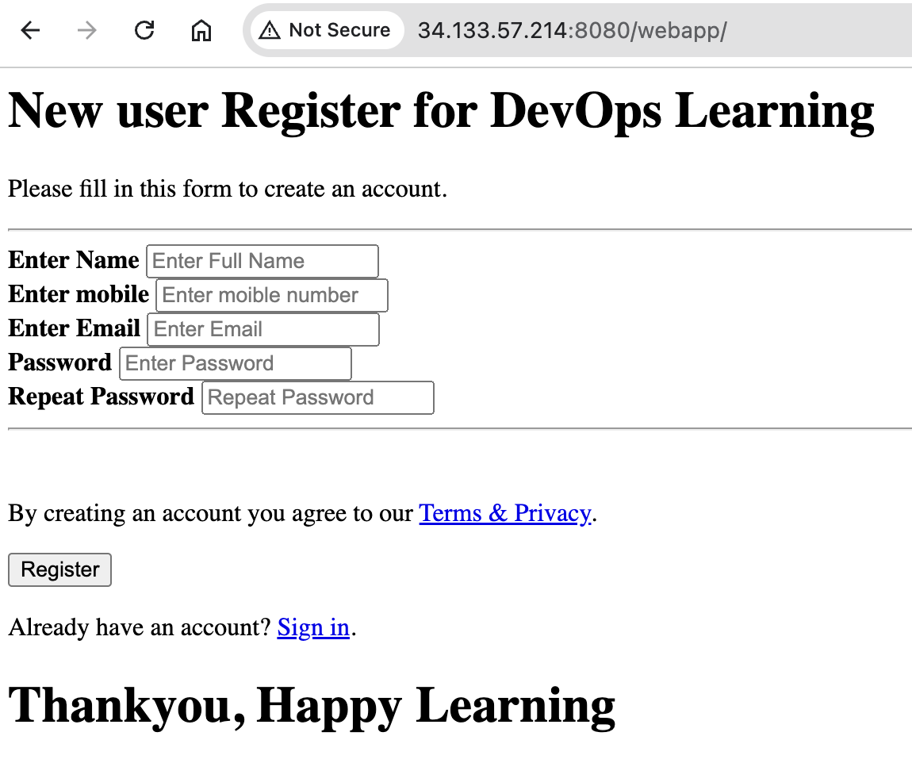

# Automate build and deploy using Poll SCM

**Configure Build Triggers** 

Goto Dashboard > BuildAndDeployJob > Configuration

 

-  Update the source code and push to the repository. It will automatically build the code and deply it to Tomcat server.

# Create Tomcat container

**Run tomcat container**

```
docker run -d --name tomcat -p 8080:8080 tomcat
```

**Browse Tomcat**

`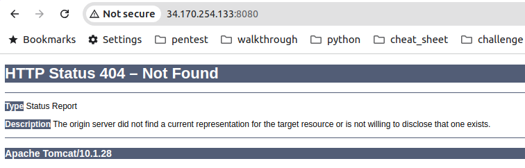

# Fixing Tomcat container issue

List ocker containers

 ```
 docker ps
 CONTAINER ID   IMAGE     COMMAND             CREATED          STATUS          PORTS                                       NAMES
 70ede2d07dc0   tomcat    "catalina.sh run"   35 minutes ago   Up 35 minutes   0.0.0.0:8080->8080/tcp, :::8080->8080/tcp   tomcat
 ```

Login to tomcat container

```
docker exec -it tomcat /bin/bash
root@70ede2d07dc0:/usr/local/tomcat# ls
bin           conf             lib      logs            NOTICE     RELEASE-NOTES  temp     webapps.dist
BUILDING.txt  CONTRIBUTING.md  LICENSE  native-jni-lib  README.md  RUNNING.txt    webapps  work

root@70ede2d07dc0:/usr/local/tomcat# cd webapps.dist/

root@70ede2d07dc0:/usr/local/tomcat/webapps.dist# ls
docs  examples  host-manager  manager  ROOT

root@70ede2d07dc0:/usr/local/tomcat/webapps.dist# cp -R * ../webapps/

root@70ede2d07dc0:/usr/local/tomcat/webapps.dist# ls ../webapps
docs  examples  host-manager  manager  ROOT
root@70ede2d07dc0:/usr/local/tomcat/webapps.dist# 
```

**Browse Tomcat**

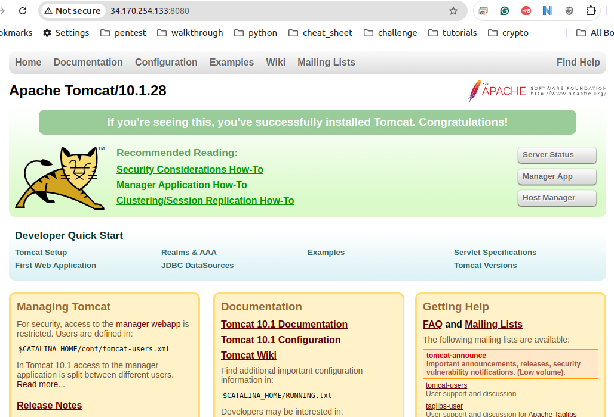


# Create your first docker file

## Dockerfile Creation

Docker file format

```
 # Comment
 INSTRUCTION arguments
```

1. A Dockerfile must begin with a FROM instruction.
2. Docker distributes official versions of the images that can be used for building Dockerfiles under docker/dockerfile repository on Docker Hub.

- `FROM` - A valid Dockerfile must start with a FROM instruction.

- `RUN` - The RUN instruction will execute any commands in a new layer on top of the current image and commit the results. The resulting committed image will be used for the next step in the Dockerfile.

- `CMD` - The main purpose of a CMD is to provide defaults for an executing container.

  `Note:` There can only be one CMD instruction in a Dockerfile. If you list more than one CMD then only the last CMD will take effect.

  `Note` - Do not confuse RUN with CMD. RUN actually runs a command and commits the result; CMD does not execute anything at build time, but specifies the intended command for the image.

- `LABEL` -The LABEL instruction adds metadata to an image. A LABEL is a key-value pair. T

- `EXPOSE`

  1. The EXPOSE instruction informs Docker that the container listens on the specified network ports at runtime.
  2. To set up port redirection on the host system, see using the -P flag.
  3. The docker network command supports creating networks for communication among containers without the need to expose or publish specific ports, because the containers connected to the network can communicate with each other over any port.

- `ENV` - The ENV instruction sets the environment variable to the value .

- `ADD` - The ADD instruction copies new files, directories or remote file URLs from and adds them to the filesystem of the image at the path .

  If is a local tar archive in a recognized compression format (identity, gzip, bzip2 or xz) then it is unpacked as a directory.

- `COPY` - The COPY instruction copies new files or directories from and adds them to the filesystem of the container at the path .

- `ENTRYPOINT` - An ENTRYPOINT allows you to configure a container that will run as an executable.

  1. ENTRYPOINT will override all elements specified using CMD
  2. Both CMD and ENTRYPOINT instructions define what command gets executed when running a container. There are few rules that describe their co-operation.
  3. Dockerfile should specify at least one of CMD or ENTRYPOINT commands.
  4. ENTRYPOINT should be defined when using the container as an executable.
  5. CMD should be used as a way of defining default arguments for an ENTRYPOINT command or for executing an ad-hoc command in a container.
  6. CMD will be overridden when running the container with alternative arguments.

- `VOLUME` - The VOLUME instruction creates a mount point with the specified name and marks it as holding externally mounted volumes from native host or other containers.

- `USER` - The USER instruction sets the user name to use when running the image

- `WORKDIR` - The WORKDIR instruction sets the working directory for any RUN, CMD, ENTRYPOINT, COPY and ADD instructions

- `ARG` - The ARG instruction defines a variable that users can pass at build-time to the builder with the docker build command using the --build-arg = flag.

- `SHELL` - The SHELL instruction allows the default shell used for the shell form of commands to be overridden.

# Install Tomcat on Ubuntu

| Description                                 | Command   |
| ------------------------------------------- | --------- |
| 1. Pull centos from dockerhub               | FROM      |
| 2. Install java                             | RUN       |
| 3. Create /opt/tomcat directory             | RUN       |
| 4. Change work directory to /opt/tomcat     | WORKDIR   |
| 5. Download tomcat packages                 | ADD / RUN |
| 6. Extract tar.gz file                      | RUN       |
| 7. Rename to tomcat directory               | RUN       |
| 8. Tell to docker that it runs on port 8080 | EXPOSE    |
| 9. Tell to docker that it runs on port 8080 | CMD       |

**Dockerfile**

```
FROM ubuntu
RUN apt update && apt install fontconfig openjdk-17-jre -y
RUN mkdir /opt/tomcat/
WORKDIR /opt/tomcat
ADD https://dlcdn.apache.org/tomcat/tomcat-9/v9.0.93/bin/apache-tomcat-9.0.93.tar.gz .
RUN tar -xvzf apache-tomcat-*.tar.gz 
RUN mv apache-tomcat-9.0.93/* /opt/tomcat
EXPOSE 8080
CMD ["/opt/tomcat/bin/catalina.sh", "run"]
```

**Build image**

```
docker build -t sherwinowen/mytomcat .
[+] Building 9.8s (12/12) FINISHED                                                        docker:default
 => [internal] load build definition from Dockerfile                                                0.0s
 => => transferring dockerfile: 376B                                                                0.0s
 => [internal] load metadata for docker.io/library/ubuntu:latest                                    0.3s
 => [internal] load .dockerignore                                                                   0.0s
 => => transferring context: 2B                                                                     0.0s
 => [1/7] FROM docker.io/library/ubuntu:latest@sha256:8a37d68f4f73ebf3d4efafbcf66379bf3728902a8038  0.0s
 => [5/7] ADD https://dlcdn.apache.org/tomcat/tomcat-9/v9.0.93/bin/apache-tomcat-9.0.93.tar.gz .    0.0s
 => CACHED [2/7] RUN apt update && apt install fontconfig openjdk-17-jre -y                         0.0s
 => CACHED [3/7] RUN mkdir /opt/tomcat/                                                             0.0s
 => CACHED [4/7] WORKDIR /opt/tomcat                                                                0.0s
 => CACHED [5/7] ADD https://dlcdn.apache.org/tomcat/tomcat-9/v9.0.93/bin/apache-tomcat-9.0.93.tar  0.0s
 => [6/7] RUN tar -xvzf apache-tomcat-*.tar.gz                                                      0.7s
 => [7/7] RUN mv apache-tomcat-9.0.93/* /opt/tomcat                                                 2.0s 
 => exporting to image                                                                              6.6s 
 => => exporting layers                                                                             6.6s 
 => => writing image sha256:f257df9c4c7a08743805947b8873a23bfb84b181f4cfd15826b1e0570e4243ee        0.0s 
 => => naming to docker.io/sherwinowen/mytomcat                                
```

**Run container**

```
docker run -d --name mytomcat -p 8080:8080 sherwinowen/mytomcat
e87a31742e64c7195d7816508cbd9444a636a68d3254679dd7cbbfd6220caa60

$ docker ps
CONTAINER ID   IMAGE                  COMMAND                  CREATED         STATUS         PORTS                                       NAMES
e87a31742e64   sherwinowen/mytomcat   "/opt/tomcat/bin/cat…"   5 seconds ago   Up 4 seconds   0.0.0.0:8080->8080/tcp, :::8080->8080/tcp   mytomcat

```


# Create customized dockerfile for tomcat

**Dockerfile**

```
FROM tomcat:latest
RUN cp -R /usr/local/tomcat/webapps.dist/* /usr/local/tomcat/webapps
```

**Build image**

```
docker build -t sherwinowen/demotomcat .
[+] Building 1.1s (6/6) FINISHED                                                          docker:default
 => [internal] load build definition from Dockerfile                                                0.0s
 => => transferring dockerfile: 118B                                                                0.0s
 => [internal] load metadata for docker.io/library/tomcat:latest                                    0.0s
 => [internal] load .dockerignore                                                                   0.0s
 => => transferring context: 2B                                                                     0.0s
 => [1/2] FROM docker.io/library/tomcat:latest                                                      0.1s
 => [2/2] RUN cp -R /usr/local/tomcat/webapps.dist/* /usr/local/tomcat/webapps                      0.7s
 => exporting to image                                                                              0.2s
 => => exporting layers                                                                             0.1s
 => => writing image sha256:10c27550f4fa821daf612e25100aeb6ddcf0b7bb15e96bd53fdda13606017fe4        0.0s
 => => naming to docker.io/sherwinowen/demotomcat                                  
```

**Run container**

```
docker run -d --name demotomcat -p 8082:8080 sherwinowen/demotomcat
228245122de728697a02a825d410203e4ae602fb7d3bd028b30abc615b6364e2

docker ps
CONTAINER ID   IMAGE                    COMMAND                  CREATED          STATUS          PORTS                                         NAMES
228245122de7   sherwinowen/demotomcat   "catalina.sh run"        3 minutes ago    Up 3 minutes    0.0.0.0:8082->8080/tcp, [::]:8082->8080/tcp   demotomcat
827848397e00   sherwinowen/mytomcat     "/opt/tomcat/bin/cat…"   37 minutes ago   Up 37 minutes   0.0.0.0:8081->8080/tcp, [::]:8081->8080/tcp   mytomcat
```

# Integrate Docker with Jenkins

1. Create a dockeradmin user

   ```
   $ sudo adduser dockeradmin
   info: Adding user `dockeradmin' ...
   info: Selecting UID/GID from range 1000 to 59999 ...
   info: Adding new group `dockeradmin' (1004) ...
   info: Adding new user `dockeradmin' (1004) with group `dockeradmin (1004)' ...
   info: Creating home directory `/home/dockeradmin' ...
   info: Copying files from `/etc/skel' ...
   New password: 
   Retype new password: 
   passwd: password updated successfully
   Changing the user information for dockeradmin
   Enter the new value, or press ENTER for the default
   	Full Name []: 
   	Room Number []: 
   	Work Phone []: 
   	Home Phone []: 
   	Other []: 
   Is the information correct? [Y/n] 
   info: Adding new user `dockeradmin' to supplemental / extra groups `users' ...
   info: Adding user `dockeradmin' to group `users' ...
   ```

   Add dockeradmin to docker group

   ```
   $ sudo usermod -aG docker dockeradmin 
   ```

2. Install "Publish Over SSH" plugin

   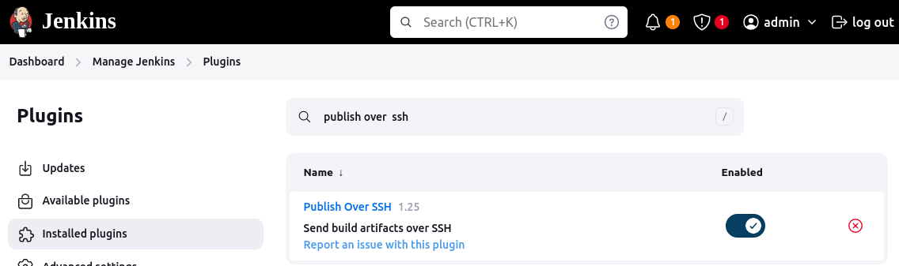

   

3. Add Dockerhost to Jenkins "configure systems"

   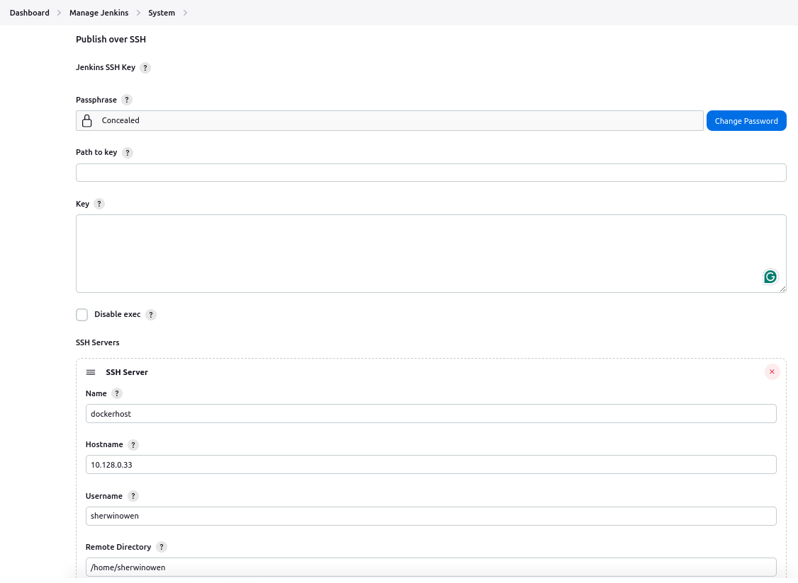

   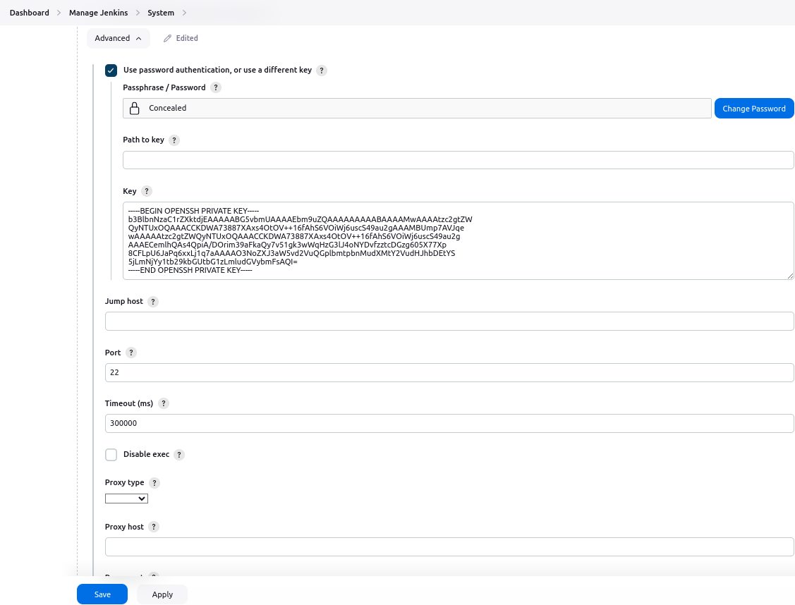


# Jenkins job to build and copy Artifacts on to Docker host

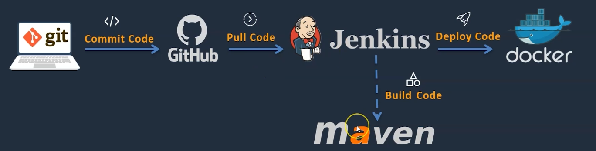

1. Create new job from BuildAndDeployJob

   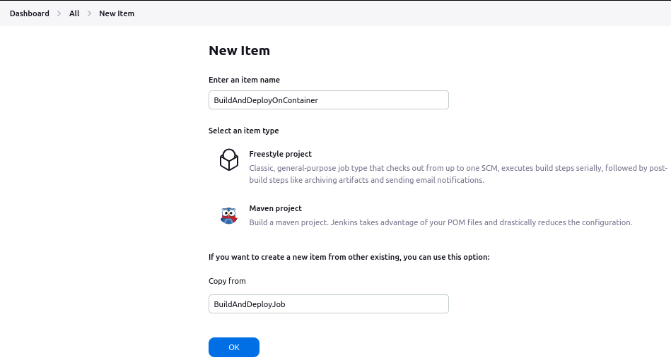

   

2. Post-build Actions

   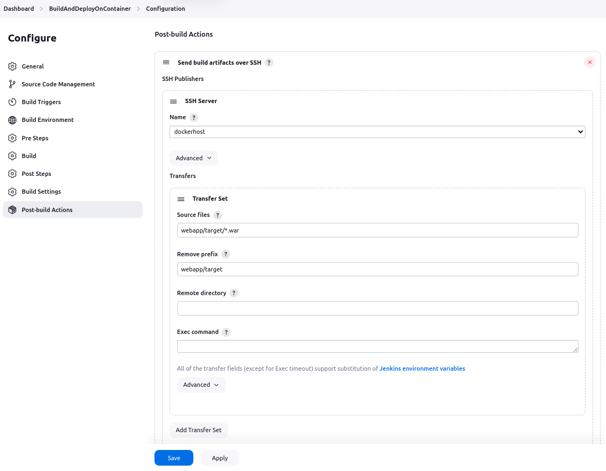

# Update Tomcat Dockerfile to Automate Deployment Process

1. Make docker folder in Docker VM**

```   
mkdir /opt/docker
```

2. Change owner**

```
chown -R sherwinowen:sherwinowen /opt/docker
```

3. Update Post-build Actions / Transfers > Remote directory

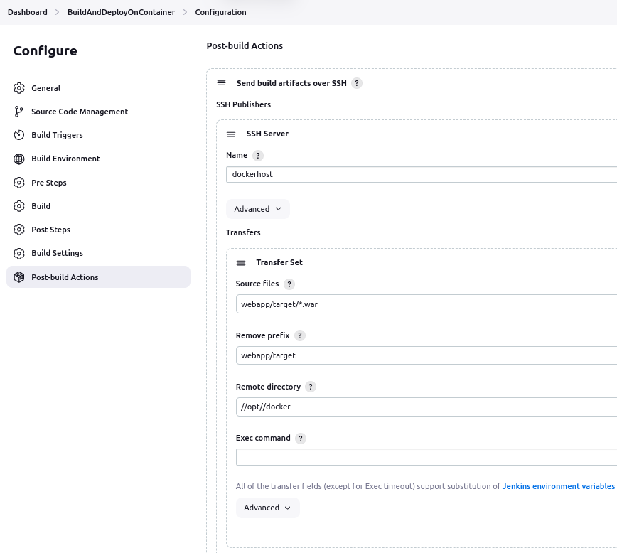

4. Build job

   - webapp.war should be in /opt/docker

   ```
   ls -l /opt/docker/
   total 8
   -rw-rw-r-- 1 sherwinowen sherwinowen   81 Sep  2 12:21 Dockerfile
   -rw-rw-r-- 1 sherwinowen sherwinowen 2372 Sep  2 19:10 webapp.war
   ```

   

# Update Tomcat Dockerfile to Automate Deployment Process

1. Update Dockerfile

   ```
   FROM tomcat
   RUN cp -R /usr/local/tomcat/webapps.dist/* /usr/local/tomcat/webapps
   COPY ./*.war /usr/local/tomcat/webapps
   ```

2. Build image

   ```
   docker build -t tomcat:v1 .
   [+] Building 0.3s (8/8) FINISHED                                                                         docker:default
    => [internal] load build definition from Dockerfile                                                               0.0s
    => => transferring dockerfile: 157B                                                                               0.0s
    => [internal] load metadata for docker.io/library/tomcat:latest                                                   0.0s
    => [internal] load .dockerignore                                                                                  0.0s
    => => transferring context: 2B                                                                                    0.0s
    => [1/3] FROM docker.io/library/tomcat:latest                                                                     0.0s
    => CACHED [2/3] RUN cp -R /usr/local/tomcat/webapps.dist/* /usr/local/tomcat/webapps                              0.0s
    => [internal] load build context                                                                                  0.0s
    => => transferring context: 2.41kB                                                                                0.0s
    => [3/3] COPY ./*.war /usr/local/tomcat/webapps                                                                   0.1s
    => exporting to image                                                                                             0.1s
    => => exporting layers                                                                                            0.0s
    => => writing image sha256:008a725dd7f015f967f078a7199b575975f8ba24c774b9a1662757536dac99bd                       0.0s
    => => naming to docker.io/library/tomcat:v1                                     
   ```

3. List images

   ```
   docker images
   REPOSITORY               TAG       IMAGE ID       CREATED         SIZE
   tomcat                   v1        008a725dd7f0   7 seconds ago   512MB
   sherwinowen/demotomcat   latest    10c27550f4fa   20 hours ago    512MB
   sherwinowen/mytomcat     latest    f257df9c4c7a   21 hours ago    796MB
   tomcat                   latest    c2a444ea6cd7   3 weeks ago     508MB
   ```

4. Run container

   ```
   docker run -d --name tomcatv1 -p 8081:8080 tomcat:v1
   dd8ec5ff54efb65572554a3aab891431a1681bb3d07aabd8adc7f3c6e054b6be
   
   docker ps
   CONTAINER ID   IMAGE       COMMAND             CREATED         STATUS         PORTS                                         NAMES
   dd8ec5ff54ef   tomcat:v1   "catalina.sh run"   8 seconds ago   Up 7 seconds   0.0.0.0:8081->8080/tcp, [::]:8081->8080/tcp   tomcatv1
   ```


# Automate  build and deployment on docker container

1. Update BuildAndDeployContainer job

    Add Exec command in Post-build Actions

   ```
   cd /opt/docker;
   docker build -t regapp:v1 .;
   docker run -d --name registerapp -p 8082:8080 regapp:v1
   ```

2. Build now

   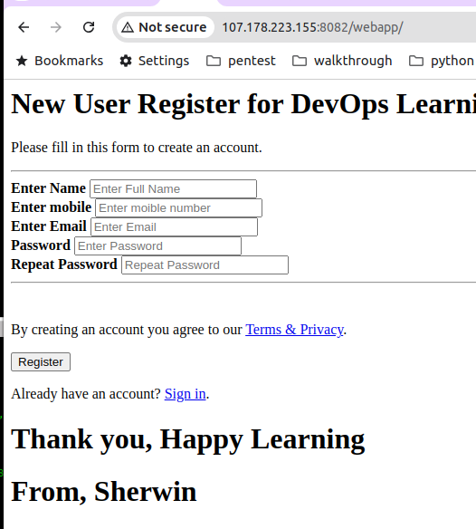

3. Check docker images and containers

   ```
   docker images
   REPOSITORY               TAG       IMAGE ID       CREATED             SIZE
   regapp                   v1        385af2739e7d   14 seconds ago      512MB
   
   docker ps
   CONTAINER ID   IMAGE       COMMAND             CREATED             STATUS             PORTS                                         NAMES
   0e625fe72578   regapp:v1   "catalina.sh run"   20 seconds ago      Up 19 seconds      0.0.0.0:8082->8080/tcp, [::]:8082->8080/tcp   registerapp
   ```

4. Try to commit chages to the remote repository

   - It wil not finish successfully. Error in docker container creation.

   ```
   docker run -d --name registerapp -p 8082:8080 regapp:v1
   docker: Error response from daemon: Conflict. The container name "/registerapp" is already in use by container "0e625fe72578fd79884e820e30160296f968442711c38973f9703d4c6b18f030". You have to remove (or rename) that container to be able to reuse that name.
   See 'docker run --help'.
   ```


# Jenkins Job to Automate CI CD to Deploy Application on Docker Container

1. Update BuildAndDeployContainer job

    Add Exec command in Post-build Actions

   ```
   cd /opt/docker;
   docker build -t regapp:v1 .;
   docker stop registerapp;
   docker rm registerapp;
   docker run -d --name registerapp -p 8082:8080 regapp:v1
   ```

2. Build now

# Using Ansible to create containers

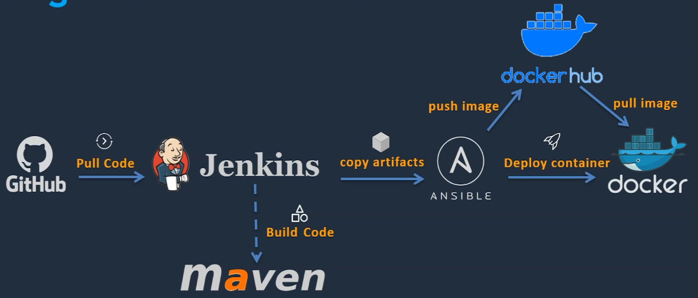

# Install Ansible

Setup hostname

**Create ansadmin user**

```
sudo adduser ansadmin
```

**Add user to sudoers file**

```
sudo usermod -aG sudo ansadmin
```

Generate ssh keys

```
ssh-keygen 
Generating public/private ed25519 key pair.
Enter file in which to save the key (/home/ansadmin/.ssh/id_ed25519): 
Created directory '/home/ansadmin/.ssh'.
Enter passphrase (empty for no passphrase): 
Enter same passphrase again: 
Your identification has been saved in /home/ansadmin/.ssh/id_ed25519
Your public key has been saved in /home/ansadmin/.ssh/id_ed25519.pub
The key fingerprint is:
SHA256:rA2koDswdy6MdSsShPy4wzrwz10L9BPlu/vK0sRJ4XU ansadmin@tomcat
The key's randomart image is:
+--[ED25519 256]--+
|                 |
|o         . . E  |
|.o.   .  ..o .   |
|..o. o . oo      |
|=.o.+ o So..     |
|+O.+ o = .+.     |
|*=+ o o =o.      |
|ooo+ . o.+..     |
|.. .o . ..=+.    |
+----[SHA256]-----+

ls -l .ssh/
total 8
-rw------- 1 ansadmin ansadmin 411 Sep  3 16:32 id_ed25519
-rw-r--r-- 1 ansadmin ansadmin  97 Sep  3 16:32 id_ed25519.pub

```

Enable password based login
**Install ansible**

```
sudo apt install ansible
```


# Integrate Docker with Ansible

## On Docker Host

Create **ansadmin**

```
sudo adduser ansadmin
```

Add ansadmin to sudoers

```
sudo usermod -aG sudo ansadmin
```


## On Ansible Node

**Set up the Inventory File**

Add to hosts file 

1. Create the **ansible** [subdirectory](https://phoenixnap.com/glossary/what-is-a-subdirectory) in the *etc* directory:

```
sudo mkdir -p /etc/ansible
```

2. Use a [text editor](https://phoenixnap.com/kb/best-linux-text-editors-for-coding) such as [Nano](https://phoenixnap.com/kb/use-nano-text-editor-commands-linux) to create a file named *hosts*:

```
sudo nano /etc/ansible/hosts
```

```
[IP of Docker Server]
```

3. Copy ssh keys in authorized_key

4. Test connection

   ```
   ansible all -m ping
   10.128.0.33 | SUCCESS => {
       "ansible_facts": {
           "discovered_interpreter_python": "/usr/bin/python3"
       },
       "changed": false,
       "ping": "pong"
   }
   ```

   ```
   ansible all -m command -a uptime
   10.128.0.33 | CHANGED | rc=0 >>
    18:24:17 up 10:31,  3 users,  load average: 0.09, 0.06, 0.01
   ```


# Integrate Ansible with Jenkins

1. Make docker folder in Ansible VM

```   
mkdir /opt/docker
```

2. Change owner**

```
chown -R sherwinowen:sherwinowen /opt/docker
```

3. Add Ansible server in Jenins system configuration

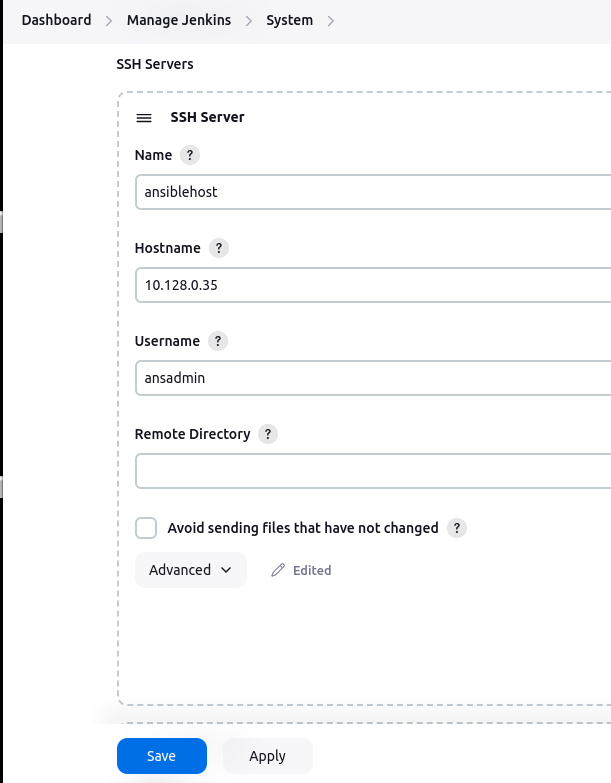

2. Create new job from BuildAndDeployOnContainer

   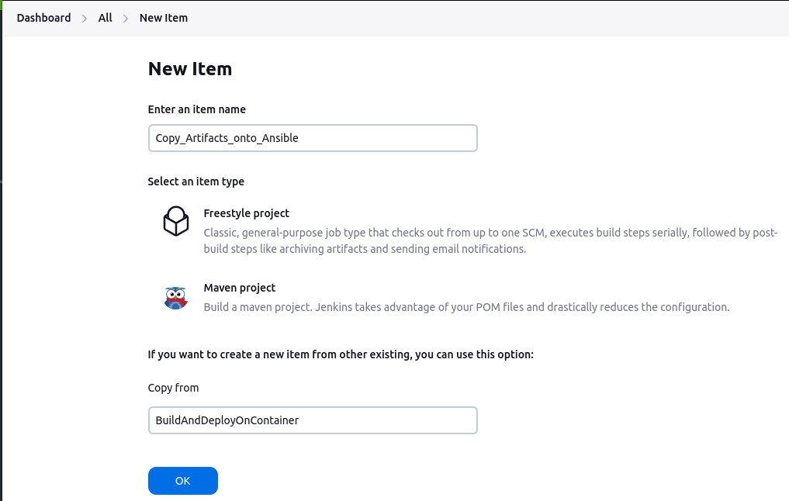

3. Setup Post-build Actions

   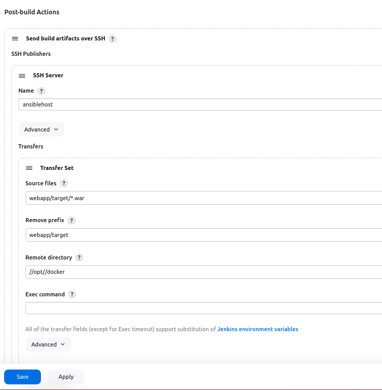

4. Build now

   - It should create webapp.war in Ansible server /opt/docker


# Build an image and create container in Ansible

1. Install docker

   https://docs.docker.com/engine/install/ubuntu/

2. Create docker image

   Dockerfile

   ```
   FROM tomcat
   RUN cp -R /usr/local/tomcat/webapps.dist/* /usr/local/tomcat/webapps
   COPY ./*.war /usr/local/tomcat/webapps
   ```

   ```
   docker build -t regapp:v1 .
   ```

3. Run Docker container

   ```
   docker run -d --name regapp-server -p 8080:8080 regapp:v1
   ```
   


# Using Ansible to create containers

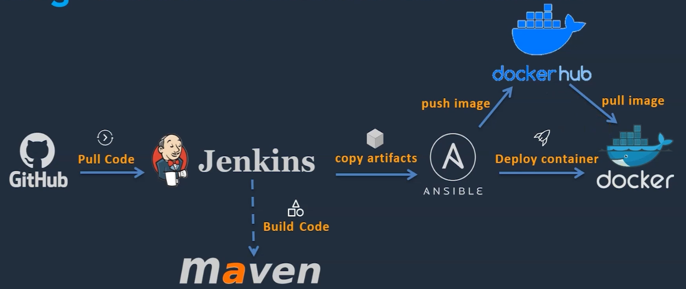

1. Update Ansible inventory

   /etc/ansible/host

   ```
   [dockerhost]
   10.128.0.33
   
   [ansiblehost]
   10.128.0.35
   ```

2. Ping servers

   ```
   ansible all -m ping
   10.128.0.35 | SUCCESS => {
       "ansible_facts": {
           "discovered_interpreter_python": "/usr/bin/python3"
       },
       "changed": false,
       "ping": "pong"
   }
   10.128.0.33 | SUCCESS => {
       "ansible_facts": {
           "discovered_interpreter_python": "/usr/bin/python3"
       },
       "changed": false,
       "ping": "pong"
   }
   ```

3. Create ansible playbook

   regapp.yml

   ```
   ---
   - hosts: ansiblehost
   
     tasks:
     - name: create docker image
       command: docker build -t regapp:latest .
       args:
         chdir: /opt/docker
   ```

4. Test ansible playbook

   ```
   ansible-playbook regapp.yml --check
   
   PLAY [ansiblehost] ***********************************************************************************************
   
   TASK [Gathering Facts] *******************************************************************************************
   ok: [10.128.0.35]
   
   TASK [create docker image] ***************************************************************************************
   skipping: [10.128.0.35]
   
   PLAY RECAP *******************************************************************************************************
   10.128.0.35                : ok=1    changed=0    unreachable=0    failed=0    skipped=1    rescued=0    ignored=0
   ```

5. Run ansible palybook

   ```
   ansible-playbook regapp.yml 
   
   PLAY [ansiblehost] ***********************************************************************************************
   
   TASK [Gathering Facts] *******************************************************************************************
   ok: [10.128.0.35]
   
   TASK [create docker image] ***************************************************************************************
   changed: [10.128.0.35]
   
   PLAY RECAP *******************************************************************************************************
   10.128.0.35                : ok=2    changed=1    unreachable=0    failed=0    skipped=0    rescued=0    ignored=0   
   ```

6. Check if docker image was created

   List docker images

   ```
   docker images
   REPOSITORY   TAG       IMAGE ID       CREATED       SIZE
   regapp       latest    198a4531e8ce   3 hours ago   512MB
   regapp       v1        198a4531e8ce   3 hours ago   512MB
   ```


# Copy image to Dockerhub

1. Login to Dockerhub account

   ```
   docker login -u sherwinowen
   Password: 
   WARNING! Your password will be stored unencrypted in /home/ansadmin/.docker/config.json.
   Configure a credential helper to remove this warning. See
   https://docs.docker.com/engine/reference/commandline/login/#credential-stores
   
   Login Succeeded-
   ```

2. Update docker image name

   ```
   $ docker images
   REPOSITORY   TAG       IMAGE ID       CREATED        SIZE
   regapp       latest    198a4531e8ce   23 hours ago   512MB
   regapp       v1        198a4531e8ce   23 hours ago   512MB
   
   $ docker tag regapp:latest sherwinowen/regapp:latest
   
   $ docker images
   REPOSITORY           TAG       IMAGE ID       CREATED        SIZE
   regapp               latest    198a4531e8ce   23 hours ago   512MB
   regapp               v1        198a4531e8ce   23 hours ago   512MB
   sherwinowen/regapp   latest    198a4531e8ce   23 hours ago   512MB
   ```

3. Push image to Dcokerhub

   ```
   $ docker push sherwinowen/regapp:latest
   The push refers to repository [docker.io/sherwinowen/regapp]
   bce3baf22a84: Pushed 
   77f99c646357: Pushed 
   5f70bf18a086: Mounted from library/tomcat 
   45fa496d4478: Mounted from library/tomcat 
   466578cdfadb: Mounted from library/tomcat 
   853a9ace6faa: Mounted from library/tomcat 
   87cdfed53fa0: Mounted from library/tomcat 
   ea1bbf734f69: Mounted from library/tomcat 
   7b872bc9fea5: Mounted from library/tomcat 
   f36fd4bb7334: Mounted from library/tomcat 
   latest: digest: sha256:75c529558365adb3bf7bdb94f6790e420cf2889a36b05ddeefa5739f03b12a4f size: 2620
   ```


# Jenkins Job to Build an image onto Ansible

1. Update ansible playbook

   regapp.yaml

   ```
   ---
   - hosts: ansiblehost
   
     tasks:
     - name: create docker image
       command: docker build -t regapp:latest .
       args:
         chdir: /opt/docker
   
     - name: create tag to push image nto dockerhub
       command: docker tag regapp:latest sherwinowen/regapp:latest
   
     - name: push docker image
       command: docker push sherwinowen/regapp:latest
   ```

2. Test ansible palybook

   ```
   $ ansible-playbook regapp.yml --check
   
   PLAY [ansiblehost] ***********************************************************************************************
   
   TASK [Gathering Facts] *******************************************************************************************
   ok: [10.128.0.35]
   
   TASK [create docker image] ***************************************************************************************
   skipping: [10.128.0.35]
   
   TASK [create tag to push image nto dockerhub] ********************************************************************
   skipping: [10.128.0.35]
   
   TASK [push docker image] *****************************************************************************************
   skipping: [10.128.0.35]
   
   PLAY RECAP *******************************************************************************************************
   10.128.0.35                : ok=1    changed=0    unreachable=0    failed=0    skipped=3    rescued=0    ignored=0
   ```

3. Update ansible job Copy_Artifacts_onto_Ansible

   - Exec command in Post-build Actions

     ```
     ansible-playbook /opt/docker/regapp.yml
     ```

     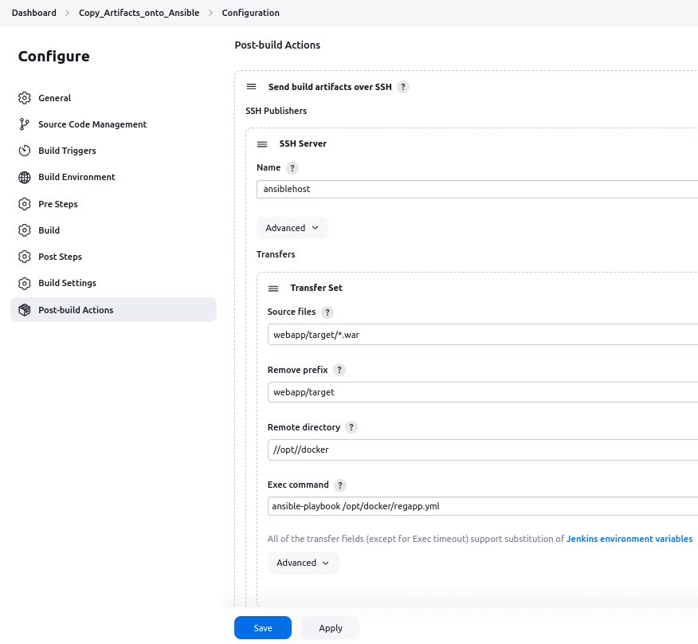

   

4. Update Build Triggers

   - set Poll SCM

     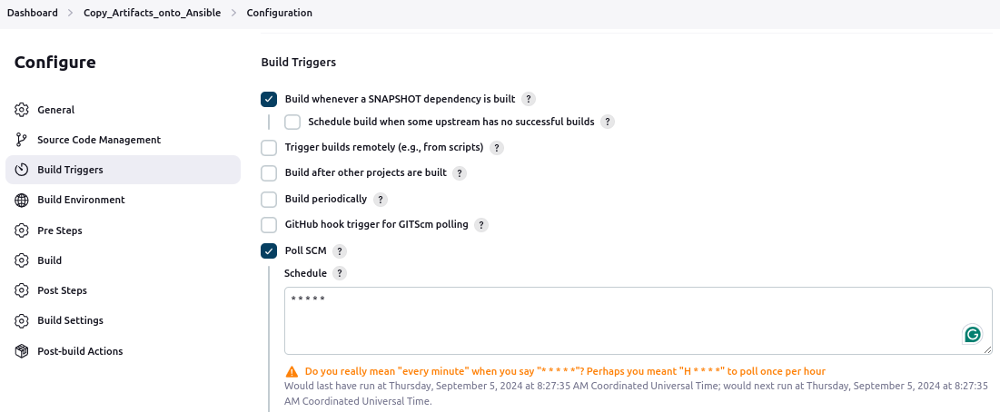


5. Update index.jsp and push to the Github repository to trigger the build

   ```
   $ docker images
   REPOSITORY           TAG       IMAGE ID       CREATED             SIZE
   regapp               latest    797e0f7b41fb   55 seconds ago      512MB
   sherwinowen/regapp   latest    797e0f7b41fb   55 seconds ago      512MB
   ```


# How to Create Container on DockerHost using Ansible Playbook


