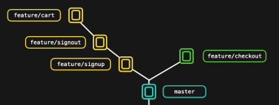

# Git Laboratory

## Lab install GIT

1. Let's install GIT. First, identify the operating system this lab environment is built on.

   - Debian
   - **Ubuntu**
   - CentOS
   - Redhat

   ```
   $ cat /etc/*release*
   DISTRIB_ID=Ubuntu
   DISTRIB_RELEASE=18.04
   DISTRIB_CODENAME=bionic
   DISTRIB_DESCRIPTION="Ubuntu 18.04.4 LTS"
   NAME="Ubuntu"
   VERSION="18.04.4 LTS (Bionic Beaver)"
   ID=ubuntu
   ID_LIKE=debian
   PRETTY_NAME="Ubuntu 18.04.4 LTS"
   VERSION_ID="18.04"
   HOME_URL="https://www.ubuntu.com/"
   SUPPORT_URL="https://help.ubuntu.com/"
   BUG_REPORT_URL="https://bugs.launchpad.net/ubuntu/"
   PRIVACY_POLICY_URL="https://www.ubuntu.com/legal/terms-and-policies/privacy-policy"
   VERSION_CODENAME=bionic
   UBUNTU_CODENAME=bionic
   ```

2. Install `GIT` on the system.

   Remember to use `sudo` to elevate permission while installing.

   Refer to the GIT installation documentation here: https://git-scm.com/book/en/v2/Getting-Started-Installing-Git

   Run `sudo apt update` and then `sudo apt install git -y`

3. Identify the version of `git` you just installed.

   - **2.17.1**
   - 2.16.0
   - 1.16.0
   - 1.17.1

   ```
   $ git --version
   git version 2.17.1
   ```

4. We will learn more about working with different git commands throughout this course. But let's see if you can figure some stuff out using the `git help` command.

   What's the git command used to `Show various types of objects`?

   - log
   - status
   - clone
   - **show**

   ```
   $ git help
   usage: git [--version] [--help] [-C <path>] [-c <name>=<value>]
              [--exec-path[=<path>]] [--html-path] [--man-path] [--info-path]
              [-p | --paginate | --no-pager] [--no-replace-objects] [--bare]
              [--git-dir=<path>] [--work-tree=<path>] [--namespace=<name>]
              <command> [<args>]
   
   These are common Git commands used in various situations:
   
   start a working area (see also: git help tutorial)
      clone      Clone a repository into a new directory
      init       Create an empty Git repository or reinitialize an existing one
   
   work on the current change (see also: git help everyday)
      add        Add file contents to the index
      mv         Move or rename a file, a directory, or a symlink
      reset      Reset current HEAD to the specified state
      rm         Remove files from the working tree and from the index
   
   examine the history and state (see also: git help revisions)
      bisect     Use binary search to find the commit that introduced a bug
      grep       Print lines matching a pattern
      log        Show commit logs
      show       Show various types of objects
   ```

5. What's the git command used to `List, create, or delete branches`?

   - checkout
   - tag
   - status
   - **branch**

   ```
   $ git help
   usage: git [--version] [--help] [-C <path>] [-c <name>=<value>]
              [--exec-path[=<path>]] [--html-path] [--man-path] [--info-path]
              [-p | --paginate | --no-pager] [--no-replace-objects] [--bare]
              [--git-dir=<path>] [--work-tree=<path>] [--namespace=<name>]
              <command> [<args>]
   
   These are common Git commands used in various situations:
   
   start a working area (see also: git help tutorial)
      clone      Clone a repository into a new directory
      init       Create an empty Git repository or reinitialize an existing one
   
   work on the current change (see also: git help everyday)
      add        Add file contents to the index
      mv         Move or rename a file, a directory, or a symlink
      reset      Reset current HEAD to the specified state
      rm         Remove files from the working tree and from the index
   
   examine the history and state (see also: git help revisions)
      bisect     Use binary search to find the commit that introduced a bug
      grep       Print lines matching a pattern
      log        Show commit logs
      show       Show various types of objects
      status     Show the working tree status
   
   grow, mark and tweak your common history
      branch     List, create, or delete branches
      checkout   Switch branches or restore working tree files
      commit     Record changes to the repository
      diff       Show changes between commits, commit and working tree, etc
      merge      Join two or more development histories together
      rebase     Reapply commits on top of another base tip
      tag        Create, list, delete or verify a tag object signed with GPG
   
   collaborate (see also: git help workflows)
      fetch      Download objects and refs from another repository
      pull       Fetch from and integrate with another repository or a local branch
      push       Update remote refs along with associated objects
   ```

6. What's the git command used to `Download objects from another repository`?

   - branch
   - push
   - merge
   - **fetch**

7. What's the git command used to `start a working area`?

   - add
   - pull
   - **init**
   - reset

8. You may view additional help on each command following the syntax `git help <command>`. For this you must first install git man pages using the command `sudo apt-get install git-man`

   Once done use the help of the `init` command with the command `git help init` and identify the option used to create a bare repository.

   We will learn about initializing a repository later in this course.

   - -q
   - -b
   - --br
   - -bare
   - **--bare**

   ```
   $ git init -h
   usage: git init [-q | --quiet] [--bare] [--template=<template-directory>] [--shared[=<permissions>]] [<directory>]
   
       --template <template-directory>
                             directory from which templates will be used
       --bare                create a bare repository
       --shared[=<permissions>]
                             specify that the git repository is to be shared amongst several users
       -q, --quiet           be quiet
       --separate-git-dir <gitdir>
                             separate git dir from working tree
   ```


## GIT INTRODUCTION, LAB: INITIALIZE A GIT REPOSITORY

1. What is the command to initialize a `git` repository?

   - git pull
   - **git init**
   - git clone
   - git push

2. Initialize a git repository at `/home/sarah/story-blog`

   Create directory if it doesn't already exist.

   Check

   - Valid git repo?

   ```
   sarah $ mkdir /home/sarah/story-blog
   sarah $ cd /home/sarah/story-blog
   sarah $ git init
   hint: Using 'master' as the name for the initial branch. This default branch name
   hint: is subject to change. To configure the initial branch name to use in all
   hint: of your new repositories, which will suppress this warning, call:
   hint: 
   hint:   git config --global init.defaultBranch <name>
   hint: 
   hint: Names commonly chosen instead of 'master' are 'main', 'trunk' and
   hint: 'development'. The just-created branch can be renamed via this command:
   hint: 
   hint:   git branch -m <name>
   Initialized empty Git repository in /home/sarah/story-blog/.git/
   ```

3. Which hidden folder gets created after initializing a git repository?

   Explore the repository created in the previous step

   - .git-conf
   - .story-blog
   - .gitlog
   - **.git**

4. Let's test some of the concepts we learned so far in our lectures.

   Once a git repository has been initialized, which stage contains the `active changes` in your local git repository?

   - Committed Files
   - Staging area
   - **Working area**
   - Pushed Files

   All files in a GIT Repo just initialized are in the `Working Area`

5. Let’s add a file to our project inside `/home/sarah/story-blog`

   File name: `lion-and-mouse.txt`

   File content: `A Lion lay asleep in the forest`

   Check

   - Verify file exists

   ```
   sarah $ touch lion-and-mouse.txt; echo "A Lion lay asleep in the forest" >> lion-and-mouse.txt
   sarah $ ls -l 
   total 4
   -rw-r--r--    1 sarah    sarah           32 Jan 30 08:23 lion-and-mouse.txt
   ```

6. Which stage contains new changes that `will soon be committed` to local git repo ?

   - **Staging area**
   - Pushed Files
   - Working area
   - Committed Files

   Files that are added are moved to the `Staging Area`

7. Now that we've added a text file, let's see if `git` detected the change we made. Although we haven't done anything with `git` yet, we initialized a `git` repository in this project, so `git` is aware of all our files and changes.

   You can see the status of `git` by executing the `git status` command.

   Answer next few questions based on the `git status` command output.

   Ok

   ```
   sarah $ git status
   On branch master
   
   No commits yet
   
   Untracked files:
     (use "git add <file>..." to include in what will be committed)
           lion-and-mouse.txt
   
   nothing added to commit but untracked files present (use "git add" to track)
   ```

8. What commits are listed in the `git` repository?

   - .git
   - story-blog
   - lion-and-mouse.txt
   - **No commits**

   Check `commits` in `git status` command output

   ```
   sarah $ git status
   On branch master
   
   No commits yet
   
   Untracked files:
     (use "git add <file>..." to include in what will be committed)
           lion-and-mouse.txt
   
   nothing added to commit but untracked files present (use "git add" to track)
   ```

9. What's the status of the `lion-and-mouse.txt` file in the repository?

   - Staged
   - Committed
   - Tracked
   - Untracked

   Check `Untracked files` in `git status` command output

   ```
   sarah $ git status
   On branch master
   
   No commits yet
   
   Untracked files:
     (use "git add <file>..." to include in what will be committed)
           lion-and-mouse.txt
   
   nothing added to commit but untracked files present (use "git add" to track)
   ```

10. Which area of the local `git` repository is the `lion-and-mouse.txt` file in ?

    - Staging Area
    - Pushed Files
    - **Working Area**
    - Committed Files

11. Stage the file `lion-and-mouse.txt` to make it available for commit.

    Check

    - Verify file staged

    Run `git add lion-and-mouse.txt`

    ```
    sarah $ git add lion-and-mouse.txt 
    ```

    ```
    sarah $ git status
    On branch master
    
    No commits yet
    
    Changes to be committed:
      (use "git rm --cached <file>..." to unstage)
            new file:   lion-and-mouse.txt
    ```

    

12. Now, it's time to commit our change! A commit records the change in the repository compared to its previous state. But before that we must configure the `git user` who will be the owner of the commit.

    Set `git` username as `sarah` and user email as `sarah@example.com` using the below commands.

    ```
    git config user.email sarah@example.com
    git config user.name sarah
    ```

    Check

    - Verify file committed

    Run `cd /home/sarah/story-blog; git config user.email sarah@example.com;git config user.name sarah`

    ```
    sarah $ git config user.email sarah@example.com
    sarah $ git config user.name sarah
    ```

    ```
    sarah $ git config -l
    core.repositoryformatversion=0
    core.filemode=true
    core.bare=false
    core.logallrefupdates=true
    user.email=sarah@example.com
    user.name=sarah
    ```

13. Let's commit our change! In this case, we didn't have any previous commits, so the addition of the file `lion-and-mouse.txt` is a change compared to its previous state. Commit the files that are currently in the staging area.

    First check the status of the file using the command `git status`. Then commit using the commit message as `Added the lion and mouse story`

    Check

    - Verify file committed

    Run `git commit -m 'Added the lion and mouse story'`

    ````
    sarah $ git commit -m 'Added the lion and mouse story'
    [master (root-commit) f91c2e6] Added the lion and mouse story
     1 file changed, 1 insertion(+)
     create mode 100644 lion-and-mouse.txt
    ````

    ```
    sarah (master)$ git status
    On branch master
    nothing to commit, working tree clean
    ```

14. Sarah created a new file named `notes.txt` where she plans to write down ideas about the story for personal purposes. She does not want git to track this file or share it with her team mates.

    What is the current status of the `notes.txt` file?

    - Staged
    - Committed
    - Tracked
    - Untracked

    ```
    sarah (master)$ git status
    On branch master
    nothing to commit, working tree clean
    sarah (master)$ git status
    On branch master
    Untracked files:
      (use "git add <file>..." to include in what will be committed)
            notes.txt
    
    nothing added to commit but untracked files present (use "git add" to track)
    ```

15. It is good that the file is untracked. But it is still under GIT's radar. If you run the "git add ." command accidentally git will start to track this file.

    Let's configure git to `ignore` this file permanently.

    Check

    - File ignored

    Add the file to a .gitignore file. `echo notes.txt >> .gitignore`

    ```
    sarah (master)$ echo notes.txt >> .gitignore
    
    sarah (master)$ cat .gitignore 
    notes.txt
    ```

16. What's the status of the file `notes.txt` now in the `git status` command's output.

    - **Not listed at all**
    - Untracked
    - Tracked
    - Staged

    ```
    sarah (master)$ git status
    On branch master
    Untracked files:
      (use "git add <file>..." to include in what will be committed)
            .gitignore
    
    nothing added to commit but untracked files present (use "git add" to track)
    ```

17. As you might have noticed the `.gitignore` file itself may be listed as untracked. It is a good practice to track the `.gitignore` file with git.

    Ok

18. Let's explore another git repository. We have a repository used for the development of an application cloned at `/home/sarah/learning-app-ecommerce`.

    Identify the state of the git repository. How many files are staged and how many are not?

    - 1 Staged file
    - **1 Staged and 1 Modified file**
    - 1 Modified file
    - No staged files

    Go to `/home/sarah/learning-app-ecommerce` and run the `git status` command

    ```
    sarah $ cd learning-app-ecommerce/
    sarah (master)$ git status
    On branch master
    Your branch is ahead of 'origin/master' by 1 commit.
      (use "git push" to publish your local commits)
    
    Changes to be committed:
      (use "git restore --staged <file>..." to unstage)
            modified:   README.md
    
    Changes not staged for commit:
      (use "git add <file>..." to update what will be committed)
      (use "git restore <file>..." to discard changes in working directory)
            modified:   js/theme.js
    ```

19. You are asked to commit the `README.md` file with the commit message `Add instructions for verification` and the `js/theme.js` file with the message `Increase time from 400 to 500`

    Note that the `README.md` file is already staged. So you just have to commit it. The file `js/theme.js` is to be committed as part of another commit.

    Check

    - Verify file committed

    Since `README.md` is already staged, commit it using the command `git commit -m "Add instructions for verification"`. Then add and commit the `js/theme.js` file using `git commit -am "Increase time from 400 to 500"`

    ```
    sarah (master)$ git commit -m "Add instructions for verification"
    [master 1cfb0c7] Add instructions for verification
     1 file changed, 1 insertion(+)
    
    
    sarah (master)$ git status
    On branch master
    Your branch is ahead of 'origin/master' by 2 commits.
      (use "git push" to publish your local commits)
    
    Changes not staged for commit:
      (use "git add <file>..." to update what will be committed)
      (use "git restore <file>..." to discard changes in working directory)
            modified:   js/theme.js
    
    no changes added to commit (use "git add" and/or "git commit -a")
    ```

    ```
    sarah (master)$ git commit -am "Increase time from 400 to 500"
    [master 71f0933] Increase time from 400 to 500
     1 file changed, 1 insertion(+), 1 deletion(-)
    
    sarah (master)$ git status
    On branch master
    Your branch is ahead of 'origin/master' by 3 commits.
      (use "git push" to publish your local commits)
    
    nothing to commit, working tree clean
    ```

20. What files are configured to be `ignored` by this repository?

    - tmp
    - **.idea**
    - notes.txt
    - logs

    ```
    sarah (master)$ cat .gitignore 
    .DS_Store
    .idea/
    ```

21. *info*

    `.idea/` is a directory created by the IntelliJ Idea IDE. These are personal to the user and we don't want these to be checked in to the git repository along with our code.

    Ok


## GIT INTRODUCTION, LAB: GIT LOG

1. We have initialised git repo in `/home/sarah/story-blog`. Check `git log` command output in that directory

   Simply run `cd /home/sarah/story-blog; git log`

   As we haven't commited any file yet it should show message `fatal: your current branch 'master' does not have any commits yet` . So lets commit some file in next step.

   ```
   sarah $ cd story-blog/
   sarah $ git log
   fatal: your current branch 'master' does not have any commits yet
   ```

2. Sarah has written a story `lion-and-mouse.txt` under `/home/sarah/story-blog/`. Please commit it to local `git` repo

   Add commit message: `Added the lion and mouse story`

   Check

   - Verify file committed

   Run `git add .;git commit -m "Added the lion and mouse story"`

   ```
   sarah $ git status
   On branch master
   
   No commits yet
   
   Untracked files:
     (use "git add <file>..." to include in what will be committed)
           lion-and-mouse.txt
   
   nothing added to commit but untracked files present (use "git add" to track)
   sarah $ git add .
   sarah $ git commit -m "Added the lion and mouse story"
   [master (root-commit) fbd634b] Added the lion and mouse story
    1 file changed, 0 insertions(+), 0 deletions(-)
    create mode 100644 lion-and-mouse.txt
   sarah (master)$ git status
   On branch master
   nothing to commit, working tree clean
   ```

3. We have committed `lion-and-mouse.txt` file in git repo `/home/sarah/story-blog`. Check `git log` command output in that directory

   Based on the output of the command please answer the next questions

   ```
   sarah (master)$ git log
   commit fbd634bfef7496c8c2f30e4a5a3808793d86972f (HEAD -> master)
   Author: sarah <sarah@example.com>
   Date:   Mon Jan 30 09:09:30 2023 +0000
   
       Added the lion and mouse story
   ```

4. Which info is not displayed in `git log`?

   - Date of commit
   - Author name
   - **List of changed files**
   - Commit hash

   ```
   sarah (master)$ git log
   commit fbd634bfef7496c8c2f30e4a5a3808793d86972f (HEAD -> master)
   Author: sarah <sarah@example.com>
   Date:   Mon Jan 30 09:09:30 2023 +0000
   
       Added the lion and mouse story
   ```

5. You can list the changed files as well using the `--name-only` option with the `git log` command

   Run the command `git log --name-only`

   Ok

   ```
   sarah (master)$ git log --name-only
   commit fbd634bfef7496c8c2f30e4a5a3808793d86972f (HEAD -> master)
   Author: sarah <sarah@example.com>
   Date:   Mon Jan 30 09:09:30 2023 +0000
   
       Added the lion and mouse story
   
   lion-and-mouse.txt
   ```

6. Which branch has the changes been committed to?

   Branch info can be seen in first line of `git log` output where (HEAD -> {BRANCH_NAME} ) is displayed.

   - **master**
   - feature
   - release
   - development

   Run: `git log --decorate` command

   ```
   sarah (master)$ git log --decorate
   commit fbd634bfef7496c8c2f30e4a5a3808793d86972f (HEAD -> master)
   Author: sarah <sarah@example.com>
   Date:   Mon Jan 30 09:09:30 2023 +0000
   
       Added the lion and mouse story
   ```

7. Who is the `Author` of the commit in `git` repo?

   - admin
   - **sarah**
   - git-user
   - root

   ```
   sarah (master)$ git log 
   commit fbd634bfef7496c8c2f30e4a5a3808793d86972f (HEAD -> master)
   Author: sarah <sarah@example.com>
   Date:   Mon Jan 30 09:09:30 2023 +0000
   
       Added the lion and mouse story
   ```

8. Another user has committed a new file to the repository now. Identify the user and the new file that was added.

   Commit message: `Added a new story`.

   Use the `--name-only` option to view the files as well

   -  **Tom added 🐸 frogs-and-ox.txt 🐂**
   -  Tej added 🦊 fox-and-grapes.txt 🍇
   -  Tom added 🦊 fox-and-grapes.txt 🍇
   -  Max added 🐸 frogs-and-ox.txt 🐂

   ```
   sarah (master)$ git log --name-only
   commit 55582c2d067e4d3dfbe962b740413f0f12900ee5 (HEAD -> master)
   Author: tom <tom@example.com>
   Date:   Mon Jan 30 09:17:10 2023 +0000
   
       Added a new story
   
   frogs-and-ox.txt
   
   commit fbd634bfef7496c8c2f30e4a5a3808793d86972f
   Author: sarah <sarah@example.com>
   Date:   Mon Jan 30 09:09:30 2023 +0000
   
       Added the lion and mouse story
   
   lion-and-mouse.txt
   ```

9. What is the option for `git log` command to display the logs in compact way (one log per line)?

   If not sure try each one.

   - --compact
   - --compress
   - --verbose
   - **--oneline**

   ```
   sarah (master)$ git log --oneline
   55582c2 (HEAD -> master) Added a new story
   fbd634b Added the lion and mouse story
   ```

10. Another git repository that hosts code of an e-commerce application is available at `/home/sarah/learning-app-ecommerce`.

    Explore the repository, check the files, git status, log etc.

    Ok

    ```
    sarah $ cd learning-app-ecommerce/
    
    sarah (master)$ ls -l 
    total 40
    -rw-r--r--    1 sarah    sarah         3127 Jan 30 09:00 README.md
    drwxr-sr-x    2 sarah    sarah         4096 Jan 30 09:00 assets
    drwxr-sr-x    2 sarah    sarah         4096 Jan 30 09:00 css
    drwxr-sr-x    2 sarah    sarah         4096 Jan 30 09:00 fonts
    drwxr-sr-x    2 sarah    sarah         4096 Jan 30 09:00 img
    -rw-r--r--    1 sarah    sarah         7776 Jan 30 09:00 index.php
    drwxr-sr-x    3 sarah    sarah         4096 Jan 30 09:00 js
    drwxr-sr-x    2 sarah    sarah         4096 Jan 30 09:00 scss
    drwxr-sr-x   10 sarah    sarah         4096 Jan 30 09:00 vendors
    sarah (master)$ git status
    On branch master
    Your branch is ahead of 'origin/master' by 3 commits.
      (use "git push" to publish your local commits)
    
    nothing to commit, working tree clean
    sarah (master)$ git log
    commit a1fa9bee9ce45d4cfd237f639d7e3414f52627c2 (HEAD -> master)
    Author: tej <tej@example.com>
    Date:   Mon Jan 30 09:00:07 2023 +0000
    
        Update color from red to green
    
    commit 8fde0091c6b8357a7ae962d54ca76920bec4466f
    Author: sarah <sarah@example.com>
    Date:   Mon Jan 30 09:00:07 2023 +0000
    
        Add instructions to verify application
    
    commit 97d66ba791f111730702bfa06ebabb5d6166c2d4
    Author: max <max@example.com>
    Date:   Mon Jan 30 09:00:07 2023 +0000
    
        Increase interval time to 500
    
    commit 74143590d156064d6a5fc5f5c0fbd4cdf40a6888 (origin/master, origin/HEAD)
    Author: Mumshad Mannambeth <mmumshad@gmail.com>
    Date:   Mon Jul 6 14:41:22 2020 +0800
    
        Update README.md
    
    commit 744e000c2cc871525fdfb530fbd2a0af305063d9
    Author: Mumshad Mannambeth <mmumshad@gmail.com>
    Date:   Mon Jul 6 14:11:46 2020 +0800
    
        Update README.md
    
    commit c9ae7108337bf86b3c3c5b229be524ad26893b14
    Author: Mumshad Mannambeth <mmumshad@gmail.com>
    Date:   Mon Jul 6 12:57:56 2020 +0800
    
        Update README.md
    
    commit 42f76dcb0c414565b4fbc5da8ae7c8ee4472e512
    Author: Mumshad Mannambeth <mmumshad@gmail.com>
    Date:   Mon Jul 6 12:57:35 2020 +0800
    
        Update README.md
    
    commit 82dc2d9b4c3196004a6577c8e230587c57f6045f
    Merge: 38b3e9b 04d9422
    Author: Mumshad Mannambeth <mmumshad@gmail.com>
    Date:   Mon Jul 6 12:54:38 2020 +0800
    
        Merge pull request #4 from suyogpatil/patch-1
    ```

11. The repository has many commits. Can you try to list the last 3 commits alone?

    There should be an option in `git log` to limit the list of outputs. Use `git help log`. Check hint if not sure.

    ```
    sarah (master)$ git log -n 3
    commit a1fa9bee9ce45d4cfd237f639d7e3414f52627c2 (HEAD -> master)
    Author: tej <tej@example.com>
    Date:   Mon Jan 30 09:00:07 2023 +0000
    
        Update color from red to green
    
    commit 8fde0091c6b8357a7ae962d54ca76920bec4466f
    Author: sarah <sarah@example.com>
    Date:   Mon Jan 30 09:00:07 2023 +0000
    
        Add instructions to verify application
    
    commit 97d66ba791f111730702bfa06ebabb5d6166c2d4
    Author: max <max@example.com>
    Date:   Mon Jan 30 09:00:07 2023 +0000
    
        Increase interval time to 500
    ```

12. Identify who made the latest commit in the new repository.

    -  Tom
    -  Sarah
    -  **Tej**
    -  Max

    ```
    arah (master)$ git log -n 1
    commit a1fa9bee9ce45d4cfd237f639d7e3414f52627c2 (HEAD -> master)
    Author: tej <tej@example.com>
    Date:   Mon Jan 30 09:00:07 2023 +0000
    
        Update color from red to green
    ```

13. Judging by their actions, can you guess who may be the javascript developer in the team?

    Look at the logs and identify the person who made changes to the `.js` file recently. You have already learned the option to display files associated with a commit

    -  Tej
    -  **Max**
    -  Tom
    -  Sarah

    Go to `cd /home/sarah/learning-app-ecommerce` and run `git log --name-only` and look for the commit that changed the file `js/theme.js`

    ```
    sarah (master)$ git log --name-only
    commit a1fa9bee9ce45d4cfd237f639d7e3414f52627c2 (HEAD -> master)
    Author: tej <tej@example.com>
    Date:   Mon Jan 30 09:00:07 2023 +0000
    
        Update color from red to green
    
    css/style.css
    
    commit 8fde0091c6b8357a7ae962d54ca76920bec4466f
    Author: sarah <sarah@example.com>
    Date:   Mon Jan 30 09:00:07 2023 +0000
    
        Add instructions to verify application
    
    README.md
    
    commit 97d66ba791f111730702bfa06ebabb5d6166c2d4
    Author: max <max@example.com>
    Date:   Mon Jan 30 09:00:07 2023 +0000
    
        Increase interval time to 500
    
    js/theme.js
    
    commit 74143590d156064d6a5fc5f5c0fbd4cdf40a6888 (origin/master, origin/HEAD)
    Author: Mumshad Mannambeth <mmumshad@gmail.com>
    Date:   Mon Jul 6 14:41:22 2020 +0800
    
        Update README.md
    
    README.md
    ```


## GIT BRANCHES, LAB: BRANCHES – CHECKOUT, PUSH BRANCH


1. What is a branch in `git`?

   - git repo tag
   - git repo directory
   - git repo identifier
   - **pointer to a specific commit in git**

   Refer the previous lecture, Branch is nothing but a pointer to a specific commit in GIT

2. What is the default branch of a `git` repository?

   - feature
   - development
   - **master**
   - release

   By default the branch used is `master`

3. Sarah has been working on a git repo at `/home/sarah/story-blog` and has written a short story. Check `git log` command output in that directory to see the activity.

   What's the name of the file created by Sarah?

   - fox-and-grapes.txt
   - frogs-and-ox.txt
   - story1.txt
   - **lion-and-mouse.txt**

   ```
   sarah (master)$ git log --name-only
   commit 72573eac5f2d4a09c0bab8f080cf7cce4ba1ec8c (HEAD -> master)
   Author: sarah <sarah@example.com>
   Date:   Mon Jan 30 09:34:45 2023 +0000
   
       Added the lion and mouse story
   
   lion-and-mouse.txt
   ```

4. To which branch is the 🦁 `lion-and-mouse.txt` 🐭 file committed to in the `git` repository?

   - release
   - development
   - **master**
   - feature

   ```
   sarah (master)$ git log --decorate
   commit 72573eac5f2d4a09c0bab8f080cf7cce4ba1ec8c (HEAD -> master)
   Author: sarah <sarah@example.com>
   Date:   Mon Jan 30 09:34:45 2023 +0000
   
       Added the lion and mouse story
   ```

5. Sarah decides to write a new story - 🐸 `The Frogs and Ox` 🐂. Let's create and checkout a new branch named `story/frogs-and-ox`

   Check

   - Verify branch

   Run `git checkout -b story/frogs-and-ox`

   ```
   sarah (master)$ git checkout -b story/frogs-and-ox
   Switched to a new branch 'story/frogs-and-ox'
   ```

6. View the output of the `git log` command and identify the branch to which `HEAD` is pointing to now.

   - release
   - **story/frogs-and-ox**
   - master
   - sarah

   Check branch HEAD pointer in `git log` output

   ```
   sarah (story/frogs-and-ox)$ git log
   commit 72573eac5f2d4a09c0bab8f080cf7cce4ba1ec8c (HEAD -> story/frogs-and-ox, master)
   Author: sarah <sarah@example.com>
   Date:   Mon Jan 30 09:34:45 2023 +0000
   
       Added the lion and mouse story
   ```

7. As you can see the `HEAD` always points to the last commit on the currently checked-out branch.

   Ok

8. Sarah is half way through the 🐸 Frogs and Ox 🐂 story. It's not complete yet.

   View the story she has written in the file `frogs-and-ox.txt`

   Ok

   ```
   sarah (story/frogs-and-ox)$ ls -l 
   total 8
   -rw-r--r--    1 root     sarah          529 Jan 30 09:45 frogs-and-ox.txt
   -rw-r--r--    1 sarah    sarah         1087 Jan 30 09:34 lion-and-mouse.txt
   
   
   sarah (story/frogs-and-ox)$ cat frogs-and-ox.txt 
   --------------------------------------------
         THE FROGS AND THE OX
   --------------------------------------------
   
   An Ox came down to a reedy pool to drink. As he splashed heavily into the water, he crushed a young Frog into the mud.
   
   The old Frog soon missed the little one and asked his brothers and sisters what had become of him.
   
   "A great big monster," said one of them, "stepped on little brother with one of his huge feet!"
   
   "Big, was he!" said the old Frog, puffing herself up. "Was he as big as this?"
   ```

9. Max informs Sarah that in her first story there's a typo in the title and needs to be fixed ASAP!

   We must go back and fix the story in the `master` branch. But before we do that, let's commit the new story we have written so far. We don't want to carry our incomplete story to the master branch.

   Stage and commit the story with the message `Add incomplete frogs-and-ox story`

   Check

   - Verify commit

   Run `git add frogs-and-ox.txt; git commit -am 'Add incomplete frogs-and-ox story'`

   ```
   sarah (story/frogs-and-ox)$ git add frogs-and-ox.txt 
   
   
   sarah (story/frogs-and-ox)$ git commit -am 'Add incomplete frogs-and-ox story'
   [story/frogs-and-ox 9659eaf] Add incomplete frogs-and-ox story
    1 file changed, 13 insertions(+)
    create mode 100644 frogs-and-ox.txt
   
   
   sarah (story/frogs-and-ox)$ git status
   On branch story/frogs-and-ox
   nothing to commit, working tree clean
   ```

10. Now checkout the `master` branch.

   Check

   - Verify branch

   ```
   sarah (story/frogs-and-ox)$ git checkout master
   Switched to branch 'master'sarah (story/frogs-and-ox)$ git checkout master
   Switched to branch 'master'
   sarah (master)$ git log
   commit 72573eac5f2d4a09c0bab8f080cf7cce4ba1ec8c (HEAD -> master)
   Author: sarah <sarah@example.com>
   Date:   Mon Jan 30 09:34:45 2023 +0000
   
       Added the lion and mouse story
   
   
   sarah (master)$ git log
   commit 72573eac5f2d4a09c0bab8f080cf7cce4ba1ec8c (HEAD -> master)
   Author: sarah <sarah@example.com>
   Date:   Mon Jan 30 09:34:45 2023 +0000
   
       Added the lion and mouse story
   ```

11. Let's fix the typo in the `lion-and-mouse.txt` file. `LION` 🦁 is mis-spelt as `LIOON`. Please fix it and then commit the changes.

    Commit message: `Fix typo in story title`

    CheckCompleteIncomplete

    - Verify fix and commit

    Use vi editor to edit the file and fix the typo. Then run the command `git commit -am 'Fix typo in story title'`

    ```
    sarah (master)$ ls -l
    total 4
    -rw-r--r--    1 sarah    sarah         1087 Jan 30 09:34 lion-and-mouse.txt
    
    sarah (master)$ vi lion-and-mouse.txt 
    ```

    ```
    sarah (master)$ git status
    On branch master
    Changes not staged for commit:
      (use "git add <file>..." to update what will be committed)
      (use "git restore <file>..." to discard changes in working directory)
            modified:   lion-and-mouse.txt
    
    no changes added to commit (use "git add" and/or "git commit -a")
    sarah (master)$ git commit -am "Fix typo in story title"
    [master b6872b9] Fix typo in story title
     1 file changed, 1 insertion(+), 1 deletion(-)
    sarah (master)$ git status
    On branch master
    nothing to commit, working tree clean
    ```

12. Great! Now that it's out of the way, let's finish the 🐸 `frogs-and-ox` 🐂 story. Switch back to the `story/frogs-and-ox` branch.

    Check

    - Verify branch

    Run the command `git checkout story/frogs-and-ox`

    ```
    sarah (master)$ git checkout story/frogs-and-ox
    Switched to branch 'story/frogs-and-ox'
    
    
    sarah (story/frogs-and-ox)$ git log
    commit 9659eaf6411e800675e3e32aa62b2dc3ff17ede7 (HEAD -> story/frogs-and-ox)
    Author: sarah <sarah@example.com>
    Date:   Mon Jan 30 09:49:27 2023 +0000
    
        Add incomplete frogs-and-ox story
    
    commit 72573eac5f2d4a09c0bab8f080cf7cce4ba1ec8c
    Author: sarah <sarah@example.com>
    Date:   Mon Jan 30 09:34:45 2023 +0000
    
        Added the lion and mouse story
    ```

13. Sarah has now finished her story. Check the changes and commit them with the message `Completed frogs-and-ox story`

    Check

    - Verify branch

    Run the command `git commit -am 'Completed frogs-and-ox story'`

    ```
    sarah (story/frogs-and-ox)$ git status
    On branch story/frogs-and-ox
    Changes not staged for commit:
      (use "git add <file>..." to update what will be committed)
      (use "git restore <file>..." to discard changes in working directory)
            modified:   frogs-and-ox.txt
    
    no changes added to commit (use "git add" and/or "git commit -a")
    
    sarah (story/frogs-and-ox)$ git commit -am "Completed frogs-and-ox story"
    [story/frogs-and-ox 549e041] Completed frogs-and-ox story
     1 file changed, 7 insertions(+), 1 deletion(-)
    
    sarah (story/frogs-and-ox)$ git status
    On branch story/frogs-and-ox
    nothing to commit, working tree clean
    
    ```

14. A new git repository is created at the path `/home/sarah/website` for hosting the story website.

    Count the number of branches available in that repository including the `master` branch.

    - 4
    - 2
    - 1
    - 3
    - **5**

    Change to directory `cd /home/sarah/website` and run `git branch` command

    ```
    sarah (master)$ git branch 
      feature/cart
      feature/checkout
      feature/signout
      feature/signup
    * master
    ```

15. Looking at the commit history, try to guess what branch was the `feature/signout` branch created from?

    Checkout branch `feature/signout` and then use the command `git log --graph --decorate` to see previous commit history along with the branch they were committed on.

    - master
    - **feature/signup**
    - feature/checkout
    - feature/signout
    - feature/cart

    Checkout to directory `git checkout feature/signout; git log --graph --decorate`

    ```
    sarah (master)$ git checkout feature/signout
    Switched to branch 'feature/signout'
    
    
    sarah (feature/signout)$ git log --graph --decorate
    * commit a072b86449348259ce1af263525c0877c6e61ada (HEAD -> feature/signout)
    | Author: sarah <sarah@example.com>
    | Date:   Mon Jan 30 09:34:45 2023 +0000
    | 
    |     Add signout page
    | 
    * commit 39c1259319947f9fc91aca0d23fc27143952391b (feature/signup)
    | Author: sarah <sarah@example.com>
    | Date:   Mon Jan 30 09:34:45 2023 +0000
    | 
    |     Add signup page
    | 
    * commit fa86926790ace37df1f0323d7bca0dbc91a696a2 (master)
      Author: sarah <sarah@example.com>
      Date:   Mon Jan 30 09:34:45 2023 +0000
      
          Added main page
    ```

16. Here's a fun one! Looking at the commit history of all branches, what's the best graphical representation of the branches in this repository?

    

    Checkout each branch and then use the command `git log --graph --decorate` to see previous branch.

    A.

    B.

    C.

    D.

    - A
    - C
    - **D**
    - B

    Checkout to directory `git checkout feature/signout; git log --graph --decorate`
    ```
    sarah (master)$ git checkout feature/signout
    Switched to branch 'feature/signout'
    sarah (feature/signout)$ git log --graph --decorate
    * commit a072b86449348259ce1af263525c0877c6e61ada (HEAD -> feature/signout)
    | Author: sarah <sarah@example.com>
    | Date:   Mon Jan 30 09:34:45 2023 +0000
    | 
    |     Add signout page
    | 
    * commit 39c1259319947f9fc91aca0d23fc27143952391b (feature/signup)
    | Author: sarah <sarah@example.com>
    | Date:   Mon Jan 30 09:34:45 2023 +0000
    | 
    |     Add signup page
    | 
    * commit fa86926790ace37df1f0323d7bca0dbc91a696a2 (master)
      Author: sarah <sarah@example.com>
      Date:   Mon Jan 30 09:34:45 2023 +0000
      
          Added main page
    ```


## GIT BRANCHES, LAB: MERGING BRANCHES


1. Let's proceed with where we left off in the previous lab. Sarah's local repository should be available at `/home/sarah/story-blog`

   How many stories are currently available in the `master` branch?

   - 2
   - **1**
   - 3
   - 4

   Run `cd /home/sarah/story-blog; git checkout master` and then list the files `ls`

   ```
   sarah $ cd story-blog/
   
   sarah (story/frogs-and-ox)$ git checkout master
   Switched to branch 'master'
   
   sarah (master)$ ls
   lion-and-mouse.txt
   ```

2. What's the name of the story in the `master` branch?

   - The Frogs 🐸 and the Ox 🐂
   - The Fox 🦊 and the Grapes 🍇
   - **The Lion 🦁 and the Mouse 🐭**

   ```
   sarah (master)$ ls
   lion-and-mouse.txt
   ```

3. How many branches does the repository currently have?

   - 1
   - 3
   - 4
   - **2**

   ```
   sarah (master)$ git branch
   * master
     story/frogs-and-ox
   ```

4. The new story Sarah wrote is in the `story/frogs-and-ox` branch. It's time to merge the branch and bring it to the master branch.

   But before that look at the `log` of the `master` and `story/frogs-and-ox` branches and identify how many commits there have been in the past on each branch.

   - Master: 2 story/frogs-and-ox: 1
   - **Master: 2 story/frogs-and-ox: 3**
   - Master: 1 story/frogs-and-ox: 1
   - Master: 1 story/frogs-and-ox: 2

   Run `git log`

   ```
   sarah (master)$ git log
   commit 139db45d2416643c49281f6e26662e5326b396ba (HEAD -> master)
   Author: sarah <sarah@example.com>
   Date:   Tue Jan 31 00:35:37 2023 +0000
   
       Fix typo in story title
   
   commit ab6e55ea015f0a467489f4439c050eea3d264363
   Author: sarah <sarah@example.com>
   Date:   Tue Jan 31 00:35:37 2023 +0000
   
       Added the lion and mouse story
   
   
   sarah (master)$ git checkout story/frogs-and-ox
   Switched to branch 'story/frogs-and-ox'
   
   
   sarah (story/frogs-and-ox)$ git log
   commit 509b5cf6be1837b3058393dd2fed19131736cc23 (HEAD -> story/frogs-and-ox)
   Author: sarah <sarah@example.com>
   Date:   Tue Jan 31 00:35:37 2023 +0000
   
       Completed frogs-and-ox story
   
   commit 03f9428162fc0c6be808b6bfd7389ad22b10c8be
   Author: sarah <sarah@example.com>
   Date:   Tue Jan 31 00:35:37 2023 +0000
   
       Add incomplete frogs-and-ox story
   
   commit ab6e55ea015f0a467489f4439c050eea3d264363
   Author: sarah <sarah@example.com>
   Date:   Tue Jan 31 00:35:37 2023 +0000
   
       Added the lion and mouse story
   ```

5. Correct! First sarah committed the 🦁 Lion and Mouse 🐭 story in the master branch and then created a new branch for the 🐸 Frogs and ox 🐂 story, then went back and fixed typo in the 🦁 Lion and Mouse 🐭 story and then went back and finished the 🐸 Frogs and ox 🐂 story.

   Next we will merge the new story into the master to have all stories in the master branch.

   Ok

6. While in the `master` branch `merge` the `story/frogs-and-ox` branch. If prompted for a commit message leave it to the default and quit the editor.

   Check

   - Check merge

   Run `git merge story/frogs-and-ox`

   Check `git log` now and it should show commit message as `Merge branch 'story/frogs-and-ox'`

   ```
   arah (master)$ git merge story/frogs-and-ox
   Merge made by the 'recursive' strategy.
    frogs-and-ox.txt | 19 +++++++++++++++++++
    1 file changed, 19 insertions(+)
    create mode 100644 frogs-and-ox.txt
   sarah (master)$ git log
   commit e0b6b29903c8964f960dc0c5b0e114f830f7dfd3 (HEAD -> master)
   Merge: 139db45 509b5cf
   Author: sarah <sarah@example.com>
   Date:   Tue Jan 31 00:53:55 2023 +0000
   
       Merge branch 'story/frogs-and-ox'
   ```

7. Check the log of the master branch and see how many commits are seen now

   - 4
   - 1
   - **5**
   - 3
   - 2

   Run `git log --oneline`

   ```
   sarah (master)$ git log --oneline
   e0b6b29 (HEAD -> master) Merge branch 'story/frogs-and-ox'
   139db45 Fix typo in story title
   509b5cf (story/frogs-and-ox) Completed frogs-and-ox story
   ab6e55e Added the lion and mouse story
   03f9428 Add incomplete frogs-and-ox story
   ```

8. Git merged all the commits we made in the `story/frogs-and-ox` branch to the `master` branch. But since we made an additional commit on the master (fixing the typo from `LIOON` to `LION`) git created a new `merge commit`

   Ok

9. List the files in the master branch and make sure both the stories are visible.

   Ok

   ```
   sarah (master)$ ls
   frogs-and-ox.txt    lion-and-mouse.txt
   ```


## INITIALIZE REMOTE REPOSITORIES, LAB: REMOTE REPOSITORIES

1. Explore the local repository that Sarah has been working on at `/home/sarah/story-blog` and check the `log` to see the number of commits.

   - 2
   - 3
   - 1
   - **5**
   - 4

   Run `cd /home/sarah/story-blog; git log`

   ```
   sarah $ cd /home/sarah/story-blog
   
   sarah (master)$ git log
   commit c16da1bea7c249c85ba2ce398748dbe11fb042d9 (HEAD -> master)
   Merge: c2b080f f29b04f
   Author: sarah <sarah@example.com>
   Date:   Tue Jan 31 01:02:12 2023 +0000
   
       Merge branch 'story/frogs-and-ox'
   
   commit c2b080f9ba85b1248a5ab39ff0621986a798a9ce
   Author: sarah <sarah@example.com>
   Date:   Tue Jan 31 01:02:12 2023 +0000
   
       Fix typo in story title
   
   commit f29b04fb81bd98cdf9de7396fb9e7be5b2b2bfc0 (story/frogs-and-ox)
   Author: sarah <sarah@example.com>
   Date:   Tue Jan 31 01:02:12 2023 +0000
   
       Completed frogs-and-ox story
   
   commit 7c240d6d0d88da6b2459ff87fee6b784a4aacd9e
   Author: sarah <sarah@example.com>
   Date:   Tue Jan 31 01:02:12 2023 +0000
   
       Added the lion and mouse story
   
   commit be55d8242a9ae138d7908258f96a6e39707220c0
   Author: sarah <sarah@example.com>
   Date:   Tue Jan 31 01:02:12 2023 +0000
   
       Add incomplete frogs-and-ox story
   ```

2. How many stories has Sarah written so far?

   Count the number of stories in the `master` branch

   - 3
   - 1
   - **2**
   - 5
   - 4

   ```
   sarah (master)$ git log
   commit c16da1bea7c249c85ba2ce398748dbe11fb042d9 (HEAD -> master)
   Merge: c2b080f f29b04f
   Author: sarah <sarah@example.com>
   Date:   Tue Jan 31 01:02:12 2023 +0000
   
       Merge branch 'story/frogs-and-ox'
   
   commit c2b080f9ba85b1248a5ab39ff0621986a798a9ce
   Author: sarah <sarah@example.com>
   Date:   Tue Jan 31 01:02:12 2023 +0000
   
       Fix typo in story title
   
   commit f29b04fb81bd98cdf9de7396fb9e7be5b2b2bfc0 (story/frogs-and-ox)
   Author: sarah <sarah@example.com>
   Date:   Tue Jan 31 01:02:12 2023 +0000
   
       Completed frogs-and-ox story
   
   commit 7c240d6d0d88da6b2459ff87fee6b784a4aacd9e
   Author: sarah <sarah@example.com>
   Date:   Tue Jan 31 01:02:12 2023 +0000
   
       Added the lion and mouse story
   
   commit be55d8242a9ae138d7908258f96a6e39707220c0
   Author: sarah <sarah@example.com>
   Date:   Tue Jan 31 01:02:12 2023 +0000
   
       Add incomplete frogs-and-ox story
   ```

3. Great going Sarah 👏 ! So far Sarah has been working by herself in her own local repository on her laptop. It's time to share her work with the team. Let's push the code to the remote git repository.

   Ok

4. `Github` is awesome! But for the purpose of our lab exercises we will be using the `Gitea` platform. It is a lighter version of `Github`. However a lot of basic functions are the same. So it should suffice our needs for practice.

   You may access the Gitea web portal by clicking on the `Git Portal UI` link at the top of your terminal

   Ok

5. No one in Sarah's team has created a remote repository yet for this project. So Sarah decides to create one so everyone in the team can collaborate. Let's now create a remote git repository named `story-blog` in `Gitea` using the GUI. Click on `Git Portal UI` to access the UI, login with the below details and create a new repository.

   UI login info:

   Username: `sarah`

   Password: `Sarah_pass123`

   Repository Name: `story-blog`

   Keep other options default when creating repo

   Check

   - Verify remote repo

   Login to UI with given credentials. Click on `+` sign to create new repository.

   Add Repository Name:`story-blog` and keep other options default. Then click on `Create repository`

6. From within the lab environment (terminal) the remote repository is accessible at the URL `http://git.example.com`. Let's now configure the remote repository for the local repository at `/home/sarah/story-blog`

   Target remote repo URL : `http://git.example.com/sarah/story-blog.git`

   remote repo alias : `origin`

   Note: This URL won't be accessible from your personal laptop as it is only available within the lab environment.

   Check

   - Verify remote repo

   Run `cd /home/sarah/story-blog; git remote add origin http://git.example.com/sarah/story-blog.git`Run `cd /home/sarah/story-blog; git remote add origin http://git.example.com/sarah/story-blog.git`

   ```
   sarah (master)$ git remote add origin http://git.example.com/sarah/story-blog.git
   
   
   sarah (master)$ git config -l
   user.email=sarah@example.com
   user.name=sarah
   core.repositoryformatversion=0
   core.filemode=true
   core.bare=false
   core.logallrefupdates=true
   user.email=sarah@example.com
   user.name=sarah
   remote.origin.url=http://git.example.com/sarah/story-blog.git
   remote.origin.fetch=+refs/heads/*:refs/remotes/origin/*
   ```

7. Which command can be used to push data to our remote repo?

   remote repo alias : `origin`

   remote branch : `master`

   - **git push origin master**
   - git push origin
   - git push master origin
   - git push master

   Syntax: `git push <remote repo alias> <remote branch>`

8. Now push our current stories to the remote git repository we created

   Login info:

   Username: `sarah`

   Password: `Sarah_pass123`

   remote repo alias : `origin`

   remote branch : `master`

   Simply run `git push origin master` to push and input login credentials

   ```
   arah (master)$ git push origin master
   Username for 'http://git.example.com': sarah
   Password for 'http://sarah@git.example.com': 
   Enumerating objects: 14, done.
   Counting objects: 100% (14/14), done.
   Delta compression using up to 56 threads
   Compressing objects: 100% (12/12), done.
   Writing objects: 100% (14/14), 2.05 KiB | 2.05 MiB/s, done.
   Total 14 (delta 4), reused 0 (delta 0), pack-reused 0
   remote: . Processing 1 references
   remote: Processed 1 references in total
   To http://git.example.com/sarah/story-blog.git
    * [new branch]      master -> master
   ```

9. View the changes in the remote repository using the GUI.

   Refresh the remote Gitea page if its already open or click on the `Git Portal UI` button at the top of your terminal.

   Ok

10. Looking at the remote repository on Gitea can you identify the total disk space consumed by this repository?

   Choose the closest option below

   - 10 MiB
   - 1 GiB
   - 2 KiB
   - **20 KiB**

11. Let's explore the repositories and teams in our organization and see who is doing what.

    How many users can you see in the `Gitea` tool?

    - 3
    - 2
    - 4
    - **5**
    - 1

    In the top menu bar select `Explore` -> `Users`

12. Who owns the most number of repositories?

    - Max
    - **Tej**
    - Sarah
    - Tom

    In the top menu bar select `Explore` -> `Repositories` and count the number of repositories for each user.

13. `Tej` seems to be working on an `ecommerce` application. How many commits have been made in that repository?

    - 4
    - 10
    - **19**
    - 59

    In the top menu bar select `Explore` -> `Repositories` -> `tej/ecommerce` and look at the number of commits.

14. `Sarah` seems to have accidentally created a repository for story-blog mis-spelt as `story-bloggg`. Please delete it.

    Select the repository and go to settings.

    Check

    - Repository deleted?

    Go to `story-bloggg` repository in GUI and click on settings.

    Scroll all the way down and click on `Delete This Repository` option. Then follow the instructions.


## INITIALIZE REMOTE REPOSITORIES, LAB: CLONING REMOTE REPOSITORIES

1. Max would like to contribute to the story blog. Let's help Max share(push) his story to the remote repository created by `Sarah`.

   Ok

2. First max needs to download the current code (stories) uploaded by `Sarah` in remote repository. As user `Max`, clone the remote repo to his home directory - `/home/max`

   Target repo web URL : `http://git.example.com/sarah/story-blog`

   You can also find this URL from UI

   Check

   - Valid git repo?

   Run `cd /home/max; git clone http://git.example.com/sarah/story-blog.git`

   ```
   max $ pwd
   /home/max
   
   max $ git clone http://git.example.com/sarah/story-blog
   Cloning into 'story-blog'...
   remote: Enumerating objects: 14, done.
   remote: Counting objects: 100% (14/14), done.
   remote: Compressing objects: 100% (12/12), done.
   remote: Total 14 (delta 4), reused 0 (delta 0), pack-reused 0
   Receiving objects: 100% (14/14), done.
   Resolving deltas: 100% (4/4), done.
   
   max $ ls
   story-blog
   ```

3. Check the contents of the cloned repository. Confirm that you can see Sarah's story and history of commit by running `git log` and validate author info, commit message etc.

   Ok

   ```
   max $ cd story-blog/
   max (master)$ ls -l 
   total 8
   -rw-r--r--    1 max      max            792 Jan 31 01:37 frogs-and-ox.txt
   -rw-r--r--    1 max      max           1086 Jan 31 01:37 lion-and-mouse.txt
   ```

4. Max has written his story about The 🦊 `Fox and Grapes` 🍇

   View the file he created and its contents. You may read the story if you wish to. But don't spend all day 😝

   Ok

   ```
   max (master)$ ls -l 
   total 12
   -rw-r--r--    1 max      max            807 Jan 31 01:39 fox-and-grapes.txt
   -rw-r--r--    1 max      max            792 Jan 31 01:37 frogs-and-ox.txt
   -rw-r--r--    1 max      max           1086 Jan 31 01:37 lion-and-mouse.txt
   max (master)$ cat fox-and-grapes.txt 
   --------------------------------------------
         THE FOX AND GRAPES
   --------------------------------------------
   
   A Fox one day spied a beautiful bunch of ripe grapes hanging from a vine trained along the branches of a tree.
   
   The grapes seemed ready to burst with juice, and the Fox's mouth watered as he gazed longingly at them.
   
   The bunch hung from a high branch, and the Fox had to jump for it.
   
   The first time he jumped he missed it by a long way.
   
   So he walked off a short distance and took a running leap at it, only to fall short once more.
   
   Again and again he tried, but in vain.
   
   Now he sat down and looked at the grapes in disgust.
   
   "What a fool I am," he said. "Here I am wearing myself out to get a bunch of sour grapes that are not worth gaping for."
   ```

5. Let us now try to commit the changes. Try to commit the changes with the message `Added fox-and-grapes story`. And you might get an error that says `Please tell me who you are`

   This is because Max has cloned the repository, but `Git` doesn't know who Max is. Max needs to tell `Git` his username and email address. For this use the command `git config user.email "max@example.com"` and `git config user.name "max"`

   Check

   - Verify commit

   Run `git add fox-and-grapes.txt` and then `git commit -m 'Added fox-and-grapes story'`

   ```
   max (master)$ git status
   On branch master
   Your branch is up to date with 'origin/master'.
   
   Untracked files:
     (use "git add <file>..." to include in what will be committed)
           fox-and-grapes.txt
   
   nothing added to commit but untracked files present (use "git add" to track)
   
   max (master)$ git add fox-and-grapes.txt 
   
   max (master)$ git status
   On branch master
   Your branch is up to date with 'origin/master'.
   
   Changes to be committed:
     (use "git restore --staged <file>..." to unstage)
           new file:   fox-and-grapes.txt
   
   max (master)$ git commit -m "Added fox-and-grapes story"
   [master 7ae571e] Added fox-and-grapes story
    1 file changed, 21 insertions(+)
    create mode 100644 fox-and-grapes.txt
   
   
   max (master)$ git status
   On branch master
   Your branch is ahead of 'origin/master' by 1 commit.
     (use "git push" to publish your local commits)
   
   nothing to commit, working tree clean
   ```

6. Great! It's time to push our changes to remote. Do we need to add a remote repository, as Sarah did, before pushing?

   Check the configured remotes on the repository

   - Yes, we must always add a remote before pushing to remote
   - **No, the remotes are already configured as we cloned the repository**

7. Now try to push Max's story to remote git repository hosted on `Gitea` using the below details. If you might run into a permission denied error, proceed to next question.

   login info:

   Username: `max`

   Password: `Max_pass123`

   remote repo alias : `origin`

   remote branch : `master`

   Ok

8. If you ran into an issue it is because the repository is public but not everyone can change it. It is `public` but `read-only`. To push changes to the repository you need to be a collaborator or a member of the project.

   The account owner - `Sarah` needs to add you as a collaborator. While logged in to the Gitea UI as user `sarah` go to `Settings` -> `Collaborators` of the project and add `max` as collaborate with `Write` permissions.

   Use Sarah's credentials:
   Username: `sarah`
   Password: `Sarah_pass123`

   Check

   - Max added as collaborator with write permissions

9. Now try to push Max's story to remote git repository hosted on `Gitea`

   Login info:

   Username: `max`

   Password: `Max_pass123`

   remote repo alias : `origin`

   remote branch : `master`

   Check

   - Content pushed?

   Simply run `git push origin master` to push and input login credentials

   ```
   max (master)$ git push origin master
   Username for 'http://git.example.com': max
   Password for 'http://max@git.example.com': 
   Enumerating objects: 4, done.
   Counting objects: 100% (4/4), done.
   Delta compression using up to 56 threads
   Compressing objects: 100% (3/3), done.
   Writing objects: 100% (3/3), 743 bytes | 743.00 KiB/s, done.
   Total 3 (delta 0), reused 0 (delta 0), pack-reused 0
   remote: . Processing 1 references
   remote: Processed 1 references in total
   To http://git.example.com/sarah/story-blog.git
      560bbe7..e895cee  master -> master
   ```

10. Confirm the changes in the remote repository using the GUI. Make sure both the stories of Sarah and Max are visible there.

   Refresh the remote Gitea page if its already open or click on the `Git Portal UI` button at the top of your terminal.

   Ok


## INITIALIZE REMOTE REPOSITORIES, LABS: PULL REQUESTS

1. 