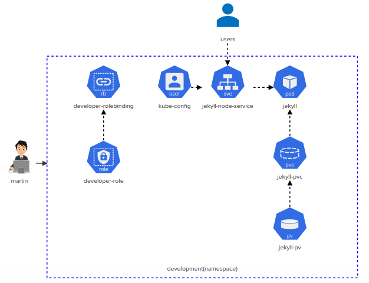
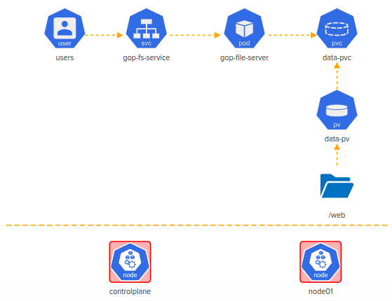
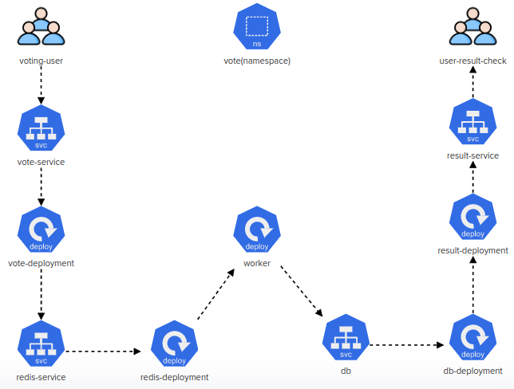
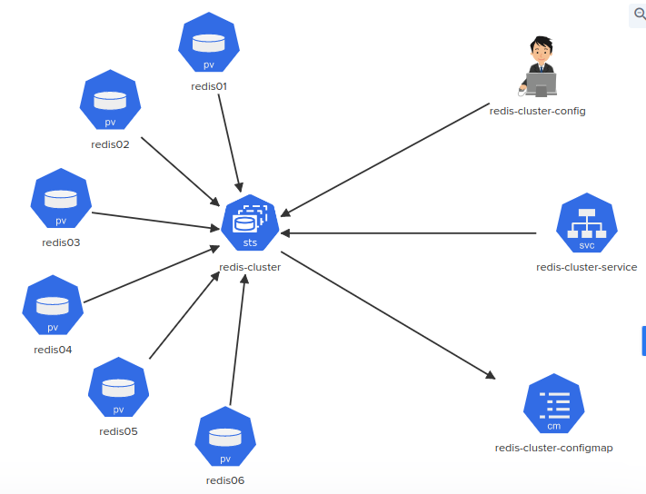

# Kubernetes Challenge

## Challenge 1



Deploy the given architecture diagram for implementing a `Jekyll SSG`.

Click on each icon to see more details. Once done click on the `Check` button to test your work.

1. jelly-pv

   - jekyll-site pv is already created. Inspect it before you create the pvc.

   Nothing to do here. The PV is pre-created.

   Check persistent volume

   ```
   root@controlplane ~ ➜  kubectl get pv
   NAME          CAPACITY   ACCESS MODES   RECLAIM POLICY   STATUS      CLAIM   STORAGECLASS    REASON   AGE
   jekyll-site   1Gi        RWX            Delete           Available           local-storage            29m
   ```

   

2. jekyll-pvc

   jekyll-pvc.yaml

   ```
   apiVersion: v1
   kind: PersistentVolumeClaim
   metadata:
     name: jekyll-site
     namespace: development
   spec:
     accessModes:
       - ReadWriteMany
     storageClassName: local-storage
     resources:
       requests:
         storage: 1Gi
   ```

   ```
   root@controlplane ~ ✖ kubectl create -f jekyll-pvc.yaml 
   
   root@controlplane ~ ➜  kubectl get pvc -n development 
   NAME          STATUS   VOLUME        CAPACITY   ACCESS MODES   STORAGECLASS    AGE
   jekyll-site   Bound    jekyll-site   1Gi        RWX            local-storage   18s
   ```

3. jekyll

   - 
     Tasks not completed!

   - pod: 'jekyll' has an initContainer, name: 'copy-jekyll-site', image: 'kodekloud/jekyll'
   - initContainer: 'copy-jekyll-site', command: [ "jekyll", "new", "/site" ] (command to run: jekyll new /site)
   - pod: 'jekyll', initContainer: 'copy-jekyll-site', mountPath = '/site'
   - pod: 'jekyll', initContainer: 'copy-jekyll-site', volume name = 'site'
   - pod: 'jekyll', container: 'jekyll', volume name = 'site'
   - pod: 'jekyll', container: 'jekyll', mountPath = '/site'
   - pod: 'jekyll', container: 'jekyll', image = 'kodekloud/jekyll-serve'
   - pod: 'jekyll', uses volume called 'site' with pvc = 'jekyll-site'
   - pod: 'jekyll' uses label 'run=jekyll'

   ```
   kubectl run jekyll --image=kodekloud/jekyll-serve -namespace=development --dry-run=client -o yaml > jekyll-pod.yaml
   
   ```

   

   jekyll-pod.yaml

   ```
   apiVersion: v1
   kind: Pod
   metadata:
     namespace: development
     name: jekyll
     labels:
       run: jekyll
   spec: 
     containers:
     - name: jekyll
       image: kodekloud/jekyll-serve
       volumeMounts:
       - mountPath: /site
         name: site  
     initContainers:
     - name: copy-jekyll-site
       image: kodekloud/jekyll
       command: [ "jekyll", "new", "/site" ]
       volumeMounts:
       - mountPath: /site
         name: site
     volumes:
     - name: site
       persistentVolumeClaim:
         claimName: jekyll-site
   ```

   ```
   root@controlplane ~ ➜  kubectl create -f jekyll-pod.yaml 
   ```

   ```
   root@controlplane ~ ➜  kubectl describe -n development pods jekyll 
   Name:         jekyll
   Namespace:    development
   Priority:     0
   Node:         node01/10.26.115.9
   Start Time:   Tue, 24 Jan 2023 08:51:16 +0000
   Labels:       run=jekyll
   Annotations:  <none>
   Status:       Running
   IP:           10.244.192.2
   IPs:
     IP:  10.244.192.2
   Init Containers:
     copy-jekyll-site:
       Container ID:  docker://4c16324db6a16fd703ce62ae29f39f89ef8be9028bbb9bbc61081f17c021b0fa
       Image:         kodekloud/jekyll
       Image ID:      docker-pullable://kodekloud/jekyll@sha256:e7776dd75bf813e7da2e76badecd9bfadf1e7893fe0d588cc552ea090594e00f
       Port:          <none>
       Host Port:     <none>
       Command:
         jekyll
         new
         /site
       State:          Terminated
         Reason:       Completed
         Exit Code:    0
         Started:      Tue, 24 Jan 2023 08:51:31 +0000
         Finished:     Tue, 24 Jan 2023 08:51:44 +0000
       Ready:          True
       Restart Count:  0
       Environment:    <none>
       Mounts:
         /site from site (rw)
         /var/run/secrets/kubernetes.io/serviceaccount from kube-api-access-7ks4c (ro)
   Containers:
     jekyll:
       Container ID:   docker://501cd77d991b772e27425d4419a4d699322fc429bbb2b4bb0123553d2d2da56d
       Image:          kodekloud/jekyll-serve
       Image ID:       docker-pullable://kodekloud/jekyll-serve@sha256:5e2be6d03d137e9a724624118b2567931aff94e33ae9dabed34dc2626772e8be
       Port:           <none>
       Host Port:      <none>
       State:          Running
         Started:      Tue, 24 Jan 2023 08:51:46 +0000
       Ready:          True
       Restart Count:  0
       Environment:    <none>
       Mounts:
         /site from site (rw)
         /var/run/secrets/kubernetes.io/serviceaccount from kube-api-access-7ks4c (ro)
   Conditions:
     Type              Status
     Initialized       True 
     Ready             True 
     ContainersReady   True 
     PodScheduled      True 
   Volumes:
     site:
       Type:       PersistentVolumeClaim (a reference to a PersistentVolumeClaim in the same namespace)
       ClaimName:  jekyll-site
       ReadOnly:   false
   ```

   

4. jekyll-node-service

   - Service 'jekyll' uses targetPort: '4000', namespace: 'development'
   - Service 'jekyll' uses Port: '8080', namespace: 'development'
   - Service 'jekyll' uses NodePort: '30097', namespace: 'development'

   ```
   root@controlplane ~ ✖ kubectl expose pod jekyll --namespace=development --name=jekyll --target-port=4000 --port=8080 --type=NodePort
   ```

   ```
   root@controlplane ~ ➜  kubectl describe svc jekyll  -n development 
   Name:                     jekyll
   Namespace:                development
   Labels:                   run=jekyll
   Annotations:              <none>
   Selector:                 run=jekyll
   Type:                     NodePort
   IP Family Policy:         SingleStack
   IP Families:              IPv4
   IP:                       10.108.206.5
   IPs:                      10.108.206.5
   Port:                     <unset>  8080/TCP
   TargetPort:               4000/TCP
   NodePort:                 <unset>  30415/TCP
   Endpoints:                10.244.192.2:4000
   Session Affinity:         None
   External Traffic Policy:  Cluster
   Events:                   <none>
   ```

   Edit "jekyll" service and change the nodePort to "30067" 

   ```
   root@controlplane ~ ➜  kubectl edit --namespace=development svc jekyll 
   ```

   

   OR

   jekyll-node-service.yaml

   ```
   apiVersion: v1
   kind: Service
   metadata:
     namespace: development
     name: jekyll
   spec:
     type: NodePort
     ports:
       - port: 8080
         targetPort: 4000
         nodePort: 30097
     selector:
       run: jekyll
   ```

   

5. developer-role

   - 'developer-role', should have all(*) permissions for services in development namespace
   - 'developer-role', should have all permissions(*) for persistentvolumeclaims in development namespace
   - 'developer-role', should have all(*) permissions for pods in development namespace

   ```
   root@controlplane ~ ➜  kubectl create role developer-role --namespace=development --resource=pods,pvc,svc --verb="*" 
   
   root@controlplane ~ ➜  kubectl get role -n development 
   NAME             CREATED AT
   developer-role   2023-01-24T09:34:30Z
   
   root@controlplane ~ ➜  kubectl describe --namespace=development role developer-role 
   Name:         developer-role
   Labels:       <none>
   Annotations:  <none>
   PolicyRule:
     Resources               Non-Resource URLs  Resource Names  Verbs
     ---------               -----------------  --------------  -----
     persistentvolumeclaims  []                 []              [*]
     pods                    []                 []              [*]
     services                []                 []              [*]
   ```

   OR 

   developer-role.yaml

   ```
   apiVersion: rbac.authorization.k8s.io/v1
   kind: Role
   metadata:
     creationTimestamp: null
     name: developer-role
     namespace: development
   rules:
   - apiGroups:
     - ""
     resources:
     - pods
     - services
     - persistentvolumeclaims
     verbs:
     - '*'
   ```

   

6. developer-rolebinding

   - 
     create rolebinding = developer-rolebinding, role= 'developer-role', namespace = development
   - rolebinding = developer-rolebinding associated with user = 'martin'

   ```
   root@controlplane ~ ➜  kubectl create rolebinding developer-rolebinding --role=developer-role --user=martin --namespace=development 
   rolebinding.rbac.authorization.k8s.io/developer-rolebinding created
   
   root@controlplane ~ ➜  kubectl get rolebindings.rbac.authorization.k8s.io -n  development 
   NAME                    ROLE                  AGE
   developer-rolebinding   Role/developer-role   18s
   
   root@controlplane ~ ➜  kubectl describe -n development rolebindings.rbac.authorization.k8s.io developer-rolebinding 
   Name:         developer-rolebinding
   Labels:       <none>
   Annotations:  <none>
   Role:
     Kind:  Role
     Name:  developer-role
   Subjects:
     Kind  Name    Namespace
     ----  ----    ---------
     User  martin  
   ```

   OR

   developer-rolebinding.yaml

   ```
   apiVersion: rbac.authorization.k8s.io/v1
   kind: RoleBinding
   metadata:
     creationTimestamp: null
     name: developer-rolebinding
     namespace: development
   roleRef:
     apiGroup: rbac.authorization.k8s.io
     kind: Role
     name: developer-role
   subjects:
   - apiGroup: rbac.authorization.k8s.io
     kind: User
     name: martin
   ```

   

7. kube-config

   - set context 'developer' with user = 'martin' and cluster = 'kubernetes' as the current context.

   ```
   root@controlplane ~ ➜  kubectl config set-credentials martin --client-certificate ./martin.crt --client-key ./martin.key 
   User "martin" set.
   
   root@controlplane ~ ➜  kubectl config set-context developer --cluster kubernetes --user martin
   Context "developer" created.
   ```

   

   ```
   kubectl config set-credentials martin --client-certificate ./martin.crt --client-key ./martin.key
   
   kubectl config set-context developer --cluster kubernetes --user martin
   ```

   

8. martin

   - 
     Build user information for martin in the default kubeconfig file: User = martin , client-key = /root/martin.key and client-certificate = /root/martin.crt
   - Create a new context called 'developer' in the default kubeconfig file with 'user = martin' and 'cluster = kubernetes'

   ```
   root@controlplane ~ ➜  kubectl config use-context developer 
   Switched to context "developer".
   ```

   ```
   kubectl config use-context developer
   ```


## Challenge 2



This 2-Node Kubernetes cluster is broken! Troubleshoot, fix the cluster issues and then deploy the objects according to the given architecture diagram to unlock our `Image Gallery`!!

Click on each icon to see more details. Once done click on `Check` button to test your work.

1. controlplane

   - 
     Master node: coredns deployment has image: 'k8s.gcr.io/coredns/coredns:v1.8.6'
   - Fix kube-apiserver. Make sure its running and healthy.
   - kubeconfig = /root/.kube/config, User = 'kubernetes-admin' Cluster: Server Port = '6443'

   Fix the controlplane node. This has three subtasks. The order to do them is atucally the *reverse* order in which they are listed!

   1. kubeconfig = /root/.kube/config, User = 'kubernetes-admin' Cluster: Server Port = '6443'

      Before we can execute any `kubectl` commands, we must fix the kubeconfig. The server port is incorrect and should be `6443`. Edit this in `vi` and save.

      Check nodes

      ```
      root@controlplane ~ ➜  kubectl get nodes
      The connection to the server controlplane:6433 was refused - did you specify the right host or port?
      ```

      Edit kubeconfig server port is incorrect and should be `6443`

      ```
      root@controlplane ~ ➜  vim .kube/config 
      ```

      .kube/config

      ```
      apiVersion: v1
      clusters:
      - cluster:
      apiVersion: v1
      clusters:
      - cluster:
          certificate-authority-data: LS0tLS1CRUdJTiBDRVJUSUZJQ0FURS0tLS0tCk1JSUMvakNDQWVhZ0F3SUJBZ0lCQURBTkJna3Foa2lHOXcwQkFRc0ZBREFWTVJNd0VRWURWUVFERXdwcmRXSmwKY201bGRHVnpNQjRYRFRJek1ERXlOREl4TlRnek5Gb1hEVE16TURFeU1USXhOVGd6TkZvd0ZURVRNQkVHQTFVRQpBeE1LYTNWaVpYSnVaWFJsY3pDQ0FTSXdEUVlKS29aSWh2Y05BUUVCQlFBRGdnRVBBRENDQVFvQ2dnRUJBTGlPCkdkQ2hwa1hNZmZldW5BdnYzRnA2RjkyS2l4bDg3WUt3SjJiYUFrRHVMZ3VGU2pXYUk4aFBueTBjYjYvUkFCV2QKZlFEcEJ4dURGQ3B4cWt5K3lvR29hQW1OKytwRjJUbHB6RGFaa1R1UmJqU3JwZ3RLeDNMQ2Fic296WXBSaHRNRQpFam0yMXBJcXV1bmYxSE5ZeWVrUk9Fc3ZMNXdSbmQ4WDRGeG9Qb3VpS0RFcGE1MEh5ZkgvWnc3eG9kTU9aK0RxCnVaeHNrMUVOenM1SHZ4STZpQzNmRUhHNnl0RHRQNmdZY1M0K2RTN3NyOWs1MGV3MlBrOUpxMjJVRER1UFlkSW4KYUdXOUw2dDFmdGxDTmRhd0JsSWU3eVNrYkVuVmQ2RG8xSU53a3l2QnJMMTYrUVV6cW1PT2xyUGNwd2JCbnJxRgpLU0d2alFQR1YxMkc0Wk12NTZzQ0F3RUFBYU5aTUZjd0RnWURWUjBQQVFIL0JBUURBZ0trTUE4R0ExVWRFd0VCCi93UUZNQU1CQWY4d0hRWURWUjBPQkJZRUZFVkJKY09EMGZpSFBvcU1iamIranBJckpydXpNQlVHQTFVZEVRUU8KTUF5Q0NtdDFZbVZ5Ym1WMFpYTXdEUVlKS29aSWh2Y05BUUVMQlFBRGdnRUJBR09ma3NSWUkxS0hFd2tydFh5YQpqUnh5SVFaa3pmV25pZzZHQ1UzSUdHK1JMYS80VllTd1pZUHJDZGdVc2RPbUZNNGpobnVmcFluYWhNeTZmUlVWCnAzQVA4cXQrdEwzdCtuR1d6N09obTU3YmJyUFlEc3F6dVNDZUhBaTlUTVZDUzJhNCsvTjdTV2lZeGhRMFZJb2gKVlNRZG03RVQzVDhKVmQ1KzNUMTF0ZkxCMlZJVlE4QVk3OUZwOU44bTczQnd1SUNTdDRKcEFRVXd6RXJqeTBBcApZdFRmbkw2cUlNaVVjL2JUTCtMRVhQR01OVlJmN0FMbk1zVHpQa2V1aFNuVnA1MTc5cVdOYUxhZkxVZ0tsTmlHCkczYnU5REJ5dVNzZTdzZXd3aVNIK1V3bmJDbE0yUk5OTXltdDRUazBxRmNGQ3dKZGpJNCsvNFZHTDgvV2s2NUYKbW9ZPQotLS0tLUVORCBDRVJUSUZJQ0FURS0tLS0tCg==
          server: https://controlplane:6443
      ```

      

   2. Fix kube-apiserver. Make sure its running and healthy.

      The file referenced by the `--client-ca-file` argument to the API server doesn't exist. Edit the API server manisfest and correct this.

      ```
      ls -l /etc/kubernetes/pki/*.crt
      # Notice that the correct certificate is ca.crt
      vi /etc/kubernetes/manifests/kube-apiserver.yaml
      ```

      ```
      root@controlplane ~ ➜  ls -l /etc/kubernetes/pki/*.crt
      -rw-r--r-- 1 root root 1289 Jan 24 21:58 /etc/kubernetes/pki/apiserver.crt
      -rw-r--r-- 1 root root 1155 Jan 24 21:58 /etc/kubernetes/pki/apiserver-etcd-client.crt
      -rw-r--r-- 1 root root 1164 Jan 24 21:58 /etc/kubernetes/pki/apiserver-kubelet-client.crt
      -rw-r--r-- 1 root root 1099 Jan 24 21:58 /etc/kubernetes/pki/ca.crt
      -rw-r--r-- 1 root root 1115 Jan 24 21:58 /etc/kubernetes/pki/front-proxy-ca.crt
      -rw-r--r-- 1 root root 1119 Jan 24 21:58 /etc/kubernetes/pki/front-proxy-client.crt
      ```

      Edit /etc/kubernetes/manifests/kube-apiserver.yaml 

      - change the `--client-ca-file` 

      ```
      apiVersion: v1
      kind: Pod
      metadata:
        annotations:
          kubeadm.kubernetes.io/kube-apiserver.advertise-address.endpoint: 10.88.254.9:6443
        creationTimestamp: null
        labels:
          component: kube-apiserver
          tier: control-plane
        name: kube-apiserver
        namespace: kube-system
      spec:
        containers:
        - command:
          - kube-apiserver
          - --advertise-address=10.88.254.9
          - --allow-privileged=true
          - --authorization-mode=Node,RBAC
          - --client-ca-file=/etc/kubernetes/pki/ca.crt
      ```

      

      Now wait for the API server to restart. This may take a minute or so. You can run the following to check if the container has been created. Press `CTRL-C` to eacape from the following command.

      ```
      root@controlplane ~ ➜  watch docker ps
      ```

      ```
      Every 2.0s: docker ps                                                                                                           controlplane: Tue Jan 24 23:28:55 2023
      
      CONTAINER ID        IMAGE                  COMMAND                  CREATED              STATUS              PORTS               NAMES
      1fe91ea81d9c        k8s.gcr.io/pause:3.6   "/pause"                 22 seconds ago       Up 21 seconds                           k8s_POD_kube-apiserver-controlplane_k
      ube-system_0d5d264e19c767124cd456882303b9c7_0
      ```

      

      If it still hasn't started, then give it a nudge by restarting the kubelet.

      ```
      systemctl restart kubelet
      ```

      ```
      root@controlplane ~ ➜  watch docker ps
      ```

      ```
      Every 2.0s: docker ps                                                                                                           controlplane: Tue Jan 24 23:30:02 2023
      
      CONTAINER ID        IMAGE                  COMMAND                  CREATED              STATUS              PORTS               NAMES
      d87169ff1323        e6bf5ddd4098           "kube-apiserver --ad…"   16 seconds ago       Up 15 seconds                           k8s_kube-apiserver_kube-apiserver-con
      ```

      ```
      root@controlplane ~ ➜  kubectl get nodes
      NAME           STATUS                     ROLES                  AGE   VERSION
      controlplane   Ready                      control-plane,master   92m   v1.23.0
      node01         Ready,SchedulingDisabled   <none>                 91m   v1.23.0
      ```

      

      ...then run the docker command again. If you see it starting and stopping, then you've made an error in the manifest that you need to fix.

      You should also be aware of how to [diagnose a crashed API server](https://github.com/kodekloudhub/community-faq/blob/main/docs/diagnose-crashed-apiserver.md).

   3. Master node: coredns deployment has image: 'k8s.gcr.io/coredns/coredns:v1.8.6'

      Run the following:

      ```
      root@controlplane ~ ➜  kubectl get pods -n kube-system 
      NAME                                   READY   STATUS             RESTARTS        AGE
      coredns-7b945bfcb7-nz7zt               0/1     ImagePullBackOff   0               33m
      coredns-7b945bfcb7-zf5cj               0/1     ImagePullBackOff   0               33m
      etcd-controlplane                      1/1     Running            0               93m
      kube-apiserver-controlplane            1/1     Running            1 (3m41s ago)   93m
      kube-controller-manager-controlplane   1/1     Running            2 (4m ago)      93m
      kube-proxy-hmbx6                       1/1     Running            0               92m
      kube-proxy-wbkjb                       1/1     Running            0               93m
      kube-scheduler-controlplane            1/1     Running            1 (33m ago)     93m
      weave-net-gq9k7                        2/2     Running            0               92m
      weave-net-pkx7t                        2/2     Running            1 (93m ago)     93m
      ```

      You will see that CoreDNS has ImagePull errors, because the container imange is incorrect. To fix this, run the following, update the `image:` to that specificed in the question, save and exit

      ```
      kubectl edit deployment -n kube-system coredns
      ```

      ---- OR ----

      Edit the image directly

      ```
      root@controlplane ~ ✖ kubectl set image deployment/coredns -n kube-system coredns=k8s.gcr.io/coredns/coredns:v1.8.6
      deployment.apps/coredns image updated
      ```

      Now re-run the `get pods` command above (or use `watch` with it) until the coredns pods have recycled and there are two healthy pods.

2. node01

   - node01 is ready and can schedule pods?

   node01 is ready and can schedule pods? Run the following:

   ```
   root@controlplane ~ ➜  kubectl get nodes
   NAME           STATUS                     ROLES                  AGE   VERSION
   controlplane   Ready                      control-plane,master   24m   v1.23.0
   node01         Ready,SchedulingDisabled   <none>                 23m   v1.23.0
   ```

   We can see that `node01` is in state `Ready,SchedulingDisabled`. This usually means that it is cordoned, so...

   ```
   root@controlplane ~ ➜  kubectl uncordon node01 
   node/node01 uncordoned
   
   root@controlplane ~ ➜  kubectl get nodes
   NAME           STATUS   ROLES                  AGE   VERSION
   controlplane   Ready    control-plane,master   25m   v1.23.0
   node01         Ready    <none>                 24m   v1.23.0
   ```

3. web

   - Copy all images from the directory '/media' on the controlplane node to '/web' directory on node01

   Copy all images from the directory '/media' on the controlplane node to '/web' directory on node01. Here we are setting up the content of the directory on `node01` which will ultimately be served as a hostpath persistent volume. It's a straght forward copy with ssh (scp).

   ```
   root@controlplane ~ ➜  scp /media/* node01:/web
   kodekloud-ckad.png                                                                                                                              100%   58KB  24.0MB/s   00:00    
   kodekloud-cka.png                                                                                                                               100%   57KB  42.1MB/s   00:00    
   kodekloud-cks.png                                                                                                                               100%   61KB  39.1MB/s   00:00  
   ```

4. data-pv

   - Create new PersistentVolume = 'data-pv'
   - PersistentVolume = data-pv, accessModes = 'ReadWriteMany'
   - PersistentVolume = data-pv, hostPath = '/web'
   - PersistentVolume = data-pv, storage = '1Gi'

   Create new PersistentVolume = 'data-pv'.
   Apply the [manifest](https://github.com/kodekloudhub/kubernetes-challenges/blob/master/challenge-2/fileserver-pv.yaml) with `kubectl apply -f`

   data-pv.yaml

   ```
   kind: PersistentVolume
   apiVersion: v1
   metadata:
       name: data-pv
   spec:
      accessModes: ["ReadWriteMany"]
      capacity:
       storage: 1Gi
      hostPath:
         path: /web
         type: DirectoryOrCreate
   ```

   ```
   root@controlplane ~ ➜  kubectl create -f data-pv.yaml 
   persistentvolume/data-pv created
   
   root@controlplane ~ ➜  kubectl get pv
   NAME      CAPACITY   ACCESS MODES   RECLAIM POLICY   STATUS      CLAIM   STORAGECLASS   REASON   AGE
   data-pv   1Gi        RWX            Retain           Available                                   7s
   ```

   

5. data-pvc

   - Create new PersistentVolumeClaim = 'data-pvc'
   - PersistentVolume = 'data-pvc', accessModes = 'ReadWriteMany'
   - PersistentVolume = 'data-pvc', storage request = '1Gi'
   - PersistentVolume = 'data-pvc', volumeName = 'data-pv'

   Create new PersistentVolumeClaim = 'data-pvc'
   Apply the [manifest](https://github.com/kodekloudhub/kubernetes-challenges/blob/master/challenge-2/fileserver-pvc.yaml)

   data-pvc.yaml

   ```
   kind: PersistentVolumeClaim
   apiVersion: v1
   metadata:
       name: data-pvc
   spec:
      accessModes: ["ReadWriteMany"]
      resources:
       requests:
          storage: 1Gi
      volumeName: data-pv
   ```

   ```
   root@controlplane ~ ➜  kubectl create -f data-pvc.yaml 
   persistentvolumeclaim/data-pvc created
   
   root@controlplane ~ ➜  kubectl get pvc
   NAME       STATUS   VOLUME    CAPACITY   ACCESS MODES   STORAGECLASS   AGE
   data-pvc   Bound    data-pv   1Gi        RWX                           7s
   
   root@controlplane ~ ➜  kubectl get pv
   NAME      CAPACITY   ACCESS MODES   RECLAIM POLICY   STATUS   CLAIM              STORAGECLASS   REASON   AGE
   data-pv   1Gi        RWX            Retain           Bound    default/data-pvc                           6m4s
   ```

   

6. gop-fileserver

   - Create a pod for fileserver, name: 'gop-fileserver'
   - pod: gop-fileserver image: 'kodekloud/fileserver'
   - pod: gop-fileserver mountPath: '/web'
   - pod: gop-fileserver volumeMount name: 'data-store'
   - pod: gop-fileserver persistent volume name: data-store
   - pod: gop-fileserver persistent volume claim used: 'data-pvc'

   Create a pod for fileserver, name: 'gop-fileserver'
   Apply the [manifest](https://github.com/kodekloudhub/kubernetes-challenges/blob/master/challenge-2/fileserver-pod.yaml)

   ```
   root@controlplane ~ ➜  kubectl run gop-fileserver --image=kodekloud/fileserver --dry-run=client -o yaml > gop-fileserver.yaml
   ```

   Edit manifest file

   ```
   root@controlplane ~ ➜ vi gop-fileserver.yaml
   ```

   gop-fileserver.yaml

   ```
   ---
   apiVersion: v1
   kind: Pod
   metadata:
     creationTimestamp: null
     labels:
       run: gop-fileserver
     name: gop-fileserver
   spec:
     containers:
     - image: kodekloud/fileserver
       name: gop-fileserver
       volumeMounts:
         - mountPath: "/web"
           name: data-store
       resources: {}
     volumes:
       - name: data-store
         persistentVolumeClaim:
           claimName: data-pvc
     dnsPolicy: ClusterFirst
     restartPolicy: Always
   status: {}
   ```

   ```
   root@controlplane ~ ➜  kubectl create -f gop-fileserver.yaml 
   pod/gop-fileserver created
   
   root@controlplane ~ ➜  kubectl get pods
   NAME             READY   STATUS    RESTARTS   AGE
   gop-fileserver   1/1     Running   0          2m7s
   
   root@controlplane ~ ➜  kubectl describe pod gop-fileserver 
   Name:         gop-fileserver
   Namespace:    default
   Priority:     0
   Node:         node01/10.13.85.3
   Start Time:   Thu, 26 Jan 2023 04:16:16 +0000
   Labels:       run=gop-fileserver
   Annotations:  <none>
   Status:       Running
   IP:           10.244.192.1
   IPs:
     IP:  10.244.192.1
   Containers:
     gop-fileserver:
       Container ID:   docker://f831ce358f321bc6db5a550d6a0a4ceaf2d9657d2565efebfd6917ec1adc4eb6
       Image:          kodekloud/fileserver
       Image ID:       docker-pullable://kodekloud/fileserver@sha256:df043b6743e477e921a20846252ea7d2df51c1a6076921a1c242f3cf0824ab33
       Port:           <none>
       Host Port:      <none>
       State:          Running
         Started:      Thu, 26 Jan 2023 04:16:20 +0000
       Ready:          True
       Restart Count:  0
       Environment:    <none>
       Mounts:
         /var/run/secrets/kubernetes.io/serviceaccount from kube-api-access-jpf92 (ro)
         /web from data-store (rw)
   Conditions:
     Type              Status
     Initialized       True 
     Ready             True 
     ContainersReady   True 
     PodScheduled      True 
   Volumes:
     data-store:
       Type:       PersistentVolumeClaim (a reference to a PersistentVolumeClaim in the same namespace)
       ClaimName:  data-pvc
       ReadOnly:   false
   ```

   

7. gop-fs-service

   - New Service, name: 'gop-fs-service'
   - Service name: gop-fs-service, port: '8080'
   - Service name: gop-fs-service, targetPort: '8080'

   ```
   root@controlplane ~ ➜  kubectl expose pod gop-fileserver --name=gop-fs-service --target-port=8080 --port=8080
   service/gop-fs-service exposed
   
   root@controlplane ~ ➜  kubectl get svc
   NAME             TYPE        CLUSTER-IP      EXTERNAL-IP   PORT(S)    AGE
   gop-fs-service   ClusterIP   10.96.239.164   <none>        8080/TCP   7s
   kubernetes       ClusterIP   10.96.0.1       <none>        443/TCP    57m
   
   root@controlplane ~ ➜  kubectl describe svc gop-fs-service 
   Name:              gop-fs-service
   Namespace:         default
   Labels:            run=gop-fileserver
   Annotations:       <none>
   Selector:          run=gop-fileserver
   Type:              ClusterIP
   IP Family Policy:  SingleStack
   IP Families:       IPv4
   IP:                10.96.239.164
   IPs:               10.96.239.164
   Port:              <unset>  8080/TCP
   TargetPort:        8080/TCP
   Endpoints:         10.244.192.1:8080
   Session Affinity:  None
   Events:            <none>
   
   root@controlplane ~ ➜  curl http://10.244.192.1:8080
   <pre>
   <a href="kodekloud-cka.png">kodekloud-cka.png</a>
   <a href="kodekloud-ckad.png">kodekloud-ckad.png</a>
   <a href="kodekloud-cks.png">kodekloud-cks.png</a>
   </pre>
   ```
   
   OR
   
   New Service, name: 'gop-fs-service'
   Apply the [manifest](https://github.com/kodekloudhub/kubernetes-challenges/blob/master/challenge-2/fileserver-svc.yaml)
   
   fileserver-svc.yaml
   
   ```
   ---
   apiVersion: v1
   kind: Service
   metadata:
     creationTimestamp: null
     labels:
       app: gop-fs-service
     name: gop-fs-service
   spec:
     ports:
     - name: 8080-8080
       port: 8080
       protocol: TCP
       targetPort: 8080
       nodePort: 31200
     selector:
       run: gop-fileserver
     type: NodePort
   ```
   


## Challenge 3





Deploy the given architecture to `vote` namespace.

Click on each icon to see more details. Once done click on `Check` button to test your work.

1. vote (namespace)

   - Create a new namespace: name = 'vote'

   Create a new namespace: name = 'vote'

   ```
   root@controlplane ~ ➜  kubectl create namespace vote
   namespace/vote created
   
   root@controlplane ~ ➜  kubectl get namespaces 
   NAME              STATUS   AGE
   default           Active   35m
   kube-node-lease   Active   35m
   kube-public       Active   35m
   kube-system       Active   35m
   vote              Active   10s
   ```

2. db-deployment

   - Create new deployment. name: 'db-deployment'
   - image: 'postgres:9.4' and add the env: 'POSTGRES_HOST_AUTH_METHOD=trust'
   - Volume Type: 'EmptyDir'
   - Volume Name: 'db-data'
   - mountPath: '/var/lib/postgresql/data'
   - status: 'Running'

   Create new deployment. name: 'db-deployment'

   Apply the [manifest](https://github.com/kodekloudhub/kubernetes-challenges/blob/master/challenge-3/db-deployment.yml)

   db-deployment.yml

   ```
   root@controlplane ~ ➜  kubectl run db-deployment --image=postgres:9.4 --dry-run=client  -o yaml --namespace=vote --env="POSTGRES_HOST_AUTH_METHOD=trust" > db-deployment.yaml
   ```

   db-deployment.yaml

   ```
   apiVersion: apps/v1
   kind: Deployment
   metadata:
     labels:
       app: db-deployment
     name: db-deployment
     namespace: vote
   spec:
     replicas: 1
     selector:
       matchLabels:
         app: db-deployment
     template:
       metadata:
         labels:
           app: db-deployment
       spec:
         containers:
         - image: postgres:9.4
           name: postgres
           env:
             - name: POSTGRES_HOST_AUTH_METHOD
               value: trust
           volumeMounts:
             - mountPath: /var/lib/postgresql/data
               name: db-data
         volumes:
           - name: db-data
             emptyDir: {}
   ```

   ```
   root@controlplane ~ ➜  kubectl create -f db-deployment.yaml 
   deployment.apps/db-deployment created
   
   root@controlplane ~ ➜  kubectl get deployments.apps -n vote
   NAME            READY   UP-TO-DATE   AVAILABLE   AGE
   db-deployment   1/1     1            1           17s
   
   root@controlplane ~ ➜  kubectl describe --namespace=vote deployments.apps db-deployment 
   Name:                   db-deployment
   Namespace:              vote
   CreationTimestamp:      Thu, 26 Jan 2023 05:30:17 +0000
   Labels:                 app=db-deployment
   Annotations:            deployment.kubernetes.io/revision: 1
   Selector:               app=db-deployment
   Replicas:               1 desired | 1 updated | 1 total | 1 available | 0 unavailable
   StrategyType:           RollingUpdate
   MinReadySeconds:        0
   RollingUpdateStrategy:  25% max unavailable, 25% max surge
   Pod Template:
     Labels:  app=db-deployment
     Containers:
      postgres:
       Image:      postgres:9.4
       Port:       <none>
       Host Port:  <none>
       Environment:
         POSTGRES_HOST_AUTH_METHOD:  trust
       Mounts:
         /var/lib/postgresql/data from db-data (rw)
     Volumes:
      db-data:
       Type:       EmptyDir (a temporary directory that shares a pod's lifetime)
       Medium:     
       SizeLimit:  <unset>
   Conditions:
     Type           Status  Reason
     ----           ------  ------
     Available      True    MinimumReplicasAvailable
     Progressing    True    NewReplicaSetAvailable
   OldReplicaSets:  <none>
   NewReplicaSet:   db-deployment-7f94c7d956 (1/1 replicas created)
   Events:
     Type    Reason             Age   From                   Message
     ----    ------             ----  ----                   -------
     Normal  ScalingReplicaSet  48s   deployment-controller  Scaled up replica set db-deployment-7f94c7d956 to 1
   ```

   

3. db-service

   - Create new service: 'db'
   - port: '5432'
   - targetPort: '5432'
   - type: 'ClusterIP'

   ```
   root@controlplane ~ ➜  kubectl expose deployment --namespace=vote db-deployment --name=db --target-port=5432 --port=5432 --type=ClusterIP
   service/db exposed
   
   root@controlplane ~ ➜  kubectl get svc -n vote 
   NAME   TYPE        CLUSTER-IP     EXTERNAL-IP   PORT(S)    AGE
   db     ClusterIP   10.111.8.134   <none>        5432/TCP   21s
   
   root@controlplane ~ ✖ kubectl describe svc db -n vote 
   Name:              db
   Namespace:         vote
   Labels:            app=db-deployment
   Annotations:       <none>
   Selector:          app=db-deployment
   Type:              ClusterIP
   IP Family Policy:  SingleStack
   IP Families:       IPv4
   IP:                10.111.8.134
   IPs:               10.111.8.134
   Port:              <unset>  5432/TCP
   TargetPort:        5432/TCP
   Endpoints:         10.244.192.1:5432
   Session Affinity:  None
   Events:            <none>
   ```

   

   Create new service: 'db'

   Apply the [manifest](https://github.com/kodekloudhub/kubernetes-challenges/blob/master/challenge-3/db-service.yml)

   db-service.yml

   ```
   apiVersion: v1
   kind: Service
   metadata:
     name: db
     namespace: vote
   spec:
      type: ClusterIP
      ports:
        - port: 5432
          targetPort: 5432
      selector:
          app: db-deployment
   ```

   

4. redis-deployment

   - Create new deployment, name: 'redis-deployment'
   - image: 'redis:alpine'
   - Volume Type: 'EmptyDir'
   - Volume Name: 'redis-data'
   - mountPath: '/data'
   - status: 'Running'

   Create new deployment, name: 'redis-deployment'

   Apply the [manifest](https://github.com/kodekloudhub/kubernetes-challenges/blob/master/challenge-3/redis-deployment.yml)

   ```
   root@controlplane ~ ➜  kubectl create deployment redis-deployment --image=redis:alpine --dry-run=client -o yaml -n vote > redis-deployment.yaml
   ```

   redis-deployment.yaml

   ```
   apiVersion: apps/v1
   kind: Deployment
   metadata:
     labels:
       app: redis-deployment
     name: redis-deployment
     namespace: vote
   spec:
     replicas: 1
     selector:
       matchLabels:
         app: redis-deployment
     template:
       metadata:
         labels:
           app: redis-deployment
       spec:
         containers:
         - image: redis:alpine
           name: redis-deployment
           volumeMounts:
           - mountPath: /data
             name: redis-data
         volumes:
         - name: redis-data
           emptyDir: {}
   ```

   ```
   root@controlplane ~ ➜  kubectl create -f redis-deployment.yaml 
   deployment.apps/redis-deployment created
   
   root@controlplane ~ ➜  kubectl get deployments.apps -n vote 
   NAME               READY   UP-TO-DATE   AVAILABLE   AGE
   db-deployment      1/1     1            1           8m7s
   redis-deployment   1/1     1            1           13s
   
   root@controlplane ~ ➜  kubectl describe deployment redis-deployment  -n vote 
   Name:                   redis-deployment
   Namespace:              vote
   CreationTimestamp:      Thu, 26 Jan 2023 05:47:53 +0000
   Labels:                 app=redis-deployment
   Annotations:            deployment.kubernetes.io/revision: 1
   Selector:               app=redis-deployment
   Replicas:               1 desired | 1 updated | 1 total | 1 available | 0 unavailable
   StrategyType:           RollingUpdate
   MinReadySeconds:        0
   RollingUpdateStrategy:  25% max unavailable, 25% max surge
   Pod Template:
     Labels:  app=redis-deployment
     Containers:
      redis:
       Image:        redis:alpine
       Port:         <none>
       Host Port:    <none>
       Environment:  <none>
       Mounts:
         /data from redis-data (rw)
     Volumes:
      redis-data:
       Type:       EmptyDir (a temporary directory that shares a pod's lifetime)
       Medium:     
       SizeLimit:  <unset>
   Conditions:
     Type           Status  Reason
     ----           ------  ------
     Available      True    MinimumReplicasAvailable
     Progressing    True    NewReplicaSetAvailable
   OldReplicaSets:  <none>
   NewReplicaSet:   redis-deployment-87ff856d7 (1/1 replicas created)
   Events:
     Type    Reason             Age   From                   Message
     ----    ------             ----  ----                   -------
     Normal  ScalingReplicaSet  60s   deployment-controller  Scaled up replica set redis-deployment-87ff856d7 to 1
   ```

   

5. redis-service

   - New Service, name = 'redis'
   - port: '6379'
   - targetPort: '6379'
   - type: 'ClusterIP'
   - service endpoint exposes deployment 'redis-deployment'

   ```
   root@controlplane ~ ➜  kubectl expose --namespace=vote deployment redis-deployment --name=redis --target-port=6379 --port=6379 --type=ClusterIP
   service/redis exposed
   
   root@controlplane ~ ➜  kubectl get svc -n vote 
   NAME    TYPE        CLUSTER-IP       EXTERNAL-IP   PORT(S)    AGE
   db      ClusterIP   10.111.157.233   <none>        5432/TCP   11m
   redis   ClusterIP   10.106.207.236   <none>        6379/TCP   13s
   
   root@controlplane ~ ➜  kubectl describe --namespace=vote svc redis 
   Name:              redis
   Namespace:         vote
   Labels:            app=redis-deployment
   Annotations:       <none>
   Selector:          app=redis-deployment
   Type:              ClusterIP
   IP Family Policy:  SingleStack
   IP Families:       IPv4
   IP:                10.106.207.236
   IPs:               10.106.207.236
   Port:              <unset>  6379/TCP
   TargetPort:        6379/TCP
   Endpoints:         10.244.192.2:6379
   Session Affinity:  None
   Events:            <none>
   ```

   

   New Service, name = 'redis'

   Apply the [manifest](https://github.com/kodekloudhub/kubernetes-challenges/blob/master/challenge-3/redis-service.yml)

   ```
   apiVersion: v1
   kind: Service
   metadata:
       name: redis
       namespace: vote
   spec:
       type: ClusterIP
       ports:
         - port: 6379
           targetPort: 6379
       selector:
         app: redis-deployment
   ```

   

6. worker

   - Create new deployment. name: 'worker'
   - image: 'kodekloud/examplevotingapp_worker'
   - status: 'Running'

   Create new deployment. name: 'worker'

   Apply the [manifest](https://github.com/kodekloudhub/kubernetes-challenges/blob/master/challenge-3/worker.yml)

   ```
   root@controlplane ~ ➜  kubectl create deployment worker --image=kodekloud/examplevotingapp_worker --namespace=vote
   deployment.apps/worker created
   
   root@controlplane ~ ➜  kubectl get deployments.apps -n vote 
   NAME               READY   UP-TO-DATE   AVAILABLE   AGE
   db-deployment      1/1     1            1           17m
   redis-deployment   1/1     1            1           9m40s
   worker             1/1     1            1           52s
   
   root@controlplane ~ ➜  kubectl describe deployments worker -n vote
   Name:                   worker
   Namespace:              vote
   CreationTimestamp:      Thu, 26 Jan 2023 05:56:41 +0000
   Labels:                 app=worker
   Annotations:            deployment.kubernetes.io/revision: 1
   Selector:               app=worker
   Replicas:               1 desired | 1 updated | 1 total | 1 available | 0 unavailable
   StrategyType:           RollingUpdate
   MinReadySeconds:        0
   RollingUpdateStrategy:  25% max unavailable, 25% max surge
   Pod Template:
     Labels:  app=worker
     Containers:
      examplevotingapp-worker-98btz:
       Image:        kodekloud/examplevotingapp_worker
       Port:         <none>
       Host Port:    <none>
       Environment:  <none>
       Mounts:       <none>
     Volumes:        <none>
   Conditions:
     Type           Status  Reason
     ----           ------  ------
     Available      True    MinimumReplicasAvailable
     Progressing    True    NewReplicaSetAvailable
   OldReplicaSets:  <none>
   NewReplicaSet:   worker-7c87946c7c (1/1 replicas created)
   Events:
     Type    Reason             Age   From                   Message
     ----    ------             ----  ----                   -------
     Normal  ScalingReplicaSet  99s   deployment-controller  Scaled up replica set worker-7c87946c7c to 1
   ```

   ```
   apiVersion: apps/v1
   kind: Deployment
   metadata:
     creationTimestamp: null
     labels:
       app: worker
     name: worker
     namespace: vote
   spec:
     replicas: 1
     selector:
       matchLabels:
         app: worker
     strategy: {}
     template:
       metadata:
         creationTimestamp: null
         labels:
           app: worker
       spec:
         containers:
         - image: kodekloud/examplevotingapp_worker
           name: examplevotingapp-worker-s7cwx
   ```

   

7. vote-deployment

   - Create a deployment: name = 'vote-deployment'
   - image = 'kodekloud/examplevotingapp_vote:before'
   - status: 'Running'

   ```
   root@controlplane ~ ➜  kubectl create deployment vote-deployment --image=kodekloud/examplevotingapp_vote:before --namespace=vote
   deployment.apps/vote-deployment created
   
   root@controlplane ~ ➜  kubectl get deployments.apps -n vote 
   NAME               READY   UP-TO-DATE   AVAILABLE   AGE
   db-deployment      1/1     1            1           23m
   redis-deployment   1/1     1            1           15m
   vote-deployment    1/1     1            1           64s
   worker             1/1     1            1           6m21s
   
   root@controlplane ~ ✖ kubectl describe deployment vote-deployment -n vote 
   Name:                   vote-deployment
   Namespace:              vote
   CreationTimestamp:      Thu, 26 Jan 2023 06:01:58 +0000
   Labels:                 app=vote-deployment
   Annotations:            deployment.kubernetes.io/revision: 1
   Selector:               app=vote-deployment
   Replicas:               1 desired | 1 updated | 1 total | 1 available | 0 unavailable
   StrategyType:           RollingUpdate
   MinReadySeconds:        0
   RollingUpdateStrategy:  25% max unavailable, 25% max surge
   Pod Template:
     Labels:  app=vote-deployment
     Containers:
      examplevotingapp-vote-fzkzl:
       Image:        kodekloud/examplevotingapp_vote:before
       Port:         <none>
       Host Port:    <none>
       Environment:  <none>
       Mounts:       <none>
     Volumes:        <none>
   Conditions:
     Type           Status  Reason
     ----           ------  ------
     Available      True    MinimumReplicasAvailable
     Progressing    True    NewReplicaSetAvailable
   OldReplicaSets:  <none>
   NewReplicaSet:   vote-deployment-57f984ffb4 (1/1 replicas created)
   Events:
     Type    Reason             Age    From                   Message
     ----    ------             ----   ----                   -------
     Normal  ScalingReplicaSet  2m47s  deployment-controller  Scaled up replica set vote-deployment-57f984ffb4 to 1
   ```

   

   Create a deployment: name = 'vote-deployment'

   Apply the [manifest](https://github.com/kodekloudhub/kubernetes-challenges/blob/master/challenge-3/vote-deployment.yml)

   ```
   # kubectl create deployment vote-deployment --image=kodekloud/examplevotingapp_vote:before -n vote --dry-run=client -o yaml > deploy.yaml
   ```

   ```
   apiVersion: apps/v1
   kind: Deployment
   metadata:
     creationTimestamp: null
     labels:
       app: vote-deployment
     name: vote-deployment
     namespace: vote
   spec:
     replicas: 1
     selector:
       matchLabels:
         app: vote-deployment
     strategy: {}
     template:
       metadata:
         creationTimestamp: null
         labels:
           app: vote-deployment
       spec:
         containers:
         - image: kodekloud/examplevotingapp_vote:before
           name: vote
           resources: {}
   ```

   

8. vote-service

   - Create a new service: name = vote-service
   - port = '5000'
   - targetPort = '80'
   - nodePort= '31000'
   - service endpoint exposes deployment 'vote-deployment'

   

   Create a new service: name = vote-service

   Apply the [manifest](https://github.com/kodekloudhub/kubernetes-challenges/blob/master/challenge-3/vote-service.yml)

   ```
   root@controlplane ~ ➜  kubectl expose deployment  vote-deployment --name=vote-service --target-port=80 --port=5000 --type=NodePort --dry-run=client -o yaml -n vote > vote-service.yaml
   ```

   vote-service.yaml

   ```
   apiVersion: v1
   kind: Service
   metadata:
      name: vote-service
      namespace: vote
   spec:
      type: NodePort
      ports:
       - port: 5000
         targetPort: 80
         nodePort: 31000
      selector:
       app: vote-deployment
   ```

   ```
   root@controlplane ~ ➜  kubectl get svc -n vote 
   NAME           TYPE        CLUSTER-IP       EXTERNAL-IP   PORT(S)    AGE
   db             ClusterIP   10.111.157.233   <none>        5432/TCP   28m
   redis          ClusterIP   10.106.207.236   <none>        6379/TCP   17m
   vote-service   ClusterIP   10.98.58.165     <none>        5000/TCP   18s
   
   rroot@controlplane ~ ➜  kubectl describe --namespace vote svc vote-service 
   Name:                     vote-service
   Namespace:                vote
   Labels:                   app=vote-deployment
   Annotations:              <none>
   Selector:                 app=vote-deployment
   Type:                     NodePort
   IP Family Policy:         SingleStack
   IP Families:              IPv4
   IP:                       10.106.44.186
   IPs:                      10.106.44.186
   Port:                     <unset>  5000/TCP
   TargetPort:               80/TCP
   NodePort:                 <unset>  31000/TCP
   Endpoints:                10.244.192.4:80
   Session Affinity:         None
   External Traffic Policy:  Cluster
   Events:                   <none>
   ```

   

9. result-deployment

   - Create new deployment, name: 'result-deployment'
   - image: 'kodekloud/examplevotingapp_result:before'
   - status: 'Running'

   ```
   root@controlplane ~ ➜  kubectl create deployment result-deployment --image=kodekloud/examplevotingapp_result:before -n vote
   deployment.apps/result-deployment created
   
   root@controlplane ~ ➜  kubectl get deployments.apps -n vote 
   NAME                READY   UP-TO-DATE   AVAILABLE   AGE
   db-deployment       1/1     1            1           45m
   redis-deployment    1/1     1            1           37m
   result-deployment   1/1     1            1           70s
   vote-deployment     1/1     1            1           23m
   worker              1/1     1            1           28m
   ```

   

   Create a new service: name = result-deployment

   Apply the [manifest](https://github.com/kodekloudhub/kubernetes-challenges/blob/master/challenge-3/result-deployment.yml)

   ```
   # kubectl create deployment result-deployment --image=kodekloud/examplevotingapp_result:before --dry-run=client -oyaml -n vote > result-deployment.yaml
   ```

   ```
   apiVersion: apps/v1
   kind: Deployment
   metadata:
     creationTimestamp: null
     labels:
       app: result-deployment
     name: result-deployment
     namespace: vote
   spec:
     replicas: 1
     selector:
       matchLabels:
         app: result-deployment
     strategy: {}
     template:
       metadata:
         creationTimestamp: null
         labels:
           app: result-deployment
       spec:
         containers:
         - image: kodekloud/examplevotingapp_result:before
           name: examplevotingapp-result-shxrp
   ```

   

10. result-service

    - 
      port: '5001'
    - targetPort: '80'
    - NodePort: '31001'

    Create a new service: name = result-service

    Apply the [manifest](https://github.com/kodekloudhub/kubernetes-challenges/blob/master/challenge-3/result-service.yml)

    ```
    root@controlplane ~ ➜  kubectl expose -n vote deployment result-deployment --name=result-service --target-port=80 --port=5001 --type=NodePort --dry-run=client -o yaml > result-service.yaml
    ```

    result-service.yaml

    ```
    apiVersion: v1
    kind: Service
    metadata:
      name: result-service
      namespace: vote
    spec:
      type: NodePort
      ports:
        - port: 5001
          targetPort: 80
          nodePort: 31001
      selector:
        app: result-deployment
    ```

    ```
    root@controlplane ~ ➜  kubectl create -f result-service.yaml 
    service/result-deployment created
    
    
    root@controlplane ~ ➜  kubectl get svc -n vote 
    NAME             TYPE        CLUSTER-IP       EXTERNAL-IP   PORT(S)          AGE
    db               ClusterIP   10.111.157.233   <none>        5432/TCP         53m
    redis            ClusterIP   10.106.207.236   <none>        6379/TCP         41m
    result-service   NodePort    10.102.1.117     <none>        5001:31001/TCP   12s
    vote-service     NodePort    10.106.44.186    <none>        5000:31000/TCP   13m
    
    root@controlplane ~ ✖ kubectl describe svc result-service -n vote 
    Name:                     result-service
    Namespace:                vote
    Labels:                   app=result-deployment
    Annotations:              <none>
    Selector:                 app=result-deployment
    Type:                     NodePort
    IP Family Policy:         SingleStack
    IP Families:              IPv4
    IP:                       10.102.1.117
    IPs:                      10.102.1.117
    Port:                     <unset>  5001/TCP
    TargetPort:               80/TCP
    NodePort:                 <unset>  31001/TCP
    Endpoints:                10.244.192.5:80
    Session Affinity:         None
    External Traffic Policy:  Cluster
    Events:                   <none>
    ```


## Challenge 4




Build a highly available `Redis Cluster` based on the given architecture diagram.

Click on each `icon` to see more details. Once done click on the `Check` button to test your work.


1. redis01 thru redis06 - create directories

   - PersistentVolume - Name: redis01
   - Access modes: ReadWriteOnce
   - Size: 1Gi
   - hostPath: /redis01, directory should be created on worker node

   Using a shell for loop, we can create all of these at once.

   i. Determine the name of the worker node

   ```
   kubectl get nodes
   ```

   ii. ssh to the worker node

   ```
   ssh node01
   ```

   iii. Create the required directories

   ```
   for i in $(seq 1 6) ; do mkdir "/redis0$i" ; done
   ```

   Now exit ther worker node with `CTRL-D` or `exit`

2. redis01 thru redis06 - create persistent volumes

   You could create a manifest for each persistent volume individually, but that's repetetive and time consuming, so let's instead use the power of Linux for loops, [heredocs](https://linuxize.com/post/bash-heredoc/) and variable substitution!

   The manifest will be generated once for each value 1 thru 6 and each one piped into `kubectl` which will apply it.

   ```
   for i in $(seq 1 6)
   do
   cat <<EOF | kubectl apply -f -
   apiVersion: v1
   kind: PersistentVolume
   metadata:
     name: redis0$i
   spec:
     capacity:
       storage: 1Gi
     volumeMode: Filesystem
     accessModes:
       - ReadWriteOnce
     hostPath:
       path: /redis0$i
   EOF
   done
   ```

   Or, you could apply the [manifest](https://github.com/kodekloudhub/kubernetes-challenges/blob/master/challenge-4/pv-cluster.yaml) provided which demonstrates the use of `list` when applying multiple resources, however it is a lot of repetition!

3. redis-cluster-service

   - Ports - service name 'redis-cluster-service', port name: 'client', port: '6379'
   - Ports - service name 'redis-cluster-service', port name: 'gossip', port: '16379'
   - Ports - service name 'redis-cluster-service', port name: 'client', targetPort: '6379'
   - Ports - service name 'redis-cluster-service', port name: 'gossip', targetPort: '16379'

   Because the redis cluster is a StatefulSet, it is necessay for a service to exist first, as the StatefulSet manifest refers to it by name.

   redis-cluster-service.yaml

   ````
   apiVersion: v1
   kind: Service
   metadata:
     name: redis-cluster-service
   spec:
     ports:
       - port: 6379
         name: client
         targetPort: 6379
       - port: 16379
         name: gossip
         targetPort: 16379
     selector:
       app: redis-cluster
   ````

   ```
   root@controlplane ~ ➜  kubectl create -f redis-cluster-service.yaml 
   service/redis-cluster-service created
   
   root@controlplane ~ ➜  kubectl get svc
   NAME                    TYPE        CLUSTER-IP       EXTERNAL-IP   PORT(S)              AGE
   kubernetes              ClusterIP   10.96.0.1        <none>        443/TCP              66m
   redis-cluster-service   ClusterIP   10.101.128.162   <none>        6379/TCP,16379/TCP   14s
   
   root@controlplane ~ ➜  kubectl describe svc redis-cluster-service 
   Name:              redis-cluster-service
   Namespace:         default
   Labels:            <none>
   Annotations:       <none>
   Selector:          app=redis-cluster
   Type:              ClusterIP
   IP Family Policy:  SingleStack
   IP Families:       IPv4
   IP:                10.101.128.162
   IPs:               10.101.128.162
   Port:              client  6379/TCP
   TargetPort:        6379/TCP
   Endpoints:         <none>
   Port:              gossip  16379/TCP
   TargetPort:        16379/TCP
   Endpoints:         <none>
   Session Affinity:  None
   Events:            <none>
   ```

   

4. redis-cluster

   - StatefulSet - Name: redis-cluster
   - Replicas: 6
   - Pods status: Running (All 6 replicas)
   - Image: redis:5.0.1-alpine, Label = app: redis-cluster
   - container name: redis, command: ["/conf/update-node.sh", "redis-server", "/conf/redis.conf"]
   - Env: name: 'POD_IP', valueFrom: 'fieldRef', fieldPath: 'status.podIP' (apiVersion: v1)
   - Ports - name: 'client', containerPort: '6379'
   - Ports - name: 'gossip', containerPort: '16379'
   - Volume Mount - name: 'conf', mountPath: '/conf', readOnly:'false' (ConfigMap Mount)
   - Volume Mount - name: 'data', mountPath: '/data', readOnly:'false' (volumeClaim)
   - volumes - name: 'conf', Type: 'ConfigMap', ConfigMap Name: 'redis-cluster-configmap',
   - Volumes - name: 'conf', ConfigMap Name: 'redis-cluster-configmap', defaultMode = '0755'
   - volumeClaimTemplates - name: 'data'
   - volumeClaimTemplates - accessModes: 'ReadWriteOnce'
   - volumeClaimTemplates - Storage Request: '1Gi'

   redis-statefulset.yaml

   ```
   apiVersion: apps/v1
   kind: StatefulSet
   metadata:
     name: redis-cluster
     labels:
       run: redis-cluster
   spec:
     serviceName: redis-cluster-service
     replicas: 6
     selector:
       matchLabels:
         app: redis-cluster
     template:
       metadata:
         name: redis-cluster
         labels:
           app: redis-cluster
       spec:
         volumes:
           - name: conf
             configMap:
               name: redis-cluster-configmap
               defaultMode: 0755
         containers:
           - image: redis:5.0.1-alpine
             name: redis
             command:
               - "/conf/update-node.sh"
               - "redis-server"
               - "/conf/redis.conf"
             env:
             - name: POD_IP
               valueFrom:
                 fieldRef:
                   fieldPath: status.podIP
                   apiVersion: v1
             ports:
               - containerPort: 6379
                 name: client
               - name: gossip
                 containerPort: 16379
             volumeMounts:
               - name: conf
                 mountPath: /conf
                 readOnly: false
               - name: data
                 mountPath: /data
                 readOnly: false
     volumeClaimTemplates:
       - metadata:
           name: data
         spec:
           accessModes: ["ReadWriteOnce"]
           resources:
             requests:
               storage: 1Gi
   ```

   

5. redis-cluster-config

   - 
     Command: kubectl exec -it redis-cluster-0 -- redis-cli --cluster create --cluster-replicas 1 $(kubectl get pods -l app=redis-cluster -o jsonpath='{range.items[*]}{.status.podIP}:6379 {end}')

   Now we boot the redis cluster. We have to execute a command at the first replica in the StatefulSet, i.e. `redis-cluster-0`. The command to run is provided in the question, however what it does is to get the IPs of all the cluster member pods using jsonpath and provides it as arguments to the cluster initialization tool.

   It will ask you if you want to proceeed. Type `yes`

   ```
   kubectl exec -it redis-cluster-0 -- redis-cli --cluster create --cluster-replicas 1 \
       $(kubectl get pods -l app=redis-cluster -o jsonpath='{range.items[*]}{.status.podIP}:6379 {end}')
   ```

   
