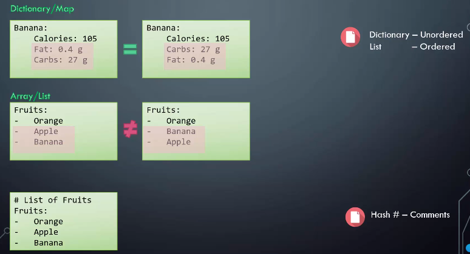
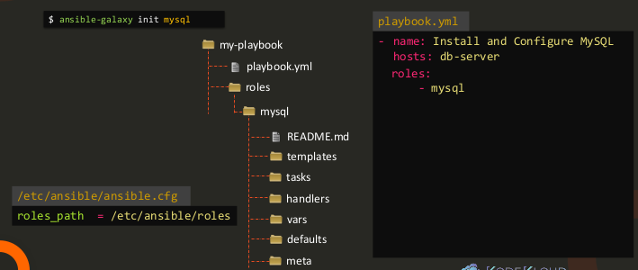

# Learn Ansible Basics - Beginners Course

# Ansible

## Install Ansible

To get Ansible for CentOS 7, first ensure that the CentOS 7 EPEL repository is installed:

```bash
sudo yum install epel-release
```

Once the repository is installed, install Ansible with `yum`:

```bash
sudo yum install ansible
```

**Check ansible version**

```
[sherwinowen@ansiblecontroller ~]$ ansible --version
ansible 2.9.27
  config file = /etc/ansible/ansible.cfg
  configured module search path = [u'/home/sherwinowen/.ansible/plugins/modules', u'/usr/share/ansible/plugins/modules']
  ansible python module location = /usr/lib/python2.7/site-packages/ansible
  executable location = /usr/bin/ansible
  python version = 2.7.5 (default, Jun 28 2022, 15:30:04) [GCC 4.8.5 20150623 (Red Hat 4.8.5-44)]
```

**Create inventory file**

inventory.txt

```
target1 ansible_host=192.168.102.12 ansible_ssh_pass=Abcd@1234
```

**Check if target machine is accessible**

```
[sherwinowen@ansiblecontroller test-project]$ ansible target1 -m ping -i inventory.txt 
target1 | SUCCESS => {
    "ansible_facts": {
        "discovered_interpreter_python": "/usr/bin/python"
    }, 
    "changed": false, 
    "ping": "pong"
}
```

## Understanding YAML


## **Dictionary vs List vs List of Dictionaries**


## **YAML - Notes**




## ANSIBLE LAB – YAML

1. Which of the following is used to separate the `key` and `value` in `YAML`?

   - **colon**
   - comma
   - semicolon
   - hyphen

2. How many `array keys` are there in the following yaml snippet?

   ```yaml
   Fruits:
     - Orange
     - Apple
     - Banana
   Vegetables:
     - Carrot
     - CauliFlower
     - Tomato
   ```

   - 8
   - 3
   - 6
   - **2**

3. Which of the following statements is true?

   A**. Dictionary is an unordered collection whereas list is an ordered collection.**


   B. Dictionary is an ordered collection whereas list is an unordered collection.


   C. Dictionary and list, both are an ordered collection.


   D. Dictionary and list, both are an unordered collection.

4. There is a yaml file named `practice.yaml` under `/home/bob/playbooks/` directory with a key `property1` and value `value1`.


   Add an additional key named `property2` and value `value2`.

   Check

   - Updated practice.yaml?

   practice.yaml

   ```
   property1: value1
   property2: value2
   ```

5. We have updated the `/home/bob/playbooks/practice.yaml` file with the key `name` and value `apple`. Add some additional properties (given below) to the dictionary.

   
   name= `apple`
   color= `red`
   weight= `90g`

   Check

   - Updated practice.yaml?

   practice.yaml

   ```
   name: apple
   color: red
   weight: 90g
   ```

6. We have updated the `/home/bob/playbooks/practice.yaml` file with a dictionary named `employee`. Add the remaining properties to it using information from the table below.

   

   | Key/Property | Value |
   | :----------- | :---- |
   | name         | john  |
   | gender       | male  |
   | age          | 24    |

   Check

   - Updated practice.yaml?

   practice.yaml

   ````
   employee:
     name: john
     gender: male
     age: 24
   ````

7. Now, update the `/home/bob/playbooks/practice.yaml` file with a dictionary in dictionary.

   Add a dictionary named `address` to add the address information in this file.

   | Key/Property | Value         |
   | :----------- | :------------ |
   | city         | edison        |
   | state        | new jersey    |
   | country      | united states |

   Check

   - Updated practice.yaml?

   practice.yaml

   ```
   employee:
     name: john
     gender: male
     age: 24
     address:
       city: 'edison'
       state: 'new jersey'
       country: 'united states'
   ```

8. We have updated the `/home/bob/playbooks/practice.yaml` file with an array of apples. Add a new apple to the list to make it a total of `4`.

   Check

   - Updated practice.yaml

   ```
   - apple
   - apple
   - apple
   - apple
   ```

9. In `/home/bob/playbooks/practice.yaml`, add two more values to make it `6`.

   Check

   - Updated practice.yaml?

   ```
   - apple
   - apple
   - apple
   - apple
   - apple
   - apple
   ```

10. We have updated the `/home/bob/playbooks/practice.yaml` file with some data for `apple`, `orange` and `mango`. Just like `apple`, we would like to add additional details for each item, such as color, weight etc. Modify the remaining items to match the below data.

    

    ```
    orange
    ```

    | color  | weight |
    | :----- | :----- |
    | orange | 90g    |

    

    ```
    mango
    ```

    | color  | weight |
    | :----- | :----- |
    | yellow | 150g   |

    Check

    - Verify Apple.
    - Verify Orange.
    - Verify Mango.

    ```
    - name: apple
      color: red
      weight: 100g
    - name: orange
      color: orange
      weight: 90g
    - name: mango
      color: yellow
      weight: 150g
    ```

11. We have updated the `/home/bob/playbooks/practice.yaml` file with a dictionary named `employee`. We would like to record information about multiple employees. Convert the dictionary named `employee` to an array named `employees`.

    Check

    - Updated practice.yaml?

    ```
    employees:
      - name: john
        gender: male
        age: 24
    ```

12. Update the `/home/bob/playbooks/practice.yaml` file to add an additional employee (below the existing entry) to the list using the below information.

    | Key/Property | Value  |
    | :----------- | :----- |
    | name         | sarah  |
    | gender       | female |
    | age          | 28     |

    Check

    - Verify the existing entry.
    - Verify the new entry.

    ```
    employees:
      - name: john
        gender: male
        age: 24
      - name: sarah
        gender: female
        age: 28
    ```

13. We have updated the `/home/bob/playbooks/practice.yaml` file to add some more details. Now add the pay information. Remember, while `address` is a dictionary, `payslips` is an array of `month` and `amount`.

    

    ```
    payslips
    ```

    | month  | amount |
    | :----- | :----- |
    | june   | 1400   |
    | july   | 2400   |
    | august | 3400   |

    Check

    - Verify June month pay.
    - Verify July month pay.
    - Verify August month pay.

    ```
    employee:
      name: john
      gender: male
      age: 24
      address:
        city: 'edison'
        state: 'new jersey'
        country: 'united states'
      payslips:
        - month: june
          amount: 1400
        - month: july
          amount: 2400
        - month: august
          amount: 3400
    ```


# Ansible Concepts

## Ansible Inventory

**Default invetory file**

- /etc/ansible/hosts

**Inventory Parameters:**

- ansible_connection – ssh/winrm/localhost
- ansible_port – 22/5986
- ansible_user – root/administrator
- ansible_ssh_pass - Password

**Security:** 

- Ansible Vault 

## Lab - Inventory

1. In this lab exercise you will use below hosts. Please note down some details about these hosts as given below :

   `student-node` :- This host will act as an Ansible master node where you will create playbooks, inventory, roles etc and you will be running your playbooks from this host itself.

   `node01` :- This host will act as an Ansible client/remote host where you will setup/install some stuff using Ansible playbooks. Below are the SSH credentials for this host:

   User: `bob`
   Password: `caleston123`

   `node02` :- This host will also act as an Ansible client/remote host where you will setup/install some stuff using Ansible playbooks. Below are the SSH credentials for this host:

   User: `bob`
   Password: `caleston123`

   `Note:` Please type `exit` or `logout` on the terminal or press `CTRL + d` to log out from a specific node.

2. Look into the given sample inventory, which of the following formats this inventory is using?

   ```ini
   web ansible_host=webserver.com
   db ansible_host=dbserver.com
   ```

   - xml
   - yaml
   - b
   - json

3. Which of the following ports Ansible uses by default to connect to the Linux remote hosts?

   - 21
   - 443
   - 80
   - **22**

4. Which of the following inventory parameters can be used to establish a local connection instead of ssh in Ansible?

   - ansible_port
   - **ansible_connection**
   - ansible_host
   - ansible_node

5. What value we must set for `ansible_connection` parameter to connect to a Windows server?

   - ssh
   - windows
   - **winrm**
   - linux

6. We have a sample inventory file called `inventory` under `/home/bob/playbooks` directory. It has `3` servers listed, add another server called `server4.company.com` in this file.

   Check

   - Updated the inventory?

   ```
   # Sample Inventory File
     
   server1.company.com
   server2.company.com
   server3.company.com
   server4.company.com
   ```

7. We have reset the `/home/bob/playbooks/inventory` inventory file, and added the aliases named `web1`, `web2` and `web3` for the first three hosts respectively. Update this inventory file to add an alias called `db1` for `server4.company.com` host.

   Check

   - Updated the inventory?

   ```
   # Sample Inventory File
     
   web1 ansible_host=server1.company.com
   web2 ansible_host=server2.company.com
   web3 ansible_host=server3.company.com
   db1  ansible_host=server4.company.com
   ```

8. As per the details given in the table below, you can see that, the web servers are linux based hosts and the db server is a Windows machine.

   
   Update the inventory `/home/bob/playbooks/inventory` to add a similar entry for `server4.company.com` host. Find the required details from the table below.

   

   ```text
   ---------------------------------------------------------------------------
   |  Alias |        HOST         | Connection | User          | Password     | 
   ---------------------------------------------------------------------------
   |  web1  | server1.company.com |    ssh     | root          | Password123! |
   ---------------------------------------------------------------------------
   |  web2  | server2.company.com |    ssh     | root          | Password123! |
   ---------------------------------------------------------------------------
   |  web3  | server3.company.com |    ssh     | root          | Password123! |
   ---------------------------------------------------------------------------
   |  db1   | server4.company.com |    winrm   | administrator | Dbp@ss123!   |
   ---------------------------------------------------------------------------
   ```

   

   `Note:` For Linux based hosts, use `ansible_ssh_pass` parameter and for Windows based hosts, use `ansible_password` parameter.

   Check

   - Updated the inventory?

   ```
   # Sample Inventory File
     
   # Web Servers
   web1 ansible_host=server1.company.com ansible_connection=ssh ansible_user=root ansible_ssh_pass=Password123!
   web2 ansible_host=server2.company.com ansible_connection=ssh ansible_user=root ansible_ssh_pass=Password123!
   web3 ansible_host=server3.company.com ansible_connection=ssh ansible_user=root ansible_ssh_pass=Password123!
   db1 ansible_host=server4.company.com ansible_connection=winrm ansible_user=administrator ansible_password=Dbp@ss123!
   ```

9. We have updated the `/home/bob/playbooks/inventory` file and added a group called `web_servers` for web servers. Similarly, add a group called `db_servers` for database servers.

   Check

   - Updated the inventory?

   ```
   # Sample Inventory File
     
   # Web Servers
   web1 ansible_host=server1.company.com ansible_connection=ssh ansible_user=root ansible_ssh_pass=Password123!
   web2 ansible_host=server2.company.com ansible_connection=ssh ansible_user=root ansible_ssh_pass=Password123!
   web3 ansible_host=server3.company.com ansible_connection=ssh ansible_user=root ansible_ssh_pass=Password123!
   
   # Database Servers
   db1 ansible_host=server4.company.com ansible_connection=winrm ansible_user=administrator ansible_password=Password123!
   
   
   [web_servers]
   web1
   web2
   web3
   
   [db_servers]
   db1
   ```

10. Let us now create a group of groups. Create a new group called `all_servers` and add the previously created groups `web_servers` and `db_servers` under it.

    `Note:` Syntax would be as follows -

    ```ini
    [parent_group:children]
    child_group1
    child_group2
    ```

    Check

    - Updated the inventory.

    ```
    # Sample Inventory File
      
    # Web Servers
    web1 ansible_host=server1.company.com ansible_connection=ssh ansible_user=root ansible_ssh_pass=Password123!
    web2 ansible_host=server2.company.com ansible_connection=ssh ansible_user=root ansible_ssh_pass=Password123!
    web3 ansible_host=server3.company.com ansible_connection=ssh ansible_user=root ansible_ssh_pass=Password123!
    
    # Database Servers
    db1 ansible_host=server4.company.com ansible_connection=winrm ansible_user=administrator ansible_password=Password123!
    
    
    [web_servers]
    web1
    web2
    web3
    
    [db_servers]
    db1
    
    [all_servers:children]
    web_servers
    db_servers
    ```

11. Update the `/home/bob/playbooks/inventory` file to represent the data given in the below table in Ansible Inventory format.

    ```text
    -------------------------------------------------------------------
    | Server Alias |  Server Name  |  OS    |     User      | Password |
    -------------------------------------------------------------------
    | sql_db1      | sql01.xyz.com | Linux  |     root      | Lin$Pass |
    -------------------------------------------------------------------
    | sql_db2      | sql02.xyz.com | Linux  |     root      | Lin$Pass |
    -------------------------------------------------------------------
    | web_node1    | web01.xyz.com | Win    | administrator | Win$Pass |
    -------------------------------------------------------------------
    | web_node2    | web02.xyz.com | Win    | administrator | Win$Pass |
    -------------------------------------------------------------------
    | web_node3    | web03.xyz.com | Win    | administrator | Win$Pass |
    ```


    Group the servers together based on this table
    
    ```text
    --------------------------------------------------------
    |    Group         |  Members                          |
    --------------------------------------------------------
    |    db_nodes      |  sql_db1, sql_db2                 |
    --------------------------------------------------------
    |   web_nodes      |  web_node1, web_node2, web_node3  |
    --------------------------------------------------------
    |    boston_nodes  |  sql_db1, web_node1               |
    --------------------------------------------------------
    |    dallas_nodes  |  sql_db2, web_node2, web_node3    |
    --------------------------------------------------------
    |   us_nodes       |  boston_nodes, dallas_nodes       |
    --------------------------------------------------------
    ```
    
    Check
    
    - Check db_nodes
    - Check web_nodes
    - Check boston_nodes
    - Check dallas_nodes
    - Check us_nodes:children
    
    ```
    # Sample Inventory File
      
    # Web Servers
    web_node1 ansible_host=web01.xyz.com ansible_connection=winrm ansible_user=administrator ansible_password=Win$Pass
    web_node2 ansible_host=web02.xyz.com ansible_connection=winrm ansible_user=administrator ansible_password=Win$Pass
    web_node3 ansible_host=web03.xyz.com ansible_connection=winrm ansible_user=administrator ansible_password=Win$Pass
    
    # DB Servers
    sql_db1 ansible_host=sql01.xyz.com ansible_connection=ssh ansible_user=root ansible_ssh_pass=Lin$Pass
    sql_db2 ansible_host=sql02.xyz.com ansible_connection=ssh ansible_user=root ansible_ssh_pass=Lin$Pass
    
    [db_nodes]
    sql_db1
    sql_db2
    
    [web_nodes]
    web_node1
    web_node2
    web_node3
    
    [boston_nodes]
    sql_db1
    web_node1  
    
    [dallas_nodes]
    sql_db2
    web_node2
    web_node3
    
    [us_nodes:children]
    boston_nodes
    dallas_nodes
    ```


## Ansible Playbooks

**Simple Ansible Playbook**

```
# Simple Ansible Playbook 

- Run command1 on server1
- Run command2 on server2
- Run command3 on server3
- Restarting Server1
- Restarting Server2
- Restarting Server3

```

**Complex Ansible Playbook**

```
# Complex Ansible Playbook

- Deploy 50 VMs on Public Cloud
- Deploy 50 VMs on Private Cloud
- Provision Storage to all VMs
- Setup Network Configuration on Private VMs
- Setup Cluster Configuration
- Configure Web server on 20 Public VMs
- Configure DB server on 20 Private VMs
- Setup Loadbalancing between web server VMs
- Setup Monitoring components
- Install and Configure backup clients on VMs
- Update CMDB database with new VM Information
```

**Playbook** 

- A single YAML file
- Play – Defines a set of activities (tasks) to be run on hosts
- Task – An action to be performed on the host
  - Execute a command
  - Run a script
  - Install a package
  - Shutdown/Restart

playbook.yml

```
-
  name: Play 1
  hosts: localhost
  tasks:
   - name: Execute command ‘date’
     command: date

   - name: Execute script on server
     script: test_script.sh

   - name: Install httpd service
     yum:
      name: httpd
      state: present

   - name: Start web server
     service:
      name: httpd
      state: started
```

inventory

```
localhost

server1.company.com
server2.company.com

[mail]
server3.company.com
server4.company.com

[db]
server5.company.com
server6.company.com

[web]
server7.company.com
server8.company.com
```

**List ansible modules**

```
$ ansible-doc -l

$ ansible-doc -l | grep yum
yum                                                           Manages packages with the `yum' package mana...
yum_repository                                                Add or remove YUM repositories    
```

**Execute Ansible Playbook**

```
ansible-playbook playbook.yml

ansible-playbook --help
```

## Lab – Playbooks

1. In this lab exercise you will use below hosts. Please note down some details about these hosts as given below :

   `student-node` :- This host will act as an Ansible master node where you will create playbooks, inventory, roles etc and you will be running your playbooks from this host itself.

   `node01` :- This host will act as an Ansible client/remote host where you will setup/install some stuff using Ansible playbooks. Below are the SSH credentials for this host:

   User: `bob`
   Password: `caleston123`

   `node02` :- This host will also act as an Ansible client/remote host where you will setup/install some stuff using Ansible playbooks. Below are the SSH credentials for this host:

   User: `bob`
   Password: `caleston123`

   `Note:` Please type `exit` or `logout` on the terminal or press `CTRL + d` to log out from a specific node.

2. Which of the following formats is the Ansible playbook written in?

   - python
   - **yaml**
   - xml
   - bash

3. How many Ansible plays are there in the following given playbook?

   ```yaml
   ---
   - name: Setup apache
     hosts: webserver
     tasks:
       - name: install httpd
         yum:
           name: httpd
           state: installed
       - name: Start service
         service:
           name: httpd
           state: started
   
   - name: Setup tomcat
     hosts: appserver
     tasks:
       - name: install httpd
         yum:
           name: tomcat
           state: installed
       - name: Start service
         service:
           name: tomcat
           state: started
   ```

   - 1
   - 4
   - 3
   - **2**

4. How many tasks are there under `Setup apache` Ansible play?

   ```yaml
   ---
   - name: Setup apache
     hosts: webserver
     tasks:
       - name: install httpd
         yum:
           name: httpd
           state: installed
       - name: Start service
         service:
           name: httpd
           state: started
   
   - name: Setup tomcat
     hosts: appserver
     tasks:
       - name: install httpd
         yum:
           name: tomcat
           state: installed
       - name: Start service
         service:
           name: tomcat
           state: started
   ```

   - 4
   - **2**
   - 3
   - 1

5. If we use the following inventory, on which hosts will Ansible install the `httpd` package using the given playbook?

   ```ini
   [webserver]
   web1
   web2
   [appserver]
   app1
   app2
   app3
   ```

   ```yaml
   ---
   - name: Setup apache
     hosts: webserver
     tasks:
       - name: install httpd
         yum:
           name: httpd
           state: installed
   
   - name: Setup tomcat
     hosts: appserver
     tasks:
       - name: install httpd
         yum:
           name: tomcat
           state: installed
   ```

   - web1 and app1
   - **web1 and web2**
   - web1, web2, app1, app2 and app3
   - app1, app2 and app3

6. Which of the following commands can you use to run an Ansible playbook named `install.yaml`?

   **(A) ansible-playbook install.yaml**

   (B) ansible-playbook run install.yaml

   (C) ansible-playbook -p install.yaml

   (D) ansible-playbook -i install.yaml

7. Update the name of the play in `/home/bob/playbooks/playbook.yaml` playbook to `Execute a date command on localhost`.

   Check

   - Updated the playbook?
   - Verify.

   playbook.yaml

   ```
   ---
   - name: 'Execute a date command on localhost'
     hosts: localhost
     become: yes
     tasks:
       - name: 'Execute a date command'
         command: date
   ```

   ```
   $ ansible-playbook playbook.yaml -i inventory 
   
   PLAY [Execute a date command on localhost] ***************************************************************
   
   TASK [Gathering Facts] ***********************************************************************************
   ok: [localhost]
   
   TASK [Execute a date command] ****************************************************************************
   changed: [localhost]
   
   PLAY RECAP ***********************************************************************************************
   localhost                  : ok=2    changed=1    unreachable=0    failed=0    skipped=0    rescued=0    ignored=0   
   ```

8. Update the playbook `/home/bob/playbooks/playbook.yaml` to add a task name `Task to display hosts file` for the existing task.

   Check

   - Updated the playbook?
   - Verify.

   playbook.yaml

   ```
   ---
   - name: 'Execute a command to display hosts file on localhost'
     hosts: localhost
     become: yes
     tasks:
       - name: 'Task to display hosts file'
         command: 'cat /etc/hosts'   
   ```

   ```
   $ ansible-playbook playbook.yaml -i inventory 
   
   PLAY [Execute a command to display hosts file on localhost] **********************************************
   
   TASK [Gathering Facts] ***********************************************************************************
   ok: [localhost]
   
   TASK [Task to display hosts file] ************************************************************************
   changed: [localhost]
   
   PLAY RECAP ***********************************************************************************************
   localhost                  : ok=2    changed=1    unreachable=0    failed=0    skipped=0    rescued=0    ignored=0    
   ```

9. We have reset the playbook `/home/bob/playbooks/playbook.yaml`, now update it to add another task. The new task must execute the command `cat /etc/resolv.conf` and set its name to `Task to display nameservers`.

   Check

   - Updated the playbook?
   - Verify.

   playbook.yaml

   ```
   ---
   - name: 'Execute two commands on localhost'
     hosts: localhost
     become: yes
     tasks:
       - name: 'Task to display nameservers'
         command: 'cat /etc/resolv.conf'
   ```

   ```
   $ ansible-playbook playbook.yaml -i inventory 
   
   PLAY [Execute two commands on localhost] *****************************************************************
   
   TASK [Gathering Facts] ***********************************************************************************
   ok: [localhost]
   
   TASK [Task to display nameservers] ***********************************************************************
   changed: [localhost]
   
   PLAY RECAP ***********************************************************************************************
   localhost                  : ok=2    changed=1    unreachable=0    failed=0    skipped=0    rescued=0    ignored=0   
   ```

10. So far, we have been running all tasks on `localhost`. We would now like to run these tasks on `node01`, this host is already defined in `/home/bob/playbooks/inventory` file. Update the playbook `/home/bob/playbooks/playbook.yaml` to run the tasks on the `node01` host.

   Check

   - Updated the playbook?

   playbook.yaml

   ```
   ---
   - name: 'Execute two commands on node01'
     hosts: node01
     become: yes
     tasks:
       - name: 'Execute a date command'
         command: date
       - name: 'Task to display hosts file'
         command: 'cat /etc/hosts'
   ```

   ```
   $ ansible-playbook playbook.yaml -i inventory 
   
   PLAY [Execute two commands on node01] ********************************************************************
   
   TASK [Gathering Facts] ***********************************************************************************
   ok: [node01]
   
   TASK [Execute a date command] ****************************************************************************
   changed: [node01]
   
   TASK [Task to display hosts file] ************************************************************************
   changed: [node01]
   
   PLAY RECAP ***********************************************************************************************
   node01                     : ok=3    changed=2    unreachable=0    failed=0    skipped=0    rescued=0    ignored=0   
   ```

11. Refer to the `/home/bob/playbooks/inventory` file. We would like to run the `/home/bob/playbooks/playbook.yaml` on all servers defined under `web_nodes` group.

    `Note:` Use the group name in playbook as defined in the inventory file.

    Check

    - Updated the playbook?

    playbook.yaml

    ```
    ---
    - name: 'Execute two commands on web_nodes'
      hosts: web_nodes
      become: yes
      tasks:
        - name: 'Execute a date command'
          command: date
        - name: 'Task to display hosts file'
          command: 'cat /etc/hosts'
    ```

    ```
    $ ansible-playbook playbook.yaml -i inventory 
    
    PLAY [Execute two commands on web_nodes] *****************************************************************
    
    TASK [Gathering Facts] ***********************************************************************************
    ok: [node01]
    ok: [node02]
    
    TASK [Execute a date command] ****************************************************************************
    changed: [node01]
    changed: [node02]
    
    TASK [Task to display hosts file] ************************************************************************
    changed: [node01]
    changed: [node02]
    
    PLAY RECAP ***********************************************************************************************
    node01                     : ok=3    changed=2    unreachable=0    failed=0    skipped=0    rescued=0    ignored=0   
    node02                     : ok=3    changed=2    unreachable=0    failed=0    skipped=0    rescued=0    ignored=0   
    ```

12. Update the `/home/bob/playbooks/playbook.yaml` to add a new play named `Execute a command on node02`, and a task under it to execute `cat /etc/hosts` command on `node02` host, name the task `Task to display hosts file on node02`.

    Refer to the given inventory file.

    Check

    - Updated the playbook?
    - Verify.

    playbook.yaml

    ```
    ---
    - name: 'Execute two commands on node01'
      hosts: node01
      become: yes
      tasks:
        - name: 'Execute a date command'
          command: date
        - name: 'Task to display hosts file on node01'
          command: 'cat /etc/hosts'
    
    - name: 'Execute a command on node02'
      hosts: node02
      become: yes
      tasks:
        - name: 'Task to display hosts file on node02'
          command: 'cat /etc/hosts'
    ```

    ```
    $ ansible-playbook playbook.yaml -i inventory 
    
    PLAY [Execute two commands on node01] ********************************************************************
    
    TASK [Gathering Facts] ***********************************************************************************
    ok: [node01]
    
    TASK [Execute a date command] ****************************************************************************
    changed: [node01]
    
    TASK [Task to display hosts file on node01] **************************************************************
    changed: [node01]
    
    PLAY [Execute a command on node02] ***********************************************************************
    
    TASK [Gathering Facts] ***********************************************************************************
    ok: [node02]
    
    TASK [Task to display hosts file on node02] **************************************************************
    changed: [node02]
    
    PLAY RECAP ***********************************************************************************************
    node01                     : ok=3    changed=2    unreachable=0    failed=0    skipped=0    rescued=0    ignored=0   
    node02                     : ok=2    changed=1    unreachable=0    failed=0    skipped=0    rescued=0    ignored=0   
    ```

## Ansible Modules

- System
- Commands
- Files
- Database
- Cloud
- Windows

## Lab – Modules

1. In this lab exercise you will use below hosts. Please note down some details about these hosts as given below :

   `student-node` :- This host will act as an Ansible master node where you will create playbooks, inventory, roles etc and you will be running your playbooks from this host itself.

   `node01` :- This host will act as an Ansible client/remote host where you will setup/install some stuff using Ansible playbooks. Below are the SSH credentials for this host:

   User: `bob`
   Password: `caleston123`

   `node02` :- This host will also act as an Ansible client/remote host where you will setup/install some stuff using Ansible playbooks. Below are the SSH credentials for this host:

   User: `bob`
   Password: `caleston123`

   `Note:` Please type `exit` or `logout` on the terminal or press `CTRL + d` to log out from a specific node.

2. Which of the following Ansible modules support `free_form` parameter?

   - copy
   - service
   - **command**
   - lineinfile

3. Does Ansible support idempotancy?

   - **yes**
   - no

4. Which of the following commands we can use to see the information about Ansible modules from command line?

   - ansible --help
   - ansible-info
   - ansible-help
   - ansible-doc

5. Which Ansible module is used in the following playbook?

   ```yaml
   ---
   - hosts: localhost
     become: yes
     become_user: root
     tasks:
       - name: create user
         user:
           name: admin
   ```

   - become
   - **user**
   - localhost
   - become_user

6. Which of the following statements are true about `lineinfile` Ansible module?

   A. It only adds the given line in file if that line doesn't exist in that file.

   B. It adds the given line in file even if that line already exists in that file.

   C. It replaces all existing lines in the file with a new given line.

   D. It keeps the existing lines as well and add a new given line in the file.

   - **D & A**
   - A & C
   - A & B
   - D & C

7. What are Ansible `system` modules used for?

   A. System modules are basically used to create/update files and directories.

   **B. System modules are actions to be performed at a system level such as modifying the users and groups on a system, modifying iptables, starting/stopping the service etc.**

   C. System modules are used to execute commands or scripts on a system.

   D. System modules are used to install and setup packages on a system.

8. Update the playbook named `playbook.yaml` under `/home/bob/playbooks` directory with a task named `Execute a script` to run a script. The script is located at `/tmp/install_script.sh` on `student-node`.

   Use the `script` module.

   `Note:` There is already an inventory file `/home/bob/playbooks/inventory` present on `student-node` system.

   Check

   - Cleanup.
   - Run the playbook.
   - Check node01.
   - Check node02.

   inventory

   ```
   node01 ansible_host=node01 ansible_ssh_pass=caleston123
   node02 ansible_host=node02 ansible_ssh_pass=caleston123
   [web_nodes]
   node01
   node02
   ```

   playbook.yaml

   ```
   ---
   - name: 'hosts'
     hosts: all
     become: yes
     tasks:
      - name: 'Execute script a script'
        script: '/tmp/install_script.sh'              
   ```

   ```
   $ ansible-playbook playbook.yaml -i inventory 
   
   PLAY [hosts] *********************************************************************************************
   
   TASK [Gathering Facts] ***********************************************************************************
   ok: [node01]
   ok: [node02]
   
   TASK [Execute script a script] ***************************************************************************
   changed: [node02]
   changed: [node01]
   
   PLAY RECAP ***********************************************************************************************
   node01                     : ok=2    changed=1    unreachable=0    failed=0    skipped=0    rescued=0    ignored=0   
   node02                     : ok=2    changed=1    unreachable=0    failed=0    skipped=0    rescued=0    ignored=0   
   ```

9. Update the playbook `/home/bob/playbooks/playbook.yaml` to add a new task to start `httpd` service on all web nodes defined in `/home/bob/playbooks/inventory` file.

   Use the `service` module.

   Check

   - Cleanup.
   - Run the playbook.
   - Check node01.
   - Check node02.

   playbook.yaml

   ```
   ---
   - name: 'hosts'
     hosts: all
     become: yes
     tasks:
       - name: 'Execute script a script'
         script: '/tmp/install_script.sh'
       
       - name: 'Start web server'
         service:                         
          name: httpd       
          state: started
   ```

   ```
   $ ansible-playbook playbook.yaml -i inventory 
   
   PLAY [hosts] *********************************************************************************************
   
   TASK [Gathering Facts] ***********************************************************************************
   ok: [node01]
   ok: [node02]
   
   TASK [Execute script a script] ***************************************************************************
   changed: [node02]
   changed: [node01]
   
   TASK [Start web server] **********************************************************************************
   changed: [node02]
   changed: [node01]
   
   PLAY RECAP ***********************************************************************************************
   node01                     : ok=3    changed=2    unreachable=0    failed=0    skipped=0    rescued=0    ignored=0   
   node02                     : ok=3    changed=2    unreachable=0    failed=0    skipped=0    rescued=0    ignored=0   
   ```

10. Update the playbook `/home/bob/playbooks/playbook.yaml` to append the `/var/www/html/index.html` file on all web nodes. The line needs to be added is `Welcome to ansible-beginning course`, create the `index.html` file if doesn't exist.

   Use the `lineinfile` module.

   Check

   - Cleanup.
   - Run the playbook.
   - Check node01.
   - Check node02.

   playbook.yaml

   ```
   ---
   - name: 'hosts'
     hosts: all
     become: yes
     tasks:
       - name: 'Execute a script'
         script: '/tmp/install_script.sh'
       - name: 'Start httpd service'
         service:
           name: 'httpd'
           state: 'started'
       - name: 'Create or update index.html file.'
         lineinfile:
           path: /var/www/html/index.html
           line: 'Welcome to ansible-beginning course'
           create: true
   ```

   ```
   $ ansible-playbook playbook.yaml -i inventory 
   
   PLAY [hosts] *********************************************************************************************
   
   TASK [Gathering Facts] ***********************************************************************************
   ok: [node01]
   ok: [node02]
   
   TASK [Execute a script] **********************************************************************************
   changed: [node01]
   changed: [node02]
   
   TASK [Start httpd service] *******************************************************************************
   ok: [node02]
   ok: [node01]
   
   TASK [Create or update index.html file.] *****************************************************************
   changed: [node01]
   changed: [node02]
   
   PLAY RECAP ***********************************************************************************************
   node01                     : ok=4    changed=2    unreachable=0    failed=0    skipped=0    rescued=0    ignored=0   
   node02                     : ok=4    changed=2    unreachable=0    failed=0    skipped=0    rescued=0    ignored=0   
   ```

11. Update the playbook `/home/bob/playbooks/playbook.yaml` to add a new task to create a new user called `web_user`.

    Use the `user` module for this task. You can find the user details as below.

    `Username`: web_user
    `uid`: 1040
    `group`: developers

    Check

    - Cleanup.
    - Run the playbook.
    - Check node01.
    - Check node02.

    playbook.yaml

    ```
    ---
    - name: 'hosts'
      hosts: all
      become: yes
      tasks:
        - name: 'Execute a script'
          script: '/tmp/install_script.sh'
        - name: 'Start httpd service'
          service:
            name: 'httpd'
            state: 'started'
        - name: "Update /var/www/html/index.html"
          lineinfile:
            path: /var/www/html/index.html
            line: "Welcome to ansible-beginning course"
            create: true
        - name: 'Create a new user'
          user:
            name: 'web_user'
            uid: 1040
            group: 'developers'
    ```

    ```
    $ ansible-playbook playbook.yaml -i inventory 
    
    PLAY [hosts] *********************************************************************************************
    
    TASK [Gathering Facts] ***********************************************************************************
    ok: [node01]
    ok: [node02]
    
    TASK [Execute a script] **********************************************************************************
    changed: [node01]
    changed: [node02]
    
    TASK [Start httpd service] *******************************************************************************
    ok: [node01]
    ok: [node02]
    
    TASK [Update /var/www/html/index.html] *******************************************************************
    ok: [node02]
    ok: [node01]
    
    TASK [Create a new user] *********************************************************************************
    changed: [node02]
    changed: [node01]
    
    PLAY RECAP ***********************************************************************************************
    node01                     : ok=5    changed=2    unreachable=0    failed=0    skipped=0    rescued=0    ignored=0   
    node02                     : ok=5    changed=2    unreachable=0    failed=0    skipped=0    rescued=0    ignored=0   
    ```


## Ansible Variables

**Variable**

- Stores information that varies with each host

**Using variables**

playbook.yml

```
-
  name: Add DNS server to resolv.conf
  hosts: localhost
 
  vars:
     dns_server: 10.1.250.10
 
  tasks:
     - lineinfile:
         path: /etc/resolv.conf
         line: 'nameserver {{dns_server }}'
```


```
#Sample Inventory File
Web http_port= 
snmp_port=
inter_ip_range=
```

```
#Sample variable File – web.yml
http_port: 8081
snmp_port: 161-162
inter_ip_range: 192.0.2.0
```

```
-
  name: Set Firewall Configurations
  hosts: web
  tasks:
  - firewalld:
      service: https
      permanent: true
      state: enabled
  - firewalld:
      port: '{{ http_port }}''
      permanent: true
      state: disabled
   
  - firewalld:
      port: '{{ snmp_port }}''
      permanent: true
      state: disabled
  
  - firewalld:
      source: '{{ inter_ip_range }}'
      Zone: internal
      state: enabled
```

### **Jinja2 Templating**

```
# Wrong
source: {{ inter_ip_range }}

# Correct
source: '{{ inter_ip_range }}'
source: SomeThing{{ inter_ip_range }}SomeThing
```


## Lab – Variables

1. In this lab exercise you will use below hosts. Please note down some details about these hosts as given below :

   `student-node` :- This host will act as an Ansible master node where you will create playbooks, inventory, roles etc and you will be running your playbooks from this host itself.

   `node01` :- This host will act as an Ansible client/remote host where you will setup/install some stuff using Ansible playbooks. Below are the SSH credentials for this host:

   User: `bob`
   Password: `caleston123`

   `node02` :- This host will also act as an Ansible client/remote host where you will setup/install some stuff using Ansible playbooks. Below are the SSH credentials for this host:

   User: `bob`
   Password: `caleston123`

   `Note:` Please type `exit` or `logout` on the terminal or press `CTRL + d` to log out from a specific node.

2. Can we define variables in an Ansible inventory file?

   - no
   - **yes**

3. Can we define variables in an Ansible playbook?

   - no 
   - **yes**

4. Which of the following formats is used to call a variable in an Ansible playbook?

   - '( varaible_name)'
   - '(( variable_name))'
   - '{ variable_name}'
   - **'{{ variable_name}}'**

5. The `/home/bob/playbooks/playbook.yaml` playbook is adding a name server entry in `resolv.conf` file on `localhost`. The name server information is already added to the `/home/bob/playbooks/inventory` file as a variable called `nameserver_ip`.

   Replace the hardcode ip address of the name server in this playbook to use the value from the variable defined in the inventory file.

   `Note:` You need not to execute this playbook as of now.

   Check

   - Syntax Check
   - Updated the playbook?

   inventory

   ```
   localhost ansible_connection=local nameserver_ip=8.8.8.8 snmp_port=160-161
   node01 ansible_host=node01 ansible_ssh_pass=caleston123
   node02 ansible_host=node02 ansible_ssh_pass=caleston123
   [web_nodes]
   node01
   node02
   ```

   playbook.yaml

   ```
   ---
   - name: 'Add nameserver in resolv.conf file on localhost'
     hosts: localhost
     become: yes
     tasks:
       - name: 'Add nameserver in resolv.conf file'
         lineinfile:
           path: /etc/resolv.conf
           line: 'nameserver {{ nameserver_ip }}'
   ```

6. We have updated the `/home/bob/playbooks/playbook.yaml` playbook to add a new task to disable `SNMP` port on `localhost`. However, the port is hardcoded in the playbook. Update the playbook to replace the hardcode value of the SNMP port to use the value from the variable named `snmp_port`, defined in the inventory file.

   `Note:` You need not to execute this playbook as of now.

   Check

   - Syntax Check
   - Updated the playbook?

   invertory

   ```
   localhost ansible_connection=local nameserver_ip=8.8.8.8 snmp_port=160-161
   node01 ansible_host=node01 ansible_ssh_pass=caleston123
   node02 ansible_host=node02 ansible_ssh_pass=caleston123
   [web_nodes]
   node01
   node02
   ```

   playbook.ysml

   ```
   ---
   - name: 'Add nameserver in resolv.conf file on localhost'
     hosts: localhost
     become: yes
     tasks:
       - name: 'Add nameserver in resolv.conf file'
         lineinfile:
           path: /etc/resolv.conf
           line: 'nameserver {{  nameserver_ip  }}'
       - name: 'Disable SNMP Port'
         firewalld:
           port: '{{ snmp_port }}'
           permanent: true
           state: disabled
   ```

7. We have reset the `/home/bob/playbooks/playbook.yaml` playbook. Its printing some personal information of an employee. We would like to move the `car_model, country_name` and `title` values to the respective variables, and these variables should be defined at the play level.

   Add three new variables named `car_model`, `country_name` and `title` under the play and move the values over there. Use these variables within the task to remove the hardcoded values.

   Check

   - Updated the playbook?
   - Verify.

   ```
   ---
   - hosts: localhost
     vars:
       car_model: 'BMW M3'
       country_name: USA
       title: 'Systems Engineer'
   
     tasks:
       - command: 'echo "My car is {{ car_model }}"'
       - command: 'echo "I live in the {{ country_name }}"'
       - command: 'echo "I work as a {{ title }}"'
   ```

   ```
   $ ansible-playbook playbook.yaml -i inventory 
   
   PLAY [localhost] *****************************************************************************************
   
   TASK [Gathering Facts] ***********************************************************************************
   ok: [localhost]
   
   TASK [command] *******************************************************************************************
   changed: [localhost]
   
   TASK [command] *******************************************************************************************
   changed: [localhost]
   
   TASK [command] *******************************************************************************************
   changed: [localhost]
   
   PLAY RECAP ***********************************************************************************************
   localhost                  : ok=4    changed=3    unreachable=0    failed=0    skipped=0    rescued=0    ignored=0   
   ```

# Conditionals, Loops & Roles

## Conditionals

### Conditional - when

```
---
- name: Install NGINX
  hosts: all
  tasks:
  - name: Install NGINX on Debian
    apt:
      name: nginx
      state: present
    when: ansible_os_family == “Debian”

  - name: Install NGINX on Redhat
    yum:
      name: nginx
      state: present
    when: ansible_os_family == “RedHat”
```

### Operator - or

```
---
- name: Install NGINX
  hosts: all
  tasks:
  - name: Install NGINX on Debian
    apt:
      name: nginx
      state: present
    when: ansible_os_family == “Debian”
  
  - name: Install NGINX on Redhat
    yum:
      name: nginx
      state: present
    when: ansible_os_family == “RedHat” or ansible_os_family == “SUSE”
```

### Operator - and

```
---
- name: Install NGINX
  hosts: all
  tasks:
  - name: Install NGINX on Debian
    apt:
      name: nginx
      state: present
    when: ansible_os_family == “Debian” and ansible_distribution_version ==   
          “16.04”
  - name: Install NGINX on Redhat
    yum:
      name: nginx
      state: present
    when: ansible_os_family == “RedHat” or ansible_os_family == “SUSE”
```

### Conditionals in Loops

```
---
- name: Install Softwares
  hosts: all
  vars:
     packages:
        - name: nginx
          required: True
        - name: mysql
          required : True
        - name: apache
          required : False
   tasks:
   - name: Install “{{ item.name }}” on Debian
     apt:
       name: “{{ item.name }}”
       state: present
     when: ite.required == True
     loop: "{{ packages }}"
```

### Conditionals & Register

```
- name: Check status of a service and email if its down
  hosts: localhost
  tasks:
    - command: service httpd status
      register: result
    - mail:
        to: admin@company.com
        subject: Service Alert
        body: Httpd Service is down
        when: result.stdout.find('down') != -1
```

###  Lab – Conditionals

1. In this lab exercise you will use below hosts. Please note down some details about these hosts as given below :

   `student-node` :- This host will act as an Ansible master node where you will create playbooks, inventory, roles etc and you will be running your playbooks from this host itself.

   `node01` :- This host will act as an Ansible client/remote host where you will setup/install some stuff using Ansible playbooks. Below are the SSH credentials for this host:

   User: `bob`
   Password: `caleston123`

   `node02` :- This host will also act as an Ansible client/remote host where you will setup/install some stuff using Ansible playbooks. Below are the SSH credentials for this host:

   User: `bob`
   Password: `caleston123`

   `Note:` Please type `exit` or `logout` on the terminal or press `CTRL + d` to log out from a specific node.

2. Which of the following Ansible `built-in` variable populates the flavour of the operating system?

   - ansible_family
   - **ansible_os_family**
   - ansible_host
   - ansible_os

3. Which keyword is used to define a condition in an Ansible playbook?

   - if
   - **when**
   - while
   - state

4. As per the given playbook, will Ansible install the `vim` package on a `RedHat` based machine?

   ```yaml
   ---
   - name: Install package
     hosts: app1
     tasks:
       - name: Install
         package:
           name: vim
           state: present
         when: ansible_os_family != "RedHat"
   ```

   - **no**
   - yes

5. There is a playbook named `nginx.yaml` under `/home/bob/playbooks` directory. It is starting `nginx` service on all hosts defined in `/home/bob/playbooks/inventory` inventory file. Use the `when` condition to run this task only on `node02` host.

   Check

   - Updated the playbook?

   inventory

   ```
   node01 ansible_host=node01 ansible_ssh_pass=caleston123
   node02 ansible_host=node02 ansible_ssh_pass=caleston123
   [web_nodes]
   node01
   node02
   ```

   nginx.yaml

   ```
   ---
   -  name: 'Execute a script on all web server nodes'
      hosts: all
      become: yes
      tasks:
        -  service: 'name=nginx state=started'
           when: 'ansible_host=="node02"'
   ```

   ```
   $ ansible-playbook -i inventory nginx.yaml 
   
   PLAY [Execute a script on all web server nodes] **********************************************************
   
   TASK [Gathering Facts] ***********************************************************************************
   ok: [node02]
   ok: [node01]
   
   TASK [service] *******************************************************************************************
   skipping: [node01]
   changed: [node02]
   
   PLAY RECAP ***********************************************************************************************
   node01                     : ok=1    changed=0    unreachable=0    failed=0    skipped=1    rescued=0    ignored=0   
   node02                     : ok=2    changed=1    unreachable=0    failed=0    skipped=0    rescued=0    ignored=0   
   ```

6. The playbook under `/home/bob/playbooks/age.yaml` , has a variable defined called `age`. The two tasks attempt to print if I am a child or an Adult. Use the `when` conditional to print if I am a child or an Adult based on whether my age is `< 18 (Child)` or `>= 18 (Adult)`.

   Check

   - Updated the playbook?

   age.yaml

   ```
   ---
   - name: 'Am I an Adult or a Child?'
     hosts: localhost
     vars:
       age: 25
     tasks:
       - name: I am a Child
         command: 'echo "I am a Child"'
         when: 'age < 18'
         
       - name: I am an Adult
         command: 'echo "I am an Adult"'
         when: 'age >= 18'
   ```

   ```
   $ ansible-playbook -i inventory age.yaml 
   
   PLAY [Am I an Adult or a Child?] *************************************************************************
   
   TASK [Gathering Facts] ***********************************************************************************
   ok: [localhost]
   
   TASK [I am a Child] **************************************************************************************
   skipping: [localhost]
   
   TASK [I am an Adult] *************************************************************************************
   changed: [localhost]
   
   PLAY RECAP ***********************************************************************************************
   localhost                  : ok=2    changed=1    unreachable=0    failed=0    skipped=1    rescued=0    ignored=0   
   ```

7. Playbook `/home/bob/playbooks/nameserver.yaml` attempts to add an entry in `/etc/resolv.conf` file to add a new `nameserver`.

   The first task in the playbook is using the `shell` module to display the existing contents of `/etc/resolv.conf` file and the second one is adding a new line containing the name server details into the file. However, when this playbook is run multiple times, it keeps adding new entries of same line into the `resolv.conf` file. To resolve this issue, update the playbook as per details mentioned below.

   1. Add a `register` directive to store the output of the first task to a variable called `command_output`
   2. Then add a `conditional` to the second task to check if the output already contains the name server (`10.0.250.10`). Use `command_output.stdout.find(<IP>) == -1`

   `Note:`
   a. A better way to do this would be to use the `lineinfile` module. This is just for practice.

   b.`shell` and `command` modules are similar in a way that they are used to execute a command on the system. However, shell executes the command inside a `shell` giving us access to environment variables and redirection using `>>`.

   Check

   - Updated the playbook?
   - Final check.

   nameserver.yaml

   ```
   ---
   - name: 'Add name server entry if not already entered'
     hosts: localhost
     become: yes
     tasks:
       - shell: 'cat /etc/resolv.conf'
         register: command_output
   
       - shell: 'echo "nameserver 10.0.250.10" >> /etc/resolv.conf'
         when: 'command_output.stdout.find("10.0.250.10") == -1'
   ```

   ```
   $ ansible-playbook -i inventory nameserver.yaml 
   
   PLAY [Add name server entry if not already entered] ******************************************************
   
   TASK [Gathering Facts] ***********************************************************************************
   ok: [localhost]
   
   TASK [shell] *********************************************************************************************
   changed: [localhost]
   
   TASK [shell] *********************************************************************************************
   changed: [localhost]
   
   PLAY RECAP ***********************************************************************************************
   localhost                  : ok=3    changed=2    unreachable=0    failed=0    skipped=0    rescued=0    ignored=0   
   ```

## LOOPS

```
- 
  name: Create users
  hosts: localhost
  tasks:
    - user: name= ‘{{ item }}’   state=present
      loop:
        - joe
        - george
        - ravi
        - mani
```

```
- 
  name: Create users
  hosts: localhost
  tasks:
    - user: name= ‘{{ item.name }}’   state=present  uid= '{{ item.uid }}'
      loop:
        - name: joe
          uid: 1010
        - name: george
          uid: 1011 
        - name: ravi
          uid: 1012 
        - name: mani
          uid: 1013 
```

### With_*

```
- 
  name: Create users
  hosts: localhost
  tasks:
    - user: name= ‘{{ item }}’   state=present
      loop:
        - joe
        - george
        - ravi
        - mani
```

Is the same with

```
- 
  name: Create users
  hosts: localhost
  tasks:
    - user: name= ‘{{ item }}’   state=present
      with_items:
        - joe
        - george
        - ravi
        - mani
```

### LAB – LOOPS

1. In this lab exercise you will use below hosts. Please note down some details about these hosts as given below :

   `student-node` :- This host will act as an Ansible master node where you will create playbooks, inventory, roles etc and you will be running your playbooks from this host itself.
   `node01` :- This host will act as an Ansible client/remote host where you will setup/install some stuff using Ansible playbooks. Below are the SSH credentials for this host:
   User: `bob`
   Password: `caleston123`
   `node02` :- This host will also act as an Ansible client/remote host where you will setup/install some stuff using Ansible playbooks. Below are the SSH credentials for this host:
   User: `bob`
   Password: `caleston123``Note:` Please type `exit` or `logout` on the terminal or press `CTRL + d` to log out from a specific node.

2. Can loops be executed on dictionary values in Ansible?

   - no 
   - **yes**

3. Which type of plugin `with_*` directives use in Ansible?

   - inventory
   - action
   - **lookup**
   - system

4. The playbook `/home/bob/playbooks/fruits.yml` currently runs an `echo` command to print a fruit name. Apply a loop directive (`with_items`) to the task to print all fruits defined under the `fruits` variable.

   Check

   - Updated the playbook?

   inventory

   ```
   node01 ansible_host=node01 ansible_ssh_pass=caleston123
   node02 ansible_host=node02 ansible_ssh_pass=caleston123
   ```

   fruits.yaml

   ```
   ---
   -  name: 'Print list of fruits'
      hosts: localhost
      vars:
        fruits:
          - Apple
          - Banana
          - Grapes
          - Orange
      tasks:
        - command: 'echo "{{ item }}"'
          with_items: '{{ fruits }}'
   ```

   ```
   $ ansible-playbook -i inventory fruits.yml 
   
   PLAY [Print list of fruits] ******************************************************************************
   
   TASK [Gathering Facts] ***********************************************************************************
   ok: [localhost]
   
   TASK [command] *******************************************************************************************
   changed: [localhost] => (item=Apple)
   changed: [localhost] => (item=Banana)
   changed: [localhost] => (item=Grapes)
   changed: [localhost] => (item=Orange)
   
   PLAY RECAP ***********************************************************************************************
   localhost                  : ok=2    changed=1    unreachable=0    failed=0    skipped=0    rescued=0    ignored=0   
   ```

5. We are attempting to install multiple packages using the yum module for a more realistic use case. The playbook `/home/bob/playbooks/packages.yml` installs only a single package. Update it to install all packages defined under `packages` variable.

   Check

   - Updated the playbook?

   packages.yaml

   ```
   ---
   - name: 'Install required packages'
     hosts: localhost
     become: yes
     vars:
       packages:
         - httpd
         - make
         - vim
     tasks:
       - yum:
           name: '{{ item }}'
           state: present
         with_items: '{{ packages }}'  
   ```


## Roles



### Find Roles

Goto https://galaxy.ansible.com/ and search for roles

OR

```
$ ansible-galaxy search mysql

Found 1608 roles matching your search. Showing first 1000.

 Name                                                  Description
 ----                                                  -----------
 0utsider.ansible_zabbix_agent                         Installing and maintaining zabbix-agent for RedHat/Debia
 0x0i.grafana                                          Grafana - an analytics and monitoring observability plat
 0x0i.prometheus                                       Prometheus - a multi-dimensional time-series data monito
 1mr.unattended                                        install and configure unattended upgrade
 1mr.zabbix_agent2                                     install and configure zabbix-agent2
 1mr.zabbix_host                                       configure host zabbix settings
 1nfinitum.mysql                                       Simply installs MySQL 5.7 on Xenial.
 4linuxdevops.mysql-server                             Instalacao e Configuracao do servidor MySQL
 4linuxhd.mysql_server                                 Instalacao e Configuracao do servidor MySQL
 5KYDEV0P5.skydevops-mysql                             Install and configure MySQL Database
 6nsh.mysql_server                                     Install and configure MySQL Community Server 8.0
 6nsh.zabbix_proxy                                     Install and configure Zabbix Proxy 5.4
 AAbouZaid.yourls                                      Manage Yourls, a URL shortener web app.
 aaditya2801.ansible_eks                               your role description
 aalaesar.backup_nextcloud                             Create a backup of your nextcloud server with this ansib
 aalaesar.install_nextcloud                            Install Nextcloud server like you want ! Apache2 or Ngin
 aalaesar.upgrade-nextcloud                            Upgrade an Nextcloud instance in your infrastructure. Th
```

### Use Role

```
$ ansible-galaxy install geerlingguy.mysql
- downloading role 'mysql', owned by geerlingguy
- downloading role from https://github.com/geerlingguy/ansible-role-mysql/archive/4.3.2.tar.gz
- extracting geerlingguy.mysql to /home/sherwinowen/.ansible/roles/geerlingguy.mysql
- geerlingguy.mysql (4.3.2) was installed successfully
```

playbook.yml

```
-
  name: Install and Configure MySQL
  hosts: db-server
  roles:
    - geerlingguy.mysql
```

```
-
  name: Install and Configure MySQL
  hosts: db-server
  roles:
    - geerlingguy.mysql
      become: yes
      vars:
        mysql_user_name: db-user
```

### List Roles

```
]$ ansible-galaxy list
# /home/sherwinowen/.ansible/roles
- geerlingguy.mysql, 4.3.2
# /usr/share/ansible/roles
# /etc/ansible/roles
```

**To view the location of the roles to be installed**

```
$ ansible-config dump | grep ROLE
DEFAULT_PRIVATE_ROLE_VARS(default) = False
DEFAULT_ROLES_PATH(default) = [u'/home/sherwinowen/.ansible/roles', u'/usr/share/ansible/roles', u'/etc/ansible/roles']
GALAXY_ROLE_SKELETON(default) = None
GALAXY_ROLE_SKELETON_IGNORE(default) = ['^.git$', '^.*/.git_keep$']
```

**To install the roles in a specified path**

```
$ ansible-galaxy install geerlingguy.mysql –p ./roles
```

# LAB – REVISITING ANSIBLE

1. In this lab exercise you will use below hosts. Please note down some details about these hosts as given below:

   

   `student-node` :- This host will act as an Ansible master node where you will create playbooks, inventory, roles etc and you will be running your playbooks from this host itself.


   `node01` :- This host will act as an Ansible client/remote host where you will setup/install some stuff using Ansible playbooks. Below are the SSH credentials for this host:


   User: `bob`

   Password: `caleston123`


   `node02` :- This host will also act as an Ansible client/remote host where you will setup/install some stuff using Ansible playbooks. Below are the SSH credentials for this host:


   User: `bob`

   Password: `caleston123`

   `Note:` Please type `exit` or `logout` on the terminal or press `CTRL + d` to log out from a specific node.

2. Install `ansible` on `student-node`.

   ```
   sudo yum install ansible -y
   ```

3. Create an Ansible configuration file under `/home/bob/playbooks` directory and disable the `SSH` host key checking for Ansible.

   Check

   - Created the Ansible configuration file?

   Run below command:

   ```sh
   vi /home/bob/playbooks/ansible.cfg
   ```

   Add below lines in it and save:

   ```
   [defaults]
   host_key_checking = False
   ```

4. Create an Ansible inventory file called `inventory` for host `node01` under `/home/bob/playbooks` directory.

   Below are the details of `node01`:

   Hostname: `node01`

   User: `bob`

   Password: `caleston123`

   Check

   - Configured inventory for node01?

   inventory

   ```
   node01 ansible_host=node01 ansible_ssh_pass=caleston123
   ```

   ```
   Configured inventory for node02?[bob@student-node playbooks]$ ansible -i inventory node01 -m ping -v
   Using /home/bob/playbooks/ansible.cfg as config file
   node01 | SUCCESS => {
       "ansible_facts": {
           "discovered_interpreter_python": "/usr/libexec/platform-python"
       },
       "changed": false,
       "ping": "pong"
   }
   ```

5. We already have an inventory file `/home/bob/playbooks/inventory`. Add an alias for `node02` host in it. Find the below details for the `node02` host:

   Hostname: `node02`

   User: `bob`

   Password: `caleston123`

   Check

   - Configured inventory for node02?

   inventory

   ```
   node01 ansible_host=node01 ansible_ssh_pass=caleston123
   node02 ansible_host=node02 ansible_ssh_pass=caleston123
   ```

   ```
   [bob@student-node playbooks]$ ansible -i inventory node02 -m ping -v
   Using /home/bob/playbooks/ansible.cfg as config file
   node02 | SUCCESS => {
       "ansible_facts": {
           "discovered_interpreter_python": "/usr/libexec/platform-python"
       },
       "changed": false,
       "ping": "pong"
   }
   ```

6. Create a group called `web_nodes` in `/home/bob/playbooks/inventory` inventory file, further add `node01` and `node02` as a member of this group.

   Check

   - group 'web_nodes' created ?

   inventory

   ```
   node01 ansible_host=node01 ansible_ssh_pass=caleston123
   node02 ansible_host=node02 ansible_ssh_pass=caleston123
   
   [web_nodes]
   node01
   node02
   ```

7. Represent the below given data in Ansible Inventory format in `/home/bob/playbooks/inventory_table` file

   | Server Alias |  Server Name  |  OS   |     User      | Password |
   | :----------- | :-----------: | :---: | :-----------: | :------- |
   | sql_db1      | sql01.xyz.com | Linux |     root      | Lin$Pass |
   | sql_db2      | sql02.xyz.com | Linux |     root      | Lin$Pass |
   | web_node1    | web01.xyz.com |  Win  | administrator | Win$Pass |
   | web_node2    | web02.xyz.com |  Win  | administrator | Win$Pass |
   | web_node3    | web03.xyz.com |  Win  | administrator | Win$Pass |

   | Group        | Members                         |
   | :----------- | :------------------------------ |
   | db_nodes     | sql_db1, sql_db2                |
   | web_nodes    | web_node1, web_node2, web_node3 |
   | boston_nodes | sql_db1, web_node1              |
   | dallas_nodes | sql_db2, web_node2, web_node3   |
   | us_nodes     | boston_nodes, dallas_nodes      |

   Check

   - Verify the contents of '/home/bob/playbooks/inventory_table' file.

   inventory_table

   ```
   #Web Servers
   web_node1 ansible_host=web01.xyz.com ansible_connection=winrm ansible_user=administrator ansible_ssh_pass=Win$Pass
   web_node2 ansible_host=web02.xyz.com ansible_connection=winrm ansible_user=administrator ansible_ssh_pass=Win$Pass
   web_node3 ansible_host=web03.xyz.com ansible_connection=winrm ansible_user=administrator ansible_ssh_pass=Win$Pass
   
   #DB Servers
   sql_db1 ansible_host=sql01.xyz.com ansible_connection=ssh ansible_user=root ansible_ssh_pass=Lin$Pass
   sql_db2 ansible_host=sql02.xyz.com ansible_connection=ssh ansible_user=root ansible_ssh_pass=Lin$Pass
   
   [db_nodes]
   sql_db1
   sql_db2
   
   [web_nodes]
   web_node1
   web_node2
   web_node3
   
   [boston_nodes]
   sql_db1
   web_node1
   
   [dallas_nodes]
   sql_db2
   web_node2
   web_node3
   
   [us_nodes:children]
   boston_nodes
   dallas_nodes
   ```

8. Create a playbook called `/home/bob/playbooks/command.yml` which should execute the command to display the contents of file `/etc/resolv.conf` on `localhost`. Make sure to use `command` module to complete this task.

   Check

   - Run the playbook.

   command.yml

   ```
   ---
   - name: Execute a command on localhost
     hosts: localhost
     connection: local
     tasks:
       - name: Execute a command
         command: cat /etc/resolv.conf
   ```

   ```
   $ ansible-playbook -i localhost command.yml -v
   Using /home/bob/playbooks/ansible.cfg as config file
   [WARNING]: Unable to parse /home/bob/playbooks/localhost as an inventory source
   [WARNING]: No inventory was parsed, only implicit localhost is available
   [WARNING]: provided hosts list is empty, only localhost is available. Note that the implicit localhost does
   not match 'all'
   
   PLAY [Execute a command on localhost] **********************************************************************
   
   TASK [Gathering Facts] *************************************************************************************
   ok: [localhost]
   
   TASK [Execute a command] ***********************************************************************************
   changed: [localhost] => {"changed": true, "cmd": ["cat", "/etc/resolv.conf"], "delta": "0:00:00.004106", "end": "2023-03-31 00:44:24.675534", "rc": 0, "start": "2023-03-31 00:44:24.671428", "stderr": "", "stderr_lines": [], "stdout": "search us-central1-a.c.kk-lab-prod.internal c.kk-lab-prod.internal google.internal\nnameserver 172.25.0.1\noptions ndots:0", "stdout_lines": ["search us-central1-a.c.kk-lab-prod.internal c.kk-lab-prod.internal google.internal", "nameserver 172.25.0.1", "options ndots:0"]}
   
   PLAY RECAP *************************************************************************************************
   localhost                  : ok=2    changed=1    unreachable=0    failed=0    skipped=0    rescued=0    ignored=0   
   ```

9. Create a playbook callled `perm.yml` under `/home/bob/playbooks` directory on `student-node`, an inventory file called `inventory` is already present under `/home/bob/playbooks` directory itself. Using this playbook perform below mentioned tasks:

   1. Create an empty file called `blog.txt` under `/opt/news/` directory on `node01`. Change its group owner to `sam` .

   2. Create an empty file called `story.txt` under `/opt/news/` directory on `node02`. Change its user owner to `sam` .

   Check

   - Verify changes on node01.
   - Verify changes on node02.

   perm.yml

   ```
   ---
   - hosts: node01
     become: true
     tasks:
       - name: Creating blog.txt file
         file:
           path: /opt/news/blog.txt
           state: touch
           group: sam
   
   - hosts: node02
     become: true
     tasks:
       - name: Creating story.txt file
         file:
           path: /opt/news/story.txt
           state: touch
           owner: sam
   ```

   ```
   ]$ ansible-playbook -i inventory perm.yml 
   
   PLAY [node01] ********************************************************************************************************************
   
   TASK [Gathering Facts] ***********************************************************************************************************
   ok: [node01]
   
   TASK [Creating blog.txt file] ****************************************************************************************************
   changed: [node01]
   
   PLAY [node02] ********************************************************************************************************************
   
   TASK [Gathering Facts] ***********************************************************************************************************
   ok: [node02]
   
   TASK [Creating story.txt file] ***************************************************************************************************
   changed: [node02]
   
   PLAY RECAP ***********************************************************************************************************************
   node01                     : ok=2    changed=1    unreachable=0    failed=0    skipped=0    rescued=0    ignored=0   
   node02                     : ok=2    changed=1    unreachable=0    failed=0    skipped=0    rescued=0    ignored=0   
   ```

10. Create a playbook called `file.yml` under `/home/bob/playbooks/` directory and use this playbook to create a file called `/opt/file.txt` on `node01` host. The contents of the file must be `This file is created by Ansible!`

   Check

   - Cleanup.
   - Validate playbook.

   file.yml

   ```
   ---
   - hosts: node01
     become: true
     tasks:
       - name: create a file
         copy:
           dest: /opt/file.txt
           content: "This file is created by Ansible!"
   ```

   ```
   $ ansible-playbook -i inventory file.yml 
   
   PLAY [node01] ********************************************************************************************************************
   
   TASK [Gathering Facts] ***********************************************************************************************************
   ok: [node01]
   
   TASK [create a file] *************************************************************************************************************
   changed: [node01]
   
   PLAY RECAP ***********************************************************************************************************************
   node01                     : ok=2    changed=1    unreachable=0    failed=0    skipped=0    rescued=0    ignored=0   
   
   [bob@student-node playbooks]$ 
   ```

11. Create a playbook called `copy.yml` under `/home/bob/playbooks/` directory to copy `/usr/src/blog/index.html` file to both nodes i.e `node01` and `node02` at location `/opt/blog`.

    Check

    - Cleanup.
    - Validate Playbook.

    copy.yml

    ```
    ---
    - hosts: all
      become: true
      tasks:
        - copy:
            src:  /usr/src/blog/index.html
            dest: /opt/blog
            remote_src: yes
    ```

    ```
    $ ansible-playbook -i inventory copy.yml 
    
    PLAY [all] ***********************************************************************************************************************
    
    TASK [Gathering Facts] ***********************************************************************************************************
    ok: [node01]
    ok: [node02]
    
    TASK [copy] **********************************************************************************************************************
    changed: [node01]
    changed: [node02]
    
    PLAY RECAP ***********************************************************************************************************************
    node01                     : ok=2    changed=1    unreachable=0    failed=0    skipped=0    rescued=0    ignored=0   
    node02                     : ok=2    changed=1    unreachable=0    failed=0    skipped=0    rescued=0    ignored=0   
    ```

12. Write a playbook called `replace.yml` under `/home/bob/playbooks/` directory on `student-node` host, an inventory file called `inventory` is already present under `/home/bob/playbooks` directory. Perform below given tasks using this playbook:

    1. We have a file called `/opt/music/blog.txt` on `node01`. Using Ansible `replace` module replace string `Kodekloud` with `Ansible` in that file.

    2. We have a file called `/opt/music/story.txt` on `node02`. Using Ansible `replace` module replace the string `Ansible` with `Kodekloud` in that file.

    Check

    - Cleanup.
    - Validate Playbook.

    replace.yml

    ```
    ---
    - hosts: node01
      become: true
      tasks:
        - replace:
            path: /opt/music/blog.txt
            regexp: 'Kodekloud'
            replace: 'Ansible'
    
    - hosts: node02
      become: true
      tasks:
        - replace:
            path: /opt/music/story.txt
            regexp: 'Ansible'
            replace: 'Kodekloud'
    ```

    ```
    $ ansible-playbook -i inventory replace.yml 
    
    PLAY [node01] ********************************************************************************************************************
    
    TASK [Gathering Facts] ***********************************************************************************************************
    ok: [node01]
    
    TASK [replace] *******************************************************************************************************************
    changed: [node01]
    
    PLAY [node02] ********************************************************************************************************************
    
    TASK [Gathering Facts] ***********************************************************************************************************
    ok: [node02]
    
    TASK [replace] *******************************************************************************************************************
    changed: [node02]
    
    PLAY RECAP ***********************************************************************************************************************
    node01                     : ok=2    changed=1    unreachable=0    failed=0    skipped=0    rescued=0    ignored=0   
    node02                     : ok=2    changed=1    unreachable=0    failed=0    skipped=0    rescued=0    ignored=0
    ```

13. The playbook `/home/bob/playbooks/banana.yml` has a variable defined called `fruit`. There are two tasks written in this playbook to print a text.

    Use the `when` conditional to print `I am a Banana` if the value of `fruit` is `banana` otherwise it should print `I am not a Banana`.

    Check

    - Validate Playbook.

    banana.yml

    ```
    ---
    - name: 'Am I a Banana or not?'
      hosts: localhost
      connection: local
      vars:
        fruit: banana
      tasks:
        - command: 'echo "I am a Banana"'
          when: fruit == "banana"
    
        - command: 'echo "I am not a Banana"'
          when: fruit != "banana"
    ```

    ```
    $ ansible-playbook -i localhost, banana.yml -vv
    ansible-playbook 2.9.27
      config file = /home/bob/playbooks/ansible.cfg
      configured module search path = ['/home/bob/.ansible/plugins/modules', '/usr/share/ansible/plugins/modules']
      ansible python module location = /usr/lib/python3.6/site-packages/ansible
      executable location = /usr/bin/ansible-playbook
      python version = 3.6.8 (default, Jan 25 2023, 15:03:30) [GCC 8.5.0 20210514 (Red Hat 8.5.0-18)]
    Using /home/bob/playbooks/ansible.cfg as config file
    Skipping callback 'actionable', as we already have a stdout callback.
    Skipping callback 'counter_enabled', as we already have a stdout callback.
    Skipping callback 'debug', as we already have a stdout callback.
    Skipping callback 'dense', as we already have a stdout callback.
    Skipping callback 'dense', as we already have a stdout callback.
    Skipping callback 'full_skip', as we already have a stdout callback.
    Skipping callback 'json', as we already have a stdout callback.
    Skipping callback 'minimal', as we already have a stdout callback.
    Skipping callback 'null', as we already have a stdout callback.
    Skipping callback 'oneline', as we already have a stdout callback.
    Skipping callback 'selective', as we already have a stdout callback.
    Skipping callback 'skippy', as we already have a stdout callback.
    Skipping callback 'stderr', as we already have a stdout callback.
    Skipping callback 'unixy', as we already have a stdout callback.
    Skipping callback 'yaml', as we already have a stdout callback.
    
    PLAYBOOK: banana.yml *************************************************************************************************************
    1 plays in banana.yml
    
    PLAY [Am I a Banana or not?] *****************************************************************************************************
    
    TASK [Gathering Facts] ***********************************************************************************************************
    task path: /home/bob/playbooks/banana.yml:2
    ok: [localhost]
    META: ran handlers
    
    TASK [command] *******************************************************************************************************************
    task path: /home/bob/playbooks/banana.yml:8
    changed: [localhost] => {"changed": true, "cmd": ["echo", "I am a Banana"], "delta": "0:00:00.005223", "end": "2023-03-30 08:30:50.534823", "rc": 0, "start": "2023-03-30 08:30:50.529600", "stderr": "", "stderr_lines": [], "stdout": "I am a Banana", "stdout_lines": ["I am a Banana"]}
    
    TASK [command] *******************************************************************************************************************
    task path: /home/bob/playbooks/banana.yml:11
    skipping: [localhost] => {"changed": false, "skip_reason": "Conditional result was False"}
    META: ran handlers
    META: ran handlers
    
    PLAY RECAP ***********************************************************************************************************************
    localhost                  : ok=2    changed=1    unreachable=0    failed=0    skipped=1    rescued=0    ignored=0   
    ```

14. The playbook `/home/bob/playbooks/fruits.yml` currently runs an `echo` command to print a fruit name. Add a loop directive `(i.e with_items)` in the task to print all fruits defined under the `fruits` variable.

    Check

    - Validate Playbook.

    fruits.yml

    ```
    ---
    - name: 'Print fruits'
      hosts: localhost
      connection: local
      vars:
        fruits:
          - Apple
          - Banana
          - Grapes
          - Orange
      tasks:
        - command: 'echo "{{ item }}"'
          with_items: '{{ fruits }}'
    ```

    ```
    $ ansible-playbook -i localhost, fruits.yml -v
    Using /home/bob/playbooks/ansible.cfg as config file
    
    PLAY [Print fruits] ****************************************************************************************
    
    TASK [Gathering Facts] *************************************************************************************
    ok: [localhost]
    
    TASK [command] *********************************************************************************************
    changed: [localhost] => (item=Apple) => {"ansible_loop_var": "item", "changed": true, "cmd": ["echo", "Apple"], "delta": "0:00:00.004260", "end": "2023-03-31 00:52:58.876114", "item": "Apple", "rc": 0, "start": "2023-03-31 00:52:58.871854", "stderr": "", "stderr_lines": [], "stdout": "Apple", "stdout_lines": ["Apple"]}
    changed: [localhost] => (item=Banana) => {"ansible_loop_var": "item", "changed": true, "cmd": ["echo", "Banana"], "delta": "0:00:00.004462", "end": "2023-03-31 00:52:59.121452", "item": "Banana", "rc": 0, "start": "2023-03-31 00:52:59.116990", "stderr": "", "stderr_lines": [], "stdout": "Banana", "stdout_lines": ["Banana"]}
    changed: [localhost] => (item=Grapes) => {"ansible_loop_var": "item", "changed": true, "cmd": ["echo", "Grapes"], "delta": "0:00:00.004091", "end": "2023-03-31 00:52:59.359405", "item": "Grapes", "rc": 0, "start": "2023-03-31 00:52:59.355314", "stderr": "", "stderr_lines": [], "stdout": "Grapes", "stdout_lines": ["Grapes"]}
    changed: [localhost] => (item=Orange) => {"ansible_loop_var": "item", "changed": true, "cmd": ["echo", "Orange"], "delta": "0:00:00.040299", "end": "2023-03-31 00:52:59.649269", "item": "Orange", "rc": 0, "start": "2023-03-31 00:52:59.608970", "stderr": "", "stderr_lines": [], "stdout": "Orange", "stdout_lines": ["Orange"]}
    
    PLAY RECAP *************************************************************************************************
    localhost                  : ok=2    changed=1    unreachable=0    failed=0    skipped=0    rescued=0    ignored=0   
    ```

15. Create a playbook called `package.yml` under `/home/bob/playbooks/` directory to install `vim-enhanced` package on `student-node`.

    Check

    - Cleanup.
    - Validate Playbook.
    - Final check.

    package.yml

    ```
    ---
    - name: 'Install the required package'
      hosts: localhost
      become: yes
      connection: local
      tasks:
        - yum: 
            name: vim-enhanced
            state: present
    ```

    ```
    $ $ ansible-playbook -i localhost, package.yml -v
    Using /home/bob/playbooks/ansible.cfg as config file
    
    PLAY [Install the required package] ************************************************************************
    
    TASK [Gathering Facts] *************************************************************************************
    ok: [localhost]
    
    TASK [yum] *************************************************************************************************
    ok: [localhost] => {"changed": false, "msg": "Nothing to do", "rc": 0, "results": []}
    
    PLAY RECAP *************************************************************************************************
    localhost                  : ok=2    changed=0    unreachable=0    failed=0    skipped=0    rescued=0    ignored=0   
    ```

16. There is a playbook `/home/bob/playbooks/copy_file.yml` on `student-node`. It is supposed to perform below tasks but needs some modification, modify this playbook to add some conditions so that below tasks can be performed:

    1. Copy `blog.txt` file present under `/usr/src/condition` directory on `student-node` to `node01` under `/opt/condition` directory. Its `user` and `group` owner must be `bob` and its permissions must be `0640`.

    2. Copy `story.txt` file present under `/usr/src/condition` directory on `student-node` to `node02` under `/opt/condition` directory. Its `user` and `group` owner must be `sam` and its permissions must be `0400`.

    Check

    - Cleanup.
    - Validate Playbook.
    - Checking.
    - Final check

    copy_file.yml

    ```
    ---
    - hosts: all
      become: true
      tasks:
        - name: Copy file with owner and permissions on node01
          copy:
            src: /usr/src/condition/blog.txt
            dest: /opt/condition/blog.txt
            owner: bob
            group: bob
            mode: "0640"
          when: inventory_hostname == "node01"
    
        - name: Copy file with owner and permissions on node02
          copy:
            src: /usr/src/condition/story.txt
            dest: /opt/condition/story.txt
            owner: sam
            group: sam
            mode: "0400"
          when: inventory_hostname == "node02"
    ```

    ```
    $ ansible-playbook -i inventory copy_file.yml 
    
    PLAY [all] *************************************************************************************************
    
    TASK [Gathering Facts] *************************************************************************************
    ok: [node02]
    ok: [node01]
    
    TASK [Copy file with owner and permissions on node01] ******************************************************
    skipping: [node02]
    changed: [node01]
    
    TASK [Copy file with owner and permissions on node02] ******************************************************
    skipping: [node01]
    changed: [node02]
    
    PLAY RECAP *************************************************************************************************
    node01                     : ok=2    changed=1    unreachable=0    failed=0    skipped=1    rescued=0    ignored=0   
    node02                     : ok=2    changed=1    unreachable=0    failed=0    skipped=1    rescued=0    ignored=0   
    ```

17. We already have an inventory file called `inventory` under `/home/bob/playbooks` directory on `student-node`. Write a playbook called `lineinfile.yml` under `/home/bob/playbooks` directory. Perform below given tasks using this playbook :

    On `node01`, a file called `/var/www/html/index.html` is available. It already has some content. Using Ansible `lineinfile` module add the below given content in it:

    ```
    Welcome to KodeKloud Labs!
    ```

    Also make sure to preserve the existing content and this new line must be added at the top of the file.

    Check

    - Cleanup.
    - Validate Playbook.
    - Final Check.

    lineinfile.yml

    ```
    ---
    - hosts: node01
      become: true
      tasks:
      - lineinfile:
          path: /var/www/html/index.html
          line: 'Welcome to KodeKloud Labs!'
          state: present
          insertbefore: BOF
    ```

    ```
    $ ansible-playbook -i inventory lineinfile.yml 
    
    PLAY [node01] **********************************************************************************************
    
    TASK [Gathering Facts] *************************************************************************************
    ok: [node01]
    
    TASK [lineinfile] ******************************************************************************************
    changed: [node01]
    
    PLAY RECAP *************************************************************************************************
    node01                     : ok=2    changed=1    unreachable=0    failed=0    skipped=0    rescued=0    ignored=0   
    ```

18. a. On `student-node` create an Ansible playbook called `service.yml` under `/home/bob/playbooks/` directory. Further configure it to install `vsftpd` package on both nodes i.e `node01` and `node02`.

    b. The playbook must `start` the `vsftpd` service on both nodes.


    c. The inventory `/home/bob/playbooks/inventory` is already there on `student-node`.
    
    Check
    
    - Cleanup.
    - Validate Playbook.
    - Final check.
    
    service.yml
    
    ```
    ---
    - hosts: all
      become: true
      tasks:
      - name: Install httpd package
        yum: name=vsftpd state=installed
    
      - name: Start service
        service:
          name: vsftpd
          state: started
    ```
    
    ```
    $ ansible-playbook -i inventory service.yml 
    
    PLAY [all] *************************************************************************************************
    
    TASK [Gathering Facts] *************************************************************************************
    ok: [node01]
    ok: [node02]
    
    TASK [Install httpd package] *******************************************************************************
    changed: [node02]
    changed: [node01]
    
    TASK [Start service] ***************************************************************************************
    changed: [node01]
    changed: [node02]
    
    PLAY RECAP *************************************************************************************************
    node01                     : ok=3    changed=2    unreachable=0    failed=0    skipped=0    rescued=0    ignored=0   
    node02                     : ok=3    changed=2    unreachable=0    failed=0    skipped=0    rescued=0    ignored=0   
    ```

19. Create a playbook called `archive.yml` under `/home/bob/playbooks` directory on `student-node`, an inventory file called `inventory` is already placed under `/home/bob/playbooks` directory`. Perform below task using this playbook:

    Create an archive of `/usr/src/ecommerce/` directory present on each node ie. `node01` and `node02`. The archive name must be `demo.tar.gz` (make sure that archive format is `tar.gz`) and save it under `/opt/ecommerce/` directory on each node itself.

    Check

    - Cleanup.
    - Validate Playbook.
    - Final check.

    archive.yml

    ```
    ---
    - hosts: all
      become: true
      tasks:
      - name: Create an archive demo.tar.gz
        archive:
          path: /usr/src/ecommerce/
          dest: /opt/ecommerce/demo.tar.gz
    ```

    ```
    $ ansible-playbook -i inventory archive.yml 
    
    PLAY [all] *************************************************************************************************
    
    TASK [Gathering Facts] *************************************************************************************
    ok: [node01]
    ok: [node02]
    
    TASK [Create an archive demo.tar.gz] ***********************************************************************
    changed: [node01]
    changed: [node02]
    
    PLAY RECAP *************************************************************************************************
    node01                     : ok=2    changed=1    unreachable=0    failed=0    skipped=0    rescued=0    ignored=0   
    node02                     : ok=2    changed=1    unreachable=0    failed=0    skipped=0    rescued=0    ignored=0   
    ```

20. Using Ansible galaxy, install an Ansible role called `geerlingguy.nodejs` under `/home/bob/playbooks/roles` directory.

    Check

    - Installed ansible role 'geerlingguy.nodejs'?

    ```
    $ ansible-galaxy install geerlingguy.nodejs -p /home/bob/playbooks/roles
    - downloading role 'nodejs', owned by geerlingguy
    - downloading role from https://github.com/geerlingguy/ansible-role-nodejs/archive/6.1.1.tar.gz
    - extracting geerlingguy.nodejs to /home/bob/playbooks/roles/geerlingguy.nodejs
    - geerlingguy.nodejs (6.1.1) was installed successfully
    ```

21. Create an Ansible role called `package` under `/home/bob/playbooks/roles` directory on `student-node`. It should install a package called `nginx` and should start its service as well.

    Further consume this role in `/home/bob/playbooks/role.yml` playbook so that this role can be applied on `node01`

    Check

    - Cleanup.
    - Validate playbook.
    - Final check.

    Run below commands:

    ```bash
    cd /home/bob/playbooks/roles/
    
    $ ansible-galaxy init package
    - Role package was created successfullyvi
    
    /home/bob/playbooks/roles/package/tasks/main.yml
    ```

    Add below code in this task:

    ```yaml
    ---
    # tasks file for nginx
    - name: Install Nginx
      ansible.builtin.package:
        name: nginx 
        state: latest
    - name: Start Nginx Service
      ansible.builtin.service:
        name: nginx 
        state: started
    ```


    Now modify the `/home/bob/playbooks/role.yml` playbook so that it looks like as below:

    ```yaml
    ---
    - hosts: node01
      become: true
      roles:
        - roles/package
    ```

    Run the playbook with below command:

    ```bash
    $ ansible-playbook -i inventory role.yml 
    
    PLAY [node01] **********************************************************************************************
    
    TASK [Gathering Facts] *************************************************************************************
    ok: [node01]
    
    TASK [roles/package : Install Nginx] ***********************************************************************
    changed: [node01]
    
    TASK [roles/package : Start Nginx Service] *****************************************************************
    changed: [node01]
    
    PLAY RECAP *************************************************************************************************
    node01                     : ok=3    changed=2    unreachable=0    failed=0    skipped=0    rescued=0    ignored=0   
    ```