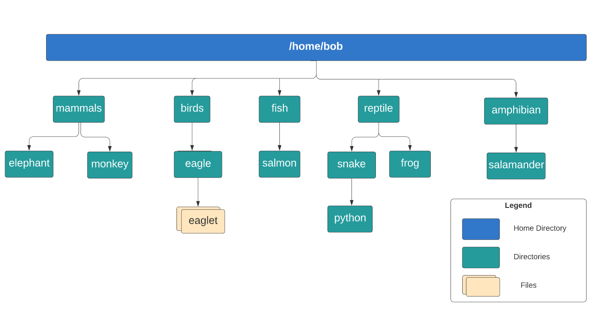

# Linux Laboratory

# WORKING WITH SHELL – I, LAB: WORKING WITH THE SHELL


1. What is the home directory for the user called `bob`?
   - /bob
   - /home
   - **/home/bob**
   - /root/bob

2. Which of the following commands will show you your home directory?

   If unsure, try out the commands in the terminal and find the answer!

   - cwd
   - id
   - **echo $HOME**
   - print_home

3. In the command `echo Welcome`, what does the word `Welcome` represent with respect to the command?
   - **argument**
   - command
   - switch
   - flag

4. What type of command is `git`?
   - **file**
   - function
   - internal
   - shell-builtin

   ```
   ~$ type git
   git is /usr/bin/git
   ```

   

5. Now, lets create some directories! Refer to the below diagram and create the directory called `birds`

   The home directory `/home/bob` already exists.

   Note: If the image is not clear, please right-click on the image and open it in a new tab.

   

   ```
   $ mkdir /home/bob/birds
   ```

6. Next, create the directories `/home/bob/fish/salmon`

   Use the `-p` option to create both directories in one go

   ```
   $ mkdir -p /home/bob/fish/salmon
   ```

7. Now create all the remaining directories as per the diagram below.

   ```
   mkdir -p /home/bob/mammals/elephant
   mkdir -p /home/bob/mammals/monkey
   mkdir /home/bob/birds/eagle
   mkdir -p /home/bob/reptile/snake
   mkdir -p /home/bob/reptile/frog
   mkdir -p /home/bob/amphibian/salamander
   ```

8. Moving along. Lets now move the directory called `frog` from `reptile` to the directory `amphibian`

   ```
   $ mv /home/bob/reptile/frog /home/bob/amphibian 
   
   $ ls -l /home/bob/reptile/
   total 4
   drwxrwxr-x 2 bob bob 4096 Dec 27 02:22 snake
   
   $ ls -l /home/bob/amphibian/
   total 8
   drwxrwxr-x 2 bob bob 4096 Dec 27 02:22 frog
   drwxrwxr-x 2 bob bob 4096 Dec 27 02:23 salamander
   bob@caleston-lp10:~$ 
   ```

9. Next, rename the directory `snake` to `crocodile`

   ```
   ~$ mv /home/bob/reptile/snake /home/bob/reptile/crocodile
   
   $ ls -l /home/bob/reptile/  
   total 4
   drwxrwxr-x 2 bob bob 4096 Dec 27 02:22 crocodile
   ```

10. Finally, delete the directory called `reptile` along with its contents.

   ```
   $ rm -r /home/bob/reptile 
   
   $ ls -l
   total 2520
   drwxrwxr-x 4 bob bob    4096 Dec 27 02:24 amphibian
   drwxrwxr-x 3 bob bob    4096 Dec 27 02:22 birds
   -rw-rw-r-- 1 bob bob 2557716 Apr 15  2020 caleston-code.tar.gz
   drwxrwxr-x 3 bob bob    4096 Dec 27 02:21 fish
   drwxrwxr-x 4 bob bob    4096 Dec 27 02:22 mammals
   drwxr-xr-x 1 bob bob    4096 Apr 15  2020 media
   ```

   

# WORKING WITH SHELL – I, LAB: LINUX BASH PROMPT

1. What is the default shell for `Bob`?

   - /bin/ksh
   - /bin/zsh
   - /bin/sh
   - /bin/bash

   ```
   $ echo $SHELL
   /bin/bash
   ```

2. Change the SHELL for Bob from `bash` to `Bourne Shell`

   Bob's password is `caleston123`

   **Note: -** Normal users can not execute the high-level tasks so add `sudo` before the command.

   ```
   $ sudo chsh -s /bin/sh bob
   ```

3. What is the value of the environment variable `TERM`?

   - terminal
   - **xterm-256color**
   - 1
   - xterm
   - xorg

   ```
   $ env 
   VISIBLE=now
   XDG_SESSION_ID=c1
   USER=bob
   PWD=/home/bob
   HOME=/home/bob
   MAIL=/var/mail/bob
   SHELL=/bin/bash
   TERM=xterm-256color
   SHLVL=1
   LOGNAME=bob
   XDG_RUNTIME_DIR=/run/user/1000
   PATH=/home/bob/.local/bin:/home/bob/.local/bin:/usr/local/sbin:/usr/local/bin:/usr/sbin:/usr/bin:/sbin:/bin:/usr/games:/usr/local/games
   _=/usr/bin/env
   
   OR
   
   $ echo $TERM
   xterm-256color
   ```

4. Create a new environment variable called `PROJECT=MERCURY` and make it persistent by adding the variable to the `~/.profile` file.

   ```
   $ export PROJECT=MERCURY
   
   # and add the value to the .profile by running 
   $ echo 'export PROJECT=MERCURY' >> /home/bob/.profile
   ```

5. Which of the following directories is not part of the PATH variable?

   - /sbin
   - /bin
   - **/opt/caleston-code**
   - /usr/bin

   ```
   $ echo $PATH
   /home/bob/.local/bin:/home/bob/.local/bin:/usr/local/sbin:/usr/local/bin:/usr/sbin:/usr/bin:/sbin:/bin:/usr/games:/usr/local/games
   ```

   

6. Set an alias called `up` for the command `uptime` and make it persistent by adding to `~/.profile` file.

   ```
   $ alias up=uptime
   
   $ echo 'alias up=uptime' >> .profile
   ```

7. Update Bob's prompt so that it displays the `date` as per the format below:

   Example: [Wed Apr 22]bob@caleston-lp10:~$
   Make sure the change is made persistent.

   ```
   $ PS1='[\d]\u@\h:\w$' 
   
   # and add this to the ~/.profile file 
   $ echo 'PS1="[\d]\u@\h:\w$"' >> ~/.profile
   ```


# LINUX CORE CONCEPTS, LAB: LINUX KERNEL

1. What is the exact `version` of kernel running in this system?

   - 4.15.72.0-generic
   - 4.2.3.2.0
   - 5.5.2.0-generic
   - **5.4.0-1093-gcp**

   ```
   $ uname -r
   5.4.0-1093-gcp
   ```

2. What is the `Kernel Version` in `4.15.0-88-generic`?

   - 0
   - **4**
   - generic
   - 15

   Look for the first digit in the version. In this case, it is `4`.

3. What is the `major` version number of the kernel `4.15.0-88-generic`?

   - **15**
   - generic
   - 4
   - 0

   Look for the second digit after the kernel version separated by a dot(`.`). In this case, it is 15.

4. Which command would you run to print the messages generated by the kernel?

   - echo $kernel
   - show kernel_messages
   - **dmesg**
   - display_messages

5. How many `block devices` of type `disk` are present in the system?

   - 0
   - 6
   - 3
   - 2
   - **1**

Run: `lsblk` and count the number of `disk` devices.

```
$ lsblk 
lsblk: /proc/swaps: parse error at line 1 -- ignored
NAME    MAJ:MIN RM   SIZE RO TYPE MOUNTPOINT
loop0     7:0    0  49.6M  1 loop 
loop1     7:1    0  55.6M  1 loop 
loop2     7:2    0  55.6M  1 loop 
loop3     7:3    0 303.9M  1 loop 
loop4     7:4    0 303.4M  1 loop 
sda       8:0    0   500G  0 disk 
|-sda1    8:1    0 499.9G  0 part /etc/hosts
|-sda14   8:14   0     4M  0 part 
`-sda15   8:15   0   106M  0 part 
```


# LINUX CORE CONCEPTS, LAB: LINUX KERNEL MODULES BOOT AND FILETYPES

1. Going forward, you would need to make use of `sudo` for running several commands.
   In such cases, run `sudo` before the command.
   Example: `sudo ls /root`

   Bob's password is `caleston123`

2. What is the `init process` used by this system?

   Bob's password is `caleston123`

   - **systemd**
   - sysV
   - init
   - upstart

   ```
   $ sudo ls -l /sbin/init
   lrwxrwxrwx 1 root root 20 Feb  6  2020 /sbin/init -> /lib/systemd/systemd
   ```

3. What is the `default systemd target` set in this system?

   Bob's password is `caleston123`

   - **graphical.target**
   - multi-user.target
   - poweroff.target
   - Run Level 6

   ```
   $ sudo systemctl get-default
   graphical.target
   ```

4. Now, change the target to `multi-user.target`

   Bob's password is `caleston123`

   ```
   $ sudo systemctl set-default multi-user.target
   Created symlink /etc/systemd/system/default.target → /lib/systemd/system/multi-user.target.
   
   $ sudo systemctl get-default
   multi-user.target
   ```

5. What type of file is `firefox.deb` located at `/root`?

   Bob's password is `caleston123`

   - Directory
   - **Debian binary package file**
   - Data File
   - Shell Script

   ```
   $ sudo file /root/firefox.deb
   /root/firefox.deb: Debian binary package (format 2.0)
   ```

6. What type of file is `sample_script.sh` located at `/root`?

   Bob's password is `caleston123`

   - Socket File
   - Data File
   - Sample File
   - **Bash Shell Script**
   - Debian Package file

   ```
   $ sudo file /root/sample_script.sh
   /root/sample_script.sh: Bourne-Again shell script, ASCII text executable
   ```

7. You are asked to install a new `third-party IDE (integrated development environment )` in the system.

   Which directory is the recommended choice for the installation?

   Bob's password is `caleston123`

   - **/opt**
   - /root
   - /home/bob
   - /var

   Third-party software is usually installed under `/opt`

8. Which directory contains the files related to the block devices that can be seen when running the `lsblk` command?

   Bob's password is `caleston123`

   - /block_devices
   - /media
   - /mount
   - **/dev**
   - /devices

   `Block Device` or `Device Node` files are located under `/dev` directory

9. What is the name of the `vendor` for the `Ethernet Controller` used in this system?

   Bob's password is `caleston123`

   - **Red Hat, Inc.**
   - Cisco Systems
   - Huawei, Inc.
   - Juniper Networks
   - F5 BigIP

   ```
   $ sudo lshw | grep -a network
           *-network           
                product: Virtio network device
     *-network:0
     *-network:1
     *-network:2
   bob@caleston-lp10:~$ sudo lshw | grep -A 10 -a network
           *-network           
                description: Ethernet controller
                product: Virtio network device
                vendor: Red Hat, Inc.
                physical id: 4
                bus info: pci@0000:00:04.0
                version: 00
                width: 32 bits
                clock: 33MHz
                capabilities: bus_master cap_list
                configuration: driver=virtio-pci latency=0
                resources: irq:10 ioport:c000(size=64) memory:c0000000-c00007ff
              *-virtio1 UNCLAIMED
   ```

   

# PACKAGE MANAGEMENT, LAB: YUM AND RPM

1. This is a hands-on lab to work on RPM and YUM.
   Since Bob's laptop is running `Ubuntu`, Dave has offered one of his lab machines that runs `Centos 7`

   To access this Server, run `ssh centos-lab`, Bob's default password is: `caleston123`
   To exit from the server, type `logout` or `exit` on the terminal.

2. Which of the following package managers would you use on this machine `(centos-lab)`?

   To access the `centos-lab` server, run `ssh centos-lab` and `Bob's` default password is: `caleston123`.

   ```sh
   bob@caleston-lp10:~$ ssh centos-lab
   ```

   To exit from the server, type `logout` or `exit` on the terminal.

   - dpkg,apt
   - apt-get
   - **yum,rpm**
   - dpkg
   - apt

3. Use an `rpm` command and find out the exact package name for `wget` installed in this server `(centos-lab)`.

   To access the `centos-lab` server, run `ssh centos-lab` and `Bob's` default password is: `caleston123`.

   ```sh
   bob@caleston-lp10:~$ ssh centos-lab
   ```

   To exit from the server, type `logout` or `exit` on the terminal.

   - **wget-1.14-18.el7_6.1.x86_64**
   - wget-1.0-1.el7_6.1.x86_64
   - wget-1.14-18.el7_7.1.x86_64
   - wget-1.10-12.el7_6.1.x86_64

   ```
   $ rpm -qa | grep wget
   wget-1.14-18.el7_6.1.x86_64
   ```

4. The package for the `firefox` browser has been downloaded under `/home/bob` in the `centos-lab` server.
   Try to install it using `RPM`.

   To access the `centos-lab` server, run `ssh centos-lab` and `Bob's` default password is: `caleston123`.

   ```sh
   bob@caleston-lp10:~$ ssh centos-lab
   ```

   To exit from the server, type `logout` or `exit` on the terminal.

   ```
   $ sudo rpm -ivh /home/bob/firefox-68.6.0-1.el7.centos.x86_64.rpm
   ```

5. Was the installation successful?

   - **No**
   - Yes

6. Why did it fail?

   - File Corrupted
   - **Dependencies not met**
   - Firefox already installed
   - No Permission to Install

   ```
   $ sudo rpm -ivh /home/bob/firefox-68.6.0-1.el7.centos.x86_64.rpm
   error: Failed dependencies:
           liberation-fonts-common is needed by firefox-68.6.0-1.el7.centos.x86_64
           liberation-sans-fonts is needed by firefox-68.6.0-1.el7.centos.x86_64
           mozilla-filesystem is needed by firefox-68.6.0-1.el7.centos.x86_64
           nspr >= 4.21 is needed by firefox-68.6.0-1.el7.centos.x86_64
           nss >= 3.44 is needed by firefox-68.6.0-1.el7.centos.x86_64
           redhat-indexhtml is needed by firefox-68.6.0-1.el7.centos.x86_64
           libatk-1.0.so.0()(64bit) is needed by firefox-68.6.0-1.el7.centos.x86_64
           libcairo-gobject.so.2()(64bit) is needed by firefox-68.6.0-1.el7.centos.x86_64
           libcairo.so.2()(64bit) is needed by firefox-68.6.0-1.el7.centos.x86_64
           libfontconfig.so.1()(64bit) is needed by firefox-68.6.0-1.el7.centos.x86_64
           libfreetype.so.6()(64bit) is needed by firefox-68.6.0-1.el7.centos.x86_64
           libgdk-3.so.0()(64bit) is needed by firefox-68.6.0-1.el7.centos.x86_64
           libgdk_pixbuf-2.0.so.0()(64bit) is needed by firefox-68.6.0-1.el7.centos.x86_64
           libgdk-x11-2.0.so.0()(64bit) is needed by firefox-68.6.0-1.el7.centos.x86_64
           libgtk-3.so.0()(64bit) is needed by firefox-68.6.0-1.el7.centos.x86_64
           libgtk-x11-2.0.so.0()(64bit) is needed by firefox-68.6.0-1.el7.centos.x86_64
           libpango-1.0.so.0()(64bit) is needed by firefox-68.6.0-1.el7.centos.x86_64
           libpangocairo-1.0.so.0()(64bit) is needed by firefox-68.6.0-1.el7.centos.x86_64
           libpangoft2-1.0.so.0()(64bit) is needed by firefox-68.6.0-1.el7.centos.x86_64
           libstartup-notification-1.so.0()(64bit) is needed by firefox-68.6.0-1.el7.centos.x86_64
           libX11.so.6()(64bit) is needed by firefox-68.6.0-1.el7.centos.x86_64
           libX11-xcb.so.1()(64bit) is needed by firefox-68.6.0-1.el7.centos.x86_64
           libxcb-shm.so.0()(64bit) is needed by firefox-68.6.0-1.el7.centos.x86_64
           libxcb.so.1()(64bit) is needed by firefox-68.6.0-1.el7.centos.x86_64
           libXcomposite.so.1()(64bit) is needed by firefox-68.6.0-1.el7.centos.x86_64
           libXcursor.so.1()(64bit) is needed by firefox-68.6.0-1.el7.centos.x86_64
           libXdamage.so.1()(64bit) is needed by firefox-68.6.0-1.el7.centos.x86_64
           libXext.so.6()(64bit) is needed by firefox-68.6.0-1.el7.centos.x86_64
           libXfixes.so.3()(64bit) is needed by firefox-68.6.0-1.el7.centos.x86_64
           libXi.so.6()(64bit) is needed by firefox-68.6.0-1.el7.centos.x86_64
           libXrender.so.1()(64bit) is needed by firefox-68.6.0-1.el7.centos.x86_64
           libXt.so.6()(64bit) is needed by firefox-68.6.0-1.el7.centos.x86_64
   ```

7. Let's use YUM to install the `firefox` on the `centos-lab` server.

   To access the `centos-lab` server, run `ssh centos-lab` and `Bob's` default password is: `caleston123`.

   ```sh
   bob@caleston-lp10:~$ ssh centos-lab
   ```

   To exit from the server, type `logout` or `exit` on the terminal.

   ```
   sudo yum install firefox -y
   ```

8. How many `software repositories` are configured for `YUM` in the `centos-lab` server?

   To access the `centos-lab` server, run `ssh centos-lab` and `Bob's` default password is: `caleston123`.

   ```sh
   bob@caleston-lp10:~$ ssh centos-lab
   ```

   To exit from the server, type `logout` or `exit` on the terminal.

   - 5
   - 0
   - 6
   - 2
   - **3**

   ```
   $ sudo yum repolist
   Loaded plugins: fastestmirror, ovl
   Loading mirror speeds from cached hostfile
    * base: linux-mirrors.fnal.gov
    * extras: ftpmirror.your.org
    * updates: mirrors.liquidweb.com
   repo id                                       repo name                                        status
   base/7/x86_64                                 CentOS-7 - Base                                  10,072
   extras/7/x86_64                               CentOS-7 - Extras                                   515
   updates/7/x86_64                              CentOS-7 - Updates                                4,538
   repolist: 15,125
   ```

9. Which package provides the `tcpdump` command on the `centos-lab` server?

   To access the `centos-lab` server, run `ssh centos-lab` and `Bob's` default password is: `caleston123`.

   ```sh
   bob@caleston-lp10:~$ ssh centos-lab
   ```

   To exit from the server, type `logout` or `exit` on the terminal.

   - net-tool
   - stcp-utils
   - **tcpdump-4.9.2-4.el7_7.1.x86_64**
   - wireshark

   ```
   $ sudo yum provides tcpdump
   Loaded plugins: fastestmirror, ovl
   Loading mirror speeds from cached hostfile
    * base: linux-mirrors.fnal.gov
    * extras: ftpmirror.your.org
    * updates: mirrors.liquidweb.com
   14:tcpdump-4.9.2-4.el7_7.1.x86_64 : A network traffic monitoring tool
   Repo        : base
   ```

   

   # PACKAGE MANAGEMENT, LAB – DPKG AND APT

1. This lab requires several commands to be run as the `root` user. Always use sudo.

   Bob's default password is `caleston123`

2. Which of the following package managers would you use on a `debian` based distro?

   - rpm
   - yum
   - **dpkg**

3. The package for `firefox` browser has been downloaded at `/root/firefox.deb`.

   Try to install it using `sudo dpkg -i`

   ```
   $ sudo dpkg -i /root/firefox.deb
   ```

4. Was the installation successful ?

   - Yes
   - **No**

5. Why did it fail?

   - No Permission to Install
   - File Corrupted
   - **Dependencies not met**
   - Firefox already installed

6. Let's use apt to install it `firefox`.

   Bob's default password is `caleston123`

   ```
   $ sudo apt install firefox
   ```

7. Lets now locate the package to install `Chromium` browser in the system.

   Use `apt search` functionality to locate the correct package name.
   The browser has the description of: `Chromium web browser, open-source version of Chrome`
   What is the correct package name?

   - chrome-browser
   - chromium-browser-l10n
   - chromium
   - **chromium-browser**

   ```
   $ apt search Chromium
   Sorting... Done
   Full Text Search... Done
   cgpt/bionic 0~R63-10032.B-3 amd64
     GPT manipulation tool with support for Chromium OS extensions
   
   chromium-browser/bionic-updates,bionic-security 108.0.5359.71-0ubuntu0.18.04.5 amd64
     Chromium web browser, open-source version of Chrome
   ```

8. Finally, remove the `firefox` browser from the system.

   ```
   $ sudo apt remove firefox
   ```


# WORKING WITH SHELL – II, LAB: WORKING WITH SHELL II

1. Going forward, you would need to make use of `sudo` for running several commands.
   In such cases, run `sudo` before the command.
   Example: `sudo ls /root`

   Bob's password is `caleston123`

2. Remember the directory structure from before? We have added a few more files and directories so that the structure looks like the diagram below.

   Create a tarball of the directory called `python` and compress it using `gzip`. The compressed tar file should be available at `/home/bob/python.tar.gz`

   

```
$ tar -cvzf python.tar.gz /home/bob/reptile/snake/python 

OR 

$ tar -cf /home/bob/python.tar /home/bob/reptile/snake/python
gzip /home/bob/python.tar

```

3. There is a compressed file called `eaglet.dat.gz` located under the `eagle` directory. Extract it in the same location.

   ```
   $ gunzip /home/bob/birds/eagle/eaglet.dat.gz
   ```

4. A file called `caleston-code` has been copied somewhere inside the `/opt` directory. But, Bob does not remember which directory he saved it in.

   Can you `find` it?

   Bob's password is `caleston123`

   - /opt/caleston-code-directory
   - /opt/test/caleston-code-directory
   - /opt/caleston-code
   - **/opt/test/test123/caleston/**

   ```
   $ sudo find /opt -name caleston-code
   [sudo] password for bob: 
   /opt/test/test123/caleston/caleston-code
   ```

5. Find the location of the file called `dummy.service` under `/etc` filesystem and redirect its absolute path to the file `/home/bob/dummy-service`

   You can use the `redirect` operator with the `echo` command to save the answer to the file.
   Bob's password is `caleston123`.

   ```
   $ sudo find /etc -name dummy.service
   
   $ echo /etc/systemd/system/dummy.service > /home/bob/dummy-service
   ```

6. Find the file under `/etc` directory that contains the string `172.16.238.197`. Save the answer using the absolute path in the file `/home/bob/ip`

   Bob's password is `caleston123`

   ```
   $ sudo grep -ir 172.16.238.197 /etc/ > /home/bob/ip
   ```

7. Create a new file called `/home/bob/file_with_data.txt`. This file should have one line of text that says `a file in my home directory`.

   Make use of the redirect operator.

   ```
   $ echo "a file in my home directory" > /home/bob/file_with_data.txt
   ```

8. Run the command `python3 /home/bob/my_python_test.py` and redirect the standard error to the file `/home/bob/py_error.txt`

   Bob's password is `caleston123`

   ```
   $ python3 /home/bob/my_python_test.py >> /home/bob/py_error.txt
   ```

9. Read the file `/usr/share/man/man1/tail.1.gz` and without extracting it and redirect the contents to a file called `/home/bob/pipes`

   ```
   $ zcat /usr/share/man/man1/tail.1.gz | tee /home/bob/pipes
   ```


# NETWORKING, LAB: DNS

1. What is the IP address of the `DNS Server` used in this system?-

   - 127.0.0.1
   - 172.16.239.1
   - 172.16.238.1
   - **127.0.0.11**

   ```
   $ cat /etc/resolv.conf 
   search caleston.ca
   nameserver 127.0.0.11
   options ndots:0
   ```

2. Which file is responsible for host file-based DNS resolution?

   - /etc/passwd
   - /etc/fstab
   - /etc/resolv.conf
   - **/etc/hosts**

3. What is the configuration file used for the DNS Server?

   - /etc/dns/dns.conf
   - **/etc/resolv.conf**
   - /etc/hostfile
   - /etc/hosts

4. Change the DNS Server to google's DNS which is `8.8.8.8`

   `bob's` password is `caleston123`.

   ```
   $ sudo vi /etc/resolv.conf
   ```

   ```
   search caleston.ca
   nameserver 8.8.8.8 
   options ndots:0
   ```

5. Which order is used currently to resolve an IP address in the system?

   Check the nsswitch.conf file

   - DNS Server then /etc/hosts file
   - /etc/hosts file alone
   - **/etc/hosts file then DNS Server**
   - DNS Server alone

   ```
   $ grep hosts /etc/nsswitch.conf
   hosts:          files dns
   ```

6. Change the order to `DNS` first and then hosts.

   Update `/etc/nsswitch.conf` and change the line to `hosts: dns files`

   Edit /etc/nsswitch.conf

   ```
   # /etc/nsswitch.conf
   #
   # Example configuration of GNU Name Service Switch functionality.
   # If you have the `glibc-doc-reference' and `info' packages installed, try:
   # `info libc "Name Service Switch"' for information about this file.
   
   passwd:         compat systemd
   group:          compat systemd
   shadow:         compat
   gshadow:        files
   
   hosts:          dns files 
   networks:       files
   
   protocols:      db files
   services:       db files
   ethers:         db files
   rpc:            db files
   
   netgroup:       nis
   ```

7. Which `search domain` is configured in this system ?

   Inspect the DNS configuration file.

   - **caleston.ca**
   - caleston.org
   - caleston.com
   - caleston.co.za

   Check for the `search` domain in `/etc/resolv.conf`. It is set to `caleston.ca`'

   ```
   $ cat /etc/resolv.conf 
   search caleston.ca
   nameserver 8.8.8.8 
   options ndots:0
   ```


# NETWORKING, LAB: NETWORK BASICS

1. What is the `IP Address` assigned to Bob's Laptop?

   - 172.16.239.230
   - 172.16.239.10
   - **172.16.238.187,172.16.239.187**
   - 172.16.238.18

   ```
   $ ip add
   1: lo: <LOOPBACK,UP,LOWER_UP> mtu 65536 qdisc noqueue state UNKNOWN group default qlen 1000
       link/loopback 00:00:00:00:00:00 brd 00:00:00:00:00:00
       inet 127.0.0.1/8 scope host lo
          valid_lft forever preferred_lft forever
   14: eth0@if15: <BROADCAST,MULTICAST,UP,LOWER_UP> mtu 1500 qdisc noqueue state UP group default 
       link/ether 02:42:ac:10:ee:bb brd ff:ff:ff:ff:ff:ff link-netnsid 0
       inet 172.16.238.187/24 brd 172.16.238.255 scope global eth0
          valid_lft forever preferred_lft forever
   18: eth1@if19: <BROADCAST,MULTICAST,UP,LOWER_UP> mtu 1500 qdisc noqueue state UP group default 
       link/ether 02:42:ac:10:ef:bb brd ff:ff:ff:ff:ff:ff link-netnsid 0
       inet 172.16.239.187/24 brd 172.16.239.255 scope global eth1
          valid_lft forever preferred_lft forever
   20: eth2@if21: <BROADCAST,MULTICAST,UP,LOWER_UP> mtu 1500 qdisc noqueue state UP group default 
       link/ether 02:42:ac:11:00:04 brd ff:ff:ff:ff:ff:ff link-netnsid 0
       inet 172.17.0.4/16 brd 172.17.255.255 scope global eth2
          valid_lft forever preferred_lft forever
   ```

2. What is the name of the interface that has this IP (from the previous question) address assigned?

   - ens0
   - ens1
   - eth2
   - **eth0,eth1**

3. What is the `default` gateway configured in the system?

   - 172.16.239.187
   - **172.16.238.1**
   - 172.16.238.187
   - 172.16.239.1'

   ```
   $ ip route
   default via 172.16.238.1 dev eth0 
   172.16.238.0/24 dev eth0 proto kernel scope link src 172.16.238.187 
   172.16.239.0/24 dev eth1 proto kernel scope link src 172.16.239.187 
   172.17.0.0/16 dev eth2 proto kernel scope link src 172.17.0.4 
   ```

4. We have an apache which should be accessible on `devapp01-web`.
   This server runs on `port 80` on the server and should be accessible from Bob's laptop.

5. However, something seems to be wrong with the network!
   Check if you are able to connect to the HTTP `port 80` on the server `devapp01-web` from Bob's laptop?

   Run a Telnet port 80 on `devapp01-web` to test.

   - NO
   - **YES**

   ```
   $ telnet devapp01-web 80
   Trying 172.16.238.10...
   Connected to devapp01-web.
   Escape character is '^]'.
   ```

6. Are you able to ping `devapp01-web` server?

   - NO
   - **YES**

   ```
   ~$ sudo ping devapp01-web
   [sudo] password for bob: 
   PING devapp01-web (172.16.238.10): 56 data bytes
   64 bytes from 172.16.238.10: icmp_seq=0 ttl=64 time=0.057 ms
   64 bytes from 172.16.238.10: icmp_seq=1 ttl=64 time=0.053 ms
   64 bytes from 172.16.238.10: icmp_seq=2 ttl=64 time=0.050 ms
   ```

7. Luckily, this webserver has two interfaces. The second interface is on another network and is identified by the name `devapp01`. Check if you are able to ping `devapp01`

   Is ping working now?

   - NO
   - **YES**

   ```
   $ sudo ping devapp01
   PING devapp01 (172.16.239.10): 56 data bytes
   64 bytes from 172.16.239.10: icmp_seq=0 ttl=64 time=0.093 ms
   64 bytes from 172.16.239.10: icmp_seq=1 ttl=64 time=0.051 ms
   64 bytes from 172.16.239.10: icmp_seq=2 ttl=64 time=0.051 ms
   ```

8. Let's troubleshoot from the other end. SSH to the `webserver` by running `ssh devapp01`

   Use Bob's default password: `caleston123`

9. Inspect the interface eth0 on `devapp01`, is it UP?

   - YES
   - **NO**

   ```
   ~$ ip link
   1: lo: <LOOPBACK,UP,LOWER_UP> mtu 65536 qdisc noqueue state UNKNOWN mode DEFAULT group default qlen 1000
       link/loopback 00:00:00:00:00:00 brd 00:00:00:00:00:00
   10: eth0@if11: <BROADCAST,MULTICAST> mtu 1500 qdisc noqueue state DOWN mode DEFAULT group default 
       link/ether 02:42:ac:10:ee:0a brd ff:ff:ff:ff:ff:ff link-netnsid 0
   16: eth1@if17: <BROADCAST,MULTICAST,UP,LOWER_UP> mtu 1500 qdisc noqueue state UP mode DEFAULT group default 
       link/ether 02:42:ac:10:ef:0a brd ff:ff:ff:ff:ff:ff link-netnsid 0
   22: eth2@if23: <BROADCAST,MULTICAST,UP,LOWER_UP> mtu 1500 qdisc noqueue state UP mode DEFAULT group default 
       link/ether 02:42:ac:11:00:05 brd ff:ff:ff:ff:ff:ff link-netnsid 0
   ```

10. Bring up the eth0 interface

    ```
    $ sudo ip link set dev eth0 up
    ```

11. While we are at it, there is also a missing `default route` on the server `devapp01`.

    Add the default route via eth0 gateway.

    ```
    $ sudo ip route add default via 172.16.238.1
    
    $ ip route
    default via 172.16.238.1 dev eth0 
    172.16.238.0/24 dev eth0 proto kernel scope link src 172.16.238.10 
    172.16.239.0/24 dev eth1 proto kernel scope link src 172.16.239.10 
    172.17.0.0/16 dev eth2 proto kernel scope link src 172.17.0.5 
    ```


# 


   


