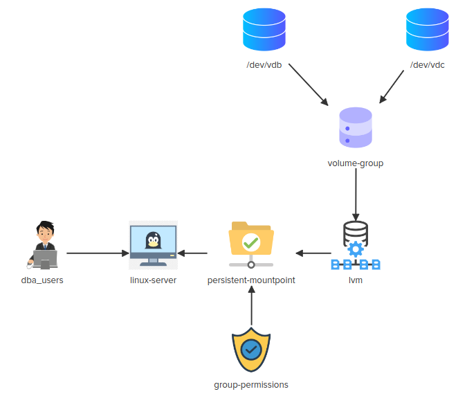
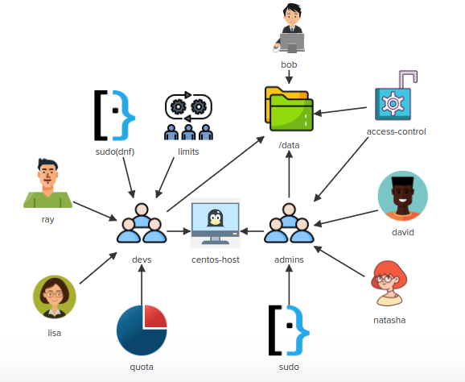
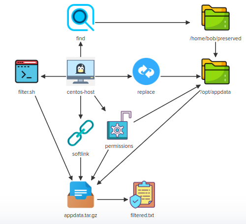

# CHALLENGE 1, LINUX CHALLENGE 1



## 

The database server called `centos-host` is running short on space! You have been asked to add an LVM volume for the Database team using some of the existing disks on this server.

Inspect the requirements in detail by clicking on the icons of the interactive architecture diagram on the right and complete the tasks. Once done click on the `Check` button to validate your work.

Check

## Linux Server

- Install the correct packages that will allow the use of "lvm" on the centos machine.

```
$ sudo yum install -y lvm2
```


## dba_users

- Create a group called "dba_users" and add the user called 'bob' to this group.

```
$ sudo groupadd dba_users

$ sudo grep dba_users /etc/group
dba_users:x:1003:

$ sudo usermod -G dba_users bob 

$ sudo grep dba_users /etc/group
dba_users:x:1003:bob
```


## /dev/vdb

- Create a Physical Volume for "/dev/vdb"

```
$ sudo pvcreate /dev/vdb 
  Physical volume "/dev/vdb" successfully created.
```


## /dev/vdc

- Create a Physical Volume for "/dev/vdc"

```
$ sudo pvcreate /dev/vdc
  Physical volume "/dev/vdc" successfully created.
```

```
$ sudo pvs
  PV         VG Fmt  Attr PSize PFree
  /dev/vdb      lvm2 ---  1.00g 1.00g
  /dev/vdc      lvm2 ---  1.00g 1.00g
  

$ sudo pvdisplay 
  "/dev/vdb" is a new physical volume of "1.00 GiB"
  --- NEW Physical volume ---
  PV Name               /dev/vdb
  VG Name               
  PV Size               1.00 GiB
  Allocatable           NO
  PE Size               0   
  Total PE              0
  Free PE               0
  Allocated PE          0
  PV UUID               wv3wB7-xZVU-Xnb6-xiyY-2Lbj-zjbU-k2HcT0
   
  "/dev/vdc" is a new physical volume of "1.00 GiB"
  --- NEW Physical volume ---
  PV Name               /dev/vdc
  VG Name               
  PV Size               1.00 GiB
  Allocatable           NO
  PE Size               0   
  Total PE              0
  Free PE               0
  Allocated PE          0
  PV UUID               kVWKHP-9YZE-C1Fy-h6oo-XLmy-IMFm-hsNuiU
```


## volume-group

- Create a volume group called "dba_storage" using the physical volumes "/dev/vdb" and "/dev/vdc"

```
$ sudo vgcreate dba_storage /dev/vdb /dev/vdc
  Volume group "dba_storage" successfully created
```

```
$ sudo vgs
  VG          #PV #LV #SN Attr   VSize VFree
  dba_storage   2   0   0 wz--n- 1.99g 1.99g

$ sudo vgdisplay 
  --- Volume group ---
  VG Name               dba_storage
  System ID             
  Format                lvm2
  Metadata Areas        2
  Metadata Sequence No  1
  VG Access             read/write
  VG Status             resizable
  MAX LV                0
  Cur LV                0
  Open LV               0
  Max PV                0
  Cur PV                2
  Act PV                2
  VG Size               1.99 GiB
  PE Size               4.00 MiB
  Total PE              510
  Alloc PE / Size       0 / 0   
  Free  PE / Size       510 / 1.99 GiB
  VG UUID               1JJRiv-bilI-coYB-1Ocr-Hh43-KwPN-tTSn61
```


## lvm

- Create an "lvm" called "volume_1" from the volume group called "dba_storage". Make use of the entire space available in the volume group.

```
$ sudo lvcreate -n volume_1 -l 100%FREE dba_storage
  Logical volume "volume_1" created.
```

```
$ sudo lvs
  LV       VG          Attr       LSize Pool Origin Data%  Meta%  Move Log Cpy%Sync Convert
  volume_1 dba_storage -wi-a----- 1.99g                                                    
$ sudo lvdisplay 
  --- Logical volume ---
  LV Path                /dev/dba_storage/volume_1
  LV Name                volume_1
  VG Name                dba_storage
  LV UUID                7GEjRk-GC7v-66Gu-hjjo-idcN-cvmT-D2Xcim
  LV Write Access        read/write
  LV Creation host, time centos-host, 2022-12-30 03:59:21 +0000
  LV Status              available
  # open                 0
  LV Size                1.99 GiB
  Current LE             510
  Segments               2
  Allocation             inherit
  Read ahead sectors     auto
  - currently set to     8192
  Block device           252:0
```


## persistent-mountpoint

- Format the lvm volume "volume_1" as an "XFS" filesystem

  ```
  $ sudo mkfs.xfs /dev/dba_storage/volume_1
  meta-data=/dev/dba_storage/volume_1 isize=512    agcount=4, agsize=130560 blks
           =                       sectsz=512   attr=2, projid32bit=1
           =                       crc=1        finobt=1, sparse=1, rmapbt=0
           =                       reflink=1
  data     =                       bsize=4096   blocks=522240, imaxpct=25
           =                       sunit=0      swidth=0 blks
  naming   =version 2              bsize=4096   ascii-ci=0, ftype=1
  log      =internal log           bsize=4096   blocks=2560, version=2
           =                       sectsz=512   sunit=0 blks, lazy-count=1
  realtime =none                   extsz=4096   blocks=0, rtextents=0
  ```

  

- Mount the filesystem at the path "/mnt/dba_storage".

  ```
  $ sudo mkdir -p /mnt/dba_storage
  
  $ sudo mount -t xfs /dev/dba_storage/volume_1 /mnt/dba_storage
  ```

  

- Make sure that this mount point is persistent across reboots with the correct default options.

  ```
  vi /etc/fstab
  ```

  Add the following line to the end of the file and save.

  ```
  /dev/mapper/dba_storage-volume_1 /mnt/dba_storage xfs defaults 0 0
  ```

## group-permission

- Ensure that the mountpoint "/mnt/dba_storage" has the group ownership set to the "dba_users" group

  ```
  $ sudo chown :dba_users /mnt/dba_storage
  ```

- Ensure that the mount point "/mnt/dba_storage" has "read/write" and execute permissions for the owner and group and no permissions for anyone else.

  ```
  $ chmod 770 /mnt/dba_storage
  ```


## Automate the entire lab in a single script!

Pretty much everything done above, in the same order. We automate the `vi` step by using the append redirection to `/etc/fstab`

Single Script Automation

```bash
{
# Start lab and paste this entire script to the command prompt.
# When it completes, press the check button.
sudo -i

## Install lvm

yum install -y lvm2

## dba_users

# Create group
groupadd dba_users
# Add bob
usermod -G dba_users bob

## Create PVs

pvcreate /dev/vdb
pvcreate /dev/vdc

## Create VG

vgcreate dba_storage /dev/vdb /dev/vdc

## Create LVM

lvcreate -n volume_1 -l 100%FREE dba_storage

## Persistent mountpoint

# Format
mkfs.xfs /dev/dba_storage/volume_1
# Mount
mkdir -p /mnt/dba_storage
mount -t xfs /dev/dba_storage/volume_1 /mnt/dba_storage
# Make persistent
echo "/dev/mapper/dba_storage-volume_1 /mnt/dba_storage xfs defaults 0 0" >> /etc/fstab
# Ensure that the mountpoint "/mnt/dba_storage" has the group ownership set to the "dba_users" group
chown :dba_users /mnt/dba_storage
# Ensure that the mount point "/mnt/dba_storage" has "read/write" and execute permissions for the owner and group and no permissions for anyone else.
chmod 770 /mnt/dba_storage
}
```


# CHALLENGE 2, LINUX CHALLENGE 2


The app server called `centos-host` is running a `Go app` on the `8081` port. You have been asked to troubleshoot some issues with `yum/dnf` on this system, Install `Nginx` server, configure Nginx as a `reverse proxy` for this Go app, install `firewalld` package and then configure some `firewall rules`.

Inspect the requirements in detail by clicking on the icons of the interactive architecture diagram on the right and complete the tasks. Once done click on the `Check` button to validate your work.


## Packages

Fix DNS resolution

```
vi /etc/resolv.conf
```

Add Google nameserver as the first line in the file and save

```
nameserver 8.8.8.8
```

- Install "nginx" package.
- Install "firewalld" package.

```
yum install -y nginx

yum install -y firewalld
```


## Security

Start and Enable "firewalld" service


```bash
systemctl enable firewalld
systemctl start firewalld
```

Add firewall rules to allow only incoming port "22", "80" and "8081"
The firewall rules must be permanent and effective immediately.

Add firewall rules, make permanent and effective.


```bash
firewall-cmd --zone=public --add-port=80/tcp --permanent
firewall-cmd --zone=public --add-port=8081/tcp --permanent
firewall-cmd --zone=public --add-port=22/tcp --permanent
firewall-cmd --reload
```

## Go App

Start GoApp by running the "nohup go run main.go &" command from "/home/bob/go-app/" directory

```bash
pushd /home/bob/go-app
nohup go run main.go &
popd
```

You can use the following to determine when the go app is fully started. Re-run it periodically till the grep returns a match.

Check go app is running

```bash
ps -faux | grep -P '/tmp/go-build\d+/\w+/exe/main'
```


## Nginx

Configure Nginx as a reverse proxy for the GoApp so that we can access the GoApp on port "80"

```
vi /etc/nginx/nginx.conf
```

At line 48 insert the following line after `location / {`

```
            proxy_pass  http://localhost:8081;
```

Start and Enable "nginx" service

```
systemctl enable nginx
systemctl start nginx
```

## Automate the entire lab in a single script!

Pretty much everything done above, in the same order. We automate the `vi` steps by using `sed` to do the insertions into `resolv.conf` and `nginx.conf` and we automate Bob's login using `curl`

Single Script Automation

```bash
# Start lab and paste this entire script to the command prompt.
# When it completes, press the check button.
sudo -i

#################################
#
# Centos Host
#
#################################

## Fix yum DNS errors by inserting google nameserver
# Can't use sed -i here as we get "Device or resource busy"
sed '1inameserver 8.8.8.8' /etc/resolv.conf > /tmp/resolv.conf
# Can't use cp or mv for the same reason
cat  /tmp/resolv.conf > /etc/resolv.conf

#################################
#
# Packages
#
#################################

yum install -y nginx firewalld

#################################
#
# Security
#
#################################

# Start and Enable "firewalld" service.
systemctl enable firewalld
systemctl start firewalld
# Add firewall rules to allow only incoming port "22", "80" and "8081" and make permanent
firewall-cmd --zone=public --add-port=80/tcp --permanent
firewall-cmd --zone=public --add-port=8081/tcp --permanent
firewall-cmd --zone=public --add-port=22/tcp --permanent
firewall-cmd --reload

#################################
#
# GoApp
#
#################################

# Start GoApp by running the "nohup go run main.go &" command from "/home/bob/go-app/" directory
pushd /home/bob/go-app
nohup go run main.go &

# Wait for it to be running (usually 15-20 seconds as it has to compile first)
while ! ps -faux | grep -P '/tmp/go-build\d+/\w+/exe/main'
do
    sleep 2
done
sleep 2
popd

#################################
#
# Nginx
#
#################################

# Configure Nginx as a reverse proxy for the GoApp so that we can access the GoApp on port "80"
# Do this by inserting a proxy_pass line after "location / {" at line 48
sed -i '48i\            proxy_pass  http://localhost:8081;' /etc/nginx/nginx.conf

# Start nginx
systemctl enable nginx
systemctl start nginx

#################################
#
# bob
#
#################################

# bob is able to login into GoApp using username "test" and password "test"
curl -u test:test http://localhost:80 || echo -e "\n\nBob cannot log in!"
```


# CHALLENGE 3, LINUX CHALLENGE 3



Some new developers have joined our team, so we need to create some `users/groups` and further need to setup some `permissions` and `access rights` for them.

Inspect the requirements in detail by clicking on the icons of the interactive architecture diagram on the right and complete the tasks. Once done click on the `Check` button to validate your work.

All the tasks require you to be root, so the first step is to become root

```bash
sudo -i
```


## admins

Create a group called "admins".

```bash
groupadd admins
```

## David

Create a user called "david" , change his login shell to "/bin/zsh" and set "D3vUd3raaw" password for this user.

```
useradd -s /bin/zsh david

passwd david
```

Make user "david" a member of "admins" group.

```
usermod -G admins david
```

## Natasha

Create a user called "natasha" , change her login shell to "/bin/zsh" and set "DwfawUd113" password for this user.

```
useradd -s /bin/zsh natasha

passwd natasha
```

Make user "natasha" a member of "admins" group.

```
usermod -G admins natasha
```


## devs

Create a group called "devs"

```
groupadd devs
```


## Ray

Create a user called "ray" , change his login shell to "/bin/sh" and set "D3vU3r321" password for this user.

```
useradd -s /bin/sh ray

passwd ray
```

Make user "ray" a member of "devs" group.

```
usermod -G devs ray
```


## Lisa


Create a user called "lisa", change her login shell to "/bin/sh" and set "D3vUd3r123" password for this user.

```
useradd -s /bin/sh lisa

passwd lisa
```


Make user "lisa" a member of "devs" group.

```
usermod -G devs lisa
```


## Bob, data

Make sure "/data" directory is owned by user "bob" and group "devs" and "user/group" owner has "full" permissions but "other" should not have any permissions.

```
chown bob:devs /data

chmod 770 /data
```


## access control


Give some additional permissions to "admins" group on "/data" directory so that any user who is the member the "admins" group has "full permissions" on this directory.

```
setfacl -m g:admins:rwx /data

# getfacl /data 
getfacl: Removing leading '/' from absolute path names
# file: data
# owner: bob
# group: devs
user::rwx
group::rwx
group:admins:rwx
mask::rwx
other::---
```


## sudo

Make sure all users under "admins" group can run all commands with "sudo" and without entering any password.

```
visudo
```

Enter the following line at the end of the file and save

```
%admins ALL=(ALL) NOPASSWD:ALL
```


## sudo(dnf)

Make sure all users under "devs" group can only run the "dnf" command with "sudo" and without entering any password.

```
visudo
```

Enter the following line at the end of the file and save

```
%devs ALL=(ALL) NOPASSWD:/usr/bin/dnf
```


## limits

Configure a "resource limit" for the "devs" group so that this group (members of the group) can not run more than "30 processes" in their session. This should be both a "hard limit" and a "soft limit", written in a single line.

```
vi /etc/security/limits.conf
```

Enter the following line at the end of the file and save

```
@devs            -       nproc           30
```


## quota

Edit the disk quota for the group called "devs". Limit the amount of storage space it can use (not inodes). Set a "soft" limit of "100MB" and a "hard" limit of "500MB" on "/data" partition.

First, determine the device path for `/data`

```
mount | grep '/data'
```

Then set the quota on the device

```
setquota -g devs 100M 500M 0 0 /dev/vdb1
```

## Automate the entire lab in a single script!

Pretty much everything done above, in the same order. We automate the `vi` and `visudo` steps by using the append redirection to the appropriate files, and the password settings by feeding `passwd` from stdin via a pipe.

Note that in the real world, you would *not* store the actual passwords in a script like this! You would get pre-generated passwords from a secure system like Hashicorp Vault using its CLI, manually authenticating yourself with Vault before running your user setup script.

Single Script Automation


```bash
{
# Start lab and paste this entire script to the command prompt.
# When it completes, press the check button.
sudo -i


#################################
#
# admins
#
#################################

# Create a group called "admins"
groupadd admins

#################################
#
# David
#
#################################

# Create a user called "david" , change his login shell to "/bin/zsh"
useradd -s /bin/zsh david
# and set "D3vU3r321" password for this user
echo "D3vUd3raaw" | passwd --stdin david
# Make user "david" a member of "admins" group.
usermod -G admins david

#################################
#
# Natasha
#
#################################

# Create a user called "natasha" , change her login shell to "/bin/zsh"
useradd -s /bin/zsh natasha
# and set "DwfawUd113" password for this user
echo "DwfawUd113" | passwd --stdin natasha
# Make user "natasha" a member of "admins" group.
usermod -G admins natasha

#################################
#
# devs
#
##################################

# Create a group called "devs"
groupadd devs

#################################
#
# ray
#
#################################

# Create a user called "ray" , change his login shell to "/bin/sh"
useradd -s /bin/sh ray
# and set "D3vU3r321" password for this user
echo "D3vU3r321" | passwd --stdin ray
# Make user "ray" a member of "devs" group.
usermod -G devs ray

#################################
#
# lisa
#
#################################

# Create a user called "lisa" , change her login shell to "/bin/sh"
useradd -s /bin/sh lisa
# and set "D3vU3r321" password for this user
echo "D3vUd3r123" | passwd --stdin lisa
# Make user "lisa" a member of "devs" group.
usermod -G devs lisa

#################################
#
# bob, data
#
#################################

# Make sure "/data" directory is owned by user "bob" and group "devs"
chown bob:devs /data
# group "devs" and "user/group" owner has "full" permissions but "other" should not have any permissions.
chmod 770 /data


#################################
#
# access control
#
#################################

# Give some additional permissions to "admins" group on "/data" directory so that any user who is the member the "admins" group has "full permissions" on this directory.
setfacl -m g:admins:rwx /data


#################################
#
# Sudo
#
#################################

# Make sure all users under "admins" group can run all commands with "sudo" and without entering any password.
echo '%admins ALL=(ALL) NOPASSWD:ALL' >> /etc/sudoers

#################################
#
# sudo(dnf)
#
#################################

# Make sure all users under "devs" group can only run the "dnf" command with "sudo" and without entering any password
echo '%devs ALL=(ALL) NOPASSWD:/usr/bin/dnf' >> /etc/sudoers

#################################
#
# limits
#
#################################

#Configure a "resource limit" for the "devs" group ...
echo '@devs            -       nproc           30' >> /etc/security/limits.conf

#################################
#
# quota
#
#################################

# Edit the disk quota for the group called "devs"...
setquota -g devs 100M 500M 0 0 /dev/vdb1
}
```


# CHALLENGE 4, LINUX CHALLENGE 4



Some of our apps generate some raw data and store the same in `/home/bob/preserved` directory. We want to clean and manipulate some data and then want to create an `archive` of that data.

`Note`: The validation will verify the final processed data so some of the tests might fail till all data is processed as asked.


All the tasks require you to be root, so the first step is to become root

```bash
sudo -i
```


## Find

Find the "hidden" files in "/home/bob/preserved" directory and copy them in "/opt/appdata/hidden/" directory (create the destination directory if doesn't exist).

```bash
mkdir -p /opt/appdata/hidden

find /home/bob/preserved -type f -name ".*" -exec cp "{}" /opt/appdata/hidden/ \;
```

Find the "non-hidden" files in "/home/bob/preserved" directory and copy them in "/opt/appdata/files/" directory (create the destination directory if doesn't exist).

```bash
mkdir -p /opt/appdata/files

find /home/bob/preserved -type f -not -name ".*" -exec cp "{}" /opt/appdata/files/ \;
```

Find and delete the files in "/opt/appdata" directory that contain a word ending with the letter "t" (case sensitive).

```bash
rm -f $(find /opt/appdata/ -type f -exec grep -l 't\>' "{}"  \; )
```

## Replace

Change all the occurrences of the word "yes" to "no" in all files present under "/opt/appdata/" directory.

```bash
find /opt/appdata -type f -name "*" -exec sed -i 's/\byes\b/no/g' "{}" \;
```

Change all the occurrences of the word "raw" to "processed" in all files present under "/opt/appdata/" directory. It must be a "case-insensitive" replacement, means all words must be replaced like "raw , Raw , RAW" etc.

```bash
find /opt/appdata -type f -name "*" -exec sed -i 's/\braw\b/processed/ig' "{}" \;
```


## appdata.tar.gz

Create a "tar.gz" archive of "/opt/appdata" directory and save the archive to this file: "/opt/appdata.tar.gz"

```bash
cd /opt
# /opt/appdata contains the final processed data
tar -zcf appdata.tar.gz appdata
```


## Permissions

Add the "sticky bit" special permission on "/opt/appdata" directory (keep the other permissions as it is)

```bash
chmod +t /opt/appdata
```

Make "bob" the "user" and the "group" owner of "/opt/appdata.tar.gz" file.

```bash
chown bob:bob /opt/appdata.tar.gz
```

The "user/group" owner should have "read only" permissions on "/opt/appdata.tar.gz" file and "others" should not have any permissions.

```bash
chmod 440 /opt/appdata.tar.gz
```


## Softlink

Create a "softlink" called "/home/bob/appdata.tar.gz" of "/opt/appdata.tar.gz" file.

```bash
ln -s /opt/appdata.tar.gz /home/bob/appdata.tar.gz
```


## filter.sh and filtered.txt

Create a script called "/home/bob/filter.sh".<br>The script should filter the lines from "/opt/appdata.tar.gz" file which contain the word "processed", and save the filtered output in "/home/bob/filtered.txt" file. It must "overwrite" the existing contents of "/home/bob/filtered.txt" file.

```bash
vi /home/bob/filter.sh
```

Add the following lines and save it.

```bash
#!/bin/bash

tar -xzOf /opt/appdata.tar.gz | grep processed > /home/bob/filtered.txt
```

Make executable, and run it

```bash
chmod +x /home/bob/filter.sh
/home/bob/filter.sh
```

## Automate the entire lab in a single script!

Pretty much everything done above, in the same order. We automate the creation of `filter.sh` by redirecting a [heredoc](https://linuxize.com/post/bash-heredoc/) with `cat`

Single Script Automation

```bash
{
# Start lab and paste this entire script to the command prompt.
# When it completes, press the check button.
sudo -i

#################################
#
# Find
#
#################################

mkdir -p /opt/appdata/hidden
mkdir -p /opt/appdata/files
# Hidden files
find /home/bob/preserved -type f -name ".*" -exec cp "{}" /opt/appdata/hidden/ \;
# non-hidden files
find /home/bob/preserved -type f -not -name ".*" -exec cp "{}" /opt/appdata/files/ \;
# delete files with words ending in 't'
rm -f $(find /opt/appdata/ -type f  -exec grep -l 't\>' "{}"  \; )

#################################
#
# Replace:
#
#################################

# Change all the occurrences of the word "yes" to "no"
find /opt/appdata -type f -name "*" -exec sed -i 's/\byes\b/no/g' "{}" \;
# Change all the occurrences of the word "raw" to "processed"
find /opt/appdata -type f -name "*" -exec sed -i 's/\braw\b/processed/ig' "{}" \;

#################################
#
# appdata.tar.gz
#
#################################

# Create a "tar.gz" archive of "/opt/appdata" directory and save the archive to this file: "/opt/appdata.tar.gz"
cd /opt
tar -zcf appdata.tar.gz appdata

#################################
#
# Permissions
#
#################################

# Sticky bit
chmod +t /opt/appdata
# Make bob owner
chown bob:bob /opt/appdata.tar.gz
# Set read-only
chmod 440 /opt/appdata.tar.gz

#################################
#
# Softlink
#
#################################

ln -s /opt/appdata.tar.gz /home/bob/appdata.tar.gz

#################################
#
# Filter.sh 
#
#################################

cat <<'EOF' > /home/bob/filter.sh
#!/bin/bash

tar -xzOf /opt/appdata.tar.gz | grep processed > /home/bob/filtered.txt
EOF

chmod +x /home/bob/filter.sh

#################################
#
# Filtered.txt
#
#################################

# Execute our script
/home/bob/filter.sh
}
```


 # CHALLENGE 5, LINUX CHALLENGE 5

We got a couple of tasks that need to be done on `centos-host` server. Most of these tasks are dependent on each other but not all of them.

All the tasks require you to be root, so the first step is to become root

```bash
sudo -i
```

## dns

Add a local DNS entry for the database hostname "mydb.kodekloud.com" so that it can resolve to "10.0.0.50" IP address.

```bash
vi /etc/hosts
```

Add the following line and save

```
10.0.0.50    mydb.kodekloud.com
```


## network

Add an extra IP to "eth1" interface on this system: 10.0.0.50/24.

```bash
ip address add 10.0.0.50/24 dev eth1
```


## database

Install "mariadb" database server on this server and "start/enable" its service.

A google search reveals `mariadb-server` to be the package you require

```bash
yum install mariadb-server -y
systemctl enable mariadb
systemctl start mariadb
```


## security

Set a password for mysql root user to "S3cure#321".

The mariadb package installs a utility `mysqladmin` which is the command to use to do this

```bash
mysqladmin -u root password 'S3cure#321'
```


## root

The "root" account is currently locked on "centos-host", please unlock it.

```bash
usermod -U root
```

Make user "root" a member of "wheel" group.

```bash
usermod -G wheel root
```


## docker-image

Pull "nginx" docker image.

```bash
docker pull nginx
```


## docker-container

Create and run a new Docker container based on the "nginx" image. The container should be named as "myapp" and the port "80" on the host should be mapped to the port "80" on the container.

Note use of `-d` to make the container run in the background.

```bash
docker run -d -p 80:80 --name myapp nginx
```


## container-start.sh

Create a bash script called "container-start.sh" under "/home/bob/" which should be able to "start" the "myapp" container. It should also display a message "myapp container started!"


```bash
vi /home/bob/container-start.sh
```

Add these lines and save

```bash
#!/usr/bin/env bash

docker start myapp
echo "myapp container started!"
```

Make executable

```bash
chmod +x /home/bob/container-start.sh
```


## container-stop.sh

Create a bash script called "container-stop.sh" under "/home/bob/" which should be able to stop the "myapp" container. It should also display a message "myapp container stopped!"


```bash
vi /home/bob/container-stop.sh
```

Add these lines and save

```bash
#!/usr/bin/env bash

docker stop myapp
echo "myapp container stopped!"
```

Make executable

```bash
chmod +x /home/bob/container-stop.sh
```


## cron

Add a cron job for the "root" user which should run "container-stop.sh" script at "12am" everyday.<br>Add a cron job for the "root" user which should run "container-start.sh" script at "8am" everyday.

```bash
crontab -e
```

Now add the following two lines, one for each job, then save

```
0 0 * * * /home/bob/container-stop.sh
0 8 * * * /home/bob/container-start.sh
```


## pam

Edit the PAM configuration file for the "su" utility so that this utility only accepts the requests from the users that are part of the "wheel" group and the requests from the users should be accepted immediately, without asking for any password.

```bash
vi /etc/pam.d/su
```

We will find two lines beginning `#auth` which relate to the `wheel` group. Uncomment both and save

## Automate the entire lab in a single script!

Pretty much everything done above, in the same order. We automate the edit of `/etc/hosts` with an append redirect, the script creation by redirecting a [heredoc](https://linuxize.com/post/bash-heredoc/) with `cat` and each `crontab` entry with the following one-line trick which breaks down as follows:

* `(` - begin subshell - groups the commands within the parens.
* `crontab -l` - list current crontab entries
* `2>/dev/null` - If crontab is empty, an error will be printed, so discard it.
* `;` - command separator
* `echo ...` the new line to append to crontab. It is appended to whatever came out of `crontab -l`
* `)` - end subshell
* `| crontab -` - `crontab` will ingest all the above output and create a new crontab.

Note that in the real world, you would *not* store the actual password in a script like this! You would get a pre-generated password from a secure system like Hashicorp Vault using its CLI, manually authenticating yourself with Vault before running your user setup script.

Single Script Automation

```bash
{
# Start lab and paste this entire script to the command prompt.
# When it completes, press the check button.
sudo -i

#################################
#
# DNS
#
#################################

# Add a local DNS entry for the database hostname "mydb.kodekloud.com" so that it can resolve to "10.0.0.50" IP address.
echo "10.0.0.50    mydb.kodekloud.com" >> /etc/hosts

#################################
#
# Network
#
#################################

# Add an extra IP to "eth1" interface on this system: 10.0.0.50/24
ip address add 10.0.0.50/24 dev eth1

#################################
#
# Database
#
#################################

# Install "mariadb" database server on this server and "start/enable" its service.
yum install mariadb-server -y
systemctl enable mariadb
systemctl start mariadb

#################################
#
# Security
#
#################################

# Set a password for mysql root user to "S3cure#321"
mysqladmin -u root password 'S3cure#321'

#################################
#
# Root
#
#################################

# The "root" account is currently locked on "centos-host", please unlock it.
usermod -U root
# Make user "root" a member of "wheel" group
usermod -G wheel root

#################################
#
# Docker image
#
#################################

# Pull "nginx" docker image.
docker pull nginx

#################################
#
# docker-container
#
#################################

docker run -d -p 80:80 --name myapp nginx

#################################
#
# container-start.sh
#
#################################

cat <<EOF > /home/bob/container-start.sh
#!/usr/bin/env bash

docker start myapp
echo "myapp container started!"
EOF

chmod +x /home/bob/container-start.sh

#################################
#
# container-stop.sh
#
#################################

cat <<EOF > /home/bob/container-stop.sh
#!/usr/bin/env bash

docker stop myapp
echo "myapp container stopped!"
EOF

chmod +x /home/bob/container-stop.sh

#################################
#
# Cron - Here I demonstrate how to automate contab additions
#
#################################

# Add a cron job for the "root" user which should run "container-stop.sh" script at "12am" everyday.
(crontab -l 2>/dev/null; echo "0 0 * * * /home/bob/container-stop.sh") | crontab -
# Add a cron job for the "root" user which should run "container-start.sh" script at "8am" everyday.
(crontab -l 2>/dev/null; echo "0 8 * * * /home/bob/container-start.sh") | crontab -

#################################
#
# PAM
#
#################################

# Edit the PAM configuration file for the "su" utility  ... etc.
# Here we have to uncomment both lines starting #auth
sed -i 's/#auth/auth/' /etc/pam.d/su
}
```
