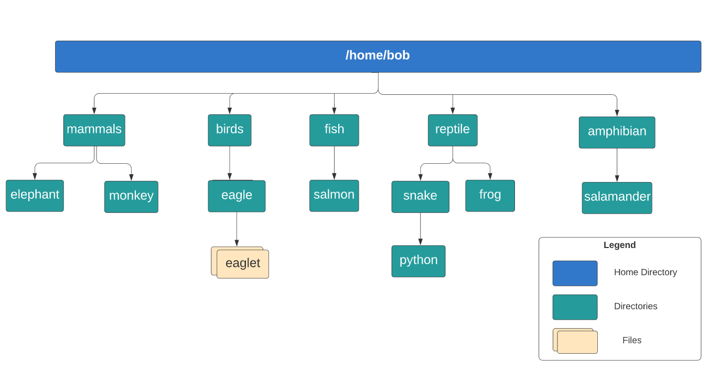
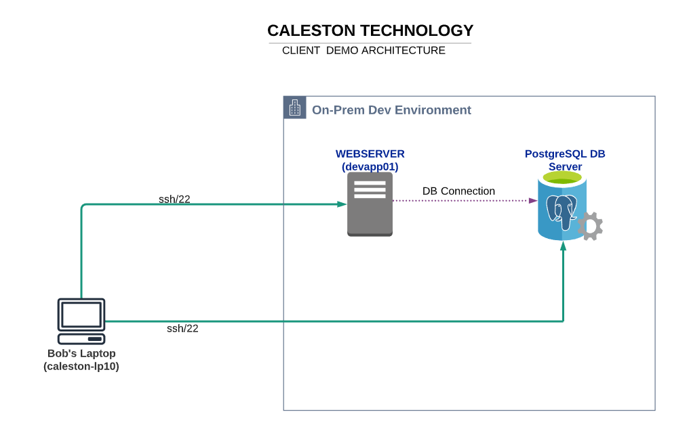

# Learning Linux Basics Course & Labs

# Download Course Resources

We have a GIT repository with the notes and commands from the course that will come handy. You may fork it here:

https://github.com/kodekloudhub/linux-basics-course

We also have the course deck for you to download. Please download it below.

[Linux-Basics-Course-Study-Guide-1.pdf](https://kodekloud.com/wp-content/uploads/2021/08/Linux-Basics-Course-Study-Guide-1-1.pdf)

# WORKING WITH SHELL

##  MULTIPLE CHOICE QUIZ – INTRODUCTION TO SHELL

1. Which command would you use to find out the type of a command?

   - cd

   - file

   - type

   - echo

   - pwd

2. Which directory contains the user home directories by default?

   - home

   - **/home**

   - home-directory

   - /root

3. In the command “echo -n hello”, what is “-n”

   - **option**

   - argument

   - command

4. Which symbol represents a user’s home directory in Linux?

   - $

   - :

   - **~**

   - /

5. In the command “echo -n hello”, what is “echo”

   - **command**

   - flag

   - option

   - argument

   - switch

## I, LAB: WORKING WITH THE SHELL

1. What is the home directory for the user called `bob`?
   - /bob
   - /home
   - **/home/bob**
   - /root/bob

2. Which of the following commands will show you your home directory?

   If unsure, try out the commands in the terminal and find the answer!

   - cwd
   - id
   - **echo $HOME**
   - print_home

3. In the command `echo Welcome`, what does the word `Welcome` represent with respect to the command?
   - **argument**
   - command
   - switch
   - flag

4. What type of command is `git`?
   - **file**
   - function
   - internal
   - shell-builtin

   ```
   $ type git
   git is /usr/bin/git
   
   $ type -t git
   file
   ```
   
   
   
5. Now, lets create some directories! Refer to the below diagram and create the directory called `birds`

   The home directory `/home/bob` already exists.

   Note: If the image is not clear, please right-click on the image and open it in a new tab.

   

   ```
   $ mkdir /home/bob/birds
   ```

6. Next, create the directories `/home/bob/fish/salmon`

   Use the `-p` option to create both directories in one go

   ```
   $ mkdir -p /home/bob/fish/salmon
   ```

7. Now create all the remaining directories as per the diagram below.

   ```
   mkdir -p /home/bob/mammals/elephant
   mkdir -p /home/bob/mammals/monkey
   mkdir /home/bob/birds/eagle
   mkdir -p /home/bob/reptile/snake
   mkdir -p /home/bob/reptile/frog
   mkdir -p /home/bob/amphibian/salamander
   ```

8. Moving along. Lets now move the directory called `frog` from `reptile` to the directory `amphibian`

   ```
   $ mv /home/bob/reptile/frog /home/bob/amphibian 
   
   $ ls -l /home/bob/reptile/
   total 4
   drwxrwxr-x 2 bob bob 4096 Dec 27 02:22 snake
   
   $ ls -l /home/bob/amphibian/
   total 8
   drwxrwxr-x 2 bob bob 4096 Dec 27 02:22 frog
   drwxrwxr-x 2 bob bob 4096 Dec 27 02:23 salamander
   bob@caleston-lp10:~$ 
   ```

9. Next, rename the directory `snake` to `crocodile`

   ```
   ~$ mv /home/bob/reptile/snake /home/bob/reptile/crocodile
   
   $ ls -l /home/bob/reptile/  
   total 4
   drwxrwxr-x 2 bob bob 4096 Dec 27 02:22 crocodile
   ```

10. Finally, delete the directory called `reptile` along with its contents.

   ```
   $ rm -r /home/bob/reptile 
   
   $ ls -l
   total 2520
   drwxrwxr-x 4 bob bob    4096 Dec 27 02:24 amphibian
   drwxrwxr-x 3 bob bob    4096 Dec 27 02:22 birds
   -rw-rw-r-- 1 bob bob 2557716 Apr 15  2020 caleston-code.tar.gz
   drwxrwxr-x 3 bob bob    4096 Dec 27 02:21 fish
   drwxrwxr-x 4 bob bob    4096 Dec 27 02:22 mammals
   drwxr-xr-x 1 bob bob    4096 Apr 15  2020 media
   ```


## I, LAB: LINUX BASH PROMPT

1. What is the default shell for `Bob`?

   - /bin/ksh
   - /bin/zsh
   - /bin/sh
   - /bin/bash

   ```
   $ echo $SHELL
   /bin/bash
   ```

2. Change the SHELL for Bob from `bash` to `Bourne Shell`

   Bob's password is `caleston123`

   **Note: -** Normal users can not execute the high-level tasks so add `sudo` before the command.

   ```
   $ sudo chsh -s /bin/sh bob
   ```

3. What is the value of the environment variable `TERM`?

   - terminal
   - **xterm-256color**
   - 1
   - xterm
   - xorg

   ```
   $ env 
   VISIBLE=now
   XDG_SESSION_ID=c1
   USER=bob
   PWD=/home/bob
   HOME=/home/bob
   MAIL=/var/mail/bob
   SHELL=/bin/bash
   TERM=xterm-256color
   SHLVL=1
   LOGNAME=bob
   XDG_RUNTIME_DIR=/run/user/1000
   PATH=/home/bob/.local/bin:/home/bob/.local/bin:/usr/local/sbin:/usr/local/bin:/usr/sbin:/usr/bin:/sbin:/bin:/usr/games:/usr/local/games
   _=/usr/bin/env
   
   OR
   
   $ echo $TERM
   xterm-256color
   ```

4. Create a new environment variable called `PROJECT=MERCURY` and make it persistent by adding the variable to the `~/.profile` file.

   ```
   $ export PROJECT=MERCURY
   
   # and add the value to the .profile by running 
   $ echo 'export PROJECT=MERCURY' >> /home/bob/.profile
   ```

5. Which of the following directories is not part of the PATH variable?

   - /sbin
   - /bin
   - **/opt/caleston-code**
   - /usr/bin

   ```
   $ echo $PATH
   /home/bob/.local/bin:/home/bob/.local/bin:/usr/local/sbin:/usr/local/bin:/usr/sbin:/usr/bin:/sbin:/bin:/usr/games:/usr/local/games
   ```

   

6. Set an alias called `up` for the command `uptime` and make it persistent by adding to `~/.profile` file.

   ```
   $ alias up=uptime
   
   $ echo 'alias up=uptime' >> .profile
   ```

7. Update Bob's prompt so that it displays the `date` as per the format below:

   Example: [Wed Apr 22]bob@caleston-lp10:~$
   Make sure the change is made persistent.

   ```
   $ PS1='[\d]\u@\h:\w$' 
   
   # and add this to the ~/.profile file 
   $ echo 'PS1="[\d]\u@\h:\w$"' >> ~/.profile
   ```


# LINUX CORE CONCEPTS

## LAB: LINUX KERNEL

1. What is the exact `version` of kernel running in this system?

   - 4.15.72.0-generic
   - 4.2.3.2.0
   - 5.5.2.0-generic
   - **5.4.0-1093-gcp**

   ```
   $ uname -r
   5.4.0-1093-gcp
   ```

2. What is the `Kernel Version` in `4.15.0-88-generic`?

   - 0
   - **4**
   - generic
   - 15

   Look for the first digit in the version. In this case, it is `4`.

3. What is the `major` version number of the kernel `4.15.0-88-generic`?

   - **15**
   - generic
   - 4
   - 0

   Look for the second digit after the kernel version separated by a dot(`.`). In this case, it is 15.

4. Which command would you run to print the messages generated by the kernel?

   - echo $kernel
   - show kernel_messages
   - **dmesg**
   - display_messages

5. How many `block devices` of type `disk` are present in the system?

   - 0
   - 6
   - 3
   - 2
   - **1**

Run: `lsblk` and count the number of `disk` devices.

```
$ lsblk 
lsblk: /proc/swaps: parse error at line 1 -- ignored
NAME    MAJ:MIN RM   SIZE RO TYPE MOUNTPOINT
loop0     7:0    0  49.6M  1 loop 
loop1     7:1    0  55.6M  1 loop 
loop2     7:2    0  55.6M  1 loop 
loop3     7:3    0 303.9M  1 loop 
loop4     7:4    0 303.4M  1 loop 
sda       8:0    0   500G  0 disk 
|-sda1    8:1    0 499.9G  0 part /etc/hosts
|-sda14   8:14   0     4M  0 part 
`-sda15   8:15   0   106M  0 part 
```


## LAB: LINUX KERNEL MODULES BOOT AND FILETYPES

1. Going forward, you would need to make use of `sudo` for running several commands.
   In such cases, run `sudo` before the command.
   Example: `sudo ls /root`

   Bob's password is `caleston123`

2. What is the `init process` used by this system?

   Bob's password is `caleston123`

   - **systemd**
   - sysV
   - init
   - upstart

   ```
   $ sudo ls -l /sbin/init
   lrwxrwxrwx 1 root root 20 Feb  6  2020 /sbin/init -> /lib/systemd/systemd
   ```

3. What is the `default systemd target` set in this system?

   Bob's password is `caleston123`

   - **graphical.target**
   - multi-user.target
   - poweroff.target
   - Run Level 6

   ```
   $ sudo systemctl get-default
   graphical.target
   ```

4. Now, change the target to `multi-user.target`

   Bob's password is `caleston123`

   ```
   $ sudo systemctl set-default multi-user.target
   Created symlink /etc/systemd/system/default.target → /lib/systemd/system/multi-user.target.
   
   $ sudo systemctl get-default
   multi-user.target
   ```

5. What type of file is `firefox.deb` located at `/root`?

   Bob's password is `caleston123`

   - Directory
   - **Debian binary package file**
   - Data File
   - Shell Script

   ```
   $ sudo file /root/firefox.deb
   /root/firefox.deb: Debian binary package (format 2.0)
   ```

6. What type of file is `sample_script.sh` located at `/root`?

   Bob's password is `caleston123`

   - Socket File
   - Data File
   - Sample File
   - **Bash Shell Script**
   - Debian Package file

   ```
   $ sudo file /root/sample_script.sh
   /root/sample_script.sh: Bourne-Again shell script, ASCII text executable
   ```

7. You are asked to install a new `third-party IDE (integrated development environment )` in the system.

   Which directory is the recommended choice for the installation?

   Bob's password is `caleston123`

   - **/opt**
   - /root
   - /home/bob
   - /var

   Third-party software is usually installed under `/opt`

8. Which directory contains the files related to the block devices that can be seen when running the `lsblk` command?

   Bob's password is `caleston123`

   - /block_devices
   - /media
   - /mount
   - **/dev**
   - /devices

   `Block Device` or `Device Node` files are located under `/dev` directory

9. What is the name of the `vendor` for the `Ethernet Controller` used in this system?

   Bob's password is `caleston123`

   - **Red Hat, Inc.**
   - Cisco Systems
   - Huawei, Inc.
   - Juniper Networks
   - F5 BigIP

   ```
   $ sudo lshw | grep -a network
           *-network           
                product: Virtio network device
     *-network:0
     *-network:1
     *-network:2
   bob@caleston-lp10:~$ sudo lshw | grep -A 10 -a network
           *-network           
                description: Ethernet controller
                product: Virtio network device
                vendor: Red Hat, Inc.
                physical id: 4
                bus info: pci@0000:00:04.0
                version: 00
                width: 32 bits
                clock: 33MHz
                capabilities: bus_master cap_list
                configuration: driver=virtio-pci latency=0
                resources: irq:10 ioport:c000(size=64) memory:c0000000-c00007ff
              *-virtio1 UNCLAIMED
   ```

   

# PACKAGE MANAGEMENT

## LAB: YUM AND RPM

1. This is a hands-on lab to work on RPM and YUM.
   Since Bob's laptop is running `Ubuntu`, Dave has offered one of his lab machines that runs `Centos 7`

   To access this Server, run `ssh centos-lab`, Bob's default password is: `caleston123`
   To exit from the server, type `logout` or `exit` on the terminal.

2. Which of the following package managers would you use on this machine `(centos-lab)`?

   To access the `centos-lab` server, run `ssh centos-lab` and `Bob's` default password is: `caleston123`.

   ```sh
   bob@caleston-lp10:~$ ssh centos-lab
   ```

   To exit from the server, type `logout` or `exit` on the terminal.

   - dpkg,apt
   - apt-get
   - **yum,rpm**
   - dpkg
   - apt

3. Use an `rpm` command and find out the exact package name for `wget` installed in this server `(centos-lab)`.

   To access the `centos-lab` server, run `ssh centos-lab` and `Bob's` default password is: `caleston123`.

   ```sh
   bob@caleston-lp10:~$ ssh centos-lab
   ```

   To exit from the server, type `logout` or `exit` on the terminal.

   - **wget-1.14-18.el7_6.1.x86_64**
   - wget-1.0-1.el7_6.1.x86_64
   - wget-1.14-18.el7_7.1.x86_64
   - wget-1.10-12.el7_6.1.x86_64

   ```
   $ rpm -qa | grep wget
   wget-1.14-18.el7_6.1.x86_64
   ```

4. The package for the `firefox` browser has been downloaded under `/home/bob` in the `centos-lab` server.
   Try to install it using `RPM`.

   To access the `centos-lab` server, run `ssh centos-lab` and `Bob's` default password is: `caleston123`.

   ```sh
   bob@caleston-lp10:~$ ssh centos-lab
   ```

   To exit from the server, type `logout` or `exit` on the terminal.

   ```
   $ sudo rpm -ivh /home/bob/firefox-68.6.0-1.el7.centos.x86_64.rpm
   ```

5. Was the installation successful?

   - **No**
   - Yes

6. Why did it fail?

   - File Corrupted
   - **Dependencies not met**
   - Firefox already installed
   - No Permission to Install

   ```
   $ sudo rpm -ivh /home/bob/firefox-68.6.0-1.el7.centos.x86_64.rpm
   error: Failed dependencies:
           liberation-fonts-common is needed by firefox-68.6.0-1.el7.centos.x86_64
           liberation-sans-fonts is needed by firefox-68.6.0-1.el7.centos.x86_64
           mozilla-filesystem is needed by firefox-68.6.0-1.el7.centos.x86_64
           nspr >= 4.21 is needed by firefox-68.6.0-1.el7.centos.x86_64
           nss >= 3.44 is needed by firefox-68.6.0-1.el7.centos.x86_64
           redhat-indexhtml is needed by firefox-68.6.0-1.el7.centos.x86_64
           libatk-1.0.so.0()(64bit) is needed by firefox-68.6.0-1.el7.centos.x86_64
           libcairo-gobject.so.2()(64bit) is needed by firefox-68.6.0-1.el7.centos.x86_64
           libcairo.so.2()(64bit) is needed by firefox-68.6.0-1.el7.centos.x86_64
           libfontconfig.so.1()(64bit) is needed by firefox-68.6.0-1.el7.centos.x86_64
           libfreetype.so.6()(64bit) is needed by firefox-68.6.0-1.el7.centos.x86_64
           libgdk-3.so.0()(64bit) is needed by firefox-68.6.0-1.el7.centos.x86_64
           libgdk_pixbuf-2.0.so.0()(64bit) is needed by firefox-68.6.0-1.el7.centos.x86_64
           libgdk-x11-2.0.so.0()(64bit) is needed by firefox-68.6.0-1.el7.centos.x86_64
           libgtk-3.so.0()(64bit) is needed by firefox-68.6.0-1.el7.centos.x86_64
           libgtk-x11-2.0.so.0()(64bit) is needed by firefox-68.6.0-1.el7.centos.x86_64
           libpango-1.0.so.0()(64bit) is needed by firefox-68.6.0-1.el7.centos.x86_64
           libpangocairo-1.0.so.0()(64bit) is needed by firefox-68.6.0-1.el7.centos.x86_64
           libpangoft2-1.0.so.0()(64bit) is needed by firefox-68.6.0-1.el7.centos.x86_64
           libstartup-notification-1.so.0()(64bit) is needed by firefox-68.6.0-1.el7.centos.x86_64
           libX11.so.6()(64bit) is needed by firefox-68.6.0-1.el7.centos.x86_64
           libX11-xcb.so.1()(64bit) is needed by firefox-68.6.0-1.el7.centos.x86_64
           libxcb-shm.so.0()(64bit) is needed by firefox-68.6.0-1.el7.centos.x86_64
           libxcb.so.1()(64bit) is needed by firefox-68.6.0-1.el7.centos.x86_64
           libXcomposite.so.1()(64bit) is needed by firefox-68.6.0-1.el7.centos.x86_64
           libXcursor.so.1()(64bit) is needed by firefox-68.6.0-1.el7.centos.x86_64
           libXdamage.so.1()(64bit) is needed by firefox-68.6.0-1.el7.centos.x86_64
           libXext.so.6()(64bit) is needed by firefox-68.6.0-1.el7.centos.x86_64
           libXfixes.so.3()(64bit) is needed by firefox-68.6.0-1.el7.centos.x86_64
           libXi.so.6()(64bit) is needed by firefox-68.6.0-1.el7.centos.x86_64
           libXrender.so.1()(64bit) is needed by firefox-68.6.0-1.el7.centos.x86_64
           libXt.so.6()(64bit) is needed by firefox-68.6.0-1.el7.centos.x86_64
   ```

7. Let's use YUM to install the `firefox` on the `centos-lab` server.

   To access the `centos-lab` server, run `ssh centos-lab` and `Bob's` default password is: `caleston123`.

   ```sh
   bob@caleston-lp10:~$ ssh centos-lab
   ```

   To exit from the server, type `logout` or `exit` on the terminal.

   ```
   sudo yum install firefox -y
   ```

8. How many `software repositories` are configured for `YUM` in the `centos-lab` server?

   To access the `centos-lab` server, run `ssh centos-lab` and `Bob's` default password is: `caleston123`.

   ```sh
   bob@caleston-lp10:~$ ssh centos-lab
   ```

   To exit from the server, type `logout` or `exit` on the terminal.

   - 5
   - 0
   - 6
   - 2
   - **3**

   ```
   $ sudo yum repolist
   Loaded plugins: fastestmirror, ovl
   Loading mirror speeds from cached hostfile
    * base: linux-mirrors.fnal.gov
    * extras: ftpmirror.your.org
    * updates: mirrors.liquidweb.com
   repo id                                       repo name                                        status
   base/7/x86_64                                 CentOS-7 - Base                                  10,072
   extras/7/x86_64                               CentOS-7 - Extras                                   515
   updates/7/x86_64                              CentOS-7 - Updates                                4,538
   repolist: 15,125
   ```

9. Which package provides the `tcpdump` command on the `centos-lab` server?

   To access the `centos-lab` server, run `ssh centos-lab` and `Bob's` default password is: `caleston123`.

   ```sh
   bob@caleston-lp10:~$ ssh centos-lab
   ```

   To exit from the server, type `logout` or `exit` on the terminal.

   - net-tool
   - stcp-utils
   - **tcpdump-4.9.2-4.el7_7.1.x86_64**
   - wireshark

   ```
   $ sudo yum provides tcpdump
   Loaded plugins: fastestmirror, ovl
   Loading mirror speeds from cached hostfile
    * base: linux-mirrors.fnal.gov
    * extras: ftpmirror.your.org
    * updates: mirrors.liquidweb.com
   14:tcpdump-4.9.2-4.el7_7.1.x86_64 : A network traffic monitoring tool
   Repo        : base
   ```

   

## LAB – DPKG AND APT

1. This lab requires several commands to be run as the `root` user. Always use sudo.

   Bob's default password is `caleston123`

2. Which of the following package managers would you use on a `debian` based distro?

   - rpm
   - yum
   - **dpkg**

3. The package for `firefox` browser has been downloaded at `/root/firefox.deb`.

   Try to install it using `sudo dpkg -i`

   ```
   $ sudo dpkg -i /root/firefox.deb
   ```

4. Was the installation successful ?

   - Yes
   - **No**

5. Why did it fail?

   - No Permission to Install
   - File Corrupted
   - **Dependencies not met**
   - Firefox already installed

6. Let's use apt to install it `firefox`.

   Bob's default password is `caleston123`

   ```
   $ sudo apt install firefox
   ```

7. Lets now locate the package to install `Chromium` browser in the system.

   Use `apt search` functionality to locate the correct package name.
   The browser has the description of: `Chromium web browser, open-source version of Chrome`
   What is the correct package name?

   - chrome-browser
   - chromium-browser-l10n
   - chromium
   - **chromium-browser**

   ```
   $ apt search Chromium
   Sorting... Done
   Full Text Search... Done
   cgpt/bionic 0~R63-10032.B-3 amd64
     GPT manipulation tool with support for Chromium OS extensions
   
   chromium-browser/bionic-updates,bionic-security 108.0.5359.71-0ubuntu0.18.04.5 amd64
     Chromium web browser, open-source version of Chrome
   ```

8. Finally, remove the `firefox` browser from the system.

   ```
   $ sudo apt remove firefox
   ```


# WORKING WITH SHELL 


## LAB: WORKING WITH SHELL II

1. Going forward, you would need to make use of `sudo` for running several commands.
   In such cases, run `sudo` before the command.
   Example: `sudo ls /root`

   Bob's password is `caleston123`

2. Remember the directory structure from before? We have added a few more files and directories so that the structure looks like the diagram below.

   Create a tarball of the directory called `python` and compress it using `gzip`. The compressed tar file should be available at `/home/bob/python.tar.gz`

   

```
$ tar -cvzf python.tar.gz /home/bob/reptile/snake/python 

OR 

$ tar -cf /home/bob/python.tar /home/bob/reptile/snake/python
gzip /home/bob/python.tar

```

3. There is a compressed file called `eaglet.dat.gz` located under the `eagle` directory. Extract it in the same location.

   ```
   $ gunzip /home/bob/birds/eagle/eaglet.dat.gz
   ```

4. A file called `caleston-code` has been copied somewhere inside the `/opt` directory. But, Bob does not remember which directory he saved it in.

   Can you `find` it?

   Bob's password is `caleston123`

   - /opt/caleston-code-directory
   - /opt/test/caleston-code-directory
   - /opt/caleston-code
   - **/opt/test/test123/caleston/**

   ```
   $ sudo find /opt -name caleston-code
   [sudo] password for bob: 
   /opt/test/test123/caleston/caleston-code
   ```

5. Find the location of the file called `dummy.service` under `/etc` filesystem and redirect its absolute path to the file `/home/bob/dummy-service`

   You can use the `redirect` operator with the `echo` command to save the answer to the file.
   Bob's password is `caleston123`.

   ```
   $ sudo find /etc -name dummy.service
   
   $ echo /etc/systemd/system/dummy.service > /home/bob/dummy-service
   ```

6. Find the file under `/etc` directory that contains the string `172.16.238.197`. Save the answer using the absolute path in the file `/home/bob/ip`

   Bob's password is `caleston123`

   ```
   $ sudo grep -ir 172.16.238.197 /etc/ > /home/bob/ip
   ```

7. Create a new file called `/home/bob/file_with_data.txt`. This file should have one line of text that says `a file in my home directory`.

   Make use of the redirect operator.

   ```
   $ echo "a file in my home directory" > /home/bob/file_with_data.txt
   ```

8. Run the command `python3 /home/bob/my_python_test.py` and redirect the standard error to the file `/home/bob/py_error.txt`

   Bob's password is `caleston123`

   ```
   $ python3 /home/bob/my_python_test.py 2> /home/bob/py_error.txt
   ```

9. Read the file `/usr/share/man/man1/tail.1.gz` and without extracting it and redirect the contents to a file called `/home/bob/pipes`

   ```
   $ zcat /usr/share/man/man1/tail.1.gz | tee /home/bob/pipes
   ```


# NETWORKING

## LAB: DNS

1. What is the IP address of the `DNS Server` used in this system?-

   - 127.0.0.1
   - 172.16.239.1
   - 172.16.238.1
   - **127.0.0.11**

   ```
   $ cat /etc/resolv.conf 
   search caleston.ca
   nameserver 127.0.0.11
   options ndots:0
   ```

2. Which file is responsible for host file-based DNS resolution?

   - /etc/passwd
   - /etc/fstab
   - /etc/resolv.conf
   - **/etc/hosts**

3. What is the configuration file used for the DNS Server?

   - /etc/dns/dns.conf
   - **/etc/resolv.conf**
   - /etc/hostfile
   - /etc/hosts

4. Change the DNS Server to google's DNS which is `8.8.8.8`

   `bob's` password is `caleston123`.

   ```
   $ sudo vi /etc/resolv.conf
   ```

   ```
   search caleston.ca
   nameserver 8.8.8.8 
   options ndots:0
   ```

5. Which order is used currently to resolve an IP address in the system?

   Check the nsswitch.conf file

   - DNS Server then /etc/hosts file
   - /etc/hosts file alone
   - **/etc/hosts file then DNS Server**
   - DNS Server alone

   ```
   $ grep hosts /etc/nsswitch.conf
   hosts:          files dns
   ```

6. Change the order to `DNS` first and then hosts.

   Update `/etc/nsswitch.conf` and change the line to `hosts: dns files`

   Edit /etc/nsswitch.conf

   ```
   # /etc/nsswitch.conf
   #
   # Example configuration of GNU Name Service Switch functionality.
   # If you have the `glibc-doc-reference' and `info' packages installed, try:
   # `info libc "Name Service Switch"' for information about this file.
   
   passwd:         compat systemd
   group:          compat systemd
   shadow:         compat
   gshadow:        files
   
   hosts:          dns files 
   networks:       files
   
   protocols:      db files
   services:       db files
   ethers:         db files
   rpc:            db files
   
   netgroup:       nis
   ```

7. Which `search domain` is configured in this system ?

   Inspect the DNS configuration file.

   - **caleston.ca**
   - caleston.org
   - caleston.com
   - caleston.co.za

   Check for the `search` domain in `/etc/resolv.conf`. It is set to `caleston.ca`'

   ```
   $ cat /etc/resolv.conf 
   search caleston.ca
   nameserver 8.8.8.8 
   options ndots:0
   ```


## LAB: NETWORK BASICS

1. What is the `IP Address` assigned to Bob's Laptop?

   - 172.16.239.230
   - 172.16.239.10
   - **172.16.238.187,172.16.239.187**
   - 172.16.238.18

   ```
   $ ip add
   1: lo: <LOOPBACK,UP,LOWER_UP> mtu 65536 qdisc noqueue state UNKNOWN group default qlen 1000
       link/loopback 00:00:00:00:00:00 brd 00:00:00:00:00:00
       inet 127.0.0.1/8 scope host lo
          valid_lft forever preferred_lft forever
   14: eth0@if15: <BROADCAST,MULTICAST,UP,LOWER_UP> mtu 1500 qdisc noqueue state UP group default 
       link/ether 02:42:ac:10:ee:bb brd ff:ff:ff:ff:ff:ff link-netnsid 0
       inet 172.16.238.187/24 brd 172.16.238.255 scope global eth0
          valid_lft forever preferred_lft forever
   18: eth1@if19: <BROADCAST,MULTICAST,UP,LOWER_UP> mtu 1500 qdisc noqueue state UP group default 
       link/ether 02:42:ac:10:ef:bb brd ff:ff:ff:ff:ff:ff link-netnsid 0
       inet 172.16.239.187/24 brd 172.16.239.255 scope global eth1
          valid_lft forever preferred_lft forever
   20: eth2@if21: <BROADCAST,MULTICAST,UP,LOWER_UP> mtu 1500 qdisc noqueue state UP group default 
       link/ether 02:42:ac:11:00:04 brd ff:ff:ff:ff:ff:ff link-netnsid 0
       inet 172.17.0.4/16 brd 172.17.255.255 scope global eth2
          valid_lft forever preferred_lft forever
   ```

2. What is the name of the interface that has this IP (from the previous question) address assigned?

   - ens0
   - ens1
   - eth2
   - **eth0,eth1**

3. What is the `default` gateway configured in the system?

   - 172.16.239.187
   - **172.16.238.1**
   - 172.16.238.187
   - 172.16.239.1'

   ```
   $ ip route
   default via 172.16.238.1 dev eth0 
   172.16.238.0/24 dev eth0 proto kernel scope link src 172.16.238.187 
   172.16.239.0/24 dev eth1 proto kernel scope link src 172.16.239.187 
   172.17.0.0/16 dev eth2 proto kernel scope link src 172.17.0.4 
   ```

4. We have an apache which should be accessible on `devapp01-web`.
   This server runs on `port 80` on the server and should be accessible from Bob's laptop.

5. However, something seems to be wrong with the network!
   Check if you are able to connect to the HTTP `port 80` on the server `devapp01-web` from Bob's laptop?

   Run a Telnet port 80 on `devapp01-web` to test.

   - NO
   - **YES**

   ```
   $ telnet devapp01-web 80
   Trying 172.16.238.10...
   Connected to devapp01-web.
   Escape character is '^]'.
   ```

6. Are you able to ping `devapp01-web` server?

   - NO
   - **YES**

   ```
   ~$ sudo ping devapp01-web
   [sudo] password for bob: 
   PING devapp01-web (172.16.238.10): 56 data bytes
   64 bytes from 172.16.238.10: icmp_seq=0 ttl=64 time=0.057 ms
   64 bytes from 172.16.238.10: icmp_seq=1 ttl=64 time=0.053 ms
   64 bytes from 172.16.238.10: icmp_seq=2 ttl=64 time=0.050 ms
   ```

7. Luckily, this webserver has two interfaces. The second interface is on another network and is identified by the name `devapp01`. Check if you are able to ping `devapp01`

   Is ping working now?

   - NO
   - **YES**

   ```
   $ sudo ping devapp01
   PING devapp01 (172.16.239.10): 56 data bytes
   64 bytes from 172.16.239.10: icmp_seq=0 ttl=64 time=0.093 ms
   64 bytes from 172.16.239.10: icmp_seq=1 ttl=64 time=0.051 ms
   64 bytes from 172.16.239.10: icmp_seq=2 ttl=64 time=0.051 ms
   ```

8. Let's troubleshoot from the other end. SSH to the `webserver` by running `ssh devapp01`

   Use Bob's default password: `caleston123`

9. Inspect the interface eth0 on `devapp01`, is it UP?

   - YES
   - **NO**

   ```
   ~$ ip link
   1: lo: <LOOPBACK,UP,LOWER_UP> mtu 65536 qdisc noqueue state UNKNOWN mode DEFAULT group default qlen 1000
       link/loopback 00:00:00:00:00:00 brd 00:00:00:00:00:00
   10: eth0@if11: <BROADCAST,MULTICAST> mtu 1500 qdisc noqueue state DOWN mode DEFAULT group default 
       link/ether 02:42:ac:10:ee:0a brd ff:ff:ff:ff:ff:ff link-netnsid 0
   16: eth1@if17: <BROADCAST,MULTICAST,UP,LOWER_UP> mtu 1500 qdisc noqueue state UP mode DEFAULT group default 
       link/ether 02:42:ac:10:ef:0a brd ff:ff:ff:ff:ff:ff link-netnsid 0
   22: eth2@if23: <BROADCAST,MULTICAST,UP,LOWER_UP> mtu 1500 qdisc noqueue state UP mode DEFAULT group default 
       link/ether 02:42:ac:11:00:05 brd ff:ff:ff:ff:ff:ff link-netnsid 0
   ```

10. Bring up the eth0 interface

    ```
    $ sudo ip link set dev eth0 up
    ```

11. While we are at it, there is also a missing `default route` on the server `devapp01`.

    Add the default route via eth0 gateway.

    ```
    $ sudo ip route add default via 172.16.238.1
    
    $ ip route
    default via 172.16.238.1 dev eth0 
    172.16.238.0/24 dev eth0 proto kernel scope link src 172.16.238.10 
    172.16.239.0/24 dev eth1 proto kernel scope link src 172.16.239.10 
    172.17.0.0/16 dev eth2 proto kernel scope link src 172.17.0.5 
    ```


# SECURITY AND FILE PERMISSIONS

## LAB: ACCOUNT MANAGEMENT

1. This lab requires some commands to be run as the `root` user. Always use sudo.

   Bob's default password is `caleston123`

2. What type of account does `Bob` use?

   - Service Account
   - System Account
   - **User Account**
   - Superuser Account

3. Which of the following commands will show you the `UID for a user`?

   If unsure, try out the commands in the terminal and find the answer!

   - echo $HOME
   - print_home
   - **id**
   - cwd

   ```
   $ id
   uid=1000(bob) gid=1000(bob) groups=1000(bob)
   ```

4. What is the `UID` for `bob`?

   - 1001
   - **1000**
   - 1010
   - 1

5. What level of `sudo` access does `bob` have in this system?

   - Permission to remove packages
   - Permission to Install Packages
   - Permissions to Reboot the laptop
   - **All Permissions**

   ```
   ~$ sudo cat /etc/sudoers
   #
   # This file MUST be edited with the 'visudo' command as root.
   #
   # Please consider adding local content in /etc/sudoers.d/ instead of
   # directly modifying this file.
   #
   # See the man page for details on how to write a sudoers file.
   #
   Defaults        env_reset
   Defaults        mail_badpass
   Defaults        secure_path="/usr/local/sbin:/usr/local/bin:/usr/sbin:/usr/bin:/sbin:/bin:/snap/bin"
   
   # Host alias specification
   
   # User alias specification
   
   # Cmnd alias specification
   
   # User privilege specification
   root    ALL=(ALL:ALL) ALL
   
   # Members of the admin group may gain root privileges
   bob ALL=(ALL) ALL
   
   # Allow members of group sudo to execute any command
   %sudo   ALL=(ALL:ALL) ALL
   
   # See sudoers(5) for more information on "#include" directives:
   
   #includedir /etc/sudoers.d
   ```

6. Which access control file has the encrypted password for the users?

   - /etc/group
   - **/etc/shadow**
   - /etc/sudoers
   - /etc/passwd

   ```
   $ sudo grep bob /etc/shadow
   bob:$6$VjvQjl5/$x6yvvflnz8xlRAUCKHfiTUNRrxiF4yjTXQh0wNbSiGKSM6o5BVESRFQe1qmxdwq0S0nyehrfkxgf7eFpCNgGo1:18366:0:99999:7:::
   ```


7. A user called `chris` has been created.

   Can you find out his Full Name?

   - **Chris Hunter**
   - Chris Goodman
   - Chris Jones
   - Chris Helmsworth

   ```
   $ sudo grep chris /etc/passwd
   chris:x:1002:1002:Chris Hunter:/home/chris:/bin/sh
   ```

8. Which groups are `chris` part of?

   - mercury,venus
   - chris,storm,cannon
   - venus,sapphire
   - storm,cannon
   - **cannon,sapphire,chris**

   ```
   $ id chris                
   uid=1002(chris) gid=1002(chris) groups=1002(chris),1003(cannon),1004(sapphire)
   ```

9. What is `chris's` primary group?

   - venus
   - cannon
   - sapphire
   - mercury
   - **chris**

   ```
   $ id chris                
   uid=1002(chris) gid=1002(chris) groups=1002(chris),1003(cannon),1004(sapphire)
   ```

10. Now, lets create a new user called `sarah`. Once done, set her password to `caleston321`

    ```
    $ sudo useradd sarah
    
    $ sudo passwd sarah
    ```

11. Create a group called `john` with the `GID 1010`. Next create another user called `john` with `UID = 1010`, `primary group = john` and `login shell = /bin/sh`

    ```
    $ sudo groupadd -g 1010 john
    
    $ sudo useradd -u 1010 -g 1010 -s /bin/sh john
    ```


## LAB: PERMISSIONS AND OWNERSHIP

1. This lab requires some commands to be run as the `root` user. Always use `sudo`.

   Bob's default password is `caleston123`

2. A new directory called `sports` has been created in your home directory. Inspect it.

   What is the permission set for the `owner` of this directory?

   - **Full Permission - Read, Write and Execute**
   - No Permissions
   - Read Only
   - Write Only

   ```
   $ ls -ld /home/bob/sports/
   drwxr-x--- 2 bob bob 4096 Dec 28 23:33 /home/bob/sports/
   
   OR
   
   $ ls -l 
   total 2512
   -rw-rw-r-- 1 bob bob 2557716 Apr 15  2020 caleston-code.tar.gz
   drwxr-xr-x 1 bob bob    4096 Apr 15  2020 media
   drwxr-x--- 2 bob bob    4096 Dec 28 23:33 sports
   ```

3. What is the permission set for group users for the same directory `sports`?

   - **READ and EXECUTE**
   - READ ONLY
   - FULL PERMISSIONS
   - NO PERMISSIONS

   ```
   $ ls -ld /home/bob/sports/
   drwxr-x--- 2 bob bob 4096 Dec 28 23:33 /home/bob/sports/
   ```

4. What are the permissions set for `other` users for the `sports` directory?

   - READ ONLY
   - FULL PERMISSIONS
   - **NO PERMISSIONS**
   - WRITE AND EXECUTE

   ```
   $ ls -ld /home/bob/sports/
   drwxr-x--- 2 bob bob 4096 Dec 28 23:33 /home/bob/sports/
   ```

5. Who's the owner of this directory?

   - **bob**
   - dave
   - root
   - michael

   ```
   $ ls -ld /home/bob/sports/
   drwxr-x--- 2 bob bob 4096 Dec 28 23:33 /home/bob/sports/
   ```

6. A new file called `soccer` has been created under the `sports` directory.

   It has full permissions, update the file so that the group and others only have `read` and `execute` permissions.

   ```
   $ chmod 755 /home/bob/sports/soccer 
   
   OR 
   
   $ chmod go-w /home/bob/sports/soccer
   ```

7. Now, `add` back the `write` permission for group and `remove all` permission for others for the same file called `soccer`.

   ```
   $ chmod 770 /home/bob/sports/soccer 
   
   OR 
   
   $ chmod g+w,o-rwx /home/bob/sports/soccer
   ```

8. Now, change the ownership of the file called `soccer` to the `service account` called `mercury`.

   ```
   $ sudo chown mercury /home/bob/sports/soccer
   ```

9. We have created another file in the `sports` directory. Change the ownership for the entire `sports` directory including all the files inside to the service account `mercury`.

   Try to do this with one single command. Explore the `-R` recursive flag with the `chown` command.

   ```
   $ sudo chown -R mercury /home/bob/sports
   ```


## LAB: SSH AND SCP


1. Which port number does the `SSH` service use by default?

   Bob's default password is `caleston123`

   - 80
   - 443
   - **22**
   - 25

   

2. If you run `ssh devapp01` in the terminal, which user are you using to connect to the server?

   If unsure, try it out on the terminal.

   - bob
   - superuser
   - ssh user
   - root

   ```
   $ ssh devapp01
   bob@devapp01's password: 
   Permission denied, please try again.
   bob@devapp01's password: 
   Welcome to Ubuntu 18.04.4 LTS (GNU/Linux 5.4.0-1093-gcp x86_64)
   
    * Documentation:  https://help.ubuntu.com
    * Management:     https://landscape.canonical.com
    * Support:        https://ubuntu.com/advantage
   
   This system has been minimized by removing packages and content that are
   not required on a system that users do not log into.
   
   To restore this content, you can run the 'unminimize' command.
   
   The programs included with the Ubuntu system are free software;
   the exact distribution terms for each program are described in the
   individual files in /usr/share/doc/*/copyright.
   
   Ubuntu comes with ABSOLUTELY NO WARRANTY, to the extent permitted by
   applicable law.
   
    _______  _______  _        _______  _______ _________ _______  _       
   (  ____ \(  ___  )( \      (  ____ \(  ____ \\__   __/(  ___  )( (    /|
   | (    \/| (   ) || (      | (    \/| (    \/   ) (   | (   ) ||  \  ( |
   | |      | (___) || |      | (__    | (_____    | |   | |   | ||   \ | |
   | |      |  ___  || |      |  __)   (_____  )   | |   | |   | || (\ \) |
   | |      | (   ) || |      | (            ) |   | |   | |   | || | \   |
   | (____/\| )   ( || (____/\| (____/\/\____) |   | |   | (___) || )  \  |
   (_______/|/     \|(_______/(_______/\_______)   )_(   (_______)|/    )_)
   Last login: Wed Apr 15 08:19:16 2020 from 172.16.238.3
   bob@devapp01:~$ 
   ```

3. Now, let's set up password-less ssh between Bob's laptop and the Dev Application server `devapp01`.

   We will make use of `bob's` user account that has been created in the application server.
   It uses the same default password: `caleston123`

4. First, generate the SSH key-pair using the `ssh-keygen` command in the `caleston-lp10` server.

   Key Type - `RSA`

   ```
   $ ssh-keygen -t rsa
   Generating public/private rsa key pair.
   Enter file in which to save the key (/home/bob/.ssh/id_rsa): 
   Enter passphrase (empty for no passphrase): 
   Enter same passphrase again: 
   Your identification has been saved in /home/bob/.ssh/id_rsa.
   Your public key has been saved in /home/bob/.ssh/id_rsa.pub.
   The key fingerprint is:
   SHA256:sZXZrDmTs0XSayLNcWVTkkoKoTGMOnkmLneaO3ikOow bob@caleston-lp10
   The key's randomart image is:
   +---[RSA 2048]----+
   |     oo ..    =o.|
   |    . .+.  *.o.o |
   |   o  . ..*o*.   |
   |  = o    *.O..   |
   | . =    S @ +    |
   |. + .    . O     |
   |o* +      .      |
   |E.=              |
   |oo.o             |
   +----[SHA256]-----+
   ```

5. The public key created using the previous command is:

   - **/home/bob/.ssh/id_rsa.pub**
   - /home/bob/.ssh/id_rsa
   - /home/bob.ssh
   - /root/id_rsa.pub

6. Copy the public key to the target server `devapp01`.

   Make use of the `ssh-copy-id` command

   ```
   $ ssh-copy-id bob@devapp01
   /usr/bin/ssh-copy-id: INFO: Source of key(s) to be installed: "/home/bob/.ssh/id_rsa.pub"
   /usr/bin/ssh-copy-id: INFO: attempting to log in with the new key(s), to filter out any that are already installed
   /usr/bin/ssh-copy-id: INFO: 1 key(s) remain to be installed -- if you are prompted now it is to install the new keys
   bob@devapp01's password: 
   
   Number of key(s) added: 1
   
   Now try logging into the machine, with:   "ssh 'bob@devapp01'"
   and check to make sure that only the key(s) you wanted were added.
   ```

7. Which file on the target server is the public key copied in to?

   - **/home/bob/.ssh/authorized_keys**
   - /root/.ssh/authorized_users
   - /etc/authoried_users
   - /home/bob/.ssh/known_hosts

8. Finally, copy the file `/home/bob/caleston-code.tar.gz` from Bob's laptop to the server `devapp01`

   Copy the file to Bob's home directory.

   ```
   $ scp /home/bob/caleston-code.tar.gz devapp01:/home/bob 
   ```


# IPTABLES Introduction


## LAB – IPTABLES

1. In this Lab, we will secure the development environment by making use of `iptables`.

   Wherever required, use `sudo` to run commands as the root user. Bob's password is `caleston123`.

2. Here is the simple architecture diagram of the implementation. This is a two-tier application.
   The web server is hosted on `devapp01`.
   The DB server is hosted on `devdb01`.
   The Software Repository is hosted on `caleston-repo-01`.

   Here are the connectivity requirements:

   1. `SSH` should be allowed from Bob's laptop to both Web and DB servers.
   2. `HTTP/80` from the Web Server should be accessible from Bob's laptop.
   3. The `Web Server` should be able to access the `Software Repository` server at port `80`

   

3. Install `iptables` on `devapp01 and devdb01` servers

   Check

   - installed on devapp01?

   - installed on devdb01?

   ```
   $ ssh devapp01
    
   $ sudo apt install iptables
   
   $ ssh devdb01
    
   $ sudo apt install iptables
   ```

4. Are there any `iptable` rules created on either Web Server or DB Server right now?

   - **NO**
   - YES

   ```
   bob@devapp01:~$ sudo iptables -L
   Chain INPUT (policy ACCEPT)
   target     prot opt source               destination         
   
   Chain FORWARD (policy ACCEPT)
   target     prot opt source               destination         
   
   Chain OUTPUT (policy ACCEPT)
   target     prot opt source               destination         
   bob@devapp01:~$ 
   ```

   ```
   bob@devdb01:~$ sudo iptables -L
   Chain INPUT (policy ACCEPT)
   target     prot opt source               destination         
   
   Chain FORWARD (policy ACCEPT)
   target     prot opt source               destination         
   
   Chain OUTPUT (policy ACCEPT)
   target     prot opt source               destination        
   ```

5. On `devapp01`, add an incoming rule permitting SSH and HTTP connection from Bob's Laptop.

   Bob's Laptop has an IP address of `172.16.238.187`.

   Check

   - Incoming SSH allowed?
   - Incoming HTTP allowed?

   ```
   $ sudo iptables -A INPUT -p TCP -s 172.16.238.187 --dport 22 -j ACCEPT 
   
   and 
   
   $ sudo iptables -A INPUT -p TCP -s 172.16.238.187 --dport 80 -j ACCEPT
   ```

6. Now, lockdown incoming traffic on `devapp01`. Drop incoming connections from any source on any destination port for any protocol (TCP/UDP).

   Remember, this rule should be at the `bottom of the chain` for the SSH and HTTP access from `caleston-lp10` to work.

   Check

   - All Incoming traffic blocked?

   ```
   $ sudo iptables -A INPUT -j DROP
   ```

7. On `devapp01`, add an outgoing rule permitting access to `port 5432 on devdb01` and HTTP access to `caleston-repo-01`. Once this is done, block outgoing traffic to any destination on `http/https ports` from `devapp01`

   Note: `caleston-repo-01` has the ip address of `172.16.238.15`

   Check

   - Access to DB Server permitted?
   - Access to Software Repo Server permitted?
   - Outgoing HTTP access denied?
   - Outgoing HTTPS access denied?

   ```
   sudo iptables -A OUTPUT -p TCP -d 172.16.238.11 --dport 5432 -j ACCEPT
   sudo iptables -A OUTPUT -p TCP -d 172.16.238.15 --dport 80 -j ACCEPT
   sudo iptables -A OUTPUT -p tcp --dport 80 -j DROP
   sudo iptables -A OUTPUT -p tcp --dport 443 -j DROP
   ```

8. Add an `OUTPUT` rule to the top of the chain which will allow `https` connection to `google.com` on `devapp01`

   Check

   - Task completed?

   ```
   sudo iptables -I OUTPUT -p tcp -d google.com --dport 443 -j ACCEPT
   ```


##    LAB: CRONJOB

1. Which command is used to list all the cronjobs created for a user?

   - **crontab -l**
   - crontab -r
   - crontab -i
   - crontab -e

2. How many cronjobs are currently scheduled for `bob`?

   - 1
   - 6
   - 3
   - 5

   ```
   $ crontab -l
   11 11 * * 3 /usr/local/bin/system-reporter.sh
   23 11 * * 2 /usr/local/bin/system-checker.sh
   23 23 * * 2 /usr/local/bin/system-debugger.sh
   11 23 * * * /usr/local/bin/system-tester.sh
   11 23 * 2 * /usr/local/bin/system-troubleshooter.sh
   11 23 * * 2 /usr/local/bin/system-identifier.sh
   ```

3. How about now? How many cronjobs are scheduled for the `root` user ?

   - 3
   - 0
   - 1
   - 2

   ```
   $ sudo crontab -l
   [sudo] password for bob: 
   0 21 * * * date >> /tmp/date.txt
   ```

4. Inspect the cronjobs scheduled for `bob` again. Which command/script is run at `11 minutes past 11 PM` every `Tuesday`?

   - /usr/local/bin/system-checker.sh
   - /usr/local/bin/system-debugger.sh
   - /usr/local/bin/system-tester.sh
   - **/usr/local/bin/system-identifier.sh**
   - /usr/local/bin/system-troubleshooter.sh
   - /usr/local/bin/system-reporter.sh

   ```
   ~$ crontab -l
   11 11 * * 3 /usr/local/bin/system-reporter.sh
   23 11 * * 2 /usr/local/bin/system-checker.sh
   23 23 * * 2 /usr/local/bin/system-debugger.sh
   11 23 * * * /usr/local/bin/system-tester.sh
   11 23 * 2 * /usr/local/bin/system-troubleshooter.sh
   11 23 * * 2 /usr/local/bin/system-identifier.sh
   ```

5. Schedule a cronjob to run the script `/usr/local/bin/last-reboot.sh` on the `first day of every month at 6 AM`.
   The script should not run any other day.

   ```
   # Use: Run 
   $ crontab -e
   
   # This will open the crontab in the VI Editor. Add the below line to the file:
   0 6 1 * * /usr/local/bin/last-reboot.sh
   ```

6. When will the script `/usr/local/bin/system-troubleshooter.sh` be run?

   Inspect the cronjobs scheduled for `bob`.

   - 11 Minutes past 11 PM on every Tuesday
   - 11 minutes past 11 AM on every other day
   - **11 minutes past 11 PM on all days in the month of February**
   - 11 minutes past 11 AM on every Monday

   ```
   $ crontab -l
   11 11 * * 3 /usr/local/bin/system-reporter.sh
   23 11 * * 2 /usr/local/bin/system-checker.sh
   23 23 * * 2 /usr/local/bin/system-debugger.sh
   11 23 * * * /usr/local/bin/system-tester.sh
   11 23 * 2 * /usr/local/bin/system-troubleshooter.sh
   11 23 * * 2 /usr/local/bin/system-identifier.sh
   0 6 1 * * /usr/local/bin/last-reboot.sh
   ```

7. The script `/usr/local/bin/system-debugger.sh` was incorrectly scheduled. It should run every half hour at minute `0` and minute `30`

   Example: 09:00, 09:30, 10:00, 10:30, 11:00, 11:30……so on every half hour.

   ```
   Use Step values for the minute column = */30 OR
   Specify the minute column as 00,30 both of which mean at minute zero then minute 30.
   To sum up, add this to the crontab:
   */30 * * * * /usr/local/bin/system-debugger.sh
   ```


# SERVICE MANAGEMENT WITH SYSTEMD

## LAB: SYSTEMD SERVICES

1. This lab requires several commands to be run as the `root` user. Always use `sudo`.

   Bob's default password is `caleston123`

2. What is the status of the `sample.service` unit?

   - Unknown
   - **Inactive(dead)**
   - Active(Running)
   - Does not exist

   ```
   $ sudo systemctl status sample.service
   ● sample.service - A template service unit file. Use this to create a service
      Loaded: error (Reason: Invalid argument)
      Active: inactive (dead)
   
   Dec 29 07:59:59 caleston-lp10 systemd[1]: sample.service: Service lacks both ExecStart= and ExecSto
   Dec 29 08:00:20 caleston-lp10 systemd[1]: sample.service: Service lacks both ExecStart= and ExecSto
   ```

3. Try starting the service

   Does it start?

   - Yes
   - **No**

   ```
   $ sudo systemctl start sample.service
   Failed to start sample.service: Unit sample.service is not loaded properly: Invalid argument.
   See system logs and 'systemctl status sample.service' for details.
   ```

4. Why did the service start fail?

   - multi-user.target not enabled
   - **Service section not defined**
   - Install section not defined
   - Unit section not defined

   ```
   $ sudo journalctl -u sample.service
   -- Logs begin at Thu 2022-12-29 07:58:08 UTC, end at Thu 2022-12-29 08:03:05 UTC. --
   Dec 29 07:59:59 caleston-lp10 systemd[1]: sample.service: Service lacks both ExecStart= and ExecSto
   Dec 29 08:00:20 caleston-lp10 systemd[1]: sample.service: Service lacks both ExecStart= and ExecSto
   Dec 29 08:01:20 caleston-lp10 systemd[1]: sample.service: Service lacks both ExecStart= and ExecSto
   ```

5. Update the `[Service]` section

   Set the `ExecStart` to run the script `/bin/bash /root/sample_script.sh`.
   Once done, start the service.

   Check

   - Task completed?

   ```
   Run: sudo vi /etc/systemd/system/sample.service
   Add /bin/bash /root/sample_script.sh to ExecStart
   Save and Exit.
   and then start the service: - sudo systemctl start sample.service
   ```

   /etc/systemd/system/sample.service

   ```
   [Unit]
   Description=A template service unit file. Use this to create a service
   
   [Service]
   ExecStart=/bin/bash /root/sample_script.sh
   
   [Install]
   WantedBy=multi-user.target
   ```

6. Inspect the status of the service now.

   What is the status?

   - Failed
   - Inactive(dead)
   - Unknown
   - **Active(running)**

   ```
   $ sudo systemctl status sample.service
   ● sample.service - A template service unit file. Use this to create a service
      Loaded: loaded (/etc/systemd/system/sample.service; disabled; vendor preset: enabled)
      Active: active (running) since Thu 2022-12-29 08:07:56 UTC; 1min 0s ago
    Main PID: 948 (bash)
       Tasks: 2 (limit: 251382)
      CGroup: /docker/ac0a0ebe109dd36ae2eb1fc3e0edad2b953fa8745c96c8766ae951adf7ca495c/system.slice/sa
              ├─948 /bin/bash /root/sample_script.sh
              └─950 sleep 100
   
   Dec 29 08:07:56 caleston-lp10 bash[948]: Thu Dec 29 08:07:56 UTC 2022
   ```

   

7. ```
   Enable` this service now so that it will be started automatically after a reboot for `multi-user.target
   ```

   Check

   - Task completed?

   ```
   $ sudo systemctl enable sample.service
   ```

8. Now update the service to ensure that it restarts when stopped for `any` reason.

   user `Restart=always` derivative.

   Check

   - Task completed?

   ```
   Run: sudo vi /etc/systemd/system/sample.service
   Add Restart=always to the Service section.
   Save and Exit
   ```

   /etc/systemd/system/sample.service

   ````
   [Unit]
   Description=A template service unit file. Use this to create a service
   
   [Service]
   ExecStart=/bin/bash /root/sample_script.sh
   
   Restart=always
   
   [Install]
   WantedBy=multi-user.target
   ````

9. Try and restart the service now.

   There seems to be a warning. What is the fix?

   - **Reload the Unit**
   - Fix Permissions
   - Fix the Unit File

   ```
   $ sudo systemctl restart sample.service
   Warning: The unit file, source configuration file or drop-ins of sample.service changed on disk. Run 'systemctl daemon-reload' to reload units.
   ```

10. Reload the service unit file

    ```
    $ sudo systemctl daemon-reload
    ```

11. How would you check the errors encountered earlier when the sample service did not have a valid service section?

    - **journalctl -u sample.service**
    - cat /var/log/faillog
    - systemctl status sample.service -l


11. 

# Storage in Linux

## Lab Partitions

1. This lab requires some commands to be run as the root user. Always use sudo.


   Bob's default password is caleston123


   Ok

2. How many disk type block devices are present in the system?

   - **3**

   - 1

   - 10

   ```
   bob@caleston-lp10:~$ lsblk 
   NAME                   MAJ:MIN RM  SIZE RO TYPE MOUNTPOINT
   vda                    252:0    0   10G  0 disk 
   └─vda1                 252:1    0   10G  0 part 
     ├─vagrant--vg-root   253:0    0    9G  0 lvm  /
     └─vagrant--vg-swap_1 253:1    0  980M  0 lvm  [SWAP]
   vdb                    252:16   0    1G  0 disk 
   vdc                    252:32   0    1G  0 disk 
   ```

3. What is the size of the disk /dev/vdc?

   - 15GB

   - 20GB

   - **1GB**

   - 25GB

   ```
   $ lsblk 
   NAME                   MAJ:MIN RM  SIZE RO TYPE MOUNTPOINT
   vda                    252:0    0   10G  0 disk 
   └─vda1                 252:1    0   10G  0 part 
     ├─vagrant--vg-root   253:0    0    9G  0 lvm  /
     └─vagrant--vg-swap_1 253:1    0  980M  0 lvm  [SWAP]
   vdb                    252:16   0    1G  0 disk 
   vdc                    252:32   0    1G  0 disk 
   ```

4. What is the major number for the devices beginning with vd?

   - 10

   - 8

   - **252**

   - 12

5. How many maximum partitions (primary or extended ) can an MBR have?

   - 10

   - **4**

   - 1

   - 2

   ```
   $ lsblk 
   NAME                   MAJ:MIN RM  SIZE RO TYPE MOUNTPOINT
   vda                    252:0    0   10G  0 disk 
   └─vda1                 252:1    0   10G  0 part 
     ├─vagrant--vg-root   253:0    0    9G  0 lvm  /
     └─vagrant--vg-swap_1 253:1    0  980M  0 lvm  [SWAP]
   vdb                    252:16   0    1G  0 disk 
   vdc                    252:32   0    1G  0 disk 
   ```

6. How many partitions does the disk /dev/vda have currently?

   - 10

   - **1**

   - 4

   - 2

   ```
   $ lsblk 
   NAME                   MAJ:MIN RM  SIZE RO TYPE MOUNTPOINT
   vda                    252:0    0   10G  0 disk 
   └─vda1                 252:1    0   10G  0 part 
     ├─vagrant--vg-root   253:0    0    9G  0 lvm  /
     └─vagrant--vg-swap_1 253:1    0  980M  0 lvm  [SWAP]
   vdb                    252:16   0    1G  0 disk 
   vdc                    252:32   0    1G  0 disk 
   ```

   

7. Create a GPT partition called `vdb1` of size `500M` on the disk `/dev/vdb`

   You can install `gdisk` by running `sudo apt install gdisk`

   Run: sudo gdisk /dev/vdb

   In the interactive prompt, enter n

   Select parition number = 1 (for vdd1)

   Select default first sector = 2048

   Select +500M when asked for last sector

   Use default hex code = 8300

   Finally type w to write to the partition table

   ```
   $ sudo gdisk /dev/vdb 
   GPT fdisk (gdisk) version 1.0.3
   
   Partition table scan:
     MBR: not present
     BSD: not present
     APM: not present
     GPT: not present
   
   Creating new GPT entries.
   
   Command (? for help): n
   Partition number (1-128, default 1): 1
   First sector (34-2097118, default = 2048) or {+-}size{KMGTP}: 2048
   Last sector (2048-2097118, default = 2097118) or {+-}size{KMGTP}: +500M
   Current type is 'Linux filesystem'
   Hex code or GUID (L to show codes, Enter = 8300): 8300
   Changed type of partition to 'Linux filesystem'
   
   Command (? for help): w
   
   Final checks complete. About to write GPT data. THIS WILL OVERWRITE EXISTING
   PARTITIONS!!
   
   Do you want to proceed? (Y/N): Y
   OK; writing new GUID partition table (GPT) to /dev/vdb.
   The operation has completed successfully.
   ```


## LAB – FILESYSTEMS

1. This lab requires some commands to be run as the root user. Always use sudo.


   Bob's default password is caleston123

   Ok

2. Which of the following filesystems does not use a journal?

   - ext3

   - **ext2**

   - ext4

3. Out of the disks /dev/vdb and /dev/vdc, which one has a filesystem created?

   - **/dev/vdc**

   - /dev/vdb

   ```
   $ sudo df -h
   [sudo] password for bob: 
   Filesystem                    Size  Used Avail Use% Mounted on
   udev                          461M     0  461M   0% /dev
   tmpfs                          99M  5.4M   94M   6% /run
   /dev/mapper/vagrant--vg-root  8.9G  1.6G  6.9G  19% /
   tmpfs                         493M     0  493M   0% /dev/shm
   tmpfs                         5.0M     0  5.0M   0% /run/lock
   tmpfs                         493M     0  493M   0% /sys/fs/cgroup
   tmpfs                          99M     0   99M   0% /run/user/1002
   /dev/vdc                     1008M  1.3M  956M   1% /mnt/backups
   ```

4. Can you find out the type of filesystem created in /dev/vdc?


   Use the blkid command with the disk name as the argument.

   - ext3

   - ext4

   - **ext2**

   - nfs

   - btrfs

   ```
   $ sudo blkid /dev/vdc 
   /dev/vdc: UUID="105e0588-a0b4-4a7b-851f-c089d898a1b4" TYPE="ext2"
   ```

5. Create an ext4 filesystem on the disk /dev/vdb and mount it at /mnt/data

   Check

   Task completed?

   Run: 

   sudo mkfs.ext4 /dev/vdb
   sudo mkdir /mnt/data
   sudo  mount /dev/vdb /mnt/data

   ```
   bob@caleston-lp10:~$ sudo mkfs.ext4 /dev/vdb 
   mke2fs 1.44.1 (24-Mar-2018)
   Creating filesystem with 262144 4k blocks and 65536 inodes
   Filesystem UUID: f0e56377-7dc0-4cd6-982b-821e1bb46996
   Superblock backups stored on blocks: 
           32768, 98304, 163840, 229376
   
   Allocating group tables: done                            
   Writing inode tables: done                            
   Creating journal (8192 blocks): done
   Writing superblocks and filesystem accounting information: done
   
   bob@caleston-lp10:~$ sudo mkdir /mnt/data
   
   bob@caleston-lp10:~$ sudo mount /dev/vdb /mnt/data
   
   bob@caleston-lp10:~$ lsblk 
   NAME                   MAJ:MIN RM  SIZE RO TYPE MOUNTPOINT
   vda                    252:0    0   10G  0 disk 
   └─vda1                 252:1    0   10G  0 part 
     ├─vagrant--vg-root   253:0    0    9G  0 lvm  /
     └─vagrant--vg-swap_1 253:1    0  980M  0 lvm  [SWAP]
   vdb                    252:16   0    1G  0 disk /mnt/data
   vdc                    252:32   0    1G  0 disk /mnt/backups
   ```

6. What would happen to the mount /mnt/data after a system reboot?

   - **/mnt/data will not be mounted**

   - /dev/vdb will be deleted

   - /mnt/data filesystem will be deleted

   - /mnt/data data will be destroyed

7. Make the mount persistent across reboot.

   Use rw option with the dump and pass numbers both set to 0

   Check

   Task completed?

   

   Add it in the FSTAB

   Run: sudo vi /etc/fstab

   Add the line /dev/vdb /mnt/data ext4 rw 0 0

   Save and Exit.

   ```
   # /etc/fstab: static file system information.
   # 
   # Use 'blkid' to print the universally unique identifier for a
   # device; this may be used with UUID= as a more robust way to name devices
   # that works even if disks are added and removed. See fstab(5).
   #
   # <file system> <mount point>   <type>  <options>       <dump>  <pass>
   /dev/mapper/vagrant--vg-root /               ext4    errors=remount-ro 0       1
   /dev/mapper/vagrant--vg-swap_1 none            swap    sw              0       0
   /dev/fd0        /media/floppy0  auto    rw,user,noauto,exec,utf8 0       0
   /dev/vdb        /mnt/data       ext4    rw      0       0       
   #VAGRANT-BEGIN
   # The contents below are automatically generated by Vagrant. Do not modify.
   #VAGRANT-END
   ```

   

## LAB: LVM


1.  This lab requires some commands to be run as the root user. Always use sudo.


   Bob's default password is caleston123

   Ok

2. Is LVM installed on this machine?


   Try out commands such as pvdisplay or lvs

   - No

   - **Yes**

   ```
   bob@caleston-lp10:~$ sudo pvdisplay 
   [sudo] password for bob: 
     --- Physical volume ---
     PV Name               /dev/vda1
     VG Name               vagrant-vg
     PV Size               <10.00 GiB / not usable 2.00 MiB
     Allocatable           yes (but full)
     PE Size               4.00 MiB
     Total PE              2559
     Free PE               0
     Allocated PE          2559
     PV UUID               ecXq0T-x7d2-Hma9-rS1w-Mi02-st3y-EqIoiW
      
   bob@caleston-lp10:~$ sudo lvs
     LV     VG         Attr       LSize   Pool Origin Data%  Meta%  Move Log Cpy%Sync Convert
     root   vagrant-vg -wi-ao----  <9.04g                                                    
     swap_1 vagrant-vg -wi-ao---- 980.00m                   
   ```

3. LVM is installed on this machine and you will find that a physical volume has already been created.


   What is the name of this physical volume?

   - /dev/sdb

   - **/dev/vda1**

   - /dev/sda

   - /dev/vdb

   ```
   bob@caleston-lp10:~$ sudo pvs
   [sudo] password for bob: 
     PV         VG         Fmt  Attr PSize   PFree
     /dev/vda1  vagrant-vg lvm2 a--  <10.00g    0 
     
   bob@caleston-lp10:~$ sudo pvdisplay
     --- Physical volume ---
     PV Name               /dev/vda1
     VG Name               vagrant-vg
     PV Size               <10.00 GiB / not usable 2.00 MiB
     Allocatable           yes (but full)
     PE Size               4.00 MiB
     Total PE              2559
     Free PE               0
     Allocated PE          2559
     PV UUID               ecXq0T-x7d2-Hma9-rS1w-Mi02-st3y-EqIoiW
   ```

4. What is the size of this physical volume?

   - 195.31GB

   - 50GB

   - **10GB**

   - 200GB

   ```
   bob@caleston-lp10:~$ sudo pvs
   [sudo] password for bob: 
     PV         VG         Fmt  Attr PSize   PFree
     /dev/vda1  vagrant-vg lvm2 a--  <10.00g    0 
     
   bob@caleston-lp10:~$ sudo pvdisplay
     --- Physical volume ---
     PV Name               /dev/vda1
     VG Name               vagrant-vg
     PV Size               <10.00 GiB / not usable 2.00 MiB
     Allocatable           yes (but full)
     PE Size               4.00 MiB
     Total PE              2559
     Free PE               0
     Allocated PE          2559
     PV UUID               ecXq0T-x7d2-Hma9-rS1w-Mi02-st3y-EqIoiW
   ```

5. What is the name of the volume group created using this PV?

   - **vagrant-vg**

   - root-vg

   - host-vol

   - rool-vol

   ```
   bob@caleston-lp10:~$ sudo pvdisplay
     --- Physical volume ---
     PV Name               /dev/vda1
     VG Name               vagrant-vg
     PV Size               <10.00 GiB / not usable 2.00 MiB
     Allocatable           yes (but full)
     PE Size               4.00 MiB
     Total PE              2559
     Free PE               0
     Allocated PE          2559
     PV UUID               ecXq0T-x7d2-Hma9-rS1w-Mi02-st3y-EqIoiW
      
   bob@caleston-lp10:~$ sudo vgdisplay
     --- Volume group ---
     VG Name               vagrant-vg
     System ID             
     Format                lvm2
     Metadata Areas        1
     Metadata Sequence No  3
     VG Access             read/write
     VG Status             resizable
     MAX LV                0
     Cur LV                2
     Open LV               2
     Max PV                0
     Cur PV                1
     Act PV                1
     VG Size               <10.00 GiB
     PE Size               4.00 MiB
     Total PE              2559
     Alloc PE / Size       2559 / <10.00 GiB
     Free  PE / Size       0 / 0   
     VG UUID               E8HKBz-6lBW-9sCH-51rQ-xu3p-J1U6-963v7c
   ```

6. Now, we will create a new VG. To do this we will make use of the disks /dev/vdb and /dev/vdc


   What are the size of these disks individually?

   - **1G**

   - 15G

   - 5G

   - 2G

   ```
   bob@caleston-lp10:~$ sudo lsblk
   NAME                   MAJ:MIN RM  SIZE RO TYPE MOUNTPOINT
   vda                    252:0    0   10G  0 disk 
   └─vda1                 252:1    0   10G  0 part 
     ├─vagrant--vg-root   253:0    0    9G  0 lvm  /
     └─vagrant--vg-swap_1 253:1    0  980M  0 lvm  [SWAP]
   vdb                    252:16   0    1G  0 disk 
   vdc                    252:32   0    1G  0 disk 
   ```

7. Create PV's using /dev/vdb and /dev/vdc.

   Check

   Task completed?

   ```
   bob@caleston-lp10:~$ sudo pvcreate /dev/vdb
     Physical volume "/dev/vdb" successfully created.
   bob@caleston-lp10:~$ sudo pvcreate /dev/vdc
     Physical volume "/dev/vdc" successfully created.
   bob@caleston-lp10:~$ sudo pvdisplay 
     --- Physical volume ---
     PV Name               /dev/vda1
     VG Name               vagrant-vg
     PV Size               <10.00 GiB / not usable 2.00 MiB
     Allocatable           yes (but full)
     PE Size               4.00 MiB
     Total PE              2559
     Free PE               0
     Allocated PE          2559
     PV UUID               ecXq0T-x7d2-Hma9-rS1w-Mi02-st3y-EqIoiW
      
     "/dev/vdb" is a new physical volume of "1.00 GiB"
     --- NEW Physical volume ---
     PV Name               /dev/vdb
     VG Name               
     PV Size               1.00 GiB
     Allocatable           NO
     PE Size               0   
     Total PE              0
     Free PE               0
     Allocated PE          0
     PV UUID               SFaeVk-eyaB-eYv8-Ds23-lJZI-L2lo-FDW861
      
     "/dev/vdc" is a new physical volume of "1.00 GiB"
     --- NEW Physical volume ---
     PV Name               /dev/vdc
     VG Name               
     PV Size               1.00 GiB
     Allocatable           NO
     PE Size               0   
     Total PE              0
     Free PE               0
     Allocated PE          0
     PV UUID               9cxIIE-kfCI-1D4e-83EV-3Uwb-Ps49-ahybU3
     
     bob@caleston-lp10:~$ sudo pvs
     PV         VG         Fmt  Attr PSize   PFree
     /dev/vda1  vagrant-vg lvm2 a--  <10.00g    0 
     /dev/vdb              lvm2 ---    1.00g 1.00g
     /dev/vdc              lvm2 ---    1.00g 1.00g
   ```

8. Create a new volume group called caleston_vg using the newly created PV's

   Check

   Task completed?

   ````
   bob@caleston-lp10:~$ sudo vgcreate caleston_vg /dev/vdb /dev/vdc
     Volume group "caleston_vg" successfully created
   bob@caleston-lp10:~$ sudo vgs
     VG          #PV #LV #SN Attr   VSize   VFree
     caleston_vg   2   0   0 wz--n-   1.99g 1.99g
     vagrant-vg    1   2   0 wz--n- <10.00g    0 
   bob@caleston-lp10:~$ sudo vgdisplay
     --- Volume group ---
     VG Name               vagrant-vg
     System ID             
     Format                lvm2
     Metadata Areas        1
     Metadata Sequence No  3
     VG Access             read/write
     VG Status             resizable
     MAX LV                0
     Cur LV                2
     Open LV               2
     Max PV                0
     Cur PV                1
     Act PV                1
     VG Size               <10.00 GiB
     PE Size               4.00 MiB
     Total PE              2559
     Alloc PE / Size       2559 / <10.00 GiB
     Free  PE / Size       0 / 0   
     VG UUID               E8HKBz-6lBW-9sCH-51rQ-xu3p-J1U6-963v7c
      
     --- Volume group ---
     VG Name               caleston_vg
     System ID             
     Format                lvm2
     Metadata Areas        2
     Metadata Sequence No  1
     VG Access             read/write
     VG Status             resizable
     MAX LV                0
     Cur LV                0
     Open LV               0
     Max PV                0
     Cur PV                2
     Act PV                2
     VG Size               1.99 GiB
     PE Size               4.00 MiB
     Total PE              510
     Alloc PE / Size       0 / 0   
     Free  PE / Size       510 / 1.99 GiB
     VG UUID               lOyvwR-RCkp-vyQc-bCKv-ABlv-eE0d-cx8O2r
   ````

9. Create a new logical volume called data from the caleston_vg.


   Size of the volume should be 1G

   Check

   Task completed?

   ```
   bob@caleston-lp10:~$ sudo lvcreate -L 1G -n data caleston_vg
     Logical volume "data" created.
   bob@caleston-lp10:~$ sudo lvs
     LV     VG          Attr       LSize   Pool Origin Data%  Meta%  Move Log Cpy%Sync Convert
     data   caleston_vg -wi-a-----   1.00g                                                    
     root   vagrant-vg  -wi-ao----  <9.04g                                                    
     swap_1 vagrant-vg  -wi-ao---- 980.00m                                                    
   bob@caleston-lp10:~$ sudo lvdisplay
     --- Logical volume ---
     LV Path                /dev/vagrant-vg/root
     LV Name                root
     VG Name                vagrant-vg
     LV UUID                aXeCm7-yCOC-srdD-T55P-wpHZ-c46Q-XJcX1t
     LV Write Access        read/write
     LV Creation host, time vagrant, 2021-11-21 18:46:22 +0000
     LV Status              available
     # open                 1
     LV Size                <9.04 GiB
     Current LE             2314
     Segments               1
     Allocation             inherit
     Read ahead sectors     auto
     - currently set to     256
     Block device           253:0
      
     --- Logical volume ---
     LV Path                /dev/vagrant-vg/swap_1
     LV Name                swap_1
     VG Name                vagrant-vg
     LV UUID                K00a0k-hD5J-CJZj-a3zj-CaDv-F82n-Q6ZDl0
     LV Write Access        read/write
     LV Creation host, time vagrant, 2021-11-21 18:46:22 +0000
     LV Status              available
     # open                 2
     LV Size                980.00 MiB
     Current LE             245
     Segments               1
     Allocation             inherit
     Read ahead sectors     auto
     - currently set to     256
     Block device           253:1
      
     --- Logical volume ---
     LV Path                /dev/caleston_vg/data
     LV Name                data
     VG Name                caleston_vg
     LV UUID                NVEEwM-zZMe-MoRZ-wK6T-oykf-j1bf-eJDpfp
     LV Write Access        read/write
     LV Creation host, time caleston-lp10, 2023-09-18 05:59:46 +0000
     LV Status              available
     # open                 0
     LV Size                1.00 GiB
     Current LE             256
     Segments               2
     Allocation             inherit
     Read ahead sectors     auto
     - currently set to     256
     Block device           253:2
   ```

10. Create an ext4 filesystem on this logical volume and mount it at /mnt/media

   Check

   Task completed?

   Run: 

   sudo mkdir /mnt/media

   sudo mkfs.ext4 /dev/mapper/caleston_vg-data

   sudo mount /dev/mapper/caleston_vg-data /mnt/media/`

   ```
   bob@caleston-lp10:~$ sudo mkdir /mnt/media
   
   bob@caleston-lp10:~$ sudo mkfs.ext4 /dev/caleston_vg/data 
   mke2fs 1.44.1 (24-Mar-2018)
   Creating filesystem with 262144 4k blocks and 65536 inodes
   Filesystem UUID: 41e8551e-14b5-484c-bfe9-ff90bfa6c468
   Superblock backups stored on blocks: 
           32768, 98304, 163840, 229376
   
   Allocating group tables: done                            
   Writing inode tables: done                            
   Creating journal (8192 blocks): done
   Writing superblocks and filesystem accounting information: done
   
   bob@caleston-lp10:~$ sudo mount /dev/caleston_vg/data /mnt/media
   ```

11. Add 500M to the logical volume called data.


    Do not unmount the filesystem.

    Check

    Task completed?

    Run: 

    sudo lvresize -L +500M -n  /dev/mapper/caleston_vg-data`

    sudo resize2fs  /dev/mapper/caleston_vg-data

    ```
    $ sudo lvresize -L +500 -n /dev/mapper/caleston_vg-data 
      Size of logical volume caleston_vg/data changed from 1.00 GiB (256 extents) to <1.49 GiB (381 extents).
      Logical volume caleston_vg/data successfully resized.
    
    bob@caleston-lp10:~$ sudo lvs
      LV     VG          Attr       LSize   Pool Origin Data%  Meta%  Move Log Cpy%Sync Convert
      data   caleston_vg -wi-ao----  <1.49g                                                    
      root   vagrant-vg  -wi-ao----  <9.04g                                                    
      swap_1 vagrant-vg  -wi-ao---- 980.00m                                                    
    bob@caleston-lp10:~$ df -h
    Filesystem                    Size  Used Avail Use% Mounted on
    udev                          461M     0  461M   0% /dev
    tmpfs                          99M  5.4M   94M   6% /run
    /dev/mapper/vagrant--vg-root  8.9G  1.6G  6.9G  19% /
    tmpfs                         493M     0  493M   0% /dev/shm
    tmpfs                         5.0M     0  5.0M   0% /run/lock
    tmpfs                         493M     0  493M   0% /sys/fs/cgroup
    tmpfs                          99M     0   99M   0% /run/user/1002
    /dev/mapper/caleston_vg-data  976M  2.6M  907M   1% /mnt/media
    
    bob@caleston-lp10:~$ sudo resize2fs /dev/mapper/caleston_vg-data 
    resize2fs 1.44.1 (24-Mar-2018)
    Filesystem at /dev/mapper/caleston_vg-data is mounted on /mnt/media; on-line resizing required
    old_desc_blocks = 1, new_desc_blocks = 1
    The filesystem on /dev/mapper/caleston_vg-data is now 390144 (4k) blocks long.
    
    bob@caleston-lp10:~$ df -h
    Filesystem                    Size  Used Avail Use% Mounted on
    udev                          461M     0  461M   0% /dev
    tmpfs                          99M  5.4M   94M   6% /run
    /dev/mapper/vagrant--vg-root  8.9G  1.6G  6.9G  19% /
    tmpfs                         493M     0  493M   0% /dev/shm
    tmpfs                         5.0M     0  5.0M   0% /run/lock
    tmpfs                         493M     0  493M   0% /sys/fs/cgroup
    tmpfs                          99M     0   99M   0% /run/user/1002
    /dev/mapper/caleston_vg-data  1.5G  3.0M  1.4G   1% /mnt/media
    ```


# THE CLIENT DEMONSTRATION > LAB – TROUBLESHOOT THE DEVELOPMENT ENVIRONMENT

1. Bob needs your help to get his app ready in time for the client presentation!

   His app is working perfectly on his own laptop, but while transferring the code to the Dev servers, things are not working as expected!

   Wherever required, use `sudo` to run commands as the root user. Bob's password is `caleston123`.
   Proceed to the next question to see the application architecture.

2. Here is the simple architecture diagram of the implementation. This is a two-tier application.
   The web server is hosted on `devapp01`.
   The DB server is hosted on `devdb01`

   Bob has done his bit when it comes to the code. Everything is set up to work properly.
   All you need to do is to fix some of the things he has missed while migrating the code and the database on the DEV servers.

   Click on `OK` to move to the first task.

   

3. Task 1:`
   Copy the file `caleston-code.tar.gz` from Bob's laptop to Bob's home directory on the webserver `devapp01


   Bob's password is `caleston123`

   Check

   - Task completed?

     ```
     $ scp caleston-code.tar.gz bob@devapp01:~/
     ```

4. `Task 2:`
   On the `devapp01` webserver, unzip and extract the copied file in the directory `/opt/`.

   The password for the `devapp01` webserver is `caleston123`.

   Check

   - Task completed?

   ```
   $ sudo tar -xvzf caleston-code.tar.gz -C /opt/
   ```

5. `Task 3`:
   Delete the tar file from `devapp01` webserver.

   ```
   $ rm -rf caleston-code.tar.gz 
   
   OR
   
   $ rm caleston-code.tar.gz 
   ```

6. `Task 4:`
   Make sure that the directory is extracted in such a way that the path `/opt/caleston-code/mercuryProject/` exists on the `webserver`.

   ```\
   $ sudo ls -l /opt/caleston-code/mercuryProject/
   total 48
   -rw-rw-r-- 1 bob bob  7079 Jan  8  2021 admin.json
   drwxrwxr-x 3 bob bob  4096 Jan  8  2021 blog
   -rw-rw-r-- 1 bob bob 15331 Jan  8  2021 db.json
   -rwxrwxr-x 1 bob bob   627 Jan  8  2021 manage.py
   drwxrwxr-x 3 bob bob  4096 Jan  8  2021 media
   drwxrwxr-x 2 bob bob  4096 Jan  8  2021 mercury
   drwxrwxr-x 3 bob bob  4096 Jan  8  2021 portfolios
   drwxrwxr-x 3 bob bob  4096 Jan  8  2021 templates
   ```

7. For the client demo, Bob has installed a `postgres` database in `devdb01`.

   SSH to the database `devdb01` and check the status of the `postgresql.service`

   What is the state of the DB?
   Bob's password is `caleston123`

   - **inactive (dead)**
   - active (exited)
   - Unknown
   - Suspended

   ```
   $ sudo systemctl status postgresql.service
   ● postgresql.service - PostgreSQL RDBMS
      Loaded: loaded (/lib/systemd/system/postgresql.service; enabled; vendor preset: enabled)
      Active: inactive (dead) since Thu 2022-12-29 08:18:36 UTC; 20min ago
     Process: 5313 ExecStart=/bin/true (code=exited, status=0/SUCCESS)
    Main PID: 5313 (code=exited, status=0/SUCCESS)
   
   Dec 29 08:18:35 devdb01 systemd[1]: Starting PostgreSQL RDBMS...
   Dec 29 08:18:35 devdb01 systemd[1]: Started PostgreSQL RDBMS.
   Dec 29 08:18:36 devdb01 systemd[1]: Stopped PostgreSQL RDBMS.
   ```

8. `Task 5`:
   Add an entry `host all all 0.0.0.0/0 md5` to the end of the file `/etc/postgresql/10/main/pg_hba.conf` on the DB server.

   This will allow the web application to connect to the DB.

9. `Task 6`:
   Start the `postgres` DB on the `devdb01` server.

   Check

   - Task completed?

   ```
   $ sudo systemctl start postgresql.service
   
   $ sudo systemctl status postgresql.service
   ● postgresql.service - PostgreSQL RDBMS
      Loaded: loaded (/lib/systemd/system/postgresql.service; enabled; vendor preset: enabled)
      Active: active (exited) since Thu 2022-12-29 08:46:42 UTC; 7s ago
     Process: 5601 ExecStart=/bin/true (code=exited, status=0/SUCCESS)
    Main PID: 5601 (code=exited, status=0/SUCCESS)
   
   Dec 29 08:46:42 devdb01 systemd[1]: Starting PostgreSQL RDBMS...
   Dec 29 08:46:42 devdb01 systemd[1]: Started PostgreSQL RDBMS.
   ```

10. What port is `postgres` running on? Check using the `netstat` command?

   Bob's password is `caleston123`.

   - 3306
   - 2206
   - 5433
   - 5432

   ```
$ sudo netstat -natulp | grep postgres | grep LISTEN
tcp        0      0 0.0.0.0:5432            0.0.0.0:*               LISTEN      5583/postgres       
tcp6       0      0 :::5432                 :::*                    LISTEN      5583/postgres  
   ```

11. `Task 7`:
    Back on the `devapp01` webserver. Attempt to start the web application by:

    1. Navigate to the directory `/opt/caleston-code/mercuryProject`
    2. Next, run the command `python3 manage.py runserver 0.0.0.0:8000`

    Was the command successful? Did the application load up?

    Key in `Control + C` to get back to the bash prompt.

    - Yes
    - **No**

    ```
    $ cd /opt/caleston-code/mercuryProject
    
    $ python3 manage.py runserver 0.0.0.0:8000
    ```

12. Why did the command not work?

    - Configuration files not found
    - **Connection refused to DB on 127.0.0.1, port 5433**
    - Connection refused to DB on 172.16.238.10, port 5432
    - Packages Missing

13. `Task 8`:
    It appears that Bob did not configure his app to connect a `postgres` database running on a different server.
    That explains why things are working on his laptop and not in the `DEV` servers.
    It also appears that he is using the `wrong` port for postgres!

    1. Find the file in the directory under `/opt/caleston-code` that has a string matching `DATABASES = {`.
    2. Replace the value of `localhost` to `devdb01`
    3. In the same file fix the postgres port to match the port being used on `devdb01`

    Check

    - Task completed?

    ```
    $ grep -ir "DATABASES = {" /opt/caleston-code/
    /opt/caleston-code/mercuryProject/mercury/settings.py:DATABASES = {
    
    $ sudo vi mercuryProject/mercury/settings.py
    ```

14. `Task 9`:
    Now that has been set up, change the ownership of `ALL` files and directories under `/opt/caleston-code` to user `mercury`.

    Bob's password is `caleston123`.

    ```
    $ sudo chown -R mercury /opt/caleston-code 
    ```

15. Great! Everything should now be in order to restart the application.
    On the `devapp01` server start the webserver again by running the command:

    1. Navigate to the directory `/opt/caleston-code/mercuryProject`
    2. Next, run the command `python3 manage.py runserver 0.0.0.0:8000`

    **Note:-** Make sure to activate the virtual environment using `source ../venv/bin/activate` within the current project before executing `python3 manage.py migrate`.
    Something like `(venv)` should now be a part of the prompt.

    To access the application, click on the `Project Mercury` tab!

    ```
    $ cd /opt/caleston-code/mercuryProject
    
    $ source ../venv/bin/activate
    
    (venv) python3 manage.py migrate
    
    (venv) python3 manage.py runserver 0.0.0.0:8000
    ```

16. Well done! Now, for the final task before the client presentation.
    Create a new service called `mercury.service` with the following requirements.

    1. Service name, `mercury.service`, `WorkingDirectory`: `/opt/caleston-code/mercuryProject/`, Command to run: `python3 manage.py runserver 0.0.0.0:8000`
    2. Restart `on failure` and enable for `multi-user.target`
    3. Run as user `mercury`.
    4. Set description: `Project Mercury Web Application`

    Create the unit file under `/etc/systemd/system`. Once done enable and start the `mercury.service`.

    ```
    $ sudo vi /etc/systemd/system/mercury.service
    ```

    ```
    [Unit]
    Description=Project Mercury Web Application
    
    [Service]
    ExecStart=/usr/bin/python3 manage.py runserver 0.0.0.0:8000
    Restart=on-failure
    WorkingDirectory=/opt/caleston-code/mercuryProject
    User=mercury
    
    [Install]
    WantedBy=multi-user.target
    ```

    Start and enable the service and check the status as follows: -

    ```
    sudo systemctl enable --now mercury.service
    
    sudo systemctl start mercury.service
    
    sudo systemctl status mercury.service
    ```

    


