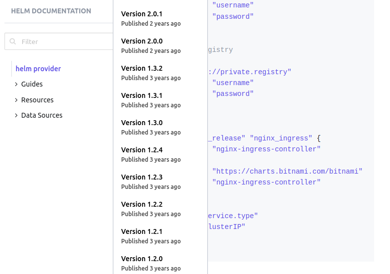
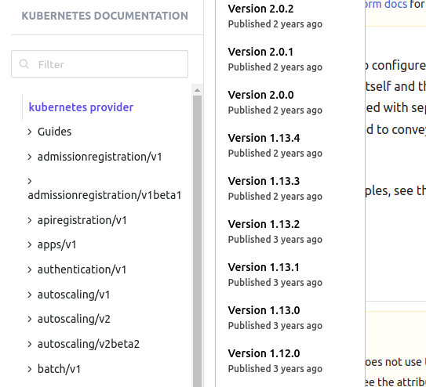

# Terraform Basics Training Course

## LAB: Hashicorp Configuration Language BASICS

1. Welcome to the very first `Terraform Lab`!

   In this lab, we will learn how to get started with HashiCorp Configuration Language that is used by Terraform.

   OK

2. Navigate to the directory `/root/terraform-projects/HCL`. There is a file present in this location.
   What is the file extension used by this file?

   List the file by using the `ls` command.

   - **.tf**
   - .file
   - main
   - .dir

   ```
   iac-server $ cd /root/terraform-projects/HCL/
   
   iac-server $ ls
   main.tf
   ```

   

3. That's right! That is a `TF` file and is used for writing configuration files in Terraform using HCL.

   OK

4. What is the `resource type` specified in this file?

   From the terminal, inspect it using tools like `cat` or text editors such as `VI` .
   Alternatively, you can open this file on `VS Code`. So navigate to this directory and inspect the file.

   - **local_file**
   - file_content
   - games
   - aws_ec2

   main.tf

   ```tf
   resource "local_file" "games" {
     file     = "/root/favorite-games"
     content  = "FIFA 21"
   }
   ```

5. What is the resource name used for the `local_file` resource in this configuration file?

   - file
   - **games**
   - local
   - favorite-games
   - local_file

   main.tf

   ```tf
   resource "local_file" "games" {
     file     = "/root/favorite-games"
     content  = "FIFA 21"
   }
   ```

6. What is the name of the provider for which we are creating this resource?

   - local_file
   - game
   - file
   - **local**

7. Which one of the below is not an example of an argument used within the resource block?

   - **resource_type = "local_file"**
   - filename = "/root/favorite-games"
   - content = "FIFA 21"

   main.tf

   ```tf
   resource "local_file" "games" {
     file     = "/root/favorite-games"
     content  = "FIFA 21"
   }
   ```

8. If you run a `terraform plan` now? Would it work?

   - **NO**
   - YES

   ```
   $ terraform plan
   
   Error: Could not load plugin
   
   
   Plugin reinitialization required. Please run "terraform init".
   
   Plugins are external binaries that Terraform uses to access and manipulate
   resources. The configuration provided requires plugins which can't be located,
   don't satisfy the version constraints, or are otherwise incompatible.
   
   Terraform automatically discovers provider requirements from your
   configuration, including providers used in child modules. To see the
   requirements and constraints, run "terraform providers".
   
   Failed to instantiate provider "registry.terraform.io/hashicorp/local" to
   obtain schema: unknown provider "registry.terraform.io/hashicorp/local"
   ```

9. Run a `terraform init` inside the configuration directory: `/root/terraform-projects/HCL`

   Check

   - terraform init run successfully?

   ```
   $ terraform init
   
   Initializing the backend...
   
   Initializing provider plugins...
   - Finding latest version of hashicorp/local...
   - Installing hashicorp/local v2.4.0...
   - Installed hashicorp/local v2.4.0 (self-signed, key ID 34365D9472D7468F)
   
   Partner and community providers are signed by their developers.
   If you'd like to know more about provider signing, you can read about it here:
   https://www.terraform.io/docs/plugins/signing.html
   
   The following providers do not have any version constraints in configuration,
   so the latest version was installed.
   
   To prevent automatic upgrades to new major versions that may contain breaking
   changes, we recommend adding version constraints in a required_providers block
   in your configuration, with the constraint strings suggested below.
   
   * hashicorp/local: version = "~> 2.4.0"
   
   Terraform has been successfully initialized!
   
   You may now begin working with Terraform. Try running "terraform plan" to see
   any changes that are required for your infrastructure. All Terraform commands
   should now work.
   
   If you ever set or change modules or backend configuration for Terraform,
   rerun this command to reinitialize your working directory. If you forget, other
   commands will detect it and remind you to do so if necessary.
   ```

10. What was the `version` of the local provider plugin that was downloaded?

   - 0.13
   - 1.0.0
   - 2.01
   - 1.00
   - **2.4.0**

11. Now, try to run a `terraform plan`.

    Did it print an execution plan as expected?

    - YES
    - **NO**

    ```
    $ terraform plan
    
    Error: Missing required argument
    
      on main.tf line 1, in resource "local_file" "games":
       1: resource "local_file" "games" {
    
    The argument "filename" is required, but no definition was found.
    
    
    Error: Unsupported argument
    
      on main.tf line 2, in resource "local_file" "games":
       2:   file     = "/root/favorite-games"
    
    An argument named "file" is not expected here.
    ```

12. Why did the command fail?

    Inspect the error produced when the command was run.

    If unsure, refer to the documentation. The documentation tab is available at the top right.

    - Incorrect Resource Type
    - Incorrect Resource Name
    - Provider not downloaded
    - **Invalid Argument**

13. Which of the following is not a valid argument for the `local_file` resource?

    If unsure, refer to the documentation.

    - sensitive_content
    - filename
    - **file**
    - file_permission
    - content

14. Fix the argument in the configuration file and then run a `terraform plan` followed by `terraform apply` to create the `local_file` resource called `games`.

    Check

    - Resource created?

    Change the argument name from `file` to `filename` and then run `terraform plan` --> `terraform apply`

    ```
    resource "local_file" "games" {
      filename  = "/root/favorite-games"
      content  = "FIFA 21"
    }
    ```

    ```
    $ terraform plan
    Refreshing Terraform state in-memory prior to plan...
    The refreshed state will be used to calculate this plan, but will not be
    persisted to local or remote state storage.
    
    
    ------------------------------------------------------------------------
    
    An execution plan has been generated and is shown below.
    Resource actions are indicated with the following symbols:
      + create
    
    Terraform will perform the following actions:
    
      # local_file.games will be created
      + resource "local_file" "games" {
          + content              = "FIFA 21"
          + content_base64sha256 = (known after apply)
          + content_base64sha512 = (known after apply)
          + content_md5          = (known after apply)
          + content_sha1         = (known after apply)
          + content_sha256       = (known after apply)
          + content_sha512       = (known after apply)
          + directory_permission = "0777"
          + file_permission      = "0777"
          + filename             = "/root/favorite-games"
          + id                   = (known after apply)
        }
    
    Plan: 1 to add, 0 to change, 0 to destroy.
    
    ------------------------------------------------------------------------
    
    Note: You didn't specify an "-out" parameter to save this plan, so Terraform
    can't guarantee that exactly these actions will be performed if
    "terraform apply" is subsequently run.
    ```

15. We have now created our very first resource using Terraform! Next, let's work on updating the resource.

    If you look at the output produced by the `terraform plan` and `terraform apply` commands closely, we can see that the file content is printed on the screen.

    Since we do not want this to happen, we have updated the resource type.

    What is the resource type that we have updated?

    - local_file
    - **local_sensitive_file**
    - local_sensitive_content
    - local_hide_content

    main.tf

    ```
    resource "local_sensitive_file" "games" {
      filename     = "/root/favorite-games"
      content  = "FIFA 21"
      sensitive_content = "FIFA 21"
    }
    ```

16. That's right, we have made use of the `local_sensitive_file` resource type to mask the contents of the file from the execution plan.

    However, something is wrong. If we run `terraform plan` or `terraform apply` now we see an error!

    Identify and fix the issue.
    Remember, we don't want the content of the file to show up in the execution plan at all.

    Check

    - Issues fixed and the resource re-created?

    

    Delete the line containing the argument called `sensitive_content` and then run `terraform plan` and then `terraform apply` to re-create the file.

    ```tf
    resource "local_sensitive_file" "games" {
      filename     = "/root/favorite-games"
      content  = "FIFA 21"
    }
    ```

    ```
    $ terraform plan
    Refreshing Terraform state in-memory prior to plan...
    The refreshed state will be used to calculate this plan, but will not be
    persisted to local or remote state storage.
    
    local_file.games: Refreshing state... [id=f68b901eb16aff12e9458bdb656a7df8d3425d4c]
    
    ------------------------------------------------------------------------
    
    An execution plan has been generated and is shown below.
    Resource actions are indicated with the following symbols:
      + create
      - destroy
    
    Terraform will perform the following actions:
    
      # local_file.games will be destroyed
      - resource "local_file" "games" {
          - content              = "FIFA 21" -> null
          - content_base64sha256 = "0QatlfVl9H412mXNB5/Y9evwrDIxEW4ooJpmph2eoUY=" -> null
          - content_base64sha512 = "F0zLI9RS+tFB53xwISp1R3wvRQ/Sw4hsxwysWamsAk/cNyHr/X/pmmykTTCuvkRvr+3y+5c7Sc/J/ObRRX1mIg==" -> null
          - content_md5          = "44a271e06ddd134cdbeab299288422f3" -> null
          - content_sha1         = "f68b901eb16aff12e9458bdb656a7df8d3425d4c" -> null
          - content_sha256       = "d106ad95f565f47e35da65cd079fd8f5ebf0ac3231116e28a09a66a61d9ea146" -> null
          - content_sha512       = "174ccb23d452fad141e77c70212a75477c2f450fd2c3886cc70cac59a9ac024fdc3721ebfd7fe99a6ca44d30aebe446fafedf2fb973b49cfc9fce6d1457d6622" -> null
          - directory_permission = "0777" -> null
          - file_permission      = "0777" -> null
          - filename             = "/root/favorite-games" -> null
          - id                   = "f68b901eb16aff12e9458bdb656a7df8d3425d4c" -> null
        }
    
      # local_sensitive_file.games will be created
      + resource "local_sensitive_file" "games" {
          + content              = (sensitive value)
          + content_base64sha256 = (known after apply)
          + content_base64sha512 = (known after apply)
          + content_md5          = (known after apply)
          + content_sha1         = (known after apply)
          + content_sha256       = (known after apply)
          + content_sha512       = (known after apply)
          + directory_permission = "0700"
          + file_permission      = "0700"
          + filename             = "/root/favorite-games"
          + id                   = (known after apply)
        }
    
    Plan: 1 to add, 0 to change, 1 to destroy.
    
    ------------------------------------------------------------------------
    
    Note: You didn't specify an "-out" parameter to save this plan, so Terraform
    can't guarantee that exactly these actions will be performed if
    "terraform apply" is subsequently run.
    ```

    ```
    $ terraform apply
    local_file.games: Refreshing state... [id=f68b901eb16aff12e9458bdb656a7df8d3425d4c]
    
    An execution plan has been generated and is shown below.
    Resource actions are indicated with the following symbols:
      + create
      - destroy
    
    Terraform will perform the following actions:
    
      # local_file.games will be destroyed
      - resource "local_file" "games" {
          - content              = "FIFA 21" -> null
          - content_base64sha256 = "0QatlfVl9H412mXNB5/Y9evwrDIxEW4ooJpmph2eoUY=" -> null
          - content_base64sha512 = "F0zLI9RS+tFB53xwISp1R3wvRQ/Sw4hsxwysWamsAk/cNyHr/X/pmmykTTCuvkRvr+3y+5c7Sc/J/ObRRX1mIg==" -> null
          - content_md5          = "44a271e06ddd134cdbeab299288422f3" -> null
          - content_sha1         = "f68b901eb16aff12e9458bdb656a7df8d3425d4c" -> null
          - content_sha256       = "d106ad95f565f47e35da65cd079fd8f5ebf0ac3231116e28a09a66a61d9ea146" -> null
          - content_sha512       = "174ccb23d452fad141e77c70212a75477c2f450fd2c3886cc70cac59a9ac024fdc3721ebfd7fe99a6ca44d30aebe446fafedf2fb973b49cfc9fce6d1457d6622" -> null
          - directory_permission = "0777" -> null
          - file_permission      = "0777" -> null
          - filename             = "/root/favorite-games" -> null
          - id                   = "f68b901eb16aff12e9458bdb656a7df8d3425d4c" -> null
        }
    
      # local_sensitive_file.games will be created
      + resource "local_sensitive_file" "games" {
          + content              = (sensitive value)
          + content_base64sha256 = (known after apply)
          + content_base64sha512 = (known after apply)
          + content_md5          = (known after apply)
          + content_sha1         = (known after apply)
          + content_sha256       = (known after apply)
          + content_sha512       = (known after apply)
          + directory_permission = "0700"
          + file_permission      = "0700"
          + filename             = "/root/favorite-games"
          + id                   = (known after apply)
        }
    
    Plan: 1 to add, 0 to change, 1 to destroy.
    
    Do you want to perform these actions?
      Terraform will perform the actions described above.
      Only 'yes' will be accepted to approve.
    
      Enter a value: yes
    
    local_file.games: Destroying... [id=f68b901eb16aff12e9458bdb656a7df8d3425d4c]
    local_file.games: Destruction complete after 0s
    local_sensitive_file.games: Creating...
    local_sensitive_file.games: Creation complete after 0s [id=f68b901eb16aff12e9458bdb656a7df8d3425d4c]
    
    Apply complete! Resources: 1 added, 0 changed, 1 destroyed.
    ```

17. Notice that the `content` of the file was not displayed when using `local_sensitive_file` instead of the `local_file` resource.

    Note: Refer to the documentation to see all the arguments supported by this resource.

    Also note that as Terraform follows an immutable infrastructure approach, the file was recreated although the contents are the same.

    OK

18. Finally, destroy this resource using `terraform destroy`.

    Check

    - Resource Destroyed?

    From the directory `/root/terraform-projects/HCL` run `terraform destroy` and answer `yes` when prompted.

    ```
    $ terraform destroy
    local_sensitive_file.games: Refreshing state... [id=f68b901eb16aff12e9458bdb656a7df8d3425d4c]
    
    An execution plan has been generated and is shown below.
    Resource actions are indicated with the following symbols:
      - destroy
    
    Terraform will perform the following actions:
    
      # local_sensitive_file.games will be destroyed
      - resource "local_sensitive_file" "games" {
          - content              = (sensitive value)
          - content_base64sha256 = "0QatlfVl9H412mXNB5/Y9evwrDIxEW4ooJpmph2eoUY=" -> null
          - content_base64sha512 = "F0zLI9RS+tFB53xwISp1R3wvRQ/Sw4hsxwysWamsAk/cNyHr/X/pmmykTTCuvkRvr+3y+5c7Sc/J/ObRRX1mIg==" -> null
          - content_md5          = "44a271e06ddd134cdbeab299288422f3" -> null
          - content_sha1         = "f68b901eb16aff12e9458bdb656a7df8d3425d4c" -> null
          - content_sha256       = "d106ad95f565f47e35da65cd079fd8f5ebf0ac3231116e28a09a66a61d9ea146" -> null
          - content_sha512       = "174ccb23d452fad141e77c70212a75477c2f450fd2c3886cc70cac59a9ac024fdc3721ebfd7fe99a6ca44d30aebe446fafedf2fb973b49cfc9fce6d1457d6622" -> null
          - directory_permission = "0700" -> null
          - file_permission      = "0700" -> null
          - filename             = "/root/favorite-games" -> null
          - id                   = "f68b901eb16aff12e9458bdb656a7df8d3425d4c" -> null
        }
    
    Plan: 0 to add, 0 to change, 1 to destroy.
    
    Do you really want to destroy all resources?
      Terraform will destroy all your managed infrastructure, as shown above.
      There is no undo. Only 'yes' will be accepted to confirm.
    
      Enter a value: yes
    
    local_sensitive_file.games: Destroying... [id=f68b901eb16aff12e9458bdb656a7df8d3425d4c]
    local_sensitive_file.games: Destruction complete after 0s
    
    Destroy complete! Resources: 1 destroyed.
    ```

# Terraform Basics

## LAB: TERRAFORM PROVIDERS

1. We have a new configuration directory located at the path `/root/terraform-projects/things-to-do`. Inspect this directory and find out the number of providers initialized within this directory.

   Do not run `terraform init` yet!

   - 2
   - 4
   - 3
   - **0**
   - 5

   Go to the `.terraform/plugins` directory and count the number of provider plugins installed. If the directory does not exist, there are no plugins downloaded yet.

2. How about now? How many provider plugins are installed in this configuration directory?

   -  3
   - 2
   - **1**
   - 0

3. How many configuration files exist in the directory: `/root/terraform-projects/things-to-do` ?

   - 0
   - 2
   - 3
   - **1**

   ```
   iac-server $ pwd
   /root/terraform-projects/things-to-do
   
   iac-server $ ls
   main.tf
   ```

4. How many resources are configured in this configuration directory?

   Count all the resource blocks used.

   - **2**
   - 1
   - 3
   - 0

   main.tf

   ```
   resource "local_file" "things-to-do" {
     filename     = "/root/things-to-do.txt"
     content  = "Clean my room before Christmas\nComplete the CKA Certification!"
   }
   resource "local_file" "more-things-to-do" {
     filename     = "/root/more-things-to-do.txt"
     content  = "Learn how to play Astronomia on the guitar!"
   }
   ```

5. What is the version of the plugin for the local provider that has been downloaded for this configuration?

   - **2.4.0**
   - 1.4.0
   - 1.3.0
   - 1.0.0

   Run `terraform init` and inspect the output or check the version of the plugin downloaded inside the `.terraform/plugins` directory.

   ```
   $ terraform init
   
   Initializing the backend...
   
   Initializing provider plugins...
   - Using previously-installed hashicorp/local v2.4.0
   
   The following providers do not have any version constraints in configuration,
   so the latest version was installed.
   
   To prevent automatic upgrades to new major versions that may contain breaking
   changes, we recommend adding version constraints in a required_providers block
   in your configuration, with the constraint strings suggested below.
   
   * hashicorp/local: version = "~> 2.4.0"
   
   Terraform has been successfully initialized!
   
   You may now begin working with Terraform. Try running "terraform plan" to see
   any changes that are required for your infrastructure. All Terraform commands
   should now work.
   
   If you ever set or change modules or backend configuration for Terraform,
   rerun this command to reinitialize your working directory. If you forget, other
   commands will detect it and remind you to do so if necessary.
   ```

6. Now, go ahead and create these resources using terraform!

   Once done, the two files defined inside the resource blocks should be created with the correct file names and content.

   Check

   - Resources created?

   Run `terraform plan (optional)` and then `terraform apply` in the directory `/root/terraform-projects/things-to-do`.

   ```
   $ terraform plan
   Refreshing Terraform state in-memory prior to plan...
   The refreshed state will be used to calculate this plan, but will not be
   persisted to local or remote state storage.
   
   
   ------------------------------------------------------------------------
   
   An execution plan has been generated and is shown below.
   Resource actions are indicated with the following symbols:
     + create
   
   Terraform will perform the following actions:
   
     # local_file.more-things-to-do will be created
     + resource "local_file" "more-things-to-do" {
         + content              = "Learn how to play Astronomia on the guitar!"
         + content_base64sha256 = (known after apply)
         + content_base64sha512 = (known after apply)
         + content_md5          = (known after apply)
         + content_sha1         = (known after apply)
         + content_sha256       = (known after apply)
         + content_sha512       = (known after apply)
         + directory_permission = "0777"
         + file_permission      = "0777"
         + filename             = "/root/more-things-to-do.txt"
         + id                   = (known after apply)
       }
   
     # local_file.things-to-do will be created
     + resource "local_file" "things-to-do" {
         + content              = <<~EOT
               Clean my room before Christmas
               Complete the CKA Certification!
           EOT
         + content_base64sha256 = (known after apply)
         + content_base64sha512 = (known after apply)
         + content_md5          = (known after apply)
         + content_sha1         = (known after apply)
         + content_sha256       = (known after apply)
         + content_sha512       = (known after apply)
         + directory_permission = "0777"
         + file_permission      = "0777"
         + filename             = "/root/things-to-do.txt"
         + id                   = (known after apply)
       }
   
   Plan: 2 to add, 0 to change, 0 to destroy.
   
   ------------------------------------------------------------------------
   
   Note: You didn't specify an "-out" parameter to save this plan, so Terraform
   can't guarantee that exactly these actions will be performed if
   "terraform apply" is subsequently run.
   ```

   ```
   $ terraform apply
   
   An execution plan has been generated and is shown below.
   Resource actions are indicated with the following symbols:
     + create
   
   Terraform will perform the following actions:
   
     # local_file.more-things-to-do will be created
     + resource "local_file" "more-things-to-do" {
         + content              = "Learn how to play Astronomia on the guitar!"
         + content_base64sha256 = (known after apply)
         + content_base64sha512 = (known after apply)
         + content_md5          = (known after apply)
         + content_sha1         = (known after apply)
         + content_sha256       = (known after apply)
         + content_sha512       = (known after apply)
         + directory_permission = "0777"
         + file_permission      = "0777"
         + filename             = "/root/more-things-to-do.txt"
         + id                   = (known after apply)
       }
   
     # local_file.things-to-do will be created
     + resource "local_file" "things-to-do" {
         + content              = <<~EOT
               Clean my room before Christmas
               Complete the CKA Certification!
           EOT
         + content_base64sha256 = (known after apply)
         + content_base64sha512 = (known after apply)
         + content_md5          = (known after apply)
         + content_sha1         = (known after apply)
         + content_sha256       = (known after apply)
         + content_sha512       = (known after apply)
         + directory_permission = "0777"
         + file_permission      = "0777"
         + filename             = "/root/things-to-do.txt"
         + id                   = (known after apply)
       }
   
   Plan: 2 to add, 0 to change, 0 to destroy.
   
   Do you want to perform these actions?
     Terraform will perform the actions described above.
     Only 'yes' will be accepted to approve.
   
     Enter a value: yes
   
   local_file.things-to-do: Creating...
   local_file.more-things-to-do: Creating...
   local_file.more-things-to-do: Creation complete after 0s [id=85e6ec1cf7be591e68345cbaf27a4529a4f25eb0]
   local_file.things-to-do: Creation complete after 0s [id=57de5ed15ca8120dba3bd950bad6d5e55b97f635]
   
   Apply complete! Resources: 2 added, 0 changed, 0 destroyed.
   ```

7. We have created another directory containing configuration files at `/root/terraform-projects/christmas-wishlist`.

   Inspect this configuration directory.

   OK

8. How many resources are configured within this configuration directory?

   Make sure to check all the `.tf` files.

   - 0
   - **2**
   - 1
   - 5

   ```
   iac-server $ cd christmas-wishlist/
   
   iac-server $ ls
   cyberpunk.tf  ps5.tf
   ```

9. What is the `filename` that will be created by the resource called `cyberpunk`?

   - cyberpunk
   - /root/ps5.txt
   - /root/cyberpunk.txt
   - **/root/cyberpunk2077.txt**

   cyberpunk.tf

   ```
   resource "local_file" "cyberpunk" {
     filename     = "/root/cyberpunk2077.txt"
     content  = "All I need for Christmas is Cyberpunk 2077!"
   }
   ```

10. Create a new configuration file within the same directory called `xbox.tf`. This file should make use of the same `local_file` resource type with the below requirements:

   Resource Name: `xbox`

   filename: `/root/xbox.txt`

   content: `Wouldn't mind an XBox either!`

   Once the configuration file has been created, use the terraform workflow to create this resource.

   Check

   - resource created as specified?

   Solution for `xbox.tf` :-

   ```
   resource "local_file" "xbox" {
     filename = "/root/xbox.txt"
     content  = "Wouldn't mind an XBox either!"
   }
   ```

   ```
   $ terraform init
   
   $ terraform plan
   
   $ terraform apply
   ```

11. Now, navigate to the directory `/root/terraform-projects/provider-a`. We have downloaded a plugin in this directory. Identify the name and type of provider.

    If the configuration files in this directory seem unfamiliar, do not worry, these are covered later in the course.

    - **Verified - linode**
    - Official - google
    - Official - linode
    - Third-Party - linode

    Run `terraform init` or inspect the `.terraform` directory. Also, make use of the documentation to determine the type of provider used.

    ```
    iac-server $ pwd
    /root/terraform-projects/provider-a
    ```

    ```
    $ terraform init
    
    Initializing the backend...
    
    Initializing provider plugins...
    - Using previously-installed linode/linode v1.13.3
    
    Terraform has been successfully initialized!
    
    You may now begin working with Terraform. Try running "terraform plan" to see
    any changes that are required for your infrastructure. All Terraform commands
    should now work.
    
    If you ever set or change modules or backend configuration for Terraform,
    rerun this command to reinitialize your working directory. If you forget, other
    commands will detect it and remind you to do so if necessary.
    ```

    ```
    iac-server $ ls -la .terraform/plugins/registry.terraform.io/linode/linode/1.13.3/linux_amd64/
    total 42368
    drwxr-xr-x 2 root root     4096 Apr 20 03:29 .
    drwxr-xr-x 3 root root     4096 Apr 20 03:29 ..
    -rw-r--r-- 1 root root     7520 Apr 20 03:29 CHANGELOG.md
    -rw-r--r-- 1 root root    16725 Apr 20 03:29 LICENSE
    -rw-r--r-- 1 root root     3428 Apr 20 03:29 README.md
    -rwxr-xr-x 1 root root 43343872 Apr 20 03:29 terraform-provider-linode_v1.13.3
    ```

12. Now, navigate to the directory `/root/terraform-projects/provider-b`. We have downloaded a plugin in this directory. Identify the name and type of provider.

    If the configuration files in this directory seem unfamiliar, do not worry, these are covered later in the course.

    Run `terraform init` or inspect the `.terraform` directory. Also, make use of the documentation to determine the type of provider used.

    - Verified - ansible
    - Official - ansible
    - **Community - ansible**

    ```
     $ terraform init
    
    Initializing the backend...
    
    Initializing provider plugins...
    - Using previously-installed nbering/ansible v1.0.4
    
    Terraform has been successfully initialized!
    
    You may now begin working with Terraform. Try running "terraform plan" to see
    any changes that are required for your infrastructure. All Terraform commands
    should now work.
    
    If you ever set or change modules or backend configuration for Terraform,
    rerun this command to reinitialize your working directory. If you forget, other
    commands will detect it and remind you to do so if necessary.
    ```


##  LAB: MULTIPLE PROVIDERS

1. Can we use multiple providers in the same configuration directory?

   - YES
   - NO

2. We have a new configuration directory located at the path `/root/terraform-projects/multi-provider`. Inspect this directory and find out the number of providers initialized.

   Don't run the `terraform init` command yet!

   - 4
   - 3
   - 2
   - **0**

   Go to the `.terraform/plugins` directory and count the number of provider plugins installed. If the directory does not exist, there are no plugins downloaded yet.

3. Now, run the `terraform init` command and inspect the `.terraform/plugins` directory. Count the number of plugins downloaded.

   OK

   ```
   $ terraform init
   
   Initializing the backend...
   
   Initializing provider plugins...
   - Finding latest version of hashicorp/random...
   - Finding latest version of hashicorp/local...
   - Installing hashicorp/local v2.4.0...
   - Installed hashicorp/local v2.4.0 (self-signed, key ID 34365D9472D7468F)
   - Installing hashicorp/random v3.5.1...
   - Installed hashicorp/random v3.5.1 (self-signed, key ID 34365D9472D7468F)
   
   Partner and community providers are signed by their developers.
   If you'd like to know more about provider signing, you can read about it here:
   https://www.terraform.io/docs/plugins/signing.html
   
   The following providers do not have any version constraints in configuration,
   so the latest version was installed.
   
   To prevent automatic upgrades to new major versions that may contain breaking
   changes, we recommend adding version constraints in a required_providers block
   in your configuration, with the constraint strings suggested below.
   
   * hashicorp/local: version = "~> 2.4.0"
   * hashicorp/random: version = "~> 3.5.1"
   
   Terraform has been successfully initialized!
   
   You may now begin working with Terraform. Try running "terraform plan" to see
   any changes that are required for your infrastructure. All Terraform commands
   should now work.
   
   If you ever set or change modules or backend configuration for Terraform,
   rerun this command to reinitialize your working directory. If you forget, other
   commands will detect it and remind you to do so if necessary.
   ```

4. How many plugins are available now in this configuration directory?

   - 1
   - 3
   - 0
   - **2**

   ```
   iac-server $ ls -la .terraform/plugins/registry.terraform.io/hashicorp/
   total 16
   drwxr-xr-x 4 root root 4096 Apr 20 03:50 .
   drwxr-xr-x 3 root root 4096 Apr 20 03:50 ..
   drwxr-xr-x 3 root root 4096 Apr 20 03:50 local
   drwxr-xr-x 3 root root 4096 Apr 20 03:50 random
   ```

5. Now, Navigate to the directory `/root/terraform-projects/MPL`. Create a new configuration file called `pet-name.tf`.
   This file should make use of the `local_file` and `random_pet` resource type with the below requirements:

   `local_file` resource details:

   Resource name = `"my-pet"`

   File name = `"/root/pet-name"`

   Content = `"My pet is called finnegan!!"`


   `random_pet` resource details:

   Resource name = `"other-pet"`

   Length = `"1"`

   Prefix = `"Mr"`

   Separator = `"."`

   Once the configuration file has been created, use the terraform workflow to create this resource.

   Check

   - resources configured correctly?
   - resources created successfully?

   The solution is provided below:

   Create pet-name.tf file with following contents:

   ```
   resource "local_file" "my-pet" {
        filename = "/root/pet-name"
        content = "My pet is called finnegan!!"
   
   }
   resource "random_pet" "other-pet" {
        length = 1
        prefix = "Mr"
        separator = "."
   
   }
   ```

   ```
   $ terraform init
   
   $ terraform plan
   
   $ terraform apply
   ```

6. Now change into the directory `/root/terraform-projects/provider` and inspect the file `cloud-provider.tf`.
   What is the `instance_type` configured with the resource type called `aws_instance`?

   Don't worry if you are not familiar with the aws providers. We will cover it later on.

   - t2.medium
   - **t2.large**
   - t2.micro
   - t2.mini

   cloud-proviver.tf

   ```
   resource "aws_instance" "ec2_instance" {
   	  ami       =  "ami-0eda277a0b884c5ab" 
   	  instance_type = "t2.large"
   }
   
   
   resource "aws_ebs_volume" "ec2_volume" {
   	  availability_zone = "eu-west-1"
   	  size  =    10
   }
   ```

7. What is the name of the resource configured with the resource type `kubernetes_namespace` in `kube.tf` file within the same directory?

   - aws-ops
   - aws-dev
   - web
   - **dev**

   kube.tf

   ```
   resource "local_file" "data" {
   	filename = "/root/k8s.txt"
   	content = "kubernetes the hard way!"
   }
   
   
   resource "kubernetes_namespace" "dev" {
     metadata {
       name = "development"
     }
   }
   ```

8. Let's get some more practice! Now navigate to the directory path `/root/terraform-projects/provider-a`. Create a configuration file called `code.tf`.

   Using the `local_file` resource type, write the resource block with the below requirements into the file:

   Resource name = `iac_code`

   File name = `/opt/practice`

   Content = `Setting up infrastructure as code`

   When ready, only run the `terraform init` command, we will run the `terraform apply` command later on.

   Check

   - configured file correctly?
   - terraform init run successfully?

   The solution is provided below:

   Create code.tf file with following contents:

   ```
   resource "local_file" "iac_code" {
             filename = "/opt/practice"
             content = "Setting up infrastructure as code"
   }
   ```

   ```
   $ terraform init
   
   $ terraform apply
   ```

9. We have made some changes to the configuration file. Are you able to run `terraform apply` command?

   - YES
   - **NO**

10. This is because whenever we add a resource for a provider that has not been used so far in the configuration directory, we have to initialize the directory by running `terraform init` command.

   Let's do that now. Run `terraform init` followed by `terraform apply` command.

   Check

   - terraform init run successfully?
   - resources created successfully?

   code.tf

   ```
   resource "local_file" "iac_code" {
   	  filename = "/opt/practice"
   	  content = "Setting up infrastructure as code"
   }
   
   
   resource "random_string" "iac_random" {
     length = 10
     min_upper = 5
   }
   ```

   

## LAB: VARIABLES

1. Which of the following is not a valid `variable type`?'

   - tuple
   - list
   - object
   - **item**
   - map

2. Which one of the below is not a valid data type in `terraform`?

   - map
   - tuple
   - **array**
   - list
   - set

3. Navigate to the directory `/root/terraform-projects/variables`. Which `type` does the variable called `number` belong to?

   - **bool**	
   - string
   - list
   - number

   variable.tf

   ```
   variable "name" {
        type = string
        default = "Mark"
     
   }
   variable "number" {
        type = bool
        default = true
     
   }
   variable "distance" {
        type = number
        default = 5
     
   }
   variable "jedi" {
        type = map
        default = {
        filename = "/root/first-jedi"
        content = "phanius"
        }
     
   }
   
   variable "gender" {
        type = list(string)
        default = ["Male", "Female"]
   }
   variable "hard_drive" {
        type = map
        default = {
             slow = "HHD"
             fast = "SSD"
        }
   }
   variable "users" {
        type = set(string)
        default = ["tom", "jerry", "pluto", "daffy", "donald", "jerry", "chip", "dale"]
   
     
   }
   ```

4. How would you fetch the value of the key called `slow` from the variable called `hard_drive` in a `terraform` configuration?

   This variable is defined in the file `variables.tf`.

   - var.hard_drive[0]
   - hard_drive["slow"]
   - var.hard_drive.slow
   - var.hard_drive.0
   - **var.hard_drive["slow"]**

   variables.tf

   ```
   variable "name" {
        type = string
        default = "Mark"
     
   }
   variable "number" {
        type = bool
        default = true
     
   }
   variable "distance" {
        type = number
        default = 5
     
   }
   variable "jedi" {
        type = map
        default = {
        filename = "/root/first-jedi"
        content = "phanius"
        }
     
   }
   
   variable "gender" {
        type = list(string)
        default = ["Male", "Female"]
   }
   variable "hard_drive" {
        type = map
        default = {
             slow = "HHD"
             fast = "SSD"
        }
   }
   variable "users" {
        type = set(string)
        default = ["tom", "jerry", "pluto", "daffy", "donald", "jerry", "chip", "dale"]
   
     
   }
   ```

5. What is the index of the element called `Female` in the variable called `gender`?

   - Female
   - 3
   - var.gender["female"]
   - **1**
   - 0

6. What is the type of variable called `users`?

   - list(string)
   - **set(string)**
   - list
   - set

7. However, this variable has been defined incorrectly! Identify the mistake.

   - **duplicate elements**
   - type used is incorrect
   - syntax error
   - elements should not be enclosed in double quotes

8. We have now updated the `main.tf` file in the same directory (`/root/terraform-projects/variables`) and added some resource blocks.

   Inspect them.

   OK

9. What is the value for the argument called `content` used in the resource block for the resource `jedi`?

   - first-jedi
   - **phanius**
   - jedi
   - obi-wan
   - yoda

10. Now, let's update this resource and add variables instead. Use the default value declared in the variable called `jedi`.
      This variable is a map. For the argument called `content` use the value of the key by the same name.
      And, similarly, for the argument called `filename` use the value by the same name.

   When ready, run `terraform init, plan and apply` to create this resource.

   Check

   - terraform init and apply run?
   - resource uses variables?

   main.tf

   ```
   resource "local_file" "jedi" {
        filename = "/root/first-jedi"
        content = "phanius"
   }
   ```

   Variable called `jedi` is a map, so we have to use below syntax :-

   ```
   resource "local_file" "jedi" {
        filename = var.jedi["filename"]
        content = var.jedi["content"]
   }
   ```


## LAB: USING VARIABLES IN TERRAFORM

1. How can we use `environment` variables to pass `input variables` in `terraform` scripts?

   - export variable
   - **TF_VAR_<variable_name>**
   - .var
   - .tf

2. Which method has the highest priority in Variable Definition Precedence?

   If unsure, Refer to the documentation. Documentation tab is available at the top right.

   - using .auto.tfvars
   - **command line flag of -var or -var-file**
   - variable definition file terraform.tfvars.json
   - using terraform.tfvars

3. Which one of the following commands is a valid way to make use of a custom variable file with the `terraform apply` command?

   - terraform apply -var-file variables.vars
   - **terraform apply -var-file variables.tfvars**
   - terraform apply -var-file variables.tf

4. We have created some files under the directory `/root/terraform-projects/variables`. Inspect it.

   OK

5. What will happen if we run `terraform plan` command right now?

   Try it.

   - **Error**
   - Success

6. The `terraform plan` command did not run as there was no reference for the input variable called `filename` in the configuration files.

   Let's fix that now.

   OK

7. Declare the variable called `filename` with type `string` in the file `variables.tf`.
   Don't have to specify a `default` value.

   Check

   - Syntax Check

   Solution available for `variables.tf` file :-

   ```
   variable filename {
     type = string
   }
   ```

8. If we run `terraform apply` with a `-var` command line flag as shown below, which value would be considered by `terraform`?

   ```
   terraform apply -var filename=/root/tennis.txt
   ```

   - default value in variables.tf
   - None of this
   - **/root/tennis.txt**
   - /root/basketball.txt

9. `Terraform` follows a variable definition precedence order to determine the value and
   the command line flag of `–var or –var-file` takes the highest priority.

   OK

## LAB: RESOURCE ATTRIBUTES

1. Navigate to the configuration directory `/root/terraform-projects/project-chronos` and inspect the files created inside.

   OK

2. What is the `resource_type` of the resource that's currently defined in the `main.tf` file?

   If unsure, refer to the documentation. Documentation tab is available at the top right panel.

   - **time_static**
   - time
   - time_stamp
   - time_update

   main.tf

   ```
    resource "time_static" "time_update" {
   }
   ```

3. As you can see, the resource block is empty. This is because `time_static` does not need any arguments to be supplied to work.

   When applied as it is, `terraform` creates a logical resource locally (similar to `random_pet`) with the current time.

   OK

4. Which of the following `attributes` are exported by the `time_static` resource?

   If unsure, refer to the documentation. Documentation tab is available at the top right panel.

   - **Id**
   - content
   - century
   - filename
   - decade

5. How do we refer to the attribute called `id` using a reference expression?

   - time_static["id"]
   - time_static.time_update["id"]
   - time_update.id
   - time_static_time
   - **time_static.time_update.id**

6. Now, update the `main.tf` file and add a new `local_file` resource called `time` with the following requirements:

   1. filename: `/root/time.txt`

   2. content: `Time stamp of this file is <id from time_update resource>`

   Use a reference expression and interpolation.

   When ready, run `terraform init, plan and apply`.

   Check

   - resource created as specified?

   Solution for `main.tf` :-

   ```
   resource "local_file" "time" {
     filename = "/root/time.txt"
     content = "Time stamp of this file is ${time_static.time_update.id}"
   
    }
    resource "time_static" "time_update" {
   }
   ```

7. What is the attribute called `id` that is created for the `local file` resource called `time`?

   Make use of the `terraform show` command and identify the attribute values.

   - 3395a1ce5b05fd3395a1ce5b05fd
   - 3f43292fd8d4e8dffef53f43292fd8d4e8dffef5
   - **313bd49f17d4637edbd6597f120b2c5990e826c2**
   - 5fdb66d473f43295fdb66d473f4329

   ```
   $ terraform show
   # local_file.time:
   resource "local_file" "time" {
       content              = "Time stamp of this file is 2023-04-24T01:23:00Z"
       content_base64sha256 = "DTgwwRr4vQ/h6PfRpp5DH48NvIAQpDGA1YJiENN26Vw="
       content_base64sha512 = "3F2SydUIUFKrKJ/tM0juJOmNgJdccXrBqCtGVM0IlDKZNn2AHkGjTyqON+VaVysdL/wJw93S2nMs9Ndv4LMvTA=="
       content_md5          = "912de55d6d251dd6ecc766ea31458f99"
       content_sha1         = "313bd49f17d4637edbd6597f120b2c5990e826c2"
       content_sha256       = "0d3830c11af8bd0fe1e8f7d1a69e431f8f0dbc8010a43180d5826210d376e95c"
       content_sha512       = "dc5d92c9d5085052ab289fed3348ee24e98d80975c717ac1a82b4654cd08943299367d801e41a34f2a8e37e55a572b1d2ffc09c3ddd2da732cf4d76fe0b32f4c"
       directory_permission = "0777"
       file_permission      = "0777"
       filename             = "/root/time.txt"
       id                   = "313bd49f17d4637edbd6597f120b2c5990e826c2"
   }
   
   # time_static.time_update:
   resource "time_static" "time_update" {
       day     = 24
       hour    = 1
       id      = "2023-04-24T01:23:00Z"
       minute  = 23
       month   = 4
       rfc3339 = "2023-04-24T01:23:00Z"
       second  = 0
       unix    = 1682299380
       year    = 2023
   }
   ```

8. What is the attribute called `rfc3339` that is created for the `time_static` resource called `time_update`?

   Make use of the `terraform show` command and identify the attribute values.

   - 2020
   - **2023-04-24T01:23:00Z**
   - 2020-01-14T00:00:00Z
   - 2020-11-22T17:23:17Z

   time.txt

   ```
   Time stamp of this file is 2023-04-24T01:23:00Z
   ```


## LAB: RESOURCE DEPENDENCIES

1. Which argument should be used to explicitly set dependencies for a resource?

   - **depends_on**
   - resource_depend
   - dependent
   - depend_on

2. `Resource A` relies on another `Resource B` but doesn't access any of its attributes in its own arguments. What is this type of dependency called?

   - implicit dependency
   - external_dependency
   - internal_dependency
   - **explicit dependency**

3. How do we make use of `implicit dependency`?

   - variables
   - datasources
   - **reference expressions**
   - depends_on

4. n the configuration directory `/root/terraform-projects/key-generator`, create a file called `key.tf` with the following specifications:


   Resource Type: `tls_private_key`

   Resource Name: `pvtkey`

   algorithm: `RSA`

   rsa_bits: `4096`

   When ready, run `terraform init, plan and apply`.

   If unsure, refer to the documentation.

   Check

   - resource created as specified?

   Solution for `key.tf` :-

   ```
   resource "tls_private_key" "pvtkey" {
     algorithm = "RSA"
     rsa_bits  = 4096
   }
   ```

5. Resource `tls_private_key` generates a secure private key and encodes it as PEM. It is a logical resource that lives only in the `terraform state`.

   You can see the details of the resource, including the private key by running the `terraform show` command.

   You can read the documentation for more details. `https://registry.terraform.io/providers/hashicorp/tls/latest/docs/resources/private_key`

   OK

   ```
   $ terraform show
   # tls_private_key.pvtkey:
   resource "tls_private_key" "pvtkey" {
       algorithm                     = "RSA"
       ecdsa_curve                   = "P224"
       id                            = "32be13e37f94f1ed9e9b56be7daeda1d98509c22"
       private_key_openssh           = (sensitive value)
       private_key_pem               = (sensitive value)
       private_key_pem_pkcs8         = (sensitive value)
       public_key_fingerprint_md5    = "e0:80:2b:8d:b8:23:79:0c:ba:19:ac:73:07:9a:58:12"
       public_key_fingerprint_sha256 = "SHA256:T/KiSiya8hwOCiztFr6EjZaAeoPD6RYet4DUWD6Ayto"
       public_key_openssh            = <<~EOT
           ssh-rsa AAAAB3NzaC1yc2EAAAADAQABAAACAQDTLyzHY+BXFdP8PjImzSR2D9rvstIUvgVUpKf2CiosohYd7cDflcWtuwJRojPWp14vXH5HwXbDJLu2T9BJqBpZZIwMYjcdrxeyRXHH+0UbpsLRMEpyXA0nq8heE4e6DZOPxQwANDokLWxJp2VBGbhGI1CcF0cSKArxSfndPQ7FMTP82lRX0MbNXjwXoM8WjUb0VSjwfTbfHcSA8eFbjdEJ+HSBivrZs0M5/mpHTzye+q8a00aWuqQ+ODjnW+4S/QDGCWLhOcWeFNslYaQ9vAnAf8y0hvdGchtSR7tcnNCk+xwtLS3hO5v0sna/A1oiU6BCOLwN1Nw/4PJssuhO3DbguR9cDIEOkcCTIV2QO6cVwxcg9gOoDBHjIHCLxt5bAb5M8L+Tn5JfpVFjgc48knshM0/k0N7EHZZ6VN4NKP158fE9KJqOx0bXnWm5sSEc+GIX4byWQC5KnsaFokozy9k1bqtLMzOjO5xPO5sLiiNe9DO0zI9iLAnl4KUupCjrKbS7QNouHBzCiLluQ/BS30eyqAYuGEnVuWAZAdj+mY/UUoFtcV3IovrSLHHUBNtjOs8wb4v9apyjK6aQC+elT52lfrahSQMURW5NLRb9dXjLnsyM8KeRfI89mR4yYUQHOT23YIoyTgwhCjTurVe+ZqN9WBXMI93me21MPWaUsPJYEQ==
       EOT
       public_key_pem                = <<~EOT
           -----BEGIN PUBLIC KEY-----
           MIICIjANBgkqhkiG9w0BAQEFAAOCAg8AMIICCgKCAgEA0y8sx2PgVxXT/D4yJs0k
           dg/a77LSFL4FVKSn9goqLKIWHe3A35XFrbsCUaIz1qdeL1x+R8F2wyS7tk/QSaga
           WWSMDGI3Ha8XskVxx/tFG6bC0TBKclwNJ6vIXhOHug2Tj8UMADQ6JC1sSadlQRm4
           RiNQnBdHEigK8Un53T0OxTEz/NpUV9DGzV48F6DPFo1G9FUo8H023x3EgPHhW43R
           Cfh0gYr62bNDOf5qR088nvqvGtNGlrqkPjg451vuEv0Axgli4TnFnhTbJWGkPbwJ
           wH/MtIb3RnIbUke7XJzQpPscLS0t4Tub9LJ2vwNaIlOgQji8DdTcP+DybLLoTtw2
           4LkfXAyBDpHAkyFdkDunFcMXIPYDqAwR4yBwi8beWwG+TPC/k5+SX6VRY4HOPJJ7
           ITNP5NDexB2WelTeDSj9efHxPSiajsdG151pubEhHPhiF+G8lkAuSp7GhaJKM8vZ
           NW6rSzMzozucTzubC4ojXvQztMyPYiwJ5eClLqQo6ym0u0DaLhwcwoi5bkPwUt9H
           sqgGLhhJ1blgGQHY/pmP1FKBbXFdyKL60ixx1ATbYzrPMG+L/WqcoyumkAvnpU+d
           pX62oUkDFEVuTS0W/XV4y57MjPCnkXyPPZkeMmFEBzk9t2CKMk4MIQo07q1Xvmaj
           fVgVzCPd5nttTD1mlLDyWBECAwEAAQ==
           -----END PUBLIC KEY-----
       EOT
       rsa_bits                      = 4096
   }
   ```

6. Now, let's use the `private key` created by this resource in another resource of type `local file`. Update the `key.tf` file with the requirements:


   Resource Name: `key_details`

   File Name: `/root/key.txt`

   Content: use a reference expression to use the attribute called `private_key_pem` of the `pvtkey` resource.

   When ready, run `terraform init, plan and apply`.

   Check

   Solution for `key.tf` :-

   ```
   resource "tls_private_key" "pvtkey" {
     algorithm = "RSA"
     rsa_bits  = 4096
   }
   
   resource "local_file" "key_details" {
     content  = tls_private_key.pvtkey.private_key_pem
     filename = "/root/key.txt"
   }
   ```

7. Now destroy these two resources.

   Use `terraform destroy`.

   Check

   - resource destroyed?

   ```
   $ terraform destroy
   ```

8. For the next question, navigate to the directory `/root/terraform-projects/explicit-dependency`.

   OK

9. Within this directory, create two `local_file` type resources in `main.tf` file.

   
   Resource 1:

   Resource Name: `whale`

   File Name: `/root/whale`

   content: `whale`

   
   Resource 2:

   Resource Name: `krill`

   File Name: `/root/krill`

   content: `krill`

   
   Resource called `whale` should depend on `krill` but do not use reference expressions.

   When ready, run `terraform init, plan and apply`.

   Check

   - Syntax Check

   Solution for `main.tf` :-

   ```
   resource "local_file" "whale" {
     filename   = "/root/whale"
     content    = "whale"
     depends_on = [local_file.krill]
   }
   resource "local_file" "krill" {
     filename = "/root/krill"
     content  = "krill"
   }
   ```


## LAB: OUTPUT VARIABLES

1. Navigate to the directory called `/root/terraform-projects/data`. We have used the configuration files created in this directory to create some resources. Inspect them.

   OK

2. Navigate to the directory called `/root/terraform-projects/data`. We have used the configuration files created in this directory to create some resources. Inspect them.

   - **random**
   - local
   - tls
   - time

   main.tf

   ```
   resource "random_uuid" "id1" {
      
   }
   resource "random_uuid" "id2" {
      
   }
   resource "random_uuid" "id3" {
      
   }
   resource "random_uuid" "id4" {
      
   }
   resource "random_uuid" "id5" {
      
   }
   resource "random_uuid" "id6" {
      
   }
   resource "random_uuid" "id7" {
      
   }
   resource "random_integer" "order1" {
     min     = 1
     max     = 99999
    
   }
   resource "random_integer" "order2" {
     min     = 1
     max     = 222222
    
   }
   ```

3. Which two resource types are configured in the configuration files?

   - random_password && random_pet
   - random_uuid && random_shuffle
   - random_pet && random_id
   - **random_uuid && random_integer**

4. We also defined a few output variables in the `output.tf` file in this configuration directory. Inspect them.

   OK

   output.tf

   ```
   output "id1" {
      value = random_uuid.id1.result
   }
   output "id2" {
       value = random_uuid.id2.result
      
   }
   output "id3" {
       value = random_uuid.id3.result
      
   }
   
   output "id4" {
       value = random_uuid.id4.result
      
   }
   output "id5" {
       value = random_uuid.id5.result
   }
      
   output "id6" {
       value = random_uuid.id6.result
      
   }
   output "id7" {
       value = random_uuid.id7.result
      
   }
   output "order1" {
    value = random_integer.order1.result
    
   }
   output "order2" {
    value = random_integer.order1.result
    
   }
   ```

5. Run `terraform init, plan and apply` to create these resources.

   Check

   - terraform applied correctly?

6. What is the value of the `output` variable called `id2` ?

   Use the `terraform output` command.

   - daaf6371-eacb-6996-b497-5491879cdcdd
   - b48f3418-400e-3c31-735e-8bc713711bce
   - **74c68a8c-73f8-706e-e438-aa8c64d71ed6**

   ```
   $ terraform output
   id1 = 10538602-96fd-9b8f-5842-b4d2d3e963e9
   id2 = 74c68a8c-73f8-706e-e438-aa8c64d71ed6
   id3 = 88be9bf7-4a26-1e63-c41b-7873661764ab
   id4 = 3121b21f-2de8-ad78-2999-c4b10c48ea2a
   id5 = 8ef26852-8f38-8abb-b39e-62440d2be7f0
   id6 = 524f978d-795d-0a25-a25b-18554c41d723
   id7 = 08261662-a3e7-6c97-1294-2477cd8e0150
   order1 = 21351
   order2 = 21351
   ```

7. What is the value of the `output` variable called `order1` ?

   Use the `terraform output` command.

   - **21351**
   - 2222
   - 040385
   - 141612
   - 240187

   ```
   $ terraform output
   id1 = 10538602-96fd-9b8f-5842-b4d2d3e963e9
   id2 = 74c68a8c-73f8-706e-e438-aa8c64d71ed6
   id3 = 88be9bf7-4a26-1e63-c41b-7873661764ab
   id4 = 3121b21f-2de8-ad78-2999-c4b10c48ea2a
   id5 = 8ef26852-8f38-8abb-b39e-62440d2be7f0
   id6 = 524f978d-795d-0a25-a25b-18554c41d723
   id7 = 08261662-a3e7-6c97-1294-2477cd8e0150
   order1 = 21351
   order2 = 21351
   ```

8. We have a new configuration directory located at the path `/root/terraform-projects/output`. Inspect the configuration files that are created in this directory.

   What is the value of the `output` variable `pet-name` ?

   Use the `terraform output` command within the new configuration directory.

   - joy
   - **herring**
   - rox
   - fin

   main.tf

   ```
   resource "random_pet" "my-pet" {
   
     length    = var.length 
   }
   
   output "pet-name" {
   	
   	value = random_pet.my-pet.id
   	description = "Record the value of pet ID generated by the random_pet resource"
   }
   ```

   variables.tf

   ```
   variable "prefix" {
     default = "Mrs"	
   }
   
   variable "separator" {
   	default = "."
   }
   
   variable "length" {
   	default = "1"
   }
   ```

   ```
   $ terraform output pet-name
   herring
   ```

9. We have just updated the `main.tf` file in this directory with a new resource block.
   Add a new `output` variable with the following specifications:

   Output Variable Name: `welcome_message`

   Value: `content` of the resource called `welcome`

   When ready, run `terraform init, plan and apply`

   Check

   - resource and output variable created?

   main.tf

   ```
   resource "random_pet" "my-pet" {
   
     length = var.length
   }
   
   output "pet-name" {
   
     value       = random_pet.my-pet.id
     description = "Record the value of pet ID generated by the random_pet resource"
   }
   
   resource "local_file" "welcome" {
     filename = "/root/message.txt"
     content  = "Welcome to Kodekloud."
   }
   output "welcome_message" {
     value = local_file.welcome.content
   }
   ```

   ```
   terraform apply
   random_pet.my-pet: Refreshing state... [id=herring]
   local_file.welcome: Refreshing state... [id=d2d3e44fe87af01e8f96ec1b0e467845109264b2]
   
   Apply complete! Resources: 0 added, 0 changed, 0 destroyed.
   
   Outputs:
   
   pet-name = herring
   welcome_message = Welcome to Kodekloud.
   ```


# Terraform State

## LAB: TERRAFORM STATE

1. Which location is the terraform `state file` stored by default?

   - **Inside the configuration directory**
   - /root
   - /tmp
   - /root/terraform-projects

2. Which option should we use to disable state?

   - -state=false
   - **We cannot disable state!**
   - -refresh=false
   - --nostate

3. Which format is the state file stored in by default?

   - TOML
   - XML
   - YAML
   - **JSON**

4. Which of the following commands does NOT refresh the state?

   - terraform plan
   - **terraform init**
   - terraform apply

5. What is the name of the state file that is created by default?

   - state.tf
   - terraform.tfvars
   - .terraform
   - **terraform.tfstate**

6. Navigate to the configuration directory `/root/terraform-projects/project-flash` we have created a few configuration files here. The directory has been initialized and the provider plugins downloaded inside the `.terraform` directory. However, there is no `terraform.tfstate` file created. Why is that?

   - terraform plan was not run
   - **terraform apply was not run**
   - syntax error
   - terraform init was not run correctly

7. Run the `terraform show` command and identify the `id` created for the resource called `speed_force`.

   - 121212-232323
   - 75c434n343-43c9323
   - **No Details Printed - There is No State**
   - 2c23232-23cdc4r23

   ```
   $ terraform show
   No state.
   ```

8. Now, run `terraform apply` in this directory.

   Check

   - Syntax Check

   main.tf

   ```
   resource "local_file" "speed_force" {
       filename = "/root/speed-force"
       content = "speed-force"
   }
   ```

   reverse-flash.tf

   ```
   resource "local_file" "reverse-flash" {
       filename = "/root/reverse-flash"
       content = "reverse-flash"
   }
   ```

   ridller.tf

   ```
   resource "local_file" "riddler" {
       filename = "/root/riddler"
       content = "riddler"
   }
   ```

   zoom.tf

   ```
   resource "local_file" "zoom" {
       filename = "/root/zoom"
       content = "zoom"
   }
   ```

   

9. Now, check `terraform show` again. What is the value of id for the resource called `speed_force`?

   - e6b4b0d3255bfef95e6b4b0d3255bfef95
   - **ebeb8b595c8eb4a6e81cacf244146e742fab2981**
   - da39a3ee5e6b4b0d32da39a3ee5e6b4b0d32
   - 55bfef95601890afd8070955bfef95601890afd80709

   ```
   $ terraform show
   # local_file.reverse-flash:
   resource "local_file" "reverse-flash" {
       content              = "reverse-flash"
       content_base64sha256 = "Kace3gKIeU2ZCrzpIfitqTpaWRR2kK9h1SfG7HQX9g8="
       content_base64sha512 = "B02UG9wp6Czo23pn2gT/+YreJPaAoMf5fvjDpnymQiXsSfNSHvLfhyn4qXmNQUqborgGFq3imi6wMp7GYHQnPg=="
       content_md5          = "f6cc31cf8b2e4d5868b646567f2c8edb"
       content_sha1         = "eebf1b0eee8ccea695bf7925def3d540801e16c7"
       content_sha256       = "29a71ede0288794d990abce921f8ada93a5a59147690af61d527c6ec7417f60f"
       content_sha512       = "074d941bdc29e82ce8db7a67da04fff98ade24f680a0c7f97ef8c3a67ca64225ec49f3521ef2df8729f8a9798d414a9ba2b80616ade29a2eb0329ec66074273e"
       directory_permission = "0777"
       file_permission      = "0777"
       filename             = "/root/reverse-flash"
       id                   = "eebf1b0eee8ccea695bf7925def3d540801e16c7"
   }
   
   # local_file.riddler:
   resource "local_file" "riddler" {
       content              = "riddler"
       content_base64sha256 = "ZovOaJeJQ6wk+LukJRF4IvHfbvLwrjID3HoP9Mrvo6A="
       content_base64sha512 = "ZzOhD2IhUO4zPafhb8xoi1zMpVzfiOcprBlhCY7waUIS1/zHmvtbVYqS5aQdXnTQEFjEmuvjlwqaV9kErD/7TA=="
       content_md5          = "426c70c360c4b0c5ef58e6dc535cf520"
       content_sha1         = "4a99c9eed6c660f5874cc2505558d5abf940a498"
       content_sha256       = "668bce68978943ac24f8bba425117822f1df6ef2f0ae3203dc7a0ff4caefa3a0"
       content_sha512       = "6733a10f622150ee333da7e16fcc688b5ccca55cdf88e729ac1961098ef0694212d7fcc79afb5b558a92e5a41d5e74d01058c49aebe3970a9a57d904ac3ffb4c"
       directory_permission = "0777"
       file_permission      = "0777"
       filename             = "/root/riddler"
       id                   = "4a99c9eed6c660f5874cc2505558d5abf940a498"
   }
   
   # local_file.speed_force:
   resource "local_file" "speed_force" {
       content              = "speed-force"
       content_base64sha256 = "+hI5F86aVJG7nQ6K0VEOJHTIhlj5aRLnpODNbyZExtI="
       content_base64sha512 = "COfaah4Goo2T1qerQ8gYg5uR6onGpW1IjlpCtZuOW3UT+MH0rzPSj/LSKTJHHCfYVL0w3Q0B78u8RsRpueUNqg=="
       content_md5          = "b5db1e5be7170beefea11ae7271a06a8"
       content_sha1         = "ebeb8b595c8eb4a6e81cacf244146e742fab2981"
       content_sha256       = "fa123917ce9a5491bb9d0e8ad1510e2474c88658f96912e7a4e0cd6f2644c6d2"
       content_sha512       = "08e7da6a1e06a28d93d6a7ab43c818839b91ea89c6a56d488e5a42b59b8e5b7513f8c1f4af33d28ff2d22932471c27d854bd30dd0d01efcbbc46c469b9e50daa"
       directory_permission = "0777"
       file_permission      = "0777"
       filename             = "/root/speed-force"
       id                   = "ebeb8b595c8eb4a6e81cacf244146e742fab2981"
   }
   
   # local_file.zoom:
   resource "local_file" "zoom" {
       content              = "zoom"
       content_base64sha256 = "0hu1N3JdYD7i2635w9Hikaa3rtIV02o05YoaOw2qUIQ="
       content_base64sha512 = "3Y2YQB1BY5V4oYMn3EG3BuLyLFtEZINT1DQ+37JtqKgecw0RXR4hvh4dfrMJNcD0jYgwfh1k64noe1NNjLZx8w=="
       content_md5          = "15913c103a5238e5a80ac2f498ee090d"
       content_sha1         = "92298812107bb17eff1b85e15547ae13b6fee3a1"
       content_sha256       = "d21bb537725d603ee2dbadf9c3d1e291a6b7aed215d36a34e58a1a3b0daa5084"
       content_sha512       = "dd8d98401d41639578a18327dc41b706e2f22c5b44648353d4343edfb26da8a81e730d115d1e21be1e1d7eb30935c0f48d88307e1d64eb89e87b534d8cb671f3"
       directory_permission = "0777"
       file_permission      = "0777"
       filename             = "/root/zoom"
       id                   = "92298812107bb17eff1b85e15547ae13b6fee3a1"
   }
   ```

10. We have just added a new configuration file called `aws-infra.tf` into this configuration directory and provisioned the resources.

   These are `AWS` resources. Don't worry if they are unfamiliar to you, we will soon be learning about them in the upcoming lectures!

   OK

   aws-inra.tf

   ```
   resource "aws_instance" "dev-server" {
       instance_type = "t2.micro"
       ami         = "ami-02cff456777cd"
   }
   resource "aws_s3_bucket" "falshpoint"  {
       bucket = "project-flashpoint-paradox"
   }
   ```

11. Inspect the `terraform.tfstate` file or run `terraform show` command.

    You will notice that all the attribute details for all the resources created by this configuration is now printed on the screen!

    Among them is an `EC2 Instance` which is created by the resource called `dev-server`. See if you can find out the `private_ip` for the instance that was created.

    - **10.23.169.44**

    terraform.tfstate

    ```
    {
      "version": 4,
      "terraform_version": "0.13.3",
      "serial": 7,
      "lineage": "6f0c078f-5b40-5f46-a8af-3d17e5601567",
      "outputs": {},
      "resources": [
        {
          "mode": "managed",
          "type": "aws_instance",
          "name": "dev-server",
          "provider": "provider[\"registry.terraform.io/hashicorp/aws\"]",
          "instances": [
            {
              "status": "tainted",
              "schema_version": 1,
              "attributes": {
                "ami": "ami-02cff456777cd",
                "arn": "arn:aws:ec2:us-east-1::instance/i-133bbe9035332521b",
                "associate_public_ip_address": true,
                "availability_zone": "us-east-1a",
                "capacity_reservation_specification": null,
                "cpu_core_count": null,
                "cpu_threads_per_core": null,
                "credit_specification": [],
                "disable_api_stop": null,
                "disable_api_termination": null,
                "ebs_block_device": [],
                "ebs_optimized": false,
                "enclave_options": [],
                "ephemeral_block_device": [],
                "get_password_data": false,
                "hibernation": null,
                "host_id": "",
                "host_resource_group_arn": null,
                "iam_instance_profile": "",
                "id": "i-133bbe9035332521b",
                "instance_initiated_shutdown_behavior": "",
                "instance_state": "running",
                "instance_type": "t2.micro",
                "ipv6_address_count": 0,
                "ipv6_addresses": [],
                "key_name": "None",
                "launch_template": [],
                "maintenance_options": [],
                "metadata_options": [],
                "monitoring": false,
                "network_interface": [],
                "outpost_arn": "",
                "password_data": null,
                "placement_group": "",
                "placement_partition_number": 0,
                "primary_network_interface_id": "eni-50ca749e",
                "private_dns": "ip-10-23-169-44.ec2.internal",
                "private_dns_name_options": [],
                "private_ip": "10.23.169.44",
                "public_dns": "ec2-54-214-47-218.compute-1.amazonaws.com",
                "public_ip": "54.214.47.218",
                "root_block_device": [
                  {
                    "delete_on_termination": true,
                    "device_name": "/dev/sda1",
                    "encrypted": false,
                    "iops": 0,
                    "kms_key_id": "",
                    "tags": {},
                    "throughput": 0,
                    "volume_id": "vol-1ef9b058",
                    "volume_size": 8,
                    "volume_type": "gp2"
                  }
                ],
                "secondary_private_ips": [],
                "security_groups": [],
                "source_dest_check": true,
                "subnet_id": "subnet-cb9adb7e",
                "tags": null,
                "tags_all": null,
                "tenancy": "default",
                "timeouts": null,
                "user_data": null,
                "user_data_base64": null,
                "user_data_replace_on_change": false,
                "volume_tags": null,
                "vpc_security_group_ids": []
              },
              "private": "eyJlMmJmYjczMC1lY2FhLTExZTYtOGY4OC0zNDM2M2JjN2M0YzAiOnsiY3JlYXRlIjo2MDAwMDAwMDAwMDAsImRlbGV0ZSI6MTIwMDAwMDAwMDAwMCwidXBkYXRlIjo2MDAwMDAwMDAwMDB9LCJzY2hlbWFfdmVyc2lvbiI6IjEifQ=="
            }
          ]
        },
        {
          "mode": "managed",
          "type": "aws_s3_bucket",
          "name": "falshpoint",
          "provider": "provider[\"registry.terraform.io/hashicorp/aws\"]",
          "instances": [
            {
              "schema_version": 0,
              "attributes": {
                "acceleration_status": "",
                "acl": null,
                "arn": "arn:aws:s3:::project-flashpoint-paradox",
                "bucket": "project-flashpoint-paradox",
                "bucket_domain_name": "project-flashpoint-paradox.s3.amazonaws.com",
                "bucket_prefix": "",
                "bucket_regional_domain_name": "project-flashpoint-paradox.s3.amazonaws.com",
                "cors_rule": [],
                "force_destroy": false,
                "grant": [
                  {
                    "id": "75aa57f09aa0c8caeab4f8c24e99d10f8e7faeebf76c078efc7c6caea54ba06a",
                    "permissions": [
                      "FULL_CONTROL"
                    ],
                    "type": "CanonicalUser",
                    "uri": ""
                  }
                ],
                "hosted_zone_id": "Z3AQBSTGFYJSTF",
                "id": "project-flashpoint-paradox",
                "lifecycle_rule": [],
                "logging": [],
                "object_lock_configuration": [],
                "object_lock_enabled": false,
                "policy": "",
                "region": "us-east-1",
                "replication_configuration": [],
                "request_payer": "BucketOwner",
                "server_side_encryption_configuration": [],
                "tags": null,
                "tags_all": {},
                "timeouts": null,
                "versioning": [
                  {
                    "enabled": false,
                    "mfa_delete": false
                  }
                ],
                "website": [],
                "website_domain": null,
                "website_endpoint": null
              },
              "private": "eyJlMmJmYjczMC1lY2FhLTExZTYtOGY4OC0zNDM2M2JjN2M0YzAiOnsiY3JlYXRlIjoxMjAwMDAwMDAwMDAwLCJkZWxldGUiOjM2MDAwMDAwMDAwMDAsInJlYWQiOjEyMDAwMDAwMDAwMDAsInVwZGF0ZSI6MTIwMDAwMDAwMDAwMH19"
            }
          ]
        },
        {
          "mode": "managed",
          "type": "local_file",
          "name": "reverse-flash",
          "provider": "provider[\"registry.terraform.io/hashicorp/local\"]",
          "instances": [
            {
              "schema_version": 0,
              "attributes": {
                "content": "reverse-flash",
                "content_base64": null,
                "content_base64sha256": "Kace3gKIeU2ZCrzpIfitqTpaWRR2kK9h1SfG7HQX9g8=",
                "content_base64sha512": "B02UG9wp6Czo23pn2gT/+YreJPaAoMf5fvjDpnymQiXsSfNSHvLfhyn4qXmNQUqborgGFq3imi6wMp7GYHQnPg==",
                "content_md5": "f6cc31cf8b2e4d5868b646567f2c8edb",
                "content_sha1": "eebf1b0eee8ccea695bf7925def3d540801e16c7",
                "content_sha256": "29a71ede0288794d990abce921f8ada93a5a59147690af61d527c6ec7417f60f",
                "content_sha512": "074d941bdc29e82ce8db7a67da04fff98ade24f680a0c7f97ef8c3a67ca64225ec49f3521ef2df8729f8a9798d414a9ba2b80616ade29a2eb0329ec66074273e",
                "directory_permission": "0777",
                "file_permission": "0777",
                "filename": "/root/reverse-flash",
                "id": "eebf1b0eee8ccea695bf7925def3d540801e16c7",
                "sensitive_content": null,
                "source": null
              }
            }
          ]
        },
        {
          "mode": "managed",
          "type": "local_file",
          "name": "riddler",
          "provider": "provider[\"registry.terraform.io/hashicorp/local\"]",
          "instances": [
            {
              "schema_version": 0,
              "attributes": {
                "content": "riddler",
                "content_base64": null,
                "content_base64sha256": "ZovOaJeJQ6wk+LukJRF4IvHfbvLwrjID3HoP9Mrvo6A=",
                "content_base64sha512": "ZzOhD2IhUO4zPafhb8xoi1zMpVzfiOcprBlhCY7waUIS1/zHmvtbVYqS5aQdXnTQEFjEmuvjlwqaV9kErD/7TA==",
                "content_md5": "426c70c360c4b0c5ef58e6dc535cf520",
                "content_sha1": "4a99c9eed6c660f5874cc2505558d5abf940a498",
                "content_sha256": "668bce68978943ac24f8bba425117822f1df6ef2f0ae3203dc7a0ff4caefa3a0",
                "content_sha512": "6733a10f622150ee333da7e16fcc688b5ccca55cdf88e729ac1961098ef0694212d7fcc79afb5b558a92e5a41d5e74d01058c49aebe3970a9a57d904ac3ffb4c",
                "directory_permission": "0777",
                "file_permission": "0777",
                "filename": "/root/riddler",
                "id": "4a99c9eed6c660f5874cc2505558d5abf940a498",
                "sensitive_content": null,
                "source": null
              }
            }
          ]
        },
        {
          "mode": "managed",
          "type": "local_file",
          "name": "speed_force",
          "provider": "provider[\"registry.terraform.io/hashicorp/local\"]",
          "instances": [
            {
              "schema_version": 0,
              "attributes": {
                "content": "speed-force",
                "content_base64": null,
                "content_base64sha256": "+hI5F86aVJG7nQ6K0VEOJHTIhlj5aRLnpODNbyZExtI=",
                "content_base64sha512": "COfaah4Goo2T1qerQ8gYg5uR6onGpW1IjlpCtZuOW3UT+MH0rzPSj/LSKTJHHCfYVL0w3Q0B78u8RsRpueUNqg==",
                "content_md5": "b5db1e5be7170beefea11ae7271a06a8",
                "content_sha1": "ebeb8b595c8eb4a6e81cacf244146e742fab2981",
                "content_sha256": "fa123917ce9a5491bb9d0e8ad1510e2474c88658f96912e7a4e0cd6f2644c6d2",
                "content_sha512": "08e7da6a1e06a28d93d6a7ab43c818839b91ea89c6a56d488e5a42b59b8e5b7513f8c1f4af33d28ff2d22932471c27d854bd30dd0d01efcbbc46c469b9e50daa",
                "directory_permission": "0777",
                "file_permission": "0777",
                "filename": "/root/speed-force",
                "id": "ebeb8b595c8eb4a6e81cacf244146e742fab2981",
                "sensitive_content": null,
                "source": null
              }
            }
          ]
        },
        {
          "mode": "managed",
          "type": "local_file",
          "name": "zoom",
          "provider": "provider[\"registry.terraform.io/hashicorp/local\"]",
          "instances": [
            {
              "schema_version": 0,
              "attributes": {
                "content": "zoom",
                "content_base64": null,
                "content_base64sha256": "0hu1N3JdYD7i2635w9Hikaa3rtIV02o05YoaOw2qUIQ=",
                "content_base64sha512": "3Y2YQB1BY5V4oYMn3EG3BuLyLFtEZINT1DQ+37JtqKgecw0RXR4hvh4dfrMJNcD0jYgwfh1k64noe1NNjLZx8w==",
                "content_md5": "15913c103a5238e5a80ac2f498ee090d",
                "content_sha1": "92298812107bb17eff1b85e15547ae13b6fee3a1",
                "content_sha256": "d21bb537725d603ee2dbadf9c3d1e291a6b7aed215d36a34e58a1a3b0daa5084",
                "content_sha512": "dd8d98401d41639578a18327dc41b706e2f22c5b44648353d4343edfb26da8a81e730d115d1e21be1e1d7eb30935c0f48d88307e1d64eb89e87b534d8cb671f3",
                "directory_permission": "0777",
                "file_permission": "0777",
                "filename": "/root/zoom",
                "id": "92298812107bb17eff1b85e15547ae13b6fee3a1",
                "sensitive_content": null,
                "source": null
              }
            }
          ]
        }
      ]
    }
    ```

12. We will soon be working with `AWS` services and deploying resources on `AWS` with `Terraform`!

    OK

# Working with Terraform


## LAB: TERRAFORM COMMANDS

1. Which command can be used to create a visual representation of our `terraform` resources?

   - terraform map
   - **terraform graph**
   - terraform console
   - terraform view
   - terraform flow

2. We have created a configuration directory `/root/terraform-projects/project-shazam`. The configuration file inside will be used to create an `RSA` type private key and then a `certificate signing request` or a `csr` using this key.

   However, there is an error with the configuration.

   Use the `terraform validate` command, troubleshoot, and fix the issue.

   You don't have to create the resources yet! You only need to fix the errors reported by `terraform validate`.

   Check

   - validation working ?

   ```
   $ terraform validate
   
   Error: Unsupported argument
   
     on main.tf line 8, in resource "tls_private_key" "private_key":
      8:   dsa_bits  = 2048
   
   An argument named "dsa_bits" is not expected here. Did you mean "rsa_bits"?
   ```

   The argument called `dsa_bits` in the resource block for creating the private key is incorrect. For `RSA` algorithm, the correct argument to use is `rsa_bits`.

   main.tf

   ```
   resource "local_file" "key_data" {
           filename       = "/tmp/.pki/private_key.pem"
           content = tls_private_key.private_key.private_key_pem
           file_permission =  "0400"
   }
   resource "tls_private_key" "private_key" {
     algorithm   = "RSA"
     rsa_bits  = 2048
     ecdsa_curve = "P384"
   }
   resource "tls_cert_request" "csr" {
     private_key_pem = file("/tmp/.pki/private_key.pem")
     depends_on = [ local_file.key_data ]
   
     subject {
       common_name  = "flexit.com"
       organization = "FlexIT Consulting Services"
     }
   }
   ```

   ```
   $ terraform validate
   Success! The configuration is valid.
   ```

3. Great! If you completed the previous question correctly, `terraform validate` should have passed!
   Now run `terraform plan` and generate a configuration plan.

   Did it work?

   - NO
   - **YES**

   ```
   $ terraform plan
   Refreshing Terraform state in-memory prior to plan...
   The refreshed state will be used to calculate this plan, but will not be
   persisted to local or remote state storage.
   
   
   ------------------------------------------------------------------------
   
   An execution plan has been generated and is shown below.
   Resource actions are indicated with the following symbols:
     + create
   
   Terraform will perform the following actions:
   
     # local_file.key_data will be created
     + resource "local_file" "key_data" {
         + content              = (known after apply)
         + content_base64sha256 = (known after apply)
         + content_base64sha512 = (known after apply)
         + content_md5          = (known after apply)
         + content_sha1         = (known after apply)
         + content_sha256       = (known after apply)
         + content_sha512       = (known after apply)
         + directory_permission = "0777"
         + file_permission      = "0400"
         + filename             = "/tmp/.pki/private_key.pem"
         + id                   = (known after apply)
       }
   
     # tls_cert_request.csr will be created
     + resource "tls_cert_request" "csr" {
         + cert_request_pem = (known after apply)
         + id               = (known after apply)
         + key_algorithm    = (known after apply)
   
         + subject {
             + common_name  = "flexit.com"
             + organization = "FlexIT Consulting Services"
           }
       }
   
     # tls_private_key.private_key will be created
     + resource "tls_private_key" "private_key" {
         + algorithm                     = "RSA"
         + ecdsa_curve                   = "P384"
         + id                            = (known after apply)
         + private_key_openssh           = (sensitive value)
         + private_key_pem               = (sensitive value)
         + private_key_pem_pkcs8         = (sensitive value)
         + public_key_fingerprint_md5    = (known after apply)
         + public_key_fingerprint_sha256 = (known after apply)
         + public_key_openssh            = (known after apply)
         + public_key_pem                = (known after apply)
         + rsa_bits                      = 2048
       }
   
   Plan: 3 to add, 0 to change, 0 to destroy.
   
   ------------------------------------------------------------------------
   
   Note: You didn't specify an "-out" parameter to save this plan, so Terraform
   can't guarantee that exactly these actions will be performed if
   "terraform apply" is subsequently run.
   ```

   

4. Now, try creating the resources with a `terraform apply`.

   Did that work?

   - YES
   - NO

   ```
   $ terraform apply
   
   An execution plan has been generated and is shown below.
   Resource actions are indicated with the following symbols:
     + create
   
   Terraform will perform the following actions:
   
     # local_file.key_data will be created
     + resource "local_file" "key_data" {
         + content              = (known after apply)
         + content_base64sha256 = (known after apply)
         + content_base64sha512 = (known after apply)
         + content_md5          = (known after apply)
         + content_sha1         = (known after apply)
         + content_sha256       = (known after apply)
         + content_sha512       = (known after apply)
         + directory_permission = "0777"
         + file_permission      = "0400"
         + filename             = "/tmp/.pki/private_key.pem"
         + id                   = (known after apply)
       }
   
     # tls_cert_request.csr will be created
     + resource "tls_cert_request" "csr" {
         + cert_request_pem = (known after apply)
         + id               = (known after apply)
         + key_algorithm    = (known after apply)
   
         + subject {
             + common_name  = "flexit.com"
             + organization = "FlexIT Consulting Services"
           }
       }
   
     # tls_private_key.private_key will be created
     + resource "tls_private_key" "private_key" {
         + algorithm                     = "RSA"
         + ecdsa_curve                   = "P384"
         + id                            = (known after apply)
         + private_key_openssh           = (sensitive value)
         + private_key_pem               = (sensitive value)
         + private_key_pem_pkcs8         = (sensitive value)
         + public_key_fingerprint_md5    = (known after apply)
         + public_key_fingerprint_sha256 = (known after apply)
         + public_key_openssh            = (known after apply)
         + public_key_pem                = (known after apply)
         + rsa_bits                      = 2048
       }
   
   Plan: 3 to add, 0 to change, 0 to destroy.
   
   Do you want to perform these actions?
     Terraform will perform the actions described above.
     Only 'yes' will be accepted to approve.
   
     Enter a value: yes
   
   tls_private_key.private_key: Creating...
   tls_private_key.private_key: Creation complete after 0s [id=4169e6e325ef7afafc28eb09d126fba238a1630e]
   local_file.key_data: Creating...
   local_file.key_data: Creation complete after 0s [id=18a09b9e733779d39d6628af9e5f28ed358af16c]
   
   Error: Provider produced inconsistent final plan
   
   When expanding the plan for tls_cert_request.csr to include new values learned
   so far during apply, provider "registry.terraform.io/hashicorp/tls" produced
   an invalid new value for .private_key_pem: inconsistent values for sensitive
   attribute.
   
   This is a bug in the provider, which should be reported in the provider's own
   issue tracker.
   ```

5. The `terraform apply` failed in spite of our validation working! This is because the validate command only carries out a general verification of the configuration. It validated the resource block and the argument syntax but not the `values` the arguments expect for a specific resource!

   OK

6. The error in the configuration is inside the resource block for the `tls_private_key` type resource.
   It contains the configuration that we needed for generating `rsa` type key..

   Inspect the resource block and fix the issue.

   Once done, run `terraform plan and then apply` to created the resources.

   Check

   - Issues fixed and resources created?

   The Algorithm used by the `tls_private_key` is `RSA` but the configuration also mentions `ecdsa_curve` argument.

   main.tf

   ```
   resource "local_file" "key_data" {
           filename       = "/tmp/.pki/private_key.pem"
           content = tls_private_key.private_key.private_key_pem
           file_permission =  "0400"
   }
   resource "tls_private_key" "private_key" {
     algorithm   = "RSA"
     rsa_bits  = 2048
   }
   resource "tls_cert_request" "csr" {
     private_key_pem = file("/tmp/.pki/private_key.pem")
     depends_on = [ local_file.key_data ]
   
     subject {
       common_name  = "flexit.com"
       organization = "FlexIT Consulting Services"
     }
   }
   ```

7. Now format the `main.tf` file into a canonical format.

   Check

   - Syntax Check

   ```
   $ terraform fmt
   main.tf
   ```

   main.tf

   ```
   resource "local_file" "key_data" {
     filename        = "/tmp/.pki/private_key.pem"
     content         = tls_private_key.private_key.private_key_pem
     file_permission = "0400"
   }
   resource "tls_private_key" "private_key" {
     algorithm = "RSA"
     rsa_bits  = 2048
   }
   resource "tls_cert_request" "csr" {
     private_key_pem = file("/tmp/.pki/private_key.pem")
     depends_on      = [local_file.key_data]
   
     subject {
       common_name  = "flexit.com"
       organization = "FlexIT Consulting Services"
     }
   }
   ```

8. Now, navigate to the directory `/root/terraform-projects/project-a`. We have already created the resources specified in this configuration.

   Fetch details from the state file and identify the value of the `filename` argument.

   Note: Do not rely on the current value in the configuration file.

   - filename = "/var/codes"
   - filename = "/opt/log"
   - filename = "/tmp/apps"
   - **filename = "/root/codes"**

   Use the `terraform show` command to inspect the `terraform.tfstate` file.

   data.tf

   ```
   resource "local_file" "data" {
   	  filename = "/opt/codes"
   	  content = "You've to write this code."
   ```

   ```
   $ terraform show
   # local_file.data:
   resource "local_file" "data" {
       content              = "You've to write this code."
       content_base64sha256 = "FZy1Bn26UEIGgBj6E/3aMFPPo0z8wmDp4ljqh+WYuWQ="
       content_base64sha512 = "4pC7k3YFVhg+Cu2fo0I5b1/h1JH9HpbFLHG2MFuCEHh5UYsZyWciDm0KkkwBqvlrYxzbYuCq2fuSvH4hV31i5Q=="
       content_md5          = "55403026bfc0ce8205d712ed68891251"
       content_sha1         = "fc307f99d6490d988433ce246d60eb4ca005a87c"
       content_sha256       = "159cb5067dba5042068018fa13fdda3053cfa34cfcc260e9e258ea87e598b964"
       content_sha512       = "e290bb93760556183e0aed9fa342396f5fe1d491fd1e96c52c71b6305b82107879518b19c967220e6d0a924c01aaf96b631cdb62e0aad9fb92bc7e21577d62e5"
       directory_permission = "0777"
       file_permission      = "0777"
       filename             = "/root/codes"
       id                   = "fc307f99d6490d988433ce246d60eb4ca005a87c"
   }
   ```

9. In these `terraform` labs, we have used multiple providers so far. But, what are `providers`?

   - **Plugins**
   - Registry
   - None
   - Protocol

10. Which one is a valid `sub-command` of the `terraform providers` command?

   - list
   - **mirror**
   - update
   - status

   ```
   $ terraform providers --help
   
   Usage: terraform providers [dir]
   
     Prints out a tree of modules in the referenced configuration annotated with
     their provider requirements.
   
     This provides an overview of all of the provider requirements across all
     referenced modules, as an aid to understanding why particular provider
     plugins are needed and why particular versions are selected.
   
   
   Subcommands:
       mirror    Mirrors the provider plugins needed for the current configuration
       schema    Prints the schemas of the providers used in the configuration
   ```

11. A new configuration directory `/root/terraform-projects/provider` has been created. We have already run the `terraform init` command.
    Now check the provider plugins that have been downloaded from the command line utility (instead of inspecting the `.terraform` directory). After that choose the correct option.

    - kubernetes && random
    - azurerm && dns
    - google && helm
    - **local && aws**

    project.tf

    ```
    resource "local_file" "cloud" {
    	   filename = "/tmp/plugins"
    	   content = "multiple cloud providers."
    
    }
    
    resource "aws_ebs_volume" "myvolume" {
      availability_zone = "us-east-2"
      size              = 20
    }
    ```

    ```
    $ terraform providers
    
    Providers required by configuration:
    .
    ├── provider[registry.terraform.io/hashicorp/local]
    └── provider[registry.terraform.io/hashicorp/aws]
    ```


## LAB: LIFECYCLE RULES

1. We have a directory created called `/root/terraform-projects/project-mysterio`. The `main.tf` file already has a couple of resource blocks.

   Which resource types do they use?

   - **local_file && random_string**
   - random_pet && local_file
   - local_file && tls_private_Key
   - random_pet && rls_private_key

   main.tf

   ```
   resource "local_file" "file" {
       filename = var.filename
       file_permission =  var.permission
       content = random_string.string.id
       
   }
   
   resource "random_string" "string" {
       length = var.length
       keepers = {
           length = var.length
       }  
       
   }
   ```

   variables.tf

   ```
   variable "length" {
       default = 10
     
   }
   variable "filename" {
       default = "/root/random_text"
   }
   variable "content" {
       default = "This file contains a single line of data"
   }
   variable "permission" {
       default = 0700
   }
   ```

2. Now, create these two resources that have been defined in this configuration file.

   Check

   - resources created?

   ```
   $ terraform init
   
   $ terraform plan
   
   $ terraform apply
   ```

3. Which resource is created first in this case?

   - file
   - **string**

4. We have modified the resource configuration again. Run a `terraform plan` now. What would happen?

   - resource called string will be replaced
   - neither will be replaced
   - resource called file will be replaced
   - **both resources will be replaced**'

   variables.tf

   ```
   variable "length" {
       default = 12
     
   }
   variable "filename" {
       default = "/root/random_text"
   }
   variable "content" {
       default = "This file contains a single line of data"
   }
   variable "permission" {
       default = 0770
   }
   ```

   ```
   $ terraform plan
   Refreshing Terraform state in-memory prior to plan...
   The refreshed state will be used to calculate this plan, but will not be
   persisted to local or remote state storage.
   
   random_string.string: Refreshing state... [id=(eW8A:oVW3]
   local_file.file: Refreshing state... [id=cf1dba2e2d842e6dda5650074cab3923a611f61b]
   
   ------------------------------------------------------------------------
   
   An execution plan has been generated and is shown below.
   Resource actions are indicated with the following symbols:
   -/+ destroy and then create replacement
   
   Terraform will perform the following actions:
   
     # local_file.file must be replaced
   -/+ resource "local_file" "file" {
         ~ content              = "(eW8A:oVW3" -> (known after apply) # forces replacement
         ~ content_base64sha256 = "IRdN77C5QwwYaATjlHnIlsICM2BpcxGdmwLHcAk4bNo=" -> (known after apply)
         ~ content_base64sha512 = "fPBzpAqmBNPSqQ2HLEMHu1FS8QLmCxDwbqXnhn1DhXG0voNi5kDpBngJealJSfvtreZGgfEOyYk5tTcbDQmMRw==" -> (known after apply)
         ~ content_md5          = "f3328cf0d864e16e73f661abce9de6af" -> (known after apply)
         ~ content_sha1         = "cf1dba2e2d842e6dda5650074cab3923a611f61b" -> (known after apply)
         ~ content_sha256       = "21174defb0b9430c186804e39479c896c20233606973119d9b02c77009386cda" -> (known after apply)
         ~ content_sha512       = "7cf073a40aa604d3d2a90d872c4307bb5152f102e60b10f06ea5e7867d438571b4be8362e640e906780979a94949fbedade64681f10ec98939b5371b0d098c47" -> (known after apply)
           directory_permission = "0777"
         ~ file_permission      = "700" -> "770" # forces replacement
           filename             = "/root/random_text"
         ~ id                   = "cf1dba2e2d842e6dda5650074cab3923a611f61b" -> (known after apply)
       }
   
     # random_string.string must be replaced
   -/+ resource "random_string" "string" {
         ~ id          = "(eW8A:oVW3" -> (known after apply)
         ~ keepers     = { # forces replacement
             ~ "length" = "10" -> "12"
           }
         ~ length      = 10 -> 12 # forces replacement
           lower       = true
           min_lower   = 0
           min_numeric = 0
           min_special = 0
           min_upper   = 0
           number      = true
           numeric     = true
         ~ result      = "(eW8A:oVW3" -> (known after apply)
           special     = true
           upper       = true
       }
   
   Plan: 2 to add, 0 to change, 2 to destroy.
   
   ------------------------------------------------------------------------
   
   Note: You didn't specify an "-out" parameter to save this plan, so Terraform
   can't guarantee that exactly these actions will be performed if
   "terraform apply" is subsequently run.
   ```

5. Why is the `string` resource being re-created?

   - **The value for the argument called keepers has changed**
   - the resource name was changed
   - the variable name has changed

6. All the resources for the `random` provider can be recreated by using a `map` type argument called `keepers`. A change in the value will force the resource to be recreated.

   This argument accepts arbitrary key/value pairs and in our example, it is set to the key called length whose value was updated from `10` to `12` in the `variables.tf` file.

   Running a `terraform apply` now will destroy the current `random_string` resource and then create a new one with the length that is `12` characters long.

   OK

7. Let's change the order in which the resource called `string` is recreated. Update the configuration so that when applied, a new `random string` is created first before the old one is destroyed.

   When ready, apply the changes with `terraform apply`

   Check

   - Syntax Check

   Update the `main.tf`as shown:

   ```
   resource "local_file" "file" {
       filename = var.filename
       file_permission =  var.permission
       content = random_string.string.id
   
   }
   
   resource "random_string" "string" {
       length = var.length
       keepers = {
           length = var.length
       }  
       lifecycle {
           create_before_destroy =  true
       }
   
   }
   ```

   ```
   $ terraform apply
   random_string.string: Refreshing state... [id=(eW8A:oVW3]
   local_file.file: Refreshing state... [id=cf1dba2e2d842e6dda5650074cab3923a611f61b]
   
   An execution plan has been generated and is shown below.
   Resource actions are indicated with the following symbols:
   -/+ destroy and then create replacement
   +/- create replacement and then destroy
   
   Terraform will perform the following actions:
   
     # local_file.file must be replaced
   -/+ resource "local_file" "file" {
         ~ content              = "(eW8A:oVW3" -> (known after apply) # forces replacement
         ~ content_base64sha256 = "IRdN77C5QwwYaATjlHnIlsICM2BpcxGdmwLHcAk4bNo=" -> (known after apply)
         ~ content_base64sha512 = "fPBzpAqmBNPSqQ2HLEMHu1FS8QLmCxDwbqXnhn1DhXG0voNi5kDpBngJealJSfvtreZGgfEOyYk5tTcbDQmMRw==" -> (known after apply)
         ~ content_md5          = "f3328cf0d864e16e73f661abce9de6af" -> (known after apply)
         ~ content_sha1         = "cf1dba2e2d842e6dda5650074cab3923a611f61b" -> (known after apply)
         ~ content_sha256       = "21174defb0b9430c186804e39479c896c20233606973119d9b02c77009386cda" -> (known after apply)
         ~ content_sha512       = "7cf073a40aa604d3d2a90d872c4307bb5152f102e60b10f06ea5e7867d438571b4be8362e640e906780979a94949fbedade64681f10ec98939b5371b0d098c47" -> (known after apply)
           directory_permission = "0777"
         ~ file_permission      = "700" -> "770" # forces replacement
           filename             = "/root/random_text"
         ~ id                   = "cf1dba2e2d842e6dda5650074cab3923a611f61b" -> (known after apply)
       }
   
     # random_string.string must be replaced
   +/- resource "random_string" "string" {
         ~ id          = "(eW8A:oVW3" -> (known after apply)
         ~ keepers     = { # forces replacement
             ~ "length" = "10" -> "12"
           }
         ~ length      = 10 -> 12 # forces replacement
           lower       = true
           min_lower   = 0
           min_numeric = 0
           min_special = 0
           min_upper   = 0
           number      = true
           numeric     = true
         ~ result      = "(eW8A:oVW3" -> (known after apply)
           special     = true
           upper       = true
       }
   
   Plan: 2 to add, 0 to change, 2 to destroy.
   
   Do you want to perform these actions?
     Terraform will perform the actions described above.
     Only 'yes' will be accepted to approve.
   
     Enter a value: yes
   
   local_file.file: Destroying... [id=cf1dba2e2d842e6dda5650074cab3923a611f61b]
   local_file.file: Destruction complete after 0s
   random_string.string: Creating...
   random_string.string: Creation complete after 0s [id=2PaIXCzYC}xf]
   local_file.file: Creating...
   local_file.file: Creation complete after 0s [id=a78add2c302a2746ecd5112b978639141d0317d8]
   random_string.string: Destroying... [id=(eW8A:oVW3]
   random_string.string: Destruction complete after 0s
   
   Apply complete! Resources: 2 added, 0 changed, 2 destroyed.
   ```

8. The resource block for the `file` resource has been updated! This will force the resource to be recreated during the next `apply`! But, before that, let's also add a `lifecycle` rule of `create_before_destroy` to this resource block.
   When ready, apply the changes with `terraform apply`

   Important: Once the lifecycle rule has been added, only run the `apply` command *once*. We will learn why soon.

   Check

   - Syntax Check

   The `main.tf` file should be:

   ```
   resource "local_file" "file" {
       filename = var.filename
       file_permission =  var.permission
       content = "This is a random string - ${random_string.string.id}"
       lifecycle {
           create_before_destroy =  true
       }
   
   }
   
   resource "random_string" "string" {
       length = var.length
       keepers = {
           length = var.length
       }
       lifecycle {
           create_before_destroy =  true
       }
   
   }
   ```

   ```
   $ terraform apply
   random_string.string: Refreshing state... [id=2PaIXCzYC}xf]
   local_file.file: Refreshing state... [id=a78add2c302a2746ecd5112b978639141d0317d8]
   
   An execution plan has been generated and is shown below.
   Resource actions are indicated with the following symbols:
   +/- create replacement and then destroy
   
   Terraform will perform the following actions:
   
     # local_file.file must be replaced
   +/- resource "local_file" "file" {
         ~ content              = "2PaIXCzYC}xf" -> "This is a random string - 2PaIXCzYC}xf" # forces replacement
         ~ content_base64sha256 = "RL7o2H//ybu1tU7UCS8hCmDk5rG0WjjgTjj0VT+ibXg=" -> (known after apply)
         ~ content_base64sha512 = "E0V9fGgOjPbUasFPuYHxQQdQPpdpW+uwjxoW9gT3BRPirhpWqvcXGSoMiN5xLNcyD1t/IRFf1xN21748Lc3PGA==" -> (known after apply)
         ~ content_md5          = "f2c9f9e5fd20cc833b158c53543c18fc" -> (known after apply)
         ~ content_sha1         = "a78add2c302a2746ecd5112b978639141d0317d8" -> (known after apply)
         ~ content_sha256       = "44bee8d87fffc9bbb5b54ed4092f210a60e4e6b1b45a38e04e38f4553fa26d78" -> (known after apply)
         ~ content_sha512       = "13457d7c680e8cf6d46ac14fb981f14107503e97695bebb08f1a16f604f70513e2ae1a56aaf717192a0c88de712cd7320f5b7f21115fd71376d7be3c2dcdcf18" -> (known after apply)
           directory_permission = "0777"
           file_permission      = "770"
           filename             = "/root/random_text"
         ~ id                   = "a78add2c302a2746ecd5112b978639141d0317d8" -> (known after apply)
       }
   
   Plan: 1 to add, 0 to change, 1 to destroy.
   
   Do you want to perform these actions?
     Terraform will perform the actions described above.
     Only 'yes' will be accepted to approve.
   
     Enter a value: yes
   
   local_file.file: Creating...
   local_file.file: Creation complete after 0s [id=3cf9279227e6af3145997610b6e1e2e5838289ef]
   local_file.file: Destroying... [id=a78add2c302a2746ecd5112b978639141d0317d8]
   local_file.file: Destruction complete after 0s
   
   Apply complete! Resources: 1 added, 0 changed, 1 destroyed.
   ```

9. Great! We have now added the `lifecycle` rule and forced the resources to be created first and then destroyed.

   What is the `id` of the `file` resource we just created?

   Run `terraform show` or `terraform state show local_file.file` to find out.

   - **3cf9279227e6af3145997610b6e1e2e5838289ef**
   - fe678f5d15fe678f5d15fe678f5d15
   - 5bf50b4c68073fe678f5d151259b549ae
   - ce5bf50b4c68073fe678f5d151259b549aeb41a9

   ```
   $ terraform state show local_file.file
   # local_file.file:
   resource "local_file" "file" {
       content              = "This is a random string - 2PaIXCzYC}xf"
       content_base64sha256 = "xZUgmLEtGu6xjhsS/IElYN7/YguSr9eXw6OIZgvogfU="
       content_base64sha512 = "T1457CEBc9Ew3T4HDAhAUuA1DSxi5gGHZ+m41meI6kLKGmJqIsOKbiH/pcOSMJiBrfcOICQ1HZc12m2unDaNEw=="
       content_md5          = "a9a95318289acb0fd785d98abc2837dd"
       content_sha1         = "3cf9279227e6af3145997610b6e1e2e5838289ef"
       content_sha256       = "c5952098b12d1aeeb18e1b12fc812560deff620b92afd797c3a388660be881f5"
       content_sha512       = "4f5e39ec210173d130dd3e070c084052e0350d2c62e6018767e9b8d66788ea42ca1a626a22c38a6e21ffa5c392309881adf70e2024351d9735da6dae9c368d13"
       directory_permission = "0777"
       file_permission      = "770"
       filename             = "/root/random_text"
       id                   = "3cf9279227e6af3145997610b6e1e2e5838289ef"
   }
   ```

10. Read the contents of the file `/root/random_text` manually. (Try opening with Visual Studio Code / cat command or a text editor)

   What is the content of this file?

   - **No such file or directory!**
   - This is the updated content
   - This file contains a single line of data
   - This is the new content

11. Where did the file go?!!?

    If you observe the output of the previous apply (scroll up!), you will see that the lifecycle rule we applied caused the local file to the created first and the *same* file to be destroyed during the `recreate` operation.

    This goes to show that it is not always advisable to use this rule!

    In this example, the `filename` argument for the `local_file` resource has to be unique which means that we cannot have two instances of the same file created at the same time!
    The `random_string` resource on the other hand is a logical resource that is only recorded in the state and does not have such a restriction.

    If you run `terraform apply` again, the `file` resource will be `created` as it does not exist currently.

    OK

12. We have now wiped out the resources that were created in this configuration directory and updated the `main.tf` file.
    Now, it only contains a single `random_pet` resource called `super_pet`.

    Under which circumstances will a new `pet id` be created?

    - **Both**
    - change in the length
    - Neither
    - change in the prefix

    ```
    $ terraform plan
    Refreshing Terraform state in-memory prior to plan...
    The refreshed state will be used to calculate this plan, but will not be
    persisted to local or remote state storage.
    
    
    ------------------------------------------------------------------------
    
    An execution plan has been generated and is shown below.
    Resource actions are indicated with the following symbols:
      + create
    
    Terraform will perform the following actions:
    
      # random_pet.super_pet will be created
      + resource "random_pet" "super_pet" {
          + id        = (known after apply)
          + length    = 10
          + prefix    = "Mr"
          + separator = "-"
        }
    
    Plan: 1 to add, 0 to change, 0 to destroy.
    
    ------------------------------------------------------------------------
    
    Note: You didn't specify an "-out" parameter to save this plan, so Terraform
    can't guarantee that exactly these actions will be performed if
    "terraform apply" is subsequently run.
    ```

13. Now, update the configuration so that the resource `super_pet` is not destroyed under any circumstances with a `terraform apply` command.

    Check

    - Syntax Check

    Add the lifecycle rule in the `main.tf` as shown:

    ```
    resource "random_pet" "super_pet" {
        length = var.length
        prefix = var.prefix
        lifecycle {
          prevent_destroy = true
        }
    }
    ```

    ```
    $ terraform apply
    
    An execution plan has been generated and is shown below.
    Resource actions are indicated with the following symbols:
      + create
    
    Terraform will perform the following actions:
    
      # random_pet.super_pet will be created
      + resource "random_pet" "super_pet" {
          + id        = (known after apply)
          + length    = 10
          + prefix    = "Mr"
          + separator = "-"
        }
    
    Plan: 1 to add, 0 to change, 0 to destroy.
    
    Do you want to perform these actions?
      Terraform will perform the actions described above.
      Only 'yes' will be accepted to approve.
    
      Enter a value: yes
    
    random_pet.super_pet: Creating...
    random_pet.super_pet: Creation complete after 0s [id=Mr-heavily-mildly-arguably-possibly-seemingly-early-rapidly-similarly-central-jaguar]
    
    Apply complete! Resources: 1 added, 0 changed, 0 destroyed.
    ```


##  LAB: DATASOURCES

1. A `data source` once created, can be used to create, update, and destroy infrastructure?

   True or False?

   - TRUE
   - **FALSE**

2. A `data source` can be created using the `data` block.

   True or False?

   - FALSE
   - **TRUE**

3. A new configuration directory has been created at `/root/terraform-projects/project-lexcorp`. A `data source` block is defined in the `main.tf` file to read the contents of an existing file.

   There is also an output variable that uses reference expression to print the file content using this `data source`. However, there is something wrong!
   Troubleshoot and fix the issue.

   When ready, run `terraform init, plan and apply` to create the datasource. The configuration should print the output variable correctly.

   Check

   - datasource and output variable created correctly?

   main.tf

   ```
   output "os-version" {
     value = data.local_file.content
   }
   datasource "local_file" "os" {
     filename = "/etc/os-release"
   }
   ```

   Solution for `main.tf` :-

   ```
   output "os-version" {
     value = data.local_file.os.content
   }
   data "local_file" "os" {
     filename = "/etc/os-release"
   }
   ```

   ```
   $ terraform apply
   data.local_file.os: Refreshing state...
   
   An execution plan has been generated and is shown below.
   Resource actions are indicated with the following symbols:
   
   Terraform will perform the following actions:
   
   Plan: 0 to add, 0 to change, 0 to destroy.
   
   Do you want to perform these actions?
     Terraform will perform the actions described above.
     Only 'yes' will be accepted to approve.
   
     Enter a value: yes
   
   
   Apply complete! Resources: 0 added, 0 changed, 0 destroyed.
   
   Outputs:
   
   os-version = NAME="Ubuntu"
   VERSION="18.04.5 LTS (Bionic Beaver)"
   ID=ubuntu
   ID_LIKE=debian
   PRETTY_NAME="Ubuntu 18.04.5 LTS"
   VERSION_ID="18.04"
   HOME_URL="https://www.ubuntu.com/"
   SUPPORT_URL="https://help.ubuntu.com/"
   BUG_REPORT_URL="https://bugs.launchpad.net/ubuntu/"
   PRIVACY_POLICY_URL="https://www.ubuntu.com/legal/terms-and-policies/privacy-policy"
   VERSION_CODENAME=bionic
   UBUNTU_CODENAME=bionic
   ```

4. Now let's practice how to work with `data sources` from other providers.

   The next few questions will be based on the `aws` provider.
   Although we have only predominantly worked with `local` and the `random` provider, this exercise will help you learn how to work with different `data sources` using the documentation.

   Don't worry if the configuration blocks and the arguments are unfamiliar. We will cover them in detail in the upcoming section.

   OK

5. We have now created a new configuration file called `ebs.tf` within the same configuration directory we have been working on.

   What is the resource type that we are working with here?

   - gp2_volume
   - **aws_ebs_volume**
   - data
   - gp2

   ebs.tf

   ```
   data "aws_ebs_volume" "gp2_volume" {
     most_recent = true
   
     filter {
       name   = "volume-type"
       values = ["gp2"]
     }
   }
   ```

6. Once this `data source` is created, how do we fetch the `Volume Id` for the resource that is created in `AWS`?

   You may have to look up the documentation for this one. Documentation tab is available at the top right.

   - **volume_id**
   - volume_ID
   - volume_name
   - volume

7. Another file called `s3.tf` has now been created. It too has a `data source` that will be used to read data of an existing `s3` bucket.

   However, there is a mistake in the argument used. What is wrong here?

   You may have to look up the documentation for this one. Documentation tab is available at the top right.

   - resource_type used is incorrect
   - resource name is incorrect
   - datasource cannot be created for aws_s3_bucket
   - **bucket_name is not a valid argument**

   Replace argument "bucket_name" with "bucket"

   s3.tf

   ```
   data "aws_s3_bucket" "selected" {
     bucket_name = "bucket.test.com"
   }
   ```

8. We will get more practice with data sources and AWS resources in the upcoming lectures.

   OK


## LAB: COUNT AND FOR EACH

1. A new configuration directory has been created at `/root/terraform-projects/project-shade`. Inspect it. How many files will be created by this configuration?

   - 2
   - 0
   - **1**
   - 3

   main.tf

   ````
   resource "local_file" "name" {
       filename = "/root/user-data"
       sensitive_content = "password: S3cr3tP@ssw0rd"
     
   }
   ````

2. Now add a `count` argument to create `3` instances of this resource.

   When ready, run `terraform init, plan and apply`

   Check

   - 3 instances of the resource created?

   The `main.tf` file should be updated as provided below:

   ```
   resource "local_file" "name" {
       filename = "/root/user-data"
       sensitive_content = "password: S3cr3tP@ssw0rd"
       count = 3 
   }
   ```

3. The resource `local_file.name` is now created as a:

   - set
   - map
   - array
   - **list**

   Since we used count, the resources are now created as `list`.

4. what is the `id` for the resource element at index 1?

   - b32344cb73c40d126d99b32344cb73c40d126d99
   - 2309878befca64ce2309878befca64ce
   - 9ce62309878befca64ce9ce62309878befca64ce
   - **6b32344cb73c40d126d99ce62309878befca64ce**

   ```
   $ terraform state show local_file.name[1]
   # local_file.name[1]:
   resource "local_file" "name" {
       content_base64sha256 = "UKHUK6B1218hZ3Ol3r+tIk7sp63j47ZUBa/GKbFWJec="
       content_base64sha512 = "5Nozea4bZ8PG2K4iZjQYz9wy6ww6stUoezX4xlJqvml7udlB+d0qtLkMfljB/YLPnL493+paeO28lVUlSp//ng=="
       content_md5          = "fda7d68399be93ab193e02bcaaf1cde3"
       content_sha1         = "6b32344cb73c40d126d99ce62309878befca64ce"
       content_sha256       = "50a1d42ba075db5f216773a5debfad224eeca7ade3e3b65405afc629b15625e7"
       content_sha512       = "e4da3379ae1b67c3c6d8ae22663418cfdc32eb0c3ab2d5287b35f8c6526abe697bb9d941f9dd2ab4b90c7e58c1fd82cf9cbe3ddfea5a78edbc9555254a9fff9e"
       directory_permission = "0777"
       file_permission      = "0777"
       filename             = "/root/user-data"
       id                   = "6b32344cb73c40d126d99ce62309878befca64ce"
       sensitive_content    = (sensitive value)
   }
   ```

   OR

   ```
   $ terraform show
   # local_file.name[0]:
   resource "local_file" "name" {
       content_base64sha256 = "UKHUK6B1218hZ3Ol3r+tIk7sp63j47ZUBa/GKbFWJec="
       content_base64sha512 = "5Nozea4bZ8PG2K4iZjQYz9wy6ww6stUoezX4xlJqvml7udlB+d0qtLkMfljB/YLPnL493+paeO28lVUlSp//ng=="
       content_md5          = "fda7d68399be93ab193e02bcaaf1cde3"
       content_sha1         = "6b32344cb73c40d126d99ce62309878befca64ce"
       content_sha256       = "50a1d42ba075db5f216773a5debfad224eeca7ade3e3b65405afc629b15625e7"
       content_sha512       = "e4da3379ae1b67c3c6d8ae22663418cfdc32eb0c3ab2d5287b35f8c6526abe697bb9d941f9dd2ab4b90c7e58c1fd82cf9cbe3ddfea5a78edbc9555254a9fff9e"
       directory_permission = "0777"
       file_permission      = "0777"
       filename             = "/root/user-data"
       id                   = "6b32344cb73c40d126d99ce62309878befca64ce"
       sensitive_content    = (sensitive value)
   }
   
   # local_file.name[1]:
   resource "local_file" "name" {
       content_base64sha256 = "UKHUK6B1218hZ3Ol3r+tIk7sp63j47ZUBa/GKbFWJec="
       content_base64sha512 = "5Nozea4bZ8PG2K4iZjQYz9wy6ww6stUoezX4xlJqvml7udlB+d0qtLkMfljB/YLPnL493+paeO28lVUlSp//ng=="
       content_md5          = "fda7d68399be93ab193e02bcaaf1cde3"
       content_sha1         = "6b32344cb73c40d126d99ce62309878befca64ce"
       content_sha256       = "50a1d42ba075db5f216773a5debfad224eeca7ade3e3b65405afc629b15625e7"
       content_sha512       = "e4da3379ae1b67c3c6d8ae22663418cfdc32eb0c3ab2d5287b35f8c6526abe697bb9d941f9dd2ab4b90c7e58c1fd82cf9cbe3ddfea5a78edbc9555254a9fff9e"
       directory_permission = "0777"
       file_permission      = "0777"
       filename             = "/root/user-data"
       id                   = "6b32344cb73c40d126d99ce62309878befca64ce"
       sensitive_content    = (sensitive value)
   }
   
   # local_file.name[2]:
   resource "local_file" "name" {
       content_base64sha256 = "UKHUK6B1218hZ3Ol3r+tIk7sp63j47ZUBa/GKbFWJec="
       content_base64sha512 = "5Nozea4bZ8PG2K4iZjQYz9wy6ww6stUoezX4xlJqvml7udlB+d0qtLkMfljB/YLPnL493+paeO28lVUlSp//ng=="
       content_md5          = "fda7d68399be93ab193e02bcaaf1cde3"
       content_sha1         = "6b32344cb73c40d126d99ce62309878befca64ce"
       content_sha256       = "50a1d42ba075db5f216773a5debfad224eeca7ade3e3b65405afc629b15625e7"
       content_sha512       = "e4da3379ae1b67c3c6d8ae22663418cfdc32eb0c3ab2d5287b35f8c6526abe697bb9d941f9dd2ab4b90c7e58c1fd82cf9cbe3ddfea5a78edbc9555254a9fff9e"
       directory_permission = "0777"
       file_permission      = "0777"
       filename             = "/root/user-data"
       id                   = "6b32344cb73c40d126d99ce62309878befca64ce"
       sensitive_content    = (sensitive value)
   }
   ```

5. How many files were actually created when `apply` was run?

   - 3
   - 0
   - 2
   - **1**

6. We have now created a `variables.tf` file in the same configuration directory. Update the `main.tf` file to make use of the list type variable defined for the `filename` argument.
   Use count to loop through all the elements of this list and do not use hard-coded values.

   Use the variable called `content` for the argument called `sensitive_content`.

   Check

   - Syntax Check

   The `main.tf` should be as provided below:

   ```
   resource "local_file" "name" {
       filename = var.users[count.index]
       sensitive_content = var.content
       count = length(var.users)
   
   }
   ```

7. We have reverted back to the `old` configuration file and cleaned up the resources created so far.
   A variable called `users` now has default values added to it.

   What type of variable is it?

   - list
   - map
   - **list(string)**
   - set(string)
   - set

   main.tf

   ```
   resource "local_file" "name" {
       filename = "/root/user-data"
       sensitive_content = "password: S3cr3tP@ssw0rd"
     
   }
   
   ```

   variables.tf

   ```
   variable "users" {
       type = list(string)
       default = [ "/root/user10", "/root/user11", "/root/user12", "/root/user10"]
   }
   variable "content" {
       default = "password: S3cr3tP@ssw0rd"
     
   }
   ```

   

8. Can the same elements in this `list` be used as it is for a `set` instead?

   - **No - There are duplicate elements!**
   - Yes !

9. Let's do the same exercise as before but this time we will make use of the `for_each` meta argument to create the files in this configuration.


   Just like before don't use any hard-coded values.

   Use `for_each` to loop through the list type variable called `users`.

   Use the variable called `content` as the value of the argument `sensitive_content`.

   When ready, run `terraform init, plan and apply`.

   Check

   - Syntax Check

   The `main.tf` should be as provided below:

   ```
   resource "local_file" "name" {
       filename = each.value
       for_each = toset(var.users)
       sensitive_content = var.content
   
   }
   ```

   variables.tf

   ```
   variable "users" {
       type = list(string)
       default = [ "/root/user10", "/root/user11", "/root/user12", "/root/user10"]
   }
   variable "content" {
       default = "password: S3cr3tP@ssw0rd"
     
   }
   ```

10. The resource called `name` is now created as:

    - list
    - **map**
    - list(string)
    - set(string)
    - set

11. The resource address with the filename - `/root/user11` is now represented as:

    - local_file.name[1]
    - **local_file.name["/root/user11"]**
    - local_file.name("/root/user11")
    - local_file.name[/root/user11]
    - local_file.name[0]

    ```
     $ terraform state list
    local_file.name["/root/user10"]
    local_file.name["/root/user11"]
    local_file.name["/root/user12"]
    ```


## LAB: VERSION CONSTRAINTS

1. Navigate to the directory `/root/terraform-projects/omega` where we have added a configuration file. Inspect the file and choose the correct `version` of the provider from the below options:

   - 1.1.0
   - **1.2.2**
   - 1.4.0
   - 1.2.0

   main.tf

   ```
   terraform {
     required_providers {
       local = {
         source  = "hashicorp/local"
         version = "1.2.2"
       }
     }
   }
   
   resource "local_file" "innovation" {
     filename = var.path
     content  = var.message
   }
   ```

   

2. Now, change to the directory `/root/terraform-projects/rotate`. We have already initialized the configuration directory using the `terraform init` command.
   Inspect the `rotation.tf` file and find out the correct `version` of the `provider` plugin that is downloaded.
   Choose the correct `version` from the below options:

   You don't have to create the resources!!

   - **3.47.0**
   - 3.44.0
   - 3.45.0
   - 3.46.0

   ```
   $ ls -l .terraform/plugins/registry.terraform.io/hashicorp/google/
   total 4
   drwxr-xr-x 3 root root 4096 Apr 25 23:31 3.47.0
   ```

3. Which one of the below is not a valid `version` constraint operator?

   - <=
   - ->
   - **==**
   - \>=
   - !=

4. We have been working on a project called `nautilus` under the configuration directory `/root/terraform-projects/nautilus`.
   Due to a version `mismatch`, we don't want to download the `aws` provider version `3.17.0`. Which version constraint can be used to achieve this?

   You can try to add the below options in `nautilus.tf` to verify the correct syntax.

   - version = "=!3.17.0"
   - **version = "!=3.17.0"**
   - version = "*=3.17.0"
   - version = "!3.17.0"

   nautilus.tf

   ```
   terraform {
     required_providers {
       aws = {
         source  = "hashicorp/aws"
         version = ""
       }
     }
   }
   
   resource "aws_ebs_volume" "soft-volume" {
     availability_zone = "us-west-2a"
     size              = 15
     tags = {
       Name = "temporary"
     }
   }
   ```

5. Now, navigate to the directory `/root/terraform-projects/lexicorp` where we have added the configuration files. Inspect the file and find out which `version` of providers will be download.

   If unsure, refer to the documentation. Documentation tab is available at the top right panel.

   - helm 1.3.0 && kubernetes 1.13.1
   - helm 1.3.1 && kubernetes 1.13.2
   - helm 1.3.2 && kubernetes 1.13.0
   - **helm 1.2.4 && kubernetes 1.13.2**

   tectn.tf

   ```
   terraform {
     required_providers {
       k8s = {
         source  = "hashicorp/kubernetes"
         version = "> 1.12.0, != 1.13.1, < 1.13.3 "
       }
   
       helm = {
         source  = "hashicorp/helm"
         version = "~> 1.2.0"
       }
     }
   }
   ```

   

   


# Terraform with AWS


## LAB: AWS CLI AND IAM

1. From this lab onwards, we will be working with `aws` services! In this lab, we will learn how to make use of `aws cli` to explore and deploy `IAM resources` that we learnt in the previous lecture.
   As explained in the Lab Demonstration video, we are making use of localstack as the mocking framework to work with `AWS`.

   This framework is exposed at ``. Hence, throughout this lab, we will be making use of the command option and parameter like this: `--endpoint http://aws:4566`

   OK

2. First, let's explore the `AWS CLI` configuration.
   What is the exact `version` of the CLI installed on the `iac-server`?

   - **aws-cli/2.2.20**
   - aws-cli/1.0.0
   - aws-cli/3.0.0
   - aws-cli/2.0.0

   ```
   $ aws --version
   aws-cli/2.2.20 Python/3.8.8 Linux/5.4.0-1103-gcp exe/x86_64.ubuntu.18 prompt/off
   ```

3. Which `command` should be used to interact with `Identity and Access Management` in `AWS` using the `CLI`?

   If unsure, use the CLI help by running: `aws <command> help`

   - access
   - identiy-and-access
   - **iam**
   - identity

4. Which `subcommand` with `iam` can be used to list all the users created in `aws`?

   If unsure, use the CLI help by running: `aws iam <subcommand> help`

   - user-show
   - user-list
   - **list-users**
   - show-users

5. Now, let's learn how to make use of the mocking framework used in the labs.

   Run: `aws iam list-users`

   Does it work?

   - **NO**
   - YES

   ```
   $ aws iam list-users
   
   An error occurred (InvalidClientTokenId) when calling the ListUsers operation: The security token included in the request is invalid.
   ```

6. This is because, we have not provided the `--endpoint` option.
   Now, run the same command but with the `--endpoint http://aws:4566` as the option, like this:
   `aws --endpoint http://aws:4566 iam list-users`

   OK

7. How many `IAM Users` do you see listed now?

   - **2**
   - 5
   - 3
   - 1
   - 0

   ```
   $ aws --endpoint http://aws:4566  iam list-users
   {
       "Users": [
           {
               "Path": "/",
               "UserName": "jill",
               "UserId": "vkfjaw87hqu94bppod7c",
               "Arn": "arn:aws:iam::000000000000:user/jill",
               "CreateDate": "2023-04-26T02:33:52.519000+00:00"
           },
           {
               "Path": "/",
               "UserName": "jack",
               "UserId": "ed56tzi8wurcbxtsg7sf",
               "Arn": "arn:aws:iam::000000000000:user/jack",
               "CreateDate": "2023-04-26T02:33:53.626000+00:00"
           }
       ]
   }
   ```

8. Now let's add a few more users! To add more users, we need to make use of the `create-user` sub-command.
   However, we also need to pass in a mandatory option with this command for it to work?

   Which option should we use?

   - --username
   - --tags
   - **--user-name**
   - --user

9. Create a new user called `mary` using the `AWS CLI`.

   Make sure to use the `--endpoint http://aws:4566` option with the command.

   Check

   - User created?

   ```
   $ aws --endpoint http://aws:4566 iam create-user --user-name mary
   {
       "User": {
           "Path": "/",
           "UserName": "mary",
           "UserId": "n6pwol5wnpj39t4fxl9v",
           "Arn": "arn:aws:iam::000000000000:user/mary",
           "CreateDate": "2023-04-26T02:48:17.505000+00:00"
       }
   }
   ```

10. Now, inspect the newly created user `mary` and find out its `ARN (Amazon Resource Name)`.

   - "arn:aws:iam::000000000001:user/mary"
   - **"arn:aws:iam::000000000000:user/mary"**
   - "arn:aws:iam::000000000022:user/lucy"
   - "arn:aws:iam::000000000000:user/lucy"

   ```
   $ aws --endpoint http://aws:4566 iam list-users
   {
       "Users": [
           {
               "Path": "/",
               "UserName": "jill",
               "UserId": "vkfjaw87hqu94bppod7c",
               "Arn": "arn:aws:iam::000000000000:user/jill",
               "CreateDate": "2023-04-26T02:33:52.519000+00:00"
           },
           {
               "Path": "/",
               "UserName": "jack",
               "UserId": "ed56tzi8wurcbxtsg7sf",
               "Arn": "arn:aws:iam::000000000000:user/jack",
               "CreateDate": "2023-04-26T02:33:53.626000+00:00"
           },
           {
               "Path": "/",
               "UserName": "mary",
               "UserId": "n6pwol5wnpj39t4fxl9v",
               "Arn": "arn:aws:iam::000000000000:user/mary",
               "CreateDate": "2023-04-26T02:48:17.505000+00:00"
           }
       ]
   }
   ```

11. What is the default region that has been configured for use with the `AWS CLI`?

    - ca-central-1
    - **us-east-1**
    - us-west-1
    - us-east-2

    ```
    $ cat .aws/c
    config       credentials  
    iac-server $ cat .aws/config 
    [default]
    region = us-east-1
    ```

12. What is the `aws_access_key_id` used in the configuration?

    - AKIAI44QH8DHBEXAMPLE
    - AXXBYYCZZ2567
    - **foo**
    - bar

    ```
    $ cat .aws/credentials 
    [default]
    aws_access_key_id = foo
    aws_secret_access_key = bar
    ```

13. What is the value of `aws_secret_access_key` used?

    - je7MtGbClwBF2Zp9Utkh3yCo8nvbEXAMPLEKEY
    - foo
    - je7MtGbClwBF2Zp9Utkh3
    - **bar**

    ```
    $ cat .aws/credentials 
    [default]
    aws_access_key_id = foo
    aws_secret_access_key = bar
    ```

14. Now that we have a few users created, let's grant them privileges.
    Let's start with `mary`, grant her full `administrator` access by making use of the policy called `AdministratorAccess`.

    Make use of the subcommand `attach-user-policy`.
    The `ARN` of the `AdministratorAccess` policy is `arn:aws:iam::aws:policy/AdministratorAccess`.

    Check

    - AdministratorAccess Policy attached to mary ?

    ```
    $ aws --endpoint http://aws:4566 iam attach-user-policy --user-name mary --policy-arn arn:aws:iam::aws:policy/AdministratorAccess
    ```

15. `jack` and `jill` are developers and are part of a project called `project-sapphire`.
    Create a new `IAM Group` called `project-sapphire-developers`.

    Use the subcommand `create-group` to create the group.

    Check

    - Group Created ?

    ```
    $ aws --endpoint http://aws:4566 iam create-group --group-name project-sapphire-developers
    {
        "Group": {
            "Path": "/",
            "GroupName": "project-sapphire-developers",
            "GroupId": "3x5w8a42sqbp73a0ti5r",
            "Arn": "arn:aws:iam::000000000000:group/project-sapphire-developers",
            "CreateDate": "2023-04-26T03:09:29.425000+00:00"
        }
    }
    ```

16. Add the IAM users called `jack` and `jill`, who are developers to the new IAM Group called `project-sapphire-developers`.

    Use the subcommand `add-user-to-group` to add users into the group.

    Check

    - Users added to the Group?

    ```
    $ aws --endpoint http://aws:4566 iam add-user-to-group --user-name jack --group-name project-sapphire-developers
    
    $ aws --endpoint http://aws:4566 iam add-user-to-group --user-name jill --group-name project-sapphire-developers
    ```

17. What privileges are granted for `jack` and `jill` who are part of the group `project-sapphire-developers`?

    Check for their permissions individually and the ones granted to the group.

    - EC2FullAccess
    - AdminstratorAccess
    - S3FullAccess
    - BillingAdministrator
    - **NONE**

    ```
    $ aws --endpoint http://aws:4566 iam list-attached-group-policies --group-name project-sapphire-developers
    {
        "AttachedPolicies": []
    }
    ```

    ```
    $ aws --endpoint http://aws:4566 iam list-attached-user-policies --user-name jack 
    {
        "AttachedPolicies": []
    }
    ```

    ```
    $ aws --endpoint http://aws:4566 iam list-attached-user-policies --user-name jill{
        "AttachedPolicies": []
    }
    ```

18. Both `jack` and `jill` need complete access to the `EC2` service.

    Attach the `AmazonEC2FullAccess` policy with the ARN: `arn:aws:iam::aws:policy/AmazonEC2FullAccess` to the group `project-sapphire-developers`.

    Check

    - AmazonEC2FullAccess Managed Policy added to the group?

    ```
    $ aws --endpoint http://aws:4566 iam attach-group-policy --group-name project-sapphire-developers --policy-arn arn:aws:iam::aws:policy/AmazonEC2FullAccess
    ```


## LAB: IAM WITH TERRAFORM

1. 