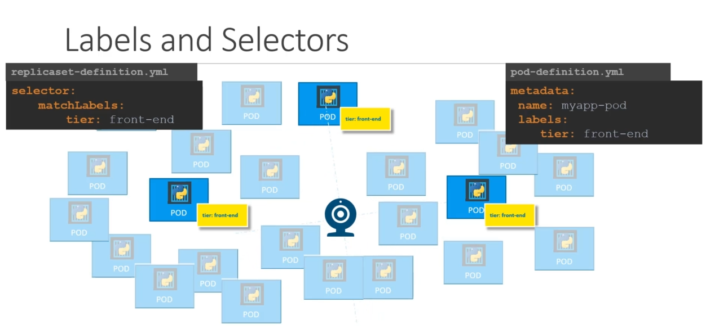
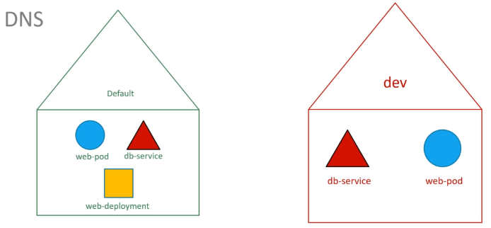
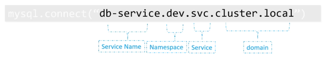

[TOC]


# Certified Kubernetes Administrator

## Kubernetes Architecture


## Node or Minions

* The node serves as a worker machine in a K8s cluster
* Node can be physical computer or a virtual machine

## Cluster

- consists of a set of nodes which may be physical or virtual on-premise or on cloud that host applications in the form of containers. 

## Master Node

- Manage, plan, schedule, monitor nodes

- The master is another node with Kubernetes installed in it, and is configured as a Master. 
- The master watches over the nodes in the cluster and is responsible for the actual orchestration of
  containers on the worker nodes.

## Worker Nodes

- Host Application as Containers

  

## Components

### 1. API server

- is the primary management component of kubernetes

- is responsible for orchestrating all operations within the cluster.
- acts as the front-end for kubernetes. The users, management devices, Command line interfaces all talk to the API server to interact with the kubernetes cluster.

### 2. Etcd

- is a database that stores information in a key-value format.
- key-value store. 
- is a distributed reliable key-value store used by kubernetes to store all data used to manage the cluster. Think of it this way, when you have multiple nodes and multiple masters in your cluster, etcd stores all that information on all the nodes in the cluster in a distributed manner. 
- is responsible for implementing locks within the cluster to ensure there are no conflicts between the Masters.
- stores information about the cluster

### 3. Sheduler

- is responsible for distributing work or containers across multiple nodes. 
- It looks for newly created containers and assigns them to Nodes.
- responsible for scheduling applications or containers on Nodes

### 4. Controller Manager

- The controllers are the brain behind orchestration. 
- They are responsible for noticing and responding when nodes, containers or endpoints goes down. 
- The controllers makes decisions to bring up new containers in such cases.

#### 	Node controller 

- takes care of nodes
- responsible for onboarding new nodes to he cluster handling situations where nodes become unavailable or get gets destroyed 

#### 	Replication Controller

- ensures that the desired number of containers are running at all times in your replication group

### 5. Container Runtime

- The container runtime is the underlying software that is used to run containers. In our case it happens to be Docker.
- Kubernetes supports other run time engines as well like ContainerD or Rocket.

### 6. Kubelet (Captain of the ships)

- Kubelet is the agent that runs on each node in the cluster. 
- The agent is responsible for making sure that the containers are running on the nodes as expected.
- listens for instructions from the Kube-apiserver and manages containers

### 7. Kube-proxy service

- ensures that the necessary rules are in place on the worker nodes to allow the containers running on them to reach each other.
- helps in enabling communication between services within the cluster.


## ETCD

- is a distributed reliable key-value store that is Simple, Secure and Fast.

Key-value store

- stores information in the form of documents or pages
- so each individual gets a document and all information about that individual is stored within that file these files can be in any format or structure and changes to one file does not affect the others.

- Tabular/Relational Databases

  

### Install ETCD

1. Download Binaries

   ```
   curl -L https://github.com/etcd-io/etcd/releases/download/v3.3.11/etcd-
   v3.3.11-linux-amd64.tar.gz -o eted-v3.3.11-linux-amd64.tar.gz
   ```

2. Extract

   ```
   tar xzvf etcd-v3.3.11-linux-amd64.tar.gz
   ```

3. Run ETCD Service

   ```
   ./etcd
   ```

   ```
   ./etcdctl set key1 value1
   ```

   ```
   ./etcdctl get key1
   ```

### Etcd in KubeAdm

If you setup your cluster using kubeadm then kubeadm deploys the ETCD server for you as a POD in the kube-system namespace.

```
$ kubectl get pods -n kube-system
NAME                                  READY   STATUS    RESTARTS   AGE
coredns-6d4b75cb6d-km5f4              1/1     Running   0          19h
coredns-6d4b75cb6d-ltgh6              1/1     Running   0          19h
etcd-kube-master                      1/1     Running   0          19h
kube-apiserver-kube-master            1/1     Running   0          19h
kube-controller-manager-kube-master   1/1     Running   0          19h
kube-proxy-46275                      1/1     Running   0          11h
kube-proxy-fmn4t                      1/1     Running   0          19h
kube-proxy-ssp24                      1/1     Running   0          19h
kube-scheduler-kube-master            1/1     Running   0          19h
```

To list all keys stored by kubernetes, run the etcdctl get command like this.

```
kubectl exec etcd-kube-master -n kube-system -- etcdctl get / --prefix --keys-only
```

## Kube-API Server

1. Authenticate User
2. Validate Request
3. Retrieve data
4. Update ETCD  
5. Scheduler
6. Kubelet

### Installing kube-api server

### View kube-api-server options in kubeadm

```
# Non kubeadm
cat /etc/systemd/system/kube-apiserver.service
```

OR

```
$ sudo cat /etc/kubernetes/manifests/kube-apiserver.yaml 
```

**Listing process**

```
$ sudo ps -aux | grep kube-api-server
```


## Kube Control Manager

### View kube-contoller-manager options

```
# Non kubeadm
cat /etc/systemd/system/kube-controller-manager.service
```

OR

```
$ cat /etc/kubernetes/manifests/kube-controller-manager.yaml 
```

**Listing process**

```
$ ps -aux | grep kube-controller-manager
```


## Kube Scheduler

- is responsible for scheduling pods on nodes

- is only responsible for deciding which pod goes on which node

- It doesn’t actually place the pod on the nodes. That’s the job of the kubelet.

### View kube-scheduler options

```
cat /etc/kubernetes/manifests/kube-scheduler.yaml 
```

**Listing process**

```
ps -aux | grep kube-scheduller
```


## Kubelet

- Register node
- Create pods
- Monitor node and pods

**Listing process**

```
$ ps -aux | grep kubelet
```


## Kube-proxy

- is a process that runs on each node in the kubernetes cluster.
- Its job is to look for new services and every time a new service is created it creates the appropriate rules on each node to forward traffic to those services to the backend pods.

- One way it does this is using IPTABLES rules.

```
$ kubectl get pods -n kube-system
NAME                                  READY   STATUS    RESTARTS   AGE
coredns-6d4b75cb6d-km5f4              1/1     Running   0          23h
coredns-6d4b75cb6d-ltgh6              1/1     Running   0          23h
etcd-kube-master                      1/1     Running   0          23h
kube-apiserver-kube-master            1/1     Running   0          23h
kube-controller-manager-kube-master   1/1     Running   0          23h
kube-proxy-46275                      1/1     Running   0          14h
kube-proxy-fmn4t                      1/1     Running   0          22h
kube-proxy-ssp24                      1/1     Running   0          23h
kube-scheduler-kube-master            1/1     Running   0          23h

$ kubectl get daemonsets.apps -n kube-system
NAME         DESIRED   CURRENT   READY   UP-TO-DATE   AVAILABLE   NODE SELECTOR            AGE
kube-proxy   3         3         3       3            3           kubernetes.io/os=linux   23h
```

## Pods

**pod-definition .yml**

```
apiVersion: v1
kind: Pod
metadata:
  name: myapp-pod
  labels:
    app: myapp
spec:
  containers:
    - name: nginx-container
      image: nginx
```

## Replicasets


**replicaset-definition.yml**

```
apiVersion: apps/v1
kind: ReplicaSet
metadata:
  name: myapp-replicaset
  labels:
    app: myapp
    type: front-end
spec:
  template:
    metadata:
      name: myapp-pod
      labels:
        app: myapp
        type: front-end
    spec:
      containers:
      - name: nginx-container
        image: nginx
  replicas: 3
  selector:
    matchLabels:
      type: front-end      
```


**Note**: There could be hundreds of other parts in the cluster running different applications. This is where labelling our parts during creation comes in handy we could now provide these labels as a filter for replica set under the selector section we use to match labels filter and provide the same label that we used while creating the parts.



### Scale

​	**3 ways to scale**

1. ```
   # Update the number of replicas in the definition file
   $ kubectl replace -f replicaset-definition.yml
   ```

2. ```
   $ kubectl scale --replicas=6 -f replicaset-definition.yml
   ```

3. ```
   $ kubectl scale --replicas=6 replicaset myapp-replicaset
   ```

## Deployment

- provides us with the capability to upgrade the underlying instances seamlessly using rolling updates, undo changes, and pause and resume changes as required.

**deployment-definition.yml**

```
apiVersion: apps/v1
kind: Deployment
metadata:
  name: myapp-deployment
  labels:
    app: myapp
    type: front-end
spec:
  template:
    metadata:
      name: myapp-pod
      labels:
        app: myapp
        type: front-end
    spec:
      containers:
      - name: nginx-container
        image: nginx:1.12
  replicas: 3 
  selector:
    matchLabels:
      type: front-end 
```


## Namespace

### DNS



web-pod can reach the db service simply using the hostname db service

```
mysql.connect("db-service")
```

web-pod can reach a service in another namespace

```
mysql.connect("db-service.dev.svc.cluster.local")
```




To list pods in another namespace

```
$ kubectl get pods --namespace kube-system

OR 

$ kubectl get pods -n kube-system
NAME                                  READY   STATUS    RESTARTS   AGE
coredns-6d4b75cb6d-km5f4              1/1     Running   0          35h
coredns-6d4b75cb6d-ltgh6              1/1     Running   0          35h
etcd-kube-master                      1/1     Running   0          35h
kube-apiserver-kube-master            1/1     Running   0          35h
kube-controller-manager-kube-master   1/1     Running   0          35h
kube-proxy-46275                      1/1     Running   0          26h
kube-proxy-fmn4t                      1/1     Running   0          35h
kube-proxy-ssp24                      1/1     Running   0          35h
kube-scheduler-kube-master            1/1     Running   0          35h
```

 Create a pod in another namespace

```\
$ kubectl create -f pod-definition.yml --namespace=dev
```

Even if you don't specify the namespace in the command line you can move the namespace definition into the pod definition file like this under the metadata section.

```
apiVersion: v1
kind: Pod
metadata:
  name: myapp-pod
  namespace: dev
  labels:
    app: myapp
spec:
  containers:
    - name: nginx-container
      image: nginx
```


### Create namespace

**Via Yaml**

namespace-dev.yml

```
apiVersion: v1
kind: Namespace
metadata:
  name: dev
```

```
$ kubectl create -f namespace-dev.yml 
namespace/dev created
```

**Via command line**

```
$ kubectl create namespace prod
namespace/prod created
```

List namespaces

```
$ kubectl get namespaces
NAME              STATUS   AGE
default           Active   35h
dev               Active   4m3s
kube-node-lease   Active   35h
kube-public       Active   35h
kube-system       Active   35h
prod              Active   94s
```

### Switch default namespace

```
$ kubectl config set-context $(kubectl config current-context) --namespace=kube-system
Context "kubernetes-admin@kubernetes" modified.
```

```
$ kubectl get pods
NAME                                  READY   STATUS    RESTARTS   AGE
coredns-6d4b75cb6d-km5f4              1/1     Running   0          35h
coredns-6d4b75cb6d-ltgh6              1/1     Running   0          35h
etcd-kube-master                      1/1     Running   0          35h
kube-apiserver-kube-master            1/1     Running   0          35h
kube-controller-manager-kube-master   1/1     Running   0          35h
kube-proxy-46275                      1/1     Running   0          27h
kube-proxy-fmn4t                      1/1     Running   0          35h
kube-proxy-ssp24                      1/1     Running   0          35h
kube-scheduler-kube-master            1/1     Running   0          35h
```

 ### Resource Quota

compute-quota.yml

```
apiVersion: v1
kind: ResourceQuota
metadata:
  name: compute-quota
  namespace: dev
spec:
  hard:
    pods: "10"
    requests.cpu: "4"
    requests.memory: 5Gi
    limits.cpu: "10"
    limits.memory: 10Gi
```

```
$ kubectl create -f compute-quota.yml
```


## Services

- enable communication between various components within and outside of the application
- helps us connect applications together with other applications or users

### Service Types

#### 1. NodePort

- listen to a port on the Node and forward requests on that port to a port on the POD running the web application,
- the service makes an internal POD accessible on a Port on the Node.

#### 2. ClusterIP

- the service creates a virtual IP inside the cluster to enable communication between different services such as a set of front end servers to a set of back end servers.

#### 3. LoadBalancer

- were it provisions a load balancer for our service in supported cloud providers.

- A good example of that would be to distribute load across the different web servers in your front end tier.
