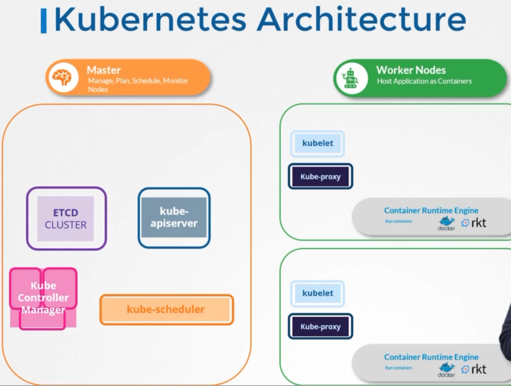

[TOC]

# Certified Kubernetes Administrator

## Kubernetes Architecture

## Node or Minions

* The node serves as a worker machine in a K8s cluster
* Node can be physical computer or a virtual machine

## Cluster

- A cluster is a set of nodes grouped together. This way even if one node fails you have your application still accessible from the other nodes. Moreover having multiple nodes helps in sharing load as well.

## Master Node

- Manage, plan, schedule, monitor nodes

- The master is another node with Kubernetes installed in it, and is configured as a Master. 
- The master watches over the nodes in the cluster and is responsible for the actual orchestration of
  containers on the worker nodes.

## Worker Nodes

- Host Application as Containers

  

## Components

### 1. API server

- acts as the front-end for kubernetes. The users, management devices, Command line interfaces all talk to the API server to interact with the kubernetes cluster.
- is responsible for orchestrating all operations within the cluster.

### 2. Etcd

- key-value store. 
- is a distributed reliable key-value store used by kubernetes to store all data used to manage the cluster. Think of it this way, when you have multiple nodes and multiple masters in your cluster, etcd stores all that information on all the nodes in the cluster in a distributed manner. 
- is responsible for implementing locks within the cluster to ensure there are no conflicts between the Masters.

### 3. Sheduler

- is responsible for distributing work or containers across multiple nodes. 
- It looks for newly created containers and assigns them to Nodes.

### 4. Controller Manager

#### 	Node controller 

- takes care of nodes
- responsible for onboarding new nodes to he cluster handling situations where nodes become unavailable or get gets destroyed 

#### 	Replication Controller

- ensures that the desired number of containers are running at all times in your replication group

- The controllers are the brain behind orchestration. 
- They are responsible for noticing and responding when nodes, containers or endpoints goes down. 
- The controllers makes decisions to bring up new containers in such cases.

### 5. Container Runtime

- The container runtime is the underlying software that is used to run containers. In our case it happens to be Docker.

### 6. Kubelet (Captain of the ships)

- Kubelet is the agent that runs on each node in the cluster. 
- The agent is responsible for making sure that the containers are running on the nodes as expected.

### 7. Kube-proxy service

- ensures that the necessary rules are in place on the worker nodes to allow the containers running on them to reach each other.
- helps in enabling communication between services within the cluster.

## ETCD

- is a distributed reliable key-value store that os Simple, Secure and Fast.

### Install ETCD

1. Download Binaries
