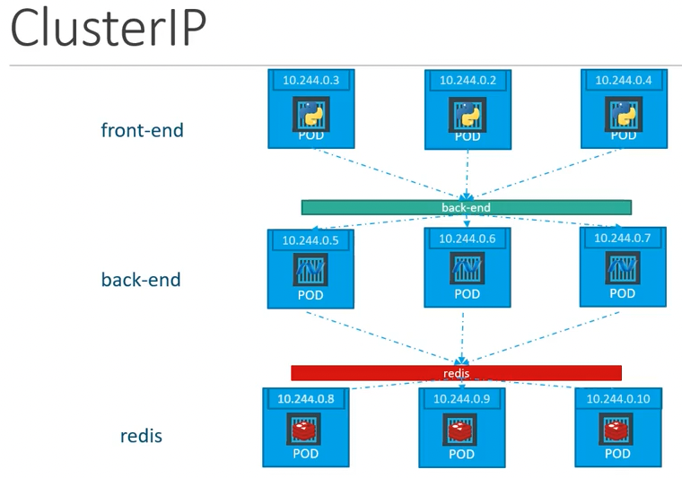
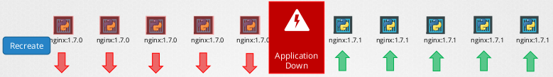

[TOC]


# Certified Kubernetes Administrator

## Kubernetes Architecture


## Node or Minions

* The node serves as a worker machine in a K8s cluster
* Node can be physical computer or a virtual machine

## Cluster

- consists of a set of nodes which may be physical or virtual on-premise or on cloud that host applications in the form of containers. 

## Master Node

- Manage, plan, schedule, monitor nodes

- The master is another node with Kubernetes installed in it, and is configured as a Master. 
- The master watches over the nodes in the cluster and is responsible for the actual orchestration of
  containers on the worker nodes.

## Worker Nodes

- Host Application as Containers

  

## Components

### 1. API server

- is the primary management component of kubernetes

- is responsible for orchestrating all operations within the cluster.
- acts as the front-end for kubernetes. The users, management devices, Command line interfaces all talk to the API server to interact with the kubernetes cluster.

### 2. Etcd

- is a database that stores information in a key-value format.
- key-value store. 
- is a distributed reliable key-value store used by kubernetes to store all data used to manage the cluster. Think of it this way, when you have multiple nodes and multiple masters in your cluster, etcd stores all that information on all the nodes in the cluster in a distributed manner. 
- is responsible for implementing locks within the cluster to ensure there are no conflicts between the Masters.
- stores information about the cluster

### 3. Sheduler

- is responsible for distributing work or containers across multiple nodes. 
- It looks for newly created containers and assigns them to Nodes.
- responsible for scheduling applications or containers on Nodes

### 4. Controller Manager

- The controllers are the brain behind orchestration. 
- They are responsible for noticing and responding when nodes, containers or endpoints goes down. 
- The controllers makes decisions to bring up new containers in such cases.

#### 	Node controller 

- takes care of nodes
- responsible for onboarding new nodes to he cluster handling situations where nodes become unavailable or get gets destroyed 

#### 	Replication Controller

- ensures that the desired number of containers are running at all times in your replication group

### 5. Container Runtime

- The container runtime is the underlying software that is used to run containers. In our case it happens to be Docker.
- Kubernetes supports other run time engines as well like ContainerD or Rocket.

### 6. Kubelet (Captain of the ships)

- Kubelet is the agent that runs on each node in the cluster. 
- The agent is responsible for making sure that the containers are running on the nodes as expected.
- listens for instructions from the Kube-apiserver and manages containers

### 7. Kube-proxy service

- ensures that the necessary rules are in place on the worker nodes to allow the containers running on them to reach each other.
- helps in enabling communication between services within the cluster.


## ETCD

- is a distributed reliable key-value store that is Simple, Secure and Fast.

Key-value store

- stores information in the form of documents or pages
- so each individual gets a document and all information about that individual is stored within that file these files can be in any format or structure and changes to one file does not affect the others.

- Tabular/Relational Databases

  

### Install ETCD

1. Download Binaries

   ```
   curl -L https://github.com/etcd-io/etcd/releases/download/v3.3.11/etcd-
   v3.3.11-linux-amd64.tar.gz -o eted-v3.3.11-linux-amd64.tar.gz
   ```

2. Extract

   ```
   tar xzvf etcd-v3.3.11-linux-amd64.tar.gz
   ```

3. Run ETCD Service

   ```
   ./etcd
   ```

   ```
   ./etcdctl set key1 value1
   ```

   ```
   ./etcdctl get key1
   ```

### Etcd in KubeAdm

If you setup your cluster using kubeadm then kubeadm deploys the ETCD server for you as a POD in the kube-system namespace.

```
$ kubectl get pods -n kube-system
NAME                                  READY   STATUS    RESTARTS   AGE
coredns-6d4b75cb6d-km5f4              1/1     Running   0          19h
coredns-6d4b75cb6d-ltgh6              1/1     Running   0          19h
etcd-kube-master                      1/1     Running   0          19h
kube-apiserver-kube-master            1/1     Running   0          19h
kube-controller-manager-kube-master   1/1     Running   0          19h
kube-proxy-46275                      1/1     Running   0          11h
kube-proxy-fmn4t                      1/1     Running   0          19h
kube-proxy-ssp24                      1/1     Running   0          19h
kube-scheduler-kube-master            1/1     Running   0          19h
```

To list all keys stored by kubernetes, run the etcdctl get command like this.

```
kubectl exec etcd-kube-master -n kube-system -- etcdctl get / --prefix --keys-only
```

## Kube-API Server

1. Authenticate User
2. Validate Request
3. Retrieve data
4. Update ETCD  
5. Scheduler
6. Kubelet

### Installing kube-api server

### View kube-api-server options in kubeadm

```
# Non kubeadm
cat /etc/systemd/system/kube-apiserver.service
```

OR

```
$ sudo cat /etc/kubernetes/manifests/kube-apiserver.yaml 
```

**Listing process**

```
$ sudo ps -aux | grep kube-api-server
```


## Kube Control Manager

### View kube-contoller-manager options

```
# Non kubeadm
cat /etc/systemd/system/kube-controller-manager.service
```

OR

```
$ cat /etc/kubernetes/manifests/kube-controller-manager.yaml 
```

**Listing process**

```
$ ps -aux | grep kube-controller-manager
```


## Kube Scheduler

- is responsible for scheduling pods on nodes

- is only responsible for deciding which pod goes on which node

- It doesn’t actually place the pod on the nodes. That’s the job of the kubelet.

### View kube-scheduler options

```
cat /etc/kubernetes/manifests/kube-scheduler.yaml 
```

**Listing process**

```
ps -aux | grep kube-scheduller
```


## Kubelet

- Register node
- Create pods
- Monitor node and pods

**Listing process**

```
$ ps -aux | grep kubelet
```


## Kube-proxy

- is a process that runs on each node in the kubernetes cluster.
- Its job is to look for new services and every time a new service is created it creates the appropriate rules on each node to forward traffic to those services to the backend pods.

- One way it does this is using IPTABLES rules.

```
$ kubectl get pods -n kube-system
NAME                                  READY   STATUS    RESTARTS   AGE
coredns-6d4b75cb6d-km5f4              1/1     Running   0          23h
coredns-6d4b75cb6d-ltgh6              1/1     Running   0          23h
etcd-kube-master                      1/1     Running   0          23h
kube-apiserver-kube-master            1/1     Running   0          23h
kube-controller-manager-kube-master   1/1     Running   0          23h
kube-proxy-46275                      1/1     Running   0          14h
kube-proxy-fmn4t                      1/1     Running   0          22h
kube-proxy-ssp24                      1/1     Running   0          23h
kube-scheduler-kube-master            1/1     Running   0          23h

$ kubectl get daemonsets.apps -n kube-system
NAME         DESIRED   CURRENT   READY   UP-TO-DATE   AVAILABLE   NODE SELECTOR            AGE
kube-proxy   3         3         3       3            3           kubernetes.io/os=linux   23h
```

## Pods

**pod-definition .yml**

```
apiVersion: v1
kind: Pod
metadata:
  name: myapp-pod
  labels:
    app: myapp
spec:
  containers:
    - name: nginx-container
      image: nginx
```

## Replicasets


**replicaset-definition.yml**

```
apiVersion: apps/v1
kind: ReplicaSet
metadata:
  name: myapp-replicaset
  labels:
    app: myapp
    type: front-end
spec:
  template:
    metadata:
      name: myapp-pod
      labels:
        app: myapp
        type: front-end
    spec:
      containers:
      - name: nginx-container
        image: nginx
  replicas: 3
  selector:
    matchLabels:
      type: front-end      
```


**Note**: There could be hundreds of other parts in the cluster running different applications. This is where labelling our parts during creation comes in handy we could now provide these labels as a filter for replica set under the selector section we use to match labels filter and provide the same label that we used while creating the parts.


### Scale

​	**3 ways to scale**

1. ```
   # Update the number of replicas in the definition file
   $ kubectl replace -f replicaset-definition.yml
   ```

2. ```
   $ kubectl scale --replicas=6 -f replicaset-definition.yml
   ```

3. ```
   $ kubectl scale --replicas=6 replicaset myapp-replicaset
   ```

## Deployment

- provides us with the capability to upgrade the underlying instances seamlessly using rolling updates, undo changes, and pause and resume changes as required.

**deployment-definition.yml**

```
apiVersion: apps/v1
kind: Deployment
metadata:
  name: myapp-deployment
  labels:
    app: myapp
    type: front-end
spec:
  template:
    metadata:
      name: myapp-pod
      labels:
        app: myapp
        type: front-end
    spec:
      containers:
      - name: nginx-container
        image: nginx:1.12
  replicas: 3 
  selector:
    matchLabels:
      type: front-end 
```


## Namespace

- provides a mechanism for isolating groups of resources within a single cluster.
- Names of resources need to be unique within a namespace, but not across namespaces.

```
cat <<EOF >/etc/kubernetes/manifests/static-web.yaml
apiVersion: v1
kind: Pod
metadata:
  name: static-web
  labels:
    role: myrole
spec:
  containers:
    - name: web
      image: nginx
      ports:
        - name: web
          containerPort: 80
          protocol: TCP
EOF
```


### DNS


web-pod can reach the db service simply using the hostname db service

```
mysql.connect("db-service")
```

web-pod can reach a service in another namespace

```
mysql.connect("db-service.dev.svc.cluster.local")
```


To list pods in another namespace

```
$ kubectl get pods --namespace kube-system

OR 

$ kubectl get pods -n kube-system
NAME                                  READY   STATUS    RESTARTS   AGE
coredns-6d4b75cb6d-km5f4              1/1     Running   0          35h
coredns-6d4b75cb6d-ltgh6              1/1     Running   0          35h
etcd-kube-master                      1/1     Running   0          35h
kube-apiserver-kube-master            1/1     Running   0          35h
kube-controller-manager-kube-master   1/1     Running   0          35h
kube-proxy-46275                      1/1     Running   0          26h
kube-proxy-fmn4t                      1/1     Running   0          35h
kube-proxy-ssp24                      1/1     Running   0          35h
kube-scheduler-kube-master            1/1     Running   0          35h
```

 Create a pod in another namespace

```\
$ kubectl create -f pod-definition.yml --namespace=dev
```

Even if you don't specify the namespace in the command line you can move the namespace definition into the pod definition file like this under the metadata section.

```
apiVersion: v1
kind: Pod
metadata:
  name: myapp-pod
  namespace: dev
  labels:
    app: myapp
spec:
  containers:
    - name: nginx-container
      image: nginx
```


### Create namespace

**Via Yaml**

namespace-dev.yml

```
apiVersion: v1
kind: Namespace
metadata:
  name: dev
```

```
$ kubectl create -f namespace-dev.yml 
namespace/dev created
```

**Via command line**

```
$ kubectl create namespace prod
namespace/prod created
```

List namespaces

```
$ kubectl get namespaces
NAME              STATUS   AGE
default           Active   35h
dev               Active   4m3s
kube-node-lease   Active   35h
kube-public       Active   35h
kube-system       Active   35h
prod              Active   94s
```

### Switch default namespace

```
$ kubectl config set-context $(kubectl config current-context) --namespace=kube-system
Context "kubernetes-admin@kubernetes" modified.
```

```
$ kubectl get pods
NAME                                  READY   STATUS    RESTARTS   AGE
coredns-6d4b75cb6d-km5f4              1/1     Running   0          35h
coredns-6d4b75cb6d-ltgh6              1/1     Running   0          35h
etcd-kube-master                      1/1     Running   0          35h
kube-apiserver-kube-master            1/1     Running   0          35h
kube-controller-manager-kube-master   1/1     Running   0          35h
kube-proxy-46275                      1/1     Running   0          27h
kube-proxy-fmn4t                      1/1     Running   0          35h
kube-proxy-ssp24                      1/1     Running   0          35h
kube-scheduler-kube-master            1/1     Running   0          35h
```

 ### Resource Quota

compute-quota.yml

```
apiVersion: v1
kind: ResourceQuota
metadata:
  name: compute-quota
  namespace: dev
spec:
  hard:
    pods: "10"
    requests.cpu: "4"
    requests.memory: 5Gi
    limits.cpu: "10"
    limits.memory: 10Gi
```

```
$ kubectl create -f compute-quota.yml
```


## Services

- enable communication between various components within and outside of the application
- helps us connect applications together with other applications or users

### Service Types

#### 1. NodePort

- listen to a port on the Node and forward requests on that port to a port on the POD running the web application,
- the service makes an internal POD accessible on a Port on the Node.


pod-definition.yml

```
apiVersion: v1
kind: Pod
metadata:
  name: myapp-pod
  labels:
    app: myapp
    type: pod
spec:
  containers:
    - name: nginx-container
      image: nginx
```

service-nodeport.yml

```
apiVersion: v1
kind: Service
metadata:
  name:  myapp-service
spec:
  type:  NodePort
  ports:
  - targetPort: 80
    port:  80
    nodePort: 30008
  selector:
    app: myapp
    type: pod
```

```
$ kubectl create -f pod-definition.yml 
pod/myapp-pod created

$ kubectl create -f service-nodeport.yml 
service/myapp-service created

$ kubectl get all
NAME            READY   STATUS    RESTARTS   AGE
pod/myapp-pod   1/1     Running   0          8m20s

NAME                    TYPE        CLUSTER-IP      EXTERNAL-IP   PORT(S)        AGE
service/kubernetes      ClusterIP   10.96.0.1       <none>        443/TCP        20h
service/myapp-service   NodePort    10.101.46.166   <none>        80:30008/TCP   7m44s
```


#### 2. ClusterIP

- the service creates a virtual IP inside the cluster to enable communication between different services such as a set of front end servers to a set of back end servers.




service-clusterip.yml

```
apiVersion: v1
kind: Service
metadata:
  name: back-end

spec:
  type: ClusterIP
  ports:
    - targetPort: 80
      port: 80

  selector:
    app: myapp
    type: back-end
```


#### 3. LoadBalancer

- were it provisions a load balancer for our service in supported cloud providers.

- A good example of that would be to distribute load across the different web servers in your front end tier.


## Scheduling

### Manual Scheduling

- Every POD has a field called NodeName that, by default, is not set.

**Assigning pod to a node**

 pod-node2-definition.yml

```
apiVersion: v1
kind: Pod
metadata:
  name: myapp-pod
  labels:
    app: myapp
    type: pod
spec:
  containers:
    - name: nginx-container
      image: nginx
  nodeName: kube-node2
```

## Labels and Selectors

### Labels 

- are key/value pairs that are attached to the objects like pods, services and deployments. 
- are for users of Kubernetes to identify attributes for objects.

### Selectors

1. **Equility-based**
   *  = - Two labels or values of labels should be equal
   *  != - The values of the labels should not be equal
2. **Set-based**
   * IN: A value should be inside a set of defined values
   * NOTIN: A value should not be in a set of defined values
   * EXISTS: Determines whether a label exists or not

Once the pod is created, to select the pod with the labels use the kubectl get pods command along with the selector option, and specify the condition like app=App1.

```
$ kubectl get pods --selector app=App1
```


###  Annotations

- are used to record other details for inflammatory purpose.

For example tool details like name, version build information etc or contact details, phone numbers, email ids etc, that may be used for some kind of integration purpose.

Example:

```yaml
apiVersion: app/v1
kind: Replicaset
metadata:
  name: simple-webapp
  labels:
    app: App1
    function: Front-end
  annotations:
    buildversion: 1.34
```


## Taints and Tolerations

- have nothing to do with security or intrusion on the cluster.
- are used to set restrictions on what pods can be scheduled on a node.

- taints are set on nodes and tolerations are set on pods

**Note:**

Taint and toleration does not tell the pods to go to a particular node. Instead it tells the node to only accept pods with certain toleration.

### Taint - Node

**You add a taint to a node using kubectl taint.** 

```shell
kubectl taint nodes node1 key1=value1:NoSchedule

# Sample
kubectl taint nodes node1 app=blue:NoSchedule
```

places a taint on node `node1`. The taint has key `key1`, value `value1`, and taint effect `NoSchedule`. This means that no pod will be able to schedule onto `node1` unless it has a matching toleration.

#### Taint Effect

1. **NoSchedule** - which means the pods will not be scheduled on the node

2.  **PreferNoSchedule** - which means the system will try to avoid placing a pods on the node but that is not guaranteed.
3. **NoExecute** -  which means that new pods will not be scheduled on the node and existing pods on the node if any will be evicted if they do not tolerate the taint.

**To remove the taint added by the command above, you can run:**

```shell
kubectl taint nodes node1 key1=value1:NoSchedule-
```

### Tolerations - Pods

pod-definition.yml

```
apiVersion: v1
kind: Pod
metadata:
  name: myapp-pod
  labels:
    app: myapp
    type: pod
spec:
  containers:
    - name: nginx-container
      image: nginx

  tolerations:
  - key: "app"
    operator: "Equal"
    value: "blue"
    effect: "NoSchedule"
```

**Note:**

Taint is set on the master node automatically that prevents any pods from being schedule on this node. Best practice is to not deploy application workloads on a master node. 

To see this taint:

```
$ kubectl describe node kube-master | grep Taint
Taints:             node-role.kubernetes.io/control-plane:NoSchedule
```


## Node Selectors

- We can set a limitation on the pods so that they only run on particular nodes

**Label nodes**

$ kubectl label nodes <node-name> <label-key>=<label-value>

```
$ kubectl label nodes kube-node1 size=Large
```

pod-definition-node-select.yml

```
 apiVersion: v1
kind: Pod
metadata:
  name: myapp-pod
  labels:
    app: myapp
    type: pod
spec:
  containers:
    - name: nginx-container
      image: nginx
  nodeSelector:
    size: Large
```

## Node Affinity

```
apiVersion: v1
kind: Pod
metadata:
  name: myapp-pod
  labels:
    app: myapp
    type: pod
spec:
  containers:
    - name: nginx-container
      image: nginx
  affinity:
    nodeAffinity:
      requiredDuringSchedulingIgnoredDuringExecution:
        nodeSelectorTerms:
        - matchExpressions:
            - key: size
              operator: In
              values:
                - Large
                - Medium
```

### Node Affinity Types

1. requiredDuringSchedulingIgnoredDuringExecution
   - The scheduler can't schedule the Pod unless the rule is met. This functions like `nodeSelector`, but with a more expressive syntax.
2. preferredDuringSchedulingIgnoredDuringExecution
   - The scheduler tries to find a node that meets the rule. If a matching node is not available, the scheduler still schedules the Pod.
   - simply ignore node affinity rules and place the card on any available node. This is a way of telling the scheduler hey try your best to place the pod on matching node but if you eally cannot find one just plays it anywhere.

3. requiredDuringSchedulingRequiredDuringExecution
   - is introduced which will evict any pods that are running on nodes that do not meet affinity rules.

## Resource Requirements

### Resource Requests

pod-definition-resource-request.yml

```
apiVersion: v1
kind: Pod
metadata:
  name: myapp-pod
  labels:
    app: myapp
    type: pod
spec:
  containers:
    - name: nginx-container
      image: nginx
      ports:
        - 8080
      resources:
        requests:
          memory: "1Gi"
          cpu: 1
```

### Resource Limits

- default 1 vCPU and 512 Mi

```
apiVersion: v1
kind: Pod
metadata:
  name: myapp-pod
  labels:
    app: myapp
    type: pod
spec:
  containers:
    - name: nginx-container
      image: nginx
      ports:
        - 8080
      resources:
        requests:
          memory: "1Gi"
          cpu: 1
        limits:
          memory: "2Gi"
          cpu: 2
```

## Daemonset

- Daemonsets are like replica sets, as in it helps you deploy multiple instances of pod. But it runs one copy of your pod on each node in your cluster. Whenever a new node is added to the cluster a replica of the pod is automatically added to that node and when a node is removed the pod is automatically removed.

- The demonset ensures that one copy of the pod is always present in all nodes in the cluster.

### Use Case of Daemonsets

- Demon set is perfect for that as it can deploy your monitoring agent in the form of a pod in all the nodes in your cluster. Then, you don’t have to worry about adding/removing monitoring agents from these nodes when there are changes in your cluster. Daemonset will take care of that for you.

1. **Monitoring Solutions**

2. **Log Viewer**
3. **Kube-proxy**
4. **Networking**
   - Weave-net

daemonset-definition.yml

```
apiVersion: apps/vl
kind: DaemonSet
metadata:
  name: monitoring-daemon
spec:
  selector:
    matchLabels:
      app: monitoring-agent
  template:
    metadata:
      labels:
        app: monitoring-agent
    spec:
      containers:
      - name: monitoring-agent
      image: monitoring-agent
```

```
$ kubectl create -f daemonset-definition.yml

$ kubectl get daemonsets

$ kubectl describe daemonsets.apps <daemonset-name>
```

## Static Pods

- *Static Pods* are managed directly by the kubelet daemon on a specific node, without the [API server](https://kubernetes.io/docs/concepts/overview/components/#kube-apiserver) observing them. Unlike Pods that are managed by the control plane (for example, a [Deployment](https://kubernetes.io/docs/concepts/workloads/controllers/deployment/)); instead, the kubelet watches each static Pod (and restarts it if it fails).

- Static Pods are always bound to one [Kubelet](https://kubernetes.io/docs/reference/generated/kubelet) on a specific node.

### Configure

Put pod definition files in  **/etc/kubernetes/manifests**

kubelet.service

```
ExecStart=/usr/local/bin/kubelet \\
  --container-runtime=remote \\
  --container-runtime-endpoint=unix:///var/run/containerd/containerd.sock \\
  --pod-manifest-path=/etc/Kubernetes/manifests \\
  --kubeconfig=/var/1ib/kubelet/kubeconfig \\
  --network-pluginscni \\
  --register-node=true \\
  --v=2
```

OR

kubelet.service

```
ExecStart=/usr/local/bin/kubelet \\
  --container-runtime=remote \\
  --container-runtime-endpoint=unix:///var/run/containerd/containerd.sock \\
  --config=kubeconfig.yaml \\
  --kubeconfig=/var/1ib/kubelet/kubeconfig \\
  --network-pluginscni \\
  --register-node=true \\
  --v=2
```

kubeconfig.yaml

```
staticPodPath: /etc/kubernetes/manifests
```

## Static Pods VS Daemonsets

| Statis Pods                                    | Daemonset                                         |
| ---------------------------------------------- | ------------------------------------------------- |
| Created by the Kubelet                         | Created by KubeAPI server (Daemonset Controller)  |
| Deploy Control Plane components as Static Pods | Deploy Monitoring Agents, Logging Agents on nodes |
| Ignored by the Kube-Scheduler                  | Ignored by the Kube-Scheduler                     |


## Multiple Schedulers

If the default scheduler does not suit your needs you can implement your own scheduler. Moreover, you can even run multiple schedulers simultaneously alongside the default scheduler and instruct Kubernetes what scheduler to use for each of your pods.

### Deploy Additional Scheduler in kubeadm

kube-sheduller.yaml

```
apiVersion: v1
kind: Pod
metadata:
  creationTimestamp: null
  labels:
    component: kube-scheduler
    tier: control-plane
  name: kube-scheduler
  namespace: kube-system
spec:
  containers:
  - command:
    - kube-scheduler
    - --authentication-kubeconfig=/etc/kubernetes/scheduler.conf
    - --authorization-kubeconfig=/etc/kubernetes/scheduler.conf
    - --bind-address=127.0.0.1
    - --kubeconfig=/etc/kubernetes/scheduler.conf
    - --leader-elect=true
    image: k8s.gcr.io/kube-scheduler:v1.24.3
    imagePullPolicy: IfNotPresent
    livenessProbe:
      failureThreshold: 8
      httpGet:
        host: 127.0.0.1
        path: /healthz
        port: 10259
        scheme: HTTPS
      initialDelaySeconds: 10
      periodSeconds: 10
      timeoutSeconds: 15
    name: kube-scheduler
    resources:
      requests:
        cpu: 100m
    startupProbe:
      failureThreshold: 24
      httpGet:
        host: 127.0.0.1
        path: /healthz
        port: 10259
        scheme: HTTPS
      initialDelaySeconds: 10
      periodSeconds: 10
      timeoutSeconds: 15
    volumeMounts:
    - mountPath: /etc/kubernetes/scheduler.conf
      name: kubeconfig
      readOnly: true
  hostNetwork: true
  priorityClassName: system-node-critical
  securityContext:
    seccompProfile:
      type: RuntimeDefault
  volumes:
  - hostPath:
      path: /etc/kubernetes/scheduler.conf
      type: FileOrCreate
    name: kubeconfig
status: {}
```

my-custom-scheduler.yaml

```
apiVersion: v1
kind: Pod
metadata:
  creationTimestamp: null
  labels:
    component: my-custom-scheduler
    tier: control-plane
  name: my-custom-scheduler
  namespace: kube-system
spec:
  containers:
  - command:
    - kube-scheduler
    - --authentication-kubeconfig=/etc/kubernetes/scheduler.conf
    - --authorization-kubeconfig=/etc/kubernetes/scheduler.conf
    - --bind-address=127.0.0.1
    - --kubeconfig=/etc/kubernetes/scheduler.conf
    - --leader-elect=true
    - --scheduler-name=my-custom-scheduler
    - --lock-object-name=my-custom-scheduler
    image: k8s.gcr.io/kube-scheduler:v1.24.3
    imagePullPolicy: IfNotPresent
    livenessProbe:
      failureThreshold: 8
      httpGet:
        host: 127.0.0.1
        path: /healthz
        port: 10259
        scheme: HTTPS
      initialDelaySeconds: 10
      periodSeconds: 10
      timeoutSeconds: 15
    name: kube-scheduler
    resources:
      requests:
        cpu: 100m
    startupProbe:
      failureThreshold: 24
      httpGet:
        host: 127.0.0.1
        path: /healthz
        port: 10259
        scheme: HTTPS
      initialDelaySeconds: 10
      periodSeconds: 10
      timeoutSeconds: 15
    volumeMounts:
    - mountPath: /etc/kubernetes/scheduler.conf
      name: kubeconfig
      readOnly: true
  hostNetwork: true
  priorityClassName: system-node-critical
  securityContext:
    seccompProfile:
      type: RuntimeDefault
  volumes:
  - hostPath:
      path: /etc/kubernetes/scheduler.conf
      type: FileOrCreate
    name: kubeconfig
status: {}
```

```
$ kubectl create -f my-custom-scheduler.yaml
```

```
$ kubectl get pods --namespace=kube-system
```

Create pod definition using the new scheduler

**pod-definition-with-scheduler.yml**

```
apiVersion: v1
kind: Pod
metadata:
  name: myapp-pod
  labels:
    app: myapp
    type: pod
spec:
  containers:
    - name: nginx-container
      image: nginx
    schedulerName: my-custome-scheduler
```

### View Events

```
$ kubectl get events
```

### View Scheduler Logs

```
$ kubectl logs kube-scheduler-kube-master --namespace=kube-system 
```


## Monitoring Cluster Components

###  Monitoring Solutions

- Metric Server

- Prometheus

- Elastic Stack

- Datadog

- Dynatrace

  

 #### Metrics Server

- Metric server retrieves metrics from each of the kubernetes nodes and pods, aggregates them and stores them in memory.
- Note that the metric server is only an in memory monitoring solution and does not store the metrics on the desk and as a result you cannot see historical performance data.

##### Getting Started with Metrics Server

```
$ minikube addons enable metrics-server
    ▪ Using image k8s.gcr.io/metrics-server/metrics-server:v0.6.1
🌟  The 'metrics-server' addon is enabled
```

```
$ kubectl top nodes
NAME       CPU(cores)   CPU%   MEMORY(bytes)   MEMORY%   
minikube   258m         3%     815Mi           5%        

```

```
$ kubectl top pod -n kube-system 
NAME                               CPU(cores)   MEMORY(bytes)   
coredns-6d4b75cb6d-ljhv9           2m           25Mi            
etcd-minikube                      20m          58Mi            
kube-apiserver-minikube            72m          358Mi           
kube-controller-manager-minikube   25m          68Mi            
kube-proxy-9xkps                   1m           29Mi            
kube-scheduler-minikube            4m           30Mi            
metrics-server-8595bd7d4c-glpkl    6m           33Mi            
storage-provisioner                2m           16Mi            
```

##### Others

```
$ git clone https://github.com/kubernetes-incubator/metrics-server.git
```

```
$ kubectl create –f deploy/1.8+/
clusterrolebinding "metrics-server:system:auth-delegator" created
rolebinding "metrics-server-auth-reader" created
apiservice "v1beta1.metrics.k8s.io" created
serviceaccount "metrics-server" created
deployment "metrics-server" created
service "metrics-server" created
clusterrole "system:metrics-server" created
clusterrolebinding "system:metrics-server" created
```

  

### Managing Application Logs

### Logs in Docker

```
$ docker run -d kodekloud/event-simulator
```

```
$ docker ps
CONTAINER ID   IMAGE                                 COMMAND                  CREATED              STATUS              PORTS                                                                                                                                  NAMES
f3b2cd871d56   kodekloud/event-simulator             "/bin/sh -c 'python …"   About a minute ago   Up About a minute                                                              
$ docker logs -f f3b2cd871d56
[2022-08-06 02:10:37,361] INFO in event-simulator: USER4 logged out
[2022-08-06 02:10:38,362] INFO in event-simulator: USER3 is viewing page1
[2022-08-06 02:10:39,363] INFO in event-simulator: USER1 logged in
[2022-08-06 02:10:40,364] INFO in event-simulator: USER1 logged in
[2022-08-06 02:10:41,365] INFO in event-simulator: USER1 logged in
[2022-08-06 02:10:42,367] WARNING in event-simulator: USER5 Failed to Login as the account is locked due to MANY FAILED ATTEMPTS.
[2022-08-06 02:10:42,367] INFO in event-simulator: USER2 logged in
[2022-08-06 02:10:43,368] INFO in event-simulator: USER1 logged out
[2022-08-06 02:10:44,369] INFO in event-simulator: USER2 logged out
[2022-08-06 02:10:45,370] WARNING in event-simulator: USER7 Order failed as the item is OUT OF STOCK.
```

### Logs in Kubernetes

event-simulator.yml

```
apiVersion: v1
kind: Pod
metadata: 
  name: event-simulator-pod
spec:
  containers:
  - name: event-simulator-pod
    image: kodekloud/event-simulator
```

```
$ kubectl create -f event-simulator.yaml 
pod/event-simulator-pod created

```

```
$ kubectl logs -f event-simulator-pod 
[2022-08-07 23:56:54,375] INFO in event-simulator: USER4 logged out
[2022-08-07 23:56:55,376] INFO in event-simulator: USER1 is viewing page1
[2022-08-07 23:56:56,377] INFO in event-simulator: USER2 is viewing page1
[2022-08-07 23:56:57,378] INFO in event-simulator: USER2 logged in
[2022-08-07 23:56:58,380] INFO in event-simulator: USER1 is viewing page3
[2022-08-07 23:56:59,381] WARNING in event-simulator: USER5 Failed to Login as the account is locked due to MANY FAILED ATTEMPTS.
[2022-08-07 23:56:59,382] INFO in event-simulator: USER1 is viewing page3
[2022-08-07 23:57:00,383] INFO in event-simulator: USER1 logged out
[2022-08-07 23:57:01,385] INFO in event-simulator: USER3 is viewing page2
[2022-08-07 23:57:02,387] WARNING in event-simulator: USER7 Order failed as the item is OUT OF STOCK.
[2022-08-07 23:57:02,387] INFO in event-simulator: USER4 is viewing page2
[2022-08-07 23:57:03,389] INFO in event-simulator: USER2 logged in
[2022-08-07 23:57:04,390] WARNING in event-simulator: USER5 Failed to Login as the account is locked due to MANY FAILED ATTEMPTS.
[2022-08-07 23:57:04,391] INFO in event-simulator: USER4 is viewing page1
[2022-08-07 23:57:05,393] INFO in event-simulator: USER2 is viewing page2
[2022-08-07 23:57:06,393] INFO in event-simulator: USER1 logged in
[2022-08-07 23:57:07,395] INFO in event-simulator: USER2 is viewing page1
[2022-08-07 23:57:08,397] INFO in event-simulator: USER4 is viewing page1
[2022-08-07 23:57:09,399] WARNING in event-simulator: USER5 Failed to Login as the account is locked due to MANY FAILED ATTEMPTS.
```

**Note:**

Kubernetes PODs can have multiple docker containers in them. You must specify the name of the container explicitly in the kubectl logs command. Otherwise it would fail asking you to specify a name.

```
apiVersion: v1
kind: Pod
metadata: 
  name: event-simulator-pod
spec:
  containers:
  - name: event-simulator
    image: kodekloud/event-simulator
  - name: image-processor
    image: some-image-processor  
```

```
$ kubectl logs -f event-simulator-pod event-simulator
```

 

## Application Lifecycle Management

### Rolling Updates and Rollbacks in a Deployment

**Rollout and Versioning**


**Rollout Command**

```
$ kubectl rollout status deployment/myapp-deployment
```


```
$ kubectl rollout history deployment/myapp-deployment
```

### Deployment Strategy

1. Recreate

   - to destroy all of these and then create newer versions of application instances meaning first destroy the five running instances and then deploy five new instances of the new application version.
   - during the period after the older versions are down and before any newer version is up the application is down and inaccessible to users

   

2. Rolling Update (default deployment strategy)

   - we take down the older version and bring up a newer version one by one.
   - this way the application never goes down and the upgrade is seamless.

   

**To apply the updates:**

1. Edit the definition files and apply the changes with this command.

```
$ kubectl apply –f deployment-definition.yml
```

2. No need to edit the definition file but he definition file will be having different configuration.

```
$ kubectl set image deployment/myapp-deployment \
nginx=nginx:1.9.1
```

### Upgrades


### Rollback


```
$ kubectl rollout undo deployment/myapp-deployment
```

### Summarize Commands

**Create**

```
$ kubectl create –f deployment-definition.yml
```

**Get**

```
$ kubectl get deployments
```

**Update**

```
$ kubectl apply –f deployment-definition.yml
```

```
$ kubectl set image deployment/myapp-deployment nginx=nginx:1.9.1
```

**Status**

```
$ kubectl rollout status deployment/myapp-deployment
```

```
$ kubectl rollout history deployment/myapp-deployment
```

**Rollback**

```
$ kubectl rollout undo deployment/myapp-deployment
```


## Commands and Arguments

###  Docker

git clone https://github.com/dockerfile/ubuntu.git

In case of the CMD instruction the command line parameters passed will get replaced entirely, whereas in case of entry point the command line parameters will get appended.

Dockerfile

```
# Pull base image.
FROM ubuntu:14.04

# Install.
RUN \
  sed -i 's/# \(.*multiverse$\)/\1/g' /etc/apt/sources.list && \
  apt-get update && \
  apt-get -y upgrade && \
  apt-get install -y build-essential && \
  apt-get install -y software-properties-common && \
  apt-get install -y byobu curl git htop man unzip vim wget && \
  rm -rf /var/lib/apt/lists/*

# Add files.
ADD root/.bashrc /root/.bashrc
ADD root/.gitconfig /root/.gitconfig
ADD root/.scripts /root/.scripts

# Set environment variables.
ENV HOME /root

# Define working directory.
WORKDIR /root

# Define default command.
ENTRYPOINT ["sleep"]
CMD ["5"]
```

Build image

```
$ docker build -t ubuntu-sleeper .
```

```
$ docker run ubuntu-sleeper 10
```

What if you really really want to modify the entry point during runtime say from sleep to an imaginary sleep 2.0 command. Well in that case you can override it by using the entry point option in the docker run command.

```
$ docker run --entrypoint sleep2.0 ubuntu-sleeper 10
```

### Kubernetes


## Configure Environment Variables in Applications

### ENV Variables in Kubernetes

```
$ docker run -e APP_COLOR=pink simple-webapp-color
```

pod-definition.yml

```
apiVersion: v1
kind: Pod
metadata:
  name: simple-webapp-color
spec:
  containers:
  - name: simple-webapp-color
    image: simple-webapp-color
    ports:
      - containerPort: 8080
    env:
      - name: APP_COLOR
        value: pink
```

### ENV Value Types

#### 1. Plain Key Value

```
env:
  - name: APP_COLOR
    value: pink
```

pod-definition.yml

```
apiVersion: v1
kind: Pod
metadata:
  name: simple-webapp-color
spec:
  containers:
  - name: simple-webapp-color
    image: simple-webapp-color
    ports:
      - containerPort: 8080
    env:
      - name: APP_COLOR
        value: blue
      - name: APP_MODE
        value: prod
```


#### 2. ConfigMaps

```
env:
  - name: APP_COLOR
    valueFrom:
      configMapKeyRef:
```

##### Ways to create configmaps:

##### 1. Imperative

1. The command is followed by the config name and the option –from-literal. The from literal option is used to specify the key value pairs in the command itself.

```
$ kubectl create configmap <config-name> --from-literal=<key>=<value>
```

```
$ kubectl create configmap \
	app-config --from-literal=APP_COLOR=blue \
			   --from-literal=APP_MOD=prod
```

2. Another way to input configuration data is through a file. Use the from file option to specify a path to the file that contains the required data.

```
kubectl create configmap \
	<config-name> --from-file=<path-to-file>
```

```
kubectl create configmap \
	app-config --from-file=app_config.properties
```

##### 2. Declative

configmap.yaml

```
apiVersion: v1
kind: ConfigMap
metadata:
  name: app-config
data:
  APP_COLOR: blue
  APP_MODE: prod
```

```
kubectl create –f configmap.yaml
```

##### View ConfigMaps

```
$ $ kubectl get configmaps 
NAME               DATA   AGE
app-config         2      25s
```

```
$ kubectl describe configmaps app-config 
Name:         app-config
Namespace:    default
Labels:       <none>
Annotations:  <none>

Data
====
APP_COLOR:
----
blue
APP_MODE:
----
prod

BinaryData
====

Events:  <none>
```

##### ConfigMap in Pods

pod-definition.yaml

```
apiVersion: v1
kind: Pod
metadata:
  name: simple-webapp-color
  labels:
    name: simple-webapp-color
spec:
  containers:
  - name: simple-webapp-color
    image: simple-webapp-color
    ports:
      - containerPort: 8080 apiVersion: v1
    envFrom:
      - configMapRef:
        	name: app-config
```

##### Injecting ConfigMap in Pods

**1. ENV**

```
envFrom:
  - configMapRef:
  		name: app-config
```

**2. Single ENV**

```
env:
  - name: APP_COLOR
    valueFrom:
      configMapKeyRef:
        name: app-config
        key: APP_COLOR
```

**3. Volume**

```
volumes:
- name: app-config-volume
  configMap:
    name: app-config
```


#### 3. Secrets

- Secrets are used to store sensitive information like passwords or keys.

```
env:
  - name: APP_COLOR
    valueFrom:
      secretKeyRef:
```

#####  Ways to create configmaps:

##### 1. Imperative

 ```
 $ kubectl create secret generic \ 
 	<secret-name> --from-literal=<key>=<value>
 ```

```
$ kubectl create secret generic \
	app-secret --from-literal=DB_Host=mysql
   		       --from-literal=DB_User=root
			   --from-literal=DB_Password=paswrd
```


```
$ kubectl create secret generic
	<secret-name> --from-file=<path-to-file>
```

```
$ kubectl create secret generic \
	app-secret --from-file=app_secret.properties
```

##### 2. Declarative

secret-data.yaml

```
apiVersion: v1
kind: Secret
metadata:
  name: app-secret
data:
  DB_Host: bXlzcWw=
  DB_User: cm9vdA==
  DB_Password: cGFzd3Jk
```

```
$ kubectl create –f secret-data.yaml
```

#####  Encode Secrets


```
$ echo -n 'mysql' | base64
bXlzcWw=

$ echo -n 'root' | base64
cm9vdA==

$ echo -n 'paswrd' | base64
cGFzd3Jk
```

##### View Secrets

```
$ kubectl get secrets 
NAME         TYPE     DATA   AGE
app-secret   Opaque   3      9s
```

```
$ kubectl describe secrets app-secret 
Name:         app-secret
Namespace:    default
Labels:       <none>
Annotations:  <none>

Type:  Opaque

Data
====
DB_Host:      5 bytes
DB_Password:  6 bytes
DB_User:      4 bytes
```

```
$ kubectl get secrets app-secret -o yaml
apiVersion: v1
data:
  DB_Host: bXlzcWw=
  DB_Password: cGFzd3Jk
  DB_User: cm9vdA==
kind: Secret
metadata:
  creationTimestamp: "2022-08-08T13:06:08Z"
  name: app-secret
  namespace: default
  resourceVersion: "253170"
  uid: 0f84abe6-3550-4c03-a998-20538e05c519
type: Opaque
```

##### Decode Secrets

```
$ echo -n 'bXlzcWw=' | base64 --decode
mysql

$ echo -n 'cGFzd3Jk' | base64 --decode
paswrd

$ echo -n 'cm9vdA==' | base64 --decode
root
```

##### Secrets in Pods

pod-definition.yaml

```
apiVersion: v1
kind: Pod
metadata:
  name: simple-webapp-color
  labels:
    name: simple-webapp-color
spec:
  containers:
  - name: simple-webapp-color
    image: simple-webapp-color
    ports:
      - containerPort: 8080 
    envFrom:
      - secretRef:
			name: app-secret
```

##### Injecting Secrets in Pods

**1. ENV**

```
envFrom:
  - secretRef:
  		name: app-config
```

**2. Single ENV**

```
env:
  - name: DB_Password
    valueFrom:
      secretKeyRef:
        name: app-secret
        key: DB_Password
```

**3. Volume**

```
volumes:
- name: app-secret-volume
  secret:
    secretName: app-secret
```

```
$ ls /opt/app-secret-volumes
DB_Host		DB_Password		DB_User
```

```
$ cat /opt/app-secret-volumes/DB_Password
paswrd
```

## Multi Container Pods

pod-definition.yaml

```
apiVersion: v1
kind: Pod
metadata:
  name: simple-webapp
  labels:
    name: simple-webapp
spec:
  containers:
  - name: simple-webapp
    image: simple-webapp
    ports:
      - containerPort: 8080
  - name: log-agent
    image: log-agent
```

## Cluster Maintenance

### Operating System Upgrade

The time it waits for a pod to come back online is known as the **pod eviction timeout** and is set on the controller manager with a default value of **five minutes**.

```
$ kube-controller-manager --pod-eviction-timeout=5m0s
```

When you drain the node the pods are gracefully terminated from the node that they're on and recreated on another. The node is also cordoned or marked as unschedulable. Meaning no pods can be scheduled on this node until you specifically remove the restriction.

```
$ kubectl drain node-1
```

Now that the pods are safe on the others nodes, you can reboot the first node. When it comes back online it is still unschedulable. You then need to uncordon it, so that pods can be scheduled on it again.  

```
$ kubectl uncordon node-1
```

Cordon simply marks a node unschedulable. It simply makes sure that new pods are not scheduled on that node.

```
kubectl cordon node-2
```

### Kubernetes Software Versions

```
$ kubectl get nodes
NAME          STATUS   ROLES           AGE   VERSION
kube-master   Ready    control-plane   8d    v1.24.3
kube-node1    Ready    <none>          8d    v1.24.3
kube-node2    Ready    <none>          8d    v1.24.3
```


- minor versions are released every few months with new features and functionalities
- patches are released more often with critical bug fixes

**1. Alpha release** 

- the features are disabled by default and maybe buggy

**2. Beta release**

- where the code is well tested
- the new features are enabled by default

**3. Main stable release**


Remember that there are other components within the control plane that do not have the same version numbers. 

The ETCD cluster and CoreDNS servers have their own versions as they are separate projects.  

The release notes of each release provides information about the supported versions of  externally dependent applications like ETCD and CoreDNS etc.


### Cluster Upgrade Process

- Is it not mandatory for all of these to have the same version.
- The components can be at different release versions since the Kube API server is the primary component in the control plane and that is the component that all other components talked to. 

- None of the other components should ever be at a version higher than the Kube API server 
- Controller-manager and Kube-scheduler can be at one version lower.
- Kubelet and Kube-proxy components can be at two versions lower.


- Kubernetes support only up to the recent three minor versions.
- The recommended approach is to upgrade one minor version at a time.
- Upgrade version 1.10 to 1.11 then 1.12 to 1.13


1. **Upgrade Master Nodes**

- First you upgrade your master nodes and then upgrade the worker nodes.
- While the master is being upgraded the control plane components such as the API server scheduler and controller managers goes down.
- The master nodes going down does not mean your work or nodes and applications on the cluster are impacted all workloads hosted on the worker nodes continue to serve users as normal.

2. **Upgrade Worker Nodes**

   **Strategy 1**

   - Upgrade all of them at once but then your pods are down and users are no longer able to access the applications. Once the upgrade is complete the nodes are back up new paths are scheduled and users can resume access.

   **Strategy 2**

   - Upgrade one node at a time
   - We first upgrade the first node where the workloads move to the second and third node. Then second node where the workloads move to the first and third nodes and finally the third node where the workloads are shared between the first and second node.

   **Strategy 3**

   - To add new node to the cluster nodes with newer software version.
   - This is especially convenient if you're on a cloud environment where you can easily provision new nodes and decommission old ones nodes with the newer software version can be added to the cluster.

### Kubeadm upgrade

**Upgrade Master node**

```
$ kubeadm upgrade plan
```

Upgrade kubeadm

```
$ apt-get upgrade -y kubeadm=1.12.0-00
```

```
$ kubeadm upgrade apply v1.12.0
```

```
$ kubectl get nodes
NAME          STATUS   ROLES           AGE   VERSION
kube-master   Ready    control-plane   8d    v1.11.3
kube-node1    Ready    <none>          8d    v1.11.3
kube-node2    Ready    <none>          8d    v1.11.3
```

Upgrade kubelets

```
$ apt-get upgrade -y kubelet=1.12.0-00
```

```
$ systemctl restart kubelet
```

```
$ kubectl get nodes
NAME          STATUS   ROLES           AGE   VERSION
kube-master   Ready    control-plane   8d    v1.12.0
kube-node1    Ready    <none>          8d    v1.11.3
kube-node2    Ready    <none>          8d    v1.11.3
```

**Upgrade Worker nodes**

Node-1

```
$ kubectl drain node-1
```

```
$ apt-get upgrade -y kubeadm=1.12.0-00
```

```
$ apt-get upgrade -y kubelet=1.12.0-00
```

```
$ kubeadm upgrade node confiog --kubelet-version v1.12.0
```

```
$ systemctl restart kubelet
```

```
$ kubectl uncordon node-1
```

 ### Backup and Restore

### Backup - Resource Configs

```
$ kubectl get all --all-namespaces -o yaml > all-deploy-services.yaml
```

- Velero (tool for backup)

### Backup - ECTD

- The ETCD cluster stores information about the state of our cluster.
- So information about the cluster itself,  the nodes and every other resource as created within the cluster are stored here.

```
ETCDCTL_API=3 etcdctl \
	snapshot save snapshot.db
```

```
ls
snapshot.db
```

```
ETCDCTL_API=3 etcdctl \
	snapshot status snapshot.db
```

### Restore - ETCD

- 

```
ETCDCTL_API=3 etcdctl \
	snapshot save snapshot.db
```

```
ls
snapshot.db
```

```
service kube-apiserver stop
Service kube-apiserver stopped
```

```
ETCDCTL_API=3 etcdctl \
snapshot restore snapshot.db \
--data-dir /var/lib/etcd-from-backup \
--initial-cluster master-1=https://192.168.5.11:2380,master-2=https://192.168.5.12:2380 \
--initial-cluster-token etcd-cluster-1 \
--initial-advertise-peer-urls https://${INTERNAL_IP}:2380
I | mvcc: restore compact to 475629
I | etcdserver/membership: added member 5e89ccdfe3 [https://192.168.5.12:2380] to cluster 894c7131f5165a78
I | etcdserver/membership: added member c8246cee7c [https://192.168.5.11:2380] to cluster 894c7131f5165a78
```


Edit the following:

- --data-dir /var/lib/etcd-from-backup
- --initial-cluster-token etcd-cluster-1

etcd.service

```
ExecStart=/usr/local/bin/etcd \\
--name ${ETCD_NAME} \\
--cert-file=/etc/etcd/kubernetes.pem \\
--key-file=/etc/etcd/kubernetes-key.pem \\
--peer-cert-file=/etc/etcd/kubernetes.pem \\
--peer-key-file=/etc/etcd/kubernetes-key.pem \\
--trusted-ca-file=/etc/etcd/ca.pem \\
--peer-trusted-ca-file=/etc/etcd/ca.pem \\
--peer-client-cert-auth \\
--client-cert-auth \\
--initial-advertise-peer-urls https://${INTERNAL_I
--listen-peer-urls https://${INTERNAL_IP}:2380 \\
--listen-client-urls https://${INTERNAL_IP}:2379,h
--advertise-client-urls https://${INTERNAL_IP}:237
--initial-cluster-token etcd-cluster-1
etcd-cluster-0 \ \
--initial-cluster controller-0=https://${CONTROLLE
--initial-cluster-state new \\
--data-dir=/var/lib/etcd
--data-dir=/var/lib/etcd-from-backup
```

 ```
 $ systemctl daemon-reload
 ```


```
$ service etcd restart
Service etcd restarted
```


```
$ service kube-apiserver start
Service kube-apiserver started
```

With all the ETCD commands remember to specify the certificate files for authentication. Specify the endpoint to the ETCD cluster and the ca certificate, the etcd-server certificate and the key.

```
ETCDCTL_API=3 etcdctl \
snapshot save snapshot.db \
--endpoints=https://127.0.0.1:2379 \
--cacert=/etc/etcd/ca.crt \
--cert=/etc/etcd/etcd-server.crt \
--key=/etc/etcd/etcd-server.key
```


