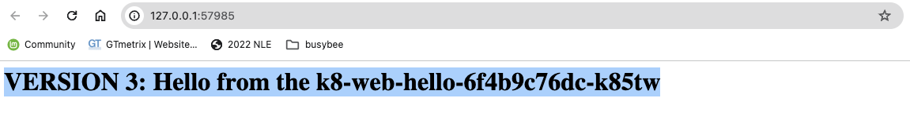

# Kubernetes

## What is Kubernetes?

### KUBERNETES TAKES CARE OF THE FOLLOWING:

- Automatic deployment of the containerized applications across different servers
- Distribution of the load across multiple servers
- Auto-scaling of the deployed applications
- Monitoring and health check of the containers
- Replacement of the failed containers

### Supported container runtimes

- Docker
- CRI-O
- Containers


## What is pod?

- is the smallest unit in the Kubernetes world

### Pod Anatomy

- One container per pod is the most common used case


 


## Kubernetes Cluster


## Kubernetes Services


## What is kubectl?


## Creating single pod

**Create pod**

 ```
 $ kubectl run nginx --image=nginx
 pod/nginx created
 ```

**List all pods**

```
kubectl get pods
NAME    READY   STATUS    RESTARTS   AGE
nginx   1/1     Running   0          57s
```

```
kubectl get pods -o wide
NAME    READY   STATUS    RESTARTS      AGE   IP          NODE             NOMINATED NODE   READINESS GATES
nginx   1/1     Running   1 (56m ago)   9h    10.1.0.19   docker-desktop   <none>           <none>
```

**Delete pod**

```
kubectl delete pod nginx
pod "nginx" deleted
```

**Show details about the pod**

```
kubectl describe pod nginx
Name:             nginx
Namespace:        default
Priority:         0
Service Account:  default
Node:             docker-desktop/192.168.65.3
Start Time:       Mon, 03 Jun 2024 12:00:42 +0800
Labels:           run=nginx
Annotations:      <none>
Status:           Running
IP:               10.1.0.19
IPs:
  IP:  10.1.0.19
Containers:
  nginx:
    Container ID:   docker://554181fdf0f8a706d3a581d79b0be017a051d6c52e8c85b6ce8a084113835b07
    Image:          nginx
    Image ID:       docker-pullable://nginx@sha256:0f04e4f646a3f14bf31d8bc8d885b6c951fdcf42589d06845f64d18aec6a3c4d
    Port:           <none>
    Host Port:      <none>
    State:          Running
      Started:      Mon, 03 Jun 2024 20:57:19 +0800
    Last State:     Terminated
      Reason:       Error
      Exit Code:    255
      Started:      Mon, 03 Jun 2024 12:01:13 +0800
      Finished:     Mon, 03 Jun 2024 20:56:53 +0800
    Ready:          True
    Restart Count:  1
    Environment:    <none>
    Mounts:
      /var/run/secrets/kubernetes.io/serviceaccount from kube-api-access-c2l66 (ro)
Conditions:
  Type                        Status
  PodReadyToStartContainers   True
  Initialized                 True
  Ready                       True
  ContainersReady             True
  PodScheduled                True
Volumes:
  kube-api-access-c2l66:
    Type:                    Projected (a volume that contains injected data from multiple sources)
    TokenExpirationSeconds:  3607
    ConfigMapName:           kube-root-ca.crt
    ConfigMapOptional:       <nil>
    DownwardAPI:             true
QoS Class:                   BestEffort
Node-Selectors:              <none>
Tolerations:                 node.kubernetes.io/not-ready:NoExecute op=Exists for 300s
                             node.kubernetes.io/unreachable:NoExecute op=Exists for 300s
Events:
  Type    Reason          Age   From     Message
  ----    ------          ----  ----     -------
  Normal  SandboxChanged  64s   kubelet  Pod sandbox changed, it will be killed and re-created.
  Normal  Pulling         61s   kubelet  Pulling image "nginx"
  Normal  Pulled          56s   kubelet  Successfully pulled image "nginx" in 4.949s (4.949s including waiting)
  Normal  Created         56s   kubelet  Created container nginx
  Normal  Started         56s   kubelet  Started container nginx
```


## Creating alias for the kubectl command

```
alias k="kubectl"
```


## Creating deployment

**Create deployment**

```
$ k create deployment nginx-deployment --image=nginx
deployment.apps/nginx-deployment created
```

**List deployments**

```
k get deployments
NAME               READY   UP-TO-DATE   AVAILABLE   AGE
nginx-deployment   1/1     1            1           12s
```

**List pods**

```
k get pods
NAME                                READY   STATUS    RESTARTS   AGE
nginx-deployment-6d6565499c-7z7mt   1/1     Running   0          12m
```

## Scaling deployment

**Scale up deployment**

```
k scale deployment nginx-deployment --replicas=3
deployment.apps/nginx-deployment scaled
```

**List pods**

```
k get pods
NAME                                READY   STATUS              RESTARTS   AGE
nginx-deployment-6d6565499c-2whkc   0/1     ContainerCreating   0          9s
nginx-deployment-6d6565499c-7z7mt   1/1     Running             0          18m
nginx-deployment-6d6565499c-x78h9   1/1     Running             0          9s
```

```
k get pods -o wide
NAME                                READY   STATUS    RESTARTS   AGE     IP          NODE             NOMINATED NODE   READINESS GATES
nginx-deployment-6d6565499c-2whkc   1/1     Running   0          2m46s   10.1.0.23   docker-desktop   <none>           <none>
nginx-deployment-6d6565499c-7z7mt   1/1     Running   0          21m     10.1.0.21   docker-desktop   <none>           <none>
nginx-deployment-6d6565499c-x78h9   1/1     Running   0          2m46s   10.1.0.22   docker-desktop   <none>           <none>
```

**Scale down deployment**

```
k scale deployment nginx-deployment --replicas=2
deployment.apps/nginx-deployment scaled
```

```
k get pods -o wide
NAME                                READY   STATUS    RESTARTS   AGE     IP          NODE             NOMINATED NODE   READINESS GATES
nginx-deployment-6d6565499c-7z7mt   1/1     Running   0          23m     10.1.0.21   docker-desktop   <none>           <none>
nginx-deployment-6d6565499c-x78h9   1/1     Running   0          5m20s   10.1.0.22   docker-desktop   <none>           <none>
```

## Connecting to the pods using its IP address

```
minikube ssh
docker@minikube:~$ curl 10.244.0.4
<!DOCTYPE html>
<html>
<head>
<title>Welcome to nginx!</title>
<style>
html { color-scheme: light dark; }
body { width: 35em; margin: 0 auto;
font-family: Tahoma, Verdana, Arial, sans-serif; }
</style>
</head>
<body>
<h1>Welcome to nginx!</h1>
<p>If you see this page, the nginx web server is successfully installed and
working. Further configuration is required.</p>

<p>For online documentation and support please refer to
<a href="http://nginx.org/">nginx.org</a>.<br/>
Commercial support is available at
<a href="http://nginx.com/">nginx.com</a>.</p>

<p><em>Thank you for using nginx.</em></p>
</body>
</html>
```

## Creating and exploring ClusterIP Service

- ClusterIP is the default and most common service type.
- Kubernetes will assign a cluster-internal IP address to ClusterIP service. This makes the service only reachable within the cluster.

```
k expose deployment nginx-deployment --port=8080 --target-port=80
service/nginx-deployment exposed
```

```
k get service
NAME               TYPE        CLUSTER-IP      EXTERNAL-IP   PORT(S)    AGE
kubernetes         ClusterIP   10.96.0.1       <none>        443/TCP    38m
nginx-deployment   ClusterIP   10.108.22.104   <none>        8080/TCP   8s
```


## Connecting to the Deployment using ClusterIP Service

```
minikube ssh
docker@minikube:~$ curl 10.108.22.104:8080
<!DOCTYPE html>
<html>
<head>
<title>Welcome to nginx!</title>
<style>
html { color-scheme: light dark; }
body { width: 35em; margin: 0 auto;
font-family: Tahoma, Verdana, Arial, sans-serif; }
</style>
</head>
<body>
<h1>Welcome to nginx!</h1>
<p>If you see this page, the nginx web server is successfully installed and
working. Further configuration is required.</p>

<p>For online documentation and support please refer to
<a href="http://nginx.org/">nginx.org</a>.<br/>
Commercial support is available at
<a href="http://nginx.com/">nginx.com</a>.</p>

<p><em>Thank you for using nginx.</em></p>
</body>
</html>
```

**Show details about the service**

```
k describe service nginx-deployment
Name:              nginx-deployment
Namespace:         default
Labels:            app=nginx-deployment
Annotations:       <none>
Selector:          app=nginx-deployment
Type:              ClusterIP
IP Family Policy:  SingleStack
IP Families:       IPv4
IP:                10.108.22.104
IPs:               10.108.22.104
Port:              <unset>  8080/TCP
TargetPort:        80/TCP
Endpoints:         10.244.0.3:80,10.244.0.4:80,10.244.0.5:80
Session Affinity:  None
Events:            <none>
```

## Deleting Deployment and Service

```
k delete deployments nginx-deployment
deployment.apps "nginx-deployment" deleted

k delete service nginx-deployment
service "nginx-deployment" deleted

k get deployments.apps
No resources found in default namespace.

k get service
NAME         TYPE        CLUSTER-IP   EXTERNAL-IP   PORT(S)   AGE
kubernetes   ClusterIP   10.96.0.1    <none>        443/TCP   56m
```


## Running Node.js Application using K8s

https://github.com/bstashchuk/k8s

1. Initialized node js

```
npm init -y

npm install express
```

2. Delete node_modules

3. Create index.mjs

index.mjs

```
import express from 'express'
import os from 'os'

const app = express()
const PORT = 3000

app.get("/", (req, res) => {
  const helloMessage = `<h1>VERSION 2: Hello from the ${os.hostname()}</h1>`
  console.log(helloMessage)
  res.send(helloMessage)
})

app.listen(PORT, () => {
  console.log(`Web server is listening at port ${PORT}`)
})
```

4. Create Dockerfile

   Dockerfile

   ```
   FROM node:alpine
   
   WORKDIR /app
   
   EXPOSE 3000
   
   COPY package.json package-lock.json ./
   
   RUN npm install
   
   COPY . ./
   
   CMD ["npm", "start"]
   ```

5. Modify package.json

   ```
   {
     "name": "k8",
     "version": "1.0.0",
     "description": "",
     "main": "index.js",
     "scripts": {
       "start": "node index.mjs"
     },
     "keywords": [],
     "author": "",
     "license": "ISC",
     "dependencies": {
       "express": "^4.19.2"
     }
   }
   ```

6. Build image

   ```
   docker build . -t sherwinowen/k8-web-hello
   ```

7. Push docker image in Docker Hub

   ```
   docker push sherwinowen/k8-web-hello
   ```

8. Create deployment

   ```
   k create deployment k8-web-hello --image sherwinowen/k8-web-hello
   
   sherwinowen@Owen-MBA ~ % k get deployment
   NAME           READY   UP-TO-DATE   AVAILABLE   AGE
   k8-web-hello   1/1     1            1           3m37s
   
   sherwinowen@Owen-MBA ~ % k get pods
   NAME                           READY   STATUS    RESTARTS   AGE
   k8-web-hello-bb6bb7754-k5jrg   1/1     Running   0          3m42s
   ```

9. Create service

   ```
   sherwinowen@Owen-MBA k8 % k expose deployment k8-web-hello --port=3000
   service/k8-web-hello exposed
   sherwinowen@Owen-MBA k8 % k get service
   NAME           TYPE        CLUSTER-IP     EXTERNAL-IP   PORT(S)    AGE
   k8-web-hello   ClusterIP   10.96.102.30   <none>        3000/TCP   7s
   kubernetes     ClusterIP   10.96.0.1      <none>        443/TCP    24h
   ```

10. Check from the minikube terminal

    ```
    sherwinowen@Owen-MBA k8 % minikube ssh
    docker@minikube:~$ curl 10.96.102.30:3000
    <h1>VERSION 2: Hello from the k8-web-hello-bb6bb7754-k5jrg</h1>docker@minikube:~$
    ```

11. Scale deployment

    ```
    sherwinowen@Owen-MBA k8 % k scale deployment k8-web-hello --replicas=3
    deployment.apps/k8-web-hello scaled
    sherwinowen@Owen-MBA k8 % k get pods
    NAME                           READY   STATUS    RESTARTS   AGE
    k8-web-hello-bb6bb7754-2hwcv   1/1     Running   0          19s
    k8-web-hello-bb6bb7754-dpdjf   1/1     Running   0          19s
    k8-web-hello-bb6bb7754-k5jrg   1/1     Running   0          17m
    sherwinowen@Owen-MBA k8 % k get pods -o wide
    NAME                           READY   STATUS    RESTARTS   AGE   IP           NODE       NOMINATED NODE   READINESS GATES
    k8-web-hello-bb6bb7754-2hwcv   1/1     Running   0          95s   10.244.0.8   minikube   <none>           <none>
    k8-web-hello-bb6bb7754-dpdjf   1/1     Running   0          95s   10.244.0.7   minikube   <none>           <none>
    k8-web-hello-bb6bb7754-k5jrg   1/1     Running   0          19m   10.244.0.6   minikube   <none>           <none>
    ```

12. Check from the minikube terminal

    - See how it load balance the request

    ```
    sherwinowen@Owen-MBA k8 % minikube ssh
    docker@minikube:~$ curl 10.96.102.30:3000
    <h1>VERSION 2: Hello from the k8-web-hello-bb6bb7754-2hwcv</h1>docker@minikube:~$ curl 10.96.102.30:3000
    <h1>VERSION 2: Hello from the k8-web-hello-bb6bb7754-2hwcv</h1>docker@minikube:~$ curl 10.96.102.30:3000
    <h1>VERSION 2: Hello from the k8-web-hello-bb6bb7754-dpdjf</h1>docker@minikube:~$ curl 10.96.102.30:3000
    <h1>VERSION 2: Hello from the k8-web-hello-bb6bb7754-k5jrg</h1>docker@minikube:~$ curl 10.96.102.30:3000
    <h1>VERSION 2: Hello from the k8-web-hello-bb6bb7754-k5jrg</h1>docker@minikube:~$ curl 10.96.102.30:3000
    <h1>VERSION 2: Hello from the k8-web-hello-bb6bb7754-2hwcv</h1>docker@minikube:~$ curl 10.96.102.30:3000
    <h1>VERSION 2: Hello from the k8-web-hello-bb6bb7754-k5jrg</h1>docker@minikube:~$
    ```

13. Create NodePort Service

    Delete service

    ```
    k delete service k8-web-hello
    service "k8-web-hello" deleted
    ```

    Create service

    ```
    sherwinowen@Owen-MBA ~ % k expose deployment k8-web-hello --type=NodePort --port=3000
    service/k8-web-hello exposed
    sherwinowen@Owen-MBA ~ % k get svc
    NAME           TYPE        CLUSTER-IP      EXTERNAL-IP   PORT(S)          AGE
    k8-web-hello   NodePort    10.99.210.229   <none>        3000:32650/TCP   7s
    kubernetes     ClusterIP   10.96.0.1       <none>        443/TCP          24h
    ```

    Open the app in minikube to be able to browse in browser

    ```
    minikube service k8-web-hello
    |-----------|--------------|-------------|---------------------------|
    | NAMESPACE |     NAME     | TARGET PORT |            URL            |
    |-----------|--------------|-------------|---------------------------|
    | default   | k8-web-hello |        3000 | http://192.168.49.2:32650 |
    |-----------|--------------|-------------|---------------------------|
    🏃  Starting tunnel for service k8-web-hello.
    |-----------|--------------|-------------|------------------------|
    | NAMESPACE |     NAME     | TARGET PORT |          URL           |
    |-----------|--------------|-------------|------------------------|
    | default   | k8-web-hello |             | http://127.0.0.1:52394 |
    |-----------|--------------|-------------|------------------------|
    🎉  Opening service default/k8-web-hello in default browser...
    ❗  Because you are using a Docker driver on darwin, the terminal needs to be open to run it.
    ```

14. Create LoadBalancer Service

    Delete service

    ```
    k delete service k8-web-hello
    service "k8-web-hello" deleted
    ```

    ```
    k expose deployment k8-web-hello --type=LoadBalancer --port=3000
    service/k8-web-hello exposed
    sherwinowen@Owen-MBA ~ % k get svc
    NAME           TYPE           CLUSTER-IP     EXTERNAL-IP   PORT(S)          AGE
    k8-web-hello   LoadBalancer   10.107.62.48   <pending>     3000:31669/TCP   10s
    kubernetes     ClusterIP      10.96.0.1      <none>        443/TCP          25h
    ```


## Rolling update of the deployment

1. Modify index.mjs

   index.mjs

```
import express from 'express'
import os from 'os'

const app = express()
const PORT = 3000

app.get("/", (req, res) => {
  const helloMessage = `<h1>VERSION 3: Hello from the ${os.hostname()}</h1>`
  console.log(helloMessage)
  res.send(helloMessage)
})

app.listen(PORT, () => {
  console.log(`Web server is listening at port ${PORT}`)
})
```

2. Build new image

   ```
   docker build . -t sherwinowen/k8-web-hello:3.0.0
   ```

3. Push new image

   ```
   docker push sherwinowen/k8-web-hello:3.0.0
   ```

4. Update the image in the deployment

   ```
   k set image deployment k8-web-hello k8-web-hello=sherwinowen/k8-web-hello:3.0.0
   ```

5. Check the status of the rollout of new image

   ```
   $ k rollout status deployment k8-web-hello
   Waiting for deployment "k8-web-hello" rollout to finish: 1 out of 3 new replicas have been updated...
   Waiting for deployment "k8-web-hello" rollout to finish: 1 out of 3 new replicas have been updated...
   Waiting for deployment "k8-web-hello" rollout to finish: 1 out of 3 new replicas have been updated...
   Waiting for deployment "k8-web-hello" rollout to finish: 2 out of 3 new replicas have been updated...
   Waiting for deployment "k8-web-hello" rollout to finish: 2 out of 3 new replicas have been updated...
   Waiting for deployment "k8-web-hello" rollout to finish: 2 out of 3 new replicas have been updated...
   Waiting for deployment "k8-web-hello" rollout to finish: 1 old replicas are pending termination...
   Waiting for deployment "k8-web-hello" rollout to finish: 1 old replicas are pending termination...
   deployment "k8-web-hello" successfully rolled out
   ```

   ```
   k get pods
   NAME                            READY   STATUS    RESTARTS   AGE
   k8-web-hello-6f4b9c76dc-fk2t2   1/1     Running   0          2m25s
   k8-web-hello-6f4b9c76dc-k85tw   1/1     Running   0          2m20s
   k8-web-hello-6f4b9c76dc-pnmcz   1/1     Running   0          2m34s
   ```

   ```
   k get svc
   NAME           TYPE           CLUSTER-IP     EXTERNAL-IP   PORT(S)          AGE
   k8-web-hello   LoadBalancer   10.107.62.48   <pending>     3000:31669/TCP   22h
   kubernetes     ClusterIP      10.96.0.1      <none>        443/TCP          2d
   ```

6. Open the app in minikube to be able to browse in browser

   ```
   minikube service k8-web-hello
   |-----------|--------------|-------------|---------------------------|
   | NAMESPACE |     NAME     | TARGET PORT |            URL            |
   |-----------|--------------|-------------|---------------------------|
   | default   | k8-web-hello |        3000 | http://192.168.49.2:31669 |
   |-----------|--------------|-------------|---------------------------|
   🏃  Starting tunnel for service k8-web-hello.
   |-----------|--------------|-------------|------------------------|
   | NAMESPACE |     NAME     | TARGET PORT |          URL           |
   |-----------|--------------|-------------|------------------------|
   | default   | k8-web-hello |             | http://127.0.0.1:57985 |
   |-----------|--------------|-------------|------------------------|
   🎉  Opening service default/k8-web-hello in default browser...
   ❗  Because you are using a Docker driver on darwin, the terminal needs to be open to run it.
   ```

   

## Kubernetes Dashboard

```
$ minikube dashboard
🔌  Enabling dashboard ...
    ▪ Using image docker.io/kubernetesui/dashboard:v2.7.0
    ▪ Using image docker.io/kubernetesui/metrics-scraper:v1.0.8
💡  Some dashboard features require the metrics-server addon. To enable all features please run:

	minikube addons enable metrics-server


🤔  Verifying dashboard health ...
🚀  Launching proxy ...
🤔  Verifying proxy health ...
🎉  Opening http://127.0.0.1:61552/api/v1/namespaces/kubernetes-dashboard/services/http:kubernetes-dashboard:/proxy/ in your default browser...
```


## Delete all resources in default namespace

```
k delete all --all
pod "k8-web-hello-6f4b9c76dc-fk2t2" deleted
pod "k8-web-hello-6f4b9c76dc-jwp79" deleted
pod "k8-web-hello-6f4b9c76dc-pnmcz" deleted
service "k8-web-hello" deleted
service "kubernetes" deleted
deployment.apps "k8-web-hello" deleted
```

```
k get pods
NAME                            READY   STATUS        RESTARTS   AGE
k8-web-hello-6f4b9c76dc-2x52h   0/1     Terminating   0          10s
k8-web-hello-6f4b9c76dc-9m75t   0/1     Terminating   0          9s
k8-web-hello-6f4b9c76dc-ghvfr   1/1     Terminating   0          10s
```


## Creating YAML deployment specification file


# Kubernetes


## Kubernetes Meaning

* Kubernetes is an open-source system for automating deployment, scaling, and management of containerized applications.


## Kubernetes Features

-  High Availability or no downtime
- Scalability or high performance
- Disaster recovery - backup and restore


## Kubernetes Architecture


## Node or Minions

* The node serves as a worker machine in a K8s cluster
* Node can be physical computer or a virtual machine

**Node Requirements**

1. A kubelet running
2. Container tooling like Docker
3. A kube-proxy process running
4. Supervisord

## Cluster

- A cluster is a set of nodes grouped together. This way even if one node fails you have your application still accessible from the other nodes. Moreover having multiple nodes helps in sharing load as well.

## Master Node

- Manage, plan, schedule, monitor nodes

- The master is another node with Kubernetes installed in it, and is configured as a Master. 
- The master watches over the nodes in the cluster and is responsible for the actual orchestration of
  containers on the worker nodes.

## Worker Nodes

- Host Application as Containers

  

## Components

### 1. API server

- acts as the front-end for kubernetes. The users, management devices, Command line interfaces all talk to the API server to interact with the kubernetes cluster.
- is responsible for orchestrating all operations within the cluster.

### 2. Etcd

- key-value store. 
- is a distributed reliable key-value store used by kubernetes to store all data used to manage the cluster. Think of it this way, when you have multiple nodes and multiple masters in your cluster, etcd stores all that information on all the nodes in the cluster in a distributed manner. 
- is responsible for implementing locks within the cluster to ensure there are no conflicts between the Masters.

### 3. Scheduler

- is responsible for distributing work or containers across multiple nodes. 
- It looks for newly created containers and assigns them to Nodes.

### 4. Controller Manager

- The controllers are the brain behind orchestration. 
- They are responsible for noticing and responding when nodes, containers or endpoints goes down. 
- The controllers makes decisions to bring up new containers in such cases.

#### 	Node controller 

- takes care of nodes
- responsible for onboarding new nodes to he cluster handling situations where nodes become unavailable or get gets destroyed 

#### 	Replication Controller

- ensures that the desired number of containers are running at all times in your replication group

### 5. Container Runtime

- The container runtime is the underlying software that is used to run containers. In our case it happens to be Docker.

### 6. Kubelet (Captain of the ships)

- Kubelet is the agent that runs on each node in the cluster. 
- The agent is responsible for making sure that the containers are running on the nodes as expected.

### 7. Kube-proxy service

- ensures that the necessary rules are in place on the worker nodes to allow the containers running on them to reach each other.
- helps in enabling communication between services within the cluster.

## Master vs Worker Nodes


### Kubectl command

- kube command line tool or kubectl or kube control as it is also called.
- The kube control tool is used to deploy and manage applications on a kubernetes cluster, to get cluster information, get the status of nodes in the cluster and many other things.

```
$ kubectl run 
```

- is used to deploy an application on the cluster. 

```
$ kubectl cluster-info 
```

- is used to view information about the cluster and the 

```
$ kubectl get pod 
```

- is used to list all the nodes part of the cluster.


## Setup Kubernetes


### 1. Minikube

- Minikube bundles all of these different components into a single image providing us a pre-configured single node kubernetes cluster so we can get started in a matter of minutes.
- The whole bundle is packaged into an ISO image and is available online for download.


**Steps**

You need 3 things to get this working, you must have a 

- hypervisor installed, 
- kubectl installed and 
- minikube executable installed on your system

**Note**

With the minikube utility you could only setup a single node kubernetes cluster.


#### Install Minikube

1. Install Docker

   https://docs.docker.com/engine/install/ubuntu/

2. Install kubectl

   https://kubernetes.io/docs/tasks/tools/install-kubectl-linux/

   kubect alias and autocomplete

   ```
   sudo apt-get install bash-completion
   
   source /usr/share/bash-completion/bash_completion
   
   echo 'source <(kubectl completion bash)' >>~/.bashrc
   
   # If you have an alias for kubectl, you can extend shell completion to work with that alias:
   echo 'alias k=kubectl' >>~/.bashrc
   echo 'complete -o default -F __start_kubectl k' >>~/.bashrc
   ```

   

3. Install minikube

   https://minikube.sigs.k8s.io/docs/start/

   1. **Installation**

      To install the latest minikube **stable** release on **x86-64** **Linux** using **binary download**:

   ```
   curl -LO https://storage.googleapis.com/minikube/releases/latest/minikube-linux-amd64
   
   sudo install minikube-linux-amd64 /usr/local/bin/minikube
   ```

   2. **Start your cluster**

   ```
   minikube start
   ```

   3. **Interact with your cluster**

   ```
   $ kubectl get pods -A
   NAMESPACE     NAME                               READY   STATUS    RESTARTS      AGE
   kube-system   coredns-6d4b75cb6d-ck9hm           1/1     Running   0             27m
   kube-system   etcd-minikube                      1/1     Running   0             27m
   kube-system   kube-apiserver-minikube            1/1     Running   0             27m
   kube-system   kube-controller-manager-minikube   1/1     Running   0             27m
   kube-system   kube-proxy-2wsz7                   1/1     Running   0             27m
   kube-system   kube-scheduler-minikube            1/1     Running   0             27m
   kube-system   storage-provisioner                1/1     Running   1 (26m ago)   27m
   ```

   ```
   $ kubectl get nodes 
   NAME       STATUS   ROLES           AGE   VERSION
   minikube   Ready    control-plane   30m   v1.24.1
   ```

   4. **Deploy applications**

   Create a sample deployment and expose it on port 8080:

   ```shell
   $ kubectl create deployment hello-minikube --image=k8s.gcr.io/echoserver:1.4
   deployment.apps/hello-minikube created
   
   ~$ kubectl expose deployment hello-minikube --type=NodePort --port=8080
   service/hello-minikube exposed
   ```

   It may take a moment, but your deployment will soon show up when you run:

   ```shell
   $ kubectl get services hello-minikube
   NAME             TYPE       CLUSTER-IP      EXTERNAL-IP   PORT(S)          AGE
   hello-minikube   NodePort   10.109.175.78   <none>        8080:31620/TCP   37s
   ```

   The easiest way to access this service is to let minikube launch a web browser for you:

   ```shell
   $ minikube service hello-minikube
   |-----------|----------------|-------------|---------------------------|
   | NAMESPACE |      NAME      | TARGET PORT |            URL            |
   |-----------|----------------|-------------|---------------------------|
   | default   | hello-minikube |        8080 | http://192.168.49.2:31620 |
   |-----------|----------------|-------------|---------------------------|
   🎉  Opening service default/hello-minikube in default browser...
   sherwinowen@ubuntu:~$ Error: no DISPLAY environment variable specified
   ```

   Alternatively, use kubectl to forward the port:

   ```shell
   kubectl port-forward service/hello-minikube 7080:8080
   ```

   Copy

   Tada! Your application is now available at http://localhost:7080/.

   

   **LoadBalancer deployments**

   To access a LoadBalancer deployment, use the “minikube tunnel” command. Here is an example deployment:
   
   ```shell
   $ kubectl create deployment balanced --image=k8s.gcr.io/echoserver:1.4  
   deployment.apps/balanced created
   

$ kubectl expose deployment balanced --type=LoadBalancer --port=8080
   service/balanced exposed
```
   
   In another window, start the tunnel to create a routable IP for the ‘balanced’ deployment:
   
```shell
   minikube tunnel
```

To find the routable IP, run this command and examine the `EXTERNAL-IP` column:

   ```shell
   kubectl get services balanced
   ```

Your deployment is now available at <EXTERNAL-IP>:8080


### 2. Kubeadm

- The kubeadmin tool helps us setup a multi node cluster with master and workers on separate machines.

**Steps**


**Before you begin**

- A compatible Linux host. The Kubernetes project provides generic instructions for Linux distributions based on Debian and Red Hat, and those distributions without a package manager.

- 2 GB or more of RAM per machine (any less will leave little room for your apps).

- 2 CPUs or more.

- Full network connectivity between all machines in the cluster (public or private network is fine).


1. Set hostnames

  Edit /etc/hosts 

  ```
  127.0.0.1 localhost
  127.0.1.1 kube-master
  
  # The following lines are desirable for IPv6 capable hosts
  ::1     ip6-localhost ip6-loopback
  fe00::0 ip6-localnet
  ff00::0 ip6-mcastprefix
  ff02::1 ip6-allnodes
  ff02::2 ip6-allrouters
  ```

  edit /etc/hostname

  ```
  kube-master
  ```

  

- Certain ports are open on your machines. See [here](https://kubernetes.io/docs/setup/production-environment/tools/kubeadm/install-kubeadm/#check-required-ports) for more details.

- Swap disabled. You **MUST** disable swap in order for the kubelet to work properly.

  Run command 

  ```
  Set hostnames
  $ sudo hostnamectl set-hostname kube-master
  $ sudo hostnamectl set-hostname kube-worker
  ```

  OR

  ```
  # swapoff -a
  ```

  Comment out swap in /etc/fstab

  ```
  # /etc/fstab: static file system information.
  #
  # Use 'blkid' to print the universally unique identifier for a
  # device; this may be used with UUID= as a more robust way to name devices
  # that works even if disks are added and removed. See fstab(5).
  #
  # <file system> <mount point>   <type>  <options>       <dump>  <pass>
  # / was on /dev/ubuntu-vg/ubuntu-lv during curtin installation
  /dev/disk/by-id/dm-uuid-LVM-i6LmaQCusf1JanX2ys5uoX1LTwyL4her2uI22Rx0EDUYNORi4R37KEs8xzV1bsUg / ext4 defaults 0 1
  # /boot was on /dev/sda2 during curtin installation
  /dev/disk/by-uuid/0ca723bc-047f-4f91-a351-c3c90fee3c72 /boot ext4 defaults 0 1
  # /swap.img     none    swap    sw      0       0
  ```

2. Install Docker

3.  Installing kubeadm, kubelet and kubectl

   1. Update the `apt` package index and install packages needed to use the Kubernetes `apt` repository:

      ```shell
      sudo apt-get update
      sudo apt-get install -y apt-transport-https ca-certificates curl
      ```

   2. Download the Google Cloud public signing key:

      ```shell
      sudo curl -fsSLo /usr/share/keyrings/kubernetes-archive-keyring.gpg https://packages.cloud.google.com/apt/doc/apt-key.gpg
      ```

   3. Add the Kubernetes `apt` repository:

      ```shell
      echo "deb [signed-by=/usr/share/keyrings/kubernetes-archive-keyring.gpg] https://apt.kubernetes.io/ kubernetes-xenial main" | sudo tee /etc/apt/sources.list.d/kubernetes.list
      ```

   4. Update `apt` package index, install kubelet, kubeadm and kubectl, and pin their version:

      ```shell
      sudo apt-get update
      sudo apt-get install -y kubelet kubeadm kubectl
      sudo apt-mark hold kubelet kubeadm kubectl
      ```

​    4. Initialize Master    


1. First, you must have multiple systems or virtual machines created for configuring a cluster. We will see how to setup up your laptop to do just that if you are not familiar with it. Once the systems are created, designate one as master and others as worker nodes.
2. The next step is to install a container runtime on the hosts. We will be using Docker, so we must install Docker on all the nodes.
3. The next step is to install kubeadmin tool on all the nodes. The kubeadmin tool helps us bootstrap the kubernetes solution by installing and configuring all the required components in the right nodes.
4. The next step is to initialize the Master server. During this process all the required components are installed and configured on the master server. That way we can start the cluster level configurations from the master server. Once the master is initialized and before joining the worker nodes to the master, we must ensure that the network pre-requisites are met. A normal network connectivity
   between the systems is not SUFFICIENT for this. Kubernetes requires a special network between the master and worker nodes which is called as a **POD network**. We will learn more about this network in the networking section later in this course. For now we will simply follow the instructions available to get this installed and setup in our environment.
5. The last step is to join the worker nodes to the master node. We are then all set to launch our application in the kubernetes environment. 


## Pod

* is a single instance of an application.
* is the smallest object, that you can create in kubernetes.
* Each pod is made up of a container or a series of tightly coupled containers, along with options that govern how the containers are run. 
* Pods can be connected to persistent storage in order to run stateful applications.

**What's in the Pod?**

* Your Docker application container
* Storage resources
* Unique network IP
* Options that govern how the containers should run

### Pod States
* Pending
* Running
* Succeeded
* Failed
* CrashLoopBackOff

## Create pod

```
$ kubectl run nginx --image=nginx
pod/nginx created

$ kubectl get pods
NAME    READY   STATUS              RESTARTS   AGE
nginx   0/1     ContainerCreating   0          16s

kubectl get pods -o wide
NAME    READY   STATUS    RESTARTS   AGE     IP           NODE       NOMINATED NODE   READINESS GATES
nginx   1/1     Running   0          6m34s   172.17.0.3   minikube   <none>           <none>
```

**To know more about the pod**

```
$ kubectl describe pod nginx
Name:         nginx
Namespace:    default
Priority:     0
Node:         minikube/192.168.49.2
Start Time:   Thu, 21 Jul 2022 15:30:43 -0700
Labels:       run=nginx
Annotations:  <none>
Status:       Running
IP:           172.17.0.3
IPs:
  IP:  172.17.0.3
Containers:
  nginx:
    Container ID:   docker://5ea5de986d42a6e939847ae407e8d1292e2caa050ae0f3e1ab81f50d6cb2b99f
    Image:          nginx
    Image ID:       docker-pullable://nginx@sha256:1761fb5661e4d77e107427d8012ad3a5955007d997e0f4a3d41acc9ff20467c7
    Port:           <none>
    Host Port:      <none>
    State:          Running
      Started:      Thu, 21 Jul 2022 15:31:01 -0700
    Ready:          True
    Restart Count:  0
    Environment:    <none>
    Mounts:
      /var/run/secrets/kubernetes.io/serviceaccount from kube-api-access-26scq (ro)
Conditions:
  Type              Status
  Initialized       True 
  Ready             True 
  ContainersReady   True 
  PodScheduled      True 
Volumes:
  kube-api-access-26scq:
    Type:                    Projected (a volume that contains injected data from multiple sources)
    TokenExpirationSeconds:  3607
    ConfigMapName:           kube-root-ca.crt
    ConfigMapOptional:       <nil>
    DownwardAPI:             true
QoS Class:                   BestEffort
Node-Selectors:              <none>
Tolerations:                 node.kubernetes.io/not-ready:NoExecute op=Exists for 300s
                             node.kubernetes.io/unreachable:NoExecute op=Exists for 300s
Events:
  Type    Reason     Age    From               Message
  ----    ------     ----   ----               -------
  Normal  Scheduled  2m10s  default-scheduler  Successfully assigned default/nginx to minikube
  Normal  Pulling    2m9s   kubelet            Pulling image "nginx"
  Normal  Pulled     112s   kubelet            Successfully pulled image "nginx" in 16.128772528s
  Normal  Created    112s   kubelet            Created container nginx
  Normal  Started    112s   kubelet            Started container nginx
```


## Pod using Yaml

pod-definition.yml

```
apiVersion: v1
kind: Pod
metadata:
  name: myapp-pod
  labels:
    name: myapp-pod
    app: myapp
    type: pod
spec:
  containers:
    - name: nginx-image
      image: nginx
```

```
$ kubectl create -f pod-definition.yml 
pod/myapp-pod created

$ kubectl get pods
NAME        READY   STATUS    RESTARTS   AGE
myapp-pod   1/1     Running   0          6s
```


## Controllers

### Benefits of Controllers
* Application reliability
* Scaling
* Load balancing

### Kinds of Controllers
#### 1. ReplicaSets 
- Ensures that a specified number of replicas for a pod are running at all times

##### ReplicationController

**rc-definition.yml**

```
apiVersion: v1
kind: ReplicationController
metadata: 
  name: myapp-rc
  labels:
    app: myapp
    type: front-end
spec:
  template:
     metadata:
       name: myapp-pod
       labels:
         app: myapp
         type: front-end
     spec:
       containers:
       - name: nginx-image
         image: nginx
  replicas: 3
```

```
$ kubectl create -f rc-definition.yml 
replicationcontroller/myapp-rc created

$ kubectl get pods
NAME             READY   STATUS    RESTARTS   AGE
myapp-rc-9g9fp   1/1     Running   0          17s
myapp-rc-jmhjv   1/1     Running   0          17s
myapp-rc-nwq89   1/1     Running   0          17s
```

##### ReplicaSet

**replicaset-definition.yml**

```
apiVersion: apps/v1
kind: ReplicaSet
metadata:
  name: myapp-replicaset
  labels:
    app: myapp
    type: front-end
spec:
  replicas: 3
  selector:
    matchLabels:
      type: front-end
  template:
    metadata:
      name: myapp-pod
      labels:
        app: myapp
        type: front-end
    spec:
      containers:
      - name: nginx-container
        image: nginx
```

```
$ kubectl create -f replicaset-definition.yml 
replicaset.apps/myapp-replicaset created

$ kubectl get pods
NAME                     READY   STATUS    RESTARTS   AGE
myapp-replicaset-2hzvk   1/1     Running   0          17s
myapp-replicaset-d6f7f   1/1     Running   0          17s
myapp-replicaset-v5rrf   1/1     Running   0          17s
```

##### Scale Replicasets

###### Replace

Note: Edit the Yaml file replace replicas number.

```
$ kubectl replace -f replicaset-definition.yml 
replicaset.apps/myapp-replicaset replaced

$ kubectl get replicasets.apps 
NAME               DESIRED   CURRENT   READY   AGE
myapp-replicaset   6         6         3       24m

$ kubectl get pods
NAME                     READY   STATUS    RESTARTS   AGE
myapp-replicaset-2hzvk   1/1     Running   0          24m
myapp-replicaset-86xxw   1/1     Running   0          15s
myapp-replicaset-d6f7f   1/1     Running   0          24m
myapp-replicaset-jcd59   1/1     Running   0          15s
myapp-replicaset-v5rrf   1/1     Running   0          24m
myapp-replicaset-z64f8   1/1     Running   0          15s

```

###### Scale

```
$ kubectl scale --replicas=6 -f replicaset-definition.yml 
replicaset.apps/myapp-replicaset scaled

$ kubectl get pods
NAME                     READY   STATUS              RESTARTS   AGE
myapp-replicaset-2hzvk   1/1     Running             0          28m
myapp-replicaset-79nlf   1/1     Running             0          12s
myapp-replicaset-d6f7f   1/1     Running             0          28m
myapp-replicaset-rvfnc   0/1     ContainerCreating   0          12s
myapp-replicaset-snpc2   1/1     Running             0          12s
myapp-replicaset-v5rrf   1/1     Running             0          28m

```

###### Describe

```
$ kubectl describe replicationcontrollers myapp-rc 
Name:         myapp-rc
Namespace:    default
Selector:     app=myapp,type=front-end
Labels:       app=myapp
              type=front-end
Annotations:  <none>
Replicas:     3 current / 3 desired
Pods Status:  3 Running / 0 Waiting / 0 Succeeded / 0 Failed
Pod Template:
  Labels:  app=myapp
           type=front-end
  Containers:
   nginx-image:
    Image:        nginx
    Port:         <none>
    Host Port:    <none>
    Environment:  <none>
    Mounts:       <none>
  Volumes:        <none>
Events:           <none>
```

###### Delete

```
$ kubectl delete replicasets.apps myapp-replicaset 
replicaset.apps "myapp-replicaset" deleted
```


#### 2. Deployments 
- provides declarative updates for pods and ReplicaSets

   * Deployment Controller Use Cases
      * Pod management: Running a ReplicaSet allows us to deploy a number of pods, and check their status as a single unit 
      * Scaling a ReplicaSet scales put the pods, and allows for the deployment to handle more traffic 
      * Pause and Resume:
          * Used with larger changesets 
          * Pause deployment, make changes, resume deployment
      * Status
          * Easy way to check the health of pods, and identify issues

deployment-definition.yml

```
apiVersion: apps/v1
kind: Deployment
metadata:
  name: myapp-deployment
  labels:
    app: myapp
    type: front-end
spec:
  replicas: 3
  selector:
    matchLabels:
      type: front-end
  template:
    metadata:
      name: myapp-pod
      labels:
        app: myapp
        type: front-end
    spec:
      containers:
      - name: nginx-container
        image: nginx
```

```
$ kubectl create -f deployment/deployment-definition.yml 
deployment.apps/myapp-deployment created

$ kubectl get deployments.apps 
NAME               READY   UP-TO-DATE   AVAILABLE   AGE
myapp-deployment   3/3     3            3           12s

$ kubectl get replicasets.apps 
NAME                        DESIRED   CURRENT   READY   AGE
myapp-deployment-689f9d59   3         3         3       24s

$ kubectl get pods
NAME                              READY   STATUS    RESTARTS   AGE
myapp-deployment-689f9d59-7ltvp   1/1     Running   0          36s
myapp-deployment-689f9d59-rw548   1/1     Running   0          36s
myapp-deployment-689f9d59-s26d4   1/1     Running   0          36s

$ kubectl get all
NAME                                  READY   STATUS    RESTARTS   AGE
pod/myapp-deployment-689f9d59-7ltvp   1/1     Running   0          3m25s
pod/myapp-deployment-689f9d59-rw548   1/1     Running   0          3m25s
pod/myapp-deployment-689f9d59-s26d4   1/1     Running   0          3m25s

NAME                 TYPE        CLUSTER-IP   EXTERNAL-IP   PORT(S)   AGE
service/kubernetes   ClusterIP   10.96.0.1    <none>        443/TCP   111m

NAME                               READY   UP-TO-DATE   AVAILABLE   AGE
deployment.apps/myapp-deployment   3/3     3            3           3m25s

NAME                                        DESIRED   CURRENT   READY   AGE
replicaset.apps/myapp-deployment-689f9d59   3         3         3       3m25s
```

```
$ kubectl describe deployments.apps myapp-deployment 
Name:                   myapp-deployment
Namespace:              default
CreationTimestamp:      Fri, 22 Jul 2022 11:06:20 +0800
Labels:                 app=myapp
                        type=front-end
Annotations:            deployment.kubernetes.io/revision: 1
Selector:               type=front-end
Replicas:               3 desired | 3 updated | 3 total | 3 available | 0 unavailable
StrategyType:           RollingUpdate
MinReadySeconds:        0
RollingUpdateStrategy:  25% max unavailable, 25% max surge
Pod Template:
  Labels:  app=myapp
           type=front-end
  Containers:
   nginx-container:
    Image:        nginx
    Port:         <none>
    Host Port:    <none>
    Environment:  <none>
    Mounts:       <none>
  Volumes:        <none>
Conditions:
  Type           Status  Reason
  ----           ------  ------
  Available      True    MinimumReplicasAvailable
  Progressing    True    NewReplicaSetAvailable
OldReplicaSets:  <none>
NewReplicaSet:   myapp-deployment-689f9d59 (3/3 replicas created)
Events:
  Type    Reason             Age    From                   Message
  ----    ------             ----   ----                   -------
  Normal  ScalingReplicaSet  9m34s  deployment-controller  Scaled up replica set myapp-deployment-689f9d59 to 3
```

##### Updates and Rollback

**Rollout Command**

```
$ kubectl rollout status deployment/myapp-deployment
deployment "myapp-deployment" successfully rolled out

$ kubectl rollout history deployment/myapp-deployment
deployment.apps/myapp-deployment
REVISION  CHANGE-CAUSE
1         <none>
```

**Deployment Strategy**

1. Recreate
   - terminate the old version and release the new one (there is application downtime)

2. Rolling Update (default strategy)
   - release a new version on a rolling update fashion, one after the other

**Update**

- update the image version

``` 
$ kubectl apply -f deployment-definition.yml
```

OR

```
$ kubectl set image deployment/myapp-deployment nginx-container=nginx:1.22
deployment.apps/myapp-deployment image updated

$ kubectl rollout status deployment/myapp-deployment
Waiting for deployment "myapp-deployment" rollout to finish: 2 out of 3 new replicas have been updated...
Waiting for deployment "myapp-deployment" rollout to finish: 2 out of 3 new replicas have been updated...
Waiting for deployment "myapp-deployment" rollout to finish: 2 out of 3 new replicas have been updated...
Waiting for deployment "myapp-deployment" rollout to finish: 1 old replicas are pending termination...
Waiting for deployment "myapp-deployment" rollout to finish: 1 old replicas are pending termination...
deployment "myapp-deployment" successfully rolled out

$ kubectl rollout history deployment/myapp-deployment
deployment.apps/myapp-deployment
REVISION  CHANGE-CAUSE
1         kubectl create --filename=deployment/deployment-definition.yml --record=true
2         kubectl create --filename=deployment/deployment-definition.yml --record=true
3         kubectl create --filename=deployment/deployment-definition.yml --record=true

kubectl describe deployments.apps myapp-deployment
Name:                   myapp-deployment
Namespace:              default
CreationTimestamp:      Fri, 22 Jul 2022 21:29:40 +0800
Labels:                 app=myapp
                        type=front-end
Annotations:            deployment.kubernetes.io/revision: 3
                        kubernetes.io/change-cause: kubectl create --filename=deployment/deployment-definition.yml --record=true
Selector:               type=front-end
Replicas:               3 desired | 3 updated | 3 total | 3 available | 0 unavailable
StrategyType:           RollingUpdate
MinReadySeconds:        0
RollingUpdateStrategy:  25% max unavailable, 25% max surge
Pod Template:
  Labels:  app=myapp
           type=front-end
  Containers:
   nginx-container:
    Image:        nginx:1.22
    Port:         <none>
    Host Port:    <none>
    Environment:  <none>
    Mounts:       <none>
  Volumes:        <none>
Conditions:
  Type           Status  Reason
  ----           ------  ------
  Available      True    MinimumReplicasAvailable
  Progressing    True    NewReplicaSetAvailable
OldReplicaSets:  <none>
NewReplicaSet:   myapp-deployment-84445d4566 (3/3 replicas created)
Events:
  Type    Reason             Age                  From                   Message
  ----    ------             ----                 ----                   -------
  Normal  ScalingReplicaSet  17m                  deployment-controller  Scaled up replica set myapp-deployment-689f9d59 to 3
  Normal  ScalingReplicaSet  10m                  deployment-controller  Scaled up replica set myapp-deployment-57c6cb89d9 to 1
  Normal  ScalingReplicaSet  10m                  deployment-controller  Scaled down replica set myapp-deployment-689f9d59 to 2
  Normal  ScalingReplicaSet  10m                  deployment-controller  Scaled up replica set myapp-deployment-57c6cb89d9 to 2
  Normal  ScalingReplicaSet  10m                  deployment-controller  Scaled down replica set myapp-deployment-689f9d59 to 1
  Normal  ScalingReplicaSet  10m                  deployment-controller  Scaled up replica set myapp-deployment-57c6cb89d9 to 3
  Normal  ScalingReplicaSet  9m59s                deployment-controller  Scaled down replica set myapp-deployment-689f9d59 to 0
  Normal  ScalingReplicaSet  2m20s                deployment-controller  Scaled up replica set myapp-deployment-84445d4566 to 1
  Normal  ScalingReplicaSet  2m2s                 deployment-controller  Scaled down replica set myapp-deployment-57c6cb89d9 to 2
  Normal  ScalingReplicaSet  110s (x4 over 2m2s)  deployment-controller  (combined from similar events): Scaled down replica set myapp-deployment-57c6cb89d9 to 0
```

**Rollback**

```
$ kubectl rollout undo deployment myapp-deployment
deployment.apps/myapp-deployment rolled back

$ kubectl rollout status deployment/myapp-deployment
Waiting for deployment "myapp-deployment" rollout to finish: 2 out of 3 new replicas have been updated...
Waiting for deployment "myapp-deployment" rollout to finish: 2 out of 3 new replicas have been updated...
Waiting for deployment "myapp-deployment" rollout to finish: 2 out of 3 new replicas have been updated...
Waiting for deployment "myapp-deployment" rollout to finish: 1 old replicas are pending termination...
Waiting for deployment "myapp-deployment" rollout to finish: 1 old replicas are pending termination...
deployment "myapp-deployment" successfully rolled out

$ kubectl rollout history deployment/myapp-deployment
deployment.apps/myapp-deployment
REVISION  CHANGE-CAUSE
1         kubectl create --filename=deployment/deployment-definition.yml --record=true
3         kubectl create --filename=deployment/deployment-definition.yml --record=true
4         kubectl create --filename=deployment/deployment-definition.yml --record=true

kubectl describe deployments.apps myapp-deployment
Name:                   myapp-deployment
Namespace:              default
CreationTimestamp:      Fri, 22 Jul 2022 21:29:40 +0800
Labels:                 app=myapp
                        type=front-end
Annotations:            deployment.kubernetes.io/revision: 4
                        kubernetes.io/change-cause: kubectl create --filename=deployment/deployment-definition.yml --record=true
Selector:               type=front-end
Replicas:               3 desired | 3 updated | 3 total | 3 available | 0 unavailable
StrategyType:           RollingUpdate
MinReadySeconds:        0
RollingUpdateStrategy:  25% max unavailable, 25% max surge
Pod Template:
  Labels:  app=myapp
           type=front-end
  Containers:
   nginx-container:
    Image:        nginx:1.12
    Port:         <none>
    Host Port:    <none>
    Environment:  <none>
    Mounts:       <none>
  Volumes:        <none>
Conditions:
  Type           Status  Reason
  ----           ------  ------
  Available      True    MinimumReplicasAvailable
  Progressing    True    NewReplicaSetAvailable
OldReplicaSets:  <none>
NewReplicaSet:   myapp-deployment-57c6cb89d9 (3/3 replicas created)
Events:
  Type    Reason             Age                  From                   Message
  ----    ------             ----                 ----                   -------
  Normal  ScalingReplicaSet  22m                  deployment-controller  Scaled up replica set myapp-deployment-689f9d59 to 3
  Normal  ScalingReplicaSet  14m                  deployment-controller  Scaled up replica set myapp-deployment-57c6cb89d9 to 1
  Normal  ScalingReplicaSet  14m                  deployment-controller  Scaled down replica set myapp-deployment-689f9d59 to 2
  Normal  ScalingReplicaSet  14m                  deployment-controller  Scaled up replica set myapp-deployment-57c6cb89d9 to 2
  Normal  ScalingReplicaSet  14m                  deployment-controller  Scaled down replica set myapp-deployment-689f9d59 to 1
  Normal  ScalingReplicaSet  14m                  deployment-controller  Scaled down replica set myapp-deployment-689f9d59 to 0
  Normal  ScalingReplicaSet  6m49s                deployment-controller  Scaled up replica set myapp-deployment-84445d4566 to 1
  Normal  ScalingReplicaSet  6m31s                deployment-controller  Scaled down replica set myapp-deployment-57c6cb89d9 to 2
  Normal  ScalingReplicaSet  61s (x2 over 14m)    deployment-controller  Scaled up replica set myapp-deployment-57c6cb89d9 to 3
  Normal  ScalingReplicaSet  55s (x9 over 6m31s)  deployment-controller  (combined from similar events): Scaled down replica set myapp-deployment-84445d4566 to 0
```


#### 3. DaemonSets
- ensure that all nodes run a copy of a specific pod <br>
- As nodes are added or removed from the cluster, a DaemonSet will add or remove the required pods

4. Jobs 
- Supervisor process for pods carrying out batch jobs <br>
- Run individual processes that run once and complete successfully

5. Services 
- Allow the communication between one set of deployments eith another <br>
- Use a service to get pods in two deployments to talk to each other.

    * Kinds of Services
        * Internal: IP is only reachable within the cluster
        * External: endpoint available through node ip: port (called Nodeport)
        * Load balancer: Exposes application to the internet with a load balancer (available with a cloud provider)

## Networking

```
kubectl get pods -o wide
NAME                                READY   STATUS    RESTARTS        AGE   IP           NODE       NOMINATED NODE   READINESS GATES
myapp-deployment-57c6cb89d9-brb8k   1/1     Running   1 (5m55s ago)   19h   172.17.0.2   minikube   <none>           <none>
myapp-deployment-57c6cb89d9-ct2rw   1/1     Running   1 (5m55s ago)   19h   172.17.0.3   minikube   <none>           <none>
myapp-deployment-57c6cb89d9-sdfzq   1/1     Running   1 (5m55s ago)   19h   172.17.0.4   minikube   <none>           <none
```


## Services

### Services Type


1. **NodePort**

   

   service-definition.yml

   ```
   apiVersion: v1
   kind: Service
   metadata:
     name:  myapp-service
   spec:
     type:  NodePort
     ports:
     - targetPort: 80
       port:  80
       nodePort: 30008
     selector:
       name: myapp-pod
       app: myapp
       type: pod
   ```

   ```
   $ kubectl create -f service/service-definition.yml
   service/myapp-service created
   
   $ kubectl get services
   NAME            TYPE        CLUSTER-IP      EXTERNAL-IP   PORT(S)        AGE
   kubernetes      ClusterIP   10.96.0.1       <none>        443/TCP        44h
   myapp-service   NodePort    10.102.90.169   <none>        80:30008/TCP   14m
   ```

   

   - NodePort service is an extension of ClusterIP service. A ClusterIP Service, to which the NodePort Service routes, is automatically created.
   - It exposes the service outside of the cluster by adding a cluster-wide port on top of ClusterIP.
   - NodePort exposes the service on each Node’s IP at a static port (the NodePort). Each node proxies that port into your Service. So, external traffic has access to fixed port on each Node. It means any request to your cluster on that port gets forwarded to the service.
   - You can contact the NodePort Service, from outside the cluster, by requesting <NodeIP>:<NodePort>.
   - Node port must be in the range of 30000–32767. Manually allocating a port to the service is optional. If it is undefined, Kubernetes will automatically assign one.
   - If you are going to choose node port explicitly, ensure that the port was not already used by another service.

   **Use Cases**

   - When you want to enable external connectivity to your service.
   - Using a NodePort gives you the freedom to set up your own load balancing solution, to configure environments that are not fully supported by Kubernetes, or even to expose one or more nodes’ IPs directly.
   - Prefer to place a load balancer above your nodes to avoid node failure.

2. **ClusterIP**

   

   - ClusterIP is the default and most common service type.
   - Kubernetes will assign a cluster-internal IP address to ClusterIP service. This makes the service only reachable within the cluster.
   - You cannot make requests to service (pods) from outside the cluster.
   - You can optionally set cluster IP in the service definition file.

    **Use Cases**

   - Inter service communication within the cluster. For example, communication between the front-end and back-end components of your app.

   ```
   apiVersion: v1
   kind: Service
   metadata:
     name: back-end
   spec:
     type: ClusterIP
     ports:
       - targetPort: 80
         port: 80
   
     selector:
       app: myapp
       type: back-end
   ```
   
   
   
3. **Load Balancer**

   - LoadBalancer service is an extension of NodePort service. NodePort and ClusterIP Services, to which the external load balancer routes, are automatically created.
   - It integrates NodePort with cloud-based load balancers.
   - It exposes the Service externally using a cloud provider’s load balancer.
   - Each cloud provider (AWS, Azure, GCP, etc) has its own native load balancer implementation. The cloud provider will create a load balancer, which then automatically routes requests to your Kubernetes Service.
   - Traffic from the external load balancer is directed at the backend Pods. The cloud provider decides how it is load balanced.
   - The actual creation of the load balancer happens asynchronously.
   - Every time you want to expose a service to the outside world, you have to create a new LoadBalancer and get an IP address.

    **Use Cases**

   - When you are using a cloud provider to host your Kubernetes cluster.

4. **ExternalName**

   - Services of type ExternalName map a Service to a DNS name, not to a typical selector such as my-service.
   - You specify these Services with the `spec.externalName` parameter.
   - It maps the Service to the contents of the externalName field (e.g. foo.bar.example.com), by returning a CNAME record with its value.
   - No proxying of any kind is established.

    **Use Cases**

   - This is commonly used to create a service within Kubernetes to represent an external datastore like a database that runs externally to Kubernetes.
   - You can use that ExternalName service (as a local service) when Pods from one namespace to talk to a service in another namespace.

## Deploying microservices in GCP-GKE

https://github.com/sherwin-ad/kubernetes-example-voting-app.git


### 1. Setup a Google Container Engine Environment


### 2. Create Kubernetes Pods

**voting-app-pod.yml**

```yaml
apiVersion: v1
kind: Pod
metadata:
  name: voting-app-pod
  labels:
    name: voting-app-pod
    app: demo-voting-app  
spec:
  containers:
  - name: voting-app
    image: dockersamples/examplevotingapp_vote
    ports:
      - containerPort: 80
```

**worker-app-pod.yml**

```yaml
apiVersion: v1
kind: Pod
metadata:
  name: worker-app-pod
  labels:
    name: worker-app-pod
    app: demo-voting-app  
spec:
  containers:
  - name: worker-app
    image: dockersamples/examplevotingapp_worker
```

**result-app-pod.yml**

```yaml
apiVersion: v1
kind: Pod
metadata:
  name: result-app-pod
  labels:
    name: result-app-pod
    app: demo-voting-app  
spec:
  containers:
  - name: result-app
    image: dockersamples/examplevotingapp_result 
    ports:
      - containerPort: 80
```

**redis-pod.yml**

```yaml
apiVersion: v1
kind: Pod
metadata:
  name: redis-pod
  labels:
    name: redis-pod
    app: demo-voting-app  
spec:
  containers:
  - name: redis
    image: redis
    ports:
      - containerPort: 6379 
```

**postgres-pod.yml**

```yaml
apiVersion: v1
kind: Pod
metadata:
  name: postgres-pod
  labels:
    name: postgres-pod
    app: demo-voting-app   
spec:
  containers:
  - name: postgres
    image: postgres:9.4
    ports:
      - containerPort: 5432
```


### 3. Create Services — ClusterIP - Internal

**redis-service.yml**

```yaml
apiVersion: v1
kind: Service
metadata:
  name: redis
  labels:
    name: redis-service
    app: demo-voting-app  
spec:
  ports:
    - port: 6379
      targetPort: 6379
    selector:
      name: redis-pod
      app: demo-voting-app 
```

**postgres-service.yml**

```yaml
apiVersion: v1
kind: Service
metadata:
  name: db 
  labels:
    name: db-service
    app: demo-voting-app  
spec:
  ports:
    - port: 5432
      targetPort: 5432
    selector:
      name: postgres-pod
      app: demo-voting-app 
```


### 4.  Create Services — LoadBalancer - External

**voting-app-service.yml**

```yaml
apiVersion: v1
kind: Service
metadata:
  name: voting-service
  labels:
    name: voting-service
    app: demo-voting-app  
spec:
  type: LoadBalancer
  ports:
    - port: 80
      targetPort: 80
  selector:
    name: voting-app-pod
    app: demo-voting-app 
```

**result-app-service.yml**

```yaml
apiVersion: v1
kind: Service
metadata:
  name: result-service
  labels:
    name: result-service
    app: demo-voting-app  
spec:
  type: LoadBalancer
  ports:
    - port: 80
      targetPort: 80
    selector:
       name: result-app-pod
       app: demo-voting-app  
```


### 5. Create pods and services in GKE

```
$ kubectl create -f voting-app-pod.yml

$ kubectl create -f voting-app-service.yml

$ kubectl create -f redis-pod.yml

$ kubectl create -f redis-service.yml

$ kubectl create -f posgres-pod.yml

$ kubectl create -f posgres-service.yml

$ kubectl create -f worker-app-pod.yml

$ kubectl create -f result-app-pod.yml

$ kubectl create -f result-app-service.yml
```


## Example Voting Application Improvised - v2


https://github.com/sherwin-ad/kubernetes-example-voting-app-v2.git

### 1. Create Kubernetes Deployments

**redis-deplyment.yml**

```yaml
apiVersion: apps/v1
kind: Deployment
metadata:
  name: redis-deployment
  labels:
    app: demo-voting-app
spec:
  replicas: 1
  selector:
    matchLabels:
      name: redis-pod
      app: demo-voting-app  
  template:
    metadata:
      name: redis-pod
      labels:
        name: redis-pod
        app: demo-voting-app  
    spec:
      containers:
      - name: redis
        image: redis
        ports:
          - containerPort: 6379 
```

**postgres-deplyment.yml**

```yaml
apiVersion: apps/v1
kind: Deployment
metadata:
  name: postgres-deployment
  labels:
    app: demo-voting-app
spec:
  replicas: 1
  selector:
    matchLabels:
      name: postgres-pod
      app: demo-voting-app
  template:
    metadata:
      name: postgres-pod
      labels:
        name: postgres-pod
        app: demo-voting-app   
    spec:
      containers:
      - name: postgres
        image: postgres:9.4
        ports:
          - containerPort: 5432
        env:
          - name: POSTGRES_HOST_AUTH_METHOD
            value: trust  
```

**result-app-deployment.yml**

```yaml
apiVersion: apps/v1
kind: Deployment
metadata:
  name: result-app-deployment
  labels:
    app: demo-voting-app
spec:
  replicas: 3
  selector:
    matchLabels:
      name: result-app-pod
      app: demo-voting-app  
  template:
    metadata:
      name: result-app-pod
      labels:
        name: result-app-pod
        app: demo-voting-app  
    spec:
      containers:
      - name: result-app
        image: dockersamples/examplevotingapp_result 
        ports:
          - containerPort: 80
```

**voting-app-deployment.yml**

```yaml
apiVersion: apps/v1
kind: Deployment
metadata:
  name: voting-app-deployment
  labels:
    app: demo-voting-app
spec:
  replicas: 3
  selector:
    matchLabels:
      name: voting-app-pod
      app: demo-voting-app  
  template:
    metadata:
      name: voting-app-pod
      labels:
        name: voting-app-pod
        app: demo-voting-app  
    spec:
      containers:
      - name: voting-app
        image: dockersamples/examplevotingapp_vote
        ports:
          - containerPort: 80
```

**worker-app-deployment.yml**

```yaml
apiVersion: apps/v1
kind: Deployment
metadata:
  name: worker-app-deployment
  labels:
    app: demo-voting-app
spec:
  replicas: 1
  selector:
    matchLabels:
      name: worker-app-pod
      app: demo-voting-app  
  template:
    metadata:
      name: worker-app-pod
      labels:
        name: worker-app-pod
        app: demo-voting-app  
    spec:
      containers:
      - name: worker-app
        image: dockersamples/examplevotingapp_worker
```


```
$ kubectl create -f .
deployment.apps/postgres-deployment created
service/db created
deployment.apps/redis-deployment created
service/redis created
deployment.apps/result-app-deployment created
service/result-service created
deployment.apps/voting-app-deployment created
service/voting-service created
deployment.apps/worker-app-deployment created
```


```
$ kubectl get all
NAME                                         READY   STATUS    RESTARTS   AGE
pod/postgres-deployment-659847dcf7-5l9xn     1/1     Running   0          3m52s
pod/redis-deployment-7f878dfd46-vpbw7        1/1     Running   0          3m52s
pod/result-app-deployment-548bf77bc8-8hkmz   1/1     Running   0          3m52s
pod/result-app-deployment-548bf77bc8-n7hkd   1/1     Running   0          3m52s
pod/result-app-deployment-548bf77bc8-thcnl   1/1     Running   0          3m52s
pod/voting-app-deployment-868c67b6f7-2q895   1/1     Running   0          3m52s
pod/voting-app-deployment-868c67b6f7-7lkv7   1/1     Running   0          3m52s
pod/voting-app-deployment-868c67b6f7-q2gk5   1/1     Running   0          3m52s
pod/worker-app-deployment-868b6b6567-snpvp   1/1     Running   0          3m52s

NAME                     TYPE           CLUSTER-IP      EXTERNAL-IP   PORT(S)        AGE
service/db               ClusterIP      10.108.81.37    <none>        5432/TCP       3m52s
service/kubernetes       ClusterIP      10.96.0.1       <none>        443/TCP        49m
service/redis            ClusterIP      10.111.11.4     <none>        6379/TCP       3m52s
service/result-service   LoadBalancer   10.110.79.103   <pending>     80:31991/TCP   3m52s
service/voting-service   LoadBalancer   10.110.185.97   <pending>     80:31340/TCP   3m52s

NAME                                    READY   UP-TO-DATE   AVAILABLE   AGE
deployment.apps/postgres-deployment     1/1     1            1           3m52s
deployment.apps/redis-deployment        1/1     1            1           3m52s
deployment.apps/result-app-deployment   3/3     3            3           3m52s
deployment.apps/voting-app-deployment   3/3     3            3           3m52s
deployment.apps/worker-app-deployment   1/1     1            1           3m52s

NAME                                               DESIRED   CURRENT   READY   AGE
replicaset.apps/postgres-deployment-659847dcf7     1         1         1       3m52s
replicaset.apps/redis-deployment-7f878dfd46        1         1         1       3m52s
replicaset.apps/result-app-deployment-548bf77bc8   3         3         3       3m52s
replicaset.apps/voting-app-deployment-868c67b6f7   3         3         3       3m52s
replicaset.apps/worker-app-deployment-868b6b6567   1         1         1       3m52s
```


```
$ minikube service list
|-------------|----------------|--------------|---------------------------|
|  NAMESPACE  |      NAME      | TARGET PORT  |            URL            |
|-------------|----------------|--------------|---------------------------|
| default     | db             | No node port |
| default     | kubernetes     | No node port |
| default     | redis          | No node port |
| default     | result-service |           80 | http://192.168.49.2:31991 |
| default     | voting-service |           80 | http://192.168.49.2:31340 |
| kube-system | kube-dns       | No node port |
|-------------|----------------|--------------|---------------------------|

```


## Labels

* Labels are key/value pairs that are attached to the objects like pods, services and deployments. Labels are for users of Kubernetes to identify attributes for objects

### Example of Labels
"release" : "stable", "release" : "canary"

"environment" : "dev", "environment" : "qa", "environment" : "prod"

"tier" : "frontend", "tier" : "backend", "tier" : "cache"

### Selectors
1. Equility-based
     *  = - Two labels or values of labels should be equal
     *  != - The values of the labels should not be equal
2. Set-based
     * IN: A value should be inside a set of defined values
     * NOTIN: A value should not be in a set of defined values
     * EXISTS: Determines whether a label exists or not

### Running the Kubernetes Dashboard
List available addons in minikube
```
minikube addons list
|-----------------------------|----------|--------------|
|         ADDON NAME          | PROFILE  |    STATUS    |
|-----------------------------|----------|--------------|
| dashboard                   | minikube | enabled ✅   |
| default-storageclass        | minikube | enabled ✅   |
| efk                         | minikube | disabled     |
| freshpod                    | minikube | disabled     |
| gvisor                      | minikube | disabled     |
| helm-tiller                 | minikube | disabled     |
| ingress                     | minikube | disabled     |
| ingress-dns                 | minikube | disabled     |
| istio                       | minikube | disabled     |
| istio-provisioner           | minikube | disabled     |
| logviewer                   | minikube | disabled     |
| metrics-server              | minikube | disabled     |
| nvidia-driver-installer     | minikube | disabled     |
| nvidia-gpu-device-plugin    | minikube | disabled     |
| registry                    | minikube | disabled     |
| registry-aliases            | minikube | disabled     |
| registry-creds              | minikube | disabled     |
| storage-provisioner         | minikube | enabled ✅   |
| storage-provisioner-gluster | minikube | disabled     |
|-----------------------------|----------|--------------|
```

Run the Kubernetes Dashboard in minikube
```
$ minikube dashboard
🤔  Verifying dashboard health ...
🚀  Launching proxy ...
🤔  Verifying proxy health ...
🎉  Opening http://127.0.0.1:46261/api/v1/namespaces/kubernetes-dashboard/services/http:kubernetes-dashboard:/proxy/ in your default browser...
Opening in existing browser session.
```


### Real world examples

guestbook.yaml
```
apiVersion: v1
kind: Service
metadata:
  name: redis-master
  labels:
    app: redis
    tier: backend
    role: master
spec:
  ports:
  - port: 6379
    targetPort: 6379
  selector:
    app: redis
    tier: backend
    role: master
---
apiVersion: apps/v1
kind: Deployment
metadata:
  name: redis-master
spec:
  selector:
    matchLabels:
      app: redis
      role: master
      tier: backend
  replicas: 1
  template:
    metadata:
      labels:
        app: redis
        role: master
        tier: backend
    spec:
      containers:
      - name: master
        image: gcr.io/google_containers/redis:e2e  # or just image: redis
        resources:
          requests:
            cpu: 100m
            memory: 100Mi
        ports:
        - containerPort: 6379
---
apiVersion: v1
kind: Service
metadata:
  name: redis-slave
  labels:
    app: redis
    tier: backend
    role: slave
spec:
  ports:
  - port: 6379
  selector:
    app: redis
    tier: backend
    role: slave
---
apiVersion: apps/v1
kind: Deployment
metadata:
  name: redis-slave
spec:
  selector:
    matchLabels:
      app: redis
      role: slave
      tier: backend
  replicas: 2
  template:
    metadata:
      labels:
        app: redis
        role: slave
        tier: backend
    spec:
      containers:
      - name: slave
        image: gcr.io/google_samples/gb-redisslave:v1
        resources:
          requests:
            cpu: 100m
            memory: 100Mi
        env:
        - name: GET_HOSTS_FROM
          value: dns
          # If your cluster config does not include a dns service, then to
          # instead access an environment variable to find the master
          # service's host, comment out the 'value: dns' line above, and
          # uncomment the line below:
          # value: env
        ports:
        - containerPort: 6379
---
apiVersion: v1
kind: Service
metadata:
  name: frontend
  labels:
    app: guestbook
    tier: frontend
spec:
  type: NodePort
  ports:
  - port: 80
  selector:
    app: guestbook
    tier: frontend
---
apiVersion: apps/v1
kind: Deployment
metadata:
  name: frontend
spec:
  selector:
    matchLabels:
      app: guestbook
      tier: frontend
  replicas: 3
  template:
    metadata:
      labels:
        app: guestbook
        tier: frontend
    spec:
      containers:
      - name: php-redis
        image: gcr.io/google-samples/gb-frontend:v4
        resources:
          requests:
            cpu: 100m
            memory: 100Mi
        env:
        - name: GET_HOSTS_FROM
          value: dns
          # If your cluster config does not include a dns service, then to
          # instead access environment variables to find service host
          # info, comment out the 'value: dns' line above, and uncomment the
          # line below:
          # value: env
        ports:
        - containerPort: 80
```

```
$ kubectl create -f guestbook
.yaml 
service/redis-master created
deployment.apps/redis-master created
service/redis-slave created
deployment.apps/redis-slave created
service/frontend created
deployment.apps/frontend created

$ kubectl get deployments.apps 
NAME           READY   UP-TO-DATE   AVAILABLE   AGE
frontend       0/3     3            0           2m25s
redis-master   1/1     1            1           2m26s
redis-slave    1/2     2            1           2m26s

$ kubectl get service
NAME           TYPE        CLUSTER-IP      EXTERNAL-IP   PORT(S)        AGE
frontend       NodePort    10.100.218.92   <none>        80:31288/TCP   2m32s
kubernetes     ClusterIP   10.96.0.1       <none>        443/TCP        2m32s
redis-master   ClusterIP   10.96.73.220    <none>        6379/TCP       2m33s
redis-slave    ClusterIP   10.100.13.142   <none>        6379/TCP       2m33s
```


#### Run the Kubernetes Dashboard in minikube

```
$ minikube dashboard
🤔  Verifying dashboard health ...
🚀  Launching proxy ...
🤔  Verifying proxy health ...
🎉  Opening http://127.0.0.1:46795/api/v1/namespaces/kubernetes-dashboard/services/http:kubernetes-dashboard:/proxy/ in your default browser...
Opening in existing browser session.
```

### Working with configmaps

reader-deployment.yaml
```
apiVersion: apps/v1
kind: Deployment
metadata:
  name: logreader
spec:
  selector:
    matchLabels:
      name: logreader
  replicas: 1 
  template:
    metadata:
      labels:
        name: logreader
    spec:
      containers:
      - name: logreader
        image: karthequian/reader:latest
        env:
        - name: log_level
          value: "error"
```

```
$ kubectl create -f reader-deployment.yaml 
deployment.apps/logreader created

$ kubectl get pods
NAME                         READY   STATUS    RESTARTS   AGE
logreader-5f9c7846bd-5bxf6   1/1     Running   0          2m16s

$ kubectl logs logreader-5f9c7846bd-5bxf6
Log level passed via env variables was: 'error'
Log level passed via env variables was: 'error'
Log level passed via env variables was: 'error'
Log level passed via env variables was: 'error'
Log level passed via env variables was: 'error'
Log level passed via env variables was: 'error'
Log level passed via env variables was: 'error'
Log level passed via env variables was: 'error'
Log level passed via env variables was: 'error'
Log level passed via env variables was: 'error'
Log level passed via env variables was: 'error'

```

#### Learn how to declare a configmap
Applications require a way for us to pass data to them that can be changed at deploy time. Examples of this might be log-levels or urls of external systems that the application might need at startup time. Instead of hardcoding these values, we can use a configmap in kubernetes, and pass these values as environment variables to the container.

Create a configmap
```
$ kubectl create configmap logger --from-literal=log_level=debug
configmap/logger created

$ kubectl get configmaps 
NAME     DATA   AGE
logger   1      6m33s

$ kubectl get configmaps/logger -o yaml
apiVersion: v1
data:
  log_level: debug
kind: ConfigMap
metadata:
  creationTimestamp: "2020-04-11T02:15:55Z"
  managedFields:
  - apiVersion: v1
    fieldsType: FieldsV1
    fieldsV1:
      f:data:
        .: {}
        f:log_level: {}
    manager: kubectl
    operation: Update
    time: "2020-04-11T02:15:55Z"
  name: logger
  namespace: default
  resourceVersion: "196886"
  selfLink: /api/v1/namespaces/default/configmaps/logger
  uid: e6712d8f-083c-4dc0-a181-893872e618c0

```

reader-configmap-deployment.yaml
```
apiVersion: apps/v1
kind: Deployment
metadata:
  name: logreader-dynamic
spec:
  selector:
    matchLabels:
      name: logreader-dynamic
  replicas: 1
  template:
    metadata:
      labels:
        name: logreader-dynamic
    spec:
      containers:
      - name: logreader
        image: karthequian/reader:latest
        env:
        - name: log_level
          valueFrom:
            configMapKeyRef:
              name: logger #Read from a configmap called log-level
              key: log_level  #Read the key called log_level
```

```
$ kubectl create -f reader-configmap-deployment.yaml 
deployment.apps/logreader-dynamic created

$ kubectl get pods
NAME                                 READY   STATUS    RESTARTS   AGE
logreader-5f9c7846bd-5bxf6           1/1     Running   0          24m
logreader-dynamic-655748b758-j7dt5   1/1     Running   0          6m15s

$ kubectl logs logreader-dynamic-655748b758-j7dt5
Log level passed via env variables was: 'debug'
Log level passed via env variables was: 'debug'
Log level passed via env variables was: 'debug'
Log level passed via env variables was: 'debug'
Log level passed via env variables was: 'debug'
Log level passed via env variables was: 'debug'
Log level passed via env variables was: 'debug'
Log level passed via env variables was: 'debug'
Log level passed via env variables was: 'debug'
Log level passed via env variables was: 'debug'
Log level passed via env variables was: 'debug'
Log level passed via env variables was: 'debug'
```

### Working with secrets

#### Learn how to declare a secret
Just like configuration data, applications might also require other data that might be of more sensitive in nature- for example database passwords, or API tokens. Passing these in the yaml for a deployment or pod would make them visible to everyone.

Create a secret
```
$ kubectl create secret generic apikey --from-literal=api_key=123456767
secret/apikey created

$ kubectl get secrets 
NAME                  TYPE                                  DATA   AGE
apikey                Opaque                                1      85s

$ kubectl get secret apikey -o yaml
apiVersion: v1
data:
  api_key: MTIzNDU2NzY3
kind: Secret
metadata:
  creationTimestamp: "2020-04-11T02:38:52Z"
  managedFields:
  - apiVersion: v1
    fieldsType: FieldsV1
    fieldsV1:
      f:data:
        .: {}
        f:api_key: {}
      f:type: {}
    manager: kubectl
    operation: Update
    time: "2020-04-11T02:38:52Z"
  name: apikey
  namespace: default
  resourceVersion: "199959"
  selfLink: /api/v1/namespaces/default/secrets/apikey
  uid: d8906e0a-229a-413e-94e4-15b61941554f
```


#### Understand how to add a secret to a deployment

secretreader-deployment.yaml
```
apiVersion: apps/v1
kind: Deployment
metadata:
  name: secretreader
spec:
  selector:
    matchLabels:
      name: secretreader
  replicas: 1
  template:
    metadata:
      labels:
        name: secretreader
    spec:
      containers:
      - name: secretreader
        image: karthequian/secretreader:latest
        env:
        - name: api_key
          valueFrom:
            secretKeyRef:
              name: apikey
              key: api_key
```

```
$ kubectl create -f secretreader-deployment.yaml 
deployment.apps/secretreader created

$ kubectl get pods
NAME                           READY   STATUS    RESTARTS   AGE
secretreader-96555f9c9-5qhwt   1/1     Running   0          3m18s

$ kubectl logs secretreader-96555f9c9-5qhwt
api_key passed via env variable was: '123456767'
api_key passed via env variable was: '123456767'
api_key passed via env variable was: '123456767'
api_key passed via env variable was: '123456767'
api_key passed via env variable was: '123456767'
api_key passed via env variable was: '123456767'
```

### Jobs in Kubernetes

#### How to run jobs
Jobs are a construct that run a pod once, and then stop. However, unlike pods in deployments, the output of the job is kept around until you decide to remove it.

simplejob.yaml
```
apiVersion: batch/v1
kind: Job
metadata:
  name: finalcountdown
spec:
  template:
    metadata:
      name: finalcountdown
    spec:
      containers:
      - name: counter
        image: busybox
        command:
         - bin/sh
         - -c
         - "for i in 9 8 7 6 5 4 3 2 1 ; do echo $i ; done"
      restartPolicy: Never #could also be Always or OnFailure
```

Create jobs
```
$ kubectl create -f simplejob.yaml 
job.batch/finalcountdown created

$ kubectl get jobs
NAME             COMPLETIONS   DURATION   AGE
finalcountdown   1/1           10s        54s

$ kubectl get pods
NAME                           READY   STATUS      RESTARTS   AGE
finalcountdown-mxtsd           0/1     Completed   0          83s

$ kubectl logs finalcountdown-mxtsd
9
8
7
6
5
4
3
2
1

```

#### How to run cron jobs
Cron jobs are like jobs, but they run periodically.

```
apiVersion: batch/v1beta1
kind: CronJob
metadata:
  name: hellocron
spec:
  schedule: "*/1 * * * *" #Runs every minute (cron syntax) or @hourly.
  jobTemplate:
    spec:
      template:
        spec:
          containers:
          - name: hellocron
            image: busybox
            args:
            - /bin/sh
            - -c
            - date; echo Hello from your Kubernetes cluster
          restartPolicy: OnFailure #could also be Always or Never
  suspend: false #Set to true if you want to suspend in the future
```

```
$ kubectl create -f cronjob.yaml 
cronjob.batch/hellocron created

kubectl get cronjobs
NAME        SCHEDULE      SUSPEND   ACTIVE   LAST SCHEDULE   AGE
hellocron   */1 * * * *   False     0        29s             108s
```

#### How to stop cronjobs

Edit cronjobs and change suspend: false to true
```
$ kubectl edit cronjobs/hellocron

or 

$ kubectl patch cronjobs hellocron -p "{\"spec\" : {\"suspend\" : true }}"

$ kubectl get cronjobs.batch 
NAME        SCHEDULE      SUSPEND   ACTIVE   LAST SCHEDULE   AGE
hellocron   */1 * * * *   True      0        8m11s           15m

```


#### Daemonsets 
A DaemonSet ensures that all Nodes run a copy of a Pod. As nodes are added to the cluster, Pods are added to them. Examples of a daemon set would be running your logging or monitoring agent on your nodes.

daemonset.yaml 
```
apiVersion: apps/v1
kind: DaemonSet
metadata:
  name: example-daemonset
  namespace: default
  labels:
    k8s-app: example-daemonset
spec:
  selector:
    matchLabels:
      name: example-daemonset
  template:
    metadata:
      labels:
        name: example-daemonset
    spec:
      #nodeSelector: minikube # Specify if you want to run on specific nodes
      containers:
      - name: example-daemonset
        image: busybox
        args:
        - /bin/sh
        - -c
        - date; sleep 1000
        resources:
          limits:
            memory: 200Mi
          requests:
            cpu: 100m
            memory: 200Mi
      terminationGracePeriodSeconds: 30
```

```
$ kubectl create -f daemonset.yaml 
daemonset.apps/example-daemonset created

# List daemonsets
$ kubectl get daemonsets
NAME                DESIRED   CURRENT   READY   UP-TO-DATE   AVAILABLE   NODE SELECTOR   AGE
example-daemonset   1         1         1       1            1           <none>          25s

# List pods
$ kubectl get pods
NAME                      READY   STATUS    RESTARTS   AGE
example-daemonset-88jfx   1/1     Running   0          57s
```

daemonset-infra-development.yaml
```
apiVersion: apps/v1
kind: DaemonSet
metadata:
  name: example-daemonset2
  namespace: default
  labels:
    k8s-app: example-daemonset2
spec:
  selector:
    matchLabels:
      name: example-daemonset2
  template:
    metadata:
      labels:
        name: example-daemonset2
    spec:
      containers:
      - name: example-daemonset2
        image: busybox
        args:
        - /bin/sh
        - -c
        - date; sleep 1000
        resources:
          limits:
            memory: 200Mi
          requests:
            cpu: 100m
            memory: 200Mi
      terminationGracePeriodSeconds: 30
      nodeSelector: 
        infra: "development"
```

```
$ kubectl create -f daemonset-infra-development.yaml 
daemonset.apps/example-daemonset2 created

$ kubectl get daemonsets.apps --show-labels
NAME                 DESIRED   CURRENT   READY   UP-TO-DATE   AVAILABLE   NODE SELECTOR       AGE     LABELS
example-daemonset    1         1         1       1            1           <none>              116m    k8s-app=example-daemonset
example-daemonset2   1         1         1       1            1           infra=development   2m31s   k8s-app=example-daemonset2
```

daemonset-infra-prod.yaml
```
apiVersion: apps/v1
kind: DaemonSet
metadata:
  name: prod-daemonset
  namespace: default
  labels:
    k8s-app: prod-daemonset
spec:
  selector:
    matchLabels:
      name: prod-daemonset
  template:
    metadata:
      labels:
        name: prod-daemonset
    spec:
      containers:
      - name: prod-daemonset
        image: busybox
        args:
        - /bin/sh
        - -c
        - date; sleep 1000
        resources:
          limits:
            memory: 200Mi
          requests:
            cpu: 100m
            memory: 200Mi
      terminationGracePeriodSeconds: 30
      nodeSelector: 
        infra: "production"
```

```
$ kubectl create -f daemonset-infra-prod.yaml 
daemonset.apps/prod-daemonset created

$ kubectl get daemonsets.apps --show-labels
NAME                 DESIRED   CURRENT   READY   UP-TO-DATE   AVAILABLE   NODE SELECTOR       AGE     LABELS
example-daemonset    1         1         1       1            1           <none>              116m    k8s-app=example-daemonset
example-daemonset2   1         1         1       1            1           infra=development   2m31s   k8s-app=example-daemonset2
prod-daemonset       0         0         0       0            0           infra=production    85s     k8s-app=prod-daemonset
```

### Statefulsets 
Manages the deployment and scaling of a set of Pods, and provides guarantees about the ordering and uniqueness of these Pods. Unlike a Deployment, a StatefulSet maintains a sticky identity for each of their Pods.

statefulset.yaml
```
apiVersion: v1
kind: Service
metadata:
  name: zk-cs
  labels:
    app: zk
spec:
  ports:
  - port: 2181
    name: client
  selector:
    app: zk
---
apiVersion: apps/v1
kind: StatefulSet
metadata:
  name: zk
spec:
  selector:
    matchLabels:
      app: zk
  serviceName: zk-hs
  replicas: 1
  podManagementPolicy: Parallel
  updateStrategy:
    type: RollingUpdate
  template:
    metadata:
      labels:
        app: zk
    spec:
      affinity:
        podAntiAffinity:
          requiredDuringSchedulingIgnoredDuringExecution:
            - labelSelector:
                matchExpressions:
                  - key: "app"
                    operator: In
                    values:
                    - none
              topologyKey: "kubernetes.io/hostname"
      containers:
      - name: kubernetes-zookeeper
        imagePullPolicy: Always
        image: "gcr.io/google_containers/kubernetes-zookeeper:1.0-3.4.10"
        resources:
          requests:
            memory: "500Mi"
            cpu: "0.5"
        ports:
        - containerPort: 2181
          name: client
        - containerPort: 2888
          name: server
        - containerPort: 3888
          name: leader-election
        command:
        - sh
        - -c
        - "start-zookeeper \
          --servers=1 \
          --data_dir=/var/lib/zookeeper/data \
          --data_log_dir=/var/lib/zookeeper/data/log \
          --conf_dir=/opt/zookeeper/conf \
          --client_port=2181 \
          --election_port=3888 \
          --server_port=2888 \
          --tick_time=2000 \
          --init_limit=10 \
          --sync_limit=5 \
          --heap=512M \
          --max_client_cnxns=60 \
          --snap_retain_count=3 \
          --purge_interval=12 \
          --max_session_timeout=40000 \
          --min_session_timeout=4000 \
          --log_level=INFO"
        readinessProbe:
          exec:
            command:
            - sh
            - -c
            - "zookeeper-ready 2181"
          initialDelaySeconds: 10
          timeoutSeconds: 5
        livenessProbe:
          exec:
            command:
            - sh
            - -c
            - "zookeeper-ready 2181"
          initialDelaySeconds: 10
          timeoutSeconds: 5
        volumeMounts:
        - name: datadir
          mountPath: /var/lib/zookeeper
      securityContext:
        runAsUser: 1000
        fsGroup: 1000
  volumeClaimTemplates:
  - metadata:
      name: datadir
    spec:
      accessModes: [ "ReadWriteOnce" ]
      resources:
        requests:
          storage: 10Gi
```

```
$ kubectl create -f statefulset.yaml 
service/zk-cs created
statefulset.apps/zk created

$ kubectl get statefulsets.apps 
NAME   READY   AGE
zk     0/1     37s

$ kubectl get pods
NAME                       READY   STATUS              RESTARTS   AGE
example-daemonset-88jfx    1/1     Running             9          154m
example-daemonset2-vfm4v   1/1     Running             1          22m
zk-0                       1/1     Running             0          45s

```

### Namespaces
* Great for large enterprises
* Allows teams to access resources, with accountability
* Great way to divide cluster resources between users
* Provides scope for names - must be unique in the namespace
* "Default" namespace created when you launch Kubernetes
* Objects placed in "default" namespace at start
* Newer applications install their resources in a different namespace
* Kubernetes supports multiple virtual clusters backed by thr same physical cluster. These virtual clusters are namespaces.

#### Namespaces Use Cases
1. Roles an resposibilities in an enterprise
2. Partioning landscapes: dev vs. tes vs. prod
3. Customer partioning for non-multi-tenant scenarios
4. Application partioning

```
# Return all existing namespace
kubectl get namespace

# Create namespace
kubectl create namespace

# Delete namespace
kubectl delete namespace
```


### Kubelet
* is the "Kubernetes node agent" that runs on each node

##### Kubelet Roles
* Communicate with API server to see if pods have been assigned to nodes
* Executes pod containers via a container engine
* Mounts nad runs pod volumes and secrets
* Executes health checks to identify pod/node status

##### Kubelet and Podspec
* Podspec: YAML file that describes a pod
* The kubelet takes a set of Podspecs that are provided ny the kube-apiserver and ensures that the containers described in those Podspecs are running and healthy
* Kubelet only manages containers that were created by the API server - not any container running on the node

### kube-proxy: The Network Proxy
* Process that runs on all worker nodes
* Reflects services as defined on each node, and can do simple network stream or round-robin forwarding across a set of backends
* Service cluster IPs and ports are currently found through Docker--link compatible environment variables specifying ports opened by the service proxy

##### Modes of kube-proxy
1. User space mode
2. Iptables mode
3. Ipvs mode (alpha feature)

##### Why These Modes Are Important
* Services defined against the API server: kube-proxy watches the API server for the addition and removal of services
* For each new service, kube-proxy opens a randomly chosen port on the local mode
* Connections made to the chosen port are proxied to one of the corresponding back-end pods

### Control plane

* is the nerve center of our Kubernetes cluster
* here we find the master node, which includes the Kubernetes components that control the cluster, along with data about the cluster’s state and configuration. 
* is in constant contact with your worker nodes.

### Master node

* Inside the master node, core Kubernetes components handle the important work of making sure your containers are running in sufficient numbers and with the necessary resources.

### kube-apiserver

* Need to interact with your Kubernetes cluster? Talk to the API. The Kubernetes API is the front end of the Kubernetes control plane, handling internal and external requests. The API server determines if a request is valid and, if it is, processes it. You can access the API through REST calls, through the kubectl command-line interface, or through other command-line tools such as kubeadm.

### kube-scheduler

* Is your cluster healthy? If new containers are needed, where will they fit? These are the concerns of the Kubernetes scheduler.

* The scheduler considers the resource needs of a pod, such as CPU or memory, along with the health of the cluster. Then it schedules the pod to an appropriate worker node.

### kube-controller-manager

* Controllers take care of actually running the cluster, and the Kubernetes controller-manager contains several controller functions in one. One controller consults the scheduler and makes sure the correct number of pods is running. If a pod goes down, another controller notices and responds. A controller connects services to pods, so requests go to the right endpoints. And there are controllers for creating accounts and API access tokens.

### etcd

* Configuration data and information about the state of the cluster lives in etcd, a key-value store database. Fault-tolerant and distributed, etcd is designed to be the ultimate source of truth about your cluster.

### Worker nodes

* A Kubernetes cluster needs at least one worker node, but will normally have many. Pods are scheduled and orchestrated to run on worker nodes. Need to scale up the capacity of your cluster? Add more worker nodes.


### Container runtime engine

* To run the containers, each worker has a container runtime engine. Docker is one example, but Kubernetes supports other Open Container Initiative-compliant runtimes as well, such as rkt and CRI-O.

### kubelet

 * Each worker node contains a kubelet, a tiny application that communicates with the master node. The kublet makes sure containers are running in a pod. When the master node needs something to happen in a worker node, the kubelet executes the action.

### kube-proxy

* Each worker node also contains kube-proxy, a network proxy for facilitating Kubernetes networking services. The kube-proxy handles network communications inside or outside of your cluster—relying either on your operating system’s packet filtering layer, or forwarding the traffic itself.

### Persistent storage

* Beyond just managing the containers that run an application, Kubernetes can also manage the application data attached to a cluster. Kubernetes allows users to request storage resources without having to know the details of the underlying storage infrastructure. Persistent volumes are specific to a cluster, rather than a pod, and thus can outlive the life of a pod.

### Container registry

* The container images that Kubernetes relies on are stored in a container registry. This can be a registry you configure, or a third party registry.

### Underlying infrastructure

* Where you run Kubernetes is up to you. This can be bare metal servers, virtual machines, public cloud providers, private clouds, and hybrid cloud environments. One of Kubernetes’s key advantages is it works on many different kinds of infrastructure.


### Install and Set Up kubectl

1. Download the latest release with the command:
```
curl -LO https://storage.googleapis.com/kubernetes-release/release/`curl -s https://storage.googleapis.com/kubernetes-release/release/stable.txt`/bin/linux/amd64/kubectl
```
2. Make the kubectl binary executable.
```
chmod +x ./kubectl
```
3. Move the binary in to your PATH.
```
sudo mv ./kubectl /usr/local/bin/kubectl
```
4. Test to ensure the version you installed is up-to-date:
```
kubectl version --client
```

### Install Minikube via direct download
```
curl -Lo minikube https://storage.googleapis.com/minikube/releases/latest/minikube-linux-amd64 && chmod +x minikube
```

Here’s an easy way to add the Minikube executable to your path:
```
sudo mkdir -p /usr/local/bin/
sudo install minikube /usr/local/bin/
```

### Start Minikube
```
minikube start
```


### Create a Deployment

1. Use the kubectl create command to create a Deployment that manages a Pod. The Pod runs a Container based on the provided Docker image.

   ```
   $ kubectl create deployment hw --image=karthequian/helloworld
     deployment.apps/hw created
   ```

2. View the Deployments

   ```
   $ kubectl get services
   NAME         TYPE        CLUSTER-IP       EXTERNAL-IP   PORT(S)        AGE
   hw           NodePort    10.107.112.170   <none>        80:30150/TCP   2m13s
   kubernetes   ClusterIP   10.96.0.1        <none>        443/TCP        11h$ kubectl get deployments
   NAME   READY   UP-TO-DATE   AVAILABLE   AGE
   hw     1/1     1            1           3m33s
   ```
   
3.  View the Pods

   ```
   $ kubectl get pods
   NAME                  READY   STATUS    RESTARTS   AGE
   hw-7c7f969bd4-fbzbx   1/1     Running   0          4m51s
   ```

4. View the Replicasets

   ``` 
   $ kubectl get replicasets
   NAME            DESIRED   CURRENT   READY   AGE
   hw-7c7f969bd4   1         1         1       10m
   ```


### Create a Service

1. Expose the Pod to the public internet using the `kubectl expose` command:

   ```
   $ kubectl expose deployment hw --type=NodePort --port=80
   service/hw exposed
   ```

2. View the Service you just created

   ```
   $ kubectl get services
   NAME         TYPE        CLUSTER-IP       EXTERNAL-IP   PORT(S)        AGE
   hw           NodePort    10.107.112.170   <none>        80:30150/TCP   2m13s
   kubernetes   ClusterIP   10.96.0.1        <none>        443/TCP        11h
   ```

3. To see the application in the browser

   ```
   $ minikube service hw
   |-----------|------|-------------|-----------------------------|
   | NAMESPACE | NAME | TARGET PORT |             URL             |
   |-----------|------|-------------|-----------------------------|
   | default   | hw   |          80 | http://192.168.99.100:30150 |
   |-----------|------|-------------|-----------------------------|
   🎉  Opening service default/hw in default browser...
   ```

### Enable addons in minikube

1. List the currently supported addons:

   ```
   $ minikube addons list
   |-----------------------------|----------|--------------|
   |         ADDON NAME          | PROFILE  |    STATUS    |
   |-----------------------------|----------|--------------|
   | dashboard                   | minikube | enabled ✅   |
   | default-storageclass        | minikube | enabled ✅   |
   | efk                         | minikube | disabled     |
   | freshpod                    | minikube | disabled     |
   | gvisor                      | minikube | disabled     |
   | helm-tiller                 | minikube | disabled     |
   | ingress                     | minikube | disabled     |
   | ingress-dns                 | minikube | disabled     |
   | istio                       | minikube | disabled     |
   | istio-provisioner           | minikube | disabled     |
   | logviewer                   | minikube | disabled     |
   | metrics-server              | minikube | disabled     |
   | nvidia-driver-installer     | minikube | disabled     |
   | nvidia-gpu-device-plugin    | minikube | disabled     |
   | registry                    | minikube | disabled     |
   | registry-aliases            | minikube | disabled     |
   | registry-creds              | minikube | disabled     |
   | storage-provisioner         | minikube | enabled ✅   |
   | storage-provisioner-gluster | minikube | disabled     |
   |-----------------------------|----------|--------------|
   ```

2. Enable an addon, for example, `metrics-server`:

   ```
   $ minikube addons enable metrics-server
   🌟  The 'metrics-server' addon is enabledView the Pod and Service you just created:
   ```

3. View the Pod and Service you just created:

   ```
   $ kubectl get pod,svc -n kube-system
   NAME                                   READY   STATUS    RESTARTS   AGE
   pod/coredns-66bff467f8-j29vq           1/1     Running   26         47d
   pod/coredns-66bff467f8-zkf4h           1/1     Running   27         47d
   pod/etcd-minikube                      1/1     Running   23         47d
   pod/kube-apiserver-minikube            1/1     Running   142        47d
   pod/kube-controller-manager-minikube   1/1     Running   37         47d
   pod/kube-proxy-gdfcq                   1/1     Running   23         47d
   pod/kube-scheduler-minikube            1/1     Running   37         47d
   pod/metrics-server-7bc6d75975-hqfmg    1/1     Running   11         43d
   pod/storage-provisioner                1/1     Running   33         47d
   
   NAME                     TYPE        CLUSTER-IP       EXTERNAL-IP   PORT(S)                  AGE
   service/kube-dns         ClusterIP   10.96.0.10       <none>        53/UDP,53/TCP,9153/TCP   47d
   service/metrics-server   ClusterIP   10.100.105.221   <none>        443/TCP                  43d
   ```

4. List all that are deployed

   ```
   $ kubectl get all
   NAME                      READY   STATUS    RESTARTS   AGE
   pod/hw-7c7f969bd4-fbzbx   1/1     Running   0          37m
   
   NAME                 TYPE        CLUSTER-IP       EXTERNAL-IP   PORT(S)        AGE
   service/hw           NodePort    10.107.112.170   <none>        80:30150/TCP   20m
   service/kubernetes   ClusterIP   10.96.0.1        <none>        443/TCP        11h
   
   NAME                 READY   UP-TO-DATE   AVAILABLE   AGE
   deployment.apps/hw   1/1     1            1           37m
   
   NAME                            DESIRED   CURRENT   READY   AGE
   replicaset.apps/hw-7c7f969bd4   1         1         1       37m
   ```

5.  View the YAML of the deployment/hw

   ```
   $ kubectl get deployment/hw -o yaml
   ```


### Scale deployment

```
$ kubectl scale --replicas=3 deployment/helloworld-deployment
deployment.apps/helloworld-deployment scaled

# View deployments
sherwinowen@owenbox:~$ kubectl get deployments/helloworld-deployment
NAME                    READY   UP-TO-DATE   AVAILABLE   AGE
helloworld-deployment   3/3     3            3           16m

# View pods
sherwinowen@owenbox:~$ kubectl get pods
NAME                                         READY   STATUS    RESTARTS   AGE
helloworld-all-deployment-7cf6df685c-fqzcx   1/1     Running   0          7m50s
helloworld-deployment-7cf6df685c-kq6d4       1/1     Running   0          84s
helloworld-deployment-7cf6df685c-q4ph6       1/1     Running   0          17m
helloworld-deployment-7cf6df685c-t5vdk       1/1     Running   0          84s
hw-7c7f969bd4-fbzbx                          1/1     Running   0          80m

# View replicasets
sherwinowen@owenbox:~$ kubectl get rs
NAME                                   DESIRED   CURRENT   READY   AGE
helloworld-all-deployment-7cf6df685c   1         1         1       10m
helloworld-deployment-7cf6df685c       3         3         3       19m
hw-7c7f969bd4   
```


### Add change and delete labels

1. Adding labels during build time

helloworld-pod-with-labels.yml

```
apiVersion: v1
kind: Pod
metadata:
  name: helloworld
  labels:
    env: production
    author: karthequian
    application_type: ui
    release-version: "1.0"
spec:
  containers:
  - name: helloworld
    image: karthequian/helloworld:latest
```

* Deploy the code above by using the command 

```
$ kubectl create -f helloworld-pod-with-labels.yml
pod/helloworld created
```

2. Viewing labels

```
$ kubectl get pods --show-labels
NAME         READY   STATUS    RESTARTS   AGE    LABELS
helloworld   1/1     Running   0          116s   application_type=ui,author=karthequian,env=production,release-version=1.0
```

3. Adding labels nodes and pods

```
# Adding labels to node
$ kubectl label node <node-name> <label-key>=<label-value>

# Adding labels to pod
$ kubectl label pod/helloworld app=helloworldapp --overwrite
pod/helloworld labeled

$ kubectl get pods --show-labels
NAME         READY   STATUS    RESTARTS   AGE   LABELS
helloworld   1/1     Running   0          17m   app=helloworldapp,application_type=ui,author=karthequian,env=production,release-version=1.0
```

4. Deleting a label to nodes and pods

```
# Deleting labels to node
$ kubectl label node <node-name> <label-key>-

$ kubectl label node minikube infra-
node/minikube labeled

# Deleting labels to pod
$ kubectl label pod/helloworld app-
pod/helloworld labeled

$ kubectl get pods --show-labels
NAME         READY   STATUS    RESTARTS   AGE   LABELS
helloworld   1/1     Running   0          18m   application_type=ui,author=karthequian,env=production,release-version=1.0
```

5. Searching by labels

sample-infrastructure-with-labels.yml

```
apiVersion: v1
kind: Pod
metadata:
  name: homepage-dev
  labels:
    env: development
    dev-lead: karthik
    team: web
    application_type: ui
    release-version: "12.0"
spec:
  containers:
  - name: helloworld
    image: karthequian/helloworld:latest
---
apiVersion: v1
kind: Pod
metadata:
  name: homepage-staging
  labels:
    env: staging
    team: web
    dev-lead: karthik
    application_type: ui
    release-version: "12.0"
spec:
  containers:
  - name: helloworld
    image: karthequian/helloworld:latest
---
apiVersion: v1
kind: Pod
metadata:
  name: homepage-prod
  labels:
    env: production
    team: web
    dev-lead: karthik
    application_type: ui
    release-version: "12.0"
spec:
  containers:
  - name: helloworld
    image: karthequian/helloworld:latest
---
apiVersion: v1
kind: Pod
metadata:
  name: login-dev
  labels:
    env: development
    team: auth
    dev-lead: jim
    application_type: api
    release-version: "1.0"
spec:
  containers:
  - name: login
    image: karthequian/ruby:latest
---
apiVersion: v1
kind: Pod
metadata:
  name: login-staging
  labels:
    env: staging
    team: auth
    dev-lead: jim
    application_type: api
    release-version: "1.0"
spec:
  containers:
  - name: login
    image: karthequian/ruby:latest
---
apiVersion: v1
kind: Pod
metadata:
  name: login-prod
  labels:
    env: production
    team: auth
    dev-lead: jim
    application_type: api
    release-version: "1.0"
spec:
  containers:
  - name: login
    image: karthequian/ruby:latest
---
apiVersion: v1
kind: Pod
metadata:
  name: cart-dev
  labels:
    env: development
    team: ecommerce
    dev-lead: carisa
    application_type: api
    release-version: "1.0"
spec:
  containers:
  - name: cart
    image: karthequian/ruby:latest
---
apiVersion: v1
kind: Pod
metadata:
  name: cart-staging
  labels:
    env: staging
    team: ecommerce
    dev-lead: carisa
    application_type: api
    release-version: "1.0"
spec:
  containers:
  - name: cart
    image: karthequian/ruby:latest
---
apiVersion: v1
kind: Pod
metadata:
  name: cart-prod
  labels:
    env: production
    team: ecommerce
    dev-lead: carisa
    application_type: api
    release-version: "1.0"
spec:
  containers:
  - name: cart
    image: karthequian/ruby:latest
---

apiVersion: v1
kind: Pod
metadata:
  name: social-dev
  labels:
    env: development
    team: marketing
    dev-lead: carisa
    application_type: api
    release-version: "2.0"
spec:
  containers:
  - name: social
    image: karthequian/ruby:latest
---
apiVersion: v1
kind: Pod
metadata:
  name: social-staging
  labels:
    env: staging
    team: marketing
    dev-lead: marketing
    application_type: api
    release-version: "1.0"
spec:
  containers:
  - name: social
    image: karthequian/ruby:latest
---
apiVersion: v1
kind: Pod
metadata:
  name: social-prod
  labels:
    env: production
    team: marketing
    dev-lead: marketing
    application_type: api
    release-version: "1.0"
spec:
  containers:
  - name: social
    image: karthequian/ruby:latest
---
apiVersion: v1
kind: Pod
metadata:
  name: catalog-dev
  labels:
    env: development
    team: ecommerce
    dev-lead: daniel
    application_type: api
    release-version: "4.0"
spec:
  containers:
  - name: catalog
    image: karthequian/ruby:latest
---
apiVersion: v1
kind: Pod
metadata:
  name: catalog-staging
  labels:
    env: staging
    team: ecommerce
    dev-lead: daniel
    application_type: api
    release-version: "4.0"
spec:
  containers:
  - name: catalog
    image: karthequian/ruby:latest
---
apiVersion: v1
kind: Pod
metadata:
  name: catalog-prod
  labels:
    env: production
    team: ecommerce
    dev-lead: daniel
    application_type: api
    release-version: "4.0"
spec:
  containers:
  - name: catalog
    image: karthequian/ruby:latest
---
apiVersion: v1
kind: Pod
metadata:
  name: quote-dev
  labels:
    env: development
    team: ecommerce
    dev-lead: amy
    application_type: api
    release-version: "2.0"
spec:
  containers:
  - name: quote
    image: karthequian/ruby:latest
---
apiVersion: v1
kind: Pod
metadata:
  name: quote-staging
  labels:
    env: staging
    team: ecommerce
    dev-lead: amy
    application_type: api
    release-version: "2.0"
spec:
  containers:
  - name: quote
    image: karthequian/ruby:latest
---
apiVersion: v1
kind: Pod
metadata:
  name: quote-prod
  labels:
    env: production
    team: ecommerce
    dev-lead: amy
    application_type: api
    release-version: "1.0"
spec:
  containers:
  - name: quote
    image: karthequian/ruby:latest
---
apiVersion: v1
kind: Pod
metadata:
  name: ordering-dev
  labels:
    env: development
    team: purchasing
    dev-lead: chen
    application_type: backend
    release-version: "2.0"
spec:
  containers:
  - name: ordering
    image: karthequian/ruby:latest
---
apiVersion: v1
kind: Pod
metadata:
  name: ordering-staging
  labels:
    env: staging
    team: purchasing
    dev-lead: chen
    application_type: backend
    release-version: "2.0"
spec:
  containers:
  - name: ordering
    image: karthequian/ruby:latest
---
apiVersion: v1
kind: Pod
metadata:
  name: ordering-prod
  labels:
    env: production
    team: purchasing
    dev-lead: chen
    application_type: backend
    release-version: "2.0"
spec:
  containers:
  - name: ordering
    image: karthequian/ruby:latest
---
```

* Deploy the code above by using the command 

```
$ kubectl create -f sample-infrastructure-with-labels.yml 
pod/homepage-dev created
pod/homepage-staging created
pod/homepage-prod created
pod/login-dev created
pod/login-staging created
pod/login-prod created
pod/cart-dev created
pod/cart-staging created
pod/cart-prod created
pod/social-dev created
pod/social-staging created
pod/social-prod created
pod/catalog-dev created
pod/catalog-staging created
pod/catalog-prod created
pod/quote-dev created
pod/quote-staging created
pod/quote-prod created
pod/ordering-dev created
pod/ordering-staging created
pod/ordering-prod created
```

* You can search for labels with the flag `--selector` (or `-l`).

* Search pods in production environment

```
$ kubectl get pods --selector env=production
NAME            READY   STATUS    RESTARTS   AGE
cart-prod       1/1     Running   1          15m
catalog-prod    1/1     Running   1          15m
homepage-prod   1/1     Running   0          15m
login-prod      1/1     Running   1          15m
ordering-prod   1/1     Running   1          15m
quote-prod      1/1     Running   1          15m
social-prod     1/1     Running   1          15m

$ kubectl get pods --selector env=production --show-labels 
NAME            READY   STATUS    RESTARTS   AGE   LABELS
cart-prod       1/1     Running   1          16m   application_type=api,dev-lead=carisa,env=production,release-version=1.0,team=ecommerce
catalog-prod    1/1     Running   1          16m   application_type=api,dev-lead=daniel,env=production,release-version=4.0,team=ecommerce
homepage-prod   1/1     Running   0          16m   application_type=ui,dev-lead=karthik,env=production,release-version=12.0,team=web
login-prod      1/1     Running   1          16m   application_type=api,dev-lead=jim,env=production,release-version=1.0,team=auth
ordering-prod   1/1     Running   1          16m   application_type=backend,dev-lead=chen,env=production,release-version=2.0,team=purchasing
quote-prod      1/1     Running   1          16m   application_type=api,dev-lead=amy,env=production,release-version=1.0,team=ecommerce
social-prod     1/1     Running   1          16m   application_type=api,dev-lead=marketing,env=production,release-version=1.0,team=marketing
```

* Multiple Search

```
$ kubectl get pods -l dev-lead!=karthik,env=staging
NAME               READY   STATUS    RESTARTS   AGE
cart-staging       1/1     Running   2          23m
catalog-staging    1/1     Running   2          23m
login-staging      1/1     Running   2          23m
ordering-staging   1/1     Running   2          23m
quote-staging      1/1     Running   2          23m
social-staging     1/1     Running   2          23m
```

* Complicated search 

```
$ kubectl get pods -l 'release-version in (1.2,2.0)'
NAME               READY   STATUS    RESTARTS   AGE
ordering-dev       1/1     Running   3          39m
ordering-prod      1/1     Running   3          39m
ordering-staging   1/1     Running   3          39m
quote-dev          1/1     Running   3          39m
quote-staging      1/1     Running   3          39m
social-dev         1/1     Running   3          39m

$ kubectl get pods -l 'release-version notin (1.2,2.0)'
NAME               READY   STATUS    RESTARTS   AGE
cart-dev           1/1     Running   3          40m
cart-prod          1/1     Running   3          40m
cart-staging       1/1     Running   3          40m
catalog-dev        1/1     Running   3          40m
catalog-prod       1/1     Running   3          40m
catalog-staging    1/1     Running   3          40m
homepage-dev       1/1     Running   0          40m
homepage-prod      1/1     Running   0          40m
homepage-staging   1/1     Running   0          40m
login-dev          1/1     Running   3          40m
login-prod         1/1     Running   3          40m
login-staging      1/1     Running   3          40m
quote-prod         1/1     Running   3          40m
social-prod        1/1     Running   3          40m
social-staging     1/1     Running   3          40m

```

* Delete pods with dev-lead=karthik

```
$ kubectl delete pods -l dev-lead=karthik
pod "homepage-dev" deleted
pod "homepage-prod" deleted
pod "homepage-staging" deleted$ kubectl delete pods -l dev-lead=karthik
pod "homepage-dev" deleted
pod "homepage-prod" deleted
pod "homepage-staging" deleted

```

### Application health checks

#### Add HTTP health check to the helloworld deployment

We will take our existing hellworld deployment, and add a readiness and liveness probe healthchecks.

```
apiVersion: apps/v1
kind: Deployment
metadata:
  name: helloworld-deployment
spec:
  selector:
    matchLabels:
      app: helloworld
  replicas: 1 # tells deployment to run 1 pods matching the template
  template: # create pods using pod definition in this template
    metadata:
      labels:
        app: helloworld
    spec:
      containers:
      - name: helloworld
        image: karthequian/helloworld:latest
        ports:
        - containerPort: 80
```

**A readiness probe is used to know when a container is ready to start accepting traffic.**

The yaml has the following parameters:

```
readinessProbe:
  # length of time to wait for a pod to initialize
  # after pod startup, before applying health checking
  initialDelaySeconds: 10
  # Amount of time to wait before timing out
  timeoutSeconds: 1
  # Probe for http
  httpGet:
    # Path to probe
    path: /
    # Port to probe
    port: 80
```

**A liveness probe is used to know when a container might need to be restarted.**

A liveness probe yaml has the following parameters that need to be filled out:

```
livenessProbe:
  # length of time to wait for a pod to initialize
  # after pod startup, before applying health checking
  initialDelaySeconds: 100
  # Amount of time to wait before timing out
  timeoutSeconds: 1
  # Probe for http
  httpGet:
    # Path to probe
    path: /
    # Port to probe
    port: 80
```

Thus, our deployment yaml now becomes:

```
apiVersion: apps/v1beta1
kind: Deployment
metadata:
  name: helloworld-deployment-with-probe
spec:
  selector:
    matchLabels:
      app: helloworld
  replicas: 1 # tells deployment to run 1 pods matching the template
  template: # create pods using pod definition in this template
    metadata:
      labels:
        app: helloworld
    spec:
      containers:
      - name: helloworld
        image: karthequian/helloworld:latest
        ports:
        - containerPort: 80
        readinessProbe:
          # length of time to wait for a pod to initialize
          # after pod startup, before applying health checking
          initialDelaySeconds: 10
          # Amount of time to wait before timing out
          initialDelaySeconds: 1
          # Probe for http
          httpGet:
            # Path to probe
            path: /
            # Port to probe
            port: 80
        livenessProbe:
          # length of time to wait for a pod to initialize
          # after pod startup, before applying health checking
          initialDelaySeconds: 100
          # Amount of time to wait before timing out
          timeoutSeconds: 1
          # Probe for http
          httpGet:
            # Path to probe
            path: /
            # Port to probe
            port: 80

```

We run this yaml the same as we had done before:

```
kubectl create -f helloworld-deployment-with-probes.yml


kubectl get deployments
NAME                               READY   UP-TO-DATE   AVAILABLE   AGE
helloworld-deployment-with-probe   1/1     1            1           35h


kubectl get pods
NAME                                                READY   STATUS    RESTARTS   AGE
helloworld-deployment-with-probe-6c6c649897-rdmrn   1/1     Running   1          35h

```

#### Simulate a failing deployment that fails a readiness probe

We will now try to simulate a bad helloworld pod that fails a readiness probe. Instead of checking port 80 like the last example, we will run a readiness check on port 90 to simulate a failing scenario. Thus, our yaml now is:

```
apiVersion: apps/v1
kind: Deployment
metadata:
  name: helloworld-deployment-with-bad-readiness-probe
spec:
  selector:
    matchLabels:
      app: helloworld
  replicas: 1 # tells deployment to run 1 pods matching the template
  template: # create pods using pod definition in this template
    metadata:
      labels:
        app: helloworld
    spec:
      containers:
      - name: helloworld
        image: karthequian/helloworld:latest
        ports:
        - containerPort: 80
        readinessProbe:
          # length of time to wait for a pod to initialize
          # after pod startup, before applying health checking
          initialDelaySeconds: 10
          # Amount of time to wait before timing out
          initialDelaySeconds: 1
          # Probe for http
          httpGet:
            # Path to probe
            path: /
            # Port to probe
            port: 90
```

We will run this yaml with the command `kubectl create -f helloworld-with-bad-readiness-probe.yaml`. After about a minute, we will notice that our pod is still not in a read state when we run the `kubectl get pods` command.

```
kubectl get deployments
NAME                                             READY   UP-TO-DATE   AVAILABLE   AGE
helloworld-deployment-with-bad-readiness-probe   0/1     1            0           4s
helloworld-deployment-with-probe                 1/1     1            1           35h


kubectl get pods
NAME                                                              READY   STATUS    RESTARTS   AGE
helloworld-deployment-with-bad-readiness-probe-77746bdd47-qhzmj   0/1     Running   0          14s
helloworld-deployment-with-probe-6c6c649897-rdmrn                 1/1     Running   1          35h
```

**Describing the pod will show that the pod failed readiness:**

```
kubectl describe po/helloworld-deployment-with-bad-readiness-probe-77746bdd47-qhzmj
Name:         helloworld-deployment-with-bad-readiness-probe-77746bdd47-qhzmj
Namespace:    default
Priority:     0
Node:         minikube/192.168.99.100
Start Time:   Thu, 09 Apr 2020 07:51:48 +0800
Labels:       app=helloworld
              pod-template-hash=77746bdd47
Annotations:  <none>
Status:       Running
IP:           172.17.0.6
IPs:
  IP:           172.17.0.6
Controlled By:  ReplicaSet/helloworld-deployment-with-bad-readiness-probe-77746bdd47
Containers:
  helloworld:
    Container ID:   docker://9eb34236390e457c4c5eee65c1536d8b154a9fed7fb33c73af958a00c9944fcf
    Image:          karthequian/helloworld:latest
    Image ID:       docker-pullable://karthequian/helloworld@sha256:da1f6fc8eb1d02af1a2eaf48111c945c4e0fe5ac5476048db99a109a865531fd
    Port:           80/TCP
    Host Port:      0/TCP
    State:          Running
      Started:      Thu, 09 Apr 2020 07:51:53 +0800
    Ready:          False
    Restart Count:  0
    Readiness:      http-get http://:90/ delay=1s timeout=1s period=10s #success=1 #failure=3
    Environment:    <none>
    Mounts:
      /var/run/secrets/kubernetes.io/serviceaccount from default-token-dvvd9 (ro)
Conditions:
  Type              Status
  Initialized       True 
  Ready             False 
  ContainersReady   False 
  PodScheduled      True 
Volumes:
  default-token-dvvd9:
    Type:        Secret (a volume populated by a Secret)
    SecretName:  default-token-dvvd9
    Optional:    false
QoS Class:       BestEffort
Node-Selectors:  <none>
Tolerations:     node.kubernetes.io/not-ready:NoExecute for 300s
                 node.kubernetes.io/unreachable:NoExecute for 300s
Events:
  Type     Reason     Age               From               Message
  ----     ------     ----              ----               -------
  Normal   Scheduled  40s               default-scheduler  Successfully assigned default/helloworld-deployment-with-bad-readiness-probe-77746bdd47-qhzmj to minikube
  Normal   Pulling    39s               kubelet, minikube  Pulling image "karthequian/helloworld:latest"
  Normal   Pulled     35s               kubelet, minikube  Successfully pulled image "karthequian/helloworld:latest"
  Normal   Created    35s               kubelet, minikube  Created container helloworld
  Normal   Started    35s               kubelet, minikube  Started container helloworld
  Warning  Unhealthy  7s (x3 over 27s)  kubelet, minikube  Readiness probe failed: Get http://172.17.0.6:90/: dial tcp 172.17.0.6:90: connect: connection refused
```

#### Simulate a failing deployment that fails a liveness probe

Next, we will simulate a bad helloworld pod that fails a liveness probe. Instead of checking port 80 like the last example, we will run a liveness check on port 90 to simulate a failing scenario. Thus, our yaml now is:

```
apiVersion: apps/v1
kind: Deployment
metadata:
  name: helloworld-deployment-with-bad-liveness-probe
spec:
  selector:
    matchLabels:
      app: helloworld
  replicas: 1 # tells deployment to run 1 pods matching the template
  template: # create pods using pod definition in this template
    metadata:
      labels:
        app: helloworld
    spec:
      containers:
      - name: helloworld
        image: karthequian/helloworld:latest
        ports:
        - containerPort: 80
        livenessProbe:
          # length of time to wait for a pod to initialize
          # after pod startup, before applying health checking
          initialDelaySeconds: 10
          # How often (in seconds) to perform the probe.
          periodSeconds: 5
          # Amount of time to wait before timing out
          timeoutSeconds: 1
          # Kubernetes will try failureThreshold times before giving up and restarting the Pod
          failureThreshold: 2
          # Probe for http
          httpGet:
            # Path to probe
            path: /
            # Port to probe
            port: 90
```
We will run this yaml with the command `kubectl create -f helloworld-with-bad-liveness-probe.yaml`. After about a minute, we will notice that our pod is still not in a read state when we run the `kubectl get pods` command.

```
$ kubectl create -f helloworld-with-bad-liveness-probe.yaml 
deployment.apps/helloworld-deployment-with-bad-liveness-probe created
```


```
kubectl get deployments.apps 
NAME                                             READY   UP-TO-DATE   AVAILABLE   AGE
helloworld-deployment-with-bad-liveness-probe    1/1     1            1           59s
helloworld-deployment-with-bad-readiness-probe   0/1     1            0           7m57s
helloworld-deployment-with-probe                 1/1     1            1           36h

kubectl get pods/helloworld-deployment-with-bad-liveness-probe-f48c8668b-pn7j8
NAME                                                            READY   STATUS             RESTARTS   AGE
helloworld-deployment-with-bad-liveness-probe-f48c8668b-pn7j8   0/1     CrashLoopBackOff   7          10m
```

When we describe our pod, we notice that it is failing the liveness probe:

```
kubectl describe pods/helloworld-deployment-with-bad-liveness-probe-f48c8668b-pn7j8
Name:         helloworld-deployment-with-bad-liveness-probe-f48c8668b-pn7j8
Namespace:    default
Priority:     0
Node:         minikube/192.168.99.100
Start Time:   Thu, 09 Apr 2020 07:58:46 +0800
Labels:       app=helloworld
              pod-template-hash=f48c8668b
Annotations:  <none>
Status:       Running
IP:           172.17.0.8
IPs:
  IP:           172.17.0.8
Controlled By:  ReplicaSet/helloworld-deployment-with-bad-liveness-probe-f48c8668b
Containers:
  helloworld:
    Container ID:   docker://ba91449188ec9969a2205ab6917554be474a55751528f0b168160c95f983af30
    Image:          karthequian/helloworld:latest
    Image ID:       docker-pullable://karthequian/helloworld@sha256:da1f6fc8eb1d02af1a2eaf48111c945c4e0fe5ac5476048db99a109a865531fd
    Port:           80/TCP
    Host Port:      0/TCP
    State:          Waiting
      Reason:       CrashLoopBackOff
    Last State:     Terminated
      Reason:       Completed
      Exit Code:    0
      Started:      Thu, 09 Apr 2020 08:03:25 +0800
      Finished:     Thu, 09 Apr 2020 08:03:44 +0800
    Ready:          False
    Restart Count:  6
    Liveness:       http-get http://:90/ delay=10s timeout=1s period=5s #success=1 #failure=2
    Environment:    <none>
    Mounts:
      /var/run/secrets/kubernetes.io/serviceaccount from default-token-dvvd9 (ro)
Conditions:
  Type              Status
  Initialized       True 
  Ready             False 
  ContainersReady   False 
  PodScheduled      True 
Volumes:
  default-token-dvvd9:
    Type:        Secret (a volume populated by a Secret)
    SecretName:  default-token-dvvd9
    Optional:    false
QoS Class:       BestEffort
Node-Selectors:  <none>
Tolerations:     node.kubernetes.io/not-ready:NoExecute for 300s
                 node.kubernetes.io/unreachable:NoExecute for 300s
Events:
  Type     Reason     Age                    From               Message

----     ------     ----                   ----               -------
  Normal   Scheduled  6m16s                  default-scheduler  Successfully assigned default/helloworld-deployment-with-bad-liveness-probe-f48c8668b-pn7j8 to minikube
  Warning  Unhealthy  5m13s (x6 over 5m58s)  kubelet, minikube  Liveness probe failed: Get http://172.17.0.8:90/: dial tcp 172.17.0.8:90: connect: connection refused
  Normal   Killing    5m13s (x3 over 5m53s)  kubelet, minikube  Container helloworld failed liveness probe, will be restarted
  Normal   Pulling    5m12s (x4 over 6m15s)  kubelet, minikube  Pulling image "karthequian/helloworld:latest"
  Normal   Pulled     5m9s (x4 over 6m11s)   kubelet, minikube  Successfully pulled image "karthequian/helloworld:latest"
  Normal   Created    5m9s (x4 over 6m11s)   kubelet, minikube  Created container helloworld
  Normal   Started    5m8s (x4 over 6m11s)   kubelet, minikube  Started container helloworld
  Warning  BackOff    64s (x16 over 4m33s)   kubelet, minikube  Back-off restarting failed container
```

### Handling application upgrades

helloworld-black.yaml

```
apiVersion: apps/v1
kind: Deployment
metadata:
  name: navbar-deployment
spec:
  selector:
    matchLabels:
      app: helloworld
  replicas: 3 # tells deployment to run 3 pods matching the template
  template: # create pods using pod definition in this template
    metadata:
      labels:
        app: helloworld
    spec:
      containers:
      - name: helloworld
        image: karthequian/helloworld:black
        ports:
        - containerPort: 80
---
apiVersion: v1
kind: Service
metadata:
  name: navbar-service
spec:
  # if your cluster supports it, uncomment the following to automatically create
  # an external load-balanced IP for the frontend service.
  type: NodePort
  ports:
  - port: 80
    protocol: TCP
    targetPort: 80
  selector:
    app: helloworld

```

Let's deploy our initial version of our application with --record option to reord our rollout history

```
$ kubectl create -f helloworld-black.yaml --record
deployment.apps/navbar-deployment created
service/navbar-service created
```

Browse the service/navbar-service in the browser

```
sherwinowen@owenbox:~$ minikube service navbar-service
|-----------|----------------|-------------|-----------------------------|
| NAMESPACE |      NAME      | TARGET PORT |             URL             |
|-----------|----------------|-------------|-----------------------------|
| default   | navbar-service |          80 | http://192.168.99.100:31924 |
|-----------|----------------|-------------|-----------------------------|
🎉  Opening service default/navbar-service in default browser...
```


Change the deployment image


```
$ kubectl set image deployment/navbar-deployment helloworld=karthequian/helloworld:blue
deployment.apps/navbar-deployment image updated

$ kubectl get deployments.apps 
NAME                READY   UP-TO-DATE   AVAILABLE   AGE
navbar-deployment   3/3     3            3           35m

$ kubectl get rs
NAME                           DESIRED   CURRENT   READY   AGE
navbar-deployment-685664588f   0         0         0       40m
navbar-deployment-7bf84b8b8d   3         3         3       6m52s

$ kubectl get pods
NAME                                 READY   STATUS    RESTARTS   AGE
navbar-deployment-7bf84b8b8d-6fxc4   1/1     Running   0          9m40s
navbar-deployment-7bf84b8b8d-ccxqg   1/1     Running   0          9m41s
navbar-deployment-7bf84b8b8d-dcxz7   1/1     Running   0          9m43s
```


We can also take a look at the rollout history

```
kubectl rollout history deployment/navbar-deployment
deployment.apps/navbar-deployment 
REVISION  CHANGE-CAUSE
1         kubectl create --filename=helloworld-black.yaml --record=true
2         kubectl create --filename=helloworld-black.yaml --record=true
```

To rollback the deployment, we use the rollout undo command

```
$ kubectl rollout undo deployment/navbar-deployment
deployment.apps/navbar-deployment rolled back
```

To rollback to a specific version

```
$ kubectl rollout undo deployment/navbar-deployment --to-revision=[revision number]
```

### Basic troubleshooting techniques

helloworld-deployment.yaml

```
apiVersion: apps/v1
kind: Deployment
metadata:
  name: helloworld-deployment
spec:
  selector:
    matchLabels:
      app: helloworld
  replicas: 1 # tells deployment to run 1 pods matching the template
  template: # create pods using pod definition in this template
    metadata:
      labels:
        app: helloworld
    spec:
      containers:
      - name: helloworld
        image: karthequian/helloworld:latest
        ports:
        - containerPort: 80
```

helloworld-with-bad-pod.yaml

```
apiVersion: apps/v1
kind: Deployment
metadata:
  name: bad-helloworld-deployment
spec:
  selector:
    matchLabels:
      app: bad-helloworld
  replicas: 1 # tells deployment to run 1 pods matching the template
  template: # create pods using pod definition in this template
    metadata:
      labels:
        app: bad-helloworld
    spec:
      containers:
      - name: helloworld
        image: karthequian/unkown-pod:latest
        ports:
        - containerPort: 80
```

```
$ kubectl create -f helloworld-deployment.yaml 
deployment.apps/helloworld-deployment created

$ kubectl create -f helloworld-with-bad-pod.yaml 
deployment.apps/bad-helloworld-deployment created
```

#### 1. Kubernetes Techniques

Check on deployments

```
$ kubectl get deployments.apps 
NAME                        READY   UP-TO-DATE   AVAILABLE   AGE
bad-helloworld-deployment   0/1     1            0           104s
helloworld-deployment       1/1     1            1           2m20s

$ kubectl describe deployments.apps bad-helloworld-deployment
Name:                   bad-helloworld-deployment
Namespace:              default
CreationTimestamp:      Fri, 10 Apr 2020 10:51:55 +0800
Labels:                 <none>
Annotations:            deployment.kubernetes.io/revision: 1
Selector:               app=bad-helloworld
Replicas:               1 desired | 1 updated | 1 total | 0 available | 1 unavailable
StrategyType:           RollingUpdate
MinReadySeconds:        0
RollingUpdateStrategy:  25% max unavailable, 25% max surge
Pod Template:
  Labels:  app=bad-helloworld
  Containers:
   helloworld:
    Image:        karthequian/unkown-pod:latest
    Port:         80/TCP
    Host Port:    0/TCP
    Environment:  <none>
    Mounts:       <none>
  Volumes:        <none>
Conditions:
  Type           Status  Reason
----           ------  ------
  Available      False   MinimumReplicasUnavailable
  Progressing    True    ReplicaSetUpdated
OldReplicaSets:  <none>
NewReplicaSet:   bad-helloworld-deployment-7659446849 (1/1 replicas created)
Events:
  Type    Reason             Age    From                   Message
----    ------             ----   ----                   -------
  Normal  ScalingReplicaSet  3m18s  deployment-controller  Scaled up replica set bad-helloworld-deployment-7659446849 to 1
```

Check on pods

```
$ kubectl get pods
NAME                                         READY   STATUS             RESTARTS   AGE
bad-helloworld-deployment-7659446849-w9wxb   0/1     ImagePullBackOff   0          12m
helloworld-deployment-7cf6df685c-h2mk8       1/1     Running            0          13m

$ kubectl describe po/bad-helloworld-deployment-7659446849-w9wxb
Name:         bad-helloworld-deployment-7659446849-w9wxb
Namespace:    default
Priority:     0
Node:         minikube/192.168.99.100
Start Time:   Fri, 10 Apr 2020 10:51:55 +0800
Labels:       app=bad-helloworld
              pod-template-hash=7659446849
Annotations:  <none>
Status:       Pending
IP:           172.17.0.7
IPs:
  IP:           172.17.0.7
Controlled By:  ReplicaSet/bad-helloworld-deployment-7659446849
Containers:
  helloworld:
    Container ID:   
    Image:          karthequian/unkown-pod:latest
    Image ID:       
    Port:           80/TCP
    Host Port:      0/TCP
    State:          Waiting
      Reason:       ImagePullBackOff
    Ready:          False
    Restart Count:  0
    Environment:    <none>
    Mounts:
      /var/run/secrets/kubernetes.io/serviceaccount from default-token-dvvd9 (ro)
Conditions:
  Type              Status
  Initialized       True 
  Ready             False 
  ContainersReady   False 
  PodScheduled      True 
Volumes:
  default-token-dvvd9:
    Type:        Secret (a volume populated by a Secret)
    SecretName:  default-token-dvvd9
    Optional:    false
QoS Class:       BestEffort
Node-Selectors:  <none>
Tolerations:     node.kubernetes.io/not-ready:NoExecute for 300s
                 node.kubernetes.io/unreachable:NoExecute for 300s
Events:
  Type     Reason     Age                   From               Message
----     ------     ----                  ----               -------
  Normal   Scheduled  12m                   default-scheduler  Successfully assigned default/bad-helloworld-deployment-7659446849-w9wxb to minikube
  Normal   Pulling    10m (x4 over 12m)     kubelet, minikube  Pulling image "karthequian/unkown-pod:latest"
  Warning  Failed     10m (x4 over 12m)     kubelet, minikube  Failed to pull image "karthequian/unkown-pod:latest": rpc error: code = Unknown desc = Error response from daemon: pull access denied for karthequian/unkown-pod, repository does not exist or may require 'docker login': denied: requested access to the resource is denied
  Warning  Failed     10m (x4 over 12m)     kubelet, minikube  Error: ErrImagePull
  Warning  Failed     7m41s (x16 over 12m)  kubelet, minikube  Error: ImagePullBackOff
  Normal   BackOff    2m38s (x37 over 12m)  kubelet, minikube  Back-off pulling image "karthequian/unkown-pod:latest"

```

#### 2. Looking at log files

```
$ kubectl logs helloworld-deployment-7cf6df685c-h2mk8
172.17.0.1 - - [10/Apr/2020:03:12:05 +0000] "GET / HTTP/1.1" 200 4395 "-" "Mozilla/5.0 (X11; Linux x86_64) AppleWebKit/537.36 (KHTML, like Gecko) Chrome/80.0.3987.132 Safari/537.36"
172.17.0.1 - - [10/Apr/2020:03:12:05 +0000] "GET / HTTP/1.1" 200 4395 "-" "Mozilla/5.0 (X11; Linux x86_64) AppleWebKit/537.36 (KHTML, like Gecko) Chrome/80.0.3987.132 Safari/537.36"
172.17.0.1 - - [10/Apr/2020:03:12:06 +0000] "GET /favicon.ico HTTP/1.1" 404 580 "http://192.168.99.100:30216/" "Mozilla/5.0 (X11; Linux x86_64) AppleWebKit/537.36 (KHTML, like Gecko) Chrome/80.0.3987.132 Safari/537.36"
172.17.0.1 - - [10/Apr/2020:03:12:06 +0000] "GET /favicon.ico HTTP/1.1" 404 580 "http://192.168.99.100:30216/" "Mozilla/5.0 (X11; Linux x86_64) AppleWebKit/537.36 (KHTML, like Gecko) Chrome/80.0.3987.132 Safari/537.36"
172.17.0.1 - - [10/Apr/2020:03:12:08 +0000] "GET / HTTP/1.1" 304 0 "-" "Mozilla/5.0 (X11; Linux x86_64) AppleWebKit/537.36 (KHTML, like Gecko) Chrome/80.0.3987.132 Safari/537.36"
172.17.0.1 - - [10/Apr/2020:03:12:08 +0000] "GET / HTTP/1.1" 304 0 "-" "Mozilla/5.0 (X11; Linux x86_64) AppleWebKit/537.36 (KHTML, like Gecko) Chrome/80.0.3987.132 Safari/537.36"
172.17.0.1 - - [10/Apr/2020:03:12:09 +0000] "GET / HTTP/1.1" 304 0 "-" "Mozilla/5.0 (X11; Linux x86_64) AppleWebKit/537.36 (KHTML, like Gecko) Chrome/80.0.3987.132 Safari/537.36"
172.17.0.1 - - [10/Apr/2020:03:12:09 +0000] "GET / HTTP/1.1" 304 0 "-" "Mozilla/5.0 (X11; Linux x86_64) AppleWebKit/537.36 (KHTML, like Gecko) Chrome/80.0.3987.132 Safari/537.36"
172.17.0.1 - - [10/Apr/2020:03:12:09 +0000] "GET / HTTP/1.1" 304 0 "-" "Mozilla/5.0 (X11; Linux x86_64) AppleWebKit/537.36 (KHTML, like Gecko) Chrome/80.0.3987.132 Safari/537.36"
172.17.0.1 - - [10/Apr/2020:03:12:09 +0000] "GET / HTTP/1.1" 304 0 "-" "Mozilla/5.0 (X11; Linux x86_64) AppleWebKit/537.36 (KHTML, like Gecko) Chrome/80.0.3987.132 Safari/537.36"
172.17.0.1 - - [10/Apr/2020:03:12:10 +0000] "GET / HTTP/1.1" 304 0 "-" "Mozilla/5.0 (X11; Linux x86_64) AppleWebKit/537.36 (KHTML, like Gecko) Chrome/80.0.3987.132 Safari/537.36"
172.17.0.1 - - [10/Apr/2020:03:12:10 +0000] "GET / HTTP/1.1" 304 0 "-" "Mozilla/5.0 (X11; Linux x86_64) AppleWebKit/537.36 (KHTML, like Gecko) Chrome/80.0.3987.132 Safari/537.36"
172.17.0.1 - - [10/Apr/2020:03:12:10 +0000] "GET / HTTP/1.1" 304 0 "-" "Mozilla/5.0 (X11; Linux x86_64) AppleWebKit/537.36 (KHTML, like Gecko) Chrome/80.0.3987.132 Safari/537.36"
172.17.0.1 - - [10/Apr/2020:03:12:10 +0000] "GET / HTTP/1.1" 304 0 "-" "Mozilla/5.0 (X11; Linux x86_64) AppleWebKit/537.36 (KHTML, like Gecko) Chrome/80.0.3987.132 Safari/537.36"
```

#### 3. Executing commands in a container

```
$ kubectl get pods
NAME                                         READY   STATUS             RESTARTS   AGE
bad-helloworld-deployment-7659446849-w9wxb   0/1     ImagePullBackOff   0          24m
helloworld-deployment-7cf6df685c-h2mk8       1/1     Running            0          24m

$ kubectl exec -it helloworld-deployment-7cf6df685c-h2mk8 -- /bin/bash
root@helloworld-deployment-7cf6df685c-h2mk8:/# `

# Multiple containers in 1 pod use the -c option
$ kubectl exec -it <pod-name> -c <container-name> -- /bin/bash
```


### Working with configmaps

#### Learn how to declare a configmap

Applications require a way for us to pass data to them that can be changed at deploy time. Examples of this might be log-levels or urls of external systems that the application might need at startup time. Instead of hardcoding these values, we can use a configmap in kubernetes, and pass these values as environment variables to the container.

We will take an example of "log_level", and pass the value "debug" to a pod via a configmap in this example.

1. Create configmaps

```
# To create a configmap for this literal type 
$ kubectl create configmap logger --from-literal=log_level=debug
configmap/logger created

# To see all your configmaps: 
$ kubectl get configmaps

# To read the value in the logger configmap: 
$ kubectl get configmap/logger -o yaml

# To edit the value, we can run 
$ kubectl edit configmap/logger
```

2. Create deployment using the configmap created

```
apiVersion: apps/v1
kind: Deployment
metadata:
  name: logreader-dynamic
spec:
  replicas: 1
  selector:
    matchLabels:
      name: logreader-dynamic
  template:
    metadata:
      labels:
        name: logreader-dynamic
    spec:
      containers:
      - name: logreader
        image: karthequian/reader:latest
        env:
        - name: log_level
          valueFrom:
            configMapKeyRef:
              name: logger #Read from a configmap called log-level
              key: log_level  #Read the key called log_level
```

3. Check the logs of the pod created

```
$ kubectl get pods
NAME                                 READY   STATUS    RESTARTS   AGE
logreader-5f9c7846bd-wlhkl           1/1     Running   1          4h31m
logreader-dynamic-655748b758-rm6x8   1/1     Running   0          2m25s
$ kubectl logs logreader-dynamic-655748b758-rm6x8
Log level passed via env variables was: 'debug'
Log level passed via env variables was: 'debug'
Log level passed via env variables was: 'debug'
Log level passed via env variables was: 'debug'
Log level passed via env variables was: 'debug'
Log level passed via env variables was: 'debug'
Log level passed via env variables was: 'debug'
```

### Working with secrets

#### Learn how to declare a secret

```
# To create a secret `
$ $ kubectl create secret generic owen-apikey --from-literal=api_key=1234567
secret/owen-apikey created

# To list secrets 
$ kubectl get secrets
NAME                  TYPE                                  DATA   AGE
apikey                Opaque                                1      44d
default-token-dvvd9   kubernetes.io/service-account-token   3      48d
owen-apikey           Opaque                                1      3m33s

# Notice that we can't read the value of the secret directly:
$ kubectl get secret owen-apikey -o yaml
apiVersion: v1
data:
  api_key: MTIzNDU2Nw==
kind: Secret
metadata:
  creationTimestamp: "2020-05-25T06:30:49Z"
  managedFields:
  - apiVersion: v1
    fieldsType: FieldsV1
    fieldsV1:
      f:data:
        .: {}
        f:api_key: {}
      f:type: {}
    manager: kubectl
    operation: Update
    time: "2020-05-25T06:30:49Z"
  name: owen-apikey
  namespace: default
  resourceVersion: "365590"
  selfLink: /api/v1/namespaces/default/secrets/owen-apikey
  uid: 72ef49c6-2a19-4ebe-ad75-bd8bb6e1cc3b
type: Opaque
```

#### Understand how to add a secret to a deployment

secretreader-deployment.yaml

```
piVersion: apps/v1
kind: Deployment
metadata:
  name: secretreader
spec:
  replicas: 1
  selector:
    matchLabels:
      name: secretreader
  template:
    metadata:
      labels:
        name: secretreader
    spec:
      containers:
      - name: secretreader
        image: karthequian/secretreader:latest
        env:
        - name: api_key
          valueFrom:
            secretKeyRef:
              name: owen-apikey
              key: api_key
```

1. Create the deployment

   ```
   $ kubectl create -f secretreader-deployment.yaml 
   deployment.apps/secretreader created
   ```

2. List the pods and check the logs

   ```
   # List the pods
   $ kubectl get pods
   NAME                                 READY   STATUS    RESTARTS   AGE
   logreader-5f9c7846bd-wlhkl           1/1     Running   1          4h59m
   logreader-dynamic-655748b758-rm6x8   1/1     Running   0          30m
   secretreader-6db948585-jmgdg         1/1     Running   0          9s
   
   Check the logs of pod
   $ kubectl logs secretreader-6db948585-jmgdg 
   api_key passed via env variable was: '1234567'
   api_key passed via env variable was: '1234567'
   api_key passed via env variable was: '1234567'
   api_key passed via env variable was: '1234567'
   api_key passed via env variable was: '1234567'
   ```

   

### Jobs in Kubernetes

#### How to run jobs

simplejob.yaml

```
apiVersion: batch/v1
kind: Job
metadata:
  name: finalcountdown
spec:
  template:
    metadata:
      name: finalcountdown
    spec:
      containers:
      - name: counter
        image: busybox
        command:
         - bin/sh
         - -c
         - "for i in 9 8 7 6 5 4 3 2 1 ; do echo $i ; done"
      restartPolicy: Never #could also be Always or OnFailure
```


Running a job is similar to running a deployment, and we can create this by 

```
$ kubectl create -f simplejob.yaml 
job.batch/finalcountdown created

# To list the jobs
$ kubectl get pods 
NAME                                 READY   STATUS      RESTARTS   AGE
finalcountdown-jrjxj                 0/1     Completed   0          2m4s

# To see the output of the job: 
$ kubectl logs finalcountdown-jrjxj
9
8
7
6
5
4
3
2
1

```

#### How to run cron jobs

cronjob.yaml 

```
apiVersion: batch/v1beta1
kind: CronJob
metadata:
  name: hellocron
spec:
  schedule: "*/1 * * * *" #Runs every minute (cron syntax) or @hourly.
  jobTemplate:
    spec:
      template:
        spec:
          containers:
          - name: hellocron
            image: busybox
            args:
            - /bin/sh
            - -c
            - date; echo Hello from your Kubernetes cluster
          restartPolicy: OnFailure #could also be Always or Never
  suspend: false #Set to true if you want to suspend in the future

```

Create cronjob

```
$ kubectl create -f cronjob.yaml 
cronjob.batch/hellocron created
```

 View cronjobs

```
$ kubectl get cronjobs
NAME        SCHEDULE      SUSPEND   ACTIVE   LAST SCHEDULE   AGE
hellocron   */1 * * * *   False     0        27s             3m7s
```

Stop cronjobs

```
$ kubectl edit cronjobs/hellocron
cronjob.batch/hellocron edited

# Change Suspend to True

$ kubectl get cronjobs
NAME        SCHEDULE      SUSPEND   ACTIVE   LAST SCHEDULE   AGE
hellocron   */1 * * * *   True      0        68s             11m
```


### Daemonsets

A DaemonSet ensures that all Nodes run a copy of a Pod. As nodes are added to the cluster, Pods are added to them. 

Examples of a daemon set would be running your logging or monitoring agent on your nodes.

daemonset.yaml

```
apiVersion: apps/v1
metadata:
  name: example-daemonset
  namespace: default
  labels:
    k8s-app: example-daemonset
spec:
  selector:
    matchLabels:
      name: example-daemonset
  template:
    metadata:
      labels:
        name: example-daemonset
    spec:
      #nodeSelector: minikube # Specify if you want to run on specific nodes
      containers:
      - name: example-daemonset
        image: busybox
        args:
        - /bin/sh
        - -c
        - date; sleep 1000
        resources:
          limits:
            memory: 200Mi
          requests:
            cpu: 100m
            memory: 200Mi
      terminationGracePeriodSeconds: 30
```

Create daemonset

```
$ kubectl create -f daemonset.yaml
daemonset.apps/example-daemonset created
```

View daemonset
**Note: node selector is none**

```
$ kubectl get daemonsets
NAME                DESIRED   CURRENT   READY   UP-TO-DATE   AVAILABLE   NODE SELECTOR   AGE
example-daemonset   1         1         1       1            1           <none>          2m5s

# Pods automatically created
$ kubectl get pods
NAME                      READY   STATUS    RESTARTS   AGE
example-daemonset-tck4v   1/1     Running   0          4m20s
```

Create daemonset with node selector

daemonset-infra-development.yaml

```
apiVersion: apps/v1
kind: DaemonSet
metadata:
  name: example-daemonset2
  namespace: default
  labels:
    k8s-app: example-daemonset2
spec:
  selector:
    matchLabels:
      name: example-daemonset2
  template:
    metadata:
      labels:
        name: example-daemonset2
    spec:
      containers:
      - name: example-daemonset2
        image: busybox
        args:
        - /bin/sh
        - -c
        - date; sleep 1000
        resources:
          limits:
            memory: 200Mi
          requests:
            cpu: 100m
            memory: 200Mi
      terminationGracePeriodSeconds: 30
      nodeSelector: 
        infra: "development"
```


```
$ kubectl create -f daemonset-infra-development.yaml 
daemonset.apps/example-daemonset2 created

# Note that daemonset example-daemonset2 has node selector "infra=development"
$ kubectl get daemonsets
NAME                 DESIRED   CURRENT   READY   UP-TO-DATE   AVAILABLE   NODE SELECTOR       AGE
example-daemonset    1         1         1       1            1           <none>              11m
example-daemonset2   1         1         1       1            1           infra=development   3m11

# Note: Node labels has infra=development
$ kubectl get nodes --show-labels 
NAME       STATUS   ROLES    AGE   VERSION   LABELS
minikube   Ready    master   49d   v1.18.0   beta.kubernetes.io/arch=amd64,beta.kubernetes.io/os=linux,infra=development,kubernetes.io/arch=amd64,kubernetes.io/hostname=minikube,kubernetes.io/os=linux,minikube.k8s.io/commit=93af9c1e43cab9618e301bc9fa720c63d5efa393,minikube.k8s.io/name=minikube,minikube.k8s.io/updated_at=2020_04_06T14_44_20_0700,minikube.k8s.io/version=v1.9.2,node-role.kubernetes.io/master=
```

daemonset-infra-prod.yaml

```
apiVersion: apps/v1
kind: DaemonSet
metadata:
  name: prod-daemonset
  namespace: default
  labels:
    k8s-app: prod-daemonset
spec:
  selector:
    matchLabels:
      name: prod-daemonset
  template:
    metadata:
      labels:
        name: prod-daemonset
    spec:
      containers:
      - name: prod-daemonset
        image: busybox
        args:
        - /bin/sh
        - -c
        - date; sleep 1000
        resources:
          limits:
            memory: 200Mi
          requests:
            cpu: 100m
            memory: 200Mi
      terminationGracePeriodSeconds: 30
      nodeSelector: 
        infra: "production"
```

Create daemonset

```
$ kubectl create -f daemonset-infra-prod.yaml 
daemonset.apps/prod-daemonset created

$ kubectl get daemonsets
NAME                 DESIRED   CURRENT   READY   UP-TO-DATE   AVAILABLE   NODE SELECTOR       AGE
example-daemonset    1         1         1       1            1           <none>              16m
example-daemonset2   1         1         1       1            1           infra=development   7m44s
prod-daemonset       0         0         0       0            0           infra=production    84s

# Note: Node labels has no infra=production
$ kubectl get nodes --show-labels 
NAME       STATUS   ROLES    AGE   VERSION   LABELS
minikube   Ready    master   49d   v1.18.0   beta.kubernetes.io/arch=amd64,beta.kubernetes.io/os=linux,infra=development,kubernetes.io/arch=amd64,kubernetes.io/hostname=minikube,kubernetes.io/os=linux,minikube.k8s.io/commit=93af9c1e43cab9618e301bc9fa720c63d5efa393,minikube.k8s.io/name=minikube,minikube.k8s.io/updated_at=2020_04_06T14_44_20_0700,minikube.k8s.io/version=v1.9.2,node-role.kubernetes.io/master=
```


### Statefulsets 

Manages the deployment and scaling of a set of Pods, and provides guarantees about the ordering and uniqueness of these Pods. Unlike a Deployment, a StatefulSet maintains a sticky identity for each of their Pods.

statefulset.yaml

```
apiVersion: v1
kind: Service
metadata:
  name: zk-cs
  labels:
    app: zk
spec:
  ports:
  - port: 2181
    name: client
  selector:
    app: zk
---
apiVersion: apps/v1
kind: StatefulSet
metadata:
  name: zk
spec:
  serviceName: zk-hs
  replicas: 1
  podManagementPolicy: Parallel
  updateStrategy:
    type: RollingUpdate
  selector:
    matchLabels:
      app: zk
  template:
    metadata:
      labels:
        app: zk
    spec:
      affinity:
        podAntiAffinity:
          requiredDuringSchedulingIgnoredDuringExecution:
            - labelSelector:
                matchExpressions:
                  - key: "app"
                    operator: In
                    values:
                    - none
              topologyKey: "kubernetes.io/hostname"
      containers:
      - name: kubernetes-zookeeper
        imagePullPolicy: Always
        image: "gcr.io/google_containers/kubernetes-zookeeper:1.0-3.4.10"
        resources:
          requests:
            memory: "500Mi"
            cpu: "0.5"
        ports:
        - containerPort: 2181
          name: client
        - containerPort: 2888
          name: server
        - containerPort: 3888
          name: leader-election
        command:
        - sh
        - -c
        - "start-zookeeper \
          --servers=1 \
          --data_dir=/var/lib/zookeeper/data \
          --data_log_dir=/var/lib/zookeeper/data/log \
          --conf_dir=/opt/zookeeper/conf \
          --client_port=2181 \
          --election_port=3888 \
          --server_port=2888 \
          --tick_time=2000 \
          --init_limit=10 \
          --sync_limit=5 \
          --heap=512M \
          --max_client_cnxns=60 \
          --snap_retain_count=3 \
          --purge_interval=12 \
          --max_session_timeout=40000 \
          --min_session_timeout=4000 \
          --log_level=INFO"
        readinessProbe:
          exec:
            command:
            - sh
            - -c
            - "zookeeper-ready 2181"
          initialDelaySeconds: 10
          timeoutSeconds: 5
        livenessProbe:
          exec:
            command:
            - sh
            - -c
            - "zookeeper-ready 2181"
          initialDelaySeconds: 10
          timeoutSeconds: 5
        volumeMounts:
        - name: datadir
          mountPath: /var/lib/zookeeper
      securityContext:
        runAsUser: 1000
        fsGroup: 1000
  volumeClaimTemplates:
  - metadata:
      name: datadir
    spec:
      accessModes: [ "ReadWriteOnce" ]
      resources:
        requests:
          storage: 10Gi
```


```
Create statefulset
$ kubectl create -f statefulset.yaml 
service/zk-cs created
statefulset.apps/zk created

# View statefulsets 
$ kubectl get statefulsets
NAME   READY   AGE
zk     1/1     48s

$ kubectl get pods
NAME                       READY   STATUS    RESTARTS   AGE
example-daemonset-tck4v    1/1     Running   2          45m
example-daemonset2-shhzm   1/1     Running   2          37m
zk-0                       1/1     Running   0          3m38s
```


### Production

https://github.com/kelseyhightower/kubernetes-the-hard-way


### Monitoring and Logging

* Elasticsearch Logstash and Kibana (ELK)
* CAdvisor
* Heapster
* Prometheus - Time series database with a query language to send monitoring or application metrics data
* Grafana - Data visulatization Platform
* Datadog  or Riverbed (enterprise tools)


### Authentication and Authorization

### Authentication

* Does a user have access to the system?

#### Authorization

* Can the user perform an action in the system?


#### Popular Authentication Modules

* Client certs
* Static token files (static password file)
* OpenID Connect
* Webhook mode


#### Popular Authorization Modules

* ABAC (Attribute-based access control)

* RBAC (Role-based access control)

* Webhook

  

# Google Kubernetes Engine (GKE)

**Create deployment**

```
$ kubectl create deployment hello-world-rest-api --image=in28min/hello-world-rest-api:0.0.1.RELEASE
```

**Expose deployment**

```
$ kubectl expose deployment hello-world-rest-api --type=LoadBalancer --port=8080
```

**Scale deployment**

```
$ kubectl scale deployment hello-world-rest-api --replicas=3
```

**Update image deployment**

```
$ kubectl set image deployment hello-world-rest-api hello-world-rest-api=in28min/hello-world-rest-api:0.0.2.RELEASE
```

**View component status**

```
kubectl get componentstatuses
Warning: v1 ComponentStatus is deprecated in v1.19+
NAME                 STATUS    MESSAGE   ERROR
controller-manager   Healthy   ok
scheduler            Healthy   ok
etcd-0               Healthy
etcd-1               Healthy
```

**View rollout history**

```
$ kubectl rollout history deployment hello-world-rest-api
deployment.apps/hello-world-rest-api
REVISION  CHANGE-CAUSE
1         <none>
2         <none>
```

**Update image deployment**

```
$ kubectl set image deployment hello-world-rest-api hello-world-rest-api=in28min/hello-world-rest-api:0.0.3.RELEASE --record=true
```

```
kubectl rollout history deployment hello-world-rest-api
deployment.apps/hello-world-rest-api
REVISION  CHANGE-CAUSE
1         <none>
2         <none>
3         kubectl set image deployment hello-world-rest-api hello-world-rest-api=in28min/hello-world-rest-api:0.0.3.RELEASE --record=true
```

```
curl http://34.42.154.237:8080/hello-world
Hello World  V3 zz4k2%
```

**Undo a previous rollout (rollback)**

```
$ kubectl rollout undo deployment hello-world-rest-api  --to-revision=1
deployment.apps/hello-world-rest-api rolled back
```

```
$ kubectl rollout history deployment hello-world-rest-api
deployment.apps/hello-world-rest-api
REVISION  CHANGE-CAUSE
2         <none>
3         kubectl set image deployment hello-world-rest-api hello-world-rest-api=in28min/hello-world-rest-api:0.0.3.RELEASE --record=true
4         <none>
```

```
$ curl http://34.42.154.237:8080/hello-world
Hello World  V1 zz4k2%
```

 **Print the logs for a container in a pod**

```
$ kubectl logs -f hello-world-rest-api-5b78b5c566-zz4k2
```

**Delete all with selector**

```
$ kubectl get all -o wide
NAME                                        READY   STATUS    RESTARTS   AGE   IP           NODE                                       NOMINATED NODE   READINESS GATES
pod/hello-world-rest-api-5b78b5c566-lsz7d   1/1     Running   0          77m   10.36.1.17   gke-cluster-1-default-pool-c1e05bf6-1b3l   <none>           <none>
pod/hello-world-rest-api-5b78b5c566-zz4k2   1/1     Running   0          77m   10.36.0.10   gke-cluster-1-default-pool-c1e05bf6-vs10   <none>           <none>

NAME                           TYPE           CLUSTER-IP    EXTERNAL-IP     PORT(S)          AGE    SELECTOR
service/hello-world-rest-api   LoadBalancer   10.70.68.23   34.42.154.237   8080:31069/TCP   168m   app=hello-world-rest-api
service/kubernetes             ClusterIP      10.70.64.1    <none>          443/TCP          3h8m   <none>

NAME                                   READY   UP-TO-DATE   AVAILABLE   AGE    CONTAINERS             IMAGES                                       SELECTOR
deployment.apps/hello-world-rest-api   2/2     2            2           171m   hello-world-rest-api   in28min/hello-world-rest-api:0.0.1.RELEASE   app=hello-world-rest-api

NAME                                              DESIRED   CURRENT   READY   AGE    CONTAINERS             IMAGES                                       SELECTOR
replicaset.apps/hello-world-rest-api-5b78b5c566   2         2         2       171m   hello-world-rest-api   in28min/hello-world-rest-api:0.0.1.RELEASE   app=hello-world-rest-api,pod-template-hash=5b78b5c566
replicaset.apps/hello-world-rest-api-7dc5897557   0         0         0       150m   hello-world-rest-api   in28min/hello-world-rest-api:0.0.2.RELEASE   app=hello-world-rest-api,pod-template-hash=7dc5897557
replicaset.apps/hello-world-rest-api-89577dcb8    0         0         0       87m    hello-world-rest-api   in28min/hello-world-rest-api:0.0.3.RELEASE   app=hello-world-rest-api,pod-template-hash=89577dcb8
```

```
$ kubectl delete all -l app=hello-world-rest-api
pod "hello-world-rest-api-5b78b5c566-lsz7d" deleted
pod "hello-world-rest-api-5b78b5c566-zz4k2" deleted
service "hello-world-rest-api" deleted
deployment.apps "hello-world-rest-api" deleted
```

deployment.yaml

```
apiVersion: apps/v1
kind: Deployment
metadata:
  labels:
    app: hello-world-rest-api
  name: hello-world-rest-api
  namespace: default
spec:
  replicas: 3
  selector:
    matchLabels:
      app: hello-world-rest-api
  strategy:
    rollingUpdate:
      maxSurge: 25%
      maxUnavailable: 25%
    type: RollingUpdate
  template:
    metadata:
      labels:
        app: hello-world-rest-api
    spec:
      containers:
      - image: in28min/hello-world-rest-api:0.0.1.RELEASE
        imagePullPolicy: IfNotPresent
        name: hello-world-rest-api
      restartPolicy: Always
      terminationGracePeriodSeconds: 30
---
apiVersion: v1
kind: Service
metadata:
  labels:
    app: hello-world-rest-api
  name: hello-world-rest-api
  namespace: default
spec:
  ports:
  - nodePort: 31069
    port: 8080
    protocol: TCP
    targetPort: 8080
  selector:
    app: hello-world-rest-api
  sessionAffinity: None
  type: LoadBalancer
```

**Apply a configuration to a resource by file name**

```
kubectl apply -f deployment.yaml
```

**Quick fix to reduce release downtime with minReadySeconds**

deployment.yaml 

```
apiVersion: apps/v1
kind: Deployment
metadata:
  labels:
    app: hello-world-rest-api
  name: hello-world-rest-api
  namespace: default
spec:
  replicas: 3
  minReadySeconds: 45
  selector:
    matchLabels:
      app: hello-world-rest-api
  strategy:
    rollingUpdate:
      maxSurge: 25%
      maxUnavailable: 25%
    type: RollingUpdate
  template:
    metadata:
      labels:
        app: hello-world-rest-api
    spec:
      containers:
      - image: in28min/hello-world-rest-api:0.0.2.RELEASE
        imagePullPolicy: IfNotPresent
        name: hello-world-rest-api
      restartPolicy: Always
      terminationGracePeriodSeconds: 30
---
apiVersion: v1
kind: Service
metadata:
  labels:
    app: hello-world-rest-api
  name: hello-world-rest-api
  namespace: default
spec:
  ports:
  - nodePort: 31069
    port: 8080
    protocol: TCP
    targetPort: 8080
  selector:
    app: hello-world-rest-api
  sessionAffinity: None
  type: LoadBalancer
```

## Configure multiple kubernetes deployments wit one service

deployment.yaml

```
apiVersion: apps/v1
kind: Deployment
metadata:
  labels:
    app: hello-world-rest-api
    version: v1
  name: hello-world-rest-api-v1
  namespace: default
spec:
  replicas: 2
  minReadySeconds: 45
  selector:
    matchLabels:
      app: hello-world-rest-api
      version: v1
  strategy:
    rollingUpdate:
      maxSurge: 25%
      maxUnavailable: 25%
    type: RollingUpdate
  template:
    metadata:
      labels:
        app: hello-world-rest-api
        version: v1
    spec:
      containers:
      - image: in28min/hello-world-rest-api:0.0.1.RELEASE
        imagePullPolicy: IfNotPresent
        name: hello-world-rest-api
      restartPolicy: Always
      terminationGracePeriodSeconds: 30
---
apiVersion: apps/v1
kind: Deployment
metadata:
  labels:
    app: hello-world-rest-api
    version: v2
  name: hello-world-rest-api-v2
  namespace: default
spec:
  replicas: 2
  minReadySeconds: 45
  selector:
    matchLabels:
      app: hello-world-rest-api
      version: v2
  strategy:
    rollingUpdate:
      maxSurge: 25%
      maxUnavailable: 25%
    type: RollingUpdate
  template:
    metadata:
      labels:
        app: hello-world-rest-api
        version: v2
    spec:
      containers:
      - image: in28min/hello-world-rest-api:0.0.2.RELEASE
        imagePullPolicy: IfNotPresent
        name: hello-world-rest-api
      restartPolicy: Always
      terminationGracePeriodSeconds: 30
---
apiVersion: v1
kind: Service 
metadata:
  labels:
    app: hello-world-rest-api
  name: hello-world-rest-api
  namespace: default
spec:
  ports:
  - nodePort: 31069
    port: 8080
    protocol: TCP
    targetPort: 8080
  selector:
    app: hello-world-rest-api
  sessionAffinity: None
  type: LoadBalancer

```

```
kubectl get all
NAME                                           READY   STATUS    RESTARTS   AGE
pod/hello-world-rest-api-v1-867f8bd649-69ptw   1/1     Running   0          32m
pod/hello-world-rest-api-v1-867f8bd649-x8nm9   1/1     Running   0          32m
pod/hello-world-rest-api-v2-5f4bdc6757-bf8vq   1/1     Running   0          32m
pod/hello-world-rest-api-v2-5f4bdc6757-xr4gg   1/1     Running   0          32m

NAME                           TYPE           CLUSTER-IP    EXTERNAL-IP     PORT(S)          AGE
service/hello-world-rest-api   LoadBalancer   10.70.76.13   34.136.96.135   8080:31069/TCP   49m
service/kubernetes             ClusterIP      10.70.64.1    <none>          443/TCP          7h53m

NAME                                      READY   UP-TO-DATE   AVAILABLE   AGE
deployment.apps/hello-world-rest-api-v1   2/2     2            2           32m
deployment.apps/hello-world-rest-api-v2   2/2     2            2           32m

NAME                                                 DESIRED   CURRENT   READY   AGE
replicaset.apps/hello-world-rest-api-v1-867f8bd649   2         2         2       32m
replicaset.apps/hello-world-rest-api-v2-5f4bdc6757   2         2         2       32m
```


## Kubernetes commands top node and pod

**Show services | all namespace | sort by namespace**

```
$ kubectl get service --all-namespaces --sort-by=.metadata.namespace
NAMESPACE     NAME                   TYPE           CLUSTER-IP     EXTERNAL-IP     PORT(S)            AGE
default       hello-world-rest-api   LoadBalancer   10.70.76.13    34.136.96.135   8080:31069/TCP     60m
default       kubernetes             ClusterIP      10.70.64.1     <none>          443/TCP            8h
gmp-system    alertmanager           ClusterIP      None           <none>          9093/TCP           8h
gmp-system    gmp-operator           ClusterIP      10.70.72.199   <none>          8443/TCP,443/TCP   8h
kube-system   default-http-backend   NodePort       10.70.68.235   <none>          80:32027/TCP       8h
kube-system   kube-dns               ClusterIP      10.70.64.10    <none>          53/UDP,53/TCP      8h
kube-system   metrics-server         ClusterIP      10.70.76.211   <none>          443/TCP
```

**Print the address of the control plane and cluster services**

```
$ kubectl cluster-info
Kubernetes control plane is running at https://34.28.54.91
GLBCDefaultBackend is running at https://34.28.54.91/api/v1/namespaces/kube-system/services/default-http-backend:http/proxy
KubeDNS is running at https://34.28.54.91/api/v1/namespaces/kube-system/services/kube-dns:dns/proxy
Metrics-server is running at https://34.28.54.91/api/v1/namespaces/kube-system/services/https:metrics-server:/proxy

To further debug and diagnose cluster problems, use 'kubectl cluster-info dump'.
```

**Display resource (CPU/memory) usage of nodes**

```
$ kubectl top node
NAME                                       CPU(cores)   CPU%   MEMORY(bytes)   MEMORY%
gke-cluster-1-default-pool-c1e05bf6-1b3l   79m          8%     1142Mi          40%
gke-cluster-1-default-pool-c1e05bf6-1t8k   84m          8%     1571Mi          55%
gke-cluster-1-default-pool-c1e05bf6-vs10   60m          6%     1543Mi          54%
```

**Display resource (CPU/memory) usage of pods**

```
$ kubectl top pods
NAME                                       CPU(cores)   MEMORY(bytes)
hello-world-rest-api-v1-867f8bd649-69ptw   2m           232Mi
hello-world-rest-api-v1-867f8bd649-x8nm9   2m           234Mi
hello-world-rest-api-v2-5f4bdc6757-bf8vq   2m           229Mi
hello-world-rest-api-v2-5f4bdc6757-xr4gg   2m           237Mi
```

**Delete hello world deployments**

```
$ kubectl delete all -l app=hello-world-rest-api
pod "hello-world-rest-api-v1-867f8bd649-69ptw" deleted
pod "hello-world-rest-api-v1-867f8bd649-x8nm9" deleted
pod "hello-world-rest-api-v2-5f4bdc6757-bf8vq" deleted
pod "hello-world-rest-api-v2-5f4bdc6757-xr4gg" deleted
service "hello-world-rest-api" deleted
deployment.apps "hello-world-rest-api-v1" deleted
deployment.apps "hello-world-rest-api-v2" deleted
```


