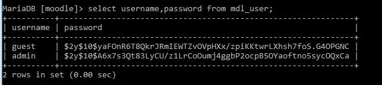
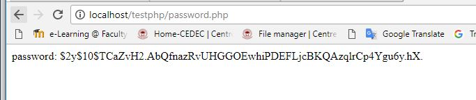
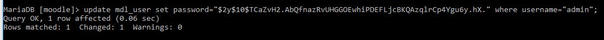
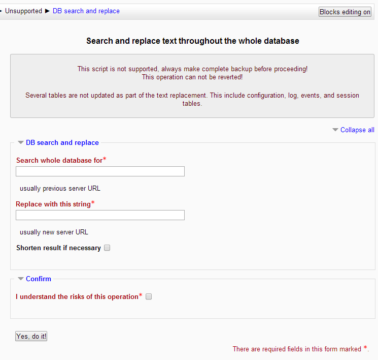
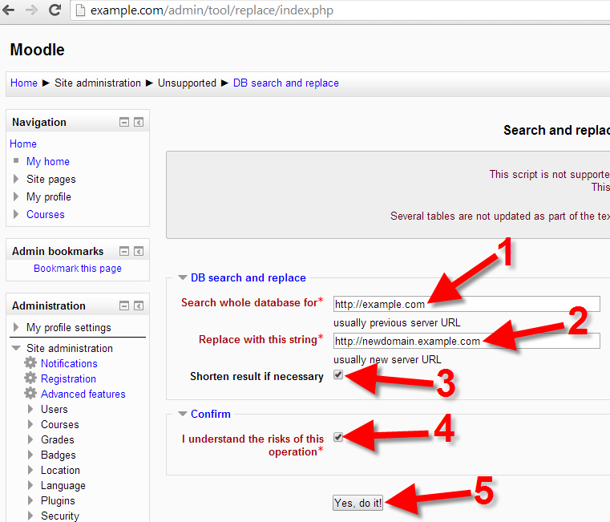
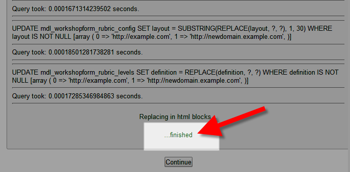
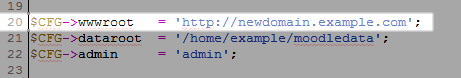

[TOC]


# Moodle

## Install moodle


### Setup web server with mysql

```
# Install Apache server and client/PHP
$ sudo apt install apache2 php7.4 libapache2-mod-php7.4 php7.4-cli

# Install Mariadb server
$ sudo apt install mariadb-server mariadb-client

# Install Mysql server
$ sudo apt install mysql-server mysql-client

# Install Additional Software
$ sudo apt install graphviz aspell ghostscript clamav php7.4-pspell php7.4-curl php7.4-gd php7.4-intl php7.4-mysql php7.4-xml php7.4-xmlrpc php7.4-ldap php7.4-zip php7.4-soap php7.4-mbstring

# Restart apachebase
sudo service apache2 restart

# Install Git
$ sudo apt install git

# Download moodle
cd /opt
git clone git://git.moodle.org/moodle.git

# Change directory into the downloaded Moodle folder
cd moodle

# Retrieve a list of each branch available
git branch -a

# Tell git which branch to track or use
git branch --track MOODLE_311_STABLE origin/MOODLE_311_STABLE

# Finally, Check out the Moodle version specified
git checkout MOODLE_311_STABLE


# Copy local repository to /var/www/html/
$ sudo cp -R /opt/moodle /var/www/html/
$ sudo mkdir /var/moodledata
$ sudo chown -R www-data /var/moodledata
$ sudo chmod -R 777 /var/moodledata
$ sudo chmod -R 0755 /var/www/html/moodle

```


## Hide Apache server info

```
vi /etc/apache2/apache2.conf 
```

add the following

```
ServerTokens Prod
ServerSignature Off 
```


## Setup web server with psql

```sh
$ sudo apt install apache2

$ sudo apt-get install postgresql 

$ sudo apt install php7.4 libapache2-mod-php7.4 openssl php-imagick php7.4-common php7.4-curl php7.4-gd php7.4-imap php7.4-intl php7.4-json php7.4-ldap php7.4-mbstring php7.4-pgsql php-ssh2 php7.4-xml php7.4-zip unzip php7.4-xmlrpc php7.4-soap
```


## Setup Postgresql

```
$ sudo apt install postgresql
```

### Connection To PostgreSQL

Now, establish a connection with the newly installed Postgres database server. First switch to the system’s postgres user account:

```
sudo su - postgres 
```

then type “psql” to get the postgress prompt:

```
psql 

psql (13.2 (Ubuntu 13.2-1.pgdg20.04+1))
Type "help" for help.

postgres=#
```


### Secure PostgreSQL

PostgreSQL installer creates a user “postgres” on your system. Default this user is not protected.

First, create a password for “postgres” user account by running the following command.

```
$ sudo passwd postgres 
```

Next, switch to the “postgres” account Then switch to the Postgres system account and create a secure and strong password for PostgreSQL administrative database user/role as follows.

```
$  su - postgres 
psql -c "ALTER USER postgres WITH PASSWORD 'secure_password_here';" 
exit 
```

Restart the service to apply security changes.

```
sudo systemctl restart postgresql 
```

### Creating Moodle Database

These instructions assume that the database server and web server are on the same machine. If that is not the case you have some more work to do. See the PostgreSQL documentation for further details.

- Log into the PostgreSQL command line client. The exact form depends on how your PostgreSQL is configured but will be something like

```sh
$ psql -U postgres
Password for user postgres:
```

Enter the password for your 'postgres' user set during installation. After some preamble you should see the prompt *postgres=#*.

- Create the user for the Moodle database and assign a password:

```sh
$ postgres=# CREATE USER moodleuser WITH PASSWORD 'yourpassword';
```

Provide a suitably strong password. Please note that the actual authentication method depends on your PostgreSQL server's pg_hba.conf file. Some authentication methods (like ident) do not require the password. See the 'Client Authentication' section below for further details.

- Create the database:

```sh
$ postgres=# CREATE DATABASE moodle WITH OWNER moodleuser;
```

- Grant privileges on database

```bash
$ psql=# grant all privileges on database <dbname> to <username>;
```

- Drop database

```
$ postgres=# DROP DATABASE moodle;
```

  ### Connecting to a Remote PostgreSQL Database

1. Change the listening address in the postgresql.conf file.

   ```
   listen_addresses = '*'
   ```

   If you have multiple interfaces on the server, you can specify a specific interface to be listened.

2. Add a client authentication entry to the pg_hba.conf file.

   By default, PostgreSQL accepts connections only from the localhost. It refuses remote connections. This is controlled by applying an access control rule that allows a user to log in from an IP address after providing a valid password (the md5 keyword). To accept a remote connection, add the following entry to the C:\NetIQ\idm\postgres\data\pg_hba.conf file.

   ```
   host all all 0.0.0.0/0 md5
   ```

   For example, 192.168.104.24/26 trust

   This works only for IPv4 addresses. For IPv6 addresses, add the following entry:

   ```
   host all all ::0/0 md5
   ```

3. Restart postgresql service

4. Connect to postgresql remotely

   ```
   # psql -U postuser -h 35.206.201.238 -d final_nhcp2
   ```

   

### Backup postgres db

```sh
$ pg_dump rtudblms | gzip > rtu-db-11052021.gz
```

### Restore postgres db

```sh
$gunzip -c mydb.sql.gz | psql -h localhost -U postgres -W -d mydb 
```


##  Setup MySQL Server

```
# Connect to mysql server
$ mysql -h cdm-lms-db.cpuur4cknf6y.ap-southeast-1.rds.amazonaws.com -u admin -p

# Create DB
FLUSH PRIVILEGES;
mysql> CREATE DATABASE moodleDB DEFAULT CHARACTER SET utf8mb4 COLLATE utf8mb4_unicode_ci;


# Create user
mysql>create user 'moodleUser'@'localhost' IDENTIFIED BY 'Cn48tk9uGnhsaf5';

OR 

mysql>create user 'moodleUser'@'172.16.31.%' IDENTIFIED BY 'passwordformoodledude';

# Grant user privilege 
mysql>GRANT SELECT,INSERT,UPDATE,DELETE,CREATE,CREATE TEMPORARY TABLES,DROP,INDEX,ALTER ON 
moodle.* TO 'moodledude'@'localhost';

mysql> GRANT ALL PRIVILEGES ON database_name.* TO 'username'@'localhost';

FLUSH PRIVILEGES;

mysql>quit;
```

To make sure the database was created correctly, use the \l at the psql console or execute psql -l shell command. You should get something like

```
 postgres=# \l
                                      List of databases
      Name    |  Owner     | Encoding |  Collation  |    Ctype    |   Access privileges   
   -----------+------------+----------+-------------+-------------+-----------------------
    moodle    | moodleuser | UTF8     | cs_CZ.utf8  | cs_CZ.utf8  | 
    postgres  | postgres   | UTF8     | en_US.UTF-8 | en_US.UTF-8 | 
    template0 | postgres   | UTF8     | en_US.UTF-8 | en_US.UTF-8 | =c/postgres
                                                                  : postgres=CTc/postgres
    template1 | postgres   | UTF8     | en_US.UTF-8 | en_US.UTF-8 | =c/postgres
                                                                  : postgres=CTc/postgres
```


### List users in mysql

```
# List users
mysql> select user,host from mysql.user;
+------------------+-------------+
| user             | host        |
+------------------+-------------+
| admin            | %           |
| moodle_dbuser    | 172.16.31.% |
| mysql.infoschema | localhost   |
| mysql.session    | localhost   |
| mysql.sys        | localhost   |
| rdsadmin         | localhost   |
+------------------+-------------+
6 rows in set (0.00 sec)

mysql> SHOW GRANTS FOR 'moodle_dbuser'@'172.16.31.%';
+---------------------------------------------------------------------------------------------------------------------------------------------+
| Grants for moodle_dbuser@172.16.31.%                                                                                                        |
+---------------------------------------------------------------------------------------------------------------------------------------------+
| GRANT USAGE ON *.* TO `moodle_dbuser`@`172.16.31.%`                                                                                         |
| GRANT SELECT, INSERT, UPDATE, DELETE, CREATE, DROP, INDEX, ALTER, CREATE TEMPORARY TABLES ON `moodle_db`.* TO `moodle_dbuser`@`172.16.31.%` |
+---------------------------------------------------------------------------------------------------------------------------------------------+
2 rows in set (0.01 sec)

```


## Backup and restore moodle contents

```
# Create tar file
$ cd /var/moodledata		
$ tar -cpzvf dar-lms-moodledata.tar.gz *

# Without directory structure
$ sudo tar -cpzvf dar-beesuite-lms-htdocs-01072021.tar.gz -C /var/www/html/beesuite .


# Extract tar file
$ tar -xpzvf dar-lms-moodledata.tar.gz 

# List files in tar file
$ tar tvf dar-lms-moodledata.tar.gz
```


## Backup and restore moodle database


```
Backup database
$ mysqldump -u [user] -p [database_name] > [filename].sql

Restore database
$ mysql -u [user] -p [database_name] < [filename].sql
```


## Moodle Upgrade

1. Before you upgrade your site for real

- You are strongly advised to make a copy of your entire Moodle site onto another computer (see [Moodle migration](https://docs.moodle.org/20/en/Moodle_migration)) and run the upgrade there to verify it will work.

2. Check the version

- Administration > Server > Environment

3. Put your Site into Maintenance Mode

4. Backup important data

- There are three areas that should be backed up before any upgrade:
  - Moodle software (For example, everything in server/htdocs/moodle)
  - Moodle uploaded files (For example, server/moodledata)
  - Moodle database (For example, the SQL or Postgres database)


```
Linux
# mv moodle moodle.backup
# tar xvzf moodle-latest-3.9.tgz
Next, copy across your config.php, any custom plugins, and your .htaccess file if you created one (check that custom plugins are the correct version for your new Moodle first):

# cp moodle.backup/config.php moodle
# cp -pr moodle.backup/theme/mytheme moodle/theme/mytheme
# cp -pr moodle.backup/mod/mymod moodle/mod/mymod
Don't forget to make moodle/config.php (and the rest of the source code) readable by your www server. For maximum security the files should not be writeable by your server. This is especially important on a 'production' server open to the public internet.

# chown -R root:root moodle (Linux debian - or even create a user especially for moodle. Don't use the web server user, e.g. www-data)
# chmod -R 755 moodle
```

```
# Download moodle

$ git clone git://git.moodle.org/moodle.git

# Change directory into the downloaded Moodle folder
$ cd moodle

# Retrieve a list of each branch available
git branch -a

# Tell git which branch to track or use
git branch --track MOODLE_311_STABLE origin/MOODLE_311_STABLE

# Finally, Check out the Moodle version specified
git checkout MOODLE_311_STABLE

```

## Debug mode

```
$CFG->debug = 38911;

$CFG->debugdisplay = 1;
```


### Moodle instance template

```
#!/bin/bash

sudo mkdir -p /var/moodledata1

sudo mount 172.22.122.82:/dar_lms_data  /var/moodledata1

sudo cp -R /var/moodledata/* /var/moodledata1/

sudo chown -R www-data /var/moodledata1

sudo chmod -R 777 /var/moodledata1
```


### CLI Upgrade

```
cd /var/www/html/moodle

# Retrieve a list of each branch available
sudo git branch -a

# Tell git which branch to track or use
sudo git branch --track MOODLE_310_STABLE origin/MOODLE_310_STABLE

# Finally, Check out the Moodle version specified
sudo git checkout MOODLE_39_STABLE

```

```
# sudo -u www-data php admin/cli/maintenance.php --enable
== Maintenance mode (https://104.199.170.168) ==
Your site is currently in CLI maintenance mode, no web access is allowed.
```


## Resize Disk of a VM Instance in Google Cloud


### Step 1: Check Disk Size

Before resizing your disk size you can check your available disk space so you will get an idea about the available space in your disk. It is recommended to increase the size if your used space is more than 80%.

Execute the following command to check the disk space.

```
df -h
```

You will get an output similar to the one below.

```
Output
Filesystem      Size  Used Avail Use% Mounted on
udev            286M     0  286M   0% /dev
tmpfs            60M  2.4M   57M   4% /run
/dev/sda1       9.8G  1.1G  8.2G  12% /
tmpfs           297M     0  297M   0% /dev/shm
tmpfs           5.0M     0  5.0M   0% /run/lock
tmpfs           297M     0  297M   0% /sys/fs/cgroup
```

Here `/dev/sda1` is the one which shows the available and used space of your disk. I tested this on a new fresh disk with 10GB space.


### Step 2: Check Partition

Now you need to check the partitions available on the your disk.

```
lsblk
```

This command shows the available partitions. You will get an output similar to this.

```
Output
NAME   MAJ:MIN RM SIZE RO TYPE MOUNTPOINT
sda      8:0    0  10G  0 disk 
└─sda1   8:1    0  10G  0 part /
```

In this case we having only one partition.

As you can see, `sda` is the `DEVICE_ID` and `1` is the partition number.


### Step 3: Increase Disk Size

Go to your Google Cloud Console and navigate to **Compute >> VM Instances**.

Click the name of the instance where you want to add a disk.


Scroll down to **Boot disk** and click on the disk name.

Now you will be taken to the Disk Management page.

Click **Edit** on the top.

Here you can specify the size of you need.

Click **Save** in the bottom to apply the changes.


### Step 4: Grow Partition

Now you need to resize the partition using the `growpart` command with your device id and partition number.

```
sudo growpart /dev/sda 1
```

You will get something similar.

```
Output
CHANGED: partition=1 start=4096 old: size=20967424 end=20971520 new: size=1048571871,end=1048575967
```

### Step 5: Resize File System

The last step is to resize the filesystem with the `resize2fs` command.

```
sudo resize2fs /dev/sda1
```

The output will be like this.

```
Output
resize2fs 1.43.4 (31-Jan-2017)
Filesystem at /dev/sda1 is mounted on /; on-line resizing required
old_desc_blocks = 2, new_desc_blocks = 63
The filesystem on /dev/sda1 is now 131071483 (4k) blocks long.
```

### Step 6: Verify the Setup

Now you can verify the disk space using the `df` command. Your disk space must have rezised to the additional space you added.

```
df -h
Output
Filesystem      Size  Used Avail Use% Mounted on
udev            286M     0  286M   0% /dev
tmpfs            60M  2.4M   57M   4% /run
/dev/sda1       493G  1.2G  471G   1% /
tmpfs           297M     0  297M   0% /dev/shm
tmpfs           5.0M     0  5.0M   0% /run/lock
tmpfs           297M     0  297M   0% /sys/fs/cgroup
```


### Error connecting to database

```
php admin/cli/mysql_collation.php --collation=utf8mb4_unicode_ci
```


## Increase upload size 

```
# nano /etc/php/7.4/apache2/php.ini
Press Ctrl and W and type "post_max_size"
Change the value to the number of Mb you want your site to accept as uploads
Press Ctrl and W and type "upload_max_filesize"
Change the value to the number of Mb you want your site to accept as uploads
Press Ctrl and W and type "max_execution_time"
Change the value to 600
Press Ctrl and O
Press Ctrl and X
Type sudo apachectl restart
```

Moodle site -> Site adminsitration -> Security -> Site security settings -> Maximum upload file size

## Running Moodle on a dedicated server

Assuming you are running Moodle on a sealed server (i.e. no user logins allowed on the machine) and that root takes care of the modifications to both moodle code and moodle config (config.php), then this are the most tight permissions I can think of:

1. moodledata directory and all of its contents (and subdirectories, includes sessions):

```
owner: apache user (apache, httpd, www-data, whatever; see above)
group: apache group (apache, httpd, www-data, whatever; see above)
permissions: 700 on directories, 600 on files
```

**Change directories and files permission**

First, apply file system permissions to files and folder by running chmod in recursive mode:

```
chmod -R 600 /var/moodledata
```

Next, execute the command for directories only:

```
find /var/moodledata -type d -print0 | xargs -0 chmod 700
```


2. moodle directory and all of its contents and subdirectories (including config.php):

```
owner: root
group: root
permissions: 755 on directories, 644 on files.
```

If you allow local logins for regular users, then 2. should be:

```
owner: root
group: apache group (apache, httpd, www-data, whatever; see above)
permissions: 750 on directories, 640 on files.
```

## Get Public IP automatically

```
$CFG->wwwroot   = 'https://'.$_SERVER['HTTP_HOST'].'';
```

 

## Change user permission in moodle via database


```sql
SELECT *
FROM mdl_user
```

Then add the id to the `value` column here

```sql
SELECT *
FROM mdl_config
WHERE name = 'siteadmins'
```

For example

```sql
UPDATE mdl_config
SET value = value || ',3'
WHERE name = 'siteadmins'
```


## Reset Admin password

1. Login to your moodle database and find the user table mdl_user (moodle ver. 3.3)



2. which admin password is stored using php function 'password_hash' so run the following code with your desired password (I have used 'test' as password).

```php
<?php
$pass=password_hash("test", PASSWORD_BCRYPT);
echo "password: " . $pass;
?>
```


output:



3. copy the password and update the table with copied password.



 that's all now login with the password you used in php encryption.


OR

```sql
UPDATE mdl_user SET password=MD5('NEW_PASSWORD') WHERE username='admin';
```


## Maintenace Mode

1. Go to Site administration > Server > Maintenance mode in the Settings navigation.


```
 $ sudo -u apache /usr/bin/php admin/cli/maintenance.php --enable
 
 OR
 
 # php admin/cli/maintenance.php --enable
```


```
 $ sudo -u apache /usr/bin/php admin/cli/maintenance.php --disable
 
 OR
 
 # php admin/cli/maintenance.php --disable
```


## Setup SSL

1. Create a certificate signing request to send to a certificate authority

```
openssl req -new -newkey rsa:2048 -nodes -keyout server.key -out server.csr
```


```
# openssl req -new -nodes -newkey rsa:<key size in bytes> -config <custom config file> -keyout <FQDN>.key -out <FQDN>.csr -<hashing algorithm>   
Example:
openssl req -new -nodes -newkey rsa:1024 -config /var/tmp/mySSL/myssl.cnf -keyout /var/tmp/mySSL/www.example.com.key -out /var/tmp/mySSL/www.example.com.csr -md5
```


 ```
 CountryName = PH
 StateOrProvinceName = Metro Manila
 localityName = Quezon City
 0.organizationName  = Rizal Technological University
 organizationalUnitName  = IT Department
 commonName   = rtu
 emailAddress = franz@mybusybee.net
 ```

2. Send the CSR to a certificate authority to obtain an SSL certificate

3. Install SSL certificate

   default-ssl.conf

```
SSLCertificateFile      /etc/ssl/certs/6a124f857c92bc2e.crt
SSLCertificateKeyFile   /etc/ssl/certs/server.key
SSLCertificateChainFile /etc/ssl/certs/gd_bundle-g2-g1.crt

```


## Disable directory listing in Apache

**Edit /etc/apache2/apache2.conf** 

```
<Directory /var/www/html>
        Options -Indexes
        AllowOverride None
        Require all granted
</Directory>
```


## Hide Apache Version Number and Other Sensitive Info

To hide web server version number, server operating system details, installed Apache modules and more, open your Apache web server configuration file using your favorite editor:

```
$ sudo vi /etc/apache2/apache2.conf        #Debian/Ubuntu systems
$ sudo vi /etc/httpd/conf/httpd.conf       #RHEL/CentOS systems 
```

And add/modify/append the lines below:

```
ServerTokens Prod
ServerSignature Off 
```

Save the file, exit and restart your Apache web server like so:

```
$ sudo systemctl restart apache2  #SystemD
$ sudo service apache2 restart     #SysVInit
```

## How to change your URL in Moodle

1. [Login to the Moodle Dashboard](https://www.inmotionhosting.com/support/edu/moodle/moodle-login-administrator/).

2. Add /admin/tool/replace/index.php to the end of the URL, and hit Enter on your keyboard. The address will look like this:

   https://example.com/admin/tool/replace/index.php

   (Be sure to replace example.com with your Moodle site. With older versions of Moodle add /admin/replace.php to the end of the URL.)

   You will then be on the *DB search and replace* page. It will look like this:
   [](https://www.inmotionhosting.com/support/wp-content/uploads/2014/06/moodle_change-url_moodle-db-search-replace.png)

    

   You will also see a message stating “*This script is not supported, always make complete backup before proceeding! This operation can not be reverted! Several tables are not updated as part of the text replacement. This include configuration, log, events, and session tables.*“

3. In the Search whole database for field, enter your existing URL. in my test I entered:

   ```
   https://example.com
   ```

4. In the Replace with this string field, enter the new URL. In my test I entered:

   ```
   https://newdomain.example.com
   ```

5. Check the box for Shorten result if necessary . Confirm the change, by checking the box for I understand the risks of this operation , then click the Yes, do it! button.

   

    

6. It is finished when you see a message stating “ …finished ” at the bottom. Click the Continue button to return to the Moodle dashboard.

   

    

7. Using FTP or File Manager, navigate to where Moodle is installed. Open the **config.php** file, and locate the line starting with:
   **$CFG->wwwroot**

8. Update the line to your new address, in my test I changed from this:

   ```
   $CFG->wwwroot = 'https://example.com';
   ```

   To this:

   Copy

   ```
   $CFG->wwwroot = 'https://newdomain.example.com';
   ```

   Here is a screenshot of the updated line:
   [](https://www.inmotionhosting.com/support/wp-content/uploads/2014/06/moodle_change-url_updated-wwwroot-moodle.png)

    

9. **Save** your changes and you are done. Now you can move your site (if necessary) to the new folder location.

## Count the number of courses

```sql
select count(*) from mdl_course;
```


## Apache Performance recommendations

/etc/apache2/mods-enabled/mpm_prefork.conf

- Set the **MaxRequestWorkers** directive correctly (**MaxClients** before Apache 2.4). Use this formula to help (which uses 80% of available memory to leave room for spare):

```
MaxRequestWorkers = Total available memory * 80% / Max memory usage of apache process
```

Memory usage of apache process is usually 10MB but Moodle can easily use up to 100MB per process, so a general rule of thumb is to divide your available memory in megabytes by 100 to get a conservative setting for MaxClients. You are quite likely to find yourself lowering the MaxRequestWorkers from its default of 150 on a Moodle server. To get a more accurate estimate read the value from the shell command:

```
# ps -ylC apache2 --sort:rss

# ps -ylC apache2 --sort:rss | wc -l
```

## Php Performance recommendations

- *memory_limit* needs to be at least 96M (although some functions may not work if this low). Moodle will refuse to install if lower. 128M is recommended. Large systems may need an even higher setting.
- *session.save_handler* needs to be set to FILES.
- *magic_quotes_runtime* needs to be OFF. (DEPRECATED in PHP 5.3.0, and REMOVED as of PHP 7.0.0.)
- *file_uploads* needs to be ON.
- *session.auto_start* needs to be OFF.
- The temp folder must be defined and writeable by your webserver user
- Check the error display/logging section. Make sure the settings are appropriate for your server use.
- *post_max_size* and *upload_max_filesize* restrict the maximum file size that can be uploaded.
- Check the *[mail function]* and database section (for your chosen database) to make sure they match your server configuration.

### Finding the correct php.ini

```
php -i | grep php.ini
```

## Cron

The CLI (command line interpreter) script. This will be at the path

```
/path/to/moodle/admin/cli/cron.php
```

If in doubt, this is the correct script to use. This needs to be run by a 'PHP CLI' program on your computer. So the final command may look something like

```
/usr/bin/php /path/to/moodle/admin/cli/cron.php
```

```
$ crontab -u www-data -e
```

*This will open an editor window. To run the cli cron script every 1 minute, add the line:*

```
* * * * * /usr/bin/php  /path/to/moodle/admin/cli/cron.php >/dev/null
```

## Generate SSH key pair using puttygen

```sh
# Install Puttygen
$ sudo apt install putty-tools

# Generate Key Pair for Authentication in Linux
$ puttygen -t rsa -b 2048 -C "user@host" -o keyfile.ppk

# Out public key
$ puttygen -L reine.ppk 

# Changing the Passphrase of a Key
$ puttygen keyfile.ppk -P

# Convert .ppk to .pem
$ puttygen privatekey.ppk -O private-openssh -o privatekey.pem

# Converting .pem to .ppk
$ puttygen pemKey.pem -o ppkKey.ppk -O private
```

## Generate SSH key pair using ssh-keygen

```
ssh-keygen -t rsa -b 4096 -C "your_email@domain.com"
```


## Finding large backup files 


```sql
SELECT contenthash, contextid, filearea, filepath, filename, filesize FROM mdl_files ORDER BY filesize DESC LIMIT 10;
               contenthash                | contextid |     filearea      | filepath |                                    filename                                    |  filesize  
------------------------------------------+-----------+-------------------+----------+--------------------------------------------------------------------------------+------------
 5ae141a5a1a03b9faf8b76fc7e8f0b4e74891de5 |      4060 | course            | /        | backup-moodle2-course-221-computer_1_basic_computer_concepts-20210912-2031.mbz | 3760227875
 3d1d939b7e9f033904a8afbc1eeaf22aa3a2ee8a |      8198 | course            | /        | backup-moodle2-course-494-comp3-20210908-1848.mbz                              | 3284946028
 736ade65c2d7145cee0c0948aa4afd58b1c83067 |    247604 | course            | /        | backup-moodle2-course-3016-ict-ss-20210922-1210.mbz                            |  725733580
 3bfbb91fe10686cbf542ea5dcaefbe2d947ec5cc |    167694 | course            | /        | backup-moodle2-course-1330-ict-vg8l-20210912-2335.mbz                          |  685473345
 57427e536996c80ef8a459835fcbcec5ec2c48bd |     83453 | course            | /        | backup-moodle2-course-1113-profed11-20210920-1658.mbz                          |  649615370
 152559eb1192f63ac7f88bbb0f1c0927b482c4f1 |     15956 | course            | /        | Dr. Diaz- PROGRAMMING LANGUAGES-Backup File.mbz                                |  386337845
 d620e75b82ee6b0a1dbb19f7f1a43924e28ae792 |      5589 | recyclebin_course | /        | backup.mbz                                                                     |  361862046
 5c7c50714656c4f3c087bc55508ca53c2d98f950 |      8621 | course            | /        | backup-moodle2-course-516-e-tech-20210201-0903.mbz                             |  345812878
 590f8d5b67339d4afd57fe8619c472ac47cce0d2 |    231986 | combined          | /        | combined.pdf                                                                   |  277471599
 ca6b6cdfcdaf5629b98456abb73e43b12bd4b8ec |    114968 | course            | /        | backup-moodle2-course-1216-entrep-shs-20210315-1821.mbz                        |  268911240
(10 rows)
```


```
SELECT contenthash, contextid, filearea, filepath, filename, filesize FROM mdl_files WHERE contenthash = '5ae141a5a1a03b9faf8b76fc7e8f0b4e74891de5';
```


```sh
$ find . -xdev -type f -size +100M -print | xargs ls -lh | sort -k5,5 -h -r | head
-rwxrwxrwx 1 www-data ubuntu 3.6G Nov  9 04:11 ./filedir/5a/e1/5ae141a5a1a03b9faf8b76fc7e8f0b4e74891de5
-rwxrwxrwx 1 www-data ubuntu 3.1G Nov  9 12:55 ./filedir/3d/1d/3d1d939b7e9f033904a8afbc1eeaf22aa3a2ee8a
-rwxrwxrwx 1 www-data ubuntu 696M Nov  9 09:31 ./filedir/6d/f1/6df1c4506a8857685002c1a3586ed36de850d753
-rwxrwxrwx 1 www-data ubuntu 696M Nov  8 14:51 ./trashdir/6d/f1/6df1c4506a8857685002c1a3586ed36de850d753
-rwxrwxrwx 1 www-data ubuntu 693M Nov  9 02:47 ./filedir/73/6a/736ade65c2d7145cee0c0948aa4afd58b1c83067
-rwxrwxrwx 1 www-data ubuntu 654M Nov  8 23:36 ./filedir/3b/fb/3bfbb91fe10686cbf542ea5dcaefbe2d947ec5cc
-rwxrwxrwx 1 www-data ubuntu 620M Nov  9 04:29 ./filedir/57/42/57427e536996c80ef8a459835fcbcec5ec2c48bd
-rwxrwxrwx 1 www-data ubuntu 369M Nov  9 12:38 ./filedir/15/25/152559eb1192f63ac7f88bbb0f1c0927b482c4f1
-rwxrwxrwx 1 www-data ubuntu 346M Nov  9 12:16 ./filedir/d6/20/d620e75b82ee6b0a1dbb19f7f1a43924e28ae792
-rwxrwxrwx 1 www-data ubuntu 330M Nov  9 01:42 ./filedir/5c/7c/5c7c50714656c4f3c087bc55508ca53c2d98f950
```


```
SELECT sum(filesize) as filesize FROM `mdl_files` f INNER JOIN mdl_context cn ON cn.id = f.contextid INNER JOIN mdl_course c ON c.id = cn.instanceid AND cn.contextlevel = 50 where c.id = "4060"
```


## Enable HTTPS in Apache2

Enable Apache module named: Mod_ssl.
Enable Apache module named: Mod_rewrite.

```
# a2enmod ssl
# a2enmod rewrite
# a2ensite /etc/apache2/sites-available/default-ssl.conf
```


## Resume a large SCP file transfer on Linux

```
# rsync -P --rsh=ssh ubuntu@35.206.247.54:/home/ubuntu/ndcp-lms-moodledata-03052022.tar.gz .
```


## How To Secure Apache with Let's Encrypt on Ubuntu 20.04

1. Installing Certbot

   ```
   sudo apt install certbot python3-certbot-apache
   ```

2. The Certbot is successfully and can be verified by typing the command given below:

   ```
   certbot --version
   ```

   

3. Get the Let’s Encrypt SSL certificate

   Certbot provides a variety of ways to obtain SSL certificates through plugins. The Apache plugin will take care of reconfiguring Apache and reloading the configuration whenever necessary. To use this plugin, type the following:

   ```bash
   sudo certbot --apache -d example.com -d www.example.com
   ```

   Copy

   This script will prompt you to answer a series of questions in order to configure your SSL certificate. First, it will ask you for a valid e-mail address. This email will be used for renewal notifications and security notices:

   ```
   OutputSaving debug log to /var/log/letsencrypt/letsencrypt.log
   Plugins selected: Authenticator apache, Installer apache
   Enter email address (used for urgent renewal and security notices) (Enter 'c' to
   cancel): you@your_domain
   ```

   After providing a valid e-mail address, hit `ENTER` to proceed to the next step. You will then be prompted to confirm if you agree to Let’s Encrypt terms of service. You can confirm by pressing `A` and then `ENTER`:

   ```
   - - - - - - - - - - - - - - - - - - - - - - - - - - - - - - - - - - - - - - - -
   Please read the Terms of Service at
   https://letsencrypt.org/documents/LE-SA-v1.2-November-15-2017.pdf. You must
   agree in order to register with the ACME server at
   https://acme-v02.api.letsencrypt.org/directory
   - - - - - - - - - - - - - - - - - - - - - - - - - - - - - - - - - - - - - - - -
   (A)gree/(C)ancel: A
   ```

   Next, you’ll be asked if you would like to share your email with the Electronic Frontier Foundation to receive news and other information. If you do not want to subscribe to their content, type `N`. Otherwise, type `Y`. Then, hit `ENTER` to proceed to the next step.

   ```
   - - - - - - - - - - - - - - - - - - - - - - - - - - - - - - - - - - - - - - - -
   Would you be willing to share your email address with the Electronic Frontier
   Foundation, a founding partner of the Let's Encrypt project and the non-profit
   organization that develops Certbot? We'd like to send you email about our work
   encrypting the web, EFF news, campaigns, and ways to support digital freedom.
   - - - - - - - - - - - - - - - - - - - - - - - - - - - - - - - - - - - - - - - -
   (Y)es/(N)o: N
   ```

   The next step will prompt you to inform Certbot of which domains you’d like to activate HTTPS for. The listed domain names are automatically obtained from your Apache virtual host configuration, that’s why it’s important to make sure you have the correct `ServerName` and `ServerAlias` settings configured in your virtual host. If you’d like to enable HTTPS for all listed domain names (recommended), you can leave the prompt blank and hit `ENTER` to proceed. Otherwise, select the domains you want to enable HTTPS for by listing each appropriate number, separated by commas and/ or spaces, then hit `ENTER`.

   ```
   Which names would you like to activate HTTPS for?
   - - - - - - - - - - - - - - - - - - - - - - - - - - - - - - - - - - - - - - - -
   1: your_domain
   2: www.your_domain
   - - - - - - - - - - - - - - - - - - - - - - - - - - - - - - - - - - - - - - - -
   Select the appropriate numbers separated by commas and/or spaces, or leave input
   blank to select all options shown (Enter 'c' to cancel): 
   ```

   You’ll see output like this:

   ```
   Obtaining a new certificate
   Performing the following challenges:
   http-01 challenge for your_domain
   http-01 challenge for www.your_domain
   Enabled Apache rewrite module
   Waiting for verification...
   Cleaning up challenges
   Created an SSL vhost at /etc/apache2/sites-available/your_domain-le-ssl.conf
   Enabled Apache socache_shmcb module
   Enabled Apache ssl module
   Deploying Certificate to VirtualHost /etc/apache2/sites-available/your_domain-le-ssl.conf
   Enabling available site: /etc/apache2/sites-available/your_domain-le-ssl.conf
   Deploying Certificate to VirtualHost /etc/apache2/sites-available/your_domain-le-ssl.conf
   ```

   Next, you’ll be prompted to select whether or not you want HTTP traffic redirected to HTTPS. In practice, that means when someone visits your website through unencrypted channels (HTTP), they will be automatically redirected to the HTTPS address of your website. Choose `2` to enable the redirection, or `1` if you want to keep both HTTP and HTTPS as separate methods of accessing your website.

   ```
   Please choose whether or not to redirect HTTP traffic to HTTPS, removing HTTP access.
   - - - - - - - - - - - - - - - - - - - - - - - - - - - - - - - - - - - - - - - -
   1: No redirect - Make no further changes to the webserver configuration.
   2: Redirect - Make all requests redirect to secure HTTPS access. Choose this for
   new sites, or if you're confident your site works on HTTPS. You can undo this
   change by editing your web server's configuration.
   - - - - - - - - - - - - - - - - - - - - - - - - - - - - - - - - - - - - - - - -
   Select the appropriate number [1-2] then [enter] (press 'c' to cancel): 2
   ```

   After this step, Certbot’s configuration is finished, and you will be presented with the final remarks about your new certificate, where to locate the generated files, and how to test your configuration using an external tool that analyzes your certificate’s authenticity:

   ```
   - - - - - - - - - - - - - - - - - - - - - - - - - - - - - - - - - - - - - - - -
   Congratulations! You have successfully enabled https://your_domain and
   https://www.your_domain
   
   You should test your configuration at:
   https://www.ssllabs.com/ssltest/analyze.html?d=your_domain
   https://www.ssllabs.com/ssltest/analyze.html?d=www.your_domain
   - - - - - - - - - - - - - - - - - - - - - - - - - - - - - - - - - - - - - - - -
   
   IMPORTANT NOTES:
    - Congratulations! Your certificate and chain have been saved at:
      /etc/letsencrypt/live/your_domain/fullchain.pem
      Your key file has been saved at:
      /etc/letsencrypt/live/your_domain/privkey.pem
      Your cert will expire on 2020-07-27. To obtain a new or tweaked
      version of this certificate in the future, simply run certbot again
      with the "certonly" option. To non-interactively renew *all* of
      your certificates, run "certbot renew"
    - Your account credentials have been saved in your Certbot
      configuration directory at /etc/letsencrypt. You should make a
      secure backup of this folder now. This configuration directory will
      also contain certificates and private keys obtained by Certbot so
      making regular backups of this folder is ideal.
    - If you like Certbot, please consider supporting our work by:
   
      Donating to ISRG / Let's Encrypt:   https://letsencrypt.org/donate
      Donating to EFF:                    https://eff.org/donate-le
   ```

   Your certificate is now installed and loaded into Apache’s configuration. Try reloading your website using `https://` and notice your browser’s security indicator. It should point out that your site is properly secured, typically by including a lock icon in the address bar.

   You can use the [SSL Labs Server Test](https://www.ssllabs.com/ssltest/) to verify your certificate’s grade and obtain detailed information about it, from the perspective of an external service.

   In the next and final step, we’ll test the auto-renewal feature of Certbot, which guarantees that your certificate will be renewed automatically before the expiration date.

4. Verifying Certbot Auto-Renewal

   Let’s Encrypt’s certificates are only valid for ninety days. This is to encourage users to automate their certificate renewal process, as well as to ensure that misused certificates or stolen keys will expire sooner rather than later.

   The `certbot` package we installed takes care of renewals by including a renew script to `/etc/cron.d`, which is managed by a `systemctl` service called `certbot.timer`. This script runs twice a day and will automatically renew any certificate that’s within thirty days of expiration.

   To check the status of this service and make sure it’s active and running, you can use:

   ```bash
   sudo systemctl status certbot.timer
   ```

   You’ll get output similar to this:

   ```
   Output● certbot.timer - Run certbot twice daily
        Loaded: loaded (/lib/systemd/system/certbot.timer; enabled; vendor preset: enabled)
        Active: active (waiting) since Tue 2020-04-28 17:57:48 UTC; 17h ago
       Trigger: Wed 2020-04-29 23:50:31 UTC; 12h left
      Triggers: ● certbot.service
   
   Apr 28 17:57:48 fine-turtle systemd[1]: Started Run certbot twice daily.
   ```

   To test the renewal process, you can do a dry run with `certbot`:

   ```bash
   sudo certbot renew --dry-run
   ```

   If you see no errors, you’re all set. When necessary, Certbot will renew your certificates and reload Apache to pick up the changes. If the automated renewal process ever fails, Let’s Encrypt will send a message to the email you specified, warning you when your certificate is about to expire.

**Conclusion**

   In this tutorial, you’ve installed the Let’s Encrypt client `certbot`, configured and installed an SSL certificate for your domain, and confirmed that Certbot’s automatic renewal service is active within `systemctl`. If you have further questions about using Certbot, [their documentation](https://certbot.eff.org/docs/) is a good place to start.

   

## File System Repository

https://docs.moodle.org/20/en/File_system_repository


## Export Table in MariDB 

```
mysqldump --user=dohlmsDBuser --password --lock-tables dohlms_db mdl_user_info_field > mdl_user_info_field.sql
```

CSV

```
select * from mdl_user_info_field
INTO OUTFILE 'export_data.csv'
FIELDS ENCLOSED BY '"'
TERMINATED BY ','
ESCAPED BY '"'
LINES TERMINATED BY '\n';
```

## How To Create SFTP User for a Web Server Document Root

### Step 1 – Installing SSH (Secure Shell)

SFTP is a very secure file transfer protocol because of the encryption that SSH provides for the data as it is transferred over the network. SSH is mainly installed on Linux distributions by default, but if it is not pre-installed in your system, then you can use the below-given command to install it:

```
sudo apt install ssh 
```

[](https://tecadmin.net/wp-content/uploads/2021/07/install-ssh-server.png)

If already installed, the command will upgrade OpenSSH packages.

### Step 2 – Configuring SSH to use the SFTP Server Code

Now open the configuration file of SSH in a text editor to modify it for SFTP server code. Here we will use the nano editor to edit the configuration file.

```
sudo nano /etc/ssh/sshd_config 
```

Locate the line starting from “Subsystem sftp”.

[](https://tecadmin.net/wp-content/uploads/2021/07/comment-subsystem-in-ssh-config.png)

Comment the line by adding # at the start of the line and write the following line after this line as shown in the screenshot given below:

```
Subsystem sftp internal-sftp
```

[](https://tecadmin.net/wp-content/uploads/2021/07/add-sftp-in-ssh-config.png)

The SSHD will use the SFTP server code instead of running the SFTP server by changing the above line.

Once you have changed the configuration file, save the file and exit from it using the keyboard shortcut keys CTRL+S and CTRL+X.

After changes, we need to restart the SSHD daemon to let the changes work.

```
sudo systemctl restart sshd 
```

### Step 3 – Creating a User(SFTP User)

It is an excellent practice to create a new user that only has SFTP access to the document root. It is not recommended to add a user with Sudo privileges to the webserver document root. Create a new user using the adduser command:

```
sudo adduser sftpuser 
```

The terminal will ask for a couple of things like setting the password, and user information. It will also ask for a few other details, so either leave them empty or provide the proper information.

[](https://tecadmin.net/wp-content/uploads/2021/07/adduser-sftp.png)

A new user with the name of `sftpuser` is successfully created.

### Step 4 – Creating Match User Directive in the SSH configuration file

Now we will restrict this user to the document root and we will also disable the user’s access to SSH so that the user will log in through SFTP.

To restrict the user’s access, open up the configuration file of SSH in any text editor:

```
sudo nano /etc/ssh/sshd_config 
```

Now go to the end of the file and add the following content in the “sshd_config” configuration file:

```
Match User sftpuser
        ForceCommand internal-sftp 
        ChrootDirectory /var/www/
        PasswordAuthentication yes
        X11Forwarding no 
        AllowTcpForwarding no 
```

Make sure to replace the “sftpuser” username with the username you set.

[](https://tecadmin.net/wp-content/uploads/2021/07/match-user-sftp-ssh-config.png)

Once the above content is added to the SSH configuration file, save and exit using CTRL+S and CTRL+X shortcut keys.

To check the syntax and verify if everything went well, you can execute the command:

```
sudo sshd -t 
```

If no error occurred, we could reload the SSH service for the changes to work.

```
sudo systemctl restart sshd 
```

### Step 5 – Adding SFTP User to www-data Group

Now we will add the user to the www-data group by executing the following command:

```
sudo usermod -a -G www-data sftpuser 
```

On a successful run, no output will be displayed.

### Step 6 – Setting Document Root Directory Permission

Please follow the subsequent instructions very carefully as SFTP is very strict regarding chroot directory permissions.

1. We will start by checking the current permissions and ownership of var:

   ```
   sudo ls -ld /var/ 
   ```

2. The permissions should be 755 and the owner should be root by default. If not, then execute the command given below to set the proper permissions:

   ```
   sudo chmod 755 /var/ 
   ```

3. Now use this command to set the correct ownership:

   ```
   sudo chown root:root /var/ 
   ```

4. Similarly, apply the same permissions to the chroot:

5. ```
   sudo chmod 755 /var/www/ 
   ```

6. Since we have set “/var/www/” to the chroot directory. Now set the right ownership of the chroot directory:

   ```
   sudo chown root:root /var/www/ 
   ```

7. To allow a group to write to the document root directory, set its permission to 755:

   ```
   sudo chmod 755 /var/www/html/ 
   ```

8. To grant the ownership of the “/var/www/html” document root and its further directories and files to the www-data group, use the below-given command:

   ```
   sudo chown -R www-data:www-data /var/www/html* 
   ```

9. Now give 755 permissions to the content placed in the “/var/www/html” document root using the command:

   ```
   sudo find /var/www/html/ -type d -exec chmod 775 {} \; 
   ```

10. The above command will grant the SFTP user read, write, and executable permissions of the directories.

    We also need to give 664 permissions to all the files that are present in the document root to allow the owner and the SFTP users’ group to read and write the files:

    ```
    sudo find /var/www/html/ -type f -exec chmod 664 {} \; 
    ```

11. Now for the last step, make certain that all the new files and directories acquire the www-data group that are created the newly created SFTP user:

    ```
    sudo find /var/www/html -type d -exec chmod g+s {} \; 
    ```
