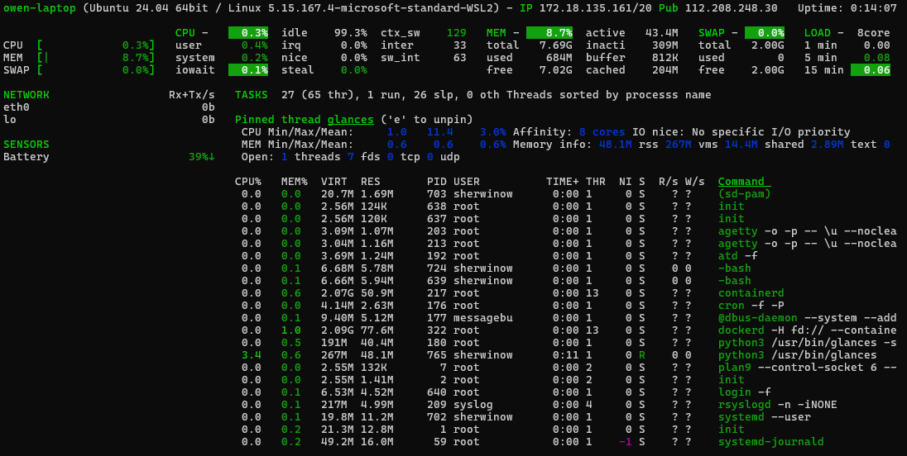

**Glances**

- The  command is a powerful, cross-platform system monitoring tool written in Python. It provides a real-time overview of various system metrics—all in one terminal window

```
glances
```
This opens a dashboard showing:
• 	CPU usage
• 	Memory and swap
• 	Disk I/O
• 	Network traffic
• 	Running processes
• 	System uptime and IP



**NCDU**
- The  command (short for NCurses Disk Usage) is a powerful, interactive tool for analyzing disk space usage in Unix-like systems. It’s like the traditional  command—but with a user-friendly, text-based interface that lets you navigate and manage files directly from the terminal.\

To scan the current directory:
```
ncdu
```

To scan a specific directory:
```
ncdu /path/to/directory
```

To scan the entire root filesystem:
```
sudo ncdu -x /
```


