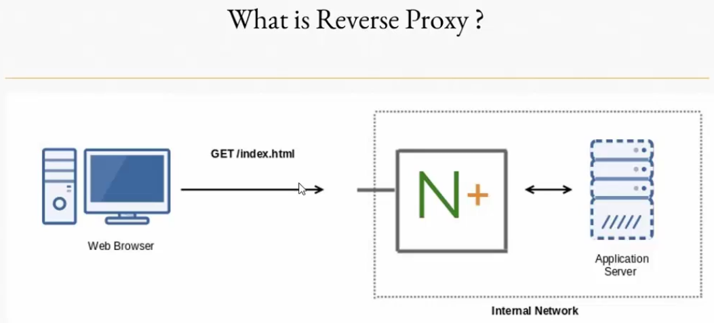
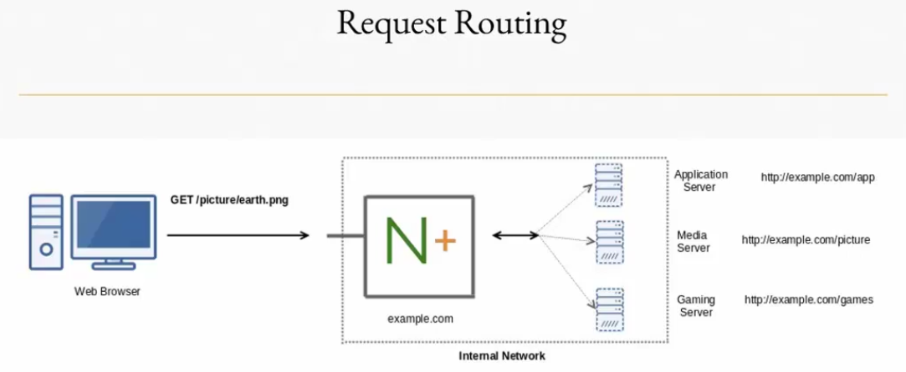

[TOC]


## Nginx

NGINX  can do a lot of things other than web server functionality like:

* Reverse Proxy
* Load Balancing
* Content Caching
* Monitoring and Management

Used by : Discovery, TED, Netflix, Wordpress, GitHub, SoundCloud, Groupon


### HTTP request methods

#### HTTP-GET

* used to fetch information specified in the Request URI (Uniform Resource Identifier)

Syntax: GET Request-URI

**Simple GET Request**

**Client Request**
GET /admin HTTP/1.1
Host: example.com

Sample using telnet
```
telnet example.com 80
Trying 93.184.216.34...
Connected to example.com.
Escape character is '^]'.
GET /sample.html HTTP/1.1
Host: example.com
```
**Server Response**
HTTP/1.1 200 OK

**Conditional GET Request**

**Client Request**
GET /sample.html HTTP/1.1
Host: example.com
If-Modifed-Since: Sat, 29 Oct 2015 19:43:31 GMT

**Server Response**
HTTP/1.1 304 Not Modified

Sample curl
```
curl -I --header 'If-Modifed-Since: Sat, 29 Oct 2015 19:43:31 GMT' example.com/partial.txt
HTTP/1.1 304 Not Modified
```

#### GET Method

A GET request retrieves data from a web server by specifying parameters in the URL portion of the request. This is the main method used for document retrieval. The following example makes use of GET method to fetch hello.htm:

**Client Request**
```
GET /hello.htm HTTP/1.1
User-Agent: Mozilla/4.0 (compatible; MSIE5.01; Windows NT)
Host: www.tutorialspoint.com
Accept-Language: en-us
Accept-Encoding: gzip, deflate
Connection: Keep-Alive
```
The server response against the above GET request will be as follows:
**Server Response**
```
HTTP/1.1 200 OK
Date: Mon, 27 Jul 2009 12:28:53 GMT
Server: Apache/2.2.14 (Win32)
Last-Modified: Wed, 22 Jul 2009 19:15:56 GMT
ETag: "34aa387-d-1568eb00"
Vary: Authorization,Accept
Accept-Ranges: bytes
Content-Length: 88
Content-Type: text/html
Connection: Closed
```
```
<html>
<body>
<h1>Hello, World!</h1>
</body>
</html>
```

**Partial GET Request**

**Client Request**
GET /movie.mp4 HTTP/1.1
Host: example.com
Range: bytes=0-1024

**Server Response**
HTTP/1.1 206 Partial Content

Sample using curl
```
curl --header "Range: bytes=0-10" example.com/txt
```

#### HTTP-POST

* Used to send some data to the server to be processed in some way

Example:
POST /login.php HTTP/1.1
Content-Type: application/x-www-form-urlencoded
Content-Length: 32

user=admin password=test123

#### POST Method

The POST method is used when you want to send some data to the server, for example, file update, form data, etc. The following example makes use of POST method to send a form data to the server, which will be processed by a process.cgi and finally a response will be returned:

```
POST /cgi-bin/process.cgi HTTP/1.1
User-Agent: Mozilla/4.0 (compatible; MSIE5.01; Windows NT)
Host: www.tutorialspoint.com
Content-Type: text/xml; charset=utf-8
Content-Length: 88
Accept-Language: en-us
Accept-Encoding: gzip, deflate
Connection: Keep-Alive
```
```
<?xml version="1.0" encoding="utf-8"?>
<string xmlns="http://clearforest.com/">string</string>
```
The server side script process.cgi processes the passed data and sends the following response:
```
HTTP/1.1 200 OK
Date: Mon, 27 Jul 2009 12:28:53 GMT
Server: Apache/2.2.14 (Win32)
Last-Modified: Wed, 22 Jul 2009 19:15:56 GMT
ETag: "34aa387-d-1568eb00"
Vary: Authorization,Accept
Accept-Ranges: bytes
Content-Length: 88
Content-Type: text/html
Connection: Closed
```
```
<html>
<body>
<h1>Request Processed Successfully</h1>
</body>
</html>
```

#### HTTP-HEAD

* Identical to GET Request except Server should not return message-body in the response

**Client Request**
Header Fields

```
HTTP/1.0 200 OK
Date: Fri, 31 Dec 2015 23:59 GMT
Content-Type: text/html
Content-Length: 1354
Cache-Control: public
```
Message Body
```
<html>
<body>
<h1>Happy New Millenium!</h1>
(more file contents)
</body)
</html>
```

Sample using curl

```
curl -I example.com
```
#### HEAD Method

The HEAD method is functionally similar to GET, except that the server replies with a response line and headers, but no entity-body. The following example makes use of HEAD method to fetch header information about hello.htm:

```
HEAD /hello.htm HTTP/1.1
User-Agent: Mozilla/4.0 (compatible; MSIE5.01; Windows NT)
Host: www.tutorialspoint.com
Accept-Language: en-us
Accept-Encoding: gzip, deflate
Connection: Keep-Alive
```
The server response against the above GET request will be as follows:

```
HTTP/1.1 200 OK
Date: Mon, 27 Jul 2009 12:28:53 GMT
Server: Apache/2.2.14 (Win32)
Last-Modified: Wed, 22 Jul 2009 19:15:56 GMT
ETag: "34aa387-d-1568eb00"
Vary: Authorization,Accept
Accept-Ranges: bytes
Content-Length: 88
Content-Type: text/html
Connection: Closed
```
You can notice that here server the does not send any data after header.


### HTTP-TRACE

* Performs a message loop-back test along the path to the target resource.


Sample using curl
```
curl -X "TRACE" example.com
```

#### TRACE Method

The TRACE method is used to echo the contents of an HTTP Request back to the requester which can be used for debugging purpose at the time of development. The following example shows the usage of TRACE method:

**Client Request**
```
TRACE / HTTP/1.1
Host: www.tutorialspoint.com
User-Agent: Mozilla/4.0 (compatible; MSIE5.01; Windows NT)
```

The server will send the following message in response to the above request:
**Server Response**
```
HTTP/1.1 200 OK
Date: Mon, 27 Jul 2009 12:28:53 GMT
Server: Apache/2.2.14 (Win32)
Connection: close
Content-Type: message/http
Content-Length: 39

TRACE / HTTP/1.1
Host: www.tutorialspoint.com
User-Agent: Mozilla/4.0 (compatible; MSIE5.01; Windows NT)
```

### HTTP - OPTIONS

Sample using curl
```
curl -X OPTIONS http://example.com/login.html -i 
```
### OPTIONS Method

The OPTIONS method is used by the client to find out the HTTP methods and other options supported by a web server. The client can specify a URL for the OPTIONS method, or an asterisk (*) to refer to the entire server. The following example requests a list of methods supported by a web server running on tutorialspoint.com:

```
OPTIONS * HTTP/1.1
User-Agent: Mozilla/4.0 (compatible; MSIE5.01; Windows NT)
```
The server will send an information based on the current configuration of the server, for example:
```
HTTP/1.1 200 OK
Date: Mon, 27 Jul 2009 12:28:53 GMT
Server: Apache/2.2.14 (Win32)
Allow: GET,HEAD,POST,OPTIONS,TRACE
Content-Type: httpd/unix-directory
```

### HTTP Status Codes

**1×× Informational**
100 Continue
101 Switching Protocols
102 Processing

**2×× Success**
200 OK
201 Created
202 Accepted
203 Non-authoritative Information
204 No Content
205 Reset Content
206 Partial Content
207 Multi-Status
208 Already Reported
226 IM Used
    
**3×× Redirection**
300 Multiple Choices
301 Moved Permanently
302 Found
303 See Other
304 Not Modified
305 Use Proxy
307 Temporary Redirect
308 Permanent Redirect
    
**4×× Client Side Error**
400 Bad Request
401 Unauthorized
402 Payment Required
403 Forbidden
404 Not Found
405 Method Not Allowed
406 Not Acceptable
407 Proxy Authentication Required
408 Request Timeout
409 Conflict
410 Gone
411 Length Required
412 Precondition Failed
413 Payload Too Large
414 Request-URI Too Long
415 Unsupported Media Type
416 Requested Range Not Satisfiable
417 Expectation Failed
418 I'm a teapot
421 Misdirected Request
422 Unprocessable Entity
423 Locked
424 Failed Dependency
426 Upgrade Required
428 Precondition Required
429 Too Many Requests
431 Request Header Fields Too Large
444 Connection Closed Without Response
451 Unavailable For Legal Reasons
499 Client Closed Request
    
**5×× Server Side Error**
500 Internal Server Error
501 Not Implemented
502 Bad Gateway
503 Service Unavailable
504 Gateway Timeout
505 HTTP Version Not Supported
506 Variant Also Negotiates
507 Insufficient Storage
508 Loop Detected
510 Not Extended
511 Network Authentication Required
599 Network Connect Timeout Error

### Reverse Proxy




#### What can Reverse Proxy Do?

* It hides existence of the origin backend servers
* Can protect the server from web-based attacks, DOS etc.
* Can provide great Caching functionality 
* Can optimize content by Compressing it
* Can act as SSL terminating Proxy
* Request Routing





#### Understanding proxy_pass directive

* forwards the request to the proxied servers specified along with this directive.

Example:

```
location/ {
  proxy_pass http://192.168.10.50;
}
```


```
location/admin {
  proxy_pass http://192.168.10.50;
}

location/app {
  proxy_pass http://192.168.10.50/application;
}
```


#### Setup Reverse Proxy

1. Create configuration file in /etc/nginx/conf.d/ folder
web.conf
```
server {
	server_name 172.25.0.3;

	location / {
	  proxy_pass http://172.25.0.2;
	}
}
```

2. Verify if the configuration is correct
```
nginx -t
nginx: the configuration file /etc/nginx/nginx.conf syntax is ok
nginx: configuration file /etc/nginx/nginx.conf test is successful
```

####  Setup X_Real_Ip 
1. Modify web.conf
```
server {
	server_name 172.25.0.3;

	location / {
	  proxy_pass http://172.25.0.2;
	  proxy_set_header X-Real-IP $remote_addr;
	}
```

2. Modify the nginx.conf in Nginx-App server
Add the variable "$http_x_real_ip" in the log format
```
user  nginx;
worker_processes  1;

error_log  /var/log/nginx/error.log warn;
pid        /var/run/nginx.pid;


events {
    worker_connections  1024;
}


http {
    include       /etc/nginx/mime.types;
    default_type  application/octet-stream;

    log_format  main  '$remote_addr - $remote_user [$time_local] "$request" '
                      '$status $body_bytes_sent "$http_referer" '
                      '"$http_user_agent" "$http_x_forwarded_for" "$http_x_real_ip"';

    access_log  /var/log/nginx/access.log  main;

    sendfile        on;
    #tcp_nopush     on;

    keepalive_timeout  65;

    #gzip  on;

    include /etc/nginx/conf.d/*.conf;
}
```

####  Proxy Host Header 
Add the line "proxy_set_header Host $host" in the nginx configuration file
```
server {
	server_name _;

	location / {
	  proxy_pass http://172.25.0.2;
          proxy_set_header Host $host;
	}
}
```

### Static Website configuration file

```
server {
    listen 80 default_server;
    server_name wisdompetmed.local www.wisdompetmed.local;
    index index.html index.htm index.php;
    root /var/www/wisdompetmed.local;

    access_log /var/log/nginx/wisdompetmed.local.access.log;
    error_log /var/log/nginx/wisdompetmed.local.error.log;

    location / {
        try_files $uri $uri/ -404;
    }

    location /images {
        autoindex on;
        access_log /var/log/nginx/wisdompetmed.local.images.access.log;
        error_log /var/log/nginx/wisdompetmed.local.images.error.log;
    }

    error_page 404 /404.html;
    location = /404.html {
        internal;
    }

    error_page 500 502 503 504 /50x.html;
    location = /50x.html {
        internal;
    }

    location = /500 {
        fastcgi_pass unix:this/will/fail;
    }
}

```

#### Setup Reverse Proxy with Static Assets

```
server {
	server_name 172.25.0.3;

	location / {
	  proxy_pass http://172.25.0.2;
	  proxy_set_header Host $host;
	}
	
	localtion ~* \.(css|js|jpe?g|JPG|png) {
	  root /var/ww/assetes;
	  try_files $uri $uri/;
	}
}
```


#### Nginx root folder permission

* 644 permission for files
* 755 permission for folders


### Load Balancer

Configuration file

```
upstream backend {
      server nginx-web1; 
      server nginx-web2;
}

   # This server accepts all traffic to port 80 and passes it to the upstream. 
   # Notice that the upstream name and the proxy_pass need to match.

server {
      listen 80; 

      location / {
          proxy_pass http://backend;
      }
}
```


#### Least connected load balancing

* next request is assigned to the server with the least number of active connections,

```
upstream backend {
      least_conn;
      server nginx-web1; 
      server nginx-web2;
}

   # This server accepts all traffic to port 80 and passes it to the upstream. 
   # Notice that the upstream name and the proxy_pass need to match.

server {
      listen 80; 

      location / {
          proxy_pass http://backend;
          health_check;
      }
}
```

#### Weighted load balancing

```
upstream backend {
      server nginx-web1 weight=3; 
      server nginx-web2;
}

   # This server accepts all traffic to port 80 and passes it to the upstream. 
   # Notice that the upstream name and the proxy_pass need to match.

server {
      listen 80; 

      location / {
          proxy_pass http://backend;
          health_check;
      }
}
```

#### Session persistence (ip-hash)

* a hash-function is used to determine what server should be selected for the next request (based on the client’s IP address).

```
upstream backend {
      ip_hash;
      server nginx-web1; 
      server nginx-web2;
}

   # This server accepts all traffic to port 80 and passes it to the upstream. 
   # Notice that the upstream name and the proxy_pass need to match.

server {
      listen 80; 

      location / {
          proxy_pass http://backend;
          health_check;
      }
}
```

### Cache Control Header


**public** means that any caches may store a copy of the response. This includes CDNs, proxy servers, and the like. The public directive is often redundant, as the presence of other directives (such as max-age) are implicit instructions that caches may store a copy.

**private**, on the other hand, is an explicit instruction that only the end recipient of the response (the client, or the browser) may store a copy of the file. While private isn’t a security feature in and of itself, it is intended to prevent public caches (such as a CDN) storing a response that contains information unique to one user.
max-age

**max-age** defines a unit of time in seconds (relative to the time of the request) for which the response is deemed ‘fresh’.

```
Cache-Control: max-age=60
```

* This Cache-Control header tells the browser that it can use this file from the cache for the next 60 seconds without having to worry about revalidating it. Once the 60 seconds is up, the browser will head back to the server to revalidate the file.

* If the server has a new file for the browser to download, it will respond with a 200 response, download the new file, the old file will be ejected from the HTTP cache, the new file will replace it, and will honour its caching headers.

* If the server doesn’t have a fresher copy that needs downloading, the server responds with a 304 response, doesn’t need to download any new file, and will update the cached copy with the new headers. This means that, if the Cache-Control: max-age=60 header is still present, the cached file’s 60 seconds starts again. 120 seconds overall cache time for one file.

* Beware: There is one pretty large caveat with max-age on its own… max-age tells the browser that the asset in question is stale, but it doesn’t tell the browser that it absolutely cannot use the stale version. A browser may use its own heuristics to decide that it might release a stale copy of a file without revalidating it. This behaviour is somewhat non-deterministic, so it’s quite hard to know exactly what a browser will actually do. To this end, we have a series of more explicit directives that we can augment our max-age with. Thanks to Andy Davies for helping me clarify this one.
  s-maxage

The **s-maxage** (note the absence of the - between max and age) will take precedence over the max-age directive but only in the context of shared caches. Using max-age and s-maxage in conjunction allows you to have different fresh durations for private and public caches (e.g. proxies, CDNs) respectively.

#### no-store

```
Cache-Control: no-store
```

* What if we don’t want to cache a file? What if the file contains sensitive information? Perhaps it’s an HTML page that contains your bank details? Or maybe the information is time-critical? Perhaps a page that contains realtime stock prices? We don’t want to store or serve any responses like this from cache at all: we always want to discard sensitive information and fetch the freshest realtime information. Now we’d use no-store.

* no-store is a very strong directive not to persist any information to any cache, private or otherwise. Any asset that carries the no-store directive will always hit the network, no matter what.

#### no-cache

```
Cache-Control: no-cache
```
This is the one that trips most people up… no-cache doesn’t mean ‘no cache’. It means ‘do not serve a copy from cache until you’ve revalidated it with the server and the server said you can use the cached copy’. Right. Sounds like this should be called must-revalidate! Except that’s not what it sounds like, either.

no-cache is actually a pretty smart way of always guaranteeing the freshest content, but also being able to use the much faster cached copy if possible. no-cache will always hit the network as it has to revalidate with the server before it can release the browser’s cached copy (unless the server responds with a fresher response), but if the server responds favourably, the network transfer is only a file’s headers: the body can be grabbed from cache rather than redownloaded.

So, like I say, this is a smart way to combine freshness and the possibility of getting a file from cache, but it will hit the network for at least an HTTP header response.

A good use-case for no-cache would be almost any dynamic HTML page. Think of a news site’s homepage: it’s not realtime, nor does it contain any sensitive information, but ideally we’d like the page to always show the freshest content. We can use cache-control: no-cache to instruct the browser to check back with the server first, and if the server has nothing newer to offer (304), let’s reuse the cached version. In the event that the server did have some fresher content, it would respond as such (200) and send the newer file.

Tip: There is no use sending a max-age directive alongside a no-cache directive as the time-limit for revalidation is zero seconds.

####  must-revalidate

Even more confusingly, while the above sounds like it should be called `must-revalidate`, it turns out `must-revalidate` is something different still (but still similar).

```
Cache-Control: must-revalidate, max-age=600
```

`must-revalidate` needs an associated `max-age` directive; above, we’ve set it to ten minutes.

Where `no-cache` will immediately revalidate with the server, and only use a cached copy if the server says it may, `must-revalidate` is like `no-cache` with a grace period. What happens here is that, for the first ten minutes, the browser will *not* (I know, I know…) revalidate with the server, but the moment that ten minutes passes, it’s back to the server we go. If the server has nothing new for us, it responds with a `304` and the new `Cache-Control` headers are applied to the cached file—our ten minutes starts again. If, after ten minutes, there is a newer file on the server, we get a `200` response and its body, and the local cache gets updated.

A great candidate for `must-revalidate` is a blog like mine: static pages that seldom change. Sure, the latest content is desirable, but given how infrequently my site changes, we don’t need anything as heavy handed as `no-cache`. Instead, let’s assume everything is going to be good enough for ten minutes, then revalidate after that.


```
server {
    server_name example.com;

    location / {
        root   /var/www/websites/example;
        index  index.html index.htm;
    }

    location ~ \.(png) {
        root /var/www/websites/example;
        add_header Cache-Control max-age=120;
        add_header Cache-Control no-store;
        add_header Cache-Control s-maxage=200;
        add_header Cache-Control no-cache;
        add_header Pragma no-cache;
    }

    location ~ \.(txt) {
        root /var/www/websites/example;
        expires -1;
    }
)

```

### WhiteList Based Approach

```
location /admin {
   root /var/www/websites/example;
   index index.html;
   allow 172.18.10.5;
   allow 127.0.0.1;
   deny all;
}
```
or
```
location /admin {
   root /var/www/websites/example;
   index index.html;
   # put the list of IP in the whitelist file
   include /etc/nginx/conf.d/whitelist; 
   deny all;
```

### Limit connection module

```
limit_conn_zone $binary_remote_addr zone=addr:10m;

server {
   listen 80;
   
   location / {
      root /var/www/websites/example;
      index index.html;
   }
   
   location /download {
      root /var/www/websites/example;
      # Limit the download rate after 50MB
      limit_rate_after 50m;
      # Limit the download rate to 50k
      limit_rate 50k;
      # Limit the download to 1 IP
      limit_conn addr 1;
   }
}
```

### Basic Authentication

1. Create user and password using htpasswd
```
cd /etc/nginx
htpasswd -c /etc/nginx/.htpasswd admin
```

2. Create nginx configuration
```
server {
    server_name example.com;

    location / {
        root /var/www/websites/example;
        index index.html index.htm;
    }

    location /admin {
       root /var/www/websites/example;
       index index.html;
       auth_basic "Basic Authentication";
       auth_basic_user_file "/etc/nginx/.htpasswd";
    }
}
```

### Digest Authentication

1. Create user and password using htdigest
```
htdigest -c digest_pwd knowledge-portal sherwinowen
```

2. Create apache configuration
```
<Location /admin>
  AuthType Digest
  AuthName "knowledge portal"
  AuthDigestionDomain /admin
  AuthDigestProvider file
  AuthUserFile /etc/apache2/digest_pwd
  Require valid-user
</Location>  
```

#### Configure HTTPS
1. Create an SSL certificate using openssl
```
openssl req -x509 -nodes -days 365 -newkey rsa:2048 -keyout /etc/ssl/private/nginx.key -out /etc/ssl/certs/nginx.crt
Can't load /root/.rnd into RNG
140287530521024:error:2406F079:random number generator:RAND_load_file:Cannot open file:../crypto/rand/randfile.c:88:Filename=/root/.rnd
Generating a RSA private key
..........................+++++
.............................................................+++++
writing new private key to '/etc/ssl/private/nginx.key'
-----
You are about to be asked to enter information that will be incorporated
into your certificate request.
What you are about to enter is what is called a Distinguished Name or a DN.
There are quite a few fields but you can leave some blank
For some fields there will be a default value,
If you enter '.', the field will be left blank.
-----
Country Name (2 letter code) [AU]:PH
State or Province Name (full name) [Some-State]:Nueva Ecija
Locality Name (eg, city) []:Cabanatuan City
Organization Name (eg, company) [Internet Widgits Pty Ltd]:Owen
Organizational Unit Name (eg, section) []:IT
Common Name (e.g. server FQDN or YOUR name) []:example.com
Email Address []:

```
or 
**Note: -batch (without encoding Country Name, State or Province, etc.)**
```
penssl req -x509 -nodes -days 365 -newkey rsa:2048 -keyout /etc/ssl/private/nginx1.key -out /etc/ssl/certs/nginx1.crt -batch
Can't load /root/.rnd into RNG
140183972327872:error:2406F079:random number generator:RAND_load_file:Cannot open file:../crypto/rand/randfile.c:88:Filename=/root/.rnd
Generating a RSA private key
.....................+++++
...........................+++++
writing new private key to '/etc/ssl/private/nginx1.key'

```
2. Configure nginx configuration

```
server {
   listen 80;
   return 301 https://$server_addr$request_uri;
}

server {
    server_name example.com;
    listen 443 ssl;
    ssl_certificate /etc/ssl/certs/nginx.crt;
    ssl_certificate_key /etc/ssl/private/nginx.key;

    location / {
       root /var/www/websites/example;
       index index.html index.htm;
    }

}
```

