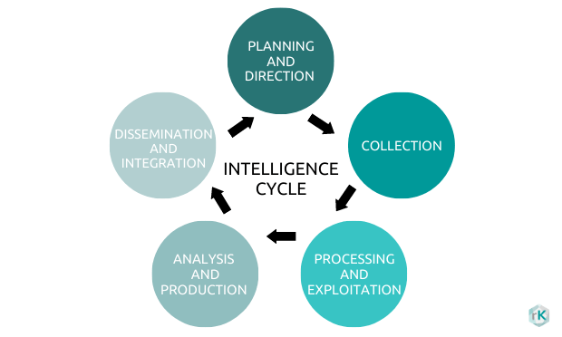
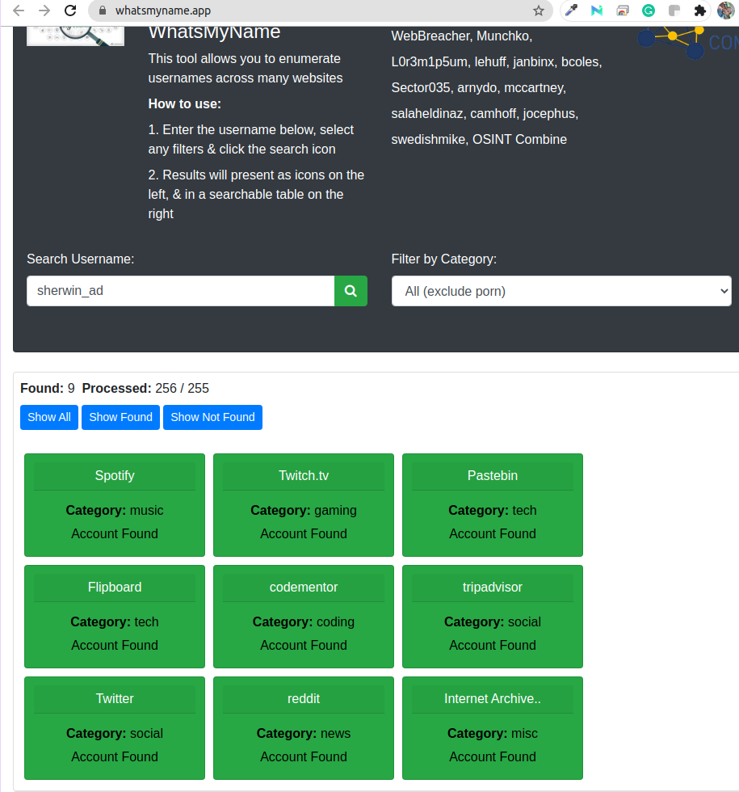
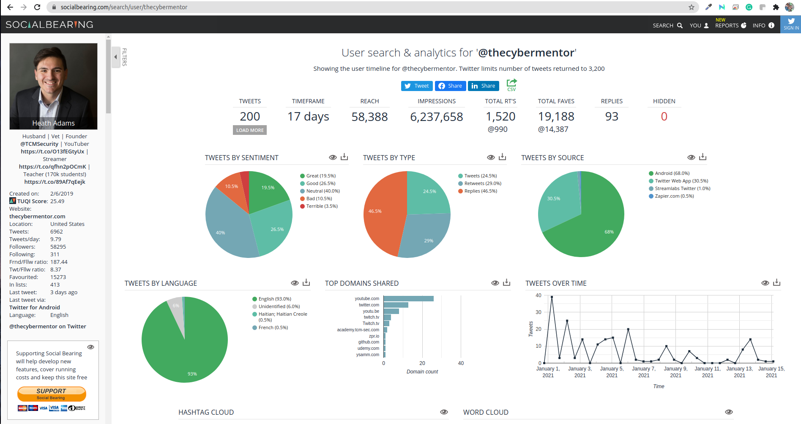
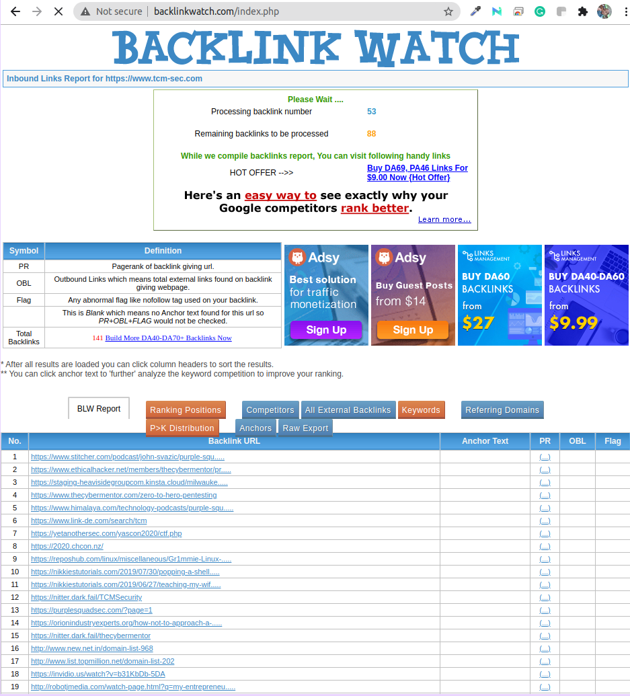

[TOC]


# Open Sorce Inteligence (OSINT)

**Open-source intelligence (OSINT)** is a multi-methods (qualitative, quantitative) methodology for collecting, analyzing and making decisions about data accessible in publicly available sources to be used in an intelligence context. In the intelligence community, the term "open" refers to overt, publicly available sources (as opposed to covert or clandestine sources). It is not related to open-source software or collective intelligence.


## OSINT Flowcharts

### Username


### Realname


### Telephone


### Location


### Domain


### Email


## Intelligence Lifecycle




1. **Planning and Direction**

- This is management of the entire effort, from identifying the need for data to delivering an intelligence product to a consumer. It is the beginning and the end of the cycle--the beginning because it involves drawing up specific collection requirements and the end because finished intelligence, which supports policy decisions, generates new requirements.


2. **Collection**
- is the gathering of the raw information needed to produce finished intelligence. There are many sources of information including open sources such as foreign broadcasts, newspapers, periodicals, and books. Open source reporting is integral to CIA's analytical capabilities. There are also secret sources of information. CIA's operations officers collect such information from agents abroad and from defectors who provide information obtainable in no other way.Finally, technical collection--electronics and satellite photography--plays an indispensable role in modern intelligence, such as monitoring arms control agreements and providing direct support to military forces.

3. **Processing and Exploitation**
- involves converting the vast amount of information collected to a form usable by analysts through decryption, language translations, and data reduction.

4. **Analysis and Production**
- is the conversion of basic information into finished intelligence. It includes integrating, evaluating, and analyzing all available data--which is often fragmentary and even contradictory--and preparing intelligence products. Analysts, who are subject-matter specialists, consider the information's reliability, validity, and relevance. They integrate data into a coherent whole, put the evaluated information in context, and produce finished intelligence that includes assessments of events and judgments about the implications of the information for the United States.The CIA devotes the bulk of its resources to providing strategic intelligence to policymakers. It performs this important function by monitoring events, warning decisionmakers about threats to the United States, and forecasting developments. The subjects involved may concern different regions, problems, or personalities in various contexts--political, geographic, economic, military, scientific, or biographic. Current events, capabilities, and future trends are examined.The CIA produces numerous written reports, which may be brief--one page or less--or lengthy studies. They may involve current intelligence, which is of immediate importance, or long-range assessments. The Agency presents some finished intelligence in oral briefings. The CIA also participates in the drafting and production of National Intelligence Estimates, which reflect the collective judgments of the Intelligence Community.

5. **Dissemination and Integration**

- The last step, which logically feeds into the first, is the distribution of the finished intelligence to the consumers, the same policymakers whose needs initiated the intelligence requirements. Finished intelligence is hand-carried daily to the President and key national security advisers. The policymakers, the recipients of finished intelligence, then make decisions based on the information, and these decisions may lead to the levying of more requirements, thus triggering the Intelligence Cycle.

## Introduction to Sock Puppets

**Sock Puppets**

- online identity that is not who you are 
- it's a misrepresentaion of somebody you're not
- fake account , alternate identity
- is to not draw attention back yourself
- never let the person know that we're looking into them


**Assets Links**

Creating-an-Effective-Sock-Puppet-for-OSINT-Investigations-Introduction
https://jakecreps.com/2018/11/02/sock-puppets/

The-Art-Of-The-Sock
https://www.secjuice.com/the-art-of-the-sock-osint-humint/

Reddit-My-process-for-setting-up-anonymous-sockpuppet-accounts
https://www.reddit.com/r/OSINT/comments/dp70jr/my_process_for_setting_up_anonymous_sockpuppet/

Fake-Name-Generator
https://www.fakenamegenerator.com/

This-Person-Does-not-Exist
https://www.thispersondoesnotexist.com/

Privacy.com
https://privacy.com/

Mysudo
https://mysudo.com/

**20 Minute Mail (use for creating social media accounts)**
http://www.20minutemail.com/


### VPN

ProtonVPN
https://protonvpn.com/

Private Internet Access
https://www.privateinternetaccess.com/


**Checking VPN**

DNS leak test
https://www.dnsleaktest.com/


#### Proton VPN

Login to Proton VPN using protonvpn-cli

```
$ protonvpn-cli login sherwinowen
Enter your ProtonVPN password: 
Attempting to login...

Login successful!
```

Connect and select server location

```
$ protonvpn-cli connect (or protonvpn-cli c)
```

Select a server location and click OK.Select a server at that server location and click OK. 4. Select [udp or tcp](https://protonvpn.com/support/udp-tcp/) (we recommend udp unless you have a reason to choose tcp).

To check your connection status

```
$ protonvpn-cli status (or protonvpn-cli s)
```

To disconnect

```
$ protonvpn-cli disconnect (or protonvpn-cli d)

```
**How to use the kill switch**

The ProtonVPN official Linux app includes a kill switch. The basic kill switch will block all your internet connections when the VPN app is running and the connection to one of our servers fails. To enable it, enter:

```
protonvpn-cli ks --on
```

The app also features an always-on kill switch. This prevents all internet connections unless the VPN app is running and connected to one of our servers. To enable it, enter:

```
protonvpn-cli ks --always-on
```

You can disable the kill switch by entering:

```
protonvpn-cli ks --off
```

To connect to the fastest ProtonVPN server for your location, for example, enter:

```
protonvpn-cli c -f
```

Or to connect to the fastest Tor server (Plus and Visionary users only), enter:

```
protonvpn-cli c -tor
```

Additional connection options, including specifying a custom DNS server, can be found by entering:

```
protonvpn-cli config --help
```


### Creating Sock Puppets

**My process for setting up anonymous sockpuppet accounts.**

[How-To](https://www.reddit.com/r/OSINT/search?q=flair_name%3A"How-To"&restrict_sr=1)

This is my process for setting up an anonymous sockpuppet account.

1. Come up with a persona for the sockpuppet account.

2. Use [Fake Name Generator](https://www.fakenamegenerator.com/) to create a person whom you feel fits your sockpuppet persona.

3. Use [This Person Does Not Exist](https://www.thispersondoesnotexist.com/) to generate an image. Make sure you inspect the image closely and get one that doesn't have any obvious flaws, as they often do. It is worth picking up some Photoshop, GIMP, Affinity Photo or Designer, or other basic image manipulation skills to fix them and change the background of the image.

4. Get a burner phone, completely wiped and fresh. Can be any brand that will accept a Mint Mobile SIM card.

5. Get a burner credit card from [Privacy.com](https://privacy.com/) to use for on Amazon and possible the Mint Mobile setup. They might need it to set up the account.

6. Set up a burner Amazon account. We're only going to use it once.

7. Buy two Mint Mobile SIM cards. You can find them various places online and in stores near you, but you can get two of them for $5 on Amazon. They also give you 1 week free trial with something like 100 text messages, which we're going to use. This gives you two cards for two sockpuppet accounts for only $5.

8. I like to use Amazon to have the card sent to an Amazon pickup box, which can be anonymous.

9. Get a VPN that you can set to the physical area in which you want your sockpuppet to "exist."

10. Set up the Mint Mobile trial account somewhere away from your home; as far as you're willing to go.

11. Use this Mint Mobile trial phone number to set up all of the websites you need.

12. I recommend at least set up a Google account and Protonmail account. Both will come in handy at different times.

13. Once you've set up all the accounts with your trial Mint SIM, set up 2FA on all of the accounts.

14. After setting up 2FA on all of the accounts, change the phone number to one you have more permanent access to, such as MySudo or Google Voice.

15. Make sure everything works!

16. Destroy the SIM card.

17. Wipe the phone.

    

## Search Engine OSINT

**Assets Links**

**Google**
https://www.google.com/

**Google-Advanced-Search**
https://www.google.com/advanced_search

**Google-Search-Guide**
http://www.googleguide.com/print/adv_op_ref.pdf

**Bing**
https://www.bing.com/

**Bing-Search-Guide**
https://www.bruceclay.com/blog/bing-google-advanced-search-operators/

**Yandex**
https://yandex.com/

**DuckDuckGo**
https://duckduckgo.com/

**DuckDuckGo-Search-Guide**
https://help.duckduckgo.com/duckduckgo-help-pages/results/syntax/

**Baidu**
https://baidu.com


### The Google Search Shortcuts Cheat Sheet


| Operator                         | Description                                                  | Example                              |
| :------------------------------- | :----------------------------------------------------------- | :----------------------------------- |
| **Informational Search Queries** |                                                              |                                      |
| define                           | Returns a definition of the given term.                      | define gregarious                    |
| time                             | Returns the current time at a particular location.           | time stockholm                       |
| to                               | Convert measurements from one unit to another.               | 1 cup to tbsp                        |
| in                               | Convert measurements from one unit to another.               | 1000USD in GBP                       |
| translate                        | Translates the queried terms into another specified language. | translate hello world german         |
| map                              | Returns map result.                                          | map new york                         |
| stocks                           | Returns stock information.                                   | stocks sbux                          |
| weather                          | Returns the weather forecast for the given location or ZIP code. | weather 90210                        |
| **Basic Search Symbols**         |                                                              |                                      |
| -                                | Excludes search results that include this term.              | best tablets -drawing                |
| \|                               | Returns search results that match terms on either side of the pipe. The same as writing "OR" between search terms. | computer \| tablet                   |
| @                                | Returns search results that match a particular social media site. | phone recall @twitter                |
| #                                | Returns search results that include a specific hashtag.      | #throwbackthursday                   |
| “”                               | Returns search results that include all terms within quotes in the exact given order. | “never gonna give you up”            |
| *                                | Returns search results where any words can be matched in place of the asterisk. | best * in america                    |
| ..                               | When placed between two numbers, returns search results that match within the number range. | chromebook $200..$500                |
| ()                               | Used to group search terms and control the search logic of the query. | (best \| worst) office suite         |
| $                                | Returns prices.                                              | mac $1000                            |
| **Popular Search Operators**     |                                                              |                                      |
| cache:                           | Show Google's cached version of a specific page.             | cache:makeuseof.com                  |
| filetype:                        | Returns only search results that match a particular file extension. | sleep study filetype:pdf             |
| related:                         | Returns other websites that are similar to the queried website. | related:nytimes.com                  |
| site:                            | Returns only search results from a particular website.       | productivity tips site:makeuseof.com |
| **Other Search Operators**       |                                                              |                                      |
| inanchor:                        | Returns pages that are linked to using anchor text matching the search query. |                                      |
| allinanchor:                     | Same as inanchor, but matching every term that appears after allinanchor. |                                      |
| intext:                          | Returns only search results that match in the page's body.   |                                      |
| allintext:                       | Same as intext, but matching every term that appears after allintext. |                                      |
| intitle:                         | Returns only search results that match in the page's title.  |                                      |
| allintitle:                      | Same as intitle, but matching every term that appears after allintitle. |                                      |
| inurl:                           | Returns only search results that match in the page's URL.    |                                      |
| allinurl:                        | Same as inurl, but matching every term that appears after allinurl. |                                      |


## Image OSINT

**Asset links**

GeoGuessr
https://www.geoguessr.com

GeoGuessr-The-Top-Tips-Tricks-and-Techniques
https://somerandomstuff1.wordpress.com/2019/02/08/geoguessr-the-top-tips-tricks-and-techniques/


### Reverse Image Searching

**Use this site to search images**

Google-Image-Search
https://images.google.com

Yandex
https://yandex.com/

TinEye
https://tineye.com/


### Viewing EXIF data

**EXIF - Exchangeable Image File**

- EXIF data can provide a lot of information
- When you snap a picture there can be data left behind that can be tied up to you

Jeffreys-Image-Metadata-Viewer
http://exif.regex.info/exif.cgi

###### 

## Email OSINT

**Asset links**

Hunter.io
https://hunter.io/

Phonebook.cz
https://phonebook.cz/

VoilaNorbert
https://www.voilanorbert.com/

Email-Hippo
https://tools.verifyemailaddress.io/

Email-Checker
https://email-checker.net/validate

Clearbit-Connect
https://chrome.google.com/webstore/detail/clearbit-connect-supercha/pmnhcgfcafcnkbengdcanjablaabjplo?hl=en


### Discovering Email Addresses

#### Hunter.io
https://hunter.io/


#### Phonebook.cz
https://phonebook.cz/


#### Clearbit-Connect
https://chrome.google.com/webstore/detail/clearbit-connect-supercha/pmnhcgfcafcnkbengdcanjablaabjplo?hl=en


### Verify Email Address

#### Email-Hippo
https://tools.verifyemailaddress.io/


#### Email-Checker
https://email-checker.net/validate


## Password OSINT

#### Hunting Breached Credentials

**Assets links**

Dehashed
https://dehashed.com/

WeLeakInfo
https://weleakinfo.to/v2/

LeakCheck
https://leakcheck.io/

SnusBase
https://snusbase.com/

Scylla.sh
https://scylla.sh/

Have-I-Been-Pwned
https://haveibeenpwned.com/

### 

## Username OSINT

#### Sherlock

https://github.com/sherlock-project/sherlock

```
# python3 sherlock.py winchags

Installing Module
ModuleNotFoundError: No module named 'torrequest'
# pip3 install torrequest
```


#### NameChk
https://namechk.com/

#### WhatsMyName
https://whatsmyname.app/



**NameCheckup**
https://namecheckup.com/


## People OSINT


### Searching People

WhitePages
https://www.whitepages.com/

TruePeopleSearch
https://www.truepeoplesearch.com/

FastPeopleSearch
https://www.fastpeoplesearch.com/

FastBackgroundCheck
https://www.fastbackgroundcheck.com/

WebMii
https://webmii.com/

PeekYou
https://peekyou.com/

411
https://www.411.com/

Spokeo
https://www.spokeo.com/

ThatsThem
https://thatsthem.com/

### Voter Records

Voter-Records
https://voterrecords.com

### Hunting Phone Numbers

TrueCaller
https://www.truecaller.com/

Caller-ID-Test
https://calleridtest.com/

Infobel
https://www.infobel.com/


### Discovering Birthdates

**Google Search**

 ```
"sherwin owen adriano" intext:birthday site:facebook.com
 ```


### Searching Resumes

 ```
"sherwin owen adriano" resume site:scribd.com
 ```

Linkedin
https://www.linkedin.com/


## Social Media OSINT

### Twitter OSINT

**Twitter Search Operators**

| Operator                            | Finds tweets...                                              |
| :---------------------------------- | :----------------------------------------------------------- |
| twitter search                      | containing both"twitter" and "search". This is the default operator |
| "happy hour"                        | containing the exact phrase "happy hour"                     |
| love OR hate                        | containing either "love" or "hate" or both                   |
| beer -root                          | containing "beer" but not "root"                             |
| #haiku                              | containing the hashtag "haiku"                               |
| from:alexiskold                     | send from person/company "alexiskold"                        |
| to:techcrunch                       | sent to person/company "techcrunch"                          |
| @zapier                             | mentioning person/company "zapier"                           |
| "happy hour" near:"san francisco"   | containing the exact phrase "happy hour" and sent near "san francisco" |
| near:NYC within:15mi                | sent within 15 miles of "NYC"                                |
| superhero since:2010-12-27          | contaning "superhero" and sent since date "2010-12-27" (year-month-day) |
| election until:2016-11-08           | containing "election" and sent up to date 2016-11-08         |
| movie -scary :)                     | containing "movie" but not "scary", and with a postitive attitude |
| flight :(                           | containing "flight" and with a negative attitude             |
| traffic ?                           | containing "traffic" and asking a question                   |
| hilarious filter:links              | containing "hilarious" and linking to URLs                   |
| news source:twitterfeed             | containing "news" and entered via TwitterFeed                |
| geocode:15.5165714,120.9430912,10km | Searching Twitter by location                                |


**Twitter-Advanced-Search**
https://twitter.com/search-advanced


**Social-Bearing**
https://socialbearing.com/




**Twitonomy**
https://www.twitonomy.com/


**Sleeping-Time**
http://sleepingtime.org/

**Mention-Mapp**
https://mentionmapp.com/


**Tweetbeaver**
https://tweetbeaver.com/


**SpoonBill**
http://spoonbill.io/

**Tinfoleak**
https://tinfoleak.com/

**TweetDeck**
https://tweetdeck.com/


### Facebook OSINT


**Sowdust**
https://sowdust.github.io/fb-search/


**Intelx-Facebook-Search**
https://intelx.io/tools?tab=facebook


### Instagram OSINT

**Wopita**
https://wopita.com/


#### Get Instagram ID (Twitter) 

**Code-of-a-Ninja**
https://codeofaninja.com/tools/find-instagram-user-id/


#### Download images from Instagram posts

**InstaDP**
https://www.instadp.com/

**ImgInn**
https://imginn.com/

**Snap-Map**
https://map.snapchat.com/


## Website OSINT

**BuiltWith**
https://builtwith.com/


**Domain-Dossier**
https://centralops.net/co/

****


**DNSlytics-Reverse-IP**
https://dnslytics.com/reverse-ip


**SpyOnWeb**
https://spyonweb.com/


**VirusTotal**
https://www.virustotal.com/


**Visual-Ping**
https://visualping.io/


**Back-Link-Watch**
http://backlinkwatch.com/index.php



**viewdns.info**
https://viewdns.info/


### Finding sub domain

**Google Search**

```
site:tesla.com -www -shop inurl:admin
```

 

**Pentest-Tools-Subdomain-Finder**
https://pentest-tools.com/information-gathering/find-subdomains-of-domain#


**Spyse**
https://spyse.com/


**crt.sh**
https://crt.sh/


**Shodan**
https://shodan.io


**Wayback-Machine**
https://web.archive.org/


## Wireless OSINT

WiGLE
https://wigle.neT


## Building OSINT Lab

VMWare-Workstation-Player
https://www.vmware.com/ca/products/workstation-player/workstation-player-evaluation.html

VirtualBox
https://www.virtualbox.org/wiki/Downloads

TraceLabs-OSINT-VM
https://www.tracelabs.org/initiatives/osint-vm

TraceLabs-OSINT-VM-Installation-Guide
https://download.tracelabs.org/Trace-Labs-OSINT-VM-Installation-Guide-v2.pdf

TraceLabs-OSINT-VM-Installation-Guide
https://download.tracelabs.org/Trace-Labs-OSINT-VM-Installation-Guide-v2.pdf


## Working with OSINT tools

### Image OSINT

#### Exiftool

**Install exiftool**

```
kali@kali $ sudo apt install libimage-exiftool-perl
```

**Run exiftool**

```
kali@kali $ exiftool 010\ dog.JPG 
ExifTool Version Number         : 12.13
File Name                       : 010 dog.JPG
Directory                       : .
File Size                       : 3.8 MiB
File Modification Date/Time     : 2021:01:18 04:46:21-05:00
File Access Date/Time           : 2021:01:18 04:46:21-05:00
File Inode Change Date/Time     : 2021:01:18 04:46:21-05:00
File Permissions                : rw-r--r--
File Type                       : JPEG
File Type Extension             : jpg
MIME Type                       : image/jpeg
Exif Byte Order                 : Big-endian (Motorola, MM)
Make                            : Apple
Camera Model Name               : iPhone 4S
Orientation                     : Rotate 90 CW
X Resolution                    : 72
Y Resolution                    : 72
Resolution Unit                 : inches
Software                        : 5.0.1
Modify Date                     : 2012:03:11 12:01:53
Y Cb Cr Positioning             : Centered
Exposure Time                   : 1/1842
F Number                        : 2.4
Exposure Program                : Program AE
ISO                             : 64
Exif Version                    : 0221
Date/Time Original              : 2012:03:11 12:01:53
Create Date                     : 2012:03:11 12:01:53
Components Configuration        : Y, Cb, Cr, -
Shutter Speed Value             : 1/1842
Aperture Value                  : 2.4
Brightness Value                : 10.39054726
Metering Mode                   : Multi-segment
Flash                           : Off, Did not fire
Focal Length                    : 4.3 mm
Subject Area                    : 1631 1223 881 881
Flashpix Version                : 0100
Color Space                     : sRGB
Exif Image Width                : 3264
Exif Image Height               : 2448
Sensing Method                  : One-chip color area
Exposure Mode                   : Auto
White Balance                   : Auto
Focal Length In 35mm Format     : 35 mm
Scene Capture Type              : Standard
Sharpness                       : Normal
GPS Latitude Ref                : North
GPS Longitude Ref               : West
GPS Altitude Ref                : Above Sea Level
GPS Time Stamp                  : 17:30:26
GPS Img Direction Ref           : True North
GPS Img Direction               : 191.2603175
Compression                     : JPEG (old-style)
Thumbnail Offset                : 914
Thumbnail Length                : 9959
Image Width                     : 3264
Image Height                    : 2448
Encoding Process                : Baseline DCT, Huffman coding
Bits Per Sample                 : 8
Color Components                : 3
Y Cb Cr Sub Sampling            : YCbCr4:2:0 (2 2)
Aperture                        : 2.4
Image Size                      : 3264x2448
Megapixels                      : 8.0
Scale Factor To 35 mm Equivalent: 8.2
Shutter Speed                   : 1/1842
Thumbnail Image                 : (Binary data 9959 bytes, use -b option to extract)
GPS Altitude                    : 182 m Above Sea Level
GPS Latitude                    : 41 deg 40' 43.20" N
GPS Longitude                   : 83 deg 39' 21.00" W
Circle Of Confusion             : 0.004 mm
Field Of View                   : 54.4 deg
Focal Length                    : 4.3 mm (35 mm equivalent: 35.0 mm)
GPS Position                    : 41 deg 40' 43.20" N, 83 deg 39' 21.00" W
Hyperfocal Distance             : 2.08 m
Light Value                     : 14.0
```


### Hunting Emails and Breached Data

#### theHarvester

```
# theHarvester -d tesla.com -b google
```


#### breach-parse
https://github.com/hmaverickadams/breach-parse


### Username and Account OSINT

#### whatsmyname

```
# whatsmyname -u thecybermentor
[sudo] password for osint: 
263 sites found in file.
[-] User not found at https://www.7cups.com/@thecybermentor
Error when looking up https://learn.acloud.guru/profile/thecybermentor ('account_missing_code')
[-] User not found at https://asciinema.org/~thecybermentor
[-] User not found at https://audiojungle.net/user/thecybermentor
[-] User not found at https://www.biggerpockets.com/users/thecybermentor
[-] User not found at https://www.bookcrossing.com/mybookshelf/thecybermentor
[-] User not found at https://www.buymeacoffee.com/thecybermentor
[-] User not found at https://www.championat.com/user/thecybermentor/
Error when looking up https://community.cloudflare.com/u/thecybermentor (Critical error.)
[-] User not found at https://www.cnet.com/profiles/thecybermentor/
[-] User not found at https://www.coroflot.com/thecybermentor
[-] User not found at https://www.codewars.com/users/thecybermentor
[-] User not found at https://coderwall.com/thecybermentor/
[-] User not found at https://thecybermentor.crevado.com/
[-] User not found at https://dating.ru/thecybermentor/
[-] User not found at https://www.designspiration.com/thecybermentor/
[-] User not found at https://dev.to/thecybermentor
[-] User not found at https://ello.co/thecybermentor
[-] User not found at https://www.eyeem.com/u/thecybermentor
[-] User not found at https://fancy.com/thecybermentor

```

#### sherlock

```
 # sherlock thecybermentor

[*] Checking username thecybermentor on:
[-] ResearchGate: Illegal Username Format For This Site!
[-] 2Dimensions: Not Found!
[+] 500px: https://500px.com/thecybermentor
[-] 7Cups: Not Found!
[-] 9GAG: Not Found!
[-] About.me: Not Found!
[-] Academia.edu: Not Found!
[-] Alík.cz: Not Found!
[-] Anobii: Not Found!
[-] Aptoide: Not Found!
[-] Archive.org: Not Found!
[-] AskFM: Not Found!
[-] Error Connecting: Avízo.cz
[-] Avízo.cz: Error!
[-] BLIP.fm: Not Found!
[+] Badoo: https://badoo.com/profile/thecybermentor
[-] Bandcamp: Not Found!
[-] Basecamp: Not Found!
[-] Bazar.cz: Not Found!
[-] Behance: Not Found!
[-] BitBucket: Not Found!
[-] BitCoinForum: Not Found!
[-] Blogger: Not Found!
[-] Bookcrossing: Not Found!
[-] Brew: Not Found!
[-] BuyMeACoffee: Not Found!
[-] BuzzFeed: Not Found!
[-] CNET: Not Found!
[-] Canva: Not Found!
[+] CapFriendly: https://www.capfriendly.com/users/thecybermentor
[-] Carbonmade: Not Found!
[+] CashMe: https://cash.me/thecybermentor
[-] Cent: Not Found!
[-] Chatujme.cz: Not Found!
[-] Cloob: Not Found!
[-] Codecademy: Not Found!
[+] Codechef: https://www.codechef.com/users/thecybermentor
[-] Codementor: Not Found!
[-] Coderwall: Not Found!

```

 ```
# whatsmyname -u thecybermentor > username.txt

# cat username.txt | grep "User found"
 ```

### Phone number OSINT

#### phoneinfoga

```
# phoneinfoga scan -n +639178509362                                                
[i] Scanning phone number +639178509362
[i] Running local scan...                                                             
[+] Local format: 0917 850 9362                                                       
[+] E164 format: +639178509362                                                        
[+] International format: 639178509362                                                
[+] Country found: +63 (PH)                                                           
[+] Carrier: 
[i] Running Numverify.com scan...                                                     
[+] Valid: true                                                                       
[+] Number: 639178509362
[+] Local format: 09178509362                                                         
[+] International format: +639178509362                                               
[+] Country code: PH (+63)                                                            
[+] Country: Philippines (Republic of the)
[+] Location:                                                                         
[+] Carrier:                                                                          
[+] Line type: mobile                                                                 
[i] Generating Google search dork requests...                                         
[i] Social media footprints                                                           
[+] Link: https://www.google.com/search?q=site%3Afacebook.com+intext%3A%22639178509362%22+OR+intext%3A%22%2B639178509362%22+OR+intext%3A%2209178509362%22                   
[+] Link: https://www.google.com/search?q=site%3Atwitter.com+intext%3A%22639178509362%22+OR+intext%3A%22%2B639178509362%22+OR+intext%3A%2209178509362%22                    
[+] Link: https://www.google.com/search?q=site%3Alinkedin.com+intext%3A%22639178509362%22+OR+intext%3A%22%2B639178509362%22+OR+intext%3A%2209178509362%22                   
[+] Link: https://www.google.com/search?q=site%3Ainstagram.com+intext%3A%22639178509362%22+OR+intext%3A%22%2B639178509362%22+OR+intext%3A%2209178509362%22                  
[i] Individual footprints
[+] Link: https://www.google.com/search?q=site%3Anuminfo.net+intext%3A%22639178509362%22+OR+intext%3A%22%2B639178509362%22+OR+intext%3A%2209178509362%22                    
[+] Link: https://www.google.com/search?q=site%3Async.me+intext%3A%22639178509362%22+OR+intext%3A%22%2B639178509362%22+OR+intext%3A%2209178509362%22                        
[+] Link: https://www.google.com/search?q=site%3Awhocallsyou.de+intext%3A%2209178509362%22                                                                                  
```

Start web server in port 8080

```
# phoneinfoga serve -p 8080
```


### Social Media OSINT

#### Twint
https://github.com/twintproject/twint

```
Scrape all the Tweets of a user (doesn't include retweets but includes replies).
# twint -u username 

Scrape all Tweets from the user's timeline containing pineapple.
# twint -u username -s pineapple 

Collect every Tweet containing pineapple from everyone's Tweets.
# twint -s pineapple 
```


### Website OSINT

#### Wappalyzer

https://www.wappalyzer.com/download/


 

#### whois

```
# whois tcm-sec.com
   Domain Name: TCM-SEC.COM
   Registry Domain ID: 2388533062_DOMAIN_COM-VRSN
   Registrar WHOIS Server: whois.enom.com
   Registrar URL: http://www.enom.com
   Updated Date: 2020-09-27T04:30:58Z
   Creation Date: 2019-05-07T19:12:02Z
   Registry Expiry Date: 2022-05-07T19:12:02Z
   Registrar: eNom, LLC
   Registrar IANA ID: 48
   Registrar Abuse Contact Email:
   Registrar Abuse Contact Phone:
   Domain Status: clientTransferProhibited https://icann.org/epp#clientTransferProhibited
   Name Server: NS1.A2HOSTING.COM
   Name Server: NS2.A2HOSTING.COM
   Name Server: NS3.A2HOSTING.COM
   Name Server: NS4.A2HOSTING.COM
   DNSSEC: unsigned
   URL of the ICANN Whois Inaccuracy Complaint Form: https://www.icann.org/wicf/
>>> Last update of whois database: 2021-01-19T03:40:31Z <<< 
```


#### Install other tools

```
Run to edit bashrc file
# nano ~/.bashrc

Add the following at the of the bashrc file:
export GOPATH=$HOME/go 
export GOROOT=/usr/lib/go
export PATH=$PATH:$GOROOT/bin:$GOPATH/bin

Run to enable what we change in bashrc
# source ~/.bashrc

```


##### Subfinder
https://github.com/projectdiscovery/subfinder

**Install subfinder**

```
GO111MODULE=on go get -v github.com/projectdiscovery/subfinder/v2/cmd/subfinder
```

**Run subhfinder**

```
# subfinder -d tcm-sec.com

        _     __ _         _
____  _| |__ / _(_)_ _  __| |___ _ _
(_-< || | '_ \  _| | ' \/ _  / -_) '_|
/__/\_,_|_.__/_| |_|_||_\__,_\___|_| v2.4.5

		projectdiscovery.io

[WRN] Use with caution. You are responsible for your actions
[WRN] Developers assume no liability and are not responsible for any misuse or damage.
[WRN] By using subfinder, you also agree to the terms of the APIs used.

[INF] Configuration file saved to /root/.config/subfinder/config.yaml
[INF] Enumerating subdomains for tcm-sec.com
cpcontacts.tcm-sec.com
www.tcm-sec.com
cpanel.tcm-sec.com
mail.tcm-sec.com
academy.tcm-sec.com
cpcalendars.tcm-sec.com
webdisk.tcm-sec.com
webmail.tcm-sec.com
autodiscover.tcm-sec.com
www.academy.tcm-sec.com

```


##### Assetfinder
https://github.com/tomnomnom/assetfinder 

**Install assetfinder**

```
go get -u github.com/tomnomnom/assetfinder
```

**Run assetfinder**

```
# assetfinder tcm-sec.com | grep tcm-sec.com | sort -u
academy.tcm-sec.com
autodiscover.tcm-sec.com
cpanel.tcm-sec.com
cpcalendars.tcm-sec.com
cpcontacts.tcm-sec.com
mail.tcm-sec.com
tcm-sec.com
webdisk.tcm-sec.com
webmail.tcm-sec.com
www.academy.tcm-sec.com
www.tcm-sec.com
```


##### httprobe
https://github.com/tomnomnom/httprobe

**Install httprobe**

```
# go get -u github.com/tomnomnom/httprobe
```

Run httpprobe

```
# cat tcm-sec.txt | httprobe -s -p https:443
https://webmail.tcm-sec.com:443
https://cpcalendars.tcm-sec.com:443
https://webdisk.tcm-sec.com:443
https://cpcontacts.tcm-sec.com:443
https://tcm-sec.com:443
https://cpanel.tcm-sec.com:443
https://academy.tcm-sec.com:443
https://www.tcm-sec.com:443
http://webdisk.tcm-sec.com:443
http://cpanel.tcm-sec.com:443
http://webmail.tcm-sec.com:443
http://cpcontacts.tcm-sec.com:443
http://tcm-sec.com:443
http://academy.tcm-sec.com:443
http://cpcalendars.tcm-sec.com:443
http://www.tcm-sec.com:443

```


##### Amass
https://github.com/OWASP/Amass

**Install amass**

```
# export GO111MODULE=on
# go get -v github.com/OWASP/Amass/v3/...
```

**Run amass**

```
# amass enum -d tcm-sec.com
cpanel.tcm-sec.com
webdisk.tcm-sec.com
cpcalendars.tcm-sec.com
webmail.tcm-sec.com
cpcontacts.tcm-sec.com
mail.tcm-sec.com
academy.tcm-sec.com
www.tcm-sec.com
tcm-sec.com

OWASP Amass v3.11.1                               https://github.com/OWASP/Amass
--------------------------------------------------------------------------------
9 names discovered - cert: 8, archive: 1
--------------------------------------------------------------------------------
ASN: 55293 - A2HOSTING - A2 Hosting, Inc.
	70.32.16.0/20     	7    Subdomain Name(s)
ASN: 15169 - GOOGLE - Google LLC
	74.125.195.0/24   	1    Subdomain Name(s)
ASN: 13335 - CLOUDFLARENET - Cloudflare, Inc.
	2606:4700::/47    	2    Subdomain Name(s)
	104.16.0.0/14     	2    Subdomain Name(s)

The enumeration has finished

```


##### GoWitness
https://github.com/sensepost/gowitness/wiki/Installation

**Install gowitness**

```
# go get -u github.com/sensepost/gowitness
```

**Run gowitness**

Get the screenshot of the subdomain website

```
# gowitness file -f ./alive.txt -P ./pics --no-http
19 Jan 2021 16:08:09 INF preflight result statuscode=200 title="TCM Security Academy | TCM Security, Inc." url=https://academy.tcm-sec.com
19 Jan 2021 16:08:09 INF preflight result statuscode=200 title="TCM Security Academy | TCM Security, Inc." url=https://academy.tcm-sec.com
19 Jan 2021 16:08:10 INF preflight result statuscode=200 title="TCM Security – Penetration Testing & Consulting" url=https://www.tcm-sec.com
19 Jan 2021 16:08:11 INF preflight result statuscode=200 title="TCM Security – Penetration Testing & Consulting" url=https://www.tcm-sec.com
19 Jan 2021 16:08:40 WRN preflight result statuscode=401 title= url=https://cpcalendars.tcm-sec.com
19 Jan 2021 16:08:43 INF preflight result statuscode=200 title="TCM Security – Penetration Testing & Consulting" url=https://tcm-sec.com
19 Jan 2021 16:08:43 INF preflight result statuscode=200 title="Webmail Login" url=https://webmail.tcm-sec.com
19 Jan 2021 16:08:44 WRN preflight result statuscode=401 title= url=https://cpcontacts.tcm-sec.com
19 Jan 2021 16:08:44 INF preflight result statuscode=200 title="cPanel Login" url=https://cpanel.tcm-sec.com
19 Jan 2021 16:08:47 WRN preflight result statuscode=401 title= url=https://webdisk.tcm-sec.com
19 Jan 2021 16:08:52 INF processing complete
```

****


 

## Exploring OSINT Frameworks

### Recon-ng

**Start recon-ng**

```
# recon-ng 
[*] Version check disabled.

    _/_/_/    _/_/_/_/    _/_/_/    _/_/_/    _/      _/            _/      _/    _/_/_/
   _/    _/  _/        _/        _/      _/  _/_/    _/            _/_/    _/  _/       
  _/_/_/    _/_/_/    _/        _/      _/  _/  _/  _/  _/_/_/_/  _/  _/  _/  _/  _/_/_/
 _/    _/  _/        _/        _/      _/  _/    _/_/            _/    _/_/  _/      _/ 
_/    _/  _/_/_/_/    _/_/_/    _/_/_/    _/      _/            _/      _/    _/_/_/    


                                          /\
                                         / \\ /\
    Sponsored by...               /\  /\/  \\V  \/\
                                 / \\/ // \\\\\ \\ \/\
                                // // BLACK HILLS \/ \\
                               www.blackhillsinfosec.com

                  ____   ____   ____   ____ _____ _  ____   ____  ____
                 |____] | ___/ |____| |       |   | |____  |____ |
                 |      |   \_ |    | |____   |   |  ____| |____ |____
                                   www.practisec.com

                      [recon-ng v5.1.1, Tim Tomes (@lanmaster53)]                       

[*] No modules enabled/installed.

[recon-ng][default] >

```

**Search marketplace**

```
[recon-ng][default] > marketplace search

  +---------------------------------------------------------------------------------------------------+
  |                        Path                        | Version |     Status    |  Updated   | D | K |
  +---------------------------------------------------------------------------------------------------+
  | discovery/info_disclosure/cache_snoop              | 1.1     | not installed | 2020-10-13 |   |   |
  | discovery/info_disclosure/interesting_files        | 1.1     | not installed | 2020-01-13 |   |   |
  | exploitation/injection/command_injector            | 1.0     | not installed | 2019-06-24 |   |   |
  | exploitation/injection/xpath_bruter                | 1.2     | not installed | 2019-10-08 |   |   |
  | import/csv_file                                    | 1.1     | not installed | 2019-08-09 |   |   |
  | import/list                                        | 1.1     | not installed | 2019-06-24 |   |   |
  | import/masscan                                     | 1.0     | not installed | 2020-04-07 |   |   |
  | import/nmap                                        | 1.1     | not installed | 2020-10-06 |   |   |
  | recon/companies-contacts/bing_linkedin_cache       | 1.0     | not installed | 2019-06-24 |   | * |
  | recon/companies-contacts/censys_email_address      | 1.0     | not installed | 2019-08-22 |   | * |
  | recon/companies-contacts/pen                       | 1.1     | not installed | 2019-10-15 |   |   |
  | recon/companies-domains/censys_subdomains          | 1.0     | not installed | 2019-08-22 |   | * |
  | recon/companies-domains/pen                        | 1.1     | not installed | 2019-10-15 |   |   |
  | recon/companies-domains/viewdns_reverse_whois      | 1.0     | not installed | 2019-08-08 |   |   |
  | recon/companies-domains/whoxy_dns                  | 1.1     | not installed | 2020-06-17 |   | * |
  | recon/companies-hosts/censys_org                   | 1.0     | not installed | 2019-08-22 |   | * |
  | recon/companies-hosts/censys_tls_subjects          | 1.0     | not installed | 2019-08-22 |   | * |
  | recon/companies-multi/github_miner                 | 1.1     | not installed | 2020-05-15 |   | * |
  | recon/companies-multi/shodan_org                   | 1.1     | not installed | 2020-07-01 | * | * |
  | recon/companies-multi/whois_miner                  | 1.1     | not installed | 2019-10-15 |   |   |
  | recon/contacts-contacts/abc                        | 1.0     | not installed | 2019-10-11 | * |   |
  | recon/contacts-contacts/mailtester                 | 1.0     | not installed | 2019-06-24 |   |   |
  | recon/contacts-contacts/mangle                     | 1.0     | not installed | 2019-06-24 |   |   |
  | recon/contacts-contacts/unmangle                   | 1.1     | not installed | 2019-10-27 |   |   |
  | recon/contacts-credentials/hibp_breach             | 1.2     | not installed | 2019-09-10 |   | * |
  | recon/contacts-credentials/hibp_paste              | 1.1     | not installed | 2019-09-10 |   | * |
  | recon/contacts-credentials/scylla                  | 1.3     | not installed | 2020-09-14 |   |   |
  | recon/contacts-domains/migrate_contacts            | 1.1     | not installed | 2020-05-17 |   |   |
  | recon/contacts-profiles/fullcontact                | 1.1     | not installed | 2019-07-24 |   | * |
  | recon/credentials-credentials/adobe                | 1.0     | not installed | 2019-06-24 |   |   |
  | recon/credentials-credentials/bozocrack            | 1.0     | not installed | 2019-06-24 |   |   |
  | recon/credentials-credentials/hashes_org           | 1.0     | not installed | 2019-06-24 |   | * |
  | recon/domains-companies/censys_companies           | 1.0     | not installed | 2019-08-22 |   | * |

```

  

**Install module hackertarget**

```
[recon-ng][default] > marketplace install hackertarget
[*] Module installed: recon/domains-hosts/hackertarget
[*] Reloading modules...
```


**Load module**

```
[recon-ng][default] > modules load hackertarget
[recon-ng][default][hackertarget] >
```

  

**Help**

```
[recon-ng][default][hackertarget] > info

      Name: HackerTarget Lookup
    Author: Michael Henriksen (@michenriksen)
   Version: 1.1

Description:
  Uses the HackerTarget.com API to find host names. Updates the 'hosts' table with the results.

Options:
  Name    Current Value  Required  Description
  ------  -------------  --------  -----------
  SOURCE  default        yes       source of input (see 'info' for details)

Source Options:
  default        SELECT DISTINCT domain FROM domains WHERE domain IS NOT NULL
  <string>       string representing a single input
  <path>         path to a file containing a list of inputs
  query <sql>    database query returning one column of inputs
```


**Set options** and run

```
> options set SOURCE tcm-sec.com
SOURCE => tcm-sec.com
[recon-ng][default][hackertarget] > run

-----------
TCM-SEC.COM
-----------
[*] Country: None
[*] Host: webdisk.tcm-sec.com
[*] Ip_Address: 70.32.23.61
[*] Latitude: None
[*] Longitude: None
[*] Notes: None
[*] Region: None
[*] --------------------------------------------------
[*] Country: None
[*] Host: cpanel.tcm-sec.com
[*] Ip_Address: 70.32.23.61
[*] Latitude: None
[*] Longitude: None
[*] Notes: None
[*] Region: None
[*] --------------------------------------------------
[*] Country: None
[*] Host: webmail.tcm-sec.com
[*] Ip_Address: 70.32.23.61
[*] Latitude: None
[*] Longitude: None
[*] Notes: None
[*] Region: None
[*] --------------------------------------------------
[*] Country: None
[*] Host: cpcalendars.tcm-sec.com
[*] Ip_Address: 70.32.23.61
[*] Latitude: None
[*] Longitude: None
[*] Notes: None
[*] Region: None
[*] --------------------------------------------------
[*] Country: None
[*] Host: cpcontacts.tcm-sec.com
[*] Ip_Address: 70.32.23.61
[*] Latitude: None
[*] Longitude: None
[*] Notes: None
[*] Region: None
[*] --------------------------------------------------

-------
SUMMARY
-------
[*] 5 total (5 new) hosts found.
```

**Show hosts**

```
[recon-ng][default][hackertarget] > show hosts

  +-------------------------------------------------------------------------------------------------------------------+
  | rowid |           host          |   ip_address   | region | country | latitude | longitude | notes |    module    |
  +-------------------------------------------------------------------------------------------------------------------+
  | 1     | webdisk.tcm-sec.com     | 70.32.23.61    |        |         |          |           |       | hackertarget |
  | 2     | cpanel.tcm-sec.com      | 70.32.23.61    |        |         |          |           |       | hackertarget |
  | 3     | webmail.tcm-sec.com     | 70.32.23.61    |        |         |          |           |       | hackertarget |
  | 4     | cpcalendars.tcm-sec.com | 70.32.23.61    |        |         |          |           |       | hackertarget |
  | 5     | cpcontacts.tcm-sec.com  | 70.32.23.61    |        |         |          |           |       | hackertarget |
  | 6     | tesla.com               | 199.66.11.62   |        |         |          |           |       | hackertarget |
  | 7     | o7.ptr6980.tesla.com    | 149.72.144.42  |        |         |          |           |       | hackertarget |
  | 8     | vpn1.tesla.com          | 8.45.124.215   |        |         |          |           |       | hackertarget |
  | 9     | model3.tesla.com        | 205.234.27.221 |        |         |          |           |       | hackertarget |
  | 10    | o3.ptr1444.tesla.com    | 149.72.152.236 |        |         |          |           |       | hackertarget |
  | 11    | o2.ptr556.tesla.com     | 149.72.134.64  |        |         |          |           |       | hackertarget |
  | 12    | o5.ptr8466.tesla.com    | 149.72.172.170 |        |         |          |           |       | hackertarget |
  | 13    | o6.ptr9437.tesla.com    | 168.245.123.10 |        |         |          |           |       | hackertarget |
  | 14    | o4.ptr1867.tesla.com    | 149.72.163.58  |        |         |          |           |       | hackertarget |
  | 15    | mobile.tesla.com        | 209.133.79.82  |        |         |          |           |       | hackertarget |
  | 16    | marketing.tesla.com     | 13.111.47.196  |        |         |          |           |       | hackertarget |
  | 17    | referral.tesla.com      | 72.10.32.90    |        |         |          |           |       | hackertarget |
  | 18    | mta2.email.tesla.com    | 13.111.4.231   |        |         |          |           |       | hackertarget |
  | 19    | mta.email.tesla.com     | 13.111.14.190  |        |         |          |           |       | hackertarget |
  | 20    | xmail.tesla.com         | 204.74.99.100  |        |         |          |           |       | hackertarget |
  | 21    | comparison.tesla.com    | 64.125.183.133 |        |         |          |           |       | hackertarget |
  | 22    | na-sso.tesla.com        | 199.66.9.46    |        |         |          |           |       | hackertarget |
  | 23    | emails.tesla.com        | 13.111.18.27   |        |         |          |           |       | hackertarget |
  | 24    | mta3.emails.tesla.com   | 13.111.88.2    |        |         |          |           |       | hackertarget |
  | 25    | mta4.emails.tesla.com   | 13.111.88.52   |        |         |          |           |       | hackertarget |
  | 26    | mta5.emails.tesla.com   | 13.111.88.53   |        |         |          |           |       | hackertarget |
  | 27    | mta.emails.tesla.com    | 13.111.62.118  |        |         |          |           |       | hackertarget |
  | 28    | click.emails.tesla.com  | 13.111.48.179  |        |         |          |           |       | hackertarget |
  | 29    | view.emails.tesla.com   | 13.111.49.179  |        |         |          |           |       | hackertarget |
  | 30    | events.tesla.com        | 13.111.47.195  |        |         |          |           |       | hackertarget |
  | 31    | shop.eu.tesla.com       | 205.234.27.221 |        |         |          |           |       | hackertarget |
  +-------------------------------------------------------------------------------------------------------------------+

[*] 31 rows returned

```

**Install module profiler**

```
[recon-ng][default] > marketplace install profiler
[*] Module installed: recon/profiles-profiles/profiler
[*] Reloading modules...

[recon-ng][default] > modules load profiler
recon/domains-hosts/hackertarget  recon/profiles-profiles/profiler  

[recon-ng][default][profiler] > info

      Name: OSINT HUMINT Profile Collector
    Author: Micah Hoffman (@WebBreacher)
   Version: 1.0

Description:
  Takes each username from the profiles table and searches a variety of web sites for those users. The
  list of valid sites comes from the parent project at https://github.com/WebBreacher/WhatsMyName

Options:
  Name    Current Value  Required  Description
  ------  -------------  --------  -----------
  SOURCE  default        yes       source of input (see 'info' for details)

Source Options:
  default        SELECT DISTINCT username FROM profiles WHERE username IS NOT NULL
  <string>       string representing a single input
  <path>         path to a file containing a list of inputs
  query <sql>    database query returning one column of inputs

Comments:
  * Note: The global timeout option may need to be increased to support slower sites.
  * Warning: Using this module behind a filtering proxy may cause false negatives as some of these
  sites may be blocked.

[recon-ng][default][profiler] > options set SOURCE thecybermentor
SOURCE => thecybermentor

[recon-ng][default][profiler] > run
[*] Retrieving https://raw.githubusercontent.com/WebBreacher/WhatsMyName/master/web_accounts_list.json...

  Looking Up Data For: Thecybermentor
  -----------------------------------
[*] Checking: 7cup
[*] Checking: ACloudGuru
[*] Checking: asciinema
[*] Checking: Audiojungle
[*] Checking: BiggerPockets
[*] Checking: Bookcrossing
[*] Checking: buymeacoffee
[*] Checking: championat
[*] Checking: Cloudflare
[*] Checking: cnet
[*] Checking: coroflot
[*] Checking: Codewars
[*] Checking: Coderwall
[*] Checking: crevado
[*] Checking: Dating.ru
[*] Checking: Designspriation
[*] Checking: dev.to
[*] Checking: Ello.co
[*] Checking: Eyeem
[*] Checking: fancy.com
[*] Checking: Gamepedia
[*] Checking: Gab
[*] Checking: gumroad
[*] Checking: Hackernews
[*] Checking: Hackernoon
[*] Checking: Indiegogo
[*] Checking: issuu
[*] Checking: JSFiddle
[*] Checking: Kickstarter
[*] Checking: Ko-Fi
[*] Checking: Linktree
[*] Checking: linux.org.ru
[*] Checking: lobste.rs
[*] Checking: mastodon
[*] Checking: MyAnimeList
[*] Checking: Newgrounds
[*] Checking: ok.ru
....

[recon-ng][default][profiler] > show profiles

  +-------------------------------------------------------------------------------------------------------------------------------------------+
  | rowid |    username    |           resource           |                         url                         | category | notes |  module  |
  +-------------------------------------------------------------------------------------------------------------------------------------------+
  | 1     | thecybermentor | GitHub                       | https://api.github.com/users/thecybermentor         | coding   |       | profiler |
  | 2     | thecybermentor | Internet Archive User Search | https://archive.org/search.php?query=thecybermentor | misc     |       | profiler |
  | 3     | thecybermentor | Keybase                      | https://keybase.io/thecybermentor                   | social   |       | profiler |
  | 4     | thecybermentor | Patreon                      | https://www.patreon.com/thecybermentor              | finance  |       | profiler |
  | 5     | thecybermentor | reddit                       | https://www.reddit.com/user/thecybermentor          | news     |       | profiler |
  | 6     | thecybermentor | Telegram                     | https://t.me/thecybermentor                         | social   |       | profiler |
  | 7     | thecybermentor | Twitch.tv                    | https://passport.twitch.tv/usernames/thecybermentor | gaming   |       | profiler |
  | 8     | thecybermentor | Twitter                      | https://shadowban.eu/.api/thecybermentor            | social   |       | profiler |
  +-------------------------------------------------------------------------------------------------------------------------------------------+

[*] 8 rows returned

```


**sn0int**

https://github.com/kpcyrd/sn0int


**Spiderfoot**

https://github.com/smicallef/spiderfoot


### Maltego

Run Maltego (CE) free


### Other Tools

**The Only Web Capture Tool Designed For Online Investigations**

**Hunchly**
https://hunch.ly 


## Automating Website OSINT


```
#!/bin/bash

domain=$1
RED="\033[1;31m"
RESET="\033[0m"

info_path=$domain/info
subdomain_path=$domain/subdomains
screenshot_path=$domain/screenshots

if [ ! -d "$domain" ];then
    mkdir $domain
fi

if [ ! -d "$info_path" ];then
    mkdir $info_path
fi

if [ ! -d "$subdomain_path" ];then
    mkdir $subdomain_path
fi

if [ ! -d "$screenshot_path" ];then
    mkdir $screenshot_path
fi

echo -e "${RED} [+] Checkin' who it is...${RESET}"
whois $1 > $info_path/whois.txt

echo -e "${RED} [+] Launching subfinder...${RESET}"
subfinder -d $domain > $subdomain_path/found.txt

echo -e "${RED} [+] Running assetfinder...${RESET}"
assetfinder $domain | grep $domain >> $subdomain_path/found.txt

#echo -e "${RED} [+] Running Amass. This could take a while...${RESET}"
#amass enum -d $domain >> $subdomain_path/found.txt

echo -e "${RED} [+] Checking what's alive...${RESET}"
cat $subdomain_path/found.txt | grep $domain | sort -u | httprobe -prefer-https | grep https | sed 's/https\?:\/\///' | tee -a $subdomain_path/alive.txt

echo -e "${RED} [+] Taking dem screenshotz...${RESET}"
gowitness file -f $subdomain_path/alive.txt -P $screenshot_path/ --no-http
```


## Writing an OSINT Report


## Additional Resources


TraceLabs
https://www.tracelabs.org/

Innocent-Lives-Foundation
https://www.innocentlivesfoundation.org/

Alethe-Denis
https://twitter.com/AletheDenis

Joe-Gray
https://twitter.com/C_3PJoe

IntelTechniques
https://inteltechniques.com/

OSINT-Flowcharts
https://inteltechniques.com/blog/2018/03/06/updated-osint-flowcharts/