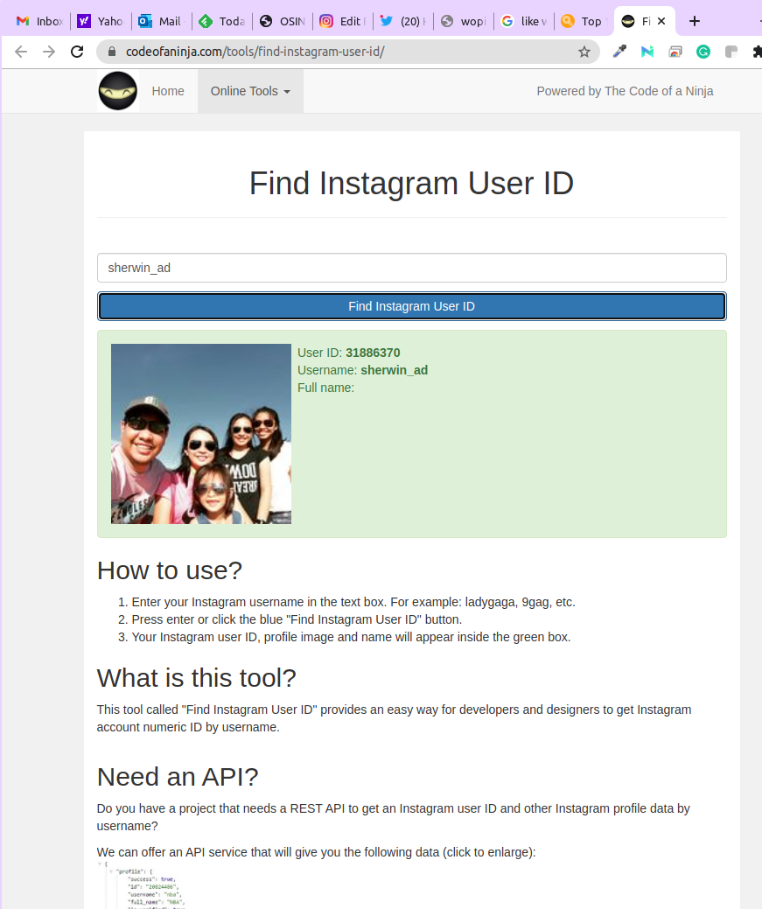
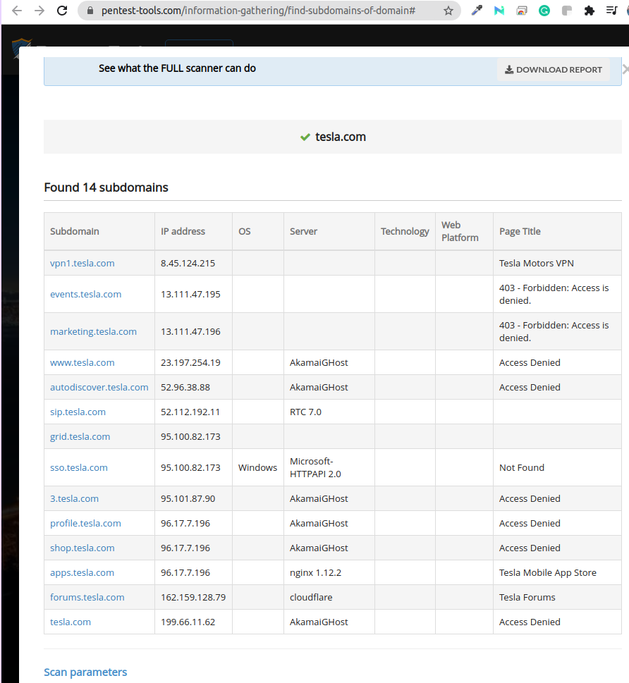
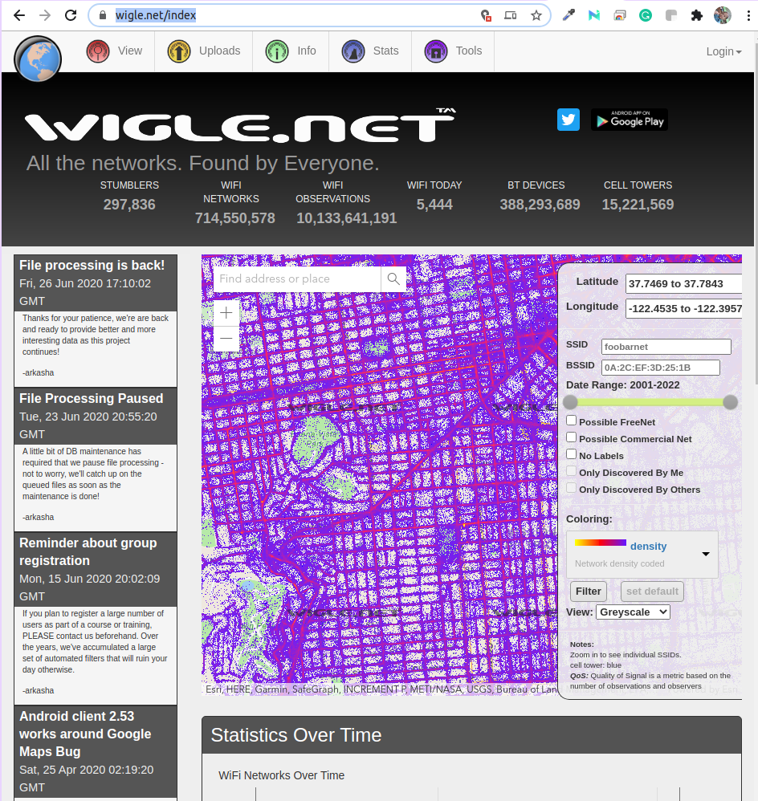

[TOC]


# Open Sorce Inteligence (OSINT)

**Open-source intelligence (OSINT)** is a multi-methods (qualitative, quantitative) methodology for collecting, analyzing and making decisions about data accessible in publicly available sources to be used in an intelligence context. In the intelligence community, the term "open" refers to overt, publicly available sources (as opposed to covert or clandestine sources). It is not related to open-source software or collective intelligence.


## Intelligence Lifecycle


1. **Planning and Direction**

- This is management of the entire effort, from identifying the need for data to delivering an intelligence product to a consumer. It is the beginning and the end of the cycle--the beginning because it involves drawing up specific collection requirements and the end because finished intelligence, which supports policy decisions, generates new requirements.


2. **Collection**
- is the gathering of the raw information needed to produce finished intelligence. There are many sources of information including open sources such as foreign broadcasts, newspapers, periodicals, and books. Open source reporting is integral to CIA's analytical capabilities. There are also secret sources of information. CIA's operations officers collect such information from agents abroad and from defectors who provide information obtainable in no other way.Finally, technical collection--electronics and satellite photography--plays an indispensable role in modern intelligence, such as monitoring arms control agreements and providing direct support to military forces.

3. **Processing and Exploitation**
- involves converting the vast amount of information collected to a form usable by analysts through decryption, language translations, and data reduction.

4. **Analysis and Production**
- is the conversion of basic information into finished intelligence. It includes integrating, evaluating, and analyzing all available data--which is often fragmentary and even contradictory--and preparing intelligence products. Analysts, who are subject-matter specialists, consider the information's reliability, validity, and relevance. They integrate data into a coherent whole, put the evaluated information in context, and produce finished intelligence that includes assessments of events and judgments about the implications of the information for the United States.The CIA devotes the bulk of its resources to providing strategic intelligence to policymakers. It performs this important function by monitoring events, warning decisionmakers about threats to the United States, and forecasting developments. The subjects involved may concern different regions, problems, or personalities in various contexts--political, geographic, economic, military, scientific, or biographic. Current events, capabilities, and future trends are examined.The CIA produces numerous written reports, which may be brief--one page or less--or lengthy studies. They may involve current intelligence, which is of immediate importance, or long-range assessments. The Agency presents some finished intelligence in oral briefings. The CIA also participates in the drafting and production of National Intelligence Estimates, which reflect the collective judgments of the Intelligence Community.

5. **Dissemination and Integration**

- The last step, which logically feeds into the first, is the distribution of the finished intelligence to the consumers, the same policymakers whose needs initiated the intelligence requirements. Finished intelligence is hand-carried daily to the President and key national security advisers. The policymakers, the recipients of finished intelligence, then make decisions based on the information, and these decisions may lead to the levying of more requirements, thus triggering the Intelligence Cycle.

## Introduction to Sock Puppets

**Sock Puppets**

- online identity that is not who you are 
- it's a misrepresentaion of somebody you're not
- fake account , alternate identity
- is to not draw attention back yourself
- never let the person know that we're looking into them


**Assets Links**

Creating-an-Effective-Sock-Puppet-for-OSINT-Investigations-Introduction
https://jakecreps.com/2018/11/02/sock-puppets/

The-Art-Of-The-Sock
https://www.secjuice.com/the-art-of-the-sock-osint-humint/

Reddit-My-process-for-setting-up-anonymous-sockpuppet-accounts
https://www.reddit.com/r/OSINT/comments/dp70jr/my_process_for_setting_up_anonymous_sockpuppet/

Fake-Name-Generator
https://www.fakenamegenerator.com/

This-Person-Does-not-Exist
https://www.thispersondoesnotexist.com/

Privacy.com
https://privacy.com/

Mysudo
https://mysudo.com/

**20 Minute Mail (use for creating social media accounts)**
http://www.20minutemail.com/


### VPN

ProtonVPN
https://protonvpn.com/

Private Internet Access
https://www.privateinternetaccess.com/


**Checking VPN**

DNS leak test
https://www.dnsleaktest.com/


#### Proton VPN

Login to Proton VPN using protonvpn-cli

```
$ protonvpn-cli login sherwinowen
Enter your ProtonVPN password: 
Attempting to login...

Login successful!
```

Connect and select server location

```
$ protonvpn-cli connect (or protonvpn-cli c)
```

Select a server location and click OK.Select a server at that server location and click OK. 4. Select [udp or tcp](https://protonvpn.com/support/udp-tcp/) (we recommend udp unless you have a reason to choose tcp).

To check your connection status

```
$ protonvpn-cli status (or protonvpn-cli s)
```

To disconnect

```
$ protonvpn-cli disconnect (or protonvpn-cli d)

```
**How to use the kill switch**

The ProtonVPN official Linux app includes a kill switch. The basic kill switch will block all your internet connections when the VPN app is running and the connection to one of our servers fails. To enable it, enter:

```
protonvpn-cli ks --on
```

The app also features an always-on kill switch. This prevents all internet connections unless the VPN app is running and connected to one of our servers. To enable it, enter:

```
protonvpn-cli ks --always-on
```

You can disable the kill switch by entering:

```
protonvpn-cli ks --off
```

To connect to the fastest ProtonVPN server for your location, for example, enter:

```
protonvpn-cli c -f
```

Or to connect to the fastest Tor server (Plus and Visionary users only), enter:

```
protonvpn-cli c -tor
```

Additional connection options, including specifying a custom DNS server, can be found by entering:

```
protonvpn-cli config --help
```


### Creating Sock Puppets

**My process for setting up anonymous sockpuppet accounts.**

[How-To](https://www.reddit.com/r/OSINT/search?q=flair_name%3A"How-To"&restrict_sr=1)

This is my process for setting up an anonymous sockpuppet account.

1. Come up with a persona for the sockpuppet account.

2. Use [Fake Name Generator](https://www.fakenamegenerator.com/) to create a person whom you feel fits your sockpuppet persona.

3. Use [This Person Does Not Exist](https://www.thispersondoesnotexist.com/) to generate an image. Make sure you inspect the image closely and get one that doesn't have any obvious flaws, as they often do. It is worth picking up some Photoshop, GIMP, Affinity Photo or Designer, or other basic image manipulation skills to fix them and change the background of the image.

4. Get a burner phone, completely wiped and fresh. Can be any brand that will accept a Mint Mobile SIM card.

5. Get a burner credit card from [Privacy.com](https://privacy.com/) to use for on Amazon and possible the Mint Mobile setup. They might need it to set up the account.

6. Set up a burner Amazon account. We're only going to use it once.

7. Buy two Mint Mobile SIM cards. You can find them various places online and in stores near you, but you can get two of them for $5 on Amazon. They also give you 1 week free trial with something like 100 text messages, which we're going to use. This gives you two cards for two sockpuppet accounts for only $5.

8. I like to use Amazon to have the card sent to an Amazon pickup box, which can be anonymous.

9. Get a VPN that you can set to the physical area in which you want your sockpuppet to "exist."

10. Set up the Mint Mobile trial account somewhere away from your home; as far as you're willing to go.

11. Use this Mint Mobile trial phone number to set up all of the websites you need.

12. I recommend at least set up a Google account and Protonmail account. Both will come in handy at different times.

13. Once you've set up all the accounts with your trial Mint SIM, set up 2FA on all of the accounts.

14. After setting up 2FA on all of the accounts, change the phone number to one you have more permanent access to, such as MySudo or Google Voice.

15. Make sure everything works!

16. Destroy the SIM card.

17. Wipe the phone.

    

## Search Engine OSINT

**Assets Links**

**Google**
https://www.google.com/

**Google-Advanced-Search**
https://www.google.com/advanced_search

**Google-Search-Guide**
http://www.googleguide.com/print/adv_op_ref.pdf

**Bing**
https://www.bing.com/

**Bing-Search-Guide**
https://www.bruceclay.com/blog/bing-google-advanced-search-operators/

**Yandex**
https://yandex.com/

**DuckDuckGo**
https://duckduckgo.com/

**DuckDuckGo-Search-Guide**
https://help.duckduckgo.com/duckduckgo-help-pages/results/syntax/

**Baidu**
https://baidu.com


### The Google Search Shortcuts Cheat Sheet


| Operator                         | Description                                                  | Example                              |
| :------------------------------- | :----------------------------------------------------------- | :----------------------------------- |
| **Informational Search Queries** |                                                              |                                      |
| define                           | Returns a definition of the given term.                      | define gregarious                    |
| time                             | Returns the current time at a particular location.           | time stockholm                       |
| to                               | Convert measurements from one unit to another.               | 1 cup to tbsp                        |
| in                               | Convert measurements from one unit to another.               | 1000USD in GBP                       |
| translate                        | Translates the queried terms into another specified language. | translate hello world german         |
| map                              | Returns map result.                                          | map new york                         |
| stocks                           | Returns stock information.                                   | stocks sbux                          |
| weather                          | Returns the weather forecast for the given location or ZIP code. | weather 90210                        |
| **Basic Search Symbols**         |                                                              |                                      |
| -                                | Excludes search results that include this term.              | best tablets -drawing                |
| \|                               | Returns search results that match terms on either side of the pipe. The same as writing "OR" between search terms. | computer \| tablet                   |
| @                                | Returns search results that match a particular social media site. | phone recall @twitter                |
| #                                | Returns search results that include a specific hashtag.      | #throwbackthursday                   |
| “”                               | Returns search results that include all terms within quotes in the exact given order. | “never gonna give you up”            |
| *                                | Returns search results where any words can be matched in place of the asterisk. | best * in america                    |
| ..                               | When placed between two numbers, returns search results that match within the number range. | chromebook $200..$500                |
| ()                               | Used to group search terms and control the search logic of the query. | (best \| worst) office suite         |
| $                                | Returns prices.                                              | mac $1000                            |
| **Popular Search Operators**     |                                                              |                                      |
| cache:                           | Show Google's cached version of a specific page.             | cache:makeuseof.com                  |
| filetype:                        | Returns only search results that match a particular file extension. | sleep study filetype:pdf             |
| related:                         | Returns other websites that are similar to the queried website. | related:nytimes.com                  |
| site:                            | Returns only search results from a particular website.       | productivity tips site:makeuseof.com |
| **Other Search Operators**       |                                                              |                                      |
| inanchor:                        | Returns pages that are linked to using anchor text matching the search query. |                                      |
| allinanchor:                     | Same as inanchor, but matching every term that appears after allinanchor. |                                      |
| intext:                          | Returns only search results that match in the page's body.   |                                      |
| allintext:                       | Same as intext, but matching every term that appears after allintext. |                                      |
| intitle:                         | Returns only search results that match in the page's title.  |                                      |
| allintitle:                      | Same as intitle, but matching every term that appears after allintitle. |                                      |
| inurl:                           | Returns only search results that match in the page's URL.    |                                      |
| allinurl:                        | Same as inurl, but matching every term that appears after allinurl. |                                      |


## Image OSINT

**Asset links**

GeoGuessr
https://www.geoguessr.com

GeoGuessr-The-Top-Tips-Tricks-and-Techniques
https://somerandomstuff1.wordpress.com/2019/02/08/geoguessr-the-top-tips-tricks-and-techniques/


### Reverse Image Searching

**Use this site to search images**

Google-Image-Search
https://images.google.com

Yandex
https://yandex.com/

TinEye
https://tineye.com/


### Viewing EXIF data

**EXIF - Exchangeable Image File**

- EXIF data can provide a lot of information
- When you snap a picture there can be data left behind that can be tied up to you

Jeffreys-Image-Metadata-Viewer
http://exif.regex.info/exif.cgi

###### 

## Email OSINT

**Asset links**

Hunter.io
https://hunter.io/

Phonebook.cz
https://phonebook.cz/

VoilaNorbert
https://www.voilanorbert.com/

Email-Hippo
https://tools.verifyemailaddress.io/

Email-Checker
https://email-checker.net/validate

Clearbit-Connect
https://chrome.google.com/webstore/detail/clearbit-connect-supercha/pmnhcgfcafcnkbengdcanjablaabjplo?hl=en


### Discovering Email Addresses

#### Hunter.io
https://hunter.io/


#### Phonebook.cz
https://phonebook.cz/


#### Clearbit-Connect
https://chrome.google.com/webstore/detail/clearbit-connect-supercha/pmnhcgfcafcnkbengdcanjablaabjplo?hl=en


### Verify Email Address

#### Email-Hippo
https://tools.verifyemailaddress.io/


#### Email-Checker
https://email-checker.net/validate


## Password OSINT

#### Hunting Breached Credentials

**Assets links**

Dehashed
https://dehashed.com/

WeLeakInfo
https://weleakinfo.to/v2/

LeakCheck
https://leakcheck.io/

SnusBase
https://snusbase.com/

Scylla.sh
https://scylla.sh/

Have-I-Been-Pwned
https://haveibeenpwned.com/

### 

## Username OSINT

#### Hunting Usernames and Accounts

**NameChk**
https://namechk.com/

**WhatsMyName**
https://whatsmyname.app/


**NameCheckup**
https://namecheckup.com/


## People OSINT


### Searching People

WhitePages
https://www.whitepages.com/

TruePeopleSearch
https://www.truepeoplesearch.com/

FastPeopleSearch
https://www.fastpeoplesearch.com/

FastBackgroundCheck
https://www.fastbackgroundcheck.com/

WebMii
https://webmii.com/

PeekYou
https://peekyou.com/

411
https://www.411.com/

Spokeo
https://www.spokeo.com/

ThatsThem
https://thatsthem.com/

### Voter Records

Voter-Records
https://voterrecords.com

### Hunting Phone Numbers

TrueCaller
https://www.truecaller.com/

Caller-ID-Test
https://calleridtest.com/

Infobel
https://www.infobel.com/


### Discovering Birthdates

**Google Search**

 ```
"sherwin owen adriano" intext:birthday site:facebook.com
 ```


### Searching Resumes

 ```
"sherwin owen adriano" resume site:scribd.com
 ```

Linkedin
https://www.linkedin.com/


## Social Media OSINT

### Twitter OSINT

**Twitter Search Operators**

| Operator                            | Finds tweets...                                              |
| :---------------------------------- | :----------------------------------------------------------- |
| twitter search                      | containing both"twitter" and "search". This is the default operator |
| "happy hour"                        | containing the exact phrase "happy hour"                     |
| love OR hate                        | containing either "love" or "hate" or both                   |
| beer -root                          | containing "beer" but not "root"                             |
| #haiku                              | containing the hashtag "haiku"                               |
| from:alexiskold                     | send from person/company "alexiskold"                        |
| to:techcrunch                       | sent to person/company "techcrunch"                          |
| @zapier                             | mentioning person/company "zapier"                           |
| "happy hour" near:"san francisco"   | containing the exact phrase "happy hour" and sent near "san francisco" |
| near:NYC within:15mi                | sent within 15 miles of "NYC"                                |
| superhero since:2010-12-27          | contaning "superhero" and sent since date "2010-12-27" (year-month-day) |
| election until:2016-11-08           | containing "election" and sent up to date 2016-11-08         |
| movie -scary :)                     | containing "movie" but not "scary", and with a postitive attitude |
| flight :(                           | containing "flight" and with a negative attitude             |
| traffic ?                           | containing "traffic" and asking a question                   |
| hilarious filter:links              | containing "hilarious" and linking to URLs                   |
| news source:twitterfeed             | containing "news" and entered via TwitterFeed                |
| geocode:15.5165714,120.9430912,10km | Searching Twitter by location                                |


**Twitter-Advanced-Search**
https://twitter.com/search-advanced


**Social-Bearing**
https://socialbearing.com/


**Twitonomy**
https://www.twitonomy.com/


**Sleeping-Time**
http://sleepingtime.org/

**Mention-Mapp**
https://mentionmapp.com/


**Tweetbeaver**
https://tweetbeaver.com/


**SpoonBill**
http://spoonbill.io/

**Tinfoleak**
https://tinfoleak.com/

**TweetDeck**
https://tweetdeck.com/


### Facebook OSINT


**Sowdust**
https://sowdust.github.io/fb-search/


**Intelx-Facebook-Search**
https://intelx.io/tools?tab=facebook


### Instagram OSINT

**Wopita**
https://wopita.com/


#### Get Instagram ID (Twitter) 

**Code-of-a-Ninja**
https://codeofaninja.com/tools/find-instagram-user-id/





#### Download images from Instagram posts

**InstaDP**
https://www.instadp.com/

**ImgInn**
https://imginn.com/

**Snap-Map**
https://map.snapchat.com/


## Website OSINT

**BuiltWith**
https://builtwith.com/


**Domain-Dossier**
https://centralops.net/co/

****


**DNSlytics-Reverse-IP**
https://dnslytics.com/reverse-ip


**SpyOnWeb**
https://spyonweb.com/


**VirusTotal**
https://www.virustotal.com/


**Visual-Ping**
https://visualping.io/


**Back-Link-Watch**
http://backlinkwatch.com/index.php


**viewdns.info**
https://viewdns.info/


### Finding sub domain

**Google Search**

```
site:tesla.com -www -shop inurl:admin
```

 

**Pentest-Tools-Subdomain-Finder**
https://pentest-tools.com/information-gathering/find-subdomains-of-domain#




**Spyse**
https://spyse.com/


**crt.sh**
https://crt.sh/


**Shodan**
https://shodan.io


**Wayback-Machine**
https://web.archive.org/


## Wireless OSINT

WiGLE
https://wigle.neT




## Building OSINT Lab

VMWare-Workstation-Player
https://www.vmware.com/ca/products/workstation-player/workstation-player-evaluation.html

VirtualBox
https://www.virtualbox.org/wiki/Downloads

TraceLabs-OSINT-VM
https://www.tracelabs.org/initiatives/osint-vm

TraceLabs-OSINT-VM-Installation-Guide
https://download.tracelabs.org/Trace-Labs-OSINT-VM-Installation-Guide-v2.pdf

TraceLabs-OSINT-VM-Installation-Guide
https://download.tracelabs.org/Trace-Labs-OSINT-VM-Installation-Guide-v2.pdf


## Working with OSINT tools

### Image OSINT

#### Exiftool

**Install exiftool**

```
kali@kali $ sudo apt install libimage-exiftool-perl
```

**Run exiftool**

```
kali@kali $ exiftool 010\ dog.JPG 
ExifTool Version Number         : 12.13
File Name                       : 010 dog.JPG
Directory                       : .
File Size                       : 3.8 MiB
File Modification Date/Time     : 2021:01:18 04:46:21-05:00
File Access Date/Time           : 2021:01:18 04:46:21-05:00
File Inode Change Date/Time     : 2021:01:18 04:46:21-05:00
File Permissions                : rw-r--r--
File Type                       : JPEG
File Type Extension             : jpg
MIME Type                       : image/jpeg
Exif Byte Order                 : Big-endian (Motorola, MM)
Make                            : Apple
Camera Model Name               : iPhone 4S
Orientation                     : Rotate 90 CW
X Resolution                    : 72
Y Resolution                    : 72
Resolution Unit                 : inches
Software                        : 5.0.1
Modify Date                     : 2012:03:11 12:01:53
Y Cb Cr Positioning             : Centered
Exposure Time                   : 1/1842
F Number                        : 2.4
Exposure Program                : Program AE
ISO                             : 64
Exif Version                    : 0221
Date/Time Original              : 2012:03:11 12:01:53
Create Date                     : 2012:03:11 12:01:53
Components Configuration        : Y, Cb, Cr, -
Shutter Speed Value             : 1/1842
Aperture Value                  : 2.4
Brightness Value                : 10.39054726
Metering Mode                   : Multi-segment
Flash                           : Off, Did not fire
Focal Length                    : 4.3 mm
Subject Area                    : 1631 1223 881 881
Flashpix Version                : 0100
Color Space                     : sRGB
Exif Image Width                : 3264
Exif Image Height               : 2448
Sensing Method                  : One-chip color area
Exposure Mode                   : Auto
White Balance                   : Auto
Focal Length In 35mm Format     : 35 mm
Scene Capture Type              : Standard
Sharpness                       : Normal
GPS Latitude Ref                : North
GPS Longitude Ref               : West
GPS Altitude Ref                : Above Sea Level
GPS Time Stamp                  : 17:30:26
GPS Img Direction Ref           : True North
GPS Img Direction               : 191.2603175
Compression                     : JPEG (old-style)
Thumbnail Offset                : 914
Thumbnail Length                : 9959
Image Width                     : 3264
Image Height                    : 2448
Encoding Process                : Baseline DCT, Huffman coding
Bits Per Sample                 : 8
Color Components                : 3
Y Cb Cr Sub Sampling            : YCbCr4:2:0 (2 2)
Aperture                        : 2.4
Image Size                      : 3264x2448
Megapixels                      : 8.0
Scale Factor To 35 mm Equivalent: 8.2
Shutter Speed                   : 1/1842
Thumbnail Image                 : (Binary data 9959 bytes, use -b option to extract)
GPS Altitude                    : 182 m Above Sea Level
GPS Latitude                    : 41 deg 40' 43.20" N
GPS Longitude                   : 83 deg 39' 21.00" W
Circle Of Confusion             : 0.004 mm
Field Of View                   : 54.4 deg
Focal Length                    : 4.3 mm (35 mm equivalent: 35.0 mm)
GPS Position                    : 41 deg 40' 43.20" N, 83 deg 39' 21.00" W
Hyperfocal Distance             : 2.08 m
Light Value                     : 14.0
```


### Hunting Emails and Breached Data

#### theHarvester

```
# theHarvester -d tesla.com -b google
```


**breach-parse**
https://github.com/hmaverickadams/breach-parse

Twint
https://github.com/twintproject/twint

Subfinder
https://github.com/projectdiscovery/subfinder

Assetfinder
https://github.com/tomnomnom/assetfinder

httprobe
https://github.com/tomnomnom/httprobe

Amass
https://github.com/OWASP/Amass

GoWitness
https://github.com/sensepost/gowitness/wiki/Installation

Hunchly
https://hunch.ly