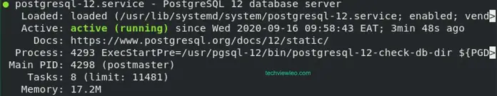

# Install PostgreSQL 12 on Oracle Linux 8

1. Update system packages

   ```
   sudo dnf update
   ```

2. Add PostgreSQL repository

   ```
   sudo dnf install https://download.postgresql.org/pub/repos/yum/reporpms/EL-8-x86_64/pgdg-redhat-repo-latest.noarch.rpm
   ```

3. Install PostgreSQL on Oracle 12 on Oracle Linux 8

   We need to disable any other existing PostgreSQL if there is then install PostgreSQL 12. Run the below commands:

   ```
   sudo dnf module disable postgresql
   
   sudo dnf --repo pgdg12 install postgresql12-server postgresql12
   ```

   OR

   ```
   yum -y install https://download.postgresql.org/pub/repos/yum/reporpms/EL-8-x86_64/pgdg-redhat-repo-latest.noarch.rpm
   
   yum -y install https://dl.fedoraproject.org/pub/epel/epel-release-latest-8.noarch.rpm
   
   yum -y install yum-utils
   
   yum-config-manager --enable pgdg12
   
   yum install postgresql12-server postgresql12
   ```

   

4. Initialize and start Database Service

   We first need to initialize database before starting. Use the following command:

   ```
   sudo /usr/pgsql-12/bin/postgresql-12-setup initdb
   Initializing database --- OK
   ```

   Now we can start and enable database service.

   ```
   sudo systemctl enable --now postgresql-12
   ```

   Confirm status if postgresql is running using the below command.

   ```
   sudo systemctl status postgresql-12
   ```

   

   The output should be as below if running:

   

   

   If running Firewall service and remote clients should connect to your database server, allow PostgreSQL service.

   ```
   sudo firewall-cmd --permanent --add-service=postgresql
   sudo firewall-cmd --reload
   ```

5. Set PostgreSQL admin user

   To set PostgreSQL admin user, run:

   ```
   $ sudo su – postgres
   $ psql -c "alter user postgres with password 'MyStrongPassword'"
   ALTER ROLE
   ```


# Creating user, database and adding access on PostgreSQL

```
postgres=# create database mydb;
postgres=# create user myuser with encrypted password 'mypass';
postgres=# grant all privileges on database mydb to myuser;
```

##### Grant All Privileges on Schema to User in PostgreSQL

```
# GRANT ALL ON ALL TABLES IN SCHEMA [schema name] TO [user];
```

#### How to grant access to users in PostgreSQL?

Here are some common statement to grant access to a PostgreSQL user:

**1. Grant CONNECT to the database:**

```
GRANT CONNECT ON DATABASE database_name TO username;
```

**2. Grant USAGE on schema:**

```
GRANT USAGE ON SCHEMA schema_name TO username;
```

**3. Grant on all tables for DML statements: SELECT, INSERT, UPDATE, DELETE:**

```
GRANT SELECT, INSERT, UPDATE, DELETE ON ALL TABLES IN SCHEMA schema_name TO username;
```

**4. Grant all privileges on all tables in the schema:**

```
GRANT ALL PRIVILEGES ON ALL TABLES IN SCHEMA schema_name TO username;
```

**5. Grant all privileges on all sequences in the schema:**

```
GRANT ALL PRIVILEGES ON ALL SEQUENCES IN SCHEMA schema_name TO username;
```

**6. Grant all privileges on the database:**

```
GRANT ALL PRIVILEGES ON DATABASE database_name TO username;
```

**7. Grant permission to create database**:

```
ALTER USER username CREATEDB;
```

**8. Make a user superuser**:

```
ALTER USER myuser WITH SUPERUSER;
```

**9. Remove superuser status**:

```
ALTER USER username WITH NOSUPERUSER;
```

Those statements above only affect the current existing tables. To apply to newly created tables, you need to use alter default. For example:

```
ALTER DEFAULT PRIVILEGES
FOR USER username
IN SCHEMA schema_name
GRANT SELECT, INSERT, UPDATE, DELETE ON TABLES TO username;
```

# Configure a High Availability System in PostgreSQL

## 1. Streaming Replication Asynchronous

### Check if postgresql is running

**Server1**

```
[sherwinowen@postgresql ~]$ ps -ef | grep postgres
postgres  118290       1  0 Aug15 ?        00:00:00 /usr/pgsql-12/bin/postmaster -D /var/lib/pgsql/12/data/
postgres  118291  118290  0 Aug15 ?        00:00:00 postgres: logger   
postgres  118293  118290  0 Aug15 ?        00:00:00 postgres: checkpointer   
postgres  118294  118290  0 Aug15 ?        00:00:00 postgres: background writer   
postgres  118295  118290  0 Aug15 ?        00:00:00 postgres: walwriter   
postgres  118296  118290  0 Aug15 ?        00:00:00 postgres: autovacuum launcher   
postgres  118297  118290  0 Aug15 ?        00:00:00 postgres: stats collector   
postgres  118298  118290  0 Aug15 ?        00:00:00 postgres: logical replication launcher   
sherwin+  119342    6394  0 00:52 pts/0    00:00:00 grep --color=auto postgres
```

**Server2**

```
[sherwinowen@postgresql1 ~]$ ps -ef | grep postgres
postgres    1640       1  0 00:43 ?        00:00:00 /usr/pgsql-12/bin/postmaster -D /var/lib/pgsql/12/data/
postgres    1777    1640  0 00:43 ?        00:00:00 postgres: logger   
postgres    2136    1640  0 00:43 ?        00:00:00 postgres: checkpointer   
postgres    2137    1640  0 00:43 ?        00:00:00 postgres: background writer   
postgres    2138    1640  0 00:43 ?        00:00:00 postgres: walwriter   
postgres    2139    1640  0 00:43 ?        00:00:00 postgres: autovacuum launcher   
postgres    2140    1640  0 00:43 ?        00:00:00 postgres: stats collector   
postgres    2141    1640  0 00:43 ?        00:00:00 postgres: logical replication launcher   
sherwin+    6742    6477  0 00:51 pts/0    00:00:00 grep --color=auto postgres
```

### Locating `hba.conf`

```
postgres=# SHOW hba_file;
              hba_file              
------------------------------------
 /var/lib/pgsql/12/data/pg_hba.conf
(1 row)

```

### List Databases

**Server1**

```
[postgres@postgresql ~]$ psql -l
                                  List of databases
   Name    |  Owner   | Encoding |   Collate   |    Ctype    |   Access privileges   
-----------+----------+----------+-------------+-------------+-----------------------
 demo      | postgres | UTF8     | en_US.UTF-8 | en_US.UTF-8 | 
 postgres  | postgres | UTF8     | en_US.UTF-8 | en_US.UTF-8 | 
 template0 | postgres | UTF8     | en_US.UTF-8 | en_US.UTF-8 | =c/postgres          +
           |          |          |             |             | postgres=CTc/postgres
 template1 | postgres | UTF8     | en_US.UTF-8 | en_US.UTF-8 | =c/postgres          +
           |          |          |             |             | postgres=CTc/postgres
(4 rows)

```

**Server2**

```
[postgres@postgresql1 ~]$ psql -l
                                  List of databases
   Name    |  Owner   | Encoding |   Collate   |    Ctype    |   Access privileges   
-----------+----------+----------+-------------+-------------+-----------------------
 postgres  | postgres | UTF8     | en_US.UTF-8 | en_US.UTF-8 | 
 template0 | postgres | UTF8     | en_US.UTF-8 | en_US.UTF-8 | =c/postgres          +
           |          |          |             |             | postgres=CTc/postgres
 template1 | postgres | UTF8     | en_US.UTF-8 | en_US.UTF-8 | =c/postgres          +
           |          |          |             |             | postgres=CTc/postgres
(3 rows)
```

### List Tables in database "demo"

**Server1**

```
[postgres@postgresql ~]$ psql -d demo
psql (12.16)
Type "help" for help.

demo=# \dt+
                                  List of relations
  Schema  |      Name       | Type  |  Owner   |  Size   |        Description        
----------+-----------------+-------+----------+---------+---------------------------
 bookings | aircrafts_data  | table | postgres | 16 kB   | Aircrafts (internal data)
 bookings | airports_data   | table | postgres | 56 kB   | Airports (internal data)
 bookings | boarding_passes | table | postgres | 33 MB   | Boarding passes
 bookings | bookings        | table | postgres | 13 MB   | Bookings
 bookings | flights         | table | postgres | 3160 kB | Flights
 bookings | seats           | table | postgres | 88 kB   | Seats
 bookings | ticket_flights  | table | postgres | 68 MB   | Flight segment
 bookings | tickets         | table | postgres | 48 MB   | Tickets
(8 rows)
```


### 1. Create replication user

**Server1**

```
[postgres@postgresql ~]$ psql
psql (12.16)
Type "help" for help.

postgres=# create user replicator with replication password 'password';
CREATE ROLE
```

### 2. Parameters need to setup

**Check the value  of parameter**

wal_level (replica or logical)

hot_standby (on)

- It allows read-only connection

```
[postgres@postgresql ~]$ psql -c "show wal_level;"
 wal_level 
-----------
 replica
(1 row)

[postgres@postgresql ~]$ psql -c "show max_wal_senders;"
 max_wal_senders 
-----------------
 10
(1 row)

[postgres@postgresql ~]$ psql -c "show hot_standby;"
 hot_standby 
-------------
 on
(1 row)
```


### 3. Activate continues archiving

**Create directory where the wal files will go**

```
[postgres@postgresql ~]$ pwd
/var/lib/pgsql
[postgres@postgresql ~]$ mkdir archivelog
[postgres@postgresql ~]$ ls -l 
total 101432
drwx------. 4 postgres postgres        51 Aug 15 23:52 12
drwxr-xr-x. 2 postgres postgres         6 Aug 16 03:09 archivelog
-rwxr-xr-x. 1 root     root     103865532 Aug 16 01:08 demo-small-en-20170815.sql
```

**Show config file location**

```
[postgres@postgresql ~]$ psql -c "show config_file;"
              config_file               
----------------------------------------
 /var/lib/pgsql/12/data/postgresql.conf
(1 row)
```

**Edit  /var/lib/pgsql/12/data/postgresql.conf**

Edit this part

```
# - Archiving -

archive_mode = on               # enables archiving; off, on, or always
                                # (change requires restart)
archive_command = 'test ! -f /var/lib/pgsql/archivelog/%f && cp %p /var/lib/pgsql/archivelog/%f'                # command to use to archive a logfile segment
                                # placeholders: %p = path of file to archive
                                #               %f = file name only
                                # e.g. 'test ! -f /mnt/server/archivedir/%f && cp %p /mnt/server/archivedir/%f'
```

**Edit  /var/lib/pgsql/12/data/pg-hba.conf**

Edit this part

```
# replication privilege.
local   replication     all                                     peer
host    replication     replicator      10.2.0.0/24             md5
host    replication     all             ::1/128                 ident
```

Restart postgres

```
[sherwinowen@postgresql ~]$ sudo systemctl restart postgresql-12.service 
```

### 4. Create basebackup

**Server2**

Stop postgresql service

```
[sherwinowen@postgresql1 ~]$ sudo systemctl stop postgresql-12.service
```

**Server1**

1. Edited `pg_hba.conf` file to include

    ```
   host all all 0.0.0.0/0 md5
   ```

2. Edited 'postgresql.conf' and changed the listen parameter to

   ```
   listen_addresses='*'
   ```


Create basebackup

```
[postgres@postgresql ~]$ pg_basebackup -h 10.2.0.12 -U replicator -p 5432 -D basebackup -Fp -Xs -P -R
Password: 
311607/311607 kB (100%), 1/1 tablespace

[postgres@postgresql ~]$ ls -lh basebackup/
total 60K
-rw-------. 1 postgres postgres  226 Aug 16 04:05 backup_label
drwx------. 6 postgres postgres   54 Aug 16 04:05 base
-rw-------. 1 postgres postgres   30 Aug 16 04:05 current_logfiles
drwx------. 2 postgres postgres 4.0K Aug 16 04:05 global
drwx------. 2 postgres postgres   58 Aug 16 04:05 log
drwx------. 2 postgres postgres    6 Aug 16 04:05 pg_commit_ts
drwx------. 2 postgres postgres    6 Aug 16 04:05 pg_dynshmem
-rw-------. 1 postgres postgres 4.4K Aug 16 04:05 pg_hba.conf
-rw-------. 1 postgres postgres 1.6K Aug 16 04:05 pg_ident.conf
drwx------. 4 postgres postgres   68 Aug 16 04:05 pg_logical
drwx------. 4 postgres postgres   36 Aug 16 04:05 pg_multixact
drwx------. 2 postgres postgres    6 Aug 16 04:05 pg_notify
drwx------. 2 postgres postgres    6 Aug 16 04:05 pg_replslot
drwx------. 2 postgres postgres    6 Aug 16 04:05 pg_serial
drwx------. 2 postgres postgres    6 Aug 16 04:05 pg_snapshots
drwx------. 2 postgres postgres    6 Aug 16 04:05 pg_stat
drwx------. 2 postgres postgres    6 Aug 16 04:05 pg_stat_tmp
drwx------. 2 postgres postgres    6 Aug 16 04:05 pg_subtrans
drwx------. 2 postgres postgres    6 Aug 16 04:05 pg_tblspc
drwx------. 2 postgres postgres    6 Aug 16 04:05 pg_twophase
-rw-------. 1 postgres postgres    3 Aug 16 04:05 PG_VERSION
drwx------. 3 postgres postgres   60 Aug 16 04:05 pg_wal
drwx------. 2 postgres postgres   18 Aug 16 04:05 pg_xact
-rw-------. 1 postgres postgres  272 Aug 16 04:05 postgresql.auto.conf
-rw-------. 1 postgres postgres  27K Aug 16 04:05 postgresql.conf
-rw-------. 1 postgres postgres    0 Aug 16 04:05 standby.signal
```

Create directory archivelog in Server2

```
[sherwinowen@postgresql1 ~]$ sudo su - postgres
Last login: Wed Aug 16 00:55:09 UTC 2023 on pts/0
[postgres@postgresql1 ~]$ mkdir archivelog
```

### 5. Copy basebackup to  /var/lib/pgsql/12/data/ of Server2

```
[postgres@postgresql ~]$ rsync -av basebackup/ postgres@10.2.0.13:/var/lib/pgsql/12/data/
```

**Server2** 

Start postgresql service

```
sudo systemctl start postgresql-12.service
```

**List database**

```
[postgres@postgresql1 ~]$ psql -l
                                  List of databases
   Name    |  Owner   | Encoding |   Collate   |    Ctype    |   Access privileges
-----------+----------+----------+-------------+-------------+-----------------------
 demo      | postgres | UTF8     | en_US.UTF-8 | en_US.UTF-8 |
 postgres  | postgres | UTF8     | en_US.UTF-8 | en_US.UTF-8 |
 template0 | postgres | UTF8     | en_US.UTF-8 | en_US.UTF-8 | =c/postgres          +
           |          |          |             |             | postgres=CTc/postgres
 template1 | postgres | UTF8     | en_US.UTF-8 | en_US.UTF-8 | =c/postgres          +
           |          |          |             |             | postgres=CTc/postgres
(4 rows)
```


### 6. Check Streaming Replication Asynchronous both servers

**Server1**

```
[postgres@postgresql ~]$ psql -d demo
psql (12.16)
Type "help" for help.

demo=# \dt+
                                  List of relations
  Schema  |      Name       | Type  |  Owner   |  Size   |        Description
----------+-----------------+-------+----------+---------+---------------------------
 bookings | aircrafts_data  | table | postgres | 16 kB   | Aircrafts (internal data)
 bookings | airports_data   | table | postgres | 56 kB   | Airports (internal data)
 bookings | boarding_passes | table | postgres | 33 MB   | Boarding passes
 bookings | bookings        | table | postgres | 13 MB   | Bookings
 bookings | flights         | table | postgres | 3160 kB | Flights
 bookings | seats           | table | postgres | 88 kB   | Seats
 bookings | ticket_flights  | table | postgres | 68 MB   | Flight segment
 bookings | tickets         | table | postgres | 48 MB   | Tickets
(8 rows)
```

**Server2**

```
[postgres@postgresql1 ~]$ psql -d demo
psql (12.16)
Type "help" for help.

demo=# \dt+
                                  List of relations
  Schema  |      Name       | Type  |  Owner   |  Size   |        Description
----------+-----------------+-------+----------+---------+---------------------------
 bookings | aircrafts_data  | table | postgres | 16 kB   | Aircrafts (internal data)
 bookings | airports_data   | table | postgres | 56 kB   | Airports (internal data)
 bookings | boarding_passes | table | postgres | 33 MB   | Boarding passes
 bookings | bookings        | table | postgres | 13 MB   | Bookings
 bookings | flights         | table | postgres | 3160 kB | Flights
 bookings | seats           | table | postgres | 88 kB   | Seats
 bookings | ticket_flights  | table | postgres | 68 MB   | Flight segment
 bookings | tickets         | table | postgres | 48 MB   | Tickets
(8 rows)
```

**Create table in Server2**

- Check Server2 if it allows us to write

```
demo=# create table test (int serial);
ERROR:  cannot execute CREATE TABLE in a read-only transaction
```

**Create table in Server1**

```
demo=# create table test (int serial);
CREATE TABLE

demo=# \dt+
                                  List of relations
  Schema  |      Name       | Type  |  Owner   |  Size   |        Description
----------+-----------------+-------+----------+---------+---------------------------
 bookings | aircrafts_data  | table | postgres | 16 kB   | Aircrafts (internal data)
 bookings | airports_data   | table | postgres | 56 kB   | Airports (internal data)
 bookings | boarding_passes | table | postgres | 33 MB   | Boarding passes
 bookings | bookings        | table | postgres | 13 MB   | Bookings
 bookings | flights         | table | postgres | 3160 kB | Flights
 bookings | seats           | table | postgres | 88 kB   | Seats
 bookings | test            | table | postgres | 0 bytes |
 bookings | ticket_flights  | table | postgres | 68 MB   | Flight segment
 bookings | tickets         | table | postgres | 48 MB   | Tickets
(9 rows)
```

**List tables in Server2**

- Check if replicated in Server2

```
demo=# \dt+
                                  List of relations
  Schema  |      Name       | Type  |  Owner   |  Size   |        Description
----------+-----------------+-------+----------+---------+---------------------------
 bookings | aircrafts_data  | table | postgres | 16 kB   | Aircrafts (internal data)
 bookings | airports_data   | table | postgres | 56 kB   | Airports (internal data)
 bookings | boarding_passes | table | postgres | 33 MB   | Boarding passes
 bookings | bookings        | table | postgres | 13 MB   | Bookings
 bookings | flights         | table | postgres | 3160 kB | Flights
 bookings | seats           | table | postgres | 88 kB   | Seats
 bookings | test            | table | postgres | 0 bytes |
 bookings | ticket_flights  | table | postgres | 68 MB   | Flight segment
 bookings | tickets         | table | postgres | 48 MB   | Tickets
(9 rows)
```


**Insert 1000 records in test table in Server1**

```
demo=# insert into test (select generate_series(1,1000));
INSERT 0 1000
```

**Check Server2 if records replicated**

```
demo=# select count(*) from test;
 count
-------
  1000
(1 row)
```


## 2. Download, install and configure repmgr for Failover

### 1. Install repmgr

```
[root@postgresql sherwinowen]# yum install repmgr12
Last metadata expiration check: 1:25:48 ago on Wed 16 Aug 2023 05:46:53 AM UTC.
Dependencies resolved.
=========================================================================================
 Package             Architecture     Version                     Repository        Size
=========================================================================================
Installing:
 repmgr_12           x86_64           5.4.1-1PGDG.rhel8           pgdg12           288 k

Transaction Summary
=========================================================================================
Install  1 Package

Total download size: 288 k
Installed size: 1.0 M
Is this ok [y/N]: y
Downloading Packages:
repmgr_12-5.4.1-1PGDG.rhel8.x86_64.rpm                   187 kB/s | 288 kB     00:01
-----------------------------------------------------------------------------------------
Total                                                    187 kB/s | 288 kB     00:01
Running transaction check
Transaction check succeeded.
Running transaction test
Transaction test succeeded.
Running transaction
  Preparing        :                                                                 1/1
  Running scriptlet: repmgr_12-5.4.1-1PGDG.rhel8.x86_64                              1/1
  Installing       : repmgr_12-5.4.1-1PGDG.rhel8.x86_64                              1/1
  Running scriptlet: repmgr_12-5.4.1-1PGDG.rhel8.x86_64                              1/1
  Verifying        : repmgr_12-5.4.1-1PGDG.rhel8.x86_64                              1/1

Installed:
  repmgr_12-5.4.1-1PGDG.rhel8.x86_64
```

### 2. Create user "repmgr" and database "repmgr"

```
[postgres@postgresql ~]$ createuser -s repmgr
[postgres@postgresql ~]$ createdb repmgr -O repmgr
```

### 3. Modify postgresql.conf

```
vim /var/lib/pgsql/12/data/postgresql.conf
```

Change this line

```
#shared_preload_libraries = ''     # (change requires restart)
```

To this line

```
shared_preload_libraries = 'repmgr'     # (change requires restart)
```

### 4. Modify pg_hba.conf

```
vim /var/lib/pgsql/12/data/pg_hba.conf
```

Change this lines

```
# "local" is for Unix domain socket connections only
local   all             all                                     peer
# IPv4 local connections:
host    all             all             all                     md5
# IPv6 local connections:
host    all             all             ::1/128                 ident
# Allow replication connections from localhost, by a user with the
# replication privilege.
local   replication     all                                     peer
host    replication     replicator      10.2.0.0/24             md5
host    replication     all             ::1/128                 ident
```

To this lines

```
# "local" is for Unix domain socket connections only
local   repmgr          repmgr                                  trust
local   all             all                                     peer
# IPv4 local connections:
host    repmgr          repmgr          10.2.0.0/24             trust
host    all             all             all                     md5
# IPv6 local connections:
host    all             all             ::1/128                 ident
# Allow replication connections from localhost, by a user with the
# replication privilege.
local   replication     repmgr                                  trust
local   replication     all                                     peer
host    replication     repmgr          10.2.0.0/24             trust
host    replication     replicator      10.2.0.0/24             md5
host    replication     all             ::1/128                 ident
```

### 5. Restart postgresql service

```
[sherwinowen@postgresql ~]$ sudo systemctl restart postgresql-12.service
```

**Connect from Server2 to Server1**

```
[postgres@postgresql1 ~]$ psql -h 10.2.0.12 -d repmgr -U repmgr
psql (12.16)
Type "help" for help.

repmgr=# \dt
Did not find any relations.
```

### 6. Copy repmgr.conf.sample to /var/lib/pgsql/repmgr.conf

```
[sherwinowen@postgresql ~]$ sudo cp repmgr-5.4.1/repmgr.conf.sample /var/lib/pgsql/repmgr.conf
```

**Change the owner to postgres of the file repmgr.conf**

```
[sherwinowen@postgresql ~]$ sudo chown postgres:postgres /var/lib/pgsql/repmgr.conf
```

**Edit repmgr.conf**

Need to modify the following lines:

```
# =============================================================================
# Required configuration items
# =============================================================================

node_id=1                        

node_name='postgresql'                                               

conninfo='host=10.2.0.12 port=5432 dbname=repmgr user=repmgr'   

data_directory='/var/lib/pgsql/12/data'          

#------------------------------------------------------------------------------
# "standby follow" settings
#------------------------------------------------------------------------------

primary_follow_timeout=10 

#------------------------------------------------------------------------------
# Failover and monitoring settings (repmgrd)
#------------------------------------------------------------------------------

failover='automatic'

#------------------------------------------------------------------------------
# Failover and monitoring settings (repmgrd)
#------------------------------------------------------------------------------

promote_command='repmgr standby promote -f /var/lib/pgsql/repmgr.conf' 

follow_command='repmgr standby follow -f /var/lib/pgsql/repmgr.conf -W --upstream-node-id=2'  

```

### 7. Copy repmgr.conf from Server1 to Server2

```
[postgres@postgresql ~]$ scp repmgr.conf postgres@10.2.0.13:/var/lib/pgsql/
```

### 8. Install repmgr in Server2

```
[root@postgresql1 sherwinowen]# yum install repmgr12
```

### 9. Modify repmgr.conf in Server2

```
# =============================================================================
# Required configuration items
# =============================================================================

node_id=2                        

node_name='postgresql1'                                               

conninfo='host=10.2.0.13 port=5432 dbname=repmgr user=repmgr'   

#------------------------------------------------------------------------------
# Failover and monitoring settings (repmgrd)
#------------------------------------------------------------------------------

promote_command='repmgr standby promote -f /var/lib/pgsql/repmgr.conf' 

follow_command='repmgr standby follow -f /var/lib/pgsql/repmgr.conf -W --upstream-node-id-1'  

```

### 10. Stop postgresql service in Server2

```
[root@postgresql1 sherwinowen]# systemctl stop postgresql-12.service
```


## 3. Register nodes

### 1. Register Server1

**Check the repmgr in /usr/pgsql-12/bin/**

```
postgres@postgresql ~]$ ls -l /usr/pgsql-12/bin/
total 11764
-rwxr-xr-x. 1 root root   73080 Aug  9 13:16 clusterdb
-rwxr-xr-x. 1 root root   69016 Aug  9 13:16 createdb
-rwxr-xr-x. 1 root root   73544 Aug  9 13:16 createuser
-rwxr-xr-x. 1 root root   68768 Aug  9 13:16 dropdb
-rwxr-xr-x. 1 root root   68736 Aug  9 13:16 dropuser
-rwxr-xr-x. 1 root root  136192 Aug  9 13:16 initdb
-rwxr-xr-x. 1 root root   42960 Aug  9 13:16 pg_archivecleanup
-rwxr-xr-x. 1 root root  124088 Aug  9 13:16 pg_basebackup
-rwxr-xr-x. 1 root root  161168 Aug  9 13:16 pgbench
-rwxr-xr-x. 1 root root   64168 Aug  9 13:16 pg_checksums
-rwxr-xr-x. 1 root root   42864 Aug  9 13:16 pg_config
-rwxr-xr-x. 1 root root   59560 Aug  9 13:16 pg_controldata
-rwxr-xr-x. 1 root root   72552 Aug  9 13:16 pg_ctl
-rwxr-xr-x. 1 root root  419208 Aug  9 13:16 pg_dump
-rwxr-xr-x. 1 root root  103016 Aug  9 13:16 pg_dumpall
-rwxr-xr-x. 1 root root   68704 Aug  9 13:16 pg_isready
-rwxr-xr-x. 1 root root   86096 Aug  9 13:16 pg_receivewal
-rwxr-xr-x. 1 root root   68288 Aug  9 13:16 pg_resetwal
-rwxr-xr-x. 1 root root  179312 Aug  9 13:16 pg_restore
-rwxr-xr-x. 1 root root  106384 Aug  9 13:16 pg_rewind
-rwxr-xr-x. 1 root root   47328 Aug  9 13:16 pg_test_fsync
-rwxr-xr-x. 1 root root   38800 Aug  9 13:16 pg_test_timing
-rwxr-xr-x. 1 root root  148488 Aug  9 13:16 pg_upgrade
-rwxr-xr-x. 1 root root   97928 Aug  9 13:16 pg_waldump
-rwxr-xr-x. 1 root root 7892536 Aug  9 13:16 postgres
-rwxr-xr-x. 1 root root    2170 Aug  9 13:14 postgresql-12-check-db-dir
-rwxr-xr-x. 1 root root    9413 Aug  9 13:14 postgresql-12-setup
lrwxrwxrwx. 1 root root       8 Aug  9 13:14 postmaster -> postgres
-rwxr-xr-x. 1 root root  657952 Aug  9 13:16 psql
-rwxr-xr-x. 1 root root   73208 Aug  9 13:16 reindexdb
-rwxr-xr-x. 1 root root  552424 Jul 24 17:27 repmgr
-rwxr-xr-x. 1 root root  306472 Jul 24 17:27 repmgrd
-rwxr-xr-x. 1 root root   81752 Aug  9 13:16 vacuumdb
```

**Add the directory path of repmgr to $PATH**

```
[postgres@postgresql ~]$ echo "PATH=$PATH:/usr/pgsql-12/bin/" >> .bash_profile 

[postgres@postgresql ~]$ . .bash_profile 
```

**Register Server1 as master**

```
[postgres@postgresql ~]$ repmgr -f repmgr.conf  master register
INFO: connecting to primary database...
NOTICE: attempting to install extension "repmgr"
NOTICE: "repmgr" extension successfully installed
NOTICE: primary node record (ID: 1) registered
```

**Check repmgr database**

```
[postgres@postgresql ~]$ psql -d repmgr -U repmgr
psql (12.16)
Type "help" for help.
repmgr-# \dt
              List of relations
 Schema |        Name        | Type  | Owner  
--------+--------------------+-------+--------
 repmgr | events             | table | repmgr
 repmgr | monitoring_history | table | repmgr
 repmgr | nodes              | table | repmgr
 repmgr | voting_term        | table | repmgr
(4 rows)

repmgr=# select * from events;
 node_id |      event       | successful |        event_timestamp        | details 
---------+------------------+------------+-------------------------------+---------
       1 | cluster_created  | t          | 2023-08-17 02:16:07.018497+00 | 
       1 | primary_register | t          | 2023-08-17 02:16:07.025857+00 | 
(2 rows)

repmgr=# select * from nodes;
 node_id | upstream_node_id | active | node_name  |  type   | location | priority |                      conninfo                      | repluser | slot_name |       
 config_file         
---------+------------------+--------+------------+---------+----------+----------+----------------------------------------------------+----------+-----------+-------
---------------------
       1 |                  | t      | postgresql | primary | default  |      100 | host=10.2.0.12 port=5432 dbname=repmgr user=repmgr | repmgr   |           | /var/l
ib/pgsql/repmgr.conf
(1 row)
```

### 2. Register Server2

**Add the directory path of repmgr to $PATH**

```
[postgres@postgresql ~]$ echo "PATH=$PATH:/usr/pgsql-12/bin/" >> .bash_profile 

[postgres@postgresql ~]$ . .bash_profile 
```

**Check if all prerequisite are met to clone the master**

```
[postgres@postgresql1 ~]$ repmgr -h 10.2.0.12 -U repmgr -d repmgr -f repmgr.conf standby clone --dry-run
NOTICE: destination directory "/var/lib/pgsql/12/data" provided
INFO: connecting to source node
DETAIL: connection string is: host=10.2.0.12 user=repmgr dbname=repmgr
DETAIL: current installation size is 311 MB
INFO: "repmgr" extension is installed in database "repmgr"
WARNING: target data directory appears to be a PostgreSQL data directory
DETAIL: target data directory is "/var/lib/pgsql/12/data"
HINT: use -F/--force to overwrite the existing data directory
INFO: replication slot usage not requested;  no replication slot will be set up for this standby
INFO: parameter "max_wal_senders" set to 10
NOTICE: checking for available walsenders on the source node (2 required)
INFO: sufficient walsenders available on the source node
DETAIL: 2 required, 10 available
NOTICE: checking replication connections can be made to the source server (2 required)
INFO: required number of replication connections could be made to the source server
DETAIL: 2 replication connections required
WARNING: data checksums are not enabled and "wal_log_hints" is "off"
DETAIL: pg_rewind requires "wal_log_hints" to be enabled
NOTICE: standby will attach to upstream node 1
HINT: consider using the -c/--fast-checkpoint option
INFO: would execute:
  pg_basebackup -l "repmgr base backup"  -D /var/lib/pgsql/12/data -h 10.2.0.12 -p 5432 -U repmgr -X stream 
INFO: all prerequisites for "standby clone" are met
```

**Clone master**

```
[postgres@postgresql1 ~]$ repmgr -h 10.2.0.12 -U repmgr -d repmgr -f repmgr.conf standby clone -F
NOTICE: destination directory "/var/lib/pgsql/12/data" provided
INFO: connecting to source node
DETAIL: connection string is: host=10.2.0.12 user=repmgr dbname=repmgr
DETAIL: current installation size is 311 MB
INFO: replication slot usage not requested;  no replication slot will be set up for this standby
NOTICE: checking for available walsenders on the source node (2 required)
NOTICE: checking replication connections can be made to the source server (2 required)
WARNING: data checksums are not enabled and "wal_log_hints" is "off"
DETAIL: pg_rewind requires "wal_log_hints" to be enabled
WARNING: directory "/var/lib/pgsql/12/data" exists but is not empty
NOTICE: -F/--force provided - deleting existing data directory "/var/lib/pgsql/12/data"
NOTICE: starting backup (using pg_basebackup)...
HINT: this may take some time; consider using the -c/--fast-checkpoint option
INFO: executing:
  pg_basebackup -l "repmgr base backup"  -D /var/lib/pgsql/12/data -h 10.2.0.12 -p 5432 -U repmgr -X stream 
NOTICE: standby clone (using pg_basebackup) complete
NOTICE: you can now start your PostgreSQL server
HINT: for example: pg_ctl -D /var/lib/pgsql/12/data start
HINT: after starting the server, you need to register this standby with "repmgr standby register"
```

**Start postgresql service**

```
[root@postgresql1 sherwinowen]# systemctl start postgresql-12.service 
```

**Register Server2 as standby**

```
[postgres@postgresql1 ~]$ repmgr -f repmgr.conf standby register
INFO: connecting to local node "postgresql1" (ID: 2)
INFO: connecting to primary database
WARNING: --upstream-node-id not supplied, assuming upstream node is primary (node ID: 1)
INFO: standby registration complete
NOTICE: standby node "postgresql1" (ID: 2) successfully registered
```


### 3. Check Sever1 and Server2 are sync

**Server1**

**Check "repmgr" database**

```
repmgr=# \x
Expanded display is on.
repmgr=# select * from nodes;
-[ RECORD 1 ]----+---------------------------------------------------
node_id          | 1
upstream_node_id | 
active           | t
node_name        | postgresql
type             | primary
location         | default
priority         | 100
conninfo         | host=10.2.0.12 port=5432 dbname=repmgr user=repmgr
repluser         | repmgr
slot_name        | 
config_file      | /var/lib/pgsql/repmgr.conf
-[ RECORD 2 ]----+---------------------------------------------------
node_id          | 2
upstream_node_id | 1
active           | t
node_name        | postgresql1
type             | standby
location         | default
priority         | 100
conninfo         | host=10.2.0.13 port=5432 dbname=repmgr user=repmgr
repluser         | repmgr
slot_name        | 
config_file      | /var/lib/pgsql/repmgr.conf

```

```
repmgr=# select * from events;
-[ RECORD 1 ]---+----------------------------------------------------------------------------------
node_id         | 1
event           | cluster_created
successful      | t
event_timestamp | 2023-08-17 02:16:07.018497+00
details         | 
-[ RECORD 2 ]---+----------------------------------------------------------------------------------
node_id         | 1
event           | primary_register
successful      | t
event_timestamp | 2023-08-17 02:16:07.025857+00
details         | 
-[ RECORD 3 ]---+----------------------------------------------------------------------------------
node_id         | 2
event           | standby_clone
successful      | t
event_timestamp | 2023-08-17 02:36:40.880174+00
details         | cloned from host "10.2.0.12", port 5432; backup method: pg_basebackup; --force: Y
-[ RECORD 4 ]---+----------------------------------------------------------------------------------
node_id         | 2
event           | standby_register
successful      | t
event_timestamp | 2023-08-17 02:43:46.293042+00
details         | standby registration succeeded; upstream node ID is 1
```

**Check "demo" database**

```
demo=# \dt+
                                  List of relations
  Schema  |      Name       | Type  |  Owner   |  Size   |        Description        
----------+-----------------+-------+----------+---------+---------------------------
 bookings | aircrafts_data  | table | postgres | 16 kB   | Aircrafts (internal data)
 bookings | airports_data   | table | postgres | 56 kB   | Airports (internal data)
 bookings | boarding_passes | table | postgres | 33 MB   | Boarding passes
 bookings | bookings        | table | postgres | 13 MB   | Bookings
 bookings | flights         | table | postgres | 3160 kB | Flights
 bookings | seats           | table | postgres | 88 kB   | Seats
 bookings | test            | table | postgres | 64 kB   | 
 bookings | ticket_flights  | table | postgres | 68 MB   | Flight segment
 bookings | tickets         | table | postgres | 48 MB   | Tickets
(9 rows)
```

**Insert records**

```
demo=# insert into test (select generate_series(1,1000));
INSERT 0 1000

```

**Displays records in test table**

```
demo=# select count(8) from test;
 count 
-------
  2000
(1 row)
```


**Server2**

**Check "repmgr" database**

```
repmgr=# select * from nodes;
-[ RECORD 1 ]----+---------------------------------------------------
node_id          | 1
upstream_node_id | 
active           | t
node_name        | postgresql
type             | primary
location         | default
priority         | 100
conninfo         | host=10.2.0.12 port=5432 dbname=repmgr user=repmgr
repluser         | repmgr
slot_name        | 
config_file      | /var/lib/pgsql/repmgr.conf
-[ RECORD 2 ]----+---------------------------------------------------
node_id          | 2
upstream_node_id | 1
active           | t
node_name        | postgresql1
type             | standby
location         | default
priority         | 100
conninfo         | host=10.2.0.13 port=5432 dbname=repmgr user=repmgr
repluser         | repmgr
slot_name        | 
config_file      | /var/lib/pgsql/repmgr.conf
```

```
repmgr=# select * from events;
-[ RECORD 1 ]---+----------------------------------------------------------------------------------
node_id         | 1
event           | cluster_created
successful      | t
event_timestamp | 2023-08-17 02:16:07.018497+00
details         | 
-[ RECORD 2 ]---+----------------------------------------------------------------------------------
node_id         | 1
event           | primary_register
successful      | t
event_timestamp | 2023-08-17 02:16:07.025857+00
details         | 
-[ RECORD 3 ]---+----------------------------------------------------------------------------------
node_id         | 2
event           | standby_clone
successful      | t
event_timestamp | 2023-08-17 02:36:40.880174+00
details         | cloned from host "10.2.0.12", port 5432; backup method: pg_basebackup; --force: Y
-[ RECORD 4 ]---+----------------------------------------------------------------------------------
node_id         | 2
event           | standby_register
successful      | t
event_timestamp | 2023-08-17 02:43:46.293042+00
details         | standby registration succeeded; upstream node ID is 1
```

**Check "demo" database**

```
demo=# \dt+
                                  List of relations
  Schema  |      Name       | Type  |  Owner   |  Size   |        Description        
----------+-----------------+-------+----------+---------+---------------------------
 bookings | aircrafts_data  | table | postgres | 16 kB   | Aircrafts (internal data)
 bookings | airports_data   | table | postgres | 56 kB   | Airports (internal data)
 bookings | boarding_passes | table | postgres | 33 MB   | Boarding passes
 bookings | bookings        | table | postgres | 13 MB   | Bookings
 bookings | flights         | table | postgres | 3160 kB | Flights
 bookings | seats           | table | postgres | 88 kB   | Seats
 bookings | test            | table | postgres | 64 kB   | 
 bookings | ticket_flights  | table | postgres | 68 MB   | Flight segment
 bookings | tickets         | table | postgres | 48 MB   | Tickets
(9 rows)
```

**Insert records**

```
demo=# insert into test (select generate_series(1,1000));
ERROR:  cannot execute INSERT in a read-only transaction
```

**Displays records in test table**

```
demo=# select count(*) from test;
 count 
-------
  2000
(1 row)
```

## 4. Failover

### 1. Stop the postgresql service in Server1

```
[root@postgresql sherwinowen]# systemctl stop postgresql-12.service 
```


### 2. Monitor the events in repmgr of master and  standby server

**Master**

```
[postgres@postgresql ~]$ repmgrd -f repmgr.conf --verbose
[2023-08-17 03:05:47] [NOTICE] using provided configuration file "repmgr.conf"
[2023-08-17 03:05:47] [NOTICE] repmgrd (repmgrd 5.4.1) starting up
[2023-08-17 03:05:47] [INFO] connecting to database "host=10.2.0.12 port=5432 dbname=repmgr user=repmgr"
[postgres@postgresql ~]$ [2023-08-17 03:05:47] [ERROR] PID file "/tmp/repmgrd.pid" exists and seems to contain a valid PID
[2023-08-17 03:05:47] [HINT] if repmgrd is no longer alive, remove the file and restart repmgrd
```

**Stanby**

```
[postgres@postgresql1 ~]$ repmgrd -f repmgr.conf --verbose
[2023-08-17 03:07:32] [NOTICE] using provided configuration file "repmgr.conf"
[2023-08-17 03:07:32] [NOTICE] repmgrd (repmgrd 5.4.1) starting up
[2023-08-17 03:07:32] [INFO] connecting to database "host=10.2.0.13 port=5432 dbname=repmgr user=repmgr"
[postgres@postgresql1 ~]$ [2023-08-17 03:07:32] [ERROR] PID file "/tmp/repmgrd.pid" exists and seems to contain a valid PID
[2023-08-17 03:07:32] [HINT] if repmgrd is no longer alive, remove the file and restart repmgrd
[2023-08-17 03:09:33] [WARNING] unable to ping "host=10.2.0.12 port=5432 dbname=repmgr user=repmgr"
[2023-08-17 03:09:33] [DETAIL] PQping() returned "PQPING_REJECT"
[2023-08-17 03:09:33] [WARNING] unable to connect to upstream node "postgresql" (ID: 1)
[2023-08-17 03:09:33] [INFO] checking state of node "postgresql" (ID: 1), 1 of 6 attempts
[2023-08-17 03:09:33] [WARNING] unable to ping "user=repmgr dbname=repmgr host=10.2.0.12 port=5432 connect_timeout=2 fallback_application_name=repmgr"
[2023-08-17 03:09:33] [DETAIL] PQping() returned "PQPING_REJECT"
[2023-08-17 03:09:33] [INFO] sleeping up to 10 seconds until next reconnection attempt
[2023-08-17 03:09:43] [INFO] checking state of node "postgresql" (ID: 1), 2 of 6 attempts
[2023-08-17 03:09:43] [WARNING] unable to ping "user=repmgr dbname=repmgr host=10.2.0.12 port=5432 connect_timeout=2 fallback_application_name=repmgr"
[2023-08-17 03:09:43] [DETAIL] PQping() returned "PQPING_NO_RESPONSE"
[2023-08-17 03:09:43] [INFO] sleeping up to 10 seconds until next reconnection attempt
[2023-08-17 03:09:53] [INFO] checking state of node "postgresql" (ID: 1), 3 of 6 attempts
[2023-08-17 03:09:53] [WARNING] unable to ping "user=repmgr dbname=repmgr host=10.2.0.12 port=5432 connect_timeout=2 fallback_application_name=repmgr"
[2023-08-17 03:09:53] [DETAIL] PQping() returned "PQPING_NO_RESPONSE"
[2023-08-17 03:09:53] [INFO] sleeping up to 10 seconds until next reconnection attempt
[2023-08-17 03:10:03] [INFO] checking state of node "postgresql" (ID: 1), 4 of 6 attempts
[2023-08-17 03:10:03] [WARNING] unable to ping "user=repmgr dbname=repmgr host=10.2.0.12 port=5432 connect_timeout=2 fallback_application_name=repmgr"
[2023-08-17 03:10:03] [DETAIL] PQping() returned "PQPING_NO_RESPONSE"
[2023-08-17 03:10:03] [INFO] sleeping up to 10 seconds until next reconnection attempt
[2023-08-17 03:10:13] [INFO] checking state of node "postgresql" (ID: 1), 5 of 6 attempts
[2023-08-17 03:10:13] [WARNING] unable to ping "user=repmgr dbname=repmgr host=10.2.0.12 port=5432 connect_timeout=2 fallback_application_name=repmgr"
[2023-08-17 03:10:13] [DETAIL] PQping() returned "PQPING_NO_RESPONSE"
[2023-08-17 03:10:13] [INFO] sleeping up to 10 seconds until next reconnection attempt
[2023-08-17 03:10:23] [INFO] checking state of node "postgresql" (ID: 1), 6 of 6 attempts
[2023-08-17 03:10:23] [WARNING] unable to ping "user=repmgr dbname=repmgr host=10.2.0.12 port=5432 connect_timeout=2 fallback_application_name=repmgr"
[2023-08-17 03:10:23] [DETAIL] PQping() returned "PQPING_NO_RESPONSE"
[2023-08-17 03:10:23] [WARNING] unable to reconnect to node "postgresql" (ID: 1) after 6 attempts
[2023-08-17 03:10:23] [INFO] 0 active sibling nodes registered
[2023-08-17 03:10:23] [INFO] 2 total nodes registered
[2023-08-17 03:10:23] [INFO] primary node  "postgresql" (ID: 1) and this node have the same location ("default")
[2023-08-17 03:10:23] [INFO] no other sibling nodes - we win by default
[2023-08-17 03:10:23] [NOTICE] this node is the only available candidate and will now promote itself
[2023-08-17 03:10:23] [INFO] promote_command is:
  "repmgr standby promote -f /var/lib/pgsql/repmgr.conf"
NOTICE: promoting standby to primary
DETAIL: promoting server "postgresql1" (ID: 2) using pg_promote()
NOTICE: waiting up to 60 seconds (parameter "promote_check_timeout") for promotion to complete
NOTICE: STANDBY PROMOTE successful
DETAIL: server "postgresql1" (ID: 2) was successfully promoted to primary
[2023-08-17 03:10:24] [INFO] checking state of node 2, 1 of 6 attempts
[2023-08-17 03:10:24] [NOTICE] node 2 has recovered, reconnecting
[2023-08-17 03:10:24] [INFO] connection to node 2 succeeded
[2023-08-17 03:10:24] [INFO] original connection is still available
[2023-08-17 03:10:24] [INFO] 0 followers to notify
[2023-08-17 03:10:24] [INFO] switching to primary monitoring mode
[2023-08-17 03:10:24] [NOTICE] monitoring cluster primary "postgresql1" (ID: 2)
```

### 3. Check Server 2 repmgr database

- Server2 now promoted to primary

```
[postgres@postgresql1 ~]$ psql -d repmgr -U repmgr 
psql (12.16)
Type "help" for help.

repmgr=# \dt+
                            List of relations
 Schema |        Name        | Type  | Owner  |    Size    | Description 
--------+--------------------+-------+--------+------------+-------------
 repmgr | events             | table | repmgr | 16 kB      | 
 repmgr | monitoring_history | table | repmgr | 0 bytes    | 
 repmgr | nodes              | table | repmgr | 16 kB      | 
 repmgr | voting_term        | table | repmgr | 8192 bytes | 
(4 rows)

repmgr=# select * from events;
-[ RECORD 1 ]---+----------------------------------------------------------------
----------------------------------
node_id         | 1
event           | cluster_created
successful      | t
event_timestamp | 2023-08-17 02:16:07.018497+00
details         | 
-[ RECORD 2 ]---+----------------------------------------------------------------
----------------------------------
node_id         | 1
event           | primary_register
successful      | t
event_timestamp | 2023-08-17 02:16:07.025857+00
details         | 
-[ RECORD 3 ]---+----------------------------------------------------------------
----------------------------------
node_id         | 2
event           | standby_clone
successful      | t
event_timestamp | 2023-08-17 02:36:40.880174+00
details         | cloned from host "10.2.0.12", port 5432; backup method: pg_base
backup; --force: Y
-[ RECORD 4 ]---+----------------------------------------------------------------
----------------------------------
node_id         | 2
event           | standby_register
successful      | t
event_timestamp | 2023-08-17 02:43:46.293042+00
details         | standby registration succeeded; upstream node ID is 1
-[ RECORD 5 ]---+----------------------------------------------------------------
----------------------------------
node_id         | 1
event           | repmgrd_start
successful      | t
event_timestamp | 2023-08-17 03:05:39.870198+00
details         | monitoring cluster primary "postgresql" (ID: 1)
-[ RECORD 6 ]---+----------------------------------------------------------------
----------------------------------
node_id         | 2
event           | repmgrd_start
successful      | t
event_timestamp | 2023-08-17 03:07:13.957352+00
details         | monitoring connection to upstream node "postgresql" (ID: 1)
-[ RECORD 7 ]---+----------------------------------------------------------------
----------------------------------
node_id         | 2
event           | standby_promote
successful      | t
event_timestamp | 2023-08-17 03:10:24.417498+00
details         | server "postgresql1" (ID: 2) was successfully promoted to prima
ry
-[ RECORD 8 ]---+----------------------------------------------------------------
----------------------------------
node_id         | 2
event           | repmgrd_failover_promote
successful      | t
event_timestamp | 2023-08-17 03:10:24.443134+00
details         | node "postgresql1" (ID: 2) promoted to primary; old primary "po
stgresql" (ID: 1) marked as failed
-[ RECORD 9 ]---+----------------------------------------------------------------
----------------------------------
node_id         | 2
event           | repmgrd_reload
successful      | t
event_timestamp | 2023-08-17 03:10:24.446615+00
details         | monitoring cluster primary "postgresql1" (ID: 2)
```

### 4. Check demo database in Server2 if we are able to insert

```
[postgres@postgresql1 ~]$ psql -d demo
psql (12.16)
Type "help" for help.

demo=# \dt+
                                  List of relations
  Schema  |      Name       | Type  |  Owner   |  Size   |        Description    
    
----------+-----------------+-------+----------+---------+-----------------------
----
 bookings | aircrafts_data  | table | postgres | 16 kB   | Aircrafts (internal da
ta)
 bookings | airports_data   | table | postgres | 56 kB   | Airports (internal dat
a)
 bookings | boarding_passes | table | postgres | 33 MB   | Boarding passes
 bookings | bookings        | table | postgres | 13 MB   | Bookings
 bookings | flights         | table | postgres | 3160 kB | Flights
 bookings | seats           | table | postgres | 88 kB   | Seats
 bookings | test            | table | postgres | 96 kB   | 
 bookings | ticket_flights  | table | postgres | 68 MB   | Flight segment
 bookings | tickets         | table | postgres | 48 MB   | Tickets
(9 rows)
```

