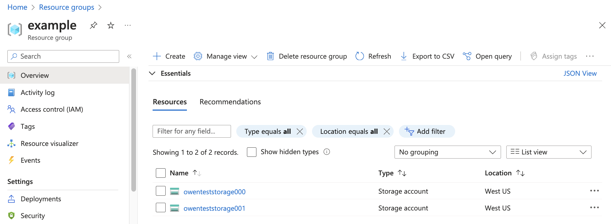

# Terraform on Azure

## Azure Provider

**Azurerm** 

https://registry.terraform.io/providers/hashicorp/azurerm/latest

main.tf

```
terraform {
  required_providers {
    azurerm = {
      source  = "hashicorp/azurerm"
      version = "3.99.0"
    }
  }
}

provider "azurerm" {
  # Configuration options
}
```

###### Rewrites all Terraform configuration files to a canonical format.

```
$ terraform fmt      
```

###### Validate the configuration files in a directory

```
$ terraform validate 
```

### Create resource group

main.tf

```
terraform {
  required_providers {
    azurerm = {
      source  = "hashicorp/azurerm"
      version = "3.99.0"
    }
  }
}

provider "azurerm" {
  features {
  }
}

resource "azurerm_resource_group" "example" {
  name     = "example"
  location = "eastus"
}
```

```
$  terraform apply 

Terraform used the selected providers to generate the following execution plan. Resource
actions are indicated with the following symbols:
  + create

Terraform will perform the following actions:

  # azurerm_resource_group.example will be created
  + resource "azurerm_resource_group" "example" {
      + id       = (known after apply)
      + location = "eastus"
      + name     = "example"
    }

Plan: 1 to add, 0 to change, 0 to destroy.

Do you want to perform these actions?
  Terraform will perform the actions described above.
  Only 'yes' will be accepted to approve.

  Enter a value: yes

azurerm_resource_group.example: Creating...
azurerm_resource_group.example: Creation complete after 6s [id=/subscriptions/2120c628-c057-48b9-ace5-14fddbf72365/resourceGroups/example]

Apply complete! Resources: 1 added, 0 changed, 0 destroyed.
```


### Variables

**main.tf**

```
terraform {
  required_providers {
    azurerm = {
      source  = "hashicorp/azurerm"
      version = "3.99.0"
    }
  }
}

provider "azurerm" {
  features {
  }
}

variable "azregion" {
  type = string
}

resource "azurerm_resource_group" "example" {
  name     = "example"
  location = var.azregion
}
```

```
$ terraform apply -var="azregion=eastus"
```

**terraform.tfvars**

```
azregion = "westus"
```

```
$ terraform apply -var="azregion=eastus"
```


## azurerm_storage_account

main.tf

```
terraform {
  required_providers {
    azurerm = {
      source  = "hashicorp/azurerm"
      version = "3.99.0"
    }
  }
}

provider "azurerm" {
  features {
  }
}

variable "azregion" {
  type = string
}

resource "azurerm_resource_group" "example" {
  name     = "example"
  location = var.azregion
}

resource "azurerm_storage_account" "mystorage" {
  name                     = "owenteststorage001"
  resource_group_name      = azurerm_resource_group.example.name
  location                 = azurerm_resource_group.example.location
  account_tier             = "Standard"
  account_replication_type = "GRS"

  tags = {
    environment = "staging"
  }
}
```


## Terraform Apply autoapprove

 Skip interactive approval of plan before applying.

```
$ terraform apply -auto-approve
```


## Locals

main.tf

```
terraform {
  required_providers {
    azurerm = {
      source  = "hashicorp/azurerm"
      version = "3.99.0"
    }
  }
}

provider "azurerm" {
  features {
  }
}

variable "azregion" {
  type = string
}

resource "azurerm_resource_group" "example" {
  name     = "example"
  location = var.azregion
}

locals {
  name = "Sherwin Adriano"
}

resource "azurerm_storage_account" "mystorage" {
  name                     = "owenteststorage001"
  resource_group_name      = azurerm_resource_group.example.name
  location                 = azurerm_resource_group.example.location
  account_tier             = "Standard"
  account_replication_type = "LRS"

  tags = {
    environment = "staging"
    owner = "Mr. ${local.name}"
  }
}
```


## Outputs

main.tf

```
terraform {
  required_providers {
    azurerm = {
      source  = "hashicorp/azurerm"
      version = "3.99.0"
    }
  }
}

provider "azurerm" {
  features {
  }
}

variable "azregion" {
  type = string
}

resource "azurerm_resource_group" "example" {
  name     = "example"
  location = var.azregion
}

locals {
  name = "Sherwin Adriano"
}

resource "azurerm_storage_account" "mystorage" {
  name                     = "owenteststorage001"
  resource_group_name      = azurerm_resource_group.example.name
  location                 = azurerm_resource_group.example.location
  account_tier             = "Standard"
  account_replication_type = "LRS"

  tags = {
    environment = "staging"
    owner = "Mr. ${local.name}"
  }
}

output "primarykey" {
    value = azurerm_storage_account.mystorage.primary_access_key
    sensitive = true
}
```

Update the state file of your infrastructure with metadata that matches the physical resources they are tracking.

```
$ terraform refresh
azurerm_resource_group.example: Refreshing state... [id=/subscriptions/2120c628-c057-48b9-ace5-14fddbf72365/resourceGroups/example]
azurerm_storage_account.mystorage: Refreshing state... [id=/subscriptions/2120c628-c057-48b9-ace5-14fddbf72365/resourceGroups/example/providers/Microsoft.Storage/storageAccounts/owenteststorage001]

Outputs:

primarykey = <sensitive>
```

Reads an output variable from a Terraform state file and prints the value.

```
$ terraform output 
primarykey = <sensitive>
```

main.tf

```
terraform {
  required_providers {
    azurerm = {
      source  = "hashicorp/azurerm"
      version = "3.99.0"
    }
  }
}

provider "azurerm" {
  features {
  }
}

variable "azregion" {
  type = string
}

resource "azurerm_resource_group" "example" {
  name     = "example"
  location = var.azregion
}

locals {
  name = "Sherwin Adriano"
}

resource "azurerm_storage_account" "mystorage" {
  name                     = "owenteststorage001"
  resource_group_name      = azurerm_resource_group.example.name
  location                 = azurerm_resource_group.example.location
  account_tier             = "Standard"
  account_replication_type = "LRS"

  tags = {
    environment = "staging"
    owner = "Mr. ${local.name}"
  }
}

output "primarykey" {
    value = azurerm_storage_account.mystorage.primary_access_key
    sensitive = true
}
```


```
$ terraform refresh    
azurerm_resource_group.example: Refreshing state... [id=/subscriptions/2120c628-c057-48b9-ace5-14fddbf72365/resourceGroups/example]
azurerm_storage_account.mystorage: Refreshing state... [id=/subscriptions/2120c628-c057-48b9-ace5-14fddbf72365/resourceGroups/example/providers/Microsoft.Storage/storageAccounts/owenteststorage001]

Outputs:

primaryblobhost = "owenteststorage001.blob.core.windows.net"
primarykey = <sensitive>
```


terraform.tfstate

```
{
  "version": 4,
  "terraform_version": "1.8.0",
  "serial": 28,
  "lineage": "4d24446e-dcc9-1389-275f-42d19650b3f6",
  "outputs": {
    "primaryblobhost": {
      "value": "owenteststorage001.blob.core.windows.net",
      "type": "string"
    },
    "primarykey": {
      "value": "VkSeR8ZLUhfbpcImGD39HpNjrxzfW4hE9SzaiSefw2P7Nh7Jupe9ERt6BFaCyUl1XyKTjA/Ufghv+ASte0xWgg==",
      "type": "string",
      "sensitive": true
    }
  },
```


## Using multiple files in Terraform

main.tf

```
resource "azurerm_resource_group" "example" {
  name     = "example"
  location = var.azregion
}

resource "azurerm_storage_account" "mystorage" {
  name                     = "owenteststorage001"
  resource_group_name      = azurerm_resource_group.example.name
  location                 = azurerm_resource_group.example.location
  account_tier             = "Standard"
  account_replication_type = "LRS"

  tags = {
    environment = "staging"
    owner = "Mr. ${local.name}"
  }
}
```

provider.tf

```
terraform {
  required_providers {
    azurerm = {
      source  = "hashicorp/azurerm"
      version = "3.99.0"
    }
  }
}

provider "azurerm" {
  features {
  }
}
```

variables.tf

```
variable "azregion" {
  type = string
}
```

Locals.tf

```
locals {
  name = "Sherwin Adriano"
}
```

Outputs.tf

```
output "primarykey" {
  value = azurerm_storage_account.mystorage[0].primary_access_key
  sensitive = true
}

output "primaryblobhost" {
  value = azurerm_storage_account.mystorage[1].primary_blob_host  
}
```

**Check if there are no chages** 

```
terraform plan
azurerm_resource_group.example: Refreshing state... [id=/subscriptions/2120c628-c057-48b9-ace5-14fddbf72365/resourceGroups/example]
azurerm_storage_account.mystorage: Refreshing state... [id=/subscriptions/2120c628-c057-48b9-ace5-14fddbf72365/resourceGroups/example/providers/Microsoft.Storage/storageAccounts/owenteststorage001]

No changes. Your infrastructure matches the configuration.

Terraform has compared your real infrastructure against your configuration
and found no differences, so no changes are needed.
```

## Destroy Terraform-managed infrastructure.

```
$ terraform destroy
```


## Create an Azure VM with Terraform

main.tf

```
resource "azurerm_resource_group" "example-rg" {
  name     = "example-rg"
  location = "eastus"
}

resource "azurerm_virtual_network" "example" {
  name                = "example-network"
  address_space       = ["10.0.0.0/16"]
  location            = azurerm_resource_group.example-rg.location
  resource_group_name = azurerm_resource_group.example-rg.name
}

resource "azurerm_subnet" "example" {
  name                 = "internal"
  resource_group_name  = azurerm_resource_group.example-rg.name
  virtual_network_name = azurerm_virtual_network.example.name
  address_prefixes     = ["10.0.2.0/24"]
}

resource "azurerm_network_interface" "example" {
  name                = "example-nic"
  location            = azurerm_resource_group.example-rg.location
  resource_group_name = azurerm_resource_group.example-rg.name

  ip_configuration {
    name                          = "internal"
    subnet_id                     = azurerm_subnet.example.id
    private_ip_address_allocation = "Dynamic"
  }
}

resource "azurerm_windows_virtual_machine" "example" {
  name                = "example-machine"
  resource_group_name = azurerm_resource_group.example-rg.name
  location            = azurerm_resource_group.example-rg .location
  size                = "Standard_F2"
  admin_username      = "adminuser"
  admin_password      = "P@$$w0rd1234!"
  network_interface_ids = [
    azurerm_network_interface.example.id,
  ]

  os_disk {
    caching              = "ReadWrite"
    storage_account_type = "Standard_LRS"
  }

  source_image_reference {
    publisher = "MicrosoftWindowsServer"
    offer     = "WindowsServer"
    sku       = "2016-Datacenter"
    version   = "latest"
  }
}
```

provisioner.tf

```
terraform {
  required_providers {
    azurerm = {
      source  = "hashicorp/azurerm"
      version = "3.99.0"
    }
  }
}

provider "azurerm" {
  features {
  }
}
```

```
$ terraform init

$ terraform plan

$ terraform apply
```


## Local Exec Provisioner

-  The local-exec provisioner invokes a local executable after a resource  is created. This invokes a process on the machine running Terraform, not on the resource.

main.tf

```
resource "azurerm_resource_group" "example-rg" {
  name     = "example-rg"
  location = "eastus"
}

resource "azurerm_virtual_network" "example" {
  name                = "example-network"
  address_space       = ["10.0.0.0/16"]
  location            = azurerm_resource_group.example-rg.location
  resource_group_name = azurerm_resource_group.example-rg.name
}

resource "azurerm_subnet" "example" {
  name                 = "internal"
  resource_group_name  = azurerm_resource_group.example-rg.name
  virtual_network_name = azurerm_virtual_network.example.name
  address_prefixes     = ["10.0.2.0/24"]
}

resource "azurerm_network_interface" "example" {
  name                = "example-nic"
  location            = azurerm_resource_group.example-rg.location
  resource_group_name = azurerm_resource_group.example-rg.name

  ip_configuration {
    name                          = "internal"
    subnet_id                     = azurerm_subnet.example.id
    private_ip_address_allocation = "Dynamic"
  }
}

resource "azurerm_windows_virtual_machine" "example" {
  name                = "example-machine"
  resource_group_name = azurerm_resource_group.example-rg.name
  location            = azurerm_resource_group.example-rg .location
  size                = "Standard_F2"
  admin_username      = "adminuser"
  admin_password      = "P@$$w0rd1234!"
  network_interface_ids = [
    azurerm_network_interface.example.id,
  ]

  os_disk {
    caching              = "ReadWrite"
    storage_account_type = "Standard_LRS"
  }

  source_image_reference {
    publisher = "MicrosoftWindowsServer"
    offer     = "WindowsServer"
    sku       = "2016-Datacenter"
    version   = "latest"
  }

  provisioner "local-exec" {
    command = "echo ${self.private_ip_address} >> private_ip.txt"
  }
}
```

```
$ terraform destroy

@ terraform apply -auto-approve
...
azurerm_windows_virtual_machine.example: Provisioning with 'local-exec'...
azurerm_windows_virtual_machine.example (local-exec): Executing: ["/bin/sh" "-c" "echo 10.0.2.4 >> private_ip.txt"]
azurerm_windows_virtual_machine.example: Creation complete after 1m16s [id=/subscriptions/2120c628-c057-48b9-ace5-14fddbf72365/resourceGroups/example-rg/providers/Microsoft.Compute/virtualMachines/example-machine]

Apply complete! Resources: 5 added, 0 changed, 0 destroyed.
```


## Remote Exec Provisioner 

- The remote-exec provisioner invokes a script on a remote resource after  it is created. This can be used to run a configuration management tool,  bootstrap into a cluster, etc.

**Azurerm_linux_virtual_machine with public IP**

main.tf

```
# Deploy Azure Linux Virtual Machine
resource "azurerm_resource_group" "example-rg" {
  name     = "example-rg"
  location = "eastus"
}
# Create virtual network
resource "azurerm_virtual_network" "example" {
  name                = "example-network"
  address_space       = ["10.0.0.0/16"]
  location            = azurerm_resource_group.example-rg.location
  resource_group_name = azurerm_resource_group.example-rg.name
}
# Create subnet
resource "azurerm_subnet" "example" {
  name                 = "internal"
  resource_group_name  = azurerm_resource_group.example-rg.name
  virtual_network_name = azurerm_virtual_network.example.name
  address_prefixes     = ["10.0.2.0/24"]
}

# Create public IPs
resource "azurerm_public_ip" "public_ip" {
  name                = "vm_public_ip"
  resource_group_name = azurerm_resource_group.example-rg.name
  location            = azurerm_resource_group.example-rg.location
  allocation_method   = "Dynamic"
}
# Create network interface
resource "azurerm_network_interface" "example" {
  name                = "example-nic"
  location            = azurerm_resource_group.example-rg.location
  resource_group_name = azurerm_resource_group.example-rg.name

  ip_configuration {
    name                          = "internal"
    subnet_id                     = azurerm_subnet.example.id
    private_ip_address_allocation = "Dynamic"
    public_ip_address_id = azurerm_public_ip.public_ip.id
  }
}
# Create Network Security Group and rule
resource "azurerm_network_security_group" "nsg" {
  name                = "ssh_nsg"
  location            = azurerm_resource_group.example-rg.location
  resource_group_name = azurerm_resource_group.example-rg.name

  security_rule {
    name                       = "allow_ssh_sg"
    priority                   = 100
    direction                  = "Inbound"
    access                     = "Allow"
    protocol                   = "Tcp"
    source_port_range          = "*"
    destination_port_range     = "22"
    source_address_prefix      = "*"
    destination_address_prefix = "*"
  }
}
# Connect the security group to the network interface
resource "azurerm_network_interface_security_group_association" "association" {
  network_interface_id      = azurerm_network_interface.example.id
  network_security_group_id = azurerm_network_security_group.nsg.id
}

resource "azurerm_linux_virtual_machine" "example" {
  name                = "example-machine"
  resource_group_name = azurerm_resource_group.example-rg.name
  location            = azurerm_resource_group.example-rg.location
  size                = "Standard_F2"
  admin_username      = "adminuser"
  disable_password_authentication = true
  network_interface_ids = [
    azurerm_network_interface.example.id,
  ]

  admin_ssh_key {
    username   = "adminuser"
    public_key = file("~/.ssh/id_rsa.pub")
  }

  os_disk {
    caching              = "ReadWrite"
    storage_account_type = "Standard_LRS"
  }

  source_image_reference {
    publisher = "Canonical"
    offer     = "0001-com-ubuntu-server-jammy"
    sku       = "22_04-lts"
    version   = "latest"
  }

  provisioner "remote-exec" {
    inline = [ 
      "sudo apt update -y",
      "echo linuxbox updated >> linuxbox-status.txt"
     ]
    connection {
      host = self.public_ip_address
      type = "ssh"
      user = azurerm_linux_virtual_machine.example.admin_username
      private_key = file("~/.ssh/id_rsa")
    }
  }
}
```

## File Provisioner

- The file provisioner is used to copy files or directories from the  machine executing Terraform to the newly created resource. The file  provisioner supports both ssh and winrm type connections.

main.tf

```
# Deploy Azure Linux Virtual Machine
resource "azurerm_resource_group" "example-rg" {
  name     = "example-rg"
  location = "eastus"
}
# Create virtual network
resource "azurerm_virtual_network" "example" {
  name                = "example-network"
  address_space       = ["10.0.0.0/16"]
  location            = azurerm_resource_group.example-rg.location
  resource_group_name = azurerm_resource_group.example-rg.name
}
# Create subnet
resource "azurerm_subnet" "example" {
  name                 = "internal"
  resource_group_name  = azurerm_resource_group.example-rg.name
  virtual_network_name = azurerm_virtual_network.example.name
  address_prefixes     = ["10.0.2.0/24"]
}

# Create public IPs
resource "azurerm_public_ip" "public_ip" {
  name                = "vm_public_ip"
  resource_group_name = azurerm_resource_group.example-rg.name
  location            = azurerm_resource_group.example-rg.location
  allocation_method   = "Dynamic"
}
# Create network interface
resource "azurerm_network_interface" "example" {
  name                = "example-nic"
  location            = azurerm_resource_group.example-rg.location
  resource_group_name = azurerm_resource_group.example-rg.name

  ip_configuration {
    name                          = "internal"
    subnet_id                     = azurerm_subnet.example.id
    private_ip_address_allocation = "Dynamic"
    public_ip_address_id = azurerm_public_ip.public_ip.id
  }
}
# Create Network Security Group and rule
resource "azurerm_network_security_group" "nsg" {
  name                = "ssh_nsg"
  location            = azurerm_resource_group.example-rg.location
  resource_group_name = azurerm_resource_group.example-rg.name

  security_rule {
    name                       = "allow_ssh_sg"
    priority                   = 100
    direction                  = "Inbound"
    access                     = "Allow"
    protocol                   = "Tcp"
    source_port_range          = "*"
    destination_port_range     = "22"
    source_address_prefix      = "*"
    destination_address_prefix = "*"
  }
}
# Connect the security group to the network interface
resource "azurerm_network_interface_security_group_association" "association" {
  network_interface_id      = azurerm_network_interface.example.id
  network_security_group_id = azurerm_network_security_group.nsg.id
}

resource "azurerm_linux_virtual_machine" "example" {
  name                = "example-machine"
  resource_group_name = azurerm_resource_group.example-rg.name
  location            = azurerm_resource_group.example-rg.location
  size                = "Standard_F2"
  admin_username      = "adminuser"
  disable_password_authentication = true
  network_interface_ids = [
    azurerm_network_interface.example.id,
  ]

  admin_ssh_key {
    username   = "adminuser"
    public_key = file("~/.ssh/id_rsa.pub")
  }

  os_disk {
    caching              = "ReadWrite"
    storage_account_type = "Standard_LRS"
  }

  source_image_reference {
    publisher = "Canonical"
    offer     = "0001-com-ubuntu-server-jammy"
    sku       = "22_04-lts"
    version   = "latest"
  }
  provisioner "file" {
    source = "sherwin-src.txt"
    destination = "sherwin-des.txt"
    connection {
      host = self.public_ip_address
      type = "ssh"
      user = azurerm_linux_virtual_machine.example.admin_username
      private_key = file("~/.ssh/id_rsa")
    }
  }
}
```


## Using Null Resources

-  is similar to a standard resource. It adheres to the resource lifecycle model and serves as a placeholder for executing arbitrary actions  within Terraform configurations without actually provisioning any  physical resources. However, it does not perform any further actions  beyond initialization

- The null_resource is useful for  executing standard operations that do not require provisioning an actual resource. It can be declared as a simple resource block and used in [Terraform modules](https://spacelift.io/blog/what-are-terraform-modules-and-how-do-they-work) and other resources that depend on null resources. 

```
$ az vm get-instance-view --name example-machine --resource-group example-rg --query 'instanceView.statuses[1]' --output table
Code                Level    DisplayStatus
------------------  -------  ---------------
PowerState/running  Info     VM running
```

main.tf

```
# Deploy Azure Linux Virtual Machine
resource "azurerm_resource_group" "example-rg" {
  name     = "example-rg"
  location = "eastus"
}
# Create virtual network
resource "azurerm_virtual_network" "example" {
  name                = "example-network"
  address_space       = ["10.0.0.0/16"]
  location            = azurerm_resource_group.example-rg.location
  resource_group_name = azurerm_resource_group.example-rg.name
}
# Create subnet
resource "azurerm_subnet" "example" {
  name                 = "internal"
  resource_group_name  = azurerm_resource_group.example-rg.name
  virtual_network_name = azurerm_virtual_network.example.name
  address_prefixes     = ["10.0.2.0/24"]
}

# Create public IPs
resource "azurerm_public_ip" "public_ip" {
  name                = "vm_public_ip"
  resource_group_name = azurerm_resource_group.example-rg.name
  location            = azurerm_resource_group.example-rg.location
  allocation_method   = "Dynamic"
}
# Create network interface
resource "azurerm_network_interface" "example" {
  name                = "example-nic"
  location            = azurerm_resource_group.example-rg.location
  resource_group_name = azurerm_resource_group.example-rg.name

  ip_configuration {
    name                          = "internal"
    subnet_id                     = azurerm_subnet.example.id
    private_ip_address_allocation = "Dynamic"
    public_ip_address_id = azurerm_public_ip.public_ip.id
  }
}
# Create Network Security Group and rule
resource "azurerm_network_security_group" "nsg" {
  name                = "ssh_nsg"
  location            = azurerm_resource_group.example-rg.location
  resource_group_name = azurerm_resource_group.example-rg.name

  security_rule {
    name                       = "allow_ssh_sg"
    priority                   = 100
    direction                  = "Inbound"
    access                     = "Allow"
    protocol                   = "Tcp"
    source_port_range          = "*"
    destination_port_range     = "22"
    source_address_prefix      = "*"
    destination_address_prefix = "*"
  }
}
# Connect the security group to the network interface
resource "azurerm_network_interface_security_group_association" "association" {
  network_interface_id      = azurerm_network_interface.example.id
  network_security_group_id = azurerm_network_security_group.nsg.id
}

resource "azurerm_linux_virtual_machine" "example" {
  name                = "example-machine"
  resource_group_name = azurerm_resource_group.example-rg.name
  location            = azurerm_resource_group.example-rg.location
  size                = "Standard_F2"
  admin_username      = "adminuser"
  disable_password_authentication = true
  network_interface_ids = [
    azurerm_network_interface.example.id,
  ]

  admin_ssh_key {
    username   = "adminuser"
    public_key = file("~/.ssh/id_rsa.pub")
  }

  os_disk {
    caching              = "ReadWrite"
    storage_account_type = "Standard_LRS"
  }

  source_image_reference {
    publisher = "Canonical"
    offer     = "0001-com-ubuntu-server-jammy"
    sku       = "22_04-lts"
    version   = "latest"
  }
  }

  resource "null_resource" "status" {
    provisioner "local-exec" {
      command = "az vm get-instance-view --name example-machine --resource-group example-rg --query 'instanceView.statuses[1]' --output table"
    }
    depends_on = [ 
      azurerm_linux_virtual_machine.example 
    ]
  }
```

```
$ terraform init -upgrade
```

```
$ terraform apply -replace=azurerm_linux_virtual_machine.example
...
null_resource.status: Creating...
null_resource.status: Provisioning with 'local-exec'...
null_resource.status (local-exec): Executing: ["/bin/sh" "-c" "az vm get-instance-view --name example-machine --resource-group example-rg --query 'instanceView.statuses[1]' --output table"]
null_resource.status (local-exec): Code                Level    DisplayStatus
null_resource.status (local-exec): ------------------  -------  ---------------
null_resource.status (local-exec): PowerState/running  Info     VM running
null_resource.status: Creation complete after 2s [id=3036896430481140254]

Apply complete! Resources: 2 added, 0 changed, 1 destroyed.
```


## Data Source: azurerm_resource_group

- Use this data source to access information about an existing Resource Group.

main.tf

```
data "azurerm_resource_group" "NewRG" {
  name = "example-rg"
}
resource "azurerm_storage_account" "mystorage" {
  name                     = "owenteststorage001"
  resource_group_name      = data.azurerm_resource_group.NewRG.name
  location                 = data.azurerm_resource_group.NewRG.location
  account_tier             = "Standard"
  account_replication_type = "LRS"
  
  tags = {
    environment = "staging"
    owner = "Sherwin"
  }
}
```


# 04-HCL

## HCL Language

## Using Count

main.tf

```
resource "azurerm_resource_group" "example" {
  name     = "example"
  location = var.azregion
}

resource "azurerm_storage_account" "mystorage" {
  count = 2
  name                     = "owenteststorage00${count.index}"
  resource_group_name      = azurerm_resource_group.example.name
  location                 = azurerm_resource_group.example.location
  account_tier             = "Standard"
  account_replication_type = "LRS"

  tags = {
    environment = "staging"
    owner = "Mr. ${local.name}"
  }
}
```

Outputs.tf

```
output "primarykey" {
  value = azurerm_storage_account.mystorage[0].primary_access_key
  sensitive = true
}

output "primaryblobhost" {
  value = azurerm_storage_account.mystorage[1].primary_blob_host  
}
```




## Using ForEach

Main.tf

```
resource "azurerm_resource_group" "example" {
  name     = "example"
  location = var.azregion
}

resource "azurerm_storage_account" "mystorage" {
  for_each = {
    lrs = "LRS"
    grs = "GRS"
  }
  name                     = "owenteststorage${each.key}"
  resource_group_name      = azurerm_resource_group.example.name
  location                 = azurerm_resource_group.example.location
  account_tier             = "Standard"
  account_replication_type = each.value

  tags = {
    environment = "staging"
    owner = "Mr. ${local.name}"
  }  
}

```

Outputs.tf

```
output "primarykey" {
  value = values(azurerm_storage_account.mystorage)[0].primary_access_key
  sensitive = true
}

output "primaryblobhost" {
  value = values(azurerm_storage_account.mystorage)[1].primary_blob_host  
}
```


## Terraform Lifecycle

https://developer.hashicorp.com/terraform/language/meta-arguments/lifecycle

Sample prevent destroy

main.tf

```
resource "azurerm_resource_group" "example" {
  name     = "example"
  location = var.azregion
}

resource "azurerm_storage_account" "mystorage" {
  for_each = {
    lrs = "LRS"
    grs = "GRS"
  }
  name                     = "owenteststorage${each.key}"
  resource_group_name      = azurerm_resource_group.example.name
  location                 = azurerm_resource_group.example.location
  account_tier             = "Standard"
  account_replication_type = each.value
  
  # Prevent destroy 
  lifecycle {
    prevent_destroy = true
  }

  tags = {
    environment = "staging"
    owner = "Mr. ${local.name}"
  }  
}
```

```
$ terraform destroy
...
Error: Instance cannot be destroyed
│ 
│   on main.tf line 18:
│   18: resource "azurerm_storage_account" "mystorage" {
│ 
│ Resource azurerm_storage_account.mystorage["lrs"] has lifecycle.prevent_destroy set, but
│ the plan calls for this resource to be destroyed. To avoid this error and continue with the
│ plan, either disable lifecycle.prevent_destroy or reduce the scope of the plan using the
│ -target option.
╵
╷
│ Error: Instance cannot be destroyed
│ 
│   on main.tf line 18:
│   18: resource "azurerm_storage_account" "mystorage" {
│ 
│ Resource azurerm_storage_account.mystorage["grs"] has lifecycle.prevent_destroy set, but
│ the plan calls for this resource to be destroyed. To avoid this error and continue with the
│ plan, either disable lifecycle.prevent_destroy or reduce the scope of the plan using the
│ -target option.
```

## Dynamic Blocks

- are a special Terraform block type that provide the functionality of a [for expression](https://www.terraform.io/language/expressions/for) by creating multiple nested blocks. 

### **Key benefits of Terraform dynamic blocks**

The key benefits of Terraform dynamic blocks are: 

- **Speed** – simplifying the code makes it much quicker  to write and also for it to be processed and thus for the infrastructure to be deployed.
- **Clarity** – in contrast to multiple blocks of repetitive code, it’s much easier to read and understand code written using dynamic blocks.
- **Re-use** – copying, pasting, and amending large  blocks of code is difficult and tedious. Combine dynamic blocks and  variables/parameters to streamline this process.
- **Reliability** – linked to clarity and re-use, errors are less likely to be made in simple, easy-to-read code.

nsg.tf

```
locals {
  nsg-rules = [{
    name                       = "rule1"
    priority                   = 100
    direction                  = "Inbound"
    access                     = "Allow"
    protocol                   = "Tcp"
    source_port_range          = "*"
    destination_port_range     = "80"
    source_address_prefix      = "*"
    destination_address_prefix = "*"
    },
    {
      name                       = "rule2"
      priority                   = 101
      direction                  = "Inbound"
      access                     = "Allow"
      protocol                   = "Tcp"
      source_port_range          = "*"
      destination_port_range     = "443"
      source_address_prefix      = "*"
      destination_address_prefix = "*"
  }]
}

resource "azurerm_network_security_group" "nsg" {
  name                = "owen-nsg"
  location            = azurerm_resource_group.example.location
  resource_group_name = azurerm_resource_group.example.name

  dynamic "security_rule" {
    for_each = local.nsg-rules
    content {
      name                       = security_rule.value.name
      priority                   = security_rule.value.priority
      direction                  = security_rule.value.direction
      access                     = security_rule.value.access
      protocol                   = security_rule.value.protocol
      source_port_range          = security_rule.value.source_port_range
      destination_port_range     = security_rule.value.destination_port_range
      source_address_prefix      = security_rule.value.source_address_prefix
      destination_address_prefix = security_rule.value.destination_address_prefix
    }
  }
}
```


## Using Builßt-in Functions

https://developer.hashicorp.com/terraform/language/functions

- The Terraform language includes a number of built-in functions that you can call from within expressions to transform and combine values. The general syntax for function calls is a function name followed by comma-separated arguments in parentheses.

```
terraform console
> lower("SHERWIN")
"sherwin"
> upper("sherwin")
"SHERWIN"
>split(",","Sherwin,Ana,Reine,Lesyl,Shen")
tolist([
  "Sherwin",
  "Ana",
  "Reine",
  "Lesyl",
  "Shen",
> distinct(["a", "b", "a", "c", "d", "b"])
tolist([
  "a",
  "b",
  "c",
  "d",
  
> abspath(path.root)
"/Users/sherwinowen/my_doc/owen-git/terraforn-on-azure/04-HCL"

> bcrypt("password1")
"$2a$10$.TeAiIO6SKAvWy7NlkpFG.zxZk8yonSJJqsJDtoYIxifFoyfyFGWe"

> uuid()
"506444bc-4fc8-1a63-4c0e-3bb641c12296"
```

### flatten Function

`flatten` takes a list and replaces any elements that are lists with a flattened sequence of the list contents.

**Examples**

```mdx-code-blocks_codeBlockMargin__xk4yr
> flatten([["a", "b"], [], ["c"]])
["a", "b", "c"]
```

### coalesce Function

`coalesce` takes any number of arguments and returns the first one that isn't null or an empty string.

All of the arguments must be of the same type. Terraform will try to convert mismatched arguments to the most general of the types that all arguments can convert to, or return an error if the types are incompatible. The result type is the same as the type of all of the arguments.

**Examples**

```mdx-code-blocks_codeBlockMargin__xk4yr
> coalesce("a", "b")
a
> coalesce("", "b")
b
> coalesce(1,2)
1
```

###  cidrhost Function

`cidrhost` calculates a full host IP address for a given host number within a given IP network address prefix.

**Example**

```
> cidrhost("10.12.112.0/20", 16)
10.12.112.16
> cidrhost("10.12.112.0/20", 268)
10.12.113.12
> cidrhost("fd00:fd12:3456:7890:00a2::/72", 34)
fd00:fd12:3456:7890::22

```


## Terraform state

main.tf

```
# Deploy Azure Windows Virtual Machine
resource "azurerm_resource_group" "example-rg" {
  name     = "example-rg"
  location = "eastus"
}

resource "azurerm_virtual_network" "example" {
  name                = "example-network"
  address_space       = ["10.0.0.0/16"]
  location            = azurerm_resource_group.example-rg.location
  resource_group_name = azurerm_resource_group.example-rg.name
}

resource "azurerm_subnet" "example" {
  name                 = "internal"
  resource_group_name  = azurerm_resource_group.example-rg.name
  virtual_network_name = azurerm_virtual_network.example.name
  address_prefixes     = ["10.0.2.0/24"]
}

resource "azurerm_network_interface" "example" {
  name                = "example-nic"
  location            = azurerm_resource_group.example-rg.location
  resource_group_name = azurerm_resource_group.example-rg.name

  ip_configuration {
    name                          = "internal"
    subnet_id                     = azurerm_subnet.example.id
    private_ip_address_allocation = "Dynamic"
  }
}

resource "azurerm_windows_virtual_machine" "example" {
  name                = "example-machine"
  resource_group_name = azurerm_resource_group.example-rg.name
  location            = azurerm_resource_group.example-rg .location
  size                = "Standard_F2"
  admin_username      = "adminuser"
  admin_password      = "P@$$w0rd1234!"
  network_interface_ids = [
    azurerm_network_interface.example.id,
  ]

  os_disk {
    caching              = "ReadWrite"
    storage_account_type = "Standard_LRS"
  }

  source_image_reference {
    publisher = "MicrosoftWindowsServer"
    offer     = "WindowsServer"
    sku       = "2016-Datacenter"
    version   = "latest"
  }
}
```

```
$ terraform state list
azurerm_network_interface.example
azurerm_resource_group.example-rg
azurerm_subnet.example
azurerm_virtual_network.example
azurerm_windows_virtual_machine.example
```

```
$ terraform state show azurerm_subnet.example
# azurerm_subnet.example:
resource "azurerm_subnet" "example" {
    address_prefixes                               = [
        "10.0.2.0/24",
    ]
    enforce_private_link_endpoint_network_policies = false
    enforce_private_link_service_network_policies  = false
    id                                             = "/subscriptions/2120c628-c057-48b9-ace5-14fddbf72365/resourceGroups/example-rg/providers/Microsoft.Network/virtualNetworks/example-network/subnets/internal"
    name                                           = "internal"
    private_endpoint_network_policies_enabled      = true
    private_link_service_network_policies_enabled  = true
    resource_group_name                            = "example-rg"
    virtual_network_name                           = "example-network"
}
```

```
$ terraform state mv azurerm_subnet.example azurerm_subnet.owen-subnet
Move "azurerm_subnet.example" to "azurerm_subnet.owen-subnet"
Successfully moved 1 object(s).
```

```
$ terraform state list       
azurerm_network_interface.example
azurerm_resource_group.example-rg
azurerm_subnet.owen-subnet
azurerm_virtual_network.example
azurerm_windows_virtual_machine.example
```

## Terraform drift

### terraform apply replace

main.tf

```
# Deploy Azure Windows Virtual Machine
resource "azurerm_resource_group" "example-rg" {
  name     = "example-rg"
  location = "eastus"
}

resource "azurerm_virtual_network" "example" {
  name                = "example-network"
  address_space       = ["10.0.0.0/16"]
  location            = azurerm_resource_group.example-rg.location
  resource_group_name = azurerm_resource_group.example-rg.name
}

resource "azurerm_subnet" "owen-subnet" {
  name                 = "internal"
  resource_group_name  = azurerm_resource_group.example-rg.name
  virtual_network_name = azurerm_virtual_network.example.name
  address_prefixes     = ["10.0.2.0/24"]
}

resource "azurerm_network_interface" "example" {
  name                = "example-nic"
  location            = azurerm_resource_group.example-rg.location
  resource_group_name = azurerm_resource_group.example-rg.name

  ip_configuration {
    name                          = "internal"
    subnet_id                     = azurerm_subnet.owen-subnet.id
    private_ip_address_allocation = "Dynamic"
  }
}

resource "azurerm_windows_virtual_machine" "example" {
  name                = "example-machine"
  resource_group_name = azurerm_resource_group.example-rg.name
  location            = azurerm_resource_group.example-rg .location
  size                = "Standard_F2"
  admin_username      = "adminuser"
  admin_password      = "P@$$w0rd1234!"
  network_interface_ids = [
    azurerm_network_interface.example.id,
  ]

  os_disk {
    caching              = "ReadWrite"
    storage_account_type = "Standard_LRS"
  }

  source_image_reference {
    publisher = "MicrosoftWindowsServer"
    offer     = "WindowsServer"
    sku       = "2016-Datacenter"
    version   = "latest"
  }
}
```

provider.tf

```
terraform {
  required_providers {
    azurerm = {
      source  = "hashicorp/azurerm"
      version = "3.99.0"
    }
  }
}

provider "azurerm" {
  features {
  }
}
```


```
$ terraform apply -replace=azurerm_windows_virtual_machine.example
```


### terraform apply refresh

Delete azurerm_windows_virtual_machine.example in Azure console

- Use refresh-only mode to sync Terraform state

```
$ terraform apply -refresh-only
```


### terraform import

Create placeholder in main.tf

```
# Deploy Azure Windows Virtual Machine
resource "azurerm_resource_group" "example-rg" {
  name     = "example-rg"
  location = "eastus"
}

resource "azurerm_virtual_network" "example" {
  name                = "example-network"
  address_space       = ["10.0.0.0/16"]
  location            = azurerm_resource_group.example-rg.location
  resource_group_name = azurerm_resource_group.example-rg.name
}

resource "azurerm_subnet" "owen-subnet" {
  name                 = "internal"
  resource_group_name  = azurerm_resource_group.example-rg.name
  virtual_network_name = azurerm_virtual_network.example.name
  address_prefixes     = ["10.0.2.0/24"]
}

resource "azurerm_network_interface" "example" {
  name                = "example-nic"
  location            = azurerm_resource_group.example-rg.location
  resource_group_name = azurerm_resource_group.example-rg.name

  ip_configuration {
    name                          = "internal"
    subnet_id                     = azurerm_subnet.owen-subnet.id
    private_ip_address_allocation = "Dynamic"
  }
}

resource "azurerm_windows_virtual_machine" "example" {
  name                = "example-machine"
  resource_group_name = azurerm_resource_group.example-rg.name
  location            = azurerm_resource_group.example-rg .location
  size                = "Standard_F2"
  admin_username      = "adminuser"
  admin_password      = "P@$$w0rd1234!"
  network_interface_ids = [
    azurerm_network_interface.example.id,
  ]

  os_disk {
    caching              = "ReadWrite"
    storage_account_type = "Standard_LRS"
  }

  source_image_reference {
    publisher = "MicrosoftWindowsServer"
    offer     = "WindowsServer"
    sku       = "2016-Datacenter"
    version   = "latest"
  }
}

resource "azurerm_storage_account" "mystorage" {
  name = "owenstorageterraform"
}
```


- Goto StorageAccount > Settings > Endpoint 

- Get the Storage account resource ID

```
$ terraform import azurerm_storage_account.mystora
ge [Storage account resource ID]
```

```
$ terraform import azurerm_storage_account.mystora
ge /subscriptions/2120c628-c057-48b9-ace5-14fddbf72365/resourceGroups/example-rg/providers/Microsoft.Storage/storageAccounts/owenstorageterraform
```

After the import modify main.,tf add the arguments needed

```
# Deploy Azure Windows Virtual Machine
resource "azurerm_resource_group" "example-rg" {
  name     = "example-rg"
  location = "eastus"
}

resource "azurerm_virtual_network" "example" {
  name                = "example-network"
  address_space       = ["10.0.0.0/16"]
  location            = azurerm_resource_group.example-rg.location
  resource_group_name = azurerm_resource_group.example-rg.name
}

resource "azurerm_subnet" "owen-subnet" {
  name                 = "internal"
  resource_group_name  = azurerm_resource_group.example-rg.name
  virtual_network_name = azurerm_virtual_network.example.name
  address_prefixes     = ["10.0.2.0/24"]
}

resource "azurerm_network_interface" "example" {
  name                = "example-nic"
  location            = azurerm_resource_group.example-rg.location
  resource_group_name = azurerm_resource_group.example-rg.name

  ip_configuration {
    name                          = "internal"
    subnet_id                     = azurerm_subnet.owen-subnet.id
    private_ip_address_allocation = "Dynamic"
  }
}

resource "azurerm_windows_virtual_machine" "example" {
  name                = "example-machine"
  resource_group_name = azurerm_resource_group.example-rg.name
  location            = azurerm_resource_group.example-rg .location
  size                = "Standard_F2"
  admin_username      = "adminuser"
  admin_password      = "P@$$w0rd1234!"
  network_interface_ids = [
    azurerm_network_interface.example.id,
  ]

  os_disk {
    caching              = "ReadWrite"
    storage_account_type = "Standard_LRS"
  }

  source_image_reference {
    publisher = "MicrosoftWindowsServer"
    offer     = "WindowsServer"
    sku       = "2016-Datacenter"
    version   = "latest"
  }
}

resource "azurerm_storage_account" "mystorage" {
  name = "owenstorageterraform"
  resource_group_name      = "example-rg"
  location                 = azurerm_resource_group.example-rg.location
  account_tier             = "Standard"
  account_replication_type = "LRS"
}
```

# 07-Modules

## Terraform Module

Module Folder

- Create folder OwenModule

main.tf

```
resource "azurerm_resource_group" "example" {
  name     = "example"
  location = var.azregion
}

resource "azurerm_storage_account" "mystorage" {
  name                     = "owenteststorage001"
  resource_group_name      = azurerm_resource_group.example.name
  location                 = azurerm_resource_group.example.location
  account_tier             = var.accesstier
  account_replication_type = var.replicationtype

  tags = {
    environment = "staging"
    owner = "Mr. ${local.name}"
  }
}

output "primarykey" {
  value = azurerm_storage_account.mystorage.primary_access_key
  sensitive = true
}
```

variables.tf

```
variable "azregion" {
  type = string
  description = "This is the Azure Region"
  default = "EastUs"
}

variable "storagename" {
  type = string
  description = "This is the Azure Storage Name"
  default = "owenstorageacc001"
}

variable "accesstier" {
  type = string
  description = "This is the Azure Access Tier"
  default = "Standard"
}

variable "replicationtype" {
  type = string
  description = "This is the Azure Storage Replication Type"
  default = "LRS"
}
```

Locals.tf

```
locals {
  name = "Sherwin Adriano"
}
```

Main folder

main.tf

```
module "owenmodule" {
  source = "./OwenModule"
}

output "resource_primary_key" {
  value = module.owenmodule.primarykey
  sensitive = true
}
```

provider.tf

```
terraform {
  required_providers {
    azurerm = {
      source  = "hashicorp/azurerm"
      version = "3.99.0"
    }
  }
}

provider "azurerm" {
  features {
  }
}
```

Notice: There is initialization in module

```
$ terraform init 

Initializing the backend...
Initializing modules...
- owenmodule in OwenModule

Initializing provider plugins...
- Finding hashicorp/azurerm versions matching "3.99.0"...
- Installing hashicorp/azurerm v3.99.0...
- Installed hashicorp/azurerm v3.99.0 (signed by HashiCorp)

Terraform has created a lock file .terraform.lock.hcl to record the provider
selections it made above. Include this file in your version control repository
so that Terraform can guarantee to make the same selections by default when
you run "terraform init" in the future.

Terraform has been successfully initialized!

You may now begin working with Terraform. Try running "terraform plan" to see
any changes that are required for your infrastructure. All Terraform commands
should now work.
```

## Terraform Module Registry 

**Terraform Azure RM Compute Module**

https://registry.terraform.io/modules/Azure/compute/azurerm/latest?tab=inputs

compute.tf

```
data "azurerm_subnet" "subnet" {
  resource_group_name = "example"
  name = "subnet1"
  virtual_network_name = "example-network"
}

module "compute" {
  source  = "Azure/compute/azurerm"
  version = "5.3.0"
  # insert the 2 required variables here
   resource_group_name = "example"
   vnet_subnet_id = data.azurerm_subnet.subnet.id
   is_windows_image = true
   vm_os_simple = "WindowsServer"
   availability_set_enabled = false
   admin_username = "owenadmin"
   admin_password = "[Abcd@1234]"
}
```

# 08-PublicModule

## Terraform with Github for module

1. Create the follwing files:

- LICENSE
- Readme.md
- .gitignore


2. Create repository in GitHub

```

$ git add .
$ git commit -m "My first commit"
$ git branch -M main
$ git remote add origin git@github.com:sherwin-ad/TerraformSherwinOwenModule.git
$ git push -u origin main
```

**Terraform Module Sources**

https://developer.hashicorp.com/terraform/language/modules/sources

testgithubmodule.tf

```
module "mySherwinOwen" {
  source = "github.com/sherwin-ad/TerraformSherwinOwenModule.git"
  azregion = "eastus"
}
```


## Terraform Module Publication

https://developer.hashicorp.com/terraform/registry/modules/publish

### Requirements

The list below contains all the requirements for publishing a module:

- **GitHub.** The module must be on GitHub and must be a public repo. This is only a requirement for the [public registry](https://registry.terraform.io). If you're using a private registry, you may ignore this requirement.
- **Named `terraform-<PROVIDER>-<NAME>`.** Module repositories must use this three-part name format, where `<NAME>` reflects the type of infrastructure the module manages and `<PROVIDER>` is the main provider where it creates that infrastructure. The `<NAME>` segment can contain additional hyphens. Examples: `terraform-google-vault` or `terraform-aws-ec2-instance`.
- **Repository description.** The GitHub repository description is used to populate the short description of the module. This should be a simple one sentence description of the module.
- **Standard module structure.** The module must adhere to the [standard module structure](https://developer.hashicorp.com/terraform/language/modules/develop/structure). This allows the registry to inspect your module and generate documentation, track resource usage, parse submodules and examples, and more.
- **`x.y.z` tags for releases.** The registry uses tags to identify module versions. Release tag names must be a [semantic version](http://semver.org), which can optionally be prefixed with a `v`. For example, `v1.0.4` and `0.9.2`. To publish a module initially, at least one release tag must be present. Tags that don't look like version numbers are ignored.

### Publish a Terraform module you have to follow the steps below:

1. Create your Terraform module configuration.
2. Create a GitHub repository for your module in the following format – terraform-<Provider_Name>-<Module_Name>.
3. Push the content of your module configuration to the created repository.
4. Create a tag for your repository.
5. Go to the [Terraform registry](https://registry.terraform.io) and sign in with GitHub.
6. Click on publish and select module.
7. Select that GitHub repository.
8. Success, your module has been published!

# 09-Backends

## Terraform Local Backend

provider.tf

```
terraform {
  required_providers {
    azurerm = {
      source  = "hashicorp/azurerm"
      version = "3.99.0"
    }
  }
  backend "local" {
    path = "./secret/terraform.tfstate"
  }
}

provider "azurerm" {
  features {
  }
}
```


## Terraform Azure Backend

provider.tf

```
terraform {
  required_providers {
    azurerm = {
      source  = "hashicorp/azurerm"
      version = "3.99.0"
    }
  }
  /* backend "local" {
    path = "./secret/terraform.tfstate" 
  } */
  backend "azurerm" {
    resource_group_name = "mytfstateorg"
    storage_account_name = "mytfstatesa"
    container_name = "mytfstatecon"
    key = "terraform.tfstate"
  }
}

provider "azurerm" {
  features {
  }
}
```

